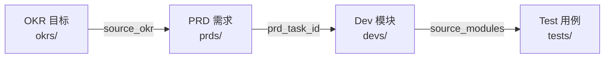

# 2026-09 开发模块索引

> 开发方案文档——描述 HOW（实现方案、架构设计、技术决策），从产品需求 PRD 中拆出。完整追溯链：**OKR → PRD → Dev Module → Test**

<a id="sec-1"></a>
## 一、全链路可追溯矩阵



| Module ID | 标题 | 状态 | 来源 OKR | 来源 PRD | 关联测试 |
|-----------|------|------|----------|----------|----------|
| YV-09-01-0 | [九月架构设计](./00-module-九月架构设计.md) | 已完成 | yivad-001 | YV-09-01 | — |
| YV-09-01-1 | [Detail Tab 组件拆分](./01-module-组件拆分.md) | 已完成 | yivad-001 | YV-09-01 | YV-09-22 |
| YV-09-01-2 | [useProjectInsights 分层](./02-module-composable分层.md) | 已完成 | yivad-001 | YV-09-01 | YV-09-22 |
| YV-09-01-3 | [Docs Tab 功能实现](./03-module-文档标签页.md) | 已完成 | yivad-001 | YV-09-01 | — |
| YV-09-01-4 | [Tab 独立加载状态](./04-module-加载状态.md) | 已完成 | yivad-002 | YV-09-01 | — |
| YV-09-01-6 | [Project 页面国际化](./06-module-国际化.md) | 已完成 | yivad-002 | YV-09-01 | — |
| YV-09-01-9 | [样式效果改造](./09-module-样式改造.md) | 进行中 | yivad-001 | YV-09-01 | — |
| YV-09-01-10 | [RSS Content 优化](./10-module-RSS优化.md) | 已完成 | yivad-001 | YV-09-01 | — |
| YV-09-01-11 | [AI Chat 优化](./11-module-AI聊天优化.md) | 需求已编写 | yivad-001 | YV-09-01 | — |
| YV-09-01-12 | [Knowledge 页面优化](./12-module-Knowledge优化.md) | 已完成 | yivad-002 | YV-09-01 | — |
| YV-09-01-13 | [Issue 页面优化](./13-module-Issue优化.md) | 已完成 | yivad-001 | YV-09-01 | — |
| YV-09-01-14 | [RAG 页面优化](./17-module-RAG页面优化.md) | 已完成 | yivad-001 | YV-09-01 | — |
| YV-09-01-15 | [Module 页面优化](./18-module-Module页面优化.md) | 已完成 | yivad-001 | YV-09-01 | — |
| YV-09-01-16 | [Bug 页面优化](./19-module-Bug页面优化.md) | 已完成 | yivad-001 | YV-09-01 | — |
| YV-09-01-17 | [Kanban 页面优化](./20-module-Kanban页面优化.md) | 已完成 | yivad-001 | YV-09-01 | — |
| YV-09-01-18 | [Roadmap 页面优化](./21-module-Roadmap页面优化.md) | 已完成 | yivad-001 | YV-09-01 | — |
| YV-09-01-19 | [全局搜索页面优化](./22-module-全局搜索页面优化.md) | 已完成 | yivad-001 | YV-09-01 | — |
| YV-09-01-20 | [项目健康大盘](./20-module-健康大盘.md) | 已完成 | yivad-001 | YV-09-01 | — |
| YV-09-01-21 | [数据导入](./21-module-数据导入.md) | 已完成 | yivad-001 | YV-09-01 | — |

<a id="sec-2"></a>
## 二、Dev 文档结构

每个开发方案文件遵循标准 10 节结构：

```
1. 方案概述 — 架构定位、职责边界、Mermaid 架构图
2. 文件清单 — 新增/修改文件及其职责
3. 模块设计 — 子模块设计、关键代码、数据流
4. 接口与数据契约 — RPC 调用、TypeScript 类型
5. 关键流程 — 时序图、判定流程图
6. 实施步骤与验证 — 分步实施、人天估算、验证检查点
7. 边缘场景处理 — 异常输入、边界条件、降级
8. 已知缺陷与改进项 — 当前实现的真实状态
9. 风险与回滚 — 风险矩阵、回滚方式
10. 完成定义 (DoD) — 可验证的完成标准
```

<a id="sec-3"></a>
## 三、Frontmatter 规范

```yaml
doc_type: module
prd_task_id: "YV-09-01-1"              # 对应 PRD 中的需求编号
title: "YV-09-01-1: {模块名} — 开发方案"
status: {待开始|进行中|已完成}
priority: {P0|P1|P2|P3}
owner: {负责人}
source_prd: "{PRD文件名}"                # 来源 PRD 文件
source_okr: [{OKR ID}]                  # 来源 OKR 目标
related_tests: ["{Test ID}"]            # 关联测试（可选）
```

<a id="sec-4"></a>
## 四、目录规范

```
devs/{month}/
├── README.md                    # 本文件：全链路可追溯矩阵
└── NN-module-{描述}.md          # 开发模块文档
```

<a id="sec-5"></a>
## 五、追溯规则

| 从 | 到 | 字段 | 说明 |
|----|----|------|------|
| OKR | PRD | `source_okr` | OKR 目标驱动 PRD 需求 |
| PRD | Dev | `prd_task_id` | PRD 拆分为开发模块 |
| Dev | Test | `source_modules` | 开发模块被测试覆盖 |

**约束：**
- 每个 Dev Module **必须**通过 `prd_task_id` 关联到一个 PRD
- 每个 Dev Module **建议**通过 `source_okr` 关联到 OKR 目标
- Dev Module 完成后**必须**有对应的 Test 覆盖

<a id="sec-6"></a>
## 六、状态说明

| 状态 | 含义 |
|------|------|
| 需求已编写 | PRD 已评审，开发方案待编写 |
| 待开始 | 开发方案已定稿，等待排期 |
| 进行中 | 正在开发 |
| 已完成 | 代码合入、验证通过 |

<a id="sec-7"></a>
## 七、开发方案编写指南

### 编写时机

| 阶段 | 操作 |
|------|------|
| PRD 评审后 | 创建 Dev 文件，状态设为「需求已编写」 |
| 开发排期确认 | 补充实施步骤和人天估算，状态设为「待开始」 |
| 开始编码 | 状态更新为「进行中」 |
| 代码合入 | 更新验证结果，状态更新为「已完成」 |

### 审查要点

- [ ] 文件清单是否完整（无遗漏、无多余）
- [ ] 模块设计是否清晰（职责边界、关键代码）
- [ ] 接口契约是否与 PRD 一致（参数名用 `filter`/`target_file`/`cname`）
- [ ] 边缘场景是否已枚举
- [ ] 已知缺陷是否诚实记录
- [ ] DoD 是否可验证