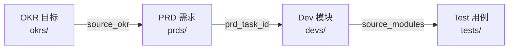

# 2026-09 开发模块索引

> 开发方案文档——描述 HOW（实现方案、架构设计、技术决策），从产品需求 PRD 中拆出。完整追溯链：**OKR → PRD → Dev Module → Test**

<a id="sec-1"></a>
## 一、全链路可追溯矩阵


```mermaid
flowchart LR
  OKR["OKR 目标<br/>okrs/"] -->|"source_okr"| PRD["PRD 需求<br/>prds/"]
  PRD -->|"prd_task_id"| DEV["Dev 模块<br/>devs/"]
  DEV -->|"source_modules"| TEST["Test 用例<br/>tests/"]
```

| Module ID | 标题 | 状态 | 来源 OKR | 来源 PRD | 关联测试 |
|-----------|------|------|----------|----------|----------|
| YV-09-01-0 | 九月架构设计 | 已完成 | yivad-001 | YV-09-01 | — |
| YV-09-01-1 | Detail Tab 组件拆分 | 已完成 | yivad-001 | YV-09-01 | YV-09-22 |
| YV-09-01-2 | useProjectInsights 分层 | 已完成 | yivad-001 | YV-09-01 | YV-09-22 |
| YV-09-01-3 | Docs Tab 功能实现 | 已完成 | yivad-001 | YV-09-01 | — |
| YV-09-01-4 | Tab 独立加载状态 | 已完成 | yivad-002 | YV-09-01 | — |
| YV-09-01-6 | Project 页面国际化 | 已完成 | yivad-002 | YV-09-01 | — |
| YV-09-01-9 | 样式效果改造 | 进行中 | yivad-001 | YV-09-01 | — |
| YV-09-01-10 | RSS Content 优化 | 已完成 | yivad-001 | YV-09-01 | — |
| YV-09-01-11 | AI Chat 优化 | 需求已编写 | yivad-001 | YV-09-01 | — |
| YV-09-01-12 | Knowledge 页面优化 | 已完成 | yivad-002 | YV-09-01 | — |
| YV-09-01-13 | Issue 页面优化 | 已完成 | yivad-001 | YV-09-01 | — |
| YV-09-01-14 | RAG 页面优化 | 已完成 | yivad-001 | YV-09-01 | — |
| YV-09-01-15 | Module 页面优化 | 已完成 | yivad-001 | YV-09-01 | — |
| YV-09-01-16 | Bug 页面优化 | 已完成 | yivad-001 | YV-09-01 | — |
| YV-09-01-17 | Kanban 页面优化 | 已完成 | yivad-001 | YV-09-01 | — |
| YV-09-01-18 | Roadmap 页面优化 | 已完成 | yivad-001 | YV-09-01 | — |
| YV-09-01-19 | 全局搜索页面优化 | 已完成 | yivad-001 | YV-09-01 | — |
| YV-09-01-20 | 项目健康大盘 | 已完成 | yivad-001 | YV-09-01 | — |
| YV-09-01-21 | 数据导入 | 已完成 | yivad-001 | YV-09-01 | — |
| YV-09-89-1 | [系统页面样式与交互优化](../prds/2026-09/89-prd-系统页面样式与交互优化.md) | 已完成 | yivad-003 | YV-09-89 | YV-09-89 |
| YV-09-91-1 | [共享 FilterPills 组件](./91-prd-task-跨页面组件统一与代码去重.md) | 已完成 | yivad-003 | YV-09-91 | YV-09-91 |
| YV-09-91-2 | [共享 RecentlyViewed 组件](./91-prd-task-跨页面组件统一与代码去重.md) | 已完成 | yivad-003 | YV-09-91 | YV-09-91 |
| YV-09-91-3 | [BugSidebar 组件提取](./91-prd-task-跨页面组件统一与代码去重.md) | 已完成 | yivad-003 | YV-09-91 | YV-09-91 |
| YV-09-91-4 | [全局 CSS 工具类与动画统一](./91-prd-task-跨页面组件统一与代码去重.md) | 已完成 | yivad-003 | YV-09-91 | YV-09-91 |
| YV-09-90-1 | [项目数据规范化](./90-prd-task-项目数据规范化.md) | 已完成 | yivad-003 | YV-09-90 | YV-09-90 |
| YV-09-92-1 | [项目数据看板聚合修复](./92-prd-task-项目数据看板聚合修复.md) | 已完成 | yivad-003 | YV-09-92 | YV-09-92 |
| YV-09-94-1 | [首页数据看板优化](./94-prd-task-首页数据看板优化.md) | 已完成 | yivad-003 | YV-09-94 | YV-09-94 |
| YV-09-93-1 | [TypeScript编译修复与代码质量提升](./93-prd-task-TypeScript编译修复与代码质量提升.md) | 已完成 | — | YV-09-93 | YV-09-93 |
| YV-09-95-1 | [效率/质量看板聚合修复](./95-prd-task-效率质量看板聚合修复.md) | 已完成 | yivad-003 | YV-09-95 | YV-09-95 |
| YV-09-96-1 | [广告内容清理与代码专业性提升](./96-prd-task-广告内容清理与代码专业性提升.md) | 已完成 | yivad-003 | YV-09-96 | YV-09-96 |
| YV-09-97-1 | [项目详情页文档目录重构](./97-prd-task-项目详情页文档目录重构.md) | 已完成 | — | YV-09-97 | YV-09-97 |
| YV-09-98-1 | [项目详情页文档目录文件预览弹框](./98-prd-task-项目详情页文档目录文件预览弹框.md) | 已完成 | — | YV-09-98 | YV-09-98 |
| YV-09-99-1 | [Recent Activity 模块渲染优化](./99-prd-task-项目详情页Recent-Activity模块渲染优化.md) | 已完成 | — | YV-09-99 | YV-09-99 |

<a id="sec-2"></a>
## 二、Dev 文档结构

每个开发方案文件遵循标准 10 节结构：

```
1. 方案概述 — 架构定位、职责边界、Mermaid 架构图
2. 文件清单 — 新增/修改文件及其职责
3. 模块设计 — 子模块设计、关键代码、数据流
4. 接口与数据契约 — RPC 调用、TypeScript 类型
5. 关键流程 — 时序图、判定流程图
6. 实施步骤与验证 — 分步实施、人天估算、验证检查点
7. 边缘场景处理 — 异常输入、边界条件、降级
8. 已知缺陷与改进项 — 当前实现的真实状态
9. 风险与回滚 — 风险矩阵、回滚方式
10. 完成定义 (DoD) — 可验证的完成标准
```

<a id="sec-3"></a>
## 三、Frontmatter 规范

```yaml
prd_task_id: "YV-09-01-1"              # 对应 PRD 中的需求编号
title: "YV-09-01-1: {模块名} — 开发方案"
status: {待开始|进行中|已完成}
priority: {P0|P1|P2|P3}
owner: {负责人}
source_prd: "{PRD文件名}"                # 来源 PRD 文件
source_okr: [{OKR ID}]                  # 来源 OKR 目标
related_tests: ["{Test ID}"]            # 关联测试（可选）
```

<a id="sec-4"></a>
## 四、目录规范

```
devs/{month}/
├── README.md                    # 本文件：全链路可追溯矩阵
└── NN-module-{描述}.md          # 开发模块文档
```

<a id="sec-5"></a>
## 五、追溯规则

| 从 | 到 | 字段 | 说明 |
|----|----|------|------|
| OKR | PRD | `source_okr` | OKR 目标驱动 PRD 需求 |
| PRD | Dev | `prd_task_id` | PRD 拆分为开发模块 |
| Dev | Test | `source_modules` | 开发模块被测试覆盖 |

**约束：**
- 每个 Dev Module **必须**通过 `prd_task_id` 关联到一个 PRD
- 每个 Dev Module **建议**通过 `source_okr` 关联到 OKR 目标
- Dev Module 完成后**必须**有对应的 Test 覆盖

<a id="sec-6"></a>
## 六、状态说明

| 状态 | 含义 |
|------|------|
| 需求已编写 | PRD 已评审，开发方案待编写 |
| 待开始 | 开发方案已定稿，等待排期 |
| 进行中 | 正在开发 |
| 已完成 | 代码合入、验证通过 |

<a id="sec-7"></a>
## 七、开发方案编写指南

### 编写时机

| 阶段 | 操作 |
|------|------|
| PRD 评审后 | 创建 Dev 文件，状态设为「需求已编写」 |
| 开发排期确认 | 补充实施步骤和人天估算，状态设为「待开始」 |
| 开始编码 | 状态更新为「进行中」 |
| 代码合入 | 更新验证结果，状态更新为「已完成」 |

### 审查要点

- [ ] 文件清单是否完整（无遗漏、无多余）
- [ ] 模块设计是否清晰（职责边界、关键代码）
- [ ] 接口契约是否与 PRD 一致（参数名用 `filter`/`target_file`/`cname`）
- [ ] 边缘场景是否已枚举
- [ ] 已知缺陷是否诚实记录
- [ ] DoD 是否可验证