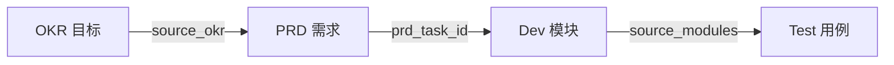

# 2026-Q3 项目 OKR 索引

> YiVad Q3 目标与关键结果，以及 OKR → PRD → Dev → Test 全链路追溯矩阵。

## 一、OKR → PRD 可追溯矩阵



| Goal ID | 目标 | 进度 | 关联 PRD | 关联 Dev |
|---------|------|------|----------|----------|
| yivad-001 | Project 页面架构重构 | 100% | [YV-09-01](../../prds/2026-09/00-prd-需求总览.md) | YV-09-01-1~3 |
| yivad-002 | 文档职责分离与知识关联 | 70% | [YV-09-01](../../prds/2026-09/00-prd-需求总览.md) | YV-09-01-4, 12 |
| yivad-003 | 全项目视图优化与体验提升 | 85% | [YV-09-01](../../prds/2026-09/00-prd-需求总览.md) | YV-09-01-6, 9~21 |

## 二、目标详情

### yivad-001：Project 页面架构重构（100%）

**目标：** 将 Project 模块的 God Component 拆分为 composable + 17 个独立子组件，建立标准页面架构模式。

**关键结果：**
- [x] KR1：拆分 DetailPage God Component → 1 个容器 + 17 个子组件
- [x] KR2：抽取 6 个共享 composables（useDetailTabs, useActivityTimeLine 等）
- [x] KR3：类型安全和 lint 零错误

**关联文件：** [goal-001-架构重构.md](./goal-001-架构重构.md)

### yivad-002：文档职责分离与知识关联（70%）

**目标：** 将 YiVad 项目文档从源码目录迁移到 YiKnowledge，建立 CLAUDE.md → specs/ → workflows/ 三层文档体系。

**关键结果：**
- [x] KR1：迁移 specs/ 和 workflows/ 到 YiKnowledge
- [ ] KR2：建立文档→代码的追溯链接（进行中）
- [x] KR3：CLAUDE.md 精简为模块边界 + 约束 + 近期变更

**关联文件：** [goal-002-文档分离.md](./goal-002-文档分离.md)

### yivad-003：全项目视图优化与体验提升（85%）

**目标：** 优化所有页面的交互体验、数据一致性和视觉呈现。

**关键结果：**
- [x] KR1：17 个子页面功能完整可用
- [x] KR2：数据校验和错误处理覆盖所有表单
- [ ] KR3：国际化覆盖率达到 100%（进行中）

**关联文件：** [goal-003-视图优化与体验提升.md](./goal-003-视图优化与体验提升.md)

## 三、关联角色 OKR

| Goal ID | 目标 | 角色 | 进度 | 关联项目 |
|---------|------|------|------|----------|
| eng-001 | 代码编写与调试自闭环 | engineer | 100% | YiVad |
| eng-005 | 构建健康归零 | engineer | — | YiVad |
| prod-001 | 需求评审可闭环 | producter | 100% | YiAi |

> 角色级 OKR 详细内容参见 `YiKnowledge/{role}/okr/2026-Q3/{goal-id}/goal.md`

## 四、目录规范

```
okrs/{quarter}/
├── README.md                  # 本文件：OKR→PRD→Dev→Test 可追溯矩阵
├── goal-001-{描述}.md         # OKR 目标文件（含 related_prds, related_modules）
├── goal-002-{描述}.md
└── goal-003-{描述}.md
```

## 五、使用说明

### 新增 OKR 目标

1. 在对应角色目录创建 `YiKnowledge/{role}/okr/{quarter}/{goal-id}/goal.md`
2. 在本 README 的追溯矩阵中新增一行
3. 更新 `related_prds` 字段关联 PRD
4. 如有 Dev 模块，更新 `related_modules` 字段

### 更新进度

- 进度百分比 = 已完成 KR 数 / 总 KR 数
- 每周同步一次进度
- 进度变更时更新本文件