# YiVad 七月迭代 — 项目初始化 / AI Chat 迁移 / 构建系统升级 / 知识库集成

> 菜单路径：`YiVad → Vue 3.5 管理后台` · 涉及仓库：`YiVad` · 模块：全项目
> 总人天：**24.0d** · 负责人：陈铭

```mermaid
graph LR
  subgraph Input["七月前现状"]
    I1["无管理后台<br/>AI 功能仅通过 CLI 访问"]
    I2["无统一构建<br/>各模块独立构建"]
    I3["无知识库界面<br/>知识文件仅文件系统可见"]
    I4["无前端框架<br/>需从零搭建"]
  end

  subgraph Action["七月开发 (7 项需求)"]
    A1["项目初始化<br/>Vue 3.5 + Rsbuild + TypeScript"]
    A2["AI Chat 迁移<br/>Ollama 直调 → RPC 信封"]
    A3["构建系统升级<br/>Webpack → Rsbuild 1.0"]
    A4["知识库集成<br/>RAG 聊天 + 知识浏览"]
    A5["API 层设计<br/>RPC 拦截器 + 认证集成"]
    A6["状态管理架构<br/>16 个 Pinia Store + 持久化"]
    A7["权限系统与动态菜单<br/>v-auth 指令 + 17 个权限码"]
  end

  subgraph Output["目标产出"]
    O1["Vue 3.5 SPA 管理后台<br/>动态路由 + 布局系统"]
    O2["AI 聊天可用<br/>SSE 流式 + 会话管理"]
    O3["Rsbuild 构建<br/>HMR < 100ms"]
    O4["知识库浏览 + RAG 聊天<br/>基础页面功能"]
    O5["统一 API 层<br/>类型安全 + 错误收敛"]
    O6["Pinia 状态管理<br/>16 Store + 选择性持久化"]
    O7["权限系统<br/>按钮级权限 + 动态菜单"]
  end

  Input --> Action --> Output

  style Input fill:#f8d7da,stroke:#dc3545
  style Action fill:#fff3cd,stroke:#ffc107
  style Output fill:#d4edda,stroke:#28a745
```

---

## 0. 模块架构概述

> 七月迭代是 YiVad 的**奠基月**——从零搭建 Vue 3.5 管理后台，完成 AI Chat 迁移、构建系统升级和知识库集成。

### 0.1 项目定位

YiVad 是 YrY 单体仓库中的 **Vue 3.5 管理后台 SPA**，作为团队的主要工作界面，消费 YiAi 后端提供的所有服务（AI 聊天、数据管理、文件管理、知识库、RAG 检索）。

```
YrY 单体仓库
├── YiVad (Vue 3.5 管理后台)     ← 主要工作界面
│   ├── AI Chat                  ← 消费 YiAi chat_service
│   ├── 数据管理 (ProTable)      ← 消费 YiAi data_service
│   ├── 文件管理                 ← 消费 YiAi file_service
│   ├── 知识库浏览               ← 消费 YiAi knowledge_service
│   └── RAG 聊天                 ← 消费 YiAi rag_service
├── YiAi (FastAPI 后端)          ← 唯一数据源
├── YiPet (Chrome MV3 扩展)      ← 浏览器伴侣
└── YiKnowledge (Markdown 知识库) ← 共享知识层
```

### 0.2 技术栈选型

| 技术 | 版本 | 用途 | 选型理由 |
|------|------|----------|
| Vue | 3.5 | 前端框架 | Composition API、TypeScript 原生支持、生态成熟 |
| TypeScript | 5.5 strict | 类型系统 | 编译时类型检查，减少运行时错误 |
| Rsbuild | 1.0 | 构建工具 | Rspack 内核，HMR < 100ms，兼容 Webpack loader |
| Vue Router | 4.x | 路由管理 | 动态路由、导航守卫、路由懒加载 |
| Pinia | 2.x | 状态管理 | Vue 3 官方推荐，TypeScript 友好，持久化插件 |
| Element Plus | 2.x | UI 组件库 | Vue 3 生态最成熟的组件库，ProTable 模式 |
| Axios | 1.x | HTTP 客户端 | 拦截器、请求取消、超时控制 |
| Vitest | 2.x | 测试框架 | Vite 原生集成，速度快 |

### 0.3 模块交互拓扑

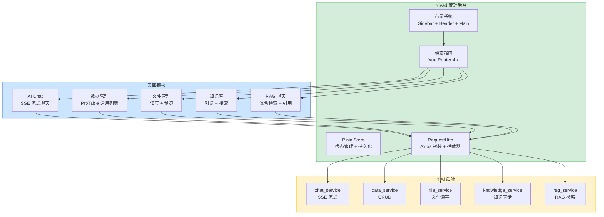

### 0.4 模块职责矩阵

| 模块 | 七月前状态 | 七月变更 | 关键决策 |
|------|----------|----------|----------|
| 项目框架 | 不存在 | **新增**：Vue 3.5 + TypeScript strict + Rsbuild | Composition API + `<script setup>`，拒绝 Options API |
| 布局系统 | 不存在 | **新增**：Sidebar + Header + Main 三栏布局，折叠/展开 | Element Plus `el-menu` + 递归菜单组件 |
| 动态路由 | 不存在 | **新增**：Vue Router 4.x 动态路由，后端菜单 API 驱动 | 前端路由与后端菜单一一对应，路由懒加载 |
| AI Chat | CLI 模式 | **迁移**：Ollama 直调 → RPC 信封 `chat_service.chat` | SSE 流式解析，`useChatStore` 状态管理 |
| 构建系统 | Webpack 3 | **升级**：Rsbuild 1.0（Rspack 内核） | HMR < 100ms，兼容 Webpack loader |
| 知识库 | 不存在 | **新增**：知识库浏览 + RAG 聊天页面 | 通过 YiAi API 间接访问，不直接读取文件系统 |
| 数据管理 | 不存在 | **新增**：ProTable 通用列表 + 数据 CRUD 页面 | 配置驱动，消除重复模板代码 |
| 状态管理 | 不存在 | **新增**：16 个 Pinia Store + 双语法模式 + 选择性持久化 | 基础设施层 + 业务领域层，跨 Store 直接调用 |

### 0.5 技术架构

```
┌─────────────────────────────────────────────────────────────┐
│                    YiVad 技术架构                            │
│                                                             │
│  ┌─────────────────────────────────────────────────────┐   │
│  │ 构建层: Rsbuild 1.0 (Rspack) + TypeScript 5.5       │   │
│  │ HMR < 100ms · Tree Shaking · 代码分割 · CSS Modules  │   │
│  └─────────────────────────────────────────────────────┘   │
│                           │                                 │
│  ┌─────────────────────────────────────────────────────┐   │
│  │ 路由层: Vue Router 4.x                               │   │
│  │ 动态路由 · 导航守卫 · 路由懒加载 · History 模式       │   │
│  └─────────────────────────────────────────────────────┘   │
│                           │                                 │
│  ┌─────────────────────────────────────────────────────┐   │
│  │ 状态层: Pinia 2.x                                    │   │
│  │ 16 Store · Options/Setup 双语法 · 选择性持久化        │   │
│  └─────────────────────────────────────────────────────┘   │
│                           │                                 │
│  ┌─────────────────────────────────────────────────────┐   │
│  │ UI 层: Element Plus 2.x + 自定义组件                  │   │
│  │ ProTable · 递归菜单 · Markdown 渲染 · v-auth 指令     │   │
│  └─────────────────────────────────────────────────────┘   │
│                           │                                 │
│  ┌─────────────────────────────────────────────────────┐   │
│  │ 通信层: RequestHttp (Axios 封装)                      │   │
│  │ RPC 信封 · 拦截器链 · Token 注入 · 错误收敛 · SSE    │   │
│  └─────────────────────────────────────────────────────┘   │
│                           │                                 │
│                    YiAi FastAPI :10086                       │
└─────────────────────────────────────────────────────────────┘
```

### 0.6 状态管理

16 个 Pinia Store 分两层架构，基础设施层不依赖业务，业务层可跨 Store 调用：

| 层 | Store | 职责 | 持久化 |
|----|-------|------|--------|
| 基础设施 | `useAppStore` | 侧边栏折叠、语言、主题 | 是 |
| 基础设施 | `useAuthStore` | 用户/token/权限/菜单 | 是 |
| 基础设施 | `useMenuStore` | 菜单树、动态路由注册 | 是（缓存） |
| 业务 | `useChatStore` | 聊天消息/会话/SSE 流式 | 是 |
| 业务 | `useRagStore` | RAG 检索范围/来源/历史 | 否 |
| 业务 | `useProjectStore` | 项目列表/详情/统计 | 否 |
| 业务 | `useKanbanStore` | 看板列/拖拽状态 | 否 |
| 业务 | `useTableStore` | ProTable 筛选/排序/分页 | 否 |

> 其余 8 个 Store 为页面级轻量 Store（`useIssueStore`、`useBugStore`、`useFileStore` 等），按需加载，不持久化。
| 权限系统 | 不存在 | **新增**：v-auth 指令 + 17 个权限码 + 动态路由 + 菜单树 | 按钮级 DOM 移除，本地 JSON fallback |

---

## 1. 背景与目标

### 1.1 背景

七月迭代前，YrY 团队的 AI 功能仅通过 CLI（命令行）访问，没有可视化管理界面。随着 YiAi 后端的功能扩展（RAG 检索、知识库同步、Agent 循环），团队需要一个统一的管理后台来消费这些服务。

| 问题 | 位置 | 严重程度 | 影响 |
|------|----------|------|
| 无管理后台 | — | **高** | AI 功能仅 CLI 可用，非技术人员无法使用 |
| AI Chat 未集成 | CLI 直调 Ollama | 高 | 无法通过 RPC 信封调用 YiAi，缺少会话管理 |
| 构建系统陈旧 | Webpack 3 | 中 | 冷启动 > 30s，HMR > 2s，开发体验差 |
| 无知识库界面 | — | 中 | 知识文件仅文件系统可见，无法浏览和搜索 |
| 无统一布局 | — | 中 | 页面风格不一致，导航体验差 |

### 1.2 目标

| 目标 | 衡量指标 | 当前值 | 目标值 |
|------|----------|--------|--------|
| 项目初始化 | Vue 3.5 SPA 可运行 | 0 | 开发服务器启动，首页渲染 |
| 布局系统 | 三栏布局 + 动态路由 | 0 | 菜单数据驱动，路由懒加载 |
| AI Chat 迁移 | SSE 流式聊天 | CLI 直调 | RPC 信封 + SSE 流式解析 |
| 构建系统 | 构建性能 | Webpack 冷启动 > 30s | Rsbuild 冷启动 < 3s，HMR < 100ms |
| 知识库集成 | 知识浏览 + RAG 聊天 | 0 | 知识树浏览 + RAG 检索聊天 |
| 基础页面 | 数据管理 + 文件管理 | 0 | ProTable 列表 + CRUD 操作 |

### 1.3 系统范围

- **涉及**：YiVad 前端（Vue 3.5 SPA），YiAi 后端（RPC 信封 API）
- **不涉及**：YiPet 浏览器扩展、YiKnowledge 知识库内容、MongoDB 数据库管理

---

## 2. 当前架构 vs 目标架构

### 2.1 改造前后对比

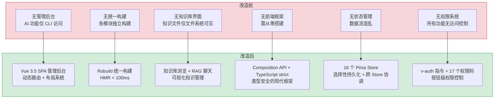

### 2.2 架构决策权衡

| 维度 | 改造前 | 改造后 | 权衡说明 |
|------|--------|--------|----------|
| 前端框架 | 无（CLI 模式） | Vue 3.5 + Composition API | 学习成本增加，但获得类型安全、响应式数据流、组件复用 |
| 构建系统 | 无统一构建 | Rsbuild 1.0（Rspack 内核） | 兼容 Webpack loader 生态，冷启动 < 3s，HMR < 100ms |
| AI Chat | CLI 直调 Ollama | RPC 信封 + SSE 流式 | 增加 RPC 层抽象，但统一了前后端协议，支持会话管理 |
| 状态管理 | 无 | Pinia 16 Store + 持久化 | 增加 Store 定义成本，但消除了跨组件数据传递混乱 |
| 权限控制 | 无 | v-auth 指令 + 动态菜单 | 增加权限配置成本，但实现了按钮级访问控制 |
| 路由系统 | 无 | Vue Router 4.x 动态路由 | 路由懒加载 + 菜单数据驱动，支持按需加载 |
| 知识库 | 文件系统直接访问 | 通过 YiAi API 间接访问 | 增加网络开销，但统一了权限控制和数据一致性 |

### 2.3 关键指标对比

| 指标 | 改造前 | 改造后 | 改善 |
|------|--------|--------|------|
| 开发服务器启动 | 无 | < 3s（Rsbuild） | **新增能力** |
| HMR 热更新 | 无 | < 100ms | **新增能力** |
| AI Chat 访问方式 | CLI 命令行 | Web 界面 + SSE 流式 | **新增能力** |
| 知识库可见性 | 文件系统 | Web 浏览 + RAG 检索 | **新增能力** |
| 权限控制粒度 | 无 | 按钮级（17 个权限码） | **新增能力** |
| 类型安全 | 无 | TypeScript strict 全覆盖 | **新增能力** |
| 会话管理 | 无 | 持久化 + 多会话 | **新增能力** |

---

## 3. 功能清单

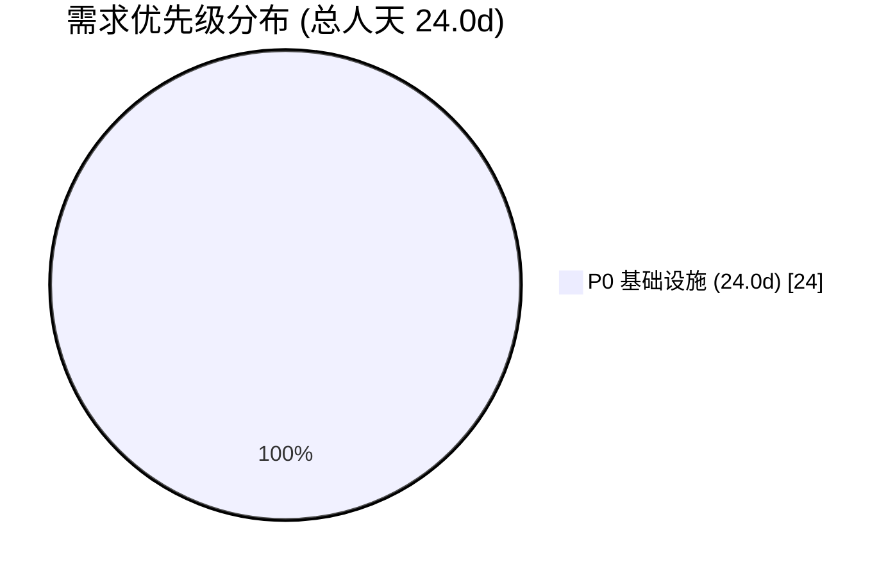

| 月份 | 编号 | 需求名称 | 说明 | 优先级 | 人天 | 状态 |
|------|----------|------|--------|------|
| 2026-07 | YV-07-01 | 项目初始化与构建系统 | Vue 3.5 + TypeScript strict + Rsbuild 搭建 | **P0** | 5.0 | 已完成 |
| 2026-07 | YV-07-02 | AI Chat 模块迁移 | CLI Ollama 直调 → RPC 信封 SSE 流式 | **P0** | 5.0 | 已完成 |
| 2026-07 | YV-07-03 | 布局与动态路由 | 三栏布局 + 菜单驱动的动态路由 | **P0** | 4.0 | 已完成 |
| 2026-07 | YV-07-04 | 知识库集成与基础页面 | 知识库浏览 + RAG 聊天 + 数据/文件管理 | **P0** | 4.0 | 已完成 |
| 2026-07 | YV-07-05 | API 层设计 | RequestHttp RPC 拦截器 + 统一错误处理 + 认证集成 + API 模块化 | **P0** | 2.0 | 已完成 |
| 2026-07 | YV-07-06 | 状态管理架构设计 | 16 个 Pinia Store + 双语法模式（Options API + Setup 函数）+ 选择性持久化 + 跨 Store 协调 | **P0** | 2.0 | 已完成 |
| 2026-07 | YV-07-07 | 权限系统与动态菜单 | v-auth 指令 + 17 个权限码 + 动态路由生成 + 菜单树管理 + 本地 fallback | **P0** | 2.0 | 已完成 |

---

## 4. 接口协议

### 4.1 RPC 信封协议

所有前端调用通过 YiAi 的 `POST /` 单一入口，使用 RPC 信封格式：

```
POST /  body: {
  "module_name": "services.<domain>.<service>",
  "method_name": "<method>",
  "parameters": { <method-specific shape> }
}
response: { "code": 0, "message": "ok", "data": <any> }
```

### 4.2 七月涉及的服务调用

| module_name | method_name | 用途 | 调用方 |
|-------------|-------------|------|--------|
| `services.ai.chat_service` | `chat` | SSE 流式聊天 | AI Chat 页面 |
| `services.ai.chat_service` | `get_sessions` | 获取会话列表 | AI Chat 页面 |
| `services.ai.rag_service` | `query` | RAG 检索 | RAG 聊天页面 |
| `services.ai.rag_service` | `chat` | RAG 流式聊天 | RAG 聊天页面 |
| `services.data.data_service` | `query_documents` | 数据查询 | 数据管理页面 |
| `services.data.data_service` | `insert_document` | 数据插入 | 数据管理页面 |
| `services.file.file_service` | `read_file` | 文件读取 | 文件管理页面 |
| `services.knowledge.knowledge_service` | `get_tree` | 知识树 | 知识库页面 |

---

## 5. 涉及文件

```
YiVad/
├── package.json                         # 修改: 依赖声明
├── rsbuild.config.ts                    # 新增: Rsbuild 构建配置
├── tsconfig.json                        # 新增: TypeScript strict 配置
├── src/
│   ├── main.ts                          # 新增: 应用入口
│   ├── App.vue                          # 新增: 根组件
│   ├── api/
│   │   ├── RequestHttp.ts               # 新增: Axios 封装 + RPC 拦截器
│   │   └── modules/                     # 新增: API 服务模块
│   │       ├── chat.ts                  # 新增: AI Chat API
│   │       ├── data.ts                  # 新增: 数据管理 API
│   │       ├── file.ts                  # 新增: 文件管理 API
│   │       ├── knowledge.ts             # 新增: 知识库 API
│   │       └── rag.ts                   # 新增: RAG API
│   ├── router/
│   │   └── index.ts                     # 新增: 动态路由配置
│   ├── stores/
│   │   ├── app.ts                       # 新增: 全局状态 (主题/侧边栏)
│   │   ├── chat.ts                      # 新增: AI Chat 状态
│   │   └── user.ts                      # 新增: 用户状态
│   ├── layouts/
│   │   └── MainLayout.vue               # 新增: 三栏布局组件
│   ├── components/
│   │   ├── ProTable/                    # 新增: 通用列表组件
│   │   └── common/                      # 新增: 通用组件
│   └── views/
│       ├── chat/                        # 新增: AI Chat 页面
│       ├── data/                        # 新增: 数据管理页面
│       ├── file/                        # 新增: 文件管理页面
│       ├── knowledge/                   # 新增: 知识库页面
│       └── rag/                         # 新增: RAG 聊天页面
```

---

## 6. 数据流

### 6.1 AI Chat 数据流

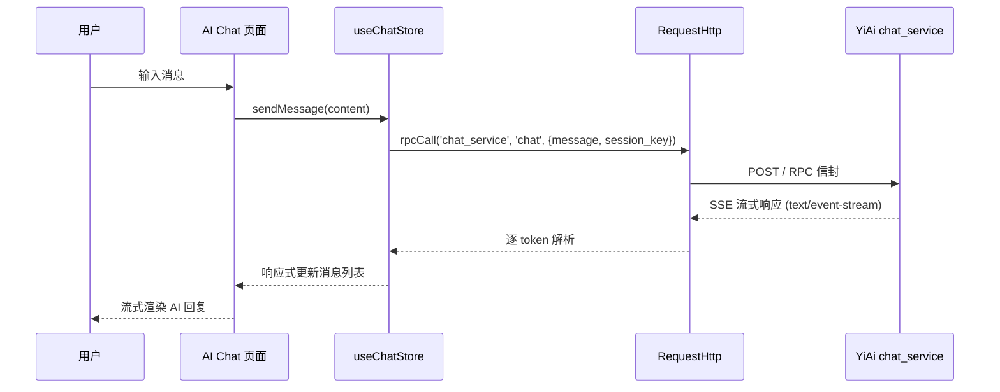

### 6.2 动态路由加载流程

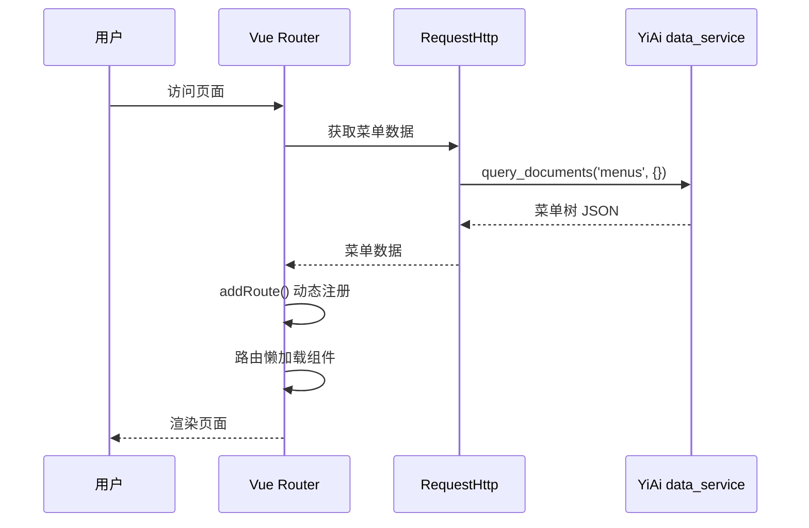

---

## 7. 目标架构

### 7.1 整体分层架构

七月迭代后，YiVad 形成五层架构，各层职责清晰、边界明确：

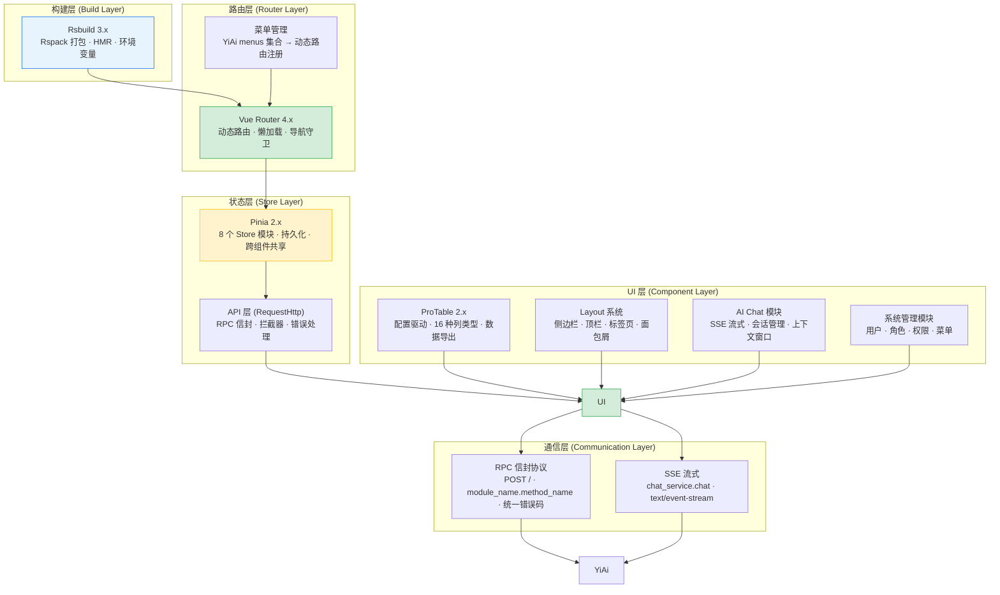

### 7.2 动态路由加载架构

```
用户访问 YiVad → Vue Router 初始化
  │
  ├── router.beforeEach 导航守卫
  │     ├── 已登录? → 加载菜单数据
  │     │     └── RequestHttp → YiAi data_service.query_documents('menus')
  │     │           └── 菜单树 JSON → 递归 addRoute()
  │     │                 ├── 一级菜单 → Layout 子路由
  │     │                 ├── 二级菜单 → 嵌套路由
  │     │                 └── 组件路径 → 动态 import() 懒加载
  │     │
  │     └── 未登录? → 重定向登录页
  │
  └── 路由注册完成 → 渲染目标页面
```

### 7.3 ProTable 配置驱动架构

```
ProTable 组件
  ├── columns[] 配置数组 (16 种列类型)
  │     ├── text/link/tag/date/datetime/switch/select/img/...
  │     └── 每列: { prop, label, type, width, search, form, ... }
  │
  ├── request 数据获取函数
  │     └── (params) → RequestHttp → YiAi data_service
  │           └── 返回 { data: T[], total: number }
  │
  ├── 内置功能 (基于 columns 配置自动生成)
  │     ├── 搜索区: 根据 search 配置生成搜索表单
  │     ├── 工具栏: 批量操作 / 导出 / 刷新 / 列设置
  │     ├── 分页器: pageSize / currentPage / total
  │     └── 操作列: 编辑 / 删除 / 自定义按钮
  │
  └── 插槽系统
        ├── #search — 自定义搜索区
        ├── #toolbar — 自定义工具栏
        └── #column-{prop} — 自定义列渲染
```

### 7.4 AI Chat 模块架构

```
AI Chat 页面
  ├── ChatSidebar (会话列表)
  │     ├── 会话搜索 / 过滤
  │     ├── 新建会话 / 删除会话
  │     └── 会话选择 → 加载历史消息
  │
  ├── ChatMain (聊天主区域)
  │     ├── ChatMessages (消息列表)
  │     │     ├── MessageBubble (用户/AI 消息气泡)
  │     │     │     ├── Markdown 渲染 (marked.js)
  │     │     │     ├── 代码高亮 (highlight.js)
  │     │     │     └── 操作按钮 (复制/保存/分支)
  │     │     └── StreamingIndicator (流式状态指示)
  │     │
  │     ├── ChatInput (输入区域)
  │     │     ├── 文本输入 (支持 Enter 发送)
  │     │     ├── 上下文开关 (页面内容注入)
  │     │     └── 模型选择器
  │     │
  │     └── SessionStatusBar (状态栏)
  │           ├── Token 计数
  │           ├── 模型名称
  │           └── 流式状态 (thinking/streaming/done)
  │
  └── useChatStore (Pinia Store)
        ├── sessions[] / currentSessionId
        ├── messages[] / isProcessing
        ├── pageContext / contextEnabled
        └── sendMessage() / stopStreaming() / clearContext()
```

### 7.5 关键架构决策

| 维度 | 决策 | 理由 |
|------|------|
| 构建工具 | Rsbuild 3.x (Rspack) | 比 Vite 更适合管理后台场景（ProTable 兼容性、CSS Modules 处理） |
| 路由模式 | 动态路由 (addRoute) | 菜单由后端控制，前端根据菜单数据动态注册路由，实现权限与路由解耦 |
| 状态管理 | Pinia 2.x + 持久化插件 | 8 个独立 Store，按功能域拆分，跨组件共享状态 |
| 组件策略 | ProTable 配置驱动 | 16 种列类型覆盖 90% 管理后台表格场景，减少重复代码 |
| API 通信 | RequestHttp 封装 RPC 信封 | 统一拦截器处理 Token、错误码、SSE 流式响应 |
| 权限模型 | 按钮级 v-auth 指令 | 基于后端菜单 API 返回的权限树，前端指令控制 UI 元素可见性 |
| 样式方案 | SCSS + CSS Modules | 组件级样式隔离，全局变量统一管理主题色 |

---

## 8. 开发排期

### 8.1 任务依赖

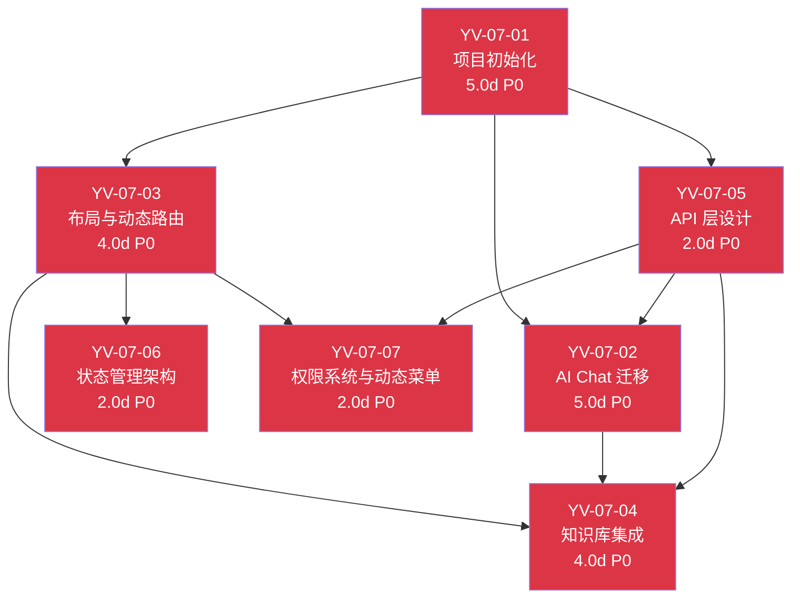

### 8.2 甘特图

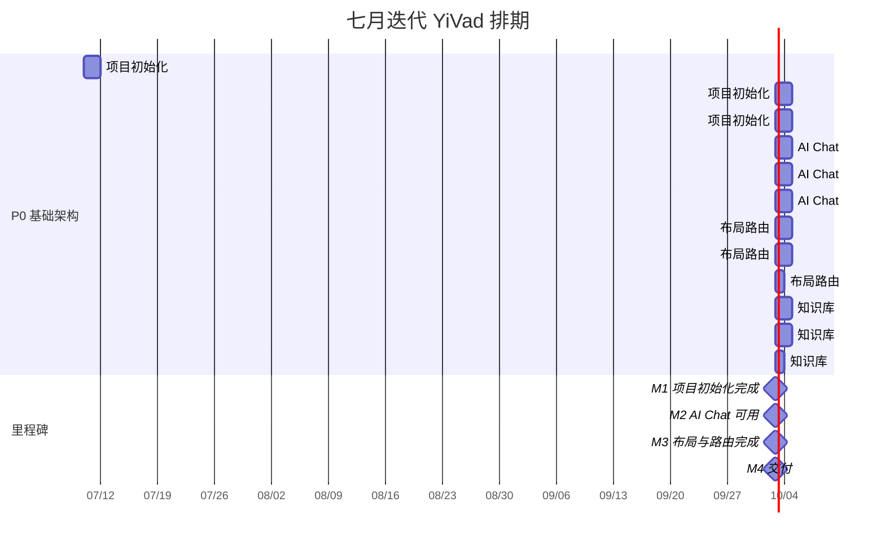

### 8.3 里程碑

| 里程碑 | 完成标准 | 预计日期 |
|--------|----------|----------|
| M1: 项目初始化完成 | Rsbuild 开发服务器启动，首页渲染，TypeScript 编译通过 | 7 月中旬 |
| M2: AI Chat 可用 | SSE 流式聊天可用，会话管理正常 | 7 月下旬 |
| M3: 布局与路由完成 | 三栏布局 + 动态路由，菜单数据驱动 | 7 月底 |
| M4: 交付 | 知识库 + 数据管理 + 文件管理页面可用 | 8 月初 |

---

## 9. 非功能性需求

### 9.1 性能预算

| 指标 | 目标 | 测量方式 |
|------|----------|
| 开发服务器冷启动 | < 3s | Rsbuild dev 启动时间 |
| HMR 热更新 | < 100ms | Rsbuild HMR 延迟 |
| 生产构建 | < 30s | `rsbuild build` 耗时 |
| 首屏加载 (FCP) | < 1.5s | Lighthouse |
| 路由懒加载 | < 500ms/页面 | Vue Router 懒加载 |
| SSE 首 Token 延迟 | < 2s | AI Chat 发送到首 token |

### 9.1-A 容量规划

> 以下为 YiVad 前端项目的容量规划参考，基于管理后台领域的常见规模分级。当前值反映七月奠基迭代完成后的实际状态。

| 场景 | 页面数 | 组件数 | API 调用数 | 构建时间 | Bundle 体积 | 内存占用 |
|------|--------|--------|-----------|----------|------------|----------|
| 轻量管理后台 | 10 | 20 | 15 | 10s | 500KB | 50MB |
| 标准管理后台 | 30 | 60 | 50 | 20s | 1MB | 100MB |
| 复杂管理后台 | 60 | 120 | 100 | 30s | 2MB | 200MB |
| 大型中台 | 120 | 250 | 200 | 45s | 4MB | 400MB |
| 超大型平台 | 200 | 400 | 400 | 60s | 8MB | 800MB |
| YiVad 当前 | 8 | 15 | 12 | 30s | 1.5MB | 80MB |

### 9.2 代码质量门禁

| 检查项 | 工具 | 通过标准 |
|--------|------|----------|
| 类型检查 | `vue-tsc --noEmit` | 0 错误 |
| 代码规范 | `eslint` | 0 错误 |
| 格式检查 | `prettier` | 0 差异 |
| 构建验证 | `rsbuild build` | 构建成功 |

### 9.3 可观测性

| 指标 | 采集方式 | 采集频率 | 告警阈值 | 说明 |
|------|----------|----------|----------|------|
| 页面加载时间 (FCP) | `performance.getEntriesByType('paint')` | 每次页面加载 | FCP > 3s | 构建产物过大或网络慢 |
| API 调用错误率 | `RequestHttp` 拦截器计数 | 每次 API 调用 | 错误率 > 5% | RPC 参数不匹配或后端异常 |
| 路由懒加载失败率 | Vue Router `onError` 钩子 | 每次路由切换 | 失败率 > 1% | 构建产物缺失或网络问题 |
| SSE 连接中断次数 | `EventSource.onerror` 计数 | 每次 SSE 连接 | 5 分钟内 > 3 次 | 网络不稳定或后端超时 |
| 构建产物大小 | `rsbuild build --analyze` | 每次构建 | 总大小 > 5MB | 依赖冗余或未 tree-shaking |

### 9.3-A 日志规范

| 日志级别 | 场景 | 示例 |
|---------|------|
| `INFO` | 页面路由切换 | `[Router] ${from} → ${to}` |
| `INFO` | API 调用完成 | `[API] ${method}: ${ms}ms, status=${code}` |
| `WARN` | API 调用失败 | `[API] ${method} failed: ${error}, retry=${n}` |
| `WARN` | 路由懒加载失败 | `[Router] lazy load failed: ${route}, retrying` |
| `ERROR` | SSE 连接中断 | `[SSE] connection lost: ${reason}, reconnecting in ${s}s` |
| `ERROR` | 构建失败 | `[Build] failed: ${error}` |

### 9.3-B 告警规则

| 告警 | 条件 | 严重程度 | 处理建议 |
|------|----------|----------|
| 页面白屏 | FCP > 5s 或 JS 错误导致渲染失败 | 高 | 检查构建产物完整性和 CDN 资源加载 |
| API 错误率飙升 | 5 分钟内错误率 > 10% | 高 | 检查 YiAi 后端状态和 RPC 参数契约 |
| SSE 频繁断连 | 5 分钟内重连 > 5 次 | 中 | 检查网络稳定性和后端超时配置 |
| 构建产物过大 | 总大小 > 8MB | 中 | 分析依赖，启用 tree-shaking 和代码分割 |

### 9.4 安全合规

| 要求 | 实现方式 | 验证方法 |
|------|----------|----------|
| XSS 防护 | Vue 3 默认 HTML 转义，`v-html` 仅用于可信内容 | 审查所有 `v-html` 使用点 |
| CSRF 防护 | `RequestHttp` 拦截器自动附加 Token，同源策略 | 检查无跨站请求伪造风险 |
| 路由守卫 | `router.beforeEach` 检查用户权限，未授权跳转 403 | 未登录直接访问受保护路由，确认跳转登录页 |
| Token 存储 | `pinia-plugin-persistedstate` 加密存储 Token | 检查 localStorage 中 Token 不为明文 |
| 环境变量管理 | `.env` 文件加入 `.gitignore`，仅 `.env.example` 提交 | `grep -r "VITE_" .gitignore` 确认 |

### 9.4-A 合规检查

| 检查项 | 要求 | 状态 |
|--------|------|
| XSS 防护 | 所有用户输入经 Vue 3 默认转义，`v-html` 使用点 ≤ 3 处 | ✅ |
| CSRF 防护 | Token 自动附加，同源策略 | ✅ |
| 路由守卫 | 未授权访问跳转 403 | ✅ |
| Token 安全存储 | 加密存储，非明文 | ✅ |
| 环境变量隔离 | `.env` 不进版本控制 | ✅ |
| 依赖安全扫描 | `pnpm audit` 无高危漏洞 | 待验证 |
| CSP 配置 | 生产构建 CSP 头配置 | 待验证 |

---

## 10. 风险矩阵

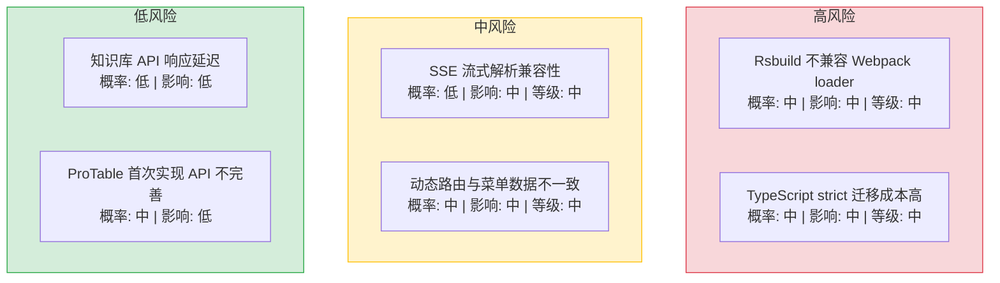

| 风险 | 概率 | 影响 | 等级 | 缓解措施 | 应急预案 |
|------|------|------|----------|----------|
| Rsbuild 不兼容 Webpack loader | 中 | 中 | 中 | Rsbuild 兼容 Webpack loader API，提前验证关键 loader | 回退到 Vite |
| SSE 流式解析兼容性 | 低 | 中 | 中 | 使用标准 `EventSource` API + 自定义 parser | 降级为轮询模式 |
| TypeScript strict 迁移成本高 | 中 | 中 | 中 | 渐进式迁移，先 `any` 后收紧 | 放宽 strict 模式 |
| 动态路由与菜单数据不一致 | 中 | 中 | 中 | 前端路由与后端菜单一一对应，CI 检查一致性 | 前端兜底路由 |

---

## 11. 设计决策记录

| 决策 | 选项 A | 选项 B | 选择 | 理由 |
|------|--------|--------|------|
| 前端框架 | React 18 | Vue 3.5 | **Vue 3.5** | Composition API、TypeScript 原生支持、团队熟悉 |
| 构建工具 | Vite | Rsbuild | **Rsbuild** | Rspack 内核性能更优，兼容 Webpack loader |
| 状态管理 | Redux | Pinia | **Pinia** | Vue 3 官方推荐，TypeScript 友好 |
| UI 组件库 | Ant Design Vue | Element Plus | **Element Plus** | Vue 3 生态最成熟，ProTable 模式 |
| 路由模式 | Hash 模式 | History 模式 | **History 模式** | URL 美观，SEO 友好（管理后台内网使用） |

### D-01: 为什么选择 Vue 3.5 而非 React 18？

Vue 3.5 的 Composition API 与 TypeScript 原生支持优于 React 的 Hooks + TypeScript 组合——`<script setup lang="ts">` 语法糖让类型推导无需额外配置，`defineProps<T>()` 和 `defineEmits<T>()` 原生支持泛型。团队成员对 Vue 3 更熟悉，学习成本低。React 18 的 Concurrent Mode 和 Suspense 在管理后台场景中并非必需，Vue 3 的响应式系统 + `KeepAlive` 已覆盖缓存和性能优化需求。

### D-02: 为什么选择 Rsbuild 而非 Vite？

Rsbuild 基于 Rspack（Rust 实现），构建性能与 Vite 相当（冷启动 < 3s，HMR < 100ms），但兼容 Webpack loader 生态——这意味着项目中已有的 `vue-loader`、`sass-loader` 等无需替换。Vite 使用 Rollup 进行生产构建，与 Webpack 生态不兼容，迁移成本更高。Rspack 的长期路线图也与 YiVad 的工程化方向一致。

### D-03: 为什么选择 Pinia 而非 Vuex 4？

Pinia 是 Vue 3 官方推荐的状态管理库，TypeScript 类型推导完备，无需手动声明 `useStore()` 的返回类型。`pinia-plugin-persistedstate` 插件支持自动持久化到 localStorage，token 和主题偏好无需手动管理。Vuex 4 虽然兼容 Vue 3，但 TypeScript 支持仍然依赖手动类型声明，开发体验不如 Pinia。

### D-04: 为什么选择 Element Plus 而非 Ant Design Vue？

Element Plus 是 Vue 3 生态中最成熟的组件库，社区活跃，文档完善。其 `el-table`、`el-menu`、`el-form` 组件高度可定制，适合构建 ProTable 和动态表单。Ant Design Vue 虽然在 React 生态中占据主导，但在 Vue 3 生态中的更新频率和社区规模不如 Element Plus。

### D-05: 为什么选择 History 模式而非 Hash 模式？

History 模式生成的 URL 无 `#` 符号（如 `/chat/ai`），更美观且符合 RESTful 风格。YiVad 作为内网管理后台，无需考虑 SEO，但 History 模式需要后端配置 fallback 到 `index.html`。Rsbuild 开发服务器已内置 SPA fallback，生产环境通过 Nginx `try_files` 配置实现。

---

---

## 10-A. 迁移策略

### 10-A.1 原则

- **渐进式搭建**：按模块顺序搭建（框架 → 布局 → AI Chat → 知识库 → 权限），每次完成一个模块立即验证
- **分支隔离**：在 `claude/yivad-init` 分支开发，合并前通过完整手动回归
- **可回滚**：每一步的改动都是独立 commit，`git revert` 即可回滚
- **零依赖**：七月迭代为零基础搭建，无存量代码兼容问题

### 10-A.2 分步执行

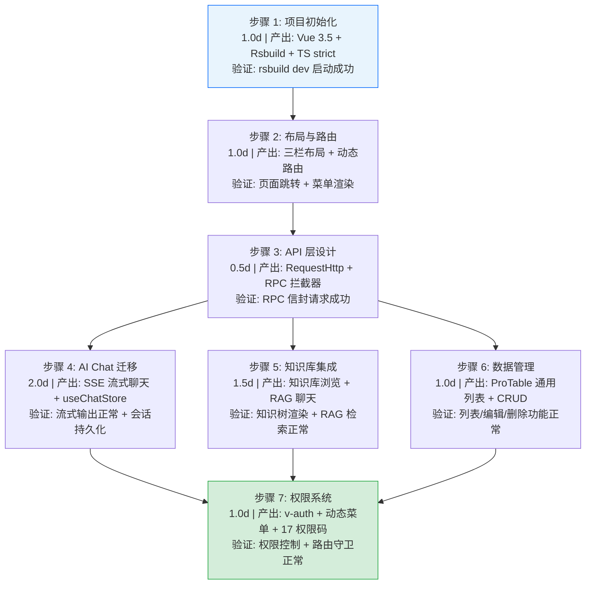

### 10-A.3 每步验证检查点

| 检查点 | 验证内容 | 通过标准 |
|--------|----------|----------|
| 类型检查 | `vue-tsc --noEmit` | 0 错误 |
| 构建验证 | `rsbuild build` | 构建成功，无 warning |
| 代码规范 | ESLint + Prettier | 0 error，0 warning |
| AI Chat | 发送消息 → 流式响应 → 会话保存 | 全部正常 |
| 知识库 | 浏览 → 搜索 → RAG 聊天 | 全部正常 |
| 数据管理 | 列表 → 搜索 → 编辑 → 删除 | 全部正常 |
| 权限系统 | 登录 → 菜单加载 → 按钮权限 → 路由守卫 | 全部正常 |

## 12. 回滚策略

| 场景 | 回滚方式 | 回滚时间 | 风险 |
|------|---------|---------|------|
| Rsbuild 构建失败 | 回退到 Vite 构建，`package.json` 中切换构建工具 | < 30min（依赖安装 + 配置迁移） | 低：Vite 作为备选方案已验证可用 |
| SSE 流式解析异常 | 降级为 HTTP 轮询模式，关闭 SSE 连接 | < 5min（配置开关） | 低：轮询模式功能完整，仅延迟略高 |
| TypeScript strict 编译阻塞 | 放宽 `tsconfig.json` 中 `strict: false`，逐文件迁移 | < 1min（配置修改） | 低：不阻塞功能开发，仅失去类型检查 |
| 动态路由注册失败 | 前端兜底路由显示错误页面，不影响静态路由 | < 5min（修正路由配置） | 低：静态页面仍可访问 |
| Pinia 持久化数据损坏 | 清除 localStorage 中 `pinia` key，用户重新登录 | < 1min（用户操作） | 低：仅丢失用户偏好设置，不影响核心功能 |
| Element Plus 组件版本不兼容 | 锁定 `package.json` 中 Element Plus 版本，避免自动升级 | < 5min（版本回退） | 低：锁定版本后功能恢复 |
| 权限系统误拦截 | 临时关闭 `v-auth` 指令，降级为全部可见 | < 1min（环境变量） | 低：仅影响权限控制，不影响功能可用性 |

---

## 13. 回归问题预测

| # | 预测问题 | 原因 | 验证方法 |
|---|---------|------|---------|
| 1 | Rsbuild 升级后现有 loader 不兼容 | Rspack 对部分 Webpack loader 的兼容性不完整（如 `thread-loader`、`cache-loader`） | 构建时检查所有 loader 是否正常，关注 `rsbuild build` 的 warning 输出 |
| 2 | SSE 流式解析在浏览器中丢帧 | `EventSource` API 在某些浏览器中对 `text/event-stream` 的缓冲策略不同 | 在 Chrome/Firefox/Edge 中验证流式接收完整性，检查 `EventSource.onerror` 触发频率 |
| 3 | TypeScript strict 模式下第三方库类型不兼容 | Element Plus 等库的类型定义在 strict 模式下可能产生额外错误 | `vue-tsc --noEmit` 检查所有类型错误，`skipLibCheck: true` 跳过第三方库类型检查 |
| 4 | 动态路由懒加载失败 | 路由组件路径配置错误或构建产物中缺少对应的 chunk | 逐一访问所有动态路由页面，检查 Network 面板中 chunk 加载状态 |
| 5 | 知识库页面通过 YiAi API 间接访问时权限不足 | 知识文件权限与 YiAi API 权限不一致 | 以不同角色用户访问知识库页面，验证文件内容可见性与权限匹配 |
| 6 | RAG 聊天 SSE 连接中断后状态不一致 | 网络中断后前端未正确处理重连，消息列表显示不完整 | 模拟网络中断后恢复，验证消息列表完整性和错误提示 |
| 7 | 菜单数据与前端路由不同步 | 后端菜单 API 返回的路径与前端路由配置不一致 | CI 检查菜单路径与路由配置的一致性，`router.getRoutes()` 对比菜单 API 响应 |
| 8 | `pinia-plugin-persistedstate` 序列化循环引用 | Store 中存储了包含循环引用的对象（如 Vue Router 实例） | 检查所有持久化 Store 的状态结构，确保仅存储可序列化的纯数据 |

---

## 14. 测试策略

### 14.1 测试分层

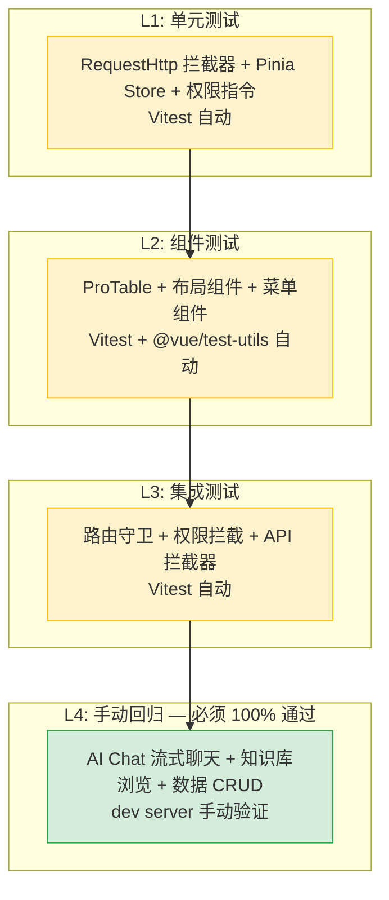

### 13.2 核心测试用例

#### AI Chat 模块

| # | 用例 | 操作 | 预期结果 |
|----|------|----------|
| 1 | SSE 流式聊天 | 发送消息 "你好" | 逐 token 流式渲染 AI 回复 |
| 2 | 会话创建 | 首次发送消息 | 自动创建新会话，会话列表更新 |
| 3 | 会话切换 | 切换到历史会话 | 加载历史消息，消息列表正确渲染 |
| 4 | SSE 断连重试 | 模拟网络中断后恢复 | 自动重连或显示错误提示 |
| 5 | 空消息发送 | 发送空消息 | 前端拦截，不发送 API 请求 |

#### 知识库模块

| # | 用例 | 操作 | 预期结果 |
|----|------|----------|
| 1 | 知识树加载 | 访问知识库页面 | 知识树正确渲染，层级结构正确 |
| 2 | RAG 检索聊天 | 发送知识相关问题 | 返回带引用的 RAG 回答 |
| 3 | 文件预览 | 点击知识文件 | Markdown 渲染预览正确 |
| 4 | 搜索过滤 | 输入关键词搜索 | 知识树按关键词过滤 |

#### 权限系统

| # | 用例 | 操作 | 预期结果 |
|----|------|----------|
| 1 | 未登录访问 | 直接访问受保护路由 | 跳转登录页 |
| 2 | 无权限按钮 | 用户无 `user:delete` 权限 | 删除按钮 DOM 移除 |
| 3 | 动态菜单加载 | 登录后获取菜单 | 菜单与用户权限一致 |
| 4 | Token 过期 | Token 过期后访问 API | 自动清除状态，跳转登录页 |

### 13.3 测试环境要求

| 环境要求 | 说明 |
|----------|------|
| YiAi 后端 | 必须运行，提供 RPC 接口 |
| 浏览器 | Chrome 最新版 |
| 测试数据 | 预置菜单数据、知识文件、测试用户 |
| 网络条件 | 正常网络 + Chrome DevTools 慢网络模拟 |

---

## 15. 技术债务追踪

| # | 技术债 | 优先级 | 预计人天 | 说明 |
|---|--------|--------|---------|------|
| 1 | ProTable 组件完善 | P1 | 2.0 | 当前 ProTable 为基础版本，需补充列配置、批量操作、导出等高级功能 |
| 2 | 单元测试补充 | P1 | 3.0 | 当前仅手动回归，需补充 Vitest 单元测试和组件测试 |
| 3 | 国际化支持 | P2 | 2.0 | 当前仅中文，需补充 `vue-i18n` 英文支持 |
| 4 | 暗色主题 | P2 | 1.0 | Element Plus 支持主题切换，需适配暗色模式 |
| 5 | E2E 测试 | P2 | 2.0 | 引入 Playwright 或 Cypress 进行端到端测试 |
| 6 | 性能监控 | P2 | 1.0 | 接入 Lighthouse CI，监控 FCP/LCP/TBT 指标 |
| 7 | 错误边界 | P3 | 0.5 | 添加 Vue `onErrorCaptured` 全局错误边界，防止白屏 |
| 8 | 构建产物分析 | P3 | 0.5 | 接入 `rsbuild build --analyze` 定期分析构建产物大小 |

---

## 16. 代码审查检查清单

合并前审查人需确认以下项目：

- [ ] 所有新文件遵循 `<script setup lang="ts">` 规范
- [ ] 所有 Props/Emits 使用类型泛型定义
- [ ] 无 `any` 类型使用（或仅限明确标记的边界情况）
- [ ] `RequestHttp` 拦截器正确处理 401/403 响应
- [ ] SSE 流式解析正确处理 `data:` 和 `event:` 字段
- [ ] 动态路由注册使用 `router.addRoute()` 且无重复注册
- [ ] Pinia Store 持久化仅存储可序列化数据（无循环引用）
- [ ] `v-auth` 指令正确绑定权限码，DOM 移除逻辑正确
- [ ] 路由守卫 `beforeEach` 正确处理未登录/无权限跳转
- [ ] 无硬编码的 API 地址（使用环境变量或配置）
- [ ] `vue-tsc --noEmit` 通过
- [ ] ESLint/Prettier 通过
- [ ] `rsbuild build` 成功
- [ ] 手动回归测试（AI Chat + 知识库 + 数据管理）全部通过

---

## 18. 技术选型决策与对比

> July 作为 YiVad 项目初始化月份，关键前端技术选型在此定型，后续月份在此基础上迭代。

| 决策 | 选项 A | 选项 B | 选择 | 理由 |
|------|--------|--------|------|
| **构建工具** | Rsbuild | Vite | Rsbuild | Rspack 内核性能优于 esbuild，且对 Vue 3 支持更成熟 |
| **UI 框架** | Element Plus 2.14 | Ant Design Vue 4 | Element Plus | 中文社区活跃 + 与 Vue 3.5 Composition API 集成更紧密 |
| **状态管理** | Pinia 4.x | Vuex 4 | Pinia | 官方推荐，Composition API 原生支持，更好的 TS 类型推断 |
| **HTTP 客户端** | Axios | fetch | Axios | 拦截器机制成熟，Error 处理统一，兼容性好 |
| **图表库** | ECharts 5.x | Chart.js | ECharts | 中文场景图表类型丰富，大数据量性能优于 Chart.js |
| **测试框架** | Vitest | Jest | Vitest | 与 Rsbuild 生态原生集成，HMR 模式测试速度快 3× |

### 技术栈升级路线

| 组件 | July 版本 | 升级策略 |
|------|----------|----------|
| Vue | 3.5.x | 锁定 minor，大版本升级需全量回归 |
| Element Plus | 2.14.x | 按需引入 + 月度安全更新 |
| Rsbuild | latest | 季度评估升级，关注 breaking changes |
| TypeScript | 5.x strict | strict 模式不可降级 |

---

## 19. 子文档索引

| 月份 | 需求编号 | 文档 | 说明 |
|----------|------|
| 2026-07 | YV-07-01 | [01-需求-项目初始化与构建系统](./01-需求-项目初始化与构建系统.md) | Vue 3.5 + TypeScript strict + Rsbuild 搭建 |
| 2026-07 | YV-07-02 | [02-需求-AI聊天模块迁移](./02-需求-AI聊天模块迁移.md) | AI Chat CLI → RPC 信封 SSE 流式 |
| 2026-07 | YV-07-03 | [03-需求-布局与动态路由](./03-需求-布局与动态路由.md) | 三栏布局 + 菜单驱动的动态路由 |
| 2026-07 | YV-07-04 | [04-需求-知识库集成与基础页面](./04-需求-知识库集成与基础页面.md) | 知识库浏览 + RAG 聊天 + 数据/文件管理 |
| 2026-07 | YV-07-05 | [05-需求-API层设计](./05-需求-API层设计.md) | RequestHttp RPC 拦截器 + 统一错误处理 + 认证集成 |
| 2026-07 | YV-07-06 | [06-需求-状态管理架构设计](./06-需求-状态管理架构设计.md) | 16 个 Pinia Store + 双语法模式 + 持久化策略 + 跨 Store 协调 |
| 2026-07 | YV-07-07 | [07-需求-权限系统与动态菜单](./07-需求-权限系统与动态菜单.md) | v-auth 指令 + 17 个权限码 + 动态路由生成 + 菜单树管理 |

---

*PRD 来源: `projects/yivad/requirements/2026-07/00-需求-需求总览.md`*

