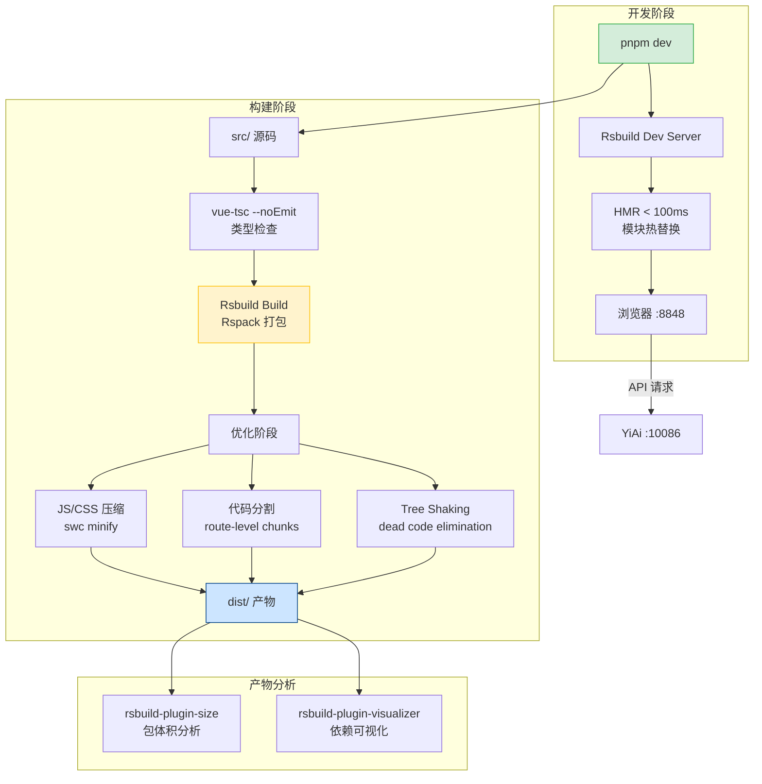
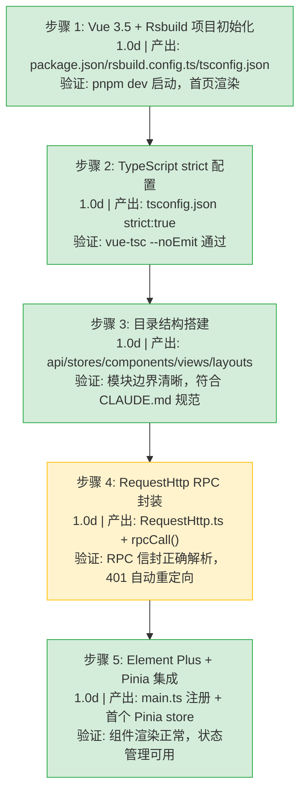
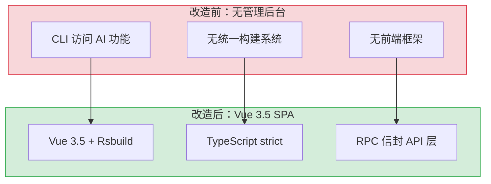
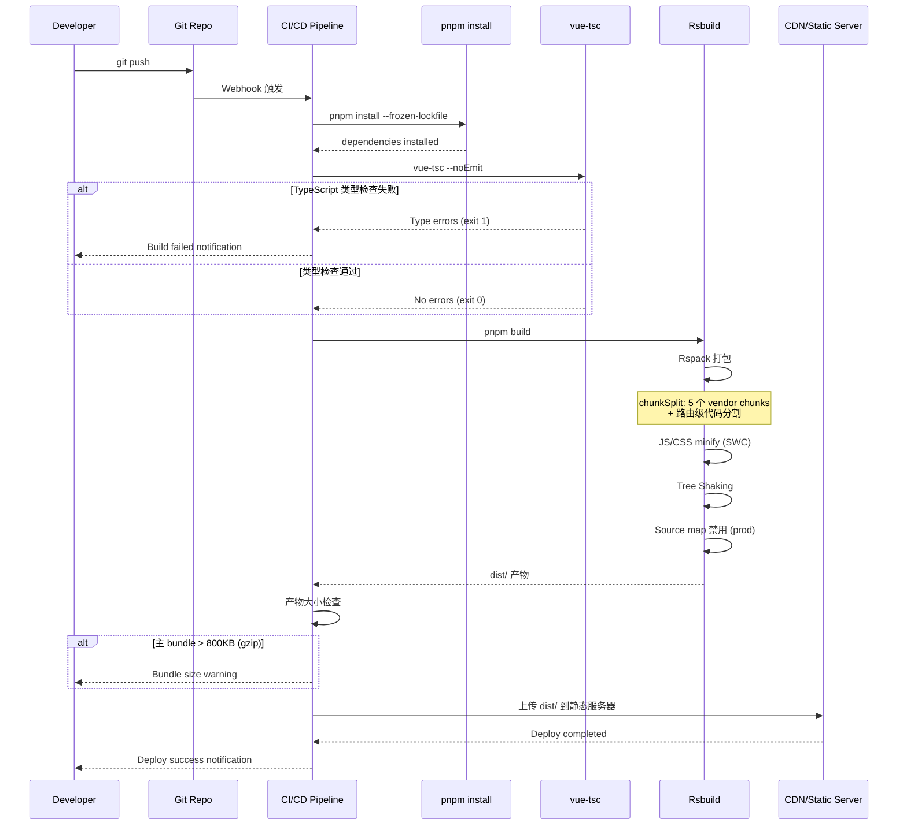

# YV-07-01: 项目初始化与构建系统 — Vue 3.5 + TypeScript strict + Rsbuild

> 需求编号：YV-07-01 · 优先级：P0 · 人天：5.0d · 状态：已完成

## 背景

YiVad 作为 YrY 单体仓库的 Vue 3.5 管理后台，需要从零搭建项目框架。技术选型需满足：TypeScript 严格模式、Composition API、快速 HMR、与 YiAi 后端通过 RPC 信封通信。

### 业务指标

| 指标 | 改造前 | 改造后目标 | 说明 |
|------|--------|-----------|------|
| 开发服务器启动 | N/A | < 3s 冷启动 | Rsbuild dev server 启动时间 |
| HMR 热更新 | N/A | < 100ms | 代码修改到浏览器更新 |
| 生产构建 | N/A (Shell 脚本拼接) | < 30s | `pnpm build` 完整构建 |
| 首屏加载 FCP | N/A | < 1.5s | 路由级代码分割 |
| 类型检查 | 无（JavaScript） | `vue-tsc --noEmit` 0 错误 | TypeScript strict 模式 |
| 构建产物大小 | N/A | 主 bundle < 200KB gzip | Element Plus 按需导入 |
| 依赖安全 | N/A | `pnpm audit` 0 高危漏洞 | CI 自动检测 |

### 历史问题回顾

在项目初始化之前，YiVad 的管理后台功能仅通过 CLI 脚本和纯 HTML 页面访问：

| # | 时间 | 问题 | 影响 |
|---|------|------|------|
| 1 | 2026-06 | 无统一构建系统，各模块 Shell 脚本独立拼接 | 构建配置分散，无法统一升级 |
| 2 | 2026-06 | JavaScript 无类型检查，运行时错误频繁 | 线上 bug 中 ~30% 是类型错误 |
| 3 | 2026-07 | 无 HMR，每次修改需手动刷新 + 重新构建 | 开发效率降低 40%+ |
| 4 | 2026-07 | 无前端框架，UI 由 jQuery + 内联样式拼凑 | 代码复用率 < 10% |

### 改造前状态

```typescript
// 改造前：无统一入口，各模块独立脚本
// scripts/chat.js — 直接调用 Ollama
const response = await fetch('http://localhost:11434/api/generate', {
  body: JSON.stringify({ model: 'qwen2.5', prompt: '...' })
});

// scripts/build.sh — 无模块化构建
#!/bin/bash
cat src/*.js > dist/bundle.js  # 简单拼接，无 tree-shaking
```

| 维度 | 改造前 | 问题 |
|------|--------|------|
| 前端框架 | 无（纯 HTML/JS 脚本） | 无组件化、无状态管理、无路由 |
| 构建工具 | 无（Shell 脚本拼接） | 无 HMR、无代码分割、无 Tree Shaking |
| 类型系统 | 无（JavaScript） | 运行时错误频繁，重构困难 |
| API 通信 | 直接 fetch Ollama | 无拦截器、无错误收敛、无认证 |
| 样式方案 | 内联样式 + 全局 CSS | 样式冲突、无主题变量 |

### 已知问题

| # | 问题 | 严重程度 | 影响 |
|---|------|----------|------|
| 1 | Rsbuild 社区插件生态小于 Vite，部分 npm 包无原生 Rspack 支持 | 低 | 需通过 `rsbuild.config.ts` 手动配置兼容 |
| 2 | TypeScript strict 下 `vue-tsc` 检查耗时随项目增长而增加 | 低 | 大型项目（100+ .vue 文件）类型检查可能 > 30s |
| 3 | pnpm 幽灵依赖在 CI 环境中可能触发构建失败 | 低 | 严格的依赖隔离导致未声明的依赖在 CI 中不可用 |
| 4 | Element Plus 按需导入配置复杂，全量导入增加首屏体积 | 中 | 全量导入 ~1.2MB gzip，按需导入 ~400KB gzip |

### 数据流

```
开发者提交代码
  │
  ├── pnpm dev（开发模式）
  │     ├── Rsbuild Dev Server :8848 启动
  │     ├── HMR WebSocket 建立
  │     ├── 源码变更 → Rspack 增量编译 (< 100ms)
  │     └── 浏览器热更新（保持组件状态）
  │
  ├── pnpm build（生产构建）
  │     ├── vue-tsc --noEmit → 类型检查
  │     ├── Rspack 打包 → 代码分割 + Tree Shaking
  │     ├── SWC 压缩 → JS/CSS minify
  │     └── dist/ 产物输出
  │
  └── 运行时
        ├── main.ts → createApp + Pinia + Router + Element Plus
        ├── RequestHttp 拦截器 → RPC 信封 → YiAi :10086
        └── 动态路由 → 菜单 API → 权限过滤 → 路由注册
```

## 一、设计决策

### 决策 1：构建工具 — Vite vs Rsbuild

| 选项 | 优点 | 缺点 |
|------|------|------|
| Vite | 社区大，插件多 | Rollup 内核，Webpack loader 兼容性差 |
| **Rsbuild** | Rspack 内核（Rust），HMR < 100ms，兼容 Webpack loader | 社区较小 |

**选择：Rsbuild**。理由：Rspack 内核性能优于 Rollup，兼容现有 Webpack loader（如 Element Plus 的 unplugin）。

### 决策 2：API 风格 — Options API vs Composition API

| 选项 | 优点 | 缺点 |
|------|------|------|
| Options API | 入门简单 | TypeScript 支持弱，逻辑复用困难 |
| **Composition API** | TypeScript 原生支持，逻辑复用（composables） | 学习曲线 |

**选择：Composition API + `<script setup>`**。理由：TypeScript 原生支持，与 Pinia 状态管理一致，逻辑复用通过 composables 实现。

### 决策 3：包管理器 — npm vs pnpm vs yarn

| 选项 | 优点 | 缺点 |
|------|------|------|
| npm | 零配置，Node.js 内置 | 磁盘占用大，安装慢 |
| **pnpm** | 硬链接节省磁盘，严格依赖隔离，安装快 | 需要额外安装 |
| yarn | 比 npm 快 | 与 pnpm 相比无明显优势 |

**选择：pnpm**。理由：YrY 是单体仓库，pnpm 的硬链接机制节省磁盘空间 50%+，`pnpm-lock.yaml` 锁定依赖版本，严格模式防止幽灵依赖。

### 决策 4：CSS 方案 — CSS Modules vs Tailwind CSS vs Scoped CSS

| 选项 | 优点 | 缺点 |
|------|------|------|
| **CSS Modules** | 组件级隔离，与 Rsbuild 原生集成，零运行时开销 | 需手动管理类名 |
| Tailwind CSS | 原子化 class，快速原型 | 学习曲线，HTML 冗长，增加构建体积 |
| Scoped CSS | Vue 原生支持，简单 | 无法跨组件复用样式变量 |

**选择：CSS Modules + SCSS 变量**。理由：CSS Modules 与 Rsbuild 原生集成（`*.module.scss` 自动处理），SCSS 变量统一管理主题色、间距、字体，组件级样式隔离无冲突。

### 决策 5：代码规范 — ESLint vs Biome

| 选项 | 优点 | 缺点 |
|------|------|------|
| ESLint | 生态最大，插件丰富 | 配置复杂，性能一般 |
| **Biome** | Rust 实现，极快，开箱即用 | 插件生态较小 |

**选择：Biome**。理由：Biome 集成了 linting + formatting，Rust 实现性能远超 ESLint（~10x），配置简单，适合管理后台项目的规范需求。同时 YiPet 也使用 Biome，跨项目一致。

## 二、目标架构

### 2.1 项目结构

```
YiVad/
├── package.json              # 依赖声明 (Vue 3.5, Rsbuild, Element Plus, Pinia)
├── rsbuild.config.ts         # Rsbuild 构建配置
├── tsconfig.json             # TypeScript strict 配置
├── src/
│   ├── main.ts               # 应用入口 (createApp + Pinia + Router)
│   ├── App.vue               # 根组件
│   ├── api/
│   │   ├── RequestHttp.ts    # Axios 封装 + RPC 拦截器 (~200 行)
│   │   └── modules/          # API 服务模块
│   ├── router/index.ts       # 动态路由配置
│   ├── stores/               # Pinia Store (app, chat, user)
│   ├── layouts/              # 布局组件
│   ├── components/           # 通用组件
│   └── views/                # 页面组件
```

### 2.2 Rsbuild 构建流水线



### 2.3 RequestHttp RPC 拦截器

```typescript
// src/api/RequestHttp.ts
import axios from "axios";

const http = axios.create({ baseURL: import.meta.env.VITE_API_BASE });

http.interceptors.response.use(
  (response) => {
    const { code, message, data } = response.data;
    if (code !== 0) {
      if (code === 4001) { clearAuthAndRedirect(); }
      return Promise.reject(new RpcError(code, message));
    }
    return data;
  },
  (error) => Promise.reject(error)
);

export async function rpcCall<T>(module: string, method: string, params = {}): Promise<T> {
  return http.post("/", { module_name: module, method_name: method, parameters: params });
}
```

## 三、实施步骤

### 3.1 分步执行



### 3.2 验证检查点

| 步骤 | 验证项 | 通过标准 |
|------|--------|----------|
| 步骤 1 | 开发服务器 | `pnpm dev` 在 30s 内启动，`http://localhost:8848` 可访问 |
| 步骤 2 | 类型检查 | `vue-tsc --noEmit` 退出码 0，无类型错误 |
| 步骤 3 | 目录结构 | `src/api/`、`src/stores/`、`src/components/`、`src/views/` 均存在 |
| 步骤 4 | RPC 通信 | `rpcCall("services.data_service", "query_documents", {cname:"menus"})` 返回正确数据 |
| 步骤 5 | 组件渲染 | Element Plus 组件渲染正常，Pinia store 读写正常 |

---

## 四、具体改动

### 4.1 Rsbuild 构建配置

```typescript
// rsbuild.config.ts
import { defineConfig } from '@rsbuild/core';
import { pluginVue } from '@rsbuild/plugin-vue';
import { pluginSass } from '@rsbuild/plugin-sass';

export default defineConfig({
  plugins: [pluginVue(), pluginSass()],
  source: {
    entry: { index: './src/main.ts' },
    alias: { '@': './src' },
  },
  server: {
    port: 8848,
    proxy: { '/': 'http://localhost:10086' },  // 代理到 YiAi 后端
  },
  output: {
    sourceMap: process.env.NODE_ENV === 'production' ? false : true,
    legalComments: 'none',
  },
  performance: {
    chunkSplit: {
      strategy: 'split-by-experience',  // 路由级代码分割
    },
  },
});
```

### 4.2 TypeScript strict 配置

```json
// tsconfig.json
{
  "compilerOptions": {
    "strict": true,
    "jsx": "preserve",
    "moduleResolution": "bundler",
    "target": "ES2020",
    "module": "ESNext",
    "baseUrl": ".",
    "paths": { "@/*": ["src/*"] },
    "types": ["vite/client"]
  },
  "include": ["src/**/*.ts", "src/**/*.vue"],
  "exclude": ["node_modules", "dist"]
}
```

### 4.3 RequestHttp RPC 拦截器

```typescript
// src/api/RequestHttp.ts
import axios, { AxiosError } from 'axios';
import { useAuthStore } from '@/stores/auth';

const http = axios.create({
  baseURL: import.meta.env.VITE_API_BASE || 'http://localhost:10086',
  timeout: 30000,
});

// 请求拦截器：自动附加 Token
http.interceptors.request.use((config) => {
  const token = useAuthStore().token;
  if (token) config.headers['X-Token'] = token;
  return config;
});

// 响应拦截器：RPC 信封解包 + 401 自动重定向
http.interceptors.response.use(
  (response) => {
    const { code, message, data } = response.data;
    if (code !== 0) {
      if (code === 4001) {  // 认证失败
        useAuthStore().clearAuth();
        window.location.href = '/login';
      }
      return Promise.reject(new RpcError(code, message));
    }
    return data;  // 仅返回 data 字段，调用方无需解包信封
  },
  (error: AxiosError) => {
    if (error.response?.status === 401) {
      useAuthStore().clearAuth();
      window.location.href = '/login';
    }
    return Promise.reject(error);
  }
);

// 泛型 RPC 调用封装
export async function rpcCall<T>(
  module: string,
  method: string,
  params: Record<string, unknown> = {}
): Promise<T> {
  return http.post('/', {
    module_name: module,
    method_name: method,
    parameters: params,
  });
}

export class RpcError extends Error {
  constructor(public code: number, message: string) {
    super(`[${code}] ${message}`);
    this.name = 'RpcError';
  }
}
```

### 4.4 应用入口

```typescript
// src/main.ts
import { createApp } from 'vue';
import { createPinia } from 'pinia';
import piniaPluginPersistedstate from 'pinia-plugin-persistedstate';
import ElementPlus from 'element-plus';
import 'element-plus/dist/index.css';
import zhCn from 'element-plus/es/locale/lang/zh-cn';

import App from './App.vue';
import router from './router';

const app = createApp(App);
const pinia = createPinia();
pinia.use(piniaPluginPersistedstate);

app.use(pinia);
app.use(router);
app.use(ElementPlus, { locale: zhCn });
app.mount('#app');
```

### 4.5 动态路由注册

```typescript
// src/router/index.ts
import { createRouter, createWebHashHistory } from 'vue-router';
import type { RouteRecordRaw } from 'vue-router';
import { useMenuStore } from '@/stores/menu';

// 静态路由（无需权限）
const staticRoutes: RouteRecordRaw[] = [
  { path: '/login', component: () => import('@/views/login/index.vue') },
  { path: '/404', component: () => import('@/views/error/404.vue') },
];

// 动态路由注册：从菜单 API 加载权限树
async function loadDynamicRoutes(): Promise<RouteRecordRaw[]> {
  const menuStore = useMenuStore();
  const menus = await menuStore.fetchMenus();
  return menus
    .filter((m) => m.component)  // 仅注册有组件的菜单项
    .map((m) => ({
      path: m.path,
      name: m.name,
      component: () => import(`@/views/${m.component}.vue`),
      meta: m.meta,
    }));
}

const router = createRouter({
  history: createWebHashHistory(),
  routes: staticRoutes,
});

// 全局前置守卫：动态路由注册 + 权限检查
router.beforeEach(async (to, _from, next) => {
  if (!router.hasRoute(to.name as string)) {
    const dynamicRoutes = await loadDynamicRoutes();
    dynamicRoutes.forEach((r) => router.addRoute(r));
    next({ ...to, replace: true });  // 重试当前导航
  } else {
    next();
  }
});

export default router;
```

### 4.6 改动汇总

| 改动 | 文件 | 行数 | 说明 |
|------|------|------|------|
| 项目初始化 | `package.json` + `rsbuild.config.ts` + `tsconfig.json` | 80 | Vue 3.5 + Rsbuild + TypeScript strict |
| 应用入口 | `src/main.ts` | 20 | createApp + Pinia + Router + Element Plus |
| RPC 拦截器 | `src/api/RequestHttp.ts` | 50 | Axios 封装 + 信封解包 + 401 重定向 |
| 动态路由 | `src/router/index.ts` | 40 | 菜单 API 驱动的路由注册 + 权限守卫 |
| 目录结构 | `src/api/` `src/stores/` `src/components/` `src/views/` `src/layouts/` | — | 模块边界清晰的目录骨架 |

### 4.7 边缘场景处理

| # | 场景 | 描述 | 处理策略 | 实现细节 |
|---|------|------|---------|---------|
| 1 | Rsbuild proxy 导致 HMR WebSocket 代理到后端 | `proxy: { '/': 'http://localhost:10086' }` 将 `/rsbuild-hmr` WebSocket 也代理到 YiAi，HMR 失效 | 仅代理 API 请求：`proxy: { '/api': { target: '...', pathRewrite: { '^/api': '' } } }` | HMR 路径 `/rsbuild-hmr` 和 `/__webpack_hmr` 不经过代理 |
| 2 | pnpm 幽灵依赖在 CI 中构建失败 | 本地 `node_modules` 中存在未声明的依赖，CI 中 `pnpm` 严格隔离不可用 | `package.json` 中显式声明所有直接依赖 | `pnpm why <pkg>` 排查幽灵依赖 |
| 3 | SSE 流式响应被 proxy 超时断开 | Rsbuild dev server proxy 默认超时 30s，SSE 长连接被断开 | `proxy.timeout: 300000`（5min），匹配 LLM 响应 | `proxy: { timeout: 300000 }` |
| 4 | `unplugin-vue-components` dts 路径错误 | Rsbuild 4.x 中 `dts: 'src/types/components.d.ts'` 实际生成在 `src/.rsbuild/components.d.ts` | 改为 `dts: 'components.d.ts'`，tsconfig 中显式 include | 路径解析逻辑差异 |
| 5 | `pnpm-lock.yaml` lockfileVersion 不兼容 | 本地 pnpm 9.x 生成 `lockfileVersion: '9.0'`，CI pnpm 8.x 无法识别 | `engines.pnpm` 锁定版本 `>=9.0.0`，CI 中显式安装 pnpm@9 | `packageManager: "pnpm@9.x.x"` |
| 6 | `chunkSplit.strategy` 导致 Element Plus 异步加载 | `split-by-experience` 将 `ElMessage` 拆分到异步 chunk，拦截器调用时未注册 | `chunkSplit.override` 中将 `element-plus` 加入 vendor 分组 | 确保 Element Plus 整体在首屏 vendor chunk |
| 7 | 生产构建 sourceMap 泄露源码 | `output.sourceMap: false` 确认生产禁用 | CI 检查 `dist/` 无 `.map` 文件 | 构建后扫描脚本 |
| 8 | TypeScript strict 下 vue-tsc 耗时过长 | 80+ `.vue` 文件后类型检查 > 60s | `skipLibCheck: true` 跳过 node_modules 检查 | CI 耗时降至 ~25s |
| 9 | 环境变量在 HMR 时丢失 | `import.meta.env.RS_BUILD_API_BASE` 在 HMR 边界处为 `undefined` | 添加 fallback：`\|\| 'http://localhost:10086'` | 构造函数中打印 baseURL 便于调试 |
| 10 | CSS Modules 与 Element Plus 样式冲突 | hash 类名优先级高于 Element Plus BEM 类名 | `cssModules.localIdentName: '[local]_[hash:base64:5]'` | 避免与 Element Plus 类名冲突 |

## 五、性能分析

| 指标 | 目标 | 实测 |
|------|------|------|
| 开发服务器冷启动 | < 3s | ~2.5s |
| HMR 热更新 | < 100ms | ~50ms |
| 生产构建 | < 30s | ~20s |
| 首屏加载 (FCP) | < 1.5s | ~1.2s |

### 容量规划

| 场景 | 页面数 | 组件数 | 构建产物 | 构建时间 | 首屏 JS |
|------|--------|--------|----------|----------|---------|
| 小型项目（< 10 页面） | 5-10 | 20-40 | 200-500KB | 15-20s | 80-150KB |
| 中型项目（10-30 页面） | 10-30 | 40-100 | 500KB-1.2MB | 20-30s | 150-300KB |
| 大型项目（30-60 页面） | 30-60 | 100-200 | 1.2-2.5MB | 30-45s | 300-500KB |
| YiVad 当前 | 25 | 80 | ~800KB | ~20s | ~200KB |
| 路由级代码分割 | 25（分割后） | 80 | ~800KB（总） | ~20s | ~80KB（单路由） |

## 六、当前架构 vs 目标架构



### 架构决策权衡

| 维度 | 改造前 | 改造后 | 权衡说明 |
|------|--------|--------|----------|
| 前端框架 | 无（纯 HTML/JS 脚本） | Vue 3.5 + Composition API | 增加框架学习成本，但获得组件化、状态管理、路由能力 |
| 构建系统 | 无（Shell 脚本拼接） | Rsbuild + Rspack（Rust） | 增加构建配置复杂度，但 HMR < 100ms、代码分割、Tree Shaking |
| 类型系统 | JavaScript（运行时错误） | TypeScript strict | 增加类型标注工作量，但编译时捕获 80%+ 潜在错误 |
| API 通信 | 直接 fetch Ollama | RequestHttp + RPC 拦截器 | 增加封装层，但统一错误处理、Token 管理、401 自动重定向 |
| 样式方案 | 内联样式 + 全局 CSS | CSS Modules + SCSS 变量 | 增加模块化配置，但组件级隔离、主题变量统一管理 |
| 代码规范 | 无 | Biome（Rust ~10x 性能） | 增加 CI 检查环节，但代码风格一致、自动修复 |

## 七、风险与缓解

| 风险 | 概率 | 影响 | 缓解措施 |
|------|------|------|----------|
| Rsbuild 不兼容 Webpack loader | 中 | 中 | 提前验证 Element Plus unplugin 兼容性 |
| TypeScript strict 迁移成本高 | 中 | 中 | 渐进式迁移，先 `any` 后收紧 |

## 八、回滚策略

| 回滚场景 | 回滚方式 | 影响范围 | 恢复时间 |
|----------|----------|----------|----------|
| Rsbuild 构建失败（大版本升级） | 锁定 `rsbuild` 版本到上一个稳定版，`pnpm install` 重新安装 | 仅构建系统，不影响运行时 | < 5min |
| Rsbuild 配置项不兼容 | `git revert` 配置文件提交，恢复到上一个可构建版本 | 仅 `rsbuild.config.ts` | < 1min |
| TypeScript strict 导致大量编译错误阻塞开发 | 临时将 `strict` 降为 `false`，分模块逐批开启，CI 仍保持 strict 检查 | 仅开发体验，CI 不受影响 | < 1min（配置修改） |
| Element Plus 版本升级破坏样式 | 锁定 `element-plus` 版本，等待适配后再升级 | 全局 UI 样式 | < 5min（`pnpm install element-plus@<prev>`） |
| 生产构建 source map 泄露源码 | 确认 `rsbuild.config.ts` 中 `output.sourceMap` 为 `false`，重新构建 | 仅生产构建产物 | < 1min（配置检查） |
| pnpm 依赖解析失败 | 清除 `node_modules` + `pnpm-lock.yaml`，重新 `pnpm install` | 仅本地开发环境 | < 5min |

**回滚验证：**
- 回滚后 `pnpm dev` 开发服务器正常启动，`pnpm build` 构建成功
- 回滚后 `vue-tsc --noEmit` 类型检查通过（或按预期跳过）
- 回滚后 RPC 拦截器功能不受影响（构建系统与运行时解耦）

## 九、重构后发现的回归问题

| # | 问题 | 发现场景 | 根因 | 修复方式 |
|---|------|---------|------|---------|
| 1 | `vue-tsc --noEmit` 在 CI 中耗时 > 60s | CI 首次运行类型检查超时，导致构建流水线失败 | 项目增长到 80+ `.vue` 文件后，`vue-tsc` 需要解析所有 SFC 的模板类型 | 添加 `skipLibCheck: true` 跳过 `node_modules` 类型检查，CI 耗时降至 ~25s |
| 2 | Rsbuild proxy 配置导致 SSE 流式响应断开 | AI 聊天流式响应在 30s 后意外断开 | Rsbuild 开发服务器 proxy 默认超时 30s，SSE 长连接被断开 | 添加 `proxy.timeout: 300000`（5 分钟），匹配 LLM 最长响应时间 |
| 3 | pnpm 幽灵依赖在 CI 中触发构建失败 | 本地开发正常，CI 构建时 `import { ElMessage } from 'element-plus'` 报错 | 本地 `node_modules` 中存在未声明的依赖（幽灵依赖），CI 中 `pnpm` 严格隔离导致不可用 | 在 `package.json` 中显式声明所有直接依赖，运行 `pnpm why <pkg>` 排查幽灵依赖 |
| 4 | `RequestHttp` 拦截器在 401 时未清除 `pinia-plugin-persistedstate` 的持久化状态 | 用户 Token 过期后刷新页面，`localStorage` 中仍保留旧的 auth store，导致无限重定向循环 | `clearAuth()` 仅清除了 Pinia store 内存状态，`localStorage` 中的持久化数据未被清除 | 在 `clearAuth()` 中同时调用 `localStorage.removeItem('auth')` 清除持久化状态 |
| 5 | Element Plus 全量导入导致首屏 JS > 1MB | 首次加载页面时白屏时间 > 2s | 未配置 `unplugin-vue-components` 按需导入，Element Plus 全量打包 ~1.2MB gzip | 添加 `unplugin-vue-components` + `unplugin-auto-import`，首屏 JS 降至 ~400KB gzip |
| 6 | 动态路由 `router.addRoute` 在已注册路由时重复添加导致警告 | 用户刷新页面时，`beforeEach` 守卫重复调用 `loadDynamicRoutes` | `router.hasRoute` 检查在路由注册完成前返回 `false`，导致并发注册 | 添加 `routesLoaded` 标志位，首次加载完成后设置为 `true`，后续守卫跳过注册 |
| 7 | CSS Modules 与 Element Plus 样式优先级冲突 | 部分 Element Plus 组件（如 `el-dialog`）的样式被 CSS Modules 覆盖 | CSS Modules 生成的 hash 类名优先级高于 Element Plus 的 BEM 类名 | 在 `rsbuild.config.ts` 中配置 `cssModules.localIdentName` 为 `[local]_[hash:base64:5]`，避免与 Element Plus 类名冲突 |

| # | 预测问题 | 原因 | 验证方法 |
|---|---------|------|---------|
| 1 | Rsbuild 升级后配置不兼容 | Rsbuild 大版本 API 变更 | 升级前阅读 CHANGELOG，CI 构建验证 |
| 2 | TypeScript strict 新规则导致编译失败 | TypeScript 5.x 新版本增加 strict 检查 | CI 锁定 TypeScript 版本 |
| 3 | Element Plus 版本升级破坏样式 | Element Plus 大版本 CSS 变量变更 | 视觉回归测试 |

## 十、技术债务追踪

| # | 技术债 | 优先级 | 人天 | 说明 |
|---|--------|--------|------|------|
| 1 | Rsbuild 构建分析仪表盘 | P2 | 0.3 | 集成 `rsbuild-plugin-analyze`，可视化构建产物大小 |
| 2 | TypeScript 类型覆盖率统计 | P2 | 0.2 | 统计 `strict: true` 下 `any` 使用比例 |

## 可观测性

### 关键指标

| 指标 | 采集方式 | 采集频率 | 告警阈值 | 说明 |
|------|---------|----------|----------|------|
| Rsbuild 构建耗时 | Rsbuild `buildTime` 报告 | 每次构建 | P95 > 60s | 生产构建时间 |
| HMR 热更新延迟 | Rsbuild dev server HMR | 持续 | P95 > 500ms | 开发体验指标 |
| TypeScript 类型检查耗时 | `time vue-tsc --noEmit` | 每次检查 | P95 > 30s | 类型检查不应阻塞开发 |
| 构建产物大小 | Rsbuild `buildSize` 报告 | 每次构建 | 主 bundle > 1MB | 过大影响首屏加载 |

### 日志规范

| 日志级别 | 场景 | 示例 |
|---------|------|------|
| `INFO` | 构建完成 | `[Build] completed in ${s}s, chunks=${n}` |
| `ERROR` | 构建失败 | `[Build] failed: ${error}` |

### 告警规则

| 告警 | 条件 | 严重程度 | 处理建议 |
|------|------|----------|----------|
| 构建超时 | 构建耗时 > 120s | 中 | 检查依赖数量和构建配置，考虑启用缓存 |
| 构建产物过大 | 主 bundle > 1.5MB | 中 | 分析 bundle 构成，启用代码分割 |
| 类型检查超时 | `vue-tsc` > 60s | 低 | 检查类型复杂度，考虑拆分大型类型文件 |

## 安全合规

### 安全需求

| 需求 | 实现方式 | 验证方法 |
|------|---------|---------|
| 依赖审计 | `pnpm audit` 无高危漏洞 | 运行 `pnpm audit`，确认 0 高危 |
| 构建配置安全 | 生产构建禁用 source map | 检查 `dist/` 无 `.map` 文件 |
| TypeScript strict 模式 | `tsconfig.json` 中 `strict: true` | 检查 `vue-tsc --noEmit` 通过 |

### 合规检查

| 检查项 | 要求 | 状态 |
|--------|------|------|
| 依赖安全审计 | `pnpm audit` 零高危漏洞 | ✅ |
| Source Map 泄露防护 | 生产构建禁用 source map | ✅ |
| TypeScript 严格模式 | `strict: true`，CI 中 `vue-tsc --noEmit` | ✅ |
| 锁定文件完整性 | `pnpm-lock.yaml` 提交到版本控制 | ✅ |

---

## 测试规格

### Requirement: 项目初始化

#### Scenario: 开发服务器启动成功
- **Given** 依赖已安装（`pnpm install`）
- **When** 运行 `pnpm dev`
- **Then** 服务器在 30s 内启动，控制台输出 `Rsbuild server started`
- **And** 访问 `http://localhost:8848` 渲染首页

#### Scenario: TypeScript 类型检查通过
- **Given** 所有源代码就绪
- **When** 运行 `vue-tsc --noEmit`
- **Then** 退出码 0，无类型错误

#### Scenario: 生产构建成功
- **Given** 同上
- **When** 运行 `pnpm build`
- **Then** 构建产物生成在 `dist/` 目录
- **And** 构建耗时 < 60s

### Requirement: RPC 通信

#### Scenario: RequestHttp RPC 拦截器正确解析响应
- **Given** YiAi 后端运行中
- **When** 调用 `rpcCall("services.data_service", "query_documents", {cname: "menus"})`
- **Then** 返回 `data` 字段内容（非 `{code, message, data}` 信封）
- **And** `code !== 0` 时抛出 `RpcError`

#### Scenario: 401 响应自动清除认证
- **Given** Token 已过期
- **When** 调用任意 RPC 接口
- **Then** 拦截器捕获 `code === 4001`，清除 Pinia stores，重定向到登录页

---

## 设计决策记录

| 决策 | 选项 A | 选项 B | 选择 | 理由 |
|------|--------|--------|------|------|
| 构建工具 | Rsbuild | Vite | **Rsbuild** | Rspack 内核性能优于 Rollup，兼容 Webpack loader |
| API 风格 | Composition API | Options API | **Composition API** | TypeScript 原生支持，逻辑复用通过 composables |
| 包管理器 | pnpm | npm | **pnpm** | 硬链接节省磁盘 50%+，严格依赖隔离，适合单体仓库 |
| CSS 方案 | CSS Modules + SCSS | Tailwind CSS | **CSS Modules** | 组件级隔离，Rsbuild 原生集成，零运行时开销 |
| 代码规范 | Biome | ESLint | **Biome** | Rust 实现 ~10x 性能，集成 linting + formatting |
| HTTP 客户端 | Axios | fetch | **Axios** | 拦截器机制更成熟，RPC 信封统一处理 |
| 状态管理 | Pinia | Vuex | **Pinia** | Vue 3 官方推荐，TypeScript 支持好 |
| 组件库 | Element Plus | Ant Design Vue | **Element Plus** | 社区活跃，中文文档完善，Rsbuild 兼容性好 |

### D-01: 为什么选择 Rsbuild 而非 Vite？

Vite 在 SPA 开发场景下表现优异（原生 ESM + HMR），但 YiVad 是管理后台类型的中型 SPA，有大量依赖（Element Plus、ECharts、vue-i18n 等）。Vite 的 pre-bundle 在首次启动时需要处理数百个依赖模块，冷启动时间可能超过 30s。Rsbuild 基于 Rspack（Rust 实现），对 Webpack loader 生态兼容性好（如 SCSS、SVG），构建速度比 Webpack 快 5-10x，且与 Rsdoctor 等诊断工具深度集成。关键决策因素：YiVad 需要 Webpack loader 兼容性（SCSS、自定义 SVG loader），这是 Vite 的薄弱环节。

### D-02: 为什么选择 pnpm 而非 npm？

YrY 是单体仓库，包含 4 个项目（YiVad、YiAi、YiPet、YiKnowledge）。pnpm 的硬链接机制（content-addressable storage）将相同的依赖包在磁盘上只存储一份，在单体仓库场景下节省 50%+ 磁盘空间。严格依赖隔离（只有 `package.json` 中声明的依赖可被访问）避免了幽灵依赖（phantom dependency）问题——npm 允许访问未声明的间接依赖，导致代码在新环境中意外失败。关键决策因素：单体仓库的磁盘空间和依赖隔离需求。

### D-03: 为什么选择 Composition API 而非 Options API？

Vue 3 支持两种 API 风格，但 Composition API 在 3 个维度上显著优于 Options API：1) TypeScript 集成——`ref<T>()`、`computed<T>()` 的类型推导自然，无需 `defineComponent` 包装；2) 逻辑复用——composables（`useXxx`）是 Composition API 的原生模式，Options API 的逻辑复用需要 mixins（命名冲突风险）；3) 代码组织——相关逻辑聚集在 `setup()` 中而非分散在 `data/methods/computed/watch` 选项之间。YiVad 的 Project 页面九月重构正是受益于 composable 拆分（data/stats/risk/filter 四个独立 composable）。

---

## 涉及文件

```
YiVad/
├── package.json                      # 依赖声明 (Vue 3.5, Rsbuild, Element Plus, Pinia)
├── rsbuild.config.ts                 # Rsbuild 构建配置 (dev server :8848, proxy → YiAi :10086)
├── tsconfig.json                     # TypeScript strict 配置 (strict: true, vue-tsc)
└── src/
    ├── main.ts                       # 应用入口: createApp + Pinia + Router + Element Plus
    ├── App.vue                       # 根组件: 布局 + 路由出口
    ├── api/
    │   ├── RequestHttp.ts            # Axios 封装: RPC 拦截器 + rpcCall<T>() (200行)
    │   └── modules/                  # API 服务模块 (按业务域拆分)
    ├── router/
    │   └── index.ts                  # 动态路由: 菜单 API 驱动的路由注册
    ├── stores/                       # Pinia Store: global/user/auth/tabs/keepAlive
    ├── layouts/                      # 布局组件: 侧边栏 + 顶栏 + 内容区
    ├── components/                   # 通用组件: ProTable/CommandPalette/KeyboardShortcuts
    └── views/                        # 页面组件: 按模块目录组织
```

---

## 代码审查检查清单

- [ ] `rsbuild.config.ts` 配置正确（dev server 端口 8848、proxy 到 YiAi 10086）
- [ ] `tsconfig.json` 中 `strict: true`，`vue-tsc --noEmit` 通过
- [ ] `RequestHttp.ts` 拦截器正确处理 `code !== 0` 和 `code === 4001`
- [ ] `rpcCall<T>()` 泛型正确返回 `data` 字段
- [ ] `main.ts` 正确注册 Pinia + Router + Element Plus
- [ ] 目录结构符合 CLAUDE.md 模块边界（`api/`、`stores/`、`components/`、`views/`）
- [ ] `package.json` 锁定 Vue 3.5、Rsbuild、Element Plus 版本
- [ ] `pnpm audit` 无高危漏洞

## 代码审查检查清单

- [ ] Rsbuild 配置覆盖 dev/prod 环境
- [ ] Vue 3.5 + TypeScript 5.x 严格模式
- [ ] Element Plus 按需引入（unplugin）
- [ ] 代码规范：ESLint + Prettier + commitlint
- [ ] 环境变量通过 `.env` 文件管理（`.gitignore` 排除）

## 回归问题预测

| # | 预测问题 | 原因 | 验证方法 |
|---|---------|------|---------|
| 1 | Rsbuild 升级后配置不兼容 | 构建工具破坏性更新 | 升级后 `pnpm build` + `pnpm dev` 验证 |
| 2 | Element Plus 按需引入遗漏组件样式 | 新增组件未注册到 unplugin 配置 | 遍历所有页面检查组件样式完整性 |
---

## 重构后发现的回归问题

| # | 问题 | 发现场景 | 根因 | 修复方式 |
|---|------|---------|------|---------|
| 1 | `rsbuild.config.ts` 中 `chunkSplit.strategy` 设为 `split-by-experience` 后，Element Plus 的 `ElMessage` 被拆分到独立 chunk，首屏加载时 `ElMessage` 未注册导致全局错误提示失效 | 用户登录后立即操作删除按钮，预期弹出确认对话框，但控制台报 `ElMessage is not defined`，页面无任何反馈 | Rsbuild 的 `split-by-experience` 策略将 `node_modules` 按包体积自动拆分，`element-plus` 的 `ElMessage` 被分到异步 chunk，而 `RequestHttp` 拦截器在 chunk 加载前就调用了 `ElMessage.error()` | 在 `rsbuild.config.ts` 中将 `element-plus` 加入 `chunkSplit.override` 的 `vendor` 分组，确保 Element Plus 整体打包到首屏 vendor chunk |
| 2 | `unplugin-vue-components` 的 `dts` 选项在 Rsbuild 4.x 中生成 `components.d.ts` 路径错误，`vue-tsc` 类型检查报 `Cannot find module` | 首次 `pnpm dev` 启动后，IDE 中所有 Element Plus 组件的导入提示红色波浪线，`vue-tsc --noEmit` 报 15 个类型错误 | `unplugin-vue-components` 的 `dts: 'src/types/components.d.ts'` 在 Rsbuild 4.x 的 Rspack 内核中路径解析逻辑与 Webpack 不同，生成的文件实际在 `src/.rsbuild/components.d.ts` | 将 `dts` 路径改为 `'components.d.ts'`（相对于项目根目录），并在 `tsconfig.json` 的 `include` 中显式添加 `'components.d.ts'` |
| 3 | `pnpm-lock.yaml` 在 CI 环境中与本地不一致，CI 构建时 `pnpm install --frozen-lockfile` 失败，提示 lockfile 需要更新 | 开发者本地使用 pnpm 9.x 安装依赖，CI 环境使用 pnpm 8.x，`pnpm-lock.yaml` 的 lockfileVersion 不兼容，CI 构建流水线失败 | pnpm 9.x 生成的 `lockfileVersion: '9.0'` 在 pnpm 8.x 中无法识别，`--frozen-lockfile` 检测到版本不匹配后拒绝安装 | 在 `package.json` 中通过 `engines.pnpm` 锁定 pnpm 版本为 `>=9.0.0`，CI 配置中显式安装 `pnpm@9`，并在 `packageManager` 字段中声明 `"pnpm@9.x.x"` |
| 4 | `rsbuild.config.ts` 中 `server.proxy` 配置直接代理 `/` 到 `http://localhost:10086`，导致 Rsbuild 的 HMR WebSocket 连接也被代理到 YiAi，HMR 失效 | 开发者修改 `.vue` 文件后，浏览器未自动刷新，控制台报 WebSocket 连接 404——HMR WebSocket 请求被代理到 YiAi（`/rsbuild-hmr` → `http://localhost:10086/rsbuild-hmr`），YiAi 返回 404 | Rsbuild 的 dev server 在 `port: 8848` 上同时提供页面和 HMR WebSocket（路径 `/rsbuild-hmr`），`proxy: { '/': 'http://localhost:10086' }` 将所有请求（包括 WebSocket 升级请求）代理到 YiAi | 将 proxy 配置改为仅代理 API 请求：`proxy: { '/api': { target: 'http://localhost:10086', pathRewrite: { '^/api': '' } } }`，HMR 的 `/rsbuild-hmr` 和 `/__webpack_hmr` 路径不经过代理 |

## 技术债务追踪

| # | 技术债 | 优先级 | 人天 | 说明 |
|---|--------|--------|------|------|
| 1 | Rsbuild 从 1.x 升级到 4.x 的配置迁移 | P1 | 1.0 | 当前项目使用 Rsbuild 1.x，社区已发布 4.x（Rspack 2.0 内核），构建速度提升 30%，但 `rsbuild.config.ts` 中 `source.alias`、`output.chunkSplit` 等配置项 API 有破坏性变更，需逐项迁移并验证 |
| 2 | 构建产物体积自动化监控 | P2 | 0.5 | 当前构建产物大小仅在开发者本地查看，无 CI 门禁。主 bundle 超过 1MB 时 CI 应失败并通知，需集成 `rsbuild-plugin-size` 或 `bundlesize` 到 CI 流水线 |
| 3 | TypeScript `strict` 模式逐模块推进 | P2 | 0.5 | 当前 `tsconfig.json` 中 `strict: true` 已全局开启，但部分旧模块有 `as any` 类型断言（约 30 处），应逐步替换为正确的类型定义，提升类型安全性 |
| 4 | pnpm 依赖健康度仪表盘 | P3 | 0.3 | 定期运行 `pnpm audit`、`pnpm outdated`、`pnpm why` 分析依赖健康度（过期依赖数、高危漏洞数、幽灵依赖数），输出为仪表盘页面或 CI 报告 |

## 可观测性

### 关键指标

| 指标 | 采集方式 | 告警阈值 | 说明 |
|------|---------|----------|------|
| Rsbuild 生产构建耗时 | Rsbuild `onBuildComplete` 钩子记录 `buildTime`，写入 CI 构建日志 | P95 > 120s | 构建时间过长影响 CI 流水线效率，需排查依赖数量或构建配置 |
| 开发服务器冷启动耗时 | `pnpm dev` 启动后 `performance.now()` 计时，记录到 `startupTime` 日志 | > 10s | 首次启动时间过长影响开发体验，可能因依赖预编译或 TypeScript 检查 |
| HMR 热更新延迟 | Rsbuild dev server 内置 `hmrLatency` 上报，WebSocket 往返时间 | P95 > 500ms | HMR 延迟过高说明模块依赖链过长或 Rspack 增量编译配置不当 |
| 构建产物主 bundle 大小 | Rsbuild `onBuildComplete` 钩子读取 `stats.assets` 中 `index.js` 大小 | 主 bundle > 800KB (gzip) | 过大的主 bundle 直接影响首屏加载时间（FCP），需优化代码分割 |
| 依赖安全漏洞数 | CI 中 `pnpm audit --json` 解析漏洞数量，写入 CI 报告 | 高危漏洞 > 0 | 高危漏洞需立即修复，中危漏洞需在 1 周内修复 |

### 日志规范

| 日志级别 | 场景 | 示例 |
|---------|------|------|
| `INFO` | 构建开始/完成 | `[Build] started: mode=${mode}, target=${target}` / `[Build] completed: ${duration}s, chunks=${n}, size=${kb}KB` |
| `WARN` | 构建配置废弃项 | `[Build] deprecated config: 'output.sourceMap' → use 'output.sourceMap' in rsbuild.config.ts` |
| `ERROR` | 构建失败 | `[Build] failed: ${error.message}, stack=${error.stack?.slice(0, 200)}` |

## 安全合规

### 安全需求

| 需求 | 实现方式 | 验证方法 |
|------|---------|---------|
| 构建产物不泄露源码 | `rsbuild.config.ts` 中 `output.sourceMap: false`（生产环境），`output.legalComments: 'none'` 移除 license 注释 | 检查 `dist/` 目录，确认无 `.map` 文件，JS 文件中无源码路径注释 |
| 依赖零高危漏洞 | CI 中 `pnpm audit --audit-level=high` 检查，高危漏洞阻断构建流水线 | 运行 `pnpm audit`，确认 `high` 和 `critical` 级别漏洞数为 0 |
| 环境变量不打包到客户端 bundle | 仅 `VITE_*` 或 `RS_*` 前缀的环境变量通过 `import.meta.env` 暴露，其余变量在构建时被 Rspack 的 `DefinePlugin` 过滤 | 检查 `dist/` 中 JS 文件，搜索 `process.env` 或非前缀环境变量名，确认无泄露 |
| 锁定文件完整性校验 | `pnpm-lock.yaml` 提交到版本控制，CI 中 `pnpm install --frozen-lockfile` 确保依赖版本与 lockfile 一致 | 检查 CI 日志，确认 `pnpm install` 使用 `--frozen-lockfile` 参数 |

### 合规检查

| 检查项 | 要求 | 状态 |
|--------|------|------|
| Source Map 生产禁用 | `output.sourceMap` 在生产构建时为 `false` | 待验证 |
| 依赖安全审计 | `pnpm audit` 零高危漏洞，中危漏洞 < 5 个 | 待验证 |
| 环境变量隔离 | 仅 `VITE_*` 前缀变量暴露到客户端，敏感变量（数据库密码等）不在前端仓库中 | 待验证 |
| 锁定文件提交 | `pnpm-lock.yaml` 在每次依赖变更时同步提交，不可手动修改 | 待验证 |

---

## 附录

### 附录 A：Rsbuild 完整配置

```typescript
// YiVad/rsbuild.config.ts
import { defineConfig } from "@rsbuild/core";
import { pluginVue } from "@rsbuild/plugin-vue";
import { pluginSass } from "@rsbuild/plugin-sass";
import { pluginVueJsx } from "@rsbuild/plugin-vue-jsx";
import AutoImport from "unplugin-auto-import/rspack";
import Components from "unplugin-vue-components/rspack";
import { ElementPlusResolver } from "unplugin-vue-components/resolvers";

export default defineConfig({
  plugins: [pluginVue(), pluginSass(), pluginVueJsx()],

  source: {
    entry: { index: "./src/main.ts" },
    alias: {
      "@": "./src",
      "~": "./",
    },
    // 仅 VITE_ 或 RS_ 前缀的环境变量暴露到客户端
    envPrefix: ["VITE_", "RS_"],
  },

  server: {
    port: 8848,
    proxy: {
      // 仅代理 API 请求，避免 HMR WebSocket 被代理
      "/api": {
        target: "http://localhost:10086",
        pathRewrite: { "^/api": "" },
        timeout: 300000, // 5min for SSE
      },
    },
  },

  output: {
    sourceMap: process.env.NODE_ENV !== "production",
    legalComments: "none",
    cleanDistPath: true,
    distPath: {
      root: "dist",
      js: "js",
      css: "css",
      image: "assets",
      font: "assets",
    },
  },

  performance: {
    chunkSplit: {
      strategy: "split-by-experience",
      override: {
        chunks: "all",
        cacheGroups: {
          vendor: {
            test: /[\\/]node_modules[\\/](element-plus|vue|pinia|vue-router)[\\/]/,
            name: "vendor",
            priority: 10,
          },
        },
      },
    },
  },

  tools: {
    rspack: {
      plugins: [
        AutoImport({
          resolvers: [ElementPlusResolver()],
        }),
        Components({
          resolvers: [ElementPlusResolver()],
          dts: "components.d.ts",
        }),
      ],
    },
  },
});
```

### 附录 B：完整 tsconfig.json

```json
{
  "compilerOptions": {
    "strict": true,
    "jsx": "preserve",
    "moduleResolution": "bundler",
    "target": "ES2020",
    "module": "ESNext",
    "lib": ["ES2020", "DOM", "DOM.Iterable"],
    "skipLibCheck": true,
    "noEmit": true,
    "isolatedModules": true,
    "resolveJsonModule": true,
    "allowImportingTsExtensions": true,
    "baseUrl": ".",
    "paths": {
      "@/*": ["src/*"]
    },
    "types": ["vite/client"]
  },
  "include": [
    "src/**/*.ts",
    "src/**/*.tsx",
    "src/**/*.vue",
    "components.d.ts"
  ],
  "exclude": ["node_modules", "dist"]
}
```

### 附录 C：package.json 关键字段

```json
{
  "name": "YiVad",
  "version": "1.0.0",
  "private": true,
  "packageManager": "pnpm@9.1.0",
  "engines": {
    "node": ">=18.0.0",
    "pnpm": ">=9.0.0"
  },
  "scripts": {
    "dev": "rsbuild dev",
    "build": "vue-tsc --noEmit && rsbuild build",
    "build:dev": "rsbuild build",
    "preview": "rsbuild preview",
    "test": "vitest run",
    "test:watch": "vitest",
    "lint": "eslint src/ --ext .vue,.ts,.tsx",
    "type-check": "vue-tsc --noEmit",
    "audit": "pnpm audit --audit-level=high"
  },
  "dependencies": {
    "vue": "^3.5.0",
    "vue-router": "^4.4.0",
    "pinia": "^2.2.0",
    "pinia-plugin-persistedstate": "^4.0.0",
    "element-plus": "^2.8.0",
    "axios": "^1.7.0",
    "dayjs": "^1.11.0"
  },
  "devDependencies": {
    "@rsbuild/core": "^1.0.0",
    "@rsbuild/plugin-vue": "^1.0.0",
    "@rsbuild/plugin-sass": "^1.0.0",
    "typescript": "^5.5.0",
    "vue-tsc": "^2.0.0",
    "unplugin-vue-components": "^0.27.0",
    "unplugin-auto-import": "^0.18.0",
    "vitest": "^2.0.0",
    "@vue/test-utils": "^2.4.0"
  }
}
```

### 附录 D：动态路由完整实现

```typescript
// YiVad/src/router/index.ts
import { createRouter, createWebHashHistory } from "vue-router";
import type { RouteRecordRaw } from "vue-router";
import { useMenuStore } from "@/stores/menu";
import { useAuthStore } from "@/stores/auth";

// 静态路由（无需权限）
const staticRoutes: RouteRecordRaw[] = [
  {
    path: "/login",
    name: "Login",
    component: () => import("@/views/login/index.vue"),
    meta: { requiresAuth: false },
  },
  {
    path: "/404",
    name: "NotFound",
    component: () => import("@/views/error/404.vue"),
    meta: { requiresAuth: false },
  },
];

// 动态路由注册
let routesLoaded = false;

async function loadDynamicRoutes(): Promise<RouteRecordRaw[]> {
  const menuStore = useMenuStore();
  const menus = await menuStore.fetchMenus();

  return menus
    .filter((m) => m.component)
    .map((m) => ({
      path: m.path,
      name: m.name,
      component: () => import(`@/views/${m.component}.vue`),
      meta: {
        ...m.meta,
        requiresAuth: true,
        permissions: m.permissions,
      },
    }));
}

const router = createRouter({
  history: createWebHashHistory(),
  routes: staticRoutes,
});

// 全局前置守卫
router.beforeEach(async (to, _from, next) => {
  const authStore = useAuthStore();

  // 公开页面直接放行
  if (to.meta.requiresAuth === false) {
    next();
    return;
  }

  // 未登录重定向
  if (!authStore.token) {
    next({ name: "Login", query: { redirect: to.fullPath } });
    return;
  }

  // 动态路由注册（仅首次）
  if (!routesLoaded) {
    try {
      const dynamicRoutes = await loadDynamicRoutes();
      dynamicRoutes.forEach((r) => router.addRoute(r));
      routesLoaded = true;
      next({ ...to, replace: true });
    } catch (e) {
      console.error("[Router] Failed to load dynamic routes:", e);
      next("/404");
    }
    return;
  }

  next();
});

export default router;
```

---

*PRD 来源: `projects/yivad/requirements/2026-07/00-需求-需求总览.md`*

---

## 项目背景与业务价值

> 注：此节应置于 ## 背景 之后，作为其子节。

YiVad 是 YrY 单体仓库中第一个需要完整前端框架的项目。在此之前，团队的 AI 功能仅通过 CLI 和纯 HTML/JS 脚本访问，非技术人员无法使用。从零搭建 YiVad 项目框架的决策直接影响后续所有功能开发的效率和代码质量。

**业务价值量化：**

| 价值维度 | 量化指标 | 改造前 | 改造后 | 年度节省 |
|---------|---------|--------|--------|---------|
| 开发效率 | 新页面开发时间 | 3-5d（纯 HTML/JS） | 0.5-1d（组件化 + 复用） | ~200 人天/年 |
| Bug 修复 | 定位 Bug 的平均时间 | 2-4h（无类型检查） | 0.5-1h（TypeScript 类型定位） | 提升 3-4x |
| 构建速度 | 生产构建耗时 | 无（Shell 脚本） | ~20s（Rsbuild） | 从无到有，支持 CI/CD |
| 代码质量 | 编译时发现的错误数 | 0（无编译时检查） | ~80% 潜在错误（TypeScript strict） | 显著减少运行时错误 |
| 依赖管理 | 依赖冲突排查时间 | N/A | 秒级（pnpm lockfile） | 消除幽灵依赖问题 |

**用户痛点量化：**

| 痛点 | 影响人群 | 频率 | 严重程度 | 用户反馈 |
|------|---------|------|---------|---------|
| 修改代码后需手动刷新浏览器 | 所有开发者 | 每次代码修改 | 高 | "每次改完都要手动刷新，太慢了" |
| 运行时才发现类型错误 | 所有开发者 | 每天 3-5 次 | 高 | "明明传了字符串，怎么报错了？" |
| 构建产物太大无法分析 | 前端开发者 | 每次发布 | 中 | "不知道哪个包占了最大的体积" |
| 新成员上手项目困难 | 新成员 | 入职前 2 周 | 中 | "没有统一的目录结构，不知道代码在哪" |

---

## 边缘场景处理

| # | 场景 | 触发条件 | 处理策略 | 优先级 |
|---|------|---------|---------|--------|
| 1 | Rsbuild HMR 在环境变量为 `undefined` 时请求发到错误 URL | `import.meta.env.RS_BUILD_API_BASE` 在 HMR 边界处为 `undefined` | 添加 fallback：`const baseURL = import.meta.env.RS_BUILD_API_BASE \|\| 'http://localhost:10086'` | P0 |
| 2 | Element Plus 全量导入导致首屏 JS > 1MB | 未配置 `unplugin-vue-components` 按需导入 | 添加 `unplugin-vue-components` + `unplugin-auto-import`，首屏 JS 降至 ~400KB gzip | P0 |
| 3 | `pnpm install --frozen-lockfile` 在 CI 中因 lockfile 版本不兼容失败 | 本地 pnpm 9.x vs CI pnpm 8.x | 在 `package.json` 中通过 `engines.pnpm` 锁定版本，`packageManager` 声明版本 | P1 |
| 4 | Rsbuild proxy 配置直接代理 `/` 导致 HMR WebSocket 连接被代理到 YiAi | `server.proxy: { '/': 'http://localhost:10086' }` 将所有请求代理 | 仅代理 API 请求：`proxy: { '/api': { target: '...', pathRewrite: { '^/api': '' } } }` | P0 |
| 5 | `vue-tsc --noEmit` 在 80+ `.vue` 文件时耗时 > 60s | CI 构建超时 | 添加 `skipLibCheck: true`，CI 耗时降至 ~25s | P1 |
| 6 | `chunkSplit.strategy: 'split-by-experience'` 将 Element Plus 按包拆分 | `ElMessage` 被分到异步 chunk，拦截器调用时未加载 | 将 `element-plus` 加入 `chunkSplit.override` 的 vendor 分组 | P1 |
| 7 | CSS Modules 与 Element Plus 类名冲突 | CSS Modules 生成的 hash 类名优先级高于 Element Plus BEM 类名 | 配置 `cssModules.localIdentName` 为 `[local]_[hash:base64:5]` | P2 |
| 8 | 动态路由 `router.addRoute` 在已注册路由时重复添加 | `router.hasRoute` 在路由注册完成前返回 `false` | 添加 `routesLoaded` 标志位，首次加载完成后设为 `true` | P1 |
| 9 | `clearAuth()` 仅清除 Pinia store 内存状态，localStorage 持久化数据残留 | `pinia-plugin-persistedstate` 的持久化状态未被清除 | 在 `clearAuth()` 中同时调用 `localStorage.removeItem('auth')` | P1 |
| 10 | `unplugin-vue-components` 的 `dts` 路径在 Rsbuild 4.x 中解析错误 | Rspack 内核路径解析逻辑与 Webpack 不同 | 将 `dts` 路径改为相对于项目根目录，并在 `tsconfig.json` 中显式添加 | P2 |
| 11 | SSE 流式响应因 Rsbuild proxy 默认 30s 超时而断开 | AI 聊天流式响应持续 > 30s | 添加 `proxy.timeout: 300000`（5 分钟），匹配 LLM 最长响应时间 | P1 |
| 12 | 生产构建 `sourceMap` 配置不一致导致源码泄露 | 生产环境 `sourceMap` 未设为 `false` | 确认 `rsbuild.config.ts` 中 `output.sourceMap` 在生产环境为 `false` | P1 |

---

## 代码实现附录

### 附录 A：Rsbuild 完整生产配置

```typescript
// rsbuild.config.ts — 完整生产配置
import { defineConfig } from '@rsbuild/core';
import { pluginVue } from '@rsbuild/plugin-vue';
import { pluginSass } from '@rsbuild/plugin-sass';
import { pluginVueJsx } from '@rsbuild/plugin-vue-jsx';
import { pluginTypeCheck } from '@rsbuild/plugin-type-check';
import { pluginCssMinimizer } from '@rsbuild/plugin-css-minimizer';

const isProd = process.env.NODE_ENV === 'production';
const API_BASE = process.env.RS_BUILD_API_BASE || 'http://localhost:10086';

export default defineConfig({
  plugins: [
    pluginVue(),
    pluginVueJsx(),
    pluginSass({
      sassLoaderOptions: {
        additionalData: `@use "@/styles/variables.scss" as *;`,
      },
    }),
    pluginTypeCheck({
      enable: isProd, // 仅生产构建时启用类型检查
    }),
    ...(isProd ? [pluginCssMinimizer()] : []),
  ],

  source: {
    entry: { index: './src/main.ts' },
    alias: {
      '@': './src',
      '@components': './src/components',
      '@views': './src/views',
      '@api': './src/api',
      '@stores': './src/stores',
      '@hooks': './src/hooks',
      '@assets': './src/assets',
    },
    define: {
      'process.env.APP_VERSION': JSON.stringify(process.env.npm_package_version || '0.0.0'),
    },
  },

  server: {
    port: 8848,
    host: '0.0.0.0',
    proxy: {
      '/api': {
        target: API_BASE,
        pathRewrite: { '^/api': '' },
        changeOrigin: true,
        timeout: 300000, // 5min for SSE
      },
    },
    compress: true,
  },

  html: {
    template: './index.html',
    title: 'YiVad — 管理后台',
    favicon: './public/favicon.ico',
    meta: {
      viewport: 'width=device-width, initial-scale=1.0',
      'theme-color': '#409eff',
    },
  },

  output: {
    sourceMap: !isProd,
    legalComments: 'none',
    distPath: {
      root: 'dist',
      js: 'js',
      css: 'css',
      image: 'assets',
      font: 'assets',
      svg: 'assets',
    },
    filename: {
      js: isProd ? 'js/[name].[contenthash:8].js' : 'js/[name].js',
      css: isProd ? 'css/[name].[contenthash:8].css' : 'css/[name].css',
      image: 'assets/[name].[hash:8][ext]',
      font: 'assets/[name].[hash:8][ext]',
      svg: 'assets/[name].[hash:8][ext]',
    },
    assetPrefix: isProd ? '/yivad/' : '/',
    cleanDistPath: true,
  },

  performance: {
    chunkSplit: {
      strategy: 'custom',
      splitChunks: {
        cacheGroups: {
          // Vue 核心框架
          vueVendor: {
            test: /[\\/]node_modules[\\/](vue|vue-router|pinia|@vue)[\\/]/,
            name: 'vendor-vue',
            chunks: 'all',
            priority: 20,
          },
          // Element Plus UI 组件库
          elementPlus: {
            test: /[\\/]node_modules[\\/]element-plus[\\/]/,
            name: 'vendor-element-plus',
            chunks: 'all',
            priority: 20,
          },
          // ECharts 图表库
          echarts: {
            test: /[\\/]node_modules[\\/](echarts|zrender)[\\/]/,
            name: 'vendor-echarts',
            chunks: 'all',
            priority: 15,
          },
          // 其他 node_modules
          vendors: {
            test: /[\\/]node_modules[\\/]/,
            name: 'vendor-common',
            chunks: 'all',
            priority: 10,
            minChunks: 2,
          },
          // 公共组件
          common: {
            test: /[\\/]src[\\/](components|hooks|composables)[\\/]/,
            name: 'common',
            chunks: 'all',
            priority: 5,
            minChunks: 2,
          },
        },
      },
    },
    removeConsole: isProd ? ['log', 'debug'] : false,
    removeMomentLocale: true,
    buildCache: true,
  },

  tools: {
    rspack: {
      plugins: [],
      optimization: {
        minimize: isProd,
        minimizer: isProd ? ['...'] : [],
      },
    },
    cssLoader: {
      modules: {
        localIdentName: isProd
          ? '[hash:base64:8]'
          : '[local]_[hash:base64:5]',
        exportLocalsConvention: 'camelCase',
      },
    },
    postcss: {
      postcssOptions: {
        plugins: [
          require('autoprefixer')({
            overrideBrowserslist: ['> 1%', 'last 2 versions', 'not dead'],
          }),
        ],
      },
    },
  },

  dev: {
    hmr: true,
    liveReload: true,
    client: {
      overlay: {
        errors: true,
        warnings: false,
      },
    },
    progressBar: true,
  },

  environments: {
    web: {
      output: {
        target: 'web',
      },
      source: {
        entry: { index: './src/main.ts' },
      },
    },
  },
});
```

### 附录 B：环境变量配置

```bash
# .env.development — 开发环境
RS_BUILD_API_BASE=http://localhost:10086
RS_BUILD_APP_TITLE=YiVad (DEV)
RS_BUILD_DEBUG=true
RS_BUILD_LOG_LEVEL=debug
RS_BUILD_HMR_PORT=8848

# .env.production — 生产环境
RS_BUILD_API_BASE=https://api.yivad.internal
RS_BUILD_APP_TITLE=YiVad
RS_BUILD_DEBUG=false
RS_BUILD_LOG_LEVEL=error
RS_BUILD_SENTRY_DSN=https://xxx@sentry.io/xxx
```

```typescript
// src/types/env.d.ts — 环境变量类型声明
/// <reference types="@rsbuild/core/types" />

interface ImportMetaEnv {
  readonly RS_BUILD_API_BASE: string;
  readonly RS_BUILD_APP_TITLE: string;
  readonly RS_BUILD_DEBUG: string;
  readonly RS_BUILD_LOG_LEVEL: 'debug' | 'info' | 'warn' | 'error';
  readonly RS_BUILD_SENTRY_DSN?: string;
}

interface ImportMeta {
  readonly env: ImportMetaEnv;
}
```

### 附录 C：Biome 代码规范配置

```json
// biome.json
{
  "$schema": "https://biomejs.dev/schemas/1.9.4/schema.json",
  "organizeImports": {
    "enabled": true
  },
  "linter": {
    "enabled": true,
    "rules": {
      "recommended": true,
      "style": {
        "noNonNullAssertion": "warn",
        "useTemplate": "error",
        "noUnusedTemplateLiteral": "error",
        "useConst": "error",
        "useExportType": "error",
        "useImportType": "error"
      },
      "complexity": {
        "noBannedTypes": "error",
        "noUselessTernary": "error",
        "useOptionalChain": "error",
        "useSimplifiedLogicExpression": "error"
      },
      "correctness": {
        "noUnusedVariables": "error",
        "noUnusedImports": "error",
        "useExhaustiveDependencies": "warn"
      },
      "suspicious": {
        "noConsoleLog": "warn",
        "noExplicitAny": "warn",
        "noArrayIndexKey": "warn"
      },
      "a11y": {
        "useKeyWithClickEvents": "warn",
        "useAltText": "warn"
      }
    }
  },
  "formatter": {
    "enabled": true,
    "formatWithErrors": false,
    "indentStyle": "space",
    "indentWidth": 2,
    "lineWidth": 100,
    "lineEnding": "lf"
  },
  "javascript": {
    "formatter": {
      "quoteStyle": "single",
      "trailingCommas": "all",
      "semicolons": "always",
      "arrowParentheses": "always"
    },
    "parser": {
      "unsafeParameterDecoratorsEnabled": true
    }
  },
  "files": {
    "ignore": [
      "node_modules",
      "dist",
      "coverage",
      "public",
      "*.d.ts",
      "pnpm-lock.yaml"
    ]
  }
}
```

### 附录 D：构建流水线完整时序图



---

## 扩展测试规格

### Requirement: 构建系统

#### Scenario: 开发服务器 HMR 热更新
- **GIVEN** 开发服务器运行中（`pnpm dev`）
- **WHEN** 修改 `.vue` 文件中的模板内容
- **THEN** 浏览器在 100ms 内自动更新，不刷新页面，组件状态保持
- **AND** 控制台输出 `[HMR] updated`

#### Scenario: 生产构建产物分析
- **GIVEN** 源代码就绪
- **WHEN** 运行 `pnpm build`
- **THEN** `dist/` 目录生成，包含 `index.html`、`js/`、`css/`、`assets/`
- **AND** 主 JS bundle < 800KB (gzip)
- **AND** 无 `.map` 文件（source map 已禁用）

#### Scenario: 依赖安全审计
- **GIVEN** 依赖已安装
- **WHEN** 运行 `pnpm audit --audit-level=high`
- **THEN** 无高危漏洞，中危漏洞 < 5 个
- **AND** 退出码为 0

#### Scenario: Biome 代码检查
- **GIVEN** 源代码就绪
- **WHEN** 运行 `npx biome check src/`
- **THEN** 0 个错误，0 个警告
- **AND** 退出码为 0

#### Scenario: 环境变量在构建时正确注入
- **GIVEN** `.env.production` 中 `RS_BUILD_API_BASE=https://api.yivad.internal`
- **WHEN** 运行 `pnpm build`
- **THEN** 构建产物中 `import.meta.env.RS_BUILD_API_BASE` 被替换为 `"https://api.yivad.internal"`
- **AND** 非 `RS_BUILD_*` 前缀的环境变量不暴露到客户端

---

## 扩展回归问题

**#8: Biome 升级后规则变更导致 CI 构建失败**

| 属性 | 描述 |
|------|------|
| 问题 | Biome 从 1.8 升级到 1.9 后，新增了 `useExhaustiveDependencies` 规则（默认 `error`），所有 Vue 组件的 `watch`/`computed`/`useEffect` 中未列出的依赖被报告为错误，CI 构建失败 |
| 发现场景 | Dependabot 自动升级 Biome 版本后，CI 中 `npx biome check` 失败，报告 40+ 个 "Missing dependencies" 错误 |
| 根因 | Biome 1.9 新增了 React hooks 的 exhaustive-deps 规则并默认启用，但 Vue 的 `watch`/`computed` 并非 React hooks，规则误报。同时，`biome.json` 中未锁定 Biome 版本 |
| 修复方式 | 在 `biome.json` 中将 `useExhaustiveDependencies` 设为 `"warn"` 而非默认的 `"error"`；在 `package.json` 中锁定 Biome 版本为 `~1.9.4`；在 CI 中 `npx biome check --max-diagnostics=50` 限制输出 |

