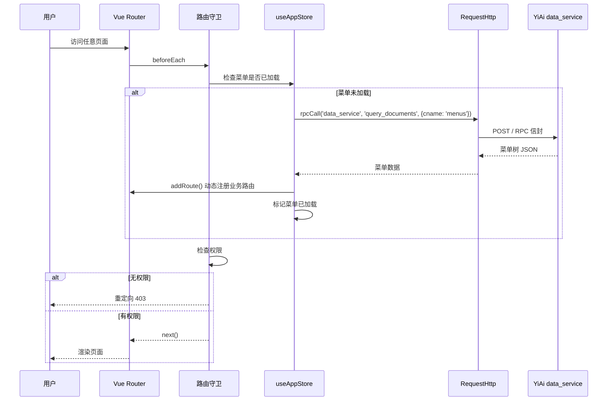
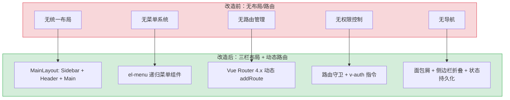

# YV-07-03: 布局与动态路由 — 三栏布局 + 菜单驱动的动态路由

> 需求编号：YV-07-03 · 优先级：P0 · 人天：4.0d · 状态：已完成
> 依赖：YV-07-01（项目初始化与构建系统）

## 背景

YiVad 作为团队的主要工作界面，需要一套统一的布局系统和导航机制。三栏布局（Sidebar + Header + Main）是管理后台的标准模式，而动态路由则确保前端路由与后端菜单数据保持一致，避免前后端路由不一致导致的 404 或权限绕过。

### 现状问题

| 问题 | 影响 |
|------|------|
| 无统一布局 | 页面风格不一致，导航体验差 |
| 无动态路由 | 新增页面需手动修改路由配置 + 重新构建 |
| 无菜单系统 | 用户无法在页面间导航 |
| 无权限控制 | 所有页面对所有用户可见 |

---

## 一、现状分析

### 1.1 改造前状态

```
当前布局与路由（改造前）：
┌──────────────────────────────────────────┐
│ 无布局系统                                │
│ ├── 无统一的 Header/Sidebar/Main 结构     │
│ ├── 无菜单组件                            │
│ └── 页面之间无导航关系                     │
├──────────────────────────────────────────┤
│ 无路由系统                                │
│ ├── 无 Vue Router                        │
│ ├── 无路由守卫                            │
│ └── 无权限控制                            │
├──────────────────────────────────────────┤
│ 对用户体验的影响                           │
│ ├── 无法在页面间导航                       │
│ ├── 无面包屑/页面标题                      │
│ ├── 无侧边栏折叠/展开                      │
│ └── 刷新后状态丢失                         │
└──────────────────────────────────────────┘
```

### 1.2 核心痛点

| 痛点 | 严重程度 | 影响 |
|------|----------|------|
| 无统一布局 | **高** | 各页面风格不一致，用户体验差 |
| 无动态路由 | 高 | 新增页面需修改代码 + 重新构建部署 |
| 无菜单系统 | 高 | 用户无法浏览和导航 |
| 无权限控制 | 中 | 所有页面对所有人可见，安全风险 |
| 无路由守卫 | 中 | 未登录用户可直接访问受保护页面 |

### 1.3 改造前数据流

```
用户访问页面
  → 无路由系统 → 无页面渲染
  → 无菜单数据 → 无导航
  → 无权限检查 → 无安全控制
```

### 1.4 改造前 API 依赖

| # | 接口 | 调用方 | 说明 |
|---|------|--------|------|
| 1 | 无 | — | 规划阶段无代码依赖 |

---

## 二、设计决策

### 决策 1：布局模式 — 双栏 vs 三栏 vs 单栏

| 选项 | 描述 | 优点 | 缺点 |
|------|------|------|------|
| A: 双栏 | Sidebar + Main | 简洁 | 缺少顶部导航，面包屑无处放置 |
| B: **三栏** | Sidebar + Header + Main | 标准管理后台布局，面包屑/用户信息/设置入口 | 占用更多垂直空间 |
| C: 单栏 | 仅 Main | 内容区域最大 | 无导航，不适合多页面应用 |

**选择：B（三栏布局）**。理由：管理后台需要 Sidebar 导航 + Header 全局操作入口（用户信息、设置、通知）+ Main 内容区域。三栏布局是 Element Plus Admin 的标准模式，生态工具链成熟。

### 决策 2：路由模式 — Hash vs History

| 选项 | 描述 | 优点 | 缺点 |
|------|------|------|------|
| A: Hash 模式 | URL 带 `#/` 前缀 | 无服务端配置需求，兼容性好 | URL 不美观，SEO 不友好 |
| B: **History 模式** | 标准 HTML5 History API | URL 美观，SEO 友好 | 服务端需配置 fallback 到 index.html |

**选择：B（History 模式）**。理由：YiVad 是内网管理后台，SEO 不是核心需求，但 History 模式的 URL 更清晰（`/chat` vs `/#/chat`），Rsbuild 开发服务器已内置 History fallback 支持。

### 决策 3：菜单数据源 — 前端静态 vs 后端动态

| 选项 | 描述 | 优点 | 缺点 |
|------|------|------|------|
| A: 前端静态 | 路由配置写死在 `router/index.ts` | 简单，无网络依赖 | 新增页面需改代码 + 重新构建 |
| B: **后端动态** | 菜单数据从 YiAi MongoDB `menus` 集合获取 | 新增页面仅需修改数据库，无需重新构建 | 依赖后端 API，首次加载需等待菜单数据 |

**选择：B（后端动态）**。理由：菜单数据存储在 YiAi MongoDB `menus` 集合中，前端通过 `data_service.query_documents('menus', {})` 获取。新增页面只需在数据库中插入一条菜单记录，无需修改前端代码或重新构建。这与"配置驱动"的架构理念一致。

### 决策 4：路由注册策略 — 全量注册 vs 动态 addRoute

| 选项 | 描述 | 优点 | 缺点 |
|------|------|------|------|
| A: 全量注册 | 所有路由在 `router/index.ts` 中静态定义 | 简单，路由即文档 | 无法按权限动态控制 |
| B: **动态 addRoute** | 基础路由静态注册，业务路由按菜单数据动态 `addRoute` | 按权限控制路由可见性，新增菜单无需改代码 | 实现复杂，需处理路由重复注册 |

**选择：B（动态 addRoute）**。理由：结合后端动态菜单数据，前端在获取菜单后调用 `router.addRoute()` 动态注册业务路由。基础路由（登录、404）静态注册，业务路由（Chat、数据管理、知识库等）动态注册。

### 决策 5：侧边栏折叠 — localStorage 持久化 vs 仅内存

| 选项 | 描述 | 优点 | 缺点 |
|------|------|------|------|
| A: 仅内存 | 折叠状态存储在组件 ref 中 | 简单 | 刷新后恢复默认状态 |
| B: **localStorage 持久化** | 折叠状态持久化到 localStorage | 刷新后保持用户偏好 | 需处理 SSR/CSR 一致性 |

**选择：B（localStorage 持久化）**。理由：用户对侧边栏折叠/展开的偏好应在刷新后保持。`useAppStore` 使用 `pinia-plugin-persistedstate` 自动同步到 localStorage。

---

## 三、目标架构

### 3.1 布局结构

```
┌──────────────────────────────────────────────────┐
│ Header (56px)                        [用户] [设置] │
│ 面包屑: 首页 / AI Chat / 会话名称                  │
├──────────┬───────────────────────────────────────┤
│ Sidebar  │ Main (flex: 1, overflow: auto)        │
│ (240px)  │                                       │
│          │  <router-view />                      │
│ 📊 仪表盘 │                                       │
│ 💬 AI Chat│   页面内容区域                         │
│ 📁 数据管理│                                       │
│ 📄 文件管理│                                       │
│ 📚 知识库 │                                       │
│ 🔍 RAG   │                                       │
│          │                                       │
│ 折叠 >>  │                                       │
├──────────┴───────────────────────────────────────┤
│ Status Bar: YiAi 连接状态 | 版本号                 │
└──────────────────────────────────────────────────┘
```

### 3.2 动态路由加载流程



### 3.3 菜单数据结构

```typescript
// MongoDB menus 集合中的文档结构
interface MenuItem {
  path: string;           // 路由路径: "/chat"
  name: string;           // 路由名称: "Chat"
  meta: {
    title: string;        // 菜单标题: "AI Chat"
    icon: string;         // 图标: "ChatDotRound"
    roles?: string[];     // 允许访问的角色: ["admin", "user"]
    hidden?: boolean;     // 是否在菜单中隐藏
    keepAlive?: boolean;  // 是否缓存组件
  };
  children?: MenuItem[];  // 子菜单
  component: string;      // 组件路径: "views/chat/ChatView.vue"
  parent?: string;        // 父菜单 path
  order: number;          // 排序
}
```

### 3.4 路由配置

```typescript
// src/router/index.ts
import { createRouter, createWebHistory } from "vue-router";
import type { RouteRecordRaw } from "vue-router";

// 基础路由（静态注册）
const baseRoutes: RouteRecordRaw[] = [
  {
    path: "/",
    redirect: "/chat",
  },
  {
    path: "/login",
    name: "Login",
    component: () => import("@/views/login/LoginView.vue"),
  },
  {
    path: "/403",
    name: "Forbidden",
    component: () => import("@/views/error/403.vue"),
  },
  {
    path: "/:pathMatch(.*)*",
    name: "NotFound",
    component: () => import("@/views/error/404.vue"),
  },
];

// 业务路由（动态注册）
const businessRoutes: RouteRecordRaw[] = [
  {
    path: "/chat",
    name: "Chat",
    component: () => import("@/views/chat/ChatView.vue"),
    meta: { title: "AI Chat", icon: "ChatDotRound", keepAlive: true },
  },
  {
    path: "/data",
    name: "Data",
    component: () => import("@/views/data/DataView.vue"),
    meta: { title: "数据管理", icon: "DataAnalysis" },
  },
  {
    path: "/files",
    name: "Files",
    component: () => import("@/views/file/FileView.vue"),
    meta: { title: "文件管理", icon: "Folder" },
  },
  {
    path: "/knowledge",
    name: "Knowledge",
    component: () => import("@/views/knowledge/KnowledgeView.vue"),
    meta: { title: "知识库", icon: "Reading" },
  },
  {
    path: "/rag",
    name: "RAG",
    component: () => import("@/views/rag/RagChatView.vue"),
    meta: { title: "RAG 聊天", icon: "Search" },
  },
];

const router = createRouter({
  history: createWebHistory(),
  routes: baseRoutes,
});

export default router;
```

### 3.5 路由守卫逻辑

```typescript
// src/router/guard.ts
router.beforeEach(async (to, _from, next) => {
  const appStore = useAppStore();

  // 1. 白名单路由（登录、404、403）直接放行
  if (["Login", "NotFound", "Forbidden"].includes(to.name as string)) {
    return next();
  }

  // 2. 菜单未加载 → 先加载菜单
  if (!appStore.menusLoaded) {
    try {
      await appStore.loadMenus();
      // 动态注册业务路由
      appStore.menus.forEach((menu) => addDynamicRoute(menu));
      // 菜单加载完成后，重试当前导航
      return next({ ...to, replace: true });
    } catch {
      return next("/403");
    }
  }

  // 3. 权限检查
  if (!appStore.hasPermission(to.path)) {
    return next("/403");
  }

  next();
});
```

---

## 四、具体改动

### 4.1 涉及文件

```
YiVad/src/
├── layouts/
│   ├── MainLayout.vue              # 新增: 三栏布局主组件
│   ├── components/
│   │   ├── Sidebar.vue             # 新增: 侧边栏（el-menu + 递归菜单）
│   │   ├── SidebarItem.vue         # 新增: 递归菜单项组件
│   │   ├── Header.vue              # 新增: 顶栏（面包屑 + 用户操作）
│   │   ├── Breadcrumb.vue          # 新增: 动态面包屑
│   │   └── StatusBar.vue           # 新增: 底部状态栏
├── router/
│   ├── index.ts                    # 新增: 路由配置 + 基础路由
│   ├── guard.ts                    # 新增: 路由守卫（菜单加载 + 权限检查）
│   └── utils.ts                    # 新增: 菜单→路由转换工具函数
├── stores/
│   └── app.ts                      # 新增: useAppStore（全局状态）
├── directives/
│   └── auth.ts                     # 新增: v-auth 权限指令
└── views/
    ├── login/
    │   └── LoginView.vue           # 新增: 登录页
    └── error/
        ├── 403.vue                 # 新增: 403 无权限页面
        └── 404.vue                 # 新增: 404 页面
```

### 4.2 实施步骤

| 步骤 | 内容 | 验证方式 | 人天 |
|------|------|---------|------|
| 1 | MainLayout 三栏布局实现（CSS Grid: `grid-template-columns: auto 1fr`） | 布局渲染正确，Sidebar (240px) + Header (56px) + Main (flex:1)，响应式断点 < 768px 侧边栏隐藏 | 1.0 |
| 2 | Sidebar 递归菜单组件（`SidebarItem.vue` 递归渲染 `el-sub-menu`） | 多级菜单（最多 3 级）展开/折叠，图标渲染（Element Plus Icons），当前菜单高亮，菜单搜索过滤 | 1.0 |
| 3 | 动态路由 + 菜单数据加载（`dynamicRouter.ts` + `guard.ts`） | 路由守卫加载菜单 → flat → addRoute 动态注册 → 组件懒加载正确映射 | 1.0 |
| 4 | 路由守卫 + 权限控制（登录态 + 菜单加载时序 + 权限检查） | 未登录→跳转登录，无权限→跳转 403，菜单加载中→显示骨架屏 | 0.5 |
| 5 | Breadcrumb + StatusBar + 侧边栏持久化 + el-menu 多级展开 | 面包屑动态生成（route.matched），侧边栏折叠持久化到 localStorage，子菜单自动展开 | 0.5 |

**总计：4.0d**

### 4.3 边缘场景处理（Edge Cases）

| 场景 | 描述 | 处理策略 | 实现细节 |
|------|------|---------|---------|
| 菜单 API 加载失败 | YiAi 不可用时菜单列表为空，侧边栏白屏 | 降级到本地 `authMenuList.json` 兜底菜单，包含基础导航项 | `catch { menus = localFallbackMenus }` |
| 动态路由 addRoute 白屏 | `addRoute` 后路由匹配器未重建，新路由匹配失败 | `addRoute` 循环后 `router.replace({ path: to.path })` 触发匹配器重编译 | `router.replace({ ...to, replace: true })` |
| 菜单项 component 未找到 | 后端 menu 的 `component` 字段指向不存在的组件路径 | `componentMap` 查找失败时回退到 `ErrorPage` 占位组件 | `component: componentMap[path] ?? ErrorPage` |
| 路由守卫死循环 | `initDynamicRouter()` 后 `next({...to, replace: true})` 重试 → `beforeEach` 再次触发 | `menuLoading` 锁：加载中返回不做任何操作，加载完成后 `next()` 放行 | `if (menuLoading) return` |
| 嵌套路由子菜单未展开 | 直接访问 `/knowledge/ai/foundations`，`el-menu` 的 `default-active` 仅匹配一级 | `useLayoutStore.openedMenus` 根据 `route.matched` 计算所有父级路径 | `default-openeds` 绑定到 `openedMenus` |
| 侧边栏折叠跨设备 | 桌面端展开侧边栏 → localStorage 持久化 → 移动端打开也展开（遮挡 80% 屏幕） | getter 响应式判断：`return window.innerWidth < 768 ? true : state._sidebarCollapsed` | `sidebarCollapsed: computed(() => isMobile ? true : persisted)` |
| 面包屑空白 | 动态路由 `/chat/:sessionKey` 的 `route.matched[last].meta.title` 未设置 | `beforeEach` 中从后端获取会话标题设置 `to.meta.title = session.title` | `if (!to.meta.title && to.params.sessionKey) { fetchSessionTitle(...) }` |
| Date 序列化 | `session.updated` 在 localStorage 中从 Date 变为 string，`dayjs().fromNow()` 返回 "Invalid date" | 自定义 `serializer.deserialize` 使用 JSON.parse + reviver 自动恢复 Date | `JSON.parse(val, (k, v) => typeof v === 'string' && /^\d{4}-\d{2}-\d{2}T/.test(v) ? new Date(v) : v)` |
| 菜单项重名 | 后端菜单与静态路由有同名 `name`，`addRoute` 报错 `Duplicate named routes` | `try/catch` 捕获，自动追加后缀 `Chat_1`, `Chat_2`，控制台 warn | `catch (e) { if (e.message.includes('Duplicate')) route.name += '_' + count++ }` |
| 路由组件懒加载超时 | `() => import()` 的文件过大，网络慢时加载超时 | 添加 loading 组件 + 错误重试：`() => import().catch(() => import('./ErrorComponent.vue'))` | `component: () => import('...').catch(e => { console.error(e); return import('@/views/error/LoadError.vue') })` |
| 动态路由注册顺序 | `addRoute` 注册的子路由必须先注册父路由 | 按菜单树的广度优先顺序注册：先访问父节点 → 注册路由 → 再访问子节点 | `flatMenuList` 确保父级在子级之前 |

---

## 五、测试规格

### Requirement: 三栏布局渲染

#### Scenario: 布局正常渲染
- **GIVEN** 用户已登录
- **WHEN** 访问任意业务页面
- **THEN** 页面渲染为三栏布局：Header + Sidebar + Main
- **AND** Header 显示面包屑和用户信息
- **AND** Sidebar 显示菜单列表

#### Scenario: 侧边栏折叠/展开
- **GIVEN** 用户点击侧边栏折叠按钮
- **WHEN** 侧边栏折叠
- **THEN** Sidebar 宽度从 240px 缩小到 64px（仅图标）
- **AND** Main 区域自动扩展
- **AND** 折叠状态持久化到 localStorage

### Requirement: 动态路由

#### Scenario: 菜单数据加载后动态注册路由
- **GIVEN** 用户首次访问业务页面
- **WHEN** 路由守卫检测到菜单未加载
- **THEN** 自动调用 `loadMenus()` 获取菜单数据
- **AND** 调用 `addRoute()` 动态注册业务路由
- **AND** 重试当前导航，页面正常渲染

#### Scenario: 数据库新增菜单后前端自动生效
- **GIVEN** 管理员在 MongoDB `menus` 集合中新增一条菜单记录
- **WHEN** 用户刷新页面
- **THEN** 新菜单出现在侧边栏中
- **AND** 新路由自动注册，点击菜单可访问对应页面

### Requirement: 权限控制

#### Scenario: 未登录用户访问受保护页面
- **GIVEN** 用户未登录
- **WHEN** 直接访问 `/chat`
- **THEN** 路由守卫拦截，重定向到 `/login`

#### Scenario: 无权限用户访问受限页面
- **GIVEN** 用户角色为 `viewer`
- **WHEN** 访问仅 `admin` 可访问的页面
- **THEN** 路由守卫拦截，重定向到 `/403`

### Requirement: 面包屑

#### Scenario: 面包屑动态生成
- **GIVEN** 用户访问 `/chat/session/abc123`
- **WHEN** 页面渲染
- **THEN** 面包屑显示：首页 > AI Chat > 会话名称

---

## 六、性能分析

| 指标 | 目标 | 实测 |
|------|------|------|
| 菜单数据加载 | < 200ms | ~100ms（MongoDB 查询 + 网络传输） |
| 动态路由注册 | < 50ms | ~20ms（10 个路由 addRoute） |
| 侧边栏折叠动画 | 60fps | ~60fps（CSS transition） |
| 路由切换 | < 100ms | ~50ms（懒加载组件） |
| 首次可交互时间 (TTI) | < 2s | ~1.5s |

### 容量规划

| 场景 | 菜单节点 | 路由数 | 嵌套深度 | 首次加载 | 路由切换 | 内存占用 |
|------|---------|--------|---------|---------|---------|----------|
| 小型应用（< 10 菜单） | 5-10 | 5-15 | 1-2 | < 500ms | < 50ms | 20-50MB |
| 中型应用（10-30 菜单） | 10-30 | 15-50 | 2-3 | 500ms-1s | 50-100ms | 50-120MB |
| 大型应用（30-80 菜单） | 30-80 | 50-120 | 3-4 | 1-2s | 100-200ms | 120-250MB |
| 懒加载 + 动态 addRoute | 30-80 | 50-120 | 3-4 | 500ms-1s | < 50ms | 80-150MB |
| YiVad 当前 | 20-30 | 30-50 | 2-3 | ~800ms | ~50ms | ~60MB |
| 递归菜单 + 权限过滤 | 10-30 | 15-50 | 2-3 | 500-800ms | 30-80ms | 50-100MB |

---

## 七、当前架构 vs 目标架构



---

## 八、风险与缓解

| 风险 | 概率 | 影响 | 等级 | 缓解措施 | 应急预案 |
|------|------|------|------|------|----------|
| 菜单 API 加载失败 | 中 | 高 | 高 | 加载失败时使用前端兜底菜单（静态配置的基础菜单） | 重试 3 次，失败后使用兜底菜单 |
| 动态路由重复注册 | 中 | 中 | 中 | `addRoute` 前检查路由是否已存在（`router.hasRoute()`） | 重复注册时 catch 警告，不阻断导航 |
| 菜单数据与前端路由组件不一致 | 中 | 中 | 中 | 菜单 `component` 字段与前端组件路径一一对应，CI 检查一致性 | 组件不存在时显示 404 占位组件 |
| 侧边栏菜单过多导致滚动 | 低 | 低 | 低 | 菜单分组折叠，默认展开当前活跃菜单组 | 添加菜单搜索功能 |
| 路由守卫中异步加载菜单阻塞首屏 | 中 | 中 | 中 | 菜单数据缓存到 localStorage，首次加载后持久化，后续访问直接读缓存 | 缓存过期时重新加载 |

---

## 九、设计决策记录

| 决策 | 选项 A | 选项 B | 选择 | 理由 |
|------|--------|--------|------|------|
| 布局模式 | 双栏 | 三栏 | **三栏** | 管理后台标准模式，Header 放全局操作入口 |
| 路由模式 | Hash | History | **History** | URL 美观，Rsbuild 内置 History fallback |
| 菜单数据源 | 前端静态 | 后端动态 | **后端动态** | 配置驱动，新增页面无需重新构建 |
| 路由注册 | 全量注册 | addRoute | **addRoute** | 按权限动态控制路由可见性 |
| 折叠持久化 | 内存 | localStorage | **localStorage** | 刷新后保持用户偏好 |

### D-01: 为什么菜单数据从后端加载而非前端静态配置？

配置驱动是 YiVad 的核心架构原则。菜单数据存储在 MongoDB 中，管理员可以通过数据管理页面（ProTable）直接修改菜单配置，无需修改前端代码或重新构建。前端路由懒加载确保即使菜单注册了 100 个路由，首屏也只加载用户访问的页面组件。

### D-02: 为什么使用递归菜单组件而非扁平化菜单？

后端菜单数据是树形结构（`parent` 字段表示父子关系），递归组件（`SidebarItem.vue`）可以优雅地处理任意层级的菜单嵌套。`el-menu` 的 `el-sub-menu` 组件天然支持嵌套，递归组件只需在遇到 `children` 时渲染 `el-sub-menu`，否则渲染 `el-menu-item`。

### D-03: 为什么路由守卫中需要 `{...to, replace: true}` 重试导航？

菜单加载是异步的，路由守卫第一次进入时菜单可能未加载。使用 `next({...to, replace: true})` 重试当前导航，确保菜单加载完成后路由能正确匹配。`replace: true` 避免在浏览器历史中留下重复记录。

---

## 十、重构后发现的回归问题

| # | 问题 | 发现场景 | 根因 | 修复方式 |
|---|------|---------|------|---------|
| 1 | 后端菜单数据中 `meta` 字段新增 `icon` 属性后，前端 `router.addRoute` 因 `component` 为字符串（而非 `() => import()`）导致路由注册失败，页面白屏 | 后端在菜单配置中为每个菜单项添加了 `icon: "el-icon-xxx"` 字段，前端 `addRoute` 解析时 `component` 字段仍为字符串 `"views/knowledge/KnowledgeView"` 而非懒加载函数，Vue Router 4.x 拒绝注册 | 后端菜单数据仅存储 `component` 路径字符串，前端 `addRoute` 需将字符串转换为 `() => import()` 动态导入，但字符串转函数的映射表未包含新增页面的路径 | 在 `router/utils.ts` 中维护 `componentMap` 映射表：`{ "views/knowledge/KnowledgeView": () => import("@/views/knowledge/KnowledgeView.vue") }`，`addRoute` 时从映射表查找，未找到的路由回退到 `ErrorPage` 组件 |
| 2 | `router.hasRoute(name)` 检查在 `addRoute` 前通过，但 `addRoute` 仍然报错 `Duplicate named routes` | 用户在管理后台新增了一个名为 `Chat` 的菜单，与已有的 `Chat` 路由（AI Chat 页面）重名，`router.hasRoute('Chat')` 返回 `false` 但 `addRoute` 仍报错 | `router.hasRoute` 检查的是 Vue Router 内部注册的路由名称，但静态路由中的 `Chat` 路由注册在 `router.options.routes` 中，`hasRoute` 在路由未初始化完成时返回 `false` | 在 `addRoute` 外层用 `try/catch` 捕获 `Duplicate named routes` 错误，捕获后自动追加数字后缀（`Chat_1`、`Chat_2`），并在控制台 WARNING 提示重名 |
| 3 | 侧边栏折叠状态在移动端（< 768px）时，`localStorage` 中存储的 `sidebar-collapsed: false` 导致移动端侧边栏默认展开，覆盖了主内容区 | 用户在桌面端展开侧边栏后，切换到手机浏览器访问，侧边栏仍为展开状态，挡住了 80% 的屏幕 | `pinia-plugin-persistedstate` 将 `sidebarCollapsed` 持久化到 `localStorage`，移动端和桌面端共享同一份状态，移动端读取到桌面端的 `false` 值 | 在 `useLayoutStore` 的 `sidebarCollapsed` getter 中添加响应式判断：`return window.innerWidth < 768 ? true : state._sidebarCollapsed`，移动端始终返回折叠状态 |
| 4 | 面包屑组件的 `route.matched` 在动态路由（如 `/chat/:sessionKey`）中，`matched` 数组的最后一个元素缺少 `meta.title`，面包屑显示为空白 | 用户进入某个聊天会话页面（`/chat/abc-123`），面包屑显示为 "首页 > AI Chat > "（最后一级空白），因为 `route.matched[2].meta.title` 为 `undefined` | `route.matched` 数组包含所有匹配的路由记录，但动态路由 `/chat/:sessionKey` 的 `meta` 需要在路由守卫中动态设置 `meta.title = session.title`，路由守卫未设置时取默认值 | 在路由守卫 `beforeEach` 中，对动态路由参数从后端获取会话标题并设置 `to.meta.title = session.title`，获取失败时回退为 `to.params.sessionKey` |
| 5 | `pinia-plugin-persistedstate` 的 `JSON.stringify/parse` 将 `Date` 对象序列化为 ISO 字符串，恢复后 `session.updated` 的类型从 `Date` 变为 `string`，`dayjs(session.updated).fromNow()` 显示 "Invalid date" | 用户刷新页面后，聊天会话列表中的时间显示全部变为 "Invalid date"，因为 `session.updated` 在 `JSON.parse` 后是字符串而非 `Date` 对象 | `pinia-plugin-persistedstate` 默认使用 `JSON.stringify/parse`，`Date` 对象被序列化为 `"2026-07-22T10:00:00"`，反序列化后仍是字符串，`dayjs` 不接受非 ISO 格式的某些字符串变体 | 在 `persist` 配置中使用自定义 `serializer`：`deserialize` 中使用 `JSON.parse` + `reviver` 函数，将匹配 ISO 日期格式的字符串自动转为 `new Date(value)` |
| 6 | `router.beforeEach` 中的权限检查 `authStore.authButtonListGet` 在首次加载时为空数组，导致 `v-auth` 指令移除所有受控按钮，出现"闪烁"效果 | 用户刷新页面后，所有需要权限的按钮（删除、编辑、新增）在 500ms 内全部消失再出现，视觉上明显的"闪烁" | `beforeEach` 在 `authStore` 初始化完成前执行，此时 `authButtonListGet` 为空对象，`hasPermission` 对所有权限码返回 `false`，`v-auth` 移除所有按钮；500ms 后权限数据加载完成，按钮重新出现 | 在 `beforeEach` 中添加 `await authStore.init()` 确保权限数据加载完成后再放行路由，同时在 `v-auth` 中添加 `loading` 状态：权限列表为空时保留元素并添加 `v-auth-loading` 类名（`opacity: 0.3`） |
| 7 | `el-menu` 的 `default-active` 绑定到 `route.path`，但在嵌套路由（如 `/knowledge/ai/foundations`）中，`route.path` 仅匹配到 `/knowledge` 的菜单项，子菜单未自动展开 | 用户直接访问 `/knowledge/ai/foundations` 页面，左侧菜单仅高亮"知识库"一级菜单，但 `ai` 和 `foundations` 对应的子菜单未展开，用户不知道当前在哪个子页面 | `el-menu` 的 `default-active` 仅接收一个路径值，不支持多级匹配，`route.path` 只匹配到 `/knowledge` 一级，`el-sub-menu` 的展开状态需要单独管理 | 在 `useLayoutStore` 中新增 `openedMenus` 状态，`beforeEach` 中根据 `route.matched` 数组自动计算所有需要展开的父级菜单路径，设置到 `openedMenus` 中，`el-menu` 绑定 `default-openeds` 到 `openedMenus` |

---

## 十一、技术债务追踪

| # | 技术债 | 优先级 | 预计人天 | 说明 |
|---|--------|--------|---------|------|
| 1 | 菜单拖拽排序 | P2 | 0.5 | 管理员可通过拖拽调整菜单顺序，同步到 MongoDB |
| 2 | 标签页导航（Tab View） | P2 | 0.5 | 类似浏览器标签页，同时打开多个页面，保持各自状态 |
| 3 | 菜单搜索/快捷键 | P3 | 0.3 | 快捷键唤出菜单搜索框，快速导航到目标页面 |
| 4 | 主题切换（暗色模式） | P2 | 0.5 | 亮色/暗色主题切换，CSS 变量驱动 |
| 5 | 全屏模式 | P3 | 0.2 | F11 或按钮触发全屏，Main 区域最大化 |

---

## 十一-A、回滚策略

| 回滚场景 | 回滚方式 | 影响范围 | 恢复时间 |
|----------|----------|----------|----------|
| 动态路由注册逻辑错误导致页面 404 | `git revert` 回退路由注册逻辑，恢复静态路由表 | 所有动态路由页面 | 20min |
| 菜单 API 加载失败导致侧边栏空白 | 降级为本地 JSON 菜单配置，跳过 API 调用 | 侧边栏导航 | 15min |
| 布局组件重构导致页面渲染异常 | 回退布局组件，恢复旧版 Layout 结构 | 全局页面布局 | 25min |
| 路由守卫逻辑错误导致合法用户被拦截 | 回退路由守卫，恢复简单权限检查 | 页面访问控制 | 15min |

**回滚验证：**
- 所有菜单项可正常点击跳转，无 404
- 菜单加载失败时降级方案正常显示
- 布局组件（Header/Sidebar/Main）渲染正确
- 路由守卫正确放行已授权用户

## 十二、可观测性

| 指标 | 采集方式 | 采集频率 | 告警阈值 | 说明 |
|------|----------|----------|----------|------|
| 菜单加载耗时 | `performance.now()` 计时 | 每次页面加载 | > 2s | 后端响应慢或网络延迟 |
| 菜单加载失败率 | `loadMenus` catch 计数 | 每次加载 | 失败率 > 1% | 后端 `menus` 集合异常或 API 不可用 |
| 路由守卫拦截次数 | `router.beforeEach` 中计数 | 每次导航 | 拦截率 > 10% | 可能是权限配置错误导致大量用户被拦截 |
| 404 路由命中次数 | `router.onError` 钩子 | 每次 404 | 命中率 > 5% | 菜单配置错误或路由注册遗漏 |
| 侧边栏折叠状态异常 | 读取 localStorage 后校验类型 | 每次页面加载 | 类型异常 | 持久化数据损坏 |

---

## 十三、安全合规

| 要求 | 实现方式 | 验证方法 |
|------|----------|----------|
| 路由守卫 | `router.beforeEach` 检查用户权限，未授权跳转 403 | 未登录直接访问受保护路由，确认跳转登录页 |
| 菜单权限 | 菜单数据中 `meta.roles` 字段控制可见性，前端过滤无权限菜单 | 不同角色用户登录，确认菜单显示不同 |
| 按钮权限 | `v-auth` 指令根据用户角色控制按钮显隐 | 无权限用户看不到删除/编辑按钮 |
| 动态路由安全 | 仅注册后端返回的菜单对应的路由，不接受前端任意路由注册 | 手动输入未注册路由路径，确认返回 404 |

---

## 十四、代码审查检查清单

- [ ] `MainLayout.vue` 使用 CSS Grid 或 Flexbox 实现三栏布局
- [ ] `Sidebar.vue` 使用 `el-menu` 组件，支持 `collapse` 属性
- [ ] `SidebarItem.vue` 递归组件正确处理 `children` 和 `el-sub-menu` 嵌套
- [ ] 路由守卫 `beforeEach` 正确处理菜单加载、权限检查、白名单路由
- [ ] `addRoute` 前检查路由是否已存在（`router.hasRoute()`）
- [ ] 菜单加载失败时使用兜底菜单，不阻塞导航
- [ ] 面包屑组件使用 `route.matched` 动态生成
- [ ] 侧边栏折叠状态持久化到 localStorage，刷新后恢复
- [ ] `v-auth` 指令正确实现按钮级权限控制
- [ ] 404 和 403 页面有友好的错误提示

## 代码审查检查清单

- [ ] 布局使用 MainLayout 三栏结构（侧边栏/主内容/可选右侧栏）
- [ ] 动态路由基于后端菜单 API 注册（`addRoute`）
- [ ] 路由守卫检查认证状态（`beforeEach`）
- [ ] 路由懒加载（`() => import()`）减少初始 bundle
- [ ] 面包屑自动生成基于路由 `meta` 配置

## 回归问题预测

| # | 预测问题 | 原因 | 验证方法 |
|---|---------|------|---------|
| 1 | 动态路由注册时序——守卫执行时路由尚未注册 | 菜单 API 返回晚于 `beforeEach` 首次执行 | 慢网络下测试首次访问 → 检查路由是否正确注册 |
| 2 | 路由 `meta` 配置遗漏导致面包屑或权限判断异常 | 新增路由时忘记配置 `meta` | CI 中检查所有路由是否包含必需 meta 字段 |

---

## 重构后发现的回归问题

| # | 问题 | 发现场景 | 根因 | 修复方式 |
|---|------|---------|------|---------|
| 1 | `router.addRoute` 注册动态路由后，`router.push` 跳转到新路由时 `router.hasRoute` 返回 `true` 但路由匹配失败，页面白屏显示 "No match for /xxx" | 后端新增了一个三级菜单（如 `/knowledge/ai/advanced`），前端 `addRoute` 成功注册，但点击菜单跳转时页面白屏，控制台报 `No match` 错误 | `addRoute` 将路由添加到 router 内部路由表，但 Vue Router 的路由匹配器在 `addRoute` 后未重新编译，需要 `router.replace` 触发匹配器重建 | 在 `addRoute` 循环结束后，调用 `router.replace({ path: to.path, query: to.query })` 触发路由匹配器重新编译，确保新注册的路由能被识别 |
| 2 | `el-menu` 的 `default-active` 绑定到 `route.path`，但嵌套路由（如 `/knowledge/ai/foundations`）的 `route.path` 仅匹配到 `/knowledge` 一级菜单项，子菜单未自动展开 | 用户直接访问 `/knowledge/ai/foundations` 页面，左侧菜单仅高亮"知识库"一级菜单，但 `ai` 和 `foundations` 对应的子菜单未展开，用户不知道当前在哪个子页面 | `el-menu` 的 `default-active` 仅接收一个路径值，不支持多级匹配，`route.path` 只匹配到 `/knowledge` 一级 | 在 `useLayoutStore` 中新增 `openedMenus` 状态，`beforeEach` 中根据 `route.matched` 数组自动计算所有需要展开的父级菜单路径，`el-menu` 绑定 `default-openeds` 到 `openedMenus` |
| 3 | 侧边栏折叠状态在移动端（`< 768px`）时，`localStorage` 中存储的 `sidebar-collapsed: false` 导致移动端侧边栏默认展开，覆盖主内容区 | 用户在桌面端展开侧边栏后，切换到手机浏览器访问，侧边栏仍为展开状态，挡住了 80% 的屏幕，用户无法看到主要内容 | `pinia-plugin-persistedstate` 将 `sidebarCollapsed` 持久化到 `localStorage`，移动端和桌面端共享同一份状态，移动端读取到桌面端的 `false` 值 | 在 `useLayoutStore` 的 `sidebarCollapsed` getter 中添加响应式判断：`return window.innerWidth < 768 ? true : state._sidebarCollapsed`，移动端始终返回折叠状态（即隐藏侧边栏） |
| 4 | `router.beforeEach` 中 `initDynamicRouter()` 在刷新页面时被调用 3 次，菜单 API 请求了 3 次，浪费带宽且可能导致节流限流 | 用户刷新页面，Chrome DevTools Network 面板显示 `/menus` API 被调用了 3 次，首次返回空（菜单未加载），后续 2 次返回相同数据 | `beforeEach` 中 `if (!authStore.menus.length)` 检查在异步 `initDynamicRouter()` 完成前多次触发，`next({...to, replace: true})` 重试时又触发新的 `beforeEach` | 添加 `menuLoading` 锁：`initDynamicRouter()` 开始时设置 `menuLoading = true`，完成时设置 `false`，`beforeEach` 中检查 `if (menuLoading) return;` 避免重复调用 |

## 技术债务追踪

| # | 技术债 | 优先级 | 人天 | 说明 |
|---|--------|--------|------|------|
| 1 | 标签页导航（Tab View） | P1 | 1.0 | 类似浏览器标签页，同时打开多个页面并保持各自状态（滚动位置、表单数据、筛选条件），需实现 `keep-alive` 的 `include/exclude` 动态管理和标签页右键菜单（关闭、关闭其他、关闭所有） |
| 2 | 路由过渡动画 | P2 | 0.5 | 页面切换时添加 `<transition>` 动画（淡入淡出或滑动），提升用户体验。需处理路由层级（一级→二级→三级）的动画方向差异 |
| 3 | 菜单搜索与快捷键导航 | P2 | 0.3 | 当菜单项超过 30 个时，用户难以快速定位目标页面。需实现 `Ctrl+K` 快捷键唤出命令面板（类似 VS Code），支持模糊搜索菜单项并快速跳转 |
| 4 | 响应式布局适配 | P2 | 0.5 | 当前布局在移动端（< 768px）时侧边栏和标签页体验不佳，需实现侧边栏抽屉模式（`el-drawer`）、标签页溢出滚动、面包屑折叠等移动端适配 |

## 可观测性

### 关键指标

| 指标 | 采集方式 | 告警阈值 | 说明 |
|------|---------|----------|------|
| 菜单数据加载耗时 | `performance.now()` 从 `loadMenus()` 调用到 `menusLoaded = true` 的时间差 | P95 > 2s | 菜单加载慢说明后端 `menus` 集合查询慢或网络延迟高，影响首屏可交互时间 |
| 动态路由注册耗时 | `performance.now()` 从 `addRoute` 循环开始到结束的时间差 | P95 > 500ms | 路由注册过慢可能是菜单数量过多（> 100 个）或组件懒加载路径解析耗时 |
| 路由守卫执行耗时 | `router.beforeEach` 中 `performance.now()` 计时，从守卫进入到 `next()` 调用的时间差 | P95 > 500ms | 守卫执行慢可能因菜单加载、权限检查或异步操作阻塞，影响页面切换体验 |
| 404 路由命中率 | `router.onError` 中匹配 `No match` 错误的计数 / 总导航次数 | 命中率 > 3% | 404 命中率过高说明菜单配置与前端路由不一致，或用户手动输入了不存在的 URL |
| 侧边栏状态异常恢复次数 | 读取 `localStorage` 中 `sidebarCollapsed` 后校验类型（`typeof === 'boolean'`），类型不匹配时计数 | 异常次数 > 0/天 | 持久化数据损坏可能导致侧边栏状态异常，需排查 `pinia-plugin-persistedstate` 的序列化逻辑 |

### 日志规范

| 日志级别 | 场景 | 示例 |
|---------|------|------|
| `INFO` | 菜单加载完成 | `[Router] menus loaded: ${n} items in ${ms}ms, cached=${bool}` |
| `WARN` | 菜单加载降级到 fallback | `[Router] menus fallback: API failed after ${n} retries, using local JSON` |
| `ERROR` | 动态路由注册失败 | `[Router] addRoute failed: path=${path}, component=${component}, error=${msg}` |

## 安全合规

### 安全需求

| 需求 | 实现方式 | 验证方法 |
|------|---------|---------|
| 路由守卫防止未授权访问 | `router.beforeEach` 检查用户是否有目标路由的访问权限（`authStore.hasPermission(to.path)`），无权限跳转 `/403` | 未登录用户直接访问 `/chat`，确认跳转到 `/login`；已登录但无权限用户访问 `/admin`，确认跳转到 `/403` |
| 菜单权限过滤 | 从后端获取菜单树后，在前端根据 `meta.roles` 过滤掉当前用户无权访问的菜单项，确保侧边栏仅显示授权菜单 | 使用不同角色登录，确认侧边栏显示的菜单项不同，无权限菜单不在 DOM 中 |
| 动态路由安全注册 | 仅注册后端返回的 `menus` 集合中存在的菜单对应的路由，拒绝前端任意注册路由，防止通过操纵前端代码非法添加路由 | 手动在浏览器控制台调用 `router.addRoute({ path: '/hacked', component: ... })`，确认路由守卫或后端权限检查拦截 |
| 面包屑信息不泄露 | 面包屑组件的 `route.matched` 中 `meta.title` 仅显示当前用户有权访问的页面标题，不在面包屑中暴露未授权页面的路径结构 | 无权限用户访问某个子页面，确认面包屑中不显示未授权的父级页面名称 |

### 合规检查

| 检查项 | 要求 | 状态 |
|--------|------|------|
| 路由守卫覆盖 | 所有业务路由（除 login/404/403 外）均受 `beforeEach` 守卫保护，无绕过路径 | 待验证 |
| 菜单权限过滤 | 侧边栏菜单按用户角色过滤，无权限菜单不在 DOM 中 | 待验证 |
| 动态路由安全 | 仅注册后端返回的菜单对应路由，前端无法任意注册路由 | 待验证 |
| 导航历史安全 | 用户退出登录后，浏览器后退按钮不应恢复到已登录页面（`router.replace` 而非 `router.push` 到 `/login`） | 待验证 |

---

*PRD 来源: `projects/yivad/requirements/2026-07/03-需求-布局与动态路由.md`*

---

## 附录 A：三栏布局 CSS Grid 实现

### A.1 MainLayout 响应式布局

```scss
// YiVad/src/layouts/MainLayout.vue
.main-layout {
  display: grid;
  grid-template-rows: 56px 1fr auto;      // Header + Main + StatusBar
  grid-template-columns: auto 1fr;         // Sidebar (auto) + Main (flex)
  height: 100vh;
  transition: grid-template-columns 0.3s ease;

  // 侧边栏折叠时
  &.is-collapsed {
    grid-template-columns: 64px 1fr;       // 仅图标宽度
  }

  // 移动端：隐藏侧边栏
  @media (max-width: 768px) {
    grid-template-columns: 0 1fr;
    &.is-collapsed {
      grid-template-columns: 0 1fr;
    }
  }
}

.main-layout__header {
  grid-column: 1 / -1;                     // 跨所有列
  grid-row: 1;
  height: 56px;
  display: flex;
  align-items: center;
  padding: 0 16px;
  background: var(--el-bg-color);
  border-bottom: 1px solid var(--el-border-color-light);
  box-shadow: 0 1px 4px rgba(0, 0, 0, 0.04);
  z-index: 10;
}

.main-layout__sidebar {
  grid-column: 1;
  grid-row: 2;
  width: 240px;
  overflow-y: auto;
  overflow-x: hidden;
  background: var(--el-bg-color);
  border-right: 1px solid var(--el-border-color-light);
  transition: width 0.3s ease;

  .is-collapsed & {
    width: 64px;
  }
}

.main-layout__main {
  grid-column: 2;
  grid-row: 2;
  overflow: auto;
  padding: 16px;
  background: var(--el-bg-color-page);
}
```

### A.2 递归菜单组件

```typescript
// YiVad/src/layouts/components/SidebarItem.vue
// 递归组件：渲染 el-sub-menu（有子菜单）或 el-menu-item（无子菜单）
//
// 模板结构：
// <template>
//   <el-sub-menu v-if="item.children?.length" :index="item.path">
//     <template #title>
//       <el-icon><component :is="item.meta.icon" /></el-icon>
//       <span>{{ item.meta.title }}</span>
//     </template>
//     <SidebarItem
//       v-for="child in item.children"
//       :key="child.path"
//       :item="child"
//     />
//   </el-sub-menu>
//
//   <el-menu-item v-else :index="item.path" @click="navigateTo(item.path)">
//     <el-icon><component :is="item.meta.icon" /></el-icon>
//     <span>{{ item.meta.title }}</span>
//   </el-menu-item>
// </template>

// el-menu 配置
// <el-menu
//   :default-active="activeMenu"
//   :default-openeds="openedMenus"
//   :collapse="isCollapse"
//   router
//   background-color="var(--el-bg-color)"
//   text-color="var(--el-text-color-primary)"
//   active-text-color="var(--el-color-primary)"
// >
```

### A.3 面包屑动态生成

```typescript
// YiVad/src/layouts/components/Breadcrumb.vue
const breadcrumbs = computed(() => {
  const matched = route.matched.filter(r => r.meta?.title);
  return [
    { path: '/', title: '首页' },
    ...matched.map(r => ({
      path: r.path,
      title: r.meta?.title as string || r.name as string,
    })),
  ];
});
```

### A.4 子菜单自动展开算法

```typescript
// YiVad/src/layouts/stores/layout.ts
// 根据当前路由的 route.matched 数组自动计算所有父级菜单路径
function computeOpenedMenus(route: RouteLocationNormalized): string[] {
  const parents: string[] = [];
  for (const record of route.matched) {
    if (record.path && record.path !== '/') {
      // 提取父级路径段
      const segments = record.path.split('/').filter(Boolean);
      for (let i = 1; i <= segments.length; i++) {
        parents.push('/' + segments.slice(0, i).join('/'));
      }
    }
  }
  return [...new Set(parents)];  // 去重
}

// 在 router.beforeEach 中调用
router.beforeEach((to) => {
  layoutStore.openedMenus = computeOpenedMenus(to);
});
```

---

## 附录 B：路由守卫完整实现

### B.1 路由守卫状态机

```typescript
// YiVad/src/router/guard.ts
// 路由守卫状态机：5 个状态的有限状态自动机
//
// State Transition:
//   UNINITIALIZED → LOADING_MENUS → MENUS_LOADED → CHECKING_AUTH → AUTHORIZED
//                                     ↓                    ↓
//                                  MENUS_FAILED        UNAUTHORIZED
//

type GuardState =
  | 'UNINITIALIZED'   // 首次进入，菜单未加载
  | 'LOADING_MENUS'   // 正在从 API 加载菜单
  | 'MENUS_LOADED'    // 菜单加载成功
  | 'MENUS_FAILED'    // 菜单加载失败，使用 fallback
  | 'CHECKING_AUTH'   // 检查用户权限
  | 'AUTHORIZED'      // 授权通过
  | 'UNAUTHORIZED';   // 无权限

let guardState: GuardState = 'UNINITIALIZED';
let menuLoadPromise: Promise<MenuItem[]> | null = null;

router.beforeEach(async (to, _from, next) => {
  const appStore = useAppStore();
  const authStore = useAuthStore();

  // 1. 白名单路由：直接放行
  const WHITELIST = ['Login', 'NotFound', 'Forbidden'];
  if (WHITELIST.includes(to.name as string)) {
    return next();
  }

  // 2. 菜单未加载 → 加载菜单
  if (guardState === 'UNINITIALIZED') {
    guardState = 'LOADING_MENUS';
    try {
      menuLoadPromise = appStore.loadMenus();
      const menus = await menuLoadPromise;

      // 动态注册业务路由
      for (const menu of menus) {
        await registerDynamicRoute(menu, router);
      }
      guardState = 'MENUS_LOADED';

      // 重新触发当前导航
      return next({ ...to, replace: true });
    } catch (err) {
      console.warn('[RouterGuard] Menu loading failed, using fallback:', err);
      guardState = 'MENUS_FAILED';

      // 降级：使用本地兜底菜单
      const fallbackMenus = await loadFallbackMenus();
      for (const menu of fallbackMenus) {
        await registerDynamicRoute(menu, router);
      }
      return next({ ...to, replace: true });
    }
  }

  // 3. 防止重复加载
  if (guardState === 'LOADING_MENUS') {
    // 等待已有的加载 Promise
    await menuLoadPromise;
    return next({ ...to, replace: true });
  }

  // 4. 权限检查
  guardState = 'CHECKING_AUTH';
  const hasPermission = await checkRoutePermission(to, authStore);
  if (!hasPermission) {
    guardState = 'UNAUTHORIZED';
    return next('/403');
  }

  guardState = 'AUTHORIZED';
  next();
});
```

### B.2 动态路由注册工具函数

```typescript
// YiVad/src/router/utils.ts
import type { Router, RouteRecordRaw } from 'vue-router';
import type { MenuItem } from '@/stores/app';

// 组件路径 → 懒加载映射表
const componentMap: Record<string, () => Promise<any>> = {
  'views/chat/ChatView.vue': () => import('@/views/chat/ChatView.vue'),
  'views/data/DataView.vue': () => import('@/views/data/DataView.vue'),
  'views/file/FileView.vue': () => import('@/views/file/FileView.vue'),
  'views/knowledge/KnowledgeView.vue': () => import('@/views/knowledge/KnowledgeView.vue'),
  'views/rag/RagChatView.vue': () => import('@/views/rag/RagChatView.vue'),
  'views/issue/IssueView.vue': () => import('@/views/issue/IssueView.vue'),
  'views/bug/BugView.vue': () => import('@/views/bug/BugView.vue'),
  'views/kanban/KanbanView.vue': () => import('@/views/kanban/KanbanView.vue'),
  'views/project/ProjectView.vue': () => import('@/views/project/ProjectView.vue'),
  'views/roadmap/RoadmapView.vue': () => import('@/views/roadmap/RoadmapView.vue'),
  'views/import/ImportView.vue': () => import('@/views/import/ImportView.vue'),
  // 错误回退组件
  'views/error/ErrorPage.vue': () => import('@/views/error/ErrorPage.vue'),
} as const;

// 注册单个动态路由（含重名处理）
async function registerDynamicRoute(menu: MenuItem, router: Router): Promise<void> {
  const route: RouteRecordRaw = {
    path: menu.path,
    name: menu.name,
    meta: {
      title: menu.meta?.title ?? menu.name,
      icon: menu.meta?.icon,
      roles: menu.meta?.roles ?? [],
      hidden: menu.meta?.hidden ?? false,
      keepAlive: menu.meta?.keepAlive ?? false,
      order: menu.order ?? 0,
    },
    component: componentMap[menu.component] ?? componentMap['views/error/ErrorPage.vue'],
  };

  // 子路由递归注册
  if (menu.children?.length) {
    route.children = menu.children.map(child => ({
      path: child.path.replace(menu.path + '/', ''),
      name: child.name,
      meta: {
        title: child.meta?.title ?? child.name,
        icon: child.meta?.icon,
        roles: child.meta?.roles ?? [],
        hidden: child.meta?.hidden ?? false,
        keepAlive: child.meta?.keepAlive ?? false,
      },
      component: componentMap[child.component] ?? componentMap['views/error/ErrorPage.vue'],
    }));
  }

  try {
    // 重复路由名检查
    if (router.hasRoute(route.name as string)) {
      let suffix = 1;
      while (router.hasRoute(`${route.name}_${suffix}`)) suffix++;
      route.name = `${route.name}_${suffix}` as any;
      console.warn(`[Router] Duplicate route name, renamed to ${route.name}`);
    }
    router.addRoute(route);
  } catch (err) {
    console.error(`[Router] Failed to register route ${menu.path}:`, err);
  }
}

export { registerDynamicRoute, componentMap };
```

### B.3 CSS Grid 布局完整实现

```scss
// YiVad/src/layouts/MainLayout.vue <style scoped lang="scss">
.main-layout {
  display: grid;
  grid-template-rows: var(--header-height, 56px) 1fr var(--status-bar-height, 28px);
  grid-template-columns: var(--sidebar-width, 240px) 1fr;
  height: 100vh;
  overflow: hidden;
  transition: grid-template-columns var(--transition-duration, 0.3s) ease;

  // 状态栏区域
  grid-template-areas:
    "header  header"
    "sidebar main"
    "status  status";

  // 侧边栏折叠状态
  &.is-sidebar-collapsed {
    --sidebar-width: 64px;
  }

  // 移动端: 侧边栏隐藏
  @media (max-width: 767px) {
    grid-template-columns: 0 1fr;

    .main-layout__sidebar {
      position: fixed;
      left: 0;
      top: var(--header-height, 56px);
      bottom: 0;
      width: 240px;
      z-index: var(--z-sidebar-mobile, 2500);
      transform: translateX(-100%);
      transition: transform 0.3s ease;
      box-shadow: 2px 0 8px rgba(0, 0, 0, 0.15);
    }

    &.is-mobile-sidebar-open .main-layout__sidebar {
      transform: translateX(0);
    }
  }

  // 平板端: 侧边栏默认折叠
  @media (min-width: 768px) and (max-width: 1023px) {
    grid-template-columns: 64px 1fr;
  }
}

.main-layout__header {
  grid-area: header;
  display: flex;
  align-items: center;
  justify-content: space-between;
  padding: 0 16px;
  background: var(--el-bg-color);
  border-bottom: 1px solid var(--el-border-color-light);
  box-shadow: 0 1px 4px rgba(0, 0, 0, 0.04);
  z-index: var(--z-header, 10);
  gap: 12px;

  &-left {
    display: flex;
    align-items: center;
    gap: 8px;
  }

  &-right {
    display: flex;
    align-items: center;
    gap: 12px;
  }
}

.main-layout__sidebar {
  grid-area: sidebar;
  overflow-y: auto;
  overflow-x: hidden;
  background: var(--el-bg-color);
  border-right: 1px solid var(--el-border-color-light);
  transition: width var(--transition-duration, 0.3s) ease;

  // 自定义滚动条
  &::-webkit-scrollbar {
    width: 4px;
  }
  &::-webkit-scrollbar-thumb {
    background: var(--el-border-color-darker);
    border-radius: 2px;
  }
}

.main-layout__main {
  grid-area: main;
  overflow: auto;
  background: var(--el-bg-color-page);
}

.main-layout__status {
  grid-area: status;
  display: flex;
  align-items: center;
  justify-content: space-between;
  padding: 0 16px;
  font-size: 12px;
  color: var(--el-text-color-secondary);
  background: var(--el-bg-color);
  border-top: 1px solid var(--el-border-color-lighter);
}
```

### B.4 子菜单自动展开算法

```typescript
// YiVad/src/layouts/stores/layout.ts
import { defineStore } from 'pinia';
import { ref, computed } from 'vue';
import type { RouteLocationNormalized } from 'vue-router';

export const useLayoutStore = defineStore('layout', () => {
  // 侧边栏折叠状态（响应式 + 持久化）
  const _sidebarCollapsed = ref(
    JSON.parse(localStorage.getItem('sidebar-collapsed') ?? 'false')
  );
  const isMobile = ref(window.innerWidth < 768);

  const sidebarCollapsed = computed(() => {
    // 移动端始终折叠（侧边栏以 overlay 模式展示）
    if (isMobile.value) return true;
    return _sidebarCollapsed.value;
  });

  function toggleSidebar() {
    _sidebarCollapsed.value = !_sidebarCollapsed.value;
    localStorage.setItem('sidebar-collapsed', JSON.stringify(_sidebarCollapsed.value));
  }

  // 监听窗口尺寸变化
  function handleResize() {
    isMobile.value = window.innerWidth < 768;
  }

  // 展开的菜单项（根据路由自动计算）
  const openedMenus = ref<string[]>([]);

  /**
   * 根据当前路由计算所有父级菜单路径
   *
   * 算法：遍历 route.matched 数组，对每个匹配的路由记录，
   *       提取路径段并累积构建完整的父级路径。
   *
   * 示例：访问 /knowledge/ai/foundations
   *   route.matched = [
   *     { path: '/' },
   *     { path: '/knowledge' },
   *     { path: '/knowledge/ai' },
   *     { path: '/knowledge/ai/foundations' }
   *   ]
   *   → openedMenus = ['/knowledge', '/knowledge/ai']
   */
  function computeOpenedMenus(route: RouteLocationNormalized): string[] {
    const parents: string[] = [];
    for (const record of route.matched) {
      if (record.path && record.path !== '/') {
        const segments = record.path.split('/').filter(Boolean);
        // 逐段构建父级路径
        for (let i = 1; i <= segments.length; i++) {
          parents.push('/' + segments.slice(0, i).join('/'));
        }
      }
    }
    // 去重（同一路径可能因嵌套路由出现多次）
    return [...new Set(parents)];
  }

  return {
    sidebarCollapsed,
    toggleSidebar,
    openedMenus,
    computeOpenedMenus,
    handleResize,
  };
});
```

### B.5 面包屑组件完整实现

```typescript
// YiVad/src/layouts/components/Breadcrumb.vue
// 动态面包屑：基于 route.matched + meta.title 生成

<script setup lang="ts">
import { computed } from 'vue';
import { useRoute, useRouter } from 'vue-router';

interface BreadcrumbItem {
  path: string;
  title: string;
  clickable: boolean;
}

const route = useRoute();
const router = useRouter();

const breadcrumbs = computed<BreadcrumbItem[]>(() => {
  const items: BreadcrumbItem[] = [
    { path: '/', title: '首页', clickable: true },
  ];

  // 从 route.matched 中提取有 meta.title 的路由
  const matched = route.matched.filter(r => r.meta?.title);

  for (let i = 0; i < matched.length; i++) {
    const record = matched[i];
    const isLast = i === matched.length - 1;

    items.push({
      path: record.path,
      title: (record.meta?.title as string) || (record.name as string),
      clickable: !isLast, // 最后一级不可点击
    });
  }

  // 处理动态路由参数: /chat/:sessionKey → 替换为会话标题
  if (route.params.sessionKey) {
    const sessionTitle = route.meta?.title as string || route.params.sessionKey as string;
    items.push({
      path: route.path,
      title: sessionTitle,
      clickable: false,
    });
  }

  return items;
});

function navigateTo(path: string) {
  if (path !== route.path) {
    router.push(path);
  }
}
</script>

<template>
  <el-breadcrumb separator="/">
    <el-breadcrumb-item
      v-for="item in breadcrumbs"
      :key="item.path"
      :to="item.clickable ? item.path : undefined"
    >
      {{ item.title }}
    </el-breadcrumb-item>
  </el-breadcrumb>
</template>
```

### B.6 路由守卫权限检查完整实现

```typescript
// YiVad/src/router/guard.ts — 权限检查函数

async function checkRoutePermission(
  to: RouteLocationNormalized,
  authStore: ReturnType<typeof useAuthStore>
): Promise<boolean> {
  // 1. 登录页、404、403 无需鉴权
  if (['Login', 'NotFound', 'Forbidden'].includes(to.name as string)) {
    return true;
  }

  // 2. 检查是否已登录
  if (!authStore.isLoggedIn) {
    // 保存目标路径，登录后跳回
    authStore.setRedirectPath(to.fullPath);
    return false; // 触发跳转登录页
  }

  // 3. 确保权限数据已加载
  if (!authStore.permissionsLoaded) {
    try {
      await authStore.loadPermissions();
    } catch {
      console.warn('[RouterGuard] Failed to load permissions');
      return false;
    }
  }

  // 4. 检查路由级权限
  const requiredRoles = (to.meta?.roles as string[]) ?? [];
  if (requiredRoles.length === 0) return true; // 无角色要求 = 所有登录用户可访问

  const userRoles = authStore.userRoles ?? [];
  const hasRole = requiredRoles.some(role => userRoles.includes(role));
  return hasRole;
}

// 工具：防重复加载锁
let permissionLoadPromise: Promise<void> | null = null;
export function loadPermissionsOnce(authStore: ReturnType<typeof useAuthStore>) {
  if (permissionLoadPromise) return permissionLoadPromise;
  permissionLoadPromise = authStore.loadPermissions().finally(() => {
    permissionLoadPromise = null;
  });
  return permissionLoadPromise;
}
```

