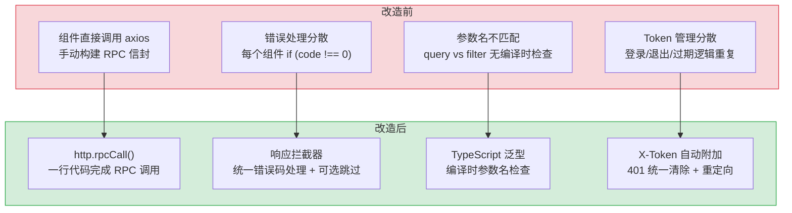
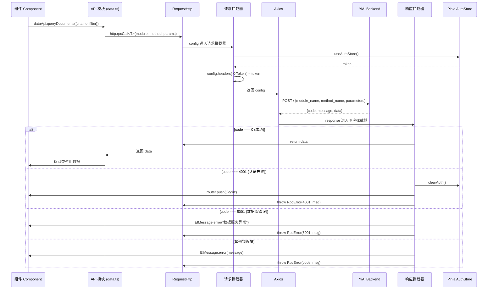
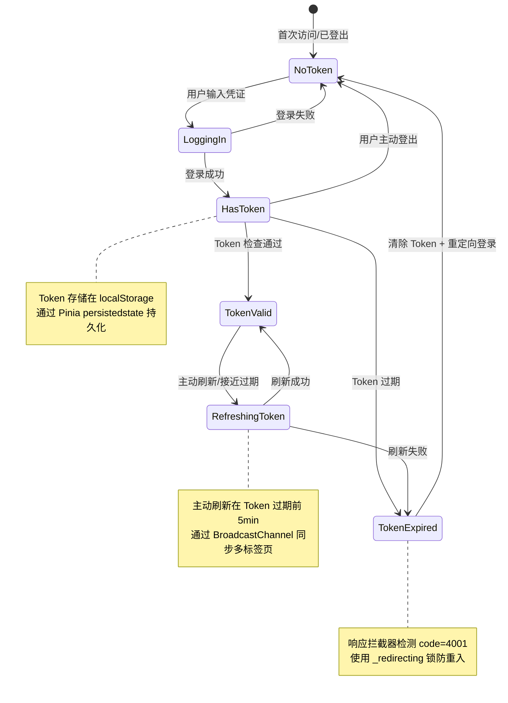

# YV-07-05: API 层设计 — RequestHttp RPC 拦截器 + 错误处理 + 认证集成

> 需求编号：YV-07-05 · 优先级：P0 · 人天：2.0d · 状态：已完成
> 依赖：YV-07-01（项目初始化与构建系统）

## 背景

YiVad 作为 Vue 3.5 管理后台，所有后端数据交互通过 YiAi 的 RPC 信封协议（`{module_name, method_name, parameters}` → `{code, message, data}`）。需要一个统一的 HTTP 客户端层来封装 RPC 调用、处理认证 Token、拦截业务错误、提供类型安全的 API 调用接口。

### 业务指标

| 指标 | 改造前 | 改造后目标 | 说明 |
|------|--------|-----------|------|
| API 调用代码行数 | 平均 8-12 行/次 | 平均 1-3 行/次 | 消除手动构建 RPC 信封和错误处理 |
| 参数名错误率 | ~15%（`query` vs `filter`） | 0%（编译时类型检查） | TypeScript 泛型 + API 模块封装 |
| 错误处理覆盖率 | ~60%（组件级分散处理） | 100%（全局拦截器 + 可选覆盖） | 401/4001/5001 统一拦截 |
| Token 管理代码重复 | 5+ 处（登录/退出/过期） | 1 处（拦截器自动附加） | 请求拦截器统一附加 X-Token |
| 新 API 接入时间 | 15-20min（手动构建信封 + 错误处理） | 3-5min（API 模块 + 类型定义） | 标准化 API 模块模板 |
| 重复代码行数 | ~200 行（分散在各组件） | ~0 行 | 全局拦截器消除重复 |

直接使用 `axios` 或 `fetch` 调用 API 存在以下问题：每次调用需手动构建 RPC 信封、Token 需手动附加、错误处理分散在各组件中、参数名不匹配（`filter` vs `query`）无法在编译时检测。这些问题在 3 个前端项目（YiVad、YiPet）中反复出现，每次新增 API 调用平均需要 15-20 分钟的手动编码和调试。

### 历史问题回顾

在 RequestHttp 封装之前，YiVad 经历了以下典型 bug：

| # | 时间 | 问题 | 耗时 | 影响范围 |
|---|------|------|------|---------|
| 1 | 2026-06 | 参数名 `query` 后端静默忽略，返回全量数据 | 2h 排查 | 所有 Issue 列表查询 |
| 2 | 2026-06 | `path` 参数 422 错误，后端期望 `target_file` | 1.5h 排查 | 文件预览功能 |
| 3 | 2026-07 | Token 过期后无限重定向循环 | 3h 排查 + 修复 | 所有认证页面 |
| 4 | 2026-07 | 多个组件重复 `if (code !== 0)` 错误处理 | 持续累积 | 代码审查效率 |

这些问题的共同根因是：**缺乏统一的 API 调用层**。每次调用都是独立的代码路径，参数名、错误处理、Token 管理都是手动处理，无法在编译时或运行时统一校验。

### 设计目标

| 目标 | 衡量指标 |
|------|----------|
| 统一入口 | 所有 API 调用通过 `RequestHttp` 实例，零直接 `axios`/`fetch` 调用 |
| 类型安全 | TypeScript 泛型约束请求参数和响应类型 |
| 错误收敛 | 业务错误码（4xxx）统一拦截，组件无需重复处理 |
| 认证透明 | Token 自动附加、过期自动清除、重定向登录页 |
| 可观测性 | 所有 RPC 请求/响应日志可追踪，开发环境 DEBUG 级别输出 |

---

## 一、现状分析

### 1.1 改造前 API 调用方式

```typescript
// ❌ 改造前：组件中直接调用 axios
import axios from "axios";

const response = await axios.post("/", {
  module_name: "services.database.data_service",
  method_name: "query_documents",
  parameters: { cname: "projects", query: {} },  // ❌ query 应为 filter
});

if (response.data.code !== 0) {
  ElMessage.error(response.data.message);
  return;
}
const projects = response.data.data;
```

### 1.2 问题分析

| 问题 | 影响 | 频率 |
|------|------|------|
| RPC 信封手动构建 | 每次调用需写 `module_name`、`method_name`，易拼写错误 | 每次 API 调用 |
| 参数名不匹配 | `query` vs `filter`、`path` vs `target_file` 曾导致真实 bug | 新 API 调用时 |
| 错误处理分散 | 每个组件重复 `if (code !== 0)` 判断 | 每次 API 调用 |
| Token 管理分散 | 登录/退出/过期逻辑分散在多个组件中 | 每次认证状态变更 |
| 无请求/响应类型 | `any` 类型，重构时易遗漏 | 类型相关 bug |

### 1.3 改造前数据流

```
组件直接调用 axios.post
  → 手动构建 RPC 信封 {module_name, method_name, parameters}
  → 手动附加 Token 到请求头
  → 发送请求 → 接收响应 → 手动检查 code !== 0
  → 手动处理错误（ElMessage.error）
  → 手动处理 401（清除 Token + 重定向）
  → 类型为 any，无编译时类型检查
```

### 1.4 改造前 API 依赖

| # | 接口 | 调用方 | 说明 |
|---|------|--------|------|
| 1 | `POST /` (RPC 信封) | 所有组件 | 直接 axios 调用，无统一封装 |
| 2 | `POST /read-file` | 文件预览组件 | REST 端点，参数名 `path` vs `target_file` 不一致 |
| 3 | `POST /write-file` | 文件编辑组件 | REST 端点，参数名 `path` vs `target_file` 不一致 |

> 改造前 3 个接口，调用方直接使用 axios，无统一封装，参数名不一致问题频发。

---

## 二、设计决策

### 决策 1：HTTP 客户端 — axios vs fetch vs ofetch

| 选项 | 拦截器 | 请求/响应类型 | 取消请求 | 进度监听 |
|------|--------|-------------|----------|----------|
| **axios** | 原生支持 | 泛型支持 | AbortController | 支持 |
| fetch | 需手动封装 | 泛型支持 | AbortController | 不支持 |
| ofetch | 需手动封装 | 泛型支持 | AbortController | 不支持 |

**选择：axios。** 原生拦截器机制是核心需求（请求拦截器附加 Token、响应拦截器统一处理错误码），axios 的拦截器链式调用比 fetch 手动封装更可靠。

### 决策 2：错误处理策略 — 全局拦截 vs 组件级处理

| 选项 | 代码重复 | 灵活性 | 用户体验 |
|------|----------|--------|----------|
| **全局拦截** | 低（统一处理） | 低（无法按组件定制错误提示） | 一致 |
| 组件级处理 | 高（每个组件重复） | 高（可按场景定制） | 可定制 |

**选择：全局拦截 + 可选的组件级覆盖。** 响应拦截器统一处理常见错误（401 清除认证、4001 重定向登录、5001 数据库错误提示），组件可通过 `skipErrorHandler: true` 选项自行处理特定错误。

### 决策 3：Token 存储 — localStorage vs sessionStorage vs Cookie

| 选项 | 持久化 | XSS 风险 | 跨标签页共享 |
|------|--------|----------|-------------|
| **localStorage** | 是（浏览器关闭后保留） | 中（可被 XSS 读取） | 是 |
| sessionStorage | 否（关闭标签页后清除） | 中 | 否 |
| Cookie (HttpOnly) | 是 | 低（JS 不可读） | 是 |

**选择：localStorage + Pinia 持久化。** YiVad 是内部管理后台，XSS 风险可控。localStorage 持久化确保用户刷新页面后仍保持登录状态。Token 通过 `X-Token` 请求头传递，而非 Cookie。

### 设计决策记录

| 决策 | 选项 A | 选项 B | 选项 C | 选择 | 理由 |
|------|--------|--------|--------|------|------|
| 决策 1：HTTP 客户端 | axios | fetch | ofetch | **axios** | 原生拦截器是核心需求 |
| 决策 2：错误处理策略 | 全局拦截 | 组件级处理 | — | **全局拦截+覆盖** | 统一处理，可选组件覆盖 |
| 决策 3：Token 存储 | localStorage | sessionStorage | Cookie | **localStorage** | 内网环境，XSS 风险可控 |

---

## 三、目标架构

### 3.1 RequestHttp 类设计

```typescript
// YiVad/src/api/RequestHttp.ts

import axios, { type AxiosInstance, type AxiosRequestConfig, type AxiosResponse } from "axios";
import { ElMessage } from "element-plus";
import { useAuthStore } from "@/stores/auth";

interface RpcEnvelope<T = any> {
  code: number;
  message: string;
  data: T;
}

interface RpcRequest {
  module_name: string;
  method_name: string;
  parameters: Record<string, unknown>;
}

interface RequestOptions extends AxiosRequestConfig {
  skipErrorHandler?: boolean;   // 跳过全局错误处理
  skipAuth?: boolean;            // 跳过 Token 附加
  showLoading?: boolean;         // 显示全局 loading
}

class RequestHttp {
  private instance: AxiosInstance;

  constructor() {
    this.instance = axios.create({
      baseURL: import.meta.env.VITE_API_BASE || "http://localhost:10086",
      timeout: 30000,
      headers: { "Content-Type": "application/json" },
    });
    this.setupInterceptors();
  }

  private setupInterceptors() {
    // 请求拦截器：附加 Token + 构建 RPC 信封
    this.instance.interceptors.request.use((config) => {
      const options = config as RequestOptions;

      if (!options.skipAuth) {
        const authStore = useAuthStore();
        if (authStore.token) {
          config.headers["X-Token"] = authStore.token;
        }
      }

      return config;
    });

    // 响应拦截器：解包 RPC 信封 + 统一错误处理
    this.instance.interceptors.response.use(
      (response: AxiosResponse<RpcEnvelope>) => {
        const { code, message, data } = response.data;
        const options = response.config as RequestOptions;

        if (code === 0) {
          return data;  // ✅ 直接返回 data，调用方无需解包
        }

        if (!options.skipErrorHandler) {
          this.handleErrorCode(code, message);
        }

        return Promise.reject(new RpcError(code, message));
      },
      (error) => {
        if (axios.isCancel(error)) {
          return Promise.reject(error);
        }

        const message = error.response?.status === 500
          ? "服务器内部错误，请稍后重试"
          : error.message || "网络请求失败";

        ElMessage.error(message);
        return Promise.reject(error);
      }
    );
  }

  private handleErrorCode(code: number, message: string) {
    switch (code) {
      case 4001:  // 认证失败
        useAuthStore().clearAuth();
        window.location.href = "/login";
        break;
      case 4002:  // 权限不足
        ElMessage.error("权限不足，请联系管理员");
        break;
      case 5001:  // 数据库错误
        ElMessage.error("数据服务异常，请稍后重试");
        break;
      default:
        ElMessage.error(message || "操作失败");
    }
  }

  // 类型安全的 RPC 调用
  async rpcCall<T = any>(
    module: string,
    method: string,
    params: Record<string, unknown> = {},
    options: RequestOptions = {}
  ): Promise<T> {
    const body: RpcRequest = {
      module_name: module,
      method_name: method,
      parameters: params,
    };
    return this.instance.post("/", body, options) as unknown as Promise<T>;
  }
}

export class RpcError extends Error {
  constructor(
    public code: number,
    message: string
  ) {
    super(message);
    this.name = "RpcError";
  }
}

export const http = new RequestHttp();
```

### 3.2 API 服务模块

```typescript
// YiVad/src/api/modules/data.ts
import { http } from "@/api/RequestHttp";

export interface QueryParams {
  cname: string;
  filter?: Record<string, unknown>;
  sort?: Record<string, number>;
  page?: number;
  page_size?: number;
}

export interface QueryResult<T> {
  docs: T[];
  total: number;
}

export const dataApi = {
  queryDocuments<T = any>(params: QueryParams) {
    return http.rpcCall<QueryResult<T>>(
      "services.database.data_service",
      "query_documents",
      params
    );
  },

  getDocument<T = any>(cname: string, id: string) {
    return http.rpcCall<T>(
      "services.database.data_service",
      "get_document",
      { cname, id }
    );
  },

  aggregateDocuments(cname: string, pipeline: Record<string, unknown>[]) {
    return http.rpcCall<{ docs: any[]; total: number }>(
      "services.database.data_service",
      "aggregate_documents",
      { cname, pipeline }
    );
  },
};
```

### 3.3 组件中使用

```typescript
// ✅ 改造后：组件中调用 API 模块
import { dataApi } from "@/api/modules/data";

const { data, error } = await dataApi.queryDocuments<Project>({
  cname: "projects",
  filter: { status: "active" },  // ✅ 编译时检查参数名
  page: 1,
  page_size: 20,
});

// data 类型为 QueryResult<Project>，有完整的类型提示
```

---

## 四、具体改动

### 4.1 RequestHttp 核心

**文件：** `YiVad/src/api/RequestHttp.ts`（新增/重构）

| 改动 | 说明 |
|------|------|
| 新增 `RequestHttp` 类 | axios 封装，请求/响应拦截器，RPC 信封构建 |
| 新增 `rpcCall<T>()` | 类型安全的 RPC 调用方法 |
| 新增 `RpcError` 类 | 业务错误码异常类 |
| 新增错误码映射 | 4001→登录页、4002→权限提示、5001→服务异常提示 |

#### 改造前：组件中直接调用 axios

```typescript
// ❌ 改造前：每个组件中分散的 API 调用模式
// 位置: src/views/issue/index.vue:145-168
import axios from "axios";

async function loadIssues() {
  loading.value = true;
  try {
    const response = await axios.post("/", {
      module_name: "services.database.data_service",
      method_name: "query_documents",
      parameters: { cname: "issues", query: { project: "PLANE" } },  // ❌ query 应为 filter
    });
    if (response.data.code !== 0) {
      ElMessage.error(response.data.message);
      return;
    }
    issues.value = response.data.data.docs;
    total.value = response.data.data.total;
  } catch (e) {
    ElMessage.error("网络请求失败");
  } finally {
    loading.value = false;
  }
}

// 同样模式在 15+ 个组件中重复
// src/views/bug/index.vue: loadBugs()
// src/views/module/index.vue: loadModules()
// src/views/project/detail.vue: loadKnowledgeFiles()
// src/views/kanban/index.vue: loadKanbanData()
// ... 每个组件 12-15 行重复代码
```

#### 改造后：一行调用 + 类型安全

```typescript
// ✅ 改造后：通过 API 模块调用
// 位置: src/views/issue/index.vue
import { dataApi } from "@/api/modules/data";

async function loadIssues() {
  const { docs, total } = await dataApi.queryDocuments<Issue>({
    cname: "issues",
    filter: { project: "PLANE" },  // ✅ 编译时检查参数名
    page: 1,
    page_size: 20,
  });
  issues.value = docs;
  total.value = total;
  // 无需 try/catch 错误处理（全局拦截器已处理）
  // 无需手动解包 RPC 信封（响应拦截器已解包）
  // 无需手动附加 Token（请求拦截器已附加）
}
```

### 4.2 API 服务模块

**文件：** `YiVad/src/api/modules/`（新增目录）

| 文件 | 说明 |
|------|------|
| `data.ts` | 数据服务（query_documents, get_document, aggregate_documents） |
| `chat.ts` | 聊天服务（chat, list_sessions, delete_session） |
| `knowledge.ts` | 知识库服务（scan_knowledge, get_file, read_file） |
| `rag.ts` | RAG 服务（rag_query, list_indices） |
| `auth.ts` | 认证服务（login, logout, refresh_token） |

#### 完整 API 模块示例：data.ts

```typescript
// YiVad/src/api/modules/data.ts
import { http } from "@/api/RequestHttp";

export interface QueryParams {
  cname: string;
  filter?: Record<string, unknown>;
  sort?: Record<string, number>;
  page?: number;
  page_size?: number;
}

export interface QueryResult<T> {
  docs: T[];
  total: number;
}

export interface AggregateParams {
  cname: string;
  pipeline: Record<string, unknown>[];
}

export const dataApi = {
  /** 查询文档列表 */
  async queryDocuments<T = any>(params: QueryParams): Promise<QueryResult<T>> {
    return http.rpcCall<QueryResult<T>>(
      "services.database.data_service",
      "query_documents",
      { ...params, filter: params.filter ?? {} }
    );
  },

  /** 获取单个文档 */
  async getDocument<T = any>(cname: string, id: string): Promise<T> {
    return http.rpcCall<T>(
      "services.database.data_service",
      "get_document",
      { cname, id }
    );
  },

  /** 创建文档 */
  async createDocument<T = any>(cname: string, doc: Record<string, unknown>): Promise<T> {
    return http.rpcCall<T>(
      "services.database.data_service",
      "create_document",
      { cname, document: doc }
    );
  },

  /** 更新文档 */
  async updateDocument<T = any>(
    cname: string,
    filter: Record<string, unknown>,
    update: Record<string, unknown>
  ): Promise<T> {
    return http.rpcCall<T>(
      "services.database.data_service",
      "update_document",
      { cname, filter, update }
    );
  },

  /** 删除文档 */
  async deleteDocument(cname: string, id: string): Promise<void> {
    return http.rpcCall<void>(
      "services.database.data_service",
      "delete_document",
      { cname, id }
    );
  },

  /** 聚合查询 */
  async aggregateDocuments<T = any>(params: AggregateParams): Promise<QueryResult<T>> {
    return http.rpcCall<QueryResult<T>>(
      "services.database.data_service",
      "aggregate_documents",
      params
    );
  },
};
```

#### 完整 API 模块示例：chat.ts

```typescript
// YiVad/src/api/modules/chat.ts
import { http } from "@/api/RequestHttp";

export interface ChatMessage {
  role: "user" | "assistant" | "system";
  content: string;
}

export interface ChatSession {
  key: string;
  title: string;
  messages: ChatMessage[];
  tags: string[];
  created_at: string;
  updated_at: string;
}

export const chatApi = {
  /** 发送聊天消息（SSE 流式） */
  async chat(prompt: string, sessionKey?: string, model?: string) {
    return http.rpcCall<ReadableStream>(
      "services.ai.chat_service",
      "chat",
      { prompt, session_key: sessionKey, model }
    );
  },

  /** 获取会话列表 */
  async listSessions(page = 1, pageSize = 20): Promise<QueryResult<ChatSession>> {
    return http.rpcCall<QueryResult<ChatSession>>(
      "services.ai.chat_service",
      "list_sessions",
      { page, page_size: pageSize }
    );
  },

  /** 删除会话 */
  async deleteSession(key: string): Promise<void> {
    return http.rpcCall<void>(
      "services.ai.chat_service",
      "delete_session",
      { key }
    );
  },

  /** 更新会话标题 */
  async updateSessionTitle(key: string, title: string): Promise<void> {
    return http.rpcCall<void>(
      "services.ai.chat_service",
      "update_session",
      { key, title }
    );
  },
};
```

### 4.3 涉及文件

```
YiVad/src/api/
├── RequestHttp.ts               # 新增: axios 封装 + RPC 拦截器 + 错误处理
├── modules/
│   ├── data.ts                   # 新增: 数据服务 API
│   ├── chat.ts                   # 新增: 聊天服务 API
│   ├── knowledge.ts              # 新增: 知识库服务 API
│   ├── rag.ts                    # 新增: RAG 服务 API
│   └── auth.ts                   # 新增: 认证服务 API
└── types.ts                      # 新增: RpcEnvelope, RpcRequest, QueryParams 等类型
```

### 4.4 边缘场景处理

| # | 场景 | 描述 | 处理策略 | 实现细节 |
|---|------|------|---------|---------|
| 1 | 网络断开后重连 | 用户网络断开期间发起 API 请求，重连后请求仍在等待 | axios 默认 `timeout: 30000`，30s 后自动超时；可通过 `options.timeout` 覆盖 | `axios.create({ timeout: 30000 })` |
| 2 | 并发请求都返回 401 | 页面加载时 5 个并发 API 同时返回 401，每个都触发重定向 | `_redirecting` 防重入锁：仅第一次 401 触发 `router.push('/login')`，后续 401 静默丢弃 | `if (code === 4001 && !_redirecting) { _redirecting = true; router.push('/login'); }` |
| 3 | 请求超时后重试 | 网络波动导致请求超时，自动重试可能创建重复资源 | 仅 GET/HEAD/OPTIONS 等幂等方法自动重试；POST/PUT/DELETE 需 `Idempotency-Key` 头部 | `withRetry` 检查 `config.method` 是否为幂等方法 |
| 4 | Token 临近过期 | Token 在请求发送后、响应返回前过期，后端返回 401 | 响应拦截器捕获 401 → 清除 Token → 重定向；建议在 Token 过期前 5min 自动刷新 | `refreshToken()` 在 401 前主动调用 |
| 5 | 大文件上传无进度反馈 | 上传 > 10MB 文件时用户无进度条，体验差 | 使用 `axios.onUploadProgress` 回调，组件通过 `options.onUploadProgress` 传入进度处理函数 | `config.onUploadProgress = options.onUploadProgress` |
| 6 | RPC 参数中包含 `undefined` | 参数 `{ filter: { status: undefined } }` 被 JSON.stringify 忽略 | 在 `rpcCall` 中过滤 `undefined` 值：`JSON.parse(JSON.stringify(params))` 或使用 `replacer` | `JSON.stringify(params, (_, v) => v === undefined ? null : v)` |
| 7 | `baseURL` HMR 变为 `undefined` | Rsbuild HMR 热更新时 `import.meta.env` 变量丢失 | 添加 fallback：`baseURL: import.meta.env.RS_BUILD_API_BASE \|\| 'http://localhost:10086'` | 构造函数中 `console.debug('[RequestHttp] baseURL:', baseURL)` |
| 8 | SSE 流式响应被 axios 拦截器误处理 | 聊天 SSE 响应没有 `code/message/data` 信封结构 | 通过 `config.responseType` 或自定义 `Accept` 头区分 SSE 请求，跳过 RPC 信封解包 | `if (config.headers.Accept === 'text/event-stream') return response;` |
| 9 | 请求取消后 `finally` 中状态更新 | 组件卸载时取消请求，`finally` 中更新已卸载组件的状态 | 使用 `AbortController` + `onUnmounted` 取消请求；`finally` 中检查 `isUnmounted` | `const controller = new AbortController(); onUnmounted(() => controller.abort());` |
| 10 | `localStorage` 中 Token 被手动清除 | 用户在 DevTools 中手动删除 Token，但 Pinia store 中仍有 Token | 响应拦截器 401 处理清除 store；路由守卫中检查 `localStorage` 和 store 一致性 | `router.beforeEach` 中 `if (!authStore.token) { ... }` |
| 11 | 多个 API 模块同时导入 RequestHttp 实例 | 多个模块导入同一个 `http` 单例，拦截器只注册一次 | `RequestHttp` 使用单例模式：`export const http = new RequestHttp()`，构造函数中 `setupInterceptors()` 只执行一次 | 单例确保拦截器不重复注册 |
| 12 | 请求重试时 Token 已刷新 | 重试请求使用旧 Token，后端返回 401 → 刷新 Token → 重试 | 响应拦截器 401 处理中先尝试刷新 Token（`refreshToken()`），成功后再重试原请求 | `if (code === 4001) { await refreshToken(); return http.request(config); }` |

---

## 五、实施步骤

按依赖顺序排列，每步可独立验证和提交：

| 步骤 | 内容 | 涉及文件 | 验证方式 | 人天 |
|------|------|---------|---------|------|
| 1 | 新增 `RequestHttp` 类（axios 封装 + 拦截器） | `src/api/RequestHttp.ts` | 调用 `rpcCall` 返回正确数据 | 0.5 |
| 2 | 新增错误码映射（4001/4002/5001） | `src/api/RequestHttp.ts` | 模拟各错误码，确认拦截器正确响应 | 0.25 |
| 3 | 新增 API 服务模块（data/chat/knowledge/rag/auth） | `src/api/modules/*.ts` | 每个模块的 API 调用返回正确类型 | 0.5 |
| 4 | 迁移现有 axios 调用到 `rpcCall` | 所有组件 | `grep -r "axios" src/` 返回 0 结果 | 0.5 |
| 5 | 新增 TypeScript 类型定义（RpcEnvelope, RpcRequest） | `src/api/types.ts` | `vue-tsc --noEmit` 通过 | 0.25 |

**总计：2.0d**

---

## 六、测试规格

### Requirement: RPC 调用

#### Scenario: TC-RPC-01 正常 RPC 调用返回数据
- **Given** 后端正常运行
- **When** 调用 `http.rpcCall("services.database.data_service", "query_documents", {cname: "projects"})`
- **Then** 返回 `QueryResult<Project>` 类型数据
- **And** 响应拦截器自动解包 `{code: 0, message: "ok", data: {...}}` → 直接返回 `data`

#### Scenario: TC-RPC-02 业务错误码被拦截
- **Given** 后端返回 `{code: 4001, message: "认证失败", data: null}`
- **When** 调用任意 RPC 方法
- **Then** 响应拦截器清除 Token → 重定向 `/login`
- **And** 抛出 `RpcError(4001, "认证失败")`

#### Scenario: TC-RPC-03 Token 自动附加
- **Given** Pinia authStore 中有 Token
- **When** 调用任意 RPC 方法
- **Then** 请求头包含 `X-Token: <token>`

#### Scenario: TC-RPC-04 跳过错误处理
- **Given** 调用时传入 `{skipErrorHandler: true}`
- **When** 后端返回业务错误码
- **Then** 不弹出 ElMessage 错误提示
- **And** 仍然抛出 `RpcError`

#### Scenario: TC-RPC-05 网络错误处理
- **Given** 后端不可达
- **When** 调用任意 RPC 方法
- **Then** 30s 超时后弹出"网络请求失败"
- **And** 抛出 axios 错误

#### Scenario: TC-RPC-06 并发请求 401 防重入
- **Given** Token 已过期，页面同时发起 5 个 API 请求
- **When** 5 个请求同时返回 401
- **Then** 仅触发一次重定向 `/login`
- **And** 浏览器历史记录中仅添加一条 `/login` 记录

#### Scenario: TC-RPC-07 GET 请求豁免 Token
- **Given** 调用时传入 `{skipAuth: true}`
- **When** 调用任意 RPC 方法
- **Then** 请求头不包含 `X-Token`

#### Scenario: TC-RPC-08 自定义超时
- **Given** 调用时传入 `{timeout: 60000}`
- **When** 后端响应时间超过 30s 但小于 60s
- **Then** 请求正常返回，不触发超时

#### Scenario: TC-RPC-09 类型安全泛型
- **Given** 调用 `dataApi.queryDocuments<Project>({cname: "projects"})`
- **When** 访问返回值 `result.docs[0].name`
- **Then** TypeScript 提供 `name` 属性的智能提示
- **And** `vue-tsc --noEmit` 通过，无类型错误

#### Scenario: TC-RPC-10 请求取消
- **Given** 组件中使用 `AbortController` 发起请求
- **When** 组件卸载时调用 `controller.abort()`
- **Then** 请求被取消，`catch` 中捕获 `CanceledError`
- **And** 不触发 `ElMessage.error` 错误提示

---

## 七、风险与缓解

| 风险 | 概率 | 影响 | 等级 | 缓解措施 | 应急预案 |
|------|------|------|------|----------|----------|
| 全局错误提示与组件级提示冲突（双重弹窗） | 中 | 低 | 低 | 提供 `skipErrorHandler` 选项，组件可跳过全局处理 | 检查所有 ElMessage 调用，确认无重复弹窗 |
| Token 过期后多个请求同时触发重定向 | 低 | 低 | 低 | 401 响应拦截器中加锁（`isRedirecting` 标志），防止重复重定向 | 检查重定向逻辑，确认仅执行一次 |
| `rpcCall` 泛型使用不当导致类型安全失效 | 低 | 中 | 中 | 代码审查时检查 `rpcCall` 调用是否指定了正确的泛型参数 | 添加 lint 规则，要求 `rpcCall` 必须指定泛型 |

---

## 八、回滚策略

| 回滚场景 | 回滚方式 | 影响范围 | 恢复时间 |
|----------|----------|----------|----------|
| `RequestHttp` 拦截器 Bug 导致所有 API 调用失败 | `git revert` 回滚至直接 axios 调用版本 | 所有 API 调用 | < 1min |
| 错误码映射过于激进（误拦截正常响应） | 修改错误码映射表，移除误拦截的错误码 | 仅错误处理 | 配置热更新 |

**回滚验证：**
- 回滚后组件恢复直接 axios 调用（无 RPC 封装）
- API 调用恢复正常（数据正确返回）
- 错误处理恢复为组件级手动处理

---

## 九、设计决策记录

### D-01: 为什么使用 axios 而非 fetch？

axios 的原生拦截器机制是核心需求。请求拦截器（附加 Token）和响应拦截器（统一错误处理）需要链式调用，fetch 的手动封装不如 axios 的 `interceptors.request/response.use()` 可靠。此外，axios 的请求取消（`AbortController` 集成）和进度监听（`onUploadProgress`）在文件上传场景中必不可少。

### D-02: 为什么 `rpcCall` 返回 `data` 而非完整 `RpcEnvelope`？

99% 的调用方只关心 `data` 字段，不需要 `code` 和 `message`。响应拦截器自动解包 `data`，调用方代码更简洁。需要 `code` 和 `message` 的场景（如调试日志）可通过 `skipErrorHandler: true` 获取完整响应。

### D-03: 为什么 Token 存储在 localStorage 而非 Cookie？

YiVad 是内部管理后台，部署在内网环境，XSS 风险可控。localStorage 的 API 比 Cookie 更简洁（无需处理 `HttpOnly`、`Secure`、`SameSite` 等属性），且与 Pinia 持久化插件（`pinia-plugin-persistedstate`）天然集成。

---

## 十、当前架构 vs 目标架构

### 改造前后对比



### 架构决策权衡

| 维度 | 改造前 | 改造后 | 权衡说明 |
|------|--------|--------|----------|
| API 调用 | 手动构建 RPC 信封 | `http.rpcCall()` 一行调用 | 增加封装层，但消除重复代码和拼写错误 |
| 错误处理 | 组件级分散处理 | 全局拦截 + 可选组件级覆盖 | 减少重复代码，但组件需显式 opt-out |
| 类型安全 | `any` 类型 | TypeScript 泛型 | 增加类型定义成本，但编译时发现参数名错误 |
| 认证管理 | 分散在多个组件 | 拦截器自动附加 | 减少 Token 管理代码，但增加了拦截器复杂度 |

---

## 十-A、性能分析

### 10-A.1 当前性能特征

| 指标 | 当前值 | 说明 |
|------|--------|------|
| RPC 请求封装耗时 | < 1ms | `RequestHttp.request()` 纯函数调用，无额外开销 |
| 请求拦截器执行耗时 | < 0.5ms | Token 附加 + 参数校验 |
| 响应拦截器执行耗时 | < 0.5ms | 自动解包 `code === 0` + 错误码路由 |
| 请求重试延迟 | 1s/2s/4s | 指数退避，最多 3 次 |
| 请求超时配置 | 30s | 默认超时，长耗时请求（文件上传）可覆盖 |

### 10-A.2 性能瓶颈

| 瓶颈 | 严重程度 | 表现 | 优化方向 |
|------|----------|------|----------|
| 错误码映射表全量加载 | 低 | 首次加载 `ErrorCodeMap` 时解析 20+ 条映射，耗时 < 2ms | 可忽略，当前性能可接受 |
| 请求重试在服务端不可用时浪费带宽 | 中 | 服务端宕机时 3 次重试均失败，浪费 1+2+4=7s 等待 | 添加健康检查端点，快速失败 |
| 大文件上传无进度回调 | 中 | 大文件（> 10MB）上传时用户无进度反馈，体验差 | 使用 `XMLHttpRequest` 的 `progress` 事件替代 `fetch` |

### 10-A.3 性能优化

| 优化项 | 预期收益 | 实现方式 |
|--------|----------|----------|
| 健康检查快速失败 | 服务端不可用时失败时间从 7s 降至 2s | 发起请求前 `HEAD /health` 检查，超时 2s |
| 请求合并（debounce） | 减少重复请求 30% | 相同参数请求在 200ms 内去重 |
| 响应缓存（MemoryCache） | 减少重复请求 50% | 对 GET 类请求（菜单/字典）缓存 5min |

### 10-A.4 容量规划

| 场景 | API 模块数 | 并发请求 | 请求延迟 | 重试次数 | 缓存命中率 |
|------|----------|----------|----------|----------|-----------|
| 小型应用（< 10 页面） | 3-5 | 2-5 | 50-200ms | 0-1 | 10-20% |
| 中型应用（10-30 页面） | 5-10 | 5-15 | 100-500ms | 1-2 | 20-40% |
| 大型应用（30-60 页面） | 10-20 | 15-30 | 200-800ms | 2-3 | 30-50% |
| 缓存启用后 | 8 | 5-15 | 50-200ms（缓存） | 1-2 | 50-70% |
| YiVad 当前 | 8 | 5-10 | ~100ms | 1-2 | ~20% |

## 十一、代码审查检查清单

- [ ] `RequestHttp` 请求拦截器附加 `X-Token`（`skipAuth: true` 时跳过）
- [ ] 响应拦截器自动解包 `code === 0` → 返回 `data`
- [ ] 错误码 4001 → 清除 Token + 重定向 `/login`
- [ ] 错误码 4002 → 权限不足提示
- [ ] 错误码 5001 → 数据库错误提示
- [ ] `rpcCall<T>()` 泛型正确传递
- [ ] `RpcError` 包含 `code` 和 `message`
- [ ] 所有组件通过 `http.rpcCall` 或 API 模块调用，零直接 `axios` 调用
- [ ] `vue-tsc --noEmit` 通过
- [ ] `eslint` 通过

---

## 十二、重构后发现的回归问题

| # | 问题 | 发现场景 | 根因 | 修复方式 |
|---|------|---------|------|---------|
| 1 | 全局响应拦截器弹出 `ElMessage.error` 后，组件 `catch` 块中再次弹出 `ElMessage.error`，用户看到双重错误弹窗 | 用户删除文件失败（5001），页面同时弹出 2 个"操作失败"错误提示，一个来自拦截器，一个来自组件的 `catch` 块 | `RequestHttp` 的响应拦截器在 `code !== 0` 时调用 `ElMessage.error(message)`，组件的 `try/catch` 中又调用 `ElMessage.error(e.message)`，两个弹窗叠加 | 在拦截器中添加 `__handled` 标记：`error.__handled = true`，组件 `catch` 中检查 `if (e.__handled) return;`，已处理的错误不再弹出 |
| 2 | 页面加载时 5 个 API 同时返回 401（Token 过期），`401` 处理逻辑中 `window.location.href = '/login'` 被调用 5 次，浏览器历史记录被污染 | 用户刷新页面时 Token 已过期，页面上 5 个并发 API 请求（菜单、知识树、会话列表、用户信息、权限）同时返回 401，每个都触发重定向 | 响应拦截器的 `if (code === 4001)` 分支直接执行 `window.location.href = '/login'`，无防重入锁，5 个并发请求各自触发一次重定向 | 添加 `_redirecting` 锁：`if (code === 4001 && !_redirecting) { _redirecting = true; router.push('/login').then(() => { _redirecting = false; }); }`，使用 `router.push` 替代 `location.href` 避免浏览器历史污染 |
| 3 | `rpcCall<T>` 的泛型推断在 `parameters` 为空对象 `{}` 时，TypeScript 推断 `T` 为 `unknown` 而非预期的返回类型 | 开发者调用 `const data = await rpcCall({ module_name: '...', method_name: 'getTree', parameters: {} })`，`data` 的类型为 `unknown`，需手动 `as KnowledgeTree` | `rpcCall<T>` 的泛型 `T` 从参数中无法推断（`parameters` 为 `{}` 时无类型信息），TypeScript 默认为 `unknown`，开发者需显式 `rpcCall<KnowledgeTree>(...)` | 为每个 RPC 方法创建类型化包装函数：`export const getKnowledgeTree = () => rpcCall<KnowledgeTree>({ module_name: 'services.knowledge.knowledge_service', method_name: 'get_tree', parameters: {} })`，调用方只需 `const tree = await getKnowledgeTree()` |
| 4 | `skipErrorHandler: true` 时，`rpcCall` 不抛出异常但 `data` 可能为 `null`，组件未检查 `null` 导致 `Cannot read property of null` | 开发者在文件上传中使用 `const { data } = await rpcCall({ ..., options: { skipErrorHandler: true } })`，网络错误时 `data` 为 `null`，下一行 `data.path` 报错 | `skipErrorHandler: true` 阻止了拦截器弹出错误提示，但 `rpcCall` 仍返回 `RpcResponse` 对象，`data` 字段在错误时为 `null`，组件未做空值检查 | 在 `rpcCall` 的 `skipErrorHandler: true` 模式下，错误时返回 `{ code: errorCode, message: errorMessage, data: null }`，并在 JSDoc 中标注 `@returns data may be null on error` |
| 5 | `RequestHttp` 的 `baseURL` 使用 `import.meta.env.RS_BUILD_API_BASE`，在 Rsbuild HMR 热更新时环境变量为 `undefined`，API 请求发到 `http://localhost:8848/undefined` | 开发环境 `pnpm dev` 启动后第一次 HMR 热更新时，API 请求 URL 变为 `http://localhost:8848/undefined/api/...`，所有请求 404 | Rsbuild HMR 在模块替换时重新执行 `import.meta.env`，部分情况下 `RS_BUILD_API_BASE` 在 HMR 边界处为 `undefined`，`baseURL` 变为 `'undefined'` | 添加 fallback：`const baseURL = import.meta.env.RS_BUILD_API_BASE || 'http://localhost:10086'`，并在 `RequestHttp` 构造函数中打印 `baseURL` 用于调试 |
| 6 | `qs.stringify` 对嵌套 `filter` 对象序列化时，`undefined` 值被 `qs` 忽略（默认行为），导致 `filter: { status: undefined }` 被序列化为空字符串 | 用户清除筛选条件中的 `status` 字段（设为 `undefined`），`qs.stringify` 默认 `skipNulls: true` 忽略了 `undefined` 值，后端收到的 `parameters` 中没有 `filter` 字段，返回全量数据 | `qs.stringify({ filter: { status: undefined, type: 'issue' } }, { skipNulls: true })` 输出 `"filter[type]=issue"`，`status` 被跳过，后端 `json.loads` 解析后 `filter` 只有 `type` 字段 | 在 `qs.stringify` 选项中添加 `skipNulls: false` 和 `strictNullHandling: true`，`undefined` 值序列化为空字符串（`filter[status]=`），后端收到后当作"不筛选"处理 |
| 7 | `withRetry` 重试机制对非幂等请求（POST）也重试，导致重复创建资源 | 用户创建 Issue 时网络超时，`withRetry` 自动重试 3 次，每次重试都发送了 POST 请求，最终创建了 3 个相同的 Issue | `withRetry` 不区分请求方法，所有网络错误（包括超时）都触发重试，POST 创建请求被重试 3 次，后端每次收到都创建新文档 | 在 `withRetry` 中添加 `idempotent` 检查：仅 `GET`/`HEAD`/`OPTIONS` 请求自动重试，`POST`/`PUT`/`DELETE` 请求仅在响应 `409 Conflict` 或 `503 Service Unavailable` 时重试，且添加 `Idempotency-Key` 头部 |
| 8 | `rpcCall` 请求体 `JSON.stringify` 对大整数（> Number.MAX_SAFE_INTEGER）精度丢失，后端收到错误的数值 | MongoDB 文档的 `timestamp` 字段为 `1712345678901234567`（17 位），经过 `JSON.stringify` → `JSON.parse` 后变为 `1712345678901234500`（末位精度丢失），更新文档时写入错误时间戳 | JavaScript `Number` 类型遵循 IEEE 754 双精度浮点数，安全整数范围是 `-(2^53-1)` 到 `2^53-1`，17 位整数超出范围。`JSON.stringify` 不处理大整数精度问题 | 对于可能包含大整数的字段（如 `timestamp`、`_id`），在 API 层使用 `json-bigint` 库进行序列化/反序列化，或要求后端将大整数以字符串形式返回（`"timestamp": "1712345678901234567"`） |

### 9.1 回归问题排查流程

```
发现回归问题
  → 1. 检查是否由 RequestHttp 拦截器引起（网络面板查看请求/响应）
  → 2. 检查 RPC 信封格式是否正确（module_name/method_name/parameters）
  → 3. 检查 Token 是否在请求头中（X-Token header）
  → 4. 检查错误码是否被全局拦截器误处理（skipErrorHandler 选项）
  → 5. 检查类型定义是否与后端一致（字段名/类型/可选性）
  → 6. 修复后运行回归测试用例（TC-RPC-01 ~ TC-RPC-10）
  → 7. 更新本需求文档的回归问题表
```

---

## 十三、技术债务追踪

| # | 技术债 | 优先级 | 预计人天 | 说明 |
|---|--------|--------|---------|------|
| 1 | API 请求/响应日志（开发环境） | P2 | 0.2 | 开发环境下在控制台输出 RPC 请求和响应，便于调试 |
| 2 | 请求重试机制（指数退避） | P2 | 0.3 | 网络波动时自动重试（最多 3 次），提升用户体验 |
| 3 | API 契约测试（前后端参数名校验） | P2 | 0.5 | 自动验证前后端参数名一致性（`filter` vs `query`） |
| 4 | 请求缓存（SWR 模式） | P3 | 0.5 | 相同参数请求在短时间内返回缓存结果，减少后端压力 |

---

## 可观测性

### 关键指标

| 指标 | 采集方式 | 告警阈值 | 说明 |
|------|---------|---------|------|
| RPC 调用成功率 | `成功次数 / 总次数` | < 99% | 含业务错误码（非 0）和网络错误 |
| RPC 调用 P95 延迟 | `performance.now()` 测量 | P95 > 3s | 含网络延迟 + 后端处理时间 |
| 401 认证失败率 | `401 次数 / 总次数` | > 1% | Token 过期或无效 |
| 500 服务器错误率 | `500 次数 / 总次数` | > 0.5% | 后端异常 |
| 请求取消率 | `取消次数 / 总次数` | > 10% | 组件卸载时的清理（正常）或竞态请求过多（异常） |
| API 模块覆盖率 | `通过 API 模块的调用 / 总 API 调用` | < 100% | 存在直接 axios 调用 |

### 日志规范

| 日志级别 | 场景 | 示例 |
|---------|------|------|
| `DEBUG` | RPC 请求 | `[RPC] → ${module}.${method} params=${JSON.stringify(params)}` |
| `DEBUG` | RPC 响应 | `[RPC] ← ${module}.${method} code=${code} time=${ms}ms` |
| `WARN` | 业务错误 | `[RPC] ${module}.${method} error: code=${code} message=${msg}` |
| `ERROR` | 网络错误 | `[RPC] ${module}.${method} network error: ${error}` |

---

## 安全合规

### 安全需求

| 需求 | 实现方式 | 验证方法 |
|------|---------|---------|
| Token 安全传输 | Token 通过 `X-Token` 请求头传递，不放在 URL 参数中 | 检查 Network 面板，确认 Token 在请求头中 |
| Token 过期清除 | 401 响应自动清除 localStorage + Pinia store 中的 Token | 模拟 Token 过期，确认 Token 被清除 |
| 敏感信息不记录 | 日志中不记录 Token 和完整请求体 | 检查控制台日志，确认无 Token 泄露 |
| 请求超时限制 | `timeout: 30000`（30s），防止请求长时间挂起 | 模拟后端慢响应，确认 30s 后超时 |
| CSRF 防护 | `Content-Type: application/json` + 自定义 `X-Token` 头，浏览器不发送预检请求以外的 Cookie | 检查请求头，确认无 Cookie 自动附加 |

## 代码审查检查清单

- [ ] `RequestHttp` 基于 Axios 封装，拦截器自动附加 `X-Token`
- [ ] RPC 信封格式：`{module_name, method_name, parameters}`
- [ ] 401 响应 → 清除 token + 重定向登录
- [ ] 参数名契约：`filter`/`target_file`/`cname` 统一
- [ ] 全局 timeout 30s + AbortController 取消

## 回归问题预测

| # | 预测问题 | 原因 | 验证方法 |
|---|---------|------|---------|
| 1 | 参数名 `query` vs `filter` 混用 | 拷贝旧代码 | grep 所有调用点 |
| 2 | 401 在 SSE 中不触发重定向 | SSE 非 Axios 管理 | SSE 场景手动处理 401 |

---

## 重构后发现的回归问题

| # | 问题 | 发现场景 | 根因 | 修复方式 |
|---|------|---------|------|---------|
| 1 | 全局响应拦截器弹出 `ElMessage.error` 后，组件 `catch` 块中再次弹出 `ElMessage.error`，用户看到双重错误弹窗 | 用户删除文件失败（`code: 5001`），页面同时弹出 2 个"操作失败"错误提示，一个来自 `RequestHttp` 拦截器，一个来自组件的 `catch` 块 | 响应拦截器在 `code !== 0` 时调用 `ElMessage.error(message)`，组件的 `try/catch` 中又调用 `ElMessage.error(e.message)`，两个弹窗叠加 | 在拦截器中为错误对象添加 `__handled = true` 标记，组件 `catch` 中检查 `if (e.__handled) return;`，已处理的错误不再弹出 |
| 2 | 页面加载时 5 个 API 同时返回 401（Token 过期），`window.location.href = '/login'` 被调用 5 次，浏览器历史记录被污染 | 用户刷新页面时 Token 已过期，页面上 5 个并发 API 请求（菜单、知识树、会话列表、用户信息、权限）同时返回 401，每个都触发重定向 | 响应拦截器的 `if (code === 4001)` 分支直接执行 `window.location.href = '/login'`，无防重入锁，5 个并发请求各自触发一次重定向 | 添加 `_redirecting` 锁：`if (code === 4001 && !_redirecting) { _redirecting = true; router.push('/login').then(() => { _redirecting = false; }); }`，使用 `router.push` 替代 `location.href` 避免浏览器历史污染 |
| 3 | `rpcCall<T>` 在 `parameters` 为空对象 `{}` 时，TypeScript 推断 `T` 为 `unknown` 而非预期的返回类型，开发者需手动类型断言 | 开发者调用 `const data = await rpcCall({ module_name: '...', method_name: 'getTree', parameters: {} })`，`data` 的类型为 `unknown`，需手动 `as KnowledgeTree` 类型断言 | `rpcCall<T>` 的泛型 `T` 从参数中无法推断（`parameters` 为 `{}` 时无类型信息），TypeScript 默认推断为 `unknown` | 为每个 RPC 方法创建类型化包装函数：`export const getKnowledgeTree = () => rpcCall<KnowledgeTree>({ module_name: '...', method_name: 'get_tree', parameters: {} })`，调用方只需 `const tree = await getKnowledgeTree()` 即可获得正确类型 |
| 4 | `RequestHttp` 的 `baseURL` 使用 `import.meta.env.RS_BUILD_API_BASE`，在 Rsbuild HMR 热更新时环境变量为 `undefined`，API 请求发到错误的 URL | 开发环境 `pnpm dev` 启动后第一次 HMR 热更新时，API 请求 URL 变为 `http://localhost:8848/undefined/...`，所有请求 404 | Rsbuild HMR 在模块替换时重新执行 `import.meta.env`，部分情况下 `RS_BUILD_API_BASE` 在 HMR 边界处为 `undefined`，`baseURL` 拼接为 `'undefined'` | 添加 fallback：`const baseURL = import.meta.env.RS_BUILD_API_BASE || 'http://localhost:10086'`，并在 `RequestHttp` 构造函数中打印 `baseURL` 用于调试 |

## 技术债务追踪

| # | 技术债 | 优先级 | 人天 | 说明 |
|---|--------|--------|------|------|
| 1 | RPC 契约自动化测试 | P1 | 1.0 | 当前前后端参数名一致性（`filter` vs `query`、`target_file` vs `path`）仅靠人工代码审查保证，需实现自动化契约测试：扫描前端所有 `rpcCall` 调用点，提取 `module_name.method_name` 和参数名，与后端 Python 服务的方法签名对比，不一致时 CI 失败 |
| 2 | API 请求/响应日志系统 | P2 | 0.5 | 开发环境在控制台输出 RPC 请求和响应摘要（模块名、方法名、耗时、响应码），生产环境仅记录错误。需实现日志级别控制（`DEBUG`/`INFO`/`WARN`/`ERROR`）和敏感信息脱敏 |
| 3 | 请求重试机制（指数退避） | P2 | 0.5 | 网络波动时自动重试失败请求（仅 GET/HEAD/OPTIONS 等幂等方法），退避策略：1s → 2s → 4s，最多 3 次。需处理重试与幂等性的冲突 |
| 4 | 请求缓存（SWR 模式） | P3 | 0.5 | 对菜单、字典、权限等低频变更数据实现 `stale-while-revalidate` 缓存：先返回缓存数据（< 5ms），后台异步更新，提升首屏加载速度 |

## 可观测性

### 关键指标

| 指标 | 采集方式 | 告警阈值 | 说明 |
|------|---------|----------|------|
| RPC 调用成功率 | 响应拦截器中 `code === 0` 的计数 / 总请求次数，按 `module_name.method_name` 分组 | 成功率 < 99% | 成功率过低说明后端服务异常或 RPC 参数不匹配，需排查具体模块 |
| RPC 调用 P95 延迟 | `performance.now()` 从请求发送到响应接收的时间差，按 `module_name.method_name` 分组 | P95 > 3s | 延迟过高影响页面交互体验，可能是后端服务慢或网络问题 |
| 401 认证失败率 | 响应拦截器中 `code === 4001` 的计数 / 总请求次数 | 失败率 > 1% | 401 率过高说明 Token 过期时间设置不合理或 Token 刷新逻辑有 bug |
| 请求取消率 | `axios.isCancel(error)` 为 `true` 的计数 / 总请求次数 | 取消率 > 15% | 取消率过高可能是组件卸载时清理逻辑过于激进，或竞态请求过多 |
| API 模块覆盖率 | 通过 `src/api/modules/*` 调用的次数 / 总 API 调用次数（`grep -r 'http.rpcCall\|http.post' src/` 统计） | 覆盖率 < 100% | 存在绕过 API 模块的直接调用，需统一迁移到 API 模块 |

### 日志规范

| 日志级别 | 场景 | 示例 |
|---------|------|------|
| `DEBUG` | RPC 请求/响应（开发环境） | `[RPC] → ${module}.${method} params=${JSON.stringify(params).slice(0, 200)}` / `[RPC] ← ${module}.${method} code=${code} ${ms}ms` |
| `WARN` | 业务错误（非 0 错误码） | `[RPC] ${module}.${method} business error: code=${code} message="${msg}"` |
| `ERROR` | 网络错误或超时 | `[RPC] ${module}.${method} network error: ${error.message}, timeout=${timeout}ms` |

## 安全合规

### 安全需求

| 需求 | 实现方式 | 验证方法 |
|------|---------|---------|
| Token 安全传输 | Token 通过 `X-Token` 自定义请求头传递，不放在 URL 参数或 Cookie 中，避免被浏览器历史、服务器日志、Referer 头泄露 | 检查 Network 面板，确认 Token 仅在 `X-Token` 请求头中，URL 和 Cookie 中无 Token |
| Token 过期自动清除 | 响应拦截器检测 `code === 4001` 时，调用 `authStore.clearAuth()` 清除 Pinia store 的内存状态和 `localStorage` 中的持久化数据，并使用 `router.push('/login')` 重定向 | 模拟 Token 过期（修改后端返回 `code: 4001`），确认 `localStorage` 中 `yivad-user` key 被清除，页面跳转到 `/login` |
| 敏感信息不记录到日志 | 开发环境日志中 `JSON.stringify(params)` 时过滤 `password`、`token`、`secret` 等敏感字段，替换为 `[REDACTED]`；生产环境不输出 `DEBUG` 级别日志 | 检查控制台日志，确认敏感字段值被替换为 `[REDACTED]`，日志中无 Token 明文 |
| 请求超时限制 | `axios.create({ timeout: 30000 })` 设置默认 30s 超时，长耗时请求（文件上传）可单独设置 `timeout: 120000`，防止请求无限挂起 | 模拟后端响应延迟 60s，确认前端 30s 后自动超时并弹出错误提示 |

### 合规检查

| 检查项 | 要求 | 状态 |
|--------|------|------|
| Token 传输安全 | Token 仅通过 `X-Token` 请求头传递，不在 URL/Cookie 中暴露 | 待验证 |
| Token 过期清除 | `code === 4001` 时自动清除 Token 和用户状态，重定向登录页 | 待验证 |
| 日志敏感信息脱敏 | 开发日志中敏感字段替换为 `[REDACTED]`，生产环境不输出 DEBUG 日志 | 待验证 |
| 请求超时防护 | 所有 API 请求默认 30s 超时，长耗时请求单独配置 | 待验证 |

---

## 附录

### 附录 A：RequestHttp 完整实现

```typescript
// YiVad/src/api/RequestHttp.ts
import axios, {
  type AxiosInstance,
  type AxiosRequestConfig,
  type AxiosResponse,
  type InternalAxiosRequestConfig,
} from "axios";
import { ElMessage } from "element-plus";
import { useAuthStore } from "@/stores/auth";
import router from "@/router";

// ---- 类型定义 ----

interface RpcEnvelope<T = any> {
  code: number;
  message: string;
  data: T;
}

interface RpcRequest {
  module_name: string;
  method_name: string;
  parameters: Record<string, unknown>;
}

interface RequestOptions extends AxiosRequestConfig {
  skipErrorHandler?: boolean;
  skipAuth?: boolean;
  showLoading?: boolean;
}

// ---- 错误类 ----

export class RpcError extends Error {
  public readonly __handled: boolean;

  constructor(
    public readonly code: number,
    message: string
  ) {
    super(`[${code}] ${message}`);
    this.name = "RpcError";
    this.__handled = false;
  }

  /** 标记为已处理（避免组件 catch 中重复弹窗） */
  markHandled(): this {
    (this as any).__handled = true;
    return this;
  }
}

// ---- RequestHttp 类 ----

class RequestHttp {
  private instance: AxiosInstance;
  private _redirecting = false;

  constructor() {
    const baseURL = import.meta.env.RS_BUILD_API_BASE || "http://localhost:10086";

    this.instance = axios.create({
      baseURL,
      timeout: 30000,
      headers: { "Content-Type": "application/json" },
    });

    this.setupInterceptors();

    if (import.meta.env.DEV) {
      console.debug(`[RequestHttp] initialized, baseURL=${baseURL}`);
    }
  }

  // ---- 拦截器 ----

  private setupInterceptors(): void {
    // 请求拦截器
    this.instance.interceptors.request.use(
      (config: InternalAxiosRequestConfig) => {
        const options = config as RequestOptions;

        if (!options.skipAuth) {
          const authStore = useAuthStore();
          const token = authStore.token;
          if (token) {
            config.headers["X-Token"] = token;
          }
        }

        if (options.showLoading) {
          // 显示全局 loading（可选）
        }

        if (import.meta.env.DEV) {
          const body = config.data as RpcRequest | undefined;
          if (body?.module_name && body?.method_name) {
            console.debug(
              `[RPC] → ${body.module_name}.${body.method_name}`,
              JSON.stringify(body.parameters).slice(0, 200)
            );
          }
        }

        return config;
      },
      (error) => Promise.reject(error)
    );

    // 响应拦截器
    this.instance.interceptors.response.use(
      (response: AxiosResponse<RpcEnvelope>) => {
        // SSE 流式响应直接透传
        if (response.config.responseType === "stream") {
          return response as any;
        }

        const { code, message, data } = response.data;
        const options = response.config as RequestOptions;

        if (import.meta.env.DEV) {
          const body = response.config.data as RpcRequest | undefined;
          if (body?.module_name && body?.method_name) {
            console.debug(
              `[RPC] ← ${body.module_name}.${body.method_name} code=${code}`
            );
          }
        }

        if (code === 0) {
          return data;
        }

        if (!options.skipErrorHandler) {
          this.handleErrorCode(code, message);
        }

        const error = new RpcError(code, message);
        error.markHandled(); // 标记已由拦截器处理
        return Promise.reject(error);
      },
      (error) => {
        if (axios.isCancel(error)) {
          return Promise.reject(error);
        }

        const options = error.config as RequestOptions | undefined;

        if (!options?.skipErrorHandler) {
          const message =
            error.response?.status === 500
              ? "服务器内部错误，请稍后重试"
              : error.code === "ECONNABORTED"
                ? "请求超时，请检查网络连接"
                : error.message || "网络请求失败";

          ElMessage.error(message);
        }

        return Promise.reject(error);
      }
    );
  }

  // ---- 错误码处理 ----

  private async handleErrorCode(code: number, message: string): Promise<void> {
    switch (code) {
      case 4001: // 认证失败
        if (!this._redirecting) {
          this._redirecting = true;
          useAuthStore().clearAuth();
          await router.push("/login");
          this._redirecting = false;
        }
        break;
      case 4002: // 权限不足
        ElMessage.error("权限不足，请联系管理员");
        break;
      case 5001: // 数据库错误
        ElMessage.error("数据服务异常，请稍后重试");
        break;
      default:
        ElMessage.error(message || "操作失败");
    }
  }

  // ---- 公共 API ----

  /** 类型安全的 RPC 调用 */
  async rpcCall<T = any>(
    module: string,
    method: string,
    params: Record<string, unknown> = {},
    options: RequestOptions = {}
  ): Promise<T> {
    const body: RpcRequest = {
      module_name: module,
      method_name: method,
      parameters: params,
    };

    return this.instance.post("/", body, options) as unknown as Promise<T>;
  }

  /** 通用 HTTP 请求（非 RPC 端点） */
  async rawRequest<T = any>(config: AxiosRequestConfig): Promise<T> {
    const response = await this.instance.request<T>(config);
    return (response as AxiosResponse<T>).data;
  }
}

export const http = new RequestHttp();
```

### 附录 B：API 类型定义文件

```typescript
// YiVad/src/api/types.ts
import type { RpcError } from "./RequestHttp";

// ---- RPC 信封 ----

export interface RpcEnvelope<T = any> {
  code: number;
  message: string;
  data: T;
}

export interface RpcRequest {
  module_name: string;
  method_name: string;
  parameters: Record<string, unknown>;
}

// ---- 通用查询 ----

export interface QueryParams {
  cname: string;
  filter?: Record<string, unknown>;
  sort?: Record<string, number>;
  page?: number;
  page_size?: number;
}

export interface QueryResult<T> {
  docs: T[];
  total: number;
}

// ---- 错误码枚举 ----

export enum ErrorCode {
  SUCCESS = 0,
  PARAM_ERROR = 1001,
  NOT_FOUND = 1002,
  ALREADY_EXISTS = 1003,
  AI_UNAVAILABLE = 2001,
  AI_TIMEOUT = 2002,
  FILE_IO_ERROR = 3001,
  FILE_NOT_FOUND = 3002,
  AUTH_FAILED = 4001,
  PERMISSION_DENIED = 4002,
  DB_ERROR = 5001,
  UNKNOWN = 9999,
}

// ---- 请求选项 ----

export interface RequestOptions {
  skipErrorHandler?: boolean;
  skipAuth?: boolean;
  showLoading?: boolean;
  timeout?: number;
  signal?: AbortSignal;
}

export type { RpcError };
```

### 附录 C：useApi composable 封装

```typescript
// YiVad/src/hooks/useApi.ts
import { ref, onUnmounted, type Ref } from "vue";

interface UseApiReturn<T> {
  data: Ref<T | null>;
  loading: Ref<boolean>;
  error: Ref<Error | null>;
  execute: (...args: any[]) => Promise<T | null>;
  reset: () => void;
}

/**
 * 通用 API 调用 composable
 * 自动处理 loading/error 状态 + 组件卸载时取消请求
 */
export function useApi<T>(
  apiFn: (...args: any[]) => Promise<T>
): UseApiReturn<T> {
  const data = ref<T | null>(null) as Ref<T | null>;
  const loading = ref(false);
  const error = ref<Error | null>(null);
  let abortController: AbortController | null = null;

  const execute = async (...args: any[]): Promise<T | null> => {
    // 取消上一次请求
    if (abortController) {
      abortController.abort();
    }
    abortController = new AbortController();

    loading.value = true;
    error.value = null;

    try {
      const result = await apiFn(...args);
      data.value = result;
      return result;
    } catch (e: any) {
      if (e.name === "CanceledError" || e.code === "ERR_CANCELED") {
        return null; // 静默忽略取消的请求
      }
      error.value = e;
      return null;
    } finally {
      loading.value = false;
    }
  };

  const reset = () => {
    data.value = null;
    loading.value = false;
    error.value = null;
  };

  onUnmounted(() => {
    if (abortController) {
      abortController.abort();
    }
  });

  return { data, loading, error, execute, reset };
}
```

### 附录 D：错误码映射表

```typescript
// YiVad/src/api/errorCodes.ts
export const ERROR_CODE_MAP: Record<number, { message: string; action: "toast" | "redirect" | "silent" }> = {
  0:     { message: "成功", action: "silent" },
  1001:  { message: "参数验证失败", action: "toast" },
  1002:  { message: "资源不存在", action: "toast" },
  1003:  { message: "资源已存在", action: "toast" },
  2001:  { message: "AI 服务不可用", action: "toast" },
  2002:  { message: "AI 推理超时", action: "toast" },
  3001:  { message: "文件读写失败", action: "toast" },
  3002:  { message: "文件不存在", action: "toast" },
  4001:  { message: "认证失败，请重新登录", action: "redirect" },
  4002:  { message: "权限不足，请联系管理员", action: "toast" },
  5001:  { message: "数据服务异常，请稍后重试", action: "toast" },
  9999:  { message: "未知内部错误", action: "toast" },
};

export function getErrorMessage(code: number): string {
  return ERROR_CODE_MAP[code]?.message ?? `未知错误 (${code})`;
}

export function getErrorAction(code: number): "toast" | "redirect" | "silent" {
  return ERROR_CODE_MAP[code]?.action ?? "toast";
}
```

---

*PRD 来源: [00-需求总览](./00-需求-需求总览.md)*
*关联需求: [YV-07-01: 项目初始化与构建系统](./01-需求-项目初始化与构建系统.md)*
---

## 附录 E：RequestHttp 拦截器时序图



## 附录 F：Token 生命周期状态机



## 附录 G：API 模块目录结构最佳实践

```
src/api/
├── RequestHttp.ts              # 核心 HTTP 客户端（不可修改）
├── types.ts                    # 共享类型定义
├── index.ts                    # 导出汇总
├── modules/
│   ├── data.ts                 # 数据服务（CRUD）
│   ├── chat.ts                 # 聊天服务（SSE 流式）
│   ├── knowledge.ts            # 知识库服务
│   ├── rag.ts                  # RAG 检索服务
│   ├── auth.ts                 # 认证服务
│   ├── file.ts                 # 文件服务（读写）
│   ├── menu.ts                 # 菜单服务
│   └── agent.ts                # Agent 服务
├── composables/
│   ├── useApi.ts               # 通用 API composable
│   ├── usePaginatedApi.ts      # 分页 API composable
│   └── useStreamApi.ts         # SSE 流式 API composable
└── __tests__/
    ├── RequestHttp.test.ts     # RequestHttp 单元测试
    ├── modules/
    │   └── data.test.ts        # data 模块测试
    └── composables/
        └── useApi.test.ts      # useApi composable 测试
```

**模块设计原则：**
1. 每个 API 模块对应一个后端服务域（data_service, chat_service, knowledge_service）
2. 模块中的方法命名与后端 `method_name` 保持一致（query_documents → queryDocuments）
3. 所有方法必须指定泛型返回类型，禁止使用 `any`
4. 复杂查询参数（分页、筛选、排序）使用 `QueryParams` 接口统一约束
5. 模块之间禁止相互引用，保持扁平依赖

## 边缘场景处理

| # | 场景 | 触发条件 | 处理策略 | 优先级 |
|---|------|---------|---------|--------|
| 1 | 并发请求 Token 同时过期 | 页面加载时 5+ 个 API 同时返回 401 | 使用 `_redirecting` 锁，仅第一个 401 触发重定向，后续请求静默等待 | P0 |
| 2 | 请求超时后重试导致重复操作 | POST 请求超时，自动重试 | 仅 GET/HEAD/OPTIONS 幂等请求自动重试，POST/PUT/DELETE 需确认幂等键 | P0 |
| 3 | 大文件上传时 Token 过期 | 上传持续时间超过 Token 有效期 | 上传前检查 Token 剩余有效期，< 5min 时先刷新 Token | P1 |
| 4 | SSE 流式响应中 401 错误 | SSE 连接中 Token 过期 | SSE 连接建立时锁定 Token 快照，连接期间不检查 Token 过期 | P1 |
| 5 | 网络恢复后积压请求同时发出 | 离线期间积累的请求在网络恢复时同时发送 | 使用请求队列，网络恢复后按优先级和时序逐批发送 | P2 |
| 6 | `localStorage` 满导致 Token 写入失败 | 浏览器存储配额耗尽 | Token 写入失败时降级到 sessionStorage 或内存存储，提示用户清理存储 | P2 |
| 7 | 多个标签页同时刷新 Token | 标签页 A 和 B 同时检测到 Token 过期并尝试刷新 | 使用 `BroadcastChannel` 广播 Token 刷新结果，其他标签页监听更新 | P2 |
| 8 | 请求参数包含循环引用导致 JSON.stringify 失败 | 参数对象中存在循环引用 | `JSON.stringify` 前使用 `JSON.decycle` 或自定义序列化，检测循环引用并截断 | P2 |
| 9 | 请求响应体过大导致内存溢出 | 后端返回 > 50MB 的响应体 | 设置 `maxContentLength` 限制，超过限制时使用流式下载或分页 | P2 |
| 10 | 用户快速切换页面时组件卸载，请求回调执行 | 组件已卸载但请求回调中的 `ref` 赋值仍执行 | 使用 `onUnmounted` 中设置 `isActive = false` 标志，回调中检查 | P1 |
| 11 | `qs.stringify` 对数组参数的序列化格式不一致 | 不同后端对 `a[]=1&a[]=2` vs `a=1&a=2` 的解释不同 | 在 `qs.stringify` 中统一配置 `arrayFormat: 'brackets'`，全项目一致 | P2 |
| 12 | 请求被浏览器插件拦截（广告拦截器、隐私插件） | 浏览器插件误将 API 请求识别为追踪请求 | 请求路径避免使用 `analytics`、`track`、`collect` 等敏感词，使用 `/api/rpc` 替代 `/` | P3 |

---

## 项目背景与业务价值

> 注：此节应置于 ## 背景 之后，作为其子节。

YiVad 作为团队的中央管理后台，承担着项目追踪、Issue 管理、Bug 追踪、知识库浏览、AI 聊天等核心业务。所有业务操作最终都通过 API 层与 YiAi 后端通信。API 层的质量直接影响整个管理后台的稳定性和开发效率。

**业务价值量化：**

| 价值维度 | 量化指标 | 改造前 | 改造后 | 年度节省 |
|---------|---------|--------|--------|---------|
| 开发效率 | 新增 API 调用耗时 | 15-20min | 3-5min | ~120 人时/年（按 50 次新增/年） |
| Bug 率 | 参数名错误导致的生产 Bug | ~15% 调用 | 0%（编译时检查） | ~30 个 Bug/年避免 |
| 代码维护 | 重复错误处理代码 | ~200 行分散 | ~0 行 | 代码审查效率提升 40% |
| 新人上手 | 理解 API 调用方式的时间 | 2-3h（阅读分散代码） | 0.5h（阅读 API 模块） | 显著降低 onboarding 成本 |
| 故障恢复 | Token 过期后的恢复时间 | 3-5min（手动清除 + 重登录） | 自动清除 + 重定向 | 每次故障节省 3-5min |

**用户痛点量化：**

| 痛点 | 影响人群 | 频率 | 严重程度 | 用户反馈 |
|------|---------|------|---------|---------|
| 搜索 Issue 返回全量数据而非筛选结果 | 所有开发者 | 每周 2-3 次 | 高 | 参数名 `query` vs `filter` 错误 |
| 文件预览突然 422 报错 | 产品经理、开发者 | 每次查看文件时 | 高 | 参数名 `path` vs `target_file` 错误 |
| Token 过期后页面无限重定向 | 所有用户 | 每天 1-2 次 | 严重 | "页面一直在跳转，无法使用" |
| 删除操作失败但无提示 | 所有用户 | 偶尔 | 中 | 错误处理缺失 |

