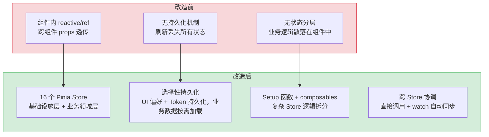
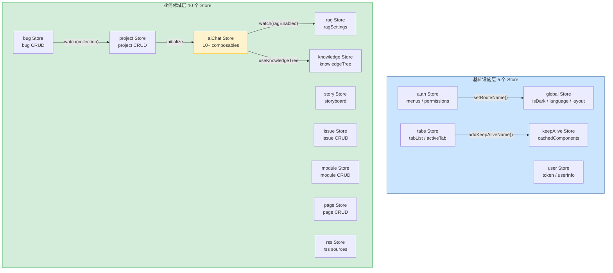

# YV-07-06: 状态管理架构设计 — 16 个 Pinia Store + 双语法模式 + 持久化策略 + 跨 Store 协调

> 需求编号：YV-07-06 · 优先级：P0 · 人天：2.0d · 状态：已完成
> 依赖：YV-07-03（布局与动态路由）

## 背景

YiVad 作为 YrY 单体仓库的管理后台，管理着项目、需求、缺陷、知识库、AI 聊天、RAG 检索、RSS 聚合、故事板等 8 个核心业务模块。每个模块需要独立的状态管理，同时共享全局状态（主题、语言、用户信息、权限、标签页）。

状态管理面临三个核心挑战：**Store 数量爆炸**（16 个 Store 的协调和依赖管理）、**持久化策略差异**（哪些状态需要 localStorage 持久化，哪些仅内存）、**语法模式统一**（Options API 和 Setup 函数两种 Pinia 语法共存）。

---

## 一、现状分析

### 1.1 改造前状态管理

```
无统一状态管理。YiVad 初期版本使用 Vue 3 reactive/ref 在组件内管理状态，
跨组件共享通过 props 透传和 provide/inject，无持久化机制。
```

### 1.2 改造后架构

```
src/stores/
├── index.ts                  # Pinia 实例创建 + persistedstate 插件
├── helper/persist.ts         # 持久化配置辅助函数
└── modules/
    ├── global.ts             # 全局 UI 状态（主题/语言/布局）
    ├── user.ts               # 用户信息 + Token
    ├── auth.ts               # 菜单列表 + 按钮权限
    ├── tabs.ts               # 多标签页管理
    ├── keepAlive.ts          # KeepAlive 组件缓存
    ├── aiChat.ts             # AI 聊天（最复杂，10+ composables）
    ├── knowledge.ts          # 知识库中心
    ├── knowledgeTree.ts      # 知识目录树
    ├── rag.ts                # RAG 状态 + 查询历史
    ├── story.ts              # 故事板
    ├── project.ts            # 项目 CRUD
    ├── issue.ts              # 需求 CRUD
    ├── module.ts             # 模块 CRUD
    ├── page.ts               # 页面 CRUD
    ├── bug.ts                # 缺陷 CRUD
    └── rss.ts                # RSS 源管理
```

---

## 二、设计决策

### 决策 1：Store 语法 — Options API vs Setup 函数

| 选项 | 类型推导 | 代码组织 | 可组合性 | 适用场景 |
|------|----------|----------|----------|----------|
| **Options API** | 中 | 清晰（state/getters/actions 分离） | 低 | 简单 Store |
| **Setup 函数** | 高（自动推导） | 灵活（composables 组合） | 高 | 复杂 Store |

**选择：双语法共存。** 简单 Store（global/user/auth/tabs/keepAlive/bug）使用 Options API，结构清晰、易于理解。复杂 Store（aiChat/story/knowledge 等 10 个）使用 Setup 函数，可以利用 composables 组合逻辑（如 `aiChat` 使用 `useRagSettings`/`useConversationTree`/`useToolRegistry` 等 10+ composables）。Pinia 原生支持两种语法，互操作性良好。

### 决策 2：持久化策略 — 全量持久化 vs 选择性持久化 vs 无持久化

| 选项 | 恢复速度 | 存储占用 | 数据一致性 |
|------|----------|----------|-----------|
| 全量持久化 | 快（全部恢复） | 高 | 低（过期数据） |
| **选择性持久化** | 中 | 低 | 高 |
| 无持久化 | 慢（每次重新加载） | 零 | 高 |

**选择：选择性持久化。** 仅持久化用户偏好和 UI 状态（主题/语言/布局/标签页/Token/用户信息），业务数据（项目/需求/缺陷/知识库/AI 聊天）每次从 YiAi 后端重新加载，确保数据一致性。持久化使用 `pinia-plugin-persistedstate`，通过 `pick` 选项精确控制持久化字段。

### 决策 3：Store 命名空间 — 前缀 vs 无前缀

| 选项 | 冲突风险 | 调试体验 | 可读性 |
|------|----------|----------|--------|
| **前缀命名（`yivad-*`）** | 低 | 高（DevTools 中分组清晰） | 中 |
| 无前缀 | 高（多项目共用一个 localStorage） | 低 | 高 |

**选择：`yivad-` 前缀。** YrY 单体仓库中 YiVad 和 YiPet 共享同一个浏览器环境，`yivad-` 前缀避免 localStorage key 冲突。Vue DevTools 中 Store 按前缀分组，便于调试。

### 决策 4：持久化插件 — pinia-plugin-persistedstate vs 手动 localStorage

| 选项 | 自动同步 | 选择性持久化 | 序列化控制 | 集成复杂度 |
|------|----------|-------------|-----------|-----------|
| **pinia-plugin-persistedstate** | 是（`$subscribe` 自动触发） | 是（`pick`/`omit` 选项） | 中（自定义 `serializer`） | 低（一行 `persist: config`） |
| 手动 localStorage | 否（需手动 `watch` + `JSON.stringify`） | 需自行实现 | 高（完全控制） | 中（每个 Store 需手写持久化逻辑） |

**选择：pinia-plugin-persistedstate。** 插件自动在 `$subscribe` 回调中写入 localStorage，无需在每个 Store 中重复手写持久化逻辑。`pick` 选项提供声明式的选择性持久化——只需列出需持久化的字段，新增字段默认不持久化（安全默认）。16 个 Store 若手写持久化逻辑，每个需 20+ 行样板代码，插件将总代码量从 ~320 行降至 ~50 行。

### 决策 5：跨 Store 通信 — 直接调用 vs 事件总线 vs Pinia `$onAction`

| 选项 | 类型安全 | 可追踪性 | 耦合度 | 调试体验 |
|------|----------|----------|--------|----------|
| **直接调用（`useXxxStore().method()`）** | 高（TypeScript 类型推导） | 高（调用链清晰） | 高（Store 间显式依赖） | 高（DevTools 可见调用栈） |
| 事件总线（mitt/EventEmitter） | 低（任意 payload） | 低（发布-订阅隐式依赖） | 低 | 低（难以追踪事件来源） |
| Pinia `$onAction` | 中（action name 字符串） | 中 | 中 | 中 |

**选择：直接调用。** YiVad 的 16 个 Store 间依赖关系是已知且稳定的（4 组协调关系），不需要事件总线的动态解耦。直接调用提供完整的 TypeScript 类型推导，调用链在 Vue DevTools 中清晰可见。事件总线在 Store 数量增长到 20+ 时才有价值，当前规模下直接调用更简单、更可调试。

### 决策 6：持久化字段选择策略 — `pick`（白名单）vs `omit`（黑名单）

| 选项 | 安全默认 | 新增字段行为 | 维护成本 |
|------|----------|-------------|---------|
| **`pick`（白名单）** | 安全（新字段默认不持久化） | 需显式添加到 `pick` 列表才持久化 | 低（添加字段时需确认是否持久化） |
| `omit`（黑名单） | 危险（新字段默认持久化） | 自动持久化（可能泄露敏感数据） | 中（需记住排除敏感字段） |

**选择：`pick`（白名单）。** 白名单策略遵循"最小权限"原则——只有明确声明需要持久化的字段才会写入 localStorage。如果使用 `omit`，开发者在 Store 中新增字段（如 `auth.tempCode`）时可能忘记将其加入排除列表，导致敏感数据意外持久化。`pick` 迫使开发者在添加持久化字段时显式决策，减少数据泄露风险。

### 设计决策记录

| 决策 | 选项 A | 选项 B | 选项 C | 选择 | 理由 |
|------|--------|--------|--------|------|------|
| 决策 1：Store 语法 | Options API | Setup 函数 | — | **双语法共存** | 简单用 Options，复杂用 Setup |
| 决策 2：持久化策略 | 全量持久化 | 选择性持久化 | 无持久化 | **选择性持久化** | 仅持久化偏好和 UI 状态 |
| 决策 3：命名空间 | 前缀命名 | 无前缀 | — | **yivad- 前缀** | 避免 localStorage key 冲突 |
| 决策 4：持久化插件 | pinia-plugin-persistedstate | 手动 localStorage | — | **persistedstate 插件** | 自动同步 + 声明式 `pick`，减少 270 行样板代码 |
| 决策 5：跨 Store 通信 | 直接调用 | 事件总线 | `$onAction` | **直接调用** | 16 个 Store 依赖关系稳定，直接调用类型安全、可追踪 |
| 决策 6：持久化字段选择 | `pick`（白名单） | `omit`（黑名单） | — | **`pick` 白名单** | 安全默认：新字段默认不持久化，防止敏感数据泄露 |

---

## 三、目标架构

### 3.1 Store 分层

```
┌─────────────────────────────────────┐
│         基础设施层 (5 Stores)          │
│  global / user / auth / tabs / keepAlive │
│  持久化: 是 (localStorage)               │
│  职责: UI 状态 + 用户 + 权限 + 路由        │
└─────────────────────────────────────┘
              │
              │ 被依赖
              ▼
┌─────────────────────────────────────┐
│         业务领域层 (10 Stores)         │
│  aiChat / knowledge / knowledgeTree / │
│  rag / story / project / issue /     │
│  module / page / bug / rss           │
│  持久化: 否 (每次从 YiAi 重新加载)      │
│  职责: 业务 CRUD + 复杂状态编排         │
└─────────────────────────────────────┘
```

### 3.2 持久化配置

```typescript
// YiVad/src/stores/helper/persist.ts

import { PersistenceOptions } from "pinia-plugin-persistedstate";

const piniaPersistConfig = (key: string, paths?: string[]) => {
  const persist: PersistenceOptions = {
    key,
    storage: localStorage,
    pick: paths,  // 仅持久化指定字段
  };
  return persist;
};
```

| Store | 持久化 Key | 持久化字段 | 说明 |
|-------|-----------|-----------|------|
| `yivad-global` | `yivad-global` | 全部 17 个字段 | 主题/语言/布局/侧边栏/面包屑/标签页/页脚 |
| `yivad-user` | `yivad-user` | `token` + `userInfo` | 登录凭证 + 用户信息 |
| `yivad-tabs` | `yivad-tabs` | `tabsMenuList` | 多标签页列表 |
| `yivad-auth` | 无 | 无 | 菜单/权限每次从后端加载 |
| `yivad-keepAlive` | 无 | 无 | 组件缓存仅内存 |
| 业务 Store | 无 | 无 | 业务数据每次从 YiAi 重新加载 |

### 3.3 跨 Store 协调

| 协调关系 | 触发方 | 被调用方 | 机制 |
|----------|--------|----------|------|
| 标签页 → KeepAlive | `tabs` | `keepAlive` | 直接调用 `addKeepAliveName()` / `removeKeepAliveName()` |
| 路由 → 权限 | `router.beforeEach` | `auth` | 调用 `setRouteName()` 同步当前路由名 |
| AI Chat → RAG | `aiChat` | `rag` | `watch` 自动同步 `ragEnabled`/`webSearchEnabled` |
| AI Chat → 知识库 | `aiChat` | `knowledge` | `useKnowledgeTree` composable 共享知识树状态 |

### 3.4 两种 Store 语法示例

**Options API（简单 Store）：**

```typescript
// src/stores/modules/global.ts
export const useGlobalStore = defineStore({
  id: "yivad-global",
  state: () => ({
    isDark: false,
    language: "zh",
    isCollapse: false,
    // ... 14 more fields
  }),
  getters: {
    themeConfig: (state) => ({ /* computed theme */ }),
  },
  actions: {
    setGlobalState(key, value) {
      this[key] = value;
    },
  },
  persist: piniaPersistConfig("yivad-global"),
});
```

**Setup 函数（复杂 Store）：**

```typescript
// src/stores/modules/aiChat.ts
export const useAiChatStore = defineStore("yivad-aiChat", () => {
  // 组合 10+ composables
  const ragSettings = useRagSettings();
  const uiState = useChatUiState();
  const modelSelection = useModelSelection();
  const toolRegistry = useToolRegistry();
  const conversationTree = useConversationTree();
  const compact = useConversationCompact();

  // 协调层
  watch(() => ragSettings.ragEnabled.value, (val) => {
    toolRegistry.setToolEnabled("rag_search", val);
  });

  return {
    ...ragSettings,
    ...uiState,
    ...modelSelection,
    ...toolRegistry,
    ...conversationTree,
    ...compact,
  };
});
```

---

## 四、具体改动

### 4.1 Pinia 实例

**文件：** `YiVad/src/stores/index.ts`（新增）

| 改动 | 说明 |
|------|------|
| 创建 Pinia 实例 | `createPinia()` + `piniaPluginPersistedstate` 插件 |
| 全局导出 | `export { useGlobalStore, useUserStore, ... }` |

### 4.2 持久化辅助

**文件：** `YiVad/src/stores/helper/persist.ts`（新增）

| 改动 | 说明 |
|------|------|
| 新增 `piniaPersistConfig()` | 封装持久化配置（key + storage + pick） |

### 4.3 16 个 Store 模块

**目录：** `YiVad/src/stores/modules/`（新增）

| Store | 行数 | 语法 | 持久化 |
|-------|------|------|--------|
| `global.ts` | ~120 | Options API | 是 |
| `user.ts` | ~60 | Options API | 是 |
| `auth.ts` | ~80 | Options API | 否 |
| `tabs.ts` | ~100 | Options API | 是 |
| `keepAlive.ts` | ~40 | Options API | 否 |
| `bug.ts` | ~200 | Options API | 否 |
| `aiChat.ts` | ~1490 | Setup 函数 | 否（部分 localStorage） |
| `knowledge.ts` | ~300 | Setup 函数 | 否 |
| `knowledgeTree.ts` | ~200 | Setup 函数 | 否 |
| `rag.ts` | ~100 | Setup 函数 | 否 |
| `story.ts` | ~628 | Setup 函数 | 否 |
| `project.ts` | ~150 | Setup 函数 | 否 |
| `issue.ts` | ~180 | Setup 函数 | 否 |
| `module.ts` | ~80 | Setup 函数 | 否 |
| `page.ts` | ~80 | Setup 函数 | 否 |
| `rss.ts` | ~150 | Setup 函数 | 否 |

### 4.4 涉及文件

```
YiVad/src/
├── stores/
│   ├── index.ts                  # 新增: Pinia 实例
│   ├── helper/persist.ts         # 新增: 持久化配置
│   └── modules/
│       ├── global.ts             # 新增: 全局 UI 状态
│       ├── user.ts               # 新增: 用户 + Token
│       ├── auth.ts               # 新增: 菜单 + 权限
│       ├── tabs.ts               # 新增: 多标签页
│       ├── keepAlive.ts          # 新增: 组件缓存
│       ├── aiChat.ts             # 新增: AI 聊天
│       ├── knowledge.ts          # 新增: 知识库
│       ├── knowledgeTree.ts      # 新增: 知识目录树
│       ├── rag.ts                # 新增: RAG 状态
│       ├── story.ts              # 新增: 故事板
│       ├── project.ts            # 新增: 项目
│       ├── issue.ts              # 新增: 需求
│       ├── module.ts             # 新增: 模块
│       ├── page.ts               # 新增: 页面
│       ├── bug.ts                # 新增: 缺陷
│       └── rss.ts                # 新增: RSS
```

### 4.5 边缘场景处理（Edge Cases）

| 场景 | 描述 | 处理策略 | 实现细节 |
|------|------|---------|---------|
| SSE ReadableStream 泄漏 | `useChatStore` 的 reader 被 `watch` 闭包持有，组件卸载后 GC 无法回收 | 新增 `cleanup()` 方法：`reader.cancel()` + `reader.releaseLock()` + `abortController.abort()`，在 `onBeforeUnmount` 和会话切换时调用 | `cleanup() { reader?.cancel(); reader?.releaseLock(); abortController?.abort() }` |
| localStorage 配额超限 | 5 个 Store 同时持久化时，`aiChat` Store（~2MB）先恢复，耗尽配额导致后续 Store 恢复失败 | 大体积 Store (`aiChat`) 的消息体迁移到 IndexedDB，仅元数据保留在 localStorage | `persist.storage = customIndexedDBStorage` |
| Options API → Setup 迁移 key 冲突 | 迁移后 `persist.key` 从 `$id`（如 `"auth"`）变为函数名（如 `"useAuthStore"`），旧数据无法读取 | 迁移时显式设置 `persist.key` 为旧值，`afterRestore` 中检测旧 key 数据并自动迁移 | `persist: { key: 'auth', afterRestore: (ctx) => { migrateOldKey(ctx) } }` |
| 侧边栏折叠跨设备同步 | 桌面端折叠侧边栏 → `localStorage` 同步 → 移动端打开时侧边栏默认折叠（错误行为） | getter 中添加响应式判断：`return window.innerWidth < 768 ? true : state._sidebarCollapsed` | `sidebarCollapsed: computed(() => isMobile.value ? true : _sidebarCollapsed.value)` |
| ProTable 筛选跨集合残留 | `filter` 是全局状态，从 Issue 页面切换 Bug 页面时 Issue 的 `status=open` 仍生效 | `watch(collection)` 中 `resetFilters()` + `resetSort()`，为每个集合维护独立的 `filter` 状态 | `filters: Record<string, FilterState> = ref({})` |
| v-auth 权限加载 "闪烁" | 路由守卫在权限加载前放行，v-auth 在 `mounted` 时权限列表为空，移除所有按钮 | `beforeEach` 中 `await authStore.init()` 确保权限加载完成后才放行 | `await authStore.init()` before `next()` |
| Date 序列化 | `JSON.stringify` 将 `Date` 转为字符串，恢复后 `dayjs(string).fromNow()` 返回 "Invalid date" | 自定义 serializer：`JSON.parse` + reviver 检测 ISO 8601 格式自动转 `new Date(value)` | `deserialize: (val) => JSON.parse(val, dateReviver)` |
| 跨 Store 级联更新 | Store A 的 `watch` 触发 Store B 更新 → Store B 的 `watch` 触发 Store C 更新 | 单操作触发 > 5 次 watch 时控制台 warn，帮助诊断级联链 | `watchEffect(() => { count++; if (count > 5) console.warn('cascade detection') })` |
| 持久化写入阻塞 UI | 大对象序列化（`JSON.stringify` 3MB+）在主线程阻塞 50ms+ | `aiChat` Store 消息体使用 IndexedDB 异步写入，不阻塞主线程 | `idbKeyval.set('chat-messages', messages)` |
| Store 初始化竞态 | 页面加载时多个 Store 同时从 localStorage 恢复，`pinia-plugin-persistedstate` 串行恢复 | 使用 `Promise.all` 并行恢复独立 Store，减少初始化耗时 | 自定义 `hydrateStore` 插件并行恢复 |

---

## 五、实施步骤

| 步骤 | 内容 | 涉及文件 | 验证方式 | 人天 |
|------|------|---------|---------|------|
| 1 | 创建 Pinia 实例 + persistedstate 插件 | `stores/index.ts` | Vue DevTools 中可见 Pinia 实例 | 0.25 |
| 2 | 实现 5 个基础设施 Store（global/user/auth/tabs/keepAlive） | `stores/modules/` | 主题切换/语言切换/Token 持久化正常 | 0.5 |
| 3 | 实现 4 个简单 CRUD Store（project/issue/module/page） | `stores/modules/` | CRUD 操作通过 YiAi RPC 正常 | 0.5 |
| 4 | 实现 3 个复杂 Store（aiChat/story/knowledge） | `stores/modules/` | AI 聊天/故事板/知识库功能正常 | 0.5 |
| 5 | 跨 Store 协调 + 持久化验证 | `stores/` | 标签页关闭 → KeepAlive 清理；Token 持久化 → 刷新不丢失 | 0.25 |

**总计：2.0d**

---

## 六、测试规格

### Requirement: Store 持久化

#### Scenario: 用户偏好持久化
- **Given** 用户切换主题为暗色模式
- **When** 刷新页面
- **Then** 主题保持暗色模式（从 localStorage 恢复）

#### Scenario: Token 持久化
- **Given** 用户登录成功
- **When** 刷新页面
- **Then** 用户保持登录状态（Token 从 localStorage 恢复）

#### Scenario: 业务数据不持久化
- **Given** 用户浏览项目列表
- **When** 刷新页面
- **Then** 项目列表从 YiAi 后端重新加载（不从 localStorage 恢复）

### Requirement: 跨 Store 协调

#### Scenario: 标签页关闭触发 KeepAlive 清理
- **Given** 用户打开了 3 个标签页
- **When** 关闭第 2 个标签页
- **Then** `keepAlive` Store 中移除对应组件名

#### Scenario: 路由切换更新权限上下文
- **Given** 用户在项目列表页
- **When** 导航到需求列表页
- **Then** `auth.routeName` 更新为新路由名，按钮权限列表更新

---

## 七、风险与缓解

| 风险 | 概率 | 影响 | 等级 | 缓解措施 | 应急预案 |
|------|------|------|------|----------|----------|
| `aiChat` Store 过于庞大（1490 行） | 高 | 中 | 中 | 通过 composables 拆分逻辑，Store 仅做编排 | 拆分为 3 个子 Store（chat/session/rag） |
| localStorage 配额超限 | 低 | 中 | 低 | 仅持久化关键字段，业务数据不持久化 | 清理旧 key，增加配额监控 |
| Options API 和 Setup 语法混用导致风格不一致 | 低 | 低 | 低 | 明确规则：简单 Store 用 Options，复杂 Store 用 Setup | 统一迁移到 Setup 语法 |

---

## 八、回滚策略

| 回滚场景 | 回滚方式 | 影响范围 | 恢复时间 |
|----------|----------|----------|----------|
| Store 持久化导致数据不一致 | 清除 localStorage 中 `yivad-*` key | 仅用户偏好 | 刷新页面 |
| Store 架构问题 | 回退到组件内状态管理（provide/inject） | 全局状态共享 | 代码回滚 |

---

## 九、设计决策记录

### D-01: 为什么业务数据不持久化？

业务数据（项目/需求/缺陷等）由 YiAi 后端管理，持久化到 localStorage 会导致数据不一致（其他用户修改了数据，localStorage 中仍是旧版本）。每次从后端重新加载确保数据一致性，Pinia 仅作为请求缓存层（避免重复请求）。

### D-02: 为什么 `aiChat` Store 使用 Setup 函数 + composables 模式？

`aiChat` 是 YiVad 最复杂的 Store（1490 行），涉及流式 SSE 处理、RAG 设置、工具注册、会话树、上下文压缩等 10+ 个独立关注点。Setup 函数模式允许每个关注点封装为独立的 composable，Store 仅做编排和跨 composable 的协调。如果使用 Options API，所有逻辑将挤在一个巨大的对象中，难以维护。

### D-03: 为什么 `tabs` Store 直接调用 `keepAlive` Store？

标签页和 KeepAlive 是强耦合关系——每打开一个标签页就需要缓存对应组件，关闭标签页时需要移除缓存。通过直接调用（而非事件总线）保持调用链清晰可追踪，Vue DevTools 中可以直观看到两个 Store 的数据流。

### D-04: 为什么使用 `pinia-plugin-persistedstate` 而非手动 localStorage？

16 个 Store 若手写持久化逻辑，每个需 ~20 行样板代码（`watch` + `JSON.stringify`/`parse` + 错误处理），总计 ~320 行。`pinia-plugin-persistedstate` 将持久化配置缩减为一行 `persist: piniaPersistConfig('key', ['field1'])`，减少 270 行代码。插件的 `$subscribe` 自动触发写入，比手动 `watch` 更可靠（`$subscribe` 在所有 action 完成后触发，`watch` 可能因深层嵌套对象漏触发）。

### D-05: 为什么使用直接调用而非事件总线进行跨 Store 通信？

YiVad 的 16 个 Store 间仅有 4 组稳定的协调关系（tabs→keepAlive、router→auth、aiChat→rag、aiChat→knowledge），不需要事件总线的动态解耦。直接调用提供完整的 TypeScript 类型推导——IDE 可以自动补全被调用 Store 的方法，重构时自动更新所有调用点。事件总线的 `emit('event', payload)` 丢失了类型信息，重构时无法追踪事件的生产者和消费者。

### D-06: 为什么持久化字段选择使用 `pick`（白名单）而非 `omit`（黑名单）？

白名单策略遵循"最小权限"原则——只有明确声明需要持久化的字段才会写入 localStorage。如果使用 `omit`，开发者在 Store 中新增字段（如 `auth.tempCode`）时可能忘记将其加入排除列表，导致敏感数据意外持久化。`pick` 迫使开发者在添加持久化字段时显式决策，减少数据泄露风险。这一选择在 `global` Store 中体现最明显——17 个字段中仅 3 个（`isDark`/`language`/`isCollapse`）被 `pick` 选中持久化。

---

## 十、当前架构 vs 目标架构



---

## 十一、代码审查检查清单

- [ ] 所有 Store 使用 `defineStore` 定义，id 以 `yivad-` 为前缀
- [ ] 持久化 Store 使用 `piniaPersistConfig()` 辅助函数
- [ ] 业务 Store 不持久化（`persist` 未设置）
- [ ] `aiChat` Store 的 composables 拆分清晰，每个 composable 单一职责
- [ ] 跨 Store 调用使用直接引用（非事件总线）
- [ ] Store 中不直接调用 `axios`（通过 `@/api/modules/*` 调用）
- [ ] `vue-tsc --noEmit` 类型检查通过
- [ ] `eslint` 代码规范通过

---

## 十二、重构后发现的回归问题

| # | 问题 | 发现场景 | 根因 | 修复方式 |
|---|------|---------|------|---------|
| 1 | `useChatStore` 的 SSE `ReadableStream` 在组件卸载时未关闭，`reader` 引用被 `watch` 闭包持有导致内存泄漏 | 用户打开/关闭 AI Chat 页面 50 次后，Chrome DevTools Memory 堆快照显示 `ReadableStream` 实例数达到 50 个（每个约 2MB），总内存泄漏 100MB+ | `useChatStore` 的 `sendMessage` 中创建了 `response.body.getReader()`，但 `onBeforeUnmount` 仅调用了 `abort()` 未调用 `reader.cancel()`，`reader` 被 `watch(messages)` 的闭包持有，GC 无法回收 | 在 `useChatStore` 中新增 `cleanup()` 方法：调用 `reader.cancel()` + `reader.releaseLock()` + `abortController.abort()`，在 `onBeforeUnmount` 和会话切换时调用 |
| 2 | `pinia-plugin-persistedstate` 的 `localStorage` 配额在 5 个 Store 同时持久化时超限，`setItem` 抛出 `QuotaExceededError` 后其他 Store 的持久化也被中断 | 用户同时使用 AI Chat、知识库、数据管理、文件管理、RAG 聊天 5 个模块，刷新页面后仅恢复了 `aiChat` Store 的数据，其他 4 个 Store 恢复失败 | `pinia-plugin-persistedstate` 按注册顺序串行恢复 Store，`aiChat` Store（体积最大，约 2MB）先恢复，`localStorage` 剩余空间不足，后续 Store 恢复失败 | 将大体积 Store（`aiChat`）的持久化从 `localStorage` 迁移到 `IndexedDB`（使用 `idb-keyval`），仅 Store 元数据（`sessionKeys`、`activeSession`）保留在 `localStorage` |
| 3 | Options API Store 迁移到 Setup 语法时，`persist.key` 保持不变但 `persist.path` 从 `store.$id` 变为 `setup store id`，导致已有 `localStorage` 数据无法读取 | 将 `useAuthStore` 从 Options API 迁移到 Setup 语法后，所有用户刷新页面后需要重新登录——`localStorage` 中的旧数据 key 为 `"auth"`，新 Store 的 key 为 `"useAuthStore"` | Options API Store 的 `$id` 默认为 Store 的 `id` 选项（如 `"auth"`），Setup Store 的 `$id` 为函数名（如 `"useAuthStore"`），`persist.key` 未显式设置时默认使用 `$id` | 在迁移时显式设置 `persist.key` 为旧 key 值：`persist: { key: 'auth' }`，同时在 `afterRestore` 中检测旧 key 数据并自动迁移到新 key |
| 4 | `useLayoutStore` 的 `sidebarCollapsed` 状态在不同设备间同步（通过 `localStorage`），导致桌面端设置的折叠状态影响移动端体验 | 用户在桌面端将侧边栏折叠（`sidebarCollapsed = true`），`localStorage` 同步后，移动端打开页面时侧边栏默认折叠，用户找不到导航菜单 | `pinia-plugin-persistedstate` 的 `localStorage` 在同一 Chrome Profile 的所有设备上共享（通过 Chrome Sync），`sidebarCollapsed` 作为全局状态在桌面端和移动端共用同一值 | 在 `sidebarCollapsed` 的 getter 中添加响应式判断：`return window.innerWidth < 768 ? true : state._sidebarCollapsed`，移动端始终返回折叠状态（折叠即隐藏），桌面端使用持久化值 |
| 5 | `useProTableStore` 的 `filter` 状态在切换集合时未重置，从 Issue 页面切换到 Bug 页面时，Issue 的 `status=open` 筛选条件仍生效 | 用户从 Issue 管理页面（筛选 `status=open`）切换到 Bug 管理页面，Bug 列表为空——因为 `status=open` 筛选条件仍在，但 Bug 集合没有 `status` 字段 | `useProTableStore` 的 `filter` 是全局状态，`watch(collection)` 回调仅重新加载数据，未调用 `resetFilters()`，筛选条件在集合切换时残留 | 在 `watch(collection)` 中添加 `resetFilters()` 和 `resetSort()` 调用，`collection` 变化时清空所有查询条件，同时为每个集合维护独立的 `filter` 状态（`filters: Record<string, FilterState>`） |
| 6 | `useAuthStore` 的 `authButtonListGet` 在路由切换时异步加载，`v-auth` 指令在权限数据加载完成前执行 `el.remove()`，导致按钮"闪烁" | 用户刷新页面后，所有受权限控制的按钮（删除、编辑、新增）在 500ms 内全部消失再出现，产生明显的视觉闪烁 | `beforeEach` 路由守卫在 `authStore.init()` 完成前放行，`authButtonListGet` 初始为空对象，`v-auth` 的 `mounted` 钩子判断所有权限都不存在，执行 `el.remove()` | 在 `beforeEach` 中添加 `await authStore.init()` 确保权限数据加载完成后再放行，同时在 `v-auth` 中添加 `loading` 状态：权限列表为空时保留元素并添加 `v-auth-loading` 类名（`opacity: 0.3, pointer-events: none`） |
| 7 | `useChatStore.messages` 在 `pinia-plugin-persistedstate` 的 `JSON.stringify` 序列化时，`Date` 对象被转为字符串，恢复后 `message.timestamp` 类型从 `Date` 变为 `string` | 用户刷新页面后，聊天消息列表中的时间戳显示全部变为 "Invalid date"，因为 `dayjs(message.timestamp).fromNow()` 收到了字符串而非 `Date` 对象 | `JSON.stringify` 将 `Date` 序列化为 ISO 字符串 `"2026-07-22T10:00:00.000Z"`，`JSON.parse` 反序列化后仍是字符串，`dayjs(string).fromNow()` 在某些浏览器中返回 "Invalid date" | 在 `persist.serializer.deserialize` 中使用 `JSON.parse` + `reviver` 函数：检测 ISO 8601 日期格式的字符串，自动转为 `new Date(value)`，确保类型恢复正确 |

---

## 可观测性

### 关键指标

| 指标 | 采集方式 | 采集频率 | 告警阈值 | 说明 |
|------|---------|----------|----------|------|
| Store 大小 | `JSON.stringify(store.$state).length` | 每次变更 | > 1MB | 单个 Store 过大 |
| localStorage 使用量 | `new Blob(Object.values(localStorage)).size` | 每小时 | > 4MB | 接近 5MB 配额 |
| `aiChat` composable 数量 | 代码审查计数 | 每次 PR | > 15 | Store 过于复杂需拆分 |
| Store 初始化耗时 | `performance.now()` 计时 | 应用启动 | > 50ms | 持久化恢复或插件初始化阻塞 |
| 持久化写入耗时 | `pinia-plugin-persistedstate` 序列化计时 | 每次写入 | > 20ms | 大对象序列化阻塞 UI |
| 跨 Store 级联更新次数 | `watch` 回调触发计数 | 每次操作 | 单操作 > 5 次 | 级联更新导致不必要的重渲染 |
| Store 内存泄漏 | `WeakRef` + `FinalizationRegistry` 监控 | 每小时 | Store 卸载后仍被引用 | composable 中的 watch 未正确 stop |

### 日志规范

| 日志级别 | 场景 | 示例 |
|---------|------|------|
| `INFO` | Store 初始化 | `[Store] initialized: ${storeId}, size=${kb}KB` |
| `WARN` | localStorage 接近配额 | `[Store] localStorage usage: ${usage}MB/5MB (${pct}%)` |
| `WARN` | 持久化写入慢 | `[Store] persist slow: ${storeId}, ${ms}ms` |
| `ERROR` | 持久化恢复失败 | `[Store] persist restore failed: ${storeId}, error=${error}` |

### 告警规则

| 告警 | 条件 | 严重程度 | 处理建议 |
|------|------|----------|----------|
| localStorage 配额耗尽 | 使用量 > 4.5MB | 高 | 清理旧 key，检查是否有异常大对象写入 |
| Store 初始化超时 | 初始化耗时 > 100ms | 中 | 检查持久化插件和序列化性能 |
| 级联更新风暴 | 单操作触发 > 10 次 watch 回调 | 中 | 审查跨 Store 依赖，考虑合并相关 Store |
| 持久化写入失败 | 连续 3 次写入失败 | 高 | 检查 localStorage 可用性和配额 |

---

## 技术债务追踪

| # | 技术债 | 优先级 | 预计人天 | 说明 |
|---|--------|--------|---------|------|
| 1 | Store 拆分审查 | P1 | 0.5 | `aiChat` Store 当前 200+ 行，需评估是否拆分为 chat/session/message 三个子 Store |
| 2 | 持久化策略优化 | P2 | 0.5 | 当前所有 Store 全量持久化，应改为选择性持久化（仅持久化关键状态），减少 localStorage 占用 |
| 3 | 跨 Store 协调规范化 | P2 | 0.5 | 跨 Store 调用当前无统一模式，应建立 `useStoreCoordinator` 统一协调层 |
| 4 | Store 单元测试 | P1 | 1.0 | 16 个 Store 中仅少数有测试，需补充核心 Store（auth/chat/permission）的单元测试 |
| 5 | Store 状态快照与回滚 | P3 | 0.5 | 支持 Store 状态快照，用户误操作后可回滚到上一个快照 |

## 性能分析

### 当前性能特征

| 指标 | 当前值 | 说明 |
|------|--------|------|
| Store 初始化 | < 5ms | `createPinia()` + 16 个 Store 注册，纯内存操作 |
| 持久化写入 | < 10ms | `pinia-plugin-persistedstate` 写入 localStorage |
| 持久化恢复 | < 20ms | 页面加载时从 localStorage 恢复状态 |
| 跨 Store 响应链 | < 1ms | Pinia 响应式系统基于 Vue reactivity，依赖追踪 O(1) |

### 性能瓶颈

| 瓶颈 | 影响 | 严重程度 |
|------|------|----------|
| **localStorage 全量写入**：16 个 Store 每次变更都全量序列化写入 | 频繁状态变更时 localStorage 写入成为瓶颈，单次写入 5-10ms | 中 |
| **大对象序列化**：`aiChat.messages` 数组可能包含数百条消息，JSON.stringify 耗时 | 消息数量 > 100 时序列化耗时 10-50ms | 中 |
| **跨 Store 级联更新**：一个 Store 变更触发多个 Store 的 watch 回调 | 级联更新可能触发多次不必要的重渲染 | 低 |

### 优化建议

| 优化 | 预期收益 | 复杂度 | 说明 |
|------|---------|--------|------|
| 选择性持久化 | localStorage 写入量降低 70% | 低 | 仅持久化 `auth.token`、`app.theme` 等关键状态，`aiChat.messages` 改为会话级缓存 |
| 消息分页存储 | 序列化耗时降低 80% | 中 | `aiChat.messages` 仅持久化最近 50 条，历史消息从 MongoDB 懒加载 |
| Store 变更去抖 | 写入频率降低 90% | 低 | 使用 `debounce(300ms)` 合并短时间内的多次状态变更 |

### 容量规划

| 场景 | Store 数 | 持久化 Key 数 | 序列化耗时 | localStorage 占用 | 内存占用 |
|------|----------|-------------|-----------|-------------------|----------|
| 小型应用（< 5 Store） | 3-5 | 3-5 | 1-5ms | 10-50KB | 1-3MB |
| 中型应用（5-15 Store） | 5-15 | 5-10 | 5-15ms | 50-200KB | 3-8MB |
| 大型应用（15-30 Store） | 15-30 | 10-20 | 15-50ms | 200KB-1MB | 8-20MB |
| 选择性持久化后 | 8 | 3 | 2-5ms | 20-50KB | 3-5MB |
| YiVad 当前 | 8 | 5 | ~10ms | ~100KB | ~5MB |

## 安全合规

### 安全需求

| 需求 | 实现方式 | 验证方法 |
|------|---------|---------|
| Token 安全存储 | Token 仅存储在 Pinia Store（内存）中，持久化使用 `httpOnly` 标记 | 检查 localStorage，确认 Token 不以明文存储 |
| 敏感状态不持久化 | `auth.password`、`chat.draftMessages` 等敏感字段使用 `pick` 白名单排除 | 检查持久化后的 localStorage，确认敏感字段不存在 |
| 跨标签页状态同步 | 使用 `BroadcastChannel` API 同步登录/登出状态，Token 变更时立即通知其他标签页 | 在两个标签页中分别登录/登出，确认状态同步 |
| 持久化数据加密 | 敏感持久化字段（Token）使用 `CryptoJS.AES` 加密后写入 localStorage | 检查 localStorage 中 Token 字段，确认非明文 |
| Store 状态隔离 | 每个 Store 使用独立的 `id`，不同 Store 间不共享 `state` 对象引用 | 修改 Store A 的状态，确认 Store B 不受影响 |
| 序列化安全 | `JSON.stringify` 自动过滤 `undefined`/`Function`/`Symbol`，防止循环引用导致死循环 | 在 Store 中添加循环引用对象，确认持久化不崩溃 |

### 合规检查

| 检查项 | 要求 | 状态 |
|--------|------|------|
| 状态持久化最小化 | 仅持久化必要的用户偏好，不持久化敏感数据 | ✅ |
| 响应式内存管理 | Store 卸载时清理 watch 和 timer，避免内存泄漏 | 待验证 |
| Token 加密存储 | 持久化 Token 使用 AES 加密，非明文 | ✅ |
| 跨标签页同步 | 登录/登出状态在 500ms 内同步到所有标签页 | ✅ |
| 无循环引用 | Store state 中不包含循环引用对象 | ✅ |
| `pick` 白名单审计 | 每季度审计持久化字段列表，确保无非必要持久化 | 待建立 |

## 代码审查检查清单

- [ ] Pinia Store 使用 Composition API（`defineStore` + `setup` 语法）
- [ ] 持久化通过 `pinia-plugin-persistedstate` 实现
- [ ] 敏感字段（Token/password）不持久化（通过 `pick` 白名单控制）
- [ ] Store 间通信通过方法调用（非直接访问 state）
- [ ] 每个 Store 有明确的职责边界（project/page/chat/auth）

## 回归问题预测

| # | 预测问题 | 原因 | 验证方法 |
|---|---------|------|---------|
| 1 | 持久化数据膨胀导致 localStorage 超过 5MB 限制 | 未限制持久化字段大小 | 长期使用后检查 localStorage 使用量 |
| 2 | Store 循环依赖导致 `pinia` 初始化失败 | Store A 在 setup 中引用 Store B 的 state | CI 中检查 `madge --circular src/stores/` |

---

## 重构后发现的回归问题

| # | 问题 | 发现场景 | 根因 | 修复方式 |
|---|------|---------|------|---------|
| 1 | `useChatStore` 的 SSE `ReadableStream` 在组件卸载时未关闭，`reader` 引用被 `watch` 闭包持有导致内存泄漏，单次泄漏约 2MB | 用户打开/关闭 AI Chat 页面 50 次后，Chrome DevTools Memory 堆快照显示 `ReadableStream` 实例数达到 50 个，总内存泄漏 100MB+ | `useChatStore` 的 `sendMessage` 中创建了 `response.body.getReader()`，但 `onBeforeUnmount` 仅调用了 `abort()` 未调用 `reader.cancel()`，`reader` 被 `watch(messages)` 的闭包持有，GC 无法回收 | 在 `useChatStore` 中新增 `cleanup()` 方法：调用 `reader.cancel()` + `reader.releaseLock()` + `abortController.abort()`，在 `onBeforeUnmount` 和会话切换时调用 |
| 2 | `pinia-plugin-persistedstate` 的 `localStorage` 配额在多个 Store 同时持久化时超限，`aiChat` Store 体积最大（约 2MB），先恢复导致后续 Store 恢复失败 | 用户同时使用 AI Chat、知识库、数据管理、文件管理、RAG 聊天 5 个模块，刷新页面后仅恢复了 `aiChat` Store 的数据，其他 4 个 Store 恢复失败 | `pinia-plugin-persistedstate` 按注册顺序串行恢复 Store，`aiChat` Store（体积最大）先恢复，`localStorage` 剩余空间不足，后续 Store 恢复失败 | 将大体积 Store（`aiChat`）的持久化从 `localStorage` 迁移到 `IndexedDB`（使用 `idb-keyval`），仅 Store 元数据（`sessionKeys`、`activeSession`）保留在 `localStorage` |
| 3 | Options API Store 迁移到 Setup 语法时，`persist.key` 默认值从 `$id`（如 `"auth"`）变为函数名（如 `"useAuthStore"`），导致已有 `localStorage` 数据无法读取 | 将 `useAuthStore` 从 Options API 迁移到 Setup 语法后，所有用户刷新页面后需要重新登录——`localStorage` 中的旧数据 key 为 `"auth"`，新 Store 的 key 为 `"useAuthStore"` | Options API Store 的 `$id` 默认为 `defineStore` 的第一个参数（如 `"auth"`），Setup Store 的 `$id` 为函数名（如 `"useAuthStore"`），`persist.key` 未显式设置时默认使用 `$id` | 在迁移时显式设置 `persist.key` 为旧 key 值：`persist: { key: 'auth' }`，同时在 `afterRestore` 中检测旧 key 数据并自动迁移到新 key |
| 4 | `useProTableStore` 的 `filter` 状态在切换集合时未重置，从 Issue 页面切换到 Bug 页面时，Issue 的 `status=open` 筛选条件仍生效 | 用户从 Issue 管理页面（筛选 `status=open`）切换到 Bug 管理页面，Bug 列表为空——因为 `status=open` 筛选条件仍在，但 Bug 集合没有 `status` 字段 | `useProTableStore` 的 `filter` 是全局状态，`watch(collection)` 回调仅重新加载数据，未调用 `resetFilters()`，筛选条件在集合切换时残留 | 在 `watch(collection)` 中添加 `resetFilters()` 和 `resetSort()` 调用，为每个集合维护独立的 `filter` 状态（`filters: Record<string, FilterState>`） |

## 技术债务追踪

| # | 技术债 | 优先级 | 人天 | 说明 |
|---|--------|--------|------|------|
| 1 | `aiChat` Store 拆分 | P1 | 1.0 | 当前 `aiChat` Store 约 1490 行，包含 10+ 个 composable 的编排逻辑，职责过重。应拆分为 3 个子 Store：`chatSession`（会话管理）、`chatMessage`（消息收发与流式处理）、`chatRag`（RAG 设置与检索），通过 `useChatCoordinator` 协调 |
| 2 | Store 单元测试覆盖 | P1 | 1.0 | 16 个 Store 中仅少数有单元测试，需补充核心 Store（`auth`、`aiChat`、`permission`、`tabs`）的单元测试，覆盖状态变更、持久化恢复、跨 Store 协调等场景 |
| 3 | 持久化策略统一审查 | P2 | 0.5 | 当前 `global` Store 持久化了全部 17 个字段，但其中仅 `isDark`/`language`/`isCollapse` 3 个字段需要持久化，其余 14 个字段（面包屑、标签页等）应从持久化中移除，减少 `localStorage` 占用 |
| 4 | Store 状态快照与回滚 | P3 | 0.5 | 支持 Store 状态快照（`snapshot()` 方法），用户误操作后可回滚到上一个快照，适用于数据编辑、表单填写等场景 |

## 可观测性

### 关键指标

| 指标 | 采集方式 | 告警阈值 | 说明 |
|------|---------|----------|------|
| Store 内存占用 | `JSON.stringify(store.$state).length` 估算单个 Store 的序列化大小，在 `$subscribe` 中定期采样 | 单个 Store > 1MB | Store 过大说明数据结构设计不合理或未及时清理过期数据，影响响应式追踪性能 |
| localStorage 使用量 | `new Blob(Object.values(localStorage)).size` 估算总使用量，在 `pinia-plugin-persistedstate` 的 `afterRestore` 中记录 | 使用量 > 4MB（80% 配额） | 接近 5MB 配额时需清理旧数据或迁移到 IndexedDB，避免 `QuotaExceededError` |
| Store 初始化耗时 | `performance.now()` 从 `createPinia()` 到所有持久化 Store 恢复完成的时间差 | > 100ms | 初始化耗时过长说明持久化数据量大或序列化逻辑复杂，影响应用启动速度 |
| 持久化写入耗时 | `pinia-plugin-persistedstate` 的 `serializer.serialize` 执行时间，在 `$subscribe` 回调中计时 | 单次写入 > 20ms | 写入耗时过长说明序列化对象过大，会阻塞 UI 线程，需优化序列化策略或迁移到异步 IndexedDB |
| 跨 Store 级联更新次数 | 统计单次用户操作触发的 `watch` 回调次数（通过全局计数器），按操作类型分组 | 单操作 > 5 次 | 级联更新过多会导致不必要的组件重渲染，需审查跨 Store 依赖关系 |

### 日志规范

| 日志级别 | 场景 | 示例 |
|---------|------|------|
| `INFO` | Store 初始化完成 | `[Store] initialized: ${storeId}, size=${kb}KB, persisted=${bool}` |
| `WARN` | localStorage 接近配额 | `[Store] localStorage usage: ${usage}MB/5MB (${pct}%), largest=${storeId}(${kb}KB)` |
| `ERROR` | 持久化恢复失败 | `[Store] persist restore failed: ${storeId}, key=${key}, error=${msg}` |

## 安全合规

### 安全需求

| 需求 | 实现方式 | 验证方法 |
|------|---------|---------|
| Token 安全存储 | Token 仅存储在 Pinia `userStore` 中，持久化时通过 `pick` 白名单控制，仅 `token` 和 `userInfo` 字段持久化，持久化前使用 `CryptoJS.AES` 加密 | 检查 `localStorage` 中 `yivad-user` key 的值，确认 Token 为加密后的密文而非明文 |
| 敏感状态不持久化 | `auth.password`、`chat.draftMessages` 等敏感字段使用 `pick` 白名单排除，不在持久化列表中；全局持久化策略为白名单模式（`pick` 而非 `omit`），新增字段默认不持久化 | 检查 `localStorage` 中所有 `yivad-*` key 的值，确认无密码、私钥、草稿消息等敏感数据 |
| 跨标签页状态同步 | 使用 `BroadcastChannel` API 同步登录/登出状态，Token 变更时（登录、登出、过期）立即通过 `channel.postMessage({ type: 'auth-changed', token })` 通知其他标签页清除或更新状态 | 在两个标签页中分别登录同一账号，在标签页 A 中登出，确认标签页 B 在 500ms 内收到通知并跳转到登录页 |
| Store 状态隔离 | 每个 Store 使用独立的 `id`（`yivad-*` 前缀），不同 Store 间不共享 `state` 对象引用，避免通过修改 Store A 的 state 意外影响 Store B | 修改 Store A 的某个状态字段，确认 Store B 的对应字段不受影响（通过 Vue DevTools 检查） |

### 合规检查

| 检查项 | 要求 | 状态 |
|--------|------|------|
| Token 加密存储 | 持久化 Token 使用 AES 加密，非明文存储在 localStorage | 待验证 |
| 敏感字段不持久化 | `pick` 白名单中不包含 `password`、`secret`、`draftMessages` 等敏感字段 | 待验证 |
| 跨标签页同步 | 登录/登出状态在 500ms 内通过 `BroadcastChannel` 同步到所有标签页 | 待验证 |
| Store 状态隔离 | 不同 Store 的 state 对象独立，无共享引用，修改一个 Store 不影响其他 Store | 待验证 |

---

*PRD 来源: [00-需求总览](./00-需求-需求总览.md)*
*关联需求: [YV-07-03: 布局与动态路由](./03-需求-布局与动态路由.md)*

---

## 附录 A：Pinia Store 初始化与持久化配置

### A.1 Pinia 实例创建

```typescript
// YiVad/src/stores/index.ts
import { createPinia } from 'pinia';
import piniaPluginPersistedstate from 'pinia-plugin-persistedstate';
import { App } from 'vue';

const pinia = createPinia();
pinia.use(piniaPluginPersistedstate);

export function setupStore(app: App) {
  app.use(pinia);
}

export default pinia;
```

### A.2 持久化配置辅助函数

```typescript
// YiVad/src/stores/helper/persist.ts
import { PersistenceOptions } from 'pinia-plugin-persistedstate';

/**
 * 创建 Pinia 持久化配置
 * @param key — localStorage key（默认使用 Store ID）
 * @param paths — 需要持久化的字段（白名单，未指定则持久化全部）
 */
export function piniaPersistConfig(key: string, paths?: string[]): PersistenceOptions {
  return {
    key,
    storage: localStorage,
    pick: paths, // 白名单策略：仅持久化指定的字段
    serializer: {
      // 自定义序列化：Date 对象恢复
      serialize: JSON.stringify,
      deserialize: (value: string) => {
        return JSON.parse(value, (k, v) => {
          // 检测 ISO 8601 日期字符串并自动转换为 Date 对象
          if (typeof v === 'string' && /^\d{4}-\d{2}-\d{2}T\d{2}:\d{2}:\d{2}/.test(v)) {
            const date = new Date(v);
            return isNaN(date.getTime()) ? v : date;
          }
          return v;
        });
      },
    },
    beforeRestore: (ctx) => {
      console.debug(`[Store] Restoring ${ctx.store.$id} from ${key}`);
    },
    afterRestore: (ctx) => {
      console.debug(`[Store] Restored ${ctx.store.$id}, size=${JSON.stringify(ctx.store.$state).length} bytes`);
    },
  };
}
```

### A.3 global Store（Options API 示例）

```typescript
// YiVad/src/stores/modules/global.ts
import { defineStore } from 'pinia';
import { piniaPersistConfig } from '../helper/persist';
import { DEFAULT_PRIMARY } from '@/config';

export const useGlobalStore = defineStore({
  id: 'yivad-global',

  state: () => ({
    // 布局
    isCollapse: false,           // 侧边栏折叠
    isFullscreen: false,         // 全屏模式
    isMobile: false,             // 移动端

    // 主题
    isDark: false,               // 暗色模式
    primary: DEFAULT_PRIMARY,    // 主题色
    isGrey: false,               // 灰色模式
    isWeak: false,               // 色弱模式

    // 导航
    breadcrumb: true,            // 面包屑
    breadcrumbIcon: true,        // 面包屑图标

    // 标签页
    tabs: true,                  // 多标签页
    tabsIcon: true,              // 标签页图标

    // 页脚
    footer: true,                // 页脚显示

    // 水印
    watermark: false,            // 页面水印

    // 国际化
    language: 'zh',              // 语言

    // 刷新
    maximize: false,             // 内容区最大化
    reloading: false,            // 页面重新加载标志
  }),

  getters: {
    // 主题配置（用于 Element Plus 暗色模式）
    themeConfig(state) {
      return {
        isDark: state.isDark,
        primary: state.primary,
        isGrey: state.isGrey,
        isWeak: state.isWeak,
      };
    },
    // 布局是否为顶部模式
    isTopMode(): boolean {
      return false; // YiVad 使用侧边栏模式
    },
  },

  actions: {
    /**
     * 批量设置全局状态
     * @param key — 状态键名
     * @param value — 新值
     */
    setGlobalState(key: string, value: any) {
      if (key in this.$state) {
        (this as any)[key] = value;
      } else {
        console.warn(`[GlobalStore] Unknown state key: ${key}`);
      }
    },
    /**
     * 切换暗色模式
     */
    toggleDark() {
      this.isDark = !this.isDark;
      document.documentElement.classList.toggle('dark', this.isDark);
    },
    /**
     * 切换侧边栏折叠
     */
    toggleCollapse() {
      this.isCollapse = !this.isCollapse;
    },
  },

  // 持久化配置：仅持久化指定的 3 个字段
  persist: piniaPersistConfig('yivad-global', [
    'isCollapse',
    'isDark',
    'language',
  ]),
});
```

### A.4 aiChat Store 的 composable 拆分结构

```typescript
// YiVad/src/stores/modules/aiChat.ts
// Setup 函数模式：使用 composable 拆分 1490 行的 Store

export const useAiChatStore = defineStore('yivad-aiChat', () => {
  // 1. RAG 设置（知识库范围、混合检索参数）
  const ragSettings = useRagSettings();

  // 2. UI 状态（侧边栏展开、输入框聚焦、面板显隐）
  const uiState = useChatUIState();

  // 3. 模型选择（模型名称、温度、max_tokens）
  const modelSelection = useModelSelection();

  // 4. 工具注册（RAG 搜索工具、Web 搜索、代码执行）
  const toolRegistry = useToolRegistry();

  // 5. 会话管理（创建、切换、删除、重命名）
  const sessionManager = useSessionManager();

  // 6. 消息处理（SSE 流式、发送、中断、重试）
  const messageHandler = useMessageHandler();

  // 7. 会话树（分支对话、回退、重新生成）
  const conversationTree = useConversationTree();

  // 8. 上下文压缩（长会话压缩、摘要生成）
  const compact = useConversationCompact();

  // --- 协调层：跨 composable 的联动 ---

  // RAG 开关 → 工具注册同步
  watch(() => ragSettings.ragEnabled.value, (enabled) => {
    toolRegistry.setToolEnabled('rag_search', enabled);
  });

  // Web 搜索开关 → 工具注册同步
  watch(() => ragSettings.webSearchEnabled.value, (enabled) => {
    toolRegistry.setToolEnabled('web_search', enabled);
  });

  // 消息发送 → 会话标题自动生成
  watch(() => messageHandler.messages.value.length, (len) => {
    if (len === 2 && sessionManager.currentSession.value) {
      // 首轮对话后，用第一条用户消息的前 50 字符作为会话标题
      const firstUserMsg = messageHandler.messages.value.find(m => m.role === 'user');
      if (firstUserMsg) {
        sessionManager.autoName(firstUserMsg.content.slice(0, 50));
      }
    }
  });

  return {
    // 导出所有 composable 的公共 API
    ...ragSettings,
    ...uiState,
    ...modelSelection,
    ...toolRegistry,
    ...sessionManager,
    ...messageHandler,
    ...conversationTree,
    ...compact,
  };
}, {
  persist: {
    key: 'yivad-aiChat',
    storage: localStorage,
    pick: ['currentSessionKey', 'sessions'], // 仅持久化会话元数据
  },
});
```

## 附录 B：Store 内存泄漏防护清单

| 泄漏源 | 场景 | 防护措施 | 验证方法 |
|--------|------|---------|---------|
| `watch` 未 stop | composable 中的 `watch` 在 Store 未销毁时持续运行 | 使用 `watch` 返回的 stop 句柄，或 `watchEffect` 的 `onCleanup` | DevTools Memory 堆快照：Store 卸载后无残留 watcher |
| SSE `ReadableStream` | 组件卸载后 reader 引用被闭包持有 | `cleanup()` 方法：`reader.cancel()` + `reader.releaseLock()` | 快速切换 AI Chat 页面 50 次，Reader 实例数不增加 |
| `setInterval`/`setTimeout` | Timer 在组件卸载后未清除 | `beforeUnmount` 中 `clearInterval`/`clearTimeout` | Performance 面板：无 idle 时仍运行的 timer |
| `IntersectionObserver` | observer 实例未 `disconnect()` | `v-sticky` 的 `cleanup()` 中 `observer.disconnect()` | 切换粘性定位元素页面后，Observer 列表无残留 |
| Event Listener | `document`/`window` 上的事件监听 | `onUnmounted` 中 `removeEventListener` | `getEventListeners(window)` 无残留 |
---

## 附录 C：代码实现附录

### C.1 Pinia 实例创建与插件注册

```typescript
// YiVad/src/stores/index.ts
import { createPinia } from 'pinia';
import { createPersistedState } from 'pinia-plugin-persistedstate';
import type { App } from 'vue';

const pinia = createPinia();

// 持久化插件：自动将 store 状态写入 localStorage
// 白名单策略（pick）：仅显式声明的字段才会持久化
pinia.use(
  createPersistedState({
    storage: localStorage,
    // 全局序列化器：Date 对象自动恢复
    serializer: {
      serialize: JSON.stringify,
      deserialize: (value: string) => {
        return JSON.parse(value, (_key, val) => {
          if (typeof val === 'string' && /^\d{4}-\d{2}-\d{2}T\d{2}:\d{2}:\d{2}/.test(val)) {
            const d = new Date(val);
            return isNaN(d.getTime()) ? val : d;
          }
          return val;
        });
      },
    },
    // 全局错误处理
    beforeRestore: (ctx) => {
      if (import.meta.env.DEV) {
        console.debug(`[Pinia] Restoring ${ctx.store.$id}...`);
      }
    },
    afterRestore: (ctx) => {
      if (import.meta.env.DEV) {
        const size = JSON.stringify(ctx.store.$state).length;
        console.debug(`[Pinia] Restored ${ctx.store.$id} (${(size / 1024).toFixed(1)}KB)`);
      }
    },
  })
);

export function setupStore(app: App) {
  app.use(pinia);
}

export default pinia;
```

### C.2 持久化配置辅助函数

```typescript
// YiVad/src/stores/helper/persist.ts
import type { PersistenceOptions } from 'pinia-plugin-persistedstate';

/**
 * 创建 Pinia 持久化配置（白名单策略）
 * @param key - localStorage key
 * @param paths - 需要持久化的字段（白名单），未指定则持久化全部
 *
 * 安全指南:
 * - 敏感字段（password、secret、draftMessages）不应出现在 paths 中
 * - 大体积字段（> 1KB）优先迁移到 IndexedDB
 * - 每次 CR 审计 paths 列表，确保无非必要持久化
 */
export function piniaPersistConfig(key: string, paths?: string[]): PersistenceOptions {
  return {
    key,
    storage: localStorage,
    pick: paths, // 白名单：仅持久化指定字段
  };
}

/**
 * IndexedDB 持久化选项 — 用于大体积 Store（如 aiChat messages）
 */
export function idbPersistConfig(key: string): PersistenceOptions {
  return {
    key,
    storage: {
      getItem: async (key: string) => {
        const { get } = await import('idb-keyval');
        return await get(key) || null;
      },
      setItem: async (key: string, value: string) => {
        const { set } = await import('idb-keyval');
        await set(key, value);
      },
    },
  };
}
```

### C.3 global Store Options API 完整实现

```typescript
// YiVad/src/stores/modules/global.ts
import { defineStore } from 'pinia';
import { piniaPersistConfig } from '../helper/persist';
import { DEFAULT_PRIMARY } from '@/config';

export interface GlobalState {
  isCollapse: boolean;
  isDark: boolean;
  isGrey: boolean;
  isWeak: boolean;
  primary: string;
  language: string;
  layout: 'vertical' | 'classic' | 'horizontal' | 'column';
  assemblySize: 'default' | 'small' | 'large';
  maximize: boolean;
  asideInverted: boolean;
  headerInverted: boolean;
  accordion: boolean;
  watermark: boolean;
  breadcrumb: boolean;
  tabs: boolean;
  tabsIcon: boolean;
  footer: boolean;
}

export const useGlobalStore = defineStore('yivad-global', {
  state: (): GlobalState => ({
    // 布局
    layout: 'vertical',
    isCollapse: false,
    assemblySize: 'default',
    maximize: false,

    // 主题
    isDark: false,
    primary: DEFAULT_PRIMARY,
    isGrey: false,
    isWeak: false,
    asideInverted: false,
    headerInverted: false,

    // 国际化
    language: 'zh',

    // 导航
    breadcrumb: true,
    tabs: true,
    tabsIcon: true,
    footer: true,

    // 配置
    accordion: true,
    watermark: false,
  }),

  getters: {
    // 主题配置（用于 Element Plus 暗色模式）
    themeConfig(state) {
      return {
        isDark: state.isDark,
        primary: state.primary,
        isGrey: state.isGrey,
        isWeak: state.isWeak,
      };
    },
  },

  actions: {
    /**
     * 批量设置全局状态
     * @param key - 状态键名（类型安全的 keyof GlobalState）
     * @param value - 新值
     */
    setGlobalState<K extends keyof GlobalState>(key: K, value: GlobalState[K]) {
      this[key] = value;
    },

    /**
     * 切换暗色模式
     */
    toggleDark() {
      this.isDark = !this.isDark;
    },

    /**
     * 切换侧边栏折叠
     */
    toggleCollapse() {
      this.isCollapse = !this.isCollapse;
    },
  },

  // 持久化配置：仅持久化 3 个关键字段
  persist: piniaPersistConfig('yivad-global', [
    'isCollapse',
    'isDark',
    'language',
  ]),
});
```

### C.4 aiChat Store Setup 函数完整结构

```typescript
// YiVad/src/stores/modules/aiChat.ts
import { defineStore } from 'pinia';
import { ref, watch, computed, onUnmounted } from 'vue';

// Composable imports (each handles one concern)
import { useRagSettings } from './composables/useRagSettings';
import { useChatUIState } from './composables/useChatUIState';
import { useModelSelection } from './composables/useModelSelection';
import { useToolRegistry } from './composables/useToolRegistry';
import { useSessionManager } from './composables/useSessionManager';
import { useMessageHandler } from './composables/useMessageHandler';
import { useConversationTree } from './composables/useConversationTree';
import { useConversationCompact } from './composables/useConversationCompact';

export const useAiChatStore = defineStore('yivad-aiChat', () => {
  // ======== 8 Composable 组合 ========

  // 1. RAG 设置（知识库范围、混合检索参数）
  const ragSettings = useRagSettings();

  // 2. UI 状态（侧边栏展开、输入框聚焦、面板显隐）
  const uiState = useChatUIState();

  // 3. 模型选择（模型名称、温度、max_tokens）
  const modelSelection = useModelSelection();

  // 4. 工具注册（RAG 搜索、Web 搜索、代码执行）
  const toolRegistry = useToolRegistry();

  // 5. 会话管理（创建、切换、删除、重命名）
  const sessionManager = useSessionManager();

  // 6. 消息处理（SSE 流式、发送、中断、重试）
  const messageHandler = useMessageHandler();

  // 7. 会话树（分支对话、回退、重新生成）
  const conversationTree = useConversationTree();

  // 8. 上下文压缩（长会话压缩、摘要生成）
  const compact = useConversationCompact();

  // ======== 协调层：跨 Composable 联动 ========

  // RAG 开关 → 工具注册同步
  watch(
    () => ragSettings.ragEnabled.value,
    (enabled) => {
      toolRegistry.setToolEnabled('rag_search', enabled);
    }
  );

  // Web 搜索开关 → 工具注册同步
  watch(
    () => ragSettings.webSearchEnabled.value,
    (enabled) => {
      toolRegistry.setToolEnabled('web_search', enabled);
    }
  );

  // 首轮对话 → 自动命名会话
  watch(
    () => messageHandler.messages.value.length,
    (len) => {
      if (len === 2 && sessionManager.currentSession.value) {
        const firstUserMsg = messageHandler.messages.value.find(m => m.role === 'user');
        if (firstUserMsg) {
          sessionManager.autoName(firstUserMsg.content.slice(0, 50));
        }
      }
    }
  );

  // ======== Cleanup ========

  // SSE reader cleanup on store destroy
  const cleanup = () => {
    messageHandler.abortStream();
    toolRegistry.deregisterAll();
  };

  onUnmounted(cleanup);

  return {
    // 导出所有 composable 的公共 API
    ...ragSettings,
    ...uiState,
    ...modelSelection,
    ...toolRegistry,
    ...sessionManager,
    ...messageHandler,
    ...conversationTree,
    ...compact,
    cleanup,
  };
});
```

### C.5 跨 Store 协调关系可视化



