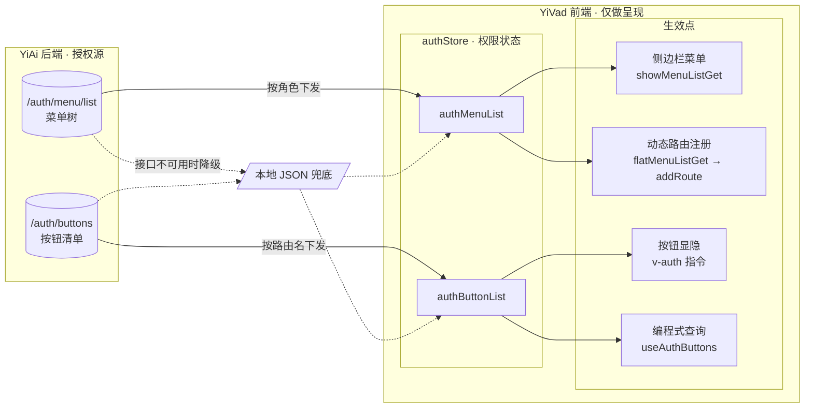
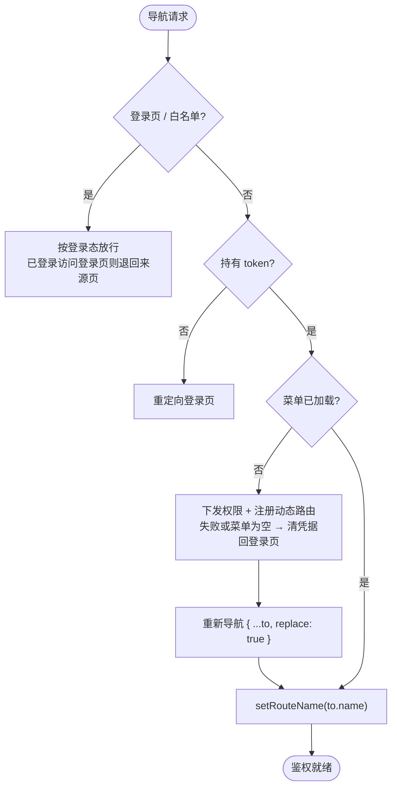
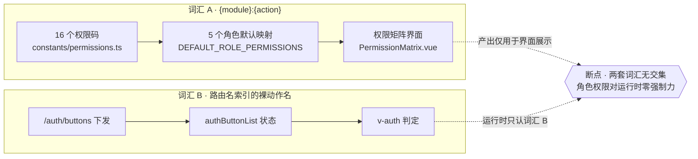
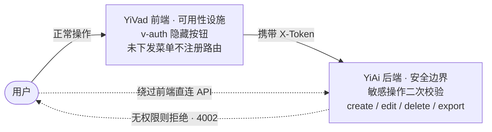
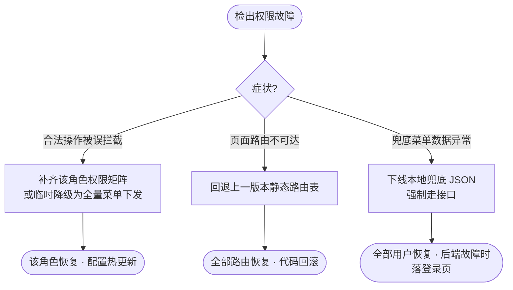

# YV-07-07: 权限系统与动态菜单 — RBAC 权限码 + v-auth 按钮级鉴权 + 菜单驱动动态路由

> 需求编号：YV-07-07 · 优先级：P0 · 人天：2.0d · 状态：已完成
> 依赖：YV-07-03（布局与动态路由）、YV-07-05（API 层设计）
> 交付物：权限码体系、按钮级鉴权、菜单驱动动态路由、路由守卫、离线降级

本文档定义**需求**——系统必须提供什么能力、边界在哪里、如何验收。实现方案见[开发方案](../../devs/2026-07/07-prd-task-权限系统与动态菜单.md)，验证方式见[测试用例](../../tests/2026-07/07-prd-test-权限系统与动态菜单.md)。

---

## 背景

YiVad 是多项目共用的管理后台，不同角色对本仓库四个项目（YiAi / YiPet / YiVad / YiKnowledge）的数据拥有不同操作权限。没有权限系统时，所有页面与按钮对所有登录用户可见，无法满足「访客只读」「工程师可写但不可删」这类基本诉求。

### 业务背景

五类角色，各自承担不同的职责边界：

| 角色 | 角色标识 | 职责 | 典型用户 |
|------|---------|------|---------|
| 管理员 | `admin` | 系统配置、用户与角色管理、审计 | 1-2 人 |
| 工程师 | `engineer` | 项目开发、知识沉淀、数据导出 | 3-5 人 |
| 产品经理 | `producter` | 需求梳理、项目推进、知识编辑 | 1-2 人 |
| 分析师 | `analyst` | 只读分析 + 数据导出 | 1-2 人 |
| 访客 | `viewer` | 只读浏览 | 不限 |

### 核心挑战

| 挑战 | 影响 | 说明 |
|------|------|------|
| 页面级可见性 | 越权页面不应出现在导航中 | 菜单必须由后端按角色下发，而非前端硬编码 |
| 按钮级可见性 | 同一页面内不同角色操作能力不同 | 项目详情页中「删除项目」仅 admin 可用，「编辑项目」engineer 亦可 |
| 路由可达性 | 无权限页面不应通过手工输入 URL 到达 | 依赖菜单驱动注册——未下发的菜单不注册路由 |
| 权限来源单点 | 前端不得成为权限的事实来源 | 权限码与菜单均从 YiAi 下发，前端仅做 UI 呈现 |
| 离线可用性 | 后端故障时后台不应完全不可用 | 权限数据需本地兜底，且兜底范围必须收敛 |

---

## 一、现状与目标

### 1.1 改造前

无权限模型。登录即全量可见：侧边栏菜单硬编码，所有页面和操作按钮对任意登录用户开放，无角色区分、无权限码、无审计。

### 1.2 改造后能力全景

权限由 YiAi 单点下发，前端只做呈现。两条下发链路（菜单树、按钮清单）汇入权限状态，再由四个生效点分别作用于界面：

> 上图虚线为降级路径，其已知后果见[§8 风险](#sec-vocab-risk)：兜底菜单的路由名与兜底按钮清单的键**无交集**，离线状态下按钮级鉴权会移除全部受控按钮。

四项能力共同构成权限系统：

| 能力 | 载体 | 作用点 |
|------|------|--------|
| 权限码体系 | `constants/permissions.ts` | 权限的最小表达单位与角色矩阵 |
| 按钮级鉴权 | `v-auth` 指令 | 无权限按钮从 DOM 移除 |
| 菜单级鉴权 | 动态路由注册 | 未下发菜单不注册路由 → 不可达 |
| 登录态防护 | 路由守卫 | 未登录/无菜单时重定向登录页 |

> **链路完整性**：菜单级鉴权与登录态防护已端到端生效；**权限码体系当前仅服务于角色矩阵编辑界面**，未参与运行时判定——断点见[§4.3](#sec-vocab-gap)。路由守卫的判定时序见 [FR-04](#fr-04)。

### 1.3 能力边界

本需求**不**建立独立的服务端授权校验层，**不**提供行级数据过滤，**不**保证前端隐藏等价于安全边界。前端权限控制是**可用性设施**，敏感操作的最终裁定权归 YiAi 后端——该原则见[§5.1 安全](#sec-security)。

---

## 二、需求范围

### 2.1 范围内

| 编号 | 需求项 |
|------|--------|
| R-01 | 定义 `{module}:{action}` 格式的权限码，覆盖 7 个功能模块 |
| R-02 | 定义 5 个角色到权限码的默认映射 |
| R-03 | 提供 `v-auth` 指令，支持单权限码与多权限码 AND 组合 |
| R-04 | 后端按角色下发菜单树，前端据此**动态注册路由** |
| R-05 | 后端下发按钮权限清单，按路由名索引 |
| R-06 | 路由守卫处理登录态、白名单、菜单初始化时序 |
| R-07 | 权限数据下发失败时降级到本地 JSON |
| R-08 | 提供编程式权限查询（非指令场景） |
| R-09 | 角色管理页提供权限矩阵编辑界面 |

### 2.2 范围外

以下能力**明确不在本期范围**，避免误认为已交付：

| 不做的事 | 原因 | 归属 |
|---------|------|------|
| 数据级（行级）权限 | 内部后台无「不同用户看不同行」的诉求 | 未来按需 |
| 独立 403 页面与路由级显式拦截 | 菜单驱动已使未授权路由不可达，独立拦截页收益低 | 未来按需 |
| 权限变更实时推送 | 变更后需刷新页面生效，当前可接受 | 技术债 T-02 |
| `v-auth:disable` 禁用态 | 当前仅需隐藏，不需「可见但禁用」 | 技术债 T-03 |
| 权限变更审计日志 | 依赖后端审计能力 | 技术债 T-04 |
| 菜单搜索 / 命令面板 | 菜单规模未达痛点阈值 | 技术债 T-05 |

---

## 三、功能需求

### FR-01 权限码体系

系统必须提供一套自描述、可枚举、前后端一致的权限表示法。

- **格式**：`{module}:{action}`，全小写，冒号分隔，无空格
- **覆盖**：7 个模块共 16 个权限码（清单见[§4.1](#sec-perm-codes)）
- **类型安全**：权限码必须是 TypeScript 联合类型，禁止散落的字符串字面量
- **分组元数据**：每个模块必须携带中文标签，供权限矩阵界面分组渲染
- **强制程度**：新增权限码时，必须同时登记到权限码表与模块分组，二者不可分叉

### FR-02 按钮级鉴权

无权限的操作按钮**不得**出现在 DOM 中。

| 项 | 要求 |
|----|------|
| 触发方式 | 指令形式，绑定在按钮元素上 |
| 单权限码 | 缺少该权限码时移除元素 |
| 多权限码 | 数组形式，**AND 语义**——缺任一权限码即移除 |
| 移除方式 | 从 DOM 中物理移除，而非 CSS 隐藏（HTML 源码中不可见） |
| 判定依据 | 当前路由名下发的按钮权限清单 |
| 空值处理 | 未绑定权限码时不执行移除 |
| 权限未就绪 | 权限数据尚未加载完成时**不得**误移除（不得出现按钮闪烁） |

### FR-03 菜单级鉴权与动态路由

侧边栏菜单与可访问路由必须同源——均由后端菜单树下发决定。

- 菜单树由后端按角色返回，前端**不得**维护静态业务路由表
- 树形菜单必须**扁平化**后注册，保证父节点先于子节点
- 菜单项声明的组件路径必须解析为**懒加载**组件（按视图分块）
- 组件文件缺失的菜单项必须**跳过**而非中断注册
- 全屏页面（`meta.isFull`）注册于顶层，其余注册于布局路由之下
- 仅作重定向的菜单分组不注册组件

### FR-04 登录态与路由守卫

| 场景 | 要求 |
|------|------|
| 访问登录页且已登录 | 退回来源页，并重置已注册的动态路由 |
| 访问白名单路径 | 直接放行，不做鉴权 |
| 未持有 token | 重定向登录页 |
| 已登录但菜单未加载 | 完成权限下发与路由注册后**重新导航**至原目标 |
| 菜单已加载 | 记录当前路由名，供按钮级鉴权索引 |

**判定顺序本身是需求的一部分**——「注册后重新导航」不可省略（新注册的路由需重新匹配），「记录路由名」亦不可省略（它是按钮级鉴权的索引前提）：

> 失败与空菜单分支的降级要求见 [FR-05](#fr-05)。

### FR-05 权限数据下发与离线降级

- 菜单与按钮权限均由 YiAi 授权接口下发，前端不缓存为事实来源
- YiAi 不可用时**降级**到本地 JSON，保证后台基本可用
- 降级必须是**静默**的（不打断用户），但必须在日志中可观测
- 权限接口失败且菜单为空时，必须清除登录态并回到登录页（不可停留在半可用状态）

> **降级范围的已知限制**：兜底菜单含 60 个路由名，而兜底按钮清单仅含 `useProTable`、`authButton` 两个键，二者**无交集**。因此离线状态下按钮级鉴权取不到任何权限码，**受控按钮会被全部移除**——「后台基本可用」在离线场景下仅覆盖到菜单与页面，不含按钮操作。该限制使 AC-11 的通过条件需要按下述口径收窄。

### FR-06 编程式权限检查

指令无法覆盖的场景（如根据权限渲染不同文案、条件跳转）必须提供组合式函数，返回当前页面的权限查询能力。

### FR-07 角色权限矩阵编辑

角色管理页必须提供可视化矩阵：按模块分组列出全部权限码，支持全选/取消全选与逐项勾选，结果作为角色的 `permissions` 字段持久化。

---

## 四、权限码与角色矩阵

### 4.1 权限码清单

7 个模块，16 个权限码：

| 模块 | 标识 | 权限码 | 数量 |
|------|------|--------|------|
| 项目管理 | `project` | `project:view` `project:create` `project:edit` `project:delete` | 4 |
| 知识库 | `knowledge` | `knowledge:view` `knowledge:create` `knowledge:edit` `knowledge:delete` | 4 |
| 数据服务 | `data` | `data:view` `data:export` | 2 |
| AI 对话 | `chat` | `chat:view` `chat:create` | 2 |
| 用户管理 | `user` | `user:manage` | 1 |
| 角色管理 | `role` | `role:manage` | 1 |
| 审计日志 | `audit` | `audit:view` `audit:export` | 2 |
| **合计** | | | **16** |

> 权限码的「读」动作统一命名为 `view`，与 `create` / `edit` / `delete` / `export` / `manage` 构成动作词表。动作词表之外的命名需在评审中确认。

### 4.2 角色-权限映射

| 角色 | 权限数 | project | knowledge | data | chat | user | role | audit |
|------|-------|---------|-----------|------|------|------|------|-------|
| `admin` | 16 | 全部 | 全部 | 全部 | 全部 | ✅ | ✅ | 全部 |
| `engineer` | 10 | view/create/edit | view/create/edit | view/export | view/create | — | — | — |
| `producter` | 9 | view/create/edit | view/create/edit | view | view/create | — | — | — |
| `analyst` | 6 | view | view | view/export | view/create | — | — | — |
| `viewer` | 5 | view | view | view | view/create | — | — | — |

**设计意图**：`admin` 独占用户与角色管理——权限系统的管理面不可被非管理员触碰；`delete` 动作仅 `admin` 持有，体现「写入可授权、删除要收敛」；`data:export` 对 `analyst` 开放，因其职责即为分析。

### 4.3 权限码与运行时鉴权的关系

上表定义的权限码表达的是**授权意图**；而运行时按钮判定读取的是另一套词汇——由后端按路由名下发的裸动作名。两者当前未打通：

**当前达成度**：`DEFAULT_ROLE_PERMISSIONS` 无任何运行时消费者，角色权限的变更只影响矩阵界面的勾选回显，**不具备运行时强制力**。需求侧的期望是让权限码成为下发、校验、矩阵编辑三处的唯一词汇——该演进登记为 T-01，风险与缓解见 [§8](#sec-vocab-risk)。

---

## 五、非功能需求

### 5.1 安全需求

| 需求 | 要求 | 验证方式 |
|------|------|---------|
| 前端权限非信任边界 | 前端鉴权仅控制 UI；创建/编辑/删除/导出等敏感操作由 YiAi 后端二次校验 | 绕过前端直接调用 API，确认后端拒绝 |
| 降级范围收敛 | 本地兜底数据不得包含用户管理、角色管理等管理面入口 | 审查兜底 JSON，确认无管理路由 |
| 凭据失效即失效 | token 失效或权限下发失败时，清除持久化状态并回到登录页，无宽限期 | 模拟 token 过期，确认状态清空且跳转 |
| 权限码单一事实源 | 权限码必须定义在权限码表中，禁止字符串字面量散落于视图 | 静态检查视图中的指令用法是否引用常量 |

信任边界如下——前端隐藏入口只影响**可达性**，不构成**安全性**：

### 5.2 性能需求

| 指标 | 目标 | 说明 |
|------|------|------|
| 权限下发耗时 | P95 ≤ 1s | 菜单与按钮两次授权请求，阻塞首次受保护路由的进入 |
| 按钮鉴权开销 | 单元素判定 O(1) | 基于数组包含判断，不得引入逐元素二次遍历 |
| 路由注册耗时 | < 50ms | 一次性操作，菜单项数量级为数十 |

### 5.3 可用性需求

- 后端不可用时，降级路径必须**不阻塞**页面渲染
- 权限下发失败不得导致白屏；必须落到登录页或降级菜单
- 菜单项组件缺失时跳过该项，不得中断整棵菜单的注册

### 5.4 可观测性需求

| 事件 | 级别 | 必须记录 |
|------|------|---------|
| 权限下发成功 | INFO | 菜单数、按钮规则数、耗时、来源（接口/兜底） |
| 降级到本地 JSON | WARN | 失败原因、重试次数 |
| 权限为空/下发失败 | ERROR | 用户、目标路径、失败原因 |

### 5.5 兼容性需求

- 路由模式支持 hash 与 history 两种（由构建环境变量决定）
- 类型检查：`vue-tsc --noEmit` 必须无错误
- 前端权限判定不得依赖浏览器私有 API

---

## 六、设计决策

### 决策 1：权限粒度 — 仅菜单级 vs 菜单+按钮级 vs 菜单+按钮+数据级

| 选项 | 安全性 | 复杂度 | 用户体验 |
|------|--------|--------|---------|
| 仅菜单级 | 低（可猜测 URL 访问） | 低 | 中 |
| **菜单+按钮级** | 中 | 中 | 高（精细的操作控制） |
| 菜单+按钮+数据级 | 高 | 高 | 高（行级过滤） |

**选择：菜单+按钮级。** 内部后台不存在行级数据隔离诉求，引入数据级权限将显著抬升复杂度而无对应收益。

### 决策 2：权限数据源 — 仅后端 vs 后端+本地兜底

| 选项 | 可用性 | 一致性 | 离线支持 |
|------|--------|--------|---------|
| 仅后端 | 依赖 YiAi 运行 | 高 | 否 |
| **后端+本地兜底** | 高 | 中（兜底可能过期） | 是 |

**选择：后端+本地兜底。** 后台在 YiAi 故障时仍需可用于排障与浏览，但兜底范围收敛到公开页面。

### 决策 3：按钮权限实现 — `v-if` vs `v-auth` 指令 vs CSS 隐藏

| 选项 | 安全性 | 渲染时机 | DOM 残留 |
|------|--------|---------|---------|
| `v-if` | 中 | 组件渲染时（权限可能未就绪） | 否 |
| **`v-auth` 指令** | 高 | `mounted` 后（权限已就绪） | 否 |
| CSS 隐藏 | 低（源码可见） | — | 是 |

**选择：`v-auth` 指令。** 指令在挂载后判定，天然规避「权限未加载即误渲染」；物理移除元素比 CSS 隐藏更彻底。

### 决策 4：路由级防护 — 独立拦截 vs 菜单驱动不可达

**选择：菜单驱动不可达。** 未下发的菜单不注册路由，用户即使手工输入 URL 也匹配不到路由（落到 404）。这比「注册全部路由 + 守卫拦截」更彻底——**不存在的路由无法被绕过**，同时省去一份需要与菜单同步维护的权限映射表。

### 设计决策记录

| 决策 | 选项 A | 选项 B | 选项 C | 选择 | 理由 |
|------|--------|--------|--------|------|------|
| 权限粒度 | 仅菜单级 | 菜单+按钮级 | 菜单+按钮+数据级 | **菜单+按钮级** | 无行级隔离诉求 |
| 数据源 | 仅后端 | 后端+本地兜底 | — | **后端+本地兜底** | 后端故障时保持可用 |
| 按钮权限 | `v-if` | `v-auth` 指令 | CSS 隐藏 | **`v-auth` 指令** | 渲染时机正确 + 物理移除 |
| 路由防护 | 独立 403 拦截 | 菜单驱动不可达 | — | **菜单驱动不可达** | 不存在的路由无法绕过 |

---

## 七、验收标准

需求级验收条件（逐条可验证）：

- [ ] **AC-01** 权限码表包含 7 个模块、16 个权限码，格式统一为 `{module}:{action}`，导出为联合类型
- [ ] **AC-02** 5 个角色的默认权限映射与[§4.2](#sec-role-matrix)一致
- [ ] **AC-03** 无权限按钮在 DOM 中被移除；HTML 源码中检索不到该按钮
- [ ] **AC-04** 多权限码数组遵循 AND 语义，缺任一权限码即移除
- [ ] **AC-05** 侧边栏菜单与后端下发一致，未下发页面不出现在导航中
- [ ] **AC-06** 动态路由按菜单树注册，组件按视图分块懒加载
- [ ] **AC-07** 组件缺失的菜单项被跳过，其余菜单正常注册
- [ ] **AC-08** 未登录访问受保护路由 → 重定向登录页
- [ ] **AC-09** 白名单路径无需鉴权即可访问
- [ ] **AC-10** 已登录访问登录页 → 退回来源页
- [ ] **AC-11** YiAi 不可用时降级到本地 JSON：菜单与页面可正常访问。**按钮级操作不在降级范围内**——兜底按钮清单与兜底菜单路由名无交集，受控按钮会被移除（见 [FR-05](#fr-05) 与 [§8](#sec-vocab-risk)）
- [ ] **AC-12** 权限下发失败且菜单为空 → 清除登录态并回到登录页
- [ ] **AC-13** 角色管理页权限矩阵可编辑，持久化角色的 `permissions` 字段
- [ ] **AC-14** `vue-tsc --noEmit` 与 ESLint 通过

---

## 八、风险与缓解

| 风险 | 概率 | 影响 | 等级 | 缓解措施 | 应急预案 |
|------|------|------|------|---------|---------|
| **权限码与运行时下发词汇不统一** — 权限码表使用 `{module}:{action}`，而运行时按钮下发使用路由名索引的裸动作名，导致权限码表的授权结果不驱动按钮可见性 | 高 | 高 | **高** | 统一为单一权限码词汇，下发、校验、矩阵编辑三处同源；详见[开发方案 §8](../../devs/2026-07/07-prd-task-权限系统与动态菜单.md#known-defects) | 临时以路由名索引的裸动作名维护运行时鉴权，同时限制权限矩阵仅作角色建档 |
| 新增权限码未同步登记 | 中 | 高 | 中 | 权限码集中定义于单一文件，新增时同时登记模块分组 | 手工比对视图中的指令用法与权限码表 |
| 本地兜底数据过期 | 中 | 低 | 低 | 兜底 JSON 随部署同步更新 | 提示权限数据可能过期 |
| 兜底按钮清单与兜底菜单路由名**无交集**（60 个路由名 vs 2 个按钮键）——离线时按钮级鉴权取不到权限码，受控按钮被全部移除 | 高 | 中 | 中 | 兜底按钮清单需补齐与兜底菜单路由名对齐的键；在此之前离线可用范围仅含菜单与页面 | 明确告知：离线状态下按钮操作不可用 |
| 权限下发耗时阻塞首屏 | 中 | 中 | 中 | 接口并行下发；兜底路径不阻塞渲染 | 超时后走兜底并记录 WARN |
| 角色权限持久化后无运行时效果 | 高 | 高 | **高** | 与上表第 1 项同源；需在后续迭代闭合鉴权链路 | 明确告知：当前角色权限不具备运行时强制力 |

---

## 九、回滚策略

| 回滚场景 | 回滚方式 | 影响范围 | 恢复时间 |
|----------|----------|----------|----------|
| 权限误拦截合法操作 | 为角色补齐权限矩阵，或临时降级为全量菜单下发 | 该角色用户 | 配置热更新 |
| 动态路由注册失败致页面不可达 | 回退到上一版本静态路由表 | 全部路由 | 代码回滚 |
| 降级数据错误致菜单异常 | 下线本地兜底 JSON，强制走接口（后端故障时落到登录页） | 全部用户 | 代码回滚 |

按症状选择回滚动作：

---

## 十、后续演进

| 编号 | 事项 | 优先级 | 说明 |
|------|------|--------|------|
| T-01 | 闭合权限码与运行时鉴权链路 | P0 | 使权限码成为下发、校验、矩阵编辑的唯一词汇，角色权限具备运行时强制力 |
| T-02 | 权限变更实时推送 | P1 | 通过 SSE/WebSocket 推送变更，变更后无需刷新页面 |
| T-03 | `v-auth:disable` 禁用态 | P2 | 无权限时禁用而非隐藏，让用户知晓操作存在 |
| T-04 | 权限变更审计日志 | P2 | 记录操作人、时间、变更内容 |
| T-05 | 菜单搜索 / 命令面板 | P3 | 菜单规模增长后的检索能力 |

---

## 十一、关联需求

- 依赖：[YV-07-03 布局与动态路由](./03-prd-布局与动态路由.md)——提供布局路由与菜单容器
- 依赖：[YV-07-05 API 层设计](./05-prd-API层设计.md)——提供请求封装与凭据失效处理
- 上游：[YV-07-00 需求总览](./00-prd-需求总览.md)
- 开发方案：[07-prd-task-权限系统与动态菜单.md](../../devs/2026-07/07-prd-task-权限系统与动态菜单.md)
- 测试用例：[07-prd-test-权限系统与动态菜单.md](../../tests/2026-07/07-prd-test-权限系统与动态菜单.md)

---

*PRD 来源: [00-需求总览](./00-prd-需求总览.md)*
