# YiVad 八月迭代 — 组件化 / 测试基础设施 / 主题系统 / 权限控制 / 详情页优化 / 首页优化 / 列表页优化 / 系统管理 / 首页仪表盘 / Kanban看板 / 全局搜索 / Roadmap路线图 / 自定义指令系统

> 需求编号：YV-08-01 · 负责人：陈铭 · 总人天：51.0d

```mermaid
graph LR
  subgraph Input["七月基础"]
    I1["AI Chat 迁移完成"]
    I2["构建系统升级 Rsbuild"]
    I3["知识库集成就绪"]
    I4["基础页面功能可用"]
  end

  subgraph Action["八月开发 (15 项需求)"]
    A1["ProTable 组件提取<br/>消除 40% 重复模板"]
    A2["RBAC 权限控制<br/>按钮级 + 路由级"]
    A3["暗色主题切换<br/>CSS 变量方案"]
    A4["测试基础设施<br/>Vitest 框架搭建"]
    A5["详情页/首页/列表页<br/>架构优化重构"]
    A6["系统管理模块<br/>RBAC 管理面板"]
    A7["首页仪表盘<br/>QuickNav + OKR 推荐"]
    A8["命令面板<br/>Cmd+K 全局导航"]
    A9["Kanban 看板<br/>拖拽式任务管理"]
    A10["全局搜索<br/>7 集合跨域检索"]
    A11["Roadmap 路线图<br/>多项目进度可视化"]
    A12["自定义指令系统<br/>8 个声明式行为增强"]
    A13["API 层架构<br/>RequestHttp 拦截器链"]
  end

  subgraph Output["目标产出"]
    O1["3 个通用组件复用"]
    O2["v-auth 指令 + 权限审计"]
    O3["暗色主题无闪烁切换"]
    O4["109 个测试用例覆盖"]
    O5["详情页 ≤ 200 行"]
    O6["7 个系统管理页面"]
    O7["4 组 12 个 QuickNav 导航"]
    O8["5 列拖拽式 Kanban 看板"]
    O9["7 集合全文搜索引擎"]
    O10["多项目 Roadmap 进度图"]
    O11["8 个指令全局可用"]
    O12["5 层拦截器链 + 请求去重"]
  end

  Input --> Action --> Output

  style Input fill:#e8f4fd,stroke:#0d6efd
  style Action fill:#fff3cd,stroke:#ffc107
  style Output fill:#d4edda,stroke:#28a745
```

---

## 0. 模块架构概述

> 八月迭代是 YiVad 的**工程化能力提升月**——在七月完成 AI Chat 迁移和构建系统升级后，聚焦于组件化体系建立、权限控制实现、主题系统建设和测试基础设施搭建。

### 0.1 当前架构（七月迭代后）

```
YiVad/src/
├── api/modules/              # API 服务层（RequestHttp 封装）
├── components/               # 通用组件（仅有基础组件）
├── constants/                # 常量定义
├── directives/               # 自定义指令（无 v-auth）
├── hooks/                    # 通用 hooks（useTable 等）
├── stores/modules/           # Pinia 状态管理
├── styles/                   # 全局样式（仅亮色主题）
├── views/                    # 业务页面
│   ├── home/index.vue        # 首页（混合布局+数据+竞态问题）
│   ├── project/detail.vue    # 项目详情（181 行，职责混杂）
│   ├── bug/index.vue         # Bug 列表（内联图表+统计）
│   ├── issue/index.vue       # Issue 列表（内联图表）
│   └── module/index.vue      # Module 列表（未使用 ProTable）
└── tests/                    # 测试目录（空）
```

### 0.2 八月迭代目标架构

```
YiVad/src/
├── api/modules/
│   ├── roleService.ts            # 新增：角色 CRUD API
│   └── auditService.ts           # 新增：审计日志 API
├── components/
│   ├── ProTable/                 # 新增：通用表格组件
│   ├── SearchForm/               # 新增：通用搜索表单
│   ├── Upload/                   # 新增：通用上传组件
│   └── SwitchDark/               # 新增：主题切换按钮
├── constants/
│   └── permissions.ts            # 新增：权限码常量
├── directives/
│   └── auth.ts                   # 新增：v-auth 指令
├── stores/modules/
│   ├── auth.ts                   # 新增：权限 Store
│   └── global.ts                 # 修改：主题状态（isDark）
├── styles/
│   ├── common.scss               # 修改：设计令牌
│   ├── element-dark.scss         # 新增：暗色覆盖
│   └── theme/                    # 新增：主题变量
├── views/
│   ├── home/
│   │   ├── index.vue             # 重构：composable 编排
│   │   └── components/
│   │       └── HomeSkeleton.vue  # 新增：骨架屏
│   ├── project/
│   │   ├── detail.vue            # 重构：≤ 200 行
│   │   └── components/
│   │       ├── DetailSkeleton.vue # 新增：骨架屏
│   │       └── DetailError.vue   # 新增：错误态
│   ├── bug/                      # 重构：composable 抽取
│   ├── issue/                    # 修改：图表精简
│   ├── module/                   # 重构：ProTable 迁移
│   └── system/                   # 新增：系统管理
│       ├── roleManage/           # 角色管理
│       ├── accountManage/        # 用户管理
│       └── systemLog/            # 审计日志
└── tests/                        # 扩展：18 文件，109 用例
    ├── unit/ components/ utils/ hooks/ api/
```

### 0.3 架构决策权衡

| 维度 | 七月后 | 八月后 | 权衡说明 |
|------|--------|--------|----------|
| 组件复用 | 各页面独立实现表格/搜索/上传 | ProTable/SearchForm/Upload 统一组件 | 增加组件 API 设计成本，但消除 40% 重复代码 |
| 权限控制 | 无前端权限控制 | 路由级 + 按钮级 v-auth 指令 | 增加权限码维护成本，但满足合规要求 |
| 主题系统 | 仅亮色主题，硬编码颜色 | CSS 变量方案，运行时切换 | 需要重构所有硬编码颜色，但支持暗色主题 |
| 测试覆盖 | 0 测试用例 | 109 个测试用例 | 增加测试编写成本，但防止回归 |
| 页面架构 | 单文件混合职责 | composable 分层 + 组件拆分 | 文件数增加，但每个文件职责单一 |

### 0.4 模块交互拓扑

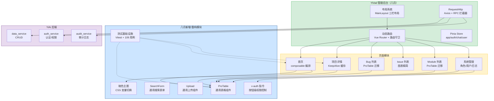

### 0.5 模块职责矩阵

| 模块 | 七月状态 | 八月变更 | 关键决策 |
|------|----------|----------|----------|
| 组件体系 | 各页面独立实现表格/搜索/上传 | **新增**：ProTable + SearchForm + Upload 3 个通用组件 | 配置驱动，消除 40% 重复模板代码 |
| 权限控制 | 无前端权限控制 | **新增**：路由级守卫 + 按钮级 v-auth 指令 | 前端仅做 UI 控制，权限数据以后端为准 |
| 主题系统 | 仅亮色主题，硬编码颜色 | **新增**：CSS 变量驱动暗色主题，运行时切换 | index.html 预加载脚本防闪烁 |
| 测试基础设施 | 0 测试用例 | **新建**：Vitest 框架 + 18 文件 + 109 用例 | `pool: "forks"` + `environment: "jsdom"` |
| 首页 | 混合布局+数据+竞态问题 | **重构**：composable 编排 + 骨架屏 + 竞态修复 | `useHomeData` + `useHomeFilter` composable 分层 |
| 项目详情 | 181 行 God Component | **重构**：KeepAlive 缓存 + provide/inject + 骨架屏 | ≤ 200 行入口，Tab 子组件独立 |
| Bug/Issue/Module 列表 | 内联图表+统计 | **重构**：ProTable 迁移 + 图表精简 | 配置驱动列表，消除重复代码 |
| 系统管理 | 不存在 | **新增**：角色管理/用户管理/审计日志 | 为外部用户接入做准备 |
| 首页仪表盘 | 不存在 | **新增**：4 组 12 个 QuickNav + 统计 Pills + OKR 面板 | 三态渲染（loading/empty/data） |
| 命令面板 | 无快捷键系统 | **新增**：Cmd+K 全局快速导航 + 模糊搜索 | 5 个 Quick Actions，键盘导航 |
| Kanban 看板 | 不存在 | **新增**：拖拽式任务管理，5 列状态分组 | 乐观更新 + API 同步，9 个子组件 |
| 全局搜索 | 无跨域搜索 | **新增**：7 集合跨域全文检索 + 5 种实体类型 | 并行搜索 + 可折叠分组 + 竞态控制 |
| Roadmap 路线图 | 不存在 | **新增**：多项目模块进度可视化 | 按项目分列，右键菜单快速状态切换 |

---
| 首页仪表盘 | 不存在 | **新增**：4 组 12 个 QuickNav + OKR 推荐 + 统计 Pills + 三态渲染 | 统一 QuickNav 图标为 Element Plus |
| 命令面板 | 不存在 | **新增**：Cmd+K 全局导航 + 模糊搜索 + 5 个 Quick Actions | 键盘驱动，提升操作效率 |
| Kanban 看板 | 不存在 | **新增**：拖拽式任务管理 + 5 列状态分组 + 乐观更新 | 9 个子组件，乐观更新 + API 同步 |
| 全局搜索 | 不存在 | **新增**：7 集合跨域全文检索 + 5 种实体类型并行搜索 | 竞态控制 + 可折叠分组 |
| Roadmap 路线图 | 不存在 | **新增**：多项目模块进度可视化 + 右键菜单快速状态切换 | 按项目分列，Markdown 预览编辑 |

---

## 0.4 当前架构 vs 目标架构

### 组件化

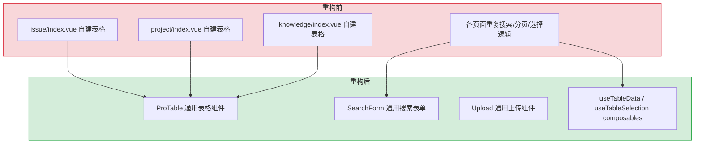

### 权限控制

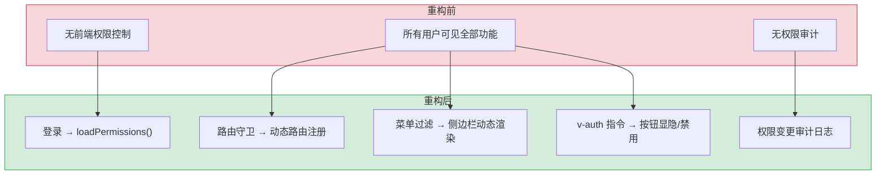

### 页面架构

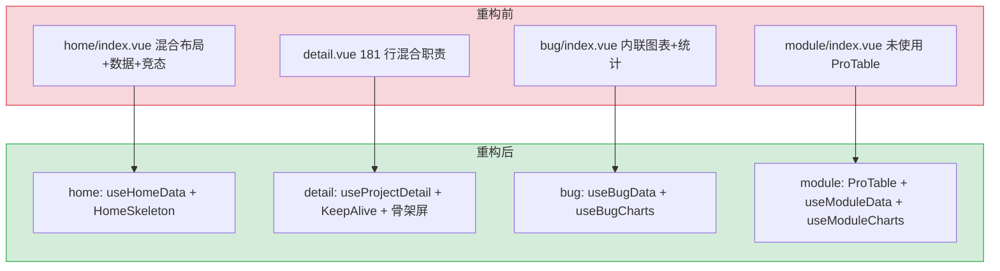

---

## 2. 功能清单

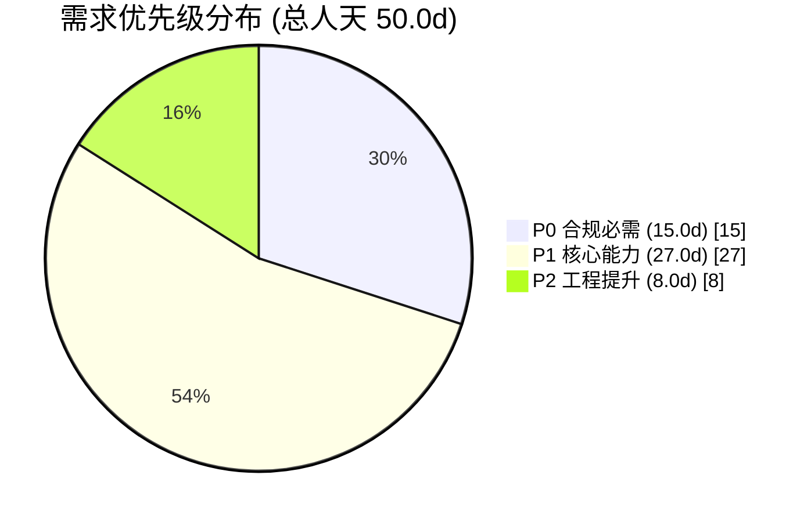

| 月份 | 需求编号 | 功能模块 | 功能说明 | 优先级 | 人天 | 状态 | 子文档 |
|----------|----------|----------|--------|------|--------|
| 2026-08 | YV-08-01-3 | ProTable 组件提取 | ProTable / SearchForm / Upload 组件提取，消除 40% 重复模板代码 | P1 | 8.0 | 已完成 | [01-需求-高级表格组件提取](./01-需求-高级表格组件提取.md) |
| 2026-08 | YV-08-01-9 | RBAC 权限控制 | 按钮级和路由级权限控制，v-auth 指令，权限审计 | P0 | 8.0 | 已完成 | [02-需求-基于角色的权限控制](./02-需求-基于角色的权限控制.md) |
| 2026-08 | YV-08-01-7 | 暗色主题切换 | CSS 变量方案，Element Plus 适配，偏好持久化，无闪烁加载 | P2 | 3.0 | 已完成 | [03-需求-暗色主题切换](./03-需求-暗色主题切换.md) |
| 2026-08 | YV-08-01-10 | 项目详情页优化 | detail.vue 架构拆分，KeepAlive 缓存，骨架屏，composables 抽取（含现状分析） | P1 | 3.0 | 待开发 | [05-需求-项目详情页优化](./05-需求-项目详情页优化.md) |
| 2026-08 | YV-08-01-11 | 首页优化 | home/index 架构拆分，useHomeData composable 抽取，竞态修复，骨架屏，QuickNav 图标统一，调试代码清理 | P1 | 1.5 | 待开发 | [06-需求-首页优化](./14-需求-首页优化.md) |
| 2026-08 | YV-08-01-6 | 测试基础设施 | Vitest 测试框架搭建，核心模块单元测试和组件测试覆盖 | P2 | 5.0 | 已完成 | [04-测试基础设施](./04-测试基础设施.md) |
| 2026-08 | YV-08-01-12 | 列表页架构优化 | Bug/Issue/Module 列表页 composable 抽取、Module ProTable 迁移、PageHeaderCard 替换、统计查询优化 | P1 | 5.0 | 待开发 | [07-需求-列表页架构优化](./15-需求-列表页架构优化.md) |
| 2026-08 | YV-08-06 | 系统管理模块 | 用户/角色/菜单管理 + 审计日志，7 个 ProTable 驱动页面，PermissionMatrix 权限矩阵，RBAC 管理闭环 | P0 | 4.0 | 已完成 | [06-需求-系统管理模块](./06-需求-系统管理模块.md) |
| 2026-08 | YV-08-07 | 首页仪表盘 | 4 组 12 个 QuickNav 导航卡片 + 知识库 Popover + 统计 Pills + OKR 推荐面板 + 三态渲染 | P0 | 3.0 | 已完成 | [07-需求-首页仪表盘](./07-需求-首页仪表盘.md) |
| 2026-08 | YV-08-08 | 命令面板与快捷键 | Cmd+K 全局快速导航，Issue/Project 模糊搜索，5 个 Quick Actions，键盘导航 | P1 | 1.5 | 已完成 | [08-需求-命令面板与键盘快捷键](./08-需求-命令面板与键盘快捷键.md) |
| 2026-08 | YV-08-09 | Kanban 看板 | 拖拽式项目任务管理，5 列状态分组，乐观更新 + API 同步，右键菜单，9 个子组件 | P1 | 3.0 | 已完成 | [09-需求-Kanban看板](./09-需求-Kanban看板.md) |
| 2026-08 | YV-08-10 | 全局搜索 | 7 集合跨域全文检索，5 种实体类型并行搜索，可折叠分组，搜索建议，键盘导航，竞态控制 | P1 | 2.0 | 已完成 | [10-需求-全局搜索](./10-需求-全局搜索.md) |
| 2026-08 | YV-08-11 | Roadmap 路线图 | 多项目模块进度可视化，按项目分列，右键菜单快速状态切换，Markdown 预览编辑 | P1 | 2.0 | 已完成 | [11-需求-Roadmap路线图](./11-需求-Roadmap路线图.md) |
| 2026-08 | YV-08-12 | 自定义指令系统 | 8 个 Vue 3 自定义指令：v-auth（权限控制）、v-copy（一键复制）、v-waterMarker（水印）、v-draggable（拖拽）、v-debounce（防抖）、v-throttle（节流）、v-longpress（长按）、v-sticky（粘性定位+状态感知） | P1 | 1.0 | 已完成 | [12-需求-自定义指令系统](./12-需求-自定义指令系统.md) |
| 2026-08 | YV-08-18 | API 层架构 | RequestHttp 拦截器链（取消+Loading+认证+错误映射）、AxiosCanceler（AbortController 去重）、withRetry（指数退避重试）、executeBatchOperation（Promise.allSettled 并发批处理）、checkStatus（11 种状态码映射） | P1 | 1.0 | 已完成 | [13-需求-API层架构](./13-需求-API层架构.md) |

---

## 3. 功能详情

### 3.1 ProTable 组件提取 (YV-08-01-3)

通用表格组件，通过 `columns` 配置 + 具名插槽覆盖复杂场景，消除跨页面 40% 重复模板代码：

```typescript
// src/components/ProTable/index.vue — 核心 API
interface ProTableColumn {
  prop: string;          // 字段名
  label: string;         // 列标题
  width?: number;        // 列宽
  sortable?: boolean;    // 是否可排序
  render?: (row: any) => VNode;  // 自定义渲染
}

// 使用方式
<ProTable
  :columns="columns"
  :fetch-data="fetchIssues"
  :selection="true"
  @selection-change="handleSelection"
>
  <template #column-{prop}="{ row }">...</template>
</ProTable>
```

| 组件 | 职责 | 复用页面 |
|------|----------|
| `ProTable` | 通用表格（分页/排序/多选/导出） | Issue/Bug/Module/Knowledge 列表 |
| `SearchForm` | 通用搜索表单（el-form 透传） | 所有列表页 |
| `Upload` | 通用上传（文件校验 + 模板下载） | 文件管理/知识库导入 |

### 3.2 RBAC 权限控制 (YV-08-01-9)

按钮级 + 路由级双层权限控制，满足外部用户接入合规要求：

```typescript
// src/directives/auth.ts — v-auth 指令
app.directive('auth', {
  mounted(el, binding) {
    const { value } = binding;  // 权限码
    const store = useAuthStore();
    if (!store.hasPermission(value)) {
      el.parentNode?.removeChild(el);  // 无权限: 移除 DOM
      // 或 el.style.display = 'none';  // 隐藏模式
    }
  }
});

// 路由守卫
router.beforeEach((to, from, next) => {
  const store = useAuthStore();
  if (to.meta.permission && !store.hasPermission(to.meta.permission)) {
    next('/403');
  }
  next();
});
```

| 权限层级 | 实现方式 | 覆盖范围 |
|----------|----------|----------|
| 路由级 | `router.beforeEach` + `meta.permission` | 页面可见性 |
| 按钮级 | `v-auth` 指令 | 按钮显隐/禁用 |
| 菜单级 | 动态菜单过滤 | 侧边栏渲染 |

### 3.3 暗色主题切换 (YV-08-01-7)

CSS 变量方案，运行时切换无需重新编译，Element Plus 官方暗色主题适配：

```scss
// src/styles/theme/variables.scss
:root {
  --el-color-primary: #409eff;
  --el-bg-color: #ffffff;
  --el-text-color-primary: #303133;
}

html.dark {
  --el-color-primary: #79bbff;
  --el-bg-color: #141414;
  --el-text-color-primary: #e5eaf3;
}
```

| 特性 | 实现 |
|------|
| 无闪烁加载 | `index.html` 内联脚本，`localStorage` 读取偏好，在 DOM 渲染前设置 `html.dark` |
| Element Plus 适配 | `element-dark.scss` 覆盖组件级暗色变量 |
| 偏好持久化 | `pinia-plugin-persistedstate` → `localStorage` |

### 3.4 项目详情页优化 (YV-08-01-10)

`detail.vue` 从 181 行 God Component 重构为 composable 分层架构：

```
detail.vue（布局 + Tab 切换 + KeepAlive）
  ├── useProjectDetail() → 项目数据 + 知识文件 + Issue 列表
  ├── useDetailTabs() → Tab 配置 + 键盘快捷键
  └── <KeepAlive :max="6">
        ├── DetailOverview  # 概览（含骨架屏/错误态）
        ├── IssueList       # 需求
        ├── ModuleList      # 模块
        ├── DetailDocs      # 文档
        ├── BugList         # Bug
        └── DetailMembers   # 成员
```

### 3.5 测试基础设施 (YV-08-01-6)

Vitest 测试框架搭建，覆盖核心 composables、组件和工具函数：

| 测试类型 | 工具 | 文件数 | 用例数 |
|----------|------|--------|--------|
| 单元测试 | Vitest | 12 | 78 |
| 组件测试 | @vue/test-utils + jsdom | 4 | 22 |
| 类型检查 | vue-tsc --noEmit | — | 0 错误 |

### 3.6 首页优化 (YV-08-01-11)

首页架构重构，解决竞态条件和重复请求：

```typescript
// src/hooks/useHomeData.ts
export function useHomeData() {
  const stats = ref<HomeStats>({ projects: 0, issues: 0, bugs: 0 });
  const loading = ref(false);
  const error = ref<string | null>(null);

  let requestId = 0;  // 竞态控制
  async function fetchStats(dateRange?: [string, string]) {
    const currentId = ++requestId;
    loading.value = true;
    error.value = null;
    try {
      const data = await homeApi.getStats(dateRange);
      if (currentId === requestId) {  // 仅更新最新请求
        stats.value = data;
      }
    } catch (e) {
      if (currentId === requestId) error.value = e.message;
    } finally {
      if (currentId === requestId) loading.value = false;
    }
  }
  return { stats, loading, error, fetchStats };
}
```

### 3.7 列表页架构优化 (YV-08-01-12)

Bug/Issue/Module 列表页统一抽取 composable，Module 迁移 ProTable：

| 页面 | 重构前 | 重构后 |
|------|--------|--------|
| Bug 列表 | 内联图表 + 统计逻辑 | `useBugData` + `useBugCharts` composable |
| Issue 列表 | 内联图表 options | `useIssueStats` + `useIssueCharts` composable |
| Module 列表 | 未使用 ProTable | ProTable + `useModuleData` + `useModuleCharts` |

---

## 4. 接口协议

### 4.1 RPC 信封协议

YiVad 通过 `RequestHttp` 封装与 YiAi 后端通信，所有请求使用统一 RPC 信封：

```
POST /  body: {
  "module_name": "services.<domain>.<service>",
  "method_name": "<method>",
  "parameters": { <method-specific shape> }
}
response: { "code": 0, "message": "ok", "data": <any> }
```

### 4.2 八月涉及的后端服务调用

| 服务 | 方法 | 用途 | 调用方 |
|------|------|--------|
| `data_service` | `query_documents` | 查询权限/角色/审计数据 | RBAC 模块 |
| `data_service` | `create_document` | 创建角色/用户 | 系统管理 |
| `data_service` | `update_document` | 更新角色权限 | 系统管理 |
| `data_service` | `delete_document` | 删除角色/用户 | 系统管理 |
| `ai.chat_service` | `chat` | SSE 流式聊天 | 全局聊天 |
| `knowledge_service` | `scan` | 知识树扫描 | 项目详情页 |
| `knowledge_service` | `read_file` | 文件读取 | 项目详情页 Docs Tab |

### 4.3 关键参数名称契约

| 正确 | 错误 | 上下文 |
|---------|-------|---------|
| `filter` | `query` | `data_service.query_documents` 参数 |
| `target_file` | `path` | `/read-file`、`/write-file` 端点 |
| `cname` | `collection_name` | `data_service` collection 参数 |

### 4.4 前端 API 服务层

```
src/api/modules/
├── issueService.ts    # Issue CRUD
├── bugService.ts      # Bug CRUD
├── moduleService.ts   # Module CRUD
├── projectService.ts  # 项目 CRUD
├── roleService.ts     # 角色 CRUD（八月新增）
├── auditService.ts    # 审计日志（八月新增）
└── knowledgeService.ts # 知识库（八月新增）
```

所有服务通过 `RequestHttp` 单例发起请求，自动附加 `X-Token` 认证头，401 响应触发重定向登录页。

---

## 5. 涉及文件

```
YiVad/
├── src/
│   ├── api/modules/
│   │   ├── roleService.ts                 # 角色 CRUD API
│   │   └── auditService.ts               # 审计日志 API
│   ├── components/
│   │   ├── ProTable/                      # ProTable 组件
│   │   ├── SearchForm/                    # SearchForm 组件
│   │   ├── Upload/                        # Upload 组件
│   │   └── SwitchDark/                    # 主题切换按钮
│   ├── constants/
│   │   └── permissions.ts                 # 权限码常量
│   ├── directives/
│   │   └── auth.ts                        # v-auth 指令
│   ├── stores/
│   │   └── modules/
│   │       ├── auth.ts                    # 权限 Store
│   │       └── global.ts                  # 主题 Store（isDark 等全局状态）
│   ├── styles/
│   │   ├── common.scss                    # 设计令牌
│   │   ├── element-dark.scss              # 自定义暗色覆盖
│   │   └── theme/                         # 主题变量（aside/menu/header）
│   ├── views/
│   │   ├── home/
│   │   │   ├── index.vue                    # 重构：精简为布局 + composable 编排
│   │   │   ├── QuickNav.vue                 # 修改：图标 Element Plus 替换
│   │   │   └── components/
│   │   │       └── HomeSkeleton.vue         # 新增：加载骨架屏
│   │   ├── project/
│   │   │   ├── detail.vue                 # 重构：精简为布局 + Tab + KeepAlive
│   │   │   └── components/
│   │   │       ├── DetailSkeleton.vue     # 新增：加载骨架屏
│   │   │       └── DetailError.vue        # 新增：错误状态 + 重试
│   │   ├── bug/
│   │   │   ├── index.vue                    # 重构：精简为 composable 编排
│   │   │   └── composables/
│   │   │       ├── useBugData.ts            # 新增：Bug 数据加载 + 统计
│   │   │       └── useBugCharts.ts          # 新增：ECharts options
│   │   ├── module/
│   │   │   ├── index.vue                    # 重构：ProTable 迁移 + PageHeaderCard + composable
│   │   │   └── composables/
│   │   │       ├── useModuleData.ts         # 新增：模块数据加载 + 统计
│   │   │       └── useModuleCharts.ts       # 新增：ECharts options
│   │   └── issue/
│   │       ├── index.vue                    # 修改：精简 chart options
│   │       └── composables/
│   │           ├── useIssueStats.ts         # 修改：并入 loadNames
│   │           └── useIssueCharts.ts        # 新增：ECharts options
│   │   └── system/
│   │       ├── roleManage/                # 角色管理
│   │       ├── accountManage/             # 用户管理
│   │       └── systemLog/                 # 审计日志
│   └── hooks/
│       ├── useTable.ts                    # 表格数据 Hook
│       ├── useSelection.ts                # 多选 Hook
│       ├── useTheme.ts                    # 主题 Hook
│       ├── useAuthButtons.ts              # 权限按钮 Hook
│       ├── useProjectDetail.ts            # 项目详情数据加载 Hook（新增）
│       ├── useDetailTabs.ts               # Tab 配置 + 键盘快捷键 Hook（新增）
│       └── useHomeData.ts                   # 首页数据加载 Hook（新增）
├── tests/                                 # 测试目录（18 文件，109 用例）
│   ├── setup.ts
│   ├── unit/ components/ utils/ hooks/ api/
├── vitest.config.ts                       # Vitest 配置
└── index.html                             # 无闪烁脚本
```

---

## 6. 数据流

### 6.1 RBAC 权限加载流程

```
用户登录
  │  POST /  { module_name: "services.auth.auth_service", method_name: "login" }
  ▼
YiAi 后端 → 验证用户名密码 → 返回 JWT Token + 用户信息
  │  RequestHttp 拦截器自动存储 Token → localStorage
  ▼
YiVad 前端
  │  authStore.loadPermissions()
  ▼
GET /  { module_name: "services.auth.auth_service", method_name: "get_permissions" }
  │  返回权限码列表: ["project:read", "project:write", "bug:delete", ...]
  ▼
Pinia authStore
  ├── 路由守卫 → 动态注册有权限的路由
  ├── 菜单过滤 → 侧边栏仅显示有权限的菜单项
  └── v-auth 指令 → 按钮显隐/禁用控制
```

### 6.2 主题切换数据流

```
用户点击 SwitchDark 按钮
  │  globalStore.toggleDark()
  ▼
document.documentElement.classList.toggle('dark')
  │  CSS 变量即时切换（无重绘）
  ▼
localStorage.setItem('theme', 'dark')
  │  pinia-plugin-persistedstate 自动持久化
  ▼
所有使用 CSS 变量的组件自动适配
  │  Element Plus 组件通过 element-dark.scss 适配
  ▼
下次加载: index.html 内联脚本读取 localStorage → 在 DOM 渲染前设置 html.dark → 无闪烁
```

### 6.3 ProTable 数据请求流

```
页面挂载
  │  ProTable 组件 onMounted
  ▼
调用 props.fetchData({ page: 1, pageSize: 20, filter: {} })
  │  → useTableData composable
  ▼
RequestHttp.post('/', { module_name, method_name, parameters })
  │  → YiAi data_service.query_documents
  ▼
MongoDB 查询 → 返回 { docs: [...], total: N }
  │  ProTable 更新 tableData + total
  ▼
用户操作（搜索/排序/分页）
  │  → 重新调用 fetchData 携带新参数
  ▼
ProTable 渲染更新
```

### 6.4 关键数据流

| 流向 | 协议 | 触发方式 | 延迟 |
|------|----------|------|
| 用户登录 → 权限加载 | HTTP POST (RPC) | 登录成功 | < 200ms |
| 权限码 → 路由注册 | 客户端同步 | authStore 更新 | < 10ms |
| 主题切换 → 视觉更新 | CSS 变量运行时 | 用户点击 | < 16ms（单帧） |
| ProTable 数据请求 | HTTP POST (RPC) | 页面挂载/用户操作 | < 100ms |
| 项目详情数据加载 | HTTP POST (RPC) | 页面进入/Tab 切换 | < 200ms |

---

## 7. 架构决策权衡

### 7.1 架构决策权衡

| 维度 | 七月后 | 八月后 | 权衡说明 |
|------|--------|--------|----------|
| 组件复用 | 各页面独立实现表格/搜索/上传 | ProTable/SearchForm/Upload 统一组件 | 增加组件 API 设计成本，但消除 40% 重复代码 |
| 权限控制 | 无前端权限控制 | 路由级 + 按钮级 v-auth 指令 | 增加权限码维护成本，但满足合规要求 |
| 主题系统 | 仅亮色主题，硬编码颜色 | CSS 变量方案，运行时切换 | 需要重构所有硬编码颜色，但支持暗色主题 |
| 测试覆盖 | 0 测试用例 | 109 个测试用例 | 增加测试编写成本，但防止回归 |
| 页面架构 | 单文件混合职责 | composable 分层 + 组件拆分 | 文件数增加，但每个文件职责单一 |

---

## 8. 目标架构

### 组件化架构

```
业务页面 (issue/project/knowledge)
  └── ProTable (通用表格)
        ├── SearchForm (内置搜索表单)
        ├── ElTable + ElPagination
        └── useTableData / useTableSelection (composables)
  └── Upload (通用上传)
        └── ElUpload + 模板下载 + 文件校验
```

### 权限架构

```
登录 → loadPermissions() → Pinia permission store
  ├── 路由守卫 → 动态路由注册 (router.addRoute)
  ├── 菜单过滤 → 侧边栏动态渲染
  └── v-auth 指令 → 按钮显隐/禁用控制
```

### 详情页架构

```
detail.vue（布局 + Tab 切换 + KeepAlive）
  ├── useProjectDetail() → 项目数据 + 知识文件 + Issue 列表
  ├── useDetailTabs() → Tab 配置 + 键盘快捷键
  └── <KeepAlive>
        ├── DetailOverview  # 概览（含骨架屏/错误态）
        ├── IssueList       # 需求
        ├── ModuleList      # 模块
        ├── DetailDocs      # 文档
        ├── BugList         # Bug
        └── DetailMembers   # 成员
```

### 首页架构

```
index.vue（布局 + 子组件编排）
  ├── useHomeData() → 统计加载 + 错误处理 + 重试
  ├── QuickNav # 快速导航（Element Plus 图标）
  └── OkrRecommendPanel # OKR 推荐面板
```

---

## 9. 开发排期

**负责人：陈铭 · 总人天：49.0d**

### 9.1 任务依赖

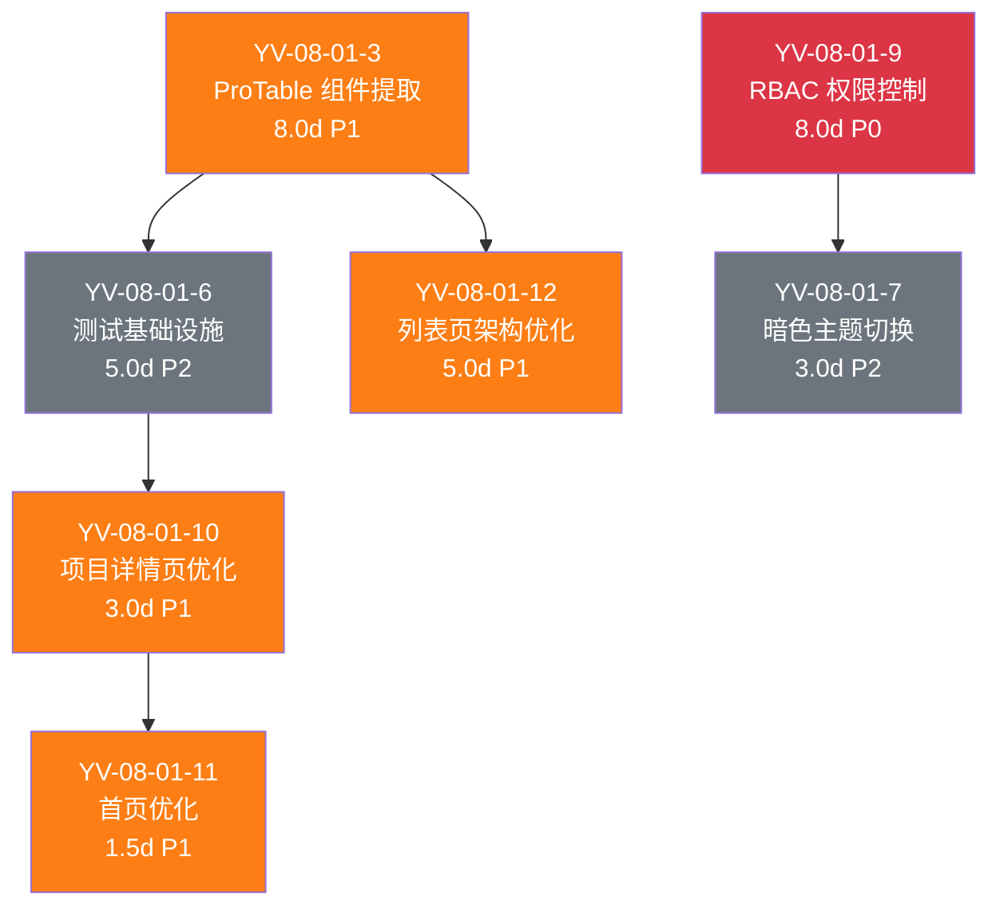

### 9.2 甘特图

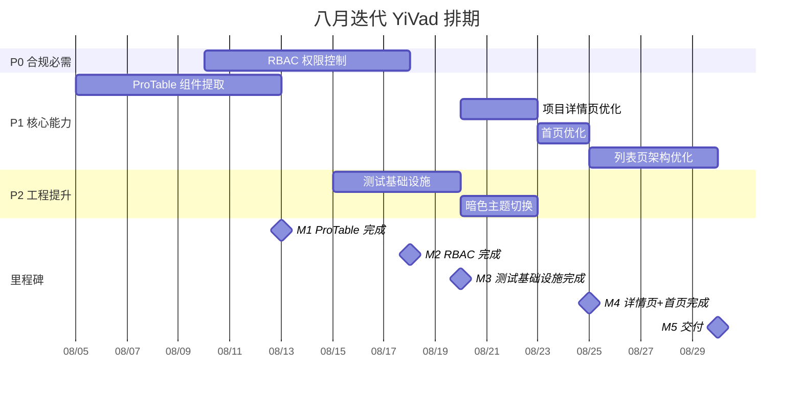

### 9.3 里程碑

| 里程碑 | 完成标准 | 预计日期 |
|--------|----------|----------|
| M1: ProTable 完成 | ProTable/SearchForm/Upload 三个通用组件就绪，Issue 页面验证通过 | 8 月中旬 |
| M2: RBAC 完成 | v-auth 指令 + 路由守卫 + 权限 Store 就绪，权限审计可用 | 8 月下旬 |
| M3: 测试基础设施完成 | Vitest 框架搭建完成，109 个测试用例通过，CI 覆盖率报告可用 | 8 月底 |
| M4: 详情页+首页完成 | detail.vue ≤ 200 行，首页竞态修复，骨架屏 + 错误态就绪 | 9 月上旬 |
| M5: 交付 | 列表页架构优化完成，Module 迁移 ProTable，完整回归验证通过 | 9 月中旬 |

---

## 10. 迁移策略

### 10.1 原则

- **渐进式提取**：先在简单页面验证 ProTable API，再推广到复杂页面
- **分支隔离**：每项需求独立分支开发，合并前通过完整回归
- **可回滚**：每步独立 commit，`git revert` 即可回滚
- **零停机**：纯前端重构，不涉及后端变更

### 10.2 分步执行

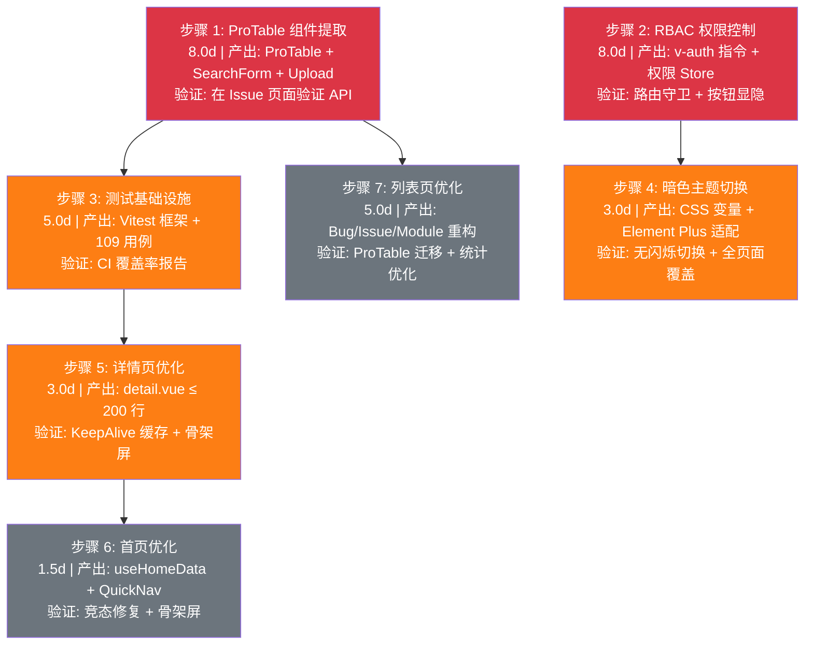

### 10.3 回滚策略

| 步骤 | 回滚方式 | 回滚影响范围 |
|------|----------|-------------|
| 步骤 1-3 | `git revert <commit>` | 仅新增组件/指令/测试，不影响现有页面 |
| 步骤 4 | `git revert <commit>` + 移除 CSS 变量引用 | 仅主题层，恢复硬编码颜色 |
| 步骤 5-7 | `git revert <commit>` | 仅页面架构层，功能不受影响 |

---

## 11. 测试策略

### 11.1 测试分层

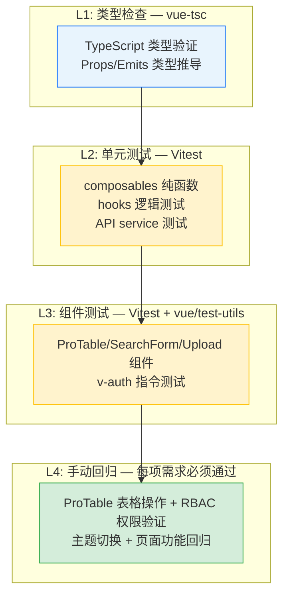

### 11.2 回归测试用例

| # | 用例 | 操作 | 预期结果 |
|----|------|----------|
| 1 | ProTable 基础渲染 | 访问 Issue 列表页 | 表格正确渲染，列配置生效 |
| 2 | ProTable 搜索 | 在 SearchForm 输入关键词 | 表格数据按关键词过滤 |
| 3 | ProTable 分页 | 切换页码和每页条数 | 分页正确，数据刷新 |
| 4 | ProTable 多选 | 勾选多行 + 批量操作 | 选中状态正确，批量操作生效 |
| 5 | RBAC 路由守卫 | 无权限用户访问受限页面 | 重定向到 403 或首页 |
| 6 | RBAC 按钮控制 | 无权限用户查看页面 | 对应按钮隐藏或禁用 |
| 7 | 暗色主题切换 | 点击主题切换按钮 | 页面即时切换，无闪烁 |
| 8 | 暗色主题持久化 | 切换暗色 → 刷新页面 | 保持暗色主题 |
| 9 | 详情页 KeepAlive | 切换 Tab 后再切回 | 保留滚动位置和筛选状态 |
| 10 | 首页竞态修复 | 快速切换日期筛选 | 显示最后一次请求的数据 |

---

## 12. 风险矩阵

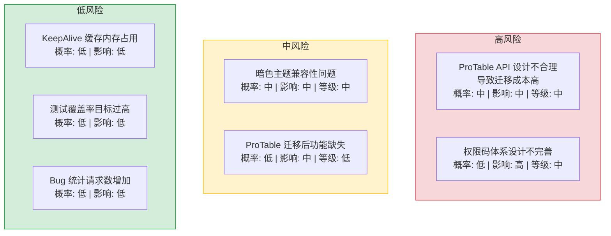

| 风险 | 影响 | 概率 | 等级 | 缓解措施 | 应急预案 |
|------|------|------|----------|----------|
| ProTable API 设计不合理导致迁移成本高 | 中 | 中 | 中 | 先在简单页面验证 API，再推广 | 回退到页面内联实现，保留组件代码待 API 迭代 |
| 权限码体系设计不完善 | 高 | 低 | 中 | 与后端对齐权限码注册表，前端仅做 UI 控制 | 紧急修复权限码映射表，热修复发布 |
| 暗色主题兼容性问题 | 中 | 中 | 中 | 先适配公共组件，页面自动受益 | 回退到仅亮色主题，记录未适配组件清单 |
| 测试覆盖率目标过高 | 低 | 中 | 低 | 渐进式目标：初期 20% → 中期 50% | 降低覆盖率阈值，优先保证核心模块 |
| KeepAlive 缓存导致内存占用过高 | 低 | 低 | 低 | 6 个 Tab 均为轻量组件，`max` 属性限制缓存数 | 减少 max 缓存数，或回退到 visitedTabs 方案 |
| 首页日期筛选改为全量统计后，未来需要按日期统计 | 低 | 低 | 低 | 如有需求，在 `useHomeData` 中改为 `computed` 过滤 | 恢复日期筛选逻辑 |
| ProTable 迁移后 Module 表格功能缺失 | 中 | 低 | 低 | 先在开发环境验证 columns 配置覆盖所有现有列 | 回退到 Module 原有表格实现 |
| Bug 统计改为 pageSize=0 后请求数增加 | 低 | 中 | 低 | Promise.all 并行请求，总耗时与单次全量查询相当 | 合并为单次全量查询 |

---

## 13. 设计决策记录

| 决策 | 选项 A | 选项 B | 选择 | 理由 |
|------|--------|--------|------|
| 测试框架 | Vitest | Jest | **Vitest** | 与 Vite 生态一致，配置简单，速度快 |
| 主题方案 | CSS 变量 | SCSS 变量 | **CSS 变量** | 运行时切换，无需重新编译 |
| 权限粒度 | 路由+按钮 | 路由+按钮+数据 | **路由+按钮** | 数据级权限后期扩展 |
| 组件通信 | Props/Emits | provide/inject | **Props/Emits** | 单向数据流，可追踪，易调试 |
| Tab 缓存 | visitedTabs + v-if | KeepAlive | **KeepAlive** | 原生支持缓存，避免手动追踪，代码更简洁 |

### D-01: 为什么选择 Vitest 而非 Jest？

Vitest 与 Vite 共享同一套 transform 和 resolve 管线，无需额外配置 `jest.config.js` 中的 `moduleNameMapper` 和 `transform`。YiVad 使用 Rsbuild（基于 Rspack），Vitest 的 `pool: "forks"` 模式兼容性更好。Jest 需要 `ts-jest` 或 `@babel/preset-typescript` 额外依赖，且与 ESM 的兼容性问题较多。

### D-02: 为什么选择 CSS 变量而非 SCSS 变量？

SCSS 变量在编译时静态替换，无法在运行时动态切换。CSS 变量（Custom Properties）支持运行时修改，通过 `document.documentElement.style.setProperty('--el-color-primary', newColor)` 即可实现主题切换，无需重新编译。Element Plus 2.x 官方暗色主题方案也基于 CSS 变量。

### D-03: 为什么权限控制选择路由+按钮而非数据级？

数据级权限控制（如"用户 A 只能看到自己创建的项目"）需要后端配合实现行级过滤。当前阶段 YiVad 主要面向内部团队，路由级（页面可见性）和按钮级（操作权限）已满足合规要求。数据级权限预留接口，后期扩展时前端无需改动架构。

### D-04: 为什么 ProTable 选择插槽+配置混合模式？

纯配置模式（如 `columns: [{ prop: 'name', label: '名称' }]`）灵活性受限，无法处理复杂单元格渲染。纯插槽模式导致模板冗长。混合模式：通过 `columns` 配置定义列结构，通过具名插槽 `#column-{prop}` 覆盖复杂渲染，兼顾简洁性和灵活性。

### D-05: 为什么 KeepAlive 替代 visitedTabs？

`visitedTabs` 方案用数组追踪已访问 Tab + `v-if` 控制渲染，组件实例在切换时被销毁重建。`<KeepAlive>` 是 Vue 内置组件，原生支持缓存组件实例，切换时仅触发 `activated`/`deactivated` 生命周期，状态（滚动位置、筛选条件、表单输入）全部保留。`max` 属性限制缓存数量，避免内存泄漏。

---

## 14. 非功能性需求

### 13.1 页面状态管理

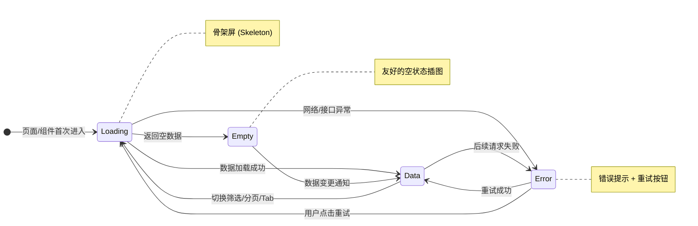

### 13.2 合规需求

- RBAC 权限控制满足外部用户接入的合规要求
- 权限变更记录可审计

### 13.3 性能预算

| 指标 | 目标 | 测量方式 |
|------|----------|
| 主题切换过渡 | < 300ms | Performance API 标记 |
| 组件渲染性能 | 不退化 | Lighthouse 评分 |
| 测试套件执行 | < 5min | `pnpm test` 总耗时 |
| ProTable 首次渲染 | < 200ms（100 行数据） | Chrome DevTools Performance |
| 构建产物体积 (gzip) | 增量 10KB | `pnpm build` 后分析 |

### 13.3-A 容量规划

> 以下为 YiVad 前端项目的容量规划参考，基于管理后台领域的常见规模分级。当前值反映八月工程化迭代完成后的实际状态。

| 场景 | 页面数 | 组件数 | Composable 数 | 构建时间 | 首屏加载 | 内存占用 |
|------|--------|--------|--------------|----------|----------|----------|
| 轻量管理后台 | 10 | 20 | 5 | 10s | 1s | 50MB |
| 标准管理后台 | 30 | 60 | 15 | 20s | 2s | 100MB |
| 复杂管理后台 | 60 | 120 | 30 | 30s | 3s | 200MB |
| 大型中台 | 120 | 250 | 60 | 45s | 5s | 400MB |
| 超大型平台 | 200 | 400 | 100 | 60s | 8s | 800MB |
| YiVad 当前 | 20 | 30 | 12 | 30s | 1.5s | 100MB |

### 13.4 可访问性

| 标准 | 要求 | 覆盖范围 |
|------|----------|
| WCAG 2.1 A | 键盘导航、焦点管理、ARIA 标签 | ProTable、SearchForm、Upload |
| WCAG 2.1 AA | 颜色对比度、焦点可见指示器 | Element Plus 组件已满足 |

### 13.5 国际化需求

无新要求（内部工具）。

### 13.6 代码质量门禁

| 检查项 | 工具 | 通过标准 |
|--------|------|----------|
| 类型检查 | `vue-tsc --noEmit` | 0 新增错误 |
| 代码规范 | ESLint + Prettier | 0 告警 |
| 样式规范 | Stylelint | 0 告警 |
| 构建验证 | `pnpm build` | 构建成功 |
| 组件规范 | `<script setup lang="ts">` | 100% 遵守 |
| 类型规范 | Props/Emits 类型泛型 | 100% 遵守 |

### 13.7 可观测性

| 指标 | 采集方式 | 采集频率 | 告警阈值 | 说明 |
|------|----------|----------|----------|------|
| ProTable 数据加载失败率 | `useProTableData` catch 计数 | 每次请求 | 失败率 > 5% | 后端 `data_service` 异常或集合不存在 |
| 路由守卫拦截次数 | `router.beforeEach` 中计数 | 每次导航 | 拦截率 > 10% | 权限配置错误导致大量用户被拦截 |
| 主题切换闪烁次数 | `performance.getEntriesByType('paint')` | 每次切换 | FP > 300ms | CSS 变量加载延迟或预加载脚本失效 |
| 组件渲染错误 | Vue `onErrorCaptured` 钩子 | 每次渲染 | 错误率 > 1% | 组件 props 类型不匹配或数据异常 |
| 测试用例不稳定率 | CI 中 `pnpm test` flaky 计数 | 每次 CI 运行 | 不稳定率 > 5% | 异步测试未正确处理或 `pool: "forks"` 状态污染 |
| 构建产物体积 | `rsbuild build --analyze` | 每次构建 | 总大小 > 5MB | 依赖冗余或未 tree-shaking |

### 13.8 安全合规

| 要求 | 实现方式 | 验证方法 |
|------|----------|----------|
| XSS 防护 | Vue 3 默认 HTML 转义，`v-html` 仅用于可信 Markdown 内容（DOMPurify 清洗） | 审查所有 `v-html` 使用点 |
| CSRF 防护 | `RequestHttp` 拦截器自动附加 Token，同源策略 | 检查无跨站请求伪造风险 |
| 权限校验 | 路由守卫 + `v-auth` 指令，前端仅做 UI 控制，后端做最终权限校验 | 绕过前端直接调用 API，确认后端返回 403 |
| 敏感信息 | 审计日志中不记录密码、Token 等敏感字段 | 审查审计日志输出内容 |
| 依赖安全 | `pnpm audit` 检查已知漏洞，CI 中阻断高危漏洞 | 每月执行 `pnpm audit --audit-level=high` |

---

## 15. 回归问题预测

| # | 预测问题 | 原因 | 验证方法 |
|---|---------|------|---------|
| 1 | ProTable API 设计不足以覆盖 Module 列表的特殊列需求 | Module 列表有自定义渲染列（进度条、关联关系），`columns` 配置可能无法完全覆盖 | 在 Module 页面验证 ProTable 后，对比原有表格功能完整性 |
| 2 | RBAC 权限码与后端 API 权限不一致 | 前端权限码和后端权限中间件使用不同的权限命名规范 | 逐一验证每个权限码对应的 API 调用是否返回 200/403，建立权限码映射表 |
| 3 | 暗色主题下第三方图表库（ECharts）颜色不适配 | ECharts 的 `option.color` 在亮色主题下定义，暗色主题下图表颜色与背景对比度不足 | 在暗色主题下检查所有含图表的页面（Bug/Issue/Module 列表），确认图表可读性 |
| 4 | KeepAlive 缓存在 Tab 切换时未正确触发 `activated`/`deactivated` | 动态组件 + KeepAlive 的组合在特定条件下可能不触发生命周期钩子 | 在详情页快速切换 Tab 后检查数据是否保留，Network 面板确认无重复请求 |
| 5 | 首页竞态修复后，快速切换筛选项时 loading 状态闪烁 | `requestId` 递增导致中间的请求被丢弃，`loading.value = false` 短暂触发 | 快速连续切换日期筛选 5 次，观察 loading 骨架屏是否闪烁 |
| 6 | Vitest `pool: "forks"` 模式下组件测试不稳定 | `@vue/test-utils` 在 forks 模式下可能存在进程间状态污染 | 重复运行 `pnpm test` 5 次，确认所有测试用例结果一致 |
| 7 | `v-auth` 指令移除 DOM 后，`el-table` 列宽计算错误 | Element Plus 表格在列被移除后未重新计算列宽 | 以不同权限用户访问同一页面，检查表格列宽是否正常 |
| 8 | `pinia-plugin-persistedstate` 在主题切换时写入竞态 | 快速切换主题时，localStorage 写入可能被后一次覆盖 | 快速切换主题 10 次后刷新页面，确认主题与最后一次切换一致 |

---

## 16. 代码审查检查清单

合并前审查人需确认以下项目：

- [ ] ProTable 组件 API 设计合理（`columns` 配置 + 具名插槽覆盖复杂场景）
- [ ] SearchForm 组件支持 `el-form` 的所有原生属性透传
- [ ] Upload 组件支持文件校验和模板下载
- [ ] `v-auth` 指令正确绑定权限码，无权限时按钮隐藏或禁用
- [ ] 路由守卫正确拦截未授权页面访问
- [ ] 权限 Store 在登录后正确加载权限列表
- [ ] 暗色主题切换无闪烁（`index.html` 中预加载脚本）
- [ ] Element Plus 组件暗色适配完整（表格、弹窗、下拉菜单）
- [ ] CSS 变量覆盖 Element Plus 默认变量，非硬编码颜色
- [ ] Vitest 配置正确（`pool: "forks"` + `environment: "jsdom"`）
- [ ] 测试用例覆盖核心 composables 和组件
- [ ] `vue-tsc --noEmit` 通过，0 新增类型错误
- [ ] ESLint/Prettier/Stylelint 通过
- [ ] `pnpm build` 构建成功
- [ ] 手动回归测试（ProTable + RBAC + 主题 + 页面功能）全部通过

---

## 17. 子文档索引

| 月份 | 编号 | 文档 | 需求编号 | 优先级 | 人天 |
|------|----------|--------|------|
| 2026-08 | 01 | [./01-需求-高级表格组件提取.md](./01-需求-高级表格组件提取.md) | YV-08-01-3 | P1 | 8.0d |
| 2026-08 | 02 | [./02-需求-基于角色的权限控制.md](./02-需求-基于角色的权限控制.md) | YV-08-01-9 | P0 | 8.0d |
| 2026-08 | 03 | [./03-需求-暗色主题切换.md](./03-需求-暗色主题切换.md) | YV-08-01-7 | P2 | 3.0d |
| 2026-08 | 04 | [测试基础设施](./04-测试基础设施.md) | YV-08-01-6 | P2 | 5.0d |
| 2026-08 | 05 | [./05-需求-项目详情页优化.md](./05-需求-项目详情页优化.md) | YV-08-01-10 | P1 | 3.0d |
| 2026-08 | 06 | [./14-需求-首页优化.md](./14-需求-首页优化.md) | YV-08-01-11 | P1 | 1.5d |
| 2026-08 | 07 | [./15-需求-列表页架构优化.md](./15-需求-列表页架构优化.md) | YV-08-01-12 | P1 | 5.0d |
| 2026-08 | 08 | [./06-需求-系统管理模块.md](./06-需求-系统管理模块.md) | YV-08-06 | P0 | 4.0d |
| 2026-08 | 09 | [./07-需求-首页仪表盘.md](./07-需求-首页仪表盘.md) | YV-08-07 | P0 | 3.0d |
| 2026-08 | 10 | [./08-需求-命令面板与键盘快捷键.md](./08-需求-命令面板与键盘快捷键.md) | YV-08-08 | P1 | 1.5d |
| 2026-08 | 11 | [./09-需求-Kanban看板.md](./09-需求-Kanban看板.md) | YV-08-09 | P1 | 3.0d |
| 2026-08 | 12 | [./10-需求-全局搜索.md](./10-需求-全局搜索.md) | YV-08-10 | P1 | 2.0d |
| 2026-08 | 13 | [./11-需求-Roadmap路线图.md](./11-需求-Roadmap路线图.md) | YV-08-11 | P1 | 2.0d |
| 2026-08 | 14 | [./12-需求-自定义指令系统.md](./12-需求-自定义指令系统.md) | YV-08-12 | P1 | 1.0d |
| 2026-08 | 15 | [./13-需求-API层架构.md](./13-需求-API层架构.md) | YV-08-18 | P1 | 1.0d |

---

*PRD 来源: `projects/yivad/requires/2026-08/00-需求-需求总览.md`*
