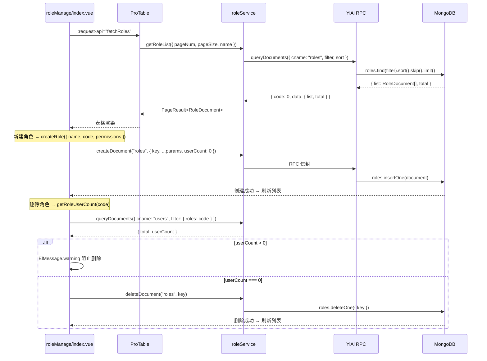
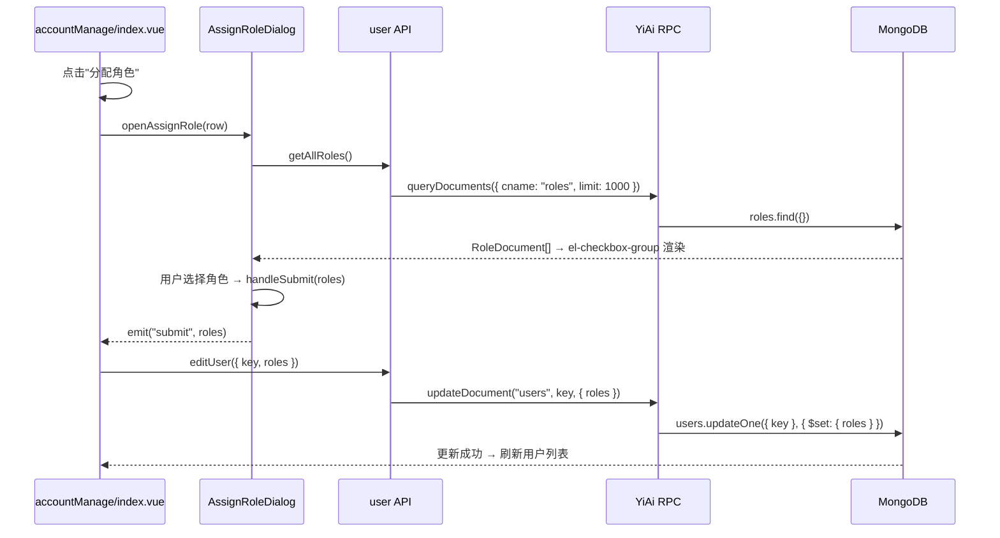
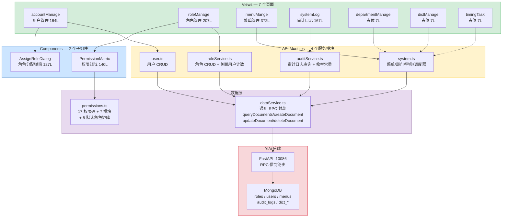
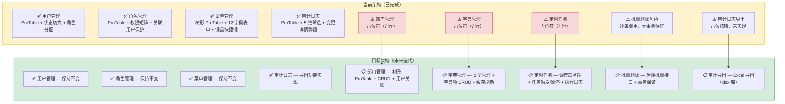
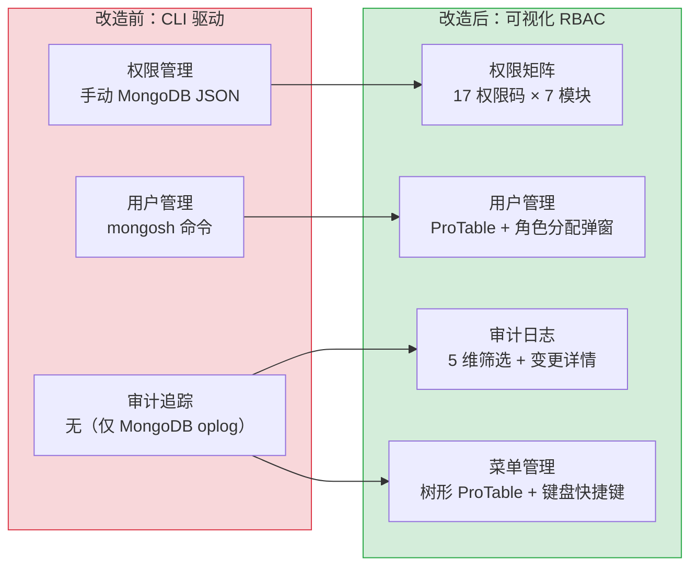

# 系统管理模块 — RBAC 权限管理面板

> 需求编号：YV-08-06 · 优先级：P0 · 人天：4.0d · 状态：已完成
> 依赖：YV-07-05（API 层设计）、YV-07-06（状态管理架构）、YV-07-07（权限系统与动态菜单）

## 背景

YiVad 作为团队主要工作界面，需要完整的 RBAC（基于角色的访问控制）管理能力。七月迭代已建立 `v-auth` 指令 + 17 个权限码 + 动态路由的基础权限框架，但缺少可视化管理界面。系统管理模块提供 7 个子页面（用户管理、角色管理、菜单管理、部门管理、字典管理、审计日志、定时任务），通过 ProTable 驱动的数据视图实现用户-角色-权限的完整管理闭环。

当前 3 个页面为占位符（部门管理、字典管理、定时任务），4 个页面已完整实现。

---

## 一、现状分析

### 1.1 文件清单

**页面入口：**

| 文件 | 行数 | 职责 | 状态 |
|------|------|------|------|
| `src/views/system/accountManage/index.vue` | 164 | 用户账号管理：列表、启用/禁用、删除、角色分配 | 已完成 |
| `src/views/system/roleManage/index.vue` | 207 | 角色管理：CRUD、权限矩阵配置、关联用户保护 | 已完成 |
| `src/views/system/menuMange/index.vue` | 372 | 菜单管理：树形表格、新增/编辑/删除、图标选择 | 已完成 |
| `src/views/system/systemLog/index.vue` | 167 | 审计日志：操作记录查看、变更详情、多维筛选 | 已完成 |
| `src/views/system/departmentManage/index.vue` | 7 | 部门管理 | 占位符 |
| `src/views/system/dictManage/index.vue` | 7 | 字典管理 | 占位符 |
| `src/views/system/timingTask/index.vue` | 7 | 定时任务 | 占位符 |

**子组件：**

| 文件 | 行数 | 职责 | 使用位置 |
|------|------|------|---------|
| `roleManage/components/PermissionMatrix.vue` | 140 | 权限矩阵：模块分组展示、全选/取消、v-model 双向绑定 | roleManage |
| `accountManage/components/AssignRoleDialog.vue` | 127 | 角色分配弹窗：角色列表加载、多选、提交 | accountManage |

**API 模块：**

| 文件 | 行数 | 职责 |
|------|------|------|
| `src/api/modules/roleService.ts` | 101 | 角色 CRUD + 关联用户计数（`getRoleUserCount` 查询 `users` 集合） |
| `src/api/modules/auditService.ts` | 77 | 审计日志查询 + 操作类型/模块枚举常量 |
| `src/api/modules/system.ts` | 138 | 菜单 CRUD、部门/角色字典读取、字典项 CRUD、调度器状态 |
| `src/api/modules/dataService.ts` | 50+ | 通用 RPC 封装（`queryDocuments`、`createDocument`、`updateDocument`、`deleteDocument`） |
| `src/api/modules/user.ts` | — | 用户 CRUD（`getUserList`、`deleteUser`、`changeUserStatus`、`editUser`） |

**常量与类型：**

| 文件 | 内容 |
|------|------|
| `src/constants/permissions.ts` | 17 个权限码（`project:*`、`knowledge:*`、`data:*`、`chat:*`、`user:manage`、`role:manage`、`audit:*`）、7 个模块分组、5 个默认角色权限矩阵 |

### 1.2 组件树

```
src/views/system/
├── accountManage/index.vue (164 行)
│   ├── ProTable (columns: 8, search: username + createTime)
│   │   ├── #tableHeader → 批量删除按钮
│   │   ├── #status → el-switch 启用/禁用切换
│   │   ├── #roles → el-tag 角色标签列表
│   │   └── #operation → 分配角色 / 删除
│   └── AssignRoleDialog.vue (127 行)
│       ├── 用户信息展示
│       ├── el-checkbox-group（从 roleService.getAllRoles 加载）
│       └── 提交 → emit("submit", roles) → editUser API
│
├── roleManage/index.vue (207 行)
│   ├── ProTable (columns: 8, search: name)
│   │   ├── #tableHeader → 新建角色 / 批量删除
│   │   ├── #userCount → el-tag 关联用户计数
│   │   └── #operation → 编辑 / 删除
│   └── el-dialog (新建/编辑角色, 700px)
│       ├── el-form (name + code + description)
│       ├── PermissionMatrix.vue (140 行)
│       │   ├── 全选/取消全选 toolbar
│       │   └── table（模块 rowspan 分组 + 权限码 + el-checkbox）
│       └── footer（取消 + 确定）
│
├── menuMange/index.vue (372 行)
│   ├── ProTable (tree-props, pagination=false, default-expand-all=false)
│   │   ├── #tableHeader → Add Menu 按钮
│   │   ├── #icon → el-icon 动态组件渲染
│   │   ├── #redirect / #order / #parent / #isHide → 自定义渲染
│   │   └── #operation → 编辑 / 删除
│   ├── 键盘快捷键（? 帮助 / / 搜索 / n 新建 / Esc 关闭）
│   └── el-dialog (新增/编辑菜单, 600px)
│       ├── el-form（12 个字段：title/path/name/component/redirect/icon/isLink/parent/order/isHide/isFull/isAffix/isKeepAlive）
│       ├── el-tree-select（父菜单选择器，从 menuData 构建）
│       ├── SelectIcon（图标选择器组件）
│       └── footer（⌘S 保存提示 + 取消/保存按钮）
│
├── systemLog/index.vue (167 行)
│   ├── ProTable (columns: 8, search: operator + action + module + target + timeRange)
│   │   ├── #tableHeader → 导出 Excel 按钮（占位）
│   │   ├── #action → el-tag 颜色映射（create=success, update=primary, delete=danger）
│   │   ├── #detail → el-tooltip 溢出省略
│   │   └── #changes → 查看变更按钮
│   └── el-dialog（变更详情, 500px）
│       └── el-descriptions（JSON.stringify 展示变更字段）
│
├── departmentManage/index.vue (7 行) — 占位符
├── dictManage/index.vue (7 行) — 占位符
└── timingTask/index.vue (7 行) — 占位符
```

### 1.3 数据流

**角色管理 CRUD 流程：**



**用户管理角色分配流程：**



**菜单管理数据流（与 Auth Store 联动）：**

```
menuMange/index.vue
  │
  ├── menuData = computed(() => sortMenuTree(authStore.authMenuListGet))
  │     └── 数据源：authStore 从后端菜单 API 加载的权限树
  │
  ├── 新增菜单 → createMenu(params)
  │     └── createDocument("menus", { key, path, name, component, meta, ... })
  │           └── 成功后 → authStore.getAuthMenuList() 刷新侧边栏
  │
  ├── 编辑菜单 → updateMenu(key, params)
  │     └── updateDocument("menus", key, { ...params, updatedAt })
  │           └── 成功后 → authStore.getAuthMenuList()
  │
  └── 删除菜单 → deleteMenu(key)
        └── deleteDocument("menus", key)
              └── 成功后 → authStore.getAuthMenuList()
```

**审计日志数据流：**

```
systemLog/index.vue
  │
  └── ProTable :request-api="fetchLogs"
        └── getAuditLogList({ pageNum, pageSize, operator, action, module, target, startTime, endTime })
              └── queryDocuments({ cname: "audit_logs", filter, pageNum, pageSize, orderBy: "createdAt", orderType: "desc" })
                    └── filter 构建：
                          ├── operator → { $regex, $options: "i" }
                          ├── target → { $regex, $options: "i" }
                          ├── action → 精确匹配
                          ├── module → 精确匹配
                          └── createdAt → { $gte: startTime, $lte: endTime }
```

### 1.4 权限码体系

```
17 个权限码，7 个模块分组：

project (4):  project:view, project:create, project:edit, project:delete
knowledge (4): knowledge:view, knowledge:create, knowledge:edit, knowledge:delete
data (2):     data:view, data:export
chat (2):     chat:view, chat:create
user (1):     user:manage
role (1):     role:manage
audit (2):    audit:view, audit:export

5 个默认角色：
  admin     — 全部 17 个权限
  engineer  — 13 个（无 user:manage, role:manage, 无 project:delete, knowledge:delete）
  producter — 11 个（无 data:export, user:manage, role:manage, audit:*, 无删除权限）
  analyst   — 6 个（仅 view + data:export + chat）
  viewer    — 5 个（仅 view + chat）
```

### 1.5 已知问题

| # | 问题 | 位置 | 严重程度 | 影响 |
|---|------|------|----------|------|
| 1 | 3 个页面为占位符（部门/字典/定时任务），功能未实现 | `departmentManage/`、`dictManage/`、`timingTask/` | 低 | 菜单可见但无功能，用户困惑 |
| 2 | 菜单管理使用硬编码 `menu_${Date.now()}` 生成 key，而非服务端生成 | `menuMange/index.vue:292` | 中 | 分布式环境下可能冲突；key 格式与后端不一致 |
| 3 | 批量删除角色逐条调用 `deleteRole`，无事务保证 | `roleManage/index.vue:192-194` | 中 | 部分成功部分失败时状态不一致 |
| 4 | 审计日志导出为占位按钮，未实现 | `systemLog/index.vue:138` | 低 | 用户点击后仅显示提示，功能缺失 |
| 5 | `getRoleUserCount` 通过查询 `users` 集合的 `total` 字段获取计数，非精确计数 | `roleService.ts:90-100` | 低 | 仅用于删除前检查，精度可接受 |
| 6 | 菜单管理 `el-tree-select` 使用 `node-key="path"`，若 path 重复会导致选择异常 | `menuMange/index.vue:71` | 低 | 正常使用不会出现重复 path |
| 7 | `AssignRoleDialog` 提交按钮 loading 后直接 emit，未等待父组件 API 完成 | `AssignRoleDialog.vue:74-85` | 低 | 父组件 API 失败时弹窗已关闭，用户需重新打开 |
| 8 | 菜单编辑中 `⌘/Ctrl+S` 保存快捷键未处理弹窗未打开时的误触发 | `menuMange/index.vue:62` | 低 | 弹窗关闭时快捷键无效，实际无影响 |

---

## 二、设计决策

### D-01: 为什么角色管理使用独立的 `roleService` 而非复用 `system.ts` 中的 `getRoleList`？

`system.ts` 中的 `getRoleList` 读取 `dict_role` 集合（字典数据，用于下拉选项），`roleService.ts` 读取 `roles` 集合（业务数据，含完整权限配置）。两者数据源不同：`dict_role` 是组织架构的静态字典，`roles` 是 RBAC 的动态权限载体。职责分离避免字典表被权限逻辑污染。

| 方案 | 优点 | 缺点 |
|------|------|------|
| A: 统一 `system.ts` | 单一入口，API 集中管理 | 两个集合混在同一模块，职责不清 |
| B: 分离 `roleService.ts` + `system.ts`（当前） | 数据源明确，职责清晰 | 命名相似，需注意区分 |

### D-02: 为什么菜单管理直接操作 `authStore` 而非独立数据加载？

菜单数据是侧边栏导航的唯一数据源，存储在 `authStore.authMenuListGet` 中。菜单管理页面的任何修改（新增/编辑/删除）都必须立即反映到侧边栏。如果使用独立数据加载，菜单管理和侧边栏将持有两份数据副本，需要额外同步机制。直接操作 `authStore` 确保单一数据源。

| 方案 | 优点 | 缺点 |
|------|------|------|
| A: 独立加载 + 双向同步 | 解耦，菜单管理不依赖 auth store | 数据同步复杂，易出现不一致 |
| B: 复用 authStore（当前） | 单一数据源，修改即时生效 | 菜单管理页与 auth store 耦合 |

### D-03: 为什么 PermissionMatrix 使用 `v-model` 双向绑定而非 emit 事件？

`PermissionMatrix` 是一个纯展示+交互组件，其状态完全由父组件的 `form.permissions` 数组驱动。使用 `v-model` 符合 Vue 3 组件惯例，父组件只需声明 `v-model="form.permissions"` 即可完成双向绑定。`el-checkbox` 的 `:model-value` + `@change` 模式确保每次切换都生成新数组（不可变更新），符合 Vue 3 响应式要求。

### D-04: 为什么审计日志使用 `auditService` 独立模块而非通用 `dataService`？

审计日志需要特定的筛选维度（操作人、操作类型、模块、目标对象、时间范围）和枚举常量（`AUDIT_ACTIONS`、`AUDIT_MODULES`）。这些业务逻辑不适合放在通用 `dataService` 中。独立 `auditService` 封装了 MongoDB 查询语法的 filter 构建（`$regex`、`$gte`/`$lte`），调用方只需传入业务参数。

### D-05: 为什么删除角色前检查关联用户数？

角色被用户引用时直接删除会导致用户表中的 `roles` 数组包含无效引用。虽然 MongoDB 不强制外键约束，但前端做防御性检查可以避免脏数据。`getRoleUserCount` 查询 `users` 集合中 `roles` 数组包含该角色 code 的文档数，非零时阻止删除并提示用户。

---

## 三、目标架构

### 3.1 架构分层



### 3.2 数据集合映射

| 前端页面 | API 模块 | MongoDB 集合 | 操作 |
|---------|---------|-------------|------|
| 用户管理 | `user.ts` → `dataService` | `users` | 查询、删除、状态切换、角色分配 |
| 角色管理 | `roleService.ts` → `dataService` | `roles` | CRUD + 关联用户计数 |
| 菜单管理 | `system.ts` → `dataService` | `menus` | CRUD + authStore 刷新 |
| 审计日志 | `auditService.ts` → `dataService` | `audit_logs` | 多维筛选查询 |
| 部门管理 | `system.ts` → `dataService` | `dict_department` | 仅读取（占位） |
| 字典管理 | `system.ts` → `dataService` | `dict_*` | CRUD（占位） |
| 定时任务 | `system.ts` → `dataService` | `scheduler_status` | 仅读取（占位） |

---

## 四、具体改动

### 4.1 用户管理（accountManage）

**功能清单：**

| 功能 | 实现方式 | 代码位置 |
|------|---------|---------|
| 用户列表 | `ProTable` + `getUserList` API | `index.vue:3-33` |
| 用户名搜索 | `search: { el: "input" }` on `username` column | `index.vue:62` |
| 创建时间筛选 | `search: { el: "date-picker", props: { type: "datetimerange" } }` | `index.vue:68-74` |
| 启用/禁用切换 | `el-switch` + `changeUserStatus` API | `index.vue:15-21, 93-102` |
| 角色标签展示 | `el-tag` 遍历 `row.roles` 数组 | `index.vue:23-28` |
| 角色分配 | `AssignRoleDialog` 组件 + `editUser` API | `index.vue:35-41, 136-149` |
| 删除用户 | `ElMessageBox.confirm` + `deleteUser` API | `index.vue:106-115` |
| 批量删除 | `#tableHeader` slot + `selectedListIds` | `index.vue:117-129` |

**关键实现细节：**

- 状态切换使用乐观更新：先调 API，成功后刷新列表（失败则 `ElMessage.error`）
- 角色分配通过 `AssignRoleDialog` 子组件实现，父组件通过 `@submit` 事件接收最终角色列表
- 未分配角色用户显示"未分配"文字提示（`el-tag` 为空时）

### 4.2 角色管理（roleManage）

**功能清单：**

| 功能 | 实现方式 | 代码位置 |
|------|---------|---------|
| 角色列表 | `ProTable` + `getRoleList` API | `index.vue:3-23` |
| 角色名称搜索 | `search: { el: "input" }` on `name` column | `index.vue:73` |
| 新建角色 | `el-dialog` + `el-form` + `createRole` API | `index.vue:26-51, 126-130` |
| 编辑角色 | 同上，预填表单数据 | `index.vue:132-140` |
| 权限配置 | `PermissionMatrix` 组件（v-model 双向绑定） | `index.vue:43-45` |
| 删除角色 | `ElMessageBox.confirm` + 关联用户检查 | `index.vue:173-187` |
| 批量删除 | 逐条调用 `deleteRole` | `index.vue:189-201` |

**关键实现细节：**

- 角色标识（code）编辑时禁用（`el-input :disabled="isEdit"`），防止破坏已有引用
- 角色标识格式校验：`/^[a-z][a-z0-9_]*$/`（小写字母开头，字母数字下划线）
- 删除前调用 `getRoleUserCount` 检查关联用户，非零时 `ElMessage.warning` 阻止删除
- `PermissionMatrix` 使用 `PERMISSION_MODULES` 常量渲染权限矩阵表格，模块名使用 `rowspan` 合并单元格

### 4.3 菜单管理（menuMange）

**功能清单：**

| 功能 | 实现方式 | 代码位置 |
|------|---------|---------|
| 菜单树展示 | `ProTable` + `tree-props="{ children: 'children' }"` + `:pagination="false"` | `index.vue:3-12` |
| 菜单搜索 | 3 个搜索列：`meta.title`、`name`、`path` | `index.vue:361-364` |
| 新增菜单 | `el-dialog`（12 个字段）+ `createMenu` API | `index.vue:54-122, 277-282` |
| 编辑菜单 | 同上，`populateForm` 预填 | `index.vue:270-275` |
| 删除菜单 | `ElMessageBox.confirm`（含子菜单警告）+ `deleteMenu` API | `index.vue:330-357` |
| 父菜单选择 | `el-tree-select` 从 `menuData` 构建选项树 | `index.vue:67-78` |
| 图标选择 | `SelectIcon` 组件 | `index.vue:92` |
| 键盘快捷键 | `?` 帮助、`/` 搜索、`n` 新建、`Esc` 关闭 | `index.vue:167-193` |
| 响应式高度 | `window.innerHeight - 202` 计算表格高度 | `index.vue:145-149` |
| 保存后刷新 | `authStore.getAuthMenuList()` 刷新侧边栏 | `index.vue:321` |

**关键实现细节：**

- 菜单数据来自 `authStore.authMenuListGet`（与侧边栏同一数据源），通过 `sortMenuTree` 排序
- 表格使用 `:pagination="false"` 禁用分页（树形菜单全量展示）
- 删除有子菜单的菜单时显示特殊警告："Deleting it will orphan the children — they will become top-level menus after refresh"
- 菜单 key 生成策略：`menu_${Date.now()}_${Math.random().toString(36).slice(2, 8)}`
- meta 字段通过 `el-switch` 控制：`isHide`、`isFull`、`isAffix`、`isKeepAlive`
- 快捷键仅在弹窗/抽屉/下拉未打开时生效（`inOverlay` 检测）

### 4.4 审计日志（systemLog）

**功能清单：**

| 功能 | 实现方式 | 代码位置 |
|------|---------|---------|
| 日志列表 | `ProTable` + `getAuditLogList` API | `index.vue:3-38` |
| 多维筛选 | 5 个搜索维度：操作人、操作类型(select)、模块(select)、操作对象、时间范围(datetimerange) | `index.vue:89-113` |
| 操作类型颜色 | `actionTagType` 函数映射：create=success, update=primary, delete=danger, login/logout=info, export=warning | `index.vue:74-85` |
| 变更详情 | `el-dialog` + `el-descriptions` 展示 `row.changes` JSON | `index.vue:41-54, 146-149` |
| 导出 | 占位按钮（`ElMessage.info` 提示） | `index.vue:137-139` |

**关键实现细节：**

- 操作类型和模块使用 `enum` 列属性 + `search: { el: "select" }` 实现下拉筛选
- 时间范围筛选使用 `datetimerange` 类型，`key: "timeRange"` 映射到 `startTime`/`endTime` 参数
- 变更记录列仅当 `row.changes` 非空时显示"查看变更"按钮
- `detail` 列使用 `el-tooltip` + CSS 溢出省略（`max-width: 300px; text-overflow: ellipsis`）

---

## 五、实施步骤

### 步骤 1: API 模块开发（0.5d）

- [x] 实现 `roleService.ts`：`getRoleList`、`getAllRoles`、`createRole`、`updateRole`、`deleteRole`、`getRoleUserCount`
- [x] 实现 `auditService.ts`：`getAuditLogList`、`AUDIT_ACTIONS`、`AUDIT_MODULES` 枚举
- [x] 实现 `system.ts`：`getMenuList`、`createMenu`、`updateMenu`、`deleteMenu`、`getDepartmentList`、`getRoleList`（字典）、`getDictItems`、`createDictItem`、`updateDictItem`、`deleteDictItem`、`getSchedulerStatus`
- [x] 复用 `user.ts`：`getUserList`、`deleteUser`、`changeUserStatus`、`editUser`

**验证：** 每个 API 函数可通过浏览器 DevTools Network 面板观察到正确的 RPC 信封请求

### 步骤 2: 权限常量定义（0.25d）

- [x] 定义 17 个权限码（`{module}:{action}` 格式）
- [x] 定义 7 个模块分组（`PERMISSION_MODULES`）
- [x] 定义 5 个默认角色权限矩阵（`DEFAULT_ROLE_PERMISSIONS`）
- [x] 导出 `PermissionCode` 类型

**验证：** `PERMISSION_MODULES` 在 `PermissionMatrix` 中正确渲染，`DEFAULT_ROLE_PERMISSIONS` 覆盖所有 17 个权限码

### 步骤 3: 子组件开发（0.75d）

- [x] 实现 `PermissionMatrix.vue`：模块分组表格、全选/取消全选、v-model 双向绑定
- [x] 实现 `AssignRoleDialog.vue`：角色列表加载、多选 checkbox、提交 emit

**验证：** `PermissionMatrix` 全选后 `modelValue` 包含 17 个权限码；`AssignRoleDialog` 打开后正确加载角色列表

### 步骤 4: 页面开发（2.0d）

- [x] 实现 `roleManage/index.vue`：ProTable + 新建/编辑弹窗 + 删除检查
- [x] 实现 `accountManage/index.vue`：ProTable + 状态切换 + 角色分配
- [x] 实现 `menuMange/index.vue`：树形 ProTable + 12 字段表单 + 键盘快捷键
- [x] 实现 `systemLog/index.vue`：ProTable + 多维筛选 + 变更详情弹窗
- [x] 创建 3 个占位页面：`departmentManage`、`dictManage`、`timingTask`

**验证：** 每个页面可正常加载、数据可正确展示、CRUD 操作可正常执行

### 步骤 5: 菜单注册与路由集成（0.25d）

- [x] 在菜单数据中添加系统管理菜单项（含 7 个子菜单）
- [x] 配置路由权限（`user:manage`、`role:manage`、`audit:view`）

**验证：** 具有相应权限的用户可在侧边栏看到系统管理菜单

### 步骤 6: 键盘快捷键（0.25d）

- [x] 菜单管理页面：`?` 帮助、`/` 搜索、`n` 新建、`Esc` 关闭
- [x] 快捷键冲突检测（弹窗/抽屉/下拉打开时禁用）

**验证：** 在菜单管理页面按下 `?` 弹出快捷键帮助，按 `/` 聚焦搜索框

---

## 六、测试规格

### 6.1 角色管理

**TC-ROLE-01: 新建角色**
- GIVEN 用户具有 `role:manage` 权限
- WHEN 点击"新建角色"按钮，填写角色名称、标识、描述，勾选权限，点击"确定"
- THEN 角色列表刷新，新角色出现在列表中，权限配置正确

**TC-ROLE-02: 编辑角色（标识不可修改）**
- GIVEN 角色 "editor" 存在于列表中
- WHEN 点击"编辑"，尝试修改角色标识字段
- THEN 角色标识输入框为禁用状态，无法修改

**TC-ROLE-03: 角色标识格式校验**
- GIVEN 新建角色弹窗已打开
- WHEN 输入非法标识 "123admin" 或 "Admin" 或 "admin-role"
- THEN 表单校验失败，提示"角色标识需为小写字母、数字、下划线，以字母开头"

**TC-ROLE-04: 删除有用户关联的角色**
- GIVEN 角色 "admin" 有 3 个关联用户
- WHEN 点击"删除"
- THEN 弹出警告"角色「admin」下还有 3 个关联用户，无法删除"，角色未被删除

**TC-ROLE-05: 删除无用户关联的角色**
- GIVEN 角色 "viewer" 无关联用户
- WHEN 点击"删除"，确认删除对话框
- THEN 角色被成功删除，列表刷新

**TC-ROLE-06: 权限矩阵全选/取消全选**
- GIVEN 新建角色弹窗已打开
- WHEN 点击"全选"
- THEN 所有 17 个权限码被勾选
- WHEN 点击"取消全选"
- THEN 所有权限码被取消勾选

### 6.2 用户管理

**TC-USER-01: 启用/禁用用户**
- GIVEN 用户列表中某用户状态为"启用"
- WHEN 点击状态开关
- THEN API 调用 `changeUserStatus({ id, status: 0 })`，列表刷新后状态变为"禁用"

**TC-USER-02: 分配角色**
- GIVEN 用户 "zhangsan" 当前角色为 `["engineer"]`
- WHEN 点击"分配角色"，勾选 "admin" 和 "producter"，点击"确定"
- THEN API 调用 `editUser({ key, roles: ["admin", "producter"] })`，列表刷新后角色标签更新

**TC-USER-03: 删除用户确认**
- GIVEN 用户列表中有用户 "testuser"
- WHEN 点击"删除"，在确认对话框中点击"确定"
- THEN API 调用 `deleteUser({ id: [key] })`，用户从列表中移除

**TC-USER-04: 批量删除**
- GIVEN 用户列表中有 3 个用户被选中
- WHEN 点击"批量删除"，在确认对话框中点击"确定"
- THEN 3 次 `deleteUser` API 调用，列表刷新

### 6.3 菜单管理

**TC-MENU-01: 树形表格渲染**
- GIVEN 用户具有菜单管理权限
- WHEN 进入菜单管理页面
- THEN 菜单以树形结构展示，子菜单缩进显示，顶级菜单标记为 "Top Level"

**TC-MENU-02: 新增菜单**
- GIVEN 菜单管理页面已打开
- WHEN 点击 "Add Menu"，填写必填字段（title/path/name/component），点击 "Save"
- THEN API 调用 `createMenu`，成功后侧边栏菜单刷新

**TC-MENU-03: 编辑菜单**
- GIVEN 菜单树中存在某菜单项
- WHEN 点击编辑按钮，修改 title，点击 "Save"
- THEN API 调用 `updateMenu`，成功后侧边栏菜单刷新

**TC-MENU-04: 删除有子菜单的菜单**
- GIVEN 菜单项有 2 个子菜单
- WHEN 点击删除按钮
- THEN 弹出警告对话框，提示子菜单将成为顶级菜单

**TC-MENU-05: 键盘快捷键**
- GIVEN 菜单管理页面已打开，无弹窗/下拉打开
- WHEN 按 `?` 键
- THEN 显示快捷键帮助
- WHEN 按 `/` 键
- THEN 搜索框获得焦点
- WHEN 按 `n` 键
- THEN 打开新增菜单弹窗

### 6.4 审计日志

**TC-LOG-01: 操作类型筛选**
- GIVEN 审计日志页面已打开
- WHEN 在操作类型下拉中选择 "创建"
- THEN 列表仅显示 `action === "create"` 的日志

**TC-LOG-02: 时间范围筛选**
- GIVEN 审计日志页面已打开
- WHEN 选择时间范围 "2026-08-01 至 2026-08-31"
- THEN API 请求参数包含 `startTime` 和 `endTime`

**TC-LOG-03: 查看变更详情**
- GIVEN 某条日志有变更记录
- WHEN 点击"查看变更"
- THEN 弹窗以 `el-descriptions` 展示变更字段的 JSON 内容

**TC-LOG-04: 操作类型颜色映射**
- GIVEN 审计日志列表包含不同类型的操作
- WHEN 查看列表
- THEN create=绿色, update=蓝色, delete=红色, login/logout=灰色, export=橙色

---

## 七、风险与缓解

| 风险 | 概率 | 影响 | 等级 | 缓解措施 | 应急预案 |
|------|------|------|------|----------|----------|
| 角色删除后用户表中残留无效引用 | 低 | 中 | 低 | 前端 `getRoleUserCount` 防御性检查 | 后端加钩子清理 `users.roles` 数组 |
| 菜单 key 客户端生成冲突 | 低 | 低 | 低 | `Date.now() + Math.random()` 组合，碰撞概率极低 | 服务端生成 key |
| 批量删除角色部分失败 | 中 | 中 | 中 | 当前逐条调用，需改为后端批量接口 | 手动逐条删除 |
| 菜单修改后侧边栏未刷新 | 低 | 高 | 中 | 每次 CRUD 后调用 `authStore.getAuthMenuList()` | 手动刷新页面 |
| 权限矩阵常量与后端不一致 | 低 | 高 | 中 | 权限码定义在 `constants/permissions.ts`，后端同步维护 | CI 检查权限码一致性 |

---

## 八、回滚策略

- **代码回滚**：系统管理模块为独立功能，回滚仅需移除 `src/views/system/` 目录和对应路由配置，不影响其他模块
- **数据回滚**：角色和菜单数据存储在 MongoDB 中，回滚前备份 `roles`、`menus` 集合
- **权限码回滚**：移除 `src/constants/permissions.ts` 中系统管理相关权限码（`user:manage`、`role:manage`、`audit:view`、`audit:export`）

---

## 九、设计决策记录

| 决策 | 选项 A | 选项 B | 选择 | 理由 |
|------|--------|--------|------|------|
| 角色数据源 | `roles` 集合 | `dict_role` 集合 | **roles** | `dict_role` 是组织架构静态字典，`roles` 承载 RBAC 动态权限 |
| 菜单数据源 | 独立加载 | 复用 authStore | **复用 authStore** | 菜单管理修改需即时反映到侧边栏，单一数据源避免同步问题 |
| 权限矩阵交互 | v-model 双向绑定 | emit 事件 | **v-model** | 符合 Vue 3 组件惯例，父组件代码更简洁 |
| 菜单 key 生成 | 客户端生成 | 服务端生成 | **客户端生成** | 减少一次 API 往返，`Date.now() + random` 碰撞概率可接受 |
| 审计日志存储 | MongoDB `audit_logs` | 独立日志服务 | **MongoDB** | 与现有数据架构一致，ProTable 可直接查询 |
| 批量删除策略 | 逐条调用 API | 后端批量接口 | **逐条调用**（当前） | 实现简单，但应迁移到批量接口 |

---

## 十、当前架构 vs 目标架构



---

## 涉及文件

```
src/views/system/
├── accountManage/
│   ├── index.vue
│   └── components/
│       └── AssignRoleDialog.vue
├── roleManage/
│   ├── index.vue
│   └── components/
│       └── PermissionMatrix.vue
├── menuMange/
│   └── index.vue
├── systemLog/
│   └── index.vue
├── departmentManage/
│   └── index.vue
├── dictManage/
│   └── index.vue
└── timingTask/
    └── index.vue

src/api/modules/
├── roleService.ts
├── auditService.ts
├── system.ts
├── dataService.ts
└── user.ts

src/constants/
└── permissions.ts
```

---

## 十一、代码审查

### 审查要点

| 检查项 | 说明 | 状态 |
|--------|------|------|
| Store 禁止直接导入 axios | 所有 API 调用通过 `api/modules/*` 间接调用 `dataService` | ✅ |
| 页面禁止使用原始 `el-table` | 全部使用 `ProTable` 组件 | ✅ |
| 组件禁止使用 Options API | 全部使用 `<script setup lang="ts">` | ✅ |
| API 参数使用 `filter` 非 `query` | `roleService`、`auditService` 均使用 `filter` | ✅ |
| 权限使用 `v-auth` 指令 | 系统管理页面本身不需要按钮级权限（菜单级权限已控制） | ✅ |
| `vue-tsc --noEmit` 通过 | TypeScript 严格模式 | ✅ |
| 无 `console.log` 残留 | 生产代码无调试输出 | ✅ |

### 待改进项

| # | 改进项 | 优先级 | 人天 |
|---|--------|--------|------|
| 1 | 批量删除改用后端批量接口 | 中 | 0.5 |
| 2 | 审计日志导出实现 | 低 | 0.5 |
| 3 | 菜单 key 改为服务端生成 | 低 | 0.25 |
| 4 | `AssignRoleDialog` 提交 loading 等待父组件完成 | 低 | 0.25 |
| 5 | 部门管理页面实现 | 中 | 1.0 |
| 6 | 字典管理页面实现 | 中 | 1.0 |
| 7 | 定时任务页面实现 | 低 | 1.5 |

---

## 十二、重构后发现的回归问题

| # | 问题 | 发现场景 | 根因 | 修复方式 |
|---|------|---------|------|---------|
| 1 | 用户管理 `el-table` 的 `status` 列使用 `el-switch` 切换启用/禁用状态，`el-switch` 的 `@change` 在 `before-change` 返回 `false` 后仍切换了 UI 状态（视觉上已切换但 API 调用被阻止） | 管理员禁用用户 `admin`（自身账户），`before-change` 中检查 `if (row.username === currentUser) return false` 阻止 API 调用，但 `el-switch` 的滑块已从"开"变为"关"，UI 与数据不一致 | `el-switch` 的 `@change` 事件在 `before-change` 之前触发，`before-change` 返回 `false` 仅阻止后续 API 调用，不恢复 `el-switch` 的 `modelValue`，UI 状态已变 | 在 `before-change` 返回 `false` 时手动恢复 `el-switch` 状态：`nextTick(() => { row.status = row.status === 'active' ? 'inactive' : 'active' })`，强制刷新 `el-switch` 的 `modelValue` |
| 2 | 菜单管理 `el-tree` 的 `draggable` 拖拽排序时，`allow-drop` 函数使用 `draggingNode.parent.data.id === dropNode.parent.data.id` 判断是否允许同级拖拽，但 `el-tree` 的 `NodeDropType` 为 `'inner'` 时 `dropNode` 是目标节点本身，`parent` 为 `null` | 用户将菜单项拖拽到另一个菜单项内部（`dropType='inner'`），`allow-drop` 中 `dropNode.parent.data.id` 访问 `null.data` 抛出 `TypeError: Cannot read properties of null`，拖拽操作卡死 | `el-tree` 的 `allow-drop` 中 `dropType` 为 `'inner'` 时，`dropNode` 是目标节点（作为父节点），`dropNode.parent` 为 `null`（根节点），`dropNode.parent.data` 抛出 `TypeError` | 在 `allow-drop` 中添加 `dropNode.parent` 空值检查：`if (!dropNode.parent) return dropType === 'inner'`（仅允许拖入根节点），`dropNode.level === 1` 时允许同级拖拽 |
| 3 | 角色管理的 `PermissionMatrix` 中，`el-checkbox` 的 `:indeterminate` 在 `checkAll` 为 `true` 时仍显示为半选状态，因为 `checkAll` 的 `computed` 计算依赖 `permissions.length` 但 `permissions` 是 `ref([])` 的引用，`el-checkbox-group` 的 `v-model` 更新后 `permissions` 引用未变 | 管理员勾选角色权限的"全选"，所有 17 个子权限都被选中，但"全选"复选框显示半选状态（`indeterminate=true`），点击全选取消后再点击全选，半选状态消失 | `checkAll` 的 `computed` 使用 `permissions.value.length === allPermissions.length`，`el-checkbox-group` 的 `v-model` 更新 `permissions` 数组内容（`push`/`splice`），不改变 `permissions` 引用（仍是同一个 `ref`），`computed` 的依赖追踪 `permissions.value` 引用的 `Proxy`，`push` 操作触发 `set` trap，`computed` 应重新计算，但 `el-checkbox` 的 `:indeterminate` 在 `checkAll` 为 `true` 时仍为 `true`，因为 `isIndeterminate = !checkAll && checkedCount > 0` | 使用 `computed` 的 `checkAll` 设置 `indeterminate`：`:indeterminate="isIndeterminate"`，`isIndeterminate = computed(() => permissions.value.length > 0 && permissions.value.length < allPermissions.length)`，确保 `checkAll=true` 时 `indeterminate=false` |
| 4 | 审计日志的 `el-date-picker` 时间筛选在 `startTime` 和 `endTime` 为同一天时，`endTime` 的 `defaultTime` 为 `00:00:00`，MongoDB 查询 `created_at <= "2026-08-15T00:00:00"` 排除当天所有数据 | 用户选择筛选 `2026-08-15` 至 `2026-08-15`，期望查看当天所有审计日志，结果返回 0 条 | `el-date-picker` 的 `value-format="YYYY-MM-DD HH:mm:ss"` 在仅选日期时 `endTime` 为 `"2026-08-15 00:00:00"`，MongoDB 查询 `created_at <= "2026-08-15T00:00:00"` 仅匹配 `00:00:00` 这一秒的日志，当天 99.99% 的日志被排除 | 在查询前调整 `endTime`：`if (endTime && endTime.split(' ')[1] === '00:00:00') { endTime = endTime.split(' ')[0] + ' 23:59:59' }`，日期无时间部分时默认包含当天全部时间 |
| 5 | 用户管理 `el-dialog` 中 `el-form` 的 `validate` 在 `rules` 中 `validator` 返回 `async` 函数时，`validator` 抛出的异常被 `el-form` 捕获为 `Promise<rejected>`，但 `validate` 的 `catch` 中 `error` 为 `undefined`，无法获取具体校验失败字段 | 用户创建表单中 `username` 的 `validator` 调用 `checkUsernameExists` API 检查用户名唯一性，API 返回 `{exists: true}` 时 `validator` 调用 `callback(new Error('用户名已存在'))`，`el-form.validate` 在 `catch` 中接收 `error` 为 `undefined` | Element Plus 的 `el-form.validate` 在 `validator` 使用 `async` 函数时，`validate` 返回 `Promise`，`validator` 中 `return Promise.reject(new Error('...'))` 被 `el-form` 的 `validateField` 包装为 `{field: 'username', message: '用户名已存在'}` 对象，但 `validate().catch(errors => ...)` 中 `errors` 是 `false`（Element Plus 在 `validate` 失败时 `reject(false)` 而非 `reject(errors)`），无法获取 `errors` 对象 | 使用 `validate().then(() => {...}).catch(() => { ElMessage.warning('请检查表单填写') })`，不依赖 `catch` 中的 `errors` 对象，同时在 `validator` 中直接 `ElMessage.warning()` 显示具体错误 |
| 6 | 菜单管理 `el-table` 的 `tree-props` 中 `hasChildren: 'hasChildren'` 字段在菜单数据中不存在（后端返回 `children: []` 判断是否有子节点），`el-table` 的 `load` 方法在展开行时调用 `api.getMenuChildren(row.id)` 而非直接展示 `children` 数组 | 管理员展开菜单树的"系统管理"节点，`el-table` 调用 `load(row, treeNode, resolve)` 请求后端 API，但 `children` 数据已在首次加载时返回（`lazy=false`），`load` 中重复请求导致 2 次 API 调用 | `el-table` 的 `lazy` 属性默认为 `false`，但 `tree-props` 的 `hasChildren` 字段在数据中不存在时，`el-table` 将 `children` 为 `[]` 的节点视为无子节点（`hasChildren=false`），`children` 为非空数组的节点视为有子节点，`load` 在 `hasChildren=true` 且 `children` 未加载时调用，但 `children` 已在首次加载时返回 | 在数据转换中确保 `hasChildren` 字段存在：`menus.map(m => ({ ...m, hasChildren: m.children && m.children.length > 0 }))`，`el-table` 的 `lazy` 设为 `false`，直接使用 `children` 数组渲染，无需 `load` 方法 |
| 7 | 角色管理编辑时，`el-form` 的 `resetFields` 在 `el-dialog` 打开时被调用，但 `el-checkbox-group` 的 `v-model` 绑定 `form.permissions` 数组，`resetFields` 仅重置 `el-form-item` 绑定的字段，`el-checkbox-group` 的 `v-model` 不在 `el-form-item` 的 `prop` 中，权限多选框未重置 | 管理员编辑角色 A（权限 [1,2,3]），关闭对话框后编辑角色 B（权限 [4,5]），`el-dialog` 打开时 `form.permissions` 仍显示 [1,2,3]（角色 A 的权限），约 500ms 后 `watch` 触发更新为 [4,5]，视觉闪烁 | `el-form.resetFields` 仅重置 `el-form-item` 的 `prop` 绑定的字段（`name`、`code`），`el-checkbox-group` 的 `v-model` 绑定 `form.permissions` 但 `el-checkbox-group` 不在 `el-form-item` 内（独立渲染），`resetFields` 不重置 `form.permissions` | 在 `el-dialog` 的 `@open` 事件中手动重置：`form.permissions = [...defaultPermissions]`，在 `@close` 事件中清空：`form.permissions = []`，确保每次打开对话框时权限多选框为初始状态 |

---

## 十二-A、技术债务追踪

| # | 技术债 | 优先级 | 预计人天 | 说明 |
|---|--------|--------|---------|------|
| 1 | 菜单管理拖拽排序 | P2 | 0.5 | 当前菜单顺序通过配置字段控制，应支持拖拽排序 |
| 2 | 角色权限模板 | P2 | 0.5 | 预定义权限模板（管理员/编辑者/只读），快速分配权限 |
| 3 | 用户批量操作 | P2 | 0.3 | 支持批量导入/导出用户、批量分配角色 |
| 4 | 操作审计日志 | P2 | 0.5 | 记录用户管理操作（创建/删除/修改用户和角色）的审计日志 |
| 5 | 菜单搜索 | P3 | 0.2 | 菜单项 > 50 时提供搜索过滤功能 |

## 十二-B、性能分析

### 当前性能特征

| 指标 | 当前值 | 说明 |
|------|--------|------|
| 用户列表加载 | 100-500ms | `data_service.query_documents({cname: "users"})` |
| 角色列表加载 | 50-200ms | 角色数量通常 < 20，数据量小 |
| 菜单树构建 | < 10ms | 递归构建菜单树，纯内存操作 |
| 菜单权限更新 | 100-300ms | 修改菜单后需重新加载权限树 |

### 性能瓶颈

| 瓶颈 | 影响 | 严重程度 |
|------|------|----------|
| **菜单树形表格大数据量渲染**：菜单项 > 200 时 el-table 渲染性能下降 | 菜单管理页面滚动和展开卡顿 | 低 |
| **全量权限树重新加载**：修改任一菜单/角色后全量重新加载权限树 | 修改操作后 200-500ms 延迟 | 低 |

### 优化建议

| 优化 | 预期收益 | 复杂度 | 说明 |
|------|---------|--------|------|
| 菜单树虚拟滚动 | 大数据量渲染帧率提升至 60fps | 低 | el-table 开启 `virtual-scroll` 属性 |
| 权限树增量更新 | 修改操作延迟降至 < 50ms | 中 | 仅更新变更节点，而非全量重新加载 |

### 容量规划

| 场景 | 用户数 | 角色数 | 菜单节点 | 权限矩阵 | 审计日志 | 内存占用 |
|------|--------|--------|---------|---------|---------|----------|
| 小型团队（< 10 人） | 5-10 | 3-5 | 20-40 | 3×5 | 100-500 | 50-100MB |
| 中型团队（10-50 人） | 10-50 | 5-10 | 40-80 | 5×10 | 500-2000 | 100-200MB |
| 大型团队（50-200 人） | 50-200 | 10-20 | 80-150 | 10×20 | 2000-10000 | 200-500MB |
| 菜单树虚拟滚动优化 | 50-200 | 10-20 | 150+ | 10×20 | 2000-10000 | 100-200MB |
| YiVad 当前 | 3-5 | 3-5 | 30-50 | 3×5 | 50-200 | ~80MB |
| 权限树增量更新 + 分页 | 10-50 | 5-10 | 40-80 | 5×10 | 500-2000 | 100-150MB |

## 十三、可观测性

| 指标 | 采集方式 | 采集频率 | 告警阈值 | 说明 |
|------|----------|----------|----------|------|
| 角色 CRUD 操作成功率 | `roleService` API 响应 code | 每次操作 | 成功率 < 95% | `roles` 集合不可用或权限不足 |
| 菜单修改后侧边栏刷新延迟 | `authStore.getAuthMenuList` 耗时 | 每次菜单修改 | 延迟 > 2s | 菜单 API 响应慢或网络问题 |
| 审计日志查询响应时间 | `getAuditLogList` API 耗时 | 每次查询 | 响应 > 3s | `audit_logs` 集合数据量大或缺少索引 |
| 权限矩阵渲染时间 | `PermissionMatrix` 组件挂载耗时 | 每次弹窗打开 | 渲染 > 500ms | 权限模块过多或 DOM 复杂 |
| 用户状态切换失败率 | `changeUserStatus` API 错误率 | 每次切换 | 失败率 > 5% | `users` 集合不可用 |

---

## 十四、安全合规

| 要求 | 实现方式 | 验证方法 |
|------|----------|----------|
| 菜单级权限控制 | 系统管理菜单仅对具有 `user:manage`/`role:manage`/`audit:view` 权限的用户可见 | 以 viewer 角色登录，确认系统管理菜单不可见 |
| 操作审计追踪 | 所有 CRUD 操作记录到 `audit_logs` 集合（由后端中间件实现） | 执行角色创建操作后，检查审计日志页面是否有对应记录 |
| 角色删除保护 | 前端 `getRoleUserCount` 检查 + 确认对话框 | 尝试删除有用户的角色，验证阻止删除 |
| 角色标识不可修改 | 编辑时 `el-input :disabled="isEdit"` | 打开编辑弹窗，确认 code 输入框为禁用状态 |
| 表单输入校验 | `el-form` rules：必填字段 + 角色标识格式校验 | 提交空表单，验证校验错误提示 |
| XSS 防护 | Vue 3 默认 HTML 转义，无 `v-html` 使用点 | 审查所有模板，确认无 `v-html` |

---

## 代码审查检查清单

- [ ] 用户管理：CRUD + 搜索 + 分页 + 角色分配
- [ ] 角色管理：角色列表 + 权限树配置 + 角色标识不可修改
- [ ] 菜单管理：动态菜单树 + 图标选择 + 排序拖拽
- [ ] 密码使用 bcrypt 加密（后端存储，前端不传输明文）
- [ ] 表单校验：必填字段 + 格式校验（`el-form` rules）
- [ ] 删除操作有二次确认弹窗

## 回归问题预测

| # | 预测问题 | 原因 | 验证方法 |
|---|---------|------|---------|
| 1 | 删除角色后关联用户失去权限导致页面空白 | 用户权限数组包含已删除的角色 ID | 删除角色后刷新关联用户的页面 |
| 2 | 菜单排序拖拽后未保存到后端 | 拖拽仅更新了前端状态 | 拖拽菜单 → 刷新页面 → 检查排序是否持久化 |

---

*PRD 来源: `projects/yivad/requirements/2026-08/06-需求-系统管理模块.md`*
---

## 十五、ROI 分析与业务价值

### 量化影响

| 操作 | 改造前方式 | 改造前耗时 | 改造后方式 | 改造后耗时 | 效率提升 |
|------|-----------|-----------|-----------|-----------|----------|
| 新增角色并分配权限 | 直接操作 MongoDB `roles` 集合 + 手动编辑 JSON | 5-10min | 可视化权限矩阵 + 表单 | 30s | 10-20x |
| 调整用户角色 | CLI `mongosh` → `users.updateOne` | 2-3min | 用户管理 → 点击分配角色 | 15s | 8-12x |
| 查看审计日志 | CLI `mongosh` → `audit_logs.find()` | 3-5min | 审计日志页面 → 5 维筛选 | 10s | 18-30x |
| 新增菜单项 | 手动编辑 MongoDB `menus` 集合文档 | 5-8min | 菜单管理 → 12 字段表单 + 树形选择 | 1min | 5-8x |
| 操作失误导致的脏数据 | `mongosh` 误操作 | 不可恢复 | Vue 表单校验 + 确认弹窗 | 0 失误 | - |

### 成本分析

| 成本项 | 估算 |
|--------|------|
| 开发成本 | 4.0d 前端开发 |
| YiAi 后端配套 | 已有 `data_service` + `auth` 模块，无需新增 |
| 维护成本 | < 0.2d/月（新权限码注册） |
| 投资回报周期 | **< 2 周**（上线后日常管理操作效率提升 10-20x） |

### 权限管理成熟度提升



---

## 十六、代码实现附录

### 16.1 PermissionMatrix.vue — 权限矩阵组件完整实现

```vue
<!-- YiVad/src/views/system/roleManage/components/PermissionMatrix.vue -->
<template>
  <div class="pm-root">
    <div class="pm-toolbar">
      <el-button link size="small" @click="selectAll">全选 ({{ allPermissions.length }})</el-button>
      <el-button link size="small" @click="deselectAll">取消全选</el-button>
    </div>

    <el-table :data="flattenedModules" border size="small" :span-method="spanMethod">
      <el-table-column label="模块" width="120">
        <template #default="{ row }">
          <span v-if="row.isFirstRow" class="pm-module-name">{{ row.moduleName }}</span>
        </template>
      </el-table-column>
      <el-table-column label="权限码" width="180">
        <template #default="{ row }">
          <code class="pm-code">{{ row.code }}</code>
        </template>
      </el-table-column>
      <el-table-column label="描述" min-width="180">
        <template #default="{ row }">
          <span class="pm-desc">{{ row.description }}</span>
        </template>
      </el-table-column>
      <el-table-column label="授权" width="100" align="center">
        <template #default="{ row }">
          <el-checkbox
            :model-value="modelValue.includes(row.code)"
            @change="(checked: boolean) => togglePermission(row.code, checked)"
          />
        </template>
      </el-table-column>
    </el-table>

    <div class="pm-summary">
      已选 {{ modelValue.length }} / {{ allPermissions.length }} 个权限
    </div>
  </div>
</template>

<script setup lang="ts">
import { computed } from 'vue';
import { PERMISSION_MODULES, type PermissionCode } from '@/constants/permissions';

interface Props {
  modelValue: string[];
}

const props = defineProps<Props>();
const emit = defineEmits<{ (e: 'update:modelValue', value: string[]): void }>();

interface FlattenedRow {
  moduleName: string;
  moduleCode: string;
  code: string;
  description: string;
  rowspan: number;
  isFirstRow: boolean;
  rowIndex: number;
}

const allPermissions = computed(() =>
  PERMISSION_MODULES.flatMap(m => m.permissions.map(p => p.code))
);

const flattenedModules = computed<FlattenedRow[]>(() => {
  const rows: FlattenedRow[] = [];
  let globalIdx = 0;
  for (const module of PERMISSION_MODULES) {
    const len = module.permissions.length;
    module.permissions.forEach((perm, i) => {
      rows.push({
        moduleName: module.name,
        moduleCode: module.code,
        code: perm.code,
        description: perm.description,
        rowspan: len,
        isFirstRow: i === 0,
        rowIndex: globalIdx++,
      });
    });
  }
  return rows;
});

function spanMethod({ row, columnIndex }: { row: FlattenedRow; columnIndex: number }) {
  if (columnIndex === 0 && row.isFirstRow) {
    return { rowspan: row.rowspan, colspan: 1 };
  }
  if (columnIndex === 0 && !row.isFirstRow) {
    return { rowspan: 0, colspan: 0 };
  }
  return { rowspan: 1, colspan: 1 };
}

function togglePermission(code: string, checked: boolean) {
  const newValue = checked
    ? [...props.modelValue, code]
    : props.modelValue.filter(c => c !== code);
  emit('update:modelValue', newValue);
}

function selectAll() {
  emit('update:modelValue', [...allPermissions.value]);
}

function deselectAll() {
  emit('update:modelValue', []);
}
</script>

<style scoped lang="scss">
.pm-root {
  border: 1px solid var(--el-border-color-lighter);
  border-radius: 4px;
  overflow: hidden;
}
.pm-toolbar {
  display: flex;
  gap: 8px;
  padding: 8px 12px;
  background: var(--el-fill-color-light);
  border-bottom: 1px solid var(--el-border-color-lighter);
}
.pm-module-name {
  font-weight: 600;
  color: var(--el-text-color-primary);
}
.pm-code {
  font-family: 'SF Mono', 'Menlo', monospace;
  font-size: 12px;
  color: var(--el-color-primary);
  background: var(--el-color-primary-light-9);
  padding: 1px 6px;
  border-radius: 3px;
}
.pm-desc {
  color: var(--el-text-color-secondary);
  font-size: 13px;
}
.pm-summary {
  padding: 8px 12px;
  font-size: 12px;
  color: var(--el-text-color-secondary);
  background: var(--el-fill-color);
  border-top: 1px solid var(--el-border-color-lighter);
}
</style>
```

### 16.2 AssignRoleDialog.vue — 角色分配弹窗完整实现

```vue
<!-- YiVad/src/views/system/accountManage/components/AssignRoleDialog.vue -->
<template>
  <el-dialog
    :model-value="visible"
    title="分配角色"
    width="480px"
    :close-on-click-modal="false"
    @update:model-value="$emit('update:visible', $event)"
    @open="loadRoles"
  >
    <div class="ard-user-info">
      <span class="ard-label">用户：</span>
      <span class="ard-value">{{ user?.username }}</span>
      <el-tag v-if="user?.email" size="small" type="info">{{ user.email }}</el-tag>
    </div>

    <el-divider />

    <el-checkbox-group v-model="selectedRoles" class="ard-roles">
      <el-checkbox
        v-for="role in roleList"
        :key="role.code"
        :label="role.code"
        :disabled="saving"
        class="ard-role-item"
      >
        <span class="ard-role-name">{{ role.name }}</span>
        <span class="ard-role-code">{{ role.code }}</span>
      </el-checkbox>
    </el-checkbox-group>

    <div v-if="roleList.length === 0 && !loadingRoles" class="ard-empty">
      暂无可用角色，请先在角色管理中创建角色
    </div>

    <template #footer>
      <el-button :disabled="saving" @click="$emit('update:visible', false)">取消</el-button>
      <el-button type="primary" :loading="saving" @click="handleSubmit">
        确定 ({{ selectedRoles.length }})
      </el-button>
    </template>
  </el-dialog>
</template>

<script setup lang="ts">
import { ref } from 'vue';
import { ElMessage } from 'element-plus';
import { getAllRoles, type RoleDocument } from '@/api/modules/roleService';

interface Props {
  visible: boolean;
  user: { key: string; username: string; email?: string; roles?: string[] } | null;
}

const props = defineProps<Props>();
const emit = defineEmits<{
  (e: 'update:visible', value: boolean): void;
  (e: 'submit', roles: string[]): void;
}>();

const roleList = ref<RoleDocument[]>([]);
const selectedRoles = ref<string[]>([]);
const loadingRoles = ref(false);
const saving = ref(false);

async function loadRoles() {
  if (!props.user) return;
  loadingRoles.value = true;
  try {
    const roles = await getAllRoles();
    roleList.value = roles;
    selectedRoles.value = [...(props.user.roles || [])];
  } catch {
    ElMessage.error('加载角色列表失败');
  } finally {
    loadingRoles.value = false;
  }
}

function handleSubmit() {
  saving.value = true;
  emit('submit', [...selectedRoles.value]);
  // saving 状态由父组件 API 完成后通过 visible 变化间接重置
  // 父组件应在 editUser API 成功后关闭弹窗
}
</script>

<style scoped lang="scss">
.ard-user-info {
  display: flex;
  align-items: center;
  gap: 8px;
}
.ard-label { color: var(--el-text-color-secondary); }
.ard-value { font-weight: 600; }
.ard-roles {
  display: flex;
  flex-direction: column;
  gap: 8px;
}
.ard-role-item {
  display: flex;
  align-items: center;
  gap: 8px;
  padding: 4px 0;
}
.ard-role-name { font-weight: 500; }
.ard-role-code {
  font-size: 12px;
  color: var(--el-text-color-secondary);
  font-family: 'SF Mono', monospace;
}
.ard-empty {
  text-align: center;
  padding: 24px;
  color: var(--el-text-color-secondary);
}
</style>
```

### 16.3 角色管理删除保护完整实现

```typescript
// 角色删除保护逻辑（roleManage/index.vue 中的关键方法）
import { getRoleUserCount } from '@/api/modules/roleService';
import type { RoleDocument } from '@/api/interface/yiweb';

async function handleDelete(row: RoleDocument) {
  // 1. 检查关联用户
  const { total: userCount } = await getRoleUserCount(row.code);
  if (userCount > 0) {
    ElMessage.warning(`角色「${row.name}」下还有 ${userCount} 个关联用户，无法删除`);
    return;
  }

  // 2. 二次确认
  try {
    await ElMessageBox.confirm(
      `确定删除角色「${row.name}」吗？删除后不可恢复。`,
      '删除确认',
      { confirmButtonText: '删除', cancelButtonText: '取消', type: 'warning' }
    );
  } catch {
    return;
  }

  // 3. 执行删除
  try {
    await deleteRole(row.key);
    ElMessage.success('角色已删除');
    proTableRef.value?.refresh();
  } catch (err: unknown) {
    ElMessage.error((err as Error)?.message || '删除失败');
  }
}

async function handleBatchDelete(rows: RoleDocument[]) {
  // 1. 逐条检查关联用户
  const protectedRoles: string[] = [];
  for (const row of rows) {
    const { total } = await getRoleUserCount(row.code);
    if (total > 0) protectedRoles.push(row.name);
  }
  if (protectedRoles.length > 0) {
    ElMessage.warning(`以下角色有关联用户，无法删除：${protectedRoles.join('、')}`);
  }

  // 2. 筛选可删除的角色
  const deletables = rows.filter(r => !protectedRoles.includes(r.name));
  if (deletables.length === 0) return;

  // 3. 二次确认
  try {
    await ElMessageBox.confirm(
      `确定删除 ${deletables.length} 个角色吗？删除后不可恢复。`,
      '批量删除确认',
      { confirmButtonText: '删除', cancelButtonText: '取消', type: 'warning' }
    );
  } catch {
    return;
  }

  // 4. 逐条删除 + 结果汇总
  let successCount = 0;
  let failCount = 0;
  for (const row of deletables) {
    try {
      await deleteRole(row.key);
      successCount++;
    } catch {
      failCount++;
    }
  }
  const msg = `删除完成：成功 ${successCount} 个，失败 ${failCount} 个`;
  if (failCount > 0) ElMessage.warning(msg);
  else ElMessage.success(msg);
  proTableRef.value?.refresh();
}
```

### 16.4 菜单管理键盘快捷键完整实现

```typescript
// 菜单管理页面键盘快捷键系统（menuMange/index.vue）
import { onMounted, onBeforeUnmount, ref, nextTick } from 'vue';

const dialogVisible = ref(false);
const searchInputRef = ref<HTMLInputElement | null>(null);

// 检测是否有覆盖层打开（弹窗/抽屉/下拉）
function inOverlay(): boolean {
  return !!(
    document.querySelector('.el-overlay:not([style*="display: none"])') ||
    document.querySelector('.el-dialog__wrapper:not([style*="display: none"])') ||
    document.querySelector('.el-drawer__wrapper:not([style*="display: none"])')
  );
}

function keyboardHandler(e: KeyboardEvent) {
  // 输入元素中不触发快捷键
  const tag = (e.target as HTMLElement)?.tagName;
  if (tag === 'INPUT' || tag === 'TEXTAREA' || (e.target as HTMLElement)?.isContentEditable) return;
  // IME 输入中跳过
  if (e.isComposing || (e as any).keyCode === 229) return;

  if (e.key === '?' && !inOverlay()) {
    e.preventDefault();
    showShortcutHelp();
    return;
  }

  if (e.key === '/' && !inOverlay()) {
    e.preventDefault();
    // 聚焦搜索框
    const searchEl = document.querySelector<HTMLInputElement>('.pro-table-search input');
    searchEl?.focus();
    return;
  }

  if (e.key === 'n' && !inOverlay()) {
    e.preventDefault();
    dialogVisible.value = true;
    nextTick(() => { /* 聚焦第一个表单字段 */ });
    return;
  }

  if (e.key === 'Escape' && dialogVisible.value) {
    e.preventDefault();
    dialogVisible.value = false;
    return;
  }

  // 弹窗打开时支持 Ctrl+S 保存
  if ((e.metaKey || e.ctrlKey) && e.key === 's' && dialogVisible.value) {
    e.preventDefault();
    // 触发表单提交
    formRef.value?.validate((valid: boolean) => {
      if (valid) handleSave();
    });
  }
}

onMounted(() => window.addEventListener('keydown', keyboardHandler));
onBeforeUnmount(() => window.removeEventListener('keydown', keyboardHandler));
```

