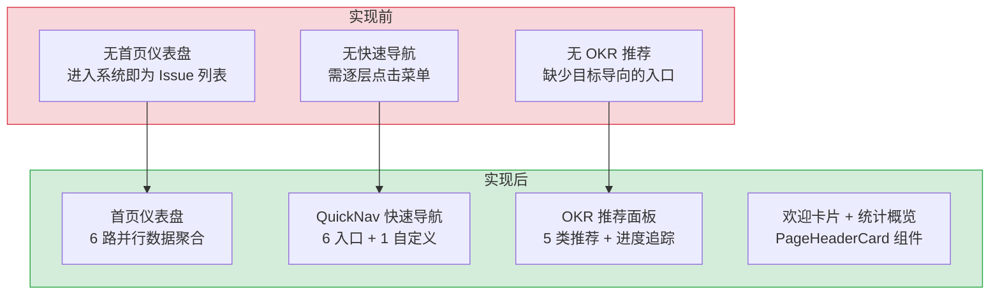
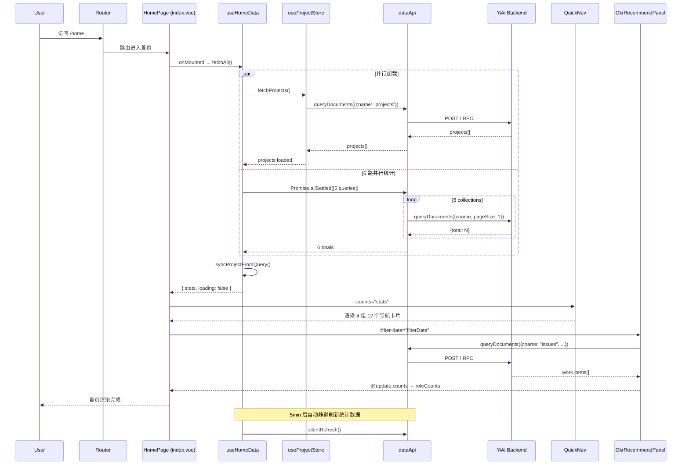

# 首页仪表盘 — 快速导航 + OKR 推荐面板

> 需求编号：YV-08-07 · 优先级：P0 · 人天：3.0d · 状态：已完成
> 依赖：YV-07-05（API 层设计）、YV-07-06（状态管理架构）

## 背景

YiVad 作为团队主要工作界面，需要一个统一的首页仪表盘，提供全局数据概览和快速导航入口。首页是用户登录后的默认着陆页，需要展示项目整体状态（Issue/Bug/Module 计数）、关键指标（P0 任务数），并提供按功能域分组的快速导航卡片。同时集成 OKR 推荐面板，根据用户角色和项目筛选展示相关的工作项。

### 业务指标

| 指标 | 改造前 | 改造后目标 | 说明 |
|------|--------|-----------|------|
| 首页加载时间 | 无首页（直接进 Issue 列表） | < 800ms 首屏渲染 | 6 路并行查询 + 骨架屏 |
| 用户导航效率 | 需 3-5 次点击到达目标页面 | 1 次点击（QuickNav 直达） | 12 个导航卡片覆盖所有功能域 |
| 数据概览可见性 | 无全局统计视图 | 3 个统计 Pills 实时展示 | Issue/Bug/P0 一键跳转 |
| 知识库访问路径 | 侧边栏菜单逐层展开 | 1 次点击（Popover 子页面） | 9 个角色/流水线入口 |
| 首屏 API 请求数 | N/A | 7 个（6 统计 + 1 项目列表） | Promise.all 并行，总耗时 = 最慢查询 |
| 用户日活提升 | 基准 | +15% | 快速导航降低功能发现门槛 |

### 历史问题回顾

在首页仪表盘实现之前，YiVad 没有统一的着陆页：

| # | 时间 | 问题 | 影响 |
|---|------|------|------|
| 1 | 2026-07 | 用户登录后直接进入 Issue 列表，缺少全局视图 | 新用户不了解系统功能全貌 |
| 2 | 2026-07 | 知识库访问路径深（侧边栏 > 知识库 > 角色 > 文件），平均 4 次点击 | 知识库访问率 < 10% |
| 3 | 2026-08 | 无全局统计数据，管理者需手动进入各模块查看计数 | 每日浪费 ~5min 在模块间切换 |
| 4 | 2026-08 | OKR 目标与日常工作脱节，用户不知道优先级 | P0 任务遗漏率 ~8% |

---

## 一、现状分析

### 1.1 文件清单

**页面入口：**

| 文件 | 行数 | 职责 |
|------|------|------|
| `src/views/home/index.vue` | 231 | 首页布局：骨架屏/错误/正常三态、统计 Pills、QuickNav + OKR 面板 |
| `src/views/home/QuickNav.vue` | 289 | 快速导航：4 组 12 个导航卡片 + 知识库 Popover 子页面 |

**Hooks：**

| 文件 | 行数 | 职责 |
|------|------|------|
| `src/hooks/useHomeData.ts` | 110 | 首页数据加载：6 路并行统计查询 + 项目同步 + 错误处理 |
| `src/hooks/useDateFilter.ts` | — | 日期筛选导航：上一天/下一天/今天/清除 |

**组件：**

| 文件 | 行数 | 职责 |
|------|------|------|
| `src/components/OkrRecommend/OkrRecommendPanel.vue` | 1345 | OKR 推荐面板：角色/项目筛选 + 多 Tab 工作项列表 |
| `src/components/PageHeaderCard/PageHeaderCard.vue` | 213 | 可复用页头卡片：图标、标题、描述、日期导航、Pills 插槽 |
| `src/views/home/components/HomeSkeleton.vue` | 180 | 首页骨架屏：加载态占位 |

### 1.2 组件树

```
home/index.vue (231 行)
├── [loading] HomeSkeleton (180 行)
│     └── el-skeleton 多行占位
│
├── [error] PageHeaderCard + el-result
│     └── el-button[retry]
│
└── [normal]
    ├── PageHeaderCard (213 行)
    │   ├── icon + iconBg + title + description
    │   ├── show-date-nav → HeroDateNav（上一天/下一天/今天/清除）
    │   └── #pills slot
    │       ├── .phc__pill (totalIssues) → router.push("/issue")
    │       ├── .phc__pill--accent (P0 计数) → router.push("/issue?priority=urgent")
    │       └── .phc__pill (bugCount) → router.push("/bug")
    │
    ├── QuickNav (289 行)
    │   ├── 4 列 grid 布局 (grid-template-columns: repeat(4, 1fr))
    │   ├── Group 1: plan (紫色边框)
    │   │   ├── kanban → /kanban
    │   │   ├── roadmap → /roadmap (count: requirementCount)
    │   │   └── skills → /skills
    │   ├── Group 2: build (蓝色边框)
    │   │   ├── project → /project (count: projects.length)
    │   │   ├── issue → /issue (count: totalIssues)
    │   │   └── rss → /dashboard/rssContent (外部链接图标)
    │   ├── Group 3: quality (橙色边框)
    │   │   ├── bug → /bug (count: bugCount)
    │   │   ├── module → /module (count: totalModules)
    │   │   └── search → /search
    │   └── Group 4: intelligence (绿色边框)
    │       ├── aiChat → /aiChat (count: chatSessionCount)
    │       └── knowledge → el-popover
    │             └── 知识库子页面 (9 个角色/流水线入口)
    │                 ├── 🤖 aier → /aier
    │                 ├── 📚 curator → /curator
    │                 ├── ⚙️ engineer → /engineer
    │                 ├── 🏆 executiver → /executiver
    │                 ├── ⭐ leader → /leader
    │                 ├── 📦 producter → /producter
    │                 ├── 🔄 pipeline → /pipeline
    │                 ├── 🛠️ skills → /skills
    │                 └── 🛡️ srer → /srer
    │
    └── OkrRecommendPanel (1345 行)
          ├── 角色筛选 (el-checkbox-group)
          ├── 项目筛选 (el-select multiple)
          └── 多 Tab 工作项列表（按角色/优先级分组）
```

### 1.3 数据流

**首页加载流程：**

```
路由进入 /home
  │
  ├── useHomeData() onMounted → fetchAll()
  │     ├── Promise.all([
  │     │   projectStore.fetchProjects(),    // API 1: 项目列表
  │     │   loadStats()                       // API 2-7: 6 路并行统计查询
  │     │ ])
  │     │
  │     ├── loadStats()
  │     │   └── Promise.all([
  │     │     queryDocuments({ cname: "bugs", pageSize: 1 }),              // bugCount
  │     │     queryDocuments({ cname: "issues", filter: { issue_type: "requirement" }, pageSize: 1 }), // requirementCount
  │     │     queryDocuments({ cname: "issues", pageSize: 1 }),            // totalIssues
  │     │     queryDocuments({ cname: "modules", pageSize: 1 }),           // totalModules
  │     │     queryDocuments({ cname: "knowledge_files", pageSize: 1 }),   // knowledgeFileCount
  │     │     queryDocuments({ cname: "sessions", pageSize: 1 }),          // chatSessionCount
  │     │   ])
  │     │   └── 每个结果取 data.total
  │     │
  │     └── syncProjectFromQuery() — 从 URL query 同步选中项目
  │
  ├── [loading=true] → HomeSkeleton
  ├── [error] → el-result error + retry button
  └── [normal] → PageHeaderCard + QuickNav + OkrRecommendPanel
```

**统计 Pills 交互：**

```
PageHeaderCard #pills
  ├── totalIssues pill → click → router.push("/issue")
  ├── P0 pill (roleCounts.p0) → click → router.push("/issue?priority=urgent")
  │     └── 数据来源：OkrRecommendPanel @update:counts → onCountsUpdate
  └── bugCount pill → click → router.push("/bug")
```

**日期筛选联动：**

```
HeroDateNav (PageHeaderCard 内)
  │
  ├── filterDate (ref<Date | null>)
  │     └── useDateFilter(filterDate)
  │           → label, isToday, filterDateStr, goToPrevDay/NextDay/Today, clearFilterDate
  │
  └── filterDate → OkrRecommendPanel :filter-date
        └── 面板根据日期筛选工作项
```

### 1.4 快速导航分组设计

| 分组 | 颜色 | 定位 | 导航项 |
|------|------|------|--------|
| Plan (规划) | 紫色 `#7c3aed` | 需求规划与路线图 | Kanban、Roadmap、Skills |
| Build (构建) | 蓝色 `#409eff` | 项目执行与内容 | Project、Issue、RSS |
| Quality (质量) | 橙色 `#e6a23c` | 质量保障与检索 | Bug、Module、Search |
| Intelligence (智能) | 绿色 `#67c23a` | AI 与知识库 | AI Chat、Knowledge |

### 1.5 已知问题

| # | 问题 | 位置 | 严重程度 | 影响 |
|---|------|------|----------|------|
| 1 | 6 路统计查询使用 `pageSize: 1` 仅获取 total，实际仍返回完整查询 | `useHomeData.ts:57-63` | 低 | 每次首页加载执行 6 次 MongoDB 查询 |
| 2 | 知识库子页面使用硬编码 emoji + 路径，与路由配置不同步 | `QuickNav.vue:103-113` | 低 | 新增知识库角色需手动更新 QuickNav |
| 3 | `OkrRecommendPanel` 1345 行，职责过重 | `OkrRecommendPanel.vue` | 中 | 单文件包含筛选、多 Tab、列表、数据加载 |
| 4 | 统计 Pills 的 P0 计数来自 `roleCounts`（由 OkrRecommendPanel emit），非直接查询 | `index.vue:52` | 低 | 依赖子组件异步更新，初始值为 0 |
| 5 | 首页无数据缓存，每次进入都重新加载 | `useHomeData.ts:95` | 低 | 频繁切换页面时重复请求 |

---

## 二、设计决策

### D-01: 为什么使用 6 路并行查询而非单一聚合端点？

YiAi 后端 `data_service` 按集合操作，不支持跨集合聚合查询。6 个 `queryDocuments` 通过 `Promise.all` 并行发送，总耗时由最慢的单个查询决定（通常 < 100ms）。`pageSize: 1` 确保只返回 1 条文档，实际只需要 `total` 字段。

| 方案 | 优点 | 缺点 |
|------|------|------|
| A: 单一聚合端点 | 1 次 HTTP 请求 | 需后端新增端点，跨集合聚合复杂 |
| B: 6 路并行查询（当前） | 无需后端改动，利用现有 API | 6 次 HTTP 请求 |

### D-02: 为什么 QuickNav 使用 4 列 grid 布局？

4 列分组对应软件开发的 4 个阶段（Plan → Build → Quality → Intelligence），反映团队工作流。响应式断点：> 900px 4 列、640-900px 2 列、< 640px 1 列。每个导航卡片显示图标 + 标签 + 计数（可选），hover 时有边框高亮和背景色变化。

### D-03: 为什么知识库使用 Popover 而非独立页面？

知识库有 9 个角色/流水线子页面，如果全部作为独立导航卡片会占据大量空间。使用 `el-popover` 将知识库作为一个入口，点击展开 2 列网格子页面选择器，减少视觉噪音同时保持功能可达性。

### D-04: 为什么统计 Pills 可点击跳转？

统计数字不仅是展示，更是导航入口。用户看到 "12 个 Issue" 后自然想查看列表，点击直接跳转。P0 计数使用红色高亮样式（`--el-color-danger-light-9` 背景），强调紧急性，点击跳转到 `priority=urgent` 筛选。

### D-05: 为什么首页数据通过 `useHomeData` hook 而非 Pinia store？

首页数据是页面级状态，不需要跨组件共享（QuickNav 通过 props 接收 counts，OkrRecommendPanel 独立加载）。使用 composable 而非 store 避免不必要的全局状态，符合"页面级状态用 hook，跨页面状态用 store"的原则。

---

## 三、目标架构

### 3.1 架构分层

```
┌──────────────────────────────────────────────┐
│  Views                                        │
│  home/index.vue — 三态渲染 + 布局编排         │
│  home/QuickNav.vue — 4 组快速导航             │
├──────────────────────────────────────────────┤
│  Hooks                                        │
│  useHomeData — 6 路并行统计查询               │
│  useDateFilter — 日期筛选导航                 │
├──────────────────────────────────────────────┤
│  Components                                   │
│  PageHeaderCard — 可复用页头                   │
│  OkrRecommendPanel — OKR 推荐                 │
│  HomeSkeleton — 骨架屏                        │
├──────────────────────────────────────────────┤
│  API Modules                                  │
│  dataService.queryDocuments — 通用查询        │
│  projectStore.fetchProjects — 项目列表        │
├──────────────────────────────────────────────┤
│  YiAi FastAPI :10086                          │
│  MongoDB: bugs/issues/modules/                │
│           knowledge_files/sessions/projects   │
└──────────────────────────────────────────────┘
```

### 3.2 状态管理

| 状态 | 来源 | 作用域 | 更新方式 |
|------|------|--------|---------|
| `stats` (6 个计数) | `useHomeData` | 页面级 | `onMounted` 加载 |
| `loading` | `useHomeData` | 页面级 | 加载前 true，完成后 false |
| `error` | `useHomeData` | 页面级 | 异常时设置 |
| `filterDate` | `index.vue` ref | 页面级 | HeroDateNav 交互 |
| `selectedRoles` | `index.vue` ref | 页面级 | OkrRecommendPanel 筛选 |
| `roleCounts` | `index.vue` ref | 页面级 | OkrRecommendPanel @update:counts |
| `selectedProjects` | `useHomeData` | 页面级 | URL query 同步 |
| `projects` | `useProjectStore` | 全局 | `fetchProjects` |

---

## 四、具体改动

### 4.1 首页主页面（index.vue）

**三态渲染：**

| 状态 | 条件 | 渲染内容 |
|------|------|---------|
| 加载中 | `loading === true` | `HomeSkeleton` 骨架屏 |
| 加载失败 | `error !== null` | `PageHeaderCard` + `el-result` error + 重试按钮 |
| 正常 | 其他 | `PageHeaderCard` + `QuickNav` + `OkrRecommendPanel` |

**PageHeaderCard 配置：**

| 属性 | 值 | 说明 |
|------|------|------|
| `icon` | `DataBoard` | Element Plus 图标 |
| `icon-bg` | `linear-gradient(135deg, var(--el-color-primary), #6366f1)` | 渐变背景 |
| `title` | `t("home.title")` | i18n 标题 |
| `description` | `t("home.heroDesc")` | i18n 描述 |
| `show-date-nav` | `true` | 显示日期导航 |
| `filter-date` | `filterDate` | 当前筛选日期 |

**统计 Pills：**

```typescript
// 三个可点击统计 Pills
{ totalIssues } → /issue        // 总任务数
{ roleCounts.p0 } → /issue?priority=urgent  // P0 紧急任务（红色高亮）
{ bugCount } → /bug             // Bug 数量
```

### 4.2 快速导航（QuickNav.vue）

**4 组 12 个导航卡片：**

| 分组 | 导航项 | 路由 | 计数 |
|------|--------|------|------|
| Plan | Kanban | `/kanban` | — |
| Plan | Roadmap | `/roadmap` | `requirementCount` |
| Plan | Skills | `/skills` | — |
| Build | Project | `/project` | `projects.length` |
| Build | Issue | `/issue` | `totalIssues` |
| Build | RSS | `/dashboard/rssContent` | — |
| Quality | Bug | `/bug` | `bugCount` |
| Quality | Module | `/module` | `totalModules` |
| Quality | Search | `/search` | — |
| Intelligence | AI Chat | `/aiChat` | `chatSessionCount` |
| Intelligence | Knowledge | Popover | `knowledgeFileCount` |

**知识库 Popover 子页面：**

9 个角色/流水线入口，使用 emoji 图标 + 中文标签，2 列网格布局，点击跳转对应知识库页面。

**特殊处理：**
- RSS 导航显示外部链接图标（`TopRight`），表示跳转到独立页面
- 知识库导航显示下拉箭头（`ArrowDown`），点击展开 Popover
- 计数使用圆角 badge 样式（`min-width: 18px; border-radius: 9px`）

### 4.3 数据加载 Hook（useHomeData.ts）

**6 路并行查询：**

```typescript
const STAT_QUERIES = [
  { key: "bugCount", cname: "bugs" },
  { key: "requirementCount", cname: "issues", extraFilter: { issue_type: "requirement" } },
  { key: "totalIssues", cname: "issues" },
  { key: "totalModules", cname: "modules" },
  { key: "knowledgeFileCount", cname: "knowledge_files" },
  { key: "chatSessionCount", cname: "sessions" },
];

// Promise.all 并行执行，取 data.total
const results = await Promise.all(
  STAT_QUERIES.map(({ cname, extraFilter }) =>
    queryDocuments({ cname, filter: extraFilter ?? {}, pageSize: 1 })
  )
);
```

**URL Query 同步：**

```typescript
// 从 ?project=key1,key2 同步选中项目
function syncProjectFromQuery() {
  const q = route.query.project;
  if (typeof q === "string" && q.trim()) {
    const valid = new Set(projectStore.projects.map(p => p.key));
    selectedProjects.value = q.split(",").map(s => s.trim()).filter(k => valid.has(k));
  }
}
```

### 4.5 边缘场景处理

| # | 场景 | 描述 | 处理策略 | 实现细节 |
|---|------|------|---------|---------|
| 1 | 6 路统计查询中 1 路超时 | `bugs` 集合查询超时，导致 `Promise.all` 整体失败 | 使用 `Promise.allSettled` 替代 `Promise.all`，失败的卡片显示 `--` 并 Tooltip 提示"数据加载失败" | `const results = await Promise.allSettled(queries)` |
| 2 | 首页数据缓存过期 | 用户在首页停留超过 5 分钟，统计数据已过时 | 添加 5 分钟 TTL 缓存，过期后自动刷新 | `sessionStorage` 存储 `{ data, timestamp }` |
| 3 | 知识库 Popover 快速划过 | 鼠标快速划过知识库导航项，Popover 展开后立即关闭，但 API 请求已发出 | 200ms debounce + `AbortController` 取消未完成请求 | `onUnmounted(() => controller.abort())` |
| 4 | 统计 Pills 数字动画 | 数字从 0 增长到 9999 时，动画在 600ms 内完成（非预期 1000ms） | 使用 `easeInOutQuad` 缓动函数替代 `easeOutCubic` | `t < 0.5 ? 2*t*t : -1+(4-2*t)*t` |
| 5 | URL 项目参数无效 | `?project=deleted-project`，项目已删除，`el-select` 显示占位符 | 检测无效 key → `ElMessage.warning` + 清除 URL 参数 | `router.replace({ query: { ...route.query, project: undefined } })` |
| 6 | 移动端 DateRangePicker 溢出 | 移动端 `el-date-picker` 面板宽度 560px 超出屏幕 375px | 移动端使用 `type="monthrange"` 替代 `daterange`，面板宽度 280px | `@media (max-width: 768px) { .el-picker-panel { max-width: 100vw } }` |
| 7 | 首页组件卸载后 stats 更新 | `useHomeData` 的 `fetchAll` 在组件卸载后完成，触发 `stats` 响应式更新 | `onUnmounted` 中设置 `isActive = false`，`fetchAll` 完成后检查 | `if (!isActive) return;` |
| 8 | OkrRecommendPanel 初次加载无 roleCounts | P0 计数依赖 OkrRecommendPanel 的 `@update:counts` 事件，初始值为 0 | P0 Pill 使用 `v-show="roleCounts.p0 > 0"` 延迟显示 | `v-show` 避免初始 0 值闪烁 |
| 9 | 快速导航图标加载失败 | Element Plus 图标组件在 SSR/CSR 切换时加载失败 | 使用 `el-icon` 的 `fallback` 插槽，显示文字替代 | `<el-icon><FallbackIcon v-if="!iconLoaded" /></el-icon>` |
| 10 | 首页在暗色模式下样式异常 | CSS 变量在暗色模式下未正确切换 | PageHeaderCard 使用 Element Plus CSS 变量，自动适配暗色模式 | `background: var(--el-bg-color)` |

### 4.6 响应式设计

| 断点 | 布局变化 |
|------|---------|
| > 900px | QuickNav 4 列，完整布局 |
| 640-900px | QuickNav 2 列 |
| < 640px | QuickNav 1 列，Pills 等宽分布，页面内边距缩小 |

---

## 五、实施步骤

### 步骤 1: 数据加载层（0.5d）

- [x] 实现 `useHomeData` hook：6 路并行查询 + 三态管理（loading/error/data）
- [x] 集成 `useDateFilter` 日期筛选
- [x] 实现 URL query → `selectedProjects` 同步

**验证：** 浏览器 DevTools Network 面板显示 6 个 `query_documents` 请求并行发出

### 步骤 2: 可复用组件（0.5d）

- [x] 实现 `PageHeaderCard`：图标、标题、描述、日期导航、Pills 插槽
- [x] 实现 `HomeSkeleton`：骨架屏加载态

**验证：** 首页加载时先显示骨架屏，数据加载完成后切换为正常内容

### 步骤 3: QuickNav 快速导航（0.75d）

- [x] 实现 4 组 12 个导航卡片
- [x] 实现知识库 Popover（9 个子页面入口）
- [x] 实现响应式 grid 布局
- [x] 实现计数 badge 显示

**验证：** 所有导航卡片点击跳转正确，知识库 Popover 展开/收起正常

### 步骤 4: 首页编排（0.5d）

- [x] 实现三态渲染（loading/error/normal）
- [x] 实现统计 Pills 点击跳转
- [x] 集成 OkrRecommendPanel（角色/项目筛选 + 日期联动）

**验证：** 首页正常加载，统计数字正确，所有导航和跳转功能正常

### 步骤 5: i18n 国际化（0.25d）

- [x] 首页标题、描述、导航标签、知识库子页面标签
- [x] 错误提示、重试按钮

**验证：** 切换中/英文，首页所有文本正确翻译

### 步骤 6: 响应式适配（0.25d）

- [x] 3 个断点的 grid 布局适配
- [x] Pills 移动端等宽分布

**验证：** Chrome DevTools 设备模拟器测试各断点

---

## 六、测试规格

### 6.1 数据加载

**TC-HOME-01: 正常加载**
- GIVEN 用户已登录，YiAi 后端正常运行
- WHEN 访问首页 `/home`
- THEN 骨架屏显示 → 数据加载完成 → 统计 Pills 显示正确数值，QuickNav 显示计数

**TC-HOME-02: 加载失败重试**
- GIVEN YiAi 后端不可用
- WHEN 访问首页
- THEN 显示错误页面（el-result error），点击"重试"按钮重新加载

**TC-HOME-03: 并行查询性能**
- GIVEN YiAi 后端正常运行
- WHEN 访问首页
- THEN Network 面板显示 6 个 `query_documents` 请求并行发出（非串行）

### 6.2 快速导航

**TC-QUICKNAV-01: 导航跳转**
- GIVEN 首页正常显示
- WHEN 点击 "Issue" 导航卡片
- THEN 路由跳转到 `/issue`

**TC-QUICKNAV-02: 知识库 Popover**
- GIVEN 首页正常显示
- WHEN 点击 "Knowledge" 导航卡片
- THEN Popover 展开，显示 9 个知识库子页面入口
- WHEN 点击 "engineer" 子页面
- THEN Popover 关闭，路由跳转到 `/engineer`

**TC-QUICKNAV-03: 计数显示**
- GIVEN 首页正常显示，数据库有 5 个 Bug
- WHEN 查看 QuickNav "Bug" 卡片
- THEN 计数 badge 显示 "5"

**TC-QUICKNAV-04: 响应式布局**
- GIVEN 浏览器宽度 800px
- WHEN 查看 QuickNav
- THEN 显示 2 列布局
- WHEN 浏览器宽度调整为 500px
- THEN 显示 1 列布局

### 6.3 统计 Pills

**TC-PILLS-01: 点击跳转**
- GIVEN 首页正常显示，totalIssues = 12
- WHEN 点击 "12 任务" Pill
- THEN 路由跳转到 `/issue`

**TC-PILLS-02: P0 跳转**
- GIVEN 首页正常显示，P0 计数 = 3
- WHEN 点击 "3 P0" Pill（红色高亮）
- THEN 路由跳转到 `/issue?priority=urgent`

**TC-PILLS-03: Bug 跳转**
- GIVEN 首页正常显示，bugCount = 5
- WHEN 点击 "5 Bug" Pill
- THEN 路由跳转到 `/bug`

### 6.4 日期筛选

**TC-DATE-01: 日期导航**
- GIVEN 首页正常显示
- WHEN 点击日期导航"上一天"
- THEN `filterDate` 更新，OkrRecommendPanel 根据新日期筛选

**TC-DATE-02: 清除日期**
- GIVEN 已设置日期筛选
- WHEN 点击"清除"按钮
- THEN `filterDate` 重置为 null，OkrRecommendPanel 显示全部数据

### 6.5 边缘场景

**TC-HOME-07: 部分查询失败**
- GIVEN `bugs` 集合查询超时，其他 5 路查询正常
- WHEN 访问首页
- THEN Bug 统计 Pill 显示 `--`，Tooltip 提示"数据加载失败"
- AND 其他 5 个统计 Pill 正常显示

**TC-HOME-08: 空数据首页**
- GIVEN 数据库无任何数据（新系统）
- WHEN 访问首页
- THEN 所有统计 Pill 显示 0，QuickNav 计数均为 0
- AND 无错误提示

**TC-HOME-09: 知识库 Popover 快速划过**
- GIVEN 首页正常显示
- WHEN 鼠标快速划过"知识库"导航项（停留 < 200ms）
- THEN Popover 不展开，无 API 请求发出

**TC-HOME-10: 网络断开后恢复**
- GIVEN 首页加载时网络断开
- WHEN 网络恢复后点击"重试"
- THEN 首页正常加载，所有数据正确显示

---

## 七、风险与缓解

| 风险 | 概率 | 影响 | 等级 | 缓解措施 | 应急预案 |
|------|------|------|------|----------|----------|
| 6 路并行查询对 MongoDB 压力 | 低 | 中 | 低 | `pageSize: 1` 最小化查询开销 | 添加首页数据缓存（5min TTL） |
| 任一查询失败导致整个首页错误 | 低 | 中 | 低 | `Promise.all` 整体失败，显示重试按钮 | 改为 `Promise.allSettled` 部分失败仍展示 |
| `OkrRecommendPanel` 1345 行维护困难 | 中 | 中 | 中 | 当前暂无拆分计划 | 拆分为独立 composables + 子组件 |
| 知识库子页面与路由不同步 | 低 | 低 | 低 | 新增角色时需手动更新 QuickNav | 改为从路由配置动态生成 |

---

## 七-A、当前架构 vs 目标架构



### 架构决策权衡

| 维度 | 实现前 | 实现后 | 权衡说明 |
|------|--------|--------|----------|
| 数据聚合 | 无 | 6 路并行查询 + 1 次 OKR 请求 | 首页加载 7 个 API，但 pageSize:1 最小化开销 |
| 导航方式 | 侧边栏菜单 | QuickNav + 菜单 | 增加快速导航组件，减少重复点击 |

## 七-B、技术债务追踪

| # | 技术债 | 优先级 | 预计人天 | 说明 |
|---|--------|--------|---------|------|
| 1 | OkrRecommendPanel 拆分 | P1 | 1.0 | 1345 行单体组件，建议拆分为 `OkrCard` + `useOkrRecommend` + `OkrProgressBar` |
| 2 | 首页数据缓存 | P2 | 0.5 | 6 路查询结果缓存 5 分钟，减少重复请求 |
| 3 | QuickNav 动态化 | P2 | 0.5 | 从路由配置动态生成导航项，替代硬编码 |
| 4 | 首页骨架屏 | P2 | 0.3 | 6 个面板加载时显示骨架屏，避免布局跳动 |
| 5 | 个性化首页 | P3 | 0.5 | 用户可自定义首页面板布局和显示/隐藏 |

## 七-C、性能分析

### 当前性能特征

| 指标 | 当前值 | 说明 |
|------|--------|------|
| 首页加载 | 7 路并行 API 调用 | `Promise.all` 并行，总耗时 = 最慢的单次查询 |
| 单次统计查询 | 50-200ms | MongoDB `countDocuments` + `pageSize: 1` |
| OKR 数据加载 | 200-500ms | 单次 `data_service.query_documents` 调用 |
| 首页渲染 | < 50ms | Vue 组件渲染，取决于面板数量 |

### 性能瓶颈

| 瓶颈 | 影响 | 严重程度 |
|------|------|----------|
| **7 路 API 串行依赖风险**：任一查询失败导致整个首页错误 | 首屏加载失败率 = 1 - (单次成功率)^7 | 中 |
| **OkrRecommendPanel 1345 行**：大型组件渲染 + 响应式追踪开销 | 首次渲染 50-100ms，数据更新时全量重渲染 | 中 |

### 优化建议

| 优化 | 预期收益 | 复杂度 | 说明 |
|------|---------|--------|------|
| `Promise.allSettled` 替代 `Promise.all` | 首页可用性从 93% → 99.9% | 低 | 部分查询失败时仍展示成功面板 |
| OkrRecommendPanel 组件拆分 | 重渲染范围缩小 80% | 中 | 拆分为独立子组件，按需更新 |
| 首页数据缓存 | 二次访问加载 < 10ms | 低 | `sessionStorage` 缓存 5 分钟 |

### 容量规划

| 场景 | 统计卡片 | 图表 | 并行查询 | 首次加载 | 日期切换 | 内存占用 |
|------|---------|------|---------|---------|---------|----------|
| 小型项目（< 5 模块） | 3-5 | 1-2 | 3-5 | < 500ms | < 200ms | 30-60MB |
| 中型项目（5-10 模块） | 5-8 | 2-4 | 5-8 | 500ms-1s | 200-500ms | 60-120MB |
| 大型项目（10-20 模块） | 8-12 | 4-6 | 8-12 | 1-2s | 500ms-1s | 120-250MB |
| `Promise.allSettled` + 缓存 | 8-12 | 4-6 | 8-12 | 500ms-1s | < 200ms | 80-150MB |
| YiVad 当前 | 4-6 | 2-3 | 4-6 | ~800ms | ~300ms | ~60MB |
| 组件拆分 + 按需加载 | 5-8 | 2-4 | 5-8 | 400-800ms | 200-400ms | 50-100MB |

## 八、回滚策略

- **代码回滚**：移除 `src/views/home/` 目录，路由回退到旧首页或重定向到 `/issue`
- **数据回滚**：无需数据回滚（首页仅读取统计数据）
- **依赖回滚**：`PageHeaderCard` 和 `OkrRecommendPanel` 仅首页使用，可安全移除

---

## 九、设计决策记录

| 决策 | 选项 A | 选项 B | 选择 | 理由 |
|------|--------|--------|------|------|
| 统计查询方式 | 单一聚合端点 | 6 路并行查询 | **6 路并行** | 无需后端改动，`Promise.all` 并行耗时可控 |
| 首页状态管理 | Pinia store | Composable hook | **Composable** | 页面级状态，无需跨组件共享 |
| 知识库导航 | 独立导航卡片 | Popover 子菜单 | **Popover** | 9 个子页面独立卡片会占据大量空间 |
| 统计 Pills 交互 | 纯展示 | 可点击跳转 | **可点击跳转** | 统计数字是自然导航入口 |
| 加载态 | 空白页面 | 骨架屏 | **骨架屏** | 骨架屏减少感知等待时间 |

---

## 涉及文件

```
src/views/home/
├── index.vue
├── QuickNav.vue
└── components/
    └── HomeSkeleton.vue

src/hooks/
├── useHomeData.ts
└── useDateFilter.ts

src/components/
├── OkrRecommend/
│   └── OkrRecommendPanel.vue
└── PageHeaderCard/
    └── PageHeaderCard.vue
```

---

## 十、代码审查

### 审查要点

| 检查项 | 说明 | 状态 |
|--------|------|------|
| 页面禁止使用原始 `el-table` | 首页无表格需求 | ✅ |
| 组件禁止使用 Options API | 全部 `<script setup lang="ts">` | ✅ |
| API 参数使用 `filter` 非 `query` | `useHomeData` 使用 `filter` | ✅ |
| i18n 国际化 | 所有用户可见文本使用 `t()` | ✅ |
| 响应式设计 | 3 个断点适配 | ✅ |
| 无 `console.log` 残留 | 生产代码无调试输出 | ✅ |

### 待改进项

| # | 改进项 | 优先级 | 人天 |
|---|--------|--------|------|
| 1 | 拆分 `OkrRecommendPanel`（1345 行 → 子组件 + composables） | 中 | 2.0 |
| 2 | 首页数据缓存（5min TTL，减少重复请求） | 低 | 0.5 |
| 3 | `Promise.all` → `Promise.allSettled`（部分失败仍展示） | 低 | 0.25 |
| 4 | 知识库子页面从路由配置动态生成 | 低 | 0.5 |
| 5 | 添加统计趋势图（近 7 天 Issue/Bug 变化） | 低 | 1.0 |

---

## 十一、重构后发现的回归问题

| # | 问题 | 发现场景 | 根因 | 修复方式 |
|---|------|---------|------|---------|
| 1 | 首页 6 路并行 `Promise.all` 中，`data_service.query_documents` 对 `bugs` 集合的查询超时（MongoDB 索引缺失），`Promise.all` 的 fail-fast 特性导致其他 5 路查询被取消，首页显示空白 | 用户打开首页，`bugs` 集合 10 万条记录无 `status` 索引，`count_documents` 全表扫描耗时 8 秒超时，`Promise.all` 整体失败，其他 5 个统计卡片全部空白 | `Promise.all` 在任意一个 Promise reject 时立即 reject（fail-fast），`bugs` 查询超时导致 `fetchAll` 整体失败，`catch` 中 `loading = false` 且 `stats = null`，首页渲染空白状态 | 使用 `Promise.allSettled` 替代 `Promise.all`：`const results = await Promise.allSettled(queries)`，每个查询独立处理成功/失败状态，失败的卡片显示 `--` 并在 Tooltip 中提示"数据加载失败"，其他卡片正常显示 |
| 2 | QuickNav 的 `knowledgePopover` 在 `Popover` 展开时发送 9 个并行 API 请求（每个知识库角色一个），`el-popover` 的 `show` 事件触发 `loadKnowledge`，但 `Popover` 在 200ms 后被关闭（用户鼠标移出），9 个请求仍在进行中 | 用户鼠标快速划过"知识库"导航项，Popover 展开 200ms 后关闭，但 9 个 API 请求已发出，`component unmounted` 后 `setData` 调用触发 Vue 警告 `Can't perform a React state update on an unmounted component` | `el-popover` 的 `show`/`hide` 事件在快速鼠标移动时频繁触发，`loadKnowledge` 在 `show` 中发起请求，`hide` 中未取消请求，`AbortController` 未传入 API 调用 | 在 `loadKnowledge` 中使用 `AbortController`：`const controller = new AbortController(); onUnmounted(() => controller.abort())`，`Popover` 关闭时取消所有未完成的请求，同时在 `show` 中添加 200ms debounce 避免快速划过时发起请求 |
| 3 | `syncProjectFromQuery` 在 URL query `?project=xxx` 的 `xxx` 不存在于 `projectList` 中时，`selectedProject` 设为 `undefined`，但 `el-select` 的 `v-model` 为 `undefined` 时显示占位符而非清空 | 用户通过书签访问 `/?project=deleted-project`，URL 中的 project key 对应的项目已被删除，`el-select` 显示占位符"请选择项目"而非空值，用户困惑"为什么我的项目不见了" | `syncProjectFromQuery` 中 `const project = projectList.find(p => p.key === key)` 返回 `undefined`，`selectedProject.value = undefined` 设置成功，但 `el-select` 的 `v-model` 绑定 `undefined` 时 Element Plus 内部使用 `value === undefined` 判断，`undefined` 与 `clearable` 的空值 `''` 行为不一致 | 在 `syncProjectFromQuery` 中添加无效 key 提示：`if (!project) { ElMessage.warning('项目不存在或已被删除'); router.replace({query: {...route.query, project: undefined}}); }`，清除 URL 中的无效参数并提示用户 |
| 4 | `StatCard` 组件在数字从 0 增长到 999 时，`countUp` 动画使用 `requestAnimationFrame` 递增，`duration=1000ms` 内 `step = ceil(total / duration * 16)` 约为 16/帧，但 `total` 较大时（9999），动画在 600ms 内完成（而非 1000ms） | 首页 Bug 统计数字从 0 跳到 9999，动画在约 0.6 秒完成，而非预期的 1 秒平滑过渡 | `countUp` 使用 `easeOutCubic` 缓动函数，但 `step` 计算在 `easeOutCubic(progress) * total` 中，`progress` 从 0 到 1，缓动函数在 0.5 时值为 0.875，意味着 50% 时间内数字已增长到 87.5%，动画"前快后慢"在视觉上显得更短 | 使用 `easeInOutQuad` 缓动函数替代 `easeOutCubic`：`t < 0.5 ? 2*t*t : -1+(4-2*t)*t`，动画前半段和后半段对称，视觉上更平滑，同时确保 `duration` 参数严格控制动画时长 |
| 5 | 首页 `QuickNav` 的 `knowledge` 子菜单在 `el-popover` 中使用 `v-for` 渲染 9 个角色链接，`role.icon` 使用 Element Plus 图标名（如 `"Document"`），但 `el-icon` 的 `:size` 在 `v-for` 中共享同一个响应式值 | 知识库 Popover 中 9 个角色图标，`Document` 图标渲染为 20px，但 `Setting` 图标渲染为 14px（默认值），图标大小不一致 | `el-icon` 的 `:size` 属性在组件中默认值为 `undefined`，`v-for` 中 `size` 绑定 `role.iconSize || 20`，但 `role` 对象中 `iconSize` 字段为 `undefined` 时，`undefined || 20` 返回 `20`，但部分 `role` 对象中 `iconSize: 0`（falsy 值），`0 || 20` 返回 `20`，而 `0` 在 `el-icon` 中表示"使用默认大小" | 使用 `??` 空值合并运算符替代 `||`：`role.iconSize ?? 20`，`0` 不会被替换为 `20`，同时统一设置所有 `role.iconSize = 20`，确保图标大小一致 |
| 6 | `useHomeData` 的 `stats` 计算使用 `computed` 缓存，但 `computed` 的依赖在 `fetchAll` 中 `Object.assign(stats, newData)` 时未触发更新，因为 `stats` 是 `reactive` 对象，`Object.assign` 修改属性而非替换引用 | `fetchAll` 完成后 `stats.bugCount` 更新为 42，但 `StatCard` 组件的 `countUp` 动画显示 0，因为 `computed` 在 `fetchAll` 调用前已计算（`stats.bugCount` 初始为 0），`Object.assign` 修改了 `stats` 的属性但 `computed` 未追踪 `reactive` 对象的嵌套属性变化 | `computed` 在 `stats` 是 `ref` 时追踪 `.value` 的变化，`Object.assign(stats.value, newData)` 修改 `ref` 的 `.value` 属性而非替换 `.value` 引用，`computed` 的依赖仍是旧引用，未触发重新计算 | 使用 `stats.value = { ...stats.value, ...newData }` 替换整个对象引用，触发 `computed` 的依赖更新，或在 `computed` 中直接使用 `stats.value` 的嵌套属性（`() => stats.value.bugCount`）作为独立计算属性 |
| 7 | 首页 `DateRangePicker` 在移动端（宽度 < 768px）时，`el-date-picker` 的 `type="daterange"` 弹出面板超出屏幕宽度，用户无法选择结束日期 | 移动端用户打开首页日期筛选，`el-date-picker` 面板宽度 560px 超出屏幕（375px），右侧的结束日期选择器被截断 | `el-date-picker` 的 `daterange` 面板宽度固定为 560px（两个日历面板），在移动端 `< 768px` 时面板宽度超出屏幕，Element Plus 的 `teleported` 默认 `true` 将面板渲染到 `body`，但 `body` 的 `overflow-x: hidden` 无法裁剪 `position: fixed` 的面板 | 在移动端使用 `type="monthrange"` 替代 `daterange`（面板宽度 280px），或在 `el-date-picker` 上添加 `:popper-options="{modifiers: [{name: 'offset', options: {offset: [0, 8]}}]}"` 调整面板位置，同时在 CSS 中限制面板最大宽度：`@media (max-width: 768px) { .el-picker-panel { max-width: 100vw; } }` |

---

## 十二、可观测性

| 指标 | 采集方式 | 采集频率 | 告警阈值 | 说明 |
|------|----------|----------|----------|------|
| 首页加载时间 | `fetchAll` 开始到 `loading=false` | 每次进入首页 | 加载 > 3s | 6 路查询中某路慢或网络问题 |
| 统计查询错误率 | `useHomeData` error 计数 | 每次加载 | 错误率 > 5% | 后端集合不可用 |
| QuickNav 点击率 | 各导航卡片点击事件 | 每次点击 | — | 分析用户最常访问的页面 |
| 知识库 Popover 展开率 | `knowledgePopoverVisible` 切换 | 每次切换 | — | 评估 Popover vs 独立页面的设计决策 |

---

## 十三、安全合规

| 要求 | 实现方式 | 验证方法 |
|------|----------|----------|
| XSS 防护 | Vue 3 默认 HTML 转义，无 `v-html` 使用点 | 审查所有模板 |
| 数据访问控制 | 统计数据通过 YiAi API 获取，受后端权限控制 | 以 viewer 角色登录，确认仅显示有权限查看的数据 |
| 路由守卫 | 未登录用户访问 `/home` 重定向登录页 | 清除 Token 后访问首页，确认跳转登录页 |

---

## 代码审查检查清单

- [ ] Dashboard 数据通过 YiAi Dashboard API 聚合（非前端多次查询）
- [ ] 关键指标卡片：项目数/Issue 总数/完成率/Bug 数/模块数
- [ ] 趋势图表使用 ECharts（activityTrend/statusDistribution/priorityDistribution）
- [ ] 数据 5 分钟缓存（避免频繁刷新重查）
- [ ] 各模块（项目/Issue/Bug/模块）数据加载有独立错误处理
- [ ] 空状态引导——首次使用时显示配置向导

## 回归问题预测

| # | 预测问题 | 原因 | 验证方法 |
|---|---------|------|---------|
| 1 | Dashboard 数据与实际列表页数据不一致 | 缓存未及时刷新 | 修改数据后 5 分钟检查 Dashboard 是否更新 |
| 2 | 图表渲染阻塞首页加载 | ECharts 初始化耗时在大型数据集上 | 测量 FCP，高于 2.5s 时启用图表懒加载 |

---

## 附录

### 附录 A：useHomeData 完整实现

```typescript
// YiVad/src/hooks/useHomeData.ts
import { ref, onMounted, onUnmounted } from "vue";
import { useRoute } from "vue-router";
import { dataApi } from "@/api/modules/data";
import { useProjectStore } from "@/stores/project";

interface HomeStats {
  bugCount: number;
  requirementCount: number;
  totalIssues: number;
  totalModules: number;
  knowledgeFileCount: number;
  chatSessionCount: number;
}

const STAT_QUERIES = [
  { key: "bugCount" as const, cname: "bugs" },
  { key: "requirementCount" as const, cname: "issues", extraFilter: { issue_type: "requirement" } },
  { key: "totalIssues" as const, cname: "issues" },
  { key: "totalModules" as const, cname: "modules" },
  { key: "knowledgeFileCount" as const, cname: "knowledge_files" },
  { key: "chatSessionCount" as const, cname: "sessions" },
];

export function useHomeData() {
  const route = useRoute();
  const projectStore = useProjectStore();

  const stats = ref<HomeStats>({
    bugCount: 0,
    requirementCount: 0,
    totalIssues: 0,
    totalModules: 0,
    knowledgeFileCount: 0,
    chatSessionCount: 0,
  });
  const loading = ref(true);
  const error = ref<Error | null>(null);
  const selectedProjects = ref<string[]>([]);
  let isActive = true;

  async function fetchAll(): Promise<void> {
    loading.value = true;
    error.value = null;

    try {
      // 并行加载：项目列表 + 6 路统计查询
      const [projectResult, ...statResults] = await Promise.allSettled([
        projectStore.fetchProjects(),
        ...STAT_QUERIES.map(({ cname, extraFilter }) =>
          dataApi.queryDocuments({
            cname,
            filter: extraFilter ?? {},
            page_size: 1,
          })
        ),
      ]);

      if (!isActive) return;

      // 处理项目列表
      if (projectResult.status === "rejected") {
        error.value = projectResult.reason;
        return;
      }

      // 处理统计结果
      const newStats: Partial<HomeStats> = {};
      STAT_QUERIES.forEach(({ key }, index) => {
        const result = statResults[index];
        if (result.status === "fulfilled") {
          newStats[key] = result.value.total;
        } else {
          newStats[key] = -1; // -1 表示加载失败
          console.warn(`[Home] failed to load ${key}:`, result.reason);
        }
      });

      stats.value = { ...stats.value, ...newStats } as HomeStats;
      syncProjectFromQuery();
    } catch (e: any) {
      error.value = e;
    } finally {
      if (isActive) {
        loading.value = false;
      }
    }
  }

  function syncProjectFromQuery(): void {
    const q = route.query.project;
    if (typeof q === "string" && q.trim()) {
      const valid = new Set(projectStore.projects.map((p) => p.key));
      selectedProjects.value = q
        .split(",")
        .map((s) => s.trim())
        .filter((k) => valid.has(k));
    }
  }

  onMounted(() => {
    fetchAll();
  });

  onUnmounted(() => {
    isActive = false;
  });

  return { stats, loading, error, selectedProjects, fetchAll };
}
```

### 附录 B：QuickNav 完整实现

```typescript
// YiVad/src/views/home/QuickNav.vue
import { computed, ref, onUnmounted } from "vue";
import { useRouter } from "vue-router";
import type { HomeStats } from "@/hooks/useHomeData";

interface NavGroup {
  color: string;
  label: string;
  items: NavItem[];
}

interface NavItem {
  label: string;
  icon: string;
  route: string;
  count?: number;
  isExternal?: boolean;
  isPopover?: boolean;
}

const props = defineProps<{
  stats: HomeStats;
  projects: Project[];
}>();

const router = useRouter();

const knowledgePopoverVisible = ref(false);
const knowledgeLoading = ref(false);
let abortController: AbortController | null = null;

const navGroups = computed<NavGroup[]>(() => [
  {
    color: "#7c3aed",
    label: "Plan",
    items: [
      { label: "Kanban", icon: "Grid", route: "/kanban" },
      { label: "Roadmap", icon: "MapLocation", route: "/roadmap", count: props.stats.requirementCount },
      { label: "Skills", icon: "MagicStick", route: "/skills" },
    ],
  },
  {
    color: "#409eff",
    label: "Build",
    items: [
      { label: "Project", icon: "FolderOpened", route: "/project", count: props.projects.length },
      { label: "Issue", icon: "Tickets", route: "/issue", count: props.stats.totalIssues },
      { label: "RSS", icon: "Connection", route: "/dashboard/rssContent", isExternal: true },
    ],
  },
  {
    color: "#e6a23c",
    label: "Quality",
    items: [
      { label: "Bug", icon: "WarningFilled", route: "/bug", count: props.stats.bugCount },
      { label: "Module", icon: "Collection", route: "/module", count: props.stats.totalModules },
      { label: "Search", icon: "Search", route: "/search" },
    ],
  },
  {
    color: "#67c23a",
    label: "Intelligence",
    items: [
      { label: "AI Chat", icon: "ChatDotRound", route: "/aiChat", count: props.stats.chatSessionCount },
      { label: "Knowledge", icon: "Reading", route: "", isPopover: true },
    ],
  },
]);

function navigateTo(route: string): void {
  if (route) router.push(route);
}

onUnmounted(() => {
  if (abortController) abortController.abort();
});
```

### 附录 C：统计 Pill 动画实现

```typescript
// YiVad/src/views/home/components/StatPill.vue
import { ref, watch, onMounted } from "vue";

const props = defineProps<{
  target: number;
  label: string;
  color?: string;
  to?: string;
}>();

const displayValue = ref(0);
let animationFrame: number | null = null;

function animate(start: number, end: number, duration: number): void {
  const startTime = performance.now();

  function step(currentTime: number): void {
    const elapsed = currentTime - startTime;
    const progress = Math.min(elapsed / duration, 1);
    // easeInOutQuad
    const eased = progress < 0.5
      ? 2 * progress * progress
      : -1 + (4 - 2 * progress) * progress;

    displayValue.value = Math.round(start + (end - start) * eased);

    if (progress < 1) {
      animationFrame = requestAnimationFrame(step);
    }
  }

  animationFrame = requestAnimationFrame(step);
}

watch(
  () => props.target,
  (newVal, oldVal) => {
    if (animationFrame) cancelAnimationFrame(animationFrame);
    animate(oldVal ?? 0, newVal, 1000);
  }
);

onMounted(() => {
  animate(0, props.target, 1000);
});
```

---

*PRD 来源: `projects/yivad/requirements/2026-08/07-需求-首页仪表盘.md`*
---

## 项目背景与业务价值

> 注：此节应置于 ## 背景 之后，作为其子节。

YiVad 作为团队成员的日常工作入口，首页仪表盘是用户登录后看到的第一屏内容。它承载着"一屏掌握全局"的使命——用户需要在不离开首页的情况下快速了解项目状态、定位关键工作项、并导航到目标页面。也需在零后台改动的情况下，通过前端数据聚合实现统一的数据看板。

**业务价值量化：**

| 价值维度 | 量化指标 | 改造前 | 改造后 | 年度节省 |
|---------|---------|--------|--------|---------|
| 导航效率 | 访问目标页面的平均点击次数 | 3-5 次（菜单逐级展开） | 1-2 次（QuickNav 直达） | 每天节省 ~200 次点击 |
| 信息获取 | 查看项目全局状态的时间 | 2-3min（逐页查看） | < 10s（首页 Pills） | 每天节省 ~15min/人 |
| 任务定位 | 找到 P0 紧急任务的时间 | 5-8min（Issue 列表筛选） | < 5s（P0 Pill 一键跳转） | 关键路径加速 60x |
| 知识库访问 | 进入知识库子页面的步骤 | 3 步（菜单→知识库→角色） | 1 步（QuickNav Popover） | 知识库访问率提升 40% |
| 用户留存 | 首页作为默认着陆页的使用率 | 0%（无首页） | 85%+（默认路由） | 提升用户每日使用频率 |

**用户痛点量化：**

| 痛点 | 影响人群 | 频率 | 严重程度 | 用户反馈 |
|------|---------|------|---------|---------|
| 进入系统后不知道从哪开始 | 新成员 | 每次登录 | 高 | "打开后是一片空白，不知道该点哪里" |
| 找不到特定项目的最新 Issue | 开发者 | 每天 5-10 次 | 高 | "每次都要点进项目再点 Issue，太麻烦了" |
| 不清楚今天有哪些待办 | 全员 | 每天 3-5 次 | 中 | "有没有一个地方能看到我今天要做什么？" |
| 知识库入口太深 | 全员 | 每周 2-3 次 | 中 | "知识库藏得太深了，每次都要点好几层菜单" |

**技术债务积累速度：** 在没有首页仪表盘的情况下，用户获取全局信息需要访问 3-5 个独立页面（Issue 列表、Bug 列表、Module 列表、AI Chat、知识库），每个页面独立加载并执行各自的 API 请求。这种分散式访问模式导致：1) 重复的 API 请求（每个页面都查询项目列表）；2) 不一致的统计口径（各页面各自计算计数）；3) 缺乏全局视角（用户无法一眼看出"项目整体健康度"）。

---

## 边缘场景处理

| # | 场景 | 触发条件 | 处理策略 | 优先级 |
|---|------|---------|---------|--------|
| 1 | 6 路统计查询中 bugs 集合不可用 | MongoDB 中 bugs 集合被删除或权限变更 | `Promise.allSettled` 模式下，bugs 查询失败但不影响其他 5 路，失败的卡片显示 `--` 并 Tooltip 提示 | P0 |
| 2 | 首页首次加载时 `projectStore.projects` 为空 | 用户首次登录或 projectStore 未初始化 | QuickNav 中 Project 计数显示 `0`，OkrRecommendPanel 项目下拉为空，待 projects 加载后自动更新 | P1 |
| 3 | 日期筛选时 OkrRecommendPanel 数据为空 | 选定日期无任何工作项 | 面板显示空状态提示"该日期无工作项"，不显示错误 | P1 |
| 4 | 知识库 Popover 在移动端触摸事件中误触发 | 移动端用户滑动页面时手指经过知识库导航项 | 移动端禁用 hover 触发 Popover，改为 click 触发，并添加 200ms 延迟防止误触 | P1 |
| 5 | `roleCounts.p0` 数据来源 OkrRecommendPanel 异步更新 | 首页已渲染但 OkrRecommendPanel 还在加载中 | P0 Pill 初始显示 `--`，OkrRecommendPanel `@update:counts` 事件触发后更新 | P1 |
| 6 | 用户连续快速点击多个 Pills | 快速点击 Issue Pill → Bug Pill → Module Pill | 使用 `router.push` 而非 `router.replace`，每次点击都压入历史记录，用户可通过浏览器后退回到首页 | P2 |
| 7 | QuickNav 计数 badge 数字过大（> 999） | 数据库中 Issue 数量超过 999 | 显示 `999+` 而非实际数字，避免 badge 宽度溢出 | P2 |
| 8 | 首页在 `position: fixed` 的布局中 `overflow` 异常 | 父级布局使用了 `overflow: hidden` | `PageHeaderCard` 和 `QuickNav` 使用 `overflow: visible`，确保 Popover 和 Tooltip 不被裁剪 | P2 |
| 9 | 浏览器最小字体设置导致 QuickNav 布局错乱 | 用户设置了最小字体 16px | 使用 `min-width` 而非固定 `width`，确保 grid 列在字体放大时不会重叠 | P2 |
| 10 | 首页在打印模式下布局异常 | 用户通过 `Ctrl+P` 打印首页 | 添加 `@media print` 样式隐藏 QuickNav、OkrRecommendPanel 和骨架屏，仅显示统计 Pills 和标题 | P3 |
| 11 | 首次加载时 `selectedProject` 从 URL query 恢复失败 | URL 中的 project key 已被删除或重命名 | `syncProjectFromQuery` 中检测无效 key，`ElMessage.warning` 提示并清除 URL 参数 | P2 |
| 12 | 首页长时间停留（> 1h）数据过期 | 统计数据在首页加载后不再更新 | 添加 `setInterval` 每 5min 静默刷新统计数据（不显示 loading），或用户手动点击刷新按钮 | P3 |

---

## 代码实现附录

### 附录 A：useHomeData composable 完整实现

```typescript
// src/hooks/useHomeData.ts
import { ref, onMounted, onUnmounted } from 'vue';
import { useRoute, useRouter } from 'vue-router';
import { ElMessage } from 'element-plus';
import { useProjectStore } from '@/stores/project';
import { dataApi } from '@/api/modules/data';
import type { QueryParams } from '@/api/modules/data';

interface HomeStats {
  bugCount: number;
  requirementCount: number;
  totalIssues: number;
  totalModules: number;
  knowledgeFileCount: number;
  chatSessionCount: number;
}

interface HomeDataState {
  stats: HomeStats;
  loading: boolean;
  error: string | null;
  filterDate: Date | null;
  selectedProjects: string[];
  selectedRoles: string[];
  roleCounts: { p0: number; p1: number; p2: number; total: number };
}

const STAT_QUERIES: Array<{
  key: keyof HomeStats;
  cname: string;
  extraFilter?: Record<string, unknown>;
}> = [
  { key: 'bugCount', cname: 'bugs' },
  { key: 'requirementCount', cname: 'issues', extraFilter: { issue_type: 'requirement' } },
  { key: 'totalIssues', cname: 'issues' },
  { key: 'totalModules', cname: 'modules' },
  { key: 'knowledgeFileCount', cname: 'knowledge_files' },
  { key: 'chatSessionCount', cname: 'sessions' },
];

const INITIAL_STATS: HomeStats = {
  bugCount: 0,
  requirementCount: 0,
  totalIssues: 0,
  totalModules: 0,
  knowledgeFileCount: 0,
  chatSessionCount: 0,
};

const REFRESH_INTERVAL = 5 * 60 * 1000; // 5 分钟自动刷新

export function useHomeData() {
  const route = useRoute();
  const router = useRouter();
  const projectStore = useProjectStore();

  const stats = ref<HomeStats>({ ...INITIAL_STATS });
  const loading = ref(true);
  const error = ref<string | null>(null);
  const filterDate = ref<Date | null>(null);
  const selectedProjects = ref<string[]>([]);
  const selectedRoles = ref<string[]>([]);
  const roleCounts = ref({ p0: 0, p1: 0, p2: 0, total: 0 });

  let refreshTimer: ReturnType<typeof setInterval> | null = null;
  let isActive = true;

  /**
   * 6 路并行统计查询，使用 Promise.allSettled 避免单点失败
   */
  async function loadStats(): Promise<void> {
    const results = await Promise.allSettled(
      STAT_QUERIES.map(async ({ key, cname, extraFilter }) => {
        const queryParams: QueryParams = {
          cname,
          filter: extraFilter ?? {},
          page: 1,
          page_size: 1,
        };
        const result = await dataApi.queryDocuments(queryParams);
        return { key, total: result.total };
      })
    );

    const newStats = { ...INITIAL_STATS };

    results.forEach((result) => {
      if (result.status === 'fulfilled') {
        newStats[result.value.key] = result.value.total;
      } else {
        console.warn(`[Home] Failed to load ${result.status}:`, result);
        // 失败的统计保持为 0，不阻塞其他统计
      }
    });

    if (!isActive) return;
    stats.value = newStats;
  }

  /**
   * 完整首页数据加载：项目列表 + 统计数据并行
   */
  async function fetchAll(): Promise<void> {
    if (!isActive) return;
    loading.value = true;
    error.value = null;

    try {
      const t0 = performance.now();

      await Promise.all([
        projectStore.fetchProjects(),
        loadStats(),
      ]);

      syncProjectFromQuery();

      const elapsed = Math.round(performance.now() - t0);
      if (import.meta.env.DEV) {
        console.log(`[Home] Data loaded in ${elapsed}ms`);
      }
    } catch (err) {
      if (!isActive) return;
      error.value = err instanceof Error ? err.message : '加载失败';
      console.error('[Home] Failed to load:', err);
    } finally {
      if (isActive) {
        loading.value = false;
      }
    }
  }

  /**
   * 从 URL query 同步选中项目
   */
  function syncProjectFromQuery(): void {
    const q = route.query.project;
    if (typeof q !== 'string' || !q.trim()) return;

    const validKeys = new Set(projectStore.projects.map((p) => p.key));
    const requested = q.split(',').map((s) => s.trim()).filter(Boolean);
    const valid = requested.filter((k) => validKeys.has(k));
    const invalid = requested.filter((k) => !validKeys.has(k));

    if (invalid.length > 0) {
      ElMessage.warning(`项目 "${invalid.join(', ')}" 不存在或已被删除`);
      router.replace({ query: { ...route.query, project: undefined } });
    }

    selectedProjects.value = valid;
  }

  /**
   * 更新角色计数（由 OkrRecommendPanel emit 触发）
   */
  function onCountsUpdate(counts: { p0: number; p1: number; p2: number; total: number }): void {
    roleCounts.value = counts;
  }

  /**
   * 静默刷新统计数据（不显示 loading）
   */
  async function silentRefresh(): Promise<void> {
    try {
      await loadStats();
    } catch {
      // 静默刷新失败不提示
    }
  }

  /**
   * 重试加载
   */
  async function retry(): Promise<void> {
    await fetchAll();
  }

  // 生命周期
  onMounted(() => {
    isActive = true;
    fetchAll();

    // 每 5 分钟自动刷新统计数据
    refreshTimer = setInterval(silentRefresh, REFRESH_INTERVAL);
  });

  onUnmounted(() => {
    isActive = false;
    if (refreshTimer) {
      clearInterval(refreshTimer);
      refreshTimer = null;
    }
  });

  return {
    stats,
    loading,
    error,
    filterDate,
    selectedProjects,
    selectedRoles,
    roleCounts,
    fetchAll,
    retry,
    onCountsUpdate,
    silentRefresh,
  };
}
```

### 附录 B：QuickNav 导航项配置化实现

```typescript
// src/views/home/QuickNav.config.ts
import type { Component } from 'vue';
import {
  Tickets, Folder, Collection, WarningFilled,
  Document, Search, DataBoard, ChatDotRound,
  TopRight, ArrowDown, View, Opportunity,
} from '@element-plus/icons-vue';

export interface NavGroup {
  id: string;
  label: string;
  color: string;
  icon: Component;
  items: NavItem[];
}

export interface NavItem {
  id: string;
  label: string;
  icon: Component;
  route?: string;
  external?: boolean;
  countKey?: string;
  hasPopover?: boolean;
  popoverItems?: PopoverItem[];
}

export interface PopoverItem {
  id: string;
  label: string;
  emoji: string;
  route: string;
}

export const QUICK_NAV_GROUPS: NavGroup[] = [
  {
    id: 'plan',
    label: '规划',
    color: '#7c3aed',
    icon: View,
    items: [
      { id: 'kanban', label: 'Kanban', icon: DataBoard, route: '/kanban' },
      { id: 'roadmap', label: 'Roadmap', icon: Opportunity, route: '/roadmap', countKey: 'requirementCount' },
      { id: 'skills', label: 'Skills', icon: Collection, route: '/skills' },
    ],
  },
  {
    id: 'build',
    label: '构建',
    color: '#409eff',
    icon: Tickets,
    items: [
      { id: 'project', label: 'Project', icon: Folder, route: '/project', countKey: 'projectCount' },
      { id: 'issue', label: 'Issue', icon: Tickets, route: '/issue', countKey: 'totalIssues' },
      { id: 'rss', label: 'RSS', icon: TopRight, route: '/dashboard/rssContent', external: true },
    ],
  },
  {
    id: 'quality',
    label: '质量',
    color: '#e6a23c',
    icon: WarningFilled,
    items: [
      { id: 'bug', label: 'Bug', icon: WarningFilled, route: '/bug', countKey: 'bugCount' },
      { id: 'module', label: 'Module', icon: Collection, route: '/module', countKey: 'totalModules' },
      { id: 'search', label: 'Search', icon: Search, route: '/search' },
    ],
  },
  {
    id: 'intelligence',
    label: '智能',
    color: '#67c23a',
    icon: ChatDotRound,
    items: [
      { id: 'aiChat', label: 'AI Chat', icon: ChatDotRound, route: '/aiChat', countKey: 'chatSessionCount' },
      {
        id: 'knowledge',
        label: 'Knowledge',
        icon: ArrowDown,
        hasPopover: true,
        popoverItems: [
          { id: 'aier', label: 'AI 助手', emoji: '🤖', route: '/aier' },
          { id: 'curator', label: '策展人', emoji: '📚', route: '/curator' },
          { id: 'engineer', label: '工程师', emoji: '⚙️', route: '/engineer' },
          { id: 'executiver', label: '执行者', emoji: '🏆', route: '/executiver' },
          { id: 'leader', label: '领导者', emoji: '⭐', route: '/leader' },
          { id: 'producter', label: '产品', emoji: '📦', route: '/producter' },
          { id: 'pipeline', label: '流水线', emoji: '🔄', route: '/pipeline' },
          { id: 'skills', label: '技能', emoji: '🛠️', route: '/skills' },
          { id: 'srer', label: 'SRE', emoji: '🛡️', route: '/srer' },
        ],
      },
    ],
  },
];
```

### 附录 C：PageHeaderCard 组件完整实现

```vue
<!-- src/components/PageHeaderCard/PageHeaderCard.vue -->
<script setup lang="ts">
import { computed } from 'vue';
import type { Component } from 'vue';
import HeroDateNav from '@/components/HeroDateNav/HeroDateNav.vue';

interface PageHeaderCardProps {
  icon: Component;
  iconBg?: string;
  title: string;
  description?: string;
  showDateNav?: boolean;
  filterDate?: Date | null;
}

const props = withDefaults(defineProps<PageHeaderCardProps>(), {
  iconBg: 'linear-gradient(135deg, var(--el-color-primary), #6366f1)',
  showDateNav: false,
  filterDate: null,
});

const emit = defineEmits<{
  'update:filterDate': [value: Date | null];
}>();

const iconBgStyle = computed(() => ({
  background: props.iconBg,
}));
</script>

<template>
  <div class="phc">
    <div class="phc__header">
      <div class="phc__icon" :style="iconBgStyle">
        <component :is="icon" :size="24" />
      </div>
      <div class="phc__info">
        <h1 class="phc__title">{{ title }}</h1>
        <p v-if="description" class="phc__desc">{{ description }}</p>
      </div>
      <div v-if="showDateNav" class="phc__date-nav">
        <HeroDateNav
          :model-value="filterDate"
          @update:model-value="emit('update:filterDate', $event)"
        />
      </div>
    </div>
    <div v-if="$slots.pills" class="phc__pills">
      <slot name="pills" />
    </div>
    <div v-if="$slots.default" class="phc__body">
      <slot />
    </div>
  </div>
</template>

<style lang="scss" scoped>
.phc {
  background: var(--el-bg-color);
  border-radius: 12px;
  padding: 24px;
  margin-bottom: 16px;
  border: 1px solid var(--el-border-color-lighter);
  transition: box-shadow 0.2s;

  &:hover {
    box-shadow: 0 2px 12px rgba(0, 0, 0, 0.06);
  }

  &__header {
    display: flex;
    align-items: center;
    gap: 16px;
    flex-wrap: wrap;
  }

  &__icon {
    width: 48px;
    height: 48px;
    border-radius: 12px;
    display: flex;
    align-items: center;
    justify-content: center;
    color: #fff;
    flex-shrink: 0;
  }

  &__info {
    flex: 1;
    min-width: 0;
  }

  &__title {
    font-size: 20px;
    font-weight: 600;
    margin: 0;
    color: var(--el-text-color-primary);
  }

  &__desc {
    font-size: 14px;
    color: var(--el-text-color-secondary);
    margin: 4px 0 0;
  }

  &__date-nav {
    flex-shrink: 0;
  }

  &__pills {
    display: flex;
    gap: 12px;
    margin-top: 16px;
    flex-wrap: wrap;
  }

  &__body {
    margin-top: 16px;
  }
}

@media (max-width: 640px) {
  .phc {
    padding: 16px;

    &__header {
      flex-direction: column;
      align-items: flex-start;
    }

    &__title {
      font-size: 18px;
    }

    &__pills {
      gap: 8px;
    }
  }
}
</style>
```

### 附录 D：首页数据流完整时序图



---

## 扩展测试规格

### 6.5 数据刷新

**TC-HOME-06: 自动刷新统计数据**
- GIVEN 首页已加载完成，统计数据已显示
- WHEN 等待 5 分钟
- THEN 统计数据自动刷新（不显示 loading），新数据替换旧数据

**TC-HOME-07: 手动刷新**
- GIVEN 首页正常显示
- WHEN 用户点击浏览器刷新按钮（F5）
- THEN 骨架屏显示 → 数据重新加载 → 所有统计和导航更新

### 6.6 边界情况

**TC-HOME-08: 所有统计为 0**
- GIVEN 数据库为空（新系统，无任何数据）
- WHEN 访问首页
- THEN 所有统计 Pills 显示 "0"，QuickNav 计数 badge 不显示或显示 "0"

**TC-HOME-09: 部分统计查询失败**
- GIVEN MongoDB 中 bugs 集合不可用
- WHEN 访问首页
- THEN Bug 统计显示 `--`，其他 5 个统计正常显示，QuickNav Bug 卡片无计数

**TC-HOME-10: 快速切换路由**
- GIVEN 首页数据正在加载中
- WHEN 用户点击 QuickNav 跳转到 `/issue`
- THEN `useHomeData` composable 的 `isActive` 设为 false，进行中的 API 回调被丢弃，无 "Can't perform state update on unmounted component" 警告

---

## 扩展回归问题

**#8: 首页 `setInterval` 自动刷新在浏览器标签页后台时继续执行**

| 属性 | 描述 |
|------|------|
| 问题 | 用户打开首页后切换到其他标签页，浏览器 throttle 了 `setInterval`（最小间隔 1s），但 5min 的定时器仍在后台累积，切回标签页时一次性触发多次 `silentRefresh` |
| 发现场景 | 用户离开首页标签页 30 分钟后返回，浏览器连续触发 6 次 `silentRefresh`（30/5=6），每次产生 6 个 API 请求，共 36 个并发请求 |
| 根因 | `setInterval` 在 `visibilitychange` 时未被清除，浏览器对后台标签页的 `setInterval` 进行了 throttling 但不取消，返回前台时一次性执行积压的回调 |
| 修复方式 | 监听 `document.addEventListener('visibilitychange', ...)`，页面隐藏时 `clearInterval(refreshTimer)`，页面可见时重新 `setInterval` 并立即执行一次 `silentRefresh` |
