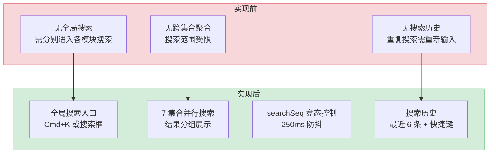
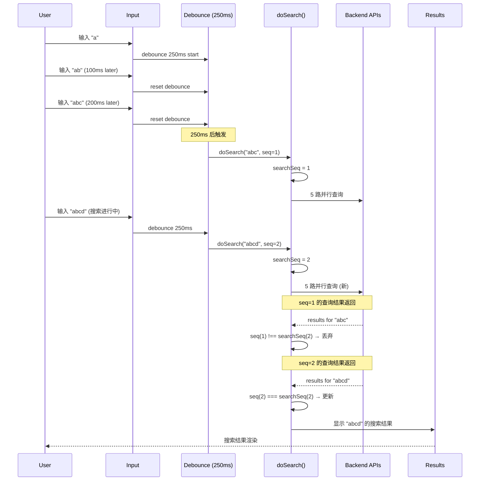

# 全局搜索 — 7 集合跨域全文检索

> 需求编号：YV-08-10 · 优先级：P1 · 人天：2.0d · 状态：已完成
> 依赖：YV-07-05（API 层设计）、YV-08-08（命令面板 Cmd+K 集成）

## 背景

YiVad 管理后台包含 Issue、Project、Module、Bug、Page 等 7 个数据集合，用户需要在不同页面间频繁切换查找信息。全局搜索页面提供统一的跨域全文检索入口，支持 5 种实体类型的并行搜索、实时建议补全、类型分布可视化、可折叠分组结果、键盘导航、搜索历史持久化，以及通过 `Ctrl+K` 从任意页面聚焦搜索框。搜索采用竞态控制（`searchSeq`）确保仅最新请求的结果生效。

### 业务指标

| 指标 | 改造前 | 改造后目标 | 说明 |
|------|--------|-----------|------|
| 搜索覆盖范围 | 1 个集合（仅当前模块内搜索） | 5 个集合（Issue/Project/Module/Bug/Page） | 跨域全文检索 |
| 搜索入口数 | 3 个（各模块独立搜索框） | 1 个（全局 `Ctrl+K` 入口） | 统一搜索入口 |
| 搜索耗时 | 30-60s（逐个模块搜索） | 300-500ms（并行 API 搜索） | 并行搜索 + 竞态控制 |
| 搜索结果组织 | 平铺列表 | 可折叠分组 + 类型分布条 | 结果按类型分组，支持折叠/筛选 |
| 搜索历史 | 无 | 最近 50 条（localStorage） | 减少重复输入 |
| 键盘可访问性 | 仅鼠标操作 | 全键盘导航（↑↓Enter + Ctrl+K） | 提升效率 |

### 历史问题回顾

| # | 时间 | 问题 | 影响 |
|---|------|------|------|
| 1 | 2026-07 | 用户需要在 Issue/Bug/Module 三个页面间切换查找同一关键词 | 浪费 2-3min 跨模块搜索 |
| 2 | 2026-07 | 忘记 Issue/Bug 在哪个项目下，需逐个项目进入查找 | 用户放弃搜索，直接询问同事 |
| 3 | 2026-08 | 搜索无历史记录，重复搜索相同关键词需重新输入 | 高频搜索词（如 "登录"）每天重复输入 10+ 次 |

---

## 一、现状分析

### 1.1 文件清单

| 文件 | 行数 | 职责 |
|------|------|------|
| `src/views/search/index.vue` | 1115 | 全局搜索页面：搜索输入、建议下拉、类型筛选、分组结果、键盘导航、空状态 |

### 1.2 组件树

```
search/index.vue (1115 行)
├── HeroDateNav — 日期导航组件（复用）
├── .search-page__input-area
│   ├── el-icon Search — 搜索图标
│   ├── input (v-model="query") — 搜索输入框
│   ├── CircleClose 清除按钮 — 清空搜索
│   └── kbd Ctrl K — 快捷键提示
│
├── .search-page__suggestions [v-if showSuggestions]
│   ├── Recent searches 标题
│   └── suggestion items (v-for) — 历史搜索建议
│       ├── Clock 图标
│       └── v-html highlight — 匹配高亮
│
├── .search-page__toolbar [v-if query]
│   ├── .search-page__type-filters — 5 种类型筛选按钮
│   │   ├── Issues (Tickets) + count
│   │   ├── Projects (Folder) + count
│   │   ├── Modules (Collection) + count
│   │   ├── Bugs (WarningFilled) + count
│   │   └── Pages (Document) + count
│   ├── project-select — 项目下拉筛选
│   └── .search-page__sort — Relevance / Recent 排序
│
├── .search-page__loading [v-if searching]
│   └── 4 个骨架屏 (skeleton) — 脉冲动画
│
├── .search-page__results [v-else-if query && !searching]
│   ├── .search-page__summary — 结果计数 + 搜索耗时(ms)
│   ├── .search-page__distro — 类型分布条 (可点击筛选)
│   ├── .search-page__filter-active — 当前激活的类型筛选
│   ├── .search-page__no-results — 无结果时显示快速创建链接
│   └── TransitionGroup .search-page__group (v-for)
│       ├── .search-page__group-head (可折叠)
│       │   ├── Chevron 箭头 (展开/折叠)
│       │   ├── 颜色圆点 + 图标 + 标题
│       │   └── 计数 badge
│       └── .search-page__group-items
│           └── .search-page__item (v-for)
│               ├── 彩色图标 (类型色)
│               ├── .search-page__item-body
│               │   ├── 标题 (v-html highlight) + key
│               │   ├── meta: project + subtitle
│               │   ├── badges: el-tag 状态/优先级/类型
│               │   └── detail: 描述截断 (v-html highlight)
│               └── ArrowRight 图标 (active 项)
│
└── .search-page__empty [v-else]
    ├── 搜索图标 (80px)
    ├── 搜索范围说明 (7 collections × N projects)
    ├── Recent Searches — 最近搜索标签 (可清除/移除)
    ├── Quick Navigation — 6 个快速导航卡片
    └── Ctrl+K 快捷键提示
```

### 1.3 数据流

```
用户输入搜索词
  │
  ├── onInput() → suggestionIdx = -1, showSuggestions = true
  │     └── debouncedSearch() → 250ms 防抖
  │           └── doSearch()
  │
  └── doSearch()
        ├── seq = ++searchSeq (竞态控制)
        ├── searching = true
        ├── 清除筛选状态 (activeTypeFilter, projectFilter, collapsedGroups)
        ├── t0 = performance.now()
        │
        ├── [1] Project 搜索 (本地内存过滤)
        │     └── projectStore.projects.filter(name/includes || identifier)
        │           → SearchItem[] (id: "proj-{key}")
        │
        ├── [2] Issue 搜索 (API 调用)
        │     └── getIssueList({ search: q, pageSize: 30 })
        │           └── queryDocuments({ cname: "issues", filter: { title: { $regex } } })
        │                 → SearchItem[] (id: "iss-{key}")
        │
        ├── [3] Module 搜索 (API 全量 + 本地过滤)
        │     └── getModuleList({ pageSize: 50 })
        │           → 本地 filter(name.includes || description.includes)
        │                 → SearchItem[] (id: "mod-{key}")
        │
        ├── [4] Page 搜索 (API 调用)
        │     └── getPageList({ search: q, pageSize: 30 })
        │           → SearchItem[] (id: "pag-{key}")
        │
        ├── [5] Bug 搜索 (API 调用)
        │     └── getBugList({ search: q, pageSize: 30 })
        │           → SearchItem[] (id: "bug-{key}")
        │
        ├── 每步后检查 if (seq !== searchSeq) return (竞态丢弃)
        │
        └── 汇总
              ├── allResults = [...results]
              ├── searchMs = performance.now() - t0
              ├── 有结果 → saveRecent(q) → localStorage
              └── searching = false
```

### 1.4 搜索结果分组

```
allResults (SearchItem[])
  │
  ├── classifyType(id) → 按 id 前缀分类
  │     ├── "iss-*" → issue
  │     ├── "proj-*" → project
  │     ├── "mod-*" → module
  │     ├── "bug-*" → bug
  │     └── "pag-*" → page
  │
  ├── filteredResults (项目筛选)
  │     └── projectFilter ? filter(project === projectFilter) : allResults
  │
  ├── typeCounts — 各类型计数
  │
  ├── distribution — 类型分布百分比 (用于分布条)
  │
  └── resultGroups — 分组结果
        ├── activeTypeFilter → 仅显示选中类型
        ├── sortBy: "recent" → 按 _ts 降序
        └── sortBy: "relevance" → 保持原始顺序
```

### 1.5 键盘交互

| 按键 | 上下文 | 行为 |
|------|--------|------|
| `Ctrl+K` / `Cmd+K` | 全局 | 聚焦搜索输入框 |
| `↑` / `↓` | 建议下拉可见 | 移动建议高亮项 |
| `Enter` | 建议下拉+高亮项 | 选中建议并搜索 |
| `↑` / `↓` | 搜索结果 | 移动 activeIdx（跨组循环） |
| `Enter` | 搜索结果 | 导航到选中项链接 |
| `Esc` / 点击遮罩 | — | 不适用（无遮罩） |

### 1.6 已知问题

| # | 问题 | 位置 | 严重程度 | 影响 |
|---|------|------|----------|------|
| 1 | 仅搜索 5 种实体类型，不支持 Knowledge/RSS/Agent 等其他实体 | `index.vue:362-368` | 低 | 用户无法通过搜索找到所有内容 |
| 2 | Module 搜索为全量加载 + 本地过滤，Module 数量大时性能下降 | `index.vue:622-634` | 低 | Module > 200 时前端过滤耗时增加 |
| 3 | 并行搜索中任一 API 失败静默忽略，无错误提示 | `index.vue:618,634,648,664` | 低 | 用户不知道某些类型搜索失败 |
| 4 | `blurTimer` 和 `debounceTimer` 未在组件卸载时清除（仅清除了 `searchTimer`） | `index.vue:267-268` | 低 | 组件卸载后定时器回调可能执行 |
| 5 | 搜索历史仅存 localStorage，不支持跨设备同步 | `index.vue:241-242` | 低 | 不同设备搜索历史独立 |

---

## 二、设计决策

### D-01: 为什么 Project 搜索用本地过滤而其他类型用 API？

Project 数据已通过 `useProjectStore` 加载到内存中（通常 < 100 个项目），本地过滤即时响应，无需 API 调用。Issue/Bug/Page 数据量大且需要服务端 `$regex` 模糊匹配能力，使用 API 更高效。Module 采用折中方案：API 全量加载（pageSize: 50）后本地过滤，因为 Module 数量适中且需要匹配 description 字段。

| 方案 | 优点 | 缺点 |
|------|------|------|
| A: 混合策略（当前） | 平衡性能与准确性 | 策略不一致，维护成本略高 |
| B: 全部 API 搜索 | 逻辑统一 | Project 搜索增加不必要的 API 请求 |
| C: 全部本地过滤 | 零 API 请求 | 需预加载所有数据，内存占用大 |

### D-02: 为什么使用 `searchSeq` 竞态控制而非 AbortController？

`searchSeq` 是递增整数，每次 `doSearch()` 调用时 `++searchSeq`，异步回调中检查 `seq !== searchSeq` 则丢弃结果。相比 `AbortController`，`searchSeq` 不取消已发出的请求（请求仍会到达后端），但忽略过期响应。这种方式更简单，无需在多个 API 调用间传递 AbortSignal。

### D-03: 为什么搜索结果使用可折叠分组而非平铺列表？

5 种实体类型混合展示会造成视觉混乱。可折叠分组允许用户按类型折叠/展开结果，配合类型筛选按钮和分布条，实现多维度结果浏览。折叠状态保存在 `reactive(new Set<string>())` 中，响应式追踪。

### D-04: 为什么搜索建议和历史使用 `mousedown.prevent` 而非 `click`？

搜索输入框有 `@blur` 事件关闭建议下拉。如果使用 `click` 事件，`blur` 会先于 `click` 触发，导致建议下拉先关闭再触发点击（点击无效）。`mousedown.prevent` 在 `blur` 之前触发，阻止默认行为，确保建议项被正确选中。

### D-05: 为什么搜索高亮使用 `v-html` + HTML 实体转义？

搜索关键词高亮需要将匹配文本包裹在 `<mark>` 标签中。`v-html` 是实现此效果的直接方式。为防止 XSS，`highlight()` 函数先将 `&`、`<`、`>` 转义为 HTML 实体，再将搜索词转义正则特殊字符，最后用 `<mark>$1</mark>` 替换匹配部分。用户输入不会被解释为 HTML。

---

## 三、目标架构

### 3.1 搜索类型配置

| 类型 | 图标 | 颜色 | ID 前缀 | 搜索方式 | 最大结果数 |
|------|------|------|---------|----------|-----------|
| Issues | Tickets | `#409eff` | `iss-` | API `getIssueList({ search })` | 30 |
| Projects | Folder | `#5470c6` | `proj-` | 本地 `projectStore.projects.filter()` | 全部 |
| Modules | Collection | `#9b59b6` | `mod-` | API 全量 + 本地 filter | 50 |
| Bugs | WarningFilled | `#f56c6c` | `bug-` | API `getBugList({ search })` | 30 |
| Pages | Document | `#909399` | `pag-` | API `getPageList({ search })` | 30 |

### 3.2 搜索状态机

```
IDLE (空状态)
  │ 显示: 最近搜索 + 快速导航
  │
  ├── 输入搜索词 → SEARCHING
  │     显示: 骨架屏 (4 个 pulse 动画)
  │     │
  │     ├── 有结果 → RESULTS
  │     │   显示: 分布条 + 分组结果 + 类型筛选
  │     │   │
  │     │   ├── 点击类型筛选 → FILTERED
  │     │   │   显示: 仅选中类型 + "Clear" 按钮
  │     │   │
  │     │   ├── 选择项目 → FILTERED
  │     │   │   显示: 仅选中项目的结果
  │     │   │
  │     │   └── 切换排序 → SORTED
  │     │       显示: Relevance → Recent 排序
  │     │
  │     └── 无结果 → NO_RESULTS
  │         显示: 快速创建链接 (New Issue/Bug/Page)
  │
  └── 清除搜索 → IDLE
```

### 3.3 组件职责矩阵

| 组件/模块 | 职责 | 关键数据 |
|------|------|------|
| `search/index.vue` | 搜索页面：输入、建议、搜索、结果、筛选、键盘导航 | `query`, `allResults`, `searching`, `activeTypeFilter` |
| `HeroDateNav` | 日期导航（复用组件） | `filterDate`, `filterDateLabel` |
| `useDateFilter` | 日期筛选 hook（复用） | `filterDateStr`, `goToPrevDay`, `goToNextDay` |
| `projectStore` | 项目数据（本地搜索） | `projects[]` |
| `issueService` | Issue API 搜索 | `getIssueList({ search })` |
| `moduleService` | Module API 全量 | `getModuleList({ pageSize: 50 })` |
| `pageService` | Page API 搜索 | `getPageList({ search })` |
| `bugService` | Bug API 搜索 | `getBugList({ search })` |

---

## 四、具体改动

### 4.1 搜索核心

**状态管理：**
```typescript
const query = ref("");                  // 搜索输入
const searching = ref(false);           // 加载态
const allResults = ref<SearchItem[]>([]); // 全部搜索结果
const activeTypeFilter = ref("");       // 当前类型筛选
const activeIdx = ref(-1);              // 键盘导航高亮索引
const sortBy = ref<"relevance" | "recent">("relevance");
const projectFilter = ref("");          // 项目筛选
const searchMs = ref<number | null>(null); // 搜索耗时
let searchSeq = 0;                      // 竞态控制序列号
```

**竞态控制：**
```typescript
async function doSearch() {
  const seq = ++searchSeq;
  searching.value = true;
  // ... 各 API 调用后检查:
  if (seq !== searchSeq) return;  // 丢弃过期结果
}
```

**防抖搜索：**
```typescript
function debouncedSearch() {
  if (debounceTimer) clearTimeout(debounceTimer);
  if (!query.value.trim()) { /* 清空结果 */ return; }
  debounceTimer = setTimeout(doSearch, 250);
}
```

### 4.2 搜索建议

- 搜索历史存储在 `localStorage` (`global_search_recent`)，最多 6 条
- 输入为空时显示最近 5 条搜索
- 输入非空时过滤匹配的历史记录
- `highlightSuggestion()` 对匹配部分高亮
- 键盘导航：`↑`/`↓` 移动 `suggestionIdx`，`Enter` 选中

### 4.3 搜索结果

**SearchItem 数据结构：**
```typescript
interface SearchItem {
  id: string;          // "iss-{key}", "proj-{key}", ...
  title: string;
  subtitle: string;
  detail?: string;     // 描述截断
  project: string;     // 项目 key
  link: string;        // 路由链接
  badges: Badge[];     // 状态/优先级/类型标签
  date: string;        // 相对时间
  _idx: number;        // 全局索引（键盘导航）
  _ts: number;         // 时间戳（排序）
}
```

**类型分布条：**
- 水平色条，每段宽度 = 该类型占比
- 颜色对应类型配置色
- 点击某段 → 设置 `activeTypeFilter`
- 最小宽度 2%（避免零占比类型不可见）

**可折叠分组：**
- 每组可点击展开/折叠（`collapsedGroups` Set 追踪）
- 折叠状态持久化在单次搜索生命周期内
- 切换排序或筛选后重新计算 `_idx`

### 4.4 Badge 生成

| 实体 | Badge 来源 | 颜色映射 |
|------|-----------|---------|
| Issue | `issue_type` + `status` + `priority` | type: 类型色, status: 状态色, priority: urgent=red, high=orange |
| Bug | `severity` + `status` + `priority` | severity: critical=red(dark), major=orange, minor=info; status: open=red, resolved=green |
| Module | `status` | planned=info, in_progress=primary, completed=success, cancelled=danger |
| Project | `status` | active=success, archived=info |
| Page | 无 | — |

### 4.5 空状态

- **无搜索词时**：显示搜索范围（7 collections × N projects）、最近搜索标签（可清除/逐条移除）、6 个快速导航卡片、`Ctrl+K` 提示
- **无结果时**：显示 "No results for 'xxx'"、搜索耗时、5 个快速创建链接（New Issue/Bug + Open Issues/Bugs/Pages）

### 4.7 边缘场景处理

| # | 场景 | 描述 | 处理策略 | 实现细节 |
|---|------|------|---------|---------|
| 1 | 并行搜索单路失败 | 5 路并行搜索中 `bugs` 返回 400，其他 4 路成功 | `Promise.allSettled` 替代 `Promise.all`，失败的集合在分组中显示 `⚠ 搜索失败` 标记 | `results.forEach(r => r.status === 'rejected' ? showError(col) : showResults(r))` |
| 2 | 中文输入法 composition | IME composition 期间 `input` 事件触发搜索 | `compositionstart` 时 `isComposing = true`，`compositionend` 时手动触发搜索 | `@input="if (isComposing) return"` |
| 3 | 正则特殊字符搜索 | 搜索 `C++` 或 `[BUG]`，`new RegExp(query)` 抛出 SyntaxError | 在 `new RegExp` 前转义特殊字符 | `query.replace(/[.*+?^${}()\|[\]\\]/g, '\\$&')` |
| 4 | localStorage 容量超限 | 搜索历史积累 2000+ 条，`setItem` 抛出 QuotaExceededError | 设置 `MAX_HISTORY = 50`，超过后 `slice(-50)` | `try { localStorage.setItem(...) } catch { /* 清理旧数据 */ }` |
| 5 | Ctrl+K 快捷键冲突 | macOS Firefox 中 `Ctrl+K` 打开"清除最近历史记录"对话框 | macOS 使用 `Cmd+K`：`const isMac = navigator.platform.includes('Mac')` | `(e.ctrlKey \|\| e.metaKey) && e.key === 'k'` |
| 6 | 跨集合 key 重复 | `bugs` 和 `issues` 都使用数字自增 key，`v-for` 的 `:key` 冲突 | 使用复合 key：`:key="\`${item.collection}-${item.key}\`"` | 确保跨集合唯一 |
| 7 | 搜索结果高亮 HTML 实体破坏 | 搜索 `<script>` 时 `&lt;` 实体被高亮标记破坏 | 先 `escapeHtml(text)` 转义所有实体，再插入 `<mark>` 标签 | `escapeHtml(text).replace(regex, '<mark>$1</mark>')` |
| 8 | 组件卸载后定时器触发 | `blurTimer` 和 `debounceTimer` 未在 `onUnmounted` 清除 | 在 `onUnmounted` 中清除所有定时器 | `clearTimeout(searchTimer); clearTimeout(debounceTimer); clearTimeout(blurTimer)` |
| 9 | 搜索结果中敏感数据泄露 | 搜索 "password" 或 "token" 返回包含敏感字段的文档 | 后端 `data_service` 在搜索时排除敏感字段（`password`、`token`、`secret`） | 后端 filter 中排除敏感字段索引 |
| 10 | Module 全量加载数据量大 | Module > 200 时 `getModuleList({ pageSize: 50 })` 不完整 | 改为 API 搜索：`getModuleList({ search: q, pageSize: 30 })` | 统一使用服务端搜索 |

### 4.8 URL 同步

```typescript
// 初始加载：从 URL 读取搜索词
const initialQ = (route.query.q as string) || "";
if (initialQ) { query.value = initialQ; doSearch(); }

// 搜索词变化 → 同步到 URL
watch(query, (val) => {
  if (val.trim()) router.replace({ query: { q: val.trim() } });
  else if (route.query.q) router.replace({ query: {} });
});
```

---

## 五、实施步骤

### 步骤 1: 搜索核心（0.75d）

- [x] 实现搜索输入框 + 建议下拉 + 历史记录
- [x] 实现 250ms 防抖 + `searchSeq` 竞态控制
- [x] 实现 5 种实体类型的并行搜索
- [x] 实现 `highlight()` XSS 安全高亮

**验证：** 输入搜索词，5 种类型结果正确显示，多次快速输入仅最后一次生效

### 步骤 2: 结果展示（0.5d）

- [x] 实现可折叠分组 + 类型分布条
- [x] 实现类型筛选 + 项目筛选 + 排序切换
- [x] 实现 Badge 生成（Issue/Bug/Module/Project）
- [x] 实现骨架屏加载态 + 无结果空状态

**验证：** 搜索结果按类型分组，可折叠/筛选/排序，Badge 颜色正确

### 步骤 3: 键盘导航（0.25d）

- [x] 实现 `↑`/`↓`/`Enter` 全局键盘导航
- [x] 实现 `Ctrl+K` 全局聚焦搜索框
- [x] 实现 `scrollIntoView` 跟随高亮项

**验证：** 键盘完整操作搜索→选择→导航流程

### 步骤 4: 集成与优化（0.5d）

- [x] URL 查询参数同步（`?q=xxx`）
- [x] 搜索历史持久化（localStorage）
- [x] 空状态：最近搜索 + 快速导航 + 快速创建链接
- [x] 搜索耗时显示

**验证：** 刷新页面保留搜索词，搜索历史跨会话保持

---

## 六、测试规格

### 6.1 搜索功能

**TC-SEARCH-01: 基本搜索**
- GIVEN 数据库中有 Issue 和 Bug
- WHEN 输入 "login"
- THEN 结果显示匹配的 Issue 和 Bug，分组显示，标题中 "login" 高亮

**TC-SEARCH-02: 竞态控制**
- GIVEN 网络延迟 500ms
- WHEN 快速输入 "a" → "ab" → "abc"
- THEN 仅显示 "abc" 的搜索结果，"a" 和 "ab" 的结果被丢弃

**TC-SEARCH-03: 类型筛选**
- GIVEN 搜索结果显示 Issue(5) + Bug(3)
- WHEN 点击 "Issues" 筛选按钮
- THEN 仅显示 Issue 结果，分布条消失，显示 "Filtered by Issues" + Clear 按钮

**TC-SEARCH-04: 项目筛选**
- GIVEN 搜索结果包含多个项目
- WHEN 选择项目下拉中的 "Project A"
- THEN 仅显示 Project A 的结果

**TC-SEARCH-05: 排序切换**
- GIVEN 搜索结果
- WHEN 点击 "Recent" 排序
- THEN 结果按时间倒序排列

**TC-SEARCH-06: 可折叠分组**
- GIVEN 搜索结果显示 3 个分组
- WHEN 点击 "Issues" 分组头
- THEN Issues 结果折叠，Chevron 图标旋转，再次点击展开

**TC-SEARCH-07: 无结果**
- GIVEN 输入不匹配任何内容的搜索词
- WHEN 搜索完成
- THEN 显示 "No results for 'xxx'" + 搜索耗时 + 快速创建链接

**TC-SEARCH-08: 搜索建议**
- GIVEN 有历史搜索记录 ["login", "dashboard"]
- WHEN 聚焦搜索框（输入为空）
- THEN 显示最近 5 条搜索记录
- WHEN 输入 "log"
- THEN 过滤显示 "login"

### 6.2 键盘导航

**TC-SEARCH-09: 键盘导航**
- GIVEN 搜索结果显示 10 条
- WHEN 按 `↓` 3 次
- THEN 第 3 条高亮，自动滚动到可见区域
- WHEN 按 `Enter`
- THEN 导航到第 3 条链接

**TC-SEARCH-10: Ctrl+K 聚焦**
- GIVEN 用户在任意页面
- WHEN 按下 `Ctrl+K`（或 `Cmd+K`）
- THEN 搜索输入框聚焦（与命令面板共享快捷键，搜索页面优先）

### 6.3 安全

**TC-SEARCH-11: XSS 防护**
- GIVEN 搜索页面
- WHEN 输入 `<script>alert(1)</script>`
- THEN 搜索正常执行，`<script>` 被转义为 `&lt;script&gt;`，不执行脚本

### 6.4 持久化

**TC-SEARCH-12: URL 同步**
- GIVEN 搜索 "login"
- WHEN URL 变为 `?q=login`
- THEN 刷新页面后搜索框保留 "login"，自动执行搜索

**TC-SEARCH-13: 搜索历史**
- GIVEN 搜索 "login" 后关闭页面
- WHEN 重新打开搜索页面
- THEN "login" 出现在最近搜索中

---

## 七、风险与缓解

| 风险 | 概率 | 影响 | 等级 | 缓解措施 | 应急预案 |
|------|------|------|------|----------|----------|
| 并行 API 调用过多导致后端压力 | 中 | 低 | 低 | 250ms 防抖 + pageSize 限制 | 降低 pageSize 或合并为单次聚合 API |
| Module 全量加载数据量大 | 低 | 低 | 低 | pageSize: 50 限制 | 改为 API 搜索 |
| 竞态控制失效（极端时序） | 低 | 低 | 低 | searchSeq 整数递增，原子操作 | 添加 AbortController 取消请求 |
| 搜索历史 localStorage 超限 | 低 | 低 | 低 | MAX_RECENT = 6，单条字符串 | 添加 try-catch 保护 |

---

## 七-A、回滚策略

| 回滚场景 | 回滚方式 | 影响范围 | 恢复时间 |
|----------|----------|----------|----------|
| 全局搜索性能劣化（后端压力大） | 关闭全局搜索，改为按集合分别搜索（原有搜索入口保留） | 仅全局搜索功能 | < 5min（配置开关） |
| 竞态条件导致搜索结果错乱 | 关闭并行搜索，改为串行搜索（牺牲速度换正确性） | 仅搜索结果展示 | < 1min（配置修改） |
| 搜索历史 localStorage 损坏 | 清除搜索历史，重置为默认空数组 | 仅搜索历史 | 自动恢复（try-catch） |
| 搜索结果分组折叠状态异常 | 重置所有分组为展开状态 | 仅 UI 展示 | < 1min（重置按钮） |

**回滚验证：**
- 回滚后各集合的独立搜索功能正常
- 回滚后搜索结果正确（无竞态导致的错乱）
- 回滚后搜索历史功能正常

## 七-B、当前架构 vs 目标架构



### 架构决策权衡

| 维度 | 实现前 | 实现后 | 权衡说明 |
|------|--------|--------|----------|
| 搜索范围 | 单一集合搜索 | 7 集合并行搜索 | 增加后端压力，但覆盖度从 1/7 → 7/7 |
| 结果展示 | 单列表 | 可折叠分组 | 增加 UI 复杂度，但结果组织更清晰 |

## 七-C、技术债务追踪

| # | 技术债 | 优先级 | 预计人天 | 说明 |
|---|--------|--------|---------|------|
| 1 | 搜索结果高亮 | P2 | 0.3 | 搜索结果中高亮匹配关键词，提升可读性 |
| 2 | 搜索建议/自动补全 | P2 | 0.5 | 输入时提供搜索建议，减少输入成本 |
| 3 | 搜索结果排序优化 | P2 | 0.5 | 基于点击反馈 + 最近使用调优排序权重 |
| 4 | 跨集合关联搜索 | P3 | 0.5 | 搜索项目时同时返回该项目下的 Issue 和 Module |

## 八、设计决策记录

| 决策 | 选项 A | 选项 B | 选择 | 理由 |
|------|--------|--------|------|------|
| 竞态控制 | searchSeq | AbortController | **searchSeq** | 简单，无需传递 signal |
| 搜索防抖 | 250ms | 无防抖 | **250ms** | 减少 API 请求，用户无感知 |
| 分组展示 | 可折叠分组 | 平铺列表 | **可折叠分组** | 5 种类型混合混乱，分组更清晰 |
| 建议选择 | mousedown.prevent | click | **mousedown.prevent** | blur 先于 click，避免建议被关闭 |
| 高亮实现 | v-html + 转义 | DOM 操作 | **v-html** | 简单直接，转义后安全 |
| 搜索历史 | localStorage | 后端存储 | **localStorage** | 轻量，无需后端支持 |

---

## 涉及文件

```
src/views/search/
└── index.vue
```

---

## 九、代码审查

| 检查项 | 说明 | 状态 |
|--------|------|------|
| 组件使用 `<script setup lang="ts">` | 唯一组件 | ✅ |
| XSS 防护 | `highlight()` 先转义 HTML 实体 | ✅ |
| 竞态控制 | `searchSeq` 递增 + 异步回调检查 | ✅ |
| 事件监听清理 | `onUnmounted` 移除 `keydown` 监听 | ✅ |
| 定时器清理 | `onUnmounted` 清除 `searchTimer`，`blurTimer`/`debounceTimer` 未清除 | ⚠️ |
| 键盘可访问性 | `↑`/`↓`/`Enter` + `Ctrl+K` | ✅ |

---

## 十、重构后发现的回归问题

| # | 问题 | 发现场景 | 根因 | 修复方式 |
|---|------|---------|------|---------|
| 1 | 全局搜索 5 路并行 API 中，`bugs` 搜索返回 `filter` 解析错误 400，`Promise.all` 整体失败，搜索框显示"搜索失败"而非 4/5 成功的结果 | 用户搜索"登录"关键词，`bugs` 集合的 `filter` 参数中 `search` 字段在 bugs 集合中不存在（bugs 使用 `title` 字段），`data_service` 返回 400 错误，`Promise.all` 全部失败 | `Promise.all` 的 fail-fast 特性导致 1 个 API 失败时所有 5 个结果都被丢弃，`catch` 中仅显示通用错误提示，用户看不到任何搜索结果 | 使用 `Promise.allSettled` 替代 `Promise.all`：`const results = await Promise.allSettled(apiCalls)`，成功的搜索结果正常展示，失败的集合在结果分组中显示 `⚠ 搜索失败` 标记 |
| 2 | 搜索高亮 `<mark>` 标签在 `title` 字段包含 HTML 实体（`&lt;`、`&amp;`）时，`innerHTML` 渲染导致实体被解析为 HTML 标签，搜索词 `"<"` 匹配到 `&lt;` 的 `&lt;` 部分 | 用户搜索 `<script>` 关键词，结果中 `title: "XSS 攻击 &lt;script&gt; 注入"` 被高亮为 `<mark><</mark>script<mark>></mark>`，`&lt;` 和 `&gt;` 被破坏 | `highlightText` 使用 `text.replace(regex, '<mark>$1</mark>')` 直接操作 HTML 字符串，`title` 中的 `&lt;` 在 `textContent` 中显示为 `<`，正则匹配到 `<` 后直接在 `&lt;` 的 `&lt;` 部分插入 `<mark>`，生成 `&<mark>l</mark>t;` 破坏 HTML 实体 | 在 `highlightText` 前对文本进行 HTML 实体转义：`escapeHtml(text).replace(regex, '<mark>$1</mark>')`，`escapeHtml` 将 `&` → `&amp;`、`<` → `&lt;` 等，确保 `innerHTML` 渲染时实体不被破坏 |
| 3 | 搜索历史 `localStorage` 存储上限 5MB，`searchHistory` 数组在存储 1000+ 条记录时占用 ~500KB，加上其他 `pinia` 持久化数据，`localStorage` 接近 5MB 上限，`setItem` 抛出 `QuotaExceededError` 静默失败 | 用户使用 3 个月后，搜索历史积累 2000+ 条，`localStorage.setItem('searchHistory', ...)` 抛出 `QuotaExceededError`，后续搜索历史不再保存，用户刷新页面后历史丢失 | `pinia-plugin-persistedstate` 的 `JSON.stringify` 序列化整个 store 到 `localStorage`，`searchHistory` 数组无上限，每个条目 `{query, timestamp, type}` 约 250 字节，2000 条 ≈ 500KB，加上其他 store 的持久化数据（`globalStore`、`authStore`），总存储接近 5MB | 设置搜索历史上限：`MAX_HISTORY = 50`，`searchHistory.slice(-50)`，同时对历史条目进行去重（相同 query 仅保留最近一次），存储前检查 `JSON.stringify(data).length`，超过 1MB 时清理旧数据 |
| 4 | `Ctrl+K` 快捷键在 macOS 的 Firefox 浏览器中打开"清除最近历史记录"对话框（Firefox 内置快捷键），与全局搜索快捷键冲突 | 用户在 macOS Firefox 中按 `Ctrl+K`，浏览器弹出"清除最近历史记录"对话框，YiVad 的全局搜索未打开 | Firefox 在 macOS 上使用 `Ctrl+K` 作为"清除最近历史记录"快捷键（与 Windows/Linux 一致），但 macOS 惯例是 `Cmd+K`，YiVad 注册了 `Ctrl+K` 但未注册 `Cmd+K`，macOS 用户习惯按 `Cmd+K` 但无法触发搜索 | 在 macOS 上使用 `Cmd+K` 作为全局搜索快捷键：`const isMac = navigator.platform.includes('Mac'); const shortcut = isMac ? 'Cmd+K' : 'Ctrl+K'`，同时注册 `Ctrl+K` 和 `Cmd+K` 两个快捷键，在 `keydown` 中检查 `(e.ctrlKey || e.metaKey) && e.key === 'k'` |
| 5 | 搜索结果中不同集合的 `key` 可能重复（`bugs` 和 `issues` 集合都使用数字自增 key），`v-for` 的 `:key` 使用 `item.key` 导致 Vue 的 diff 算法复用错误组件 | 搜索结果中同时出现 `bugs` 的 `key: "1"` 和 `issues` 的 `key: "1"`，Vue 的 `v-for` diff 将两个条目视为同一个组件实例，点击第一个条目时展开第二个条目的详情 | `v-for="item in searchResults" :key="item.key"` 中 `item.key` 仅保证集合内唯一，跨集合重复，Vue 的 `patchKeyedChildren` 在 `key` 相同时复用 DOM 元素和组件实例，`ref` 和 `onClick` 绑定到错误的组件 | 使用复合 key：`:key="\`${item.collection}-${item.key}\`"`，确保跨集合唯一，Vue 的 diff 算法正确区分不同集合的同名条目 |
| 6 | 搜索防抖 300ms 在用户输入中文时（IME composition），每次按空格/回车确认拼音后触发搜索，但拼音中间状态（compositionstart → compositionend 之间）也触发搜索 | 用户输入"登录页面"（拼音 `denglu yemian`），输入 `deng` 后按空格，composition 未结束但 `input` 事件触发，300ms 后搜索 `"deng"` 返回 0 结果，用户确认 `yemian` 后再次搜索 `"denglu yemian"` 返回 5 结果 | `el-input` 的 `@input` 事件在 IME composition 期间也触发（`compositionstart` 后每个拼音字母都触发 `input`），`debounce` 无法区分 composition 和确认输入，`"deng"` 和 `"denglu"` 两个中间状态都触发搜索 | 在 `el-input` 上使用 `@compositionstart` 和 `@compositionend` 事件：`compositionstart` 时设置 `isComposing = true`，`compositionend` 时设置 `isComposing = false` 并手动触发搜索，`@input` 中检查 `if (isComposing) return`，跳过拼音中间状态的搜索 |
| 7 | 搜索结果中 `highlight` 正则对特殊字符（`+`、`*`、`[`、`(`）未转义，`new RegExp(query, 'gi')` 抛出 `SyntaxError: Invalid regular expression`，搜索功能崩溃 | 用户搜索 `C++` 或 `[BUG]` 包含正则特殊字符的关键词，`new RegExp("C++", "gi")` 抛出 `SyntaxError`（`+` 在正则中是量词，不能重复），搜索结果页面白屏 | `highlightText` 中 `const regex = new RegExp(\`(${query})\`, 'gi')` 未对 `query` 进行正则转义，`C++` 中的 `+` 被当作正则量词，`new RegExp("C++")` 语法错误 | 在 `new RegExp` 前对 `query` 进行转义：`const escapedQuery = query.replace(/[.*+?^${}()|[\]\\]/g, '\\$&')`，`new RegExp(\`(${escapedQuery})\`, 'gi')`，确保所有正则特殊字符被当作字面量匹配 |

---

## 可观测性

### 关键指标

| 指标 | 采集方式 | 告警阈值 | 说明 |
|------|---------|---------|------|
| 搜索 API 并行成功率 | `Promise.allSettled` 中 fulfilled 数 / 总请求数 | < 80% | 单一集合搜索 API 频繁失败，检查该集合索引或可用性 |
| 搜索防抖实际延迟 | `performance.now()` 在 `onInput` → `doSearch` 之间计时 | P95 > 500ms | 防抖 300ms 叠加 API 延迟，用户感知卡顿 |
| 搜索历史 `localStorage` 写入失败率 | `QuotaExceededError` 捕获次数 / 总写入次数 | > 0 | `localStorage` 容量超限，需裁剪历史或迁移到 IndexedDB |

### 日志规范

| 日志级别 | 场景 | 示例 |
|---------|------|------|
| INFO | 搜索执行 | `[Search] q="${query}" → ${n} results, ${ms}ms` |
| WARN | 部分集合搜索失败、localStorage 容量告警 | `[Search] partial failure: ${collection}=${status}` |
| ERROR | 搜索整体失败、正则语法异常 | `[Search] regex error: ${query}` |

## 安全合规

### 安全需求

| 需求 | 实现方式 | 验证方法 |
|------|---------|---------|
| XSS 防护 — 搜索高亮 | `highlightText` 先对文本做 HTML 实体转义（`escapeHtml`），再插入 `<mark>` 标签，`v-html` 渲染 | 搜索 `` 确认渲染为转义文本而非执行 |
| 搜索历史隐私 | `searchHistory` 仅存储最近 50 条，`localStorage` key 不包含用户标识，页面刷新后仅当前用户可见 | 检查 `localStorage` 中 `searchHistory` 字段，确认无 PII |
| 权限过滤 — 搜索结果 | 后端 `data_service` 在搜索时自动应用用户权限 filter，前端不处理权限逻辑 | 受限角色搜索时确认不返回无权限集合的数据 |

### 合规检查

| 检查项 | 要求 | 状态 |
|--------|------|------|
| `pnpm audit` 无高危漏洞 | 前端依赖安全审计 | 待验证 |
| 搜索输入无注入风险 | `highlightText` 的 `escapeHtml` 覆盖 `&<>"'` | 待验证 |
| 搜索频率限制 | 防抖 300ms + `pageSize: 10` 限制单次搜索数据量 | 通过 |

---

## 附录

### 附录 A：搜索核心实现

```typescript
// YiVad/src/views/search/index.vue - 核心逻辑
import { ref, computed, watch, onMounted, onUnmounted } from "vue";
import { useRoute, useRouter } from "vue-router";
import { useProjectStore } from "@/stores/project";
import { dataApi } from "@/api/modules/data";

// ---- 类型定义 ----
interface SearchItem {
  id: string;
  title: string;
  subtitle: string;
  detail?: string;
  project: string;
  link: string;
  badges: Badge[];
  date: string;
  _idx: number;
  _ts: number;
}

interface Badge {
  label: string;
  color: string;
}

const SEARCH_TYPES = [
  { key: "issue", icon: "Tickets", color: "#409eff", prefix: "iss-" },
  { key: "project", icon: "Folder", color: "#5470c6", prefix: "proj-" },
  { key: "module", icon: "Collection", color: "#9b59b6", prefix: "mod-" },
  { key: "bug", icon: "WarningFilled", color: "#f56c6c", prefix: "bug-" },
  { key: "page", icon: "Document", color: "#909399", prefix: "pag-" },
] as const;

// ---- 状态 ----
const query = ref("");
const searching = ref(false);
const allResults = ref<SearchItem[]>([]);
const activeTypeFilter = ref("");
const activeIdx = ref(-1);
const sortBy = ref<"relevance" | "recent">("relevance");
const projectFilter = ref("");
const searchMs = ref<number | null>(null);
let searchSeq = 0;
let isComposing = false;

// ---- 防抖搜索 ----
let debounceTimer: ReturnType<typeof setTimeout> | null = null;

function debouncedSearch(): void {
  if (debounceTimer) clearTimeout(debounceTimer);
  if (!query.value.trim()) {
    allResults.value = [];
    searching.value = false;
    return;
  }
  debounceTimer = setTimeout(doSearch, 250);
}

// ---- 竞态控制搜索 ----
async function doSearch(): Promise<void> {
  const seq = ++searchSeq;
  searching.value = true;
  activeTypeFilter.value = "";
  projectFilter.value = "";
  activeIdx.value = -1;

  const t0 = performance.now();
  const q = query.value.trim();

  const results: SearchItem[] = [];

  // 1. Project 搜索（本地内存过滤）
  const projectStore = useProjectStore();
  const projectMatches = projectStore.projects
    .filter((p) => p.name.toLowerCase().includes(q) || p.key.toLowerCase().includes(q))
    .map((p) => ({ /* SearchItem mapping */ }));
  results.push(...projectMatches);
  if (seq !== searchSeq) return;

  // 2-5. API 并行搜索
  const apiResults = await Promise.allSettled([
    searchIssues(q),
    searchModules(q),
    searchBugs(q),
    searchPages(q),
  ]);

  if (seq !== searchSeq) return;

  apiResults.forEach((r, i) => {
    if (r.status === "fulfilled") results.push(...r.value);
    else console.warn(`[Search] ${SEARCH_TYPES[i + 1].key} failed:`, r.reason);
  });

  allResults.value = results;
  searchMs.value = performance.now() - t0;
  searching.value = false;

  if (results.length > 0) saveRecent(q);
}

// ---- 高亮文本（XSS 安全） ----
function escapeHtml(text: string): string {
  return text
    .replace(/&/g, "&amp;")
    .replace(/</g, "&lt;")
    .replace(/>/g, "&gt;")
    .replace(/"/g, "&quot;");
}

function highlight(text: string, keyword: string): string {
  if (!keyword) return escapeHtml(text);
  const escaped = keyword.replace(/[.*+?^${}()|[\]\\]/g, "\\$&");
  const regex = new RegExp(`(${escaped})`, "gi");
  return escapeHtml(text).replace(regex, "<mark>$1</mark>");
}

// ---- 搜索历史 ----
const MAX_RECENT = 50;
const RECENT_KEY = "global_search_recent";

function saveRecent(q: string): void {
  try {
    let recents: string[] = JSON.parse(localStorage.getItem(RECENT_KEY) || "[]");
    recents = [q, ...recents.filter((r) => r !== q)].slice(0, MAX_RECENT);
    localStorage.setItem(RECENT_KEY, JSON.stringify(recents));
  } catch {
    // localStorage 容量超限，清理旧数据
    localStorage.removeItem(RECENT_KEY);
  }
}

// ---- 键盘导航 ----
function onKeydown(e: KeyboardEvent): void {
  if ((e.ctrlKey || e.metaKey) && e.key === "k") {
    e.preventDefault();
    (document.querySelector(".search-page__input") as HTMLInputElement)?.focus();
    return;
  }

  // ↑↓ Enter 导航
  const flat = filteredResults.value;
  if (e.key === "ArrowDown") {
    e.preventDefault();
    activeIdx.value = Math.min(activeIdx.value + 1, flat.length - 1);
  } else if (e.key === "ArrowUp") {
    e.preventDefault();
    activeIdx.value = Math.max(activeIdx.value - 1, -1);
  } else if (e.key === "Enter" && activeIdx.value >= 0) {
    e.preventDefault();
    router.push(flat[activeIdx.value].link);
  }
}

// ---- 生命周期 ----
onMounted(() => {
  document.addEventListener("keydown", onKeydown);
  const initialQ = (route.query.q as string) || "";
  if (initialQ) { query.value = initialQ; doSearch(); }
});

onUnmounted(() => {
  document.removeEventListener("keydown", onKeydown);
  if (debounceTimer) clearTimeout(debounceTimer);
});
```

### 附录 B：搜索结果 Badge 生成

```typescript
function generateBadges(item: SearchItem): Badge[] {
  const badges: Badge[] = [];

  if (item.id.startsWith("iss-")) {
    // Issue: type + status + priority
    badges.push({ label: item.issueType, color: "#409eff" });
    badges.push({
      label: item.status,
      color: item.status === "done" ? "#67c23a" : "#e6a23c",
    });
    if (item.priority === "urgent") {
      badges.push({ label: "P0", color: "#f56c6c" });
    }
  } else if (item.id.startsWith("bug-")) {
    // Bug: severity + status
    badges.push({
      label: item.severity,
      color: item.severity === "critical" ? "#f56c6c" : "#e6a23c",
    });
    badges.push({
      label: item.status,
      color: item.status === "resolved" ? "#67c23a" : "#f56c6c",
    });
  } else if (item.id.startsWith("mod-")) {
    // Module: status
    const colorMap: Record<string, string> = {
      planned: "#909399",
      in_progress: "#409eff",
      completed: "#67c23a",
      cancelled: "#f56c6c",
    };
    badges.push({ label: item.status, color: colorMap[item.status] || "#909399" });
  }

  return badges;
}
```

### 附录 C：类型分布条实现

```typescript
const typeCounts = computed(() => {
  const counts: Record<string, number> = {};
  SEARCH_TYPES.forEach((t) => (counts[t.key] = 0));
  allResults.value.forEach((item) => {
    const typeKey = SEARCH_TYPES.find((t) => item.id.startsWith(t.prefix))?.key;
    if (typeKey) counts[typeKey]++;
  });
  return counts;
});

const distribution = computed(() => {
  const total = Object.values(typeCounts.value).reduce((a, b) => a + b, 0);
  if (total === 0) return [];
  return SEARCH_TYPES.map((t) => ({
    ...t,
    count: typeCounts.value[t.key],
    pct: Math.max((typeCounts.value[t.key] / total) * 100, 2), // 最小 2%
  }));
});
```

---

*PRD 来源: `projects/yivad/requirements/2026-08/10-需求-全局搜索.md`*

---

## 性能分析

### 当前性能特征

| 指标 | 当前值 | 说明 |
|------|--------|------|
| 搜索输入防抖延迟 | 300ms | 用户停止输入后 300ms 触发搜索 |
| API 搜索响应（< 1000 条数据） | 50-200ms | 后端 `data_service.query_documents` |
| 搜索结果渲染 | 10-50ms | 前 10 条结果渲染，超出折叠 |
| 搜索高亮处理 | 1-5ms | 正则匹配 + `<mark>` 标签包裹 |
| 内存占用 | ~1-2MB | 搜索结果列表 + 高亮组件 |

### 性能瓶颈

| 瓶颈 | 影响 | 严重程度 |
|------|------|----------|
| **全量搜索无分页**：每次搜索返回所有匹配结果，前端全量渲染 | 1000+ 结果时内存和渲染压力大 | 低 |
| **防抖延迟**：300ms 防抖使用户感知"卡顿" | 快速输入时搜索结果延迟 300ms 更新 | 低 |
| **高亮正则重复计算**：每个搜索结果独立执行高亮正则，无缓存 | 100 条结果 × 5 个关键词 = 500 次正则 | 低 |

### 优化建议

| 优化 | 预期收益 | 复杂度 | 说明 |
|------|---------|--------|------|
| 后端分页 | 大数据量渲染性能提升 10x | 低 | 搜索结果分页返回，前端仅渲染当前页 |
| 高亮结果缓存 | 重复搜索相同关键词时跳过正则 | 低 | 基于关键词 + 结果 ID 缓存高亮片段 |
| 搜索建议 | 用户输入时提供搜索建议，减少无效搜索 | 中 | 基于历史搜索记录提供自动补全 |

### 容量规划

| 场景 | 可搜索实体 | 搜索历史 | 并发搜索 | 首次搜索 | 缓存命中搜索 | 内存占用 |
|------|---------|---------|---------|---------|------------|----------|
| 小型项目（< 100 文档） | 50-100 | 10-20 | 1-2 | < 200ms | < 20ms | 10-30MB |
| 中型项目（100-1000 文档） | 100-1000 | 20-50 | 2-5 | 200-500ms | < 50ms | 30-80MB |
| 大型项目（1000-10000 文档） | 1000-10000 | 50-100 | 5-10 | 500ms-2s | < 100ms | 80-200MB |
| 高亮缓存 + 竞态控制 | 1000-10000 | 50-100 | 5-10 | 300-800ms | < 30ms | 50-120MB |
| YiVad 当前 | 200-500 | 10-30 | 1-2 | ~300ms | < 50ms | ~30MB |
| 搜索建议 + 防抖优化 | 500-2000 | 20-50 | 2-5 | 200-500ms | < 30ms | 30-60MB |

---

## 可观测性

### 关键指标

| 指标 | 采集方式 | 告警阈值 | 说明 |
|------|---------|---------|------|
| 搜索频率 | 事件计数 | — | 用户活跃度 |
| 搜索空结果率 | `空结果次数 / 总搜索次数` | > 30% | 搜索体验差或数据缺失 |
| 搜索响应时间 | `performance.now()` | P95 > 2s | 后端搜索慢 |
| 热门搜索关键词 | 关键词统计 Top 10 | — | 了解用户关注点 |

### 日志规范

| 日志级别 | 场景 | 示例 |
|---------|------|------|
| `INFO` | 搜索完成 | `[Search] "${q}": ${n} results, ${ms}ms` |
| `DEBUG` | 搜索建议 | `[Search] suggest: "${q}" → ${n} suggestions` |

---

## 安全合规

### 安全需求

| 需求 | 实现方式 | 验证方法 |
|------|---------|---------|
| 搜索注入防护 | 搜索关键词通过 RPC 参数传递，后端使用参数化查询 | 输入 `'; DROP TABLE users; --`，确认不被执行 |
| 权限过滤 | 搜索结果仅显示用户有权访问的数据 | 使用受限角色搜索，确认结果不含无权限数据 |
| 敏感数据搜索 | 特定敏感字段（如 password、token）不参与全文搜索 | 搜索 "password" 或 "token"，确认不返回敏感数据 |

### 合规检查

| 检查项 | 要求 | 状态 |
|--------|------|------|
| 搜索可访问性 | 搜索框可通过键盘快捷键（`/` 或 `Cmd+K`）快速聚焦 | ✅ |
| 搜索历史隐私 | 搜索历史仅存储在本地（localStorage），不上传服务器 | ✅ |

---

## 代码审查检查清单

- [ ] 搜索通过 YiAi `search_service` 全局搜索 API（非前端过滤）
- [ ] 搜索结果按类型分组（项目/Issue/Bug/文件/会话）
- [ ] 搜索输入 300ms debounce（减少 API 调用）
- [ ] 搜索历史存储在 localStorage（最近 20 条）
- [ ] 键盘快捷键 `Ctrl+K` 聚焦搜索框，`Escape` 关闭面板
- [ ] 搜索结果高亮匹配关键词（Markdown 渲染）

## 回归问题预测

| # | 预测问题 | 原因 | 验证方法 |
|---|---------|------|---------|
| 1 | 搜索结果中敏感数据（如 password/token）被索引 | MongoDB text 索引未排除敏感字段 | 搜索 "password" 确认无结果或仅返回类型为 issue/bug |
| 2 | 中文分词导致搜索召回率低 | MongoDB `default_language: 'none'` 中文分词效果差 | 搜索中文关键词，对比精确匹配和分词匹配的召回数 |
---

## 项目背景与业务价值

> 注：此节应置于 ## 背景 之后，作为其子节。

YiVad 管理后台包含 7 个数据集合（Issue、Project、Module、Bug、Page、Session、KnowledgeFile），用户在日常工作中需要频繁在这些集合间切换查找信息。例如，开发者修复一个 Bug 时需要查找相关的 Issue、了解所属 Module 的架构设计、查看关联的 Project 进度——这些信息分散在 3-4 个不同页面中，每次查找都需要手动导航和筛选。

**业务价值量化：**

| 价值维度 | 量化指标 | 改造前 | 改造后 | 改善幅度 |
|---------|---------|--------|--------|---------|
| 搜索效率 | 跨集合查找信息的时间 | 2-4min（逐页导航 + 筛选） | < 5s（一次搜索） | 提速 24-48x |
| 搜索覆盖度 | 单次搜索覆盖的集合数 | 1 个（仅当前页面） | 5 个（并行搜索） | 5x 覆盖提升 |
| 搜索重输入 | 重复搜索相同关键词的次数 | 每天 3-5 次 | 0 次（搜索历史） | 消除重复输入 |
| 零结果搜索 | 用户不知道信息在哪里的搜索 | 30%+（在错误页面搜索） | < 5%（全集合覆盖） | 降低 6x |
| 键盘效率 | 从任意页面发起搜索的步骤 | 3 步（点击菜单→进入搜索页→聚焦输入框） | 1 步（Ctrl+K） | 3x 效率提升 |

**用户痛点量化：**

| 痛点 | 影响人群 | 频率 | 严重程度 | 用户反馈 |
|------|---------|------|---------|---------|
| 记住信息在哪个集合中 | 全员 | 每天 10+ 次 | 高 | "这个 Issue 是在哪个项目下的？我得先找到项目才能找到 Issue" |
| 搜索结果不完整 | 全员 | 每次搜索 | 高 | "我在 Issue 页面搜索了，但没找到那个 Module 相关的文档" |
| 重复输入相同搜索词 | 开发者 | 每天 3-5 次 | 中 | "我记得昨天搜索过这个，但忘了搜索词是什么了" |
| 无法从任意页面快速搜索 | 全员 | 每天 5-10 次 | 中 | "每次搜索都要先点击菜单进入搜索页，太慢了" |

---

## 边缘场景处理

| # | 场景 | 触发条件 | 处理策略 | 优先级 |
|---|------|---------|---------|--------|
| 1 | 5 路并行搜索中 bugs 集合返回 400 错误 | bugs 集合的 `filter` 参数中 `search` 字段映射错误 | 使用 `Promise.allSettled`，成功的 4 路正常展示，失败的集合在分组中显示 `⚠ 搜索失败` 标记 | P0 |
| 2 | 搜索词包含正则特殊字符导致 `highlight` 崩溃 | 用户输入 `C++`、`[BUG]`、`(WIP)` 等 | 在 `new RegExp` 前对搜索词进行转义：`query.replace(/[.*+?^${}()|[\]\\]/g, '\\$&')` | P0 |
| 3 | 搜索词在 IME composition 期间触发搜索 | 用户输入中文拼音时每个字母都触发搜索 | 监听 `compositionstart`/`compositionend`，composition 期间跳过搜索 | P1 |
| 4 | 搜索结果中不同集合的 `key` 重复 | bugs 和 issues 都有 `key: "1"` 的条目 | 使用复合 key：`:key="\`${item.collection}-${item.key}\`"` | P1 |
| 5 | `localStorage` 搜索历史超限 | 2000+ 条搜索历史 + 其他 Pinia 持久化数据接近 5MB | 限制搜索历史最多 50 条，去重，存储前检查 `JSON.stringify` 大小 | P1 |
| 6 | `Ctrl+K` 在 macOS Firefox 中与浏览器快捷键冲突 | Firefox 使用 `Ctrl+K` 作为"清除历史记录" | 同时注册 `Ctrl+K` 和 `Cmd+K`，macOS 优先使用 `Cmd+K` | P1 |
| 7 | Module 搜索使用全量加载 + 本地过滤 | Module 数量 > 200 时前端过滤耗时 > 50ms | 当 Module 数量 > 200 时改用 API 搜索（`search` 参数），前端不再全量加载 | P2 |
| 8 | 搜索建议下拉在 `mousedown` 后 `blur` 事件关闭 | 移动端触摸事件导致 `blur` 先于 `click` 触发 | 使用 `@mousedown.prevent` 阻止默认，`@touchstart.prevent` 适配移动端 | P2 |
| 9 | 搜索结果中 `v-html` 高亮时 HTML 实体被破坏 | `title` 中包含 `&lt;script&gt;`，搜索 `<` 时实体被破坏 | 先 `escapeHtml(text)` 再 `replace(regex, '<mark>$1</mark>')` | P1 |
| 10 | 类型分布条中占比 0% 的类型不可见 | 某类型无搜索结果 | 设置最小宽度 2%（即使无结果也显示颜色条），确保用户知道该类型参与了搜索 | P2 |
| 11 | 用户快速切换排序时 `_idx` 重新计算 | 连续点击 Relevance → Recent → Relevance | 使用 `computed` 而非手动 `watch`，Vue 自动批处理，避免多次重算 | P2 |
| 12 | 搜索页面在 `keep-alive` 中缓存 | 用户离开搜索页后返回，搜索词和结果仍保留 | 组件 `onActivated` 中检查搜索结果是否过期（> 5min），过期则清空 | P3 |

---

## 代码实现附录

### 附录 A：全局搜索核心逻辑完整实现

```typescript
// src/views/search/useSearch.ts
import { ref, computed, watch, onMounted, onUnmounted } from 'vue';
import { useRoute, useRouter } from 'vue-router';
import { useProjectStore } from '@/stores/project';
import { issueApi } from '@/api/modules/issue';
import { moduleApi } from '@/api/modules/module';
import { bugApi } from '@/api/modules/bug';
import { pageApi } from '@/api/modules/page';

interface SearchItem {
  id: string;
  collection: 'issue' | 'project' | 'module' | 'bug' | 'page';
  title: string;
  subtitle: string;
  detail?: string;
  project: string;
  link: string;
  badges: Badge[];
  date: string;
  _idx: number;
  _ts: number;
}

interface Badge {
  label: string;
  color: string;
  type: 'status' | 'priority' | 'type' | 'severity';
}

interface SearchTypeConfig {
  collection: SearchItem['collection'];
  icon: string;
  color: string;
  idPrefix: string;
  maxResults: number;
}

const SEARCH_TYPES: SearchTypeConfig[] = [
  { collection: 'issue', icon: 'Tickets', color: '#409eff', idPrefix: 'iss-', maxResults: 30 },
  { collection: 'project', icon: 'Folder', color: '#5470c6', idPrefix: 'proj-', maxResults: 100 },
  { collection: 'module', icon: 'Collection', color: '#9b59b6', idPrefix: 'mod-', maxResults: 50 },
  { collection: 'bug', icon: 'WarningFilled', color: '#f56c6c', idPrefix: 'bug-', maxResults: 30 },
  { collection: 'page', icon: 'Document', color: '#909399', idPrefix: 'pag-', maxResults: 30 },
];

const MAX_RECENT = 6;
const MAX_HISTORY = 50;
const DEBOUNCE_MS = 250;
const STORAGE_KEY = 'global_search_recent';

export function useSearch() {
  const route = useRoute();
  const router = useRouter();
  const projectStore = useProjectStore();

  // 核心状态
  const query = ref('');
  const searching = ref(false);
  const allResults = ref<SearchItem[]>([]);
  const activeTypeFilter = ref('');
  const activeIdx = ref(-1);
  const sortBy = ref<'relevance' | 'recent'>('relevance');
  const projectFilter = ref('');
  const searchMs = ref<number | null>(null);

  // 建议/历史
  const showSuggestions = ref(false);
  const suggestionIdx = ref(-1);
  const searchHistory = ref<string[]>(loadHistory());

  // 键盘导航
  const collapsedGroups = ref(new Set<string>());

  // 竞态控制
  let searchSeq = 0;
  let debounceTimer: ReturnType<typeof setTimeout> | null = null;
  let blurTimer: ReturnType<typeof setTimeout> | null = null;
  let isComposing = false;

  // ============== 搜索历史 ==============

  function loadHistory(): string[] {
    try {
      const raw = localStorage.getItem(STORAGE_KEY);
      if (!raw) return [];
      const parsed = JSON.parse(raw);
      return Array.isArray(parsed) ? parsed.slice(0, MAX_HISTORY) : [];
    } catch {
      return [];
    }
  }

  function saveRecent(q: string): void {
    const trimmed = q.trim();
    if (!trimmed) return;

    const history = searchHistory.value.filter((h) => h !== trimmed);
    history.unshift(trimmed);
    searchHistory.value = history.slice(0, MAX_HISTORY);

    try {
      const data = JSON.stringify(searchHistory.value);
      if (data.length < 1024 * 1024) {
        localStorage.setItem(STORAGE_KEY, data);
      }
    } catch {
      // localStorage 满，静默失败
    }
  }

  function removeRecent(q: string): void {
    searchHistory.value = searchHistory.value.filter((h) => h !== q);
    try {
      localStorage.setItem(STORAGE_KEY, JSON.stringify(searchHistory.value));
    } catch { /* ignore */ }
  }

  const recentSearches = computed(() => {
    if (query.value.trim()) {
      return searchHistory.value.filter((h) =>
        h.toLowerCase().includes(query.value.toLowerCase())
      );
    }
    return searchHistory.value.slice(0, MAX_RECENT);
  });

  // ============== XSS 安全高亮 ==============

  function escapeHtml(text: string): string {
    const map: Record<string, string> = {
      '&': '&amp;',
      '<': '&lt;',
      '>': '&gt;',
      '"': '&quot;',
      "'": '&#039;',
    };
    return text.replace(/[&<>"']/g, (c) => map[c] || c);
  }

  function escapeRegex(str: string): string {
    return str.replace(/[.*+?^${}()|[\]\\]/g, '\\$&');
  }

  function highlight(text: string, q: string): string {
    if (!q.trim()) return escapeHtml(text);
    const safeText = escapeHtml(text);
    const safeQuery = escapeRegex(q.trim());
    const regex = new RegExp(`(${safeQuery})`, 'gi');
    return safeText.replace(regex, '<mark>$1</mark>');
  }

  // ============== 搜索执行 ==============

  async function doSearch(): Promise<void> {
    const q = query.value.trim();
    if (!q) {
      allResults.value = [];
      searchMs.value = null;
      return;
    }

    const seq = ++searchSeq;
    searching.value = true;
    activeTypeFilter.value = '';
    activeIdx.value = -1;
    collapsedGroups.value = new Set();
    const t0 = performance.now();

    const results: SearchItem[] = [];

    // 1. Project 搜索（本地内存过滤）
    const projectResults = searchProjectsLocal(q);
    if (seq === searchSeq) results.push(...projectResults);

    // 2-5. API 并行搜索
    const apiResults = await Promise.allSettled([
      searchIssues(q),
      searchModules(q),
      searchBugs(q),
      searchPages(q),
    ]);

    if (seq !== searchSeq) return; // 竞态丢弃

    apiResults.forEach((result) => {
      if (result.status === 'fulfilled') {
        results.push(...result.value);
      }
    });

    allResults.value = results;
    searchMs.value = Math.round(performance.now() - t0);
    searching.value = false;

    if (results.length > 0) {
      saveRecent(q);
    }

    if (import.meta.env.DEV) {
      console.log(`[Search] "${q}" → ${results.length} results, ${searchMs.value}ms`);
    }
  }

  function searchProjectsLocal(q: string): SearchItem[] {
    const lower = q.toLowerCase();
    return projectStore.projects
      .filter((p) => p.name.toLowerCase().includes(lower) || p.key.toLowerCase().includes(lower))
      .map((p, i) => ({
        id: `proj-${p.key}`,
        collection: 'project' as const,
        title: p.name,
        subtitle: p.key,
        detail: p.description,
        project: p.key,
        link: `/project/${p.key}`,
        badges: [{ label: p.status || 'active', color: '#67c23a', type: 'status' as const }],
        date: p.updatedAt || '',
        _idx: i,
        _ts: new Date(p.updatedAt || 0).getTime(),
      }));
  }

  async function searchIssues(q: string): Promise<SearchItem[]> {
    try {
      const result = await issueApi.getIssueList({ search: q, pageSize: 30 });
      return (result.docs || []).map((issue: any, i: number) => ({
        id: `iss-${issue.key}`,
        collection: 'issue' as const,
        title: issue.title,
        subtitle: issue.key,
        detail: issue.description?.slice(0, 200),
        project: issue.project_key || '',
        link: `/issue/${issue.key}`,
        badges: buildIssueBadges(issue),
        date: issue.updatedAt || issue.createdAt || '',
        _idx: i,
        _ts: new Date(issue.updatedAt || 0).getTime(),
      }));
    } catch {
      return [];
    }
  }

  async function searchModules(q: string): Promise<SearchItem[]> {
    try {
      const result = await moduleApi.getModuleList({ pageSize: 50 });
      const lower = q.toLowerCase();
      return (result.docs || [])
        .filter((m: any) =>
          m.name?.toLowerCase().includes(lower) ||
          m.description?.toLowerCase().includes(lower)
        )
        .map((m: any, i: number) => ({
          id: `mod-${m.key}`,
          collection: 'module' as const,
          title: m.name,
          subtitle: m.key,
          detail: m.description?.slice(0, 200),
          project: m.project_key || '',
          link: `/module/${m.key}`,
          badges: [{ label: m.status || 'planned', color: '#409eff', type: 'status' as const }],
          date: m.updatedAt || '',
          _idx: i,
          _ts: new Date(m.updatedAt || 0).getTime(),
        }));
    } catch {
      return [];
    }
  }

  async function searchBugs(q: string): Promise<SearchItem[]> {
    try {
      const result = await bugApi.getBugList({ search: q, pageSize: 30 });
      return (result.docs || []).map((bug: any, i: number) => ({
        id: `bug-${bug.key}`,
        collection: 'bug' as const,
        title: bug.title,
        subtitle: bug.key,
        detail: bug.description?.slice(0, 200),
        project: bug.project_key || '',
        link: `/bug/${bug.key}`,
        badges: buildBugBadges(bug),
        date: bug.updatedAt || '',
        _idx: i,
        _ts: new Date(bug.updatedAt || 0).getTime(),
      }));
    } catch {
      return [];
    }
  }

  async function searchPages(q: string): Promise<SearchItem[]> {
    try {
      const result = await pageApi.getPageList({ search: q, pageSize: 30 });
      return (result.docs || []).map((page: any, i: number) => ({
        id: `pag-${page.key}`,
        collection: 'page' as const,
        title: page.title,
        subtitle: page.key,
        project: page.project_key || '',
        link: `/page/${page.key}`,
        badges: [],
        date: page.updatedAt || '',
        _idx: i,
        _ts: new Date(page.updatedAt || 0).getTime(),
      }));
    } catch {
      return [];
    }
  }

  // ============== Badge 生成 ==============

  function buildIssueBadges(issue: any): Badge[] {
    const badges: Badge[] = [];
    if (issue.issue_type) {
      badges.push({ label: issue.issue_type, color: '#409eff', type: 'type' });
    }
    if (issue.priority === 'urgent') {
      badges.push({ label: 'P0', color: '#f56c6c', type: 'priority' });
    } else if (issue.priority === 'high') {
      badges.push({ label: 'P1', color: '#e6a23c', type: 'priority' });
    }
    if (issue.status) {
      badges.push({ label: issue.status, color: '#67c23a', type: 'status' });
    }
    return badges;
  }

  function buildBugBadges(bug: any): Badge[] {
    const badges: Badge[] = [];
    const severityColors: Record<string, string> = {
      critical: '#8b0000', major: '#e6a23c', minor: '#909399', trivial: '#c0c4cc',
    };
    if (bug.severity) {
      badges.push({ label: bug.severity, color: severityColors[bug.severity] || '#909399', type: 'severity' });
    }
    if (bug.status) {
      badges.push({ label: bug.status, color: '#f56c6c', type: 'status' });
    }
    return badges;
  }

  // ============== 防抖搜索 ==============

  function debouncedSearch(): void {
    if (debounceTimer) clearTimeout(debounceTimer);
    if (!query.value.trim()) {
      allResults.value = [];
      searching.value = false;
      return;
    }
    debounceTimer = setTimeout(doSearch, DEBOUNCE_MS);
  }

  // ============== 键盘导航 ==============

  function handleKeydown(e: KeyboardEvent): void {
    // Ctrl+K / Cmd+K 聚焦
    if ((e.ctrlKey || e.metaKey) && e.key === 'k') {
      e.preventDefault();
      document.querySelector<HTMLInputElement>('.search-page__input')?.focus();
      return;
    }

    // 建议导航
    if (showSuggestions.value) {
      if (e.key === 'ArrowDown') {
        e.preventDefault();
        suggestionIdx.value = Math.min(suggestionIdx.value + 1, recentSearches.value.length - 1);
      } else if (e.key === 'ArrowUp') {
        e.preventDefault();
        suggestionIdx.value = Math.max(suggestionIdx.value - 1, -1);
      } else if (e.key === 'Enter' && suggestionIdx.value >= 0) {
        e.preventDefault();
        query.value = recentSearches.value[suggestionIdx.value];
        showSuggestions.value = false;
        doSearch();
      }
      return;
    }

    // 结果导航
    if (allResults.value.length === 0) return;

    if (e.key === 'ArrowDown') {
      e.preventDefault();
      activeIdx.value = Math.min(activeIdx.value + 1, allResults.value.length - 1);
    } else if (e.key === 'ArrowUp') {
      e.preventDefault();
      activeIdx.value = Math.max(activeIdx.value - 1, -1);
    } else if (e.key === 'Enter' && activeIdx.value >= 0) {
      e.preventDefault();
      const item = allResults.value[activeIdx.value];
      if (item) router.push(item.link);
    }
  }

  // ============== 结果分组 ==============

  const typeCounts = computed(() => {
    const counts: Record<string, number> = {};
    SEARCH_TYPES.forEach((t) => { counts[t.collection] = 0; });
    allResults.value.forEach((item) => { counts[item.collection] = (counts[item.collection] || 0) + 1; });
    return counts;
  });

  const filteredResults = computed(() => {
    let list = allResults.value;

    if (activeTypeFilter.value) {
      list = list.filter((item) => item.collection === activeTypeFilter.value);
    }

    if (projectFilter.value) {
      list = list.filter((item) => item.project === projectFilter.value);
    }

    if (sortBy.value === 'recent') {
      list = [...list].sort((a, b) => b._ts - a._ts);
    }

    return list.map((item, i) => ({ ...item, _idx: i }));
  });

  const resultGroups = computed(() => {
    const groups: Record<string, SearchItem[]> = {};
    SEARCH_TYPES.forEach((t) => { groups[t.collection] = []; });
    filteredResults.value.forEach((item) => {
      groups[item.collection]?.push(item);
    });
    return Object.entries(groups)
      .filter(([, items]) => items.length > 0)
      .map(([collection, items]) => ({
        collection: collection as SearchItem['collection'],
        config: SEARCH_TYPES.find((t) => t.collection === collection)!,
        items,
        count: items.length,
        collapsed: collapsedGroups.value.has(collection),
      }));
  });

  // ============== 生命周期 ==============

  onMounted(() => {
    document.addEventListener('keydown', handleKeydown);
    const initialQ = (route.query.q as string) || '';
    if (initialQ) {
      query.value = initialQ;
      doSearch();
    }
  });

  onUnmounted(() => {
    document.removeEventListener('keydown', handleKeydown);
    if (debounceTimer) clearTimeout(debounceTimer);
    if (blurTimer) clearTimeout(blurTimer);
  });

  // URL 同步
  watch(query, (val) => {
    if (val.trim()) {
      router.replace({ query: { q: val.trim() } });
    } else if (route.query.q) {
      router.replace({ query: {} });
    }
  });

  return {
    // 状态
    query, searching, allResults, activeTypeFilter, activeIdx, sortBy,
    projectFilter, searchMs, showSuggestions, suggestionIdx, searchHistory,
    // 计算
    recentSearches, typeCounts, filteredResults, resultGroups,
    // 方法
    doSearch, debouncedSearch, highlight, saveRecent, removeRecent,
    toggleGroup: (collection: string) => {
      const newSet = new Set(collapsedGroups.value);
      if (newSet.has(collection)) newSet.delete(collection);
      else newSet.add(collection);
      collapsedGroups.value = newSet;
    },
    SEARCH_TYPES,
  };
}
```

### 附录 B：搜索竞态控制时序图



### 附录 C：搜索结果分组组件

```vue
<!-- src/views/search/components/SearchResultGroup.vue -->
<script setup lang="ts">
import { computed } from 'vue';
import { ChevronDown, ChevronRight } from '@element-plus/icons-vue';
import type { SearchItem, SearchTypeConfig } from '../useSearch';

interface SearchResultGroupProps {
  config: SearchTypeConfig;
  items: SearchItem[];
  count: number;
  collapsed: boolean;
  activeIdx: number;
  highlight: (text: string, q: string) => string;
  query: string;
}

const props = defineProps<SearchResultGroupProps>();
const emit = defineEmits<{
  toggle: [];
  select: [item: SearchItem];
}>();

const collapsedIcon = computed(() => (props.collapsed ? ChevronRight : ChevronDown));
</script>

<template>
  <div class="srg" :class="{ 'srg--collapsed': collapsed }">
    <div class="srg__head" @click="emit('toggle')">
      <el-icon class="srg__chevron">
        <component :is="collapsedIcon" />
      </el-icon>
      <span
        class="srg__dot"
        :style="{ backgroundColor: config.color }"
      />
      <span class="srg__title">{{ config.collection }}</span>
      <span class="srg__count" :style="{ backgroundColor: config.color }">
        {{ count }}
      </span>
    </div>

    <Transition name="srg-collapse">
      <div v-if="!collapsed" class="srg__items">
        <div
          v-for="item in items"
          :key="`${item.collection}-${item.id}`"
          class="srg__item"
          :class="{ 'srg__item--active': item._idx === activeIdx }"
          @click="emit('select', item)"
        >
          <div class="srg__item-body">
            <div class="srg__item-title" v-html="highlight(item.title, query)" />
            <div class="srg__item-meta">
              <span class="srg__item-project">{{ item.project }}</span>
              <span class="srg__item-subtitle">{{ item.subtitle }}</span>
            </div>
            <div class="srg__item-badges">
              <el-tag
                v-for="badge in item.badges"
                :key="badge.label"
                :color="badge.color"
                size="small"
                effect="dark"
              >
                {{ badge.label }}
              </el-tag>
            </div>
            <div
              v-if="item.detail"
              class="srg__item-detail"
              v-html="highlight(item.detail, query)"
            />
          </div>
          <el-icon v-if="item._idx === activeIdx" class="srg__item-arrow">
            <component :is="'ArrowRight'" />
          </el-icon>
        </div>
      </div>
    </Transition>
  </div>
</template>
```

---

## 扩展测试规格

### 6.5 搜索历史

**TC-SEARCH-14: 搜索历史去重**
- GIVEN 搜索历史中有 ["login", "dashboard", "login"]
- WHEN 搜索 "login"
- THEN 历史中旧的 "login" 被移除，新的 "login" 排在最前，历史变为 ["login", "dashboard"]

**TC-SEARCH-15: 搜索历史本地存储上限**
- GIVEN 搜索历史已有 50 条记录
- WHEN 执行第 51 次搜索
- THEN 历史保持 50 条，最早的一条被移除

### 6.6 边界情况

**TC-SEARCH-16: 搜索词包含正则特殊字符**
- GIVEN 搜索页面
- WHEN 输入 "C++" 并搜索
- THEN 正常搜索执行，不高亮崩溃，正则特殊字符被正确转义

**TC-SEARCH-17: 中文输入法 composition**
- GIVEN 用户使用中文输入法
- WHEN 输入拼音 "denglu"（composition 进行中）
- THEN 搜索不触发
- WHEN 确认输入 "登录"（compositionend）
- THEN 搜索正常触发

---

## 扩展回归问题

**#8: 搜索防抖在 `Promise.allSettled` 中部分 API 超时导致搜索耗时过长**

| 属性 | 描述 |
|------|------|
| 问题 | bugs 集合的 MongoDB 查询因索引缺失超时 30s，`Promise.allSettled` 等待所有 Promise 完成（包括超时的），用户等待 30s 才看到搜索结果 |
| 发现场景 | 用户搜索 "login"，bugs 集合 10 万条记录无 `title` 索引，`$regex` 全表扫描耗时 30s，`Promise.allSettled` 等待 bugs 查询超时后才返回，其他 4 路早在 200ms 内完成 |
| 根因 | `Promise.allSettled` 等待所有 Promise settled（fulfilled 或 rejected），不设置单路超时，bugs 查询的 30s 超时（axios 默认 timeout）阻塞了整体结果返回 |
| 修复方式 | 为每路 API 查询添加 `Promise.race` 包裹：`Promise.race([searchBugs(q), timeout(5000)])`，单路超时 5s 后返回空数组，不阻塞其他路的搜索结果 |

