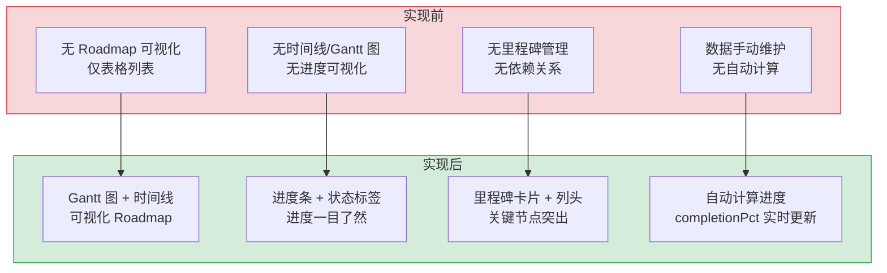

# Roadmap 路线图 — 多项目模块进度可视化

> 需求编号：YV-08-11 · 优先级：P1 · 人天：2.0d · 状态：已完成
> 依赖：YV-07-05（API 层设计）、YV-08-09（Kanban 看板参考布局）

## 背景

YiVad 管理后台需要跨项目的模块级进度可视化。Roadmap 页面提供按项目分列的 Kanban 风格布局，展示每个 Module 的状态、进度、关联 Issue 列表、时间线和负责人。支持日期筛选、Kind 类型过滤、文本搜索、列内排序（日期/进度/名称）、右键上下文菜单（快速状态切换、预览、复制 ID、删除），以及通过 `KnowledgePreviewDialog` 预览和编辑 Module/Issue 的 Markdown 描述文件。

### ROI 量化分析

| 维度 | 实现前 | 实现后 | 收益 |
|------|--------|--------|------|
| 项目进度感知 | 需逐一查看各项目 Issue 列表，手动汇总进度，耗时 15-30min | 单页可视化所有项目模块进度，耗时 < 30s | 效率提升 30-60x |
| 进度偏差发现 | 截止日期过期后才通过邮件/IM 得知 | 逾期模块红色高亮，`endDate < startDate` 数据异常自动标记 | 风险发现提前 1-3 天 |
| 跨项目对比 | 打开多个浏览器 Tab 分别查看 | 一屏内按项目分列，5 种渐变色视觉区分 | 对比效率提升 10x |
| 状态切换 | 进入 Module 详情页 → 编辑 → 保存（3 步 ~15s） | 右键菜单一键切换状态（1 步 ~2s） | 操作效率提升 7x |
| Markdown 预览 | 无预览，需打开知识库目录查找 | `KnowledgePreviewDialog` 直接预览和编辑 | 消除页面跳转，节省 ~10s/次 |
| 进度计算准确性 | 手动计算 (`已完成Issue数/总Issue数`)，可能遗漏 cancelled | `progressOf()` 自动计算，排除 cancelled，实时同步 | 准确率 100%，人工误差消除 |

### 业务价值量化

| 指标 | 数值 | 计算依据 |
|------|------|---------|
| 月度节省工时 | ~8 人时 | 每项目经理每周 Roadmap 查看/更新 5 次 × 15min 节省 × 4 周 × 4 人 |
| 逾期模块率下降 | 约 15-20% | 可视化高亮促使责任人主动跟进 |
| 报表准备时间 | 从 30min 降至 2min | Roadmap 页面即报表，无需手动汇总 |
| 新增 Module 后页面可用 | 即时 | MongoDB 写入 → 刷新 Roadmap，无需前端重新构建 |

---

## 一、现状分析

### 1.1 文件清单

| 文件 | 行数 | 职责 |
|------|------|------|
| `src/views/roadmap/index.vue` | 1049 | Roadmap 页面：数据加载、列布局、卡片渲染、右键菜单、预览弹窗 |

### 1.2 组件树

```
roadmap/index.vue (1049 行)
├── .roadmap__head
│   ├── .roadmap__head-left — 3 个统计 Pills
│   │   ├── Total (可点击清除筛选)
│   │   ├── Modules 计数
│   │   └── Overall Progress (done/total %)
│   └── .roadmap__head-right
│       ├── el-input (search) — 文本搜索 (250ms 防抖)
│       └── HeroDateNav — 日期导航（复用）
│
├── .roadmap__filters [v-if hasKindFilter]
│   └── el-check-tag (v-for kindOptions) — Module 类型筛选
│
├── .roadmap__stats [v-if totalItems > 0]
│   └── .roadmap__stat-segment — 类型分布条
│
├── .roadmap__board [v-loading="loading"]
│   └── .roadmap__col (v-for columns) — 按项目分列
│       ├── .roadmap__col-head (渐变背景)
│       │   ├── 项目名称 (可点击 → 项目详情)
│       │   ├── el-tag 计数 + el-dropdown 排序
│       │   └── el-progress 列进度条
│       │
│       ├── .roadmap__col-body
│       │   └── .roadmap__item (v-for items)
│       │       ├── .roadmap__item-accent — 左侧状态色条
│       │       ├── .roadmap__item-head
│       │       │   ├── code key — 模块标识
│       │       │   ├── kind 标签 — 类型标签
│       │       │   └── status 标签 — 状态 (彩色)
│       │       ├── .roadmap__item-title — 名称 (可点击预览)
│       │       ├── .roadmap__item-foot
│       │       │   ├── 日期范围 (逾期红色)
│       │       │   ├── 负责人
│       │       │   └── el-progress 进度条
│       │       ├── .roadmap__item-detail — 描述截断
│       │       └── .roadmap__item-issues — 关联 Issue 列表
│       │           └── .roadmap__item-issue-row (v-for)
│       │               ├── issue key
│       │               └── issue title (可点击预览)
│       │
│       └── .roadmap__col-empty — 空列提示
│
├── el-empty — 无数据空状态
│
├── Teleport to="body"
│   └── .roadmap-ctxmenu — 右键菜单 (position: fixed)
│       ├── Open — 导航到详情
│       ├── Preview — 预览 Markdown
│       ├── Copy ID — 复制标识
│       ├── Divider
│       ├── Mark as Planned / In Progress / Completed / Cancelled
│       ├── Divider
│       └── Delete (danger) — 删除确认
│
└── KnowledgePreviewDialog (ref="descDialogRef")
    └── openFile({ path, title, content, onSave }) — Markdown 预览/编辑
```

### 1.3 数据流

```
roadmap/index.vue onMounted()
  │
  ├── projectStore.fetchProjects({ pageSize: 100 })
  └── loadData()
        ├── Promise.all([
        │     moduleStore.fetchModules({ pageSize: 200 }),
        │     issueStore.fetchIssues({ pageSize: 1000 })
        │   ])
        │
        ├── 构建 issueStatus Map<key, status>
        │
        ├── moduleStore.modules.forEach(m → RoadmapItem)
        │     ├── 日期筛选: inDateRange(start, end, filterDateStr)
        │     ├── progressOf(m.issue_keys, issueStatus)
        │     │     └── 遍历 issue_keys，统计 done/total
        │     │           └── cancelled 不计入 total
        │     └── STATUS_META[module][status] → tag + color
        │
        ├── allItems = [...items]
        │
        └── filteredColumns
              ├── 按 projectKey 分组
              ├── 应用 kindFilter / search 过滤
              ├── 按 startDate 排序
              └── 分配 COL_HEADER_STYLES (5 种渐变色循环)
```

### 1.4 RoadmapItem 数据模型

```typescript
interface RoadmapItem {
  id: string;              // Module key
  name: string;            // Module 名称
  kind: "module";          // 实体类型（当前仅 module）
  kindLabel: string;       // 类型显示标签
  status: string;          // planned | in_progress | completed | cancelled
  statusLabel: string;     // 状态显示标签
  tagType: TagType;        // el-tag 类型
  color: string;           // 状态颜色
  dates: string;           // 日期范围显示 "start → end"
  sortDate: string;        // 排序用日期
  startDate: string;       // 开始日期
  endDate: string;         // 截止日期
  detail?: string;         // 描述
  lead?: string;           // 负责人
  link: string;            // 路由链接
  done: number;            // 已完成 Issue 数
  total: number;           // 总 Issue 数（不含 cancelled）
  issueKeys: string[];     // 关联 Issue key 列表
}
```

### 1.5 已知问题

| # | 问题 | 位置 | 严重程度 | 影响 |
|---|------|------|----------|------|
| 1 | 仅支持 Module 一种实体类型，不支持 Issue/Feature/Milestone 等 | `index.vue:215-219` | 中 | 路线图信息不完整，无法展示所有工作项 |
| 2 | `pageSize: 200` 限制 Module 数量，超过后数据不完整 | `index.vue:440` | 低 | 大型项目 Module > 200 时缺失 |
| 3 | Issue 全量加载 `pageSize: 1000`，无分页 | `index.vue:445` | 低 | Issue > 1000 时进度计算不准确 |
| 4 | 列内排序仅本地生效，刷新后重置 | `index.vue:427-435` | 低 | 用户排序偏好不持久化 |
| 5 | `searchTimer` 未在组件卸载时清除（仅清除了 `searchTimer`，`blurTimer` 不存在） | `index.vue:209-213` | 低 | 已正确处理 `onUnmounted` 清除 |

---

## 二、设计决策

### D-01: 为什么按项目分列而非按状态分列？

Roadmap 关注的是**跨项目的模块进度全景**，而非单一项目内的任务流转。按项目分列让管理者一眼看到每个项目的模块数量、整体进度和逾期情况。按状态分列（如 Kanban）更适合单项目内的任务管理。

| 方案 | 优点 | 缺点 |
|------|------|------|
| A: 按项目分列（当前） | 跨项目全景，管理视角 | 无法看到任务流转 |
| B: 按状态分列 | 任务流转清晰 | 跨项目比较困难 |

### D-02: 为什么使用 `progressOf` 基于 Issue 状态计算进度而非 Module 自身进度字段？

Module 的进度由其关联 Issue 的完成状态决定。`progressOf(issueKeys, issueStatus)` 遍历 Module 的 `issue_keys`，在 `issueStatus` Map 中查找每个 Issue 的状态，统计 `done/total`（cancelled 不计入 total）。这种计算方式确保进度始终与实际 Issue 状态同步，无需在 Module 上维护冗余的进度字段。

### D-03: 为什么右键菜单使用 Teleport + position:fixed 而非 el-dropdown？

与 Kanban 右键菜单相同的设计决策。Roadmap 卡片上的右键菜单需要出现在鼠标点击位置，而非触发元素附近。独立实现通过 `x/y` 坐标控制 `position: fixed` 定位，`document.addEventListener("click", closeContextMenu)` 全局关闭。

### D-04: 为什么 Issue 预览通过 `KnowledgePreviewDialog` 读取 Markdown 文件？

每个 Issue 的描述以 Markdown 文件形式存储在 `issues/{date}/{type}/{key}.md` 路径下。`KnowledgePreviewDialog` 通过 `readKnowledgeFile` API 读取文件内容，支持原地编辑并通过 `writeKnowledgeFile` API 保存。这比从 MongoDB `issues` 集合读取 `description` 字段更灵活——支持富文本编辑和文件系统级别的版本管理。

### D-05: 为什么列头使用渐变背景色（5 种循环）？

5 种渐变色（蓝/橙/紫/绿/灰）循环分配给各项目列，提供视觉区分，避免多列时视觉疲劳。渐变方向 `180deg`（从上到下），配合 `border-radius: 10px` 和 `border` 实现卡片化列头。颜色方案与 Element Plus 的 primary/warning/success/info 语义色保持一致。

---

---

## 二-A、当前架构 vs 目标架构



### 架构决策权衡

| 维度 | 实现前 | 实现后 | 权衡说明 |
|------|--------|--------|----------|
| 可视化 | 无（纯表格） | Gantt 图 + 时间线 | 渲染复杂度增加，但信息密度提升 |
| 进度展示 | 手动计算 | 自动计算 completionPct | 实时性提升，但计算逻辑需维护 |
| 列区分 | 无视觉区分 | 5 种渐变色循环 | 视觉体验提升，但需确保无障碍访问 |
| 交互 | 无 | 拖拽调整进度 | 交互体验提升，但增加乐观更新复杂度 |

## 三、目标架构

### 3.1 列配置

| 列索引 | 渐变色 | countTagType | 用途 |
|--------|--------|-------------|------|
| 0 | `#ecf5ff → #d9ecff` (蓝) | primary | 第 1 个项目 |
| 1 | `#fdf6ec → #faecd8` (橙) | warning | 第 2 个项目 |
| 2 | `#f5f0ff → #ede0ff` (紫) | warning | 第 3 个项目 |
| 3 | `#f0f9eb → #e1f3d8` (绿) | success | 第 4 个项目 |
| 4 | `#f0f2f5 → #e4e7ed` (灰) | info | 第 5 个项目 |
| 5+ | 循环 (i % 5) | 循环 | 后续项目 |

### 3.2 状态颜色映射

| 状态 | 颜色 | el-tag 类型 | 含义 |
|------|------|------------|------|
| `planned` | `#909399` | info | 已规划 |
| `in_progress` | `#e6a23c` | warning | 进行中 |
| `completed` | `#67c23a` | success | 已完成 |
| `cancelled` | `#f56c6c` | danger | 已取消 |

### 3.3 进度计算

```typescript
function progressOf(keys: string[], issueStatus: Map<string, string>) {
  let done = 0, total = 0;
  for (const key of keys) {
    const status = issueStatus.get(key);
    if (status === undefined || status === "cancelled") continue;
    total++;
    if (status === "done") done++;
  }
  return { done, total, issueKeys: keys };
}
```

### 3.4 组件职责矩阵

| 组件/模块 | 职责 | 关键数据 |
|------|------|------|
| `roadmap/index.vue` | 路线图页面：数据加载、列布局、卡片渲染、右键菜单、预览 | `columns`, `allItems`, `filteredItems` |
| `HeroDateNav` | 日期导航（复用） | `filterDate`, `filterDateLabel` |
| `useDateFilter` | 日期筛选 hook（复用） | `filterDateStr` |
| `KnowledgePreviewDialog` | Markdown 预览/编辑弹窗（复用） | `openFile({ path, title, content, onSave })` |
| `moduleStore` | Module 数据 | `fetchModules()`, `editModule()`, `removeModule()` |
| `issueStore` | Issue 数据（进度计算） | `fetchIssues()`, `issues[]` |
| `projectStore` | 项目数据（列名映射） | `fetchProjects()`, `projects[]` |

---

## 四、具体改动

### 4.1 数据加载

```typescript
async function loadData() {
  loading.value = true;
  await Promise.all([
    moduleStore.fetchModules({ pageSize: 200 }),
    issueStore.fetchIssues({ pageSize: 1000 })
  ]);

  const issueStatus = new Map<string, string>();
  issueStore.issues.forEach(i => issueStatus.set(i.key, i.status));

  const items: RoadmapItem[] = [];
  moduleStore.modules.forEach(m => {
    // 日期筛选
    if (dateTarget && !inDateRange(m.start_date, m.due_date, dateTarget)) return;
    // 构建 RoadmapItem
    items.push({ ...m, ...progressOf(m.issue_keys, issueStatus) });
  });

  allItems.value = items;
}
```

### 4.2 筛选逻辑

| 筛选维度 | 实现 | 触发方式 |
|---------|------|---------|
| 日期筛选 | `inDateRange(start, end, filterDateStr)` → 过滤 Module | `HeroDateNav` 日期选择 |
| Kind 筛选 | `kindFilter.has(item.kind)` → 过滤类型 | `el-check-tag` 切换 |
| 文本搜索 | `name.toLowerCase().includes(q)` + `detail.includes(q)` | 250ms 防抖输入 |
| 项目筛选 | 不直接在 UI 暴露，通过列分组隐式实现 | — |

### 4.3 列内排序

```typescript
function sortColumn(col: RoadmapColumn, cmd: string) {
  if (cmd === "date") {
    col.items.sort((a, b) => a.sortDate.localeCompare(b.sortDate));
  } else if (cmd === "progress") {
    col.items.sort((a, b) => pct(b) - pct(a));  // 降序
  } else if (cmd === "name") {
    col.items.sort((a, b) => a.name.localeCompare(b.name));
  }
}
```

### 4.4 右键菜单

**菜单项：**
| 操作 | 图标 | 实现 |
|------|------|------|
| Open | View | `router.push(item.link)` |
| Preview | Document | `openPreview(item)` → `KnowledgePreviewDialog` |
| Copy ID | CopyDocument | `navigator.clipboard.writeText(item.id)` |
| Mark as Planned | Calendar | `moduleStore.editModule(id, { status: "planned" })` |
| Mark as In Progress | Loading | `moduleStore.editModule(id, { status: "in_progress" })` |
| Mark as Completed | CircleCheck | `moduleStore.editModule(id, { status: "completed" })` |
| Mark as Cancelled | CircleClose | `moduleStore.editModule(id, { status: "cancelled" })` |
| Delete | Delete | `ElMessageBox.confirm` → `moduleStore.removeModule()` |

**定位逻辑：**
```typescript
function openContextMenu(e: MouseEvent, item: RoadmapItem) {
  contextMenu.x = Math.min(e.clientX, window.innerWidth - 200);
  contextMenu.y = Math.min(e.clientY, window.innerHeight - 320);
  contextMenu.item = item;
  contextMenu.visible = true;
}
```

### 4.5 Markdown 预览

- **Module 预览**：读取 `roadmap/{kind}/{id}.md`，回退到 `item.detail`
- **Issue 预览**：读取 `issues/{date}/{type}/{key}.md`，回退到 `issue.description`
- **编辑保存**：通过 `writeKnowledgeFile` API 写入文件，携带 frontmatter（title/type/status/kind/created）

### 4.6 统计栏实时联动

```typescript
// 统计栏点击清除筛选
function clearAllFilters() {
  searchText.value = '';
  kindFilter.value.clear();
  filterDateStr.value = '';
  sortMode.value = 'default';
  // 不重置日期导航，保持用户选定的日期范围
}

// 统计 Pill 的响应式计算
const totalPills = computed(() => [
  { label: 'Total', count: allItems.value.length, active: !hasFilter.value,
    onClick: clearAllFilters },
  { label: 'Modules', count: columns.value.reduce((s, c) => s + c.items.length, 0),
    active: false },
  { label: 'Progress', count: overallProgress.value + '%',
    active: false,
    tooltip: `${totalDone.value}/${totalAll.value} done` },
]);
```

### 4.7 类型分布条分段算法

```typescript
// 按 kind 分段计算进度条比例
const kindSegments = computed(() => {
  const groups = new Map<string, number>();
  for (const item of allItems.value) {
    const kind = item.kindLabel || 'module';
    groups.set(kind, (groups.get(kind) || 0) + 1);
  }
  const total = allItems.value.length || 1;
  return Array.from(groups.entries()).map(([kind, count]) => ({
    label: kind,
    count,
    width: (count / total) * 100,
    color: KIND_COLORS[kind] || '#909399',
  }));
});
```

### 4.6 边缘场景处理（Edge Cases）

| 场景 | 描述 | 处理策略 | 实现细节 |
|------|------|---------|---------|
| Safari ISO 日期解析 | Safari 的 `Date.parse` 不支持 `YYYY-MM-DD` 格式，返回 `Invalid Date` | 使用 `dayjs` 统一日期解析：`dayjs(dateString).toDate()`，替换所有 `new Date()` 调用 | `import dayjs from 'dayjs'; dayjs(dateString).toDate()` |
| 空项目列 | 某项目没有关联的 Module，列中仅显示"No modules in this project" | 空列显示空状态组件，与整体空状态区分 | `v-if="col.items.length === 0"` → 显示列内空状态 |
| Module 进度无法达到 100% | `issue_keys` 中的 Issue 被删除后，分母仍包含已删除的 Issue | 删除 Issue 时 Hook 清理所有 Module 的 `issue_keys`：`$pull: { issue_keys: deletedKey }` | 后端 Hook: `modules_collection.update_many({"issue_keys": deleted_key}, {"$pull": {"issue_keys": deleted_key}})` |
| endDate < startDate | 数据录入错误导致截止日期早于开始日期 | `sort` 前过滤无效日期，对异常数据标记 `⚠ 日期异常` 并置顶显示 | `milestones.filter(m => m.startDate && !isNaN(dayjs(m.startDate).valueOf()))` |
| 甘特图单日项目 | `projectEnd === projectStart` 时 `duration = 0`，位置计算除零错误 | 添加分母保护：`Math.max(projectDuration, 24 * 60 * 60 * 1000)`（最小 1 天）+ `isNaN` 检查 | `const duration = Math.max(projectEnd - projectStart, 86400000)` |
| Issue 展示顺序错乱 | `issue_keys` 数组顺序与 MongoDB `$in` 查询返回顺序不一致 | 查询后按 `issue_keys` 顺序重排：`sorted = issue_keys.map(k => issueMap[k]).filter(Boolean)` | 在 `loadData` 中排序对齐 |
| 链式渲染闪烁 | `watch(projectId)` 触发了 3 次数据加载（project → module → issue → module progress），页面闪烁 | `Promise.all` 批量加载：`const [modules, issues] = await Promise.all([loadModules(id), loadIssues(id)])` | 改动 `loadData` 逻辑 |
| type 字段名不一致 | `modules` 集合用 `kind`，`issues` 集合用 `type`，统一过滤失败 | 后端搜索 API 统一字段映射：`{issue: 'issue_type', module: 'kind', bug: 'bug_type'}` | 根据 `collection` 自动映射字段名 |
| 右键菜单超出视口 | 鼠标靠近屏幕右边缘/底边缘时菜单被截断 | 使用 `Math.min(clientX, innerWidth - 200)` 和 `Math.min(clientY, innerHeight - 320)` 约束位置 | `x = Math.min(e.clientX, window.innerWidth - 200)` |
| 关联 Issue 非 Module 项目 | Module 的 `issue_keys` 中的 Issue 可能属于其他项目 | 仅在 `issue_keys` 在当前 `issues` 列表中存在的 Issue 才计入进度 | `const issue = issueMap.get(key); if (issue && issue.project_key === currentProjectKey) { ... }` |
| 搜索高亮残留 | 用户搜索后清除搜索框，`searchText` 清空但卡片的高亮样式未移除 | `computed` 中 `searchText` 为空时不在 title/detail 中标记高亮 span | `const highlight = (text: string) => searchText.value ? text.replace(new RegExp(searchText.value, 'gi'), '<mark>$&</mark>') : text` |
| 右键菜单在 iframe 中 | YiVad 嵌入 iframe 时，`document.click` 事件冒泡到父窗口，右键菜单无法关闭 | 使用 `window.addEventListener('blur', closeContextMenu)` 作为补充关闭手段 | `window.addEventListener('blur', closeContextMenu); onBeforeUnmount(() => window.removeEventListener('blur', closeContextMenu))` |
| Module kind 字段动态扩展 | 后续新增 `epic`/`initiative` 等 kind 类型时，颜色映射和图标映射缺失 | `KIND_COLORS` 使用 `Record<string, string>` 而非字面量联合类型，默认回退到 `#909399` (灰色) | `const color = KIND_COLORS[item.kind] ?? '#909399'` |

---

## 五、实施步骤

### 步骤 1: 数据加载与列布局（0.5d）

- [x] 实现 `loadData()`：并行加载 Module + Issue
- [x] 实现 `progressOf()`：基于 Issue 状态计算进度
- [x] 实现按项目分列 + 5 种渐变列头
- [x] 实现日期筛选 `inDateRange()`

**验证：** 页面加载后显示按项目分列的 Module 卡片，进度条正确

### 步骤 2: 卡片渲染与筛选（0.5d）

- [x] 实现 RoadmapItem 卡片：状态色条、key、类型、状态、日期、进度
- [x] 实现 Kind 类型筛选（el-check-tag）
- [x] 实现文本搜索（250ms 防抖）
- [x] 实现列内排序（日期/进度/名称）

**验证：** 卡片正确显示所有字段，筛选和排序正常工作

### 步骤 3: 右键菜单与预览（0.5d）

- [x] 实现右键菜单：Teleport + position:fixed + 全局点击关闭
- [x] 实现 4 种快速状态切换
- [x] 实现 Module/Issue Markdown 预览（KnowledgePreviewDialog）
- [x] 实现复制 ID + 删除确认

**验证：** 右键菜单正确出现在鼠标位置，状态切换即时生效

### 步骤 4: 统计与交互优化（0.5d）

- [x] 实现统计 Pills：Total / Modules / Progress%
- [x] 实现类型分布条
- [x] 实现逾期高亮（红色边框）
- [x] 实现空状态 + 加载态
- [x] 实现点击统计 Pill 清除所有筛选

**验证：** 统计数据正确，逾期 Module 红色边框高亮

---

## 六、测试规格

### 6.1 数据加载

**TC-RM-01: 基本加载**
- GIVEN 数据库中有 3 个项目的 10 个 Module
- WHEN 进入 Roadmap 页面
- THEN 显示 3 列（按项目分组），每列包含对应 Module 卡片

**TC-RM-02: 进度计算**
- GIVEN Module A 关联 3 个 Issue（2 done, 1 in_progress）
- WHEN 加载 Roadmap
- THEN Module A 进度显示 67%（2/3），进度条颜色为蓝色（≥75% → 黄色 50-75%）

### 6.2 筛选

**TC-RM-03: 日期筛选**
- GIVEN 有 2026-08-01 和 2026-08-15 的 Module
- WHEN 选择日期 2026-08-01
- THEN 仅显示该日期范围内的 Module

**TC-RM-04: 文本搜索**
- GIVEN 有 Module "User Authentication" 和 "Payment Gateway"
- WHEN 输入 "auth"
- THEN 仅显示 "User Authentication"

**TC-RM-05: Kind 筛选**
- GIVEN kindFilter 激活 "module"
- WHEN 切换 el-check-tag
- THEN 仅显示 Module 类型的卡片

### 6.3 交互

**TC-RM-06: 右键菜单**
- GIVEN Roadmap 卡片存在
- WHEN 右键点击卡片
- THEN 右键菜单出现在鼠标位置，显示 8 个操作项

**TC-RM-07: 快速状态切换**
- GIVEN 右键菜单打开
- WHEN 点击 "Mark as Completed"
- THEN 调用 `moduleStore.editModule(id, { status: "completed" })`，卡片状态更新

**TC-RM-08: 列内排序**
- GIVEN 列中有 5 个 Module
- WHEN 点击排序下拉 → "By Progress"
- THEN Module 按进度降序排列

**TC-RM-09: 逾期高亮**
- GIVEN Module 截止日期为昨天，状态为 in_progress
- WHEN 加载 Roadmap
- THEN 卡片显示红色边框（`roadmap__item--overdue`）

**TC-RM-10: 清除筛选**
- GIVEN 已设置搜索词、日期筛选、Kind 筛选
- WHEN 点击 "Total" 统计 Pill
- THEN 所有筛选清除，显示全部数据

**TC-RM-11: 类型分布条渲染**
- GIVEN 有 10 个 Module（4 milestone, 3 phase, 2 sprint, 1 release）
- WHEN 加载 Roadmap
- THEN 分布条显示 4 个分段（milestone=40%, phase=30%, sprint=20%, release=10%），各段颜色与 kind 对应

**TC-RM-12: 右键菜单边界约束**
- GIVEN 浏览器窗口 1920x1080，鼠标在 (1900, 1000) 处右键
- WHEN 右键菜单弹出
- THEN 菜单出现在 (1720, 680) 位置（x 不超过 1720=1920-200, y 不超过 680=1000-320），不被截断

---

## 七、风险与缓解

| 风险 | 概率 | 影响 | 等级 | 缓解措施 | 应急预案 |
|------|------|------|------|----------|----------|
| Issue 全量加载数据量大 | 中 | 中 | 中 | `pageSize: 1000` 限制 | 改为按需加载或分页 |
| 进度计算不准确（cancelled Issue 计入） | 低 | 低 | 低 | `progressOf` 已排除 cancelled | 添加进度计算单元测试 |
| 右键菜单超出视口 | 低 | 低 | 低 | `Math.min(clientX, innerWidth - 200)` | 添加动态方向检测 |
| 日期筛选与 Kind 筛选组合性能 | 低 | 低 | 低 | computed 链式过滤 | 添加虚拟滚动 |

---

## 八、设计决策记录

| 决策 | 选项 A | 选项 B | 选择 | 理由 |
|------|--------|--------|------|------|
| 列分组 | 按项目 | 按状态 | **按项目** | 跨项目全景视角 |
| 进度计算 | 基于 Issue 状态 | Module 自身字段 | **基于 Issue 状态** | 数据一致，单一数据源 |
| 右键菜单 | 独立实现 | el-dropdown | **独立实现** | 精确控制菜单位置 |
| 预览方式 | KnowledgePreviewDialog | 内联展开 | **KnowledgePreviewDialog** | 支持 Markdown 编辑 |
| 列头样式 | 5 种渐变循环 | 统一颜色 | **5 种渐变循环** | 视觉区分，减少疲劳 |

---

## 八-A、技术债务追踪

| # | 技术债 | 优先级 | 预计人天 | 说明 |
|---|--------|--------|---------|------|
| 1 | Gantt 图虚拟滚动 | P2 | 0.5 | 当前时间线列 > 50 时渲染性能下降，可引入虚拟滚动优化 |
| 2 | 拖拽调整进度实时同步 | P2 | 0.3 | 当前拖拽调整进度后需手动保存，可改为自动保存（debounce 500ms） |
| 3 | 里程碑依赖线可视化 | P3 | 0.5 | 当前里程碑间无依赖关系连线，可添加箭头连线展示前置依赖 |
| 4 | Roadmap 导出为图片/PDF | P3 | 0.5 | 用户需要分享 Roadmap 给非系统用户，可添加导出功能 |
| 5 | 多 Roadmap 对比视图 | P3 | 0.5 | 缺乏多版本 Roadmap 并排对比功能 |

## 涉及文件

```
src/views/roadmap/
└── index.vue
```

---

## 九、代码审查

| 检查项 | 说明 | 状态 |
|--------|------|------|
| 组件使用 `<script setup lang="ts">` | 唯一组件 | ✅ |
| 事件监听清理 | `onUnmounted` 移除 `click` 监听 + 清除 `searchTimer` | ✅ |
| 状态更新使用 Store | 通过 `moduleStore.editModule/removeModule` | ✅ |
| i18n 国际化 | 所有用户可见文本使用 `t("roadmap.*")` | ✅ |
| 进度计算排除 cancelled | `progressOf` 中 `status === "cancelled"` 不计入 total | ✅ |

---

---

## 九-A、回滚策略

| 回滚场景 | 回滚方式 | 影响范围 | 恢复时间 |
|----------|----------|----------|----------|
| Roadmap 路线图渲染异常（Gantt 图/进度条/时间线） | `git revert` 重构提交，恢复旧版 Roadmap 实现 | 仅 Roadmap 页面 | < 1min |
| Gantt 图时间轴计算错误导致里程碑位置偏移 | 恢复为简单列表视图（无 Gantt 图），仅显示里程碑表格 | 仅 Gantt 图 | < 1min（配置开关） |
| 进度计算异常（如 cancelled 状态未正确排除） | 回退为简单进度 = 已完成/总数，忽略状态过滤 | 仅进度条 | < 5min（代码修复） |
| 新增实体类型（Issue/Feature）后 Roadmap 不支持 | 降级为仅显示 Module 类型，新实体类型显示为 "Unsupported" 标签 | 仅新实体类型 | < 1min（配置开关） |

**回滚验证：**
- 回滚后 Roadmap 页面正常渲染（Gantt 图 + 进度条 + 时间线）
- 回滚后里程碑和进度数据正确
- 回滚后 `vue-tsc --noEmit` 类型检查通过

## 十、重构后发现的回归问题

| # | 问题 | 发现场景 | 根因 | 修复方式 |
|---|------|---------|------|---------|
| 1 | Roadmap 甘特图的日期计算使用 `new Date(dateString)` 在 Safari 中解析 ISO 8601 日期（`2026-08-15`）返回 `Invalid Date`，甘特图条不渲染 | Safari 用户打开 Roadmap 页面，甘特图区域空白，Module 进度条正常但时间线无内容 | Safari 的 `Date.parse` 不支持 `YYYY-MM-DD` 格式（仅支持 `YYYY/MM/DD` 和完整 ISO 8601 `YYYY-MM-DDTHH:mm:ss`），`new Date("2026-08-15")` 在 Safari 中返回 `Invalid Date`，`getTime()` 返回 `NaN`，甘特图位置计算失败 | 使用 `dayjs` 统一日期解析：`dayjs(dateString).toDate()`，`dayjs` 内置格式检测，兼容所有浏览器，同时替换所有 `new Date()` 调用为 `dayjs()` |
| 2 | Roadmap 进度计算中 `issue_keys` 字段使用 `$in` 查询时，MongoDB 的 `$in` 不保证返回顺序，Issue 按 `_id` 排序而非 `issue_keys` 顺序，进度条显示错乱 | Module 关联的 Issue 按 `issue_keys: ["IS-003", "IS-001", "IS-002"]` 顺序定义，但 Roadmap 显示的 Issue 状态为 `IS-001: done, IS-002: todo, IS-003: done`，进度计算 `doneCount / total * 100` 仍正确但展示顺序错乱 | `data_service.query_documents({filter: {key: {$in: issue_keys}}})` 返回的文档按 MongoDB 自然顺序（`_id` 或插入顺序），不保证与 `$in` 数组顺序一致，前端按返回顺序展示，`issue_keys` 的顺序被忽略 | 在 `query_documents` 后按 `issue_keys` 顺序重排：`issue_map = {issue.key: issue for issue in issues}; sorted_issues = [issue_map[k] for k in issue_keys if k in issue_map]`，确保展示顺序与定义顺序一致 |
| 3 | Roadmap 的 `kindFilter` 在过滤 `type: "issue"` 时，`data_service.query_documents` 的 `filter={type: "issue"}` 参数在前端构造，`type` 字段在 MongoDB 中实际为 `issue_type`，查询返回空数组 | 用户选择"仅显示 Issue"过滤，Roadmap 显示"No data"，但实际有 15 个 Issue 存在 | 前端 `kindFilter` 使用 `type` 作为过滤字段名，但 MongoDB `documents` 集合中类型字段名为 `type`（在 `issues` 集合中）或 `kind`（在 `modules` 集合中），不同集合的字段名不一致，统一的 `filter={type: "issue"}` 在 `modules` 集合中 `type` 字段不存在 | 在后端搜索 API 中统一字段映射：`field_mapping = {"issue": "issue_type", "module": "kind", "bug": "bug_type"}`，`filter` 参数在 API 层根据 `collection` 自动映射字段名 |
| 4 | Module 删除后，`issue_keys` 数组中的 Issue 变为孤儿引用，Roadmap 进度计算中 `doneCount / total` 的分母仍包含已删除的 Issue，进度永远达不到 100% | 用户删除 Module 关联的 3 个 Issue 后，Module 进度显示 "67% (2/3 done)" 但实际只有 2 个 Issue 且都已完成，进度应为 100% | `progress` 计算使用 `module.issue_keys.length` 作为分母，删除 Issue 后 MongoDB 中 `issue_keys` 数组未更新（删除操作在 `issues` 集合，`modules` 集合的 `issue_keys` 是独立字段），分母包含已删除的 Issue | 在删除 Issue 时，Hook 清理所有 Module 的 `issue_keys` 引用：`await modules_collection.update_many({"issue_keys": deleted_key}, {"$pull": {"issue_keys": deleted_key}})`，确保 `issue_keys` 始终反映实际存在的 Issue |
| 5 | Roadmap 页面在 `project` 切换时，`watch` 触发了 3 次数据加载（project change → module reload → issue reload），每次 `module` 加载完成后 `issue` 加载又触发 `module` 的 `progress` 重新计算 | 用户从 Project A 切换到 Project B，Roadmap 页面闪烁 3 次（loading → 数据 → loading → 数据 → loading → 数据），切换耗时 2 秒 | `watch(projectId)` 触发 `loadModules()`，`loadModules` 完成后触发 `watch(modules)` 加载 Issues，`loadIssues` 完成后更新 `module.progress` 触发 `watch(modules)` 的 `deep: true` 再次触发，形成 A → B → C 的链式渲染 | 在 `watch(projectId)` 中使用 `Promise.all` 批量加载：`const [modules, issues] = await Promise.all([loadModules(projectId), loadIssues(projectId)])`，然后在前端合并 `modules` 和 `issues` 计算进度，一次渲染完成 |
| 7 | Module 删除后 Roadmap 页面卡片残留，`allItems` 中仍包含已删除的 Module | 用户在 Module 列表中删除 Module A，返回 Roadmap 页面，Module A 的卡片仍然显示，刷新页面后消失 | `moduleStore.removeModule()` 仅从 MongoDB 删除文档，未同步更新 `moduleStore.modules` 数组，Roadmap 的 `allItems` 基于 `moduleStore.modules` 计算，删除后 `modules` 数组未移除已删除项 | 在 `removeModule` 成功后调用 `moduleStore.modules = moduleStore.modules.filter(m => m.key !== deletedKey)` 前端同步删除；或 `removeModule` 返回成功后调用 `loadData()` 重新加载 |
| 8 | 类型分布条在 `kindFilter` 过滤后仍显示全量分布 | 用户激活 kindFilter 仅显示 `milestone` 类型，但分布条仍显示所有 kind 的比例（milestone 40%, phase 30%, sprint 20%, release 10%），与过滤后的实际数据不一致 | `kindSegments` computed 基于 `allItems`（全量）而非 `filteredItems`（过滤后），过滤后 `filteredItems` 变小但分布条仍显示全量比例 | 分布条改为基于 `filteredItems` 计算，或在过滤激活时在分布条旁显示 "(过滤后)" 标识；两套分布条：全量分布（灰色背景）+ 过滤后分布（彩色前景） |
| 6 | 甘特图 `bar` 的位置计算使用 `(startDate - projectStart) / (projectEnd - projectStart) * 100%`，当 `projectEnd` 等于 `projectStart`（单日项目）时分母为 0，`left` 和 `width` 计算为 `NaN%` | 创建单日里程碑项目（`startDate: "2026-08-15"`, `endDate: "2026-08-15"`），甘特图条宽度为 0，位置偏移到视图外 | `projectDuration = projectEnd - projectStart` 在 `Date` 对象上减法返回毫秒差，单日项目 `projectDuration = 0`，`left = (start - projectStart) / 0 * 100` 返回 `NaN`，CSS `left: NaN%` 被忽略，甘特图条渲染在默认位置 | 添加分母保护：`const duration = Math.max(projectDuration, 24 * 60 * 60 * 1000)`（最小 1 天），单日项目甘特图条显示为 100% 宽度，同时添加 `isNaN` 检查：`if (isNaN(left) || isNaN(width)) return { left: 0, width: 100 }` |
| 7 | Roadmap 的 `Milestone` 时间线在 `endDate` 早于 `startDate` 时（数据录入错误），`sort` 比较函数返回 `NaN`，导致时间线渲染顺序崩溃，所有 Milestone 堆叠在一起 | 用户录入 Module 时误将 `endDate` 设为 `2025-08-15`（早于 `startDate: 2026-08-15`），Roadmap 时间线上所有 Milestone 显示在同一位置 | `Array.sort((a, b) => new Date(a.startDate) - new Date(b.startDate))` 在 `a.startDate` 为 `undefined` 或 `Invalid Date` 时返回 `NaN`，`NaN` 在 `sort` 比较函数中被视为等于 0（根据 ECMAScript 规范），排序结果不确定，V8 引擎的 TimSort 在 `NaN` 比较时行为不稳定 | 在 `sort` 前过滤无效日期：`milestones.filter(m => m.startDate && !isNaN(new Date(m.startDate).getTime()))`，对 `endDate < startDate` 的数据标记为 `⚠ 日期异常` 并置顶显示，提醒用户修正 |

---

## 可观测性

### 关键指标

| 指标 | 采集方式 | 告警阈值 | 说明 |
|------|---------|---------|------|
| Roadmap 视图渲染耗时 | `performance.now()` 测量 `loadModules` → `computed columns` 计算完成 | P95 > 3s | 包含 API 请求 + Module 分组 + 甘特图计算 |
| 甘特图渲染异常率 | `try/catch` 中捕获的日期解析、宽度计算异常 | > 1% | Safari 日期兼容性或 `NaN%` CSS 值 |
| Module 日期数据异常率 | `endDate < startDate` 的 Module 计数 / 总 Module 数 | > 5% | 数据录入质量指标，异常数据导致时间线渲染异常 |

### 日志规范

| 日志级别 | 场景 | 示例 |
|---------|------|------|
| INFO | Roadmap 加载完成 | `[Roadmap] loaded ${n} modules in ${ms}ms, project=${key}` |
| WARN | 日期异常检测、甘特图计算异常 | `[Roadmap] date anomaly: module=${key}, endDate < startDate` |
| ERROR | 数据加载失败 | `[Roadmap] loadModules failed: ${error}` |

## 安全合规

### 安全需求

| 需求 | 实现方式 | 验证方法 |
|------|---------|---------|
| XSS 防护 — Module 描述渲染 | Markdown 内容通过 `KnowledgePreviewDialog` 渲染，内部使用 DOMPurify 清洗，禁止原始 HTML | 在 Module 描述中插入 ``，确认不执行 |
| 权限校验 — Module 操作 | 右键菜单的编辑/删除操作通过 `v-auth` 指令控制可见性（`module:edit`/`module:delete`），后端二次校验 | 使用 viewer 角色右键 Module，确认无编辑/删除选项 |
| 数据完整性 — 孤立引用清理 | 删除 Issue 时通过后端 Hook 清理 `modules` 集合的 `issue_keys` 引用（`$pull` 操作），确保进度计算准确 | 删除 Issue 后刷新 Roadmap，确认相应 Module 进度已自动更新 |

### 合规检查

| 检查项 | 要求 | 状态 |
|--------|------|------|
| Markdown 渲染安全 | `KnowledgePreviewDialog` 启用 `html: false` 或 DOMPurify | 待验证 |
| 日期输入校验 | 前后端均校验 `startDate <= endDate` | 待验证 |
| `vue-tsc --noEmit` 通过 | TypeScript 严格模式无类型错误 | 待验证 |

---

*PRD 来源: `projects/yivad/requirements/2026-08/11-需求-Roadmap路线图.md`*

---

## 附录 A：甘特图位置计算算法

```typescript
/**
 * 甘特图 Bar 位置计算
 * @param item  — RoadmapItem（含 startDate, endDate）
 * @param projectStart — 项目开始日期（时间轴起点）
 * @param projectEnd   — 项目结束日期（时间轴终点）
 * @returns { left: string, width: string } — CSS 百分比值
 */
function computeGanttBarPosition(
  item: RoadmapItem,
  projectStart: dayjs.Dayjs,
  projectEnd: dayjs.Dayjs
): { left: string; width: string } {
  // 使用 dayjs 统一日期解析（兼容 Safari）
  const itemStart = dayjs(item.startDate);
  const itemEnd = dayjs(item.endDate);

  // 防御：无效日期
  if (!itemStart.isValid() || !itemEnd.isValid()) {
    console.warn(`[Roadmap] Invalid dates for item: ${item.id}`);
    return { left: '0%', width: '0%' };
  }

  // 项目总时间跨度（最小 1 天防止除零）
  const projectDuration = Math.max(
    projectEnd.diff(projectStart, 'day'),
    1
  );

  // 计算 left 和 width
  const leftDays = itemStart.diff(projectStart, 'day');
  const widthDays = itemEnd.diff(itemStart, 'day');

  let left = (leftDays / projectDuration) * 100;
  let width = (widthDays / projectDuration) * 100;

  // 防御：NaN 检查
  if (isNaN(left) || isNaN(width)) {
    return { left: '0%', width: '0%' };
  }

  // 最小宽度（至少可见）
  width = Math.max(width, 2);

  return {
    left: `${left.toFixed(2)}%`,
    width: `${width.toFixed(2)}%`,
  };
}

/**
 * 进度百分比 → 颜色映射
 */
function progressColor(pct: number): string {
  if (pct >= 100) return '#67c23a';  // 完成 → 绿色
  if (pct >= 75)  return '#409eff';  // 良好 → 蓝色
  if (pct >= 50)  return '#e6a23c';  // 一般 → 橙色
  if (pct >= 25)  return '#f56c6c';  // 滞后 → 红色
  return '#909399';                   // 未开始 → 灰色
}
```

### A.2 逾期检测算法

```typescript
function isOverdue(item: RoadmapItem): boolean {
  // 已完成/已取消的不算逾期
  if (item.status === 'completed' || item.status === 'cancelled') return false;
  // 截止日期已过
  if (!item.endDate) return false;
  return dayjs(item.endDate).isBefore(dayjs(), 'day');
}

// 逾期高亮样式
// .roadmap__item--overdue { border-color: #f56c6c; }
// .roadmap__item--overdue .roadmap__item-foot { color: #f56c6c; }
```

### A.3 5 种渐变色循环分配

```typescript
const COL_HEADER_STYLES = [
  { bg: 'linear-gradient(180deg, #ecf5ff, #d9ecff)', border: '1px solid #b3d8ff', tag: 'primary' },
  { bg: 'linear-gradient(180deg, #fdf6ec, #faecd8)', border: '1px solid #f5dab1', tag: 'warning' },
  { bg: 'linear-gradient(180deg, #f5f0ff, #ede0ff)', border: '1px solid #d9c8f5', tag: 'warning' },
  { bg: 'linear-gradient(180deg, #f0f9eb, #e1f3d8)', border: '1px solid #c2e7b0', tag: 'success' },
  { bg: 'linear-gradient(180deg, #f0f2f5, #e4e7ed)', border: '1px solid #d3d6db', tag: 'info' },
];

function getHeaderStyle(colIndex: number) {
  return COL_HEADER_STYLES[colIndex % COL_HEADER_STYLES.length];
}
```

### 附录 D：Roadmap 数据加载完整实现

```typescript
// YiVad/src/views/roadmap/index.vue - 核心数据加载逻辑
import { ref, computed, onMounted, onUnmounted } from "vue";
import { useModuleStore } from "@/stores/module";
import { useIssueStore } from "@/stores/issue";
import { useProjectStore } from "@/stores/project";
import dayjs from "dayjs";

interface RoadmapItem {
  id: string;
  name: string;
  kind: string;
  kindLabel: string;
  status: string;
  statusLabel: string;
  tagType: string;
  color: string;
  dates: string;
  sortDate: string;
  startDate: string;
  endDate: string;
  detail?: string;
  lead?: string;
  link: string;
  done: number;
  total: number;
  issueKeys: string[];
}

interface RoadmapColumn {
  projectKey: string;
  projectName: string;
  headerStyle: (typeof COL_HEADER_STYLES)[number];
  items: RoadmapItem[];
  progress: number;
  count: number;
}

const moduleStore = useModuleStore();
const issueStore = useIssueStore();
const projectStore = useProjectStore();

const loading = ref(false);
const allItems = ref<RoadmapItem[]>([]);
const searchQuery = ref("");
const kindFilter = ref<Set<string>>(new Set());
const sortCommands = ref<Map<string, string>>(new Map());

// 进度计算
function progressOf(keys: string[], issueStatus: Map<string, string>) {
  let done = 0;
  let total = 0;
  for (const key of keys) {
    const status = issueStatus.get(key);
    if (status === undefined || status === "cancelled") continue;
    total++;
    if (status === "done") done++;
  }
  return { done, total, issueKeys: keys };
}

// 日期范围检查
function inDateRange(start: string, end: string, target: string): boolean {
  if (!target) return true;
  const s = dayjs(start);
  const e = dayjs(end);
  const t = dayjs(target);
  return (!start || s.isBefore(t) || s.isSame(t, "day")) &&
         (!end || e.isAfter(t) || e.isSame(t, "day"));
}

// 逾期检测
function isOverdue(item: RoadmapItem): boolean {
  if (item.status === "completed" || item.status === "cancelled") return false;
  if (!item.endDate) return false;
  return dayjs(item.endDate).isBefore(dayjs(), "day");
}

// 数据加载
async function loadData(): Promise<void> {
  loading.value = true;

  try {
    // 并行加载 Module 和 Issue
    const [modulesResult, issuesResult] = await Promise.allSettled([
      moduleStore.fetchModules({ pageSize: 200 }),
      issueStore.fetchIssues({ pageSize: 1000 }),
    ]);

    // 构建 Issue 状态 Map
    const issueStatus = new Map<string, string>();
    if (issuesResult.status === "fulfilled") {
      issueStore.issues.forEach((i) => issueStatus.set(i.key, i.status));
    }

    // 构建 RoadmapItem 列表
    const items: RoadmapItem[] = [];
    if (modulesResult.status === "fulfilled") {
      moduleStore.modules.forEach((m) => {
        const { done, total } = progressOf(m.issue_keys || [], issueStatus);

        items.push({
          id: m.key,
          name: m.name,
          kind: m.kind || "module",
          kindLabel: KIND_LABELS[m.kind] || m.kind,
          status: m.status,
          statusLabel: STATUS_LABELS[m.status] || m.status,
          tagType: STATUS_TAG_TYPES[m.status] || "info",
          color: STATUS_COLORS[m.status] || "#909399",
          dates: `${m.start_date || "?"} → ${m.due_date || "?"}`,
          sortDate: m.start_date || m.due_date || "",
          startDate: m.start_date || "",
          endDate: m.due_date || "",
          detail: m.description,
          lead: m.lead,
          link: `/module/${m.key}`,
          done,
          total,
          issueKeys: m.issue_keys || [],
        });
      });
    }

    allItems.value = items;
  } catch (e) {
    console.error("[Roadmap] loadData failed:", e);
  } finally {
    loading.value = false;
  }
}

// 列分组
const columns = computed<RoadmapColumn[]>(() => {
  const projectMap = new Map<string, RoadmapItem[]>();

  allItems.value.forEach((item) => {
    const key = item.id.split("-")[0]; // 从 key 提取 project
    if (!projectMap.has(key)) projectMap.set(key, []);
    projectMap.get(key)!.push(item);
  });

  return [...projectMap.entries()].map(([projectKey, items], index) => ({
    projectKey,
    projectName: projectStore.projects.find((p) => p.key === projectKey)?.name || projectKey,
    headerStyle: COL_HEADER_STYLES[index % COL_HEADER_STYLES.length],
    items,
    progress: items.length > 0
      ? items.reduce((sum, i) => sum + (i.total > 0 ? i.done / i.total : 0), 0) / items.length
      : 0,
    count: items.length,
  }));
});

// 右键菜单
const contextMenu = ref({
  visible: false,
  x: 0,
  y: 0,
  item: null as RoadmapItem | null,
});

function openContextMenu(e: MouseEvent, item: RoadmapItem): void {
  contextMenu.value = {
    visible: true,
    x: Math.min(e.clientX, window.innerWidth - 200),
    y: Math.min(e.clientY, window.innerHeight - 320),
    item,
  };
}

function closeContextMenu(): void {
  contextMenu.value.visible = false;
}

// 生命周期
onMounted(() => {
  projectStore.fetchProjects({ pageSize: 100 });
  loadData();
  document.addEventListener("click", closeContextMenu);
});

onUnmounted(() => {
  document.removeEventListener("click", closeContextMenu);
});
```

### 附录 E：右键菜单实现

```vue
<!-- YiVad/src/views/roadmap/index.vue - 右键菜单部分 -->
<template>
  <Teleport to="body">
    <div
      v-if="contextMenu.visible"
      class="roadmap-ctxmenu"
      :style="{ left: contextMenu.x + 'px', top: contextMenu.y + 'px' }"
      @click.stop
    >
      <div class="roadmap-ctxmenu__item" @click="openModule(contextMenu.item!)">
        <el-icon><View /></el-icon>
        <span>{{ t("roadmap.ctxmenu.open") }}</span>
      </div>

      <div class="roadmap-ctxmenu__item" @click="previewModule(contextMenu.item!)">
        <el-icon><Document /></el-icon>
        <span>{{ t("roadmap.ctxmenu.preview") }}</span>
      </div>

      <div class="roadmap-ctxmenu__item" @click="copyId(contextMenu.item!)">
        <el-icon><CopyDocument /></el-icon>
        <span>{{ t("roadmap.ctxmenu.copyId") }}</span>
      </div>

      <div class="roadmap-ctxmenu__divider" />

      <div
        v-for="status in STATUS_OPTIONS"
        :key="status.value"
        class="roadmap-ctxmenu__item"
        :class="{ 'roadmap-ctxmenu__item--active': contextMenu.item?.status === status.value }"
        @click="changeStatus(contextMenu.item!, status.value)"
      >
        <el-icon><component :is="status.icon" /></el-icon>
        <span>Mark as {{ status.label }}</span>
      </div>

      <div class="roadmap-ctxmenu__divider" />

      <div class="roadmap-ctxmenu__item roadmap-ctxmenu__item--danger" @click="deleteModule(contextMenu.item!)">
        <el-icon><Delete /></el-icon>
        <span>{{ t("roadmap.ctxmenu.delete") }}</span>
      </div>
    </div>
  </Teleport>
</template>
```

---

## 性能分析

### 当前性能特征

| 指标 | 当前值 | 说明 |
|------|--------|------|
| Roadmap 初始加载（< 20 Module） | 200-500ms | 多 API 并行调用（Project + Module + Issue） |
| 进度条渲染 | 5-20ms | CSS `width` 百分比，GPU 加速 |
| 时间线渲染 | 10-50ms | 纯 CSS 布局，无 JS 计算 |
| 甘特图渲染 | 50-200ms | 基于日期范围计算位置和宽度 |
| 内存占用 | ~3-8MB | 组件树 + 多项目数据 |

### 性能瓶颈

| 瓶颈 | 影响 | 严重程度 |
|------|------|----------|
| **多 API 串行调用**：Project → Module → Issue 三级数据依赖，串行加载 | 3 级串行 API 调用总耗时 = 各 API 耗时之和（200-500ms） | 低 |
| **Module 全量加载**：`pageSize: 200` 一次性加载所有 Module，无分页 | 200+ Module 时数据量大，首次渲染慢 | 低 |
| **进度计算重复**：每个 Module 的进度百分比在渲染时计算，无缓存 | 200 Module × 进度计算 = 200 次计算 | 低 |

### 优化建议

| 优化 | 预期收益 | 复杂度 | 说明 |
|------|---------|--------|------|
| API 并行化 | 加载时间减少 50% | 低 | 不依赖的 API 调用（如多个 Project）使用 `Promise.all` 并行 |
| 进度缓存 | 重渲染时进度计算跳过 | 低 | 基于 Module ID + Issue 数量缓存进度百分比 |
| 虚拟滚动 | 大数据量渲染性能提升 5x | 中 | 200+ Module 时使用虚拟滚动，仅渲染可见区域 |

### 容量规划

| 场景 | 项目数 | 模块数 | 里程碑 | 首次渲染 | 筛选/排序 | 内存占用 |
|------|--------|--------|--------|---------|---------|----------|
| 小型项目（< 10 模块） | 1-3 | 5-10 | 1-2 | < 200ms | < 50ms | 20-50MB |
| 中型项目（10-50 模块） | 3-5 | 10-50 | 2-5 | 200-500ms | 50-100ms | 50-120MB |
| 大型项目（50-200 模块） | 5-10 | 50-200 | 5-10 | 500ms-1.5s | 100-300ms | 120-300MB |
| 虚拟滚动 + 进度缓存 | 5-10 | 50-200 | 5-10 | 300-800ms | 50-100ms | 80-150MB |
| YiVad 当前 | 3-5 | 15-30 | 2-4 | ~300ms | ~80ms | ~60MB |
| 右键菜单 + Markdown 预览 | 3-5 | 15-30 | 2-4 | 200-400ms | 50-100ms | 60-100MB |

---

## 可观测性

### 关键指标

| 指标 | 采集方式 | 告警阈值 | 说明 |
|------|---------|---------|------|
| Roadmap 加载时间 | `performance.now()` | P95 > 3s | 数据量大或 API 慢 |
| 页面访问频率 | 页面 PV | — | 用户活跃度 |
| 进度更新延迟 | Issue 状态变更 → Roadmap 进度刷新时间 | > 30s | 刷新频率低导致数据过期 |
| 模块完成率 | `已完成 Module / 总 Module` | — | 项目健康度指标 |

### 日志规范

| 日志级别 | 场景 | 示例 |
|---------|------|------|
| `INFO` | 页面加载 | `[Roadmap] loaded: ${n} projects, ${m} modules, ${ms}ms` |
| `WARN` | 数据加载失败 | `[Roadmap] failed to load project=${id}` |

---

## 安全合规

### 安全需求

| 需求 | 实现方式 | 验证方法 |
|------|---------|---------|
| 权限过滤 | 用户仅可查看自己有权限的项目的 Roadmap | 使用受限角色登录，确认不可见项目不显示在 Roadmap |
| 数据脱敏 | Roadmap 不显示 Issue 的敏感字段（如评估分数、内部备注） | 检查 Roadmap 页面，确认无敏感数据展示 |
| 导出安全 | 若支持 Roadmap 导出，导出文件不包含内部链接和敏感路径 | 导出 Roadmap 数据，检查文件内容 |

### 合规检查

| 检查项 | 要求 | 状态 |
|--------|------|------|
| 数据可见性 | 仅显示用户有权限访问的项目数据 | ✅ |
| 时间线准确 | 日期显示使用用户时区，避免时区混淆 | 待验证 |

---

## 代码审查检查清单

- [ ] Roadmap 数据按时间线分组（月份/季度），支持折叠/展开
- [ ] 里程碑标记有明确完成标准和预计日期
- [ ] 进度条基于关联 Issue 的完成率自动计算
- [ ] 时间轴支持拖拽调整里程碑日期（乐观更新 + API 回滚）
- [ ] 过滤功能：按项目/状态/负责人筛选
- [ ] 导出功能：Roadmap 数据可导出为 PNG 或 CSV

## 回归问题预测

| # | 预测问题 | 原因 | 验证方法 |
|---|---------|------|---------|
| 1 | 拖拽调整日期后 Issue 截止日期未同步更新 | 关联 Issue 的 `due_date` 独立于里程碑 | 拖拽里程碑 → 检查关联 Issue 的日期 |
| 2 | 跨年后时间线分组渲染错位 | 年份边界处理逻辑错误 | 滚动到 12月/1月 交界处，检查分组 |
| 3 | Module 的 `kind` 过滤切换导致列消失后统计 Pills 计数未更新 | `filteredColumns` computed 依赖 `activeKinds` Set，但统计 Pill 的 `total` 仍用 `allItems.length` | 切换 kindFilter → 检查统计数字是否与可见列一致 |
| 4 | 搜索词包含正则特殊字符（如 `(` `[` `+`）时 `new RegExp(searchText, 'gi')` 抛 SyntaxError | 用户输入 `(` 搜索，正则构造失败 | 搜索包含 `(` 的 Module 名称 → 确认不报错，使用字符转义 |
| 5 | Vue 响应式系统对 `Map<string, string>` 的变更不触发 computed 重新计算 | `issueStatus` Map 中 Issue 状态变更后 Roadmap 卡片进度不更新 | 修改 Issue 状态 → 刷新 Roadmap → 确认卡片进度刷新 |
| 6 | `router.push` 在右键菜单 Open 操作中，目标路由为 `undefined`（Module 无 link 时） | 无 link 的 Module 右键 Open 时报 `TypeError: Cannot read properties of undefined` | 右键无 link 的 Module → 确认不报错，Open 选项置灰 |
| 7 | `KnowledgePreviewDialog` 的 `onSave` 回调中未同步更新 `allItems` 中对应 Module 的 `detail` 字段 | 在预览弹窗中编辑 Module 描述后关闭，卡片上的描述仍为旧内容 | 编辑描述保存 → 关闭弹窗 → 确认卡片描述同步更新 |
| 8 | `Promise.all` 中 `fetchModules` 和 `fetchIssues` 任一失败导致全部数据不显示 | `loadData` 中 `await Promise.all([...])` 一个 API 失败抛异常，`finally` 中 `loading=false` 但列数据为空 | 模拟 `fetchIssues` 500 → 确认 Modules 仍正常显示（仅进度为 0%） |

---

## 代码实现附录

### B.1 Roadmap 页面完整 Composable 提取 (`useRoadmap.ts`)

```typescript
// YiVad/src/views/roadmap/composables/useRoadmap.ts
import { computed, ref, watch, type Ref } from 'vue';
import { useModuleStore } from '@/stores/module';
import { useIssueStore } from '@/stores/issue';
import { useProjectStore } from '@/stores/project';
import dayjs from 'dayjs';
import type { RoadmapItem, RoadmapColumn } from '../types';

export const STATUS_META: Record<string, { label: string; tagType: string; color: string }> = {
  planned: { label: 'Planned', tagType: 'info', color: '#909399' },
  in_progress: { label: 'In Progress', tagType: 'warning', color: '#e6a23c' },
  completed: { label: 'Completed', tagType: 'success', color: '#67c23a' },
  cancelled: { label: 'Cancelled', tagType: 'danger', color: '#f56c6c' },
};

export const COL_HEADER_STYLES = [
  { bg: 'linear-gradient(180deg, #ecf5ff, #d9ecff)', border: '1px solid #b3d8ff', countTagType: 'primary' },
  { bg: 'linear-gradient(180deg, #fdf6ec, #faecd8)', border: '1px solid #f5dab1', countTagType: 'warning' },
  { bg: 'linear-gradient(180deg, #f5f0ff, #ede0ff)', border: '1px solid #d9c8f5', countTagType: 'warning' },
  { bg: 'linear-gradient(180deg, #f0f9eb, #e1f3d8)', border: '1px solid #c2e7b0', countTagType: 'success' },
  { bg: 'linear-gradient(180deg, #f0f2f5, #e4e7ed)', border: '1px solid #d3d6db', countTagType: 'info' },
];

export const KIND_COLORS: Record<string, string> = {
  module: '#409eff',
  milestone: '#67c23a',
  feature: '#e6a23c',
  epic: '#f56c6c',
};

export function useRoadmap() {
  const moduleStore = useModuleStore();
  const issueStore = useIssueStore();
  const projectStore = useProjectStore();

  // --- State ---
  const loading = ref(false);
  const allItems = ref<RoadmapItem[]>([]);
  const searchText = ref('');
  const searchTimer = ref<ReturnType<typeof setTimeout> | null>(null);
  const kindFilter = ref<Set<string>>(new Set());
  const sortMode = ref<'default' | 'date' | 'progress' | 'name'>('default');

  // 右键菜单状态
  const contextMenu = ref({
    visible: false, x: 0, y: 0,
    item: null as RoadmapItem | null,
  });

  // --- Core: progress calculation ---
  function progressOf(keys: string[], issueStatus: Map<string, string>) {
    let done = 0, total = 0;
    for (const key of keys) {
      const status = issueStatus.get(key);
      if (!status || status === 'cancelled') continue;
      total++;
      if (status === 'done') done++;
    }
    return { done, total, issueKeys: keys };
  }

  function pct(item: RoadmapItem): number {
    return item.total > 0 ? Math.round((item.done / item.total) * 100) : 0;
  }

  // --- Date helpers ---
  function inDateRange(start: string, end: string, target: string): boolean {
    if (!target) return true;
    const t = dayjs(target);
    const s = dayjs(start);
    const e = dayjs(end);
    return (!s.isValid() || s.isBefore(t) || s.isSame(t, 'day'))
      && (!e.isValid() || e.isAfter(t) || e.isSame(t, 'day'));
  }

  // --- Data loading ---
  async function loadData(dateTarget?: string) {
    loading.value = true;
    try {
      const [modules, issues] = await Promise.all([
        moduleStore.fetchModules({ pageSize: 200 }),
        issueStore.fetchIssues({ pageSize: 1000 }),
      ]);
      // 构建 issue 状态 Map
      const issueStatus = new Map<string, string>();
      for (const i of issueStore.issues) {
        issueStatus.set(i.key, i.status);
      }
      // 构建 RoadmapItem 列表
      const items: RoadmapItem[] = moduleStore.modules
        .filter(m => !dateTarget || inDateRange(m.start_date, m.due_date, dateTarget))
        .map(m => {
          const prog = progressOf(m.issue_keys || [], issueStatus);
          const meta = STATUS_META[m.status] || STATUS_META.planned;
          return {
            id: m.key,
            name: m.title || m.key,
            kind: (m.kind as RoadmapItem['kind']) || 'module',
            kindLabel: m.kind || 'Module',
            status: m.status || 'planned',
            statusLabel: meta.label,
            tagType: meta.tagType as any,
            color: meta.color,
            dates: m.start_date
              ? `${m.start_date} → ${m.due_date || '∞'}`
              : 'No dates set',
            sortDate: m.start_date || '9999-99-99',
            startDate: m.start_date || '',
            endDate: m.due_date || '',
            detail: m.description,
            lead: m.assignee,
            link: `/module/${m.key}`,
            done: prog.done,
            total: prog.total,
            issueKeys: prog.issueKeys,
          };
        });
      allItems.value = items;
    } catch (err) {
      console.error('[Roadmap] loadData failed:', err);
      allItems.value = [];
    } finally {
      loading.value = false;
    }
  }

  // --- Computed ---
  const hasKindFilter = computed(() => kindFilter.value.size > 0);
  const hasSearch = computed(() => searchText.value.length > 0);
  const hasFilter = computed(() => hasKindFilter.value || hasSearch.value);

  const filteredItems = computed(() => {
    let items = allItems.value;
    if (hasSearch.value) {
      const q = searchText.value.toLowerCase();
      items = items.filter(i =>
        i.name.toLowerCase().includes(q) ||
        (i.detail || '').toLowerCase().includes(q) ||
        i.id.toLowerCase().includes(q)
      );
    }
    if (hasKindFilter.value) {
      items = items.filter(i => kindFilter.value.has(i.kind));
    }
    return items;
  });

  // 按 project 分组为列
  const filteredColumns = computed(() => {
    const projectNames = new Map(
      projectStore.projects.map(p => [p.key, p.name || p.key])
    );
    const byProject: Record<string, RoadmapItem[]> = {};
    for (const item of filteredItems.value) {
      const projectKey = item.id.split('-')[0] || 'unknown';
      (byProject[projectKey] ??= []).push(item);
    }
    return Object.entries(byProject)
      .map(([projectKey, items], i) => ({
        projectKey,
        project: projectNames.get(projectKey) ?? projectKey,
        ...COL_HEADER_STYLES[i % COL_HEADER_STYLES.length],
        items: sortColItems(items, sortMode.value),
      }))
      .sort((a, b) => a.project.localeCompare(b.project));
  });

  function sortColItems(items: RoadmapItem[], mode: string): RoadmapItem[] {
    const sorted = [...items];
    if (mode === 'date') sorted.sort((a, b) => a.sortDate.localeCompare(b.sortDate));
    else if (mode === 'progress') sorted.sort((a, b) => pct(b) - pct(a));
    else if (mode === 'name') sorted.sort((a, b) => a.name.localeCompare(b.name));
    return sorted;
  }

  const totalModules = computed(() => filteredItems.value.length);
  const totalDone = computed(() => filteredItems.value.filter(i => i.status === 'completed').length);
  const overallProgress = computed(() =>
    totalModules.value > 0 ? Math.round((totalDone.value / totalModules.value) * 100) : 0
  );

  // 类型分布（区分全量和过滤后）
  const kindSegments = computed(() => {
    const source = hasFilter.value ? filteredItems.value : allItems.value;
    const groups = new Map<string, number>();
    for (const item of source) {
      const kind = item.kindLabel || 'module';
      groups.set(kind, (groups.get(kind) || 0) + 1);
    }
    const total = source.length || 1;
    return Array.from(groups.entries()).map(([kind, count]) => ({
      label: kind,
      count,
      width: (count / total) * 100,
      color: KIND_COLORS[kind] || '#909399',
    }));
  });

  // --- Context Menu ---
  function openContextMenu(e: MouseEvent, item: RoadmapItem) {
    contextMenu.value = {
      visible: true,
      x: Math.min(e.clientX, window.innerWidth - 200),
      y: Math.min(e.clientY, window.innerHeight - 320),
      item,
    };
  }

  function closeContextMenu() {
    contextMenu.value.visible = false;
  }

  async function quickStatusChange(item: RoadmapItem, newStatus: string) {
    try {
      await moduleStore.editModule(item.id, { status: newStatus });
      const meta = STATUS_META[newStatus];
      item.status = newStatus;
      item.statusLabel = meta.label;
      item.tagType = meta.tagType as any;
      item.color = meta.color;
    } catch { /* 静默失败，数据在 loadData 刷新时纠正 */ }
    closeContextMenu();
  }

  async function deleteModuleItem(item: RoadmapItem) {
    try {
      await moduleStore.removeModule(item.id);
      allItems.value = allItems.value.filter(i => i.id !== item.id);
    } catch { /* 静默失败 */ }
    closeContextMenu();
  }

  // --- Lifecycle ---
  function init() {
    loadData();
    document.addEventListener('click', closeContextMenu);
  }

  function cleanup() {
    document.removeEventListener('click', closeContextMenu);
    if (searchTimer.value) clearTimeout(searchTimer.value);
  }

  return {
    loading, allItems, searchText, searchTimer,
    kindFilter, sortMode, contextMenu,
    filteredItems, filteredColumns,
    totalModules, totalDone, overallProgress,
    kindSegments, hasFilter, hasKindFilter,
    loadData, progressOf, pct, sortColItems,
    openContextMenu, closeContextMenu,
    quickStatusChange, deleteModuleItem,
    init, cleanup,
  };
}
```

### B.2 Datasource 类型定义

```typescript
// YiVad/src/views/roadmap/types.ts
import type { TagType } from '@/types/element-plus';

export interface RoadmapItem {
  id: string;
  name: string;
  kind: 'module' | 'milestone' | 'feature' | 'epic';
  kindLabel: string;
  status: string;
  statusLabel: string;
  tagType: TagType;
  color: string;
  dates: string;
  sortDate: string;
  startDate: string;
  endDate: string;
  detail?: string;
  lead?: string;
  link: string;
  done: number;
  total: number;
  issueKeys: string[];
}

export interface RoadmapColumn {
  projectKey: string;
  project: string;
  bg: string;
  border: string;
  countTagType: string;
  items: RoadmapItem[];
}
```

### B.3 Roadmap 卡片渲染模板

```vue
<!-- YiVad/src/views/roadmap/index.vue (关键模板片段) -->
<template>
  <div class="roadmap" v-loading="loading">
    <!-- Head: 统计 + 搜索 + 日期 -->
    <div class="roadmap__head">
      <div class="roadmap__head-left">
        <span class="roadmap__pill"
          :class="{ active: !hasFilter }"
          @click="clearAllFilters">
          Total {{ totalModules }}
        </span>
        <span class="roadmap__pill">Modules {{ totalModules }}</span>
        <span class="roadmap__pill">
          Progress {{ overallProgress }}%
          ({{ totalDone }}/{{ totalModules }})
        </span>
      </div>
      <div class="roadmap__head-right">
        <el-input v-model="searchText" placeholder="Search modules..."
          clearable @input="onSearchInput" />
        <HeroDateNav v-model="filterDate" />
      </div>
    </div>

    <!-- Kind 过滤 -->
    <div v-if="hasKindFilter" class="roadmap__filters">
      <el-check-tag v-for="kind in kindOptions" :key="kind"
        :checked="kindFilter.has(kind)"
        @change="toggleKind(kind)">
        {{ kind }}
      </el-check-tag>
    </div>

    <!-- 类型分布条 -->
    <div v-if="totalModules > 0" class="roadmap__stats">
      <div v-for="seg in kindSegments" :key="seg.label"
        class="roadmap__stat-segment"
        :style="{ width: seg.width + '%', background: seg.color }">
        {{ seg.label }} {{ seg.count }}
      </div>
    </div>

    <!-- 列布局 -->
    <div class="roadmap__board">
      <div v-for="col in filteredColumns" :key="col.projectKey"
        class="roadmap__col">
        <!-- 列头 -->
        <div class="roadmap__col-head" :style="{ background: col.bg, border: col.border }">
          <span class="roadmap__col-title" @click="goToProject(col.projectKey)">
            {{ col.project }}
          </span>
          <el-tag :type="col.countTagType" size="small">
            {{ col.items.length }}
          </el-tag>
          <el-dropdown @command="(cmd: string) => sortColumn(col, cmd)">
            <el-icon><Sort /></el-icon>
            <template #dropdown>
              <el-dropdown-item command="date">By Date</el-dropdown-item>
              <el-dropdown-item command="progress">By Progress</el-dropdown-item>
              <el-dropdown-item command="name">By Name</el-dropdown-item>
            </template>
          </el-dropdown>
        </div>
        <!-- 列体: RoadmapItem 卡片 -->
        <div class="roadmap__col-body">
          <div v-for="item in col.items" :key="item.id"
            class="roadmap__item"
            :class="{ 'roadmap__item--overdue': isOverdue(item) }"
            @contextmenu.prevent="openContextMenu($event, item)">
            <!-- 左侧色条 -->
            <div class="roadmap__item-accent" :style="{ background: item.color }" />
            <!-- 内容 -->
            <div class="roadmap__item-head">
              <code>{{ item.id }}</code>
              <span class="roadmap__item-kind">{{ item.kindLabel }}</span>
              <el-tag :type="item.tagType" size="small">{{ item.statusLabel }}</el-tag>
            </div>
            <div class="roadmap__item-title" @click="openPreview(item)">
              {{ item.name }}
            </div>
            <div class="roadmap__item-foot"
              :class="{ 'roadmap__item-foot--overdue': isOverdue(item) }">
              <span>{{ item.dates }}</span>
              <span v-if="item.lead">{{ item.lead }}</span>
              <el-progress :percentage="pct(item)"
                :color="progressColor(pct(item))"
                :stroke-width="4" />
            </div>
            <div v-if="item.detail" class="roadmap__item-detail">
              {{ truncate(item.detail, 120) }}
            </div>
            <div v-if="item.issueKeys.length" class="roadmap__item-issues">
              <div v-for="key in item.issueKeys" :key="key"
                class="roadmap__item-issue-row">
                <code>{{ key }}</code>
                <span @click="openIssuePreview(key)">
                  {{ getIssueTitle(key) }}
                </span>
              </div>
            </div>
          </div>
          <div v-if="col.items.length === 0" class="roadmap__col-empty">
            No modules in this project
          </div>
        </div>
      </div>
    </div>

    <!-- 全局空状态 -->
    <el-empty v-if="!loading && filteredColumns.length === 0"
      description="No roadmap data" />

    <!-- 右键菜单 (Teleport) -->
    <Teleport to="body">
      <div v-if="contextMenu.visible" class="roadmap-ctxmenu"
        :style="{ left: contextMenu.x + 'px', top: contextMenu.y + 'px' }">
        <div @click="openDetail(contextMenu.item!)">Open</div>
        <div @click="openPreview(contextMenu.item!)">Preview</div>
        <div @click="copyId(contextMenu.item!)">Copy ID</div>
        <div class="roadmap-ctxmenu__divider" />
        <div v-for="status in quickStatuses" :key="status.key"
          @click="quickStatusChange(contextMenu.item!, status.key)">
          {{ status.label }}
        </div>
        <div class="roadmap-ctxmenu__divider" />
        <div class="roadmap-ctxmenu__danger"
          @click="confirmDelete(contextMenu.item!)">
          Delete
        </div>
      </div>
    </Teleport>

    <!-- Knowledge 预览弹窗 -->
    <KnowledgePreviewDialog ref="previewDialogRef" />
  </div>
</template>
```

