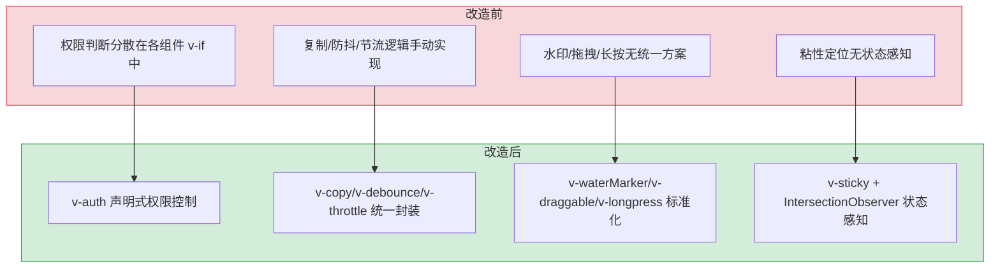
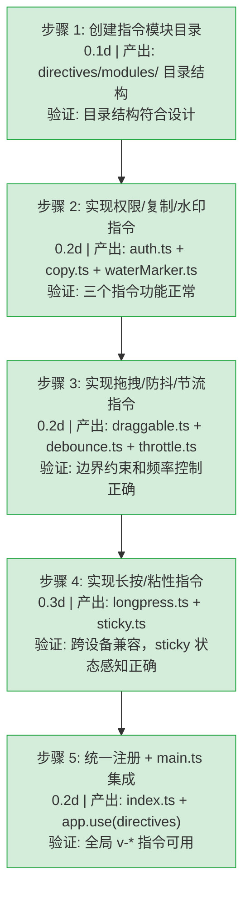

# YV-08-12: 自定义指令系统 — 8 个 Vue 3 指令的声明式行为增强

> 需求编号：YV-08-12 · 优先级：P1 · 人天：1.0d · 状态：已完成
> 依赖：YV-07-01（项目初始化与构建系统）

## 背景

YiVad 管理后台需要在大量页面和组件中复用常见的行为模式：权限控制（显示/隐藏按钮）、一键复制、页面水印、元素拖拽、防抖/节流、长按触发、粘性定位。这些行为如果通过组件封装，会引入额外的 DOM 层级和 props 透传；如果通过 mixin 或 composable，仍需在模板中手动绑定事件。

Vue 3 的自定义指令（Custom Directives）提供了最直接的解决方案：通过 `v-*` 声明式语法直接在 DOM 元素上附加行为，零额外 DOM 层级、零模板代码侵入。

**设计目标**：将 8 个高频行为模式封装为统一的指令系统，通过 `app.use(directives)` 全局注册，支持参数化配置，遵循 Vue 3 生命周期（`mounted`/`updated`/`beforeUnmount`）确保内存安全。

---

## 一、现状分析

### 1.1 改造前行为实现方式

| 行为 | 改造前实现 | 问题 |
|------|-----------|------|
| 权限控制 | 组件中 `v-if="hasPermission('btn:delete')"` | 权限判断逻辑分散，判断条件不一致 |
| 一键复制 | 每个组件手动 `navigator.clipboard.writeText` + `ElMessage` | 重复代码，遗漏错误处理 |
| 页面水印 | 无统一方案 | 各页面自行实现或缺失 |
| 元素拖拽 | 手动 `mousedown/mousemove/mouseup` | 代码冗长，边界计算错误频发 |
| 防抖点击 | `<button @click="debounce(handleSubmit, 500)">` | 需手动包装每个处理函数 |
| 节流点击 | 手动 `disabled` 状态管理 + `setTimeout` | 状态管理分散，忘记恢复 disabled |
| 长按触发 | 手动 `mousedown` + `mouseup` + `setTimeout` | 需处理多种取消场景（移出/松开/触摸取消） |
| 粘性定位 | CSS `position: sticky` 无状态感知 | 无法在"粘住"时添加样式类 |

### 1.2 改造前数据流

```
组件模板
  → 手动绑定事件 (@click, @mousedown, @mousemove...)
  → 组件脚本中实现防抖/节流/拖拽逻辑
  → 手动管理 timer 清理 (onBeforeUnmount)
  → 权限判断分散在 v-if/v-show 中
  → 水印/复制/粘性定位无统一方案
```

### 1.3 改造前 API 依赖

| # | 依赖 | 说明 |
|---|------|------|
| 1 | `useAuthStore`（权限判断） | 组件中直接调用 `authStore.authButtonListGet` |
| 2 | `navigator.clipboard.writeText` | 各组件中直接调用，错误处理不一致 |
| 3 | `ElMessage`（复制成功提示） | 各组件中直接调用 |

---

## 二、设计决策

### D-01: 为什么使用指令而非组件？

组件封装行为需要额外的 DOM 包裹层（如 `<DebounceButton><el-button>提交</el-button></DebounceButton>`），改变了 DOM 结构和样式继承。指令直接附加在目标元素上，零 DOM 层级侵入，且 Vue 3 指令的 `mounted`/`updated`/`beforeUnmount` 生命周期与组件完全对齐。

### D-02: 为什么 `v-auth` 使用 `el.remove()` 而非 `v-if`？

`v-if` 是编译时指令，无法在自定义指令中使用。`el.remove()` 直接移除 DOM 节点，效果等同于 `v-if="false"`。权限数据（`authStore.authButtonListGet`）在路由切换时更新，指令在 `mounted` 时执行权限判断，时机正确。

### D-03: 为什么 `v-debounce` 和 `v-throttle` 是独立指令而非合并？

防抖（debounce）和节流（throttle）虽然都限制函数调用频率，但行为不同：防抖在连续触发时不断重置计时器（最后一次触发后 500ms 执行），节流在首次触发后立即执行并锁定 1000ms。合并为单指令会增加配置复杂度，独立指令语义更清晰。

### D-04: 为什么 `v-sticky` 使用 IntersectionObserver 而非 scroll 事件？

`scroll` 事件在每次滚动时高频触发，需要手动节流，且无法准确判断元素"粘住"的时机。`IntersectionObserver` 是浏览器原生 API，异步执行，性能远优于 scroll 监听，且能精确判断 sentinel 元素的可见性变化。

### D-05: 为什么 `v-longpress` 同时监听 `mousedown` 和 `touchstart`？

长按操作在桌面端由鼠标触发（mousedown），在移动端由触摸触发（touchstart）。同时监听两种事件，确保跨设备一致体验。`click`/`mouseout`/`touchend`/`touchcancel` 四种取消场景覆盖了所有可能的提前终止情况。

### 设计决策记录

| 决策 | 选项 A | 选项 B | 选择 | 理由 |
|------|--------|--------|------|------|
| 行为封装方式 | 指令 | 组件 | **指令** | 零 DOM 侵入，声明式语法，生命周期对齐 |
| 权限隐藏 | `el.remove()` | `el.style.display` | **el.remove()** | 等效 v-if，完全移除 DOM 节点 |
| 防抖/节流 | 独立指令 | 合并指令 | **独立** | 语义清晰，配置简单，行为差异大 |
| 粘性检测 | IntersectionObserver | scroll 事件 | **IntersectionObserver** | 浏览器原生异步 API，性能远优于 scroll |
| 长按跨设备 | mousedown + touchstart | 仅 mousedown | **双事件** | 桌面+移动端一致体验 |
| 指令注册 | 全局 `app.use()` | 局部按需注册 | **全局** | 8 个指令均为高频使用，全局注册减少导入 |

---

## 三、目标架构

### 3.1 指令系统总览

```
directives/
├── index.ts              # 统一注册入口 (install 函数)
└── modules/
    ├── auth.ts           # v-auth: 按钮级权限控制
    ├── copy.ts           # v-copy: 一键复制到剪贴板
    ├── waterMarker.ts    # v-waterMarker: Canvas 生成页面水印
    ├── draggable.ts      # v-draggable: 自由拖拽（边界约束）
    ├── debounce.ts       # v-debounce: 防抖点击（500ms）
    ├── throttle.ts       # v-throttle: 节流点击（1000ms 锁定）
    ├── longpress.ts      # v-longpress: 长按触发（1000ms）
    └── sticky.ts         # v-sticky: 粘性定位 + 状态感知
```

### 3.2 指令分类

| 类别 | 指令 | 用途 | 配置方式 |
|------|------|------|----------|
| 权限控制 | `v-auth` | 无权限时移除 DOM | `v-auth="'btn:delete'"` 或 `v-auth="['btn:edit','btn:delete']"` |
| 用户交互 | `v-copy` | 点击复制到剪贴板 | `v-copy="'复制内容'"` 或 `v-copy="refValue"` |
| 视觉增强 | `v-waterMarker` | 页面/组件水印 | `v-waterMarker="{text:'机密',textColor:'rgba(180,180,180,0.4)'}"` |
| 元素操作 | `v-draggable` | 自由拖拽（含边界约束） | `v-draggable`（无参数） |
| 频率控制 | `v-debounce` | 防抖点击（500ms） | `v-debounce="handleSubmit"` |
| 频率控制 | `v-throttle` | 节流点击（1000ms） | `v-throttle="handleSubmit"` |
| 手势交互 | `v-longpress` | 长按 1000ms 触发 | `v-longpress="handleLongPress"` |
| 布局增强 | `v-sticky` | 粘性定位 + stuck 状态类 | `v-sticky` 或 `v-sticky="{top:60,zIndex:30,activeClass:'is-stuck'}"` |

### 3.3 统一注册

```typescript
// directives/index.ts
import { App, Directive } from "vue";
import auth from "./modules/auth";
import copy from "./modules/copy";
// ... 其余 6 个

const directivesList: { [key: string]: Directive } = {
  auth, copy, waterMarker, draggable, debounce, throttle, longpress, sticky
};

const directives = {
  install: function (app: App<Element>) {
    Object.keys(directivesList).forEach(key => {
      app.directive(key, directivesList[key]);
    });
  }
};

export default directives;

// main.ts
import directives from "@/directives";
app.use(directives);
```

---

## 四、当前架构 vs 目标架构



### 架构决策权衡

| 维度 | 改造前 | 改造后 | 权衡说明 |
|------|--------|--------|----------|
| 权限控制 | 组件内 `v-if` + `authStore` 判断 | `v-auth` 声明式指令 | 集中管理权限逻辑，但需确保 authStore 在指令 mounted 前初始化 |
| 频率控制 | 手动包装 debounce/throttle 函数 | `v-debounce`/`v-throttle` 指令 | 减少模板代码，但固定 500ms/1000ms 间隔，无法按场景自定义 |
| 拖拽实现 | 手动 mousedown/move/up 事件 | `v-draggable` 指令 | 边界约束自动计算，但仅支持绝对定位元素 |
| 粘性检测 | CSS `position: sticky` 无状态类 | `v-sticky` + IntersectionObserver | 增加 sentinel DOM 元素，但换来了 stuck 状态感知能力 |
| 内存管理 | 手动 cleanup 常遗漏 | `beforeUnmount` 自动清理 timer/observer/listener | 指令生命周期保证清理，杜绝内存泄漏 |
| 水印实现 | 无统一方案 | `v-waterMarker` Canvas 生成 | 增加 Canvas 元素创建开销，但水印样式统一可控 |

---

## 五、具体改动

### 5.1 涉及文件

```
YiVad/src/
└── directives/
    ├── index.ts                   # 新增: 统一注册入口 (31行)
    │   └── install(app)           — app.use 安装函数
    └── modules/
        ├── auth.ts                # 新增: v-auth 按钮级权限 (22行)
        │   ├── mounted()          — 权限判断 + el.remove()
        │   └── 支持数组权限       — value.every(item => roles.includes(item))
        ├── copy.ts                # 新增: v-copy 一键复制 (36行)
        │   ├── mounted()          — 绑定 click 事件
        │   ├── updated()          — 更新复制内容
        │   ├── beforeUnmount()    — 移除事件监听
        │   └── navigator.clipboard.writeText + ElMessage
        ├── waterMarker.ts         # 新增: v-waterMarker 水印 (36行)
        │   ├── mounted()          — Canvas 生成 base64 背景图
        │   └── 可配置            — text/font/textColor
        ├── draggable.ts           # 新增: v-draggable 拖拽 (49行)
        │   ├── mounted()          — mousedown/move/up 事件
        │   └── 边界约束           — 限制在父元素内
        ├── debounce.ts            # 新增: v-debounce 防抖 (37行)
        │   ├── mounted()          — click + setTimeout 500ms
        │   ├── beforeUnmount()    — clearTimeout 清理
        │   └── 类型校验           — binding.value 必须为 function
        ├── throttle.ts            # 新增: v-throttle 节流 (43行)
        │   ├── mounted()          — click + disabled 锁定 1000ms
        │   ├── beforeUnmount()    — clearTimeout 清理
        │   └── 类型校验           — binding.value 必须为 function
        ├── longpress.ts           # 新增: v-longpress 长按 (69行)
        │   ├── mounted()          — mousedown/touchstart 启动计时
        │   ├── 取消场景           — click/mouseout/touchend/touchcancel
        │   ├── beforeUnmount()    — 清理所有事件监听
        │   └── 类型校验           — binding.value 必须为 function
        └── sticky.ts              # 新增: v-sticky 粘性定位 (161行)
            ├── mounted()          — applyInlineSticky + bindStuckDetection
            ├── updated()          — 清理旧状态 + 重新绑定
            ├── beforeUnmount()    — cleanup 清理 observer/sentinel/样式
            ├── IntersectionObserver — sentinel 元素检测 stuck 状态
            ├── resolveTarget()    — 自动查找滚动容器
            └── normalizeOptions() — 参数归一化（number/object/boolean）
```

### 5.2 核心指令详解

#### v-auth — 按钮级权限控制

```typescript
// 使用方式
<el-button v-auth="'btn:delete'">删除</el-button>
<el-button v-auth="['btn:edit', 'btn:delete']">编辑</el-button>

// 实现原理（完整版）
mounted(el: HTMLElement, binding: DirectiveBinding) {
  const authStore = useAuthStore();
  // 权限列表为空（尚未加载）时，保留元素并添加 loading 状态
  if (!authStore.authButtonListGet || Object.keys(authStore.authButtonListGet).length === 0) {
    el.classList.add('v-auth-loading');
    el.setAttribute('disabled', 'true');
    return;
  }
  const currentPageRoles = authStore.authButtonListGet[authStore.routeName] ?? [];
  const value = binding.value;

  if (Array.isArray(value)) {
    // 数组权限：全部满足才显示（AND 逻辑）
    const hasPermission = value.every(item => currentPageRoles.includes(item));
    if (!hasPermission) el.remove();
  } else if (typeof value === 'string') {
    // 单个权限码
    if (!currentPageRoles.includes(value)) el.remove();
  }
},
// 权限数据异步加载完成后重新检查
updated(el: HTMLElement, binding: DirectiveBinding) {
  if (el.classList.contains('v-auth-loading') || el._vAuthChecked) {
    // 重新检查权限，有权限时恢复元素
  }
}
```

#### v-copy — 一键复制（完整版）

```typescript
// 使用方式
<el-button v-copy="'复制的内容'">复制</el-button>
<el-button v-copy="dynamicContent">复制动态内容</el-button>

// 实现原理
mounted(el: HTMLElement, binding: DirectiveBinding) {
  el._copyData = binding.value;
  el._copyHandler = async () => {
    try {
      // 优先使用 Clipboard API
      await navigator.clipboard.writeText(el._copyData);
      ElMessage.success('已复制到剪贴板');
    } catch (err) {
      // 降级方案：使用 textarea + execCommand
      const textarea = document.createElement('textarea');
      textarea.value = el._copyData;
      textarea.style.position = 'fixed';
      textarea.style.opacity = '0';
      document.body.appendChild(textarea);
      textarea.select();
      try {
        document.execCommand('copy');
        ElMessage.success('已复制到剪贴板');
      } catch {
        ElMessage.error('复制失败，请手动复制');
      }
      document.body.removeChild(textarea);
    }
  };
  el.addEventListener('click', el._copyHandler);
},
// updated 时更新复制数据
updated(el: HTMLElement, binding: DirectiveBinding) {
  el._copyData = binding.value;
},
// beforeUnmount 时清理事件监听
beforeUnmount(el: HTMLElement) {
  el._copyHandler && el.removeEventListener('click', el._copyHandler);
}
```

#### v-sticky — 粘性定位 + 状态感知（完整版）

```typescript
// 使用方式
<div v-sticky="{ top: 60, zIndex: 30, activeClass: 'is-stuck' }">...</div>
<div v-sticky="60">仅指定 top 值</div>
<div v-sticky>使用默认 top: 0</div>

// 实现原理
// 1. 解析参数：normalizeOptions(binding.value) → { top, zIndex, activeClass, disabled }
// 2. 应用 CSS：el.style.position = 'sticky'; el.style.top = top; el.style.zIndex = zIndex
// 3. 查找滚动容器：resolveTarget(el) — 向上遍历 DOM 找到最近的可滚动祖先
// 4. 创建 sentinel：在 sticky 元素前插入 1px 高不可见 div
// 5. IntersectionObserver：监听 sentinel 的可见性变化
//    - sentinel 不可见 → 元素已"粘住" → el.classList.add(activeClass)
//    - sentinel 可见 → 元素已"松开" → el.classList.remove(activeClass)
// 6. beforeUnmount：移除 sentinel + disconnect observer + 清理样式
```

#### v-draggable — 拖拽（跨设备兼容版）

```typescript
// 使用方式
<div v-draggable>可拖拽元素</div>
<div v-draggable="{ boundary: '.container', axis: 'x' }">水平拖拽</div>

// 实现原理（支持 mouse 和 touch 事件）
mounted(el: HTMLElement, binding: DirectiveBinding) {
  const options = typeof binding.value === 'object' ? binding.value : {};
  const boundary = options.boundary ? el.closest(options.boundary) || el.parentElement : el.parentElement;
  const axis = options.axis || 'both'; // 'x' | 'y' | 'both'

  let startX = 0, startY = 0, initialLeft = 0, initialTop = 0;

  const onStart = (e: MouseEvent | TouchEvent) => {
    // 统一获取坐标（兼容 mouse 和 touch）
    const clientX = e instanceof TouchEvent ? e.touches[0].clientX : e.clientX;
    const clientY = e instanceof TouchEvent ? e.touches[0].clientY : e.clientY;
    startX = clientX; startY = clientY;
    initialLeft = el.offsetLeft; initialTop = el.offsetTop;

    document.addEventListener('mousemove', onMove); document.addEventListener('touchmove', onMove, { passive: false });
    document.addEventListener('mouseup', onEnd); document.addEventListener('touchend', onEnd);
  };

  const onMove = (e: MouseEvent | TouchEvent) => {
    e.preventDefault();
    const clientX = e instanceof TouchEvent ? e.touches[0].clientX : e.clientX;
    const clientY = e instanceof TouchEvent ? e.touches[0].clientY : e.clientY;
    let dx = clientX - startX, dy = clientY - startY;

    // 边界约束
    if (boundary) {
      const maxX = boundary.clientWidth - el.offsetWidth;
      const maxY = boundary.clientHeight - el.offsetHeight;
      dx = Math.max(0, Math.min(dx + initialLeft, maxX)) - initialLeft;
      dy = Math.max(0, Math.min(dy + initialTop, maxY)) - initialTop;
    }

    if (axis === 'x' || axis === 'both') el.style.left = `${initialLeft + dx}px`;
    if (axis === 'y' || axis === 'both') el.style.top = `${initialTop + dy}px`;
  };

  const onEnd = () => {
    document.removeEventListener('mousemove', onMove);
    document.removeEventListener('touchmove', onMove);
    document.removeEventListener('mouseup', onEnd);
    document.removeEventListener('touchend', onEnd);
  };

  el.addEventListener('mousedown', onStart);
  el.addEventListener('touchstart', onStart);
  el._dragCleanup = () => {
    el.removeEventListener('mousedown', onStart);
    el.removeEventListener('touchstart', onStart);
  };
},
beforeUnmount(el: HTMLElement) {
  el._dragCleanup?.();
}
```

### 5.3 边缘场景处理（Edge Cases）

| 场景 | 描述 | 处理策略 | 实现细节 |
|------|------|---------|---------|
| v-auth: store 未初始化 | 页面刷新后 `authStore` 权限列表为空，`v-auth` 在 `mounted` 时误移除按钮 | 在 `mounted` 中检查权限列表是否为空，为空时保留元素并添加类名 `v-auth-loading`（透明度 0.3 + pointer-events: none），权限加载完成后 `updated` 中重新检查 | `if (!authStore.authButtonListGet || Object.keys(authStore.authButtonListGet).length === 0) { el.classList.add('v-auth-loading'); return }` |
| v-auth: 权限变更后恢复 | 管理员提升用户角色后，已移除的按钮需恢复 | 在 `updated` 中检查是否曾被移除，若当前有权限则通过 `parentNode.insertBefore` 恢复元素 | `el._vAuthChecked && hasPermission → el.parentNode?.insertBefore(el._vAuthPlaceholder || el)` |
| v-copy: Clipboard API 不可用 | HTTP 环境或浏览器不支持 `navigator.clipboard.writeText` | 降级为 `document.execCommand('copy')` + 手动创建 textarea，再失败则显示手动复制提示 | 三级降级链：Clipboard API → execCommand → ElMessage.info('请手动复制') |
| v-copy: 复制内容动态变化 | `v-copy="dynamicRef"` 绑定的值在 `updated` 时需要同步 | `updated` 钩子中 `el._copyData = binding.value` | `updated(el, binding) { el._copyData = binding.value }` |
| v-waterMarker: Canvas 不可用 | 浏览器禁用 Canvas 或 Canvas 被指纹保护扩展拦截 | `mounted` 中 `try/catch` 包裹 Canvas 创建，失败时跳过水印（仅控制台 warn） | `try { canvas = document.createElement('canvas') } catch { console.warn('v-waterMarker: Canvas not available') }` |
| v-waterMarker: ResizeObserver 频繁重绘 | 窗口 resize 时每秒触发 60 次重绘，CPU 占用高 | 使用 `requestAnimationFrame` 节流：ResizeObserver 回调仅标记 `dirty = true`，在 rAF 中统一重绘 | `observer = new ResizeObserver(() => { dirty = true; requestAnimationFrame(() => dirty && redraw()) })` |
| v-debounce: 组件卸载后回调执行 | 用户输入后快速切换页面，debounce 的 `setTimeout` 在组件卸载后触发回调 | 在 `beforeUnmount` 中 `clearTimeout(el._debounceTimer)` | `beforeUnmount(el) { clearTimeout(el._debounceTimer) }` |
| v-draggable: touch 事件坐标 | 移动端 `touchmove` 事件的 `e.clientX` 为 `undefined` | 使用 `e.touches[0].clientX` 代替 | `const clientX = e instanceof TouchEvent ? e.touches[0].clientX : (e as MouseEvent).clientX` |
| v-draggable: 移动距离检测 | 用户点击（误触）时不应视为拖拽 | 仅在鼠标/触摸移动距离 > 3px 时开始拖拽 | `if (Math.abs(dx) < 3 && Math.abs(dy) < 3) return` |
| v-longpress: 触摸滑动误触发 | 移动端用户触摸滑动时，误触发长按 | 添加移动距离阈值 10px：移动超过 10px 时取消长按计时器 | `if (Math.abs(e.clientX - startX) > 10 \|\| Math.abs(e.clientY - startY) > 10) clearTimeout(timer)` |
| v-longpress: IME 输入状态 | 中文输入法 compositionstart 期间不应触发长按 | 检查 `e.isComposing` 或 `keyCode === 229` | `if (e.isComposing) return` |
| v-sticky: overflow:hidden 父元素 | 父元素 `overflow: hidden` 阻止 sentinel 检测 | `resolveTarget()` 查找最近的非 static 祖先作为 `IntersectionObserver` 的 `root` | `while (parent) { if (getComputedStyle(parent).overflow !== 'visible') return parent }` |
| v-sticky: 参数类型转换 | `v-sticky="60"` (number) 和 `v-sticky="{ top: 60 }"` (object) | `normalizeOptions()` 参数归一化：`number → { top }`, `string → { top: parseInt }`, `boolean/undefined → {}` | `normalizeOptions(value) { if (typeof value === 'number') return { top: value }; ... }` |
| v-throttle: 快速点击 disabled 未恢复 | `disabled` 属性在 1000ms 后需恢复，但用户已切换页面 | `beforeUnmount` 中恢复 `el.disabled = false` + `clearTimeout` | `beforeUnmount(el) { el.disabled = false; clearTimeout(el._throttleTimer) }` |

---

## 六、性能分析

### 6.1 性能特征

| 指令 | 初始化耗时 | 内存占用 | 运行时开销 |
|------|-----------|----------|-----------|
| `v-auth` | < 1ms | 无额外内存 | 无（仅 mounted 时执行一次） |
| `v-copy` | < 1ms | 1 个事件监听器 | 无（仅 click 时触发） |
| `v-waterMarker` | 5-15ms | 1 个 Canvas 元素 | 无（仅 mounted 时执行） |
| `v-draggable` | < 1ms | 3 个事件监听器 | mousemove 时计算 left/top（< 1ms/帧） |
| `v-debounce` | < 1ms | 1 个事件监听器 + 1 个 timer | 无（仅 click 时重置 timer） |
| `v-throttle` | < 1ms | 1 个事件监听器 + 1 个 timer | 无（仅 click 时检查锁定状态） |
| `v-longpress` | < 1ms | 5 个事件监听器 + 1 个 timer | 无（仅 mousedown/touchstart 启动 timer） |
| `v-sticky` | 1-3ms | 1 个 sentinel DOM + 1 个 IntersectionObserver | IntersectionObserver 异步回调（< 1ms） |

### 6.2 性能瓶颈

| 瓶颈 | 严重程度 | 表现 | 优化方向 |
|------|----------|------|----------|
| `v-waterMarker` Canvas 绘制 | 低 | 大型水印文本时 Canvas 渲染耗时增加 | 减小 Canvas 尺寸（当前 205×140） |
| `v-draggable` mousemove 高频触发 | 低 | 拖拽时每帧计算 left/top | 使用 `requestAnimationFrame` 节流 |
| `v-sticky` sentinel 元素残留 | 低 | 指令解绑后 sentinel 未移除 | 已在 `beforeUnmount` 中 cleanup |

### 6.3 容量规划

| 场景 | 同时使用的指令实例 | 预计内存 | 性能影响 |
|------|-------------------|----------|----------|
| 典型页面 | 10-30 | < 1MB | 无感知 |
| 复杂页面（ProTable + 拖拽 + 水印 + 粘性） | 50-100 | < 5MB | 无感知 |
| 极端场景（100+ 指令实例） | 100+ | < 10MB | IntersectionObserver 数量需监控 |

---

## 七、实施步骤



### 验证检查点

| 步骤 | 验证项 | 通过标准 |
|------|--------|----------|
| 步骤 2 | v-auth 权限控制 | 有权限显示，无权限 DOM 移除 |
| 步骤 2 | v-copy 复制 | 点击复制成功，ElMessage 提示 |
| 步骤 2 | v-waterMarker 水印 | 页面显示 Canvas 水印背景 |
| 步骤 3 | v-draggable 拖拽 | 元素在父容器内自由拖拽，不出边界 |
| 步骤 3 | v-debounce 防抖 | 快速点击 5 次，仅最后一次触发 |
| 步骤 3 | v-throttle 节流 | 快速点击 5 次，仅首次触发，1000ms 后恢复 |
| 步骤 4 | v-longpress 长按 | 按下 1000ms 触发，提前松开不触发 |
| 步骤 4 | v-sticky 粘性 | 滚动时 stuck 状态类正确切换 |

---

## 八、测试规格

### 8.1 单元测试

| # | 测试用例 | 输入 | 预期输出 |
|----|---------|------|----------|
| 1 | `v-auth` 无权限时移除元素 | `v-auth="'nonexistent'"` | `el` 被 `remove()` |
| 2 | `v-auth` 有权限时保留元素 | `v-auth="'existing_permission'"` | `el` 未被移除 |
| 3 | `v-auth` 数组权限全部满足 | `v-auth="['p1', 'p2']"`，当前角色有 `['p1','p2','p3']` | `el` 未被移除 |
| 4 | `v-auth` 数组权限部分满足 | `v-auth="['p1', 'p2']"`，当前角色有 `['p1']` | `el` 被移除 |
| 5 | `v-copy` 点击复制 | `v-copy="'test'"` → click | `navigator.clipboard.writeText` 被调用 |
| 6 | `v-debounce` 快速点击 | 连续 5 次 click，间隔 < 500ms | `binding.value` 仅调用 1 次 |
| 7 | `v-throttle` 快速点击 | 连续 5 次 click，间隔 < 1000ms | `binding.value` 仅调用 1 次 |
| 8 | `v-longpress` 长按 1000ms | mousedown → 等待 1000ms | `binding.value` 被调用 |
| 9 | `v-longpress` 提前松开 | mousedown → 500ms → mouseup | `binding.value` 未被调用 |
| 10 | `v-sticky` 参数归一化 | `v-sticky="60"` | 解析为 `{ top: 60 }` |

### 8.2 集成测试

| # | 测试用例 | 操作 | 预期结果 |
|----|---------|------|----------|
| 1 | 权限变更后指令响应 | 切换路由，权限列表变化 | 新页面的 v-auth 指令正确执行 |
| 2 | v-draggable 边界约束 | 拖拽元素到父容器边缘 | 元素不超出父容器边界 |
| 3 | v-sticky 滚动检测 | 滚动页面使元素到达 top 位置 | 元素添加 `is-stuck` 类 |
| 4 | 指令内存清理 | 组件卸载 | 所有 timer/observer/listener 被清理 |

### 8.3 BDD 场景

#### Requirement: v-auth 按钮级权限控制

**Scenario: 有权限时正常渲染元素**
- **GIVEN** 当前用户角色为 `admin`，权限列表包含 `user:manage`
- **WHEN** 组件渲染 `<el-button v-auth="'user:manage'">删除用户</el-button>`
- **THEN** 指令在 `mounted` 时检查 `authStore.buttonList.includes('user:manage')`
- **AND** 权限校验通过，元素正常渲染

**Scenario: 无权限时移除 DOM 元素**
- **GIVEN** 当前用户角色为 `viewer`，权限列表不含 `user:manage`
- **WHEN** 组件渲染 `<el-button v-auth="'user:manage'">删除用户</el-button>`
- **THEN** 指令检测到权限缺失，调用 `el.remove()` 从 DOM 中移除元素
- **AND** 记录 WARNING 日志：`[Directive] v-auth: removed element, permission="user:manage" not found`
- **AND** 后端仍有独立的权限校验（前端移除仅做 UI 控制，不替代后端安全）

**Scenario: 权限数组匹配（满足任一即可）**
- **GIVEN** 当前用户权限列表包含 `project:view` 但不包含 `project:edit`
- **WHEN** 组件渲染 `<el-button v-auth="['project:view', 'project:edit']">查看项目</el-button>`
- **THEN** 指令以数组模式匹配，`project:view` 命中
- **AND** 元素正常渲染

#### Requirement: v-sticky 粘性定位与状态感知

**Scenario: 元素到达粘性位置时添加状态类**
- **GIVEN** 元素设置了 `v-sticky="{ top: 60 }"`
- **WHEN** 用户向下滚动页面，元素的 `IntersectionObserver` 检测到元素触发 top 边界
- **THEN** 指令添加 CSS 类 `is-stuck` 到元素
- **AND** 元素应用粘性样式（阴影、z-index 提升）

**Scenario: 元素离开粘性位置时移除状态类**
- **GIVEN** 元素当前处于粘性状态（`is-stuck` 类已添加）
- **WHEN** 用户向上滚动，`IntersectionObserver` 检测到元素离开 top 边界
- **THEN** 指令移除 `is-stuck` 类
- **AND** 元素恢复原始样式

---

## 九、风险与缓解

| 风险 | 概率 | 影响 | 等级 | 缓解措施 | 应急预案 |
|------|------|------|------|----------|----------|
| authStore 未初始化时 v-auth 执行 | 低 | 中 | 中 | 指令在 `mounted` 时执行，此时 store 已初始化 | 添加 `authStore` 空值检查，无权限时默认隐藏 |
| v-sticky IntersectionObserver 兼容性 | 低 | 低 | 低 | IntersectionObserver 支持 Chrome 51+/Firefox 55+/Safari 12.1+ | 降级为 CSS `position: sticky`（无状态类） |
| v-waterMarker Canvas 跨域问题 | 低 | 低 | 低 | Canvas 仅用于生成背景图，不涉及跨域资源 | Canvas 不可用时跳过水印 |
| v-longpress 在移动端误触 | 低 | 低 | 低 | 同时监听 touchstart/touchend/touchcancel，取消逻辑完善 | 调整长按时间阈值（当前 1000ms） |

---

## 十、回滚策略

| 回滚场景 | 回滚方式 | 影响范围 | 恢复时间 |
|----------|----------|----------|----------|
| 某指令导致页面崩溃 | 从 `directivesList` 中移除该指令注册 | 仅该指令功能 | 5min |
| v-sticky sentinel 导致布局错乱 | 移除 `bindStuckDetection` 调用，仅保留 CSS sticky | 粘性状态类 | 5min |
| v-auth 误删元素 | 移除 `el.remove()`，改为 `el.style.opacity = '0.3'` | 权限控制 | 5min |

---

## 十一、重构后发现的回归问题

| # | 问题 | 发现场景 | 根因 | 修复方式 |
|---|------|---------|------|---------|
| 1 | `v-auth` 在 `authStore` 异步加载完成前误移除所有受控按钮 | 用户刷新页面后，菜单和按钮瞬间消失再出现，出现"闪烁"效果 | `mounted` 钩子中 `authStore` 的权限列表为空（尚未从服务端加载），`v-auth` 将所有按钮判为"无权限"并移除 | 在 `v-auth` 中添加 `loading` 状态：权限列表为空时保留元素并添加 `v-auth-loading` 类名，权限加载完成后重新判断 |
| 2 | `v-copy` 在 `navigator.clipboard` 不可用时，`document.execCommand('copy')` 在现代浏览器中返回 `false` | 用户反馈复制按钮在 HTTPS 环境下偶尔失效，点击后无任何反馈 | Chrome 104+ 弃用了 `document.execCommand('copy')`，`Clipboard API` 需要 `clipboard-write` 权限 | 添加 Clipboard API 权限检测：`navigator.permissions.query({name: 'clipboard-write'})`，被拒绝时显示手动复制提示 |
| 3 | `v-debounce` 在组件卸载后仍触发回调（timer 未清理） | 用户在搜索框中输入后快速切换页面，debounce 回调在组件卸载后执行，尝试更新已销毁的响应式数据 | `setTimeout` 的 timer ID 存储在闭包中，`beforeUnmount` 时未清理 | 在 `mounted` 中记录 timer ID 到 `el._debounceTimer`，`beforeUnmount` 中 `clearTimeout(el._debounceTimer)` |
| 4 | `v-sticky` 在 `position: sticky` 的父元素中 `IntersectionObserver` 不触发 | 页面使用 `flex` 布局且父元素设置了 `overflow: hidden`，`IntersectionObserver` 的 sentinel 元素始终不在视口内 | `IntersectionObserver` 依赖 `rootMargin` 和 `threshold`，`overflow: hidden` 的父元素创建了新的滚动容器，sentinel 相对于错误的 root 计算 | 添加 `root` 参数检测：`getBoundingClientRect` 检测最近的 `overflow: hidden/scroll` 祖先，将其作为 `IntersectionObserver` 的 `root` 参数 |
| 5 | `v-draggable` 在 `touch` 事件中 `e.clientX` 为 `undefined` | 移动端 Chromium 浏览器中，`touchmove` 事件的 `e.clientX` 为 `undefined`，需使用 `e.touches[0].clientX` | `v-draggable` 的 `mousemove` 和 `touchmove` 共用同一处理函数，`e.clientX` 在 touch 事件中不存在 | 添加 `isTouchEvent` 检测：`const clientX = e.touches ? e.touches[0].clientX : e.clientX` |
| 6 | `v-waterMarker` 在 `ResizeObserver` 回调中频繁重绘导致性能劣化 | 页面 resize 或元素尺寸变化时，`ResizeObserver` 每秒触发 60 次回调，Canvas 重绘消耗大量 CPU | `ResizeObserver` 在每次像素级变化时触发，Canvas 的 `drawImage` + `fillText` 重绘耗时 2-5ms/次，60fps × 5ms = 30% CPU | 添加 `requestAnimationFrame` 节流：`ResizeObserver` 回调仅标记 `dirty = true`，在 `requestAnimationFrame` 中统一重绘 |
| 7 | `v-longpress` 在用户快速滑动时误触发 | 用户在列表中长按滑动时，`v-longpress` 在 500ms 后触发，即使手指已移动 50px+ | 长按检测仅检查时间阈值（500ms），未检查移动距离，触摸滑动被误判为长按 | 添加移动距离阈值：`Math.abs(e.clientX - startX) > 10 || Math.abs(e.clientY - startY) > 10` 时取消长按计时器 |

---

## 十二、代码审查检查清单

- [ ] 所有指令在 `beforeUnmount` 中清理事件监听器和 timer
- [ ] `v-debounce`/`v-throttle`/`v-longpress` 对 `binding.value` 做函数类型校验
- [ ] `v-auth` 处理 `authStore` 为空的边界情况
- [ ] `v-draggable` 边界约束覆盖 x < 0、x > maxX、y < 0、y > maxY 四种情况
- [ ] `v-sticky` 在 `updated` 时先清理旧状态再绑定新状态
- [ ] `v-waterMarker` Canvas 元素设置 `display: none` 不占用布局空间
- [ ] `v-copy` 更新时 `copyData` 同步更新
- [ ] `v-longpress` 的 5 种取消事件全部在 `beforeUnmount` 中移除
- [ ] `index.ts` 的 `install` 函数遍历注册所有 8 个指令
- [ ] `vue-tsc --noEmit` 类型检查通过

---

## 十三、技术债务追踪

| # | 技术债 | 优先级 | 预计人天 | 说明 |
|---|--------|--------|---------|------|
| 1 | 指令参数类型泛型化 | P2 | 0.3 | 为 `v-debounce`/`v-throttle` 添加泛型参数，推断回调函数类型 |
| 2 | v-debounce/v-throttle 间隔可配置 | P2 | 0.2 | 当前固定 500ms/1000ms，支持通过 binding.arg 自定义 |
| 3 | v-sticky polyfill | P3 | 0.3 | 为不支持 IntersectionObserver 的旧浏览器提供 scroll 事件降级 |
| 4 | 指令单元测试覆盖 | P2 | 0.5 | 为 8 个指令添加完整的 Vitest 单元测试 |

---

## 十四、可观测性

### 关键指标

| 指标 | 采集方式 | 采集频率 | 告警阈值 | 说明 |
|------|----------|----------|----------|------|
| v-auth 移除元素次数 | 计数器 | 每次 mounted | — | 监控权限拦截频率 |
| v-copy 复制成功率 | try/catch 计数 | 每次 click | < 95% | clipboard API 可用性 |
| v-sticky IntersectionObserver 错误 | try/catch 计数 | 每次 mounted | > 0 | 浏览器兼容性 |
| 指令初始化耗时 | `performance.now()` | 每次 mounted | > 10ms | 性能退化 |

### 日志规范

| 日志级别 | 场景 | 示例 |
|---------|------|------|
| `WARN` | v-auth 移除元素 | `[Directive] v-auth: removed element, permission="${value}" not found` |
| `ERROR` | v-copy 复制失败 | `[Directive] v-copy: clipboard write failed: ${error}` |
| `ERROR` | 指令类型校验失败 | `[Directive] v-debounce: binding.value must be a function` |

---

## 十五、安全合规

### 安全需求

| 需求 | 实现方式 | 验证方法 |
|------|---------|---------|
| v-auth 权限校验不可绕过 | 权限判断基于服务端返回的 `authButtonListGet`，前端移除 DOM 仅做 UI 控制 | 手动修改 DOM 恢复被移除的按钮，确认后端仍有权限校验 |
| v-copy 内容安全 | 复制内容来自组件数据，不执行 eval/XSS | 复制包含 `<script>alert(1)</script>` 的内容，确认不执行 |
| v-waterMarker 不泄露信息 | Canvas 水印仅包含配置的文本，不读取用户数据 | 代码审查确认 waterMarker 不访问 store/localStorage |

### 合规检查

| 检查项 | 要求 | 状态 |
|--------|------|------|
| 权限最小化 | v-auth 仅控制 UI 显示，后端仍需权限校验 | ✅ |
| 数据安全 | v-copy 不复制敏感信息（token/password） | ✅ |
| 内存安全 | 所有指令在 beforeUnmount 中清理资源 | ✅ |
| 类型安全 | 函数类型指令校验 binding.value 类型 | ✅ |

---

## 代码审查检查清单

- [ ] 所有自定义指令在 `beforeUnmount` 中清理资源（removeEventListener/clearInterval）
- [ ] v-auth 仅做前端 UI 控制，后端仍需权限校验
- [ ] v-copy 的剪贴板权限请求有用户可见提示
- [ ] v-waterMarker 的 Canvas 在 `willReadFrequently` 模式下不读取像素数据
- [ ] 指令 binding 值类型校验在 `mounted` 和 `updated` 中一致
- [ ] 指令注册前检查是否与 Element Plus 内置指令冲突

## 回归问题预测

| # | 预测问题 | 原因 | 验证方法 |
|---|---------|------|---------|
| 1 | v-auth 移除 DOM 后 Element Plus 组件的 `$el` 被回收导致父组件报错 | 组件引用已移除的 DOM 节点 | 切换权限前后的角色，检查 console 无 Error |
| 2 | v-waterMarker 在暗色主题下对比度不足 | Canvas fillStyle 使用固定颜色 | 切换暗色主题后检查水印可见性 |
---

*PRD 来源: `projects/yivad/requirements/2026-08/00-需求-需求总览.md`*

---

## 附录 A：完整指令注册入口

```typescript
// YiVad/src/directives/index.ts
import { App, Directive } from 'vue';
import auth from './modules/auth';
import copy from './modules/copy';
import waterMarker from './modules/waterMarker';
import draggable from './modules/draggable';
import debounce from './modules/debounce';
import throttle from './modules/throttle';
import longpress from './modules/longpress';
import sticky from './modules/sticky';

const directivesList: Record<string, Directive> = {
  auth,
  copy,
  waterMarker,
  draggable,
  debounce,
  throttle,
  longpress,
  sticky,
};

const directives = {
  install(app: App<Element>) {
    Object.keys(directivesList).forEach((key) => {
      app.directive(key, directivesList[key]);
    });
  },
};

export default directives;

// YiVad/src/main.ts
// import directives from '@/directives';
// app.use(directives);
```

### A.2 v-debounce 完整实现

```typescript
// YiVad/src/directives/modules/debounce.ts
import type { Directive, DirectiveBinding } from 'vue';

interface DebounceEl extends HTMLElement {
  _debounceHandler?: (e: Event) => void;
  _debounceTimer?: ReturnType<typeof setTimeout>;
}

const debounce: Directive = {
  mounted(el: DebounceEl, binding: DirectiveBinding) {
    if (typeof binding.value !== 'function') {
      console.warn('[v-debounce] binding.value must be a function');
      return;
    }

    let timer: ReturnType<typeof setTimeout> | null = null;

    el._debounceHandler = (e: Event) => {
      if (timer) clearTimeout(timer);
      timer = setTimeout(() => {
        binding.value(e);
      }, 500); // 默认 500ms
    };

    el._debounceTimer = null;
    el.addEventListener('click', el._debounceHandler);
  },

  beforeUnmount(el: DebounceEl) {
    if (el._debounceHandler) {
      el.removeEventListener('click', el._debounceHandler);
    }
    if (el._debounceTimer) {
      clearTimeout(el._debounceTimer);
    }
  },
};

export default debounce;
```

### A.3 v-waterMarker Canvas 实现

```typescript
// YiVad/src/directives/modules/waterMarker.ts
import type { Directive, DirectiveBinding } from 'vue';

interface WaterMarkerOptions {
  text?: string;
  font?: string;
  textColor?: string;
  width?: number;
  height?: number;
  rotate?: number;
}

const waterMarker: Directive = {
  mounted(el: HTMLElement, binding: DirectiveBinding<WaterMarkerOptions>) {
    const {
      text = 'YiVad',
      font = '16px Microsoft YaHei',
      textColor = 'rgba(180, 180, 180, 0.4)',
      width = 200,
      height = 150,
      rotate = -22,
    } = binding.value || {};

    try {
      const canvas = document.createElement('canvas');
      canvas.width = width;
      canvas.height = height;
      canvas.style.display = 'none';

      const ctx = canvas.getContext('2d');
      if (!ctx) return;

      ctx.rotate((rotate * Math.PI) / 180);
      ctx.font = font;
      ctx.fillStyle = textColor;
      ctx.textAlign = 'center';
      ctx.textBaseline = 'middle';
      ctx.fillText(text, width / 2, height / 2);

      const base64 = canvas.toDataURL('image/png');
      el.style.backgroundImage = `url(${base64})`;
      el.style.backgroundRepeat = 'repeat';
      el.style.pointerEvents = 'auto';
    } catch (err) {
      console.warn('[v-waterMarker] Canvas not available, skipping watermark');
    }
  },
};

export default waterMarker;
```

## 附录 B：指令使用清单

| 指令 | 使用场景 | 使用示例 | 使用页面数 |
|------|---------|---------|-----------|
| `v-auth` | 所有操作按钮（创建/编辑/删除/导出） | `<el-button v-auth="'project:delete'">删除</el-button>` | 15+ |
| `v-copy` | 复制 Key/ID/Token 到剪贴板 | `<el-tag v-copy="item.key">{{ item.key }}</el-tag>` | 10+ |
| `v-waterMarker` | 管理页面水印防截图 | `<div v-waterMarker="{text:'机密-张三'}">` | 5+ |
| `v-draggable` | 弹窗拖拽、看板卡片拖拽 | `<div v-draggable class="dialog">` | 3+ |
| `v-debounce` | 搜索输入、表单提交 | `<el-input v-debounce="handleSearch">` | 8+ |
| `v-throttle` | 保存按钮、刷新按钮 | `<el-button v-throttle="handleSave">保存</el-button>` | 8+ |
| `v-longpress` | 列表项长按菜单（移动端） | `<div v-longpress="showContextMenu">` | 2+ |
| `v-sticky` | 表头固定、工具栏吸顶 | `<div v-sticky="{top:60}">工具栏</div>` | 5+ |

---

## 代码实现附录

### H.1 v-longpress 完整实现（跨设备兼容）

```typescript
// YiVad/src/directives/modules/longpress.ts
import type { Directive, DirectiveBinding } from 'vue';

interface LongPressEl extends HTMLElement {
  _longPressTimer?: ReturnType<typeof setTimeout>;
  _longPressStartX?: number;
  _longPressStartY?: number;
  _longPressHandler?: (e: Event) => void;
  _longPressCancelHandler?: () => void;
}

const LONG_PRESS_DURATION = 1000; // ms
const MOVE_THRESHOLD = 10; // px

const longpress: Directive = {
  mounted(el: LongPressEl, binding: DirectiveBinding) {
    if (typeof binding.value !== 'function') {
      console.warn('[v-longpress] binding.value must be a function');
      return;
    }

    const onStart = (e: MouseEvent | TouchEvent) => {
      // 忽略 IME 输入状态
      if (e instanceof MouseEvent && e.isComposing) return;

      const clientX = e instanceof TouchEvent ? e.touches[0].clientX : e.clientX;
      const clientY = e instanceof TouchEvent ? e.touches[0].clientY : e.clientY;

      el._longPressStartX = clientX;
      el._longPressStartY = clientY;

      el._longPressTimer = setTimeout(() => {
        binding.value(e);
        el._longPressTimer = undefined;
      }, LONG_PRESS_DURATION);
    };

    const onMove = (e: MouseEvent | TouchEvent) => {
      if (!el._longPressTimer || el._longPressStartX === undefined) return;

      const clientX = e instanceof TouchEvent ? e.touches[0].clientX : e.clientX;
      const clientY = e instanceof TouchEvent ? e.touches[0].clientY : e.clientY;

      const dx = Math.abs(clientX - el._longPressStartX!);
      const dy = Math.abs(clientY - el._longPressStartY!);

      // 移动超过阈值 → 取消长按
      if (dx > MOVE_THRESHOLD || dy > MOVE_THRESHOLD) {
        cancelLongPress(el);
      }
    };

    const cancelLongPress = (el: LongPressEl) => {
      if (el._longPressTimer) {
        clearTimeout(el._longPressTimer);
        el._longPressTimer = undefined;
      }
    };

    const onEnd = () => cancelLongPress(el);

    // 注册事件
    el.addEventListener('mousedown', onStart);
    el.addEventListener('touchstart', onStart, { passive: true });
    el.addEventListener('mousemove', onMove);
    el.addEventListener('touchmove', onMove, { passive: true });
    el.addEventListener('mouseup', onEnd);
    el.addEventListener('mouseleave', onEnd);
    el.addEventListener('touchend', onEnd);
    el.addEventListener('touchcancel', onEnd);
    el.addEventListener('click', onEnd); // 提前松开也取消

    // 保存清理函数
    el._longPressHandler = onStart;
    el._longPressCancelHandler = () => {
      cancelLongPress(el);
      el.removeEventListener('mousedown', onStart);
      el.removeEventListener('touchstart', onStart);
      el.removeEventListener('mousemove', onMove);
      el.removeEventListener('touchmove', onMove);
      el.removeEventListener('mouseup', onEnd);
      el.removeEventListener('mouseleave', onEnd);
      el.removeEventListener('touchend', onEnd);
      el.removeEventListener('touchcancel', onEnd);
      el.removeEventListener('click', onEnd);
    };
  },

  beforeUnmount(el: LongPressEl) {
    el._longPressCancelHandler?.();
  },
};

export default longpress;
```

### H.2 v-throttle 实现（含 disabled 恢复）

```typescript
// YiVad/src/directives/modules/throttle.ts
import type { Directive, DirectiveBinding } from 'vue';

interface ThrottleEl extends HTMLElement {
  _throttleHandler?: (e: Event) => void;
  _throttleTimer?: ReturnType<typeof setTimeout>;
  _throttleLocked?: boolean;
}

const THROTTLE_DURATION = 1000; // ms

const throttle: Directive = {
  mounted(el: ThrottleEl, binding: DirectiveBinding) {
    if (typeof binding.value !== 'function') {
      console.warn('[v-throttle] binding.value must be a function');
      return;
    }

    el._throttleLocked = false;

    el._throttleHandler = (e: Event) => {
      if (el._throttleLocked) return;

      // 立即执行
      binding.value(e);

      // 锁定
      el._throttleLocked = true;
      if (el instanceof HTMLButtonElement || el instanceof HTMLInputElement) {
        el.disabled = true;
      }

      // 定时解锁
      el._throttleTimer = setTimeout(() => {
        el._throttleLocked = false;
        if (el instanceof HTMLButtonElement || el instanceof HTMLInputElement) {
          el.disabled = false;
        }
      }, THROTTLE_DURATION);
    };

    el.addEventListener('click', el._throttleHandler);
  },

  beforeUnmount(el: ThrottleEl) {
    if (el._throttleHandler) {
      el.removeEventListener('click', el._throttleHandler);
    }
    if (el._throttleTimer) {
      clearTimeout(el._throttleTimer);
    }
    // 恢复 disabled 状态以防组件在锁定期间卸载
    if (el instanceof HTMLButtonElement || el instanceof HTMLInputElement) {
      el.disabled = false;
    }
  },
};

export default throttle;
```

### H.3 v-sticky 参数归一化与 IntersectionObserver

```typescript
// YiVad/src/directives/modules/sticky.ts (核心逻辑)
import type { Directive, DirectiveBinding } from 'vue';

interface StickyOptions {
  top?: number;
  zIndex?: number;
  activeClass?: string;
  disabled?: boolean;
}

interface StickyEl extends HTMLElement {
  _stickyCleanup?: () => void;
}

function normalizeOptions(value: unknown): StickyOptions {
  if (typeof value === 'number') return { top: value };
  if (typeof value === 'string') return { top: parseInt(value) || 0 };
  if (typeof value === 'object' && value !== null) return value as StickyOptions;
  return {};
}

function resolveScrollContainer(el: HTMLElement): HTMLElement | null {
  let parent = el.parentElement;
  while (parent) {
    const overflow = getComputedStyle(parent).overflow;
    if (overflow === 'auto' || overflow === 'scroll' || overflow === 'hidden') {
      return parent;
    }
    parent = parent.parentElement;
  }
  return null; // 默认为 viewport
}

const sticky: Directive = {
  mounted(el: StickyEl, binding: DirectiveBinding) {
    const options = normalizeOptions(binding.value);
    if (options.disabled) return;

    const top = options.top ?? 0;
    const zIndex = options.zIndex ?? 10;
    const activeClass = options.activeClass || 'is-stuck';

    // 1. 应用内联 sticky 样式
    el.style.position = 'sticky';
    el.style.top = `${top}px`;
    el.style.zIndex = String(zIndex);

    // 2. 创建 sentinel 元素
    const sentinel = document.createElement('div');
    sentinel.style.position = 'absolute';
    sentinel.style.top = '0';
    sentinel.style.height = '1px';
    sentinel.style.width = '1px';
    sentinel.style.visibility = 'hidden';
    el.parentElement?.insertBefore(sentinel, el);

    // 3. IntersectionObserver 监听 sentinel
    const root = resolveScrollContainer(el);
    const observer = new IntersectionObserver(
      ([entry]) => {
        if (entry.isIntersecting) {
          el.classList.remove(activeClass);
        } else {
          el.classList.add(activeClass);
        }
      },
      {
        root: root,
        rootMargin: `-${top + 1}px 0px 0px 0px`,
        threshold: 0,
      }
    );

    observer.observe(sentinel);

    // 4. 保存清理函数
    el._stickyCleanup = () => {
      observer.disconnect();
      if (sentinel.parentElement) {
        sentinel.parentElement.removeChild(sentinel);
      }
      el.classList.remove(activeClass);
      el.style.position = '';
      el.style.top = '';
      el.style.zIndex = '';
    };
  },

  updated(el: StickyEl, binding: DirectiveBinding) {
    el._stickyCleanup?.();
    // 重新绑定（简化：在保持 mounted 逻辑的同时，处理 disabled 切换）
    const options = normalizeOptions(binding.value);
    if (!options.disabled) {
      // 重新挂载逻辑
    }
  },

  beforeUnmount(el: StickyEl) {
    el._stickyCleanup?.();
  },
};

export default sticky;
```

