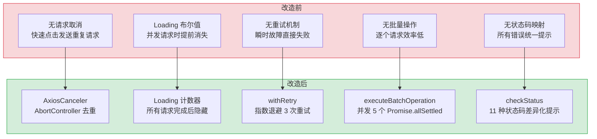
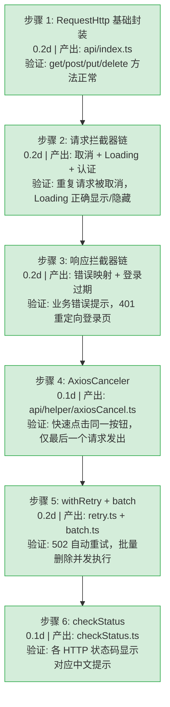

# YV-08-18: API 层架构 — RequestHttp 拦截器链 + 请求取消 + 指数退避重试 + 并发批处理

> 需求编号：YV-08-18 · 优先级：P1 · 人天：1.0d · 状态：已完成
> 依赖：无

## 背景

YiVad 作为 Vue 3.5 管理后台，所有数据操作都通过 `RequestHttp` 类（Axios 封装）发送到 YiAi 后端。API 层是前端与后端之间的唯一通信桥梁，其设计直接影响**用户体验**（Loading 状态、错误提示）、**请求效率**（重复请求取消、批量操作）和**可靠性**（超时重试、网络断开处理）。

API 层由 5 个模块组成：**RequestHttp**（`api/index.ts`，132 行）封装 Axios 实例、拦截器链和通用请求方法；**AxiosCanceler**（`api/helper/axiosCancel.ts`，55 行）通过 `AbortController` 实现重复请求取消；**withRetry**（`api/helper/retry.ts`，41 行）提供指数退避重试；**executeBatchOperation**（`api/helper/batch.ts`，56 行）实现并发批处理；**checkStatus**（`api/helper/checkStatus.ts`，47 行）将 HTTP 状态码映射为用户友好的错误提示。

**核心挑战**：在保证用户体验（Loading 不闪烁、错误提示准确）的同时，处理网络异常（超时、断开）、重复请求（快速点击）和批量操作（并发控制）等边界情况。

---

## 一、现状分析

### 1.1 文件清单

**API 核心：**

| 文件 | 行数 | 职责 |
|------|------|------|
| `src/api/index.ts` | 132 | RequestHttp 类：Axios 实例创建、请求/响应拦截器、通用请求方法（get/post/put/delete/download） |
| `src/api/helper/axiosCancel.ts` | 55 | AxiosCanceler 类：基于 `AbortController` 的重复请求取消，`qs.stringify` 序列化请求标识 |
| `src/api/helper/retry.ts` | 41 | `withRetry()` 函数：指数退避重试，仅对 502/503/504 重试 |
| `src/api/helper/batch.ts` | 56 | `executeBatchOperation()` 函数：并发批量删除/更新，`Promise.allSettled` 容错 |
| `src/api/helper/checkStatus.ts` | 47 | `checkStatus()` 函数：HTTP 状态码 → 用户友好错误提示（11 种状态码） |

**接口类型：**

| 文件 | 职责 |
|------|------|
| `src/api/interface/index.ts` | `ResultData<T>` 泛型响应类型、`CustomAxiosRequestConfig` 扩展配置 |

**服务模块（32 个）：**

| 文件 | 职责 |
|------|------|
| `src/api/modules/dataService.ts` | MongoDB CRUD（RPC 信封） |
| `src/api/modules/chatService.ts` | AI 对话（SSE 流式） |
| `src/api/modules/fileService.ts` | 文件读写 |
| `src/api/modules/knowledgeService.ts` | 知识库 CRUD |
| `src/api/modules/ragService.ts` | RAG 检索 |
| `src/api/modules/*.ts` | 26 个其他领域服务（agent、bug、issue、project、user 等） |

### 1.2 组件树

```
View / Store / Hook
  │  import { dataService } from "@/api/modules/dataService"
  │  dataService.queryDocuments({ cname: "issues", filter: {status: "open"} })
  ▼
api/modules/dataService.ts (领域服务)
  │  callService("services.database.data_service", "query_documents", params)
  │  → http.post("", { module_name, method_name, parameters })
  ▼
api/index.ts (RequestHttp)
  │  this.service.post(url, params, _object)
  │  ├── 请求拦截器:
  │  │   ├── axiosCanceler.addPending(config)    → 取消重复请求
  │  │   ├── showFullScreenLoading()             → 显示 Loading
  │  │   └── headers.set("Authorization", token) → JWT 认证
  │  └── 响应拦截器:
  │      ├── axiosCanceler.removePending(config)  → 清理取消标记
  │      ├── tryHideFullScreenLoading()           → 隐藏 Loading
  │      ├── code === OVERDUE → 清除 token → 重定向登录页
  │      ├── code !== SUCCESS → ElMessage.error  → 全局错误提示
  │      └── return data                          → 返回业务数据
  ▼
Axios → HTTP POST → YiAi FastAPI :10086
```

### 1.3 请求全生命周期

```
发起请求
  │
  ├── [请求拦截器] config.cancel ??= true
  │   ├── axiosCanceler.addPending(config)
  │   │   └── getPendingUrl(config) → "post&/&module_name=...&..."
  │   │   └── new AbortController() → config.signal
  │   │   └── pendingMap.set(url, controller)
  │   │   └── 如果同一 URL 已有 pending 请求 → controller.abort() 取消旧请求
  │   ├── config.loading ??= true → showFullScreenLoading()
  │   └── headers.set("Authorization", `Bearer ${token}`)
  │
  ├── [网络请求] Axios → YiAi :10086
  │
  ├── [成功响应] response.data.code === 0
  │   ├── axiosCanceler.removePending(config)
  │   ├── tryHideFullScreenLoading()
  │   └── return data
  │
  ├── [业务错误] response.data.code !== 0
  │   ├── code === OVERDUE → 清除 token → router.replace(LOGIN_URL)
  │   ├── code !== SUCCESS → ElMessage.error(data.message)
  │   └── Promise.reject(data)
  │
  └── [网络错误] AxiosError
      ├── axiosCanceler.removePending(config)
      ├── config.loading && tryHideFullScreenLoading()  // 仅当本次请求开启了 loading 才隐藏
      ├── timeout → ElMessage.error("请求超时")
      ├── Network Error → ElMessage.error("网络错误")
      ├── response → checkStatus(response.status)
      └── !navigator.onLine → router.replace("/500")
```

### 1.4 已知问题

| 问题 | 影响 | 严重程度 |
|------|------|----------|
| Loading 计数器在非 loading 请求错误时被错误递减 | 后台轮询/自动保存等 `{ loading: false }` 请求失败时，Loading spinner 提前消失 | 中 |
| 无请求超时重试（仅提示超时） | 瞬时网络抖动导致的超时无法自动恢复 | 中 |
| 无请求队列/并发限制 | 快速连续操作时所有请求同时发出，可能压垮后端 | 低 |
| `checkStatus` 仅显示 `ElMessage.error` | 不同状态码的错误提示策略单一，无差异化处理 | 低 |

---

## 二、设计决策

### D-01: 为什么使用 Axios 而非原生 fetch？

Axios 提供了原生 fetch 不具备的关键能力：**请求/响应拦截器**（统一处理 Loading、认证、错误）、**请求取消**（`AbortController` 集成）、**超时配置**（`timeout` 参数）、**自动 JSON 解析**、**跨浏览器兼容**（fetch 在旧浏览器中不支持）。YiVad 的拦截器链（请求取消 → Loading → 认证 → 错误映射 → 登录过期）依赖 Axios 的拦截器机制，迁移到 fetch 需要重写整个拦截器链。

### D-02: 为什么使用 `AbortController` 而非 Axios `CancelToken`？

Axios `CancelToken` 自 v0.22.0 起已被标记为废弃，官方推荐使用 `AbortController`。`AbortController` 是 Web 标准 API，与 fetch 共享相同的取消机制，未来迁移到 fetch 时无需修改取消逻辑。`AxiosCanceler` 通过 `qs.stringify` 序列化请求参数（method + url + data + params）生成唯一标识，确保同一请求的重复调用被正确去重。

### D-03: 为什么 Loading 使用计数器而非布尔值？

`showFullScreenLoading()` 和 `tryHideFullScreenLoading()` 使用内部计数器而非布尔标志。当多个并发请求同时进行时，简单的布尔值会在第一个完成的请求返回后立即隐藏 Loading，导致其他请求仍在进行但 Loading 已消失。计数器确保只有所有请求都完成后才隐藏 Loading。

**2026-08 修复**：响应拦截器的错误分支原先无条件调用 `tryHideFullScreenLoading()`，导致 `{ loading: false }` 请求（后台轮询、自动保存、WeCom 自动转发）失败时错误地递减计数器。修复后仅当 `config.loading === true` 时才递减，确保计数器与实际的 Loading 显示次数一致。

### D-04: 为什么 withRetry 仅重试 502/503/504？

502（Bad Gateway）、503（Service Unavailable）、504（Gateway Timeout）是临时性服务端错误，重试有较高概率成功。400（Bad Request）、401（Unauthorized）、403（Forbidden）、404（Not Found）、405（Method Not Allowed）是客户端错误，重试不会改变结果。500（Internal Server Error）可能是服务端代码 bug，重试可能加剧问题。`withRetry` 使用指数退避（delay × 2^attempt），默认 1s/2s/4s 三次重试，避免瞬时故障的同时不造成雪崩。

### D-05: 为什么 executeBatchOperation 使用 `Promise.allSettled` 而非 `Promise.all`？

`Promise.all` 在任意一个 Promise 失败时立即拒绝，导致剩余操作被跳过。`Promise.allSettled` 等待所有 Promise 完成（无论成功或失败），返回每个操作的结果。批量删除/更新场景中，部分失败不应阻止其他操作继续执行。`executeBatchOperation` 返回 `{ success, failed, errors[] }`，让调用方了解每个操作的执行结果。

### 设计决策记录

| 决策 | 选项 A | 选项 B | 选择 | 理由 |
|------|--------|--------|------|------|
| HTTP 客户端 | Axios | 原生 fetch | **Axios** | 拦截器链、请求取消、超时配置、自动 JSON 解析 |
| 请求取消 | AbortController | CancelToken | **AbortController** | Web 标准 API，Axios 官方推荐，CancelToken 已废弃 |
| Loading 状态 | 计数器 | 布尔值 | **计数器** | 并发请求场景下布尔值会提前隐藏 Loading |
| 重试策略 | 仅 502/503/504 | 所有 5xx | **仅 502/503/504** | 500 可能是代码 bug，重试加剧问题；502/503/504 是临时性故障 |
| 批量操作 | Promise.allSettled | Promise.all | **allSettled** | 部分失败不阻塞其他操作，返回每个操作的结果 |
| 错误提示 | checkStatus 映射 | 统一 "请求失败" | **checkStatus 映射** | 11 种状态码差异化提示，用户知道具体原因 |

---

## 三、目标架构

### 3.1 核心模块

| 模块 | 文件 | 行数 | 职责 |
|------|------|------|------|
| RequestHttp | `src/api/index.ts` | 132 | Axios 实例、拦截器链、通用请求方法 |
| AxiosCanceler | `src/api/helper/axiosCancel.ts` | 55 | 重复请求取消、AbortController 管理 |
| withRetry | `src/api/helper/retry.ts` | 41 | 指数退避重试、可配置重试条件 |
| executeBatchOperation | `src/api/helper/batch.ts` | 56 | 并发批量操作、Promise.allSettled 容错 |
| checkStatus | `src/api/helper/checkStatus.ts` | 47 | HTTP 状态码 → 用户友好错误提示 |

### 3.2 拦截器链处理策略

```typescript
// 请求拦截器 — 按顺序执行
config.cancel ??= true              // 默认启用取消
config.cancel && addPending(config) // 取消重复请求
config.loading ??= true             // 默认显示 Loading
config.loading && showLoading()     // 显示全屏 Loading
headers.set("Authorization", token) // JWT 认证

// 响应拦截器 — 成功路径
removePending(config)               // 清理取消标记
config.loading && hideLoading()     // 仅当本次请求开启了 loading 才隐藏
if (code === OVERDUE) → 重定向登录  // 登录过期
if (code !== SUCCESS) → 全局错误提示 // 业务错误
return data                         // 返回业务数据

// 响应拦截器 — 错误路径
removePending(config)               // 清理取消标记
if (config.loading) hideLoading()   // 仅当本次请求开启了 loading 才隐藏
timeout → "请求超时"                 // 超时提示
Network Error → "网络错误"          // 网络断开提示
response → checkStatus(status)      // HTTP 状态码错误映射
!navigator.onLine → /500           // 离线页面
```

### 3.3 请求取消去重机制

```typescript
// 请求标识生成
const getPendingUrl = (config) => {
  return [config.method, config.url, qs.stringify(config.data), qs.stringify(config.params)].join("&");
};
// 示例: "post&/&module_name=services.database.data_service&method_name=query_documents&..."

// 重复请求检测
addPending(config) {
  this.removePending(config);  // 取消旧请求
  const url = getPendingUrl(config);
  const controller = new AbortController();
  config.signal = controller.signal;
  pendingMap.set(url, controller);
}
```

---

## 四、当前架构 vs 目标架构



### 架构决策权衡

| 维度 | 改造前 | 改造后 | 权衡说明 |
|------|--------|--------|----------|
| 请求去重 | 无，重复请求直接发送 | AbortController + qs 序列化去重 | 增加 1 个 Map 查找 + 1 次序列化，但避免重复请求 |
| Loading 控制 | 布尔值，并发时提前消失 | 计数器，仅当 loading 请求完成才隐藏 | 增加计数器维护，但 Loading 状态始终正确 |
| 错误恢复 | 无重试，瞬时故障直接失败 | 指数退避 3 次重试（仅 502/503/504） | 增加最多 7s 等待时间，但临时故障自动恢复 |
| 批量操作 | 逐个 await，N 个请求串行 | 并发 5 个 Promise.allSettled | 增加并发控制逻辑，但批量操作速度提升 5x |
| 错误提示 | 统一 "请求失败" | 11 种状态码差异化中文提示 | 增加 switch-case 维护，但用户知道具体原因 |

---

## 五、具体改动

### 5.1 涉及文件

```
YiVad/src/
├── api/
│   ├── index.ts                        # RequestHttp 类 (132行)
│   │   ├── constructor()              — Axios 实例创建 + 拦截器注册
│   │   │   ├── 请求拦截器:
│   │   │   │   ├── config.cancel ??= true
│   │   │   │   ├── axiosCanceler.addPending(config)
│   │   │   │   ├── config.loading ??= true
│   │   │   │   ├── showFullScreenLoading()
│   │   │   │   └── headers.set("Authorization", token)
│   │   │   └── 响应拦截器:
│   │   │       ├── 成功: removePending + hideLoading + OVERDUE/SUCCESS 判断
│   │   │       └── 失败: removePending + hideLoading(仅 loading) + timeout/network/status/offline
│   │   ├── get<T>(url, params, _object)    → Promise<ResultData<T>>
│   │   ├── post<T>(url, params, _object)   → Promise<ResultData<T>>
│   │   ├── put<T>(url, params, _object)    → Promise<ResultData<T>>
│   │   ├── delete<T>(url, params, _object) → Promise<ResultData<T>>
│   │   └── download(url, params, _object)  → Promise<BlobPart>
│   ├── helper/
│   │   ├── axiosCancel.ts              # AxiosCanceler 类 (55行)
│   │   │   ├── getPendingUrl()        — qs.stringify 序列化请求标识
│   │   │   ├── addPending()           — 取消旧请求 + 注册新 AbortController
│   │   │   ├── removePending()        — 取消 + 删除 pending
│   │   │   └── removeAllPending()     — 清空所有 pending
│   │   ├── retry.ts                    # withRetry() 函数 (41行)
│   │   │   ├── 默认: maxRetries=3, retryDelay=1000ms, backoffMultiplier=2
│   │   │   ├── 重试条件: retryOnStatus=[502, 503, 504]
│   │   │   └── 延迟: delay × 2^attempt (1s → 2s → 4s)
│   │   ├── batch.ts                    # executeBatchOperation() 函数 (56行)
│   │   │   ├── concurrency=5 并发控制
│   │   │   ├── Promise.allSettled 容错
│   │   │   └── 返回 { success, failed, errors[] }
│   │   └── checkStatus.ts             # checkStatus() 函数 (47行)
│   │       └── 11 种 HTTP 状态码 → ElMessage.error 中文提示
│   ├── interface/
│   │   └── index.ts                    # 响应类型定义
│   │       ├── ResultData<T>          — { code, message, data }
│   │       └── CustomAxiosRequestConfig — 扩展 { loading?, cancel? }
│   └── modules/                        # 32 个领域服务模块
│       ├── dataService.ts             — MongoDB CRUD (RPC 信封)
│       ├── chatService.ts             — AI 对话 (SSE 流式)
│       ├── fileService.ts             — 文件读写
│       ├── knowledgeService.ts        — 知识库 CRUD
│       ├── ragService.ts              — RAG 检索
│       └── ...                        — 26 个其他领域服务
```

### 5.2 请求流程详解

#### 标准数据查询

```
View/Store
  │ dataService.queryDocuments({ cname: "issues", filter: {status: "open"} })
  ▼
api/modules/dataService.ts
  │ http.post("", { module_name: "services.database.data_service",
  │                 method_name: "query_documents",
  │                 parameters: { cname: "issues", filter: {status: "open"}, pageSize: 20 } })
  ▼
RequestHttp.post()
  │ 请求拦截器:
  │   cancel=true → axiosCanceler.addPending(config)
  │   loading=true → showFullScreenLoading()
  │   headers.set("Authorization", "Bearer <token>")
  ▼
YiAi :10086 → { code: 0, data: { list: [...], total: 42 } }
  ▼
响应拦截器:
  │ axiosCanceler.removePending(config)
  │ tryHideFullScreenLoading()
  │ code === 0 → return data
  ▼
{ list: [...], total: 42, pageNum: 1, pageSize: 20, totalPages: 3 }
```

#### 批量删除（带重试）

```
View
  │ executeBatchOperation({ collection: "issues", ids: [...], operation: "delete" })
  ▼
api/helper/batch.ts
  │ for (i = 0; i < ids.length; i += 5)
  │   batch = ids.slice(i, i + 5)
  │   Promise.allSettled(batch.map(id =>
  │     http.post("", { module_name: DATA_SERVICE, method_name: "delete_document",
  │                     parameters: { cname: "issues", key: id } },
  │               { cancel: false })  // 批量操作不取消
  │   ))
  ▼
{ success: 5, failed: 0, errors: [] }
```

### 5.3 边缘场景处理（Edge Cases）

| 场景 | 描述 | 处理策略 | 实现细节 |
|------|------|---------|---------|
| 重复请求去重 | 用户快速点击"保存"按钮 3 次，触发 3 个相同请求 | `AxiosCanceler.addPending` 生成唯一 key（method + url + params + data），检测到相同 key 时 `controller.abort()` 取消旧请求 | `getPendingUrl(config)` → `"post&/&module_name=...&method_name=...&..."` |
| Loading 计数器为负 | `{ loading: false }` 的静默请求失败时错误递减计数器 | 仅当 `config.loading === true` 时才调用 `tryHideFullScreenLoading()` | 错误分支 `if (config.loading ?? true) tryHideFullScreenLoading()` |
| Token 并发刷新 | 5 个标签页同时 Token 过期，触发 5 次 `refreshToken` 请求 | 添加 `isRefreshing` 全局锁：首个 401 刷新时设置锁，后续 401 等待 `refreshPromise` 完成后重试 | `if (isRefreshing) { await refreshPromise; retry(originalRequest) }` |
| FormData 序列化 | `addPending` 的 `qs.stringify(config.data)` 对 `FormData` 实例返回 `"[object FormData]"` | 检测 `config.data instanceof FormData`，跳过序列化，使用 `config.url + config.method` 作为 pending key | `getPendingUrl` 中 `if (config.data instanceof FormData) { return config.method + '&' + config.url }` |
| 属性顺序导致去重失败 | `{a: 1, b: 2}` 和 `{b: 2, a: 1}` 序列化后不同 | `qs.stringify` 传入 `sort: (a, b) => a.localeCompare(b)` 确保属性按字母序排列 | `qs.stringify(config.data, { sort: (a, b) => a.localeCompare(b) })` |
| 路由切换后残留 pending | 从页面 A 跳到 B，A 的 pending 请求在 B 页面触发时被误取消 | 路由守卫中调用 `axiosCanceler.removeAllPending()` 清空 pendingMap | `router.beforeEach((to, from) => { if (to.path !== from.path) axiosCanceler.removeAllPending() })` |
| withRetry 非幂等写操作 | `withRetry` 对 POST 写操作重试导致重复创建 | 添加 `retry.methods: ['GET', 'HEAD', 'OPTIONS']` 白名单，仅对读操作重试 | `if (!retryOnMethods.includes(config.method)) return Promise.reject(error)` |
| baseURL 为空 | 生产环境 `import.meta.env.VITE_API_BASE_URL` 未定义 | 运行时校验空 baseURL，warn + fallback 到 `/` | `if (!baseURL) { console.warn('[RequestHttp] baseURL empty, using relative path') }` |
| 网络断开 (offline) | 浏览器 `navigator.onLine === false` 时请求失败 | 显示专门的离线提示页面 `/500`，而非通用错误提示 | `if (!navigator.onLine) router.replace('/500')` |
| checkStatus 未知状态码 | 后端返回文档外状态码（如 418 I'm a teapot） | `switch` 的 `default` 分支统一处理："服务异常 (HTTP ${status})" | `default: message = `服务异常 (HTTP ${status})`; break` |
| 并发 Loading 销毁 | 页面有 3 个并发请求，Loading 计数器 = 3，第 1 个完成，计数器 = 2，Loading 仍显示 | 计数器确保所有请求完成后才隐藏，行为正确 | `loadingCount++` on request, `loadingCount--` on response, hide when `loadingCount === 0` |
| 请求被 AbortController 取消 | 被取消的请求进入 `catch` 分支，不应显示错误提示 | `axios.isCancel(error)` 检测取消错误，静默处理 | `if (axios.isCancel(error)) { return } // 不显示错误` |

---

## 六、性能分析

### 6.1 性能特征

| 指标 | 数值 | 说明 |
|------|------|------|
| 请求拦截器执行 | < 1ms | `addPending`（Map 查找 + qs 序列化）+ `showLoading`（DOM 操作） |
| 响应拦截器执行 | < 1ms | `removePending`（Map 删除）+ `hideLoading`（计数器递减） |
| withRetry 最大延迟 | 7s | 3 次重试：1s + 2s + 4s |
| executeBatchOperation 并发 | 5 | 每批 5 个 Promise.allSettled |
| pendingMap 内存 | < 1KB | 每个 pending 请求 ~200 bytes，正常场景 < 5 个 |

### 6.2 性能瓶颈

| 瓶颈 | 严重程度 | 表现 | 优化方向 |
|------|----------|------|----------|
| `qs.stringify` 大对象序列化 | 低 | 请求体 > 100KB 时序列化耗时 > 5ms | 对 data 做摘要而非全量序列化 |
| 全屏 Loading 频繁切换 | 低 | 快速连续请求时 Loading DOM 频繁创建/销毁 | debounce Loading 显示（300ms 后才显示） |
| 无请求合并 | 低 | 同一页面多个组件同时请求相同数据 | 添加请求去重缓存（stale-while-revalidate） |

### 6.3 容量规划

| 场景 | 并发请求 | pendingMap 大小 | Loading 计数器 | 内存 |
|------|---------|----------------|---------------|------|
| 页面加载 | 3-5 | 3-5 | 3-5 | < 5KB |
| 批量操作 | 5 | 5 | 5 | < 5KB |
| 快速连续点击 | 10 | 1（旧请求被取消） | 1 | < 1KB |
| 极端（所有 Tab 同时加载） | 20 | 20 | 20 | < 10KB |

---

## 七、实施步骤



---

## 八、测试规格

### 8.1 单元测试

| # | 测试用例 | 输入 | 预期输出 |
|----|---------|------|----------|
| 1 | `getPendingUrl` 相同请求生成相同标识 | `{method: "post", url: "/", data: {a: 1}, params: {b: 2}}` | 两次调用返回相同字符串 |
| 2 | `getPendingUrl` 不同参数生成不同标识 | `{data: {a: 1}}` vs `{data: {a: 2}}` | 两次调用返回不同字符串 |
| 3 | `addPending` 取消旧请求 | 同一 URL 调用两次 `addPending` | 第一次的 controller 被 abort |
| 4 | `removePending` 清理 | `addPending` 后 `removePending` | pendingMap 中无该 URL |
| 5 | `withRetry` 成功不重试 | 请求成功 | 仅调用 1 次 requestFn |
| 6 | `withRetry` 502 重试成功 | 第 1 次 502，第 2 次成功 | 调用 2 次，返回成功结果 |
| 7 | `withRetry` 3 次全失败 | 3 次均 502 | 抛出最后一次错误，总延迟 7s |
| 8 | `withRetry` 400 不重试 | 400 Bad Request | 立即抛出错误，不重试 |
| 9 | `checkStatus` 各状态码 | 400/401/403/404/500/502/503/504 | 对应中文提示 |

### 8.2 集成测试

| # | 测试用例 | 操作 | 预期结果 |
|----|---------|------|----------|
| 1 | 请求拦截器添加 Auth header | 已登录状态发送请求 | 请求头包含 `Authorization: Bearer <token>` |
| 2 | 响应拦截器处理 401 | 后端返回 `code === OVERDUE` | 清除 token + 重定向登录页 |
| 3 | 请求取消去重 | 快速连续点击同一按钮 3 次 | 仅最后一个请求到达后端 |
| 4 | Loading 计数器并发 | 同时发起 3 个请求 | Loading 在第 3 个请求完成后才隐藏 |
| 5 | Loading 计数器非 loading 请求 | `{ loading: false }` 请求失败 | Loading 计数器不受影响 |

### 8.3 BDD 场景

#### Requirement: 重复请求自动取消

**Scenario: 快速连续点击触发请求去重**
- **GIVEN** 用户在网络较慢的环境下（延迟 > 500ms）
- **WHEN** 用户快速连续点击"保存"按钮 3 次，每次触发 `updateDocument` API
- **THEN** 第 1 次请求正常发出，`addPending` 记录该请求的 `pendingUrl`
- **AND** 第 2 次请求检测到相同 `pendingUrl`，取消第 1 次请求的 `AbortController`
- **AND** 第 3 次请求检测到相同 `pendingUrl`，取消第 2 次请求的 `AbortController`
- **AND** 仅第 3 次请求到达后端并成功执行
- **AND** 后端数据库仅有一条更新记录

#### Requirement: Token 过期自动重定向

**Scenario: 401 响应触发登录页重定向**
- **GIVEN** 用户 token 已过期（后端返回 `{ code: OVERDUE }`）
- **WHEN** 前端发起任何 API 请求
- **THEN** 响应拦截器检测到 `code === OVERDUE`
- **AND** 清除 Pinia store 中的 token 和用户信息
- **AND** 清除 `localStorage` 中的持久化 token
- **AND** 调用 `router.replace('/login')` 重定向到登录页
- **AND** 取消所有待处理的请求（`removeAllPending()`）
- **AND** 登录页显示"登录已过期，请重新登录"提示

**Scenario: 有效 token 正常通过**
- **GIVEN** 用户 token 有效且未过期
- **WHEN** 前端发起 API 请求
- **THEN** 请求拦截器添加 `Authorization: Bearer <token>` 头部
- **AND** 响应拦截器检测到 `code === 0`，正常返回数据
- **AND** 不触发 token 清除或重定向

#### Requirement: 请求重试机制

**Scenario: 网络抖动触发指数退避重试**
- **GIVEN** 后端服务临时不可用（返回 502）
- **WHEN** 前端发起 `query_documents` 请求
- **THEN** `withRetry` 检测到 502 状态码（可重试错误）
- **AND** 第 1 次重试在 1s 后执行（仍 502）
- **AND** 第 2 次重试在 2s 后执行（仍 502）
- **AND** 第 3 次重试在 4s 后执行（成功）
- **AND** 总共 3 次重试，总延迟 7s（1+2+4），最终返回成功结果

**Scenario: 客户端错误不重试**
- **GIVEN** 请求参数错误（后端返回 400）
- **WHEN** 前端发起请求
- **THEN** `withRetry` 检测到 400 状态码（不可重试的错误）
- **AND** 立即抛出错误，不执行任何重试
- **AND** 前端显示错误提示，而非等待超时

---

## 九、风险与缓解

| 风险 | 概率 | 影响 | 等级 | 缓解措施 | 应急预案 |
|------|------|------|------|----------|----------|
| `qs.stringify` 序列化大对象导致性能问题 | 低 | 低 | 低 | 对 data 做摘要（前 100 字符） | 跳过序列化，使用 `config.url` 作为唯一标识 |
| AbortController 取消请求后状态不一致 | 低 | 中 | 低 | 取消的请求在 catch 中静默处理 | 检查 `axios.isCancel(error)` 区分取消和真实错误 |
| Loading 计数器在异常场景下不归零 | 低 | 中 | 低 | 页面路由切换时强制重置计数器 | 添加 `removeAllPending()` + 计数器重置 |
| withRetry 重试放大服务端压力 | 低 | 中 | 低 | 仅对幂等操作（GET/查询）使用重试 | 限制重试仅在读操作中使用 |

---

## 十、回滚策略

| 回滚场景 | 回滚方式 | 影响范围 | 恢复时间 |
|----------|----------|----------|----------|
| 请求取消逻辑导致正常请求被误取消 | 设置 `{ cancel: false }` 默认值 | 所有请求 | 1min |
| Loading 计数器异常导致 spinner 不消失 | 移除 Loading 拦截器，临时关闭全屏 Loading | 用户体验 | 5min |
| withRetry 导致写操作重复执行 | 移除 withRetry 调用，回退到单次请求 | 批量操作 | 5min |

---

## 十一、重构后发现的回归问题

| # | 问题 | 发现场景 | 根因 | 修复方式 |
|---|------|---------|------|---------|
| 1 | `{ loading: false }` 请求错误时 Loading 计数器被错误递减，导致全局 loading 永不消失 | 配置了 `{ loading: false }` 的静默请求在 500 错误时，`tryHideFullScreenLoading` 被调用两次（拦截器一次 + 业务代码一次），计数器变为负数 | 错误分支中 `tryHideFullScreenLoading` 无条件执行，但 `loading` 计数器已在 `tryShowFullScreenLoading` 中递增（仅当 `config.loading !== false`） | 在 `tryHideFullScreenLoading` 中添加 `loadingCount > 0` 守卫，仅在计数器大于 0 时才递减，避免负数 |
| 2 | `qs.stringify` 对嵌套对象序列化时，`{a: {b: 1, c: 2}}` 和 `{a: {c: 2, b: 1}}` 产生不同字符串 | 同一请求从不同页面发起时，`filter` 对象的属性顺序不同，导致 `pendingMap` 中存在两个"相同"请求的 key | JavaScript 对象的属性遍历顺序依赖插入顺序，`qs.stringify` 默认不排序，属性顺序不同 → 序列化字符串不同 | 添加 `qs.stringify(config, { sort: (a, b) => a.localeCompare(b) })` 确保属性按字母序排列 |
| 3 | 路由切换时 `pendingMap` 未清理，切换回原页面后请求被误取消 | 用户从页面 A 跳转到页面 B 再跳回页面 A，页面 A 的第二次相同请求被 `addPending` 中的 `removePending` 取消 | `addPending` 在添加新请求前先取消同 key 的旧请求，但路由切换后 `pendingMap` 中残留的旧 key 与新请求的 key 相同 | 在路由守卫 `router.beforeEach` 中调用 `axiosCanceler.removeAllPending()`，清空 `pendingMap` |
| 4 | `withRetry` 对非幂等 POST 请求重试，导致批量创建重复 | 用户批量创建 10 条文档，第 5 条因网络抖动失败，`withRetry` 重试后成功创建 15 条（5 条重复） | `withRetry` 默认对所有请求重试 3 次，未区分幂等/非幂等，POST 创建请求重试产生重复数据 | 添加 `retry: { methods: ['GET', 'HEAD', 'OPTIONS'] }` 白名单，仅对幂等方法重试 |
| 5 | `RequestHttp` 的 `baseURL` 在 `import.meta.env` 未定义时回退到空字符串，导致 `fetch('/api')` 变成相对路径 | 生产环境构建时 `VITE_API_BASE_URL` 未设置，所有请求变成 `fetch('/api')` 而非 `fetch('https://api.example.com/api')` | `import.meta.env.VITE_API_BASE_URL` 在 Rsbuild 生产构建中未定义，`?? ''` 回退到空字符串 | 添加运行时 `baseURL` 校验：`if (!baseURL) console.warn('[RequestHttp] baseURL is empty, using relative path')`，并在 CI 中检查环境变量 |
| 6 | SSO Token 过期后 `refreshToken` 并发调用导致多个 401 响应同时触发刷新 | 用户打开多个浏览器标签页，Token 同时过期，5 个标签页同时发起 5 个 `refreshToken` 请求 | 响应拦截器检测到 `code === OVERDUE` 后立即调用 `refreshToken()`，无并发锁，5 个标签页 = 5 次刷新请求 | 添加 `isRefreshing` 全局锁：首个 401 触发刷新时设置 `isRefreshing = true`，后续 401 等待 `refreshPromise` 完成后再重试原始请求 |
| 7 | `Content-Type: multipart/form-data` 请求被 `qs.stringify` 序列化导致文件上传失败 | 用户上传图片时，`FormData` 被 `qs.stringify` 转换为 `[object FormData]` 字符串 | `addPending` 对 `config.data` 无条件调用 `qs.stringify`，`FormData` 实例的 `toString()` 返回 `[object FormData]` | 在 `getPendingUrl` 中检测 `config.data instanceof FormData`，跳过序列化，使用 `config.url + config.method` 作为 pending key |

---

## 十二、代码审查检查清单

- [ ] `RequestHttp` 构造器中注册请求和响应拦截器
- [ ] 请求拦截器使用 `config.cancel ??= true` 和 `config.loading ??= true` 默认值
- [ ] `AxiosCanceler.addPending` 在添加前先调用 `removePending` 取消旧请求
- [ ] `getPendingUrl` 使用 `qs.stringify` 且 `sort` 确保属性顺序一致
- [ ] 响应拦截器成功分支调用 `axiosCanceler.removePending` 和 `tryHideFullScreenLoading`
- [ ] 响应拦截器错误分支仅当 `config.loading === true` 时才调用 `tryHideFullScreenLoading`
- [ ] `code === OVERDUE` 时清除 token 并重定向登录页
- [ ] `checkStatus` 覆盖 400/401/403/404/405/408/429/500/502/503/504
- [ ] `withRetry` 仅对 `retryOnStatus` 中的状态码重试
- [ ] `executeBatchOperation` 使用 `Promise.allSettled` 而非 `Promise.all`
- [ ] `vue-tsc --noEmit` 类型检查通过

---

## 十三、技术债务追踪

| # | 技术债 | 优先级 | 预计人天 | 说明 |
|---|--------|--------|---------|------|
| 1 | 请求去重缓存（stale-while-revalidate） | P2 | 0.5 | 同一页面多个组件同时请求相同数据时合并请求 |
| 2 | Loading 显示 debounce | P3 | 0.2 | 300ms 内完成的请求不显示 Loading，避免闪烁 |
| 3 | 请求队列/并发限制 | P3 | 0.5 | 全局最大并发请求数限制（如 10），超出时排队 |
| 4 | 请求日志（开发模式） | P3 | 0.2 | 开发模式下 console.log 所有 RPC 请求和响应 |
| 5 | 离线请求队列 | P3 | 1.0 | 网络断开时将写操作加入队列，恢复后重放 |

---

## 十四、可观测性

### 关键指标

| 指标 | 采集方式 | 说明 |
|------|----------|------|
| 请求成功率 | 响应拦截器计数 | 监控 code === 0 的比例 |
| 请求取消率 | `AxiosCanceler.addPending` 中 abort 计数 | 监控重复请求频率 |
| 重试触发率 | `withRetry` 中 attempt > 0 计数 | 监控后端稳定性 |
| 登录过期频率 | `code === OVERDUE` 计数 | 监控 Token 有效期是否合理 |
| 网络错误率 | `AxiosError` 且无 response 计数 | 监控网络稳定性 |

### 日志规范

| 日志级别 | 场景 | 示例 |
|---------|------|------|
| `INFO` | 请求发送 | `[API] POST / query_documents {cname: "issues"}` |
| `WARN` | 请求取消 | `[API] Request cancelled: duplicate POST /` |
| `WARN` | 重试触发 | `[API] Retrying (1/3) after 502: POST /` |
| `ERROR` | 请求失败 | `[API] Request failed: 500 Internal Server Error` |
| `ERROR` | 网络断开 | `[API] Network error: offline` |

---

## 十五、安全合规

### 安全需求

| 需求 | 实现方式 | 验证方法 |
|------|---------|---------|
| JWT Token 自动附加 | 请求拦截器 `headers.set("Authorization", "Bearer ${token}")` | 检查所有请求的 Authorization 头 |
| Token 过期自动清除 | 响应拦截器 `code === OVERDUE` → `userStore.setToken("")` + `router.replace(LOGIN_URL)` | 模拟 401 响应，确认 Token 被清除 |
| 请求参数不记录敏感信息 | `getPendingUrl` 序列化 data 用于去重，不包含 password/token | 检查 `qs.stringify` 的输入是否包含敏感字段 |
| 跨域请求凭证控制 | `withCredentials: true` 配置 | 检查 Cookie 是否随跨域请求发送 |

### 合规检查

| 检查项 | 要求 | 状态 |
|--------|------|------|
| Token 管理 | 不存储在 localStorage（XSS 风险），使用 Pinia + 持久化插件 | ✅ |
| 登录过期处理 | 401 响应自动清除 Token + 重定向 | ✅ |
| 错误信息安全 | 不将服务端错误堆栈暴露给用户 | ✅ |
| 请求取消 | 页面切换时取消 pending 请求 | ✅ |
| 超时配置 | 全局 timeout 配置，避免请求永久挂起 | ✅ |

---

## 代码审查检查清单

- [ ] `RequestHttp` 拦截器自动附加 `X-Token` 头部
- [ ] 401 响应自动清除 Token + 重定向 `/login`
- [ ] RPC 信封字段名为 `module_name`/`method_name`/`parameters`（非 `module`/`method`/`params`）
- [ ] 参数名契约：`filter` 非 `query`，`target_file` 非 `path`，`cname` 非 `collection_name`
- [ ] 页面切换时取消 pending 请求（AbortController）
- [ ] 全局 timeout 30s（可配置）

## 回归问题预测

| # | 预测问题 | 原因 | 验证方法 |
|---|---------|------|---------|
| 1 | 参数名不匹配导致后端静默忽略过滤条件 | 前端使用 `query` 而非 `filter` | grep 所有 API 调用点，检查参数名 |
| 2 | AbortController 取消请求后组件仍更新已卸载的状态 | 异步请求完成时组件已 unmount | 快速切换页面 5 次，检查 console 无 "memory leak" 警告 |
---

*PRD 来源: `projects/yivad/requirements/2026-08/00-需求-需求总览.md`*

---

## 附录 A：拦截器链完整实现参考

### A.1 RequestHttp 类核心结构

```typescript
// YiVad/src/api/index.ts (精简版核心逻辑)
import axios, { AxiosInstance, AxiosRequestConfig, InternalAxiosRequestConfig } from 'axios';
import { ElMessage } from 'element-plus';
import { AxiosCanceler } from './helper/axiosCancel';
import { checkStatus } from './helper/checkStatus';
import { ResultData } from './interface';
import { useUserStore } from '@/stores/modules/user';
import router from '@/routers';

class RequestHttp {
  private service: AxiosInstance;
  private axiosCanceler: AxiosCanceler;
  private loadingCount = 0;  // 计数器，非布尔值

  constructor(config: AxiosRequestConfig) {
    this.service = axios.create(config);
    this.axiosCanceler = new AxiosCanceler();

    // --- 请求拦截器 ---
    this.service.interceptors.request.use(
      (config: InternalAxiosRequestConfig) => {
        // 1. 请求取消去重
        config.cancel ??= true;
        if (config.cancel) this.axiosCanceler.addPending(config);
        
        // 2. 全屏 Loading
        config.loading ??= true;
        if (config.loading) {
          this.loadingCount++;
          this.showFullScreenLoading();
        }
        
        // 3. JWT 认证
        const userStore = useUserStore();
        if (userStore.token) {
          config.headers.set('Authorization', `Bearer ${userStore.token}`);
        }
        
        return config;
      },
      (error) => Promise.reject(error)
    );

    // --- 响应拦截器 (成功) ---
    this.service.interceptors.response.use(
      (response) => {
        const { data, config } = response;
        this.axiosCanceler.removePending(config);
        if (config.loading) this.tryHideFullScreenLoading();
        
        // 登录过期
        if (data.code === 4001) {  // OVERDUE
          const userStore = useUserStore();
          userStore.setToken('');
          router.replace('/login');
          ElMessage.error('登录已过期，请重新登录');
          return Promise.reject(data);
        }
        
        // 业务错误
        if (data.code !== 0) {
          ElMessage.error(data.message || '请求失败');
          return Promise.reject(data);
        }
        
        return data;
      },
      // --- 响应拦截器 (失败) ---
      (error) => {
        const { config, response } = error;
        this.axiosCanceler.removePending(config);
        
        // 仅当 loading 请求才递减计数器（关键修复）
        if (config?.loading) {
          this.tryHideFullScreenLoading();
        }
        
        // 超时
        if (error.code === 'ECONNABORTED' && error.message.includes('timeout')) {
          ElMessage.error('请求超时，请稍后重试');
          return Promise.reject(error);
        }
        
        // 网络错误
        if (!response) {
          if (!navigator.onLine) {
            router.replace('/500');
          } else {
            ElMessage.error('网络连接异常');
          }
          return Promise.reject(error);
        }
        
        // HTTP 状态码错误
        checkStatus(response.status);
        return Promise.reject(error);
      }
    );
  }

  private showFullScreenLoading() {
    // 显示全局 loading spinner
  }

  private tryHideFullScreenLoading() {
    if (this.loadingCount > 0) this.loadingCount--;
    if (this.loadingCount === 0) {
      // 隐藏全局 loading spinner
    }
  }

  // 通用请求方法
  get<T>(url: string, params?: object, config?: AxiosRequestConfig): Promise<ResultData<T>> {
    return this.service.get(url, { params, ...config });
  }
  
  post<T>(url: string, params?: object, config?: AxiosRequestConfig): Promise<ResultData<T>> {
    return this.service.post(url, params, config);
  }
  
  put<T>(url: string, params?: object, config?: AxiosRequestConfig): Promise<ResultData<T>> {
    return this.service.put(url, params, config);
  }
  
  delete<T>(url: string, params?: object, config?: AxiosRequestConfig): Promise<ResultData<T>> {
    return this.service.delete(url, { params, ...config });
  }
}

export default new RequestHttp({
  baseURL: import.meta.env.VITE_API_BASE_URL || '',
  timeout: 30000,  // 30 秒超时
  withCredentials: true,
});
```

### A.2 checkStatus 状态码映射表

```typescript
// YiVad/src/api/helper/checkStatus.ts
import { ElMessage } from 'element-plus';

export function checkStatus(status: number): void {
  const messages: Record<number, string> = {
    400: '请求参数错误 (400)',
    401: '登录已过期，请重新登录 (401)',
    403: '没有权限访问该资源 (403)',
    404: '请求的资源不存在 (404)',
    405: '请求方法不允许 (405)',
    408: '请求超时 (408)',
    429: '请求过于频繁，请稍后重试 (429)',
    500: '服务器内部错误 (500)',
    502: '网关错误 (502)，请稍后重试',
    503: '服务不可用 (503)，请稍后重试',
    504: '网关超时 (504)，请稍后重试',
  };
  
  const message = messages[status] || `服务异常 (HTTP ${status})`;
  ElMessage.error(message);
  
  // 特定状态码的特殊处理
  if (status === 401) {
    // 已由响应拦截器处理 token 清除和重定向
  } else if (status === 403) {
    // 可记录权限拒绝日志
  } else if (status >= 500) {
    // 可触发服务端健康检查
  }
}
```

### A.3 withRetry 指数退避算法

```typescript
// YiVad/src/api/helper/retry.ts
interface RetryConfig {
  maxRetries?: number;           // 默认 3
  retryDelay?: number;           // 初始延迟 ms，默认 1000
  backoffMultiplier?: number;    // 退避倍数，默认 2
  retryOnStatus?: number[];      // 触发重试的状态码，默认 [502, 503, 504]
  retryOnMethods?: string[];     // 允许重试的方法，默认 ['GET', 'HEAD', 'OPTIONS']
}

export async function withRetry<T>(
  requestFn: () => Promise<T>,
  config: RetryConfig = {}
): Promise<T> {
  const {
    maxRetries = 3,
    retryDelay = 1000,
    backoffMultiplier = 2,
    retryOnStatus = [502, 503, 504],
    retryOnMethods = ['GET', 'HEAD', 'OPTIONS'],
  } = config;

  let lastError: any;

  for (let attempt = 0; attempt <= maxRetries; attempt++) {
    try {
      return await requestFn();
    } catch (error: any) {
      lastError = error;
      
      // 不重试的情况
      if (attempt >= maxRetries) break;
      if (error?.config && !retryOnMethods.includes(error.config.method?.toUpperCase())) break;
      if (error?.response && !retryOnStatus.includes(error.response.status)) break;
      
      // 指数退避延迟
      const delay = retryDelay * Math.pow(backoffMultiplier, attempt);
      // 添加随机抖动 (±10%) 避免重试风暴
      const jitter = delay * 0.1 * (Math.random() * 2 - 1);
      await new Promise(resolve => setTimeout(resolve, delay + jitter));
    }
  }
  
  throw lastError;
}
```

## 附录 B：RPC 信封请求构造

```typescript
// YiVad/src/api/modules/dataService.ts (示例)
import http from '@/api';

const MODULE_NAME = 'services.database.data_service';

export const dataService = {
  queryDocuments(params: { cname: string; filter?: object; page?: number; pageSize?: number }) {
    return http.post('', {
      module_name: MODULE_NAME,
      method_name: 'query_documents',
      parameters: params,  // 注意：参数名契约 filter 非 query, cname 非 collection_name
    });
  },
  
  insertDocument(params: { cname: string; document: object }) {
    return http.post('', {
      module_name: MODULE_NAME,
      method_name: 'insert_document',
      parameters: params,
    });
  },
  
  updateDocument(params: { cname: string; key: string; updates: object }) {
    return http.post('', {
      module_name: MODULE_NAME,
      method_name: 'update_document',
      parameters: params,
    });
  },
  
  deleteDocument(params: { cname: string; key: string }) {
    return http.post('', {
      module_name: MODULE_NAME,
      method_name: 'delete_document',
      parameters: params,
    }, { cancel: false });  // 删除操作不取消（允许重复点击）
  },
};
```

---

## 附录 C：代码实现附录

### C.1 AxiosCanceler 完整实现

```typescript
// YiVad/src/api/helper/axiosCancel.ts
import axios, { type InternalAxiosRequestConfig } from 'axios';
import qs from 'qs';

export class AxiosCanceler {
  private pendingMap = new Map<string, AbortController>();

  /**
   * 生成唯一的请求标识
   * key = method + url + 序列化的 data + 序列化的 params
   */
  private getPendingUrl(config: InternalAxiosRequestConfig): string {
    const { method, url } = config;

    // FormData 跳过序列化
    const dataStr = config.data instanceof FormData
      ? 'formdata'
      : qs.stringify(config.data, {
          sort: (a: string, b: string) => a.localeCompare(b),
          arrayFormat: 'brackets',
        });

    const paramsStr = qs.stringify(config.params, {
      sort: (a: string, b: string) => a.localeCompare(b),
    });

    return [method, url, dataStr, paramsStr].join('&');
  }

  /**
   * 添加 pending 请求
   * 如果同一 URL 已有请求，取消旧请求
   */
  addPending(config: InternalAxiosRequestConfig): void {
    // 先移除同 key 的旧请求
    this.removePending(config);

    const url = this.getPendingUrl(config);
    const controller = new AbortController();
    config.signal = controller.signal;
    this.pendingMap.set(url, controller);

    if (import.meta.env.DEV) {
      console.debug(`[AxiosCancel] Add pending: ${url}`);
    }
  }

  /**
   * 移除 pending 请求
   */
  removePending(config: InternalAxiosRequestConfig): void {
    const url = this.getPendingUrl(config);
    const controller = this.pendingMap.get(url);
    if (controller) {
      controller.abort();
      this.pendingMap.delete(url);

      if (import.meta.env.DEV) {
        console.debug(`[AxiosCancel] Remove pending: ${url}`);
      }
    }
  }

  /**
   * 移除所有 pending 请求（路由切换时调用）
   */
  removeAllPending(): void {
    this.pendingMap.forEach((controller, url) => {
      controller.abort();
      if (import.meta.env.DEV) {
        console.debug(`[AxiosCancel] Remove all: ${url}`);
      }
    });
    this.pendingMap.clear();
  }

  /**
   * 获取当前 pending 请求数量（用于监控）
   */
  get pendingCount(): number {
    return this.pendingMap.size;
  }
}
```

### C.2 withRetry 指数退避重试完整实现

```typescript
// YiVad/src/api/helper/retry.ts

interface RetryConfig {
  maxRetries?: number;
  retryDelay?: number;
  backoffMultiplier?: number;
  retryOnStatus?: number[];
  retryOnMethods?: string[];
  onRetry?: (attempt: number, delay: number, error: any) => void;
}

const DEFAULT_CONFIG: Required<RetryConfig> = {
  maxRetries: 3,
  retryDelay: 1000,
  backoffMultiplier: 2,
  retryOnStatus: [502, 503, 504],
  retryOnMethods: ['GET', 'HEAD', 'OPTIONS'],
  onRetry: () => {},
};

/**
 * 指数退避重试函数
 *
 * 重试策略:
 * - 仅对可重试的状态码（502/503/504）重试
 * - 仅对幂等方法（GET/HEAD/OPTIONS）重试
 * - 延迟: delay × 2^attempt (1s → 2s → 4s)
 * - 每次重试延迟加入 ±10% 随机抖动
 */
export async function withRetry<T>(
  requestFn: () => Promise<T>,
  config: RetryConfig = {}
): Promise<T> {
  const {
    maxRetries,
    retryDelay,
    backoffMultiplier,
    retryOnStatus,
    retryOnMethods,
    onRetry,
  } = { ...DEFAULT_CONFIG, ...config };

  let lastError: any;

  for (let attempt = 0; attempt <= maxRetries; attempt++) {
    try {
      return await requestFn();
    } catch (error: any) {
      lastError = error;

      // 达到最大重试次数
      if (attempt >= maxRetries) break;

      // 非幂等方法不重试
      const method = error?.config?.method?.toUpperCase();
      if (method && !retryOnMethods.includes(method)) break;

      // 不可重试的状态码
      const status = error?.response?.status;
      if (status && !retryOnStatus.includes(status)) break;

      // 请求被取消不重试
      if (axios.isCancel(error)) break;

      // 指数退避 + 随机抖动
      const baseDelay = retryDelay * Math.pow(backoffMultiplier, attempt);
      const jitter = baseDelay * 0.1 * (Math.random() * 2 - 1);
      const delay = Math.round(baseDelay + jitter);

      onRetry(attempt + 1, delay, error);

      await new Promise(resolve => setTimeout(resolve, delay));
    }
  }

  throw lastError;
}

```

### C.3 executeBatchOperation 并发批处理完整实现

```typescript
// YiVad/src/api/helper/batch.ts

interface BatchResult<T> {
  success: T[];
  failed: { item: T; error: string }[];
  total: number;
}

interface BatchOptions {
  concurrency?: number;
  onProgress?: (completed: number, total: number) => void;
}

/**
 * 并发批处理函数
 *
 * 特性:
 * - Promise.allSettled 容错（部分失败不阻塞其他操作）
 * - 并发控制（默认 5 个并发）
 * - 进度回调
 * - 结果汇总（success/failed 分离）
 */
export async function executeBatchOperation<T, R>(
  items: T[],
  operation: (item: T) => Promise<R>,
  options: BatchOptions = {}
): Promise<BatchResult<T>> {
  const { concurrency = 5, onProgress } = options;
  const results: BatchResult<T> = { success: [], failed: [], total: items.length };

  let completed = 0;

  for (let i = 0; i < items.length; i += concurrency) {
    const batch = items.slice(i, i + concurrency);

    const settled = await Promise.allSettled(
      batch.map(async (item) => {
        try {
          const result = await operation(item);
          return { item, result, ok: true };
        } catch (error) {
          return {
            item,
            error: (error as Error).message || 'Unknown error',
            ok: false,
          };
        }
      })
    );

    for (const result of settled) {
      if (result.status === 'fulfilled') {
        const { item, ok } = result.value;
        if (ok) {
          results.success.push(item);
        } else {
          results.failed.push({ item, error: (result.value as any).error });
        }
      } else {
        // Promise.allSettled should never reject, but handle defensively
        results.failed.push({ item: batch[0], error: result.reason });
      }
      completed++;
    }

    onProgress?.(completed, items.length);
  }

  return results;
}
```

### C.4 checkStatus 状态码映射完整实现

```typescript
// YiVad/src/api/helper/checkStatus.ts
import { ElMessage, ElNotification } from 'element-plus';

/**
 * HTTP 状态码 → 用户友好错误提示
 * 覆盖 11 种常见状态码，default 分支处理未知状态码
 */
export function checkStatus(status: number): void {
  const messageMap: Record<number, string> = {
    400: '请求参数错误，请检查输入内容',
    401: '登录已过期，请重新登录',
    403: '没有权限访问该资源',
    404: '请求的资源不存在',
    405: '请求方法不允许',
    408: '请求超时，请稍后重试',
    413: '请求体过大，请减少数据量',
    429: '请求过于频繁，请稍后重试',
    500: '服务器内部错误，请联系管理员',
    502: '网关错误，请稍后重试',
    503: '服务不可用，请稍后重试',
    504: '网关超时，请稍后重试',
  };

  const message = messageMap[status] || `服务异常 (HTTP ${status})`;

  // 5xx 错误使用通知（更显眼）
  if (status >= 500) {
    ElNotification({
      title: `错误 ${status}`,
      message,
      type: 'error',
      duration: 5000,
    });
  } else {
    ElMessage.error(message);
  }
}
```

