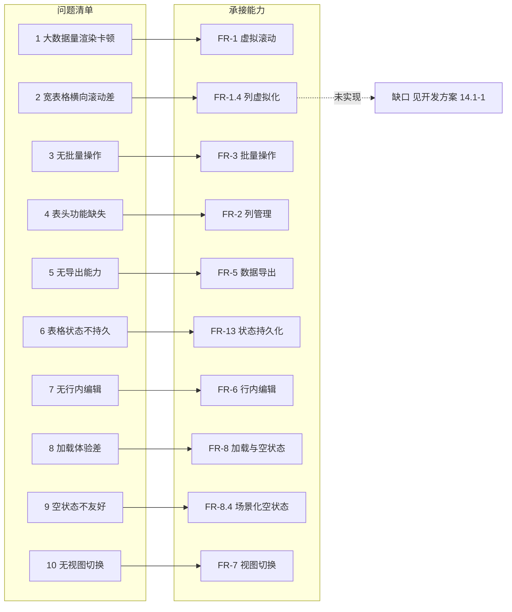
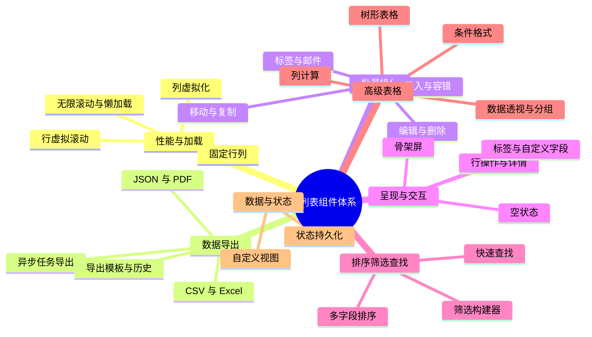

# 列表组件体系

> 需求编号：YV-09-M08 · 优先级：中（阶段一 P1，阶段二/三 P2） · 总人天：9.0d
> 依赖：ProTable 基础组件（YV-09-29）、表单验证框架（YV-09-25）、拖拽排序系统（YV-09-37）

> **文档职责**：本文档定义**要做什么、为什么做、做到什么程度算完成**（WHAT / WHY），不含实现方案与测试用例。
> 实现方案见 [开发方案](../../devs/2026-09/01-prd-task-列表组件体系.md)，验证方案见 [测试方案](../../tests/2026-09/01-prd-test-列表组件体系.md)。

---

## 目录

- [一、背景与问题陈述](#sec-1)
- [二、目标与非目标](#sec-2)
- [三、设计原则](#sec-3)
- [四、需求范围](#sec-4)
- [五、功能需求](#sec-5)
- [六、非功能需求](#sec-6)
- [七、依赖与约束](#sec-7)
- [八、需求风险](#sec-8)
- [九、验收与成功指标](#sec-9)
- [十、变更记录](#sec-10)

---

## 一、背景与问题陈述

YiVad 的数据管理页面以 ProTable 为核心组件，当前基于 Element Plus `el-table` 封装。随着数据规模增长（部分项目已超 10K 行、50+ 列），性能与功能均暴露出不足，用户完成一次数据整理需要绕行大量手工操作。

### 1.1 问题清单

| # | 问题 | 严重度 | 用户影响 |
|---|------|--------|----------|
| 1 | **大数据量渲染卡顿** — 10K+ 行时首屏渲染耗时 3–5s，滚动掉帧 | 高 | 数据管理页面近乎不可用 |
| 2 | **宽表格横向滚动差** — 50+ 列时初始渲染缓慢 | 中 | 日志分析等场景体验劣化 |
| 3 | **无批量操作** — 缺少行选择与多选后的批量动作 | 高 | 只能逐行操作，效率极低 |
| 4 | **表头功能缺失** — 不支持列排序、显隐、宽度调整 | 中 | 用户无法定制表格视图 |
| 5 | **无导出能力** — 无法导出 CSV / Excel / JSON / PDF | 高 | 数据分析流程断裂 |
| 6 | **表格状态不持久** — 刷新后筛选、排序、列配置丢失 | 中 | 每次进入需重新配置 |
| 7 | **无行内编辑** — 改一个字段需打开编辑弹窗 | 中 | 简单修改流程冗长 |
| 8 | **加载体验差** — 无骨架屏，长时间空白等待 | 中 | 感知等待时间被放大 |
| 9 | **空状态不友好** — 无数据 / 无结果时缺少引导 | 低 | 新用户困惑 |
| 10 | **无视图切换** — 仅表格视图，缺少卡片 / 看板 / 日历等 | 中 | 不同场景无法选择最佳呈现 |

问题与承接能力的对应关系：

> 问题 2 的承接能力 FR-1.4（列虚拟化）当前未实现，是本文档唯一的**问题无解**项。

### 1.2 现状基线

| 维度 | 现状 |
|------|------|
| 单表最大数据量 | 10,000+ 行（Bug 列表、Session 列表） |
| 单表最大列数 | 50+ 列（RSS 日志分析场景） |
| 渲染方式 | 一次性渲染全部行，无虚拟化 |
| 状态保持 | 无持久化，路由跳转即丢失 |
| 数据出口 | 无导出，仅能在页面内查看 |

---

## 二、目标与非目标

### 2.1 目标

1. **性能**：大数据量列表从"不可用"变为"可用"——10K 行首屏渲染 < 200ms，滚动帧率 ≥ 55fps。
2. **效率**：把逐行操作收敛为批量操作，把"跳转—编辑—返回"收敛为行内编辑。
3. **可控**：用户可自定义列、排序、筛选与视图，且配置跨会话保持、可通过 URL 分享。
4. **可迁移**：数据可导出为通用格式，脱离系统也能继续分析。

### 2.2 非目标

| 非目标 | 说明 |
|--------|------|
| 替换 ProTable | 本次为**增量增强**，ProTable 现有 API 与调用方保持不变 |
| 双向前端渲染引擎 | 不做类 Excel 的公式计算引擎，列计算仅支持预定义聚合函数 |
| 服务端报表引擎 | 不新建独立报表服务，导出复用 YiAi 既有 RPC 通道 |
| 实时协同编辑 | 多人同时编辑同一单元格不在本次范围（见 YV-09-21） |
| 移动端独立实现 | 移动端为响应式降级，不做独立组件树 |

---

## 三、设计原则

1. **性能优先** — 虚拟滚动解决大数据量渲染；懒加载与分页预取优化加载路径。
2. **操作效率** — 批量操作、行内编辑、右键菜单压缩操作路径。
3. **可配置性** — 列管理、字段自定义、视图切换让用户定制自己的工作区。
4. **状态持久化** — URL 参数 + localStorage 双通道，刷新与分享均不丢状态。
5. **渐进增强** — 核心能力（虚拟滚动、导出、批量操作）P1 先行；高级特性（透视表、树形表格）P2 按需启用。
6. **向后兼容** — 新能力以可选方式接入，未启用时列表行为与现状完全一致。

---

## 四、需求范围

本文档整合 40 个子需求，按能力域分组。人天为前端估算。

### 4.1 性能与加载（合计 2.4d）

| 序号 | 需求编号 | 子需求 | 人天 | 优先级 | 状态 |
|------|---------|--------|------|--------|------|
| 1 | YV-09-29 | 表格组件优化（虚拟滚动、列管理、导出） | 1.5 | P1 | ✅ |
| 13 | YV-09-143 | 无限滚动加载 | 0.3 | P2 | ✅ |
| 14 | YV-09-144 | 虚拟列表优化 | 0.3 | P2 | ✅ |
| 15 | YV-09-145 | 懒加载组件 | 0.3 | P2 | ✅ |
| 16 | YV-09-146 | 表格固定行列 | 0.3 | P2 | ✅ |
| 31 | YV-09-184 | 列表加载优化 | 0.3 | P2 | ✅ |

### 4.2 数据导出与导入（合计 2.7d）

| 序号 | 需求编号 | 子需求 | 人天 | 优先级 | 状态 |
|------|---------|--------|------|--------|------|
| 2 | YV-09-30 | 数据导出系统（CSV / Excel / JSON / PDF） | 1.0 | P2 | ✅ |
| 4 | YV-09-35 | 打印样式与 PDF 导出 | 0.5 | P2 | ✅ |
| 6 | YV-09-59 | 数据导入导出中心 | 0.5 | P2 | ✅ |
| 11 | YV-09-123 | 批量导入映射模板 | 0.3 | P2 | ✅ |
| 24 | YV-09-154 | 表格导出 PDF 优化 | 0.3 | P2 | ✅ |
| 34 | YV-09-187 | 列表导出模板 | 0.3 | P2 | ✅ |
| 40 | YV-09-193 | 列表批量导入 | 0.3 | P2 | ✅ |

### 4.3 批量操作（合计 3.1d）

| 序号 | 需求编号 | 子需求 | 人天 | 优先级 | 状态 |
|------|---------|--------|------|--------|------|
| 5 | YV-09-41 | 批量操作工具栏 | 1.0 | P2 | ✅ |
| 8 | YV-09-88 | 批量编辑与属性面板 | 0.3 | P2 | ✅ |
| 28 | YV-09-181 | 列表批量邮件 | 0.3 | P2 | ✅ |
| 33 | YV-09-186 | 列表批量标签 | 0.3 | P2 | ✅ |
| 37 | YV-09-190 | 列表批量移动 | 0.3 | P2 | ✅ |
| 38 | YV-09-191 | 列表批量删除 | 0.3 | P2 | ✅ |
| 39 | YV-09-192 | 列表批量复制 | 0.3 | P2 | ✅ |

### 4.4 呈现与交互（合计 1.8d）

| 序号 | 需求编号 | 子需求 | 人天 | 优先级 | 状态 |
|------|---------|--------|------|--------|------|
| 3 | YV-09-34 | 骨架屏与加载模式库 | 0.5 | P2 | ✅ |
| 12 | YV-09-142 | 全局加载进度条 | 0.3 | P2 | ✅ |
| 27 | YV-09-180 | 列表视图切换 | 0.3 | P2 | ✅ |
| 29 | YV-09-182 | 列表行操作菜单 | 0.3 | P2 | ✅ |
| 30 | YV-09-183 | 列表详情侧边栏 | 0.3 | P2 | ✅ |
| 32 | YV-09-185 | 列表空状态设计 | 0.3 | P2 | ✅ |

### 4.5 排序、筛选与查找（合计 1.5d）

| 序号 | 需求编号 | 子需求 | 人天 | 优先级 | 状态 |
|------|---------|--------|------|--------|------|
| 22 | YV-09-152 | 表格高级筛选 | 0.3 | P2 | ✅ |
| 25 | YV-09-178 | 列表排序配置 | 0.3 | P2 | ✅ |
| 26 | YV-09-179 | 列表筛选面板 | 0.3 | P2 | ✅ |
| 35 | YV-09-188 | 列表字段自定义 | 0.3 | P2 | ✅ |
| 36 | YV-09-189 | 列表快速查找 | 0.3 | P2 | ✅ |

### 4.6 高级表格特性（合计 1.5d）

| 序号 | 需求编号 | 子需求 | 人天 | 优先级 | 状态 |
|------|---------|--------|------|--------|------|
| 17 | YV-09-147 | 树形表格组件 | 0.3 | P2 | ✅ |
| 18 | YV-09-148 | 表格条件格式 | 0.3 | P2 | ✅ |
| 19 | YV-09-149 | 表格列计算 | 0.3 | P2 | ✅ |
| 20 | YV-09-150 | 表格行内编辑优化 | 0.3 | P2 | ✅ |
| 21 | YV-09-151 | 表格分组与聚合 | 0.3 | P2 | ⚠️ 未实现 |
| 23 | YV-09-153 | 表格数据透视 | 0.3 | P2 | ✅ |

### 4.7 数据模型与状态（合计 1.1d）

| 序号 | 需求编号 | 子需求 | 人天 | 优先级 | 状态 |
|------|---------|--------|------|--------|------|
| 7 | YV-09-79 | 自定义字段系统 | 0.5 | P2 | ✅ |
| 9 | YV-09-90 | 标签管理与分类 | 0.3 | P2 | ✅ |
| 10 | YV-09-122 | 自定义视图保存 | 0.3 | P2 | ✅ |

> 子需求实现状态以[开发方案 §13 实现完成记录](../../devs/2026-09/01-prd-task-列表组件体系.md#sec-13)为准，其中 4 项能力存在缺口，详见[开发方案 §14 已知缺口与技术债](../../devs/2026-09/01-prd-task-列表组件体系.md#sec-14)。

---

## 五、功能需求

> 每条需求给出**可判定的验收标准**。`FR-x.y` 编号供测试用例引用。

### 5.1 虚拟滚动与性能（FR-1）

| 编号 | 需求 | 验收标准 |
|------|------|----------|
| FR-1.1 | 行虚拟滚动 | 仅渲染可视区域 + 上下缓冲区的行；10,000 行时 DOM 中 `<tr>` 数量 < 50 |
| FR-1.2 | 滚动定位 | 提供按行索引跳转能力，跳转后目标行进入可视区域 |
| FR-1.3 | 容器自适应 | 容器尺寸变化时可见行范围自动重算，无需手动刷新 |
| FR-1.4 | 列虚拟化 | 50+ 列时仅渲染可视列 + 缓冲区，横向滚动流畅 |
| FR-1.5 | 无限滚动 | 滚动至底部阈值时自动加载下一页；加载中显示占位；全部加载完成显示结束提示；失败可重试 |
| FR-1.6 | 懒加载 | 组件进入视口前不渲染，占位高度避免布局跳动 |
| FR-1.7 | 固定行列 | 支持固定表头、左/右固定列，滚动时固定区与非固定区位置同步 |
| FR-1.8 | 加载策略 | 支持骨架屏加载、渐进式渲染、分页预取、图片懒加载 |

### 5.2 列管理（FR-2）

| 编号 | 需求 | 验收标准 |
|------|------|----------|
| FR-2.1 | 列显隐 | 可切换任意列的显示 / 隐藏，表头提供全部显示与全部隐藏快捷操作 |
| FR-2.2 | 列排序 | 可拖拽调整列顺序 |
| FR-2.3 | 列宽调整 | 可拖拽调整列宽，最小宽度 50px |
| FR-2.4 | 列冻结 | 可设置左固定 / 右固定 / 不固定 |
| FR-2.5 | 配置持久化 | 列配置跨会话保持；提供"恢复默认"清除本地配置 |
| FR-2.6 | 列预设 | 可保存多套列配置并快速切换 |
| FR-2.7 | 自定义字段入列 | 自定义字段自动出现在可选列列表中，并支持排序与筛选 |

### 5.3 行选择与批量操作（FR-3）

| 编号 | 需求 | 验收标准 |
|------|------|----------|
| FR-3.1 | 选择模式 | 支持单选、多选、禁用选择三种模式；多选下支持 Shift 范围选择与全选 |
| FR-3.2 | 选中反馈 | 选中行高亮，实时显示选中计数；提供"取消选择"入口 |
| FR-3.3 | 批量工具栏 | 选中行数 > 0 时显示操作栏，为 0 时隐藏 |
| FR-3.4 | 批量编辑 | 支持多字段同时编辑、查找替换、从一行复制属性、提交前变更预览 |
| FR-3.5 | 批量删除 | 二次确认并列出待删条目；支持软删除与永久删除；有关联数据时给出级联删除警告；软删除可撤销 |
| FR-3.6 | 批量移动 | 树形选择器指定目标位置；校验目标不可为自身、禁止循环移动；支持撤销 |
| FR-3.7 | 批量复制 | 支持同项目 / 跨项目复制，可选是否包含关联数据；标题重复时自动加后缀 |
| FR-3.8 | 批量标签 | 支持批量添加 / 移除标签，提供基于现有标签的建议 |
| FR-3.9 | 批量邮件 | 支持邮件模板与合并字段（如 `{{name}}`）、逐收件人预览、发送队列与节流 |
| FR-3.10 | 进度与容错 | 批量操作显示进度；部分失败不中断，完成后汇总失败条目与原因 |
| FR-3.11 | 批量导入 | 支持 CSV / JSON / Excel 上传与剪贴板粘贴；支持列映射、数据预览、校验报告、重复处理策略选择 |

### 5.4 排序、筛选与查找（FR-4）

| 编号 | 需求 | 验收标准 |
|------|------|----------|
| FR-4.1 | 多字段排序 | 支持按多个字段排序并设定优先级，每个字段独立升降序 |
| FR-4.2 | 排序交互 | 点击列头按"升序 → 降序 → 无"循环；Shift + 点击追加次要排序 |
| FR-4.3 | 排序模式 | 支持自然排序 / 字母排序 / 数字排序；支持自定义顺序（如按状态枚举顺序） |
| FR-4.4 | 排序预设 | 可保存排序组合为预设并复用 |
| FR-4.5 | 筛选构建器 | 支持多条件 AND / OR 组合；提供等于、不等于、包含、不包含、大于、小于、介于、为空、不为空、开头匹配、结尾匹配共 11 种运算符 |
| FR-4.6 | 运算符自适应 | 文本字段默认展示文本类运算符，数字与日期字段展示比较类运算符 |
| FR-4.7 | 筛选预设与历史 | 可保存筛选组合为预设并快速切换；保留最近使用的筛选条件 |
| FR-4.8 | 筛选反馈 | 以标签形式展示当前生效条件；支持一键清除全部筛选；实时预览结果行数 |
| FR-4.9 | 单元格快筛 | 右键单元格可"筛选此值" / "排除此值" |
| FR-4.10 | 筛选导入导出 | 筛选条件可导出与导入 |
| FR-4.11 | 快速查找 | 表格内支持关键词查找，匹配内容高亮并显示"当前 / 总数"计数；支持上下跳转、大小写敏感开关、正则模式、限定列范围 |

### 5.5 数据导出（FR-5）

| 编号 | 需求 | 验收标准 |
|------|------|----------|
| FR-5.1 | 导出范围 | 支持三种范围：当前视图（含筛选 / 排序 / 搜索） / 选中行 / 全量 |
| FR-5.2 | 导出格式 | 支持 CSV、Excel(.xlsx)、JSON、PDF |
| FR-5.3 | CSV 正确性 | 含 UTF-8 BOM，中文在 Excel 中不乱码；含逗号、引号、换行的字段按 RFC 4180 转义 |
| FR-5.4 | Excel 正确性 | 列宽自适应、标题行冻结、启用自动筛选 |
| FR-5.5 | JSON 结构 | 美化输出，包含导出时间与总条数元数据 |
| FR-5.6 | PDF 正确性 | 横版 A4、表头每页重复、页脚含"第 X 页 / 共 Y 页"、中文正常渲染 |
| FR-5.7 | 数据量分流 | ≤ 5,000 行前端直接导出；> 5,000 行走异步任务导出并展示进度 |
| FR-5.8 | 列映射 | 导出前可选择列、重命名列标题、调整列顺序 |
| FR-5.9 | 导出模板 | 可将列映射 + 筛选 + 排序 + 格式保存为命名模板并复用、共享 |
| FR-5.10 | 导出历史 | 保留最近 10 条导出记录（文件名、格式、实体、行数、大小、时间），有效期内可重新下载 |
| FR-5.11 | 定时导出 | 支持日报 / 周报 / 月报调度，显示上次与下次运行时间，失败时通知 |
| FR-5.12 | 导出可取消 | 导出过程可取消，取消后不再产生下载；重新导出从 0% 开始 |

### 5.6 行内编辑（FR-6）

| 编号 | 需求 | 验收标准 |
|------|------|----------|
| FR-6.1 | 触发与提交 | 双击单元格进入编辑；Enter 确认；Esc 取消并还原；Tab 跳转至下一个可编辑单元格 |
| FR-6.2 | 编辑器自适应 | 按字段类型自动匹配编辑器：文本、数字、下拉、日期、日期时间、标签、用户、布尔、多行文本、颜色 |
| FR-6.3 | 脏数据标记 | 已修改未提交的单元格 / 行有明显标记；提供逐行与整体保存 |
| FR-6.4 | 校验 | 提交前按列校验规则校验，失败时保留编辑态并提示原因 |
| FR-6.5 | 虚拟滚动兼容 | 编辑中的行即使被滚出视口，滚回后编辑态与已输入值不丢失 |
| FR-6.6 | 提交一致性 | 提交后显示处理中状态，后端确认后刷新数据，避免乐观更新与后端不一致 |

### 5.7 视图切换（FR-7）

| 编号 | 需求 | 验收标准 |
|------|------|----------|
| FR-7.1 | 视图类型 | 支持表格、卡片、看板、日历、画廊、地图六种视图 |
| FR-7.2 | 视图一致性 | 切换视图后筛选条件保持，数据行数一致 |
| FR-7.3 | 视图独立配置 | 各视图的筛选 / 排序 / 列 / 分组配置独立保存 |
| FR-7.4 | 视图偏好 | 记住用户上次使用的视图并作为默认 |
| FR-7.5 | 视图分享 | 可通过 URL 分享当前视图配置，打开后自动还原 |

### 5.8 加载与空状态（FR-8）

| 编号 | 需求 | 验收标准 |
|------|------|----------|
| FR-8.1 | 骨架屏 | 提供表格、列表、卡片、表单、详情五类骨架屏；形状与真实内容结构一致 |
| FR-8.2 | 骨架屏时序 | 支持延迟显示（避免快速加载时闪烁）与最小显示时长（默认 300ms，避免闪跳） |
| FR-8.3 | 全局进度条 | 路由切换与 API 请求时在顶部显示进度；支持颜色与速度配置及手动控制 |
| FR-8.4 | 空状态场景 | 覆盖五种场景并可配置插画、标题、描述与操作按钮：无数据、搜索无结果、筛选无结果、无权限、网络错误 |
| FR-8.5 | 空状态引导 | 每种场景提供明确的下一步行动入口（如"创建第一条记录"、"清除搜索"、"重试"） |

### 5.9 行操作与详情（FR-9）

| 编号 | 需求 | 验收标准 |
|------|------|----------|
| FR-9.1 | 悬浮操作 | 鼠标悬浮行时显示常用操作按钮，更多操作折叠进"…"菜单 |
| FR-9.2 | 右键菜单 | 提供与上下文相关的操作项；右键状态列时可"筛选此值" / "排除此值" |
| FR-9.3 | 操作权限 | 行操作按 `v-auth` 权限控制显隐 |
| FR-9.4 | 危险操作确认 | 删除等危险操作需二次确认 |
| FR-9.5 | 详情侧边栏 | 点击行从右侧滑出详情面板，展示关键字段，面板内可直接编辑 |
| FR-9.6 | 面板规格 | 默认宽度 480px，可拖拽调整至 320–800px；点击面板外区域关闭 |
| FR-9.7 | 条目导航 | 面板内可切换上一条 / 下一条，切换后对应行在表格中高亮并滚动到可见区域 |
| FR-9.8 | 未保存保护 | 切换条目时若存在未保存修改，需提示保存或放弃 |

### 5.10 标签管理（FR-10）

| 编号 | 需求 | 验收标准 |
|------|------|----------|
| FR-10.1 | 标签 CRUD | 支持标签创建、重命名、合并、删除 |
| FR-10.2 | 标签层级 | 支持父子标签与标签分组 |
| FR-10.3 | 标签外观 | 支持颜色与图标配置 |
| FR-10.4 | 使用分析 | 显示每个标签的使用次数 |
| FR-10.5 | 自动标签 | 支持基于条件自动打标签 |
| FR-10.6 | 标签清理 | 可批量删除零使用标签 |
| FR-10.7 | 列表集成 | 列表中以色块展示标签；支持按标签筛选；筛选状态可持久化 |

### 5.11 自定义字段（FR-11）

| 编号 | 需求 | 验收标准 |
|------|------|----------|
| FR-11.1 | 字段类型 | 支持文本、多行文本、数字、日期、日期时间、下拉、多选、复选框、用户、文件、链接、评分、颜色共 13 种类型 |
| FR-11.2 | 字段配置 | 支持名称、描述、必填、默认值、校验规则、基于其他字段的条件显示、排序权重 |
| FR-11.3 | 列表集成 | 自定义字段可用于列展示、排序、筛选与导出 |

### 5.12 高级表格特性（FR-12）

| 编号 | 需求 | 验收标准 |
|------|------|----------|
| FR-12.1 | 树形表格 | 支持展开 / 折叠、懒加载子节点、缩进引导线、子树全选、拖拽调整层级；折叠节点的子节点不计入总行数 |
| FR-12.2 | 条件格式 | 支持色阶、数据条、图标集、规则高亮与自定义公式；规则可增删改并设定优先级；编辑规则时实时预览 |
| FR-12.3 | 列计算 | 支持合计、平均、计数、最大值、最小值与自定义聚合；结果以页脚统计行呈现；支持累计值与占比；导出包含计算结果 |
| FR-12.4 | 分组与聚合 | 支持拖拽列创建分组、多级嵌套分组、分组展开折叠与组内汇总 |
| FR-12.5 | 数据透视 | 支持行 / 列 / 值字段配置与多种聚合方式；支持展开折叠、总计行列；点击透视单元格可下钻查看源数据 |

### 5.13 状态持久化与自定义视图（FR-13）

| 编号 | 需求 | 验收标准 |
|------|------|----------|
| FR-13.1 | 持久化内容 | 分页、排序、筛选、列配置（显隐 / 顺序 / 宽度）均持久化 |
| FR-13.2 | 恢复优先级 | URL 参数 > localStorage > 默认配置 |
| FR-13.3 | 双通道分工 | 简单状态写入 URL 以支持分享与书签；复杂筛选（如多选 50+ 项）仅存 localStorage |
| FR-13.4 | 自定义视图 | 可保存完整视图配置（筛选 + 列 + 排序 + 分组）并命名 |
| FR-13.5 | 视图管理 | 支持创建、编辑、删除、复制、设为默认 |
| FR-13.6 | 视图分享 | 可将视图分享给团队 |

### 5.14 打印与 PDF（FR-14）

| 编号 | 需求 | 验收标准 |
|------|------|----------|
| FR-14.1 | 打印样式 | 打印时隐藏侧边栏、导航、分页、工具栏与按钮；展开全部虚拟滚动行 |
| FR-14.2 | 分页控制 | 表头每页重复；`page-break-inside: avoid` 避免行内分页；横版 A4 |
| FR-14.3 | 选择性导出 | 打印 / 导出 PDF 时可选择列 |

---

## 六、非功能需求

### 6.1 性能指标（NFR-1，验收阈值）

| 场景 | 目标帧率 | 渲染时间 | DOM 行节点数 |
|------|----------|----------|-------------|
| 1,000 行 | 60fps | < 100ms | < 50 |
| 10,000 行 | ≥ 55fps | < 200ms | < 50 |
| 50,000 行 | ≥ 50fps | < 300ms | < 60 |
| 100,000 行 | ≥ 45fps | < 500ms | < 60 |

| 数据量 | CSV | Excel | JSON | PDF |
|--------|-----|-------|------|-----|
| 100 行 | < 20ms | < 100ms | < 20ms | < 300ms |
| 1,000 行 | < 100ms | < 300ms | < 50ms | < 1s |
| 5,000 行 | < 300ms | < 1s | < 200ms | < 5s |
| 10,000 行 | < 10s（异步任务） | < 10s | < 10s | < 15s |

| 内存占用（10 列） | 无虚拟滚动 | 有虚拟滚动 |
|------------------|-----------|-----------|
| 10,000 行 | ~120MB | ~8MB |
| 50,000 行 | ~600MB | ~10MB |

### 6.2 无障碍（NFR-2）

| 目标 | 要求 |
|------|------|
| 标准 | WCAG 2.1 AA |
| 表格 | 表头与数据列语义关联（`<th scope="col">`） |
| 排序 | 排序状态可被辅助技术识别（`aria-sort`） |
| 行选择 | 选中状态可被辅助技术识别（`aria-selected`） |
| 虚拟滚动 | 暴露总行数与当前行范围，避免屏幕阅读器遗漏内容 |
| 动态区域 | 加载中、空状态、批量操作栏、导出进度以 live region 或等价语义暴露 |
| 查找 | 查找栏具备 search 语义与可读标签 |
| 键盘 | 列表核心路径（排序、选择、行内编辑、查找、批量操作）可全键盘完成 |

### 6.3 响应式（NFR-3）

| 断点 | 要求 |
|------|------|
| ≥ 1200px | 完整列显示，浮动工具栏，右侧滑出侧边栏 |
| 768–1199px | 列按优先级裁剪，保留批量操作入口 |
| < 768px | 仅显示 2–3 个关键列，提供"展开查看全部"；批量操作栏固定底部；详情侧边栏改为全屏模态；右键菜单改为长按触发 |

### 6.4 体积与依赖（NFR-4）

| 约束 | 要求 |
|------|------|
| 首屏增量 | 列表组件体系为首屏新增的体积 < 10KB（gzip） |
| 重依赖 | 体积较大的导出与图表库必须按需加载，不进入首屏 |
| 兼容性 | 支持 Chrome / Edge / Firefox 最新两个大版本；不支持 IE |

---

## 七、依赖与约束

### 7.1 上游依赖

| 依赖 | 类型 | 说明 |
|------|------|------|
| ProTable（YV-09-29） | 内部 | 列表页统一入口，本次为增量增强 |
| 表单验证框架（YV-09-25） | 内部 | 行内编辑与批量编辑复用其校验规则 |
| 拖拽排序系统（YV-09-37） | 内部 | 列排序与分组复用 |
| 右键菜单基础设施 | 内部 | 单元格快筛复用（见 YV-09-17） |
| YiAi 后端 | 外部 | 数据查询、导出任务、导入落库均经 RPC |
| YiVad 国际化 | 内部 | 所有可见文案需走 `$t()` |

### 7.2 约束

- **必须使用 ProTable**，禁止页面直接使用 `el-table`。
- **禁止前端直连 MongoDB**，数据操作一律经 RPC 信封。
- **参数名契约**：collection 参数为 `cname`，查询条件为 `filter`，文件路径为 `target_file`。
- **TypeScript 严格模式**，`vue-tsc --noEmit` 必须通过。
- 所有用户可见文本必须国际化。

---

## 八、需求风险

> 技术实现层面的风险（虚拟滚动与固定列冲突、动态行高、依赖加载失败等）见[开发方案 §风险与缓解](../../devs/2026-09/01-prd-task-列表组件体系.md)。

| 风险 | 概率 | 影响 | 缓解措施 |
|------|------|------|----------|
| 范围过大导致交付延期 | 高 | 中 | 按 P1 / P2 分批交付，P1 核心能力先行 |
| 新能力启用后与旧列表行为不一致 | 中 | 高 | 保持向后兼容，按页面灰度接入 |
| 用户对批量危险操作产生误操作 | 中 | 高 | 危险操作强制二次确认，删除默认走软删除 |
| 用户不理解"当前视图 / 选中行 / 全量"导出差异 | 中 | 中 | 导出菜单中明示范围与预估行数 |
| 大表导出被用于绕过页面权限 | 中 | 高 | 导出复用列表查询的权限过滤，禁止越权取数 |
| 移动端体验降级后功能不可用 | 中 | 中 | 明确降级对照表，保证只读与基本操作可用 |

---

## 九、验收与成功指标

### 9.1 验收入口

| 验收项 | 判定依据 |
|--------|----------|
| 功能完整性 | 本文档 §5 全部 FR 编号通过对应测试用例，见[测试方案 §覆盖矩阵](../../tests/2026-09/01-prd-test-列表组件体系.md) |
| 性能达标 | §6.1 全部阈值达标，含 10K / 50K 行实测 |
| 无障碍 | §6.2 列出的语义要求全部满足 |
| 响应式 | §6.3 三个断点行为符合要求 |
| 体积预算 | 首屏增量 < 10KB（gzip） |
| 类型检查 | `vue-tsc --noEmit` 通过 |

### 9.2 成功指标

| 指标 | 基线 | 目标 |
|------|------|------|
| 10K 行首屏渲染时间 | 3–5s | < 200ms |
| 10K 行 DOM 行节点数 | 10,000 | < 50 |
| 完成一次"改 15 行同一字段"的操作步数 | 15 次弹窗编辑 | ≤ 3 步（选择 → 批量编辑 → 提交） |
| 列表页刷新后状态保持率 | 0% | 100%（分页 / 排序 / 筛选 / 列配置） |
| 数据离开系统的方式 | 仅页面查看 | 4 种格式导出 |

---

## 十、变更记录

| 日期 | 变更 | 说明 |
|------|------|------|
| 2026-09-09 | 初稿 | 整合 40 个子需求为统一需求文档 |
| 2026-09-10 | 补充实现细节 | 追加实现方案、测试用例与演示页面规格 |
| 2026-09-12 | **职责分离重构** | 剥离实现方案至 `devs/`、测试用例至 `tests/`，本文档只保留 WHAT / WHY；补充目标与非目标、FR 编号与验收标准、非功能需求、成功指标 |

---
