# YiVad 项目管理系统 — 全面需求总览

> 需求编号：YV-09-M11 · 总人天：~15.0d · 涉及模块：项目核心、时间规划、资源管理、风险管控、自动化
> 合并自 45 个独立需求文件，覆盖项目管理全生命周期

---

## 0. 文档概述

> **范围说明**：本文档为多 Sprint 史诗级需求，覆盖 45 个子需求，总估算 ~15 人天。实施按 6 个 Phase 分阶段交付，每个 Phase 独立可发布。当前正在执行 Phase 1（核心基础）。

本文档合并了 YiVad 九月迭代中所有项目管理相关需求，按功能域分为以下六大板块：

| 板块 | 涵盖需求 | 文件数 | 核心能力 |
|------|---------|--------|---------|
| 一、项目核心管理 | 项目健康、多项目视图、对比、归档、模板、成员、通知、标签、属性 | 14 | 项目生命周期管理 |
| 二、时间与进度规划 | 甘特图、里程碑、日历、迭代规划、时间追踪 | 8 | 时间维度管理 |
| 三、目标与工作流 | OKR、工作流自动化、状态流转、自定义状态流 | 5 | 流程与目标管理 |
| 四、资源与预算 | 资源管理、工作量、预算、工作负载均衡 | 5 | 资源与成本管控 |
| 五、风险与依赖 | 风险登记册、依赖关系图、变更影响分析、项目问题预测 | 4 | 风险识别与缓解 |
| 六、集成与自动化 | Webhook、自动化规则、发布检查清单、变更日志、版本发布 | 9 | 外部集成与自动化 |

---

## 一、项目核心管理

### 1.1 项目健康大盘监控 (YV-09-18)

**目标**：提供代码库健康度的量化监控，从代码维度预警文件膨胀、组件复用率低、代码重复率高等问题。

**核心设计决策**：
- 选择后端分析（YiAi 新增 `/code-health/analyze` 端点），通过 Python 进行文件遍历、AST 解析和复杂度计算
- 分析结果缓存 1 小时，避免重复计算
- 前端展示：`DetailOverview.vue` 侧边栏扩展健康指标面板

**健康指标维度**：
- 文件规模指标：总文件数、总行数、平均文件行数
- 复杂度指标：圈复杂度分布、深层嵌套文件 Top 10
- 复用指标：组件复用率、重复代码率
- 质量指标：TODO/FIXME 数量、注释覆盖率
- 趋势指标：与上次分析的对比变化

**前端改动**：
- `ProjectHealthPanel.vue`：健康面板主组件，展示指标卡片 + 趋势图
- `HealthTrendChart.vue`：各指标的历史趋势折线图
- `CodeComplexityTree.vue`：文件复杂度树形图（Treemap）
- `useProjectHealth.ts`：健康数据 composable

**后端改动**：
- `services/code_health/analyzer.py`：代码分析器（文件遍历 + AST 解析）
- `services/code_health/complexity.py`：圈复杂度计算
- `services/code_health/duplication.py`：代码重复检测

### 1.2 项目健康评分 (YV-09-108)

**目标**：自动化多因子健康评分，综合进度、预算、质量、团队、风险五个维度，生成 0-100 的健康分数。

**评分模型**：

| 维度 | 权重 | 指标 | 数据来源 |
|------|------|------|---------|
| 进度 | 30% | 完成率 vs 预期、里程碑达成率 | Issue 状态统计 |
| 预算 | 20% | 实际支出 vs 预算、消耗速率 | 成本追踪数据 |
| 质量 | 20% | Bug 率、返工率、测试覆盖率 | 代码质量 + Bug 数据 |
| 团队 | 15% | 负载均衡度、人员流动率 | 资源管理数据 |
| 风险 | 15% | 高风险项数量、风险缓解完成率 | 风险登记册 |

**健康等级**：
- 80-100：健康（绿色）——项目按计划推进
- 60-79：关注（黄色）——存在需要关注的问题
- 40-59：有风险（橙色）——需要干预
- 0-39：危急（红色）——需要立即行动

**前端组件**：
- `HealthScoreGauge.vue`：健康分数仪表盘（圆环图）
- `HealthFactorBreakdown.vue`：各因子得分雷达图
- `HealthTrendLine.vue`：健康分数历史趋势
- `ImprovementSuggestions.vue`：AI 生成的改进建议列表

### 1.3 项目活动热图 (YV-09-126)

**目标**：GitHub 风格贡献图，展示项目活动强度的时间分布。

**核心功能**：
- 按天展示活动强度（颜色深浅表示活动量）
- 多活动类型颜色编码（Issue 创建=蓝、代码提交=绿、文档编辑=紫、评论=橙）
- 悬停显示当日活动详情（Issue 数、提交数、文档变更数）
- 日期范围选择（过去 3 个月/6 个月/1 年/全部）
- 团队成员过滤（单人视图 / 团队视图）
- 活动类型图例切换

**前端组件**：
- `ActivityHeatmap.vue`：热图主组件（53 列 x 7 行网格）
- `ActivityLegend.vue`：活动类型颜色图例
- `ActivityTooltip.vue`：悬停详情浮层

### 1.4 多项目管理视图 (YV-09-77)

**目标**：跨项目组合视图，提供全局项目健康对比、资源分配总览和多项目搜索。

**核心功能**：
- **项目矩阵视图**：卡片式展示所有项目，每个卡片显示关键 KPI（进度、健康分、成员数、风险数）
- **项目对比表**：表格形式对比多个项目的指标
- **资源分配总览**：团队成员在多项目间的工作分配（堆叠柱状图）
- **跨项目时间线**：多项目甘特图叠加视图
- **优先级矩阵**：基于健康分 + 业务价值的 2x2 矩阵
- **多项目搜索**：跨项目搜索 Issue、文档、代码

**前端组件**：
- `PortfolioView.vue`：组合视图主页面
- `ProjectMatrix.vue`：项目卡片矩阵
- `ProjectCompareTable.vue`：项目对比表格
- `CrossProjectTimeline.vue`：跨项目时间线
- `ResourceAllocationChart.vue`：资源分配图
- `PriorityMatrix.vue`：优先级矩阵

**数据聚合**：后端 `services/portfolio/portfolio_service.py` 负责从多个项目聚合数据，计算全局指标。性能优化：使用 MongoDB 聚合管道批量查询，前端分页加载。

### 1.5 项目对比视图 (YV-09-119)

**目标**：并行对比最多 5 个项目，支持雷达图、趋势对比、差异高亮和报告导出。

**核心功能**：
- 项目选择器：同时选择 2-5 个项目进行对比
- 雷达图对比：进度/质量/团队/预算/风险五维雷达图
- 趋势对比：选中指标的历史趋势折线图叠加
- 差异高亮：表格中突出显示偏离平均值 >20% 的指标
- 对比报告导出：生成 PDF/PNG 格式的对比报告

**前端组件**：
- `CompareView.vue`：对比主页面
- `RadarCompareChart.vue`：雷达对比图
- `TrendCompareChart.vue`：趋势对比图
- `DiffHighlightTable.vue`：差异高亮表格
- `CompareReportExport.vue`：报告导出组件

### 1.6 项目归档与恢复 (YV-09-218)

**目标**：支持项目归档（软删除）和恢复，包含归档前完整性检查、归档后只读访问和审计日志。

**核心功能**：
- 归档操作：将项目状态设为"已归档"，禁止修改
- 批量归档：选择多个项目批量归档
- 归档前检查：验证关联数据完整性（孤儿 Issue、未关闭 Bug）
- 归档后访问：只读模式查看归档项目的所有数据
- 恢复操作：从归档状态恢复为活跃状态
- 自动归档规则：超过 N 天无活动的项目自动归档
- 归档审计：记录归档/恢复操作的时间、操作人、原因

**前端组件**：
- `ArchiveDialog.vue`：归档确认对话框（含归档前检查结果）
- `ArchiveList.vue`：归档项目列表
- `ArchiveSettings.vue`：自动归档规则配置

### 1.7 项目模板系统

#### 1.7.1 项目模板与快速创建 (YV-09-72)

**目标**：一键从模板创建项目，支持模板预览、定制与导入导出，将创建时间从 10-15 分钟降至 1 分钟。

**核心功能**：
- 模板列表：预设模板 + 自定义模板
- 一键创建：选择模板后自动填充模块、Issue 类型、成员等配置
- 模板预览：创建前预览模板的项目结构
- 模板定制：基于模板修改后保存为新模板
- 模板导入/导出：JSON 格式，支持跨实例迁移

**预设模板**：
- 软件开发项目：含 Backend/Frontend/Testing 模块，标准 Issue 类型
- UI 设计项目：含 Design/Review/Handoff 模块
- 市场推广项目：含 Planning/Execution/Analytics 模块
- 空白项目：最小配置，从零开始

**前端组件**：
- `TemplateSelector.vue`：模板选择器（创建项目第一步）
- `TemplatePreview.vue`：模板预览面板
- `TemplateEditor.vue`：模板定制编辑器

#### 1.7.2 项目模板市场 (YV-09-111)

**目标**：社区模板市场，支持浏览、安装、评分和提交自定义模板。

**核心功能**：
- 模板浏览：按分类（开发/设计/运营/其他）浏览
- 模板搜索：按名称、标签、描述搜索
- 模板详情：预览 + 评分 + 评论 + 安装次数
- 模板评分：1-5 星评分 + 文字评论
- 精选模板：管理员标记的优质模板
- 模板提交：用户提交自定义模板（需审核）
- 版本管理：模板更新时通知已安装用户

#### 1.7.3 项目模板导出 (YV-09-219)

**目标**：将现有项目导出为模板，支持选择性导出（模块/字段/工作流/自动化规则）。

**核心功能**：
- 选择性导出：勾选要包含的配置项
- 模板元数据：名称、描述、分类、标签、版本号
- 导出格式：JSON（结构化）+ YAML（可读性）
- 版本控制：模板版本号和变更说明
- 敏感信息脱敏：自动清除 API 密钥、Webhook URL 等

### 1.8 项目成员管理 (YV-09-220)

**目标**：项目成员邀请、角色分配、批量导入和权限管理。

**核心功能**：
- 邀请成员：通过用户名/邮箱邀请，支持批量邀请
- 角色分配：为每个成员分配项目角色（管理员/编辑者/查看者）
- CSV 导入：上传 CSV 文件批量添加成员
- 邀请链接：生成邀请链接，支持过期时间设置
- 成员列表：展示成员角色、加入时间、最后活跃时间
- 移除成员：支持批量移除和权限回收
- 成员活动日志：成员加入/离开/角色变更记录

**前端组件**：
- `MemberInviteDialog.vue`：邀请成员对话框
- `MemberList.vue`：成员列表（含角色标签和操作按钮）
- `MemberRoleEditor.vue`：角色编辑下拉
- `CsvImportDialog.vue`：CSV 导入向导

### 1.9 项目通知设置 (YV-09-221)

**目标**：项目级通知偏好管理，支持免打扰时段、通知频道选择和摘要频率配置。

**核心功能**：
- 通知开关：按事件类型（Issue 创建/状态变更/评论/成员变更等）开关
- 通知频道：站内通知/企业微信/邮件，每个事件类型独立配置
- 免打扰时段：设置每日免打扰时间范围
- 摘要频率：即时/每小时/每日/每周摘要
- 通知模板：项目级自定义通知消息模板
- 通知预览：发送测试通知验证配置

### 1.10 项目标签管理 (YV-09-222)

**目标**：项目级标签管理，支持分类、颜色、使用分析和清理。

**核心功能**：
- 标签 CRUD：创建/编辑/删除项目标签
- 标签分类：按类别分组（状态/优先级/类型/模块）
- 颜色配置：预设色板 + 自定义颜色
- 标签使用分析：使用频率排行、关联 Issue 数
- 标签清理：检测未使用的僵尸标签，一键清理
- 标签合并：将多个相似标签合并为一个

### 1.11 项目自定义属性 (YV-09-223)

**目标**：为项目定义自定义字段，支持多种字段类型、验证规则和布局配置。

**核心功能**：
- 字段类型：文本/数字/日期/下拉选择/多选/用户选择/URL/复选框
- 字段验证：必填/正则/范围/唯一性
- 字段布局：拖拽调整字段顺序和分组
- 字段可见性：按角色控制字段可见性
- 字段模板：预定义字段集模板
- 动态表单：根据自定义字段配置动态渲染表单

**与全局自定义字段系统 (YV-09-79) 的关系**：项目自定义属性是全局自定义字段系统在项目级别的具体应用。全局系统提供字段类型引擎和验证框架，项目级属性基于此构建项目特定的字段配置。

### 1.12 全局标签管理 (YV-09-90)

**目标**：全局标签管理，解决标签膨胀、同义词混乱、无层级结构等问题。

**核心功能**：
- 标签层级：支持父子标签（如"支付→支付宝"）
- 标签颜色与图标：全局统一样式
- 标签合并与重命名：批量更新所有引用
- 标签使用分析：热度排名、僵尸标签检测
- 自动标签规则：基于条件自动打标签
- 标签权限：控制谁可以创建/编辑/删除标签
- 标签清理：自动检测和清理零引用标签

**数据模型**：新增 `tags` 集合，存储全局标签定义。现有集合中的 `tags` 字段存储标签 ID 引用，而非字符串。

### 1.13 自定义字段系统 (YV-09-79)

**目标**：实体自定义字段系统，使 Issue/Bug/Project 支持动态字段扩展。

**核心功能**：
- 字段定义：类型（文本/数字/日期/选择/多选/用户/URL）、名称、默认值、验证规则
- 字段绑定：将字段集绑定到特定项目或全局
- 字段渲染：根据字段类型自动渲染对应的表单控件
- 字段搜索：自定义字段参与全局搜索
- 字段过滤：自定义字段参与列表筛选
- 字段排序：按自定义字段排序
- 布局配置：拖拽调整字段顺序、分组、可见性

**数据存储**：使用 MongoDB 的动态文档特性，自定义字段值存储在文档的 `customFields` 子文档中。

---

## 二、时间与进度规划

### 2.1 甘特图与时间线视图 (YV-09-53)

**目标**：可视化项目进度，支持任务条拖拽、依赖线绘制、关键路径高亮。

**前端架构**：
- `GanttChart.vue`：甘特图主容器
- `GanttTimeline.vue`：时间轴头部（日/周/月粒度）
- `GanttTaskBar.vue`：任务条（支持拖拽调整日期和时长）
- `GanttDependencyLine.vue`：依赖连线（箭头 + 贝塞尔曲线）
- `GanttMilestone.vue`：里程碑菱形标记
- `GanttAssigneeChips.vue`：任务条上的负责人头像
- `GanttToolbar.vue`：工具栏（缩放/今天/视图切换）
- `GanttLegend.vue`：状态颜色图例

**Composable**：
- `useGanttChart.ts`：甘特图数据管理（任务列表、时间范围、依赖关系）
- `useGanttDrag.ts`：拖拽交互（调整日期、调整时长、创建依赖）

**关键算法**：
- 关键路径计算：拓扑排序 + 最早开始/最晚开始时间计算
- 依赖线绘制：贝塞尔曲线，避开其他任务条

**依赖数据模型扩展**：Issue 需新增 `start_date`、`end_date`、`dependencies` 字段。

**路由**：`/project/:key/gantt`

### 2.2 里程碑追踪 (YV-09-75)

**目标**：系统化里程碑管理，包含进度自动计算、健康度评估、时间线和燃尽图。

**核心功能**：
- 里程碑 CRUD：名称、描述、目标日期、关联 Issue
- 进度自动计算：基于关联 Issue 的完成率自动计算百分比
- 健康度评估：综合时间进度和完成度判断（正常/有风险/延迟）
- 燃尽图：每日剩余工作量趋势
- 时间线可视化：里程碑在时间轴上的分布
- 依赖管理：里程碑之间的前置依赖
- 里程碑达成通知：达成后自动通知团队

**健康度判断规则**：
- 正常：完成率 >= 时间进度（如已过 50% 时间，完成 >= 50%）
- 有风险：完成率落后时间进度 < 20%
- 延迟：完成率落后时间进度 >= 20%

**前端组件**：
- `MilestoneList.vue`：里程碑列表（含进度条和健康状态标签）
- `MilestoneDetail.vue`：里程碑详情（含关联 Issue 列表）
- `MilestoneTimeline.vue`：里程碑时间轴
- `BurndownChart.vue`：燃尽图
- `MilestoneEditor.vue`：里程碑编辑器

### 2.3 项目里程碑时间线 (YV-09-103)

**目标**：甘特图风格的项目时间线视图，专注里程碑级别的展示。

**与 YV-09-75（里程碑追踪）的关系**：共用里程碑数据模型。YV-09-75 侧重里程碑的管理和进度追踪，YV-09-103 侧重里程碑的可视化展示。

**核心功能**：
- 水平时间线：过去/现在/未来三段时间色彩编码（灰/蓝/绿）
- 里程碑节点：菱形标记 + 完成状态图标
- 依赖连线：里程碑间的前置依赖关系
- 进度指示器：当前日期竖线 + "今天"标记
- 缩放控制：3 个月/6 个月/1 年/全部
- 导出为图片：PNG/SVG 格式

### 2.4 日历与日程集成 (YV-09-66)

**目标**：项目级日历视图，支持事件管理、iCal 订阅和外部日历同步。

**核心功能**：
- 日历视图：月/周/日/列表四种视图
- 事件管理：创建/编辑/删除日历事件
- 事件关联：事件关联到 Issue/里程碑/项目
- 拖拽调整：拖拽事件修改日期和时间
- iCal 订阅：生成 iCal 订阅链接
- 外部同步：Google Calendar / Outlook 日历同步
- 工作量热力图：日历背景显示当日工作量
- 日程小部件：仪表盘中的即将到来事件列表

**前端组件**：
- `CalendarPage.vue`：日历主页面
- `MonthView.vue` / `WeekView.vue` / `DayView.vue`：三种视图
- `AgendaView.vue`：列表视图
- `EventDialog.vue`：事件创建/编辑对话框
- `CalendarSubscription.vue`：日历订阅管理
- `SyncStatusIndicator.vue`：同步状态指示器

### 2.5 团队日历视图 (YV-09-107)

**目标**：多成员日程叠加视图，支持 PTO/休假追踪、Sprint 叠加和冲突检测。

**核心功能**：
- 多成员叠加：选择团队成员，日程在同一个日历中叠加显示
- PTO/休假：标记休假时间（年假/病假/事假）
- Sprint 叠加：显示 Sprint 时间范围
- 会议集成：从外部日历同步会议
- 冲突检测：检测多人日程冲突（如两个关键成员同时休假）
- iCal 导出：导出团队日历
- 可用性概览：团队成员可用/忙碌/休假状态总览

### 2.6 迭代规划工具 (YV-09-95)

**目标**：Sprint 规划面板，支持 Backlog 拖拽、容量规划、Burndown 图表和多 Sprint 路线图。

**核心功能**：
- **Sprint 规划面板**：三栏布局（Backlog | 当前 Sprint | 已完成）
- **拖拽分配**：从 Backlog 拖拽 Issue 到 Sprint
- **容量规划**：基于团队速率和历史数据估算 Sprint 容量
- **Burndown 图表**：实际进度 vs 理想进度
- **Burnup 图表**：累计完成 vs 总范围
- **Sprint 目标**：每个 Sprint 设定明确目标
- **多 Sprint 路线图**：未来 3-6 个 Sprint 的规划概览
- **速率追踪**：记录每个 Sprint 的实际完成故事点数

**前端组件**：
- `SprintBoard.vue`：Sprint 规划面板
- `SprintBacklog.vue`：Backlog 列
- `SprintActive.vue`：当前 Sprint 列
- `BurndownChart.vue`：燃尽/燃起图
- `CapacityIndicator.vue`：容量指示器
- `SprintRoadmap.vue`：多 Sprint 路线图

### 2.7 时间追踪与工时统计 (YV-09-81)

**目标**：为每个 Issue 记录实际工时，支持计时器、手动录入、工时表、审批和导出。

**核心功能**：
- **计时器**：开始/暂停/停止计时，支持多任务并行计时
- **手动录入**：填写日期、时长、描述、可计费标记
- **工时表视图**：周视图/日视图，展示每日工时分布
- **可计费工时**：标记工时可计费/不可计费
- **预估 vs 实际**：对比每个 Issue 的预估工时和实际工时
- **审批流程**：提交→审批→通过/驳回→重新提交
- **多格式导出**：CSV/Excel/PDF 导出工时报告
- **计时器可靠性**：多标签页同步、页面关闭时自动暂停

**前端组件**：
- `TimeTracker.vue`：计时器组件（悬浮或侧边栏）
- `TimesheetView.vue`：工时表视图
- `TimeEntryDialog.vue`：手动录入对话框
- `TimeApprovalList.vue`：审批列表
- `EstimateVsActualChart.vue`：预估 vs 实际对比图

---

## 三、目标与工作流

### 3.1 OKR 与目标追踪 (YV-09-55)

**目标**：OKR 全生命周期管理，支持目标树、进度检查、对齐可视化和评分。

**核心功能**：
- **OKR 层级**：公司 OKR → 部门 OKR → 团队 OKR → 个人 OKR
- **目标树**：树形展示目标分解关系
- **Key Result 进度**：每个 KR 的进度条（基于关联 Issue 完成率）
- **对齐可视化**：展示 OKR 之间的对齐关系（向上对齐/向下分解）
- **进度检查**：定期检查（周/双周/月），记录进展和障碍
- **OKR 评分**：周期结束时 0-1.0 打分
- **周期管理**：季度/年度 OKR 周期
- **关联 Issue**：KR 关联到具体 Issue

**前端组件**：
- `OKRList.vue`：OKR 列表
- `OKRDetail.vue`：OKR 详情
- `ObjectiveTree.vue`：目标树组件
- `KeyResultProgress.vue`：KR 进度条
- `OKRAlignment.vue`：对齐可视化
- `ProgressCheckIn.vue`：进度检查面板
- `OKRScoring.vue`：评分组件

### 3.2 工作流自动化规则引擎 (YV-09-54)

**目标**：IFTTT 风格的自动化规则引擎，支持事件触发、条件判断和多步动作。

**核心功能**：
- **触发器**：Issue 创建/更新/删除、状态变更、字段变更、定时触发
- **条件**：字段值比较、多条件组合（AND/OR）
- **动作**：更新字段、发送通知、创建 Issue、转换状态、调用 Webhook
- **规则管理**：启用/禁用、优先级排序、执行日志
- **规则模板**：预设常用规则（自动分配、到期提醒、状态联动）
- **冲突检测**：检测规则间的冲突（如同一事件触发矛盾动作）

**前端组件**：
- `RuleList.vue`：规则列表
- `RuleEditor.vue`：规则编辑器
- `ConditionBuilder.vue`：IF-THEN 条件构建器
- `TriggerSelector.vue`：触发器选择器
- `ActionConfigurator.vue`：动作配置器
- `RuleExecutionHistory.vue`：执行历史
- `RuleTestPanel.vue`：规则测试面板
- `RuleTemplateLibrary.vue`：规则模板库
- `RuleConflictDetector.vue`：冲突检测面板

**后端服务**：`services/automation/rule_engine.py`

### 3.3 自定义工作流编辑器 (YV-09-110-工作流)

**目标**：可视化工作流编辑器（类似 Zapier），支持拖拽节点、连线、条件分支和工作流测试。

**核心技术选型**：Vue Flow（基于 @vue-flow/core），提供自定义节点、贝塞尔曲线连线、拖拽/缩放/平移等画布能力。

**节点类型**：
- **触发节点**：事件触发（数据变更）/ 定时触发（Cron）/ 手动触发
- **条件节点**：if/else/switch 分支判断
- **动作节点**：更新文档 / 发送通知 / 创建文档 / 转换状态 / 调用 Webhook / 发送邮件
- **等待节点**：延迟等待 / 等待事件 / 等待到指定时间

**执行引擎**：
- DAG 拓扑排序（Kahn 算法）确保无循环依赖
- 按拓扑序顺序执行节点
- 支持失败重试、超时控制和全局超时
- 沙盒测试模式：写入 sandbox_ 前缀集合

**连线规则**：
- 触发节点：只能有出边 → 条件节点 / 动作节点
- 条件节点：出边 → 条件节点 / 动作节点（true/false 分支）
- 动作节点：出边 → 等待节点 / 条件节点 / 动作节点
- 等待节点：出边 → 动作节点

**前端组件**：
- `WorkflowEditor.vue`：编辑器主页面（Vue Flow 画布）
- `NodePalette.vue`：节点面板（左侧拖入区）
- `NodeConfigPanel.vue`：节点配置面板（右侧属性区）
- `TriggerNode.vue` / `ActionNode.vue` / `ConditionNode.vue` / `WaitNode.vue`：四种节点
- `TemplateLibrary.vue`：工作流模板库
- `TestRunner.vue`：测试运行器

**后端核心代码**（Python）：
- `validate_dag(nodes, edges)`：Kahn 算法检测循环依赖
- `execute(workflow, trigger_context)`：DAG 执行引擎
- `_execute_node_chain(node_id, ...)`：递归执行节点链
- `_resolve_placeholders(params, context)`：解析 `{{placeholder}}` 占位符

### 3.4 状态流转可视化 (YV-09-89)

**目标**：工作流状态机可视化，支持状态转换图、转换规则编辑、瓶颈检测。

**核心功能**：
- **状态机图**：可视化展示所有状态和转换关系（节点 + 箭头）
- **转换规则**：哪些状态可以转到哪些状态，配置条件和必填字段
- **状态转换面板**：Issue 详情中的状态转换按钮，实时校验合法性
- **转换历史**：状态变更时间线，每次转换的耗时
- **瓶颈检测**：计算每个状态的平均停留时间，识别瓶颈状态
- **工作流定制**：不同项目可配置不同的状态工作流
- **转换分析**：状态转换频率统计、异常转换检测

**前端组件**：
- `StateMachineGraph.vue`：状态机图（使用 Vue Flow 或 ECharts）
- `TransitionRuleEditor.vue`：转换规则编辑器
- `StatusTransitionPanel.vue`：状态转换操作面板
- `TransitionHistory.vue`：转换历史时间线
- `BottleneckDetector.vue`：瓶颈检测面板

### 3.5 自定义状态流 (YV-09-120)

**目标**：可视化工作流编辑器，支持自定义状态、转移规则和条件字段。

**与 YV-09-110-工作流 和 YV-09-89 的关系**：
- YV-09-110-工作流 侧重业务流程自动化（触发→条件→动作）
- YV-09-89 侧重状态机的展示和分析
- YV-09-120 侧重状态流本身的定制（定义状态、定义转移规则）

**核心功能**：
- 可视化状态编辑器：拖拽创建状态节点，连线定义转移
- 转移规则：配置状态转移的条件（字段值/角色/时间）
- 条件字段：转移时必须填写的字段
- 导入/导出：JSON 格式的状态流定义
- 模板：预设状态流模板（简化/标准/严格）

---

## 四、资源与预算

### 4.1 资源与工作量管理 (YV-09-58)

**目标**：团队资源管理仪表盘，支持工作量热力图、容量规划和负载均衡建议。

**核心功能**：
- **资源仪表盘**：概览页展示团队资源总览
- **工作量视图**：每个成员当前分配的任务和工时
- **工作量热力图**：按日/周显示成员工作强度（颜色深浅）
- **容量规划**：基于团队速率规划未来 Sprint 的容量
- **超载告警**：成员工作量超过阈值时自动告警
- **技能矩阵**：团队成员的技能分布（可筛选特定技能）
- **假期管理**：成员请假记录和可用工作日计算
- **负载均衡建议**：AI 分析提供任务重新分配建议
- **速率趋势**：团队速率（故事点/Sprint）的历史趋势

**前端组件**：
- `ResourceDashboard.vue`：资源管理主页面
- `WorkloadView.vue`：团队工作量视图
- `WorkloadHeatmap.vue`：工作量热力图
- `CapacityChart.vue`：容量规划图表
- `OverloadAlert.vue`：超载告警组件
- `SkillMatrix.vue`：技能矩阵
- `LeaveManager.vue`：假期管理
- `RebalanceSuggestions.vue`：负载均衡建议
- `VelocityChart.vue`：速率趋势图

### 4.2 资源利用率仪表盘 (YV-09-111-资源)

**目标**：CPU/内存/磁盘/网络资源监控（面向 YiVad 部署环境的系统资源）。

**核心功能**：
- 资源指标：CPU 使用率、内存使用率、磁盘 IO、网络流量
- 按维度分组：按服务/实例/容器查看
- 历史趋势：1 小时/24 小时/7 天/30 天
- 容量预测：基于历史趋势预测资源耗尽时间
- 成本归因：按服务计算资源成本
- 优化建议：识别闲置资源和过度配置

### 4.3 工作负载均衡 (YV-09-127)

**目标**：团队负载可视化，支持拖拽任务重平衡和负载预测。

**核心功能**：
- **负载视图**：每个成员的当前任务堆叠显示
- **过载/欠载标识**：红色标记过载（>120% 容量），灰色标记欠载（<50% 容量）
- **拖拽重平衡**：拖拽任务从一个成员到另一个成员
- **负载预测**：基于当前任务和速率预测未来负载
- **产能 vs 需求图**：柱状图对比团队产能和任务需求
- **平衡建议**：AI 推荐最优分配方案

**前端组件**：
- `WorkloadBalanceView.vue`：负载均衡视图
- `MemberLoadBar.vue`：成员负载条
- `RebalanceDropZone.vue`：拖拽目标区域
- `CapacityDemandChart.vue`：产能 vs 需求对比图

### 4.4 工作量预估工具 (YV-09-110-预估)

**目标**：故事点/工时预估，支持 Planning Poker、T-shirt 尺寸和历史准确度追踪。

**核心功能**：
- **预估方式**：故事点（Fibonacci 1/2/3/5/8/13/21）/ 工时 / T-shirt 尺寸（XS/S/M/L/XL）
- **Planning Poker**：团队成员独立投票，揭示后讨论差异
- **预估历史**：记录每次预估和实际耗时
- **准确度追踪**：预估偏差率趋势（个人和团队）
- **速率校准**：基于历史准确度调整团队速率
- **预估 vs 实际**：散点图展示预估和实际的关系

**前端组件**：
- `EstimationCard.vue`：预估卡片（故事点/工时选择器）
- `PlanningPoker.vue`：Planning Poker 投票面板
- `EstimationHistory.vue`：预估历史列表
- `AccuracyChart.vue`：准确度趋势图
- `EstimateVsActualScatter.vue`：预估 vs 实际散点图

### 4.5 预算与成本追踪 (YV-09-83)

**目标**：项目预算管理，支持成本分类、预算消耗可视化和成本预测。

**核心功能**：
- **预算设置**：总预算、按类别分配（人力/软件/硬件/差旅/其他）
- **成本录入**：人力成本（基于工时 x 小时费率）、软件成本、硬件成本等
- **预算消耗可视化**：燃尽图 / 消耗趋势 / 类别分布饼图
- **Issue 成本**：每个 Issue 的人力成本自动计算
- **预算告警**：消耗超过阈值（50%/80%/90%/100%）时告警
- **成本预测**：基于消耗速率预测最终成本
- **小时费率配置**：不同角色（开发/设计/测试/管理）的小时费率

**前端组件**：
- `BudgetDashboard.vue`：预算仪表盘
- `BudgetBurndownChart.vue`：预算燃尽图
- `CostBreakdownChart.vue`：成本分类饼图
- `IssueCostTable.vue`：Issue 成本明细表
- `BudgetAlert.vue`：预算告警组件
- `CostForecastChart.vue`：成本预测图

---

## 五、风险与依赖

### 5.1 风险登记册 (YV-09-92)

**目标**：系统化项目风险管理，支持风险识别、评估、缓解追踪和趋势监测。

**核心功能**：
- **风险登记**：记录风险描述、类别、概率、影响、缓解措施、负责人
- **概率 x 影响矩阵**：5x5 矩阵（概率 1-5 x 影响 1-5），颜色编码（绿/黄/橙/红）
- **风险评分**：概率 x 影响 = 风险值（1-25）
- **缓解追踪**：缓解措施的完成状态和截止日期
- **审查计划**：定期审查提醒（每周/每月）
- **趋势监测**：风险值随时间的变化趋势
- **报告导出**：风险报告（含矩阵图 + 详细清单）
- **风险关联**：风险关联到项目/里程碑/Issue

**前端组件**：
- `RiskRegister.vue`：风险登记册主页面
- `RiskMatrix.vue`：5x5 概率影响矩阵
- `RiskEditor.vue`：风险编辑器
- `RiskTrendChart.vue`：风险趋势图
- `MitigationTracker.vue`：缓解措施追踪
- `RiskReviewReminder.vue`：审查提醒

### 5.2 依赖关系图 (YV-09-76)

**目标**：可视化 Issue 依赖关系图，支持 DAG 展示、关键路径高亮和循环依赖检测。

**核心功能**：
- **DAG 可视化**：节点 = Issue，边 = 依赖关系（阻塞/被阻塞）
- **关键路径**：高亮影响项目交付日期的关键路径
- **循环依赖检测**：创建依赖时实时检测循环
- **影响分析**：选中 Issue 时高亮其上游和下游依赖
- **依赖拖拽创建**：拖拽一个节点到另一个节点创建依赖
- **图交互**：缩放、平移、筛选、全屏
- **依赖统计**：最多依赖数、最长依赖链

**关键算法**：
- 关键路径：拓扑排序 + 最早/最晚开始时间
- 循环检测：DFS 或 Kahn 算法（BFS 拓扑排序）
- 影响分析：上游（入边递推）+ 下游（出边递推）BFS 遍历

**前端组件**：
- `DependencyGraph.vue`：依赖图主组件
- `IssueNode.vue`：Issue 节点（显示标题、状态、负责人）
- `DependencyEdge.vue`：依赖边
- `CriticalPathHighlight.vue`：关键路径高亮
- `ImpactAnalysis.vue`：影响分析面板

### 5.3 变更影响分析 (YV-09-113-变更)

**目标**：代码/配置变更前的影响分析，评估变更风险并生成回滚计划。

**核心功能**：
- **变更输入**：描述变更内容（代码/配置/数据模型）
- **依赖图遍历**：从变更点遍历依赖图，识别受影响工件
- **受影响工件预览**：Issue/模块/文件列表 + 影响程度
- **风险评估**：基于受影响工件数量 + 关键路径影响 + 历史变更成功率
- **干系人通知**：自动建议需要通知的人员
- **回滚计划模板**：生成回滚步骤清单

**前端组件**：
- `ChangeImpactAnalyzer.vue`：变更影响分析器
- `AffectedArtifactsList.vue`：受影响工件列表
- `RiskAssessmentCard.vue`：风险评估卡片
- `RollbackPlanTemplate.vue`：回滚计划模板

### 5.4 项目问题预测 (YV-09-117)

**目标**：基于历史数据的项目风险预测，包括延期概率、Bug 注入率和团队倦怠预警。

**核心功能**：
- **延期概率**：基于当前速度 + 剩余工作量 + 历史准确度的延期概率
- **Bug 注入率预测**：基于代码变更量 + 历史 Bug 率的预测
- **团队倦怠指标**：连续加班天数 + 工作强度 + 请假频率的综合评估
- **预警信号**：综合风险评分 > 阈值时自动预警
- **历史模式匹配**：匹配历史相似项目的问题模式
- **建议措施**：AI 生成的风险缓解建议

**数据来源**：
- 历史 Issue 完成数据（速率、准确度）
- 代码变更数据（提交频率、变更量）
- 团队活动数据（工时、请假、加班）
- Bug 数据（发现率、修复率）

---

## 六、集成与自动化

### 6.1 Webhook 管理界面 (YV-09-67)

**目标**：全局 Webhook 端点管理，支持事件订阅、交付历史、密钥管理和健康监控。

**核心功能**：
- **Webhook CRUD**：创建/编辑/删除 Webhook 端点
- **事件订阅**：选择触发事件类型（Issue 创建/更新/删除 等）
- **密钥管理**：生成/轮换 Webhook 签名密钥
- **交付历史**：每次 Webhook 调用的请求/响应/状态/耗时
- **重试策略**：失败重试次数和间隔配置
- **健康监控**：成功率、平均延迟、最近错误
- **测试发送**：手动触发测试 Webhook

**前端组件**：
- `WebhookManager.vue`：Webhook 管理页面
- `WebhookList.vue`：Webhook 列表
- `WebhookDialog.vue`：创建/编辑对话框
- `DeliveryHistory.vue`：交付历史
- `TestWebhookDialog.vue`：测试发送对话框
- `SecretManager.vue`：密钥管理
- `WebhookHealthStatus.vue`：健康状态
- `RetryConfig.vue`：重试配置

### 6.2 项目 Webhook 配置 (YV-09-224)

**目标**：项目级 Webhook 配置，继承全局 Webhook 管理界面的能力，聚焦于项目特定的 Webhook 端点。

**核心功能**：
- 项目级 Webhook 端点（独立于全局 Webhook）
- 事件过滤：按 Issue 类型/标签/状态过滤触发事件
- 自定义 HTTP 头部：项目特定的认证头部
- 交付日志筛选：按项目筛选交付记录
- 与全局 Webhook 的关系：项目 Webhook 仅针对当前项目的事件

### 6.3 项目自动化规则 (YV-09-225)

**目标**：项目级自动化规则，继承工作流规则引擎（YV-09-54）的能力，聚焦于项目特定的自动化场景。

**核心功能**：
- 项目级规则：规则仅作用于当前项目
- 规则模板：项目级常用的自动化规则模板
- 执行日志：按项目筛选的规则执行记录
- 规则优先级：当多个规则匹配同一事件时的执行顺序
- 与全局规则的关系：全局规则 + 项目规则同时生效

### 6.4 版本发布管理 (YV-09-74)

**目标**：系统化版本发布管理，支持变更日志自动生成、发布说明编辑和版本对比。

**核心功能**：
- **版本管理**：创建版本（版本号、发布日期、描述、状态）
- **变更日志自动生成**：从 Git Conventional Commits 自动提取变更
- **发布说明编辑器**：Markdown 编辑器 + 实时预览
- **版本对比**：两个版本之间的变更差异（功能/修复/破坏性变更）
- **发布审批**：发布前审批工作流
- **发布状态追踪**：计划中 → 进行中 → 已发布 → 已回滚
- **部署状态关联**：版本关联部署环境状态

**前端组件**：
- `ReleaseList.vue`：版本列表
- `ReleaseEditor.vue`：版本编辑器
- `ChangelogGenerator.vue`：变更日志自动生成
- `ReleaseNotesEditor.vue`：发布说明编辑器
- `VersionCompare.vue`：版本对比视图
- `ReleaseApprovalFlow.vue`：发布审批流

### 6.5 变更日志与发布说明 (YV-09-84)

**目标**：Git 集成变更日志，支持 Markdown 编辑、分类变更和 RSS 发布。

**核心功能**：
- **Git 集成**：从 Git 提交记录中提取 Conventional Commits 格式变更
- **变更分类**：自动按 feat/fix/breaking/perf/docs 等类型分类
- **Markdown 编辑器**：实时预览的发布说明编辑器
- **版本对比链接**：生成版本对比 URL
- **订阅通知**：邮件/企微/RSS 多通道发布通知
- **RSS 发布源**：项目的 RSS 发布源（供 RSS 阅读器订阅）

**变更分类映射**：
- feat → 新功能
- fix → Bug 修复
- BREAKING CHANGE → 破坏性变更
- perf → 性能优化
- docs → 文档更新
- style → 样式调整
- refactor → 代码重构
- test → 测试相关
- chore → 构建/工具

### 6.6 发布检查清单 (YV-09-99)

**目标**：模板化发布检查清单，支持版本化、发布门禁和自动化集成。

**核心功能**：
- **清单模板**：预设检查清单模板（代码审查通过 / 测试通过 / 性能测试 / 安全检查 / 文档更新）
- **清单版本化**：每次发布的清单快照
- **逐项确认**：勾选/未勾选 + 备注
- **发布门禁**：所有必选项确认后才能发布
- **自动化检查**：集成 CI/CD 自动检查部分项目
- **清单历史**：查看历史发布的检查清单执行情况
- **跳过原因**：非必选项跳过的原因记录

**前端组件**：
- `ChecklistTemplateEditor.vue`：清单模板编辑器
- `ReleaseChecklist.vue`：发布检查清单执行
- `ChecklistHistory.vue`：清单历史

### 6.7 团队协作空间 (YV-09-78)

**目标**：项目级团队协作空间，提供共享仪表盘、活动动态、公告和文档区。

**核心功能**：
- **共享仪表盘**：项目 KPI 仪表盘，所有成员可见
- **活动动态**：项目内所有操作的时间线（Issue 变更/评论/状态更新）
- **公告板**：项目公告发布和置顶
- **文档区**：项目相关文档集中管理
- **在线状态**：成员在线/离线/忙碌状态
- **@提及**：在评论和文档中 @提及成员
- **日历叠加**：项目事件和 Sprint 在日历中显示

### 6.8 通知摘要与智能分组 (YV-09-110-通知)

**目标**：AI 驱动通知分组与摘要，减少通知噪音，提高信息密度。

**核心功能**：
- **同类通知聚合**：同一 Issue 的多次更新合并为一条通知
- **每日摘要**：每日定时发送当日活动摘要
- **优先级递送**：高优先级通知即时推送，低优先级纳入摘要
- **静默同类通知**：持续更新的 Issue 静默通知，仅在状态变更时提醒
- **通知偏好学习**：基于用户行为（阅读/忽略）学习通知偏好
- **AI 摘要生成**：将多条通知摘要为一段简短文字

---

## 七、跨需求依赖关系

```mermaid
graph TD
    subgraph "基础层"
        A1[YV-09-79 自定义字段系统]
        A2[YV-09-90 全局标签管理]
        A3[YV-09-47 图表库标准化]
    end

    subgraph "项目核心层"
        B1[YV-09-18 项目健康大盘]
        B2[YV-09-77 多项目管理视图]
        B3[YV-09-72 项目模板]
    end

    subgraph "时间规划层"
        C1[YV-09-53 甘特图]
        C2[YV-09-75 里程碑追踪]
        C3[YV-09-66 日历]
        C4[YV-09-81 时间追踪]
    end

    subgraph "流程控制层"
        D1[YV-09-54 工作流规则引擎]
        D2[YV-09-55 OKR]
        D3[YV-09-89 状态流转]
    end

    subgraph "资源风险层"
        E1[YV-09-58 资源管理]
        E2[YV-09-83 预算追踪]
        E3[YV-09-92 风险登记册]
        E4[YV-09-76 依赖关系图]
    end

    subgraph "集成自动化层"
        F1[YV-09-67 Webhook]
        F2[YV-09-74 版本发布]
        F3[YV-09-225 项目自动化]
    end

    A1 --> B1 & D2 & E1
    A2 --> B1 & B3
    A3 --> B1 & B2 & C1 & C2 & E1 & E2 & E3

    B1 --> B2 & YV-09-108 & YV-09-126
    B3 --> YV-09-111 & YV-09-219

    C1 --> C2 & C3 & YV-09-103
    C3 --> YV-09-107
    C4 --> E2

    D1 --> D3 & YV-09-110-工作流 & YV-09-120 & F3
    D2 --> YV-09-108

    E1 --> YV-09-110-预估 & YV-09-111-资源 & YV-09-127
    E3 --> YV-09-113-变更
    E4 --> YV-09-113-变更 & C1

    F1 --> YV-09-224
    F2 --> YV-09-84 & YV-09-99
```



---

## 八、数据模型扩展总览

| 新增集合 | 用途 | 关键字段 |
|---------|------|---------|
| `milestones` | 里程碑管理 | `project_key`, `title`, `target_date`, `progress`, `health`, `dependencies` |
| `risks` | 风险登记册 | `project_key`, `description`, `probability`, `impact`, `score`, `mitigations`, `status` |
| `versions` | 版本发布 | `project_key`, `version`, `release_date`, `status`, `changelog`, `approval_status` |
| `workflows` | 工作流定义 | `project_key`, `nodes`, `edges`, `enabled`, `version` |
| `workflow_executions` | 工作流执行记录 | `workflow_id`, `trigger_context`, `execution_log`, `status`, `duration` |
| `workflow_templates` | 工作流/项目模板 | `name`, `category`, `type`, `definition`, `rating`, `downloads` |
| `time_entries` | 工时记录 | `issue_key`, `user`, `start_time`, `end_time`, `duration`, `billable`, `status` |
| `budgets` | 预算记录 | `project_key`, `total`, `allocated`, `spent`, `categories` |
| `webhooks` | Webhook 配置 | `project_key`, `url`, `events`, `secret`, `active`, `retry_config` |
| `automation_rules` | 自动化规则 | `project_key`, `trigger`, `conditions`, `actions`, `priority`, `enabled` |
| `okrs` | OKR 目标 | `cycle`, `parent_id`, `objectives`, `key_results`, `progress`, `score` |
| `tags` | 全局标签 | `name`, `parent_id`, `color`, `icon`, `usage_count` |
| `custom_field_defs` | 自定义字段定义 | `entity_type`, `name`, `field_type`, `validation`, `order` |
| `release_checklists` | 发布检查清单 | `version_id`, `template_id`, `items`, `completed_at` |

| 现有集合扩展 | 新增字段 |
|-------------|---------|
| `issues` | `start_date`, `end_date`, `dependencies`, `story_points`, `custom_fields`, `sprint_id`, `time_estimate` |
| `projects` | `health_score`, `health_factors`, `archived`, `archived_at`, `budget_id`, `custom_fields`, `workflow_id`, `template_id` |

---

## 九、总人天估算

| 需求编号 | 需求名称 | 人天 |
|---------|---------|------|
| YV-09-18 | 项目健康大盘监控 | 3.5 |
| YV-09-108 | 项目健康评分 | 0.3 |
| YV-09-126 | 项目活动热图 | 0.3 |
| YV-09-77 | 多项目管理视图 | 0.3 |
| YV-09-119 | 项目对比视图 | 0.3 |
| YV-09-218 | 项目归档与恢复 | 0.3 |
| YV-09-72 | 项目模板与快速创建 | 0.3 |
| YV-09-111 | 项目模板市场 | 0.3 |
| YV-09-219 | 项目模板导出 | 0.3 |
| YV-09-220 | 项目成员邀请 | 0.3 |
| YV-09-221 | 项目通知设置 | 0.3 |
| YV-09-222 | 项目标签管理 | 0.3 |
| YV-09-223 | 项目自定义属性 | 0.3 |
| YV-09-224 | 项目 Webhook 配置 | 0.3 |
| YV-09-225 | 项目自动化规则 | 0.3 |
| YV-09-79 | 自定义字段系统 | 0.5 |
| YV-09-90 | 全局标签管理 | 0.3 |
| YV-09-53 | 甘特图与时间线视图 | 1.0 |
| YV-09-75 | 里程碑追踪 | 0.3 |
| YV-09-103 | 项目里程碑时间线 | 0.3 |
| YV-09-66 | 日历与日程集成 | 0.5 |
| YV-09-107 | 团队日历视图 | 0.3 |
| YV-09-95 | 迭代规划工具 | 0.3 |
| YV-09-81 | 时间追踪与工时统计 | 0.5 |
| YV-09-55 | OKR 与目标追踪 | 1.0 |
| YV-09-54 | 工作流自动化规则引擎 | 1.5 |
| YV-09-110-工作流 | 自定义工作流编辑器 | 0.3 |
| YV-09-89 | 状态流转可视化 | 0.3 |
| YV-09-120 | 自定义状态流 | 0.3 |
| YV-09-58 | 资源与工作量管理 | 1.0 |
| YV-09-111-资源 | 资源利用率仪表盘 | 0.3 |
| YV-09-127 | 工作负载均衡 | 0.3 |
| YV-09-110-预估 | 工作量预估工具 | 0.3 |
| YV-09-83 | 预算与成本追踪 | 0.3 |
| YV-09-92 | 风险登记册 | 0.3 |
| YV-09-76 | 依赖关系图 | 0.3 |
| YV-09-113 | 变更影响分析 | 0.3 |
| YV-09-117 | 项目问题预测 | 0.3 |
| YV-09-67 | Webhook 管理界面 | 0.3 |
| YV-09-74 | 版本发布管理 | 0.3 |
| YV-09-84 | 变更日志与发布说明 | 0.3 |
| YV-09-99 | 发布检查清单 | 0.3 |
| YV-09-78 | 团队协作空间 | 0.5 |
| YV-09-110-通知 | 通知摘要与智能分组 | 0.3 |
| **合计** | | **~15.0d** |

---

## 九-附、实施进度追踪

| 需求编号 | 需求名称 | Phase | 状态 | 完成日期 |
|---------|---------|-------|------|---------|
| YV-09-79 | 自定义字段系统 | 1 | ✅ 已完成 | 2026-09-10 |
| YV-09-90 | 全局标签管理 | 1 | ✅ 已完成 | 2026-09-10 |
| YV-09-53 | 甘特图与时间线视图 | 1 | ✅ 已完成 | 2026-09-10 |
| YV-09-75 | 里程碑追踪 | 1 | ✅ 已完成 | 2026-09-10 |
| YV-09-18 | 项目健康大盘监控 | 2 | ⬜ 待开发 | — |
| YV-09-108 | 项目健康评分 | 2 | ⬜ 待开发 | — |
| YV-09-126 | 项目活动热图 | 2 | ⬜ 待开发 | — |
| YV-09-77 | 多项目管理视图 | 2 | ⬜ 待开发 | — |
| YV-09-119 | 项目对比视图 | 2 | ⬜ 待开发 | — |
| YV-09-218 | 项目归档与恢复 | 2 | ⬜ 待开发 | — |
| YV-09-72 | 项目模板与快速创建 | 2 | ⬜ 待开发 | — |
| YV-09-111 | 项目模板市场 | 2 | ⬜ 待开发 | — |
| YV-09-219 | 项目模板导出 | 2 | ⬜ 待开发 | — |
| YV-09-54 | 工作流自动化规则引擎 | 3 | ⬜ 待开发 | — |
| YV-09-110-工作流 | 自定义工作流编辑器 | 3 | ⬜ 待开发 | — |
| YV-09-89 | 状态流转可视化 | 3 | ⬜ 待开发 | — |
| YV-09-120 | 自定义状态流 | 3 | ⬜ 待开发 | — |
| YV-09-55 | OKR 与目标追踪 | 3 | ⬜ 待开发 | — |
| YV-09-58 | 资源与工作量管理 | 4 | ⬜ 待开发 | — |
| YV-09-83 | 预算与成本追踪 | 4 | ⬜ 待开发 | — |
| YV-09-81 | 时间追踪与工时统计 | 4 | ⬜ 待开发 | — |
| YV-09-92 | 风险登记册 | 4 | ⬜ 待开发 | — |
| YV-09-76 | 依赖关系图 | 4 | ⬜ 待开发 | — |
| YV-09-95 | 迭代规划工具 | 4 | ⬜ 待开发 | — |
| YV-09-67 | Webhook 管理界面 | 5 | ⬜ 待开发 | — |
| YV-09-74 | 版本发布管理 | 5 | ⬜ 待开发 | — |
| YV-09-66 | 日历与日程集成 | 5 | ⬜ 待开发 | — |
| YV-09-78 | 团队协作空间 | 5 | ⬜ 待开发 | — |
| 其余 18 项 | 项目级配置 + 辅助功能 | 5-6 | ⬜ 待开发 | — |

> **图例**：✅ 已完成 | 🔄 开发中 | ⬜ 待开发 | ⚠️ 已阻塞

---

## 十、Phase 1 验收标准

### 自定义字段系统
- [x] 支持文本/数字/日期/下拉/多选/用户/URL/复选框 8 种字段类型
- [x] 字段定义 CRUD 通过 RPC 信封操作 `custom_field_defs` 集合
- [x] `CustomFieldRenderer.vue` 根据字段类型动态渲染表单控件
- [x] 字段验证规则（必填/正则/范围）生效

### 全局标签管理
- [x] 标签支持父子层级（树形结构）
- [x] 标签颜色与图标全局统一
- [x] 标签合并：批量更新所有引用
- [x] 标签清理：检测零引用僵尸标签

### 甘特图
- [x] 任务条在时间轴上正确渲染（基于 Issue 的 start_date/end_date）
- [x] 支持日/周/月三种时间粒度切换
- [x] 拖拽调整任务日期（左边缘/右边缘/整体移动）
- [x] 依赖连线（箭头 + 贝塞尔曲线）
- [x] 关键路径高亮（拓扑排序算法）
- [x] 200 个任务以内保持 60fps

### 里程碑追踪
- [x] 里程碑 CRUD 通过 RPC 信封操作 `milestones` 集合
- [x] 进度基于关联 Issue 完成率自动计算
- [x] 健康度判断：正常/有风险/延迟三档
- [x] 燃尽图正确渲染

---

| 阶段 | 需求 | 理由 |
|------|------|------|
| **Phase 1（核心基础）** | 自定义字段系统、全局标签管理、甘特图、里程碑追踪 | 是其他功能的数据基础 |
| **Phase 2（项目增强）** | 项目健康大盘、项目模板、多项目管理视图、项目对比、项目归档 | 项目管理的核心功能 |
| **Phase 3（流程自动化）** | 工作流规则引擎、自定义工作流编辑器、状态流转可视化 | 流程提效关键 |
| **Phase 4（资源财务）** | 资源管理、时间追踪、预算追踪、风险登记册、依赖关系图 | 精细化管理和成本控制 |
| **Phase 5（集成生态）** | Webhook 管理、版本发布、自动化规则、OKR、日历、团队协作 | 外部集成和高级功能 |
| **Phase 6（项目级配置）** | 项目成员/通知/标签/属性/Webhook/自动化 | 项目级深度定制 |

---

## 十一、实施优先级建议

| 阶段 | 需求 | 理由 |
|------|------|------|
| **Phase 1（核心基础）✅** | 自定义字段系统、全局标签管理、甘特图、里程碑追踪 | 是其他功能的数据基础 |
| **Phase 2（项目增强）** | 项目健康大盘、项目模板、多项目管理视图、项目对比、项目归档 | 项目管理的核心功能 |
| **Phase 3（流程自动化）** | 工作流规则引擎、自定义工作流编辑器、状态流转可视化 | 流程提效关键 |
| **Phase 4（资源财务）** | 资源管理、时间追踪、预算追踪、风险登记册、依赖关系图 | 精细化管理和成本控制 |
| **Phase 5（集成生态）** | Webhook 管理、版本发布、自动化规则、OKR、日历、团队协作 | 外部集成和高级功能 |
| **Phase 6（项目级配置）** | 项目成员/通知/标签/属性/Webhook/自动化 | 项目级深度定制 |

---

### ADR-01：为什么甘特图不自研而使用 ECharts 自定义？

**背景**：甘特图有大量开源方案（DHTMLX Gantt、Frappe Gantt、gantt-task-react），但 YiVad 追求依赖最小化。

**决策**：基于 ECharts 的 `custom` 系列 + 时间轴（`time` 轴）自建甘特图组件。

**理由**：YiVad 已深度集成 ECharts（通过 YV-09-47 图表库标准化），不引入新依赖。ECharts 的 `custom` 系列支持自由绘制矩形（任务条）、菱形（里程碑）和贝塞尔曲线（依赖线）。时间轴原生支持日/周/月粒度切换。

**替代方案评估**：
| 方案 | 优点 | 缺点 |
|------|------|------|
| DHTMLX Gantt | 功能完整 | 商业授权，需付费 |
| Frappe Gantt | 轻量开源 | SVG 渲染，功能有限 |
| ECharts 自建 | 无新依赖，完全可控 | 开发量较大 |

### ADR-02：为什么自定义工作流编辑器选择 Vue Flow 而非自研画布？

自研工作流编辑器画布需要解决：坐标系统、缩放平移、选择框、多选、复制粘贴、撤销重做、吸附对齐、小地图、贝塞尔曲线连线——每一个都需要数周开发和调试。Vue Flow 将这些基础能力作为框架提供，我们只需专注业务逻辑：自定义节点类型、连线验证规则、节点配置面板。开发时间从 2 周缩减到 2 天，代码量减少 80%。

### ADR-03：为什么执行引擎使用拓扑排序而非 BFS/DFS？

BFS 和 DFS 无法正确处理节点之间的依赖关系——在 BFS 中，一个节点的前置父节点可能还未执行完成。拓扑排序确保每个节点在其所有前置节点执行完毕后才会被执行。Kahn 算法（基于入度的拓扑排序）恰好同时完成两个任务：检测循环依赖 + 确定执行顺序。

### ADR-04：为什么沙盒执行使用独立 MongoDB 集合而非事务回滚？

MongoDB 事务在跨集合操作时有限制且性能开销大。沙盒执行通过写入独立的 `sandbox_` 前缀集合避免污染生产数据——比事务回滚更简单、更可靠（不会因回滚失败产生脏数据）。测试完成后沙盒集合可保留供调试或清空。

---

## 十二、关键架构决策记录

### ADR-01：为什么甘特图不自研而使用 ECharts 自定义？

**背景**：甘特图有大量开源方案（DHTMLX Gantt、Frappe Gantt、gantt-task-react），但 YiVad 追求依赖最小化。

**决策**：基于 ECharts 的 `custom` 系列 + 时间轴（`time` 轴）自建甘特图组件。

**理由**：YiVad 已深度集成 ECharts（通过 YV-09-47 图表库标准化），不引入新依赖。ECharts 的 `custom` 系列支持自由绘制矩形（任务条）、菱形（里程碑）和贝塞尔曲线（依赖线）。时间轴原生支持日/周/月粒度切换。

### ADR-02：为什么自定义工作流编辑器选择 Vue Flow 而非自研画布？

自研工作流编辑器画布需要解决：坐标系统、缩放平移、选择框、多选、复制粘贴、撤销重做、吸附对齐、小地图、贝塞尔曲线连线。Vue Flow 将这些基础能力作为框架提供，开发时间从 2 周缩减到 2 天，代码量减少 80%。

### ADR-03：为什么执行引擎使用拓扑排序而非 BFS/DFS？

拓扑排序确保每个节点在其所有前置节点执行完毕后才会被执行。Kahn 算法同时完成两个任务：检测循环依赖 + 确定执行顺序。

### ADR-04：为什么沙盒执行使用独立 MongoDB 集合而非事务回滚？

MongoDB 事务在跨集合操作时有限制且性能开销大。沙盒执行通过写入独立的 `sandbox_` 前缀集合避免污染生产数据——比事务回滚更简单、更可靠（不会因回滚失败产生脏数据）。

### ADR-05：项目健康评分为什么使用加权评分而非机器学习？

MVP 阶段使用 5 维度加权评分（进度 30% + 预算 20% + 质量 20% + 团队 15% + 风险 15%）。权重可通过系统设置面板调整。ML 模型需要大量标注数据，在系统初期不可用。积累 100+ 个项目数据后可切换为 ML 模型。

---

## 十三、文件变更总览

```
src/
├── views/
│   ├── gantt/
│   │   └── GanttView.vue
│   ├── milestone/
│   │   ├── MilestoneList.vue
│   │   ├── MilestoneDetail.vue
│   │   └── MilestoneTimeline.vue
│   ├── okr/
│   │   ├── OKRList.vue
│   │   ├── OKRDetail.vue
│   │   ├── OKREditor.vue
│   │   └── OKRDashboard.vue
│   ├── resource/
│   │   ├── ResourceDashboard.vue
│   │   ├── WorkloadView.vue
│   │   └── CapacityPlanning.vue
│   ├── calendar/
│   │   └── CalendarPage.vue
│   ├── automation/
│   │   ├── RuleList.vue
│   │   └── RuleEditor.vue
│   ├── workflow-editor/
│   │   ├── WorkflowEditor.vue
│   │   ├── NodePalette.vue
│   │   ├── NodeConfigPanel.vue
│   │   ├── TemplateLibrary.vue
│   │   ├── TestRunner.vue
│   │   └── nodes/
│   │       ├── TriggerNode.vue
│   │       ├── ActionNode.vue
│   │       ├── ConditionNode.vue
│   │       └── WaitNode.vue
│   ├── portfolio/
│   │   └── PortfolioView.vue
│   ├── risk/
│   │   └── RiskRegister.vue
│   ├── release/
│   │   ├── ReleaseList.vue
│   │   └── ReleaseEditor.vue
│   ├── budget/
│   │   └── BudgetDashboard.vue
│   ├── timesheet/
│   │   └── TimesheetView.vue
│   ├── sprint/
│   │   └── SprintBoard.vue
│   └── settings/
│       └── WebhookManager.vue
├── components/
│   ├── gantt/
│   │   ├── GanttChart.vue
│   │   ├── GanttTimeline.vue
│   │   ├── GanttTaskBar.vue
│   │   ├── GanttDependencyLine.vue
│   │   ├── GanttMilestone.vue
│   │   ├── GanttAssigneeChips.vue
│   │   ├── GanttToolbar.vue
│   │   └── GanttLegend.vue
│   ├── milestone/
│   │   ├── BurndownChart.vue
│   │   └── MilestoneEditor.vue
│   ├── okr/
│   │   ├── ObjectiveTree.vue
│   │   ├── KeyResultProgress.vue
│   │   ├── OKRAlignment.vue
│   │   ├── ProgressCheckIn.vue
│   │   ├── OKRScoring.vue
│   │   ├── CycleSelector.vue
│   │   └── LinkedIssues.vue
│   ├── resource/
│   │   ├── MemberDetailPanel.vue
│   │   ├── WorkloadHeatmap.vue
│   │   ├── CapacityChart.vue
│   │   ├── OverloadAlert.vue
│   │   ├── SkillMatrix.vue
│   │   ├── LeaveManager.vue
│   │   ├── RebalanceSuggestions.vue
│   │   └── VelocityChart.vue
│   ├── calendar/
│   │   ├── MonthView.vue
│   │   ├── WeekView.vue
│   │   ├── DayView.vue
│   │   ├── AgendaView.vue
│   │   ├── EventDialog.vue
│   │   ├── EventDetailPanel.vue
│   │   ├── CalendarSubscription.vue
│   │   ├── SyncStatusIndicator.vue
│   │   ├── WorkloadHeatmap.vue
│   │   └── UpcomingEventsWidget.vue
│   ├── automation/
│   │   ├── ConditionBuilder.vue
│   │   ├── TriggerSelector.vue
│   │   ├── ActionConfigurator.vue
│   │   ├── RuleTestPanel.vue
│   │   ├── RuleExecutionHistory.vue
│   │   ├── RuleTemplateLibrary.vue
│   │   ├── RuleConflictDetector.vue
│   │   └── RuleToggle.vue
│   ├── webhook/
│   │   ├── WebhookList.vue
│   │   ├── WebhookDialog.vue
│   │   ├── WebhookDetailPanel.vue
│   │   ├── DeliveryHistory.vue
│   │   ├── TestWebhookDialog.vue
│   │   ├── SecretManager.vue
│   │   ├── WebhookHealthStatus.vue
│   │   └── RetryConfig.vue
│   ├── risk/
│   │   ├── RiskMatrix.vue
│   │   ├── RiskEditor.vue
│   │   ├── RiskTrendChart.vue
│   │   └── MitigationTracker.vue
│   ├── dependency/
│   │   ├── DependencyGraph.vue
│   │   ├── IssueNode.vue
│   │   ├── DependencyEdge.vue
│   │   └── CriticalPathHighlight.vue
│   ├── health/
│   │   ├── ProjectHealthPanel.vue
│   │   ├── HealthTrendChart.vue
│   │   ├── CodeComplexityTree.vue
│   │   ├── HealthScoreGauge.vue
│   │   └── ActivityHeatmap.vue
│   ├── template/
│   │   ├── TemplateSelector.vue
│   │   ├── TemplatePreview.vue
│   │   └── TemplateEditor.vue
│   ├── workflow/
│   │   ├── StateMachineGraph.vue
│   │   ├── TransitionRuleEditor.vue
│   │   └── BottleneckDetector.vue
│   ├── estimation/
│   │   ├── EstimationCard.vue
│   │   ├── PlanningPoker.vue
│   │   └── AccuracyChart.vue
│   └── timesheet/
│       └── TimeTracker.vue
├── composables/
│   ├── useGanttChart.ts
│   ├── useGanttDrag.ts
│   ├── useOKR.ts
│   ├── useResource.ts
│   ├── useCalendar.ts
│   ├── useAutomation.ts
│   ├── useProjectHealth.ts
│   └── calendar/
│       ├── useCalendar.ts
│       └── useDragReschedule.ts
├── services/
│   ├── gantt.service.ts
│   ├── okr.service.ts
│   ├── resource.service.ts
│   ├── calendar.service.ts
│   ├── automation.service.ts
│   └── webhook.service.ts
├── types/
│   ├── gantt.ts
│   ├── okr.ts
│   ├── resource.ts
│   ├── calendar.ts
│   ├── automation.ts
│   ├── webhook.ts
│   └── workflow.ts
└── utils/
    └── criticalPath.ts
```

### 后端（YiAi）新增服务

```
services/
├── code_health/
│   ├── analyzer.py           # 代码分析器（文件遍历 + AST 解析）
│   ├── complexity.py          # 圈复杂度计算
│   └── duplication.py         # 代码重复检测
├── automation/
│   └── rule_engine.py         # 自动化规则执行引擎
├── workflow/
│   ├── workflow_service.py    # 工作流 CRUD
│   ├── workflow_engine.py     # DAG 执行引擎
│   ├── template_service.py    # 模板管理
│   └── sandbox_executor.py    # 沙盒执行器
├── okr/
│   └── okr_service.py         # OKR 数据服务
├── resource/
│   └── resource_service.py    # 资源与工作量服务
├── calendar/
│   └── calendar_service.py    # 日历同步服务
├── webhook/
│   └── webhook_service.py     # Webhook 管理和分发
├── portfolio/
│   └── portfolio_service.py   # 多项目数据聚合
├── milestone/
│   └── milestone_service.py   # 里程碑数据服务
├── risk/
│   └── risk_service.py        # 风险登记册服务
├── release/
│   └── release_service.py     # 版本发布服务
├── budget/
│   └── budget_service.py      # 预算追踪服务
├── timesheet/
│   └── timesheet_service.py   # 工时管理服务
└── sprint/
    └── sprint_service.py      # 迭代规划服务
```

### 新增 MongoDB 集合（15 个）

| 集合 | 用途 |
|------|------|
| `milestones` | 里程碑定义和进度 |
| `risks` | 风险登记册 |
| `versions` | 版本发布记录 |
| `workflows` | 工作流定义 |
| `workflow_executions` | 工作流执行记录 |
| `workflow_templates` | 工作流/项目模板 |
| `time_entries` | 工时记录 |
| `budgets` | 预算和成本记录 |
| `webhooks` | Webhook 配置 |
| `automation_rules` | 自动化规则 |
| `okrs` | OKR 目标和进度 |
| `tags` | 全局标签定义 |
| `custom_field_defs` | 自定义字段定义 |
| `release_checklists` | 发布检查清单 |
| `sprints` | Sprint/迭代定义 |

---

## 十四、测试场景概要

### 甘特图测试

| 场景 | GIVEN | WHEN | THEN |
|------|-------|------|------|
| 拖拽调整任务日期 | 任务条在甘特图中 | 拖拽任务条右边缘向右 | 任务 end_date 更新，依赖线重绘 |
| 创建依赖关系 | 选中任务 A | 从 A 的右边缘拖拽连线到 B 的左边缘 | 创建 A → B 依赖线，B 的开始日期自动调整 |
| 关键路径高亮 | 5 个任务有依赖关系 | 点击"显示关键路径" | 关键路径上的任务条高亮为红色 |
| 视图缩放 | 甘特图显示 3 个月 | 切换为"周"粒度 | 时间轴变为周粒度，任务条宽度按比例调整 |

### 工作流执行测试

| 场景 | GIVEN | WHEN | THEN |
|------|-------|------|------|
| 简单工作流 | 触发→通知 工作流 | Bug 创建事件触发 | 执行通知动作，执行日志记录成功 |
| 条件分支 | 触发→条件→2 个分支 | severity=critical | true 分支执行（通知 CTO），false 分支跳过 |
| 循环检测 | A→B→C→A 的工作流 | 保存/测试 | 后端返回"包含循环依赖"错误 |
| 沙盒测试 | 配置好的工作流 | 点击"测试运行"，提供模拟数据 | 沙盒集合中执行，显示每个节点的结果 |
| 等待节点超时 | 等待→通知，超时 5 秒 | 等待 5 秒后 | 触发 timeout 处理，继续执行 |

### 风险登记册测试

| 场景 | GIVEN | WHEN | THEN |
|------|-------|------|------|
| 创建风险 | 风险登记册页面 | 填写概率=4, 影响=4, 描述和缓解措施 | 风险评分=16，矩阵中显示为红色 |
| 风险趋势 | 3 次审查记录了风险值变化 | 查看风险趋势图 | 折线图显示风险值从 16→9→4 的下降趋势 |
| 审查提醒 | 风险设置了每周审查 | 审查日期到达 | 通知负责人进行审查 |

### 项目模板测试

| 场景 | GIVEN | WHEN | THEN |
|------|-------|------|------|
| 从模板创建项目 | 选择"软件开发"模板 | 填写项目名称并确认 | 自动创建项目 + 3 个模块 + 5 种 Issue 类型 + 标准角色 |
| 导出项目为模板 | 现有项目包含自定义配置 | 选择导出为模板 | 生成 JSON 模板文件，敏感信息已脱敏 |
| 模板市场安装 | 浏览模板市场 | 点击"安装"软件开发模板 | 模板添加到我的模板列表 |

---

## 十五、关键实现模式

> 以下模式代码已提取至 `YiKnowledge/projects/yivad/patterns/` 目录作为独立参考文档，此处保留简要说明。

### 甘特图拖拽实现模式

```typescript
// YiVad: src/composables/useGanttDrag.ts

import { ref, type Ref } from 'vue';
import type { GanttTask } from '@/types/gantt';

interface DragState {
  taskId: string | null;
  edge: 'left' | 'right' | 'move' | null;  // 拖拽左边/右边/移动
  startX: number;
  startDate: string;
  startEndDate: string;
}

export function useGanttDrag(
  tasks: Ref<GanttTask[]>,
  dayWidth: Ref<number>,  // 每天的像素宽度
  onUpdate: (taskId: string, start: string, end: string) => Promise<void>,
) {
  const dragState = ref<DragState>({
    taskId: null, edge: null, startX: 0, startDate: '', startEndDate: '',
  });
  const isDragging = ref(false);

  function onDragStart(taskId: string, edge: 'left' | 'right' | 'move', clientX: number) {
    const task = tasks.value.find(t => t.id === taskId);
    if (!task) return;
    dragState.value = {
      taskId, edge,
      startX: clientX,
      startDate: task.start_date,
      startEndDate: task.end_date,
    };
    isDragging.value = true;
  }

  function onDragMove(clientX: number) {
    if (!isDragging.value || !dragState.value.taskId) return;
    const deltaDays = Math.round((clientX - dragState.value.startX) / dayWidth.value);
    const task = tasks.value.find(t => t.id === dragState.value.taskId);
    if (!task) return;

    const start = new Date(dragState.value.startDate);
    const end = new Date(dragState.value.startEndDate);

    if (dragState.value.edge === 'left') {
      start.setDate(start.getDate() + deltaDays);
      if (start < end) task.start_date = start.toISOString().split('T')[0];
    } else if (dragState.value.edge === 'right') {
      end.setDate(end.getDate() + deltaDays);
      if (end > start) task.end_date = end.toISOString().split('T')[0];
    } else {
      // move: 整体平移
      start.setDate(start.getDate() + deltaDays);
      end.setDate(end.getDate() + deltaDays);
      task.start_date = start.toISOString().split('T')[0];
      task.end_date = end.toISOString().split('T')[0];
    }
  }

  async function onDragEnd() {
    if (dragState.value.taskId) {
      const task = tasks.value.find(t => t.id === dragState.value.taskId);
      if (task) {
        await onUpdate(task.id, task.start_date, task.end_date);
      }
    }
    isDragging.value = false;
  }

  return { dragState, isDragging, onDragStart, onDragMove, onDragEnd };
}
```

### 时间追踪计时器实现模式

```typescript
// YiVad: src/composables/useTimer.ts

import { ref, computed, watch } from 'vue';

interface TimerEntry {
  id: string;
  issueKey: string;
  issueTitle: string;
  startTime: number;    // Date.now()
  elapsed: number;      // 已计时的秒数（用于暂停恢复）
  isRunning: boolean;
}

export function useTimer() {
  const entries = ref<TimerEntry[]>([]);
  const tickInterval = ref<ReturnType<typeof setInterval> | null>(null);

  // 总计时秒数（实时更新）
  const totalSeconds = computed(() => {
    return entries.value.reduce((sum, entry) => {
      if (entry.isRunning) {
        return sum + entry.elapsed + (Date.now() - entry.startTime) / 1000;
      }
      return sum + entry.elapsed;
    }, 0);
  });

  function startTimer(issueKey: string, issueTitle: string) {
    // 同时只能有一个计时器运行
    entries.value.forEach(e => { if (e.isRunning) pauseTimer(e.id); });
    const id = crypto.randomUUID();
    entries.value.push({ id, issueKey, issueTitle, startTime: Date.now(), elapsed: 0, isRunning: true });
    startTick();
    return id;
  }

  function pauseTimer(id: string) {
    const entry = entries.value.find(e => e.id === id);
    if (entry && entry.isRunning) {
      entry.elapsed += (Date.now() - entry.startTime) / 1000;
      entry.isRunning = false;
    }
  }

  function resumeTimer(id: string) {
    const entry = entries.value.find(e => e.id === id);
    if (entry && !entry.isRunning) {
      // 暂停其他计时器
      entries.value.forEach(e => { if (e.isRunning) pauseTimer(e.id); });
      entry.startTime = Date.now();
      entry.isRunning = true;
      startTick();
    }
  }

  function stopTimer(id: string): number {
    const entry = entries.value.find(e => e.id === id);
    if (!entry) return 0;
    if (entry.isRunning) {
      entry.elapsed += (Date.now() - entry.startTime) / 1000;
    }
    const total = Math.round(entry.elapsed);
    entries.value = entries.value.filter(e => e.id !== id);
    return total;  // 返回总秒数，用于创建 time_entry
  }

  function startTick() {
    if (tickInterval.value) return;
    tickInterval.value = setInterval(() => {
      // 强制触发 computed 重新计算（Vue 响应式已自动处理）
    }, 1000);
  }

  // 页面关闭时自动暂停所有计时器
  window.addEventListener('beforeunload', () => {
    entries.value.forEach(e => { if (e.isRunning) pauseTimer(e.id); });
  });

  // 多标签页同步：使用 BroadcastChannel
  const channel = new BroadcastChannel('timer-sync');
  channel.onmessage = (event) => {
    if (event.data.type === 'timer-started') {
      entries.value.forEach(e => { if (e.isRunning) pauseTimer(e.id); });
    }
  };

  return { entries, totalSeconds, startTimer, pauseTimer, resumeTimer, stopTimer };
}
```

### 工作流执行引擎核心模式

```python
# YiAi: services/workflow/workflow_engine.py

from typing import Any
from collections import deque
from motor.motor_asyncio import AsyncIOMotorDatabase

class WorkflowEngine:
    """工作流 DAG 执行引擎"""

    def __init__(self, db: AsyncIOMotorDatabase):
        self.db = db
        self.max_nodes = 50
        self.node_timeout = 30

    def validate_dag(self, nodes: list[dict], edges: list[dict]) -> tuple[bool, str]:
        """Kahn 算法检测循环依赖 + 拓扑排序"""
        if len(nodes) > self.max_nodes:
            return False, f"节点数 {len(nodes)} 超过上限 {self.max_nodes}"

        adj: dict[str, list[str]] = {n["id"]: [] for n in nodes}
        in_degree: dict[str, int] = {n["id"]: 0 for n in nodes}
        for edge in edges:
            adj[edge["source"]].append(edge["target"])
            in_degree[edge["target"]] = in_degree.get(edge["target"], 0) + 1

        queue = deque([nid for nid, deg in in_degree.items() if deg == 0])
        visited = 0
        while queue:
            node = queue.popleft()
            visited += 1
            for neighbor in adj[node]:
                in_degree[neighbor] -= 1
                if in_degree[neighbor] == 0:
                    queue.append(neighbor)

        if visited != len(nodes):
            return False, "工作流包含循环依赖"
        return True, "valid"

    async def execute(self, workflow: dict, trigger_context: dict) -> dict:
        """执行工作流"""
        nodes = {n["id"]: n for n in workflow["nodes"]}
        edges = workflow["edges"]

        valid, msg = self.validate_dag(workflow["nodes"], edges)
        if not valid:
            return {"success": False, "error": msg}

        # 找到起始节点（入度为 0）
        targets = {e["target"] for e in edges}
        start_nodes = [nid for nid in nodes if nid not in targets]

        execution_log: list[dict] = []
        context = {**trigger_context}

        for start_id in start_nodes:
            result = await self._execute_node_chain(start_id, nodes, edges, context)
            execution_log.extend(result)

        return {"success": True, "execution_log": execution_log, "final_context": context}

    async def _execute_node_chain(
        self, node_id: str, nodes: dict, edges: list[dict], context: dict
    ) -> list[dict]:
        """递归执行节点链（深度优先，按拓扑序）"""
        log: list[dict] = []
        node = nodes.get(node_id)
        if not node:
            return log

        try:
            result = await self._execute_single_node(node, context)
            log.append(result)

            if not result["success"] and node["data"]["config"].get("onError") == "stop":
                return log

            # 找到后续节点
            next_edges = [
                e for e in edges
                if e["source"] == node_id
                and (
                    node["type"] != "condition"
                    or e.get("sourceHandle") == str(result.get("branch", "true"))
                )
            ]
            for edge in next_edges:
                next_log = await self._execute_node_chain(edge["target"], nodes, edges, context)
                log.extend(next_log)
        except Exception as e:
            log.append({"nodeId": node_id, "type": node["type"], "success": False, "error": str(e)})

        return log

    async def _execute_single_node(self, node: dict, context: dict) -> dict:
        """执行单个节点（动作/条件/等待）"""
        node_type = node["type"]
        config = node["data"]["config"]

        if node_type == "action":
            return await self._execute_action(config, context)
        elif node_type == "condition":
            return self._evaluate_condition(config, context)
        elif node_type == "wait":
            return await self._execute_wait(config)
        return {"nodeId": node["id"], "type": node_type, "success": True}

    async def _execute_action(self, config: dict, context: dict) -> dict:
        import re
        action_type = config["actionType"]
        # 解析 {{placeholder}} 占位符
        params = {}
        for key, value in config.get("params", {}).items():
            if isinstance(value, str):
                for match in re.findall(r'\{\{(\w+)\}\}', value):
                    if match in context:
                        value = value.replace(f"{{{{{match}}}}}", str(context[match]))
            params[key] = value

        if action_type == "send_notification":
            # 调用通知服务
            await self.db.notifications.insert_one(params)
        elif action_type == "update_document":
            cname = params.get("cname")
            filter_query = params.get("filter", {})
            update_data = params.get("update", {})
            await self.db[cname].update_many(filter_query, {"$set": update_data})

        return {"success": True, "actionType": action_type, "output": params}

    def _evaluate_condition(self, config: dict, context: dict) -> dict:
        ops = {
            "equals": lambda a, b: a == b,
            "not_equals": lambda a, b: a != b,
            "greater_than": lambda a, b: float(a) > float(b),
            "less_than": lambda a, b: float(a) < float(b),
            "contains": lambda a, b: str(b) in str(a),
            "exists": lambda a, _: a is not None,
        }
        fn = ops.get(config["operator"])
        branch = fn(context.get(config["field"]), config["value"]) if fn else False
        return {"success": True, "branch": branch}

    async def _execute_wait(self, config: dict) -> dict:
        import asyncio
        if config["waitType"] == "duration":
            ms = min(config.get("duration", 0), self.node_timeout * 1000)
            await asyncio.sleep(ms / 1000)
        return {"success": True}
```

---

## 十六、性能考量

### 甘特图渲染性能

| 场景 | 任务数 | FPS | 内存 | 优化策略 |
|------|--------|-----|------|---------|
| 小型项目 | < 50 | 60 | ~30MB | 无需优化 |
| 中型项目 | 50-200 | 60 | ~50MB | 虚拟化滚动（仅渲染可视区域的任务） |
| 大型项目 | 200-500 | 30-60 | ~80MB | 分页加载 + 虚拟化 + 依赖线简化 |
| 超大项目 | > 500 | 不推荐 | - | 建议拆分为子项目或使用筛选 |

### 工作流执行性能

| 场景 | 节点数 | 预估耗时 | 说明 |
|------|--------|---------|------|
| 简单通知 | 2 | < 100ms | 触发→通知 |
| 审批流 | 5-8 | < 500ms | 触发→条件→审批→通知→更新 |
| 复杂流程 | 15-20 | < 2s | 多分支 + 等待节点 |
| 上限 | 50 | < 5s | 硬限制，包含等待节点超时 |

### 数据聚合性能（多项目管理视图）

| 场景 | 项目数 | Issue 数 | 查询时间 | 优化策略 |
|------|--------|---------|---------|---------|
| 小型团队 | 3-5 | < 500 | < 200ms | 直接聚合 |
| 中型团队 | 10-20 | 1000-5000 | < 1s | MongoDB 聚合管道 + 索引 |
| 大型团队 | 50+ | 10000+ | < 3s | 预聚合集合 + 增量更新 |

---

## 十七、风险与缓解

| 风险 | 概率 | 影响 | 缓解措施 |
|------|------|------|---------|
| Vue Flow 版本更新引入破坏性变更 | 低 | 中 | 锁定版本号（~1.x）；CI 加入编辑器渲染测试 |
| 大工作流（50+ 节点）画布性能 | 低 | 低 | Vue Flow 虚拟化；硬限制 50 个节点 |
| 工作流执行时数据竞态 | 中 | 中 | 每个节点执行前读取最新数据状态 |
| 沙盒集合与生产集合数据泄漏 | 低 | 高 | 沙盒集合统一 `sandbox_` 前缀 |
| 模板参数化不当导致无效工作流 | 中 | 中 | 应用后自动运行 DAG 验证 + 测试运行 |
| 计时器多标签页不一致 | 中 | 中 | BroadcastChannel API 同步状态 |

---

## 十八、回滚策略

| 场景 | 回滚操作 | 影响范围 |
|------|----------|---------|
| Vue Flow 渲染异常 | 降级为表单式工作流配置 | 失去可视化能力 |
| 执行引擎异常 | 暂停所有工作流执行，保留定义 | 自动化流程中断 |
| 甘特图性能问题 | 限制显示任务数 + 虚拟化 | 大型项目体验降级 |
| 完全回滚 | 回退到线性规则引擎 | 复杂工作流不可用 |

