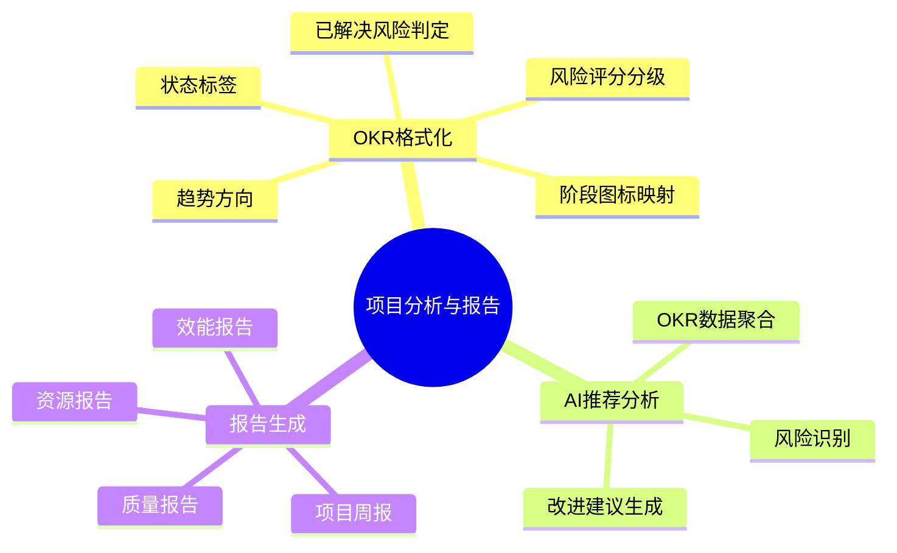

# 项目分析与报告

> 需求编号：YV-09-M13 · 优先级：中 · 总人天：1.5d

> **文档职责**：本文档定义**要做什么、为什么做、做到什么程度算完成**（WHAT / WHY），不含实现方案与测试用例。
> 实现方案见[开发方案](../../devs/2026-09/05-prd-task-项目分析与报告.md)，验证方案见[测试方案](../../tests/2026-09/05-prd-test-项目分析与报告.md)。

---

## 目录

- [一、背景与问题陈述](#sec-1)
- [二、目标与非目标](#sec-2)
- [三、设计原则](#sec-3)
- [四、需求范围](#sec-4)
- [五、功能需求](#sec-5)
- [六、非功能需求](#sec-6)
- [七、验收与成功指标](#sec-7)
- [八、变更记录](#sec-8)

---

## 一、背景与问题陈述

### 1.1 问题清单

YiVad 管理多个项目，管理层和 PM 需要从 OKR 数据、项目指标中获取决策洞察。当前存在以下问题：

| # | 问题 | 严重度 | 用户影响 |
|---|------|--------|----------|
| 1 | **OKR 展示不统一** — 各页面独立展示 OKR 阶段/风险/趋势，格式不一致 | 高 | 跨页面浏览时信息解读混乱 |
| 2 | **风险识别靠人工** — 依赖 PM 手动检查 OKR 进度和风险标识 | 高 | 风险发现滞后，响应延迟 |
| 3 | **无自动化报告** — 周报/质量报告需手动整理数据截图拼贴 | 中 | 汇报效率低，数据一致性差 |
| 4 | **趋势不可视** — OKR 进度方向（上升/下降/持平）无直观图标 | 中 | 需要在数据表格中逐行对比才能发现趋势 |

### 1.2 现状基线

| 维度 | 现状 |
|------|------|
| OKR 阶段展示 | 纯文本，无图标/颜色区分 |
| 风险评分 | 手动标记，无统一算法 |
| 报告生成 | 手动整理，无模板系统 |
| AI 辅助分析 | 无 |

---

## 二、目标与非目标

### 2.1 目标

1. **统一格式化**：OKR 阶段图标、风险评分颜色、状态标签、趋势方向 — 全项目一致展示
2. **AI 辅助分析**：自动识别 OKR 中的风险项和滞后项，输出可操作的改进建议
3. **模板化报告**：基于 4 套内置模板一键生成项目周报/质量报告/效能报告/资源报告

### 2.2 非目标

| 非目标 | 说明 |
|--------|------|
| BI 多维分析引擎 | 不做 OLAP/数据立方体，仅基于 OKR+项目基础指标 |
| 实时流式分析 | 报告基于快照数据，不做流式计算 |
| 可视化模板编辑器 | 仅提供 4 套内置模板，不做拖拽式报告设计器 |
| 预测性分析 | 不做 ML 预测模型，趋势方向仅基于简单对比 |

---

## 三、设计原则

1. **数据驱动** — 分析结果基于实际 OKR 和项目数据，非主观判断
2. **视觉一致性** — 风险评分 4 级颜色与 Element Plus Tag 对齐，趋势用 ↑↓→ 图标
3. **AI 增强不可替代** — AI 输出作为建议和参考，最终决策由人做出
4. **纯函数优先** — 格式化逻辑无状态、无副作用，可在任何组件复用

---

## 四、需求范围

本文档整合 3 个能力域，总计 1.5 人天（前端估算）。

| 能力域 | 子需求数 | 人天 | 优先级 |
|--------|---------|------|--------|
| FR-1 OKR 格式化 | 5 | 0.30 | P1 |
| FR-2 AI 推荐分析 | 3 | 0.60 | P2 |
| FR-3 报告生成 | 4 | 0.60 | P2 |

---

## 五、功能需求

> 每条需求给出**可判定的验收标准**。`FR-x.y` 编号供测试用例引用。

### 5.1 OKR 格式化展示（FR-1）

| 编号 | 需求 | 验收标准 |
|------|------|----------|
| FR-1.1 | 阶段图标映射 | 8 个流程阶段（需求评审→技术评审→代码审查→构建调试→测试报告→部署→上线记录→复盘总结）各有唯一图标；未知阶段回退为 `·` |
| FR-1.2 | 风险评分分级 | 4 级颜色：≥60→danger(红)、≥35→warning(黄)、≥15→primary(蓝)、<15→info(灰)，与 Element Plus Tag type 对齐 |
| FR-1.3 | 状态标签映射 | Done→success(绿)、At Risk→danger(红)、In Progress→warning(黄)、其他→info(灰) |
| FR-1.4 | 趋势方向图标 | up→↑、down→↓、其他→→ |
| FR-1.5 | 已解决风险判定 | 同时满足 listType==="risk"、kind==="action"、status==="Done" 时返回 true |

### 5.2 AI 推荐分析（FR-2）

| 编号 | 需求 | 验收标准 |
|------|------|----------|
| FR-2.1 | OKR 数据聚合 | 收集项目下所有 OKR 条目，构建分析上下文（进度/状态/负责人/时间线） |
| FR-2.2 | AI 风险识别 | 分析输出至少包含：滞后项列表（完成度<预期）、风险项列表（状态=At Risk）、整体完成率 |
| FR-2.3 | 改进建议生成 | 每个风险项至少包含 1 条可操作的改进建议，建议内容与具体 OKR 上下文相关 |

### 5.3 报告生成（FR-3）

| 编号 | 需求 | 验收标准 |
|------|------|----------|
| FR-3.1 | 项目周报 | 包含：进度摘要（完成率+里程碑状态）、KPI 指标卡片、趋势图表、风险列表（按严重度排序） |
| FR-3.2 | 质量报告 | 包含：Bug 趋势（近30天新增/关闭）、代码覆盖率、性能指标（LCP/FCP/CLS） |
| FR-3.3 | 团队效能报告 | 包含：工作量分布（按成员/模块）、任务完成率、速率趋势（story points/迭代） |
| FR-3.4 | 资源利用率报告 | 包含：CPU/内存/磁盘/网络使用趋势、成本归因（按项目/服务） |

---

## 六、非功能需求

### 6.1 性能指标（NFR-1）

| 场景 | 目标 |
|------|------|
| OKR 格式化函数调用 | < 1ms（纯函数，O(1)） |
| AI 分析请求 | < 10s（含 LLM 推理时间） |
| 报告生成 | < 5s（含图表渲染） |

### 6.2 可用性（NFR-2）

| 目标 | 要求 |
|------|------|
| 函数纯净化 | 全部格式化函数为纯函数，无副作用，支持 tree-shaking |
| 错误处理 | AI 分析失败时展示友好降级提示，不阻塞页面其他功能 |
| 国际化 | 阶段标签支持 i18n，报告模板文案可国际化 |

---

## 七、验收与成功指标

### 7.1 验收入口

| 验收项 | 判定依据 |
|--------|----------|
| 功能完整性 | 本文档 §5 全部 FR 编号通过对应测试用例 |
| 格式化正确性 | 14 个 useOkrFormat 测试用例全部通过 |
| 视觉一致性 | 风险颜色与 Element Plus Tag 一致，趋势图标统一 |

### 7.2 成功指标

| 指标 | 基线 | 目标 |
|------|------|------|
| OKR 格式统一度 | 各页面独立实现 | 全部页面使用 useOkrFormat |
| 风险识别速度 | 人工检查（~5min/项目） | AI 自动（~10s/项目） |
| 周报制作耗时 | 手动整理（~30min） | 一键生成（~5s） |

---

## 八、变更记录

| 日期 | 变更 | 说明 |
|------|------|------|
| 2026-09-09 | 初稿 | 整合 3 个能力域需求 |
| 2026-09-15 | 优化 | 补充 FR 编号、NFR、成功指标、变更记录 |

---

> **文档边界**：本文档定义 WHAT/WHY。实现细节见[开发方案](../../devs/2026-09/05-prd-task-项目分析与报告.md)，测试用例见[测试方案](../../tests/2026-09/05-prd-test-项目分析与报告.md)。
