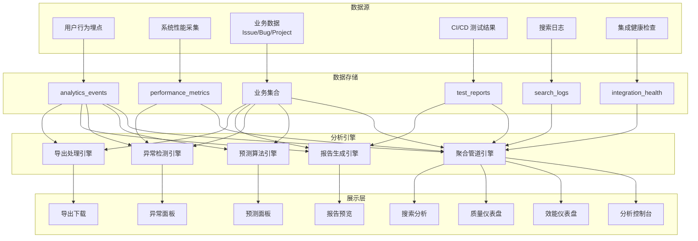

# YiVad 项目分析与报告 — 全面需求总览

> 需求编号：YV-09-M12 · 总人天：~8.0d · 涉及模块：数据分析控制台、效能分析、报告系统、导出中心
> 合并自 20 个独立需求文件，覆盖数据分析和报告全场景

---

## 0. 文档概述

本文档合并了 YiVad 九月迭代中所有数据分析与报告相关需求，按功能域分为以下六大板块：

| 板块 | 涵盖需求 | 文件数 | 核心能力 |
|------|---------|--------|---------|
| 一、分析控制台 | 数据分析控制台、性能分析面板、数据质量监控 | 3 | 集中式分析入口 |
| 二、效能与质量分析 | 项目效能、质量趋势、团队绩效、自动化测试报告 | 4 | 研发效能度量 |
| 三、用户与协作分析 | 用户行为分析、团队协作分析 | 2 | 用户与团队洞察 |
| 四、预测与异常检测 | 预测性分析、异常检测面板 | 2 | 前瞻性分析 |
| 五、报告与导出 | 自定义报告构建器、数据导出系统 | 2 | 报告生成与数据导出 |
| 六、搜索与自定义分析 | 搜索分析面板、自定义分析查询 | 2 | 搜索优化与灵活查询 |
| 七、辅助分析工具 | 集成健康监控、系统健康检查、功能使用统计、用户满意度 | 5 | 系统与用户健康度 |

---

## 一、分析控制台

### 1.1 数据分析控制台 (YV-09-206)

**目标**：集中式数据分析入口，提供 KPI 指标卡片、趋势展示和仪表盘自定义。

**核心功能**：
- **KPI 指标卡片**：项目总数、活跃项目、Issue 总量、完成率、Bug 率、团队速率等关键指标
- **趋势概览**：选中指标的历史趋势迷你图
- **日期范围选择**：今日/本周/本月/本季度/自定义范围
- **仪表盘布局**：拖拽调整卡片位置和大小
- **导出报告**：导出当前仪表盘为 PDF/PNG
- **仪表盘分享**：生成只读分享链接

**前端组件**：
- `AnalyticsConsole.vue`：分析控制台主页面
- `KpiCard.vue`：KPI 指标卡片（数值 + 趋势箭头 + 迷你图）
- `DateRangePicker.vue`：日期范围选择器
- `DashboardGrid.vue`：可拖拽的卡片网格布局

**依赖**：YV-09-18（项目健康大盘）、YV-09-47（数据可视化图表库标准化）、YV-09-32（仪表盘自定义）

### 1.2 性能分析面板 (YV-09-73)

**目标**：前端性能监控面板，提供页面加载时间线、API 瀑布图和渲染性能剖析。

**核心功能**：
- **页面加载时间线**：DNS/TCP/TTFB/DOM/Load 各阶段耗时瀑布图
- **API 瀑布图**：所有 API 请求的时序瀑布图（请求时间 + 响应时间）
- **渲染性能**：FCP/LCP/FID/CLS 等 Web Vitals 指标
- **资源加载**：JS/CSS/图片/字体等资源的加载耗时
- **内存监控**：JS 堆内存使用趋势
- **错误追踪**：JS 错误和资源加载错误的统计
- **按页面/路由**：不同页面的性能对比

**前端组件**：
- `PerformanceDashboard.vue`：性能分析主页面
- `PageLoadTimeline.vue`：页面加载时间线图
- `ApiWaterfall.vue`：API 瀑布图
- `WebVitalsGauge.vue`：Web Vitals 指标仪表盘
- `ResourceLoadChart.vue`：资源加载统计图
- `MemoryTrendChart.vue`：内存使用趋势图

**数据采集**：使用 Performance API（`performance.timing`、`performance.getEntriesByType('resource')`、`PerformanceObserver`）

**依赖**：YV-09-24（性能监控与优化）

### 1.3 数据质量监控 (YV-09-105)

**目标**：数据质量监控仪表盘，自动检测数据完整性和一致性问题。

**核心功能**：
- **完整性检查**：必填字段缺失率、空值统计（按集合）
- **一致性验证**：跨集合引用完整性（如 Issue 引用的 project_key 是否存在）
- **重复检测**：相似文档去重（基于标题/内容的相似度）
- **数据新鲜度**：最后更新时间、数据增长趋势
- **质量评分**：综合各维度计算数据质量分数
- **质量趋势图**：各维度质量分数的时间趋势
- **质量告警**：质量分数低于阈值时告警

**检查维度**：

| 维度 | 检查项 | 指标 |
|------|--------|------|
| 完整性 | 必填字段缺失 | 缺失率 % |
| 一致性 | 外键引用有效 | 孤立引用数 |
| 唯一性 | 重复文档 | 重复率 % |
| 新鲜度 | 数据更新时间 | 最后 N 天无更新的比例 |
| 准确性 | 字段格式校验 | 格式错误率 % |

**前端组件**：
- `DataQualityDashboard.vue`：数据质量仪表盘
- `QualityScoreGauge.vue`：质量分数仪表盘
- `CompletenessHeatmap.vue`：完整性热力图（集合 x 字段）
- `ConsistencyChecker.vue`：一致性检查结果
- `DuplicateDetector.vue`：重复数据列表
- `FreshnessChart.vue`：数据新鲜度趋势

**后端服务**：`services/data_quality/quality_checker.py`（完整性/一致性/重复检测）、`services/data_quality/freshness_monitor.py`（新鲜度监控）

---

## 二、效能与质量分析

### 2.1 项目效能分析 (YV-09-208)

**目标**：研发效能度量，提供周期时间、前置时间、吞吐量和累积流图。

**核心指标**：
- **周期时间 (Cycle Time)**：从"开始处理"到"完成"的平均时间
- **前置时间 (Lead Time)**：从"创建"到"完成"的平均时间
- **吞吐量 (Throughput)**：每周/每月完成的 Issue 数量
- **在制品 (WIP)**：当前各状态的 Issue 数量
- **累积流图 (CFD)**：各状态 Issue 数量随时间变化的面积图
- **瓶颈分析**：各状态的平均停留时间，识别瓶颈环节
- **效能趋势**：以上指标的周/月趋势

**累积流图**：X 轴 = 时间，Y 轴 = Issue 数量，面积 = 各状态（Backlog/ToDo/InProgress/Review/Done）

**前端组件**：
- `EfficiencyDashboard.vue`：效能分析主页面
- `CycleTimeChart.vue`：周期时间趋势图（含 P50/P80/P95 分位线）
- `LeadTimeChart.vue`：前置时间趋势图
- `ThroughputChart.vue`：吞吐量柱状图
- `CumulativeFlowDiagram.vue`：累积流图
- `WipChart.vue`：在制品数量趋势
- `BottleneckAnalysis.vue`：瓶颈分析面板

**依赖**：YV-09-206（数据分析控制台）、YV-09-47（图表库）、YV-09-53（甘特图与时间线）

### 2.2 质量趋势分析 (YV-09-210)

**目标**：软件质量趋势监控，覆盖 Bug 率、返工率、测试覆盖率和代码质量。

**核心指标**：
- **Bug 率**：每千行代码的 Bug 数 / 每 Issue 的 Bug 数
- **Bug 发现-修复时间**：从 Bug 创建到关闭的平均时间
- **返工率**：被重新打开的 Issue 比例
- **测试覆盖率趋势**：代码覆盖率随时间的变化
- **代码质量趋势**：代码异味数、技术债务的时间变化
- **缺陷密度**：每个模块/文件的缺陷数
- **质量评分**：综合以上指标的质量评分（0-100）

**前端组件**：
- `QualityTrendDashboard.vue`：质量趋势仪表盘
- `BugRateChart.vue`：Bug 率趋势图
- `ReworkRateChart.vue`：返工率趋势图
- `CoverageTrendChart.vue`：测试覆盖率趋势图
- `DefectDensityHeatmap.vue`：缺陷密度热力图（模块 x 严重度）
- `QualityScoreTrend.vue`：质量评分趋势

**依赖**：YV-09-206（数据分析控制台）、YV-09-47（图表库）、YV-09-64（SLA 追踪与违约告警）

### 2.3 团队绩效分析 (YV-09-112)

**目标**：团队绩效数据可视化，提供速率趋势、吞吐量、周期时间和质量指标。

**核心指标**：
- **团队速率**：每个 Sprint 完成的故事点数
- **吞吐量**：每人/每周完成的 Issue 数
- **周期时间分布**：不同 Issue 类型的周期时间对比
- **质量指标**：个人 Bug 率、返工率、代码审查通过率
- **个人贡献洞察**：个人在代码/文档/审查方面的贡献分布
- **绩效趋势对比**：个人与团队均值的对比
- **团队健康指标**：加班频率、请假频率、工作强度

**设计原则**：聚焦团队级别数据，个人数据仅用于趋势分析，不用于排名和考核。

**前端组件**：
- `TeamPerformanceDashboard.vue`：团队绩效仪表盘
- `VelocityChart.vue`：速率趋势图
- `ThroughputPerPerson.vue`：个人吞吐量对比
- `CycleTimeDistribution.vue`：周期时间分布箱线图
- `QualityMetricsRadar.vue`：质量指标雷达图
- `ContributionBreakdown.vue`：贡献分布堆叠图

**依赖**：YV-09-18（项目健康大盘）、YV-09-47（图表库）

### 2.4 自动化测试报告 (YV-09-80)

**目标**：测试报告仪表盘，支持 CI 结果摄入、趋势分析和 Flaky 检测。

**核心功能**：
- **测试报告仪表盘**：通过率、失败数、跳过数、覆盖率概览
- **CI 结果摄入**：从 CI/CD 系统（Jenkins/GitHub Actions）自动摄入测试结果
- **趋势分析**：通过率/覆盖率/执行时间的趋势
- **失败分类**：失败测试按错误类型分类（断言失败/超时/环境问题）
- **Flaky 检测**：识别不稳定的测试（时而通过时而失败）
- **AI 建议**：AI 分析失败原因并建议修复方向
- **测试覆盖热力图**：代码覆盖率热力图（文件/模块级别）

**前端组件**：
- `TestReportDashboard.vue`：测试报告仪表盘
- `PassRateTrend.vue`：通过率趋势图
- `TestExecutionTimeline.vue`：测试执行时间线
- `FlakyTestDetector.vue`：Flaky 测试检测面板
- `CoverageHeatmap.vue`：覆盖率热力图
- `FailureClassification.vue`：失败分类饼图

**后端服务**：`services/testing/test_report_service.py`（测试报告 CRUD）、`services/testing/flaky_detector.py`（Flaky 检测算法）

---

## 三、用户与协作分析

### 3.1 用户行为分析 (YV-09-207)

**目标**：用户行为数据可视化，提供页面浏览量、功能使用率、会话时长和漏斗分析。

**核心指标**：
- **页面浏览量 (PV)**：各页面的访问量排名和趋势
- **独立访客 (UV)**：日活跃用户数趋势
- **功能使用率**：各功能模块的使用频率（如数据导出使用率、搜索使用率）
- **会话时长**：平均会话时长和分布
- **用户流程分析**：页面跳转路径分析（桑基图）
- **漏斗可视化**：关键流程的转化漏斗（如创建 Issue → 分配 → 完成）
- **留存队列**：新用户的 1/7/14/30 日留存率
- **用户分群**：按活跃度（高频/中频/低频）分群分析

**数据采集**：YiVad 前端埋点 SDK，记录页面浏览、功能操作、搜索等行为事件，发送到 YiAi 后端存储。

**前端组件**：
- `UserBehaviorDashboard.vue`：用户行为分析仪表盘
- `PageViewChart.vue`：页面浏览量排名
- `ActiveUserTrend.vue`：日活用户趋势
- `FeatureUsageChart.vue`：功能使用率图
- `UserFlowSankey.vue`：用户流程桑基图
- `FunnelChart.vue`：漏斗分析图
- `RetentionCohort.vue`：留存队列热力图

**依赖**：YV-09-206（数据分析控制台）、YV-09-47（图表库）、YV-09-50（活动日志与审计追踪）

### 3.2 团队协作分析 (YV-09-209)

**目标**：团队协作模式分析，提供沟通网络图、跨团队依赖和会议负载指标。

**核心指标**：
- **协作网络图**：基于 Issue 评论/文档协作的交互网络图（节点=成员，边=协作次数）
- **跨团队依赖**：不同项目/团队之间的 Issue 依赖关系
- **沟通模式**：Issue 评论、代码审查评论的数量和分布
- **会议负载**：日历中会议时间的占比
- **同步/异步比**：同步沟通（会议/即时消息）vs 异步沟通（Issue/文档）的时间比
- **协作效率**：Issue 从创建到首次响应的平均时间
- **瓶颈人员识别**：被过多 Issue 阻塞的关键人员

**前端组件**：
- `CollaborationDashboard.vue`：协作分析仪表盘
- `CollaborationNetwork.vue`：协作网络图（力导向图）
- `CrossTeamDependency.vue`：跨团队依赖图
- `CommunicationPatternChart.vue`：沟通模式分布图
- `MeetingLoadChart.vue`：会议负载趋势
- `SyncAsyncRatio.vue`：同步异步比环图
- `BottleneckPersonDetector.vue`：瓶颈人员识别面板

**依赖**：YV-09-206（数据分析控制台）、YV-09-47（图表库）、YV-09-76（依赖关系图）

---

## 四、预测与异常检测

### 4.1 预测性分析 (YV-09-211)

**目标**：基于历史数据的预测分析，提供完成日期、速度、风险和资源需求的预测。

**预测类型**：

| 预测项 | 方法 | 输入 | 输出 |
|--------|------|------|------|
| 完成日期预测 | 蒙特卡洛模拟 / 线性回归 | 历史速率 + 剩余工作量 | 预计完成日期 + 置信区间 (P50/P80/P95) |
| 速度预测 | 移动平均 / 指数平滑 | 历史 Sprint 速率 | 下个 Sprint 预计完成的故事点 |
| 风险预测 | 逻辑回归 / 规则引擎 | 历史风险因子 | 延期概率 (0-100%) |
| 资源需求预测 | 线性规划 | 剩余工作量 + 团队容量 | 所需人数和工期 |

**置信区间**：所有预测提供 P50/P80/P95 三个置信度的结果。

**前端组件**：
- `ForecastDashboard.vue`：预测分析仪表盘
- `CompletionDateForecast.vue`：完成日期预测图（含置信区间阴影）
- `VelocityForecast.vue`：速度预测趋势图
- `RiskProbabilityChart.vue`：延期概率仪表盘
- `ResourceForecast.vue`：资源需求预测图
- `ForecastAccuracyTracker.vue`：预测准确度追踪（预测 vs 实际对比）

**后端服务**：`services/analytics/forecast_service.py`（预测算法）、`services/analytics/monte_carlo.py`（蒙特卡洛模拟）

**依赖**：YV-09-206（数据分析控制台）、YV-09-208（项目效能分析）、YV-09-47（图表库）

### 4.2 异常检测面板 (YV-09-212)

**目标**：统计异常检测，自动识别指标中的异常波动并提供下钻调查能力。

**检测方法**：
- **Z-Score 方法**：当前值偏离历史均值超过 N 个标准差
- **IQR 方法**：当前值超出四分位距 (Q1 - 1.5*IQR, Q3 + 1.5*IQR)
- **趋势断裂检测**：时间序列的突变点检测
- **同比/环比异常**：与历史同期对比的异常变化

**监控指标**：
- Issue 创建率突增/突降
- Bug 发现率突增
- 完成率突降
- API 错误率突增
- 页面加载时间突增
- 用户活跃度突降

**异常处理流程**：
1. 自动检测 → 2. 生成异常事件 → 3. 通知干系人 → 4. 下钻调查 → 5. 标记（已处理/误报/已知问题）

**前端组件**：
- `AnomalyDashboard.vue`：异常检测仪表盘
- `AnomalyTimeline.vue`：异常事件时间线
- `AnomalyDetailPanel.vue`：异常详情面板（下钻分析）
- `AnomalyAlertConfig.vue`：告警配置
- `AnomalyInvestigationWizard.vue`：异常调查向导

**后端服务**：`services/analytics/anomaly_detector.py`（异常检测算法）、`services/analytics/trend_breaker.py`（趋势断裂检测）

**依赖**：YV-09-206（数据分析控制台）、YV-09-47（图表库）、YV-09-64（SLA 追踪与违约告警）

---

## 五、报告与导出

### 5.1 自定义报告构建器 (YV-09-56)

**目标**：拖拽式报告构建器，支持自定义报告布局、图表组合和定时生成。

**核心功能**：
- **报告模板**：预设报告模板（项目周报/月报/Sprint 回顾/质量报告/风险报告）
- **拖拽构建**：从组件面板拖拽图表、表格、文本块到报告画布
- **图表组件**：饼图/柱状图/折线图/雷达图/仪表盘/表格/KPI 卡片
- **文本组件**：标题/Markdown 文本/日期
- **数据绑定**：每个图表绑定到具体的数据源（项目/集合/日期范围）
- **布局调整**：拖拽调整组件位置和大小
- **定时生成**：配置报告自动生成时间（每日/每周/每月）和分发方式（邮件/企微）
- **多格式导出**：PDF/HTML/Markdown/PNG

**前端组件**：
- `ReportBuilder.vue`：报告构建器主页面
- `ComponentPalette.vue`：组件面板（可拖入的图表/表格/文本）
- `ReportCanvas.vue`：报告画布（自由布局）
- `ChartConfigurator.vue`：图表配置面板
- `ReportPreview.vue`：报告预览
- `ScheduleConfigurator.vue`：定时生成配置
- `ReportTemplateLibrary.vue`：报告模板库

**数据绑定示例**：
- 项目周报模板：Issue 完成率饼图 + Bug 趋势折线图 + 团队速率柱状图 + 风险摘要表
- Sprint 回顾模板：Burndown 图 + 完成 vs 承诺对比 + 障碍列表 + 下个 Sprint 计划

### 5.2 数据导出系统 (YV-09-30)

**目标**：通用数据导出系统，支持大数据量分批导出、定时导出和多种格式。

**核心功能**：
- **多格式导出**：CSV/Excel/JSON/PDF
- **大数据量处理**：超过 10000 条自动分批导出，生成多个文件或合并
- **导出模板**：预设导出模板（自定义字段选择、排序、筛选条件）
- **定时导出**：配置定时导出任务（每日/每周/每月）
- **导出历史**：导出任务列表（状态/文件大小/下载链接）
- **异步导出**：大数据量导出使用后台队列，完成后通知下载
- **导出权限**：控制谁可以导出什么数据
- **数据脱敏**：敏感字段脱敏选项

**导出流程**：
1. 选择数据源（集合 + 筛选条件）
2. 选择导出字段 + 排序 + 格式
3. 预览（前 20 条）
4. 执行导出（小数据量即时下载，大数据量异步处理）
5. 下载 / 通过通知发送下载链接

**前端组件**：
- `ExportWizard.vue`：导出向导（步骤式）
- `ExportTemplateManager.vue`：导出模板管理
- `ExportHistory.vue`：导出历史列表
- `ExportScheduleConfig.vue`：定时导出配置

**后端服务**：`services/export/export_service.py`（导出核心逻辑）、`services/export/export_queue.py`（异步队列）

---

## 六、搜索与自定义分析

### 6.1 搜索分析面板 (YV-09-118)

**目标**：搜索使用数据分析，提供热门查询、零结果查询、点击率和搜索优化建议。

**核心指标**：
- **热门查询 Top N**：最常搜索的关键词
- **零结果查询**：返回 0 结果的搜索关键词（发现内容缺口）
- **点击率 (CTR)**：搜索结果点击率
- **搜索转化率**：搜索后完成目标动作（如创建 Issue）的比例
- **搜索优化建议**：基于零结果和低 CTR 的改进建议
- **搜索趋势**：搜索量随时间的变化
- **搜索来源**：从哪个页面发起搜索
- **平均搜索结果数**：每次搜索返回的平均结果数

**前端组件**：
- `SearchAnalyticsDashboard.vue`：搜索分析仪表盘
- `TopQueriesChart.vue`：热门查询排行
- `ZeroResultQueries.vue`：零结果查询列表
- `ClickThroughRate.vue`：点击率趋势图
- `SearchFunnelChart.vue`：搜索漏斗（搜索 → 查看结果 → 点击 → 转化）
- `SearchOptimizationTips.vue`：搜索优化建议面板

**后端服务**：`services/analytics/search_analytics.py`（搜索日志分析）

**依赖**：YV-09-36（全局搜索增强）、YV-09-87（智能搜索过滤器）

### 6.2 自定义分析查询 (YV-09-213)

**目标**：拖拽式指标与维度构建器，支持自定义查询、可视化和查询保存共享。

**核心功能**：
- **拖拽构建器**：从字段列表拖拽维度和指标到查询面板
- **维度选择**：按项目/用户/时间/状态/类型等维度分组
- **指标选择**：计数/求和/平均/最大/最小/去重计数
- **筛选条件**：多层 AND/OR 条件构建
- **可视化类型选择**：自动推荐合适的图表类型
- **查询保存**：保存查询定义（含维度和筛选条件）
- **查询共享**：分享查询链接给团队成员
- **SQL 模式**：高级用户切换到 SQL 模式直接编写查询
- **结果导出**：查询结果导出为 CSV/Excel

**使用场景示例**：
- "按项目统计本月 Blocked 状态的 Issue 数量"
- "按负责人统计上周完成的 Issue 数，按优先级分组"
- "按月统计过去半年的 Bug 发现数 vs 修复数"

**前端组件**：
- `QueryBuilder.vue`：查询构建器主界面
- `DimensionSelector.vue`：维度选择器（拖拽区）
- `MetricSelector.vue`：指标选择器
- `FilterBuilder.vue`：筛选条件构建器
- `VisualizationPicker.vue`：可视化类型选择器
- `QueryResultTable.vue`：查询结果表格
- `QueryResultChart.vue`：查询结果图表
- `SavedQueries.vue`：已保存查询列表
- `SqlEditor.vue`：SQL 编辑器模式

**后端服务**：`services/analytics/query_engine.py`（查询引擎，接收维度+指标+筛选 → 生成 MongoDB 聚合管道）

**依赖**：YV-09-206（数据分析控制台）、YV-09-47（图表库）、YV-09-56（自定义报告构建器）

---

## 七、辅助分析工具

### 7.1 集成健康监控 (YV-09-113-集成)

**目标**：集成健康仪表盘，监控第三方集成的状态、延迟和错误率。

**核心功能**：
- **集成状态总览**：所有集成的在线/降级/离线状态
- **按集成指标**：每个集成的状态、在线时间、平均延迟
- **错误率追踪**：5xx/4xx/超时 的错误率趋势
- **集成依赖图**：集成间的依赖关系拓扑图
- **健康事件历史**：集成故障/恢复事件的时间线
- **集成测试工具**：手动测试集成连接

**监控的集成类型**：Ollama（LLM）、MongoDB（数据库）、企业微信（通知）、邮件服务、外部 API、Webhook 端点

**前端组件**：
- `IntegrationHealthDashboard.vue`：集成健康仪表盘
- `IntegrationStatusGrid.vue`：集成状态卡片网格
- `IntegrationLatencyChart.vue`：集成延迟趋势图
- `IntegrationErrorRate.vue`：集成错误率图
- `IntegrationDependencyGraph.vue`：集成依赖图
- `HealthEventTimeline.vue`：健康事件时间线
- `IntegrationTestTool.vue`：集成测试工具

**后端服务**：`services/monitoring/integration_health.py`（健康检查任务）

### 7.2 系统健康检查面板 (YV-09-214)

**目标**：系统级健康检查仪表盘，监控 CPU/内存/磁盘/网络等基础设施指标。

**核心功能**：
- **系统资源**：CPU/内存/磁盘/网络使用率
- **服务状态**：YiAi/YiVad/MongoDB/Ollama 的运行状态
- **响应时间**：API 平均响应时间和 P95/P99
- **错误率**：API 4xx/5xx 错误率
- **数据库指标**：连接数、查询耗时、慢查询
- **健康事件**：系统故障/恢复的历史记录

**前端组件**：
- `SystemHealthDashboard.vue`：系统健康仪表盘
- `ResourceUsageGauge.vue`：资源使用率仪表盘
- `ServiceStatusIndicator.vue`：服务状态指示灯
- `ApiResponseTimeChart.vue`：API 响应时间趋势
- `DatabaseMetricsChart.vue`：数据库指标面板

### 7.3 功能使用统计 (YV-09-215)

**目标**：各功能模块的使用统计，帮助产品决策和功能优化。

**核心功能**：
- **功能使用率排名**：各功能模块的使用频率排名
- **功能采用率**：新功能发布后的用户采用率趋势
- **功能留存率**：首次使用某功能后继续使用的用户比例
- **功能耗时分布**：用户在各功能模块的平均耗时
- **未使用功能**：从未被使用的功能列表
- **功能使用热图**：按时间（周/日）显示各功能的使用热度

### 7.4 系统性能监控 (YV-09-216)

**目标**：系统级性能监控，涵盖 API 性能、数据库性能和缓存命中率。

**核心功能**：
- **API 性能**：吞吐量 (RPS)、响应时间分布、慢接口 Top 10
- **数据库性能**：查询耗时、慢查询、索引命中率
- **缓存性能**：缓存命中率、缓存大小
- **并发监控**：活跃连接数、请求队列长度
- **资源趋势**：系统资源的 7/30 天趋势
- **性能基准对比**：当前性能与历史基准的对比

### 7.5 用户满意度调查 (YV-09-217)

**目标**：内置用户满意度调查工具，收集 NPS 和功能满意度评分。

**核心功能**：
- **NPS 调查**：0-10 分推荐意愿评分
- **功能满意度**：各功能模块的满意度评分
- **调查模板**：预设调查问题模板
- **触发规则**：基于用户行为触发调查（如使用 30 天后、新功能使用后）
- **结果分析**：NPS 趋势、功能满意度排名、用户建议分类
- **反馈闭环**：用户反馈 → 分类 → 创建 Issue → 通知用户处理结果

---

## 八、数据流向



---

## 九、后端 API 契约

所有分析功能通过 RPC 信封调用 YiAi 后端的以下服务方法：

| 模块 | 方法 | 参数 | 返回 | 说明 |
|------|------|------|------|------|
| `services.analytics.query_engine` | `run_aggregation` | `{cname, dimensions, metrics, filters, dateRange, sort}` | `{columns, rows, total}` | 通用聚合查询引擎 |
| `services.analytics.query_engine` | `get_available_fields` | `{cname}` | `{dimensions, metrics}` | 获取可用维度和指标 |
| `services.analytics.aggregator` | `get_efficiency_metrics` | `{project_key, dateRange}` | `{cycleTime, leadTime, throughput, wip, cfd}` | 效能指标预聚合 |
| `services.analytics.aggregator` | `get_quality_metrics` | `{project_key, dateRange}` | `{bugRate, reworkRate, defectDensity, score}` | 质量指标预聚合 |
| `services.analytics.anomaly_detector` | `detect_anomalies` | `{metric, method, threshold}` | `{anomalies, severity}` | 异常检测 |
| `services.analytics.forecast_service` | `forecast_completion` | `{remaining_work, historical_throughput}` | `{p50_date, p80_date, p95_date}` | 蒙特卡洛完成预测 |
| `services.analytics.search_analytics` | `get_search_stats` | `{dateRange}` | `{topQueries, zeroResults, ctr, funnel}` | 搜索分析 |
| `services.export.export_service` | `create_export_task` | `{cname, filter, fields, format}` | `{task_id}` | 创建导出任务 |
| `services.export.export_service` | `get_export_status` | `{task_id}` | `{status, progress, file_url}` | 查询导出进度 |
| `services.report.report_service` | `save_report` | `{name, layout, components, schedule}` | `{report_id}` | 保存报告定义 |
| `services.report.report_service` | `generate_report` | `{report_id, dateRange}` | `{content, format}` | 生成报告 |
| `services.report.report_service` | `list_reports` | `{filter}` | `{reports}` | 列出报告 |
| `services.monitoring.integration_health` | `check_all` | `{}` | `{integrations}` | 检查所有集成健康 |
| `services.monitoring.system_health` | `get_system_metrics` | `{}` | `{cpu, memory, disk, network}` | 系统资源指标 |
| `services.data_quality.quality_checker` | `run_checks` | `{cname}` | `{completeness, consistency, duplicates, score}` | 数据质量检查 |
| `services.testing.test_report_service` | `ingest_results` | `{project_key, results}` | `{report_id}` | 摄入 CI 测试结果 |
| `services.survey.survey_service` | `submit_response` | `{type, responses, user}` | `{survey_id}` | 提交调查回复 |

### 聚合查询引擎参数详细

```typescript
// run_aggregation 请求
interface AggregationRequest {
  cname: string;                    // 集合名称
  dimensions: string[];             // 分组维度，如 ['project_key', 'month']
  metrics: MetricDef[];             // 聚合指标
  filters?: FilterCondition[];      // 筛选条件
  dateRange?: { start: string; end: string };  // 日期范围
  sort?: { field: string; order: 'asc' | 'desc' };
  limit?: number;
}

interface MetricDef {
  field: string;                    // 聚合字段
  agg: 'count' | 'sum' | 'avg' | 'max' | 'min' | 'distinct_count';
  alias?: string;                   // 输出别名
}

interface FilterCondition {
  field: string;
  op: 'eq' | 'ne' | 'gt' | 'gte' | 'lt' | 'lte' | 'in' | 'nin' | 'regex';
  value: any;
}
```

---

## 十、新增数据集合（详细 Schema）

---

## 十一、总人天估算（修订版）

> 原始估计过于乐观（0.3d/仪表盘不含数据接入和子组件联调），已按实际组件量和后端依赖修正。

| 需求编号 | 需求名称 | 前端人天 | 后端人天 | 说明 |
|---------|---------|---------|---------|------|
| YV-09-206 | 数据分析控制台 | 1.0 | 0.5 | KPI 卡片 + 拖拽布局 + 日期范围 |
| YV-09-73 | 性能分析面板 | 1.0 | 0.5 | Performance API 采集 + Web Vitals |
| YV-09-105 | 数据质量监控 | 1.0 | 1.0 | 5 个检查维度 + 质量评分算法 |
| YV-09-208 | 项目效能分析 | 1.0 | 0.5 | 累积流图 + 分位线 + 瓶颈识别 |
| YV-09-210 | 质量趋势分析 | 1.0 | 0.5 | Bug 率/返工率/缺陷密度 |
| YV-09-112 | 团队绩效分析 | 1.0 | 0.5 | 速率/吞吐量/雷达图 |
| YV-09-80 | 自动化测试报告 | 1.0 | 1.0 | CI 摄入 + Flaky 检测算法 |
| YV-09-207 | 用户行为分析 | 1.0 | 0.5 | 埋点 SDK + 漏斗/桑基图 |
| YV-09-209 | 团队协作分析 | 1.0 | 0.5 | 网络图 + 力导向布局 |
| YV-09-211 | 预测性分析 | 0.5 | 1.5 | 蒙特卡洛 + 线性回归（后端重）|
| YV-09-212 | 异常检测面板 | 0.5 | 1.0 | Z-Score/IQR 算法（后端重）|
| YV-09-56 | 自定义报告构建器 | 2.0 | 1.0 | 拖拽画布 + 模板库 + 定时调度 |
| YV-09-30 | 数据导出系统 | 1.5 | 1.0 | 异步队列 + 多格式 + 分批导出 |
| YV-09-118 | 搜索分析面板 | 0.5 | 0.5 | 搜索日志分析 |
| YV-09-213 | 自定义分析查询 | 1.0 | 1.0 | 拖拽构建器 + SQL 模式 |
| YV-09-113 | 集成健康监控 | 0.5 | 0.5 | 健康检查端点 |
| YV-09-214 | 系统健康检查面板 | 0.5 | 0.5 | psutil 采集 |
| YV-09-215 | 功能使用统计 | 0.5 | 0.5 | 埋点聚合 |
| YV-09-216 | 系统性能监控 | 0.5 | 0.5 | API 性能 + 缓存监控 |
| YV-09-217 | 用户满意度调查 | 0.5 | 0.5 | NPS + 调查模板 |
| **合计** | | **17.0d** | **14.0d** | **~31d 全栈** |

> **实施策略**：按 Phase 1-6 分批交付。Phase 1（导出 + 报告构建器）先行，为所有分析功能提供输出基础。Phase 2（分析控制台 + 效能/质量仪表盘）提供核心分析入口。后续 Phase 迭代增量交付。

---

## 十二、实施优先级建议

| 阶段 | 需求 | 理由 |
|------|------|------|
| **Phase 1（核心基础）** | 数据导出系统、自定义报告构建器 | 是所有分析功能的输出基础 |
| **Phase 2（分析平台）** | 数据分析控制台、项目效能分析、质量趋势分析 | 构建集中分析入口和核心效能指标 |
| **Phase 3（深度分析）** | 团队绩效分析、用户行为分析、团队协作分析、搜索分析面板 | 多维度深度分析 |
| **Phase 4（预测与异常）** | 预测性分析、异常检测面板 | 需要积累足够历史数据后才能有效运行 |
| **Phase 5（高级工具）** | 自定义分析查询、性能分析面板、数据质量监控、自动化测试报告 | 高级用户和运维工具 |
| **Phase 6（系统健康）** | 集成健康监控、系统健康检查、功能使用统计、系统性能监控、用户满意度 | 运维和产品决策支持 |

---

## 十三、关键架构决策记录

### ADR-01：为什么分析数据使用独立的事件集合而非直接查询业务数据？

**背景**：效能分析需要历史趋势数据（如过去 6 个月的 Bug 率），但业务数据是动态变化的（Bug 被删除/状态变更）。

**决策**：使用独立的 `analytics_events` 集合存储不可变的事件记录，通过定时任务（apscheduler）从业务数据计算并写入分析集合。

**理由**：
- 业务数据变化不影响历史分析结果
- 预聚合数据提升查询速度（秒级 vs 分钟级）
- 支持数据质量监控和异常检测
- 分析集合可按时间分片（月度/季度）便于归档

**数据流**：业务集合 → apscheduler 定时任务（每 5 分钟/每小时/每天） → 聚合计算 → analytics_* 集合 → 前端查询

### ADR-02：为什么预测性分析使用蒙特卡洛模拟而非机器学习？

**背景**：完成日期预测有多种方法：蒙特卡洛模拟（基于历史吞吐量分布）、线性回归（基于趋势外推）、ML 模型（基于多特征预测）。

**决策**：MVP 阶段使用蒙特卡洛模拟 + 线性回归双模型，结果取加权平均。

**理由**：
- 蒙特卡洛模拟只需要历史吞吐量数据（YiVad 已采集），无需训练
- 可直接输出置信区间（P50/P80/P95），符合业务需求
- 线性回归作为补充，检测趋势变化
- ML 模型需要大量特征数据（团队规模、代码复杂度、依赖数量等），在系统初期不可用

**蒙特卡洛模拟原理**：
1. 收集过去 N 个 Sprint 的吞吐量分布
2. 随机抽样吞吐量，模拟剩余 Sprint 的产出
3. 重复 10,000 次模拟
4. 输出 P50/P80/P95 的完成日期

### ADR-03：为什么异常检测默认使用 Z-Score 而非 IQR？

**背景**：Z-Score（均值 + 标准差）和 IQR（四分位距）都是常见的异常检测方法。

**决策**：默认使用 Z-Score（阈值 3.0），用户可切换到 IQR 模式。

**理由**：
- Z-Score 对正态分布数据更敏感，大多数指标（Bug 率、完成率、响应时间）近似正态分布
- IQR 对偏态分布更鲁棒，适用于非正态指标（如 Issue 创建数可能有季节性波动）
- 提供两种方法让用户根据指标特性选择

**IQR 公式**：异常 = 值 < Q1 - 1.5*IQR 或 值 > Q3 + 1.5*IQR

### ADR-04：为什么搜索分析使用独立日志而非复用活动日志？

**背景**：搜索行为可以记录在 `analytics_events` 中，也可以存储在独立的 `search_logs` 中。

**决策**：使用独立的 `search_logs` 集合。

**理由**：
- 搜索日志包含搜索特有的字段（查询文本、结果数、点击位置、零结果标记）
- 搜索分析需要全文搜索和聚合（如统计零结果查询），独立集合可建专用索引
- 搜索日志过期更快（90 天后自动清理），独立集合便于管理

### ADR-05：为什么自定义分析查询不直接用 MongoDB 聚合管道暴露给前端？

**背景**：自定义分析查询可以通过两种方式实现：A) 前端构建 MongoDB 聚合管道直接查询；B) 后端查询引擎转换后执行。

**决策**：选择 B（后端查询引擎）。

**理由**：
- 安全性：前端直接暴露聚合管道存在注入风险和数据泄露风险
- 权限控制：后端可根据用户权限过滤可查询的集合和字段
- 性能优化：后端可缓存常用查询结果、限制查询耗时
- 可维护性：前端无需理解 MongoDB 聚合语法，使用业务语义（维度/指标/筛选）

---

## 十四、分析引擎架构详解

### 聚合管道引擎

```
前端请求: { dimensions: ['project', 'month'], metrics: ['count', 'avg_cycle_time'], filters: [...], dateRange: [...] }

→ QueryEngine.parse(request)
  → 生成 MongoDB 聚合管道:
      $match: { date: { $gte: start, $lte: end }, ...filters }
      $group: { _id: { project: '$project_key', month: { $month: '$created_at' } },
                count: { $sum: 1 },
                avg_cycle_time: { $avg: '$cycle_time' } }
      $sort: { '_id.month': 1 }
  → 执行聚合
  → QueryEngine.format(response)
    → 返回: { columns: ['project', 'month', 'count', 'avg_cycle_time'], rows: [...] }
```

### 预测引擎算法

```python
# YiAi: services/analytics/monte_carlo.py (伪代码)

import numpy as np
from typing import TypedDict

class ForecastResult(TypedDict):
    p50_date: str
    p80_date: str
    p95_date: str
    simulations: int

def monte_carlo_completion(
    throughput_history: list[int],    # 历史 Sprint 吞吐量
    remaining_work: int,              # 剩余故事点
    sprint_length_days: int = 14,     # Sprint 长度
    simulations: int = 10_000,
) -> ForecastResult:
    """蒙特卡洛模拟预测完成日期"""
    results = []
    for _ in range(simulations):
        remaining = remaining_work
        sprints = 0
        while remaining > 0:
            # 从历史吞吐量分布中随机抽样
            throughput = np.random.choice(throughput_history)
            remaining -= throughput
            sprints += 1
        results.append(sprints * sprint_length_days)

    results = np.array(results)
    today = datetime.now()
    return {
        "p50_date": (today + timedelta(days=int(np.percentile(results, 50)))).isoformat(),
        "p80_date": (today + timedelta(days=int(np.percentile(results, 80)))).isoformat(),
        "p95_date": (today + timedelta(days=int(np.percentile(results, 95)))).isoformat(),
        "simulations": simulations,
    }
```

### 异常检测引擎

```python
# YiAi: services/analytics/anomaly_detector.py (伪代码)

from typing import Literal

class AnomalyResult(TypedDict):
    is_anomaly: bool
    value: float
    mean: float
    std: float
    z_score: float
    severity: Literal['low', 'medium', 'high', 'critical']

def detect_z_score(
    current_value: float,
    historical_values: list[float],
    threshold: float = 3.0,
) -> AnomalyResult:
    """Z-Score 异常检测"""
    mean = np.mean(historical_values)
    std = np.std(historical_values)
    if std == 0:
        return {"is_anomaly": False, "value": current_value, "mean": mean, "std": 0, "z_score": 0, "severity": "low"}

    z_score = abs((current_value - mean) / std)
    is_anomaly = z_score > threshold

    severity = "low"
    if z_score > 5:
        severity = "critical"
    elif z_score > 4:
        severity = "high"
    elif z_score > 3:
        severity = "medium"

    return {"is_anomaly": is_anomaly, "value": current_value, "mean": mean, "std": std, "z_score": z_score, "severity": severity}

def detect_iqr(
    current_value: float,
    historical_values: list[float],
) -> AnomalyResult:
    """IQR 异常检测"""
    q1 = np.percentile(historical_values, 25)
    q3 = np.percentile(historical_values, 75)
    iqr = q3 - q1
    lower = q1 - 1.5 * iqr
    upper = q3 + 1.5 * iqr
    is_anomaly = current_value < lower or current_value > upper

    return {
        "is_anomaly": is_anomaly,
        "value": current_value,
        "mean": np.mean(historical_values),
        "std": np.std(historical_values),
        "z_score": 0,
        "severity": "high" if is_anomaly else "low",
    }
```

### 报告生成引擎

```
报告生成流程:
1. 用户选择报告模板或自定义布局
2. 报告引擎解析布局（components 数组）
3. 对每个组件:
   a. 解析数据绑定 → 查询分析引擎 → 获取数据
   b. 渲染为图表/表格/文本
4. 组装为完整报告
5. 导出为目标格式（PDF/HTML/Markdown/PNG）

定时报告:
- 使用 apscheduler 定时任务
- 报告定义存储 schedule 字段（cron 表达式）
- 执行后通过邮件/企微发送下载链接
```

---

## 十五、文件变更总览

### 前端（YiVad）新增文件

```
src/
├── views/
│   ├── analytics/
│   │   ├── AnalyticsConsole.vue          # 数据分析控制台
│   │   ├── EfficiencyDashboard.vue       # 效能分析
│   │   ├── QualityTrendDashboard.vue     # 质量趋势
│   │   ├── TeamPerformanceDashboard.vue  # 团队绩效
│   │   ├── UserBehaviorDashboard.vue     # 用户行为
│   │   ├── CollaborationDashboard.vue    # 团队协作
│   │   ├── ForecastDashboard.vue         # 预测分析
│   │   ├── AnomalyDashboard.vue          # 异常检测
│   │   ├── SearchAnalyticsDashboard.vue  # 搜索分析
│   │   └── QueryBuilder.vue             # 自定义查询
│   ├── reports/
│   │   ├── ReportBuilder.vue             # 报告构建器
│   │   └── ReportPreview.vue             # 报告预览
│   ├── export/
│   │   ├── ExportWizard.vue              # 导出向导
│   │   └── ExportHistory.vue             # 导出历史
│   ├── monitoring/
│   │   ├── PerformanceDashboard.vue      # 性能分析
│   │   ├── DataQualityDashboard.vue      # 数据质量
│   │   ├── IntegrationHealthDashboard.vue # 集成健康
│   │   ├── SystemHealthDashboard.vue     # 系统健康
│   │   └── SystemPerformanceDashboard.vue # 系统性能
│   ├── testing/
│   │   └── TestReportDashboard.vue       # 测试报告
│   └── survey/
│       └── SurveyDashboard.vue           # 满意度调查
├── components/
│   ├── analytics/
│   │   ├── KpiCard.vue
│   │   ├── DateRangePicker.vue
│   │   ├── DashboardGrid.vue
│   │   ├── CycleTimeChart.vue
│   │   ├── LeadTimeChart.vue
│   │   ├── ThroughputChart.vue
│   │   ├── CumulativeFlowDiagram.vue
│   │   ├── BottleneckAnalysis.vue
│   │   ├── WipChart.vue
│   │   ├── BugRateChart.vue
│   │   ├── ReworkRateChart.vue
│   │   ├── CoverageTrendChart.vue
│   │   ├── DefectDensityHeatmap.vue
│   │   ├── VelocityChart.vue
│   │   ├── ThroughputPerPerson.vue
│   │   ├── CycleTimeDistribution.vue
│   │   ├── QualityMetricsRadar.vue
│   │   ├── ContributionBreakdown.vue
│   │   ├── PageViewChart.vue
│   │   ├── ActiveUserTrend.vue
│   │   ├── FeatureUsageChart.vue
│   │   ├── UserFlowSankey.vue
│   │   ├── FunnelChart.vue
│   │   ├── RetentionCohort.vue
│   │   ├── CollaborationNetwork.vue
│   │   ├── CrossTeamDependency.vue
│   │   ├── CommunicationPatternChart.vue
│   │   ├── MeetingLoadChart.vue
│   │   ├── SyncAsyncRatio.vue
│   │   ├── CompletionDateForecast.vue
│   │   ├── VelocityForecast.vue
│   │   ├── RiskProbabilityChart.vue
│   │   ├── ResourceForecast.vue
│   │   ├── ForecastAccuracyTracker.vue
│   │   ├── AnomalyTimeline.vue
│   │   ├── AnomalyDetailPanel.vue
│   │   └── AnomalyAlertConfig.vue
│   ├── report/
│   │   ├── ComponentPalette.vue
│   │   ├── ReportCanvas.vue
│   │   ├── ChartConfigurator.vue
│   │   ├── ScheduleConfigurator.vue
│   │   └── ReportTemplateLibrary.vue
│   ├── export/
│   │   ├── ExportTemplateManager.vue
│   │   └── ExportScheduleConfig.vue
│   ├── performance/
│   │   ├── PageLoadTimeline.vue
│   │   ├── ApiWaterfall.vue
│   │   ├── WebVitalsGauge.vue
│   │   ├── ResourceLoadChart.vue
│   │   └── MemoryTrendChart.vue
│   ├── data-quality/
│   │   ├── QualityScoreGauge.vue
│   │   ├── CompletenessHeatmap.vue
│   │   ├── ConsistencyChecker.vue
│   │   ├── DuplicateDetector.vue
│   │   └── FreshnessChart.vue
│   ├── testing/
│   │   ├── PassRateTrend.vue
│   │   ├── TestExecutionTimeline.vue
│   │   ├── FlakyTestDetector.vue
│   │   ├── CoverageHeatmap.vue
│   │   └── FailureClassification.vue
│   ├── query/
│   │   ├── DimensionSelector.vue
│   │   ├── MetricSelector.vue
│   │   ├── FilterBuilder.vue
│   │   ├── VisualizationPicker.vue
│   │   ├── QueryResultTable.vue
│   │   ├── QueryResultChart.vue
│   │   ├── SavedQueries.vue
│   │   └── SqlEditor.vue
│   ├── search/
│   │   ├── TopQueriesChart.vue
│   │   ├── ZeroResultQueries.vue
│   │   ├── ClickThroughRate.vue
│   │   ├── SearchFunnelChart.vue
│   │   └── SearchOptimizationTips.vue
│   └── survey/
│       ├── NpsGauge.vue
│       └── SurveyResultChart.vue
├── composables/
│   ├── useAnalytics.ts
│   ├── useReportBuilder.ts
│   ├── useExport.ts
│   └── useForecast.ts
├── services/
│   ├── analytics.service.ts
│   ├── report.service.ts
│   ├── export.service.ts
│   └── monitoring.service.ts
└── types/
    ├── analytics.ts
    ├── report.ts
    ├── export.ts
    └── forecast.ts
```

### 后端（YiAi）新增服务

```
services/
├── analytics/
│   ├── query_engine.py           # 聚合管道查询引擎
│   ├── forecast_service.py       # 预测分析服务
│   ├── monte_carlo.py            # 蒙特卡洛模拟
│   ├── anomaly_detector.py       # 异常检测引擎
│   ├── trend_breaker.py          # 趋势断裂检测
│   └── search_analytics.py       # 搜索日志分析
├── export/
│   ├── export_service.py         # 导出核心逻辑
│   └── export_queue.py           # 异步导出队列
├── report/
│   ├── report_service.py         # 报告 CRUD
│   ├── report_generator.py       # 报告生成引擎
│   └── report_scheduler.py       # 定时报告调度
├── monitoring/
│   ├── performance_collector.py  # 性能数据采集
│   ├── integration_health.py     # 集成健康检查
│   └── system_health.py          # 系统健康检查
├── data_quality/
│   ├── quality_checker.py        # 完整性/一致性/重复检测
│   └── freshness_monitor.py      # 数据新鲜度监控
├── testing/
│   ├── test_report_service.py    # 测试报告 CRUD
│   └── flaky_detector.py         # Flaky 测试检测
└── survey/
    └── survey_service.py         # 满意度调查服务
```

---

## 十六、数据采集方案

### 用户行为埋点规范

```typescript
// YiVad: src/utils/analytics.ts

interface AnalyticsEvent {
  event_type: string;           // 事件类型
  user: string;                 // 用户标识
  page: string;                 // 当前页面路由
  timestamp: string;            // ISO 时间戳
  session_id: string;           // 会话 ID
  properties: Record<string, any>;  // 事件属性
}

// 事件类型枚举
const EventTypes = {
  PAGE_VIEW: 'page_view',
  FEATURE_USE: 'feature_use',       // { feature: 'export_csv', ... }
  SEARCH: 'search',                 // { query: '...', result_count: 10, ... }
  ISSUE_CREATE: 'issue_create',
  ISSUE_UPDATE: 'issue_update',
  BUG_CREATE: 'bug_create',
  COMMENT_ADD: 'comment_add',
  EXPORT: 'export',                 // { format: 'csv', item_count: 100, ... }
  DASHBOARD_VIEW: 'dashboard_view',
  REPORT_GENERATE: 'report_generate',
} as const;

// 自动采集页面浏览
router.afterEach((to) => {
  track('page_view', { page: to.path, title: to.meta?.title });
});

// 手动采集（在组件中调用）
function trackFeatureUse(feature: string, extra?: Record<string, any>) {
  track('feature_use', { feature, ...extra });
}
```

### 性能数据采集规范

```typescript
// YiVad: src/utils/performance.ts

// Web Vitals 采集
import { onLCP, onFID, onCLS, onINP } from 'web-vitals';

onLCP((metric) => sendToAnalytics('web_vital', { metric: 'LCP', value: metric.value }));
onFID((metric) => sendToAnalytics('web_vital', { metric: 'FID', value: metric.value }));
onCLS((metric) => sendToAnalytics('web_vital', { metric: 'CLS', value: metric.value }));

// API 请求性能采集（在 RequestHttp 拦截器中）
request.interceptors.response.use((response) => {
  const duration = Date.now() - response.config.metadata.startTime;
  sendToAnalytics('api_call', {
    url: response.config.url,
    method: response.config.method,
    status: response.status,
    duration,
  });
  return response;
});

// 页面加载性能采集
window.addEventListener('load', () => {
  const perf = performance.getEntriesByType('navigation')[0] as PerformanceNavigationTiming;
  sendToAnalytics('page_load', {
    dns: perf.domainLookupEnd - perf.domainLookupStart,
    tcp: perf.connectEnd - perf.connectStart,
    ttfb: perf.responseStart - perf.requestStart,
    dom: perf.domContentLoadedEventEnd - perf.responseEnd,
    load: perf.loadEventEnd - perf.fetchStart,
  });
});
```

### 搜索日志采集

```typescript
// 在搜索执行时记录
async function performSearch(query: string) {
  const startTime = Date.now();
  const results = await searchService.search(query);
  const duration = Date.now() - startTime;

  // 发送搜索日志
  sendToAnalytics('search', {
    query,
    result_count: results.length,
    zero_results: results.length === 0,
    duration,
    page: router.currentRoute.value.path,
    filters: currentFilters.value,
  });

  return results;
}
```

### 定时聚合任务

```python
# YiAi: services/analytics/scheduler.py

from apscheduler.schedulers.asyncio import AsyncIOScheduler

scheduler = AsyncIOScheduler()

# 每 5 分钟：聚合效能指标（Issue 状态统计）
@scheduler.scheduled_job('interval', minutes=5)
async def aggregate_efficiency_metrics():
    """从 Issue 和 Bug 集合聚合效能指标"""
    # 计算各项目的周期时间、WIP、吞吐量
    pass

# 每小时：聚合用户行为
@scheduler.scheduled_job('interval', minutes=60)
async def aggregate_user_behavior():
    """从 analytics_events 聚合用户行为指标"""
    # 计算 PV/UV、功能使用率、会话时长
    pass

# 每天：运行异常检测 + 数据质量检查
@scheduler.scheduled_job('cron', hour=2, minute=0)
async def run_daily_checks():
    """运行异常检测 + 数据质量检查"""
    # 对每个监控指标运行异常检测
    # 对每个集合运行数据质量检查
    pass

# 每天：清理过期搜索日志（90 天）
@scheduler.scheduled_job('cron', hour=3, minute=0)
async def cleanup_old_logs():
    """清理过期日志"""
    cutoff = datetime.now() - timedelta(days=90)
    await db.search_logs.delete_many({"timestamp": {"$lt": cutoff.isoformat()}})
```

---

## 十七、测试用例详细设计

> 覆盖所有 7 大功能域的完整测试用例，包含功能测试、UI 交互测试、边界测试、集成测试和性能测试。

---

### 17.1 分析控制台 — 功能测试

#### TC-ANALYTICS-001：KPI 指标卡片 — 数据加载与展示

| 项目 | 内容 |
|------|------|
| **优先级** | P0 |
| **前置条件** | 数据库中有 3 个项目、共 200 条 Issue（状态分布均匀）、50 条 Bug |
| **测试步骤** | 1. 进入数据分析控制台页面 2. 等待数据加载完成 |
| **预期结果** | 1. 6 张 KPI 卡片同时渲染（项目总数=3、活跃项目=3、Issue 总量=200、完成率=~25%、Bug 率=25%、团队速率） 2. 每张卡片显示数值 + 环比趋势箭头（↑/↓）+ 迷你趋势图 3. 加载态显示骨架屏，不超过 2 秒 |
| **验证点** | `KpiCard.vue` 正确接收 `value/trend/unit/chartData` props；趋势箭头颜色（正绿负红）；迷你图使用 sparkline 模式无坐标轴 |

#### TC-ANALYTICS-002：KPI 指标卡片 — 空数据状态

| 项目 | 内容 |
|------|------|
| **优先级** | P1 |
| **前置条件** | 新环境，数据库中无任何项目和 Issue |
| **测试步骤** | 进入数据分析控制台页面 |
| **预期结果** | KPI 卡片显示数值为 0 或 "--"，无趋势箭头，迷你图显示空状态占位符，不报错不白屏 |
| **验证点** | 空数据不抛出异常；`KpiCard` 的 `empty` slot 渲染友好的空状态提示 |

#### TC-ANALYTICS-003：日期范围选择器 — 快捷选项

| 项目 | 内容 |
|------|------|
| **优先级** | P0 |
| **测试步骤** | 1. 点击日期范围选择器 2. 依次点击「今日」「本周」「本月」「本季度」 3. 自定义选择 2026-08-01 ~ 2026-08-31 |
| **预期结果** | 1. 每个快捷选项正确计算起止日期 2. 选中后关闭面板，触发数据刷新 3. 自定义范围可自由选择，开始日期 ≤ 结束日期 |
| **验证点** | 快捷选项的日期计算逻辑（本周一~周日、本月初~月末）；自定义范围开始日期不能晚于结束日期 |

#### TC-ANALYTICS-004：仪表盘布局 — 拖拽排序

| 项目 | 内容 |
|------|------|
| **优先级** | P1 |
| **测试步骤** | 1. 长按 KPI 卡片 A 的拖拽手柄 2. 拖动到卡片 B 和卡片 C 之间 3. 松开鼠标 4. 刷新页面 |
| **预期结果** | 1. 拖动时卡片 A 半透明 + 阴影 2. 目标位置显示插入指示线 3. 松开后卡片 A 移动到新位置，其余卡片自动重排 4. 刷新后布局保持（布局配置持久化到 localStorage/后端） |
| **验证点** | 拖拽动画流畅（≥30fps）；Grid 布局响应式（窗口缩小时卡片自动折行）；持久化恢复正确 |

#### TC-ANALYTICS-005：仪表盘分享 — 生成分享链接

| 项目 | 内容 |
|------|------|
| **优先级** | P2 |
| **前置条件** | 仪表盘已配置至少 4 张卡片 |
| **测试步骤** | 1. 点击「分享」按钮 2. 选择「生成只读链接」 3. 复制链接在无痕窗口打开 |
| **预期结果** | 1. 生成唯一分享 URL（含 token） 2. 无痕窗口展示与当前仪表盘相同的布局和卡片，但无编辑功能 3. 分享链接有有效期（默认 7 天），过期后显示「链接已失效」 |
| **验证点** | 分享链接不含用户身份信息；卡片数据实时查询（非快照）；编辑按钮/拖拽手柄隐藏 |

---

### 17.2 效能与质量分析 — 功能测试

#### TC-EFF-001：累积流图 — 数据渲染

| 项目 | 内容 |
|------|------|
| **优先级** | P0 |
| **前置条件** | 项目 "YIVAD" 有 6 个月历史数据，Issue 在 5 个状态（Backlog/ToDo/InProgress/Review/Done）间流转 |
| **测试步骤** | 1. 选择项目 "YIVAD"，日期范围「过去 6 个月」 2. 查看累积流图 |
| **预期结果** | 1. X 轴 = 时间（按月），Y 轴 = Issue 累计数量 2. 5 层面积堆叠，颜色区分状态 3. Done 层持续增长，Backlog 层可增可减 4. Tooltip 悬停显示各状态当日精确数量 |
| **验证点** | 面积图堆叠顺序固定（Backlog 底部 → Done 顶部）；各层之间无空隙；日期刻度均匀 |

#### TC-EFF-002：累积流图 — 瓶颈可视化

| 项目 | 内容 |
|------|------|
| **优先级** | P1 |
| **前置条件** | InProgress 状态带宽度（垂直方向）明显宽于其他状态，表示 Issue 在此状态堆积 |
| **测试步骤** | 查看累积流图，观察 InProgress 带宽 |
| **预期结果** | 1. InProgress 带显著宽于 Review 带 → 表示瓶颈在开发阶段 2. 若 Review 带逐渐变宽 → 表示审查瓶颈正在形成 3. 图表下方或侧边显示「瓶颈提示」标签 |
| **验证点** | 带宽计算准确 = 相邻状态线的垂直差值；瓶颈判定逻辑（宽度超过均值的 1.5 倍）|

#### TC-EFF-003：周期时间趋势 — 分位线渲染

| 项目 | 内容 |
|------|------|
| **优先级** | P0 |
| **前置条件** | 过去 6 个月每月有 20~50 个已完成的 Issue |
| **测试步骤** | 1. 打开效能分析 → 周期时间趋势 2. 切换粒度（按月/按周） |
| **预期结果** | 1. 折线图显示 3 条线：P50（实线）、P80（虚线）、P95（点线） 2. P95 > P80 > P50，线之间不交叉 3. 按月粒度显示 6 个数据点，按周显示 ~26 个 4. Tooltip 显示具体天数值 |
| **验证点** | 分位数计算正确（P50 = 中位数）；X 轴日期格式随粒度变化；数据点不足时不显示 P95 线 |

#### TC-EFF-004：吞吐量柱状图 — 数据聚合

| 项目 | 内容 |
|------|------|
| **优先级** | P1 |
| **测试步骤** | 1. 选择项目 "YIVAD"，日期范围「过去 3 个月」 2. 查看吞吐量柱状图（按周聚合） |
| **预期结果** | 1. X 轴 = 周标签（如 W27, W28...），Y 轴 = 完成 Issue 数 2. 每根柱子可点击下钻 → 显示该周完成的 Issue 列表 3. 柱子颜色根据是否达到目标线变化（绿色=达标，红色=未达标） |
| **验证点** | 周数计算与日历一致；下钻抽屉/弹窗正确显示 Issue 列表；目标线值可配置 |

#### TC-EFF-005：瓶颈分析面板 — 状态停留时间

| 项目 | 内容 |
|------|------|
| **优先级** | P1 |
| **前置条件** | 过去 3 个月数据中，"Review" 状态平均停留 5.2 天，其他状态均 < 3 天 |
| **测试步骤** | 1. 打开效能分析 → 瓶颈分析 2. 查看各状态平均停留时间 |
| **预期结果** | 1. 水平条形图显示各状态停留时间 2. "Review" 条形最长，颜色标红 3. 面板显示瓶颈提示："Review 阶段平均耗时 5.2 天，建议增加审查资源或拆分大型 PR" |
| **验证点** | 停留时间 = Issue 从进入状态到离开状态的时间差；异常值（如暂停半年的 Issue）已排除 |

#### TC-EFF-006：质量趋势 — Bug 率计算

| 项目 | 内容 |
|------|------|
| **优先级** | P1 |
| **前置条件** | 8 月完成 40 个 Issue，同期创建 8 个 Bug |
| **测试步骤** | 1. 打开质量趋势仪表盘 2. 选择 8 月数据 |
| **预期结果** | Bug 率显示为 20%（8/40），折线图展示 1-8 月的 Bug 率趋势，每千行代码 Bug 数指标同时显示 |
| **验证点** | Bug 率公式 = Bug 数 / 完成 Issue 数 × 100%；同一个月内创建的 Bug 计入当月（非 Bug 关闭月） |

#### TC-EFF-007：缺陷密度热力图 — 模块 x 严重度

| 项目 | 内容 |
|------|------|
| **优先级** | P2 |
| **前置条件** | 项目 "YIVAD" 有 5 个模块，每个模块有不同严重度的 Bug |
| **测试步骤** | 1. 打开质量趋势 → 缺陷密度热力图 2. 选择项目 "YIVAD" |
| **预期结果** | 1. 行 = 模块名，列 = 严重度（Critical/High/Medium/Low），单元格颜色深浅表示 Bug 数量 2. 颜色越深 = Bug 越多 3. 悬停显示「模块 X, 严重度 Y: N 个 Bug」 |
| **验证点** | 严重度排序固定（Critical → Low）；模块按 Bug 总数降序排列；无 Bug 的单元格显示浅灰 |

#### TC-EFF-008：团队绩效 — 速率趋势图

| 项目 | 内容 |
|------|------|
| **优先级** | P1 |
| **前置条件** | 团队过去 6 个 Sprint，每个 Sprint 有速率数据（完成的故事点） |
| **测试步骤** | 1. 打开团队绩效仪表盘 2. 查看速率趋势图 |
| **预期结果** | 1. X 轴 = Sprint 名称，Y 轴 = 完成故事点数 2. 柱状图 + 趋势线 3. 图表上方显示平均速率和标准差 4. 可切换查看个人速率对比 |
| **验证点** | 趋势线使用移动平均（窗口=3）；个人对比模式下不同颜色区分成员；成员姓名脱敏显示（仅显示姓氏或昵称） |

#### TC-EFF-009：自动化测试报告 — Flaky 检测

| 项目 | 内容 |
|------|------|
| **优先级** | P2 |
| **前置条件** | 测试 "test_login" 最近 10 次执行中 3 次失败（非连续），且失败原因不同 |
| **测试步骤** | 1. 打开测试报告仪表盘 → Flaky 检测 2. 查看 Flaky 测试列表 |
| **预期结果** | 1. "test_login" 出现在 Flaky 列表中，标记 Flaky Score = 30% 2. 显示最近 10 次执行状态（✅❌✅✅❌✅✅✅❌✅） 3. 提供「查看失败详情」和「创建修复 Issue」按钮 |
| **验证点** | Flaky Score = 失败次数 / 总执行次数；连续失败不计为 Flaky（判定为稳定失败）；检测窗口可配置（默认最近 10 次） |

---

### 17.3 用户与协作分析 — 功能测试

#### TC-USER-001：用户行为 — 页面浏览量排名

| 项目 | 内容 |
|------|------|
| **优先级** | P0 |
| **前置条件** | analytics_events 中有 1000 条 page_view 事件，分布在 10 个页面 |
| **测试步骤** | 1. 打开用户行为分析仪表盘 2. 选择日期范围「过去 30 天」 3. 查看页面浏览量排名 |
| **预期结果** | 1. 水平条形图按 PV 降序显示 Top 10 页面 2. 每个页面显示 PV 数值和占比百分比 3. 可与上一周期对比（显示变化百分比） |
| **验证点** | PV 计数不包含重复刷新（同一会话 30 秒内同一页面只计 1 次）；条形图可点击跳转到对应页面 |

#### TC-USER-002：用户行为 — 桑基图渲染

| 项目 | 内容 |
|------|------|
| **优先级** | P1 |
| **前置条件** | 用户行为数据中有完整的页面跳转路径 |
| **测试步骤** | 1. 打开用户行为分析 → 用户流程分析 2. 选择起始页面为「项目列表」 |
| **预期结果** | 1. 桑基图节点 = 页面名称，连线宽度 = 跳转用户数 2. 主流路径（如 项目列表 → Issue 看板 → Issue 详情）线条最粗 3. 悬停连线显示「N 个用户 (X%) 从此路径通过」 |
| **验证点** | 路径去重（同一会话同一路径只计 1 次）；节点排序按层级（起始页 → 中间页 → 终点页）；最小流量阈值（<2% 的路径不显示） |

#### TC-USER-003：用户行为 — 漏斗分析

| 项目 | 内容 |
|------|------|
| **优先级** | P1 |
| **前置条件** | 定义漏斗：创建 Issue → 分配 → 开始处理 → 完成（各阶段有转化率数据） |
| **测试步骤** | 1. 打开用户行为分析 → 漏斗分析 2. 选择漏斗模板「Issue 处理流程」 3. 选择日期范围 |
| **预期结果** | 1. 漏斗图 4 层，宽度逐层收窄 2. 各层显示：阶段名称、用户数、本层转化率、总转化率 3. 转化率最低的阶段高亮（红色边框），提示优化建议 |
| **验证点** | 转化率 = 本层人数 / 上一层人数 × 100%；总转化率 = 本层人数 / 第一层人数 × 100%；支持自定义漏斗步骤（增删改） |

#### TC-USER-004：用户行为 — 留存队列热力图

| 项目 | 内容 |
|------|------|
| **优先级** | P2 |
| **前置条件** | 有 6 个月的日活用户数据 |
| **测试步骤** | 1. 打开用户行为分析 → 留存分析 2. 选择 Cohort 粒度 = 按周 |
| **预期结果** | 1. 行 = Cohort（如 W23 新用户），列 = Week 0/1/2/.../12 2. 单元格颜色越深 = 留存率越高 3. 首列（Week 0）为 100%，后续递减 4. 最后一行显示各周平均留存率 |
| **验证点** | Cohort 按周分组（周一起始）；留存率 = 该周回访用户数 / Cohort 总用户数；支持按日/周/月切换粒度 |

#### TC-USER-005：团队协作 — 协作网络图

| 项目 | 内容 |
|------|------|
| **优先级** | P1 |
| **前置条件** | 5 个团队成员在过去 3 个月有 Issue 评论和代码审查互动 |
| **测试步骤** | 1. 打开团队协作分析 2. 查看协作网络图 |
| **预期结果** | 1. 力导向图：节点 = 成员（大小表示活跃度），边 = 协作关系（粗细表示协作次数） 2. 节点可拖拽，松开后回弹到力导向位置 3. 点击节点高亮其所有协作关系，其他节点变灰 4. 图例显示边粗细对应的协作次数区间 |
| **验证点** | 力导向布局稳定（不持续抖动）；孤立节点（无协作的成员）显示在边缘；协作次数 = 共同评论的 Issue 数 + 互相审查的 PR 数 |

#### TC-USER-006：团队协作 — 跨团队依赖图

| 项目 | 内容 |
|------|------|
| **优先级** | P2 |
| **前置条件** | 3 个项目间有 Issue 依赖关系（Blocked by / Depends on） |
| **测试步骤** | 1. 打开团队协作 → 跨团队依赖 2. 查看依赖关系图 |
| **预期结果** | 1. 有向图：节点 = 项目/团队，边 = 依赖方向 2. 依赖最多的项目高亮为「关键路径」 3. 循环依赖标红并警告 |
| **验证点** | 依赖方向正确（箭头从被依赖方指向依赖方）；循环依赖检测使用 DFS 算法 |

---

### 17.4 预测与异常检测 — 功能测试

#### TC-FORECAST-001：完成日期预测 — 蒙特卡洛模拟

| 项目 | 内容 |
|------|------|
| **优先级** | P0 |
| **前置条件** | 项目剩余 50 故事点，历史 6 个 Sprint 吞吐量 = [8, 12, 10, 15, 9, 11] |
| **测试步骤** | 1. 打开预测分析仪表盘 2. 选择项目，点击「运行预测」 3. 等待计算完成 |
| **预期结果** | 1. 显示预测结果卡片：P50=4.5 Sprint, P80=5.2 Sprint, P95=6.1 Sprint 2. 概率分布直方图（X 轴 = Sprint 数，Y 轴 = 模拟次数） 3. 三条竖线标记 P50/P80/P95 位置 4. 底部显示：基于 10,000 次模拟，历史吞吐量均值=10.8，标准差=2.4 |
| **验证点** | 阈值验证：P50 ≤ P80 ≤ P95；直方图呈近似正态分布；相同输入多次运行结果在 ±0.1 Sprint 内 |

#### TC-FORECAST-002：完成日期预测 — 数据不足

| 项目 | 内容 |
|------|------|
| **优先级** | P1 |
| **前置条件** | 新项目，只有 1 个 Sprint 的吞吐量数据 |
| **测试步骤** | 运行完成日期预测 |
| **预期结果** | 显示警告："历史数据不足（需要至少 4 个 Sprint），无法进行可靠的蒙特卡洛模拟。建议使用简单线性预测。" 并回退到线性回归结果 |
| **验证点** | 数据不足时不显示置信区间；线性预测结果标注「低置信度」|

#### TC-FORECAST-003：速度预测 — 移动平均 vs 指数平滑

| 项目 | 内容 |
|------|------|
| **优先级** | P2 |
| **前置条件** | 历史 8 个 Sprint 速率呈上升趋势：[10, 12, 11, 14, 13, 16, 15, 18] |
| **测试步骤** | 1. 查看速度预测图 2. 切换预测方法（移动平均 / 指数平滑） |
| **预期结果** | 1. 移动平均预测下个 Sprint = 15.5（最近 3 个 Sprint 均值） 2. 指数平滑预测 ≈ 16.2（给予近期更高权重） 3. 图表显示历史实际值 + 预测值（虚线） + 预测区间（浅色带） |
| **验证点** | 指数平滑因子 α 默认 0.3；预测区间 = 预测值 ± 1 个标准差 |

#### TC-FORECAST-004：延期风险概率 — 规则引擎

| 项目 | 内容 |
|------|------|
| **优先级** | P1 |
| **前置条件** | 项目风险因子：剩余工作量=40 SP，团队容量=60%，有 3 个 Blocked Issue，最近 2 周速率下降 20% |
| **测试步骤** | 打开预测分析 → 延期风险评估 |
| **预期结果** | 1. 仪表盘显示延期概率 = 65%（较高风险，橙色） 2. 列出各风险因子的贡献："团队容量不足 (60%) +15%"，"阻塞 Issue 3 个 +20%"，"速率下降趋势 +30%" 3. 提供缓解建议："建议解除 3 个阻塞 Issue，预计可降低延期概率至 45%" |
| **验证点** | 风险因子权重可配置；概率范围 0-100%；缓解建议基于决策树规则 |

#### TC-FORECAST-005：预测准确度追踪

| 项目 | 内容 |
|------|------|
| **优先级** | P2 |
| **前置条件** | 过去 3 次预测已产生实际结果 |
| **测试步骤** | 打开预测分析 → 预测准确度 |
| **预期结果** | 1. 表格显示：预测日期、预测完成 Sprint、实际完成 Sprint、偏差率 2. 偏差率在 ±20% 内标绿，±20-50% 标黄，>±50% 标红 3. 折线图显示偏差率随时间变化（是否越来越准） |
| **验证点** | 偏差率 = (实际-预测)/预测 × 100%；正偏差 = 比预测慢，负偏差 = 比预测快 |

#### TC-ANOMALY-001：Z-Score 异常检测 — Bug 突增

| 项目 | 内容 |
|------|------|
| **优先级** | P0 |
| **前置条件** | 历史 30 天日均 Bug 发现 3 个，标准差 1.0；今天发现 12 个 |
| **测试步骤** | 1. 打开异常检测面板 2. 查看「Bug 发现率」指标 3. 点击今天的异常标记 |
| **预期结果** | 1. Z-Score = 9.0，标记为 **critical**（红色） 2. 异常详情面板显示：当前值=12，均值=3.0，标准差=1.0，阈值=3.0 3. 时间线显示今天有一个红色异常事件 4. 异常事件关联到具体的 Bug 列表 |
| **验证点** | Z-Score 计算 = |当前值 - 均值| / 标准差；severity 分级：>5 critical, >4 high, >3 medium；异常事件包含下钻链接 |

#### TC-ANOMALY-002：IQR 异常检测 — 非正态分布

| 项目 | 内容 |
|------|------|
| **优先级** | P1 |
| **前置条件** | Issue 创建数有季节性波动（周一高峰、周末低谷），历史数据偏态分布 Q1=5, Q3=20, IQR=15 |
| **测试步骤** | 1. 切换到 IQR 检测方法 2. 某天创建了 50 个 Issue（远超 Q3 + 1.5×IQR = 42.5） |
| **预期结果** | 1. 该天标记为异常 2. 异常详情显示使用的检测方法=IQR 3. 与 Z-Score 结果对比（Z-Score 可能因标准差过大而未检出） |
| **验证点** | IQR 上界 = Q3 + 1.5×IQR；IQR 下界 = Q1 - 1.5×IQR；切换检测方法后结果实时更新 |

#### TC-ANOMALY-003：趋势断裂检测

| 项目 | 内容 |
|------|------|
| **优先级** | P2 |
| **前置条件** | API 响应时间前 20 天稳定在 200ms，第 21 天起跃升到 800ms 并持续 |
| **测试步骤** | 1. 查看 API 响应时间指标 2. 启用趋势断裂检测 |
| **预期结果** | 1. 第 21 天标记为「趋势断裂点」 2. 断裂前后分别显示均值线（前 200ms / 后 800ms） 3. 变化幅度 = +300%，标记为 critical |
| **验证点** | 断裂检测使用 CUSUM 或 PELT 算法；检测灵敏度可配置；无视临时尖刺（单点异常≠趋势断裂） |

#### TC-ANOMALY-004：异常调查向导 — 下钻分析

| 项目 | 内容 |
|------|------|
| **优先级** | P1 |
| **前置条件** | Bug 发现率标记为异常 |
| **测试步骤** | 1. 点击异常事件 →「调查」 2. 向导步骤 1：按模块拆分 Bug 数 → 发现「支付模块」贡献 80% 3. 步骤 2：按严重度拆分 → 发现 High 和 Critical Bug 占 70% 4. 步骤 3：按负责人拆分 → 发现集中在 2 个组件 5. 标记调查结论：「支付模块上线新版本导致回归 Bug 激增」 |
| **预期结果** | 1. 每一步显示对应的分解图表（饼图/柱状图） 2. 可添加调查备注 3. 调查结论保存后，异常事件状态更新为「已处理」 4. 异常事件关联到调查记录 |
| **验证点** | 下钻维度可配置；调查历史可追溯；与 Issue 系统联动（可一键创建 Bug Issue） |

#### TC-ANOMALY-005：告警通知

| 项目 | 内容 |
|------|------|
| **优先级** | P2 |
| **前置条件** | 已配置企微通知渠道，Bug 发现率告警阈值 = 3.0 |
| **测试步骤** | 1. Bug 发现率检测到 Z-Score > 3.0 2. 等待通知发送 |
| **预期结果** | 1. 企微收到消息： "[YiVad 异常告警] Bug 发现率异常 (Z-Score=9.0, Critical)\n当前: 12 个 | 均值: 3.0 | 时间: 2026-09-10 14:30\n→ 点击查看详情" 2. 消息中的链接可跳转到异常详情页 |
| **验证点** | 同一指标 30 分钟内不重复告警；告警升级（持续异常时提升优先级）；夜间 (22:00-08:00) 仅 critical 告警 |

---

### 17.5 报告与导出 — 功能测试

#### TC-REPORT-001：从模板创建报告

| 项目 | 内容 |
|------|------|
| **优先级** | P0 |
| **前置条件** | 系统预置「项目周报」模板 |
| **测试步骤** | 1. 打开报告构建器 2. 点击「从模板创建」→ 选择「项目周报」 3. 选择项目 "YIVAD"，日期「本周」 4. 点击「生成预览」 |
| **预期结果** | 1. 报告标题 = "YIVAD 项目周报 — 2026W37" 2. 画布渲染 4 个组件：Issue 完成率饼图 + Bug 趋势折线图 + 团队速率柱状图 + 风险摘要表 3. 所有图表数据绑定到所选项目和日期范围 4. 预览模式下不可编辑 |
| **验证点** | 模板数据绑定占位符正确替换；日期标题格式化（2026W37 = 2026年第37周）；图表数据与实际查询结果一致 |

#### TC-REPORT-002：拖拽构建自定义报告

| 项目 | 内容 |
|------|------|
| **优先级** | P0 |
| **测试步骤** | 1. 新建空白报告 2. 从组件面板拖入「柱状图」到画布 3. 拖入「KPI 卡片」到柱状图右侧 4. 拖入「Markdown 文本」到底部 5. 调整各组件位置和大小 6. 配置柱状图数据源：「项目=ALL，指标=月度 Issue 完成数」 7. 配置 KPI 卡片：「本月完成率」 8. 文本组件输入：## 本月总结\n\n本月完成了... |
| **预期结果** | 1. 组件从面板拖出时半透明跟随鼠标 2. 松手后组件吸附到画布网格 3. 组件可拖拽调整位置（边缘高亮对齐辅助线） 4. 大小可拖拽右下角调整 5. 图表配置面板在右侧显示数据源/样式选项 6. 图表实时渲染对应数据 |
| **验证点** | 拖拽时组件在画布范围内（不出界）；网格吸附精度=10px；画布自动扩展高度；撤销/重做 (Ctrl+Z / Ctrl+Y) |

#### TC-REPORT-003：报告 — 数据绑定配置

| 项目 | 内容 |
|------|------|
| **优先级** | P1 |
| **测试步骤** | 1. 在画布上选中一个折线图组件 2. 打开右侧「数据绑定」面板 3. 选择数据源：项目=YIVAD，集合=bugs，日期=过去 3 个月，聚合=按月计数 4. 切换到「样式」面板 5. 修改标题="Bug 趋势（3个月）"，颜色=红色，显示数据标签=开 |
| **预期结果** | 1. 数据绑定后图表立即更新 2. 样式修改实时预览 3. 标题更新为自定义文本 4. 图例和数据标签正确显示 |
| **验证点** | 数据源切换后查询参数变化触发重新请求；样式配置与图表库 props 映射正确；配置持久化到报告定义 JSON |

#### TC-REPORT-004：报告 — 多格式导出

| 项目 | 内容 |
|------|------|
| **优先级** | P0 |
| **前置条件** | 已生成一份包含图表 + 表格 + 文本的报告 |
| **测试步骤** | 1. 点击「导出」 2. 依次选择 PDF / HTML / Markdown / PNG 3. 下载并检查 |
| **预期结果** | 1. PDF：A4 尺寸，图表完整渲染，分页合理 2. HTML：独立 HTML 文件，离线可打开 3. Markdown：表格正确，图表转为图片引用 4. PNG：全页截图，分辨率 2x 5. 所有格式包含页眉（报告标题 + 生成日期）和页脚（页码） |
| **验证点** | PDF 图表使用矢量化渲染（非截图）；Markdown 中图片为 base64 内嵌或附件；PNG 宽度=1200px |

#### TC-REPORT-005：报告 — 定时生成与分发

| 项目 | 内容 |
|------|------|
| **优先级** | P1 |
| **前置条件** | 已保存一份报告定义，配置企业微信通知 |
| **测试步骤** | 1. 打开报告 →「定时生成」 2. 配置：频率=每周五 17:00，分发方式=企微通知 3. 等待周五 17:00 4. 检查企微消息 |
| **预期结果** | 1. 17:00 自动生成报告 2. 企微收到消息："[YiVad 周报] YIVAD 项目周报 — 2026W37 已生成\n点击下载 PDF / 在线查看" 3. 下载链接在 7 天内有效 4. 报告历史列表新增一条记录（状态=已生成） |
| **验证点** | Cron 表达式解析正确（周五 17:00 = `0 17 * * 5`）；生成超时处理（>60s 标记失败）；失败重试（最多 3 次，间隔 5 分钟） |

#### TC-REPORT-006：报告模板库管理

| 项目 | 内容 |
|------|------|
| **优先级** | P2 |
| **测试步骤** | 1. 打开报告模板库 2. 查看系统预置模板 3. 将当前报告「另存为模板」→ 命名"我的周报模板" 4. 删除自定义模板 |
| **预期结果** | 1. 展示预置 5 个模板（项目周报/月报/Sprint 回顾/质量报告/风险报告），区分系统/自定义标签 2. 系统模板不可删除，自定义模板可删除 3. 另存为模板后，模板库新增一项，其他用户可选用 |
| **验证点** | 模板存储为 JSON（布局 + 数据绑定 + 样式）；系统模板有版本号；自定义模板包含创建者和创建时间 |

#### TC-EXPORT-001：数据导出 — 步骤式向导

| 项目 | 内容 |
|------|------|
| **优先级** | P0 |
| **测试步骤** | 1. 打开导出向导 2. Step 1「选择数据源」：集合=bugs，添加筛选：severity=High, created_at=本月 3. Step 2「选择字段」：勾选 title, severity, status, created_at, assignee 4. Step 3「预览」：确认前 20 条数据 5. Step 4「导出」：选择 CSV，点击导出 |
| **预期结果** | 1. Step 1 筛选条件实时预览匹配条数（如"筛选到 15 条"） 2. Step 2 字段列表按字母序排列，默认全选 3. Step 3 预览表格显示前 20 条，列对应选中字段 4. Step 4 CSV 立即下载，文件名=bugs_export_20260910.csv |
| **验证点** | 筛选条件支持多值 IN 操作；字段勾选状态在步骤间保持；预览数据排版正确；CSV 列顺序=字段选择顺序 |

#### TC-EXPORT-002：大数据量异步导出

| 项目 | 内容 |
|------|------|
| **优先级** | P1 |
| **前置条件** | bugs 集合有 15,000 条记录 |
| **测试步骤** | 1. 选择 bugs 集合，不添加筛选，全字段，导出为 Excel 2. 点击导出 |
| **预期结果** | 1. 提示"数据量较大（15,000 条），将在后台处理，完成后通知您" 2. 导出历史列表新增一条记录（状态=处理中） 3. 处理完成后状态更新为「已完成」，出现下载按钮 4. 企微通知包含下载链接 5. Excel 文件分 2 个 Sheet（每 10,000 条一个） |
| **验证点** | 异步阈值 = 10,000 条；进度显示百分比；超时处理（>5 分钟标记失败）；下载链接 24 小时有效 |

#### TC-EXPORT-003：导出模板管理

| 项目 | 内容 |
|------|------|
| **优先级** | P2 |
| **测试步骤** | 1. 完成一次导出配置（bugs + 5 个字段 + severity=High） 2. 点击「保存为模板」→ 命名"高危 Bug 周报" 3. 回到导出向导 →「从模板加载」→ 选择"高危 Bug 周报" |
| **预期结果** | 1. 模板保存成功，列表新增一项 2. 加载模板后，所有步骤的配置恢复（数据源 + 字段 + 筛选 + 格式） 3. 可直接点击导出，无需重新配置 |
| **验证点** | 模板存储全部配置参数；模板可编辑更新；模板可删除（需确认） |

#### TC-EXPORT-004：定时导出任务

| 项目 | 内容 |
|------|------|
| **优先级** | P2 |
| **前置条件** | 已保存导出模板"高危 Bug 周报" |
| **测试步骤** | 1. 打开导出模板 →「定时导出」 2. 配置：频率=每周一 09:00，格式=Excel，通知=企微 |
| **预期结果** | 1. 每周一 09:00 自动执行导出 2. 导出历史新增记录 3. 企微通知发送下载链接 |
| **验证点** | 定时任务可暂停/恢复/删除；任务列表显示下次执行时间；任务失败时有告警 |

#### TC-EXPORT-005：导出权限控制

| 项目 | 内容 |
|------|------|
| **优先级** | P1 |
| **前置条件** | 用户 A（普通成员），用户 B（管理员） |
| **测试步骤** | 1. 用户 A 尝试导出「用户」集合数据 2. 用户 B 导出相同数据 |
| **预期结果** | 1. 用户 A：用户集合在数据源列表中不可见，或导出时提示「无权限」 2. 用户 B：正常导出 3. 敏感字段（如 email）在导出时自动脱敏为 `u***@example.com` |
| **验证点** | 权限映射：集合级可见性 + 字段级脱敏；权限校验在前后端双重执行 |

---

### 17.6 搜索与自定义分析 — 功能测试

#### TC-SEARCH-001：搜索分析 — 热门查询

| 项目 | 内容 |
|------|------|
| **优先级** | P0 |
| **前置条件** | search_logs 中有 500 条搜索记录（过去 30 天） |
| **测试步骤** | 1. 打开搜索分析面板 2. 查看「热门查询 Top 10」 |
| **预期结果** | 1. 水平条形图显示 Top 10 查询词及搜索次数 2. 每个查询词右侧显示 CTR 百分比 3. 点击查询词展开详情：搜索趋势、平均结果数、高频搜索时段 |
| **验证点** | 查询词去重+归一化（大小写、首尾空格）；CTR = 有点击的搜索次数 / 该查询总搜索次数 |

#### TC-SEARCH-002：搜索分析 — 零结果查询

| 项目 | 内容 |
|------|------|
| **优先级** | P0 |
| **前置条件** | 搜索日志中包含 3 个零结果查询："微信支付"（15 次）、"微服务"（8 次）、"K8s"（5 次） |
| **测试步骤** | 1. 打开搜索分析 → 零结果查询 2. 按搜索次数降序排列 |
| **预期结果** | 1. 列表显示：查询词、搜索次数、首次搜索时间、最后搜索时间 2. "微信支付"排第一，右侧按钮「创建内容」 3. 点击「创建内容」跳转到 YiKnowledge 新建文档页，标题预填"微信支付" 4. 每个查询词的搜索次数趋势迷你图 |
| **验证点** | 零结果 = 搜索返回 `total: 0`；同一查询词多次搜索合并统计；「创建内容」按钮权限校验 |

#### TC-SEARCH-003：搜索漏斗可视化

| 项目 | 内容 |
|------|------|
| **优先级** | P1 |
| **前置条件** | 100 次搜索 → 80 次有结果 → 60 次查看详情 → 15 次转化 |
| **测试步骤** | 查看搜索漏斗图 |
| **预期结果** | 1. 4 层漏斗：搜索(100) → 有结果(80) → 查看详情(60) → 转化(15) 2. 各层显示转化率：80%, 75%, 25% 3. 「查看详情 → 转化」层红色边框（最低转化率），提示"搜索结果详情页可能需优化" |
| **验证点** | 漏斗宽度与数值成正比；转化率 > 100% 不出现（数据异常时标记警告） |

#### TC-QUERY-001：自定义查询 — 拖拽构建查询

| 项目 | 内容 |
|------|------|
| **优先级** | P0 |
| **前置条件** | bugs 集合有完整数据 |
| **测试步骤** | 1. 打开自定义分析查询 2. 从维度列表拖入「severity」到「行」区域 3. 从指标列表拖入「记录数 (COUNT)」到「值」区域 4. 从筛选面板添加条件：status != Closed 5. 点击「运行查询」 |
| **预期结果** | 1. 维度拖入时目标区域高亮 2. 查询结果表：行=severity（Critical/High/Medium/Low），列=记录数 3. 自动推荐图表类型 = 饼图 4. 图表渲染 severity 分布饼图 5. 筛选条件以标签形式显示在查询面板顶部（可点击 × 移除） |
| **验证点** | 拖拽到无效区域时组件回弹；维度支持多级（如 project → severity）；指标支持多个并设置别名 |

#### TC-QUERY-002：自定义查询 — 筛选条件构建

| 项目 | 内容 |
|------|------|
| **优先级** | P1 |
| **测试步骤** | 1. 添加筛选器：「created_at」「本月」 2. 点击「+ 添加条件组」 3. 条件组内：「severity」「等于」「Critical」OR「severity」「等于」「High」 4. 条件组之间 AND 关系 |
| **预期结果** | 1. 条件组显示可视化分组（外框 + AND/OR 标签） 2. 等效 SQL：`WHERE created_at IN (本月) AND (severity='Critical' OR severity='High')` 3. 条件组可折叠 4. 无效条件红色边框提示 |
| **验证点** | AND/OR 嵌套逻辑正确转换 MongoDB 聚合管道；条件组支持 3 层嵌套；筛选器字段根据集合动态加载可选值 |

#### TC-QUERY-003：自定义查询 — SQL 模式

| 项目 | 内容 |
|------|------|
| **优先级** | P2 |
| **前置条件** | 用户有 SQL 模式权限 |
| **测试步骤** | 1. 切换到「SQL 模式」 2. 输入：`SELECT severity, COUNT(*) as cnt FROM bugs WHERE created_at >= '2026-08-01' GROUP BY severity ORDER BY cnt DESC` 3. 点击执行 |
| **预期结果** | 1. SQL 编辑器有语法高亮和自动补全 2. 查询结果与拖拽模式等效 3. SQL 语法错误时显示错误提示（行号 + 原因） 4. 切换到拖拽模式时，SQL 自动转换为可视化配置 |
| **验证点** | SQL 解析器支持 SELECT/FROM/WHERE/GROUP BY/ORDER BY/LIMIT；禁止 INSERT/UPDATE/DELETE/DROP；表名映射到集合名 |

#### TC-QUERY-004：自定义查询 — 保存与分享

| 项目 | 内容 |
|------|------|
| **优先级** | P1 |
| **测试步骤** | 1. 构建查询：「按项目统计本月 Blocked 状态的 Issue 数量」 2. 点击「保存」→ 命名"本月阻塞 Issue 统计" 3. 点击「分享」→ 复制链接 4. 其他用户打开分享链接 |
| **预期结果** | 1. 已保存查询列表新增一项 2. 分享链接打开后恢复查询配置并自动执行 3. 其他用户可在此基础上修改后「另存为」自己的查询 |
| **验证点** | 保存内容 = 维度 + 指标 + 筛选 + 图表类型 + 排序；分享链接中包含查询 ID；权限控制（只读分享 vs 可编辑分享） |

#### TC-QUERY-005：可视化推荐

| 项目 | 内容 |
|------|------|
| **优先级** | P2 |
| **测试步骤** | 1. 1 个维度 + 1 个指标 → 查看推荐图标 2. 1 个日期维度 + 1 个指标 → 查看推荐图标 3. 2 个维度 + 1 个指标 → 查看推荐图标 4. 切换到不同图表类型 |
| **预期结果** | 1. 1维+1指标 → 推荐柱状图/饼图 2. 日期维+1指标 → 推荐折线图 3. 2维+1指标 → 推荐堆叠柱状图/热力图 4. 切换图表类型后立即重新渲染，不兼容类型置灰 |
| **验证点** | 推荐规则表：日期 → 折线，占比 → 饼图，对比 → 柱状，分布 → 箱线/散点，多指标 → 雷达；不兼容图表类型明确提示原因 |

---

### 17.7 辅助分析工具 — 功能测试

#### TC-AUX-001：集成健康监控 — 状态检查

| 项目 | 内容 |
|------|------|
| **优先级** | P0 |
| **前置条件** | 系统连接了 Ollama、MongoDB、企微、邮件 4 个集成 |
| **测试步骤** | 1. 打开集成健康仪表盘 2. 查看状态卡片网格 |
| **预期结果** | 1. 4 张状态卡片：在线=绿色+✓，降级=黄色+⚠，离线=红色+✗ 2. 每张卡片显示：集成名称、状态、在线时长、平均延迟 3. 卡片每秒自动刷新状态指示灯（实时心跳） |
| **验证点** | 健康检查频率 = 30 秒；在线时长计算准确；延迟 = 最近 5 次健康检查的平均响应时间 |

#### TC-AUX-002：集成健康 — 故障事件时间线

| 项目 | 内容 |
|------|------|
| **优先级** | P1 |
| **前置条件** | Ollama 在 2026-09-10 10:15 离线，10:23 恢复（8 分钟故障） |
| **测试步骤** | 查看健康事件时间线 |
| **预期结果** | 1. 时间线显示：10:15 🔴 Ollama 离线（原因：连接超时），10:23 🟢 Ollama 已恢复（持续 8 分钟） 2. 两个事件用连线关联 3. 可筛选按集成/事件类型/严重度 |
| **验证点** | 故障时长 = 恢复时间 - 离线时间；同一指标 5 分钟内不重复记录事件 |

#### TC-AUX-003：系统健康检查 — 资源监控

| 项目 | 内容 |
|------|------|
| **优先级** | P1 |
| **前置条件** | YiAi 服务器运行中，psutil 可用 |
| **测试步骤** | 1. 打开系统健康检查面板 2. 查看系统资源仪表盘 |
| **预期结果** | 1. 4 个仪表盘：CPU 使用率、内存使用率、磁盘使用率、网络流量 2. 指针指示当前值，数字显示百分比 3. 颜色分区：绿色 0-60%，黄色 60-80%，红色 80-100% 4. 右侧迷你趋势图显示过去 1 小时变化 |
| **验证点** | CPU/内存数据来自 psutil；磁盘使用率 = 已用/总量 × 100%；数据刷新频率 = 5 秒 |

#### TC-AUX-004：功能使用统计 — 热力图

| 项目 | 内容 |
|------|------|
| **优先级** | P2 |
| **前置条件** | analytics_events 中有 feature_use 事件，覆盖 10 个功能模块 |
| **测试步骤** | 1. 打开功能使用统计 2. 查看功能使用热力图（行=功能，列=周） |
| **预期结果** | 1. 热力图格子颜色深浅 = 使用次数 2. 使用率最高的功能排在最上面（如 Issue 看板、数据查询） 3. 从未被使用的功能标记「未使用」标签 4. 点击功能行展开详细趋势图 |
| **验证点** | 功能名称映射（feature_use 事件中的 feature 字段值）；热力图色阶均匀；支持按周/月切换粒度 |

#### TC-AUX-005：用户满意度 — NPS 调查

| 项目 | 内容 |
|------|------|
| **优先级** | P2 |
| **前置条件** | 用户使用系统 30 天，触发 NPS 调查 |
| **测试步骤** | 1. 用户登录后看到 NPS 弹窗："您有多大可能向同事推荐 YiVad？(0-10)" 2. 用户选择 8 3. 追问："您给出这个评分的主要原因？" 4. 用户输入文本并提交 |
| **预期结果** | 1. 评分提交成功后弹窗关闭，感谢提示 2. 调查仪表盘中新增一条 NPS 记录 3. NPS = (推荐者% - 贬损者%) × 100 4. 用户建议自动分类（正面/负面/功能建议/Bug 反馈） |
| **验证点** | NPS 分组：9-10=推荐者，7-8=被动者，0-6=贬损者；触发规则：使用 30 天后 + 前次调查 > 90 天；同一用户不重复弹窗 |

---

### 17.8 UI 组件交互测试

#### TC-UI-001：KpiCard — 加载/空/错误三态

| 状态 | 触发条件 | 预期渲染 |
|------|---------|---------|
| 加载中 | 首次进入，数据未返回 | 骨架屏（灰色脉冲动画），无数据显示 |
| 空数据 | 返回 `{ value: 0, trend: null }` | 显示 "0" 或 "--"，无趋势箭头，迷你图为空状态占位图 |
| 正常数据 | 返回 `{ value: 45, trend: 12, unit: '%' }` | 大号数字 "45%"，绿色 "↑12%"，迷你折线图 |
| 错误 | API 请求失败 | 卡片显示错误图标 + "加载失败"，「重试」按钮 |
| 超时 | API 请求超过 10 秒 | 同错误状态，提示"加载超时" |

#### TC-UI-002：DashboardGrid — 响应式布局

| 视口宽度 | 预期列数 | 预期卡片宽度 |
|---------|---------|------------|
| ≥ 1440px | 3 列 | ~440px |
| 1024-1439px | 2 列 | ~480px |
| 768-1023px | 2 列 | ~360px |
| < 768px | 1 列 | 100% |

#### TC-UI-003：DateRangePicker — 边界条件

| 场景 | 操作 | 预期结果 |
|------|------|---------|
| 开始 > 结束 | 选 09-15 ~ 09-10 | 自动交换为 09-10 ~ 09-15 |
| 未来日期 | 选择 2099-01-01 | 提示"日期不能超过今天" |
| 范围过大 | 选择跨度 > 365 天 | 提示"日期范围不能超过一年，请缩小范围" |
| 键盘输入 | 手动输入 "2026-09-10" | 回车确认后正确解析 |
| 边界值 | 选择当天 | 开始=00:00:00，结束=23:59:59 |

#### TC-UI-004：FunnelChart — 数据校验

| 场景 | 输入数据 | 预期渲染 |
|------|---------|---------|
| 正常 | [100, 80, 60, 15] | 4 层漏斗从上到下收窄 |
| 数据倒挂 | [100, 120, 60, 15] | 第 2 层不窄于第 1 层（等宽），tooltip 提示"数据异常：本层 > 上层" |
| 单层 | [100] | 显示单层（矩形） |
| 空数据 | [] | 空状态：提示"暂无漏斗数据" |
| 含 0 | [100, 0, 60] | 第 2 层为 0（极细线），标注"0" |

#### TC-UI-005：CumulativeFlowDiagram — 大数据量性能

| 数据量 | 预期渲染时间 | 交互响应 |
|--------|------------|---------|
| 30 天（日粒度） | < 500ms | 流畅 |
| 180 天（日粒度） | < 1s | 流畅 |
| 365 天（周粒度） | < 1s | 流畅 |
| 730 天（月粒度） | < 2s | 可接受，tooltip 延迟 < 200ms |

#### TC-UI-006：CollaborationNetwork — 力导向图交互

| 操作 | 预期行为 |
|------|---------|
| 拖拽节点 | 节点跟随鼠标移动，松手后回弹到力导向位置 |
| 滚轮缩放 | 以鼠标位置为中心缩放（0.5x ~ 3x） |
| 画布拖拽 | 拖拽空白区域平移整个画布 |
| 点击节点 | 高亮该节点及其所有边，其余节点透明，显示节点信息卡片 |
| 双击节点 | 跳转到该成员的绩效详情页 |
| 搜索节点 | 输入成员名，匹配的节点高亮闪烁，画布自动平移到该节点 |
| 节点数 < 5 | 不启用力导向动画，节点固定布局 |
| 节点数 > 50 | 视图缩放到适合窗口，节点大小减小 |

#### TC-UI-007：QueryBuilder — 拖拽交互

| 操作 | 预期行为 |
|------|---------|
| 维度拖入「行」区 | 目标区高亮，松手后显示为可移除标签 |
| 同一维度拖入两次 | 提示"该维度已添加"并回弹 |
| 拖入不支持的区域 | 组件回弹到原位 |
| 从「行」区移出 | 标签上出现 ×，拖动标签到面板外即移除 |
| 拖拽过程中按 Esc | 取消拖拽，组件回弹 |

#### TC-UI-008：ReportCanvas — 组件对齐

| 操作 | 预期行为 |
|------|---------|
| 拖拽 A 到 B 左侧 | A 左边缘接近 B 左边缘 (±10px) 时吸附对齐 |
| 拖拽 A 到 B 上方 | A 上边缘接近 B 上边缘时吸附对齐 |
| 等宽调整 | 拖动 A 宽度接近 B 宽度时吸附等宽 |
| 参考线 | 对齐时显示蓝色辅助线，仅对画布上其他组件最近边缘生效 |

---

### 17.9 集成测试

#### TC-INT-001：前端 → 后端 → 数据库 全链路（效能分析）

| 项目 | 内容 |
|------|------|
| **优先级** | P0 |
| **测试环境** | 完整开发环境（YiVad + YiAi + MongoDB） |
| **测试步骤** | 1. YiVad 发起 `services.analytics.aggregator.get_efficiency_metrics` RPC 调用 2. YiAi 解析请求 → 查询 MongoDB → 计算效能指标 → 返回 RPC 信封 3. YiVad 接收数据 → 渲染累积流图 + 周期时间图 |
| **验证点** | 1. RPC 信封格式正确（`{code:0, data:{...}}`) 2. 数据从 MongoDB → Python Service → JSON → TypeScript 类型一致 3. 日期字段时区处理正确（MongoDB ISODate → ISO 8601 字符串 → 本地时区显示） 4. 请求超时 30 秒后显示友好错误 |

#### TC-INT-002：预测分析 — 后端算法正确性

| 项目 | 内容 |
|------|------|
| **优先级** | P0 |
| **测试步骤** | 1. 输入固定吞吐量 [10, 10, 10, 10]，剩余 50 SP 2. 前端发起预测请求 3. 验证后端返回结果 |
| **预期结果** | P50 = 5 Sprint（每 Sprint 10 SP，50/10 = 5），P95 ≈ 5 Sprint（无波动） |
| **验证点** | 确定性输入产生确定性输出（蒙特卡洛使用固定种子 `np.random.seed(42)` 便于测试）；模拟次数 = 10,000 |

#### TC-INT-003：异常检测 — 后端算法正确性

| 项目 | 内容 |
|------|------|
| **优先级** | P0 |
| **测试步骤** | 1. 历史值 [10, 11, 9, 10, 12, 10, 11, 9, 10, 11]，当前值 5 2. 前端发起异常检测请求 (method=z_score, threshold=3.0) 3. 验证后端返回 |
| **预期结果** | mean=10.3, std≈0.95, z_score≈5.58 > 3.0, is_anomaly=true, severity=critical |
| **验证点** | 均值、标准差、Z-Score 计算结果在 ±0.01 精度内；std=0 时不除零 |

#### TC-INT-004：导出 — 异步队列端到端

| 项目 | 内容 |
|------|------|
| **优先级** | P1 |
| **测试步骤** | 1. 前端创建导出任务（15000 条数据） 2. 后端返回 task_id 3. 前端轮询 `/get_export_status` 每 2 秒 4. 后端完成后前端收到下载 URL 5. 前端触发下载 |
| **验证点** | task_id 唯一且可追踪；轮询超过 5 分钟提示用户；下载 URL 为临时签名 URL；文件内容完整（条数 = 15000） |

#### TC-INT-005：用户行为埋点 → 聚合 → 展示 全链路

| 项目 | 内容 |
|------|------|
| **优先级** | P1 |
| **测试步骤** | 1. 前端触发 `track('page_view', {page:'/issues'})` 2. 埋点 SDK 发送到 `/analytics/events` 端点 3. 后端写入 `analytics_events` 集合 4. 等待聚合定时任务执行（手动触发加速） 5. 前端请求用户行为数据 |
| **验证点** | 埋点事件延迟 < 500ms；聚合数据与原始事件一致（PV = page_view 事件数去重）；前端渲染数据与后端查询结果一致 |

---

### 17.10 性能测试

#### TC-PERF-001：分析仪表盘首屏加载

| 指标 | 目标值 | 测量方法 |
|------|--------|---------|
| FCP (First Contentful Paint) | < 1.5s | Lighthouse |
| LCP (Largest Contentful Paint) | < 2.5s | Lighthouse |
| TTI (Time to Interactive) | < 3.0s | Lighthouse |
| API 响应时间 (P95) | < 2.0s | Chrome DevTools Network |
| 首次渲染 KPI 卡片 | < 2.0s | Performance API |

#### TC-PERF-002：图表大数据量渲染

| 图表类型 | 数据量 | 目标渲染时间 |
|---------|--------|------------|
| 折线图 | 365 数据点 | < 500ms |
| 柱状图 | 100 分组 | < 300ms |
| 累积流图 | 365 天 × 5 状态 | < 800ms |
| 力导向图 | 50 节点 + 200 边 | < 1.5s |
| 热力图 | 20 行 × 52 列 | < 500ms |
| 桑基图 | 30 节点 + 100 边 | < 1.0s |

#### TC-PERF-003：并发请求

| 场景 | 并发数 | 目标 |
|------|--------|------|
| 多个 KPI 卡片同时请求 | 6 并发 | 所有请求 3 秒内全部完成 |
| 仪表盘切换日期范围 | 1 次触发 N 个图表刷新 | 请求合并（debounce 300ms），只发 1 次 RPC |
| 导出大数据量 | 2 个并发导出任务 | 任务排队执行，不阻塞其他 API |

---

### 17.11 边界与异常测试

#### TC-EDGE-001：数据边界

| 场景 | 输入 | 预期处理 |
|------|------|---------|
| 日期范围无数据 | 选未来 30 天 | KPI 卡片显示 0，图表显示空状态，不报错 |
| 全部 Issue 同一状态 | 100 个 Issue 全在 Backlog | 累积流图仅 1 层（Backlog），其他状态线为 0 |
| 单项目无 Issue | 项目存在但 0 个 Issue | 效能指标显示 N/A 或 0 |
| 极端 Bug 率 | 完成 1 个 Issue，创建 10 个 Bug | Bug 率 = 1000%，图表 Y 轴自适应，不截断 |
| 超长文本 | 搜索词 500 字符 | 截断到 200 字符，前端 tooltip 显示全文 |
| 负数指标 | API 返回 cycleTime = -1 | 过滤掉或显示为 0，日志记录异常 |

#### TC-EDGE-002：网络异常

| 场景 | 操作 | 预期处理 |
|------|------|---------|
| API 请求超时 | 网络延迟 > 30s | 显示"请求超时，请重试"，提供重试按钮 |
| API 返回 500 | 后端服务异常 | 显示"服务器错误"，不展示原始错误信息，提供「反馈问题」入口 |
| API 返回 401 | Token 过期 | 跳转到登录页，保留当前 URL 用于登录后重定向 |
| 网络断开 | 断网时打开仪表盘 | 显示"网络连接异常"，使用上一次缓存数据（如有）渲染 |
| 慢网络 | 3G 限速 | KPI 卡片分批渲染（先显示骨架屏，数据到达后逐个显示） |

#### TC-EDGE-003：并发与竞态

| 场景 | 操作 | 预期处理 |
|------|------|---------|
| 快速切换日期 | 连续点击「今日→本周→本月」 3 次 | 仅最后一次请求的响应更新 UI（使用请求序号或 AbortController 取消前序请求） |
| 快速切换项目 | 连续切换 5 个项目 | 仅当前选中项目的响应更新 UI |
| 导出进行中关闭页面 | 导出任务处理中关闭浏览器标签 | 任务继续在后端执行，下次打开可看到已完成任务 |
| 同时打开 2 个标签页 | 同用户开 2 个仪表盘标签 | 各自独立运行，不互相干扰 |

---

### 17.12 实例演示页面设计

> 以下为产品演示时使用的示例数据和页面脚本，用于向干系人展示系统分析能力。

#### Demo-01：分析控制台概览（30 秒吸引力展示）

**页面布局**：
- 顶部：日期范围选择器（预设「过去 30 天」）
- 网格布局 3×2：6 张 KPI 卡片
- 下方：趋势概览折线图

**示例数据**：

| KPI 指标 | 数值 | 趋势 | 迷你图形态 |
|---------|------|------|----------|
| 项目总数 | 12 | ↑ 2 | 平稳上升 |
| 活跃项目 | 8 | → 0 | 高位平稳 |
| Issue 总量 | 1,247 | ↑ 15% | 持续上升 |
| 完成率 | 68% | ↑ 5% | 波动上升 |
| Bug 率 | 12% | ↓ 3% | 缓慢下降 |
| 团队速率 | 34 SP/周 | ↑ 8% | 阶梯上升 |

**演示话术**：
> "这是 YiVad 的数据分析控制台，6 个 KPI 指标一目了然。可以看到本月完成率 68%，环比提升 5 个百分点；Bug 率 12%，在持续下降。每张卡片都可以拖拽排序，布局会自动保存。切换到「本月」后，所有指标实时更新。"

#### Demo-02：项目效能分析（2 分钟深度展示）

**场景设定**：演示项目 "ShopPro" 过去 3 个月的效能数据。

**展示路径**：
1. 累积流图 → 解释各状态带宽变化 → 指出 Review 阶段瓶颈
2. 周期时间趋势 → 展示 P50/P80/P95 分位线 → 说明 80% 的 Issue 在 5 天内完成
3. 吞吐量柱状图 → 指出第 6 周吞吐量骤降 → 说明当时团队有人休假
4. 瓶颈分析 → 展示各状态平均停留 → 建议增加 Review 资源

**示例数据**：

| Sprint | Backlog | ToDo | InProgress | Review | Done |
|--------|---------|------|------------|--------|------|
| W23 | 120 | 15 | 8 | 5 | 85 |
| W24 | 125 | 12 | 10 | 7 | 92 |
| W25 | 130 | 10 | 12 | 9 | 98 |
| W26 | 135 | 14 | 15 | 11 | 102 |
| ... | ... | ... | ... | ... | ... |

**关键演示点**：累积流图中 InProgress 带宽在 W26 显著增宽 → 点击该区域 → 下钻显示当时阻塞的 Issue 列表 → 大部分标记 Blocked（依赖后端 API）。

**演示话术**：
> "累积流图是效能诊断的利器。注意看 W26，InProgress 这个浅蓝色带突然变宽——这意味着开发中的 Issue 堆积了。点击下钻，发现是 3 个 Issue 被后端 API 阻塞。这个信息帮助项目经理在周会上精准定位问题，而不是泛泛地说'进度慢了'。"

#### Demo-03：预测分析（1 分钟前瞻性展示）

**场景设定**：项目 ShopPro 距离发布日期还有 6 周，剩余 85 SP。

**示例数据**：
- 历史 8 个 Sprint 吞吐量：[12, 15, 10, 18, 14, 16, 11, 17]
- 剩余工作量：85 SP
- 蒙特卡洛模拟结果：P50=5.4 Sprint, P80=6.2 Sprint, P95=7.1 Sprint

**展示路径**：
1. 运行预测 → 概率分布直方图弹出
2. 三条竖线标注 P50/P80/P95
3. 延期概率评估：容量 80%，有 2 个 Blocked Issue → 延期概率 35%
4. 点击「What-if」：如果将容量提升到 100%，延期概率降到 15%

**演示话术**：
> "预测分析基于历史吞吐量的蒙特卡洛模拟。10,000 次模拟后，P50 是 5.4 个 Sprint——也就是大概率能在发布日期前完成。但如果看 P95，需要 7.1 个 Sprint，有 5% 的概率会延期。结合风险因子，当前延期概率 35%，建议解除 2 个阻塞 Issue 并确保团队满容量。"

#### Demo-04：异常检测（1 分钟响应式展示）

**场景设定**：模拟一次 Bug 突增事件。

**展示路径**：
1. 异常仪表盘 → 时间线显示今天 14:30 红色事件标记
2. 点击事件 → 详情面板：Bug 发现率从日均 2 个飙升至 15 个
3. Z-Score = 6.5 (Critical)
4. 调查向导：按模块拆分 → 发现「支付模块」10 个 Bug → 按负责人拆分 → 集中在最近合并的 PR
5. 一键创建调查 Issue 并标记异常为「已处理」

**演示话术**：
> "异常检测自动监控所有关键指标。今天下午 2:30，系统检测到 Bug 发现率异常飙升——从每天的 2 个突然变成 15 个。系统自动标记为 Critical 级别并发送企微告警。通过调查向导，3 步就定位到支付模块的回归 Bug。整个流程从发现问题到定位原因，不到 5 分钟。"

#### Demo-05：自定义报告构建（2 分钟交互式展示）

**展示路径**：
1. 从模板「项目周报」开始
2. 修改标题为 "ShopPro 项目周报 — W37"
3. 从面板拖入「用户满意度趋势图」替换默认的风险摘要表
4. 调整布局：KPI 卡片横排 3 个 → 图表 2×2 网格 → 底部文本总结
5. 预览 → 导出为 PDF → 展示 PDF 效果
6. 配置定时生成：每周五 17:00 → 企微通知

**演示话术**：
> "报告构建器让周报从 30 分钟的手工操作变成一键生成。拖拽调整布局，选择模板，配置定时发送——之后每周五下午 5 点，周报会自动生成并通过企微推送给团队。导出的 PDF 可以直接在管理例会上展示。"

#### Demo-06：自定义分析查询（1.5 分钟灵活查询展示）

**展示路径**：
1. 拖拽「项目」维度 + 「优先级」维度到行
2. 拖拽「Issue 计数」+「平均周期时间」到指标区
3. 添加筛选：状态 != Closed, 创建时间 = 本月
4. 运行 → 自动推荐热力图
5. 保存查询为「本月各项目优先级 Issue 分布」
6. 切换到 SQL 模式 → 展示等效 SQL

**演示话术**：
> "自定义分析查询让每个团队成员都能自助分析数据。不需要写代码，拖拽就能构建复杂的多维分析。每个查询可以保存和分享——项目经理创建的'阻塞 Issue 统计'查询，整个团队都能使用。高级用户还可以切换到 SQL 模式，灵活度更高。"

---

### 17.13 测试数据准备脚本

#### 效能分析测试数据（Python/MongoDB）

```python
# YiAi: scripts/seed_analytics_test_data.py
"""为效能分析测试准备种子数据"""

from datetime import datetime, timedelta
import random

random.seed(42)

# 项目
projects = [
    {"key": "YIVAD", "name": "YiVad 管理后台", "status": "active"},
    {"key": "SHOPPRO", "name": "ShopPro 电商平台", "status": "active"},
    {"key": "YIPET", "name": "YiPet 浏览器扩展", "status": "active"},
]

# Issue 状态流转
statuses = ["Backlog", "ToDo", "InProgress", "Review", "Done"]

# 生成 12 个月的 Issue 数据
async def seed_issues(db):
    issues = []
    base_date = datetime(2025, 10, 1)
    for i in range(600):
        project = random.choice(projects)
        created = base_date + timedelta(days=random.randint(0, 365))
        # 模拟状态流转时间
        status_duration = {
            "Backlog": random.randint(1, 30),
            "ToDo": random.randint(1, 14),
            "InProgress": random.randint(1, 21),
            "Review": random.randint(1, 7),
        }
        final_status = random.choices(
            statuses, weights=[10, 15, 20, 25, 30]
        )[0]
        issues.append({
            "key": f"{project['key']}-{i+1:04d}",
            "project_key": project["key"],
            "title": f"Test Issue {i+1} - {random.choice(['Feature', 'Bug', 'Task', 'Improvement'])}",
            "status": final_status,
            "priority": random.choice(["P0", "P1", "P2", "P3"]),
            "created_at": created.isoformat(),
            "updated_at": (created + timedelta(days=random.randint(1, 60))).isoformat(),
            "closed_at": (created + timedelta(days=random.randint(60, 365))).isoformat() if final_status == "Done" else None,
            "cycle_time": random.randint(1, 30) if final_status == "Done" else None,
            "assignee": random.choice(["user_a", "user_b", "user_c", "user_d", "user_e"]),
            "labels": random.sample(["frontend", "backend", "api", "database", "ui"], k=random.randint(1, 3)),
        })
    await db.issues.insert_many(issues)
    print(f"Inserted {len(issues)} issues")

# 生成 Bug 数据
async def seed_bugs(db):
    bugs = []
    base_date = datetime(2026, 1, 1)
    for i in range(150):
        project = random.choice(projects)
        created = base_date + timedelta(days=random.randint(0, 250))
        severity = random.choices(
            ["Critical", "High", "Medium", "Low"],
            weights=[5, 15, 40, 40]
        )[0]
        bugs.append({
            "key": f"BUG-{i+1:04d}",
            "project_key": project["key"],
            "title": f"Bug {i+1}: {random.choice(['页面崩溃', '数据显示错误', '接口超时', '权限异常', '导出失败'])}",
            "severity": severity,
            "status": random.choice(["Open", "InProgress", "Resolved", "Closed"]),
            "module": random.choice(["auth", "dashboard", "export", "search", "settings"]),
            "created_at": created.isoformat(),
            "closed_at": (created + timedelta(days=random.randint(1, 30))).isoformat() if random.random() > 0.3 else None,
            "assignee": random.choice(["user_a", "user_b", "user_c"]),
        })
    await db.bugs.insert_many(bugs)
    print(f"Inserted {len(bugs)} bugs")

# 生成搜索日志
async def seed_search_logs(db):
    queries = [
        ("Issue 列表", 45, 120), ("Bug 统计", 32, 85), ("项目进度", 28, 60),
        ("用户管理", 20, 50), ("导出报告", 18, 45), ("权限配置", 15, 30),
        ("微信支付", 12, 0), ("微服务架构", 8, 0), ("Kubernetes", 5, 0),
        ("API 文档", 25, 70), ("部署脚本", 10, 25), ("性能优化", 22, 55),
    ]
    logs = []
    base_date = datetime(2026, 8, 1)
    for _ in range(500):
        query, freq, results = random.choice(queries)
        logs.append({
            "query": query,
            "result_count": results,
            "zero_results": results == 0,
            "clicked": random.random() > 0.3,
            "duration_ms": random.randint(50, 2000),
            "timestamp": (base_date + timedelta(
                days=random.randint(0, 40),
                hours=random.randint(0, 23),
                minutes=random.randint(0, 59)
            )).isoformat(),
            "user": random.choice(["user_a", "user_b", "user_c", "user_d"]),
            "page": random.choice(["/issues", "/projects", "/bugs", "/dashboard"]),
        })
    await db.search_logs.insert_many(logs)
    print(f"Inserted {len(logs)} search logs")

# 生成异常测试数据（含已知异常点）
async def seed_anomaly_test_data(db):
    """生成包含已知异常点的 Bug 发现率数据，用于验证异常检测算法"""
    records = []
    base_date = datetime(2026, 8, 1)
    for day in range(50):
        date = base_date + timedelta(days=day)
        # day 45 注入突增异常
        if day == 45:
            count = 15
        else:
            count = max(0, int(random.gauss(3, 1)))
        records.append({"date": date.strftime("%Y-%m-%d"), "bug_count": count})
    await db.analytics_daily_bugs.insert_many(records)
    print(f"Inserted {len(records)} daily bug records (anomaly at day 45)")
```

#### 前端 Mock 数据（用于开发阶段）

```typescript
// YiVad: src/services/__mocks__/analytics.mock.ts
/** 前端独立开发时使用的 Mock 数据 */

export const mockKpiCards = [
  { id: 'total_projects', title: '项目总数', value: 12, trend: 2, unit: '个', chartData: [/* 30 个数据点 */] },
  { id: 'active_projects', title: '活跃项目', value: 8, trend: 0, unit: '个', chartData: [/* ... */] },
  { id: 'total_issues', title: 'Issue 总量', value: 1247, trend: 15, unit: '个', chartData: [/* ... */] },
  { id: 'completion_rate', title: '完成率', value: 68, trend: 5, unit: '%', chartData: [/* ... */] },
  { id: 'bug_rate', title: 'Bug 率', value: 12, trend: -3, unit: '%', chartData: [/* ... */] },
  { id: 'velocity', title: '团队速率', value: 34, trend: 8, unit: 'SP/周', chartData: [/* ... */] },
];

export const mockCumulativeFlow = {
  dates: ['W23', 'W24', 'W25', 'W26', 'W27', 'W28'],
  series: [
    { name: 'Backlog', data: [120, 125, 130, 135, 128, 122] },
    { name: 'ToDo', data: [15, 12, 10, 14, 16, 13] },
    { name: 'InProgress', data: [8, 10, 12, 15, 11, 9] },
    { name: 'Review', data: [5, 7, 9, 11, 13, 10] },
    { name: 'Done', data: [85, 92, 98, 102, 110, 118] },
  ],
};

export const mockCycleTimeTrend = {
  months: ['3月', '4月', '5月', '6月', '7月', '8月'],
  p50: [3.2, 3.5, 3.1, 2.8, 3.0, 2.9],
  p80: [5.1, 5.8, 4.9, 4.5, 4.7, 4.3],
  p95: [8.5, 9.2, 7.8, 7.0, 7.5, 6.8],
};

export const mockForecastResult = {
  p50_date: '2026-10-28',
  p80_date: '2026-11-12',
  p95_date: '2026-11-25',
  p50_sprints: 5.4,
  p80_sprints: 6.2,
  p95_sprints: 7.1,
  simulations: 10000,
  histogram: [/* 模拟结果分布直方图数据 */],
  risk_factors: [
    { factor: '团队容量 80%', contribution: '15%' },
    { factor: '阻塞 Issue 2 个', contribution: '10%' },
    { factor: '速率下降趋势', contribution: '10%' },
  ],
  delay_probability: 35,
};

export const mockAnomalyEvents = [
  {
    id: 'anom-001',
    metric: 'bug_discovery_rate',
    timestamp: '2026-09-10T14:30:00Z',
    value: 15,
    mean: 3.2,
    std: 1.0,
    z_score: 11.8,
    severity: 'critical',
    status: 'investigating',
    breakdown: {
      by_module: [
        { module: '支付模块', count: 10 },
        { module: '用户模块', count: 3 },
        { module: '仪表盘', count: 2 },
      ],
    },
  },
];

export const mockSearchAnalytics = {
  top_queries: [
    { query: 'Issue 列表', count: 45, ctr: 0.78 },
    { query: 'Bug 统计', count: 32, ctr: 0.65 },
    { query: '项目进度', count: 28, ctr: 0.82 },
    { query: 'API 文档', count: 25, ctr: 0.70 },
    { query: '性能优化', count: 22, ctr: 0.55 },
  ],
  zero_result_queries: [
    { query: '微信支付', count: 12, first_seen: '2026-08-15', last_seen: '2026-09-10' },
    { query: '微服务架构', count: 8, first_seen: '2026-08-20', last_seen: '2026-09-08' },
    { query: 'Kubernetes', count: 5, first_seen: '2026-09-01', last_seen: '2026-09-05' },
  ],
  funnel: { searches: 500, has_results: 400, viewed: 300, converted: 75 },
};

export const mockReportTemplates = [
  { id: 'tpl-weekly', name: '项目周报', category: 'system',
    components: [/* KPI + Issue饼图 + Bug趋势 + 速率柱状图 */] },
  { id: 'tpl-monthly', name: '项目月报', category: 'system',
    components: [/* 效能趋势 + 质量趋势 + 团队绩效 */] },
  { id: 'tpl-sprint', name: 'Sprint 回顾', category: 'system',
    components: [/* Burndown + 完成vs承诺 + 障碍列表 */] },
  { id: 'tpl-quality', name: '质量报告', category: 'system',
    components: [/* Bug率 + 返工率 + 覆盖率 + 缺陷密度热力图 */] },
  { id: 'tpl-risk', name: '风险报告', category: 'system',
    components: [/* 延期概率 + 阻塞Issue + 风险矩阵 */] },
];
```

---

### 17.14 测试环境配置

#### 测试矩阵

| 浏览器 | 版本 | 分辨率 | 测试类型 |
|--------|------|--------|---------|
| Chrome | Latest | 1920×1080 | 主要功能测试 |
| Chrome | Latest | 1366×768 | 响应式布局测试 |
| Edge | Latest | 1920×1080 | 兼容性测试 |
| Firefox | Latest | 1920×1080 | 兼容性测试 |

#### 测试环境变量

```bash
# YiVad 测试环境
VITE_API_BASE=http://localhost:10086
VITE_ANALYTICS_ENABLED=true
VITE_MOCK_ENABLED=false      # 集成测试时为 false
VITE_PERFORMANCE_MONITOR=true

# YiAi 测试环境  
MONGODB_URI=mongodb://localhost:27017/yry_test
OLLAMA_HOST=http://localhost:11434
ANALYTICS_SEED_MODE=true      # 自动加载种子数据
```

#### CI 测试流水线

```yaml
# .github/workflows/analytics-test.yml
name: Analytics Module Tests
on:
  push:
    paths:
      - 'YiVad/src/views/analytics/**'
      - 'YiVad/src/components/analytics/**'
      - 'YiAi/services/analytics/**'
jobs:
  unit-tests:
    runs-on: ubuntu-latest
    steps:
      - uses: actions/checkout@v4
      - name: YiVad Unit Tests
        run: cd YiVad && pnpm test -- --reporter=verbose
      - name: YiAi Unit Tests  
        run: cd YiAi && python -m pytest tests/services/analytics/ -v
  integration-tests:
    needs: unit-tests
    runs-on: ubuntu-latest
    services:
      mongodb:
        image: mongo:7
        ports: ['27017:27017']
    steps:
      - uses: actions/checkout@v4
      - name: Seed Test Data
        run: cd YiAi && python scripts/seed_analytics_test_data.py
      - name: Run Integration Tests
        run: cd YiAi && python -m pytest tests/integration/test_analytics_api.py -v
  e2e-tests:
    needs: integration-tests
    runs-on: ubuntu-latest
    steps:
      - uses: actions/checkout@v4
      - name: Playwright E2E Tests
        run: cd YiVad && npx playwright test tests/e2e/analytics/ --reporter=html
```

---

## 补充：单元测试用例

### UT-A01: useCodeHealth

| # | 测试场景 | 输入 | 期望结果 |
|---|---------|------|---------|
| 1 | 评分计算 | lines=5000, issues=10 | 健康分 > 80 |
| 2 | 趋势对比 | 本周 vs 上周数据 | 变化率计算正确 |
| 3 | 阈值告警 | 评分 < 60 | status='critical' |
| 4 | 空数据处理 | 无数据 | 不抛异常，返回默认值 |

### UT-A02: useDateFilter

| # | 测试场景 | 输入 | 期望结果 |
|---|---------|------|---------|
| 1 | 预设范围 | 'last7days' | startDate/endDate 正确计算 |
| 2 | 自定义范围 | '2026-09-01' → '2026-09-10' | 日期正确传递 |
| 3 | 边界处理 | startDate > endDate | 自动交换或提示错误 |

### UT-A03: useReportBuilder

| # | 测试场景 | 输入 | 期望结果 |
|---|---------|------|---------|
| 1 | 报告生成 | 选择图表 + 数据源 | 报告 JSON 含所有小部件配置 |
| 2 | 导出 PDF | 点击导出 | 下载 PDF 文件 |
| 3 | 定时报告 | cron='0 9 * * 1' | 每周一 9:00 自动生成 |

## 补充：集成测试场景

### IT-A01: 数据筛选 → 图表联动 → 报告导出

- **GIVEN** 分析页面含日期筛选器 + 多个图表
- **WHEN** 选择日期范围 "最近30天" → 图表数据更新 → 导出报告
- **THEN** 所有图表反映筛选范围内的数据，导出文件图表与页面一致

### IT-A02: 代码健康趋势 + 告警

- **GIVEN** 项目代码健康数据持续下降
- **WHEN** 健康分跌破 60 阈值
- **THEN** 仪表盘红色告警，趋势图标注下降拐点

## 补充：实例演示页面

### Demo-A01: 分析报告构建器

交互式报告构建器：拖拽图表小部件到画布，配置数据源和日期范围，实时预览，一键导出 PDF/HTML。

### Demo-A02: 代码健康仪表盘

展示项目代码健康评分、趋势图、问题分类饼图、团队贡献热力图，支持时间范围切换和项目对比。

