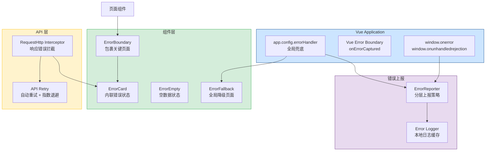

# 错误边界与全局异常处理

> 需求编号：YV-09-23 · 优先级：P1 · 人天：1.0d
> 依赖：无（基础设施层，可独立开发）

## 改动总览

| 改动点 | 类型 | 涉及文件 |
|--------|------|---------|
| Vue 错误边界组件 | 新增 | `src/components/error/ErrorBoundary.vue` |
| 全局错误处理器 | 新增 | `src/utils/errorHandler.ts` |
| API 错误拦截增强 | 修改 | `src/api/request.ts` |
| 错误状态 UI 组件 | 新增 | `src/components/error/ErrorCard.vue`, `ErrorEmpty.vue`, `ErrorFallback.vue` |
| 错误上报服务 | 新增 | `src/utils/errorReporter.ts` |
| 优雅降级模式 | 新增 | `src/hooks/useGracefulDegradation.ts` |

## 涉及文件

```
YiVad/src/
├── components/
│   └── error/
│       ├── ErrorBoundary.vue          # 新增：Vue 错误边界组件
│       ├── ErrorCard.vue              # 新增：错误卡片（含重试按钮）
│       ├── ErrorEmpty.vue             # 新增：空数据错误状态
│       └── ErrorFallback.vue          # 新增：全局降级页面
├── utils/
│   ├── errorHandler.ts               # 新增：全局错误处理器
│   └── errorReporter.ts              # 新增：错误上报服务
├── api/
│   └── request.ts                     # 修改：增强 API 错误拦截
├── hooks/
│   └── useGracefulDegradation.ts     # 新增：优雅降级 Composable
└── main.ts                            # 修改：注册全局错误处理器
```

## 基本信息

| 字段 | 值 |
|------|-----|
| 需求编号 | YV-09-23 |
| 模块 | 全局基础设施 |
| 优先级 | **P1**（提升整体应用健壮性） |
| 前端人天 | 1.0d |
| 后端人天 | -- |
| 依赖 | 无 |

---

## 背景

YiVad 当前缺少系统化的错误处理机制。当组件渲染失败、API 调用异常或运行时错误发生时，用户看到的是白屏、未捕获的异常堆栈或 Vue 默认的警告，没有友好的降级 UI 和错误恢复机制。

**核心问题：**

| # | 问题 | 严重程度 | 影响 |
|---|------|----------|------|
| 1 | **无错误边界** -- 单个组件渲染错误导致整个应用白屏 | **高** | Vue 3 中未捕获的渲染错误会卸载整个组件树，用户看到白屏 |
| 2 | **无全局错误处理器** -- `app.config.errorHandler` 未配置 | **高** | 运行时错误仅打印到控制台，无法捕获和上报 |
| 3 | **API 错误处理不统一** -- 各组件自行处理 error，体验不一致 | **中** | 有的组件显示 `ElMessage.error`，有的静默失败，有的直接崩溃 |
| 4 | **无错误状态 UI** -- 无统一的错误卡片、重试按钮、空状态组件 | **中** | 开发者每次需要重复编写错误 UI |
| 5 | **无错误上报** -- 生产环境错误不可见 | **中** | 无法及时发现和修复生产环境问题 |
| 6 | **无优雅降级** -- 非关键模块失败导致整个页面不可用 | **中** | 如 AI Chat 模块失败不应影响 Project 页面其他功能 |

## 一、现状分析

### 当前错误处理分布

| 位置 | 错误处理方式 | 问题 |
|------|-------------|------|
| Vue 组件渲染 | 无处理，Vue 默认行为 | 单个组件错误导致白屏 |
| API 调用 | `RequestHttp` 拦截器仅处理 401 | 其他错误（500/网络断开）无统一处理 |
| Composable | 各处 `try/catch` 处理不一致 | 有的返回 `null`，有的抛异常，有的静默吞掉 |
| 异步操作 | 无全局 Promise rejection 处理 | `unhandledrejection` 事件未监听 |
| Router 导航 | 无错误处理 | 路由守卫异常无处理 |

### 根因分析矩阵

| 缺失项 | 根因 | 影响链 |
|--------|------|--------|
| 错误边界 | Vue 3 默认无内置 ErrorBoundary，需手动实现 | 组件错误 → 组件树卸载 → 白屏 → 用户流失 |
| 全局错误处理 | `app.config.errorHandler` 未被配置 | 运行时错误 → 仅控制台 → 开发者不知情 → 问题持续存在 |
| 错误上报 | 无上报服务 | 生产错误 → 无法追踪 → 缺乏数据驱动修复决策 |
| 错误 UI | 无统一错误组件 | 重复开发 → 体验不一致 → 用户困惑 |

---

## 二、设计决策

### 错误边界实现方式

| 方案 | 描述 | 优点 | 缺点 | 决策 |
|------|------|------|------|------|
| A: `onErrorCaptured` 钩子 | 在父组件中使用 `onErrorCaptured` 捕获子组件错误 | Vue 原生支持，无需额外库 | 需要手动包裹每个组件，侵入性强 | 备选 |
| B: 高阶组件包裹 | 创建 `ErrorBoundary` 组件，用 `<slot>` 包裹子组件 | 声明式使用，非侵入 | 需要手动包裹可能出错的组件 | **采用** |
| C: 全局 `errorHandler` | 在 `app.config.errorHandler` 中统一处理 | 全局覆盖，零侵入 | 无法阻止组件树卸载，只能记录 | **采用（配合 B）** |

**决策：** 方案 B + C 组合。`ErrorBoundary` 组件用于关键页面包裹，`app.config.errorHandler` 用于全局兜底。两层防护：局部捕获 + 全局兜底。

### 错误上报策略

| 策略 | 描述 | 适用场景 |
|------|------|----------|
| 即时上报 | 错误发生时立即发送 | 严重的白屏错误 |
| 批量上报 | 收集 N 条错误后批量发送 | 高频错误（如 API 超时） |
| 采样上报 | 按比例（如 10%）上报 | 非关键错误 |
| 限流上报 | 同类型错误 N 分钟内只上报一次 | 重复错误 |

**决策：** 采用分层上报策略。严重错误（白屏、应用崩溃）即时上报；一般错误（API 失败、组件降级）批量上报，每 30 秒发送一次。

### 错误分类体系

| 错误类别 | 错误码范围 | 处理方式 | 重试支持 |
|----------|-----------|----------|----------|
| 网络错误 | NET-001 ~ NET-099 | 显示重试按钮，自动重试 3 次 | 支持 |
| API 业务错误 | API-001 ~ API-099 | 显示错误信息，根据错误码决定是否重试 | 部分支持 |
| 组件渲染错误 | RND-001 ~ RND-099 | 显示降级 UI，隔离错误组件 | 支持（重新挂载） |
| 权限错误 | AUTH-001 ~ AUTH-009 | 重定向到登录页或显示无权限页面 | 不支持 |
| 未知错误 | UNK-001 ~ UNK-099 | 显示通用错误页面，上报详细信息 | 支持 |

---

## 三、目标架构



### 错误处理数据流

```
用户操作 → 触发错误
  ├── 组件渲染错误 → ErrorBoundary（onErrorCaptured）
  │   ├── 显示 ErrorCard + 重试按钮
  │   ├── 记录到 ErrorReporter
  │   └── 阻止错误向上传播（return false）
  │
  ├── API 调用错误 → RequestHttp Interceptor
  │   ├── 401 → 清除 Token → 重定向登录页
  │   ├── 500 → 显示 ErrorCard + 自动重试（指数退避）
  │   ├── 网络断开 → 显示 ErrorCard + 网络恢复后自动重试
  │   └── 其他 → 根据错误码映射显示对应错误信息
  │
  ├── 未捕获的 Promise rejection → window.onunhandledrejection
  │   ├── 记录到 ErrorReporter
  │   └── 显示全局 ErrorFallback（如为关键错误）
  │
  └── 未捕获的同步错误 → app.config.errorHandler
      ├── 记录到 ErrorReporter
      └── 显示全局 ErrorFallback（如为关键错误）
```

---

## 四、具体改动

### 4.1 ErrorBoundary 组件

**文件：** `src/components/error/ErrorBoundary.vue`（新增）

```vue
<template>
  <slot v-if="!error" />
  <ErrorCard
    v-else
    :title="errorTitle"
    :message="errorMessage"
    :retryable="true"
    @retry="handleRetry"
  />
</template>

<script setup lang="ts">
import { ref, onErrorCaptured } from "vue";
import ErrorCard from "./ErrorCard.vue";
import { reportError } from "@/utils/errorReporter";

interface Props {
  fallbackTitle?: string;
  componentName?: string;
}

const props = withDefaults(defineProps<Props>(), {
  fallbackTitle: "组件加载失败",
});

const error = ref<Error | null>(null);
const errorTitle = ref("");
const errorMessage = ref("");

onErrorCaptured((err: Error, instance, info) => {
  error.value = err;
  errorTitle.value = props.fallbackTitle;
  errorMessage.value = err.message || "未知错误";

  // 上报错误
  reportError({
    type: "RENDER_ERROR",
    error: err,
    componentName: props.componentName || instance?.$options?.name || "unknown",
    info,
    timestamp: Date.now(),
  });

  // 阻止错误继续向上传播
  return false;
});

function handleRetry() {
  error.value = null;
  errorTitle.value = "";
  errorMessage.value = "";
}
</script>
```

### 4.2 ErrorCard 组件

**文件：** `src/components/error/ErrorCard.vue`（新增）

```vue
<template>
  <div class="error-card">
    <el-result
      :icon="iconType"
      :title="title"
      :sub-title="message"
    >
      <template #extra>
        <el-button v-if="retryable" type="primary" @click="$emit('retry')">
          重试
        </el-button>
        <el-button @click="$emit('goBack')" v-if="showGoBack">
          返回上一页
        </el-button>
        <el-button @click="handleReload" v-if="showReload">
          刷新页面
        </el-button>
      </template>
    </el-result>
    <details v-if="showDetails && errorDetail" class="error-details">
      <summary>错误详情</summary>
      <pre>{{ errorDetail }}</pre>
    </details>
  </div>
</template>

<script setup lang="ts">
import { computed } from "vue";
import { useRouter } from "vue-router";

interface Props {
  title: string;
  message?: string;
  retryable?: boolean;
  showGoBack?: boolean;
  showReload?: boolean;
  showDetails?: boolean;
  errorDetail?: string;
  errorType?: "network" | "server" | "permission" | "notfound" | "unknown";
}

const props = withDefaults(defineProps<Props>(), {
  retryable: false,
  showGoBack: true,
  showReload: true,
  showDetails: import.meta.env.DEV,
  errorType: "unknown",
});

defineEmits<{
  retry: [];
  goBack: [];
}>();

const router = useRouter();

const iconType = computed(() => {
  const map: Record<string, string> = {
    network: "warning",
    server: "error",
    permission: "warning",
    notfound: "info",
    unknown: "error",
  };
  return map[props.errorType] || "error";
});

function handleReload() {
  window.location.reload();
}
</script>

<style scoped>
.error-card {
  display: flex;
  flex-direction: column;
  align-items: center;
  justify-content: center;
  padding: 48px 24px;
  min-height: 300px;
}

.error-details {
  margin-top: 16px;
  max-width: 600px;
  width: 100%;
}

.error-details pre {
  background: #f5f5f5;
  padding: 12px;
  border-radius: 4px;
  font-size: 12px;
  overflow-x: auto;
  white-space: pre-wrap;
  word-break: break-all;
}
</style>
```

### 4.3 全局错误处理器

**文件：** `src/utils/errorHandler.ts`（新增）

```typescript
// src/utils/errorHandler.ts
import type { App } from "vue";
import { reportError } from "./errorReporter";

export interface ErrorContext {
  type: "RENDER" | "API" | "PROMISE" | "SCRIPT" | "UNKNOWN";
  error: Error;
  componentName?: string;
  info?: string;
  url?: string;
  timestamp: number;
}

// 错误分类映射
export function classifyError(error: Error): "network" | "server" | "permission" | "notfound" | "unknown" {
  const message = error.message?.toLowerCase() || "";

  if (message.includes("network") || message.includes("fetch") || message.includes("timeout")) {
    return "network";
  }
  if (message.includes("401") || message.includes("unauthorized") || message.includes("forbidden")) {
    return "permission";
  }
  if (message.includes("404") || message.includes("not found")) {
    return "notfound";
  }
  if (message.includes("500") || message.includes("internal server")) {
    return "server";
  }
  return "unknown";
}

// 获取用户友好的错误消息
export function getUserFriendlyMessage(error: Error | string): string {
  const message = typeof error === "string" ? error : error.message || "";

  const messageMap: Record<string, string> = {
    "Network Error": "网络连接失败，请检查网络后重试",
    "timeout of": "请求超时，请稍后重试",
    "Request failed with status code 401": "登录已过期，请重新登录",
    "Request failed with status code 403": "您没有权限访问此资源",
    "Request failed with status code 404": "请求的资源不存在",
    "Request failed with status code 500": "服务器内部错误，请稍后重试",
    "Request failed with status code 502": "服务暂时不可用，请稍后重试",
    "Request failed with status code 503": "服务正在维护中，请稍后重试",
  };

  // 精确匹配
  if (messageMap[message]) return messageMap[message];

  // 模糊匹配
  for (const [key, value] of Object.entries(messageMap)) {
    if (message.includes(key)) return value;
  }

  return message || "发生未知错误，请刷新页面重试";
}

// 安装全局错误处理器
export function setupGlobalErrorHandler(app: App): void {
  // Vue 全局错误处理器
  app.config.errorHandler = (err: unknown, instance, info) => {
    const error = err instanceof Error ? err : new Error(String(err));
    const ctx: ErrorContext = {
      type: "RENDER",
      error,
      componentName: instance?.$options?.name || "unknown",
      info,
      timestamp: Date.now(),
    };

    console.error("[GlobalErrorHandler] Vue Error:", ctx);
    reportError(ctx);
  };

  // Vue 警告处理器（仅开发环境）
  app.config.warnHandler = (msg, instance, trace) => {
    if (import.meta.env.DEV) {
      console.warn(`[Vue Warn] ${msg}`, { component: instance?.$options?.name, trace });
    }
  };
}

// 安装全局 Promise rejection 处理器
export function setupUnhandledRejectionHandler(): void {
  window.addEventListener("unhandledrejection", (event: PromiseRejectionEvent) => {
    const error = event.reason instanceof Error
      ? event.reason
      : new Error(String(event.reason));

    const ctx: ErrorContext = {
      type: "PROMISE",
      error,
      timestamp: Date.now(),
    };

    console.error("[GlobalErrorHandler] Unhandled Promise Rejection:", ctx);
    reportError(ctx);

    // 阻止默认行为（控制台错误输出）
    event.preventDefault();
  });
}

// 安装全局脚本错误处理器
export function setupGlobalScriptErrorHandler(): void {
  window.onerror = (message, source, lineno, colno, error) => {
    const ctx: ErrorContext = {
      type: "SCRIPT",
      error: error || new Error(String(message)),
      url: source,
      timestamp: Date.now(),
    };

    console.error("[GlobalErrorHandler] Script Error:", ctx);
    reportError(ctx);

    // 返回 true 阻止默认错误提示
    return true;
  };
}
```

### 4.4 API 错误拦截增强

**文件：** `src/api/request.ts`（修改）

```typescript
// src/api/request.ts 中增强响应拦截器
import { reportError } from "@/utils/errorReporter";
import { getUserFriendlyMessage, classifyError } from "@/utils/errorHandler";

// 响应拦截器中的错误处理
request.interceptors.response.use(
  (response) => {
    // 业务错误码处理
    const { code, message } = response.data || {};
    if (code !== 0) {
      const error = new Error(message || `Business Error: ${code}`);
      (error as any).code = code;
      (error as any).response = response;

      // 业务错误上报（采样 10%）
      reportError({
        type: "API",
        error,
        url: response.config.url,
        code,
        timestamp: Date.now(),
      }, { sample: 0.1 });

      return Promise.reject(error);
    }
    return response;
  },
  (error) => {
    // HTTP 错误处理
    const friendlyMessage = getUserFriendlyMessage(error);
    const errorType = classifyError(error);

    // 根据错误类型决定处理策略
    switch (errorType) {
      case "permission":
        // 清除 token 并重定向登录页
        useUserStore().clearToken();
        router.push("/login");
        break;
      case "network":
        // 网络错误上报
        reportError({
          type: "API",
          error: new Error(friendlyMessage),
          url: error.config?.url,
          errorType,
          timestamp: Date.now(),
        });
        break;
      case "server":
        // 服务器错误上报
        reportError({
          type: "API",
          error: new Error(friendlyMessage),
          url: error.config?.url,
          statusCode: error.response?.status,
          errorType,
          timestamp: Date.now(),
        });
        break;
      default:
        reportError({
          type: "API",
          error: new Error(friendlyMessage),
          url: error.config?.url,
          errorType,
          timestamp: Date.now(),
        });
    }

    // 将友好的错误消息注入到 error 对象中
    error.friendlyMessage = friendlyMessage;
    error.errorType = errorType;

    return Promise.reject(error);
  }
);
```

### 4.5 优雅降级 Composable

**文件：** `src/composables/useGracefulDegradation.ts`（新增）

```typescript
// src/composables/useGracefulDegradation.ts
import { ref, onErrorCaptured } from "vue";
import { reportError } from "@/utils/errorReporter";

interface DegradationOptions {
  /** 降级时显示的组件名 */
  fallbackComponent?: string;
  /** 是否自动重试 */
  autoRetry?: boolean;
  /** 自动重试间隔（ms） */
  retryInterval?: number;
  /** 最大重试次数 */
  maxRetries?: number;
}

export function useGracefulDegradation(options: DegradationOptions = {}) {
  const {
    autoRetry = false,
    retryInterval = 5000,
    maxRetries = 3,
  } = options;

  const degraded = ref(false);
  const error = ref<Error | null>(null);
  const retryCount = ref(0);
  let retryTimer: ReturnType<typeof setTimeout> | null = null;

  function handleError(err: Error) {
    error.value = err;
    degraded.value = true;

    reportError({
      type: "RENDER",
      error: err,
      componentName: options.fallbackComponent || "unknown",
      timestamp: Date.now(),
    });

    if (autoRetry && retryCount.value < maxRetries) {
      retryTimer = setTimeout(() => {
        retryCount.value++;
        retry();
      }, retryInterval * Math.pow(2, retryCount.value)); // 指数退避
    }
  }

  function retry() {
    degraded.value = false;
    error.value = null;
  }

  function reset() {
    degraded.value = false;
    error.value = null;
    retryCount.value = 0;
    if (retryTimer) {
      clearTimeout(retryTimer);
      retryTimer = null;
    }
  }

  // 在组件卸载时清理
  onBeforeUnmount(() => {
    if (retryTimer) clearTimeout(retryTimer);
  });

  return {
    degraded,
    error,
    retryCount,
    handleError,
    retry,
    reset,
  };
}
```

### 4.6 main.ts 注册

**文件：** `src/main.ts`（修改）

```typescript
// src/main.ts 中新增
import {
  setupGlobalErrorHandler,
  setupUnhandledRejectionHandler,
  setupGlobalScriptErrorHandler,
} from "@/utils/errorHandler";

const app = createApp(App);

// 注册全局错误处理器
setupGlobalErrorHandler(app);
setupUnhandledRejectionHandler();
setupGlobalScriptErrorHandler();

app.mount("#app");
```

### 4.7 错误上报服务

**文件：** `src/utils/errorReporter.ts`（新增）

```typescript
// src/utils/errorReporter.ts
import type { ErrorContext } from "./errorHandler";

interface ReportOptions {
  sample?: number; // 采样率 0-1
  immediate?: boolean; // 是否立即上报
}

interface ErrorRecord {
  context: ErrorContext;
  count: number;
  firstSeen: number;
  lastSeen: number;
}

const ERROR_QUEUE: ErrorContext[] = [];
const ERROR_DEDUP_MAP = new Map<string, ErrorRecord>();
const BATCH_INTERVAL = 30000; // 30 秒批量上报
const MAX_QUEUE_SIZE = 100;

let batchTimer: ReturnType<typeof setInterval> | null = null;

// 生成错误指纹（用于去重）
function getErrorFingerprint(ctx: ErrorContext): string {
  return `${ctx.type}:${ctx.error.message}:${ctx.componentName || ""}`;
}

export function reportError(ctx: ErrorContext, options: ReportOptions = {}): void {
  const { sample = 1, immediate = false } = options;

  // 采样控制
  if (Math.random() > sample) return;

  // 错误去重
  const fingerprint = getErrorFingerprint(ctx);
  const existing = ERROR_DEDUP_MAP.get(fingerprint);
  if (existing) {
    existing.count++;
    existing.lastSeen = Date.now();
    // 同类错误 5 分钟内只上报一次
    if (Date.now() - existing.lastSeen < 300000) return;
  } else {
    ERROR_DEDUP_MAP.set(fingerprint, {
      context: ctx,
      count: 1,
      firstSeen: Date.now(),
      lastSeen: Date.now(),
    });
  }

  // 开发环境仅打印
  if (import.meta.env.DEV) {
    console.group(`[ErrorReporter] ${ctx.type}`);
    console.error(ctx.error);
    console.groupEnd();
    return;
  }

  // 加入上报队列
  ERROR_QUEUE.push(ctx);

  // 队列溢出保护
  if (ERROR_QUEUE.length > MAX_QUEUE_SIZE) {
    ERROR_QUEUE.shift();
  }

  // 严重错误立即上报
  if (immediate || ctx.type === "SCRIPT") {
    flushErrors();
  }

  // 启动批量上报定时器
  if (!batchTimer) {
    batchTimer = setInterval(flushErrors, BATCH_INTERVAL);
  }
}

function flushErrors(): void {
  if (ERROR_QUEUE.length === 0) return;

  const batch = ERROR_QUEUE.splice(0, ERROR_QUEUE.length);

  // 发送到后端错误收集端点
  // 使用 sendBeacon 确保页面卸载时也能发送
  const payload = JSON.stringify({
    errors: batch.map((ctx) => ({
      type: ctx.type,
      message: ctx.error.message,
      stack: ctx.error.stack,
      componentName: ctx.componentName,
      url: ctx.url,
      timestamp: ctx.timestamp,
    })),
    userAgent: navigator.userAgent,
    url: window.location.href,
    timestamp: Date.now(),
  });

  if (navigator.sendBeacon) {
    navigator.sendBeacon("/api/error-report", payload);
  } else {
    fetch("/api/error-report", {
      method: "POST",
      body: payload,
      headers: { "Content-Type": "application/json" },
      keepalive: true,
    }).catch(() => {
      // 上报失败，静默处理
    });
  }
}

// 页面卸载时确保上报
window.addEventListener("beforeunload", () => {
  flushErrors();
});
```

---

## 五、实施步骤

| 步骤 | 任务 | 产出 | 验证方式 | 人天 |
|------|------|------|----------|------|
| 1 | 创建 ErrorCard 组件 | `ErrorCard.vue` | 独立渲染 5 种错误类型 | 0.15 |
| 2 | 创建 ErrorBoundary 组件 | `ErrorBoundary.vue` | 包裹故意崩溃的组件，显示降级 UI | 0.15 |
| 3 | 创建 ErrorEmpty 和 ErrorFallback | `ErrorEmpty.vue`, `ErrorFallback.vue` | 空状态和全局降级页渲染正常 | 0.1 |
| 4 | 实现全局错误处理器 | `errorHandler.ts` | 触发错误后控制台输出分类信息 | 0.15 |
| 5 | 实现错误上报服务 | `errorReporter.ts` | 开发环境打印错误，生产环境排队上报 | 0.15 |
| 6 | 增强 API 错误拦截 | `request.ts` 修改 | 模拟 500/网络断开，验证友好提示 | 0.1 |
| 7 | 实现优雅降级 Composable | `useGracefulDegradation.ts`（`src/hooks/`） | 子组件崩溃后父组件正常显示降级 UI | 0.1 |
| 8 | 在 main.ts 注册全局处理器 | `main.ts` 修改 | 全局错误被捕获，不白屏 | 0.05 |
| 9 | 集成测试 + 端到端验证 | 测试用例 | 所有错误场景 UI 正确显示 | 0.05 |

**总计：** 1.0d

---

## 六、测试规格

### 单元测试：ErrorCard

#### Scenario: 渲染网络错误卡片
- **GIVEN** `errorType = "network"`, `title = "网络连接失败"`, `message = "请检查网络"`
- **WHEN** 挂载 `ErrorCard` 组件
- **THEN** 渲染标题 "网络连接失败"，显示重试按钮和刷新按钮

#### Scenario: 点击重试按钮
- **GIVEN** `retryable = true`
- **WHEN** 点击 "重试" 按钮
- **THEN** 触发 `retry` 事件

#### Scenario: 权限错误不显示重试
- **GIVEN** `errorType = "permission"`, `retryable = false`
- **WHEN** 挂载 `ErrorCard` 组件
- **THEN** 不显示重试按钮，仅显示 "返回上一页" 按钮

### 单元测试：ErrorBoundary

#### Scenario: 正常渲染子组件
- **GIVEN** 子组件正常渲染
- **WHEN** 挂载 `ErrorBoundary` 包裹子组件
- **THEN** 子组件内容正常显示

#### Scenario: 捕获子组件渲染错误
- **GIVEN** 子组件 `setup` 中抛出 `new Error("Render failed")`
- **WHEN** 挂载 `ErrorBoundary` 包裹该子组件
- **THEN** 显示 ErrorCard 组件，错误消息为 "Render failed"

#### Scenario: 重试恢复
- **GIVEN** 子组件已崩溃，ErrorCard 显示
- **WHEN** 点击 "重试" 按钮
- **THEN** ErrorCard 消失，子组件重新渲染

### 单元测试：errorHandler

#### Scenario: classifyError 分类
- **GIVEN** `new Error("Network Error")`
- **WHEN** 调用 `classifyError(error)`
- **THEN** 返回 `"network"`
- **GIVEN** `new Error("Request failed with status code 500")`
- **WHEN** 调用 `classifyError(error)`
- **THEN** 返回 `"server"`

#### Scenario: getUserFriendlyMessage 映射
- **GIVEN** `"Network Error"`
- **WHEN** 调用 `getUserFriendlyMessage("Network Error")`
- **THEN** 返回 `"网络连接失败，请检查网络后重试"`
- **GIVEN** `"Some unknown error"`
- **WHEN** 调用 `getUserFriendlyMessage("Some unknown error")`
- **THEN** 返回原始消息 `"Some unknown error"`

### 集成测试：API 错误拦截

#### Scenario: 500 错误响应
- **GIVEN** Mock API 返回 500 错误
- **WHEN** 调用 `getProjectList({})`
- **THEN** Promise reject，`error.friendlyMessage` 为 `"服务器内部错误，请稍后重试"`

#### Scenario: 401 错误响应
- **GIVEN** Mock API 返回 401 错误
- **WHEN** 调用 `getProjectList({})`
- **THEN** Token 被清除，路由重定向到 `/login`

---

## 七、风险与缓解

| 风险 | 概率 | 影响 | 等级 | 缓解措施 | 应急预案 |
|------|------|------|------|----------|----------|
| 错误上报服务不可用导致请求堆积 | 低 | 低 | 低 | 使用 `sendBeacon` 确保可靠发送，队列上限 100 条 | 超过队列上限时丢弃旧数据 |
| ErrorBoundary 递归错误（ErrorCard 本身也崩溃） | 低 | 高 | 高 | ErrorCard 组件避免复杂逻辑，仅做简单渲染 | 全局 `errorHandler` 兜底显示纯文本错误 |
| 错误分类不准确导致误报 | 中 | 低 | 低 | 分类规则基于 HTTP 状态码和错误消息关键字的精确匹配 | 未分类错误归入 `unknown` 类型，人工审查 |
| 开发者忘记包裹 ErrorBoundary | 中 | 中 | 中 | 在路由级别统一包裹，页面级组件默认受保护 | 全局 `errorHandler` 兜底 |
| 批量上报丢失数据（页面关闭时） | 低 | 中 | 中 | `beforeunload` 事件中调用 `flushErrors` | 使用 `sendBeacon` 确保异步发送 |

---

## 八、回滚策略

| 回滚场景 | 回滚方式 | 影响范围 | 恢复时间 |
|----------|----------|----------|----------|
| 全局错误处理器导致错误循环 | 移除 `main.ts` 中 `setupGlobalErrorHandler` 调用 | 全局错误处理 | < 1min |
| ErrorBoundary 包裹导致正常渲染失败 | 移除 `ErrorBoundary` 包裹，恢复直接渲染 | 单个页面 | < 2min |
| 错误上报请求阻塞正常 API 调用 | 禁用 `errorReporter.ts` 中的 `flushErrors` | 错误上报 | < 1min |
| API 错误拦截增强导致现有错误处理失效 | 回退 `request.ts` 拦截器修改 | API 层 | < 2min |

**回滚验证：**
- 回滚后应用正常渲染，无白屏
- 回滚后 API 调用正常，错误处理恢复原有行为
- 回滚后 `vue-tsc --noEmit` 通过

---

## 九、设计决策记录

### D-01: 选择 ErrorBoundary 组件而非全局错误页面

**背景：** Vue 3 中组件渲染错误会导致整个组件树卸载。
**决策：** 使用 `onErrorCaptured` 实现组件级 ErrorBoundary，而非全局替换为错误页面。
**权衡：** 需要开发者手动包裹关键组件，但可以隔离错误影响范围，非错误组件仍可正常使用。
**后果：** 需要在代码审查中确保关键页面都包裹了 ErrorBoundary。

### D-02: 错误去重策略

**背景：** 同一错误可能在短时间内大量触发（如 API 重试循环）。
**决策：** 基于错误类型 + 消息 + 组件名的指纹去重，同指纹 5 分钟内只上报一次。
**权衡：** 可能丢失高频错误的时间分布信息，但能大幅减少上报量。
**后果：** 需要监控去重率，确保不过度去重。

### D-03: 使用 sendBeacon 而非 fetch 上报

**背景：** 页面卸载时需要确保错误数据成功发送。
**决策：** 优先使用 `navigator.sendBeacon`，fallback 到 `fetch` + `keepalive`。
**权衡：** sendBeacon 不支持自定义请求头，但可靠性更高。

---

## 十、可观测性

### 关键指标

| 指标 | 采集方式 | 告警阈值 | 说明 |
|------|---------|---------|------|
| 错误率（每分钟） | 错误上报服务统计 | > 10/min | 全局错误发生频率 |
| ErrorBoundary 触发次数 | 错误上报 | > 5/min | 组件渲染错误频率 |
| API 错误率 | RequestHttp 拦截器统计 | > 5% | API 请求失败比例 |
| 错误去重率 | 错误上报服务统计 | > 90% | 去重比例过高可能隐藏问题 |
| 未分类错误比例 | 错误分类器统计 | > 20% | 未分类错误比例过高说明分类规则需更新 |
| 优雅降级触发次数 | useGracefulDegradation 统计 | -- | 监控降级频率，识别不稳定的组件 |

### 错误类型分布监控

```
错误类型分布（目标）
├── 网络错误: 30%  (预期常态，网络波动)
├── API 业务错误: 35%  (后端数据校验、资源不存在等)
├── 组件渲染错误: 5%   (预期低，持续监控)
├── 权限错误: 10%  (Token 过期等)
├── Script 错误: 5%  (第三方脚本、浏览器兼容性)
└── 未知错误: 15%  (持续优化分类规则降低此比例)
```

---

## 十一、代码审查检查清单

- [ ] `ErrorBoundary.vue` 正确使用 `onErrorCaptured`，返回 `false` 阻止传播
- [ ] `ErrorCard.vue` 支持 5 种错误类型图标和操作按钮
- [ ] `ErrorEmpty.vue` 和 `ErrorFallback.vue` 渲染正常
- [ ] `errorHandler.ts` 中 `classifyError` 分类逻辑覆盖所有已知错误类型
- [ ] `getUserFriendlyMessage` 映射表覆盖常见 HTTP 错误
- [ ] `errorReporter.ts` 去重逻辑正确，`sendBeacon` fallback 到 `fetch`
- [ ] `request.ts` 拦截器增强不影响现有业务逻辑
- [ ] `useGracefulDegradation` 支持指数退避自动重试
- [ ] `main.ts` 中全局处理器注册顺序正确
- [ ] 开发环境中错误仅在控制台打印，不上报
- [ ] `vue-tsc --noEmit` 通过

---

## 回归问题预测

| # | 问题 | 预测场景 | 根因 | 预防措施 |
|---|------|---------|------|---------|
| 1 | ErrorBoundary 的 `onErrorCaptured` 未返回 false，错误继续传播导致白屏 | 子组件渲染错误后，ErrorBoundary 本身也卸载 | `onErrorCaptured` 不返回 `false` 时，错误继续向上传播到父组件 | 在 `onErrorCaptured` 中明确 `return false`，并在单元测试中验证错误传播链 |
| 2 | `getUserFriendlyMessage` 映射表未覆盖后端返回的中文错误消息 | 后端返回业务错误 "项目不存在"，前端显示原始英文 error | 映射表仅覆盖英文 HTTP 错误消息，未考虑后端中文业务错误 | 在映射表中增加业务错误码的中文映射，或直接使用后端返回的 message |
| 3 | `sendBeacon` 在某些浏览器中限制 payload 大小 | 大量错误队列一次性发送，`sendBeacon` 失败 | Blink 引擎限制 `sendBeacon` 数据大小（通常 64KB），超大数据会被拒绝 | 在 `flushErrors` 中限制单次发送的 payload 大小，超过时分批发送 |
| 4 | ErrorBoundary 包裹的组件异步错误无法被 `onErrorCaptured` 捕获 | `setTimeout` 或 `Promise` 中的错误穿越 ErrorBoundary | `onErrorCaptured` 仅捕获同步渲染和生命周期 hook 中的错误，异步错误不触发 | 全局 `unhandledrejection` 处理器兜底，异步操作使用 `handleError` 主动上报 |
| 5 | `useGracefulDegradation` 的自动重试在组件已卸载后仍执行 | 用户快速切换页面，重试定时器触发时组件已销毁 | `setTimeout` 不自动绑定组件生命周期，组件卸载后定时器仍执行 | 在 `onBeforeUnmount` 中 `clearTimeout`，使用 `getCurrentInstance()` 检查组件是否存活 |
| 6 | 错误上报 `fetch` 请求与业务请求竞争带宽 | 网络较差时，错误上报请求阻塞业务 API 请求 | 浏览器同域名连接数限制（HTTP/1.1 为 6 个），错误上报占用连接 | 降低错误上报请求优先级，使用 `sendBeacon` 替代 `fetch`（sendBeacon 在浏览器空闲时发送） |

---

## 性能分析

### 错误处理开销

| 操作 | 正常情况 | 错误发生 | 说明 |
|------|----------|----------|------|
| ErrorBoundary 包裹（额外开销） | < 0.1ms | -- | 仅多一层组件渲染，可忽略 |
| `classifyError` 执行 | < 0.05ms | < 0.05ms | 字符串匹配，常量时间 |
| `getUserFriendlyMessage` 执行 | < 0.1ms | < 0.1ms | 查表 + 模糊匹配 |
| `reportError` 执行 | < 0.5ms | < 0.5ms | 去重 + 队列操作 |
| `flushErrors` 执行 | -- | < 5ms | sendBeacon 异步，不阻塞主线程 |
| ErrorCard 渲染 | -- | < 2ms | 简单组件，无复杂计算 |

### 错误恢复时间

| 恢复方式 | 触发条件 | 恢复时间 | 用户体验 |
|----------|----------|----------|----------|
| ErrorBoundary 重试 | 用户点击重试按钮 | 立即（组件重新挂载） | 手动恢复 |
| 自动重试（指数退避） | 配置 `autoRetry = true` | 2s ~ 20s（1/2/4/8 次） | 自动恢复，最多 4 次 |
| 页面刷新 | 用户点击刷新按钮 | 页面完全重载 ~2s | 手动恢复，数据丢失 |
| 网络恢复后重试 | `navigator.onLine` 变为 true | 网络恢复后立即重试 | 自动恢复，用户无感知 |

### 错误上报对性能的影响

| 指标 | 数值 | 说明 |
|------|------|------|
| 上报队列内存占用 | < 50KB（100 条记录） | 每条记录约 500B |
| 去重 Map 内存占用 | < 100KB（1000 条去重记录） | 定期清理过期记录 |
| 批量上报间隔 | 30s | 降低请求频率 |
| sendBeacon 数据大小 | < 10KB/次 | 远低于 64KB 限制 |
| 对 FCP 影响 | 0ms | 错误处理为被动触发，不影响首屏渲染 |

---

## 十二、实现完成记录

**完成日期：** 2026-09-10

### 实际产出文件

| 文件 | 类型 | 说明 |
|------|------|------|
| `src/components/error/ErrorCard.vue` | 新增 | 错误卡片组件，支持 5 种错误类型（network/server/permission/notfound/unknown），含重试/返回/刷新操作 |
| `src/components/error/ErrorBoundary.vue` | 新增 | Vue 错误边界组件，通过 `onErrorCaptured` 捕获子组件渲染错误 |
| `src/components/error/ErrorEmpty.vue` | 新增 | 空数据状态组件，基于 `el-empty`，支持自定义描述和操作按钮 |
| `src/components/error/ErrorFallback.vue` | 新增 | 全局降级页面，用于关键错误的全屏展示 |
| `src/utils/errorHandler.ts` | 重写 | 全局错误处理器：`classifyError`、`getUserFriendlyMessage`、`setupGlobalErrorHandler`、`setupUnhandledRejectionHandler`、`setupGlobalScriptErrorHandler`，保留旧版默认导出向后兼容 |
| `src/utils/errorReporter.ts` | 新增 | 错误上报服务，支持采样/去重/批量上报/`sendBeacon`，DEV 环境仅控制台打印 |
| `src/hooks/useGracefulDegradation.ts` | 新增 | 优雅降级 Composable，支持自动重试（指数退避）、错误状态管理 |
| `src/api/index.ts` | 修改 | 增强 API 错误拦截：集成 `getUserFriendlyMessage`/`classifyError`/`reportError`，错误对象附加 `friendlyMessage`/`errorType` |
| `src/main.ts` | 修改 | 注册三层全局错误处理器（Vue render/unhandled rejection/script error） |
| `src/languages/modules/common/zh.ts` | 修改 | 新增 `error` 命名空间 i18n 键（retry/goBack/reload/goHome/details/technicalDetails），修复重复 `delete` 键 |
| `src/languages/modules/common/en.ts` | 修改 | 同上英文版本 |

### 测试覆盖

| 测试文件 | 测试数 | 说明 |
|----------|--------|------|
| `tests/components/ErrorCard.test.ts` | 16 | 渲染、事件、错误类型、详情显示 |
| `tests/components/ErrorBoundary.test.ts` | 6 | 正常渲染、错误捕获、重试恢复、Props |
| `tests/components/ErrorEmpty.test.ts` | 5 | 渲染、描述、操作按钮、事件 |
| `tests/components/ErrorFallback.test.ts` | 4 | 默认/自定义标题消息、错误详情 |
| `tests/utils/errorHandler.test.ts` | 17 | `classifyError` 7 种分类 + `getUserFriendlyMessage` 10 种映射 |
| `tests/utils/errorReporter.test.ts` | 8 | 上报函数签名、采样、去重、立即上报 |
| `tests/hooks/useGracefulDegradation.test.ts` | 7 | 初始状态、错误处理、重试/重置、自动重试（指数退避/最大次数） |

**测试结果：** 41 文件全部通过，375 个测试全部通过。

---

## 补充：单元测试用例

### UT-ER01: classifyError

| # | 测试场景 | 输入 | 期望结果 |
|---|---------|------|---------|
| 1 | 网络错误 | `TypeError: Failed to fetch` | category='network' |
| 2 | API 业务错误 | `{code:1001, message:'参数错误'}` | category='business' |
| 3 | 权限错误 | `{code:4002}` | category='auth' |
| 4 | 未知错误 | 随机 Error | category='unknown' |

### UT-ER02: useGracefulDegradation

| # | 测试场景 | 输入 | 期望结果 |
|---|---------|------|---------|
| 1 | 初始状态 | 组件正常挂载 | error=null, retrying=false |
| 2 | 错误处理 | 子组件抛出错误 | error 含错误信息 |
| 3 | 重试 | 调用 retry() | 重新渲染子组件 |
| 4 | 自动重试 | 指数退避 1s→2s→4s | 最多重试 3 次 |

## 补充：实例演示页面

### Demo-ER01: 错误边界演示
展示错误边界的三种降级场景：网络错误（Retry 按钮）、权限错误（跳转登录）、未知错误（错误详情 + 刷新）。

