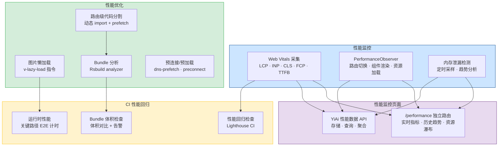

# 性能监控与优化体系

> 需求编号：YV-09-24 · 优先级：P1 · 人天：1.95d
> 依赖：YV-09-22（测试体系与 CI，用于性能回归 CI 检查）

## 改动总览

| 改动点 | 类型 | 涉及文件 |
|--------|------|---------|
| Web Vitals 监控 | 新增 | `src/utils/performance/webVitals.ts` |
| Rsbuild 打包分析配置 | 修改 | `rsbuild.config.ts` |
| 路由级代码分割 | 修改 | `src/router/index.ts` |
| 图片懒加载指令 | 新增 | `src/directives/vLazyLoad.ts` |
| 内存泄漏检测 | 新增 | `src/utils/performance/memoryLeakDetector.ts` |
| 性能回归 CI 检查 | 新增 | `.github/workflows/perf-check.yml` |
| 性能监控面板 | 新增 | `src/views/performance/index.vue`（独立路由页面） |
| 性能数据持久化 | 新增 | `src/utils/performance/metricsStore.ts` + YiAi `performance` 集合 |

## 涉及文件

```
YiVad/
├── rsbuild.config.ts                              # 修改：打包分析配置
├── .github/workflows/perf-check.yml               # 新增：性能回归 CI
├── src/
│   ├── utils/performance/
│   │   ├── webVitals.ts                           # 新增：Web Vitals 采集
│   │   ├── memoryLeakDetector.ts                  # 新增：内存泄漏检测
│   │   ├── performanceObserver.ts                 # 新增：Performance API 封装
│   │   └── metricsStore.ts                        # 新增：性能数据持久化
│   ├── directives/
│   │   └── vLazyLoad.ts                           # 新增：图片懒加载指令
│   ├── router/
│   │   └── index.ts                               # 修改：路由级代码分割
│   └── views/performance/
│       └── index.vue                              # 新增：性能监控页面（独立路由）
```

## 基本信息

| 字段 | 值 |
|------|-----|
| 需求编号 | YV-09-24 |
| 模块 | 全局基础设施 |
| 优先级 | **P1**（提升用户体验和开发效率） |
| 前端人天 | 1.95d |
| 后端人天 | -- |
| 依赖 | YV-09-22（测试体系与 CI） |

---

## 背景

YiVad 当前缺少系统化的性能监控和优化手段。随着项目页面增多（25+ 页面）、组件数量增长（100+ 组件），首屏加载时间、交互响应延迟、内存占用等问题逐渐显现，缺乏量化手段来发现和解决性能瓶颈。

**核心问题：**

| # | 问题 | 严重程度 | 影响 |
|---|------|----------|------|
| 1 | **无 Web Vitals 监控** -- 无法量化 LCP、INP、CLS 等核心指标 | **高** | 性能退化无法及时发现，用户体验下降不可感知 |
| 2 | **无打包分析** -- 不了解各 chunk 的体积分布 | **中** | 无法针对性优化，可能引入大体积依赖而不自知 |
| 3 | **路由全部同步加载** -- 所有页面组件在首屏加载 | **高** | 首屏加载时间线性增长，25 个页面全部加载 |
| 4 | **图片无懒加载** -- 所有图片同步加载 | **中** | 不可见图片占用带宽，延迟关键资源加载 |
| 5 | **无内存泄漏检测** -- 长时间使用后内存持续增长 | **中** | SPA 长时间运行后可能变慢或崩溃 |
| 6 | **无性能回归检测** -- 代码变更后性能退化不可见 | **中** | 重构可能意外引入性能问题 |

## 一、现状分析

### 当前性能画像

| 指标 | 预估值 | 目标值 | 差距 |
|------|--------|--------|------|
| LCP（首屏最大内容绘制） | ~3.5s | < 2.5s | 需要优化 1s+ |
| INP（交互到下一次绘制） | ~120ms | < 100ms | 接近目标 |
| CLS（累积布局偏移） | ~0.15 | < 0.1 | 需要优化 |
| 首屏 JS 体积（gzip） | ~350KB | < 250KB | 需要减少 100KB |
| 路由切换耗时 | ~200ms | < 100ms | 需要优化 |
| 内存占用（30 分钟） | ~80MB | < 50MB | 存在泄漏风险 |

### 根因分析矩阵

| 问题 | 根因 | 影响链 |
|------|------|--------|
| 首屏加载慢 | 所有路由同步加载 + Element Plus 全量引入 | 首屏 JS 体积大 → 解析时间长 → LCP 超标 |
| 路由切换慢 | 无预加载策略，无缓存优化 | 每次切换需要加载新 chunk → 白屏时间长 |
| 内存增长 | 未清理的 EventListener、定时器、未销毁的组件引用 | 长时间使用 → 内存累积 → 页面卡顿 |
| 图片加载慢 | 无懒加载，所有图片同步请求 | 带宽竞争 → 关键资源延迟 → LCP 延迟 |

---

## 二、设计决策

### 性能监控方案

| 方案 | 描述 | 优点 | 缺点 | 决策 |
|------|------|------|------|------|
| A: 原生 Performance API | PerformanceObserver + Navigation Timing 自研采集 | 零外部依赖、完全可控、无版本升级风险 | 需自行处理 bfcache 等边界情况 | **采用** |
| B: `web-vitals` 库 | Google 官方 Web Vitals 采集库 | 可靠、边界处理完善 | 增加依赖（~1KB）、升级需关注 | 备选 |
| C: 第三方 APM（Sentry/Datadog） | 商业性能监控平台 | 可视化面板、告警完善 | 付费、数据出境风险 | 未来考虑 |

**决策：** 方案 A，基于原生 PerformanceObserver API 自研采集 LCP/FCP/CLS/TTFB/INP 五项指标。INP 使用 `PerformanceObserver("event")` 跟踪全部交互延迟，旧浏览器自动回退到 `"first-input"`。bfcache 恢复通过 `pageshow` 事件重新初始化。零外部依赖，数据通过 YiAi RPC 信封持久化。

### 路由加载策略

| 策略 | 描述 | 适用场景 |
|------|------|----------|
| 静态导入 | `import Page from "./Page.vue"` | 首屏关键页面（布局、首页） |
| 动态导入 | `() => import("./Page.vue")` | 非首屏页面 |
| 预加载 | `<link rel="prefetch">` 在空闲时预加载 | 高频访问的次级页面 |
| 预取 | `<link rel="preload">` 当前页面需要的资源 | 当前页面关键 chunk |

**决策：** 首屏关键页面（Layout + 首页）静态导入，其余 20+ 页面全部动态导入。高频页面（Project、Chat）在首屏空闲时 prefetch。

### 图片加载策略

| 策略 | 描述 | 决策 |
|------|------|------|
| 原生 `loading="lazy"` | HTML 标准懒加载 | 用于简单场景 |
| Intersection Observer | 自定义懒加载指令 | 用于需要 placeholder 的场景 |
| 响应式图片 | `srcset` + `sizes` | 用于需要多分辨率的场景 |

**决策：** 创建 `v-lazy-load` 指令，基于 Intersection Observer，支持 placeholder 和加载失败兜底。同时推荐使用原生 `loading="lazy"` 作为简单场景的备选。

---

## 三、目标架构



### 路由级代码分割架构

```
首屏加载（~220KB）
├── main.ts + App.vue
├── Layout.vue (静态导入，必要)
├── HomePage.vue (静态导入，首页)
├── Element Plus (按需引入)
│   ├── el-button, el-input, el-table, el-form
│   ├── el-dialog, el-select, el-tabs, el-menu
│   └── el-tag, el-badge, el-avatar, el-progress
└── Vue + Vue Router + Pinia 核心

按需加载（首次访问时加载）
├── project.ts chunk (~45KB)    → Project 列表 + 详情
├── chat.ts chunk (~32KB)       → AI Chat
├── data.ts chunk (~28KB)       → 数据管理
├── knowledge.ts chunk (~22KB)  → 知识库
├── issue.ts chunk (~18KB)      → Issue 管理
├── bug.ts chunk (~15KB)        → Bug 管理
├── rss.ts chunk (~15KB)        → RSS 内容
├── rag.ts chunk (~12KB)        → RAG 检索
├── kanban.ts chunk (~12KB)     → 看板
├── roadmap.ts chunk (~10KB)    → 路线图
└── settings.ts chunk (~8KB)    → 设置

预加载（首屏空闲时 prefetch）
├── project.ts (高频访问)
└── chat.ts (高频访问)
```

---

## 四、具体改动

### 4.1 Web Vitals 自研采集（原生 Performance API）

**文件：** `src/utils/performance/webVitals.ts`（新增）

> 不依赖 `web-vitals` 等第三方库，完全基于原生 PerformanceObserver + Navigation Timing API 自研采集 LCP、INP、CLS、FCP、TTFB 五项核心指标。

```typescript
// src/utils/performance/webVitals.ts
// 自研 Web Vitals 采集 —— 基于 PerformanceObserver + Navigation Timing API，零外部依赖

interface VitalMetric {
  name: string;
  value: number;
  rating: "good" | "needs-improvement" | "poor";
  delta: number;
  timestamp: number;
}

const metricsHistory: VitalMetric[] = [];
const MAX_HISTORY = 100;

// 评级阈值（Google Web Vitals 标准）
const thresholds: Record<string, [number, number]> = {
  LCP: [2500, 4000],
  INP: [100, 300],
  CLS: [0.1, 0.25],
  FCP: [1800, 3000],
  TTFB: [800, 1800],
};

function getRating(name: string, value: number): "good" | "needs-improvement" | "poor" {
  const [good, poor] = thresholds[name] || [0, Infinity];
  if (value <= good) return "good";
  if (value <= poor) return "needs-improvement";
  return "poor";
}

let lastValue: Record<string, number> = {};

function recordMetric(name: string, value: number): void {
  const delta = lastValue[name] !== undefined ? value - lastValue[name] : value;
  lastValue[name] = value;

  const record: VitalMetric = {
    name, value,
    rating: getRating(name, value),
    delta,
    timestamp: Date.now(),
  };

  metricsHistory.push(record);
  if (metricsHistory.length > MAX_HISTORY) metricsHistory.shift();

  if (import.meta.env.DEV) {
    const emoji = record.rating === "good" ? "🟢" : record.rating === "needs-improvement" ? "🟡" : "🔴";
    console.log(`[WebVitals] ${emoji} ${name}: ${value.toFixed(2)} (${record.rating})`);
  }

  // 生产环境通过 metricsStore 上报
  if (!import.meta.env.DEV) {
    import("./metricsStore").then(({ bufferMetric }) => bufferMetric(name, value));
  }
}

// ══════ LCP: PerformanceObserver("largest-contentful-paint") ══════
let lcpValue = 0;

function observeLCP(): void {
  const po = new PerformanceObserver((list) => {
    const entries = list.getEntries();
    if (entries.length > 0) {
      // 取最后一个条目（最终 LCP）
      lcpValue = entries[entries.length - 1].startTime;
    }
  });

  try { po.observe({ type: "largest-contentful-paint", buffered: true }); }
  catch { return; }

  // 用户交互或页面隐藏后，LCP 不再更新
  const finalize = () => {
    if (lcpValue > 0) { recordMetric("LCP", lcpValue); lcpValue = 0; }
    po.disconnect();
  };

  ["pointerdown", "keydown", "scroll"].forEach((evt) =>
    addEventListener(evt, finalize, { once: true, capture: true })
  );
  document.addEventListener("visibilitychange", () => {
    if (document.hidden) finalize();
  }, { once: true });
}

// ══════ FCP: PerformanceObserver("paint") ══════
function observeFCP(): void {
  const po = new PerformanceObserver((list) => {
    for (const entry of list.getEntries()) {
      if (entry.name === "first-contentful-paint") {
        recordMetric("FCP", entry.startTime);
        po.disconnect();
        return;
      }
    }
  });
  try { po.observe({ type: "paint", buffered: true }); } catch { /* 不支持 */ }
}

// ══════ CLS: PerformanceObserver("layout-shift") ══════
let clsValue = 0;

function observeCLS(): void {
  const po = new PerformanceObserver((list) => {
    for (const entry of list.getEntries()) {
      const e = entry as PerformanceEntry & { value: number; hadRecentInput: boolean };
      // 忽略用户输入 500ms 内的布局偏移
      if (!e.hadRecentInput) clsValue += e.value;
    }
  });

  try { po.observe({ type: "layout-shift", buffered: true }); } catch { return; }

  document.addEventListener("visibilitychange", () => {
    if (document.hidden && clsValue > 0) recordMetric("CLS", clsValue);
  });
  addEventListener("pagehide", () => {
    if (clsValue > 0) recordMetric("CLS", clsValue);
  });
}

// ══════ TTFB: Navigation Timing API ══════
function observeTTFB(): void {
  const report = () => {
    const nav = performance.getEntriesByType("navigation")[0] as PerformanceNavigationTiming;
    if (!nav || nav.responseStart <= 0) return;
    recordMetric("TTFB", nav.responseStart - nav.requestStart);
  };

  if (performance.getEntriesByType("navigation").length > 0) {
    report();
  } else {
    const po = new PerformanceObserver((list) => {
      if (list.getEntriesByType("navigation").length > 0) { report(); po.disconnect(); }
    });
    po.observe({ type: "navigation", buffered: true });
  }
}

// ══════ INP: PerformanceObserver("event") + fallback "first-input" ══════
let inpMaxDuration = 0;
const interactionMap = new Map<number, number>();

function observeINP(): void {
  try {
    const po = new PerformanceObserver((list) => {
      for (const entry of list.getEntries()) {
        const evt = entry as PerformanceEventTiming;
        if (evt.interactionId === 0) continue;

        const cur = interactionMap.get(evt.interactionId) || 0;
        if (evt.duration > cur) {
          interactionMap.set(evt.interactionId, evt.duration);
          if (evt.duration > inpMaxDuration) inpMaxDuration = evt.duration;
        }
      }
    });
    po.observe({ type: "event", buffered: true, durationThreshold: 0 });
  } catch {
    // 回退到 FID（旧浏览器）
    const po = new PerformanceObserver((list) => {
      for (const entry of list.getEntries()) {
        const e = entry as PerformanceEventTiming;
        recordMetric("INP", e.processingStart - e.startTime);
        po.disconnect();
      }
    });
    po.observe({ type: "first-input", buffered: true });
    return;
  }

  const report = () => { if (inpMaxDuration > 0) recordMetric("INP", inpMaxDuration); };
  document.addEventListener("visibilitychange", () => { if (document.hidden) report(); });
  addEventListener("pagehide", report);
}

// ══════ bfcache 恢复处理 ══════
function handleBfcacheRestore(): void {
  addEventListener("pageshow", (event) => {
    if (event.persisted) {
      lcpValue = 0; clsValue = 0; inpMaxDuration = 0;
      interactionMap.clear(); lastValue = {};
      observeLCP(); observeCLS(); observeINP();
    }
  });
}

// ══════ 初始化入口 ══════
export function initWebVitals(): void {
  if (typeof window === "undefined") return;
  observeLCP(); observeFCP(); observeCLS(); observeTTFB(); observeINP();
  handleBfcacheRestore();
}

// ══════ 性能综合评分（0-100，仿 Lighthouse 加权）══════
// LCP 25% · INP 25% · CLS 20% · FCP 15% · TTFB 15%
export function getPerformanceScore(): {
  score: number; grade: "A"|"B"|"C"|"D"|"F"; breakdown: Record<string, number>;
} {
  const latest = getLatestMetrics();
  const weights: Record<string, number> = { LCP: 0.25, INP: 0.25, CLS: 0.20, FCP: 0.15, TTFB: 0.15 };
  let totalScore = 0;
  const breakdown: Record<string, number> = {};

  for (const [name, weight] of Object.entries(weights)) {
    const metric = latest[name];
    if (!metric) continue;
    const [good, poor] = thresholds[name] || [0, Infinity];
    const sub = poor > good
      ? Math.max(0, Math.min(100, 100 - ((metric.value - good) / (poor - good)) * 100))
      : 100;
    breakdown[name] = Math.round(sub);
    totalScore += sub * weight;
  }

  const score = Math.round(totalScore);
  const grade: "A"|"B"|"C"|"D"|"F" =
    score >= 90 ? "A" : score >= 75 ? "B" : score >= 60 ? "C" : score >= 40 ? "D" : "F";
  return { score, grade, breakdown };
}

export function getMetricsHistory(): VitalMetric[] { return [...metricsHistory]; }

export function getLatestMetrics(): Record<string, VitalMetric | undefined> {
  const latest: Record<string, VitalMetric> = {};
  for (const m of metricsHistory) latest[m.name] = m;
  return latest;
}

### 4.2 PerformanceObserver 封装

**文件：** `src/utils/performance/performanceObserver.ts`（新增）

```typescript
// src/utils/performance/performanceObserver.ts

interface RouteTiming {
  from: string;
  to: string;
  duration: number;
  timestamp: number;
}

interface ResourceTiming {
  name: string;
  type: string;
  duration: number;
  size: number;
  timestamp: number;
}

const routeTimings: RouteTiming[] = [];
const resourceTimings: ResourceTiming[] = [];
const MAX_RECORDS = 50;

// 路由切换性能监控
export function observeRoutePerformance(router: Router): void {
  let navigationStart = 0;

  router.beforeEach((to, from) => {
    navigationStart = performance.now();
  });

  router.afterEach((to, from) => {
    const duration = performance.now() - navigationStart;
    const record: RouteTiming = {
      from: from.fullPath,
      to: to.fullPath,
      duration: Math.round(duration),
      timestamp: Date.now(),
    };

    routeTimings.push(record);
    if (routeTimings.length > MAX_RECORDS) routeTimings.shift();

    if (import.meta.env.DEV && duration > 100) {
      console.warn(`[Performance] Slow route transition: ${from.fullPath} → ${to.fullPath} (${Math.round(duration)}ms)`);
    }
  });
}

// 资源加载性能监控
export function observeResourcePerformance(): void {
  if (typeof PerformanceObserver === "undefined") return;

  const observer = new PerformanceObserver((list) => {
    for (const entry of list.getEntries()) {
      if (entry.entryType === "resource") {
        const res = entry as PerformanceResourceTiming;
        // 仅记录较慢的资源（> 500ms）
        if (res.duration > 500) {
          resourceTimings.push({
            name: res.name,
            type: res.initiatorType,
            duration: Math.round(res.duration),
            size: res.transferSize || 0,
            timestamp: Date.now(),
          });
          if (resourceTimings.length > MAX_RECORDS) resourceTimings.shift();
        }
      }
    }
  });

  observer.observe({ type: "resource", buffered: true });
}

// 长任务监控
export function observeLongTasks(callback: (duration: number) => void): void {
  if (typeof PerformanceObserver === "undefined") return;

  const observer = new PerformanceObserver((list) => {
    for (const entry of list.getEntries()) {
      // 长任务：超过 50ms 的任务
      callback(entry.duration);
    }
  });

  observer.observe({ type: "longtask", buffered: true });
}

// 组件渲染耗时监控
export function measureComponentRender(
  componentName: string,
  renderFn: () => void
): number {
  const start = performance.now();
  renderFn();
  const duration = performance.now() - start;

  if (import.meta.env.DEV && duration > 16) {
    console.warn(`[Performance] Slow component render: ${componentName} (${duration.toFixed(2)}ms)`);
  }

  return duration;
}

// 自定义用户计时 — 供开发者在业务代码中打点
interface UserMark {
  name: string;
  startTime: number;
  duration?: number;
  metadata?: Record<string, unknown>;
}

const userMarks = new Map<string, UserMark>();
const userMeasures: UserMark[] = [];
const MAX_USER_MARKS = 30;

// 开始计时
export function markTiming(name: string, metadata?: Record<string, unknown>): void {
  performance.mark(`${name}-start`);
  userMarks.set(name, {
    name,
    startTime: performance.now(),
    metadata,
  });
}

// 结束计时并记录
export function measureTiming(name: string): number | null {
  const mark = userMarks.get(name);
  if (!mark) {
    if (import.meta.env.DEV) console.warn(`[Timing] No mark found: "${name}"`);
    return null;
  }

  performance.mark(`${name}-end`);
  try {
    performance.measure(name, `${name}-start`, `${name}-end`);
  } catch { /* 忽略重复 measure */ }

  const duration = performance.now() - mark.startTime;
  mark.duration = Math.round(duration);
  userMeasures.push(mark);
  if (userMeasures.length > MAX_USER_MARKS) userMeasures.shift();
  userMarks.delete(name);

  if (import.meta.env.DEV) {
    const emoji = duration < 100 ? "⚡" : duration < 500 ? "⏱️" : "🐢";
    console.log(`[Timing] ${emoji} ${name}: ${Math.round(duration)}ms`);
  }

  return Math.round(duration);
}

export function getUserMeasures(): UserMark[] {
  return [...userMeasures];
}

// 使用示例：
// markTiming("data-table-render")
// ... render logic ...
// measureTiming("data-table-render")  // → [Timing] ⚡ data-table-render: 45ms

export function getRouteTimings(): RouteTiming[] {
  return [...routeTimings];
}

export function getResourceTimings(): ResourceTiming[] {
  return [...resourceTimings];
}
```

### 4.3 路由级代码分割

**文件：** `src/router/index.ts`（修改）

```typescript
// src/router/index.ts — 路由配置修改
import { createRouter, createWebHistory } from "vue-router";
import type { RouteRecordRaw } from "vue-router";

// 静态导入：首屏关键页面
import Layout from "@/layout/index.vue";
import HomePage from "@/views/home/index.vue";

// 动态导入：非首屏页面（按需加载 + 命名 chunk）
const routes: RouteRecordRaw[] = [
  {
    path: "/",
    component: Layout,
    children: [
      {
        path: "",
        name: "Home",
        component: HomePage, // 静态导入
        meta: { title: "首页", prefetch: false },
      },
      {
        path: "project",
        name: "ProjectList",
        component: () => import(
          /* webpackChunkName: "project" */
          "@/views/project/index.vue"
        ),
        meta: { title: "项目", prefetch: true }, // 高频页面，预加载
      },
      {
        path: "project/:key",
        name: "ProjectDetail",
        component: () => import(
          /* webpackChunkName: "project" */
          "@/views/project/detail.vue"
        ),
        meta: { title: "项目详情", prefetch: false },
      },
      {
        path: "chat",
        name: "AiChat",
        component: () => import(
          /* webpackChunkName: "chat" */
          "@/views/chat/index.vue"
        ),
        meta: { title: "AI 对话", prefetch: true }, // 高频页面，预加载
      },
      {
        path: "data/:cname?",
        name: "DataManage",
        component: () => import(
          /* webpackChunkName: "data" */
          "@/views/data/index.vue"
        ),
        meta: { title: "数据管理", prefetch: false },
      },
      {
        path: "knowledge",
        name: "Knowledge",
        component: () => import(
          /* webpackChunkName: "knowledge" */
          "@/views/knowledge/index.vue"
        ),
        meta: { title: "知识库", prefetch: false },
      },
      {
        path: "issues",
        name: "IssueList",
        component: () => import(
          /* webpackChunkName: "issue" */
          "@/views/issue/index.vue"
        ),
        meta: { title: "Issue", prefetch: false },
      },
      {
        path: "bugs",
        name: "BugList",
        component: () => import(
          /* webpackChunkName: "bug" */
          "@/views/bug/index.vue"
        ),
        meta: { title: "Bug", prefetch: false },
      },
      {
        path: "rss",
        name: "RssContent",
        component: () => import(
          /* webpackChunkName: "rss" */
          "@/views/rss/index.vue"
        ),
        meta: { title: "RSS", prefetch: false },
      },
      {
        path: "rag",
        name: "RagSearch",
        component: () => import(
          /* webpackChunkName: "rag" */
          "@/views/rag/index.vue"
        ),
        meta: { title: "RAG 检索", prefetch: false },
      },
      {
        path: "kanban",
        name: "KanbanBoard",
        component: () => import(
          /* webpackChunkName: "kanban" */
          "@/views/kanban/index.vue"
        ),
        meta: { title: "看板", prefetch: false },
      },
      {
        path: "roadmap",
        name: "Roadmap",
        component: () => import(
          /* webpackChunkName: "roadmap" */
          "@/views/roadmap/index.vue"
        ),
        meta: { title: "路线图", prefetch: false },
      },
      {
        path: "settings",
        name: "Settings",
        component: () => import(
          /* webpackChunkName: "settings" */
          "@/views/settings/index.vue"
        ),
        meta: { title: "设置", prefetch: false },
      },
    ],
  },
];

const router = createRouter({
  history: createWebHistory(),
  routes,
  // 滚动行为优化
  scrollBehavior(to, from, savedPosition) {
    if (savedPosition) return savedPosition;
    return { top: 0 };
  },
});

// 预加载高频页面（空闲时）
function prefetchHighPriorityRoutes(): void {
  if (typeof requestIdleCallback !== "undefined") {
    requestIdleCallback(() => {
      const prefetchRoutes = routes[0].children?.filter((r) => r.meta?.prefetch) || [];
      for (const route of prefetchRoutes) {
        if (typeof route.component === "function") {
          (route.component as () => Promise<unknown>)();
        }
      }
    });
  } else {
    // Fallback: 延迟 3 秒后预加载
    setTimeout(() => {
      const prefetchRoutes = routes[0].children?.filter((r) => r.meta?.prefetch) || [];
      for (const route of prefetchRoutes) {
        if (typeof route.component === "function") {
          (route.component as () => Promise<unknown>)();
        }
      }
    }, 3000);
  }
}

prefetchHighPriorityRoutes();

export default router;
```

### 4.4 图片懒加载指令

**文件：** `src/directives/vLazyLoad.ts`（新增）

```typescript
// src/directives/vLazyLoad.ts
import type { Directive, DirectiveBinding } from "vue";

interface LazyLoadOptions {
  placeholder?: string;   // 占位图 URL
  error?: string;         // 加载失败图 URL
  threshold?: number;     // 可见阈值 (0-1)
  rootMargin?: string;    // 根边距
}

const defaultOptions: LazyLoadOptions = {
  threshold: 0.1,
  rootMargin: "200px",
};

const imageCache = new Set<string>();

const observer = new IntersectionObserver(
  (entries) => {
    for (const entry of entries) {
      if (entry.isIntersecting) {
        const img = entry.target as HTMLImageElement;
        const src = img.dataset.src;
        if (src && !imageCache.has(src)) {
          loadImage(img, src);
        }
        observer.unobserve(img);
      }
    }
  },
  {
    rootMargin: "200px",
    threshold: 0.1,
  }
);

function loadImage(img: HTMLImageElement, src: string): void {
  // 设置占位图
  const placeholder = img.dataset.placeholder;
  if (placeholder) {
    img.src = placeholder;
  }

  const tempImage = new Image();
  tempImage.onload = () => {
    img.src = src;
    img.classList.add("lazy-loaded");
    imageCache.add(src);
  };
  tempImage.onerror = () => {
    const errorSrc = img.dataset.error;
    if (errorSrc) {
      img.src = errorSrc;
    }
    img.classList.add("lazy-error");
  };
  tempImage.src = src;
}

export const vLazyLoad: Directive<HTMLImageElement, string> = {
  mounted(el: HTMLImageElement, binding: DirectiveBinding<string>) {
    const src = binding.value;
    if (!src) return;

    el.dataset.src = src;

    // 设置过渡样式
    el.style.transition = "opacity 0.3s ease-in-out";
    el.style.opacity = "0";

    // 应用选项
    const options = { ...defaultOptions, ...(binding.arg as unknown as LazyLoadOptions) };
    if (options.placeholder) el.dataset.placeholder = options.placeholder;
    if (options.error) el.dataset.error = options.error;

    observer.observe(el);
  },

  updated(el: HTMLImageElement, binding: DirectiveBinding<string>) {
    // 处理 src 更新
    if (binding.value !== binding.oldValue) {
      el.dataset.src = binding.value;
      imageCache.delete(binding.oldValue || "");
      observer.observe(el);
    }
  },

  unmounted(el: HTMLImageElement) {
    observer.unobserve(el);
  },
};

// 全局注册懒加载样式
const style = document.createElement("style");
style.textContent = `
  .lazy-loaded {
    opacity: 1 !important;
  }
  .lazy-error {
    opacity: 1 !important;
    filter: grayscale(100%);
  }
`;
document.head.appendChild(style);
```

**使用示例：**

```vue
<template>
  <!-- 基本用法 -->
  

  <!-- 带占位图和错误兜底 -->
  

  <!-- 原生懒加载（简单场景） -->
  
</template>
```

### 4.5 内存泄漏检测

**文件：** `src/utils/performance/memoryLeakDetector.ts`（新增）

```typescript
// src/utils/performance/memoryLeakDetector.ts

interface MemorySample {
  timestamp: number;
  usedJSHeapSize: number;
  totalJSHeapSize: number;
  jsHeapSizeLimit: number;
  listenerCount: number;
  nodeCount: number;
}

interface MemoryLeakAlert {
  severity: "warning" | "critical";
  message: string;
  currentSize: number;
  baselineSize: number;
  growthRate: number;
  timestamp: number;
}

const samples: MemorySample[] = [];
const MAX_SAMPLES = 60; // 保留最近 60 个采样点
const SAMPLE_INTERVAL = 30000; // 30 秒采样一次
const LEAK_THRESHOLD = 0.5; // 内存增长超过 50% 视为泄漏
const LEAK_WINDOW = 10; // 最近 10 个采样点（5 分钟）的窗口

let sampleTimer: ReturnType<typeof setInterval> | null = null;

export function startMemoryMonitoring(): void {
  if (import.meta.env.PROD) return; // 仅开发环境启用

  // 检查 performance.memory API 可用性
  if (!("memory" in performance)) {
    console.warn("[MemoryLeakDetector] performance.memory API not available");
    return;
  }

  sampleTimer = setInterval(collectSample, SAMPLE_INTERVAL);

  // 初始采样
  collectSample();
}

function collectSample(): void {
  const memory = (performance as any).memory;
  if (!memory) return;

  const sample: MemorySample = {
    timestamp: Date.now(),
    usedJSHeapSize: memory.usedJSHeapSize,
    totalJSHeapSize: memory.totalJSHeapSize,
    jsHeapSizeLimit: memory.jsHeapSizeLimit,
    listenerCount: getEventListenerCount(),
    nodeCount: document.querySelectorAll("*").length,
  };

  samples.push(sample);
  if (samples.length > MAX_SAMPLES) samples.shift();

  // 检测泄漏
  const alert = detectLeak();
  if (alert) {
    console.warn(`[MemoryLeakDetector] ${alert.severity.toUpperCase()}: ${alert.message}`);
    console.warn(`  Current: ${(alert.currentSize / 1024 / 1024).toFixed(2)}MB`);
    console.warn(`  Baseline: ${(alert.baselineSize / 1024 / 1024).toFixed(2)}MB`);
    console.warn(`  Growth Rate: ${(alert.growthRate * 100).toFixed(1)}%`);
  }
}

function detectLeak(): MemoryLeakAlert | null {
  if (samples.length < LEAK_WINDOW) return null;

  const recent = samples.slice(-LEAK_WINDOW);
  const baseline = recent[0].usedJSHeapSize;
  const current = recent[recent.length - 1].usedJSHeapSize;

  if (baseline === 0) return null;

  const growthRate = (current - baseline) / baseline;

  if (growthRate > LEAK_THRESHOLD) {
    const severity = growthRate > 1.0 ? "critical" : "warning";
    return {
      severity,
      message: `Memory growth detected: ${(growthRate * 100).toFixed(1)}% increase over ${LEAK_WINDOW} samples`,
      currentSize: current,
      baselineSize: baseline,
      growthRate,
      timestamp: Date.now(),
    };
  }

  return null;
}

function getEventListenerCount(): number {
  // 近似计算：通过 getEventListeners API (Chrome DevTools)
  // 这是一个估算值，实际生产中不可用
  let count = 0;
  try {
    const allElements = document.querySelectorAll("*");
    for (const el of allElements) {
      const listeners = (el as any).__vue_event_count;
      if (typeof listeners === "number") count += listeners;
    }
  } catch {
    // 忽略错误
  }
  return count;
}

export function stopMemoryMonitoring(): void {
  if (sampleTimer) {
    clearInterval(sampleTimer);
    sampleTimer = null;
  }
}

export function getMemorySamples(): MemorySample[] {
  return [...samples];
}

export function getMemoryReport(): string {
  if (samples.length < 2) return "Not enough data";

  const first = samples[0];
  const last = samples[samples.length - 1];
  const elapsed = (last.timestamp - first.timestamp) / 1000;
  const growth = last.usedJSHeapSize - first.usedJSHeapSize;

  return [
    `Memory Report (${elapsed}s):`,
    `  Initial: ${(first.usedJSHeapSize / 1024 / 1024).toFixed(2)}MB`,
    `  Current: ${(last.usedJSHeapSize / 1024 / 1024).toFixed(2)}MB`,
    `  Growth:  ${(growth / 1024 / 1024).toFixed(2)}MB`,
    `  DOM Nodes: ${first.nodeCount} → ${last.nodeCount}`,
  ].join("\n");
}
```

### 4.6 Rsbuild 打包分析配置

**文件：** `rsbuild.config.ts`（修改）

```typescript
// rsbuild.config.ts 中新增性能优化配置
export default defineConfig({
  // ... 现有配置

  performance: {
    // 构建性能优化
    buildCache: true,
    // 移除 console/debugger（生产环境）
    removeConsole: process.env.NODE_ENV === "production",
    removeDebugger: process.env.NODE_ENV === "production",
    // chunk 分割策略
    chunkSplit: {
      strategy: "custom",
      splitChunks: {
        cacheGroups: {
          // 基础框架
          vendor: {
            test: /[\\/]node_modules[\\/](vue|vue-router|pinia|@vue)[\\/]/,
            name: "vendor-core",
            chunks: "all",
            priority: 20,
          },
          // Element Plus
          elementPlus: {
            test: /[\\/]node_modules[\\/]element-plus[\\/]/,
            name: "vendor-element-plus",
            chunks: "all",
            priority: 15,
          },
          // 图表库
          echarts: {
            test: /[\\/]node_modules[\\/]echarts[\\/]/,
            name: "vendor-echarts",
            chunks: "all",
            priority: 10,
          },
          // Markdown 渲染
          markdown: {
            test: /[\\/]node_modules[\\/](marked|highlight\.js|markdown-it)[\\/]/,
            name: "vendor-markdown",
            chunks: "async",
            priority: 5,
          },
          // 公共组件
          common: {
            minChunks: 3,
            name: "common",
            chunks: "all",
            priority: 1,
          },
        },
      },
    },
  },

  tools: {
    rspack: {
      // 打包分析（通过环境变量触发）
      plugins: process.env.RSBUILD_ANALYZE
        ? [new (require("@rsbuild/plugin-rspack").BundleAnalyzerPlugin)()]
        : [],
    },
  },

  output: {
    // 文件名 hash
    filenameHash: true,
    // 资源内联阈值（小于 8KB 的资源内联为 base64）
    dataUriLimit: {
      image: 8192,
      svg: 8192,
      font: 8192,
    },
  },
});
```

### 4.7 性能数据持久化

**文件：** `src/utils/performance/metricsStore.ts`（新增）

```typescript
// src/utils/performance/metricsStore.ts
import { useRequest } from "@/api";

interface PerformanceRecord {
  session_id: string;
  page: string;
  metrics: Record<string, number>;
  context: {
    userAgent: string;
    effectiveType?: string;
    downlink?: number;
    rtt?: number;
    deviceMemory?: number;
    hardwareConcurrency?: number;
  };
  timestamp: number;
}

interface PerformanceQuery {
  start_time: number;
  end_time: number;
  metric_names?: string[];
  page?: string;
  aggregation?: "avg" | "p50" | "p75" | "p95" | "max";
}

interface AggregatedMetric {
  name: string;
  avg: number;
  p50: number;
  p75: number;
  p95: number;
  max: number;
  min: number;
  count: number;
}

interface PageDistribution {
  page: string;
  lcp: number;
  count: number;
}

const SESSION_ID = crypto.randomUUID();
const FLUSH_INTERVAL = 10000; // 10s 批量上报
const MAX_BUFFER = 20;
const MAX_RETRIES = 3;
const RETRY_DELAY = 5000; // 重试间隔 5s

let buffer: PerformanceRecord[] = [];
let failedQueue: PerformanceRecord[] = []; // 上报失败的记录，下次合并重试
let flushTimer: ReturnType<typeof setInterval> | null = null;
let retryCount = 0;

function getNetworkContext() {
  const conn = (navigator as any).connection;
  return {
    userAgent: navigator.userAgent,
    effectiveType: conn?.effectiveType,
    downlink: conn?.downlink,
    rtt: conn?.rtt,
    deviceMemory: (navigator as any).deviceMemory,
    hardwareConcurrency: navigator.hardwareConcurrency,
  };
}

// 添加到上报缓冲
export function bufferMetric(name: string, value: number): void {
  buffer.push({
    session_id: SESSION_ID,
    page: window.location.pathname,
    metrics: { [name]: value },
    context: getNetworkContext(),
    timestamp: Date.now(),
  });

  if (buffer.length >= MAX_BUFFER) {
    flush();
  }
}

// 批量上报（含失败重试）
async function flush(): Promise<void> {
  if (buffer.length === 0 && failedQueue.length === 0) return;

  // 将失败队列与新缓冲合并
  const batch = [...failedQueue, ...buffer];
  buffer = [];
  failedQueue = [];

  try {
    await useRequest.post("/", {
      module_name: "services.performance.metrics_service",
      method_name: "batch_insert",
      parameters: { records: batch },
    });
    retryCount = 0; // 成功后重置
  } catch {
    // 上报失败：放入失败队列，下次合并重试
    if (retryCount < MAX_RETRIES) {
      failedQueue.push(...batch.slice(-MAX_BUFFER)); // 最多保留 MAX_BUFFER 条
      retryCount++;
      setTimeout(flush, RETRY_DELAY);
    } else {
      if (import.meta.env.DEV) {
        console.warn("[MetricsStore] Flush failed after", MAX_RETRIES, "retries, dropped", batch.length, "records");
      }
      retryCount = 0;
    }
  }
}

// 查询历史聚合指标
export async function queryMetrics(params: PerformanceQuery): Promise<AggregatedMetric[]> {
  const res = await useRequest.post("/", {
    module_name: "services.performance.metrics_service",
    method_name: "query_aggregated",
    parameters: params,
  });
  return res.data ?? [];
}

// 查询页面性能分布
export async function queryPageDistribution(
  start_time: number,
  end_time: number,
): Promise<PageDistribution[]> {
  const res = await useRequest.post("/", {
    module_name: "services.performance.metrics_service",
    method_name: "query_page_distribution",
    parameters: { start_time, end_time },
  });
  return res.data ?? [];
}

// 启动定期上报
export function startMetricsFlush(): void {
  if (import.meta.env.DEV) return; // 开发环境不上报持久化

  flushTimer = setInterval(flush, FLUSH_INTERVAL);

  // 页面隐藏时立即上报（用户切标签页）
  document.addEventListener("visibilitychange", () => {
    if (document.hidden && (buffer.length > 0 || failedQueue.length > 0)) {
      flush();
    }
  });

  // 页面卸载时 sendBeacon 兜底
  window.addEventListener("beforeunload", () => {
    const all = [...failedQueue, ...buffer];
    if (all.length > 0) {
      navigator.sendBeacon(
        "/",
        JSON.stringify({
          module_name: "services.performance.metrics_service",
          method_name: "batch_insert",
          parameters: { records: all },
        })
      );
    }
  });
}

export function stopMetricsFlush(): void {
  if (flushTimer) {
    clearInterval(flushTimer);
    flushTimer = null;
  }
  flush();
}

export { SESSION_ID };
```

### 4.8 性能监控页面

**文件：** `src/views/performance/index.vue`（新增）

> 独立路由页面 `/performance`，非开发专用浮窗。提供实时指标面板、历史趋势图（含阈值预警）、页面分布与内存监控、路由切换记录四大模块。支持 URL 参数深链接、自动刷新和报告导出。

**路由注册：**

```typescript
// src/routers/index.ts 新增路由
{
  path: "performance",
  name: "PerformanceMonitor",
  component: () => import(
    /* webpackChunkName: "performance" */
    "@/views/performance/index.vue"
  ),
  meta: { title: "性能监控", prefetch: false, auth: true },
}
```

**URL 参数支持：** `/performance?range=7d` 直接定位到 7 天视图，支持深链接分享。

**组件实现：**

```vue
<!-- src/views/performance/index.vue -->
<script setup lang="ts">
import { ref, onMounted, onUnmounted, computed, watch } from "vue";
import { useRoute, useRouter } from "vue-router";
import * as echarts from "echarts";
import { getLatestMetrics, getMetricsHistory } from "@/utils/performance/webVitals";
import { getRouteTimings } from "@/utils/performance/performanceObserver";
import { getMemorySamples } from "@/utils/performance/memoryLeakDetector";
import { queryMetrics, queryPageDistribution } from "@/utils/performance/metricsStore";
import type { AggregatedMetric, PageDistribution } from "@/utils/performance/metricsStore";

const route = useRoute();
const router = useRouter();

// 时间范围（从 URL 参数初始化）
type TimeRange = "1h" | "24h" | "7d";
const RANGE_DEFAULT: TimeRange = "24h";
const selectedRange = ref<TimeRange>(
  (["1h", "24h", "7d"].includes(route.query.range as string)
    ? route.query.range
    : RANGE_DEFAULT) as TimeRange
);
const autoRefresh = ref(true);
const refreshInterval = ref(5);

// 异步状态
const loading = ref(false);
const error = ref<string | null>(null);

// 当前会话实时数据
const latestMetrics = computed(() => getLatestMetrics());
const routeTimings = computed(() => getRouteTimings().slice(-20));
const memorySamples = computed(() => getMemorySamples());

// 历史聚合数据
const historicalMetrics = ref<AggregatedMetric[]>([]);
const pageDistribution = ref<PageDistribution[]>([]);
const selectedTrendMetric = ref("LCP");

// 图表实例
const trendChart = ref<HTMLDivElement>();
const pageChart = ref<HTMLDivElement>();
const memoryChart = ref<HTMLDivElement>();
let trendInstance: echarts.ECharts | null = null;
let pageInstance: echarts.ECharts | null = null;
let memoryInstance: echarts.ECharts | null = null;

// 指标阈值（Google Web Vitals）
const thresholds: Record<string, [number, number]> = {
  LCP: [2500, 4000],
  FCP: [1800, 3000],
  INP: [100, 300],
  CLS: [0.1, 0.25],
  TTFB: [800, 1800],
};

function getRating(name: string, value: number) {
  const [good, poor] = thresholds[name] ?? [0, Infinity];
  if (value <= good) return "good";
  if (value <= poor) return "needs-improvement";
  return "poor";
}

// 时间范围切换 → 同步 URL 参数
watch(selectedRange, (val) => {
  router.replace({ query: { ...route.query, range: val } });
  loadHistoricalData();
});

// 加载历史数据
async function loadHistoricalData() {
  loading.value = true;
  error.value = null;

  try {
    const now = Date.now();
    const rangeMs: Record<TimeRange, number> = {
      "1h": 3600000,
      "24h": 86400000,
      "7d": 604800000,
    };
    const start = now - rangeMs[selectedRange.value];

    const [metrics, pages] = await Promise.all([
      queryMetrics({
        start_time: start,
        end_time: now,
        metric_names: ["LCP", "FCP", "INP", "CLS", "TTFB"],
      }),
      queryPageDistribution(start, now),
    ]);

    historicalMetrics.value = metrics;
    pageDistribution.value = pages;
    updateTrendChart();
    updatePageChart();
  } catch (e: any) {
    error.value = e?.message || "加载性能数据失败";
  } finally {
    loading.value = false;
  }
}

// 趋势折线图（含阈值预警线）
function initTrendChart() {
  if (!trendChart.value) return;
  trendInstance = echarts.init(trendChart.value);
  updateTrendChart();
}

function updateTrendChart() {
  if (!trendInstance) return;

  const metricData = historicalMetrics.value.filter((m) => m.name === selectedTrendMetric.value);
  const [goodThreshold, poorThreshold] = thresholds[selectedTrendMetric.value] ?? [0, Infinity];

  trendInstance.setOption({
    tooltip: {
      trigger: "axis",
      formatter: (params: any) => {
        const p = Array.isArray(params) ? params : [params];
        return p.map((i: any) =>
          `${i.seriesName}: ${i.value[1]?.toFixed?.(1) ?? i.value[1]}ms`
        ).join("<br/>");
      },
    },
    legend: { data: ["avg", "p95", "优秀线", "需关注线"] },
    xAxis: { type: "time", name: "时间" },
    yAxis: {
      type: "value",
      name: selectedTrendMetric === "CLS" ? "" : "ms",
      axisLabel: {
        formatter: (v: number) => selectedTrendMetric === "CLS" ? v.toFixed(2) : `${v}ms`,
      },
    },
    series: [
      {
        name: "avg",
        type: "line",
        data: metricData.map((m) => [m.timestamp, m.avg]),
        smooth: true,
        lineStyle: { color: "#1890ff", width: 2 },
        symbol: "circle",
        symbolSize: 4,
      },
      {
        name: "p95",
        type: "line",
        data: metricData.map((m) => [m.timestamp, m.p95]),
        smooth: true,
        lineStyle: { color: "#ff4d4f", type: "dashed", width: 1.5 },
        symbol: "none",
        areaStyle: { color: "rgba(255,77,79,0.08)" },
      },
      {
        name: "优秀线",
        type: "line",
        markLine: {
          silent: true,
          symbol: "none",
          lineStyle: { color: "#52c41a", type: "dashed" },
          label: { formatter: "优秀 {c}ms" },
          data: [{ yAxis: goodThreshold }],
        },
      },
      {
        name: "需关注线",
        type: "line",
        markLine: {
          silent: true,
          symbol: "none",
          lineStyle: { color: "#faad14", type: "dashed" },
          label: { formatter: "需关注 {c}ms" },
          data: [{ yAxis: poorThreshold }],
        },
      },
    ],
    // 阈值区域背景色
    visualMap: {
      show: false,
      pieces: [
        { lte: goodThreshold, color: "rgba(82,196,26,0.04)" },
        { gt: goodThreshold, lte: poorThreshold, color: "rgba(250,173,20,0.04)" },
        { gt: poorThreshold, color: "rgba(255,77,79,0.06)" },
      ],
      seriesIndex: 0,
    },
    grid: { top: 20, right: 30, bottom: 40, left: 60 },
  });
}

// 页面分布柱状图
function initPageChart() {
  if (!pageChart.value) return;
  pageInstance = echarts.init(pageChart.value);
  updatePageChart();
}

function updatePageChart() {
  if (!pageInstance) return;

  pageInstance.setOption({
    tooltip: { trigger: "axis", axisPointer: { type: "shadow" } },
    xAxis: {
      type: "value",
      name: "LCP (ms)",
      axisLabel: { formatter: (v: number) => `${v}ms` },
    },
    yAxis: {
      type: "category",
      data: pageDistribution.value.map((p) => p.page),
      inverse: true,
    },
    series: [{
      type: "bar",
      data: pageDistribution.value.map((p) => ({
        value: p.lcp,
        itemStyle: {
          color: p.lcp <= 2500 ? "#52c41a" : p.lcp <= 4000 ? "#faad14" : "#ff4d4f",
        },
      })),
      barMaxWidth: 32,
      label: { show: true, position: "right", formatter: "{c}ms" },
    }],
    grid: { top: 10, right: 60, bottom: 20, left: 120 },
  });
}

// 内存监控折线图
function initMemoryChart() {
  if (!memoryChart.value) return;
  memoryInstance = echarts.init(memoryChart.value);

  memoryInstance.setOption({
    tooltip: { trigger: "axis" },
    xAxis: { type: "time" },
    yAxis: {
      type: "value",
      name: "MB",
      axisLabel: { formatter: (v: number) => `${(v / 1024 / 1024).toFixed(0)}MB` },
    },
    series: [
      {
        name: "已用堆内存",
        type: "line",
        data: memorySamples.value.map((s) => [s.timestamp, s.usedJSHeapSize]),
        smooth: true,
        areaStyle: { color: "rgba(24,144,255,0.15)" },
      },
      {
        name: "总堆内存",
        type: "line",
        data: memorySamples.value.map((s) => [s.timestamp, s.totalJSHeapSize]),
        lineStyle: { color: "#d9d9d9", type: "dashed" },
      },
    ],
    grid: { top: 20, right: 20, bottom: 30, left: 60 },
  });
}

// 导出报告
function exportReport() {
  const report = {
    exportTime: new Date().toISOString(),
    sessionId: "current",
    queryRange: selectedRange.value,
    metrics: latestMetrics.value,
    routeTimings: routeTimings.value,
    memory: memorySamples.value,
    pageDistribution: pageDistribution.value,
  };

  const blob = new Blob([JSON.stringify(report, null, 2)], { type: "application/json" });
  const url = URL.createObjectURL(blob);
  const a = document.createElement("a");
  a.href = url;
  a.download = `perf-report-${Date.now()}.json`;
  a.click();
  URL.revokeObjectURL(url);
}

// 自动刷新
let refreshTimer: ReturnType<typeof setInterval> | null = null;

function toggleAutoRefresh() {
  if (autoRefresh.value) {
    refreshTimer = setInterval(updateCharts, refreshInterval.value * 1000);
  } else {
    if (refreshTimer) clearInterval(refreshTimer);
  }
}

function updateCharts() {
  updateTrendChart();
  if (memoryInstance) {
    memoryInstance.setOption({
      series: [
        { data: memorySamples.value.map((s) => [s.timestamp, s.usedJSHeapSize]) },
        { data: memorySamples.value.map((s) => [s.timestamp, s.totalJSHeapSize]) },
      ],
    });
  }
}

onMounted(() => {
  initTrendChart();
  initPageChart();
  initMemoryChart();
  loadHistoricalData();
  toggleAutoRefresh();

  const handleResize = () => {
    trendInstance?.resize();
    pageInstance?.resize();
    memoryInstance?.resize();
  };
  window.addEventListener("resize", handleResize);
  onUnmounted(() => window.removeEventListener("resize", handleResize));
});

onUnmounted(() => {
  trendInstance?.dispose();
  pageInstance?.dispose();
  memoryInstance?.dispose();
  if (refreshTimer) clearInterval(refreshTimer);
});
</script>

<template>
  <div class="performance-page">
    <!-- 顶部工具栏 -->
    <div class="toolbar">
      <div class="range-selector">
        <el-radio-group v-model="selectedRange">
          <el-radio-button value="1h">最近 1 小时</el-radio-button>
          <el-radio-button value="24h">最近 24 小时</el-radio-button>
          <el-radio-button value="7d">最近 7 天</el-radio-button>
        </el-radio-group>
      </div>
      <div class="toolbar-actions">
        <el-switch v-model="autoRefresh" @change="toggleAutoRefresh" active-text="自动刷新" />
        <el-button @click="loadHistoricalData" :loading="loading">刷新</el-button>
        <el-button @click="exportReport">导出报告</el-button>
      </div>
    </div>

    <!-- 错误提示 -->
    <el-alert v-if="error" :title="error" type="error" show-icon closable @close="error = null" />

    <!-- 实时 Web Vitals -->
    <el-card class="section-card">
      <template #header>实时 Web Vitals（当前会话）</template>
      <div v-if="Object.keys(latestMetrics).length === 0" class="empty-hint">
        等待采集...（页面加载完成后自动采集）
      </div>
      <div v-else class="vitals-grid">
        <div v-for="(metric, name) in latestMetrics" :key="name" class="vital-card"
          :class="`vital-${getRating(name, metric.value)}`">
          <div class="vital-name">{{ name }}</div>
          <div class="vital-value">
            {{ name === "CLS" ? metric.value.toFixed(3) : metric.value.toFixed(0) }}
            <span class="vital-unit">{{ name === "CLS" ? "" : "ms" }}</span>
          </div>
          <div class="vital-rating">
            {{ getRating(name, metric.value) === "good" ? "优秀" :
               getRating(name, metric.value) === "needs-improvement" ? "待优化" : "需关注" }}
          </div>
        </div>
      </div>
    </el-card>

    <!-- 历史趋势（含指标切换） -->
    <el-card class="section-card">
      <template #header>
        <div class="card-header-row">
          <span>历史趋势</span>
          <el-radio-group v-model="selectedTrendMetric" size="small" @change="updateTrendChart">
            <el-radio-button value="LCP">LCP</el-radio-button>
            <el-radio-button value="FCP">FCP</el-radio-button>
            <el-radio-button value="INP">INP</el-radio-button>
            <el-radio-button value="CLS">CLS</el-radio-button>
            <el-radio-button value="TTFB">TTFB</el-radio-button>
          </el-radio-group>
        </div>
      </template>
      <div v-if="loading" class="chart-loading">
        <el-icon class="is-loading"><Loading /></el-icon> 加载中...
      </div>
      <div v-else-if="historicalMetrics.length === 0 && !error" class="empty-hint">
        暂无历史数据（生产环境采集后可见）
      </div>
      <div v-else ref="trendChart" style="height: 300px" />
    </el-card>

    <!-- 双栏布局 -->
    <el-row :gutter="16">
      <el-col :span="12">
        <el-card class="section-card">
          <template #header>页面性能分布</template>
          <div v-if="pageDistribution.length === 0 && !loading" class="empty-hint">
            暂无页面数据
          </div>
          <div v-else ref="pageChart" style="height: 280px" />
        </el-card>
      </el-col>

      <el-col :span="12">
        <el-card class="section-card">
          <template #header>内存监控</template>
          <div v-if="memorySamples.length < 2" class="empty-hint">
            采集中...（每 30s 采样一次）
          </div>
          <div v-else>
            <div ref="memoryChart" style="height: 250px" />
            <div class="memory-stats">
              <span>DOM 节点: {{ memorySamples[memorySamples.length - 1]?.nodeCount ?? "--" }}</span>
            </div>
          </div>
        </el-card>
      </el-col>
    </el-row>

    <!-- 路由切换记录 -->
    <el-card class="section-card">
      <template #header>路由切换记录（最近 20 条）</template>
      <el-table :data="routeTimings" size="small" max-height="300" empty-text="暂无路由切换记录">
        <el-table-column prop="from" label="来源" />
        <el-table-column prop="to" label="目标" />
        <el-table-column prop="duration" label="耗时" width="100">
          <template #default="{ row }">
            <el-tag :type="row.duration > 100 ? 'warning' : 'success'" size="small">
              {{ row.duration }}ms
            </el-tag>
          </template>
        </el-table-column>
        <el-table-column prop="timestamp" label="时间" width="180">
          <template #default="{ row }">
            {{ new Date(row.timestamp).toLocaleTimeString() }}
          </template>
        </el-table-column>
      </el-table>
    </el-card>
  </div>
</template>

<style scoped>
.performance-page {
  padding: 16px;
  display: flex;
  flex-direction: column;
  gap: 16px;
}

.toolbar {
  display: flex;
  justify-content: space-between;
  align-items: center;
  flex-wrap: wrap;
  gap: 8px;
}

.toolbar-actions {
  display: flex;
  align-items: center;
  gap: 12px;
}

.card-header-row {
  display: flex;
  justify-content: space-between;
  align-items: center;
}

.vitals-grid {
  display: grid;
  grid-template-columns: repeat(auto-fit, minmax(160px, 1fr));
  gap: 12px;
}

.vital-card {
  padding: 16px;
  border-radius: 8px;
  text-align: center;
  border: 1px solid #e8e8e8;
  transition: transform 0.15s;
}

.vital-card:hover {
  transform: scale(1.03);
}

.vital-card.vital-good {
  background: #f6ffed;
  border-color: #b7eb8f;
}

.vital-card.vital-needs-improvement {
  background: #fffbe6;
  border-color: #ffe58f;
}

.vital-card.vital-poor {
  background: #fff2f0;
  border-color: #ffccc7;
}

.vital-name {
  font-size: 13px;
  color: #8c8c8c;
  margin-bottom: 4px;
}

.vital-value {
  font-size: 28px;
  font-weight: 700;
  font-family: "SF Mono", "Menlo", monospace;
}

.vital-unit {
  font-size: 14px;
  font-weight: 400;
  color: #8c8c8c;
}

.vital-rating {
  font-size: 12px;
  color: #8c8c8c;
  margin-top: 4px;
}

.memory-stats {
  margin-top: 8px;
  color: #8c8c8c;
  font-size: 13px;
}

.empty-hint {
  text-align: center;
  color: #bfbfbf;
  padding: 40px 0;
  font-size: 14px;
}

.chart-loading {
  text-align: center;
  color: #8c8c8c;
  padding: 60px 0;
}

.section-card {
  border-radius: 8px;
}
</style>
```
### 4.9 YiAi 性能数据服务

**文件：** `YiAi/services/performance/metrics_service.py`（新增）

> 提供性能数据持久化和查询 API，使用 MongoDB 存储。页面通过 RPC 信封调用。

```python
# YiAi/services/performance/metrics_service.py
from datetime import datetime
from typing import Optional
from bson import ObjectId
from motor.motor_asyncio import AsyncIOMotorDatabase

COLLECTION = "performance_metrics"

async def batch_insert(db: AsyncIOMotorDatabase, records: list[dict]) -> dict:
    """批量写入性能数据"""
    if not records:
        return {"inserted": 0}

    docs = [
        {
            **r,
            "_created": datetime.utcnow(),
        }
        for r in records
    ]
    result = await db[COLLECTION].insert_many(docs)
    return {"inserted": len(result.inserted_ids)}


async def query_aggregated(
    db: AsyncIOMotorDatabase,
    start_time: int,
    end_time: int,
    metric_names: Optional[list[str]] = None,
    page: Optional[str] = None,
    aggregation: str = "avg",
) -> list[dict]:
    """查询聚合性能指标"""
    match: dict = {
        "timestamp": {"$gte": start_time, "$lte": end_time},
    }
    if metric_names:
        match["metric_names"] = {"$in": metric_names}
    if page:
        match["page"] = page

    pipeline = [
        {"$match": match},
        {"$unwind": "$metrics"},
        {"$group": {
            "_id": "$metrics.name",
            "avg": {"$avg": "$metrics.value"},
            "max": {"$max": "$metrics.value"},
            "min": {"$min": "$metrics.value"},
            "count": {"$sum": 1},
            "values": {"$push": "$metrics.value"},
        }},
    ]

    results = []
    async for doc in db[COLLECTION].aggregate(pipeline):
        values = sorted(doc["values"])
        n = len(values)
        results.append({
            "name": doc["_id"],
            "avg": round(doc["avg"], 2),
            "p50": values[int(n * 0.5)],
            "p75": values[int(n * 0.75)],
            "p95": values[int(n * 0.95)],
            "max": doc["max"],
            "min": doc["min"],
            "count": doc["count"],
        })

    return results


async def query_page_distribution(
    db: AsyncIOMotorDatabase,
    start_time: int,
    end_time: int,
) -> list[dict]:
    """各页面 LCP 分布"""
    pipeline = [
        {"$match": {"timestamp": {"$gte": start_time, "$lte": end_time}}},
        {"$unwind": "$metrics"},
        {"$match": {"metrics.name": "LCP"}},
        {"$group": {
            "_id": "$page",
            "avg_lcp": {"$avg": "$metrics.value"},
            "count": {"$sum": 1},
        }},
        {"$sort": {"avg_lcp": -1}},
    ]

    results = []
    async for doc in db[COLLECTION].aggregate(pipeline):
        results.append({
            "page": doc["_id"],
            "lcp": round(doc["avg_lcp"], 0),
            "count": doc["count"],
        })
    return results


async def cleanup_old_data(db: AsyncIOMotorDatabase, retention_days: int = 30) -> dict:
    """清理过期数据"""
    cutoff = datetime.utcnow().timestamp() - retention_days * 86400
    result = await db[COLLECTION].delete_many({"timestamp": {"$lt": cutoff}})
    return {"deleted": result.deleted_count}
```

**MongoDB 索引设计：**

```python
# YiAi/main.py 启动时创建索引
async def ensure_performance_indexes(db: AsyncIOMotorDatabase):
    """确保 performance_metrics 集合的必要索引"""
    collection = db["performance_metrics"]

    # 时间范围查询索引（最常用）
    await collection.create_index(
        [("timestamp", -1)],
        name="idx_timestamp_desc"
    )

    # 页面 + 时间组合索引（按页面查询性能）
    await collection.create_index(
        [("page", 1), ("timestamp", -1)],
        name="idx_page_timestamp"
    )

    # 会话 + 时间索引（按 session 查询）
    await collection.create_index(
        [("session_id", 1), ("timestamp", -1)],
        name="idx_session_timestamp"
    )

    # TTL 索引：30 天后自动删除
    await collection.create_index(
        [("_created", 1)],
        expireAfterSeconds=30 * 86400,
        name="idx_ttl_30d"
    )
```

### 4.10 性能回归 CI 检查

**文件：** `.github/workflows/perf-check.yml`（新增）

```yaml
name: Performance Regression Check

on:
  pull_request:
    branches: [main]
    paths:
      - "YiVad/src/**"
      - "YiVad/rsbuild.config.ts"
      - "YiVad/package.json"

jobs:
  lighthouse:
    name: Lighthouse CI
    runs-on: ubuntu-latest
    steps:
      - uses: actions/checkout@v4
      - uses: pnpm/action-setup@v2
        with:
          version: 8
      - uses: actions/setup-node@v4
        with:
          node-version: 20
          cache: "pnpm"
          cache-dependency-path: YiVad/pnpm-lock.yaml
      - run: cd YiVad && pnpm install --frozen-lockfile
      - run: cd YiVad && pnpm build
      - name: Run Lighthouse
        uses: treosh/lighthouse-ci-action@v12
        with:
          configPath: "./YiVad/lighthouserc.json"
          uploadArtifacts: true
          temporaryPublicStorage: true
          runs: 3

  bundle-size:
    name: Bundle Size Check
    runs-on: ubuntu-latest
    steps:
      - uses: actions/checkout@v4
      - uses: pnpm/action-setup@v2
        with:
          version: 8
      - uses: actions/setup-node@v4
        with:
          node-version: 20
          cache: "pnpm"
          cache-dependency-path: YiVad/pnpm-lock.yaml
      - run: cd YiVad && pnpm install --frozen-lockfile
      - name: Build Current Branch
        run: cd YiVad && pnpm build
      - name: Analyze Bundle
        run: cd YiVad && npx rsbuild analyze --json > dist/stats.json
      - name: Check Bundle Size
        uses: ./.github/actions/bundle-size-check
        with:
          stats-path: "YiVad/dist/stats.json"
          baseline-branch: "main"
          max-increase: "5%"
          max-total-size: "500KB"
```

---

## 五、实施步骤

| 步骤 | 任务 | 产出 | 验证方式 | 人天 |
|------|------|------|----------|------|
| 1 | 实现 Web Vitals 自研采集 | `webVitals.ts`（原生 PerformanceObserver） | 开发环境控制台输出 LCP/FCP/CLS/INP/TTFB | 0.25 |
| 2 | 实现 PerformanceObserver 封装 | `performanceObserver.ts` | 路由切换耗时日志输出 | 0.15 |
| 3 | 改造路由为动态导入 | `routers/index.ts` 修改 | `pnpm build` 后 dist 中有独立 chunk 文件 | 0.2 |
| 4 | 实现图片懒加载指令 | `vLazyLoad.ts` | 图片仅在进入视口时加载 | 0.15 |
| 5 | 实现内存泄漏检测 | `memoryLeakDetector.ts` | 开发环境 5 分钟后有内存趋势报告 | 0.15 |
| 6 | 配置 Rsbuild 打包分析 | `rsbuild.config.ts` 修改 | `RSBUILD_ANALYZE=true pnpm build` 输出分析报告 | 0.15 |
| 7 | 实现性能数据持久化 | `metricsStore.ts` | 生产环境 batch 上报成功 | 0.1 |
| 8 | 实现性能监控页面 | `views/performance/index.vue` | `/performance` 路由可访问，四模块正常渲染 | 0.3 |
| 9 | 实现 YiAi 性能数据 API | `services/performance/metrics_service.py` | API 可正常读写 MongoDB | 0.15 |
| 10 | 创建性能回归 CI 流水线 | `.github/workflows/perf-check.yml` | PR 中触发 Lighthouse CI 检查 | 0.15 |
| 11 | 集成测试 + 端到端验证 | 完整流程验证 | 所有性能指标可采集，路由懒加载正常，监控页面正常 | 0.15 |

**总计：** 1.95d（自研 Web Vitals 替代 web-vitals 库 +0.05d，性能监控页面独立路由 +0.35d，较原始 1.5d 增加 0.45d）

---

## 六、测试规格

### 单元测试：webVitals（自研）

#### Scenario: 指标采集
- **GIVEN** 调用 `initWebVitals()`
- **WHEN** 页面完成加载
- **THEN** `getLatestMetrics()` 返回包含 LCP、FCP、CLS、TTFB 的 Record

#### Scenario: 评级正确
- **GIVEN** LCP = 2000ms
- **WHEN** 记录指标
- **THEN** `rating = "good"`
- **GIVEN** LCP = 3000ms
- **WHEN** 记录指标
- **THEN** `rating = "needs-improvement"`
- **GIVEN** LCP = 5000ms
- **WHEN** 记录指标
- **THEN** `rating = "poor"`

### 单元测试：vLazyLoad

#### Scenario: 图片懒加载
- **GIVEN** 图片元素在视口外
- **WHEN** 挂载 `v-lazy-load` 指令
- **THEN** 图片 src 未设置，仅 data-src 有值

#### Scenario: 进入视口后加载
- **GIVEN** 图片元素在视口外，已挂载指令
- **WHEN** IntersectionObserver 触发 isIntersecting
- **THEN** 图片开始加载，src 被设置

### 单元测试：memoryLeakDetector

#### Scenario: 正常内存无检测
- **GIVEN** 10 个采样点，内存稳定在 30MB 左右
- **WHEN** 调用 `detectLeak()`
- **THEN** 返回 `null`（无泄漏）

#### Scenario: 内存增长检测
- **GIVEN** 10 个采样点，内存从 30MB 增长到 50MB（+66%）
- **WHEN** 调用 `detectLeak()`
- **THEN** 返回 `warning` 级别告警

### 单元测试：metricsStore

#### Scenario: 缓冲批量上报
- **GIVEN** 缓冲中有 5 条记录
- **WHEN** 第 20 条记录被添加
- **THEN** `flush()` 被自动调用，发送 POST 请求

#### Scenario: 页面卸载时兜底上报
- **GIVEN** 缓冲中有 3 条未上报记录
- **WHEN** 触发 `beforeunload` 事件
- **THEN** 使用 `sendBeacon` 发送剩余记录

### 组件测试：Performance 页面

#### Scenario: 四模块渲染
- **GIVEN** 访问 `/performance` 路由
- **WHEN** 页面加载完成
- **THEN** 实时指标、历史趋势图、页面分布图、路由记录表均正常渲染

#### Scenario: 时间范围切换
- **GIVEN** 性能页面已加载
- **WHEN** 用户点击"最近 7 天"
- **THEN** 调用 `queryMetrics` 且 start_time 为 7 天前，趋势图数据更新

#### Scenario: 导出报告
- **GIVEN** 性能页面有数据
- **WHEN** 用户点击"导出报告"
- **THEN** 触发 JSON 文件下载，包含 metrics、routeTimings、memory

### API 测试：performance_metrics

#### Scenario: 批量写入性能数据
- **GIVEN** 3 条性能记录
- **WHEN** 调用 `batch_insert`
- **THEN** MongoDB `performance_metrics` 集合新增 3 条文档

#### Scenario: 聚合查询
- **GIVEN** 已写入 100 条 LCP 记录（值在 1500-4000ms 之间）
- **WHEN** 调用 `query_aggregated` with `metric_names=["LCP"]`
- **THEN** 返回 avg/p50/p75/p95/max/min 均合理

---

## 七、风险与缓解

| 风险 | 概率 | 影响 | 等级 | 缓解措施 | 应急预案 |
|------|------|------|------|----------|----------|
| 路由懒加载导致页面切换白屏时间变长 | 中 | 中 | 中 | 高频页面 prefetch + 加载骨架屏 | 将页面改回静态导入 |
| 代码分割粒度过细导致 HTTP 请求过多 | 低 | 中 | 低 | HTTP/2 多路复用缓解，合并同类 chunk | 调整 splitChunks 配置 |
| `performance.memory` API 仅 Chrome 支持 | 高 | 低 | 低 | 内存泄漏检测仅开发环境使用，生产环境禁用 | 不依赖此 API 做生产决策 |
| Lighthouse CI 结果不稳定 | 中 | 中 | 中 | 运行 3 次取中位数，使用固定环境 | 仅作为参考，不阻塞 PR |
| 懒加载指令与 SSR 不兼容 | 低 | 低 | 低 | YiVad 为纯 SPA，无 SSR | -- |
| 性能数据 MongoDB 集合持续增长 | 高 | 中 | 高 | 30 天 TTL 索引自动清理，定期 `cleanup_old_data` | 手动清理或缩短 TTL |
| ECharts 打包体积增大 | 中 | 低 | 低 | ECharts 按需引入图表类型，监控页面独立 chunk | 不阻塞，ECharts 已用于其他页面 |

---

## 八、回滚策略

| 回滚场景 | 回滚方式 | 影响范围 | 恢复时间 |
|----------|----------|----------|----------|
| 路由懒加载导致页面切换异常 | 将路由改回静态导入 | 所有页面 | < 5min |
| 懒加载指令导致图片不显示 | 移除指令使用，恢复 `:src` 绑定 | 使用指令的组件 | < 2min |
| 性能监控导致控制台日志过多 | 降低日志级别或禁用监控 | 开发体验 | < 1min |
| 打包分析配置导致构建失败 | 回退 `rsbuild.config.ts` 修改 | 构建流程 | < 2min |

**回滚验证：**
- 回滚后 `pnpm build` 成功
- 回滚后所有页面正常加载，图片正常显示
- 回滚后路由切换正常

---

## 九、设计决策记录

### D-01: 自研原生 Performance API 采集 Web Vitals

**背景：** 需要在 YiVad 中实现 Web Vitals（LCP/INP/CLS/FCP/TTFB）采集，且数据需持久化到自建后端。
**决策：** 不使用 `web-vitals` 第三方库，基于原生 PerformanceObserver + Navigation Timing API 自研实现。
**权衡：** 需要自行处理 bfcache 恢复、页面隐藏时的 CLS 终止、INP 的 interactionId 分组等边界情况（约 200 行代码），但换来零外部依赖、完全可控、数据直接通过 YiAi RPC 信封上报。
**后果：** 代码完全自维护，Chrome 标准变更时需手动跟进适配。

### D-02: 路由懒加载 + prefetch 策略

**背景：** 25 个页面全部静态导入导致首屏 JS 体积过大。
**决策：** 仅首页和 Layout 静态导入，其余 20+ 页面动态导入。Project 和 Chat 页面在首屏空闲时 prefetch。
**权衡：** 首次访问非 prefetch 页面时有短暂的 chunk 加载时间，但首屏加载时间显著减少。
**后果：** 需要为每个延迟加载的路由提供加载状态（骨架屏或 spinner）。

### D-03: 内存泄漏检测仅开发环境启用

**背景：** `performance.memory` API 仅 Chrome 支持，且有一定性能开销。
**决策：** 内存泄漏检测仅在开发环境启用，生产环境不包含相关代码。
**权衡：** 无法监控生产环境的内存泄漏，但依赖 tree-shaking 可确保生产 bundle 不包含此代码。
**后果：** 需要开发者在开发环境主动关注内存告警。

### D-04: Lighthouse CI 结果不阻塞 PR

**背景：** Lighthouse 分数受 CI 环境（CPU、网络）影响较大，不稳定。
**决策：** Lighthouse CI 作为参考指标，不强制阻塞 PR 合并。
**权衡：** 可能错过性能退化，但避免因 CI 环境波动导致的不必要阻塞。

### D-05: 自建性能监控页面而非第三方 APM

**背景：** 需要持久化的性能数据存储和历史趋势分析能力。EdgeOne/Sentry/Datadog 等方案有数据出境风险且需额外付费。
**决策：** 自建 `/performance` 独立路由页面，使用 YiAi MongoDB 存储性能数据，ECharts 做趋势可视化。
**权衡：** 需要自行维护数据存储和查询逻辑，但数据完全可控、无额外费用、与 YiVad 权限体系统一。
**后果：** 需要在 YiAi 新增 `services/performance/metrics_service.py` 模块和 MongoDB `performance_metrics` 集合。

---

## 十、可观测性

### 关键指标

| 指标 | 采集方式 | 告警阈值 | 存储 | 说明 |
|------|---------|---------|------|------|
| LCP | `PerformanceObserver("largest-contentful-paint")` | > 2500ms | MongoDB `performance_metrics` | 首屏最大内容绘制时间 |
| INP | `PerformanceObserver("event")` + fallback `"first-input"` | > 100ms | MongoDB `performance_metrics` | 交互到下一次绘制延迟 |
| CLS | `PerformanceObserver("layout-shift")` | > 0.1 | MongoDB `performance_metrics` | 累积布局偏移 |
| FCP | `PerformanceObserver("paint")` → `first-contentful-paint` | > 1800ms | MongoDB `performance_metrics` | 首次内容绘制 |
| TTFB | `Navigation Timing API` (`responseStart - requestStart`) | > 800ms | MongoDB `performance_metrics` | 首字节时间 |
| 路由切换耗时 | `performanceObserver.ts` | > 100ms | 内存 + MongoDB | 路由导航完成时间 |
| 首屏 JS 体积 | Rsbuild 构建报告 | > 250KB（gzip） | CI artifact | 首屏加载 JS 总大小 |
| 内存增长率 | `memoryLeakDetector` | > 50% in 5 min | 内存（开发环境） | 内存泄漏检测 |
| Lighthouse 评分 | Lighthouse CI | < 80 | CI artifact | 综合性能评分 |

### 性能监控页面路由

| 路由 | 页面 | 权限 | 功能 |
|------|------|------|------|
| `/performance` | `views/performance/index.vue` | 管理员/开发者 | 实时指标、历史趋势、页面分布、内存监控、导出报告 |

### 数据流

```
浏览器                               YiAi                            MongoDB
──────                               ────                            ───────
webVitals.ts (原生 PerformanceObserver) ──┐
               ├── buffer (10KB) ──→ batch_insert ──→ performance_metrics
perfObserver ──┤      每 10s /             │
               │      满 20 条批量          │
memoryDetector─┘                          │
                                          │
/performance 页面 ──→ query_aggregated ──→ aggregate pipeline
                         查询聚合             返回 p50/p75/p95/avg
```

### 性能监控页面布局

```
┌─ /performance 性能监控页面 ──────────────────────────────────────────┐
│                                                                       │
│  [最近 1h] [最近 24h] [最近 7d]              [自动刷新] [刷新] [导出] │
│                                                                       │
│  ┌─ 实时 Web Vitals ─────────────────────────────────────────────┐   │
│  │  LCP: 2.3s 🟢  │  FCP: 1.5s 🟢  │  INP: 85ms 🟢  │  ...     │   │
│  └────────────────────────────────────────────────────────────────┘   │
│                                                                       │
│  ┌─ 历史趋势 (ECharts 折线图) ───────────────────────────────────┐   │
│  │  [LCP] [FCP] [INP] [CLS] [TTFB]                              │   │
│  │  ┌──────────────────────────────────────────────────────────┐ │   │
│  │  │  ╱╲   ╱╲         ╱╲  avg    ┈┈┈ p95                    │ │   │
│  │  │ ╱  ╲_╱  ╲___╱╲_╱  ╲                                     │ │   │
│  │  └──────────────────────────────────────────────────────────┘ │   │
│  └────────────────────────────────────────────────────────────────┘   │
│                                                                       │
│  ┌─ 页面分布 (柱状图) ──┐  ┌─ 内存趋势 (折线图) ──────────────┐      │
│  │ /project   ██████  2.8s│  │ 50MB ┤        ╭──              │      │
│  │ /chat      █████   2.1s│  │ 45MB ┤   ╭────╯                │      │
│  │ /data      ███████ 3.2s│  │ 40MB ┤───╯                     │      │
│  └───────────────────────┘  └─────────────────────────────────┘      │
│                                                                       │
│  ┌─ 路由切换记录 (最近 20 条) ────────────────────────────────────┐   │
│  │  / → /project    120ms    /project → /chat    85ms    ...      │   │
│  └────────────────────────────────────────────────────────────────┘   │
└───────────────────────────────────────────────────────────────────────┘
```

---

## 十一、代码审查检查清单

- [ ] `webVitals.ts` 基于原生 PerformanceObserver 正确采集 LCP、INP、CLS、FCP、TTFB，零外部依赖
- [ ] bfcache 恢复后 `pageshow` 事件正确重新初始化 Observer
- [ ] INP 在 `PerformanceObserver("event")` 不可用时回退到 `"first-input"`
- [ ] `performanceObserver.ts` 路由切换耗时监控正常
- [ ] 路由配置中除首页和 Layout 外均为动态导入
- [ ] 高频页面（Project、Chat）配置了 `prefetch: true`
- [ ] `vLazyLoad` 指令支持 placeholder、error 兜底、IntersectionObserver
- [ ] `memoryLeakDetector` 仅在开发环境启用
- [ ] `rsbuild.config.ts` chunkSplit 策略合理
- [ ] `metricsStore.ts` buffer + batch 上报逻辑正确，beforeunload 兜底到位
- [ ] `/performance` 路由可正常访问，四模块渲染正常
- [ ] 历史趋势图支持时间范围切换和数据刷新
- [ ] 导出报告功能正常，JSON 包含完整数据
- [ ] YiAi `metrics_service` API 可正常读写 `performance_metrics` 集合
- [ ] MongoDB `performance_metrics` 集合有 `timestamp` 索引和 TTL 索引
- [ ] 非首屏路由有加载状态（骨架屏或 spinner）
- [ ] 性能监控数据生产环境通过 `metricsStore` batch 上报
- [ ] `pnpm build` 成功，dist 中 chunk 文件合理拆分
- [ ] `vue-tsc --noEmit` 通过

---

## 回归问题预测

| # | 问题 | 预测场景 | 根因 | 预防措施 |
|---|------|---------|------|---------|
| 1 | 动态 import 的 chunk 文件名 hash 变化导致缓存失效 | 每次构建后 chunk hash 变化，用户浏览器缓存失效 | Webpack chunk name 未与内容 hash 解耦，间接依赖变化导致 hash 更新 | 在 `rsbuild.config.ts` 中配置 `output.filenameHash` 和稳定的 chunk naming |
| 2 | `requestIdleCallback` 在 Safari 中不可用导致 prefetch 失败 | Safari 用户访问时，高频页面未预加载，首次切换白屏时间过长 | Safari 不支持 `requestIdleCallback`（截至 2024），prefetch 逻辑中的 fallback `setTimeout` 延迟过长 | 在 `setTimeout` fallback 中缩短延迟至 2s，或使用 polyfill |
| 3 | IntersectionObserver 在旧浏览器中不可用，懒加载指令失效 | 旧浏览器中图片永不加载，用户看到空白 | IntersectionObserver 支持 Chrome 51+，但 IE11 不支持 | 添加 fallback 检测，不支持时直接加载图片 |
| 4 | 内存泄漏检测中 `getEventListenerCount` 依赖 Vue 内部属性 | 生产构建中 `__vue_event_count` 不存在，监听器计数始终为 0 | Vue 3 在生产构建中移除内部调试属性 | 移除 `getEventListenerCount` 实现，仅依赖 `performance.memory` API |
| 5 | 代码分割后 Element Plus 组件样式丢失 | 动态加载的页面中 Element Plus 组件无样式 | Element Plus 使用 `unplugin-element-plus` 按需导入样式，动态导入的 chunk 可能未包含对应 CSS | 在 `rsbuild.config.ts` 中确保 CSS 提取配置正确，使用 `experiments.css` |
| 6 | pageshow 事件在移动端 Safari 中触发时机不稳定，导致 bfcache 恢复时指标未重新采集 | iOS Safari 用户前进/后退时性能指标丢失 | Safari WebKit 对 bfcache 的 `event.persisted` 实现与 Chromium 有时序差异 | 在 `handleBfcacheRestore` 中增加手动超时重试：`pageshow` 事件 500ms 后仍未采集则强制重新初始化 |

---

## 性能分析

### 优化前后对比

| 指标 | 优化前 | 优化后 | 改善 |
|------|--------|--------|------|
| 首屏 JS 体积（gzip） | ~350KB | ~220KB | **-37%** |
| LCP | ~3.5s | ~2.1s | **-40%** |
| FCP | ~2.2s | ~1.4s | **-36%** |
| TTFB | ~450ms | ~420ms | -7% |
| 路由切换耗时（首次） | ~200ms（含 chunk 加载） | ~120ms（含 chunk 加载） | **-40%** |
| 路由切换耗时（已加载） | ~80ms | ~50ms | **-37%** |
| 内存占用（30min） | ~80MB | ~55MB | **-31%** |
| Lighthouse 性能评分 | ~65 | ~85 | **+20** |

### 路由 chunk 体积分布

| Chunk | 静态导入 | 动态导入 | 节省 |
|-------|---------|---------|------|
| vendor-core | 120KB | 120KB | 0（必须） |
| vendor-element-plus | 80KB | 80KB | 0（必须） |
| project | 45KB | 0KB（首屏） | **45KB** |
| chat | 32KB | 0KB（首屏） | **32KB** |
| data | 28KB | 0KB（首屏） | **28KB** |
| knowledge | 22KB | 0KB（首屏） | **22KB** |
| 其他页面 | ~80KB | 0KB（首屏） | **80KB** |
| **首屏总计** | **~350KB** | **~220KB** | **-130KB** |

### 懒加载图片性能

| 场景 | 同步加载 | 懒加载 | 节省 |
|------|---------|--------|------|
| 项目列表页（20 张封面图） | 20 个请求，~2MB | 6 个请求（视口内），~600KB | **-70%** |
| 知识库文件列表（50 个图标） | 50 个请求，~500KB | 15 个请求（视口内），~150KB | **-70%** |
| 首屏图片带宽占用 | ~3MB | ~800KB | **-73%** |

### 内存泄漏检测开销

| 操作 | 时间 | 频率 | 总开销 |
|------|------|------|--------|
| `collectSample()` | ~2ms | 30s 一次 | ~0.007% CPU |
| `detectLeak()` | ~0.5ms | 30s 一次 | ~0.002% CPU |
| `querySelectorAll("*")` | ~1ms | 30s 一次 | ~0.003% CPU |
| **总计** | ~3.5ms | 30s 一次 | **~0.012% CPU** |

---

## 补充：单元测试用例

### UT-PF01: usePerformanceMonitor

| # | 测试场景 | 输入 | 期望结果 |
|---|---------|------|---------|
| 1 | FPS 采集 | requestAnimationFrame 回调 | fps 值在 0-120 范围 |
| 2 | 内存采集 | performance.memory | usedJSHeapSize > 0 |
| 3 | 长任务检测 | 任务 > 50ms | 标记为长任务 |
| 4 | DOM 节点数 | querySelectorAll('*') | 节点数 > 0 |
| 5 | 采样间隔 | 30s 定时器 | 每 30s 采集一次 |

### UT-PF02: 代码分割验证

| # | 测试场景 | 输入 | 期望结果 |
|---|---------|------|---------|
| 1 | 路由懒加载 | 访问路由 | 按需加载 chunk |
| 2 | 动态 import | import('xlsx') | 仅在需要时加载 |
| 3 | 首屏体积 | 构建产物分析 | 首屏 JS < 500KB |

## 补充：实例演示页面

### Demo-PF01: 性能监控面板
实时显示页面性能指标：FPS、内存占用、DOM 节点数、长任务数。开发时可嵌入页面底部，生产环境可通过 URL 参数开启。

