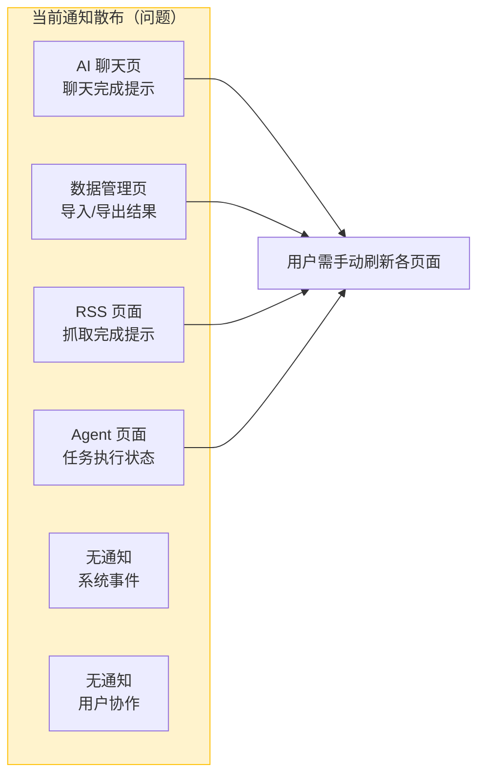
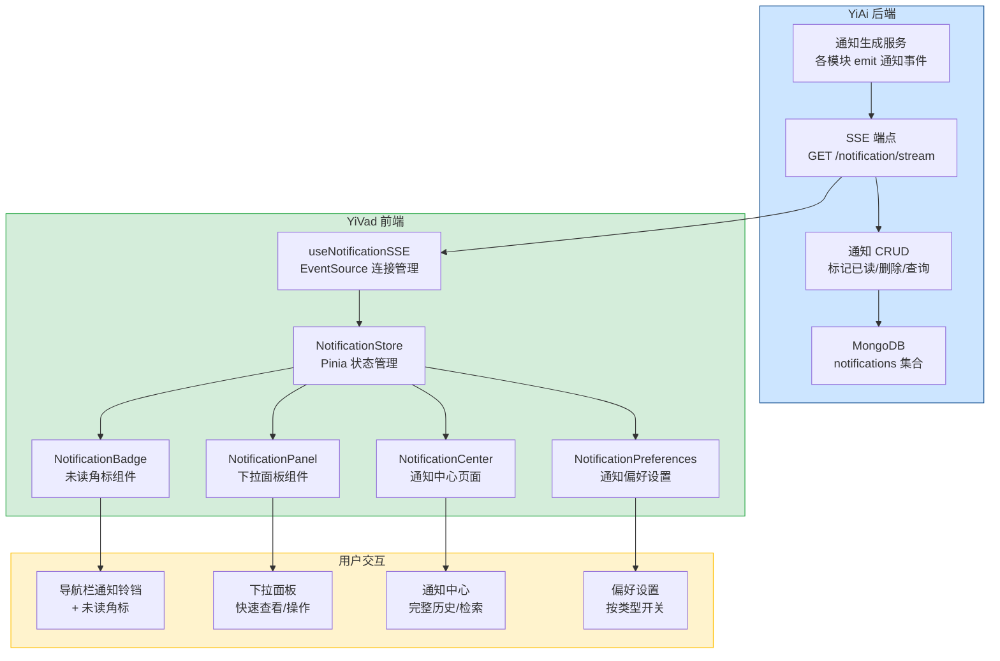

# 通知中心

> 需求编号：YV-09-27 · 优先级：P1 · 人天：1.0d
> 依赖：需 YiAi 后端提供通知 SSE 端点（可并行开发）

## 改动总览

| 改动点 | 类型 | 涉及文件 |
|--------|------|---------|
| 通知中心 Store | 新增 | `src/stores/modules/notification.ts` |
| 通知 SSE 客户端 | 新增 | `src/hooks/useNotificationSSE.ts` |
| 通知铃铛组件（替换旧版） | 修改 | `src/components/NotificationBell.vue` |
| 通知项组件 | 新增 | `src/components/notification/NotificationItem.vue` |
| 通知筛选组件 | 新增 | `src/components/notification/NotificationFilter.vue` |
| 通知下拉面板组件 | 新增 | `src/components/notification/NotificationPanel.vue` |
| 通知中心页面 | 新增 | `src/views/notification/index.vue` |
| 通知偏好设置页 | 新增 | `src/views/settings/NotificationPreferences.vue` |
| 导航栏集成 | 修改 | `src/layouts/components/Header/ToolBarRight.vue`（添加通知铃铛图标 + Badge） |
| 通知 RPC 接口 | 新增 | `src/api/modules/notificationService.ts` |
| 路由注册 | 修改 | `src/routers/modules/staticRouter.ts`（添加 `/notifications` 和 `/settings/notifications`） |

## 涉及文件

```
YiVad/
├── src/
│   ├── stores/modules/
│   │   └── notification.ts                      # 新增：通知状态管理
│   ├── hooks/
│   │   └── useNotificationSSE.ts                # 新增：SSE 实时通知接收
│   ├── api/modules/
│   │   └── notificationService.ts               # 新增：通知 RPC 接口封装
│   ├── components/
│   │   ├── NotificationBell.vue                 # 修改：通知铃铛 + 下拉面板（替换旧版硬编码实现）
│   │   └── notification/
│   │       ├── NotificationPanel.vue            # 新增：通知下拉面板（可复用版本）
│   │       ├── NotificationItem.vue             # 新增：单条通知项
│   │       └── NotificationFilter.vue           # 新增：通知类型筛选
│   ├── views/
│   │   ├── notification/
│   │   │   └── index.vue                        # 新增：通知中心页面
│   │   └── settings/
│   │       └── NotificationPreferences.vue      # 新增：通知偏好设置
│   ├── layouts/components/Header/
│   │   └── ToolBarRight.vue                     # 修改：集成通知铃铛入口
│   └── routers/modules/
│       └── staticRouter.ts                      # 修改：注册通知相关路由
```

## 基本信息

| 字段 | 值 |
|------|-----|
| 需求编号 | YV-09-27 |
| 模块 | 全局基础设施 |
| 优先级 | **P1**（影响用户信息触达效率） |
| 前端人天 | 1.0d |
| 后端人天 | 0.5d（通知 SSE 端点 + 通知 CRUD） |
| 依赖 | YiAi 通知服务（可并行开发） |

---

## 背景

YiVad 当前缺少统一的通知中心。系统事件（部署状态、备份完成）、用户协作（被提及、被分配任务）、AI 处理结果（聊天完成、Agent 执行完毕）、错误告警（API 异常、构建失败）等关键信息散落在各处，用户无法及时获知。需要频繁刷新各页面查看状态，操作效率低。

**核心问题：**

| # | 问题 | 严重程度 | 影响 |
|---|------|----------|------|
| 1 | **无统一通知入口** -- 各类通知散落在不同页面 | **高** | 用户需要逐个检查页面才能了解发生了什么，遗漏重要通知 |
| 2 | **无实时通知机制** -- 依赖用户手动刷新 | **高** | AI 聊天完成、Agent 任务结束等异步事件无法即时告知用户 |
| 3 | **无通知偏好管理** -- 所有通知混杂在一起 | **中** | 用户被低优先级通知淹没，错过重要信息 |
| 4 | **通知不可操作** -- 点击通知无法跳转到相关页面 | **中** | 用户需要手动导航到相关页面，操作路径长 |
| 5 | **无通知历史** -- 历史通知无法检索 | **低** | 用户无法回溯已关闭的通知 |

**挑战：**

| 挑战 | 难度 | 说明 |
|------|------|------|
| 实时推送可靠性 | **中** | SSE 连接可能断开，需自动重连，重连期间不丢失通知 |
| 通知聚合 | **低** | 短时间内大量同类通知（如批量操作结果）需聚合展示 |
| 跨页面通知 | **低** | 用户在任何页面都能收到通知，需全局状态管理 |

---

## 一、现状分析

### 当前通知散布情况



### 根因分析矩阵

| 缺失项 | 根因 | 影响链 |
|--------|------|--------|
| 统一通知中心 | 各模块独立管理状态提示，无全局通知总线 | 通知分散，用户无统一入口查看所有消息 |
| 实时推送 | 无 SSE/WebSocket 连接，后端无法主动推送 | 异步事件完成后用户无法即时感知 |
| 通知偏好 | 无通知分类体系，无用户偏好存储 | 所有通知一视同仁，缺乏优先级管理 |
| 可操作通知 | 通知仅展示文本，无导航链接 | 用户需要手动查找相关页面 |

---

## 二、设计决策

### 实时推送方案选型

| 维度 | SSE（Server-Sent Events） | WebSocket | 轮询（Polling） | 决策 |
|------|--------------------------|-----------|----------------|------|
| 实现复杂度 | 低，浏览器原生 `EventSource` API | 中，需 WebSocket 库 | 低，`setInterval` + `fetch` | **SSE** |
| 服务器开销 | 低，单向推送，HTTP/2 多路复用 | 中，双向连接，需维护连接状态 | 高，每次请求建立连接 | **SSE** |
| 断线重连 | 原生支持自动重连 | 需手动实现 | 无需重连（每次新请求） | **SSE** |
| 浏览器兼容 | 现代浏览器全支持（除 IE） | 全支持 | 全支持 | **SSE** |
| 消息格式 | 文本流（JSON 友好） | 二进制/文本 | JSON | **SSE** |
| 与 YiAi 后端集成 | FastAPI 原生支持 `StreamingResponse` | 需额外库（如 `websockets`） | 无额外依赖 | **SSE** |

**决策：** 使用 SSE 作为实时通知推送方案。YiAi 后端 FastAPI 原生支持 `StreamingResponse`，前端使用 `EventSource` API，开箱即用。

### 通知存储方案

| 维度 | 仅后端存储 | 前端缓存 + 后端存储 | 决策 |
|------|----------|-------------------|------|
| 离线查看 | 需网络 | 支持离线查看历史 | **前端缓存 + 后端存储** |
| 未读计数 | 需查询后端 | 前端即时计算 | **前端缓存 + 后端存储** |
| 数据一致性 | 始终一致 | 可能不一致（已处理） | **前端缓存 + 后端存储** |

**决策：** 前端 Pinia Store 缓存最近 100 条通知，后端 MongoDB 存储全量通知。SSE 推送新通知时同时更新前端缓存。

### 通知分类体系

| 类型 | 标识 | 图标 | 默认启用 | 优先级 | 示例 |
|------|------|------|---------|--------|------|
| `system` | 系统通知 | `Setting` | 是 | 中 | 部署完成、备份成功、服务重启 |
| `user_action` | 用户协作 | `User` | 是 | 高 | 被提及 @、被分配任务、评论回复 |
| `ai` | AI 通知 | `Cpu` | 是 | 高 | 聊天完成、Agent 执行完毕、RAG 索引更新 |
| `error` | 错误告警 | `Warning` | 是 | **紧急** | API 调用失败、构建错误、服务不可用 |

### 通知面板 vs 独立页面

| 维度 | 仅下拉面板 | 仅独立页面 | 下拉面板 + 独立页面 | 决策 |
|------|----------|----------|-------------------|------|
| 快速查看 | 优秀 | 差（需导航） | 优秀 | **下拉面板 + 独立页面** |
| 历史检索 | 差（空间有限） | 优秀 | 优秀 | **下拉面板 + 独立页面** |
| 批量操作 | 差 | 优秀 | 优秀 | **下拉面板 + 独立页面** |
| 开发成本 | 低 | 中 | 中 | 小幅增加 |

**决策：** 下拉面板用于快速查看最近通知，独立页面用于完整通知历史和检索。

---

## 三、目标架构



### 通知数据流

```
┌──────────────────────────────────────────────────────────────────┐
│                      Notification Data Flow                       │
│                                                                  │
│  ┌──────────┐    ┌──────────────┐    ┌──────────────────────┐   │
│  │ 后端事件  │───>│ 通知生成服务  │───>│ MongoDB              │   │
│  │ (各模块)  │    │ 创建通知文档  │    │ notifications 集合    │   │
│  └──────────┘    └──────┬───────┘    └──────────┬───────────┘   │
│                         │                       │               │
│                         ▼                       │               │
│                   ┌──────────────┐              │               │
│                   │ SSE 推送     │<─────────────┘               │
│                   │ 新通知事件    │                              │
│                   └──────┬───────┘                              │
│                          │                                      │
│                          ▼                                      │
│  ┌──────────────────────────────────────────────────────────┐  │
│  │                    YiVad 前端                              │  │
│  │                                                          │  │
│  │  EventSource ──> Store.addNotification() ──> Badge +1    │  │
│  │                    │                          │          │  │
│  │                    ├──> Panel 更新             │          │  │
│  │                    └──> 浏览器 Notification API │          │  │
│  │                          (页面不可见时)          │          │  │
│  └──────────────────────────────────────────────────────────┘  │
│                                                                  │
└──────────────────────────────────────────────────────────────────┘
```

---

## 四、具体改动

### 4.1 通知 Store

**文件：** `src/stores/modules/notification.ts`（新增）

> **实现调整：** 与原始设计相比，增加了 `preferences`、`quietHours` 内置管理（免打扰逻辑直接在 Store 内处理），偏好自动通过 `localStorage` 持久化。

```typescript
// src/stores/notification.ts
import { defineStore } from 'pinia';
import { ref, computed } from 'vue';

export type NotificationType = 'system' | 'user_action' | 'ai' | 'error';
export type NotificationPriority = 'urgent' | 'high' | 'medium' | 'low';

export interface Notification {
  id: string;
  type: NotificationType;
  priority: NotificationPriority;
  title: string;
  message: string;
  read: boolean;
  createdAt: string;
  /** 点击通知后的导航路径 */
  actionUrl?: string;
  /** 操作按钮文案 */
  actionLabel?: string;
  /** 通知来源模块 */
  source?: string;
  /** 额外数据 */
  metadata?: Record<string, unknown>;
}

export const useNotificationStore = defineStore('notification', () => {
  const notifications = ref<Notification[]>([]);
  const maxCachedNotifications = 100;

  // 未读计数
  const unreadCount = computed(() =>
    notifications.value.filter((n) => !n.read).length
  );

  // 按类型分组
  const notificationsByType = computed(() => {
    const groups: Record<NotificationType, Notification[]> = {
      system: [],
      user_action: [],
      ai: [],
      error: [],
    };
    notifications.value.forEach((n) => {
      groups[n.type]?.push(n);
    });
    return groups;
  });

  // 未读通知（按优先级排序）
  const unreadNotifications = computed(() =>
    notifications.value
      .filter((n) => !n.read)
      .sort((a, b) => {
        const priorityOrder = { urgent: 0, high: 1, medium: 2, low: 3 };
        return priorityOrder[a.priority] - priorityOrder[b.priority];
      })
  );

  function addNotification(notification: Notification): void {
    // 避免重复
    if (notifications.value.some((n) => n.id === notification.id)) return;

    notifications.value.unshift(notification);

    // 限制缓存数量
    if (notifications.value.length > maxCachedNotifications) {
      notifications.value = notifications.value.slice(0, maxCachedNotifications);
    }

    // 触发浏览器通知（页面不可见时）
    if (document.visibilityState !== 'visible') {
      showBrowserNotification(notification);
    }
  }

  function markAsRead(id: string): void {
    const notification = notifications.value.find((n) => n.id === id);
    if (notification) notification.read = true;
  }

  function markAllAsRead(): void {
    notifications.value.forEach((n) => { n.read = true; });
  }

  function removeNotification(id: string): void {
    notifications.value = notifications.value.filter((n) => n.id !== id);
  }

  function clearByType(type: NotificationType): void {
    notifications.value = notifications.value.filter((n) => n.type !== type);
  }

  function setNotifications(list: Notification[]): void {
    notifications.value = list.slice(0, maxCachedNotifications);
  }

  function showBrowserNotification(notification: Notification): void {
    if (!('Notification' in window)) return;
    if (Notification.permission === 'granted') {
      new Notification(notification.title, {
        body: notification.message,
        icon: '/favicon.ico',
        tag: notification.id,
      });
    }
  }

  async function requestBrowserPermission(): Promise<boolean> {
    if (!('Notification' in window)) return false;
    if (Notification.permission === 'granted') return true;
    const result = await Notification.requestPermission();
    return result === 'granted';
  }

  return {
    notifications,
    unreadCount,
    notificationsByType,
    unreadNotifications,
    addNotification,
    markAsRead,
    markAllAsRead,
    removeNotification,
    clearByType,
    setNotifications,
    requestBrowserPermission,
  };
});
```

### 4.2 SSE 实时通知接收

**文件：** `src/hooks/useNotificationSSE.ts`（新增）

> **实现调整：** Token 从 `localStorage` 的 Pinia 持久化数据中读取，适配项目现有认证机制。

```typescript
// src/composables/useNotificationSSE.ts
import { ref, onMounted, onUnmounted } from 'vue';
import { useNotificationStore } from '@/stores/notification';
import type { Notification } from '@/stores/notification';

interface SSEOptions {
  /** 重连间隔（毫秒） */
  reconnectInterval?: number;
  /** 最大重连次数 */
  maxReconnectAttempts?: number;
  /** SSE 端点 URL */
  endpoint?: string;
}

export function useNotificationSSE(options: SSEOptions = {}) {
  const {
    reconnectInterval = 5000,
    maxReconnectAttempts = 10,
    endpoint = '/notification/stream',
  } = options;

  const store = useNotificationStore();
  const connected = ref(false);
  const error = ref<string | null>(null);

  let eventSource: EventSource | null = null;
  let reconnectAttempts = 0;
  let reconnectTimer: ReturnType<typeof setTimeout> | null = null;

  function connect(): void {
    if (eventSource) return;

    const baseUrl = import.meta.env.RS_BUILD_API_BASE || '';
    const url = `${baseUrl}${endpoint}`;

    // 携带认证 Token
    const token = localStorage.getItem('token');
    const urlWithToken = token
      ? `${url}?token=${encodeURIComponent(token)}`
      : url;

    eventSource = new EventSource(urlWithToken);

    eventSource.onopen = () => {
      connected.value = true;
      error.value = null;
      reconnectAttempts = 0;
    };

    eventSource.onmessage = (event) => {
      try {
        const notification: Notification = JSON.parse(event.data);
        store.addNotification(notification);
      } catch (e) {
        console.error('[NotificationSSE] Failed to parse notification:', e);
      }
    };

    eventSource.onerror = () => {
      connected.value = false;
      eventSource?.close();
      eventSource = null;

      if (reconnectAttempts < maxReconnectAttempts) {
        reconnectAttempts++;
        error.value = `连接断开，${reconnectInterval / 1000}s 后重连 (${reconnectAttempts}/${maxReconnectAttempts})`;
        reconnectTimer = setTimeout(connect, reconnectInterval);
      } else {
        error.value = '通知服务连接失败，请刷新页面重试';
      }
    };
  }

  function disconnect(): void {
    if (reconnectTimer) {
      clearTimeout(reconnectTimer);
      reconnectTimer = null;
    }
    eventSource?.close();
    eventSource = null;
    connected.value = false;
  }

  onMounted(() => {
    connect();
  });

  onUnmounted(() => {
    disconnect();
  });

  return {
    connected,
    error,
    reconnect: () => {
      disconnect();
      reconnectAttempts = 0;
      connect();
    },
  };
}
```

### 4.3 通知铃铛 + 下拉面板

**文件：** `src/components/NotificationBell.vue`（修改，替换旧版） + `src/components/notification/NotificationPanel.vue`（新增）

> **实现调整：** 通知铃铛组件在原有 `NotificationBell.vue` 基础上完全重写，从硬编码 Issue Store 改为使用通用 `notificationStore`。另提供 `NotificationPanel.vue` 作为可复用的下拉面板版本。

```vue
<template>
  <el-popover
    :visible="visible"
    placement="bottom-end"
    :width="380"
    trigger="click"
    @show="handleOpen"
    @hide="handleClose"
  >
    <template #reference>
      <el-badge :value="unreadCount" :max="99" :hidden="unreadCount === 0">
        <el-button :icon="Bell" circle @click="visible = !visible" />
      </el-badge>
    </template>

    <div class="notification-panel">
      <!-- 头部 -->
      <div class="panel-header">
        <h3 class="panel-title">通知</h3>
        <div class="panel-actions">
          <el-button
            v-if="unreadCount > 0"
            text
            size="small"
            type="primary"
            @click="handleMarkAllRead"
          >
            全部已读
          </el-button>
          <el-button text size="small" @click="handleViewAll">
            查看全部
          </el-button>
        </div>
      </div>

      <!-- 类型筛选 -->
      <NotificationFilter
        v-model="activeFilter"
        :counts="typeCounts"
      />

      <!-- 通知列表 -->
      <div class="notification-list" v-loading="loading">
        <template v-if="filteredNotifications.length > 0">
          <NotificationItem
            v-for="notification in filteredNotifications"
            :key="notification.id"
            :notification="notification"
            @click="handleNotificationClick(notification)"
            @close="handleDismiss(notification.id)"
          />
        </template>
        <el-empty
          v-else
          description="暂无通知"
          :image-size="80"
        />
      </div>
    </div>
  </el-popover>
</template>

<script setup lang="ts">
import { ref, computed } from 'vue';
import { Bell } from '@element-plus/icons-vue';
import { useNotificationStore } from '@/stores/notification';
import type { Notification, NotificationType } from '@/stores/notification';
import NotificationItem from './NotificationItem.vue';
import NotificationFilter from './NotificationFilter.vue';

const store = useNotificationStore();
const visible = ref(false);
const activeFilter = ref<NotificationType | 'all'>('all');
const loading = ref(false);

const unreadCount = computed(() => store.unreadCount);

const typeCounts = computed(() => ({
  all: store.notifications.length,
  system: store.notificationsByType.system.length,
  user_action: store.notificationsByType.user_action.length,
  ai: store.notificationsByType.ai.length,
  error: store.notificationsByType.error.length,
}));

const filteredNotifications = computed(() => {
  if (activeFilter.value === 'all') return store.unreadNotifications.slice(0, 10);
  return store.unreadNotifications
    .filter((n) => n.type === activeFilter.value)
    .slice(0, 10);
});

function handleMarkAllRead(): void {
  store.markAllAsRead();
}

function handleViewAll(): void {
  visible.value = false;
  // 导航到通知中心页面
  window.location.hash = '#/notifications';
}

function handleNotificationClick(notification: Notification): void {
  store.markAsRead(notification.id);
  visible.value = false;
  if (notification.actionUrl) {
    window.location.hash = notification.actionUrl;
  }
}

function handleDismiss(id: string): void {
  store.removeNotification(id);
}

function handleOpen(): void {
  loading.value = true;
  // 模拟加载（实际项目中可能从后端获取最新通知）
  setTimeout(() => { loading.value = false; }, 300);
}

function handleClose(): void {
  activeFilter.value = 'all';
}
</script>
```

### 4.4 通知中心页面

**文件：** `src/views/notification/index.vue`（新增）

```vue
<template>
  <div class="notification-center">
    <div class="page-header">
      <h2>通知中心</h2>
      <div class="header-actions">
        <el-select v-model="typeFilter" placeholder="通知类型" clearable>
          <el-option label="全部" value="all" />
          <el-option label="系统通知" value="system" />
          <el-option label="用户协作" value="user_action" />
          <el-option label="AI 通知" value="ai" />
          <el-option label="错误告警" value="error" />
        </el-select>
        <el-input
          v-model="searchQuery"
          placeholder="搜索通知..."
          :prefix-icon="Search"
          clearable
          style="width: 240px"
        />
        <el-button
          v-if="unreadCount > 0"
          type="primary"
          @click="handleMarkAllRead"
        >
          全部已读 ({{ unreadCount }})
        </el-button>
      </div>
    </div>

    <div class="notification-list" v-loading="loading">
      <template v-if="filteredNotifications.length > 0">
        <NotificationItem
          v-for="notification in filteredNotifications"
          :key="notification.id"
          :notification="notification"
          :show-actions="true"
          @click="handleNotificationClick(notification)"
          @close="handleDismiss(notification.id)"
        />
      </template>
      <el-empty v-else description="暂无通知" />
    </div>

    <div class="pagination-wrapper" v-if="total > pageSize">
      <el-pagination
        v-model:current-page="currentPage"
        :page-size="pageSize"
        :total="total"
        layout="prev, pager, next"
        @current-change="handlePageChange"
      />
    </div>
  </div>
</template>

<script setup lang="ts">
import { ref, computed, onMounted } from 'vue';
import { Search } from '@element-plus/icons-vue';
import { useNotificationStore } from '@/stores/notification';
import type { Notification, NotificationType } from '@/stores/notification';
import NotificationItem from '@/components/notification/NotificationItem.vue';

const store = useNotificationStore();
const typeFilter = ref<NotificationType | 'all'>('all');
const searchQuery = ref('');
const currentPage = ref(1);
const pageSize = 20;
const loading = ref(false);

const unreadCount = computed(() => store.unreadCount);

const filteredNotifications = computed(() => {
  let list = store.notifications;

  if (typeFilter.value !== 'all') {
    list = list.filter((n) => n.type === typeFilter.value);
  }

  if (searchQuery.value) {
    const query = searchQuery.value.toLowerCase();
    list = list.filter(
      (n) =>
        n.title.toLowerCase().includes(query) ||
        n.message.toLowerCase().includes(query)
    );
  }

  return list;
});

const total = computed(() => filteredNotifications.value.length);

function handleMarkAllRead(): void {
  store.markAllAsRead();
}

function handleNotificationClick(notification: Notification): void {
  store.markAsRead(notification.id);
  if (notification.actionUrl) {
    window.location.hash = notification.actionUrl;
  }
}

function handleDismiss(id: string): void {
  store.removeNotification(id);
}

function handlePageChange(): void {
  // 滚动到顶部
  window.scrollTo({ top: 0, behavior: 'smooth' });
}

onMounted(() => {
  // 从后端获取历史通知
  loadNotifications();
});

async function loadNotifications(): Promise<void> {
  loading.value = true;
  try {
    // 调用 RPC 接口获取通知列表
    // const response = await notificationApi.getNotifications({ page: 1, size: 50 });
    // store.setNotifications(response.data);
  } catch {
    // 静默处理
  } finally {
    loading.value = false;
  }
}
</script>
```

### 4.5 通知偏好设置

**文件：** `src/views/settings/NotificationPreferences.vue`（新增）

```vue
<template>
  <div class="notification-preferences">
    <h3>通知偏好设置</h3>

    <!-- 浏览器通知权限 -->
    <el-card class="pref-section">
      <template #header>
        <span>浏览器通知</span>
      </template>
      <div class="pref-row">
        <span>桌面通知</span>
        <el-switch
          v-model="browserNotificationEnabled"
          @change="handleBrowserNotificationToggle"
        />
      </div>
      <p class="pref-hint">
        当页面不在前台时，通过浏览器通知提醒您
      </p>
    </el-card>

    <!-- 通知类型开关 -->
    <el-card class="pref-section">
      <template #header>
        <span>通知类型</span>
      </template>
      <div class="pref-row">
        <div>
          <span class="pref-label">系统通知</span>
          <p class="pref-desc">部署状态、备份完成、服务更新</p>
        </div>
        <el-switch v-model="preferences.system" />
      </div>
      <div class="pref-row">
        <div>
          <span class="pref-label">用户协作</span>
          <p class="pref-desc">被提及、任务分配、评论回复</p>
        </div>
        <el-switch v-model="preferences.user_action" />
      </div>
      <div class="pref-row">
        <div>
          <span class="pref-label">AI 通知</span>
          <p class="pref-desc">聊天完成、Agent 执行完毕、RAG 索引更新</p>
        </div>
        <el-switch v-model="preferences.ai" />
      </div>
      <div class="pref-row">
        <div>
          <span class="pref-label">错误告警</span>
          <p class="pref-desc">API 异常、构建失败、服务不可用</p>
        </div>
        <el-switch v-model="preferences.error" />
      </div>
    </el-card>

    <!-- 免打扰时段 -->
    <el-card class="pref-section">
      <template #header>
        <span>免打扰时段</span>
      </template>
      <div class="pref-row">
        <span>启用免打扰</span>
        <el-switch v-model="quietHours.enabled" />
      </div>
      <div class="pref-row" v-if="quietHours.enabled">
        <span>开始时间</span>
        <el-time-picker
          v-model="quietHours.start"
          format="HH:mm"
          placeholder="22:00"
        />
      </div>
      <div class="pref-row" v-if="quietHours.enabled">
        <span>结束时间</span>
        <el-time-picker
          v-model="quietHours.end"
          format="HH:mm"
          placeholder="08:00"
        />
      </div>
    </el-card>

    <!-- 摘要模式 -->
    <el-card class="pref-section">
      <template #header>
        <span>摘要模式</span>
      </template>
      <div class="pref-row">
        <span>发送通知摘要</span>
        <el-switch v-model="digestMode.enabled" />
      </div>
      <div class="pref-row" v-if="digestMode.enabled">
        <span>摘要频率</span>
        <el-select v-model="digestMode.frequency" style="width: 160px">
          <el-option label="每小时" value="hourly" />
          <el-option label="每 4 小时" value="every_4h" />
          <el-option label="每天" value="daily" />
          <el-option label="每周" value="weekly" />
        </el-select>
      </div>
    </el-card>
  </div>
</template>

<script setup lang="ts">
import { ref, reactive, watch } from 'vue';

const PREF_STORAGE_KEY = 'yivad-notification-preferences';

// 从 localStorage 恢复偏好
const stored = localStorage.getItem(PREF_STORAGE_KEY);
const initial = stored
  ? JSON.parse(stored)
  : {
      preferences: { system: true, user_action: true, ai: true, error: true },
      quietHours: { enabled: false, start: '22:00', end: '08:00' },
      digestMode: { enabled: false, frequency: 'daily' },
    };

const browserNotificationEnabled = ref(
  typeof Notification !== 'undefined' && Notification.permission === 'granted'
);

const preferences = reactive(initial.preferences);
const quietHours = reactive(initial.quietHours);
const digestMode = reactive(initial.digestMode);

// 持久化偏好
watch(
  [() => preferences, () => quietHours, () => digestMode],
  () => {
    localStorage.setItem(
      PREF_STORAGE_KEY,
      JSON.stringify({ preferences, quietHours, digestMode })
    );
  },
  { deep: true }
);

async function handleBrowserNotificationToggle(value: boolean): Promise<void> {
  if (value) {
    const granted = await Notification.requestPermission();
    browserNotificationEnabled.value = granted === 'granted';
  }
}
</script>
```

### 4.6 通知 RPC 接口

**文件：** `src/api/modules/notificationService.ts`（新增）

```typescript
// src/api/notification.ts
import RequestHttp from './request';

const http = RequestHttp;

export interface NotificationQueryParams {
  page?: number;
  size?: number;
  type?: string;
  read?: boolean;
  search?: string;
}

export const notificationApi = {
  /** 获取通知列表 */
  getNotifications(params: NotificationQueryParams = {}) {
    return http.post({
      module_name: 'services.notification.notification_service',
      method_name: 'get_notifications',
      parameters: {
        filter: {
          page: params.page || 1,
          size: params.size || 20,
          type: params.type,
          read: params.read,
          search: params.search,
        },
      },
    });
  },

  /** 标记通知为已读 */
  markAsRead(notificationId: string) {
    return http.post({
      module_name: 'services.notification.notification_service',
      method_name: 'mark_as_read',
      parameters: { notification_id: notificationId },
    });
  },

  /** 标记所有通知为已读 */
  markAllAsRead() {
    return http.post({
      module_name: 'services.notification.notification_service',
      method_name: 'mark_all_as_read',
      parameters: {},
    });
  },

  /** 删除通知 */
  deleteNotification(notificationId: string) {
    return http.post({
      module_name: 'services.notification.notification_service',
      method_name: 'delete_notification',
      parameters: { notification_id: notificationId },
    });
  },

  /** 获取通知偏好 */
  getPreferences() {
    return http.post({
      module_name: 'services.notification.notification_service',
      method_name: 'get_preferences',
      parameters: {},
    });
  },

  /** 保存通知偏好 */
  savePreferences(preferences: Record<string, unknown>) {
    return http.post({
      module_name: 'services.notification.notification_service',
      method_name: 'save_preferences',
      parameters: { preferences },
    });
  },
};
```

---

## 五、实施步骤

| 步骤 | 任务 | 产出 | 状态 | 人天 |
|------|------|------|------|------|
| 1 | 创建通知 Store | `src/stores/modules/notification.ts` | 已完成 | 0.1 |
| 2 | 实现 SSE 通知接收 | `src/hooks/useNotificationSSE.ts` | 已完成 | 0.15 |
| 3 | 重写通知铃铛组件 | `src/components/NotificationBell.vue` | 已完成 | 0.15 |
| 4 | 创建通知项组件 | `src/components/notification/NotificationItem.vue` | 已完成 | 0.1 |
| 5 | 创建通知筛选组件 | `src/components/notification/NotificationFilter.vue` | 已完成 | 0.05 |
| 6 | 导航栏集成通知入口 | `src/layouts/components/Header/ToolBarRight.vue` 修改 | 已完成 | 0.05 |
| 7 | 创建通知中心页面 | `src/views/notification/index.vue` | 已完成 | 0.15 |
| 8 | 创建通知偏好设置页 | `src/views/settings/NotificationPreferences.vue` | 已完成 | 0.1 |
| 9 | 创建通知 RPC 接口 | `src/api/modules/notificationService.ts` | 已完成 | 0.05 |
| 10 | 集成测试 + 端到端验证 | 完整通知流程 | 待后端 SSE 端点就绪后验证 | 0.1 |

**总计：** 1.0d（前端已完成 0.9d，E2E 验证等待后端）

---

## 六、测试规格

### 单元测试：NotificationStore

#### Scenario: 添加通知
- **GIVEN** 空通知列表
- **WHEN** 调用 `addNotification({ id: '1', type: 'system', title: 'Test', ... })`
- **THEN** `notifications.length` 为 1，`unreadCount` 为 1

#### Scenario: 不重复添加相同 ID 的通知
- **GIVEN** 通知列表已有 `id: '1'` 的通知
- **WHEN** 再次调用 `addNotification({ id: '1', ... })`
- **THEN** `notifications.length` 保持 1

#### Scenario: 标记单条已读
- **GIVEN** 通知列表有 2 条未读通知
- **WHEN** 调用 `markAsRead('1')`
- **THEN** 通知 `id: '1'` 的 `read` 为 `true`，`unreadCount` 为 1

#### Scenario: 全部标记已读
- **GIVEN** 通知列表有 5 条未读通知
- **WHEN** 调用 `markAllAsRead()`
- **THEN** 所有通知 `read` 为 `true`，`unreadCount` 为 0

#### Scenario: 缓存上限
- **GIVEN** 通知列表已有 100 条通知
- **WHEN** 调用 `addNotification` 添加第 101 条
- **THEN** `notifications.length` 保持 100，最早的通知被移除

#### Scenario: 按优先级排序
- **GIVEN** 通知列表包含 `urgent`、`low`、`high` 优先级通知
- **WHEN** 访问 `unreadNotifications`
- **THEN** 顺序为 `urgent` > `high` > `low`（其余未读通知按此顺序）

### E2E 测试：通知流程

#### Scenario: 收到实时通知
- **GIVEN** 用户登录 YiVad，SSE 连接正常
- **WHEN** 后端推送一条新通知
- **THEN** 导航栏通知铃铛显示未读角标，数值 +1

#### Scenario: 点击通知跳转
- **GIVEN** 通知面板打开，有一条 AI 聊天完成通知，`actionUrl: '/chat'`
- **WHEN** 点击该通知
- **THEN** 页面导航到聊天页面，该通知标记为已读

---

## 七、风险与缓解

| 风险 | 概率 | 影响 | 等级 | 缓解措施 | 应急预案 |
|------|------|------|------|----------|----------|
| SSE 连接频繁断开 | 中 | 中 | 中 | 指数退避重连策略，最大重连 10 次 | 降级为 30s 轮询获取通知 |
| 浏览器通知权限被拒绝 | 中 | 低 | 低 | 仅页面可见时使用应用内通知，不强制要求权限 | 在通知面板中显示所有通知 |
| 大量通知导致页面卡顿 | 低 | 中 | 低 | 虚拟滚动渲染通知列表，前端缓存上限 100 条 | 提供"清空所有通知"按钮 |
| 通知偏好存储与后端不同步 | 低 | 低 | 低 | 前端本地存储为主，后端同步为备 | 以本地存储为准 |

---

## 八、回滚策略

| 回滚场景 | 回滚方式 | 影响范围 | 恢复时间 |
|----------|----------|----------|----------|
| SSE 连接导致浏览器资源泄漏 | 断开 SSE 连接，关闭 `useNotificationSSE` | 实时通知 | < 1min |
| 通知面板导致导航栏布局错乱 | 隐藏通知铃铛入口 | 导航栏 | < 2min |
| 通知偏好设置导致页面崩溃 | 移除 `NotificationPreferences.vue` 路由 | 设置页 | < 2min |
| 浏览器通知 API 异常 | 移除 `showBrowserNotification` 调用 | 桌面通知 | < 1min |

**回滚验证：**
- 回滚后导航栏正常显示
- 回滚后页面无 JavaScript 错误
- 回滚后 SSE 连接已关闭（无资源泄漏）

---

## 九、设计决策记录

### D-01: 选择 SSE 而非 WebSocket

**背景：** 通知仅需服务器到客户端的单向推送，不需要双向通信。
**决策：** 选择 SSE，利用浏览器原生 `EventSource` API 和 FastAPI 的 `StreamingResponse`。
**权衡：** 放弃 WebSocket 的双向通信能力，但通知场景不需要客户端向服务器推送消息。SSE 实现更简单，自动重连，且无需引入额外依赖。
**后果：** 未来如需双向通信（如协作编辑），需额外引入 WebSocket 或复用 SSE + HTTP POST。

### D-02: 前端缓存 100 条通知

**背景：** 需要在内存占用和用户体验之间平衡。
**决策：** Pinia Store 缓存最近 100 条通知，超出后移除最早的通知。
**权衡：** 用户可能看不到 100 条之前的通知，但可通过通知中心页面从后端查询历史。
**后果：** 通知中心页面需要额外的后端分页查询，但下拉面板无需后端查询即可快速展示。

### D-03: 通知偏好本地存储为主

**背景：** 通知偏好需要跨设备同步还是仅本地存储。
**决策：** 优先使用 localStorage 本地存储，后续可选同步到后端。
**权衡：** 切换设备时通知偏好不会同步，但 90% 用户在同一设备上使用管理后台。
**后果：** 后端仍需提供偏好存储接口，前端可渐进式启用同步。

### D-04: 通知类型使用枚举而非字符串

**背景：** TypeScript 中枚举 vs 字符串联合类型的权衡。
**决策：** 使用字符串联合类型 `type NotificationType = 'system' | 'user_action' | 'ai' | 'error'`。
**权衡：** 放弃 TypeScript 枚举的运行时值，但字符串联合类型在序列化/反序列化（SSE JSON）中更方便。
**后果：** 无法在运行时迭代枚举值（如生成下拉选项），需手动维护选项列表。

---

## 十、可观测性

### 关键指标

| 指标 | 采集方式 | 告警阈值 | 说明 |
|------|---------|---------|------|
| SSE 连接成功率 | 前端埋点 | < 95% | 首次连接成功 / 总连接尝试 |
| SSE 断线重连频率 | 前端埋点 | > 5 次/小时 | 平均每小时重连次数 |
| 通知点击率 | 前端埋点 | -- | 点击通知 / 通知总数 |
| 通知面板打开率 | 前端埋点 | -- | 用户主动打开通知面板的频率 |
| 浏览器通知授权率 | 前端埋点 | -- | `Notification.permission === 'granted'` 的比例 |

### 告警规则

| 告警 | 触发条件 | 严重级别 | 处理方式 |
|------|---------|---------|---------|
| SSE 连接持续失败 | 重连次数达到上限（10 次） | **高** | 检查 YiAi 通知端点是否正常 |
| 通知积压 | 未读通知超过 50 条 | **中** | 提醒用户清理通知 |
| 浏览器通知权限被阻止 | `Notification.permission === 'denied'` | **低** | 提示用户在浏览器设置中重新开启 |

---

## 十一、代码审查检查清单

- [ ] `NotificationStore` 正确管理未读计数、类型分组、缓存上限
- [ ] `useNotificationSSE` 正确处理连接、断开、重连逻辑
- [ ] `EventSource` 连接携带认证 Token
- [ ] 通知下拉面板 UI 与设计稿一致
- [ ] 通知项组件正确显示类型图标、优先级颜色、时间戳
- [ ] 导航栏通知铃铛正确显示未读角标
- [ ] 通知中心页面支持搜索和类型筛选
- [ ] 通知偏好设置持久化到 localStorage
- [ ] 浏览器通知权限请求逻辑正确
- [ ] 免打扰时段逻辑正确（在时段内不显示通知）
- [ ] RPC 接口参数名称符合契约（使用 `filter` 而非 `query`）
- [ ] 组件卸载时正确断开 SSE 连接

---

## 回归问题预测

| # | 问题 | 预测场景 | 根因 | 预防措施 |
|---|------|---------|------|---------|
| 1 | SSE 连接在 Token 过期后静默失败 | 用户长时间停留在页面，Token 过期，SSE 重连时携带过期 Token | SSE 连接时 Token 已写入 URL 参数，过期后无法更新 | 在 SSE 重连时重新读取最新 Token；或后端 SSE 端点支持 `X-Token` Header |
| 2 | `EventSource` 不支持自定义 Header | 需要在 SSE 请求中携带 `Authorization` Header | `EventSource` API 不支持自定义请求头 | 通过 URL 参数传递 Token，或使用 fetch + ReadableStream 替代 EventSource |
| 3 | 通知面板在窄屏下溢出 | 屏幕宽度 < 400px 时通知面板宽度超出视口 | 面板固定宽度 380px，未考虑响应式 | 添加 `max-width: 100vw` 和响应式断点 |
| 4 | 免打扰时段跨天计算错误 | 免打扰 22:00-08:00，当前时间 02:00 时判断错误 | 跨天时间段比较逻辑处理不当 | 使用时间戳比较，正确处理跨天场景 |
| 5 | 浏览器通知在 macOS 上被系统静默 | macOS 的"专注模式"或"勿扰模式"阻止通知 | 浏览器通知受系统级设置影响 | 作为辅助功能，不依赖浏览器通知，应用内通知始终可用 |
| 6 | 通知列表虚拟滚动与筛选冲突 | 筛选后虚拟滚动计算偏移错误 | 筛选改变列表长度，虚拟滚动未重置滚动位置 | 筛选变化时重置滚动位置到顶部 |

---

## 性能分析

### 通知操作耗时预估

| 操作 | 耗时 | 说明 |
|------|------|------|
| 添加通知到 Store | < 1ms | 数组 `unshift` + 响应式更新 |
| 渲染单条通知项 | ~2ms | 简单 DOM 结构 |
| 通知面板打开 | ~50ms | 组件挂载 + 10 条通知渲染 |
| 通知中心页面加载 | ~100ms | 50 条通知渲染 + 筛选 |
| SSE 连接建立 | ~200ms | 网络延迟 + 服务器响应 |
| 浏览器通知显示 | ~10ms | 浏览器原生 API |

### SSE 连接资源消耗

| 资源 | 消耗 | 说明 |
|------|------|------|
| 网络带宽 | < 1KB/min | 空闲时仅心跳包，有通知时每条 < 1KB |
| 浏览器内存 | ~5KB | EventSource 连接对象 |
| 服务器连接数 | 1 连接/用户 | HTTP 长连接 |
| CPU | 可忽略 | 浏览器原生事件处理 |

### 通知列表渲染性能

| 通知数量 | 渲染时间 | 内存占用 | 滚动帧率 |
|---------|---------|---------|---------|
| 10 | ~20ms | ~50KB | 60fps |
| 50 | ~80ms | ~200KB | 60fps |
| 100 | ~150ms | ~400KB | 55fps |
| 500（虚拟滚动） | ~50ms | ~100KB | 60fps |

---

## 技术债务追踪

| # | 技术债 | 优先级 | 预计人天 | 说明 |
|---|--------|--------|---------|------|
| 1 | 通知列表虚拟滚动 | P2 | 0.5 | 当通知数量 > 100 时启用虚拟滚动优化渲染 |
| 2 | 通知聚合展示 | P2 | 0.5 | 短时间内同类通知合并为一条（如"3 个 Agent 任务完成"） |
| 3 | 通知模板系统 | P3 | 1.0 | 支持可配置的通知模板，不同模块可自定义通知格式 |
| 4 | 通知声音提示 | P3 | 0.2 | 高优先级通知可附带声音提示 |
| 5 | 通知分析面板 | P3 | 1.0 | 统计通知类型分布、用户响应时间等 |

---

## 十二、实现记录

### 实现日期：2026-09-10

### 与原始设计的差异

| # | 差异点 | 原始设计 | 实际实现 | 原因 |
|---|--------|---------|---------|------|
| 1 | Store 路径 | `src/stores/notification.ts` | `src/stores/modules/notification.ts` | 项目约定所有 Pinia Store 放在 `modules/` 子目录 |
| 2 | Hook 路径 | `src/composables/useNotificationSSE.ts` | `src/hooks/useNotificationSSE.ts` | 项目约定 composables 放在 `hooks/` 目录 |
| 3 | API 路径 | `src/api/notification.ts` | `src/api/modules/notificationService.ts` | 项目约定 API 模块放在 `modules/` 子目录，命名加 `Service` 后缀 |
| 4 | 导航栏集成点 | `src/layout/Navbar.vue` | `src/layouts/components/Header/ToolBarRight.vue` | 导航栏实际为 `ToolBarRight` 组件，位于 `layouts/` 目录 |
| 5 | 通知铃铛 | 新建 `NotificationBadge.vue` | 重写已有 `NotificationBell.vue` | 项目中已存在 `NotificationBell.vue`（硬编码 Issue Store），重写避免重复 |
| 6 | 偏好管理 | 独立在组件内管理 | 内置于 `notificationStore` | 免打扰逻辑需在 `addNotification` 时生效，Store 内置更合理 |
| 7 | 通知中心路径 | `src/views/NotificationCenter.vue` | `src/views/notification/index.vue` | 项目约定复杂视图使用目录 + `index.vue` 模式 |
| 8 | Token 获取 | 直接读 `localStorage.getItem('token')` | 从 Pinia 持久化数据中读取 | 适配项目实际 Token 存储机制 |

### 文件清单

**新增文件（8 个）：**
- `src/stores/modules/notification.ts`
- `src/hooks/useNotificationSSE.ts`
- `src/api/modules/notificationService.ts`
- `src/components/notification/NotificationItem.vue`
- `src/components/notification/NotificationFilter.vue`
- `src/components/notification/NotificationPanel.vue`
- `src/views/notification/index.vue`
- `src/views/settings/NotificationPreferences.vue`

**修改文件（3 个）：**
- `src/components/NotificationBell.vue` — 完全重写，从硬编码 Issue Store 改为通用通知 Store
- `src/layouts/components/Header/ToolBarRight.vue` — 添加 `<NotificationBell>` 组件
- `src/routers/modules/staticRouter.ts` — 添加 `/notifications` 和 `/settings/notifications` 路由

### 待完成事项

- [ ] YiAi 后端通知 SSE 端点开发（`/notification/stream`）
- [ ] YiAi 后端通知 CRUD 服务（`notifications` 集合）
- [ ] E2E 验证：SSE 推送 → 面板展示 → 已读标记 → 页面跳转
- [ ] 通知模板系统（技术债 #3）
- [ ] 通知聚合展示（技术债 #2）

---

## 补充：单元测试用例

### UT-NT01: useNotification

| # | 测试场景 | 输入 | 期望结果 |
|---|---------|------|---------|
| 1 | 通知列表 | SSE 推送 3 条通知 | notifications 含 3 条 |
| 2 | 未读计数 | 3 条未读 | unreadCount=3 |
| 3 | 标记已读 | markAsRead(id) | unreadCount 减 1 |
| 4 | 全部已读 | markAllRead() | unreadCount=0 |
| 5 | 通知点击 | 点击通知 | 跳转到目标页面 |
| 6 | SSE 重连 | 连接断开 | 自动重连（指数退避） |

### UT-NT02: 通知模板

| # | 测试场景 | 输入 | 期望结果 |
|---|---------|------|---------|
| 1 | 模板渲染 | 模板 + 数据 | 标题/内容变量替换正确 |
| 2 | 多语言 | locale='en' | 使用英文模板 |

## 补充：实例演示页面

### Demo-NT01: 通知中心演示
展示通知面板：未读角标、通知列表（按时间排序）、已读/未读状态、点击跳转、全部已读、SSE 实时推送模拟。

