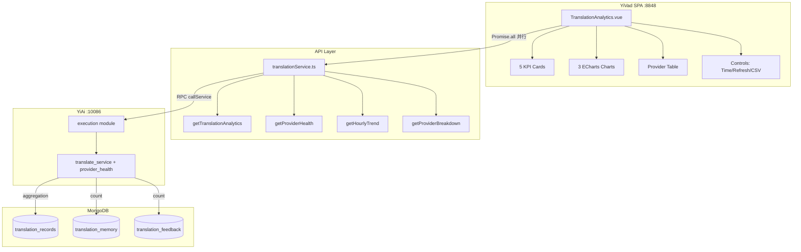
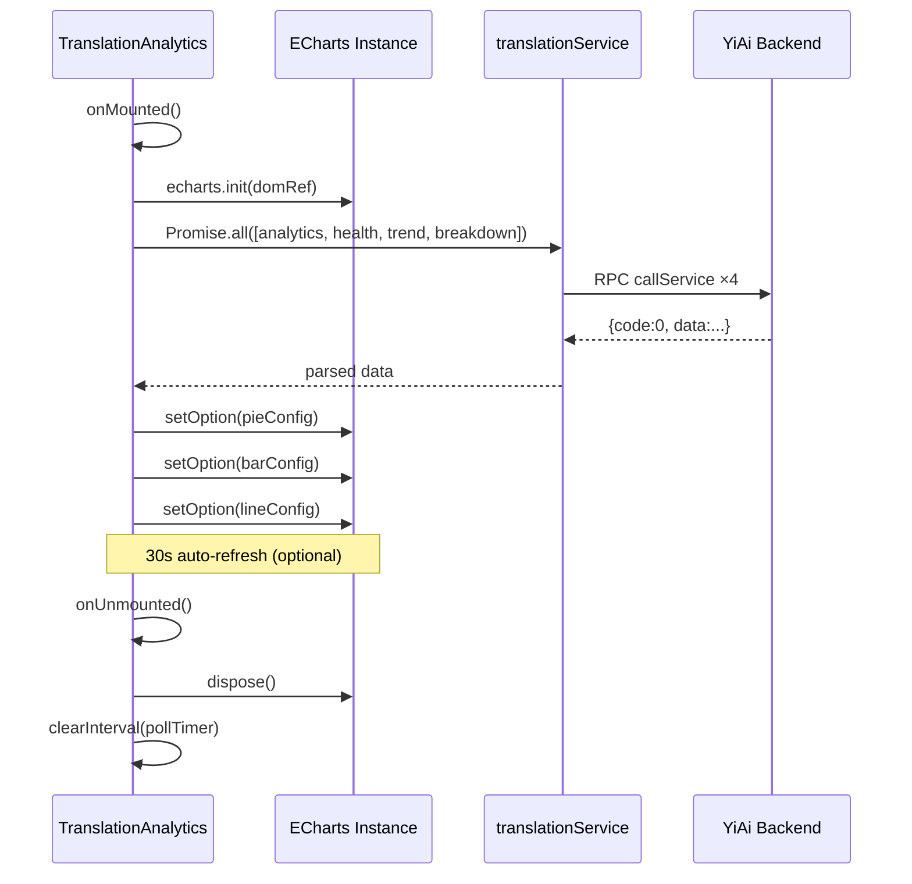

---

doc_type: module
prd_id: "YV-09-100"
title: "YV-09-100: 翻译分析仪表盘 — ECharts 可视化翻译全景数据"
status: 已完成
priority: P2
owner: Claude
roles: [product, engineer]
created: 2026-09-23
updated: 2026-09-23
project: YiVad
project_id: yivad
prd_month: "202609"
tags: [dashboard, echarts, translation, analytics, visualization]
related_tasks: ["100-prd-task-翻译分析仪表盘.md"]
related_tests: ["100-prd-test-翻译分析仪表盘.md"]
related_modules: ["views/dashboard/analytics/TranslationAnalytics.vue", "api/modules/translationService.ts"]

type: 需求
---

# YV-09-100: 翻译分析仪表盘

> **PRD 版本**：v3.0 · **状态**：已完成

---

## 1. 背景（Background）

YiAi 已提供 `provider_health`、`hourly_trend`、`provider_breakdown`、`top_language_pairs` 四个分析 RPC 接口。YiVad 作为管理后台，缺少对翻译数据的可视化 Dashboard。管理者和运维需要统一的仪表盘来监控翻译服务 SLA 和供应商健康状态。

## 2. 用户问题（User Problem）

- **目标用户**：技术管理者（周度查看）、SRE/运维（每日巡检）、产品经理（双周分析）
- **问题陈述**：作为运维，我无法在一个页面看到所有翻译供应商的健康状态；作为 PM，我无法了解翻译使用趋势
- **证据**：强证据 — YiAi 四个 RPC 接口已就绪可直接消费；中证据 — 其他 Dashboard（AnalyticsConsole）提供了参考模式

### 证据的质量级别

| 级别 | 证据类型 | 可信度 |
|------|---------|--------|
| 强 | YiAi RPC 接口已就绪，数据结构明确 | 高 |
| 中 | AnalyticsConsole 验证了 ECharts Dashboard 模式可行 | 中 |

## 3. 范围（Scope）

### 范围内（In scope）

- 5 个 KPI 卡片（Translations/Memory/Feedback/Providers/Lang Pairs）
- 3 个 ECharts 图表（饼图/柱状图/折线图）
- 供应商明细表格（ProTable 风格）
- 时间范围切换（24h/72h/7d/30d）
- 30s 自动刷新 + CSV 导出

### 范围外（Out of scope）

- 对比模式（两时间段并排）—— 后续 PRD
- 告警规则配置 —— 后续 PRD
- 移动端适配 —— YiVad 为桌面管理后台

### 用户故事

| 优先级 | 故事 | 验收标准 |
|--------|------|---------|
| P0 | 作为运维，我可以在 Dashboard 查看供应商健康 | 柱状图颜色编码 + 表格含成功率 |
| P0 | 作为管理者，我可以查看翻译量 KPI 概览 | 5 个 KPI 卡片正确显示 |
| P1 | 作为 PM，我可以分析翻译趋势 | 折线图 + dataZoom + 时间切换 |
| P2 | 作为运维，我可以导出数据 | CSV 下载 + 自动刷新 |

### 系统架构

### ECharts 生命周期序列

## 4. 成功指标（Success Metrics）

| 指标 | 基线值 | 目标值 | 测量方法 |
|------|--------|--------|---------|
| 首屏加载 | N/A | <2s | Performance API |
| 数据刷新延迟 | N/A | <500ms | Network 面板（3 API 并行） |
| 供应商颜色准确率 | N/A | 100% | 与后端数据对比 |
| 异常覆盖率 | N/A | 100% | 手动验证空数据/错误/API 失败 |

## 5. 风险与依赖

| 风险 | 可能性 | 影响 | 缓解 |
|------|--------|------|------|
| ECharts 实例泄漏 | 中 | 中 | `onUnmounted` dispose() |
| YiAi 不可达 | 中 | 中 | el-alert + Retry，其他 API 正常 |
| 暗色模式不可读 | 低 | 低 | CSS 变量注入 ECharts 颜色 |

## 4. 成功指标（Success Metrics）

| 里程碑 | 目标日期 | 负责人 |
|--------|---------|--------|
| API 模块 + 页面组件 | 2026-09-23 | Claude |
| 单元测试 + 类型检查 | 2026-09-23 | Claude |
| 菜单注册（YiVad UI） | 待排期 | 运维 |