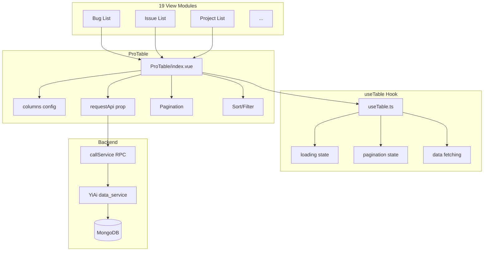

---

doc_type: module
prd_id: "YV-09-105"
title: "YV-09-105: ProTable — 标准数据表格组件（分页/排序/筛选/导出）"
status: 已完成
priority: P0
owner: Claude
roles: [engineer]
created: 2026-09-23
updated: 2026-09-23
project: YiVad
project_id: yivad
prd_month: "202609"
related_tasks: ["105-prd-task-ProTable.md"]
related_tests: ["105-prd-test-ProTable.md"]

type: 需求
---

# YV-09-105: ProTable

> **PRD 版本**：v3.0

## 1. 背景

YiVad 中所有数据列表页面（Bug/Issue/Project/Knowledge 等 19 个 View 模块）统一使用 ProTable 组件。需标准化的分页、排序、筛选、导出接口。

## 2. 范围

**In scope**：`ProTable` 组件 — columns 配置 + `requestApi({pageNum, pageSize, ...filters})` → RPC → MongoDB → `{list, total}` → 渲染 rows + Pagination

**硬约束**：页面禁止使用原始 `el-table`，必须使用 `ProTable`

| 优先级 | 故事 | 验收标准 |
|--------|------|---------|
| P0 | 标准化数据表格 | 分页/排序/筛选统一接口 |
| P0 | useTable hook | 数据获取 + 分页逻辑封装 |

### 组件架构



### API 契约

```typescript
type RequestApi = (params: {
  pageNum: number; pageSize: number;
  [filterKey: string]: unknown;
}) => Promise<{ list: T[]; total: number }>;

// RPC — 关键：filter 非 query
callService("services.database.data_service", "query_documents", {
  cname, filter, pageNum, pageSize, orderBy, orderType
});
```

## 4. 成功指标

| 指标 | 目标 |
|------|------|
| 消费 View 数 | 19 个模块 |
| 数据加载 | <500ms |
| 强制使用率 | 100%（code review） |