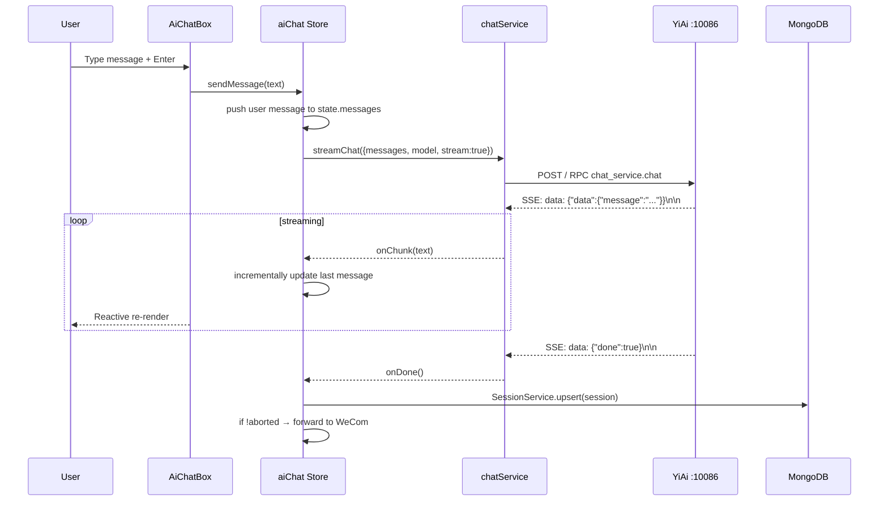
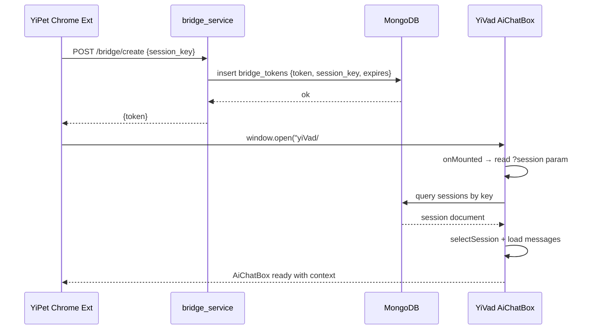

---

doc_type: module
prd_id: "YV-09-106"
title: "YV-09-106: AiChatBox — AI 对话面板组件（SSE 流式/工具调用/MCP）"
status: 已完成
priority: P0
owner: Claude
roles: [engineer]
created: 2026-09-23
updated: 2026-09-23
project: YiVad
project_id: yivad
prd_month: "202609"

type: 需求
---

# YV-09-106: AiChatBox

> **PRD 版本**：v3.0

## 1. 背景

YiVad 核心 AI 对话界面。用户在此与 LLM 交互，支持 SSE 流式响应、工具调用时间线、上下文文件管理、MCP 服务器集成。

## 2. 范围

**In scope**：AiChatBox 组件 — 消息列表/输入框/工具栏/SSE 流式/工具调用时间线/上下文面板

| 优先级 | 故事 | 验收标准 |
|--------|------|---------|
| P0 | AI 对话 | SSE 流式 + markdown 渲染 |
| P1 | 工具调用 | ToolCallTimeline 展示 |
| P1 | 上下文管理 | ContextFilesPanel 文件选择 |

### SSE 流式序列

### 跨项目桥接序列

## 4. 成功指标

| 指标 | 目标 |
|------|------|
| SSE 首 token 延迟 | <2s |
| 消息持久化 | 100%（MongoDB sessions） |
| 桥接成功率 | >99%（token 一次性有效） |