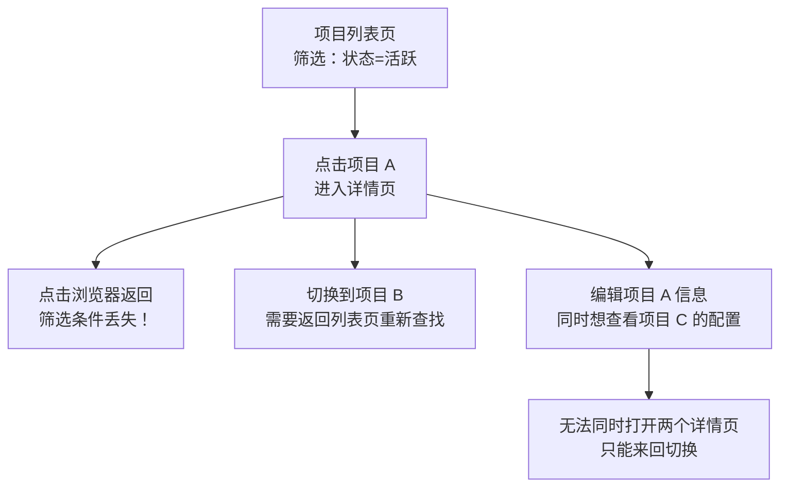
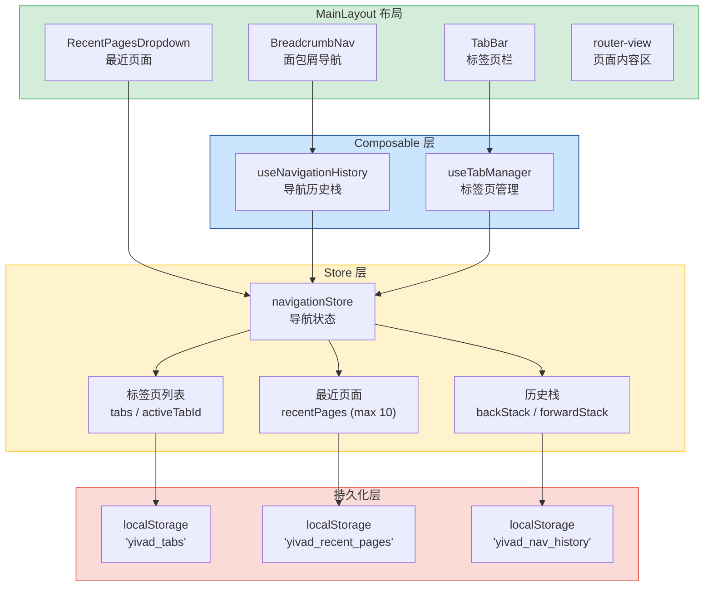
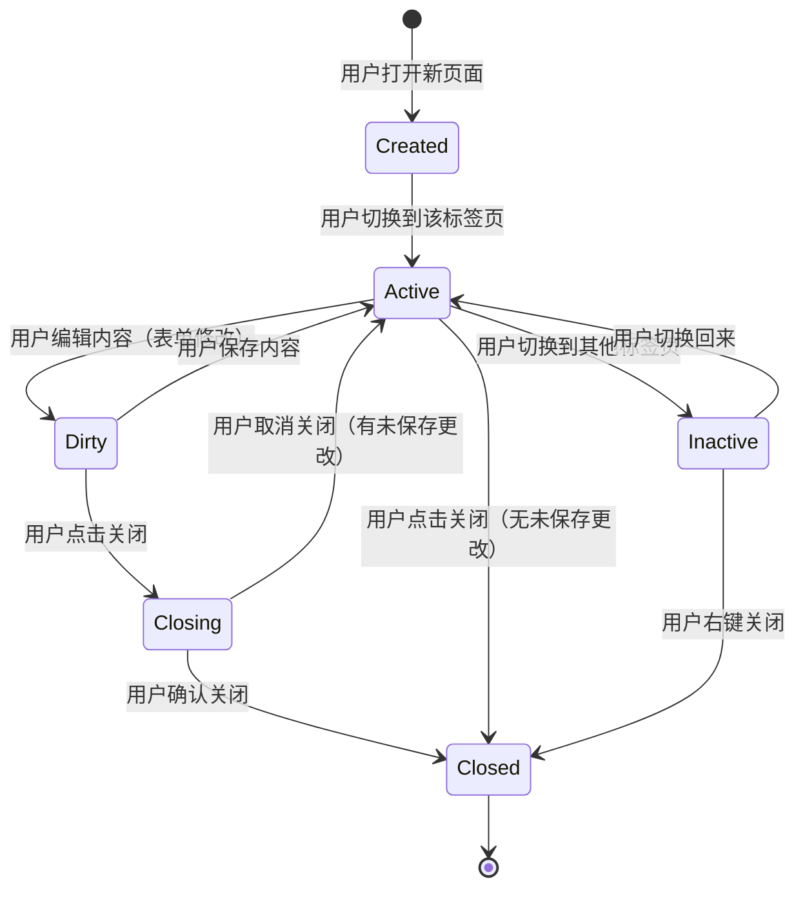

# 面包屑与导航系统

> 需求编号：YV-09-31 · 优先级：P2 · 人天：0.5d
> 依赖：无（纯前端功能，不依赖后端变更）

## 改动总览

| 改动点 | 类型 | 涉及文件 |
|--------|------|---------|
| 面包屑组件 | 新增 | `src/components/layout/BreadcrumbNav.vue` |
| 导航历史 Composable | 新增 | `src/composables/useNavigationHistory.ts` |
| 标签页管理 Composable | 新增 | `src/composables/useTabManager.ts` |
| 标签页栏组件 | 新增 | `src/components/layout/TabBar.vue` |
| 标签页项组件 | 新增 | `src/components/layout/TabItem.vue` |
| 最近页面下拉组件 | 新增 | `src/components/layout/RecentPagesDropdown.vue` |
| 右键菜单组件 | 新增 | `src/components/layout/TabContextMenu.vue` |
| 全局布局集成 | 修改 | `src/layouts/MainLayout.vue` |
| 路由 meta 扩展 | 修改 | `src/router/index.ts`（各路由添加 breadcrumb meta） |
| 导航状态 Store | 新增 | `src/stores/navigation.ts` |

## 涉及文件

```
YiVad/
├── src/
│   ├── composables/
│   │   ├── useNavigationHistory.ts             # 新增：导航历史栈（前进/后退）
│   │   └── useTabManager.ts                    # 新增：标签页管理（打开/关闭/切换/持久化）
│   ├── components/
│   │   └── layout/
│   │       ├── BreadcrumbNav.vue               # 新增：动态面包屑组件
│   │       ├── TabBar.vue                      # 新增：标签页栏容器
│   │       ├── TabItem.vue                     # 新增：单个标签页（含脏状态指示器）
│   │       ├── TabContextMenu.vue              # 新增：标签页右键菜单
│   │       └── RecentPagesDropdown.vue         # 新增：最近访问页面下拉
│   ├── layouts/
│   │   └── MainLayout.vue                      # 修改：集成面包屑 + 标签页栏
│   ├── router/
│   │   └── index.ts                            # 修改：路由 meta 扩展 breadcrumb 配置
│   └── stores/
│       └── navigation.ts                       # 新增：导航状态管理（历史、标签页、最近页面）
```

## 基本信息

| 字段 | 值 |
|------|-----|
| 需求编号 | YV-09-31 |
| 模块 | 全局布局 / 导航系统 |
| 优先级 | **P2**（提升导航效率，非阻塞核心流程） |
| 前端人天 | 0.5d |
| 后端人天 | -- |
| 依赖 | 无 |

---

## 背景

YiVad 当前缺少系统化的导航辅助功能。用户在使用过程中面临以下问题：面包屑导航缺失，无法快速了解当前位置和层级关系；页面切换后状态丢失，返回上一页需要重新筛选和查找；同时打开多个详情页时需要在浏览器标签页之间切换，无法在应用内管理多页面；深度路径下导航效率低，需要多次点击返回。

**核心问题：**

| # | 问题 | 严重程度 | 影响 |
|---|------|----------|------|
| 1 | **无面包屑导航** -- 用户无法感知当前页面在系统中的位置 | **高** | 深度嵌套页面（如 RAG 配置 > 知识库 > 文档详情）中，用户迷失层级关系 |
| 2 | **无导航历史** -- 页面返回后筛选状态丢失 | **高** | 在列表页筛选后进入详情页，返回时筛选条件清空，需重新设置 |
| 3 | **无标签页模式** -- 多页面操作效率低 | **中** | 同时编辑多个项目/文档时，需在不同页面间反复导航 |
| 4 | **无最近页面快捷入口** -- 频繁切换的页面无快捷方式 | **中** | 在几个页面间切换时，每次都需要通过侧边栏导航 |
| 5 | **无键盘导航** -- 高级用户无法通过快捷键快速切换页面 | **低** | 鼠标操作效率低于键盘快捷键 |

## 一、现状分析

### 当前导航能力矩阵

| 导航方式 | 当前状态 | 用户体验 | 覆盖情况 |
|----------|----------|----------|----------|
| 侧边栏菜单 | 有（动态路由菜单） | 基础可用，但层级深时不够直观 | 一级/二级菜单 |
| 面包屑导航 | 无 | 用户无法感知当前位置 | 0% |
| 导航历史 | 无（依赖浏览器前进/后退） | 返回时状态丢失 | 0% |
| 标签页模式 | 无 | 多页面操作需在浏览器标签页间切换 | 0% |
| 最近页面 | 无 | 无快捷入口 | 0% |
| 键盘导航 | 无 | 仅依赖鼠标点击 | 0% |

### 典型用户路径中的导航痛点



### 根因分析矩阵

| 缺失项 | 根因 | 影响链 |
|--------|------|--------|
| 面包屑导航 | 路由系统未配置 breadcrumb meta，无面包屑组件 | 用户无法感知页面层级，深度页面中迷失方向 |
| 导航历史栈 | 无统一的导航状态管理，页面切换时状态未保存 | 返回时筛选/搜索/分页状态丢失，用户需要重新操作 |
| 标签页模式 | 无标签页管理组件，路由切换时销毁旧组件 | 多页面并行操作无法实现，每次切换都重新加载 |
| 最近页面 | 无访问记录追踪机制 | 频繁切换的页面无快捷入口，操作路径长 |
| 键盘导航 | 无全局键盘事件监听和快捷键绑定 | 高级用户无法通过键盘提升操作效率 |

---

## 二、设计决策

### 面包屑生成策略

| 维度 | 方案 A：静态配置 | 方案 B：动态解析 | 方案 C：混合模式 | 决策 |
|------|-----------------|-----------------|-----------------|------|
| 路由层级 | 路由 meta 中直接配置 breadcrumb 数组 | 从 `route.matched` 动态生成 | 静态配置 + 动态数据替换 | **混合模式** |
| 数据上下文 | 不支持 | 从页面数据中提取（如项目名称） | 支持占位符替换 | **混合模式** |
| 灵活性 | 低（需手动维护） | 高（自动生成） | 高（灵活配置） | **混合模式** |
| 维护成本 | 高（路由变更需同步修改） | 低（自动适应） | 中 | **混合模式** |

**决策：** 采用混合模式。路由 meta 中配置静态 breadcrumb 路径，支持 `{param}` 占位符。面包屑最后一级从页面数据上下文动态获取（如当前项目名称、文档标题）。

### 标签页持久化策略

| 维度 | 方案 A：localStorage | 方案 B：sessionStorage | 方案 C：IndexedDB | 决策 |
|------|---------------------|----------------------|-------------------|------|
| 持久化范围 | 跨会话持久化 | 仅当前会话 | 跨会话持久化 | **localStorage** |
| 存储容量 | ~5MB | ~5MB | 无限制 | **localStorage**（标签页数据量小） |
| 恢复速度 | 同步读取，快 | 同步读取，快 | 异步读取，稍慢 | **localStorage** |
| 用户体验 | 刷新页面后恢复标签页 | 关闭浏览器后标签页丢失 | 刷新页面后恢复标签页 | **localStorage** |

**决策：** 使用 localStorage 持久化标签页状态。页面刷新后恢复所有打开的标签页，关闭浏览器后标签页保留（下次打开时恢复）。

### 标签页数量限制

| 维度 | 无限制 | 上限 10 | 上限 20 | 决策 |
|------|--------|--------|---------|------|
| 内存占用 | 高（可能 OOM） | 低 | 中 | **上限 20** |
| 可管理性 | 低（标签页过多难以导航） | 高 | 中 | **上限 20** |
| 用户灵活性 | 高 | 低 | 中 | **上限 20** |

**决策：** 标签页上限为 20 个。超过上限时，打开新标签页自动关闭最早未修改的标签页（LRU 策略）。用户可通过右键菜单手动关闭标签页。

### 键盘快捷键设计

| 快捷键 | 操作 | 适用场景 |
|--------|------|----------|
| `Ctrl + Tab` | 切换到下一个标签页 | 标签页间快速切换 |
| `Ctrl + Shift + Tab` | 切换到上一个标签页 | 反向切换标签页 |
| `Ctrl + 1` ~ `Ctrl + 9` | 切换到第 1-9 个标签页 | 直接跳转到指定标签页 |
| `Ctrl + W` | 关闭当前标签页 | 快速关闭标签页 |
| `Ctrl + Shift + T` | 重新打开最后关闭的标签页 | 误关闭恢复 |
| `Alt + Left` | 返回上一页（导航历史） | 面包屑导航回退 |
| `Alt + Right` | 前进到下一页（导航历史） | 导航历史前进 |

---

## 三、目标架构

### 导航系统架构



### 标签页生命周期



---

## 四、具体改动

### 4.1 导航状态 Store

**文件：** `src/stores/navigation.ts`（新增）

```typescript
// src/stores/navigation.ts
import { defineStore } from "pinia";
import { ref, computed } from "vue";
import type { RouteLocationNormalized } from "vue-router";

/** 标签页实例 */
export interface TabItem {
  id: string;
  title: string;
  path: string;
  query: Record<string, string>;
  icon?: string;
  /** 是否有未保存的更改 */
  dirty: boolean;
  /** 创建时间戳 */
  createdAt: number;
  /** 最后访问时间戳 */
  lastAccessedAt: number;
}

/** 最近访问页面 */
export interface RecentPage {
  path: string;
  title: string;
  icon?: string;
  accessedAt: number;
}

/** 导航历史条目 */
export interface NavHistoryEntry {
  path: string;
  query: Record<string, string>;
  scrollPosition: number;
  /** 页面状态快照（筛选条件等） */
  stateSnapshot?: Record<string, unknown>;
}

const MAX_TABS = 20;
const MAX_RECENT_PAGES = 10;
const MAX_HISTORY_SIZE = 50;

export const useNavigationStore = defineStore("navigation", () => {
  // 标签页状态
  const tabs = ref<TabItem[]>([]);
  const activeTabId = ref<string | null>(null);
  const lastClosedTab = ref<TabItem | null>(null);

  // 最近页面
  const recentPages = ref<RecentPage[]>([]);

  // 导航历史
  const backStack = ref<NavHistoryEntry[]>([]);
  const forwardStack = ref<NavHistoryEntry[]>([]);

  // 计算属性
  const activeTab = computed(() =>
    tabs.value.find((t) => t.id === activeTabId.value) || null
  );

  const hasBack = computed(() => backStack.value.length > 0);
  const hasForward = computed(() => forwardStack.value.length > 0);

  // 标签页操作
  function openTab(route: RouteLocationNormalized): void {
    const tabId = generateTabId(route);

    // 检查是否已存在
    const existingTab = tabs.value.find((t) => t.id === tabId);
    if (existingTab) {
      existingTab.lastAccessedAt = Date.now();
      activeTabId.value = tabId;
      return;
    }

    // 超过上限时，移除最久未访问的标签页
    if (tabs.value.length >= MAX_TABS) {
      const lruTab = tabs.value
        .filter((t) => !t.dirty)
        .sort((a, b) => a.lastAccessedAt - b.lastAccessedAt)[0];
      if (lruTab) {
        closeTab(lruTab.id, true);
      }
    }

    const tab: TabItem = {
      id: tabId,
      title: (route.meta.title as string) || route.name as string || "未命名页面",
      path: route.path,
      query: route.query as Record<string, string>,
      icon: route.meta.icon as string | undefined,
      dirty: false,
      createdAt: Date.now(),
      lastAccessedAt: Date.now(),
    };

    tabs.value.push(tab);
    activeTabId.value = tabId;
    persistTabs();
  }

  function closeTab(tabId: string, silent: boolean = false): void {
    const index = tabs.value.findIndex((t) => t.id === tabId);
    if (index === -1) return;

    const tab = tabs.value[index];
    lastClosedTab.value = { ...tab };

    tabs.value.splice(index, 1);

    // 如果关闭的是当前标签页，切换到相邻标签页
    if (activeTabId.value === tabId) {
      if (tabs.value.length > 0) {
        const newIndex = Math.min(index, tabs.value.length - 1);
        activeTabId.value = tabs.value[newIndex].id;
      } else {
        activeTabId.value = null;
      }
    }

    persistTabs();
  }

  function closeOtherTabs(tabId: string): void {
    const tab = tabs.value.find((t) => t.id === tabId);
    tabs.value = tab ? [tab] : [];
    activeTabId.value = tabId;
    persistTabs();
  }

  function closeAllTabs(): void {
    tabs.value = [];
    activeTabId.value = null;
    persistTabs();
  }

  function closeTabsToRight(tabId: string): void {
    const index = tabs.value.findIndex((t) => t.id === tabId);
    if (index === -1) return;
    tabs.value = tabs.value.slice(0, index + 1);
    persistTabs();
  }

  function setTabDirty(tabId: string, dirty: boolean): void {
    const tab = tabs.value.find((t) => t.id === tabId);
    if (tab) {
      tab.dirty = dirty;
    }
  }

  function reopenLastClosedTab(): void {
    if (lastClosedTab.value) {
      const tab = { ...lastClosedTab.value, createdAt: Date.now(), lastAccessedAt: Date.now() };
      tabs.value.push(tab);
      activeTabId.value = tab.id;
      lastClosedTab.value = null;
      persistTabs();
    }
  }

  // 最近页面操作
  function addRecentPage(page: RecentPage): void {
    const existing = recentPages.value.findIndex((p) => p.path === page.path);
    if (existing !== -1) {
      recentPages.value.splice(existing, 1);
    }
    recentPages.value.unshift({ ...page, accessedAt: Date.now() });
    if (recentPages.value.length > MAX_RECENT_PAGES) {
      recentPages.value = recentPages.value.slice(0, MAX_RECENT_PAGES);
    }
    persistRecentPages();
  }

  // 导航历史操作
  function pushHistory(entry: NavHistoryEntry): void {
    backStack.value.push(entry);
    if (backStack.value.length > MAX_HISTORY_SIZE) {
      backStack.value.shift();
    }
    forwardStack.value = [];
    persistHistory();
  }

  function goBack(): NavHistoryEntry | null {
    if (backStack.value.length === 0) return null;
    const current = backStack.value.pop()!;
    forwardStack.value.push(current);
    const previous = backStack.value[backStack.value.length - 1];
    persistHistory();
    return previous || null;
  }

  function goForward(): NavHistoryEntry | null {
    if (forwardStack.value.length === 0) return null;
    const entry = forwardStack.value.pop()!;
    backStack.value.push(entry);
    persistHistory();
    return entry;
  }

  // 持久化
  function persistTabs(): void {
    localStorage.setItem("yivad_tabs", JSON.stringify(tabs.value));
    localStorage.setItem("yivad_active_tab", activeTabId.value || "");
  }

  function persistRecentPages(): void {
    localStorage.setItem("yivad_recent_pages", JSON.stringify(recentPages.value));
  }

  function persistHistory(): void {
    localStorage.setItem("yivad_nav_history", JSON.stringify({
      backStack: backStack.value,
      forwardStack: forwardStack.value,
    }));
  }

  function restoreFromStorage(): void {
    try {
      const savedTabs = localStorage.getItem("yivad_tabs");
      const savedActive = localStorage.getItem("yivad_active_tab");
      const savedRecent = localStorage.getItem("yivad_recent_pages");
      const savedHistory = localStorage.getItem("yivad_nav_history");

      if (savedTabs) tabs.value = JSON.parse(savedTabs);
      if (savedActive) activeTabId.value = savedActive;
      if (savedRecent) recentPages.value = JSON.parse(savedRecent);
      if (savedHistory) {
        const history = JSON.parse(savedHistory);
        backStack.value = history.backStack || [];
        forwardStack.value = history.forwardStack || [];
      }
    } catch {
      // 数据损坏时重置
      tabs.value = [];
      activeTabId.value = null;
      recentPages.value = [];
      backStack.value = [];
      forwardStack.value = [];
    }
  }

  function generateTabId(route: RouteLocationNormalized): string {
    return `${route.path}__${JSON.stringify(route.query)}`;
  }

  return {
    tabs,
    activeTabId,
    activeTab,
    lastClosedTab,
    recentPages,
    backStack,
    forwardStack,
    hasBack,
    hasForward,
    openTab,
    closeTab,
    closeOtherTabs,
    closeAllTabs,
    closeTabsToRight,
    setTabDirty,
    reopenLastClosedTab,
    addRecentPage,
    pushHistory,
    goBack,
    goForward,
    restoreFromStorage,
  };
});
```

### 4.2 面包屑组件

**文件：** `src/components/layout/BreadcrumbNav.vue`（新增）

```vue
<!-- src/components/layout/BreadcrumbNav.vue -->
<template>
  <div class="breadcrumb-nav">
    <el-breadcrumb separator="/">
      <!-- 首页 -->
      <el-breadcrumb-item :to="{ path: '/' }">
        <el-icon><HomeFilled /></el-icon>
        首页
      </el-breadcrumb-item>

      <!-- 动态面包屑 -->
      <template v-for="(item, index) in breadcrumbs" :key="item.path">
        <!-- 被截断的中间项 -->
        <el-breadcrumb-item
          v-if="item.truncated"
          :key="`truncated-${index}`"
        >
          <el-dropdown trigger="click" @command="handleTruncatedClick">
            <span class="truncated-indicator">...</span>
            <template #dropdown>
              <el-dropdown-menu>
                <el-dropdown-item
                  v-for="hidden in truncatedItems"
                  :key="hidden.path"
                  :command="hidden.path"
                >
                  {{ hidden.title }}
                </el-dropdown-item>
              </el-dropdown-menu>
            </template>
          </el-dropdown>
        </el-breadcrumb-item>

        <!-- 正常项 -->
        <el-breadcrumb-item
          v-else
          :to="index < breadcrumbs.length - 1 ? item.path : undefined"
        >
          <el-icon v-if="item.icon"><component :is="item.icon" /></el-icon>
          {{ item.title }}
        </el-breadcrumb-item>
      </template>
    </el-breadcrumb>

    <!-- 导航历史按钮 -->
    <div class="nav-history-buttons">
      <el-button
        :disabled="!navigationStore.hasBack"
        :icon="ArrowLeft"
        circle
        size="small"
        @click="handleGoBack"
      />
      <el-button
        :disabled="!navigationStore.hasForward"
        :icon="ArrowRight"
        circle
        size="small"
        @click="handleGoForward"
      />
    </div>
  </div>
</template>

<script setup lang="ts">
import { computed } from "vue";
import { useRoute, useRouter } from "vue-router";
import { useNavigationStore } from "@/stores/navigation";
import { ArrowLeft, ArrowRight, HomeFilled } from "@element-plus/icons-vue";

interface BreadcrumbItem {
  title: string;
  path: string;
  icon?: string;
  truncated?: boolean;
}

const route = useRoute();
const router = useRouter();
const navigationStore = useNavigationStore();

const MAX_VISIBLE_BREADCRUMBS = 4;

const breadcrumbs = computed<BreadcrumbItem[]>(() => {
  const matched = route.matched.filter((r) => r.meta.breadcrumb || r.meta.title);
  const items: BreadcrumbItem[] = matched.map((r) => ({
    title: resolveTitle(r.meta.breadcrumb as string || r.meta.title as string),
    path: resolvePath(r.path),
    icon: r.meta.icon as string | undefined,
  }));

  // 截断深度路径
  if (items.length > MAX_VISIBLE_BREADCRUMBS) {
    const first = items[0];
    const last = items.slice(-2);
    return [
      first,
      { title: "...", path: "", truncated: true },
      ...last,
    ];
  }

  return items;
});

const truncatedItems = computed(() => {
  const matched = route.matched.filter((r) => r.meta.breadcrumb || r.meta.title);
  if (matched.length <= MAX_VISIBLE_BREADCRUMBS) return [];
  return matched.slice(1, -2).map((r) => ({
    title: r.meta.breadcrumb as string || r.meta.title as string,
    path: resolvePath(r.path),
  }));
});

function resolveTitle(template: string): string {
  return template.replace(/\{(\w+)\}/g, (_, key) => {
    return (route.params[key] as string) || (route.query[key] as string) || `{${key}}`;
  });
}

function resolvePath(path: string): string {
  return path.replace(/:(\w+)/g, (_, key) => {
    return (route.params[key] as string) || "";
  });
}

function handleTruncatedClick(path: string): void {
  router.push(path);
}

function handleGoBack(): void {
  const entry = navigationStore.goBack();
  if (entry) {
    router.push({ path: entry.path, query: entry.query });
  }
}

function handleGoForward(): void {
  const entry = navigationStore.goForward();
  if (entry) {
    router.push({ path: entry.path, query: entry.query });
  }
}
</script>
```

### 4.3 标签页栏组件

**文件：** `src/components/layout/TabBar.vue`（新增）

```vue
<!-- src/components/layout/TabBar.vue -->
<template>
  <div v-if="tabs.length > 0" class="tab-bar">
    <div class="tab-list" ref="tabListRef">
      <TabItem
        v-for="tab in tabs"
        :key="tab.id"
        :tab="tab"
        :active="tab.id === activeTabId"
        @click="handleTabClick(tab)"
        @close="handleTabClose(tab)"
        @contextmenu.prevent="handleContextMenu($event, tab)"
      />
    </div>

    <!-- 最近页面下拉 -->
    <RecentPagesDropdown />

    <!-- 右键菜单 -->
    <TabContextMenu
      v-if="contextMenu.visible"
      :x="contextMenu.x"
      :y="contextMenu.y"
      :tab="contextMenu.tab"
      @close="contextMenu.visible = false"
      @close-tab="handleCloseTab"
      @close-others="handleCloseOthers"
      @close-all="handleCloseAll"
      @close-right="handleCloseRight"
    />
  </div>
</template>

<script setup lang="ts">
import { ref, computed } from "vue";
import { useRouter } from "vue-router";
import { useNavigationStore } from "@/stores/navigation";
import type { TabItem } from "@/stores/navigation";
import TabItemComponent from "./TabItem.vue";
import RecentPagesDropdown from "./RecentPagesDropdown.vue";
import TabContextMenu from "./TabContextMenu.vue";

const router = useRouter();
const navigationStore = useNavigationStore();

const tabs = computed(() => navigationStore.tabs);
const activeTabId = computed(() => navigationStore.activeTabId);

const contextMenu = ref({
  visible: false,
  x: 0,
  y: 0,
  tab: null as TabItem | null,
});

function handleTabClick(tab: TabItem): void {
  navigationStore.activeTabId = tab.id;
  router.push({ path: tab.path, query: tab.query });
}

function handleTabClose(tab: TabItem): void {
  if (tab.dirty) {
    // 弹出确认对话框
    ElMessageBox.confirm(
      `"${tab.title}" 有未保存的更改，确定关闭吗？`,
      "确认关闭",
      { confirmButtonText: "关闭", cancelButtonText: "取消", type: "warning" }
    ).then(() => {
      navigationStore.closeTab(tab.id);
    }).catch(() => {});
  } else {
    navigationStore.closeTab(tab.id);
  }
}

function handleContextMenu(event: MouseEvent, tab: TabItem): void {
  contextMenu.value = {
    visible: true,
    x: event.clientX,
    y: event.clientY,
    tab,
  };
}

function handleCloseTab(): void {
  if (contextMenu.value.tab) {
    navigationStore.closeTab(contextMenu.value.tab.id);
  }
  contextMenu.value.visible = false;
}

function handleCloseOthers(): void {
  if (contextMenu.value.tab) {
    navigationStore.closeOtherTabs(contextMenu.value.tab.id);
  }
  contextMenu.value.visible = false;
}

function handleCloseAll(): void {
  navigationStore.closeAllTabs();
  contextMenu.value.visible = false;
}

function handleCloseRight(): void {
  if (contextMenu.value.tab) {
    navigationStore.closeTabsToRight(contextMenu.value.tab.id);
  }
  contextMenu.value.visible = false;
}
</script>
```

### 4.4 useTabManager Composable

**文件：** `src/composables/useTabManager.ts`（新增）

```typescript
// src/composables/useTabManager.ts
import { onMounted, onUnmounted } from "vue";
import { useRouter } from "vue-router";
import { useNavigationStore } from "@/stores/navigation";

/**
 * 标签页管理器
 * 提供键盘快捷键支持和页面生命周期集成
 */
export function useTabManager() {
  const router = useRouter();
  const navigationStore = useNavigationStore();

  // 键盘快捷键处理
  function handleKeydown(event: KeyboardEvent): void {
    const { ctrlKey, shiftKey, key, altKey } = event;

    // Ctrl + Tab: 下一个标签页
    if (ctrlKey && key === "Tab" && !shiftKey) {
      event.preventDefault();
      switchTab(1);
    }

    // Ctrl + Shift + Tab: 上一个标签页
    if (ctrlKey && shiftKey && key === "Tab") {
      event.preventDefault();
      switchTab(-1);
    }

    // Ctrl + 1-9: 切换到指定标签页
    if (ctrlKey && !shiftKey && !altKey && /^[1-9]$/.test(key)) {
      event.preventDefault();
      const index = parseInt(key) - 1;
      switchToTabIndex(index);
    }

    // Ctrl + W: 关闭当前标签页
    if (ctrlKey && key === "w") {
      event.preventDefault();
      if (navigationStore.activeTabId) {
        navigationStore.closeTab(navigationStore.activeTabId);
      }
    }

    // Ctrl + Shift + T: 重新打开关闭的标签页
    if (ctrlKey && shiftKey && key === "T") {
      event.preventDefault();
      navigationStore.reopenLastClosedTab();
    }

    // Alt + Left: 后退
    if (altKey && key === "ArrowLeft") {
      event.preventDefault();
      const entry = navigationStore.goBack();
      if (entry) {
        router.push({ path: entry.path, query: entry.query });
      }
    }

    // Alt + Right: 前进
    if (altKey && key === "ArrowRight") {
      event.preventDefault();
      const entry = navigationStore.goForward();
      if (entry) {
        router.push({ path: entry.path, query: entry.query });
      }
    }
  }

  function switchTab(direction: 1 | -1): void {
    const { tabs, activeTabId } = navigationStore;
    if (tabs.length === 0) return;

    const currentIndex = tabs.findIndex((t) => t.id === activeTabId);
    const newIndex = (currentIndex + direction + tabs.length) % tabs.length;

    const tab = tabs[newIndex];
    navigationStore.activeTabId = tab.id;
    router.push({ path: tab.path, query: tab.query });
  }

  function switchToTabIndex(index: number): void {
    const { tabs } = navigationStore;
    if (index >= 0 && index < tabs.length) {
      const tab = tabs[index];
      navigationStore.activeTabId = tab.id;
      router.push({ path: tab.path, query: tab.query });
    }
  }

  // 页面关闭前保存标签页状态
  function handleBeforeUnload(): void {
    navigationStore.persistTabs();
  }

  onMounted(() => {
    navigationStore.restoreFromStorage();
    window.addEventListener("keydown", handleKeydown);
    window.addEventListener("beforeunload", handleBeforeUnload);
  });

  onUnmounted(() => {
    window.removeEventListener("keydown", handleKeydown);
    window.removeEventListener("beforeunload", handleBeforeUnload);
  });
}
```

### 4.5 路由 Meta 扩展

**文件：** `src/router/index.ts`（修改）

```typescript
// 扩展路由 meta 类型
declare module "vue-router" {
  interface RouteMeta {
    title?: string;
    icon?: string;
    breadcrumb?: string;  // 面包屑显示文本，支持 {param} 占位符
    keepAlive?: boolean;  // 是否在标签页切换时保持组件状态
    hidden?: boolean;     // 是否在导航中隐藏
    affix?: boolean;      // 是否固定标签页（不可关闭）
  }
}

// 示例路由配置
const routes = [
  {
    path: "/project/:projectKey",
    meta: {
      title: "项目详情",
      breadcrumb: "{projectKey}",
      keepAlive: true,
    },
    component: () => import("@/views/project/ProjectDetail.vue"),
  },
  {
    path: "/project/:projectKey/rag/:configId",
    meta: {
      title: "RAG 配置",
      breadcrumb: "RAG 配置 - {configId}",
      keepAlive: true,
    },
    component: () => import("@/views/project/RagConfig.vue"),
  },
];
```

---

## 五、实施步骤

| 步骤 | 任务 | 产出 | 验证方式 | 人天 |
|------|------|------|----------|------|
| 1 | 创建导航状态 Store | `src/stores/navigation.ts` | Store 初始化正常，持久化读写正确 | 0.10 |
| 2 | 创建面包屑组件 | `BreadcrumbNav.vue` | 面包屑正确显示路径层级，点击可导航 | 0.08 |
| 3 | 创建标签页组件 | `TabBar.vue`, `TabItem.vue` | 标签页可打开/关闭/切换 | 0.10 |
| 4 | 创建标签页右键菜单 | `TabContextMenu.vue` | 右键菜单正确显示，各操作生效 | 0.05 |
| 5 | 创建最近页面下拉 | `RecentPagesDropdown.vue` | 最近访问页面列表正确 | 0.03 |
| 6 | 创建 useTabManager Composable | `useTabManager.ts` | 键盘快捷键全部生效 | 0.05 |
| 7 | 扩展路由 Meta 类型 | `src/router/index.ts` | TypeScript 编译通过，meta 扩展生效 | 0.02 |
| 8 | 集成到 MainLayout | `MainLayout.vue` | 面包屑和标签页栏在全局布局中正确显示 | 0.05 |
| 9 | 集成测试 + 端到端验证 | 所有页面面包屑正确、标签页功能正常 | 手动验证所有导航路径 | 0.02 |

**总计：** 0.5d

---

## 六、测试规格

### 单元测试：导航 Store

#### Scenario: 打开新标签页
- **GIVEN** 标签页列表为空，activeTabId 为 null
- **WHEN** 调用 `openTab(route)` 传入路由对象
- **THEN** `tabs.length = 1`，`activeTabId` 不为 null，标签页持久化到 localStorage

#### Scenario: 重复打开相同页面
- **GIVEN** 标签页列表中已存在 `path="/project/PL"` 的标签页
- **WHEN** 再次调用 `openTab(route)` 传入相同路由
- **THEN** `tabs.length` 不变（不创建重复标签页），`activeTabId` 更新为该标签页

#### Scenario: 关闭标签页
- **GIVEN** 标签页列表有 3 个标签页，当前激活第 2 个
- **WHEN** 调用 `closeTab(tab2Id)`
- **THEN** `tabs.length = 2`，`activeTabId` 自动切换到相邻标签页

### 组件测试：面包屑组件

#### Scenario: 渲染基本面包屑
- **GIVEN** 当前路由为 `/project/PL/rag/config-1`
- **WHEN** 挂载 `BreadcrumbNav` 组件，mock route 对象
- **THEN** 面包屑显示 "首页 / 项目详情 / RAG 配置"

#### Scenario: 深度路径截断
- **GIVEN** 当前路由有 6 级深度
- **WHEN** 挂载 `BreadcrumbNav` 组件
- **THEN** 面包屑显示 "首页 / ... / 最后两级"，中间项可通过下拉展开

#### Scenario: 点击面包屑导航
- **GIVEN** 面包屑显示 "首页 / 项目列表 / 项目详情"
- **WHEN** 点击 "项目列表"
- **THEN** 路由导航到 `/project`，标签页切换到对应页面

---

## 七、风险与缓解

| 风险 | 概率 | 影响 | 等级 | 缓解措施 | 应急预案 |
|------|------|------|------|----------|----------|
| 标签页过多导致内存占用过高 | 中 | 中 | 中 | 标签页上限 20 个，超过上限自动关闭非脏标签页；keepAlive 仅缓存最近 5 个组件 | 提供"关闭所有标签页"按钮，一键释放内存 |
| localStorage 容量不足 | 低 | 低 | 低 | 标签页数据仅存储最小必要信息（路径、标题、查询参数），不存储页面数据 | 降级为 sessionStorage，仅当前会话可用 |
| 键盘快捷键与浏览器/OS 冲突 | 中 | 低 | 低 | Ctrl+Tab、Ctrl+W 等快捷键仅在应用内生效，使用 `event.preventDefault()` 阻止默认行为 | 提供快捷键配置界面，允许用户自定义快捷键 |
| 面包屑占位符解析失败 | 低 | 低 | 低 | 占位符解析失败时显示原始模板文本，不影响页面渲染 | 路由 meta 配置检查工具，CI 中校验面包屑配置完整性 |
| 标签页持久化数据与最新路由不匹配 | 中 | 中 | 中 | 恢复标签页时校验路径有效性，无效路径自动跳过 | 提供"清空已保存标签页"按钮 |

---

## 八、回滚策略

| 回滚场景 | 回滚方式 | 影响范围 | 恢复时间 |
|----------|----------|----------|----------|
| 标签页栏导致布局异常 | 在 `MainLayout.vue` 中移除 `<TabBar>` 组件，恢复原始布局 | 全局布局 | < 2min |
| 面包屑组件渲染异常 | 移除 `<BreadcrumbNav>` 组件，恢复原始无面包屑布局 | 页面头部 | < 1min |
| 导航历史导致路由跳转异常 | 重置 `navigationStore` 中的 backStack 和 forwardStack | 导航功能 | < 1min |
| 键盘快捷键干扰正常输入 | 禁用 `useTabManager` 中的键盘事件监听 | 全局快捷键 | < 1min |

**回滚验证：**
- 回滚后 MainLayout 正常渲染，无控制台错误
- 回滚后路由导航正常（侧边栏菜单 + 浏览器前进后退）
- 回滚后页面切换无异常

---

## 九、设计决策记录

### D-01: 标签页上限设为 20 个

**背景：** 无限制的标签页会导致浏览器内存占用过高，影响性能。
**决策：** 标签页上限为 20 个。超过上限时，使用 LRU（最近最少使用）策略自动关闭最久未访问的非脏标签页。
**权衡：** 限制了用户同时打开的页面数量，但 20 个标签页已覆盖绝大多数使用场景。脏标签页（有未保存更改）不会被自动关闭。
**后果：** 需要在 UI 中明确提示用户标签页数量限制，避免用户困惑。

### D-02: 面包屑采用混合模式（静态配置 + 动态替换）

**背景：** 纯静态配置维护成本高，纯动态解析无法体现数据上下文。
**决策：** 路由 meta 中配置静态面包屑模板，支持 `{param}` 占位符。面包屑最后一级从页面数据上下文动态获取。
**权衡：** 需要同时维护路由 meta 配置和页面数据上下文，但兼顾了灵活性和可维护性。
**后果：** 路由配置变更时需同步更新面包屑配置，CI 中可添加校验规则。

### D-03: 标签页持久化到 localStorage 而非 sessionStorage

**背景：** 用户关闭浏览器后重新打开，希望恢复之前的工作状态。
**决策：** 使用 localStorage 持久化标签页，关闭浏览器后标签页不丢失。
**权衡：** 长期不清理可能导致标签页列表积累过多无效页面，但通过 20 个上限和 LRU 策略控制。
**后果：** 需要在 localStorage 中维护标签页数据，数据损坏时需降级处理。

### D-04: 键盘快捷键仅在应用内生效

**背景：** Ctrl+Tab、Ctrl+W 等快捷键在浏览器中有默认行为（切换浏览器标签页、关闭浏览器标签页）。
**决策：** 在应用内使用 `event.preventDefault()` 拦截这些快捷键，仅在焦点不在表单元素时生效。
**权衡：** 用户在应用内无法使用浏览器原生的 Ctrl+W 关闭浏览器标签页，但这是标签页模式下必需的折中。
**后果：** 需要在用户引导中说明快捷键行为，避免用户困惑。

---

## 十、可观测性

### 关键指标

| 指标 | 采集方式 | 告警阈值 | 说明 |
|------|---------|---------|------|
| 平均标签页数量 | 前端埋点 `tab_count` 定时上报 | > 15 | 接近上限（20），需关注用户是否频繁达到限制 |
| 标签页关闭率 | 前端埋点 `tab_closed` | -- | 区分用户主动关闭 vs 自动关闭（LRU） |
| 面包屑点击率 | 前端埋点 `breadcrumb_click` | -- | 衡量面包屑导航的使用频率 |
| 最近页面使用率 | 前端埋点 `recent_page_click` | -- | 衡量最近页面下拉的使用频率 |
| 键盘快捷键使用率 | 前端埋点 `keyboard_nav_used` | -- | 衡量高级用户比例 |
| 标签页恢复成功率 | 前端埋点 `tab_restore_success` / `tab_restore_failed` | < 95% | localStorage 数据恢复成功率 |

### 告警规则

| 告警 | 条件 | 级别 | 处理 |
|------|------|------|------|
| 标签页恢复失败率过高 | `tab_restore_failed / tab_restore_total > 5%` | P3 | 检查 localStorage 数据格式兼容性 |
| 标签页自动关闭频繁 | 1 小时内 LRU 自动关闭 > 10 次 | P3 | 考虑提高标签页上限或优化内存策略 |
| 空白标签页（路径失效） | 恢复的标签页中 > 5% 路径无效 | P3 | 检查路由变更是否导致标签页路径失效 |

---

## 十一、代码审查检查清单

- [ ] `src/stores/navigation.ts` 标签页管理逻辑完整，LRU 策略正确
- [ ] `BreadcrumbNav.vue` 面包屑截断逻辑正确，`{param}` 占位符解析正常
- [ ] `TabBar.vue` 标签页栏布局正确，滚动行为正常（标签页过多时可滚动）
- [ ] `TabItem.vue` 脏状态指示器正确显示，关闭按钮响应正常
- [ ] `TabContextMenu.vue` 右键菜单定位正确（不超出视口），所有操作生效
- [ ] `RecentPagesDropdown.vue` 最近 10 个页面正确显示，点击可导航
- [ ] `useTabManager.ts` 键盘快捷键全部生效，焦点在表单元素时不触发
- [ ] `MainLayout.vue` 集成面包屑和标签页栏后，布局无异常
- [ ] 路由 meta 类型扩展正确，TypeScript 编译通过
- [ ] localStorage 持久化数据格式稳定，支持版本兼容
- [ ] 标签页恢复时无效路径被正确跳过，不影响正常使用
- [ ] `vue-tsc --noEmit` 通过

---

## 回归问题预测

| # | 问题 | 预测场景 | 根因 | 预防措施 |
|---|------|---------|------|---------|
| 1 | 标签页恢复后路由参数不匹配 | 路由定义变更（如 `/project/:key` 改为 `/project/:projectKey`）后，恢复的标签页路径无法匹配新路由 | localStorage 中存储的是旧路径格式，路由变更时无自动迁移机制 | 恢复时校验路径是否匹配当前路由表，不匹配的路径标记为失效并跳过 |
| 2 | 面包屑占位符解析在查询参数页面失效 | 面包屑模板中使用 `{param}` 占位符，但页面通过 query 参数传递上下文（非 route params） | 占位符解析仅支持 `route.params`，未覆盖 `route.query` 场景 | 扩展占位符解析逻辑，同时支持 `{param}` 和 `{query.key}` 语法 |
| 3 | 标签页 dirty 状态与实际表单状态不同步 | 用户在表单中修改内容后，未通过 `setTabDirty` 通知标签页状态更新 | 表单组件和标签页状态之间缺乏自动同步机制 | 在 `useFormDirty` composable 中集成 `setTabDirty` 调用，自动同步状态 |
| 4 | 键盘快捷键在 iframe 页面中失效 | 全局键盘事件监听在 `window` 上，但 iframe 内页面焦点在 iframe 的 `document` 上 | 浏览器安全策略：iframe 内的键盘事件不会冒泡到父窗口 | 检测 iframe 场景，在 iframe 的 `contentWindow` 上也注册键盘事件监听 |
| 5 | 标签页关闭确认对话框在快速切换时重复弹出 | 用户快速切换标签页时，上一个标签页的 dirty 确认对话框尚未关闭，新标签页又触发 | 异步对话框（`ElMessageBox.confirm`）与同步标签页切换之间存在竞态 | 使用全局对话框锁，同一时间只允许一个确认对话框存在 |
| 6 | 最近页面列表在长期使用后膨胀 | localStorage 中的最近页面列表未设置过期时间，长期使用后可能包含大量无效页面 | 最近页面无 TTL 机制，仅按数量限制 | 添加 7 天过期机制，超过 7 天未访问的页面自动从最近页面列表中移除 |

---

## 性能分析

### 标签页操作耗时

| 操作 | 耗时 | 说明 |
|------|------|------|
| 打开新标签页 | < 50ms | Store 更新 + localStorage 写入 |
| 切换标签页（keepAlive） | < 10ms | 仅更新 activeTabId，组件缓存复用 |
| 切换标签页（非 keepAlive） | < 300ms | 组件重新渲染（依赖页面复杂度） |
| 关闭标签页 | < 30ms | Store 更新 + localStorage 写入 |
| 右键菜单弹出 | < 20ms | 纯 CSS 定位 |
| 面包屑渲染 | < 5ms | 纯计算属性，无异步操作 |

### 内存占用预估

| 组件 | 内存占用 | 说明 |
|------|---------|------|
| 标签页 Store（20 个标签页） | ~2KB | 仅存储元数据（路径、标题、查询参数） |
| 面包屑组件 | ~1KB | 计算属性 + 响应式数据 |
| 导航历史（50 条） | ~5KB | 路径 + 查询参数 + 滚动位置 |
| 最近页面（10 条） | ~1KB | 路径 + 标题 + 时间戳 |
| keepAlive 缓存（5 个组件） | ~10-50MB | 依赖页面复杂度（Vue 组件实例） |

### 首屏影响

| 改动 | 体积增长 | 对首屏影响 |
|------|---------|-----------|
| `navigationStore` | ~2KB | 极小（所有页面都需要） |
| `BreadcrumbNav.vue` | ~3KB | 全局布局组件，首屏加载 |
| `TabBar.vue` + `TabItem.vue` | ~5KB | 全局布局组件，首屏加载 |
| `TabContextMenu.vue` | ~2KB | 按需加载（右键时才渲染） |
| `RecentPagesDropdown.vue` | ~2KB | 按需加载（点击下拉时才渲染） |

**首屏体积增长：** ~10KB（全局布局组件），对首屏加载影响可忽略。

---

## 技术债务追踪

| # | 技术债 | 优先级 | 预计人天 | 说明 |
|---|--------|--------|---------|------|
| 1 | 标签页拖拽排序 | P3 | 0.3 | 当前标签页按打开顺序排列，后续可支持拖拽重排 |
| 2 | 标签页分组 | P3 | 0.5 | 按项目或模块分组显示标签页，提升多项目场景下的可管理性 |
| 3 | 面包屑支持自定义分隔符 | P3 | 0.1 | 当前固定使用 "/"，后续可支持用户自定义 |
| 4 | 标签页搜索 | P3 | 0.2 | 标签页过多时，支持通过搜索快速定位标签页 |
| 5 | 导航历史可视化时间线 | P3 | 0.3 | 以时间线形式展示导航历史，支持跳转到任意历史节点 |
| 6 | 快捷键自定义配置 | P3 | 0.3 | 允许用户在设置页面自定义键盘快捷键 |

---

## 补充：单元测试用例

### UT-BC01: useBreadcrumb

| # | 测试场景 | 输入 | 期望结果 |
|---|---------|------|---------|
| 1 | 路由解析 | `/project/1/issue/2` | breadcrumbs: Project > Issue |
| 2 | 动态标题 | 路由 meta.title 含参数 | 面包屑显示解析后的标题 |
| 3 | 点击跳转 | 点击面包屑项 | 导航到对应路由 |

### UT-BC02: 标签页导航

| # | 测试场景 | 输入 | 期望结果 |
|---|---------|------|---------|
| 1 | 新标签页 | 打开新页面 | tabs 数组新增 |
| 2 | 重复打开 | 打开已有标签页 | 切换到已有标签，不重复 |
| 3 | 关闭标签 | 点击关闭 | tabs 数组移除该标签 |
| 4 | 标签持久化 | 刷新页面 | 标签页列表恢复 |

## 补充：实例演示页面

### Demo-BC01: 导航系统演示
展示面包屑路径追踪、标签页管理（打开/关闭/切换/右键菜单）、标签页持久化效果。

