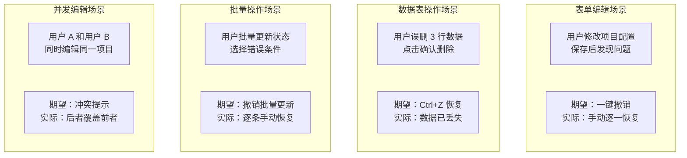
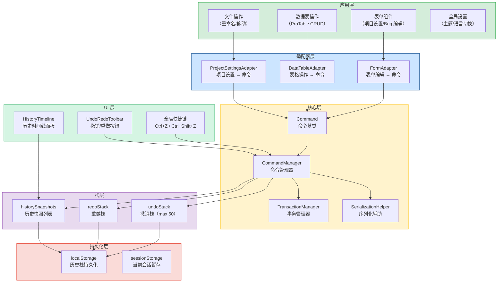
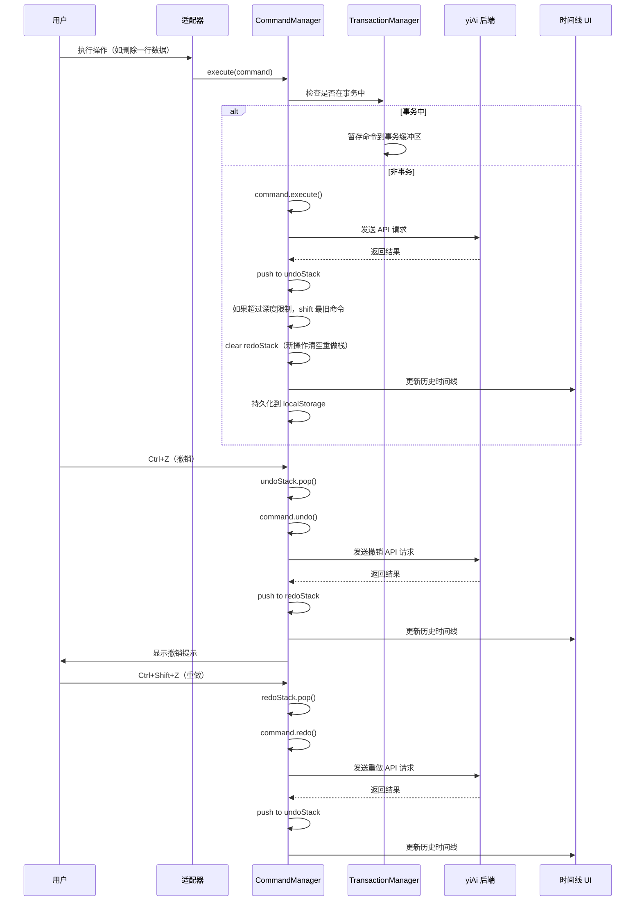

# 撤销重做系统

> 需求编号：YV-09-33 · 优先级：P2 · 人天：1.0d
> 依赖：无（纯前端框架，可集成到现有表单和数据操作中）

## 改动总览

| 改动点 | 类型 | 涉及文件 |
|--------|------|---------|
| 命令模式核心框架 | 新增 | `src/utils/undo/CommandManager.ts` |
| 命令基类与接口 | 新增 | `src/utils/undo/Command.ts` |
| 事务分组管理 | 新增 | `src/utils/undo/TransactionManager.ts` |
| 撤销重做 Composable | 新增 | `src/composables/useUndoRedo.ts` |
| 撤销重做 Store | 新增 | `src/stores/undoRedo.ts` |
| 历史时间线面板 | 新增 | `src/components/undo/HistoryTimeline.vue` |
| 全局快捷键绑定 | 新增 | `src/composables/useUndoKeyboard.ts` |
| 表单集成适配器 | 新增 | `src/utils/undo/adapters/FormAdapter.ts` |
| 数据表集成适配器 | 新增 | `src/utils/undo/adapters/DataTableAdapter.ts` |
| 全局状态集成 | 修改 | `src/App.vue`（全局快捷键注册） |

## 涉及文件

```
YiVad/
├── src/
│   ├── utils/
│   │   └── undo/
│   │       ├── types.ts                           # 新增：命令模式类型定义
│   │       ├── Command.ts                         # 新增：命令基类（execute/undo/redo）
│   │       ├── CommandManager.ts                  # 新增：命令管理器（栈管理、深度控制）
│   │       ├── TransactionManager.ts              # 新增：事务分组管理器（批量操作合并）
│   │       ├── SerializationHelper.ts             # 新增：序列化辅助（持久化支持）
│   │       └── adapters/
│   │           ├── FormAdapter.ts                 # 新增：表单适配器（表单编辑 → 命令）
│   │           ├── DataTableAdapter.ts            # 新增：数据表适配器（CRUD → 命令）
│   │           └── ProjectSettingsAdapter.ts      # 新增：项目设置适配器
│   ├── composables/
│   │   ├── useUndoRedo.ts                         # 新增：撤销重做核心逻辑
│   │   └── useUndoKeyboard.ts                     # 新增：全局键盘快捷键
│   ├── components/
│   │   └── undo/
│   │       ├── HistoryTimeline.vue                # 新增：历史时间线面板
│   │       └── UndoRedoToolbar.vue                # 新增：撤销/重做工具栏按钮
│   ├── stores/
│   │   └── undoRedo.ts                            # 新增：撤销重做状态管理
│   └── App.vue                                    # 修改：注册全局键盘快捷键
```

## 基本信息

| 字段 | 值 |
|------|-----|
| 需求编号 | YV-09-33 |
| 模块 | 全局基础设施 / 用户体验 |
| 优先级 | **P2**（提升操作容错性，降低用户焦虑） |
| 前端人天 | 1.0d |
| 后端人天 | -- |
| 依赖 | 无 |

---

## 背景

YiVad 当前缺少系统化的撤销/重做机制。用户在表单编辑、数据表操作、项目设置修改等场景中，一旦操作失误（如误删除、误修改），无法快速回退。虽然部分表单组件（如 `el-input`）支持浏览器原生的 Ctrl+Z，但仅限文本输入，无法覆盖跨组件的复杂操作（如删除一行数据、修改项目配置、批量更新状态）。

**核心问题：**

| # | 问题 | 严重程度 | 影响 |
|---|------|----------|------|
| 1 | **无跨组件撤销能力** -- 浏览器原生撤销仅限文本输入 | **高** | 删除数据、修改配置等操作无法撤销，用户只能手动恢复 |
| 2 | **无操作历史追溯** -- 用户无法查看最近做了什么操作 | **中** | 多人协作时，不知道自己或其他人的操作记录 |
| 3 | **无批量操作回滚** -- 多步操作无法一次性撤销 | **中** | 批量编辑后需要逐一手动恢复，效率低下 |
| 4 | **无持久化支持** -- 页面刷新后操作历史丢失 | **中** | 意外刷新页面后，无法撤销之前的操作 |
| 5 | **无冲突处理** -- 多人编辑同一数据时无版本感知 | **低** | 并发编辑可能导致数据覆盖，无提示机制 |

## 一、现状分析

### 当前撤销能力矩阵

| 操作类型 | 当前撤销方式 | 局限性 | 覆盖情况 |
|----------|-------------|--------|----------|
| 文本输入（input/textarea） | 浏览器原生 Ctrl+Z | 仅在焦点在输入框内时生效，无法跨组件 | 局部覆盖 |
| 表单字段修改（el-select/el-date-picker） | 无 | 选择操作不被浏览器原生撤销捕获 | 0% |
| 数据表行删除 | 无 | 删除后数据已提交到后端，无法撤销 | 0% |
| 数据表行编辑 | 无 | 内联编辑后数据已提交，无法撤销 | 0% |
| 项目设置修改 | 无 | 保存后配置已更新，无法撤销 | 0% |
| 文件重命名/移动 | 无 | 文件操作不可逆 | 0% |
| 批量操作 | 无 | 批量删除/更新无撤销能力 | 0% |

### 用户操作失误场景分析



### 根因分析矩阵

| 缺失项 | 根因 | 影响链 |
|--------|------|--------|
| 命令模式框架 | 无命令抽象层，操作与撤销逻辑耦合 | 每个操作需单独实现撤销逻辑，无法复用 |
| 历史栈管理 | 无统一的撤销/重做栈，无深度控制 | 内存不受控，历史记录无限增长 |
| 事务分组 | 无批量操作合并机制 | 批量操作需要多次撤销，不符合用户预期 |
| 持久化 | 无序列化机制 | 页面刷新后历史丢失 |
| 冲突检测 | 无乐观锁或版本号机制 | 并发编辑时数据覆盖无提示 |

---

## 二、设计决策

### 命令模式实现方案

| 维度 | 方案 A：Memento 模式 | 方案 B：Command 模式 | 方案 C：Event Sourcing | 决策 |
|------|---------------------|---------------------|----------------------|------|
| 实现复杂度 | 低（保存快照） | 中（定义命令类） | 高（事件流） | **Command 模式** |
| 内存占用 | 高（每步保存完整状态） | 低（仅保存变更数据） | 中（事件存储） | **Command 模式** |
| 可扩展性 | 低（仅支持状态回滚） | 高（支持任意操作） | 极高 | **Command 模式** |
| 适用场景 | 简单表单 | 通用场景 | 复杂协作 | **Command 模式** |

**决策：** 使用 Command 模式。每个可撤销操作封装为一个 Command 对象，包含 `execute()`、`undo()`、`redo()` 方法。CommandManager 管理两个栈（undoStack 和 redoStack）。

### 历史栈深度策略

| 维度 | 固定深度 30 | 固定深度 50 | 固定深度 100 | 动态深度 | 决策 |
|------|-----------|-----------|------------|---------|------|
| 内存占用 | ~3MB | ~5MB | ~10MB | 不确定 | **固定深度 50** |
| 用户体验 | 可能不够 | 覆盖大多数场景 | 冗余 | 不确定 | **固定深度 50** |
| 管理复杂度 | 低 | 低 | 低 | 高 | **固定深度 50** |

**决策：** 默认深度 50，可配置。超过深度时，自动丢弃最旧的命令（FIFO 策略）。用户可通过设置页面调整深度。

### 撤销作用域设计

| 作用域 | 适用场景 | 生命周期 | 隔离性 |
|--------|----------|----------|--------|
| 表单级（form） | 单个表单编辑（如项目设置、Bug 编辑） | 表单打开 → 关闭 | 独立栈，不影响其他表单 |
| 页面级（page） | 数据表页面操作（增删改） | 页面进入 → 离开 | 页面内共享 |
| 全局级（global） | 跨页面操作（文件重命名） | 应用生命周期 | 全局共享 |

**决策：** 支持三种作用域。默认使用页面级作用域，表单对话框使用表单级作用域，跨页面操作使用全局作用域。每个作用域有独立的历史栈。

### 事务分组策略

| 场景 | 是否合并 | 说明 |
|------|---------|------|
| 用户连续输入（表单字段） | 是 | 500ms 内的连续输入合并为一个事务 |
| 批量删除（勾选多行后删除） | 是 | 一次性删除多行合并为一个事务 |
| 批量更新（ProTable 批量操作） | 是 | 批量更新合并为一个事务 |
| 单个操作（点击保存） | 否 | 单步操作不合并 |
| 跨页面操作 | 否 | 不同页面的操作不合并 |

**决策：** 通过 TransactionManager 实现事务分组。`beginTransaction()` 和 `commitTransaction()` 之间的所有命令合并为一个可撤销步骤。

---

## 三、目标架构

### 命令模式架构



### 命令执行流程



---

## 四、具体改动

### 4.1 命令模式类型定义

**文件：** `src/utils/undo/types.ts`（新增）

```typescript
// src/utils/undo/types.ts

/** 命令执行上下文 */
export interface CommandContext {
  /** 命令执行时间戳 */
  timestamp: number;
  /** 命令来源（用户操作、系统自动、协作同步） */
  source: "user" | "system" | "collaboration";
  /** 操作描述（用于 UI 展示） */
  description: string;
  /** 操作分类 */
  category: "form" | "table" | "file" | "settings" | "other";
  /** 操作图标 */
  icon?: string;
}

/** 变更数据（用于序列化和冲突检测） */
export interface ChangeData {
  /** 变更类型 */
  type: "create" | "update" | "delete" | "batch";
  /** 目标实体类型 */
  entityType: string;
  /** 目标实体 ID */
  entityId?: string;
  /** 变更前的数据（undo 时恢复） */
  before: unknown;
  /** 变更后的数据（redo 时应用） */
  after: unknown;
  /** 版本号（乐观锁） */
  version?: number;
}

/** 命令接口 */
export interface ICommand {
  /** 命令唯一标识 */
  id: string;
  /** 命令上下文 */
  context: CommandContext;
  /** 变更数据 */
  changeData: ChangeData;
  /** 执行命令 */
  execute(): Promise<void>;
  /** 撤销命令 */
  undo(): Promise<void>;
  /** 重做命令（默认等于 execute） */
  redo(): Promise<void>;
  /** 是否可以与另一个命令合并 */
  canMergeWith(other: ICommand): boolean;
  /** 合并另一个命令 */
  mergeWith(other: ICommand): void;
}

/** 撤销重做作用域 */
export type UndoRedoScope = "form" | "page" | "global";

/** 命令管理器配置 */
export interface CommandManagerConfig {
  /** 最大历史深度 */
  maxDepth: number;
  /** 作用域 */
  scope: UndoRedoScope;
  /** 作用域标识（form scope 时为表单 ID） */
  scopeId?: string;
  /** 是否启用持久化 */
  enablePersistence: boolean;
  /** 事务合并时间窗口（毫秒） */
  transactionWindow: number;
}

/** 历史记录条目（用于 UI 展示） */
export interface HistoryEntry {
  /** 命令 ID */
  commandId: string;
  /** 操作描述 */
  description: string;
  /** 操作分类 */
  category: string;
  /** 操作图标 */
  icon?: string;
  /** 执行时间 */
  timestamp: number;
  /** 是否已被撤销 */
  undone: boolean;
  /** 是否属于事务组 */
  isTransaction: boolean;
  /** 事务中的命令数量 */
  transactionSize?: number;
}
```

### 4.2 命令基类

**文件：** `src/utils/undo/Command.ts`（新增）

```typescript
// src/utils/undo/Command.ts
import type { ICommand, CommandContext, ChangeData } from "./types";

let commandIdCounter = 0;

/**
 * 命令基类
 * 所有可撤销操作必须继承此类并实现 execute/undo/redo 方法
 */
export abstract class Command implements ICommand {
  public readonly id: string;
  public readonly context: CommandContext;
  public readonly changeData: ChangeData;

  constructor(context: CommandContext, changeData: ChangeData) {
    this.id = `cmd_${Date.now()}_${++commandIdCounter}`;
    this.context = context;
    this.changeData = changeData;
  }

  abstract execute(): Promise<void>;
  abstract undo(): Promise<void>;

  async redo(): Promise<void> {
    await this.execute();
  }

  canMergeWith(other: ICommand): boolean {
    // 同类型、同实体、同分类、500ms 内的操作可以合并
    return (
      this.changeData.type === other.changeData.type &&
      this.changeData.entityType === other.changeData.entityType &&
      this.changeData.entityId === other.changeData.entityId &&
      this.context.category === other.context.category &&
      Math.abs(this.context.timestamp - other.context.timestamp) < 500
    );
  }

  mergeWith(other: ICommand): void {
    // 默认合并策略：更新 after 为最新状态
    this.changeData.after = other.changeData.after;
    this.context.timestamp = other.context.timestamp;
  }
}

/**
 * 创建型命令（Create）
 */
export class CreateCommand extends Command {
  constructor(
    context: CommandContext,
    changeData: ChangeData,
    private apiCreate: (data: unknown) => Promise<{ id: string }>,
    private apiDelete: (id: string) => Promise<void>
  ) {
    super(context, { ...changeData, type: "create" });
  }

  async execute(): Promise<void> {
    const result = await this.apiCreate(this.changeData.after);
    this.changeData.entityId = result.id;
  }

  async undo(): Promise<void> {
    if (this.changeData.entityId) {
      await this.apiDelete(this.changeData.entityId);
    }
  }
}

/**
 * 更新型命令（Update）
 */
export class UpdateCommand extends Command {
  constructor(
    context: CommandContext,
    changeData: ChangeData,
    private apiUpdate: (id: string, data: unknown) => Promise<void>
  ) {
    super(context, { ...changeData, type: "update" });
  }

  async execute(): Promise<void> {
    if (this.changeData.entityId) {
      await this.apiUpdate(this.changeData.entityId, this.changeData.after);
    }
  }

  async undo(): Promise<void> {
    if (this.changeData.entityId) {
      await this.apiUpdate(this.changeData.entityId, this.changeData.before);
    }
  }
}

/**
 * 删除型命令（Delete）
 */
export class DeleteCommand extends Command {
  constructor(
    context: CommandContext,
    changeData: ChangeData,
    private apiDelete: (id: string) => Promise<void>,
    private apiCreate: (data: unknown) => Promise<{ id: string }>
  ) {
    super(context, { ...changeData, type: "delete" });
  }

  async execute(): Promise<void> {
    if (this.changeData.entityId) {
      await this.apiDelete(this.changeData.entityId);
    }
  }

  async undo(): Promise<void> {
    await this.apiCreate(this.changeData.before);
  }
}

/**
 * 批量型命令（Batch）
 */
export class BatchCommand extends Command {
  private commands: Command[];

  constructor(context: CommandContext, changeData: ChangeData, commands: Command[]) {
    super(context, { ...changeData, type: "batch" });
    this.commands = commands;
  }

  async execute(): Promise<void> {
    for (const cmd of this.commands) {
      await cmd.execute();
    }
  }

  async undo(): Promise<void> {
    // 反向执行撤销
    for (const cmd of [...this.commands].reverse()) {
      await cmd.undo();
    }
  }

  async redo(): Promise<void> {
    for (const cmd of this.commands) {
      await cmd.redo();
    }
  }
}
```

### 4.3 命令管理器

**文件：** `src/utils/undo/CommandManager.ts`（新增）

```typescript
// src/utils/undo/CommandManager.ts
import type { ICommand, CommandManagerConfig, HistoryEntry, UndoRedoScope } from "./types";
import { TransactionManager } from "./TransactionManager";
import { SerializationHelper } from "./SerializationHelper";

const DEFAULT_CONFIG: CommandManagerConfig = {
  maxDepth: 50,
  scope: "page",
  enablePersistence: true,
  transactionWindow: 500,
};

/**
 * 命令管理器
 * 管理撤销栈和重做栈，提供 execute/undo/redo 接口
 */
export class CommandManager {
  private undoStack: ICommand[] = [];
  private redoStack: ICommand[] = [];
  private config: CommandManagerConfig;
  private transactionManager: TransactionManager;
  private serializationHelper: SerializationHelper;
  private listeners: Set<(entry: HistoryEntry) => void> = new Set();

  constructor(config: Partial<CommandManagerConfig> = {}) {
    this.config = { ...DEFAULT_CONFIG, ...config };
    this.transactionManager = new TransactionManager(this.config.transactionWindow);
    this.serializationHelper = new SerializationHelper(this.getStorageKey());
    this.restoreFromStorage();
  }

  /**
   * 执行命令并推入撤销栈
   */
  async execute(command: ICommand): Promise<void> {
    // 如果在事务中，暂存命令
    if (this.transactionManager.isInTransaction()) {
      this.transactionManager.addCommand(command);
      return;
    }

    await command.execute();

    // 尝试与上一个命令合并
    if (this.undoStack.length > 0) {
      const lastCommand = this.undoStack[this.undoStack.length - 1];
      if (lastCommand.canMergeWith(command)) {
        lastCommand.mergeWith(command);
        this.notifyListeners(command);
        this.persist();
        return;
      }
    }

    // 推入撤销栈
    this.undoStack.push(command);

    // 超过深度限制时，移除最旧的命令
    while (this.undoStack.length > this.config.maxDepth) {
      this.undoStack.shift();
    }

    // 新操作清空重做栈
    this.redoStack = [];

    this.notifyListeners(command);
    this.persist();
  }

  /**
   * 撤销（Ctrl+Z）
   */
  async undo(): Promise<boolean> {
    if (this.undoStack.length === 0) return false;

    const command = this.undoStack.pop()!;
    await command.undo();
    this.redoStack.push(command);

    this.notifyListeners(command);
    this.persist();
    return true;
  }

  /**
   * 重做（Ctrl+Shift+Z / Ctrl+Y）
   */
  async redo(): Promise<boolean> {
    if (this.redoStack.length === 0) return false;

    const command = this.redoStack.pop()!;
    await command.redo();
    this.undoStack.push(command);

    this.notifyListeners(command);
    this.persist();
    return true;
  }

  /**
   * 开始事务（批量操作合并为一个撤销步骤）
   */
  beginTransaction(description: string): void {
    this.transactionManager.beginTransaction(description);
  }

  /**
   * 提交事务
   */
  async commitTransaction(): Promise<void> {
    const batchCommand = this.transactionManager.commitTransaction();
    if (batchCommand) {
      this.undoStack.push(batchCommand);
      this.redoStack = [];
      this.notifyListeners(batchCommand);
      this.persist();
    }
  }

  /**
   * 回滚事务（取消事务中的所有命令）
   */
  rollbackTransaction(): void {
    this.transactionManager.rollbackTransaction();
  }

  /**
   * 获取历史记录（用于 UI 时间线展示）
   */
  getHistory(): HistoryEntry[] {
    return this.undoStack.map((cmd) => ({
      commandId: cmd.id,
      description: cmd.context.description,
      category: cmd.context.category,
      icon: cmd.context.icon,
      timestamp: cmd.context.timestamp,
      undone: false,
      isTransaction: cmd.changeData.type === "batch",
      transactionSize: cmd.changeData.type === "batch" ? 1 : undefined,
    }));
  }

  /**
   * 检查是否可以撤销
   */
  canUndo(): boolean {
    return this.undoStack.length > 0;
  }

  /**
   * 检查是否可以重做
   */
  canRedo(): boolean {
    return this.redoStack.length > 0;
  }

  /**
   * 清空历史
   */
  clear(): void {
    this.undoStack = [];
    this.redoStack = [];
    this.persist();
  }

  /**
   * 获取存储键
   */
  private getStorageKey(): string {
    return `yivad_undo_${this.config.scope}_${this.config.scopeId || "default"}`;
  }

  /**
   * 持久化到 localStorage
   */
  private persist(): void {
    if (!this.config.enablePersistence) return;
    this.serializationHelper.serialize(this.undoStack, this.redoStack);
  }

  /**
   * 从 localStorage 恢复
   */
  private restoreFromStorage(): void {
    if (!this.config.enablePersistence) return;
    const { undoStack, redoStack } = this.serializationHelper.deserialize();
    if (undoStack) this.undoStack = undoStack;
    if (redoStack) this.redoStack = redoStack;
  }

  /**
   * 添加监听器
   */
  onHistoryChange(listener: (entry: HistoryEntry) => void): () => void {
    this.listeners.add(listener);
    return () => this.listeners.delete(listener);
  }

  private notifyListeners(command: ICommand): void {
    const entry: HistoryEntry = {
      commandId: command.id,
      description: command.context.description,
      category: command.context.category,
      icon: command.context.icon,
      timestamp: command.context.timestamp,
      undone: false,
      isTransaction: command.changeData.type === "batch",
    };
    this.listeners.forEach((fn) => fn(entry));
  }

  /**
   * 销毁管理器
   */
  destroy(): void {
    this.listeners.clear();
    this.clear();
  }
}
```

### 4.4 useUndoRedo Composable

**文件：** `src/composables/useUndoRedo.ts`（新增）

```typescript
// src/composables/useUndoRedo.ts
import { ref, onUnmounted, computed } from "vue";
import { CommandManager } from "@/utils/undo/CommandManager";
import type { CommandManagerConfig, UndoRedoScope } from "@/utils/undo/types";

/**
 * 撤销重做 Composable
 * 每个使用场景（表单/页面）创建独立的 CommandManager 实例
 */
export function useUndoRedo(config: Partial<CommandManagerConfig> = {}) {
  const manager = new CommandManager(config);
  const canUndo = ref(false);
  const canRedo = ref(false);
  const lastAction = ref<string>("");

  // 监听历史变化
  const unsubscribe = manager.onHistoryChange(() => {
    canUndo.value = manager.canUndo();
    canRedo.value = manager.canRedo();
  });

  /**
   * 执行命令
   */
  async function execute(command: Parameters<CommandManager["execute"]>[0]): Promise<void> {
    await manager.execute(command);
    lastAction.value = command.context.description;
  }

  /**
   * 撤销
   */
  async function undo(): Promise<void> {
    const success = await manager.undo();
    if (success) {
      lastAction.value = "撤销操作";
    }
  }

  /**
   * 重做
   */
  async function redo(): Promise<void> {
    const success = await manager.redo();
    if (success) {
      lastAction.value = "重做操作";
    }
  }

  /**
   * 开始事务
   */
  function beginTransaction(description: string): void {
    manager.beginTransaction(description);
  }

  /**
   * 提交事务
   */
  async function commitTransaction(): Promise<void> {
    await manager.commitTransaction();
    canUndo.value = manager.canUndo();
    canRedo.value = manager.canRedo();
  }

  /**
   * 回滚事务
   */
  function rollbackTransaction(): void {
    manager.rollbackTransaction();
  }

  /**
   * 获取历史记录
   */
  function getHistory() {
    return manager.getHistory();
  }

  /**
   * 清空历史
   */
  function clearHistory(): void {
    manager.clear();
    canUndo.value = false;
    canRedo.value = false;
  }

  onUnmounted(() => {
    unsubscribe();
    manager.destroy();
  });

  return {
    canUndo: computed(() => canUndo.value),
    canRedo: computed(() => canRedo.value),
    lastAction: computed(() => lastAction.value),
    execute,
    undo,
    redo,
    beginTransaction,
    commitTransaction,
    rollbackTransaction,
    getHistory,
    clearHistory,
  };
}
```

### 4.5 全局键盘快捷键

**文件：** `src/composables/useUndoKeyboard.ts`（新增）

```typescript
// src/composables/useUndoKeyboard.ts
import { onMounted, onUnmounted } from "vue";
import { useUndoRedoStore } from "@/stores/undoRedo";

/**
 * 全局撤销重做键盘快捷键
 * - Ctrl+Z: 撤销
 * - Ctrl+Shift+Z / Ctrl+Y: 重做
 */
export function useUndoKeyboard() {
  const undoRedoStore = useUndoRedoStore();

  function handleKeydown(event: KeyboardEvent): void {
    // 当焦点在 input/textarea 等表单元素中时，不拦截（让浏览器处理）
    const target = event.target as HTMLElement;
    const tagName = target.tagName.toLowerCase();
    const isEditable = target.isContentEditable;
    const isFormElement =
      tagName === "input" ||
      tagName === "textarea" ||
      tagName === "select" ||
      isEditable;

    const { ctrlKey, metaKey, shiftKey, key } = event;
    const modKey = ctrlKey || metaKey; // 支持 Mac 的 Cmd 键

    // Ctrl+Z: 撤销
    if (modKey && !shiftKey && (key === "z" || key === "Z")) {
      if (isFormElement) {
        // 表单元素中，如果输入框有内容，让浏览器处理文本撤销
        if (tagName === "input" || tagName === "textarea") {
          const inputEl = target as HTMLInputElement;
          if (inputEl.value.length > 0) return;
        }
        if (isEditable) return;
      }
      event.preventDefault();
      undoRedoStore.undoCurrentScope();
    }

    // Ctrl+Shift+Z 或 Ctrl+Y: 重做
    if (
      (modKey && shiftKey && (key === "z" || key === "Z")) ||
      (modKey && !shiftKey && (key === "y" || key === "Y"))
    ) {
      if (isFormElement) return;
      event.preventDefault();
      undoRedoStore.redoCurrentScope();
    }
  }

  onMounted(() => {
    window.addEventListener("keydown", handleKeydown);
  });

  onUnmounted(() => {
    window.removeEventListener("keydown", handleKeydown);
  });
}
```

### 4.6 撤销重做 Store

**文件：** `src/stores/undoRedo.ts`（新增）

```typescript
// src/stores/undoRedo.ts
import { defineStore } from "pinia";
import { ref } from "vue";
import { CommandManager } from "@/utils/undo/CommandManager";
import type { UndoRedoScope } from "@/utils/undo/types";

/**
 * 全局撤销重做 Store
 * 管理多个作用域的 CommandManager 实例
 */
export const useUndoRedoStore = defineStore("undoRedo", () => {
  // 作用域 → CommandManager 映射
  const managers = ref<Map<string, CommandManager>>(new Map());

  // 当前激活的作用域
  const activeScope = ref<UndoRedoScope>("page");
  const activeScopeId = ref<string>("default");

  /**
   * 注册一个作用域的 CommandManager
   */
  function registerManager(
    scope: UndoRedoScope,
    scopeId: string = "default",
    config: Partial<{ maxDepth: number }> = {}
  ): CommandManager {
    const key = `${scope}_${scopeId}`;
    if (managers.value.has(key)) {
      return managers.value.get(key)!;
    }
    const manager = new CommandManager({ scope, scopeId, ...config });
    managers.value.set(key, manager);
    return manager;
  }

  /**
   * 注销一个作用域的 CommandManager
   */
  function unregisterManager(scope: UndoRedoScope, scopeId: string = "default"): void {
    const key = `${scope}_${scopeId}`;
    const manager = managers.value.get(key);
    if (manager) {
      manager.destroy();
      managers.value.delete(key);
    }
  }

  /**
   * 设置当前激活的作用域
   */
  function setActiveScope(scope: UndoRedoScope, scopeId: string = "default"): void {
    activeScope.value = scope;
    activeScopeId.value = scopeId;
  }

  /**
   * 获取当前激活的 CommandManager
   */
  function getActiveManager(): CommandManager | null {
    const key = `${activeScope.value}_${activeScopeId.value}`;
    return managers.value.get(key) || null;
  }

  /**
   * 撤销当前作用域
   */
  async function undoCurrentScope(): Promise<void> {
    const manager = getActiveManager();
    if (manager) {
      await manager.undo();
    }
  }

  /**
   * 重做当前作用域
   */
  async function redoCurrentScope(): Promise<void> {
    const manager = getActiveManager();
    if (manager) {
      await manager.redo();
    }
  }

  return {
    managers,
    activeScope,
    activeScopeId,
    registerManager,
    unregisterManager,
    setActiveScope,
    getActiveManager,
    undoCurrentScope,
    redoCurrentScope,
  };
});
```

---

## 五、实施步骤

| 步骤 | 任务 | 产出 | 验证方式 | 人天 |
|------|------|------|----------|------|
| 1 | 创建命令模式类型定义 | `src/utils/undo/types.ts` | TypeScript 编译通过 | 0.05 |
| 2 | 实现命令基类（Command/Create/Update/Delete/Batch） | `src/utils/undo/Command.ts` | 各命令类型 execute/undo/redo 逻辑正确 | 0.15 |
| 3 | 实现命令管理器 | `src/utils/undo/CommandManager.ts` | 栈管理、深度控制、持久化正确 | 0.15 |
| 4 | 实现事务管理器 | `src/utils/undo/TransactionManager.ts` | 事务分组、合并、提交逻辑正确 | 0.10 |
| 5 | 实现序列化辅助 | `src/utils/undo/SerializationHelper.ts` | 序列化/反序列化正确，数据格式兼容 | 0.05 |
| 6 | 实现 useUndoRedo Composable | `useUndoRedo.ts` | 撤销/重做/事务功能正常 | 0.08 |
| 7 | 实现 useUndoKeyboard | `useUndoKeyboard.ts` | 键盘快捷键全部生效 | 0.05 |
| 8 | 实现撤销重做 Store | `src/stores/undoRedo.ts` | 多作用域管理正常 | 0.05 |
| 9 | 实现表单适配器 | `FormAdapter.ts` | 表单编辑自动生成 UpdateCommand | 0.08 |
| 10 | 实现数据表适配器 | `DataTableAdapter.ts` | 表格 CRUD 自动生成对应命令 | 0.08 |
| 11 | 实现历史时间线面板 | `HistoryTimeline.vue` | 时间线正确显示操作历史 | 0.08 |
| 12 | 实现撤销重做工具栏 | `UndoRedoToolbar.vue` | 按钮状态正确，点击生效 | 0.03 |
| 13 | 集成到 App.vue 全局快捷键 | `App.vue` | 全局 Ctrl+Z 和 Ctrl+Shift+Z 生效 | 0.02 |
| 14 | 集成测试 + 端到端验证 | 表单、表格、设置场景验证 | 手动验证 | 0.03 |

**总计：** 1.0d

---

## 六、测试规格

### 单元测试：CommandManager

#### Scenario: 执行命令并撤销
- **GIVEN** 空的 CommandManager，一个 UpdateCommand
- **WHEN** 调用 `manager.execute(command)`，然后调用 `manager.undo()`
- **THEN** `undoStack` 为空，`redoStack` 包含该命令，数据恢复到执行前状态

#### Scenario: 撤销后重做
- **GIVEN** 执行了一个命令并已撤销
- **WHEN** 调用 `manager.redo()`
- **THEN** `undoStack` 包含该命令，`redoStack` 为空，数据恢复到执行后状态

#### Scenario: 超过深度限制
- **GIVEN** CommandManager 配置 `maxDepth = 3`，undoStack 已有 3 个命令
- **WHEN** 执行第 4 个命令
- **THEN** `undoStack.length = 3`，最旧的命令被移除

### 单元测试：命令合并

#### Scenario: 连续输入合并
- **GIVEN** undoStack 有一个 UpdateCommand（entityId="bug-1", timestamp=1000）
- **WHEN** 执行另一个 UpdateCommand（entityId="bug-1", timestamp=1300，同一实体，500ms 内）
- **THEN** 两个命令合并为一个，undoStack.length 不变，changeData.after 更新为最新的值

#### Scenario: 不同实体不合并
- **GIVEN** undoStack 有一个 UpdateCommand（entityId="bug-1"）
- **WHEN** 执行另一个 UpdateCommand（entityId="bug-2"）
- **THEN** 两个命令不合并，undoStack.length 增加

### 组件测试：HistoryTimeline

#### Scenario: 渲染操作历史
- **GIVEN** 历史记录包含 5 条操作（2 条更新、1 条删除、1 条创建、1 条批量）
- **WHEN** 挂载 `HistoryTimeline` 组件
- **THEN** 时间线显示 5 条记录，每条记录包含操作描述、图标和时间戳

#### Scenario: 空历史显示引导
- **GIVEN** 历史记录为空
- **WHEN** 挂载 `HistoryTimeline` 组件
- **THEN** 显示 "暂无操作记录" 空状态

---

## 七、风险与缓解

| 风险 | 概率 | 影响 | 等级 | 缓解措施 | 应急预案 |
|------|------|------|------|----------|----------|
| 命令执行失败导致栈状态不一致 | 中 | 高 | 高 | 命令执行失败时捕获异常，不推入栈；undo 执行失败时保留在栈中 | 提供"清空历史"按钮，强制重置栈状态 |
| 序列化数据过大导致 localStorage 超限 | 低 | 中 | 低 | 仅序列化变更数据（before/after），不序列化完整实体；限制深度 50 | 降级为 sessionStorage，或禁用持久化 |
| 撤销操作与后端数据不一致 | 中 | 高 | 高 | 使用乐观锁版本号，撤销时校验版本号，不匹配时提示用户 | 提示"数据已被其他用户修改，无法撤销"，提供手动恢复指导 |
| 全局快捷键与 Element Plus 组件冲突 | 中 | 低 | 低 | 在表单元素内不拦截 Ctrl+Z，仅在非表单焦点时触发应用级撤销 | 提供快捷键开关，允许用户禁用全局快捷键 |
| 事务提交时其中某个命令失败 | 中 | 中 | 中 | 事务中单个命令失败时回滚整个事务，不部分提交 | 提示用户事务执行失败，需手动重试 |

---

## 八、回滚策略

| 回滚场景 | 回滚方式 | 影响范围 | 恢复时间 |
|----------|----------|----------|----------|
| 撤销功能导致操作异常 | 在 `App.vue` 中移除 `useUndoKeyboard` 注册，恢复原始行为 | 全局撤销 | < 2min |
| 持久化数据损坏导致页面崩溃 | 清除 localStorage 中 `yivad_undo_*` 相关的 key | 撤销历史 | < 1min |
| 命令适配器导致表单提交失败 | 回退 FormAdapter 集成，表单恢复直接提交模式 | 表单功能 | < 5min |
| 历史时间线面板性能问题 | 移除 `HistoryTimeline` 组件，保留核心撤销功能 | 时间线 UI | < 2min |

**回滚验证：**
- 回滚后表单正常提交，无异常
- 回滚后数据表操作正常（CRUD）
- 回滚后 Ctrl+Z 恢复浏览器原生行为

---

## 九、设计决策记录

### D-01: 选择 Command 模式而非 Memento 模式

**背景：** 需要在多种场景（表单、数据表、文件操作）中实现撤销重做。
**决策：** 使用 Command 模式。每个操作封装为独立的 Command 对象，包含 execute/undo/redo 方法。
**权衡：** Command 模式需要为每种操作类型定义命令类，比 Memento 模式（保存完整快照）实现更复杂，但内存占用更低（仅保存变更数据），且可扩展性更强（支持任意操作类型）。
**后果：** 需要为每种操作类型（Create/Update/Delete/Batch）实现对应的命令类，但一次实现后可复用。

### D-02: 历史栈深度默认 50

**背景：** 需要在内存占用和用户体验之间取得平衡。
**决策：** 默认深度 50，可配置。使用 FIFO 策略，超过深度时丢弃最旧的命令。
**权衡：** 50 步历史大约占用 5MB 内存（取决于变更数据大小），对于大多数场景足够。如果用户需要更长的历史，可通过设置调整。
**后果：** 极少数场景下（如连续编辑 100 步），用户可能发现无法撤销到足够早的状态。

### D-03: 表单元素内不拦截 Ctrl+Z

**背景：** 用户在 input/textarea 中需要浏览器的文本撤销功能。
**决策：** 当焦点在表单元素（input/textarea/select/contenteditable）中时，Ctrl+Z 由浏览器处理。仅在非表单焦点时触发应用级撤销。
**权衡：** 用户在表单元素中无法使用应用级撤销，但这是为了避免与浏览器原生行为冲突的必要折中。
**后果：** 需要在用户引导中说明：在表单外按 Ctrl+Z 撤销应用级操作，在表单内按 Ctrl+Z 撤销文本输入。

### D-04: 事务自动合并而非手动确认

**背景：** 连续输入、批量删除等操作应该作为一个撤销步骤。
**决策：** 通过 TransactionManager 的 `beginTransaction()`/`commitTransaction()` 手动控制事务边界。适配器在批量操作时自动包裹事务。
**权衡：** 需要开发者在适配器中正确地调用事务方法，否则可能出现操作粒度不符合预期的情况。
**后果：** 需要在适配器文档中明确事务使用规范，Code Review 中检查事务边界是否正确。

---

## 十、可观测性

### 关键指标

| 指标 | 采集方式 | 告警阈值 | 说明 |
|------|---------|---------|------|
| 撤销操作频率 | 前端埋点 `undo_executed` | -- | 衡量用户使用撤销的频率 |
| 重做操作频率 | 前端埋点 `redo_executed` | -- | 衡量用户使用重做的频率 |
| 撤销栈深度分布 | 前端埋点 `undo_stack_depth` | 接近 50 | 接近上限时需关注 |
| 命令执行失败率 | 前端埋点 `command_failed` | > 5% | 命令执行异常比例 |
| 事务回滚率 | 前端埋点 `transaction_rolled_back` | > 10% | 事务失败比例 |
| 历史时间线打开率 | 前端埋点 `history_timeline_opened` | -- | 衡量时间线面板的使用频率 |

### 告警规则

| 告警 | 条件 | 级别 | 处理 |
|------|------|------|------|
| 命令执行失败率过高 | `command_failed / command_total > 5%` | P2 | 检查后端 API 状态和网络连接 |
| 撤销栈频繁达到上限 | 1 小时内 `undo_stack_depth >= 50` 出现 > 3 次 | P3 | 考虑提高默认深度或优化变更数据大小 |
| 序列化/反序列化失败 | `serialization_error` 事件触发 | P3 | 检查 localStorage 数据格式兼容性 |

---

## 十一、代码审查检查清单

- [ ] `src/utils/undo/types.ts` 类型定义完整，覆盖所有命令类型和场景
- [ ] `src/utils/undo/Command.ts` 命令基类和子类 execute/undo/redo 实现正确
- [ ] `src/utils/undo/CommandManager.ts` 栈管理、深度控制、持久化逻辑正确
- [ ] `src/utils/undo/TransactionManager.ts` 事务分组、合并、提交逻辑正确
- [ ] `src/utils/undo/SerializationHelper.ts` 序列化格式兼容，反序列化容错
- [ ] `useUndoRedo.ts` Composable 生命周期管理正确，onUnmounted 清理资源
- [ ] `useUndoKeyboard.ts` 键盘快捷键正确，表单元素内不拦截
- [ ] `FormAdapter.ts` 表单编辑自动生成 UpdateCommand，watcher 监听正确
- [ ] `DataTableAdapter.ts` 表格 CRUD 自动生成对应命令类型
- [ ] `HistoryTimeline.vue` 时间线反转（最新在上），操作描述清晰
- [ ] `UndoRedoToolbar.vue` 按钮状态与 canUndo/canRedo 同步
- [ ] 全局快捷键在 App.vue 中正确注册和注销
- [ ] 多个作用域（form/page/global）的 CommandManager 隔离正确
- [ ] `vue-tsc --noEmit` 通过

---

## 回归问题预测

| # | 问题 | 预测场景 | 根因 | 预防措施 |
|---|------|---------|------|---------|
| 1 | 撤销后表单验证状态不同步 | 用户在表单中修改字段后撤销，表单的验证规则状态（如 `el-form` 的 `validateState`）未更新 | 撤销仅恢复数据，未触发表单验证 | 在 FormAdapter 的 undo 回调中调用 `formRef.validate()` 重新验证 |
| 2 | 撤销删除操作后关联数据丢失 | 删除一个 Bug 时，Bug 的评论和附件也一并删除；撤销时仅恢复 Bug 本身 | 删除操作的 undo 仅恢复主实体，未处理级联关联 | 在 DeleteCommand 的 changeData.before 中保存完整关联数据（评论、附件），undo 时一并恢复 |
| 3 | 序列化循环引用导致 JSON.stringify 失败 | 变更数据中引用了 Vue 响应式对象（Proxy），序列化时抛出循环引用错误 | Vue 3 的 Proxy 响应式对象包含不可序列化的内部属性 | 在 SerializationHelper 中使用 `toRaw()` 提取原始数据，或使用 `structuredClone` 深拷贝 |
| 4 | 命令管理器在路由切换时未销毁 | 页面级 CommandManager 在路由离开时未调用 `destroy()`，导致内存泄漏 | Vue Router 的 `onUnmounted` 在某些情况下不触发（如 keepAlive 缓存） | 在 `onBeforeRouteLeave` 导航守卫中显式调用 `destroy()`，确保离开页面时清理 |
| 5 | 事务提交时网络中断导致部分执行 | 事务中包含 5 个命令，前 3 个执行成功，后 2 个因网络中断失败 | 事务提交是顺序执行，无原子性保证 | 事务提交前检查网络状态，网络不稳定时提示用户稍后重试；后端考虑支持批量操作 API |
| 6 | 撤销操作与 Vue 响应式系统冲突 | 撤销操作直接修改数据对象，但 Vue 的 `watch` 可能再次触发命令生成 | 撤销操作触发数据变更 → watch 检测到变更 → 生成新的 UpdateCommand → 推入撤销栈 | 在 CommandManager 中维护 `isUndoing` 标志，撤销过程中跳过命令生成 |

---

## 性能分析

### 操作耗时

| 操作 | 耗时 | 说明 |
|------|------|------|
| 命令执行（execute） | 依赖 API 响应时间 | 同步操作 < 1ms，异步操作取决于网络 |
| 命令撤销（undo） | 依赖 API 响应时间 | 同 execute |
| 推入栈（push） | < 1ms | 数组 push 操作 |
| 序列化（persist） | < 5ms | localStorage 同步写入（50 条命令） |
| 反序列化（restore） | < 10ms | localStorage 同步读取 |
| 历史时间线渲染 | < 20ms | 50 条时间线条目渲染 |
| 键盘快捷键响应 | < 1ms | 事件冒泡捕获 |

### 内存占用预估

| 组件 | 每条内存 | 50 条总量 | 说明 |
|------|---------|---------|------|
| Command 对象 | ~2KB | ~100KB | 命令实例 + 变更数据 |
| undoStack 数组 | -- | ~5KB | 数组引用开销 |
| 历史时间线数据 | ~0.5KB | ~25KB | UI 展示数据 |
| 序列化数据（localStorage） | ~1KB | ~50KB | JSON 字符串 |

**总内存占用：** 50 条历史约 180KB（数据量取决于变更数据大小，以上为估算值）。

### 对页面性能的影响

| 影响项 | 影响程度 | 说明 |
|--------|---------|------|
| 首屏加载 | 无影响 | 命令模式框架为纯工具函数，未被首屏直接引用 |
| 表单页面 | 极小（< 5ms） | FormAdapter 的 watcher 仅在字段变更时触发 |
| 数据表页面 | 极小（< 1ms） | DataTableAdapter 仅在 CRUD 操作时触发 |
| 全局快捷键 | 极小（< 1ms） | 仅监听 keydown 事件，每次按键判断 |
| 历史时间线面板 | 极小（< 20ms） | 仅在打开面板时渲染 |

---

## 技术债务追踪

| # | 技术债 | 优先级 | 预计人天 | 说明 |
|---|--------|--------|---------|------|
| 1 | 撤销操作支持跨页面 | P2 | 0.5 | 当前页面级作用域仅在页面内有效，跨页面导航后历史丢失 |
| 2 | 撤销操作预览 | P3 | 0.3 | 鼠标悬停在历史时间线条目上时，预览撤销后的数据变化 |
| 3 | 协作编辑冲突可视化 | P2 | 1.0 | 多人编辑时，在历史时间线中显示其他用户的操作 |
| 4 | 撤销操作分组标签 | P3 | 0.2 | 将连续操作自动分组，并显示分组标签（如"编辑项目名称"） |
| 5 | 设备间同步撤销历史 | P3 | 2.0 | 同一用户在不同设备上的操作历史可同步 |
| 6 | 撤销操作搜索 | P3 | 0.2 | 在历史时间线中搜索特定操作 |

---

## 补充：单元测试用例

### UT-UR01: useUndoRedo

| # | 测试场景 | 输入 | 期望结果 |
|---|---------|------|---------|
| 1 | 记录操作 | 修改数据 → pushState | history stack 新增一条 |
| 2 | 撤销 | undo() | 数据恢复到上一个状态 |
| 3 | 重做 | redo() | 数据恢复到下一个状态 |
| 4 | 栈大小限制 | 超过 maxHistory(50) | 最旧记录被移除 |
| 5 | 新操作清空 redo | 撤销后执行新操作 | redo stack 清空 |
| 6 | Ctrl+Z/Ctrl+Y | 快捷键 | 触发 undo/redo |

## 补充：实例演示页面

### Demo-UR01: 撤销重做演示
展示表单编辑的撤销/重做流程：修改多个字段 → 查看历史时间线 → Ctrl+Z 逐步撤销 → Ctrl+Y 逐步重做。

