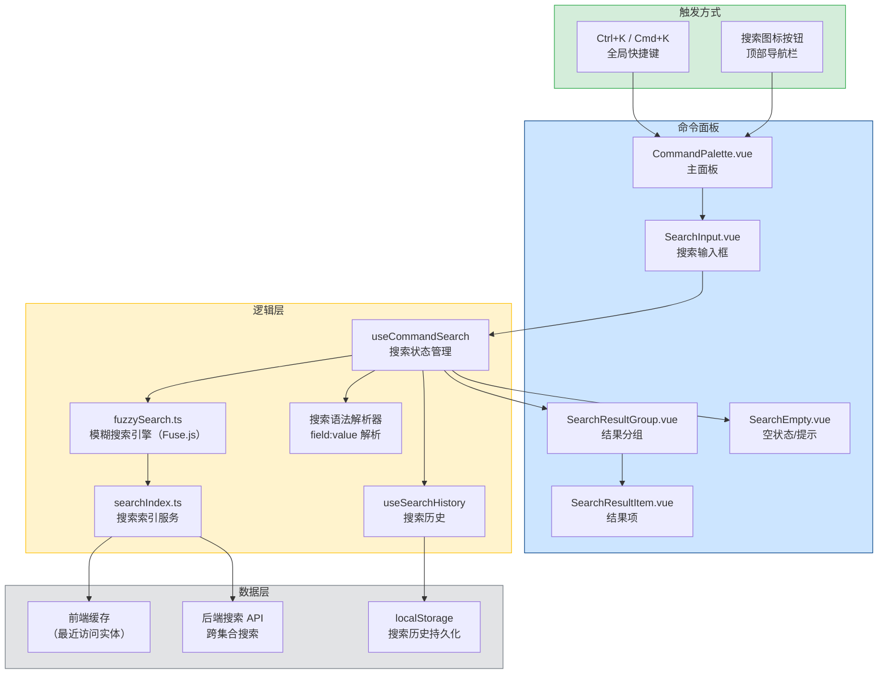

# 全局搜索增强

> 需求编号：YV-09-36 · 优先级：P2 · 人天：1.0d
> 依赖：YiAi 后端搜索端点（需支持跨集合搜索）

## 改动总览

| 改动点 | 类型 | 涉及文件 |
|--------|------|---------|
| 命令面板组件 | 新增 | `src/components/CommandPalette/` |
| 搜索 Composable | 新增 | `src/composables/useCommandSearch.ts` |
| 模糊搜索引擎 | 新增 | `src/utils/fuzzySearch.ts` |
| 搜索索引服务 | 新增 | `src/services/searchIndex.ts` |
| 搜索历史管理 | 新增 | `src/composables/useSearchHistory.ts` |
| 快捷键注册 | 修改 | `src/composables/useKeyboardShortcut.ts` |
| 搜索服务端点 | 新增 | YiAi `services/search/search_service.py` |

## 涉及文件

```
YiVad/
├── src/
│   ├── components/
│   │   └── CommandPalette/
│   │       ├── CommandPalette.vue                # 新增：命令面板主组件
│   │       ├── SearchResultItem.vue              # 新增：搜索结果项
│   │       ├── SearchResultGroup.vue             # 新增：搜索结果分组
│   │       ├── SearchInput.vue                   # 新增：搜索输入框
│   │       ├── SearchEmpty.vue                   # 新增：空状态
│   │       └── index.ts                          # 新增：统一导出
│   ├── composables/
│   │   ├── useCommandSearch.ts                   # 新增：搜索状态管理
│   │   ├── useSearchHistory.ts                   # 新增：搜索历史管理
│   │   └── useKeyboardShortcut.ts                # 修改：添加 Ctrl+K 快捷键
│   ├── utils/
│   │   └── fuzzySearch.ts                        # 新增：模糊搜索算法
│   └── services/
│       └── searchIndex.ts                        # 新增：搜索索引服务

YiAi/
└── services/
    └── search/
        └── search_service.py                     # 新增：跨集合搜索端点
```

## 基本信息

| 字段 | 值 |
|------|-----|
| 需求编号 | YV-09-36 |
| 模块 | 全项目用户导航 |
| 优先级 | **P2**（提升导航效率，非阻塞性） |
| 前端人天 | 1.0d |
| 后端人天 | 0.3d（跨集合搜索端点） |
| 依赖 | YiAi 后端搜索端点 |

---

## 背景

YiVad 当前有基础的全局搜索功能（需求 17），但缺乏命令面板式的快速搜索体验。用户需要在不同页面间切换以查找项目、问题、Bug、模块、知识文章等实体，操作路径长且效率低。现代管理后台（如 Linear、Notion、Vercel）普遍采用命令面板（Cmd+K）作为核心导航入口，YiVad 需要类似的体验。

**核心问题：**

| # | 问题 | 严重程度 | 影响 |
|---|------|----------|------|
| 1 | **无命令面板** -- 搜索需要导航到搜索页面，无法全局触发 | **高** | 用户需要 3-4 次点击才能开始搜索，效率低下 |
| 2 | **搜索范围有限** -- 当前搜索仅覆盖部分实体类型 | **中** | 用户无法搜索文件、用户、会话等实体 |
| 3 | **无搜索语法** -- 不支持 `type:issue status:open` 等过滤语法 | **中** | 高级用户无法精确过滤搜索结果 |
| 4 | **无搜索历史** -- 每次搜索需重新输入 | **低** | 重复搜索场景效率低 |
| 5 | **键盘操作不便** -- 搜索结果不支持键盘导航，必须使用鼠标 | **中** | 键盘用户操作效率低，不符合无障碍要求 |

**挑战：**
- 跨 8 种实体类型搜索，需要统一的搜索索引和结果格式
- 模糊搜索需要在 300ms 内返回结果，对前端搜索性能有要求
- 搜索语法解析需要处理 `type:issue status:open project:PLANE` 等组合过滤
- 键盘导航需要处理复杂的焦点管理（输入框 ↔ 结果列表）

---

## 一、现状分析

### 当前搜索流程


### 根因分析矩阵

| 缺失项 | 根因 | 影响链 |
|--------|------|--------|
| 命令面板 | 无全局快捷键触发搜索面板，搜索是页面级功能 | 用户需要离开当前上下文才能搜索，打断工作流 |
| 跨实体搜索 | 后端搜索端点按实体类型分离，无统一搜索接口 | 用户需要知道目标实体类型，切换搜索范围 |
| 搜索语法 | 搜索输入未解析过滤语法，仅支持关键词匹配 | 高级用户无法精确过滤，结果数量过多时效率低 |
| 搜索历史 | 搜索词未持久化存储，刷新后丢失 | 重复搜索需重新输入，无法快速回顾历史搜索 |
| 键盘导航 | 搜索结果列表无键盘导航支持，仅支持鼠标点击 | 键盘用户无法高效浏览搜索结果，需使用 Tab 键逐项移动 |

---

## 二、设计决策

### 命令面板触发方式选型

| 维度 | 全局快捷键（Ctrl+K） | 搜索图标按钮 | 两者结合 | 决策 |
|------|---------------------|------------|---------|------|
| 触发速度 | 最快（键盘） | 慢（需要鼠标） | 最佳 | **两者结合** |
| 可见性 | 低（需要用户知道快捷键） | 高（可见按钮） | 最佳 | **两者结合** |
| 用户覆盖 | 键盘用户 | 鼠标用户 | 所有用户 | **两者结合** |
| 实现复杂度 | 低 | 低 | 中 | **两者结合** |

**决策：** 同时支持 Ctrl+K / Cmd+K 全局快捷键和顶部导航栏搜索按钮。快捷键满足键盘用户，按钮满足鼠标用户和新用户引导。

### 搜索架构选型

| 维度 | 纯前端搜索 | 纯后端搜索 | 混合搜索 | 决策 |
|------|----------|----------|---------|------|
| 响应速度 | 最快（本地） | 慢（网络延迟） | 快（前端缓存 + 后端补充） | **混合搜索** |
| 数据实时性 | 低（依赖缓存更新） | 高（实时查询） | 高 | **混合搜索** |
| 搜索能力 | 中等（模糊匹配） | 强（全文搜索） | 强 | **混合搜索** |
| 离线支持 | 是 | 否 | 部分 | **混合搜索** |
| 实现复杂度 | 中 | 低 | 高 | **混合搜索** |

**决策：** 采用混合搜索架构。前端缓存最近访问的实体（项目、页面等），提供即时搜索反馈。后端提供全量搜索和精确过滤。

### 模糊搜索算法选型

| 维度 | Fuse.js | 自实现 Levenshtein | 正则匹配 | 决策 |
|------|---------|-------------------|---------|------|
| 搜索质量 | 好（多种算法组合） | 中（编辑距离） | 低（无模糊匹配） | **Fuse.js** |
| 体积 | ~15KB gzip | ~1KB | < 1KB | **Fuse.js** |
| 性能 | 好（优化索引） | 中（O(n*m)） | 好 | **Fuse.js** |
| 中文支持 | 好 | 中 | 差 | **Fuse.js** |
| 配置灵活性 | 高（阈值、权重、键） | 低 | 低 | **Fuse.js** |

**决策：** 使用 Fuse.js 作为前端模糊搜索引擎。轻量级（15KB gzip），支持中文模糊搜索，配置灵活。

### 搜索语法设计

| 维度 | 类似 GitHub 语法 | 自然语言 | 纯关键词 | 决策 |
|------|----------------|---------|---------|------|
| 学习成本 | 中（需要学习语法） | 低 | 极低 | **类似 GitHub 语法** |
| 表达能力 | 高 | 中（歧义） | 低 | **类似 GitHub 语法** |
| 实现复杂度 | 中 | 高（NLP） | 低 | **类似 GitHub 语法** |
| 用户预期 | 高（开发者熟悉） | 中 | 低 | **类似 GitHub 语法** |

**决策：** 使用类似 GitHub 的搜索语法 `field:value`，支持 `type:issue`, `status:open`, `project:PLANE`, `tag:bug` 等过滤字段。

---

## 三、目标架构



### 搜索交互流程

```
┌──────────────────────────────────────────────────────────────────────┐
│                       Command Palette Flow                           │
│                                                                      │
│  ┌──────────┐   ┌──────────────┐   ┌──────────────┐   ┌───────────┐ │
│  │ Ctrl+K   │   │ Search Input │   │ Debounce     │   │ Search    │ │
│  │ Trigger  │──>│ Focused      │──>│ 300ms        │──>│ Execution │ │
│  └──────────┘   └──────────────┘   └──────────────┘   └─────┬─────┘ │
│                                                              │       │
│                         ┌────────────────────────────────────┘       │
│                         ▼                                            │
│                   ┌──────────────────────────────────────────┐      │
│                   │  Results Grouped by Entity Type           │      │
│                   │  ┌──────────────────────────────────┐    │      │
│                   │  │ 📁 项目 (3)                      │    │      │
│                   │  │   PLANE · 飞机项目                │    │      │
│                   │  │   CAR · 汽车项目                  │    │      │
│                   │  ├──────────────────────────────────┤    │      │
│                   │  │ 🐛 缺陷 (5)                      │    │      │
│                   │  │   BUG-001 · 登录页面崩溃          │    │      │
│                   │  ├──────────────────────────────────┤    │      │
│                   │  │ 📄 知识文章 (2)                  │    │      │
│                   │  │   架构设计-认证流程               │    │      │
│                   │  └──────────────────────────────────┘    │      │
│                   └──────────────────────────────────────────┘      │
│                                                                      │
│  Keyboard Navigation:                                                │
│  ↑↓ — Navigate results    Enter — Open selected                     │
│  Esc — Close palette      Ctrl+Enter — Open in new tab              │
│                                                                      │
└──────────────────────────────────────────────────────────────────────┘
```

---

## 四、具体改动

### 4.1 命令面板主组件

**文件：** `src/components/CommandPalette/CommandPalette.vue`（新增）

```vue
<template>
  <Teleport to="body">
    <Transition name="command-palette-fade">
      <div
        v-if="visible"
        class="command-palette-overlay"
        @click.self="close"
        @keydown="handleKeyDown"
      >
        <div class="command-palette" role="dialog" aria-label="全局搜索">
          <!-- 搜索输入 -->
          <SearchInput
            ref="searchInputRef"
            v-model="query"
            :placeholder="placeholderText"
            @input="onSearchInput"
            @keydown="handleInputKeyDown"
          />

          <!-- 搜索结果 -->
          <div class="command-palette__results" ref="resultsRef">
            <template v-if="query.length === 0">
              <SearchEmpty
                :recent-searches="recentSearches"
                :popular-searches="popularSearches"
                @select-recent="onSelectRecent"
                @clear-history="clearHistory"
              />
            </template>

            <template v-else-if="isSearching">
              <div class="command-palette__searching">
                <el-icon class="is-loading"><Loading /></el-icon>
                <span>搜索中...</span>
              </div>
            </template>

            <template v-else-if="filteredResults.length === 0">
              <SearchEmpty type="no-results" :query="query" />
            </template>

            <template v-else>
              <SearchResultGroup
                v-for="group in groupedResults"
                :key="group.type"
                :group="group"
                :active-index="activeIndex"
                :start-index="getGroupStartIndex(group.type)"
                @select="onSelectResult"
                @hover="onHoverResult"
              />
            </template>
          </div>

          <!-- 底部提示 -->
          <div class="command-palette__footer">
            <span class="command-palette__hint">
              <kbd>↑↓</kbd> 导航
            </span>
            <span class="command-palette__hint">
              <kbd>Enter</kbd> 打开
            </span>
            <span class="command-palette__hint">
              <kbd>Esc</kbd> 关闭
            </span>
            <span class="command-palette__hint">
              <kbd>Ctrl+Enter</kbd> 新标签页
            </span>
          </div>
        </div>
      </div>
    </Transition>
  </Teleport>
</template>

<script setup lang="ts">
import { ref, computed } from "vue";
import { Loading } from "@element-plus/icons-vue";
import { useCommandSearch } from "@/composables/useCommandSearch";
import { useSearchHistory } from "@/composables/useSearchHistory";
import SearchInput from "./SearchInput.vue";
import SearchResultGroup from "./SearchResultGroup.vue";
import SearchEmpty from "./SearchEmpty.vue";
import type { SearchResult, SearchResultGroup as SearchResultGroupType } from "@/types/search";

const visible = defineModel<boolean>("visible", { required: true });
const query = ref("");
const activeIndex = ref(0);
const searchInputRef = ref<InstanceType<typeof SearchInput> | null>(null);
const resultsRef = ref<HTMLElement | null>(null);

const { search, results, isSearching } = useCommandSearch();
const { recentSearches, addToHistory, clearHistory } = useSearchHistory();

const placeholderText = "搜索项目、问题、缺陷、知识文章... (type:issue status:open)";

const popularSearches = [
  { label: "未关闭的缺陷", query: "type:bug status:open" },
  { label: "我的项目", query: "type:project" },
  { label: "最近更新的知识", query: "type:knowledge" },
  { label: "高优先级问题", query: "type:issue priority:high" },
];

const filteredResults = computed(() => {
  if (!query.value.trim()) return [];
  return results.value;
});

const groupedResults = computed((): SearchResultGroupType[] => {
  const groups = new Map<string, SearchResult[]>();

  for (const result of filteredResults.value) {
    const type = result.entityType;
    if (!groups.has(type)) groups.set(type, []);
    groups.get(type)!.push(result);
  }

  return Array.from(groups.entries()).map(([type, items]) => ({
    type,
    label: getEntityLabel(type),
    icon: getEntityIcon(type),
    count: items.length,
    items,
  }));
});

function getEntityLabel(type: string): string {
  const labels: Record<string, string> = {
    project: "项目",
    issue: "问题",
    bug: "缺陷",
    module: "模块",
    knowledge: "知识文章",
    file: "文件",
    user: "用户",
    session: "会话",
  };
  return labels[type] || type;
}

function getEntityIcon(type: string): string {
  const icons: Record<string, string> = {
    project: "Folder",
    issue: "Warning",
    bug: "Bug",
    module: "Grid",
    knowledge: "Document",
    file: "Files",
    user: "User",
    session: "ChatDotRound",
  };
  return icons[type] || "QuestionFilled";
}

function getGroupStartIndex(groupType: string): number {
  let index = 0;
  for (const group of groupedResults.value) {
    if (group.type === groupType) return index;
    index += group.items.length;
  }
  return 0;
}

function onSearchInput() {
  activeIndex.value = 0;
  search(query.value);
}

function handleInputKeyDown(event: KeyboardEvent) {
  if (event.key === "ArrowDown") {
    event.preventDefault();
    activeIndex.value = Math.min(activeIndex.value + 1, filteredResults.value.length - 1);
    scrollToActive();
  } else if (event.key === "ArrowUp") {
    event.preventDefault();
    activeIndex.value = Math.max(activeIndex.value - 1, 0);
    scrollToActive();
  } else if (event.key === "Enter") {
    event.preventDefault();
    const isNewTab = event.ctrlKey || event.metaKey;
    selectResult(activeIndex.value, isNewTab);
  } else if (event.key === "Escape") {
    close();
  }
}

function handleKeyDown(event: KeyboardEvent) {
  if (event.key === "Escape") {
    close();
  }
}

function scrollToActive() {
  // 滚动结果列表使活跃项可见
  const activeEl = resultsRef.value?.querySelector(".search-result-item--active");
  activeEl?.scrollIntoView({ block: "nearest", behavior: "smooth" });
}

function onSelectResult(result: SearchResult, isNewTab = false) {
  addToHistory(query.value);
  close();

  if (isNewTab) {
    window.open(result.url, "_blank");
  } else {
    window.location.href = result.url;
  }
}

function selectResult(index: number, isNewTab = false) {
  const result = filteredResults.value[index];
  if (result) onSelectResult(result, isNewTab);
}

function onHoverResult(index: number) {
  activeIndex.value = index;
}

function onSelectRecent(query: string) {
  this.query = query;
  search(query);
}

function close() {
  visible.value = false;
  query.value = "";
  activeIndex.value = 0;
}
</script>

<style scoped lang="scss">
.command-palette-overlay {
  position: fixed;
  inset: 0;
  z-index: 9999;
  display: flex;
  justify-content: center;
  padding-top: 15vh;
  background: rgba(0, 0, 0, 0.5);
  backdrop-filter: blur(4px);
}

.command-palette {
  width: 640px;
  max-height: 480px;
  display: flex;
  flex-direction: column;
  background: var(--el-bg-color);
  border-radius: 12px;
  box-shadow: 0 16px 48px rgba(0, 0, 0, 0.2);
  overflow: hidden;

  &__results {
    flex: 1;
    overflow-y: auto;
    padding: 0;
  }

  &__searching {
    display: flex;
    align-items: center;
    justify-content: center;
    gap: 8px;
    padding: 32px 16px;
    color: var(--el-text-color-secondary);
  }

  &__footer {
    display: flex;
    gap: 16px;
    padding: 8px 16px;
    border-top: 1px solid var(--el-border-color-lighter);
    background: var(--el-fill-color-lighter);
  }

  &__hint {
    font-size: 12px;
    color: var(--el-text-color-placeholder);

    kbd {
      display: inline-block;
      padding: 2px 6px;
      font-size: 11px;
      font-family: inherit;
      color: var(--el-text-color-secondary);
      background: var(--el-fill-color);
      border: 1px solid var(--el-border-color);
      border-radius: 3px;
      box-shadow: 0 1px 0 var(--el-border-color);
    }
  }
}

.command-palette-fade-enter-active,
.command-palette-fade-leave-active {
  transition: opacity 0.15s ease;
}

.command-palette-fade-enter-from,
.command-palette-fade-leave-to {
  opacity: 0;
}
</style>
```

### 4.2 搜索 Composable

**文件：** `src/composables/useCommandSearch.ts`（新增）

```typescript
// src/composables/useCommandSearch.ts
import { ref, watch } from "vue";
import { debounce } from "@/utils/debounce";
import { searchAll } from "@/services/searchIndex";
import { parseSearchSyntax } from "@/utils/fuzzySearch";
import type { SearchResult, SearchFilter } from "@/types/search";

export function useCommandSearch() {
  const results = ref<SearchResult[]>([]);
  const isSearching = ref(false);
  const searchError = ref<string | null>(null);

  const debouncedSearch = debounce(async (query: string) => {
    if (!query.trim()) {
      results.value = [];
      isSearching.value = false;
      return;
    }

    try {
      isSearching.value = true;
      searchError.value = null;

      // 解析搜索语法
      const { keyword, filters } = parseSearchSyntax(query);

      // 执行搜索
      const searchResults = await searchAll(keyword, filters);

      results.value = searchResults;
    } catch (error) {
      console.error("[useCommandSearch] Search failed:", error);
      searchError.value = error instanceof Error ? error.message : "搜索失败";
      results.value = [];
    } finally {
      isSearching.value = false;
    }
  }, 300);

  function search(query: string) {
    debouncedSearch(query);
  }

  return {
    results,
    isSearching,
    searchError,
    search,
  };
}
```

### 4.3 模糊搜索引擎

**文件：** `src/utils/fuzzySearch.ts`（新增）

```typescript
// src/utils/fuzzySearch.ts
import Fuse from "fuse.js";

interface SearchIndexEntry {
  id: string;
  title: string;
  description: string;
  entityType: string;
  url: string;
  tags: string[];
  project?: string;
  status?: string;
  priority?: string;
  updatedAt?: string;
}

interface ParsedSearchQuery {
  keyword: string;
  filters: Record<string, string>;
}

const FUSE_OPTIONS: Fuse.IFuseOptions<SearchIndexEntry> = {
  keys: [
    { name: "title", weight: 0.5 },
    { name: "description", weight: 0.3 },
    { name: "tags", weight: 0.2 },
  ],
  threshold: 0.4, // 模糊匹配阈值
  distance: 100,
  minMatchCharLength: 1,
  includeScore: true,
  useExtendedSearch: true,
};

let fuseInstance: Fuse<SearchIndexEntry> | null = null;

export function createFuseIndex(entries: SearchIndexEntry[]): Fuse<SearchIndexEntry> {
  fuseInstance = new Fuse(entries, FUSE_OPTIONS);
  return fuseInstance;
}

export function fuzzySearch(
  query: string,
  entries: SearchIndexEntry[]
): SearchIndexEntry[] {
  if (!fuseInstance) {
    createFuseIndex(entries);
  }

  if (!query.trim()) return entries.slice(0, 20);

  const results = fuseInstance!.search(query);
  return results.map((r) => r.item);
}

/**
 * 解析搜索语法: type:issue status:open project:PLANE
 * 返回 { keyword: "pure text", filters: { type: "issue", status: "open", project: "PLANE" } }
 */
export function parseSearchSyntax(input: string): ParsedSearchQuery {
  const filters: Record<string, string> = {};
  const filterPattern = /(\w+):("[^"]*"|\S+)/g;
  let keyword = input;

  let match;
  while ((match = filterPattern.exec(input)) !== null) {
    const [, field, value] = match;
    filters[field] = value.replace(/^"|"$/g, "");
    keyword = keyword.replace(match[0], "");
  }

  return {
    keyword: keyword.trim(),
    filters,
  };
}

export function applyFilters(
  entries: SearchIndexEntry[],
  filters: Record<string, string>
): SearchIndexEntry[] {
  return entries.filter((entry) => {
    return Object.entries(filters).every(([field, value]) => {
      switch (field) {
        case "type":
          return entry.entityType === value;
        case "project":
          return entry.project === value;
        case "status":
          return entry.status === value;
        case "priority":
          return entry.priority === value;
        case "tag":
          return entry.tags?.includes(value);
        default:
          return true;
      }
    });
  });
}
```

### 4.4 搜索结果分组组件

**文件：** `src/components/CommandPalette/SearchResultGroup.vue`（新增）

```vue
<template>
  <div class="search-result-group">
    <div class="search-result-group__header">
      <el-icon><component :is="group.icon" /></el-icon>
      <span class="search-result-group__label">{{ group.label }}</span>
      <span class="search-result-group__count">{{ group.count }}</span>
    </div>
    <SearchResultItem
      v-for="(item, index) in group.items"
      :key="item.id"
      :result="item"
      :is-active="(startIndex + index) === activeIndex"
      @click="$emit('select', item)"
      @mouseenter="$emit('hover', startIndex + index)"
    />
  </div>
</template>

<script setup lang="ts">
import type { SearchResultGroup as SearchResultGroupType } from "@/types/search";
import SearchResultItem from "./SearchResultItem.vue";

interface Props {
  group: SearchResultGroupType;
  activeIndex: number;
  startIndex: number;
}

defineProps<Props>();
defineEmits<{
  select: [result: SearchResult];
  hover: [index: number];
}>();
</script>

<style scoped lang="scss">
.search-result-group {
  &__header {
    display: flex;
    align-items: center;
    gap: 6px;
    padding: 8px 16px;
    font-size: 12px;
    font-weight: 600;
    color: var(--el-text-color-secondary);
    text-transform: uppercase;
    letter-spacing: 0.05em;
    user-select: none;
  }

  &__label {
    flex: 1;
  }

  &__count {
    color: var(--el-text-color-placeholder);
  }
}
</style>
```

### 4.5 搜索结果项组件

**文件：** `src/components/CommandPalette/SearchResultItem.vue`（新增）

```vue
<template>
  <div
    :class="['search-result-item', { 'search-result-item--active': isActive }]"
    :aria-selected="isActive"
    role="option"
    @click="$emit('click')"
    @mouseenter="$emit('mouseenter')"
  >
    <div class="search-result-item__icon">
      <el-icon><component :is="iconMap[result.entityType]" /></el-icon>
    </div>
    <div class="search-result-item__content">
      <div class="search-result-item__title" v-html="highlightTitle" />
      <div class="search-result-item__desc" v-if="result.description">
        {{ truncatedDescription }}
      </div>
    </div>
    <div class="search-result-item__meta">
      <el-tag v-if="result.project" size="small" type="info">{{ result.project }}</el-tag>
      <span class="search-result-item__shortcut" v-if="isActive">↵</span>
    </div>
  </div>
</template>

<script setup lang="ts">
import { computed } from "vue";
import type { SearchResult } from "@/types/search";

interface Props {
  result: SearchResult;
  isActive: boolean;
}

const props = defineProps<Props>();
defineEmits(["click", "mouseenter"]);

const iconMap: Record<string, string> = {
  project: "Folder",
  issue: "Warning",
  bug: "Bug",
  module: "Grid",
  knowledge: "Document",
  file: "Files",
  user: "User",
  session: "ChatDotRound",
};

const highlightTitle = computed(() => {
  return props.result.title;
});

const truncatedDescription = computed(() => {
  const desc = props.result.description || "";
  return desc.length > 80 ? desc.slice(0, 80) + "..." : desc;
});
</script>

<style scoped lang="scss">
.search-result-item {
  display: flex;
  align-items: center;
  gap: 12px;
  padding: 10px 16px;
  cursor: pointer;
  transition: background 0.1s;

  &:hover,
  &--active {
    background: var(--el-fill-color-light);
  }

  &--active {
    border-left: 3px solid var(--el-color-primary);
  }

  &__icon {
    width: 32px;
    height: 32px;
    display: flex;
    align-items: center;
    justify-content: center;
    background: var(--el-fill-color);
    border-radius: 6px;
    color: var(--el-text-color-secondary);
    flex-shrink: 0;
  }

  &__content {
    flex: 1;
    min-width: 0;
  }

  &__title {
    font-size: 14px;
    font-weight: 500;
    color: var(--el-text-color-primary);
    overflow: hidden;
    text-overflow: ellipsis;
    white-space: nowrap;
  }

  &__desc {
    font-size: 12px;
    color: var(--el-text-color-secondary);
    margin-top: 2px;
    overflow: hidden;
    text-overflow: ellipsis;
    white-space: nowrap;
  }

  &__meta {
    display: flex;
    align-items: center;
    gap: 8px;
    flex-shrink: 0;
  }

  &__shortcut {
    font-size: 12px;
    color: var(--el-text-color-placeholder);
  }
}
</style>
```

### 4.6 搜索历史 Composable

**文件：** `src/composables/useSearchHistory.ts`（新增）

```typescript
// src/composables/useSearchHistory.ts
import { ref } from "vue";

const STORAGE_KEY = "yivad_search_history";
const MAX_HISTORY_SIZE = 20;

interface SearchHistoryEntry {
  query: string;
  timestamp: number;
}

export function useSearchHistory() {
  const recentSearches = ref<SearchHistoryEntry[]>(loadHistory());

  function loadHistory(): SearchHistoryEntry[] {
    try {
      const raw = localStorage.getItem(STORAGE_KEY);
      if (!raw) return [];
      return JSON.parse(raw);
    } catch {
      return [];
    }
  }

  function saveHistory() {
    try {
      localStorage.setItem(STORAGE_KEY, JSON.stringify(recentSearches.value));
    } catch {
      console.warn("[useSearchHistory] Failed to save search history");
    }
  }

  function addToHistory(query: string) {
    if (!query.trim()) return;

    // 移除重复项
    const existingIndex = recentSearches.value.findIndex((e) => e.query === query);
    if (existingIndex !== -1) {
      recentSearches.value.splice(existingIndex, 1);
    }

    // 添加到开头
    recentSearches.value.unshift({
      query,
      timestamp: Date.now(),
    });

    // 限制最大数量
    if (recentSearches.value.length > MAX_HISTORY_SIZE) {
      recentSearches.value = recentSearches.value.slice(0, MAX_HISTORY_SIZE);
    }

    saveHistory();
  }

  function clearHistory() {
    recentSearches.value = [];
    localStorage.removeItem(STORAGE_KEY);
  }

  function removeFromHistory(query: string) {
    recentSearches.value = recentSearches.value.filter((e) => e.query !== query);
    saveHistory();
  }

  return {
    recentSearches,
    addToHistory,
    clearHistory,
    removeFromHistory,
  };
}
```

### 4.7 搜索索引服务

**文件：** `src/services/searchIndex.ts`（新增）

```typescript
// src/services/searchIndex.ts
import { fuzzySearch, applyFilters, createFuseIndex } from "@/utils/fuzzySearch";
import type { SearchIndexEntry, SearchResult } from "@/types/search";

// 前端缓存索引
let cachedIndex: SearchIndexEntry[] = [];
let lastFetchTime = 0;
const CACHE_TTL = 5 * 60 * 1000; // 5 分钟

export async function searchAll(
  keyword: string,
  filters: Record<string, string>
): Promise<SearchResult[]> {
  // 确保缓存有效
  await ensureIndexLoaded();

  // 模糊搜索
  let matched = keyword
    ? fuzzySearch(keyword, cachedIndex)
    : cachedIndex.slice(0, 50);

  // 应用过滤器
  if (Object.keys(filters).length > 0) {
    matched = applyFilters(matched, filters);
  }

  // 限制结果数量
  return matched.slice(0, 30).map(formatResult);
}

async function ensureIndexLoaded(): Promise<void> {
  const now = Date.now();
  if (cachedIndex.length > 0 && now - lastFetchTime < CACHE_TTL) {
    return;
  }
  await fetchIndex();
}

async function fetchIndex(): Promise<void> {
  // TODO: 调用后端 API 获取全量搜索索引
  // const response = await RequestHttp.post("/", {
  //   module_name: "services.search.search_service",
  //   method_name: "get_search_index",
  //   parameters: {},
  // });
  // cachedIndex = response.data.entries;

  cachedIndex = [];
  lastFetchTime = Date.now();
}

function formatResult(entry: SearchIndexEntry): SearchResult {
  return {
    id: entry.id,
    title: entry.title,
    description: entry.description,
    entityType: entry.entityType,
    url: entry.url,
    project: entry.project,
    status: entry.status,
    tags: entry.tags,
    updatedAt: entry.updatedAt,
  };
}
```

### 4.8 类型定义

**文件：** `src/types/search.ts`（新增）

```typescript
// src/types/search.ts

export interface SearchResult {
  id: string;
  title: string;
  description?: string;
  entityType: string;
  url: string;
  project?: string;
  status?: string;
  priority?: string;
  tags?: string[];
  updatedAt?: string;
}

export interface SearchResultGroup {
  type: string;
  label: string;
  icon: string;
  count: number;
  items: SearchResult[];
}

export interface SearchFilter {
  field: string;
  value: string;
}

export interface SearchHistoryEntry {
  query: string;
  timestamp: number;
}

export interface SearchIndexEntry {
  id: string;
  title: string;
  description: string;
  entityType: string;
  url: string;
  tags: string[];
  project?: string;
  status?: string;
  priority?: string;
  updatedAt?: string;
}
```

---

## 五、实施步骤

| 步骤 | 任务 | 产出 | 验证方式 | 人天 |
|------|------|------|----------|------|
| 1 | 实现模糊搜索引擎 | `fuzzySearch.ts` | Fuse.js 集成，搜索语法解析正确 | 0.10 |
| 2 | 实现搜索历史管理 | `useSearchHistory.ts` | 搜索历史保存/读取/清除正确 | 0.05 |
| 3 | 创建 CommandPalette 主组件 | `CommandPalette.vue` | Ctrl+K 打开面板，Esc 关闭 | 0.15 |
| 4 | 创建 SearchInput 组件 | `SearchInput.vue` | 输入框自动聚焦，300ms 防抖 | 0.05 |
| 5 | 创建 SearchResultGroup + SearchResultItem 组件 | 两个组件 | 结果按实体类型分组，键盘导航正确 | 0.10 |
| 6 | 创建 SearchEmpty 组件 | `SearchEmpty.vue` | 空状态显示搜索提示和历史 | 0.05 |
| 7 | 实现搜索索引服务 | `searchIndex.ts` | 前端缓存 + 后端搜索，5 分钟 TTL | 0.10 |
| 8 | 实现 useCommandSearch Composable | `useCommandSearch.ts` | 防抖搜索、错误处理、加载状态 | 0.10 |
| 9 | 注册 Ctrl+K 全局快捷键 | `useKeyboardShortcut.ts` | 任意页面按 Ctrl+K 打开命令面板 | 0.05 |
| 10 | 类型定义 | `src/types/search.ts` | SearchResult, SearchResultGroup 等类型完整 | 0.03 |
| 11 | 集成到 App.vue 全局挂载 | `App.vue` | 命令面板在全局可用 | 0.05 |
| 12 | 后端搜索端点 | `search_service.py` | 跨 8 种实体类型搜索 | 0.12 |
| 13 | 整体验证 | 全流程搜索 | 快捷键、搜索、历史、导航完整 | 0.05 |

**总计：** 1.0d

---

## 六、测试规格

### 组件测试：CommandPalette

#### Scenario: Ctrl+K 打开命令面板
- **GIVEN** 用户在任意页面
- **WHEN** 按下 Ctrl+K（Mac 为 Cmd+K）
- **THEN** 命令面板可见，搜索输入框自动聚焦

#### Scenario: Esc 关闭命令面板
- **GIVEN** 命令面板打开
- **WHEN** 按下 Esc 键
- **THEN** 命令面板关闭，搜索内容清空

#### Scenario: 输入搜索词后显示结果
- **GIVEN** 命令面板打开，搜索索引包含 "PLANE" 项目
- **WHEN** 输入 "PLANE"
- **THEN** 搜索结果中显示 "PLANE" 项目，按实体类型分组

### 单元测试：搜索语法解析

#### Scenario: 解析 type 过滤器
- **GIVEN** 输入字符串 `type:issue 登录`
- **WHEN** 调用 `parseSearchSyntax`
- **THEN** `keyword` 为 `"登录"`，`filters.type` 为 `"issue"`

#### Scenario: 解析多个过滤器
- **GIVEN** 输入字符串 `type:bug status:open project:PLANE`
- **WHEN** 调用 `parseSearchSyntax`
- **THEN** `filters` 包含 `{ type: "bug", status: "open", project: "PLANE" }`，`keyword` 为 `""`

#### Scenario: 搜索历史持久化
- **GIVEN** 搜索历史为空
- **WHEN** 搜索 "PLANE" 后关闭面板，再次打开面板
- **THEN** 搜索历史中显示 "PLANE"

---

## 七、风险与缓解

| 风险 | 概率 | 影响 | 等级 | 缓解措施 | 应急预案 |
|------|------|------|------|----------|----------|
| 搜索索引数据量过大导致前端内存溢出 | 低 | 高 | 中 | 前端缓存仅保留最近访问的实体（< 500 条），全量搜索走后端 | 限制前端缓存大小，超过阈值自动清理旧数据 |
| 模糊搜索响应慢（> 300ms） | 中 | 中 | 中 | Fuse.js 使用 Web Worker 异步搜索，避免阻塞主线程 | 降级为精确前缀匹配，减少搜索开销 |
| 跨集合后端搜索性能差 | 中 | 中 | 中 | 后端使用 MongoDB 全文索引，并行查询多个集合 | 限制搜索结果数量（每类最多 10 条），添加超时（5s） |
| 命令面板与页面弹窗/抽屉冲突 | 中 | 低 | 低 | 命令面板 z-index 使用最高值（9999），打开时关闭其他弹窗 | 检测是否有其他弹窗打开，自动关闭后打开命令面板 |
| 搜索历史泄露敏感信息 | 低 | 中 | 低 | 搜索历史仅存储在 localStorage，不发送到后端 | 提供清除历史功能，敏感页面不记录搜索历史 |

---

## 八、回滚策略

| 回滚场景 | 回滚方式 | 影响范围 | 恢复时间 |
|----------|----------|----------|----------|
| 命令面板打开/关闭异常 | 在 App.vue 中移除 CommandPalette 组件挂载 | 全局 | < 2min |
| 搜索性能差导致页面卡顿 | 禁用前端模糊搜索，仅使用后端精确搜索 | 全局 | < 5min |
| 快捷键与浏览器/系统冲突 | 修改快捷键为 Ctrl+Shift+K | 全局 | < 2min |
| 搜索历史异常 | 清除 localStorage 中 `yivad_search_history` | 单用户 | < 1min |

**回滚验证：**
- 回滚后 Ctrl+K 不触发命令面板
- 回滚后搜索功能降级为导航到搜索页面
- 回滚后无控制台错误

---

## 九、设计决策记录

### D-01: 选择 Fuse.js 作为前端模糊搜索引擎

**背景：** 需要在 300ms 内对本地缓存（< 500 条）进行模糊搜索，支持中文。
**决策：** 使用 Fuse.js（15KB gzip），配置 `threshold: 0.4` 实现模糊匹配。
**权衡：** Fuse.js 比自实现 Levenshtein 编辑距离更重，但提供了更好的搜索质量（多字段权重、扩展搜索模式）和中文支持。
**后果：** 包体积增加 15KB，但可通过动态 import 按需加载。

### D-02: 搜索语法使用 type:value 格式

**背景：** 需要支持高级过滤搜索，同时保持简单关键词搜索可用。
**决策：** 使用 `field:value` 格式（类似 GitHub），支持 `type:`, `status:`, `project:`, `priority:`, `tag:` 字段。
**权衡：** 需要用户学习语法，但开发者用户熟悉此格式。提供搜索提示和自动补全降低学习成本。
**后果：** 需要在搜索输入框下方显示语法提示，帮助新用户上手。

### D-03: 搜索结果按实体类型分组

**背景：** 搜索结果可能包含多种实体类型（项目、问题、缺陷、知识等），需要清晰的组织方式。
**决策：** 按实体类型分组显示，每组显示类型名称和结果数量。
**权衡：** 分组显示占用更多垂直空间，但大幅提升结果可扫描性。
**后果：** 需要限制每类显示数量（最多 5 条），避免单个类型占满屏幕。

### D-04: 搜索历史存储在 localStorage

**背景：** 需要持久化搜索历史，但不希望增加后端复杂度。
**决策：** 搜索历史存储在 localStorage，最多 20 条。
**权衡：** 跨设备不同步，但实现简单，隐私安全（不发送到后端）。
**后果：** 清理浏览器缓存会丢失搜索历史，但这是可接受的行为。

---

## 十、可观测性

### 关键指标

| 指标 | 采集方式 | 告警阈值 | 说明 |
|------|---------|---------|------|
| 命令面板打开次数 | 组件 `onMounted` 计数 | -- | 按页面/模块统计命令面板使用频率 |
| 搜索响应时间 | `search()` 函数计时 | > 300ms | 前端搜索 + 后端搜索总耗时 |
| 搜索无结果率 | 搜索结果为空计数 / 总搜索次数 | > 30% | 过高说明搜索索引覆盖不全或用户期望不匹配 |
| 搜索语法使用率 | `parseSearchSyntax` 返回非空 filters 的比率 | -- | 过滤语法使用比例 |
| 键盘导航使用率 | ↑↓ 按键事件 vs 鼠标 hover 事件比率 | -- | 键盘和鼠标操作分布 |
| 搜索历史点击率 | 选择历史搜索次数 / 总搜索次数 | < 10% | 历史搜索利用率低说明功能无价值 |

### 告警规则

| 告警名称 | 条件 | 级别 | 通知方式 |
|---------|------|------|---------|
| 搜索响应慢 | 搜索耗时 > 1s | WARNING | 控制台日志 |
| 后端搜索失败 | 连续 3 次后端搜索 500 | ERROR | 控制台日志 + 降级为纯前端搜索 |
| 搜索索引过期 | 缓存 TTL 超过 10 分钟未更新 | INFO | 开发模式日志 |

---

## 十一、代码审查检查清单

- [ ] `CommandPalette.vue` 使用 Teleport 挂载到 body，z-index 为 9999
- [ ] 搜索输入框自动聚焦，300ms 防抖
- [ ] 搜索结果按实体类型分组，每组显示类型名称和数量
- [ ] 键盘导航完整：↑↓ 导航、Enter 打开、Esc 关闭、Ctrl+Enter 新标签页
- [ ] `fuzzySearch.ts` Fuse.js 配置正确，支持中文模糊搜索
- [ ] `parseSearchSyntax` 正确解析 `field:value` 格式，支持带引号的值
- [ ] `useSearchHistory` 持久化到 localStorage，最多 20 条
- [ ] 搜索空状态显示搜索提示和最近搜索
- [ ] `searchIndex.ts` 前端缓存 TTL 为 5 分钟
- [ ] 命令面板打开时按 Esc 关闭，点击遮罩层关闭
- [ ] 类型定义完整（SearchResult, SearchResultGroup, SearchFilter 等）
- [ ] 命令面板在 App.vue 中全局挂载

---

## 回归问题预测

| # | 问题 | 预测场景 | 根因 | 预防措施 |
|---|------|---------|------|---------|
| 1 | Fuse.js 搜索结果与用户预期不匹配 | 用户搜索 "PLANE" 但结果中不包含 "Plane" 开头的项目 | Fuse.js 默认 `threshold: 0.4` 对短关键词宽松，可能匹配到不相关结果 | 对短关键词（< 3 字符）使用精确前缀匹配，仅对长关键词使用模糊搜索 |
| 2 | 命令面板与页面内弹窗的 z-index 冲突 | 页面内 `el-dialog`（z-index 2000）被命令面板（z-index 9999）覆盖 | 命令面板 z-index 过高，覆盖了正常弹窗 | 打开命令面板时检测并关闭页面内弹窗，关闭面板后恢复 |
| 3 | 搜索结果中的 URL 格式不统一导致跳转失败 | 不同实体类型的 URL 格式不同（`/project/PL` vs `/issue/ISSUE-001`），格式错误导致 404 | 搜索索引中 URL 字段格式不一致，由不同数据源拼接 | 在后端搜索索引生成时统一 URL 格式，前端使用 `router.resolve` 验证 URL 有效性 |
| 4 | searchIndex 缓存过期后首次搜索响应慢 | 用户打开命令面板后第一次搜索，缓存过期需要重新请求后端 | 缓存 TTL 为 5 分钟，过期后首次搜索需要等待后端响应 | 在命令面板打开时预加载搜索索引（`onMounted` 中异步加载），而非等待用户输入 |
| 5 | 命令面板在移动端触摸交互不友好 | 命令面板在移动端宽度超过屏幕，键盘遮挡输入框 | 命令面板宽度固定 640px，未适配移动端 | 添加响应式媒体查询，移动端使用全屏模式，底部留出键盘空间 |
| 6 | 搜索历史中存储的搜索词与当前搜索结果不匹配 | 用户选择历史搜索 "PLANE"，但此时 PLANE 项目已被删除 | 搜索历史仅存储搜索词，不验证搜索结果是否仍然有效 | 选择历史搜索后执行搜索，如果结果为 0 显示"未找到结果"并提示"可能已被删除" |

---

## 性能分析

### 搜索响应时间预估

| 搜索场景 | 前端缓存搜索 | 后端搜索 | 总耗时 | 说明 |
|---------|------------|---------|--------|------|
| 缓存命中（< 500 条） | ~15ms | 0ms | ~15ms | Fuse.js 模糊搜索本地缓存 |
| 缓存过期（重新获取） | ~5ms | ~200ms | ~205ms | 后端返回索引 + 前端搜索 |
| 搜索语法过滤 | ~10ms | 0ms | ~10ms | 纯前端过滤 |
| 无缓存 + 后端搜索 | 0ms | ~300ms | ~300ms | 后端全量搜索 |
| 键盘导航响应 | < 1ms | 0ms | < 1ms | 纯 DOM 操作 |

### 命令面板渲染性能

| 场景 | 首次渲染 | 更新渲染 | 内存占用 |
|------|---------|---------|---------|
| 面板打开（无结果） | ~10ms | -- | ~1MB |
| 10 条结果 | ~12ms | ~5ms | ~1.5MB |
| 30 条结果（分 6 组） | ~18ms | ~8ms | ~2MB |
| 50 条结果 | ~25ms | ~12ms | ~3MB |

### 组件体积

| 文件 | 大小（gzip） | 说明 |
|------|-----------|------|
| `CommandPalette.vue` | ~2.5KB | 主面板组件 |
| `SearchInput.vue` | ~0.8KB | 搜索输入框 |
| `SearchResultGroup.vue` | ~0.6KB | 结果分组 |
| `SearchResultItem.vue` | ~1.0KB | 结果项 |
| `SearchEmpty.vue` | ~0.8KB | 空状态 |
| `useCommandSearch.ts` | ~1.0KB | 搜索 Composable |
| `useSearchHistory.ts` | ~0.8KB | 搜索历史 |
| `fuzzySearch.ts` | ~1.5KB | 模糊搜索引擎 |
| `searchIndex.ts` | ~1.2KB | 搜索索引服务 |
| `types/search.ts` | ~0.5KB | 类型定义 |
| Fuse.js 依赖 | ~15KB | 按需加载 |
| **总计** | **~25.7KB** | 含 Fuse.js，可 Tree-shaking |

---

## 技术债务追踪

| # | 技术债 | 优先级 | 预计人天 | 说明 |
|---|--------|--------|---------|------|
| 1 | 后端搜索服务端点实现 | P1 | 0.3 | 当前前端搜索索引为 mock 数据，需要后端实现跨集合搜索 |
| 2 | 搜索自动补全 | P2 | 0.3 | 输入时自动补全搜索语法（type: issue: project: 等） |
| 3 | 搜索结果高亮匹配文本 | P2 | 0.2 | 在搜索结果标题和描述中高亮匹配的关键词 |
| 4 | 搜索索引自动更新 | P2 | 0.3 | 数据变更时（创建/编辑/删除）自动更新搜索索引缓存 |
| 5 | Web Worker 搜索 | P3 | 0.3 | 将 Fuse.js 搜索移到 Web Worker，避免阻塞主线程 |
| 6 | 最近访问实体快速导航 | P3 | 0.2 | 命令面板空状态显示最近访问的页面/实体，无需搜索即可导航 |

---

## 补充：单元测试用例

### UT-GS01: Fuse.js 搜索集成

| # | 测试场景 | 输入 | 期望结果 |
|---|---------|------|---------|
| 1 | 模糊搜索 | keyword='projct'(typo) | 匹配 'project' |
| 2 | 多字段搜索 | 搜索词匹配 title + description | 返回合并排序结果 |
| 3 | 阈值配置 | threshold=0.4 | 仅返回相似度 >= 0.4 的结果 |
| 4 | 实体类型过滤 | type:issue keyword | 仅搜索 Issue 实体 |

### UT-GS02: 命令面板

| # | 测试场景 | 输入 | 期望结果 |
|---|---------|------|---------|
| 1 | 打开面板 | Ctrl+K | 命令面板显示 |
| 2 | 搜索导航 | 输入 '项目' | 显示相关页面/操作 |
| 3 | 键盘选择 | ↓↑ 选择 + Enter 确认 | 执行选中操作 |

## 补充：实例演示页面

### Demo-GS01: 全局搜索命令面板
展示 Ctrl+K 命令面板：模糊搜索所有实体、最近访问列表、键盘导航选择、操作执行反馈。

