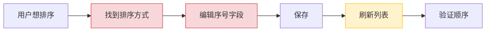
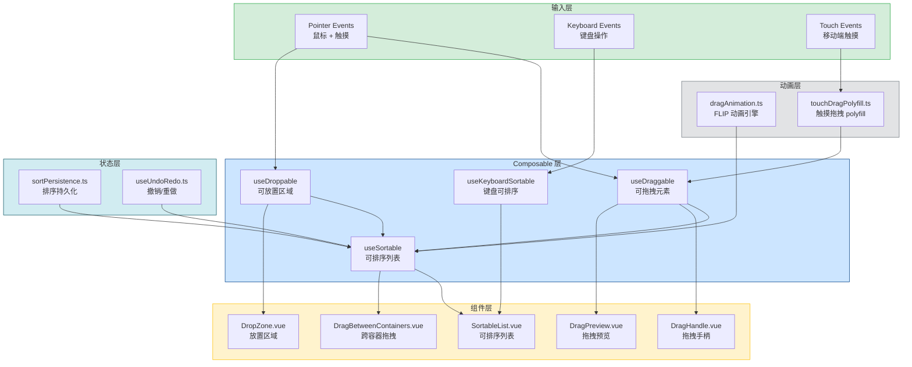

# 拖拽排序系统

> 需求编号：YV-09-37 · 优先级：P2 · 人天：1.0d
> 依赖：无（纯前端交互，排序持久化需要后端端点）

## 改动总览

| 改动点 | 类型 | 涉及文件 |
|--------|------|---------|
| 拖拽 Composable 库 | 新增 | `src/composables/useDraggable.ts`, `useDroppable.ts`, `useSortable.ts` |
| 拖拽容器组件 | 新增 | `src/components/DragDrop/` |
| 拖拽动画系统 | 新增 | `src/utils/dragAnimation.ts` |
| 排序持久化服务 | 新增 | `src/services/sortPersistence.ts` |
| 撤销管理 | 新增 | `src/composables/useUndoRedo.ts`（扩展） |
| 无障碍拖拽 | 新增 | `src/composables/useKeyboardSortable.ts` |
| 触摸支持 | 新增 | `src/utils/touchDragPolyfill.ts` |

## 涉及文件

```
YiVad/
├── src/
│   ├── composables/
│   │   ├── useDraggable.ts                        # 新增：可拖拽元素
│   │   ├── useDroppable.ts                        # 新增：可放置区域
│   │   ├── useSortable.ts                         # 新增：可排序列表
│   │   ├── useKeyboardSortable.ts                 # 新增：键盘可排序
│   │   └── useUndoRedo.ts                         # 修改：扩展拖拽撤销
│   ├── components/
│   │   └── DragDrop/
│   │       ├── SortableList.vue                   # 新增：可排序列表
│   │       ├── DragHandle.vue                     # 新增：拖拽手柄
│   │       ├── DragPreview.vue                    # 新增：拖拽预览
│   │       ├── DropZone.vue                       # 新增：放置区域
│   │       ├── DragBetweenContainers.vue          # 新增：跨容器拖拽
│   │       └── index.ts                           # 新增：统一导出
│   ├── utils/
│   │   ├── dragAnimation.ts                       # 新增：拖拽动画（FLIP）
│   │   └── touchDragPolyfill.ts                   # 新增：触摸拖拽 polyfill
│   └── services/
│       └── sortPersistence.ts                     # 新增：排序持久化
```

## 基本信息

| 字段 | 值 |
|------|-----|
| 需求编号 | YV-09-37 |
| 模块 | 全项目用户交互 |
| 优先级 | **P2**（提升交互体验，非阻塞性） |
| 前端人天 | 1.0d |
| 后端人天 | 0.1d（排序持久化端点） |
| 依赖 | 无（排序持久化需要后端端点，可后续实现） |

---

## 背景

YiVad 当前多个页面需要排序功能（项目列表、看板卡片、菜单管理、Dashboard 小组件），但缺乏统一的拖拽排序系统。用户无法通过拖拽重新排序项目、看板列或仪表盘小组件，只能通过间接方式（如编辑序号）实现排序，体验差且效率低。

**核心问题：**

| # | 问题 | 严重程度 | 影响 |
|---|------|----------|------|
| 1 | **无拖拽排序** -- 所有排序依赖编辑序号/日期字段 | **高** | 用户无法直观调整顺序，每次排序需多步操作 |
| 2 | **无跨容器拖拽** -- 看板卡片无法在列间拖拽 | **高** | 看板、状态流转等场景无法实现拖拽式操作 |
| 3 | **无拖拽视觉反馈** -- 缺少拖拽预览、放置高亮、动画过渡 | **中** | 拖拽操作缺乏反馈，用户不确定操作是否成功 |
| 4 | **无键盘拖拽** -- 仅支持鼠标拖拽，键盘用户无法操作 | **中** | 不符合 WCAG 无障碍要求，键盘用户被排除 |
| 5 | **无触摸支持** -- 移动端/平板用户无法拖拽 | **中** | 平板用户无法使用拖拽功能 |
| 6 | **排序不可撤销** -- 拖拽排序后无法撤销 | **低** | 误操作后用户需要手动恢复，效率低 |

**挑战：**
- 拖拽系统需要同时支持鼠标、触摸和键盘三种输入方式
- 跨容器拖拽涉及复杂的动画（元素从源容器移动到目标容器）
- 拖拽性能需要优化（FLIP 动画、避免强制同步布局）
- 无障碍拖拽需要提供完整的键盘操作方案（Space 选取、方向键移动、Space 放置）

---

## 一、现状分析

### 当前排序流程



### 根因分析矩阵

| 缺失项 | 根因 | 影响链 |
|--------|------|--------|
| 拖拽排序 | 无统一的拖拽 Composable 和组件库，每个场景需从零实现 | 各页面排序方式不一致，用户需学习不同的排序方式 |
| 跨容器拖拽 | 无容器间拖拽协议，数据在容器间移动需手动处理 | 看板、状态流转等场景无法使用拖拽，需弹出菜单操作 |
| 拖拽动画 | 无 FLIP 动画实现，元素移动是瞬间完成 | 拖拽操作生硬，用户无法追踪元素位置变化 |
| 键盘拖拽 | 无键盘可排序模式，HTML5 Drag API 不支持键盘 | 键盘用户无法完成排序操作，无障碍不符合 WCAG 2.1 |
| 触摸支持 | HTML5 Drag API 在移动端支持差，touch 事件未封装 | 平板用户无法使用拖拽功能 |

---

## 二、设计决策

### 拖拽实现方案选型

| 维度 | HTML5 Drag API | 自定义 Pointer Events | 第三方库（SortableJS） | 决策 |
|------|---------------|---------------------|----------------------|------|
| 浏览器兼容性 | 好（IE 不支持 touch） | 最佳（Pointer Events 统一鼠标/触摸） | 好 | **自定义 Pointer Events** |
| 自定义能力 | 中（拖拽预览受限） | 高（完全控制） | 低（受限于库 API） | **自定义 Pointer Events** |
| 移动端支持 | 差（需 polyfill） | 好（原生 Touch 支持） | 好 | **自定义 Pointer Events** |
| 包体积 | 0 | 0 | ~15KB | **自定义** |
| 实现复杂度 | 中 | 高 | 低 | **自定义（长期收益）** |
| 无障碍 | 差（无键盘支持） | 高（可自定义键盘） | 中 | **自定义** |

**决策：** 使用 Pointer Events 自实现拖拽系统。提供完整的鼠标/触摸/键盘支持，以及自定义拖拽预览和动画。虽然实现复杂度较高，但可获得完全控制和零外部依赖。

### 动画方案选型

| 维度 | CSS transition | FLIP 动画 | Web Animations API | 决策 |
|------|---------------|-----------|-------------------|------|
| 性能 | 好 | 最佳（仅 transform） | 好 | **FLIP 动画** |
| 实现复杂度 | 低 | 中 | 中 | **FLIP 动画** |
| 拖拽场景适配 | 差（实时拖拽禁用 transition） | 最佳（记录初始位置，计算最终位置） | 好 | **FLIP 动画** |
| 浏览器兼容性 | 好 | 好 | 好 | 持平 |

**决策：** 使用 FLIP（First, Last, Invert, Play）技术实现拖拽动画。拖拽过程中禁用 CSS transition，拖拽结束时计算元素位置变化并应用 transform 动画。

### 排序持久化策略

| 维度 | 即时保存 | 延迟保存 | 手动保存 | 结论 |
|------|---------|---------|---------|------|
| 用户体验 | 最佳 | 好 | 差 | 即时保存 |
| 并发冲突 | 高（频繁保存） | 中 | 低 | 需处理 |
| 后端压力 | 高 | 中 | 低 | 可接受 |
| 实现复杂度 | 中 | 低 | 低 | 可接受 |

**决策：** 采用即时保存策略，拖拽放置后立即保存排序结果到后端。使用防抖（500ms）避免连续拖拽时频繁请求。

### 无障碍拖拽模式

| 维度 | 独立键盘模式 | 模拟拖拽 | 混合模式 | 决策 |
|------|-----------|---------|---------|------|
| 实现复杂度 | 中 | 高 | 中 | **独立键盘模式** |
| 用户体验 | 好 | 差（不直观） | 好 | **独立键盘模式** |
| WCAG 合规 | 是 | 部分 | 是 | **独立键盘模式** |

**决策：** 为键盘用户提供独立的排序模式：Space 键选取元素，方向键（↑↓←→）移动元素，Space 键放置元素，Escape 取消操作。使用 `aria-live` 区域播报操作状态。

---

## 三、目标架构



### 拖拽排序流程

```
┌──────────────────────────────────────────────────────────────────────┐
│                        Drag and Drop Flow                            │
│                                                                      │
│  ┌──────────┐   ┌──────────────┐   ┌──────────────┐   ┌───────────┐ │
│  │ Pointer  │   │ Drag Start   │   │ Drag Move    │   │ Drop      │ │
│  │ Down     │──>│ Record       │──>│ Update       │──>│ Finalize  │ │
│  │ on Handle│   │ Initial Pos  │   │ Preview Pos  │   │ Position  │ │
│  └──────────┘   └──────────────┘   └──────────────┘   └─────┬─────┘ │
│                                                              │       │
│  ┌───────────────────────────────────────────────────────────┘       │
│  │                                                                    │
│  ▼                                                                    │
│  ┌──────────────┐   ┌──────────────┐   ┌──────────────┐             │
│  │ FLIP         │   │ Sort Order   │   │ Persist      │             │
│  │ Animation    │   │ Updated      │   │ to Backend   │             │
│  └──────────────┘   └──────────────┘   └──────────────┘             │
│                                                                      │
│  Keyboard Flow:                                                      │
│  ┌──────────┐   ┌──────────────┐   ┌──────────────┐   ┌───────────┐ │
│  │ Space    │   │ Announce     │   │ Arrow Keys   │   │ Space     │ │
│  │ Pick Up  │──>│ "Item Picked │──>│ Move Item    │──>│ Drop      │ │
│  │          │   │  Up"         │   │ Up/Down      │   │           │ │
│  └──────────┘   └──────────────┘   └──────────────┘   └───────────┘ │
│                                                                      │
└──────────────────────────────────────────────────────────────────────┘
```

---

## 四、具体改动

### 4.1 useDraggable Composable

**文件：** `src/composables/useDraggable.ts`（新增）

```typescript
// src/composables/useDraggable.ts
import { ref, onMounted, onUnmounted, type Ref } from "vue";

interface DraggableOptions {
  /** 拖拽手柄选择器，undefined 表示整个元素可拖拽 */
  handle?: string;
  /** 拖拽约束：'vertical' | 'horizontal' | 'both' */
  axis?: "vertical" | "horizontal" | "both";
  /** 拖拽时禁用的 CSS 选择器 */
  cancel?: string;
  /** 自定义拖拽预览 */
  dragImage?: (element: HTMLElement) => HTMLElement;
  /** 拖拽分组名，用于跨容器拖拽 */
  group?: string;
  /** 拖拽数据 */
  data?: Record<string, unknown>;
}

interface DragState {
  isDragging: boolean;
  startX: number;
  startY: number;
  currentX: number;
  currentY: number;
  deltaX: number;
  deltaY: number;
  sourceElement: HTMLElement | null;
  targetElement: HTMLElement | null;
}

export function useDraggable(
  elementRef: Ref<HTMLElement | null>,
  options: DraggableOptions = {}
) {
  const {
    handle,
    axis = "both",
    cancel,
    dragImage,
    group = "default",
    data = {},
  } = options;

  const state = ref<DragState>({
    isDragging: false,
    startX: 0,
    startY: 0,
    currentX: 0,
    currentY: 0,
    deltaX: 0,
    deltaY: 0,
    sourceElement: null,
    targetElement: null,
  });

  let dragPreviewEl: HTMLElement | null = null;
  let initialPointerEvents: string | null = null;

  function onPointerDown(event: PointerEvent) {
    const el = elementRef.value;
    if (!el) return;

    // 检查是否从手柄触发
    if (handle) {
      const target = event.target as HTMLElement;
      if (!target.closest(handle)) return;
    }

    // 检查是否取消
    if (cancel) {
      const target = event.target as HTMLElement;
      if (target.closest(cancel)) return;
    }

    event.preventDefault();
    el.setPointerCapture(event.pointerId);

    state.value = {
      ...state.value,
      isDragging: true,
      startX: event.clientX,
      startY: event.clientY,
      currentX: event.clientX,
      currentY: event.clientY,
      deltaX: 0,
      deltaY: 0,
      sourceElement: el,
    };

    // 保存原始 pointer-events
    initialPointerEvents = el.style.pointerEvents;
    el.style.pointerEvents = "none";

    // 创建拖拽预览
    if (dragImage) {
      dragPreviewEl = dragImage(el);
      dragPreviewEl.style.cssText = `
        position: fixed; pointer-events: none; z-index: 10000;
        left: ${event.clientX}px; top: ${event.clientY}px;
        opacity: 0.9; transform: translate(-50%, -50%) rotate(2deg);
        box-shadow: 0 8px 24px rgba(0,0,0,0.15);
      `;
      document.body.appendChild(dragPreviewEl);
    } else {
      el.classList.add("dragging");
    }

    // 触发自定义事件
    el.dispatchEvent(
      new CustomEvent("drag:start", {
        bubbles: true,
        detail: { element: el, data, group, state: state.value },
      })
    );

    document.addEventListener("pointermove", onPointerMove);
    document.addEventListener("pointerup", onPointerUp);
  }

  function onPointerMove(event: PointerEvent) {
    if (!state.value.isDragging) return;

    const dx = event.clientX - state.value.startX;
    const dy = event.clientY - state.value.startY;

    state.value = {
      ...state.value,
      currentX: event.clientX,
      currentY: event.clientY,
      deltaX: axis === "vertical" ? 0 : dx,
      deltaY: axis === "horizontal" ? 0 : dy,
    };

    // 更新拖拽预览位置
    if (dragPreviewEl) {
      dragPreviewEl.style.left = `${event.clientX}px`;
      dragPreviewEl.style.top = `${event.clientY}px`;
    }

    // 触发自定义事件
    elementRef.value?.dispatchEvent(
      new CustomEvent("drag:move", {
        bubbles: true,
        detail: { element: elementRef.value, data, group, state: state.value },
      })
    );
  }

  function onPointerUp(event: PointerEvent) {
    if (!state.value.isDragging) return;

    // 恢复 pointer-events
    if (elementRef.value) {
      elementRef.value.style.pointerEvents = initialPointerEvents || "";
      elementRef.value.classList.remove("dragging");
    }

    // 移除拖拽预览
    if (dragPreviewEl) {
      dragPreviewEl.remove();
      dragPreviewEl = null;
    }

    // 触发自定义事件
    elementRef.value?.dispatchEvent(
      new CustomEvent("drag:end", {
        bubbles: true,
        detail: {
          element: elementRef.value,
          data,
          group,
          state: state.value,
          targetElement: state.value.targetElement,
        },
      })
    );

    state.value = {
      isDragging: false,
      startX: 0,
      startY: 0,
      currentX: 0,
      currentY: 0,
      deltaX: 0,
      deltaY: 0,
      sourceElement: null,
      targetElement: null,
    };

    document.removeEventListener("pointermove", onPointerMove);
    document.removeEventListener("pointerup", onPointerUp);
  }

  onMounted(() => {
    elementRef.value?.addEventListener("pointerdown", onPointerDown);
  });

  onUnmounted(() => {
    elementRef.value?.removeEventListener("pointerdown", onPointerDown);
    document.removeEventListener("pointermove", onPointerMove);
    document.removeEventListener("pointerup", onPointerUp);
  });

  return {
    state,
    isDragging: () => state.value.isDragging,
  };
}
```

### 4.2 useDroppable Composable

**文件：** `src/composables/useDroppable.ts`（新增）

```typescript
// src/composables/useDroppable.ts
import { ref, onMounted, onUnmounted, type Ref } from "vue";

interface DroppableOptions {
  /** 接受的拖拽分组 */
  accept?: string | string[];
  /** 放置区域类型 */
  type?: "sortable" | "target" | "delete";
  /** 放置回调 */
  onDrop?: (data: Record<string, unknown>, source: HTMLElement) => void;
  /** 拖入回调 */
  onDragEnter?: (data: Record<string, unknown>, source: HTMLElement) => void;
  /** 拖出回调 */
  onDragLeave?: (data: Record<string, unknown>, source: HTMLElement) => void;
}

export function useDroppable(
  elementRef: Ref<HTMLElement | null>,
  options: DroppableOptions = {}
) {
  const { accept = "*", type = "sortable", onDrop, onDragEnter, onDragLeave } = options;

  const isOver = ref(false);
  const isValidTarget = ref(false);
  const dropData = ref<Record<string, unknown> | null>(null);

  function canAccept(group: string): boolean {
    if (accept === "*") return true;
    if (Array.isArray(accept)) return accept.includes(group);
    return accept === group;
  }

  function handleDragStart(event: CustomEvent) {
    const { group, data } = event.detail;
    isValidTarget.value = canAccept(group);
    dropData.value = data;
  }

  function handleDragMove(event: CustomEvent) {
    const { group, data, state } = event.detail;
    if (!canAccept(group)) return;

    const el = elementRef.value;
    if (!el) return;

    const rect = el.getBoundingClientRect();
    const isInside =
      state.currentX >= rect.left &&
      state.currentX <= rect.right &&
      state.currentY >= rect.top &&
      state.currentY <= rect.bottom;

    if (isInside && !isOver.value) {
      isOver.value = true;
      el.classList.add("drop-zone--active");
      onDragEnter?.(data, event.detail.element);
    } else if (!isInside && isOver.value) {
      isOver.value = false;
      el.classList.remove("drop-zone--active");
      onDragLeave?.(data, event.detail.element);
    }

    // 更新目标元素
    event.detail.targetElement = isInside ? el : null;
  }

  function handleDragEnd(event: CustomEvent) {
    const { data, element, targetElement } = event.detail;

    if (isOver.value && elementRef.value) {
      elementRef.value.classList.remove("drop-zone--active");
      onDrop?.(data, element);
    }

    isOver.value = false;
    isValidTarget.value = false;
    dropData.value = null;
  }

  onMounted(() => {
    document.addEventListener("drag:start", handleDragStart as EventListener);
    document.addEventListener("drag:move", handleDragMove as EventListener);
    document.addEventListener("drag:end", handleDragEnd as EventListener);
  });

  onUnmounted(() => {
    document.removeEventListener("drag:start", handleDragStart as EventListener);
    document.removeEventListener("drag:move", handleDragMove as EventListener);
    document.removeEventListener("drag:end", handleDragEnd as EventListener);
  });

  return {
    isOver,
    isValidTarget,
    dropData,
  };
}
```

### 4.3 useSortable Composable

**文件：** `src/composables/useSortable.ts`（新增）

```typescript
// src/composables/useSortable.ts
import { ref, type Ref, watch } from "vue";
import { useDraggable } from "./useDraggable";
import { useDroppable } from "./useDroppable";
import { animateFLIP } from "@/utils/dragAnimation";
import { persistOrder } from "@/services/sortPersistence";
import { useUndoRedo } from "./useUndoRedo";

interface SortableItem {
  id: string;
  [key: string]: unknown;
}

interface SortableOptions {
  items: Ref<SortableItem[]>;
  group?: string;
  handle?: string;
  axis?: "vertical" | "horizontal";
  animationDuration?: number;
  persistKey?: string;
  onSort?: (items: SortableItem[]) => void;
}

export function useSortable(
  containerRef: Ref<HTMLElement | null>,
  options: SortableOptions
) {
  const {
    items,
    group = "default",
    handle,
    axis = "vertical",
    animationDuration = 200,
    persistKey,
    onSort,
  } = options;

  const dragIndex = ref<number | null>(null);
  const overIndex = ref<number | null>(null);
  const { undo, redo, pushState } = useUndoRedo();

  // 记录元素初始位置（FLIP 动画）
  let elementPositions: Map<string, DOMRect> = new Map();

  function recordPositions() {
    elementPositions.clear();
    const children = containerRef.value?.children;
    if (!children) return;
    for (const child of children) {
      const id = (child as HTMLElement).dataset.sortId;
      if (id) {
        elementPositions.set(id, child.getBoundingClientRect());
      }
    }
  }

  function handleDrop(data: Record<string, unknown>, source: HTMLElement) {
    const sourceId = source.dataset.sortId;
    const targetId = data.targetId as string;

    if (!sourceId || sourceId === targetId) return;

    recordPositions();

    const currentItems = [...items.value];
    const sourceIndex = currentItems.findIndex((item) => item.id === sourceId);
    let targetIndex = currentItems.findIndex((item) => item.id === targetId);

    if (sourceIndex === -1 || targetIndex === -1) return;

    // 保存旧状态用于撤销
    const oldItems = [...currentItems];
    pushState(() => {
      items.value = [...oldItems];
      onSort?.(oldItems);
    });

    // 移动元素
    const [movedItem] = currentItems.splice(sourceIndex, 1);
    if (sourceIndex < targetIndex) targetIndex--; // 前移后索引调整
    currentItems.splice(targetIndex, 0, movedItem);

    items.value = currentItems;
    dragIndex.value = null;
    overIndex.value = null;

    // 执行 FLIP 动画
    requestAnimationFrame(() => {
      animateFLIP(containerRef.value!, elementPositions, animationDuration);
    });

    // 持久化排序
    if (persistKey) {
      persistOrder(persistKey, currentItems.map((item) => item.id));
    }

    onSort?.(currentItems);
  }

  function handleDragOver(event: CustomEvent) {
    const { state, data } = event.detail;
    const children = containerRef.value?.children;
    if (!children) return;

    // 根据鼠标位置计算目标索引
    for (let i = 0; i < children.length; i++) {
      const rect = children[i].getBoundingClientRect();
      const midY = rect.top + rect.height / 2;
      if (state.currentY < midY) {
        overIndex.value = i;
        data.targetId = (children[i] as HTMLElement).dataset.sortId;
        break;
      }
      overIndex.value = children.length;
    }
  }

  // 使用 useDroppable 处理放置
  const droppable = useDroppable(containerRef, {
    accept: group,
    onDrop: handleDrop,
    onDragEnter: () => recordPositions(),
  });

  return {
    dragIndex,
    overIndex,
    isOver: droppable.isOver,
    isValidTarget: droppable.isValidTarget,
    undo,
    redo,
  };
}
```

### 4.4 键盘排序 Composable

**文件：** `src/composables/useKeyboardSortable.ts`（新增）

```typescript
// src/composables/useKeyboardSortable.ts
import { ref, onMounted, onUnmounted, type Ref } from "vue";

interface KeyboardSortableItem {
  id: string;
}

interface KeyboardSortableOptions {
  items: Ref<KeyboardSortableItem[]>;
  liveRegionRef?: Ref<HTMLElement | null>;
  onSort?: (items: KeyboardSortableItem[]) => void;
}

export function useKeyboardSortable(
  containerRef: Ref<HTMLElement | null>,
  options: KeyboardSortableOptions
) {
  const { items, liveRegionRef, onSort } = options;

  const isPickingUp = ref(false);
  const activeIndex = ref<number | null>(null);
  const focusedIndex = ref(0);

  function announce(message: string) {
    if (liveRegionRef?.value) {
      liveRegionRef.value.textContent = message;
    }
  }

  function handleKeyDown(event: KeyboardEvent) {
    const children = containerRef.value?.children;
    if (!children) return;

    const currentIndex = focusedIndex.value;

    // 获取当前焦点元素
    function getCurrentItem(): HTMLElement | null {
      return children?.[currentIndex] as HTMLElement | null;
    }

    if (event.key === " ") {
      event.preventDefault();
      if (!isPickingUp.value) {
        // 开始拖拽
        isPickingUp.value = true;
        activeIndex.value = currentIndex;
        const item = getCurrentItem();
        item?.setAttribute("aria-grabbed", "true");
        announce(`已选取第 ${currentIndex + 1} 项，${items.value[currentIndex]?.id}`);
      } else {
        // 放置
        dropItem();
      }
      return;
    }

    if (event.key === "Escape" && isPickingUp.value) {
      cancelPickup();
      return;
    }

    if (isPickingUp.value) {
      // 移动激活项
      if (event.key === "ArrowDown" || event.key === "ArrowUp") {
        event.preventDefault();
        const direction = event.key === "ArrowDown" ? 1 : -1;
        const newIndex = Math.max(0, Math.min(children.length - 1, activeIndex.value! + direction));

        if (newIndex !== activeIndex.value) {
          // 执行排序
          const currentItems = [...items.value];
          const [movedItem] = currentItems.splice(activeIndex.value!, 1);
          currentItems.splice(newIndex, 0, movedItem);
          items.value = currentItems;

          activeIndex.value = newIndex;
          focusedIndex.value = newIndex;
          announce(`已移动到第 ${newIndex + 1} 项`);
          onSort?.(currentItems);
        }
      }
    } else {
      // 普通导航
      if (event.key === "ArrowDown") {
        event.preventDefault();
        focusedIndex.value = Math.min(children.length - 1, currentIndex + 1);
        focusItem(focusedIndex.value);
      } else if (event.key === "ArrowUp") {
        event.preventDefault();
        focusedIndex.value = Math.max(0, currentIndex - 1);
        focusItem(focusedIndex.value);
      }
    }
  }

  function focusItem(index: number) {
    const item = containerRef.value?.children[index] as HTMLElement;
    item?.focus();
  }

  function dropItem() {
    isPickingUp.value = false;
    const item = containerRef.value?.children[activeIndex.value!] as HTMLElement;
    item?.setAttribute("aria-grabbed", "false");
    announce(`已放置第 ${activeIndex.value! + 1} 项`);
    activeIndex.value = null;
  }

  function cancelPickup() {
    isPickingUp.value = false;
    const item = containerRef.value?.children[activeIndex.value!] as HTMLElement;
    item?.setAttribute("aria-grabbed", "false");
    announce("已取消排序");
    activeIndex.value = null;
  }

  onMounted(() => {
    containerRef.value?.addEventListener("keydown", handleKeyDown);
  });

  onUnmounted(() => {
    containerRef.value?.removeEventListener("keydown", handleKeyDown);
  });

  return {
    isPickingUp,
    activeIndex,
    focusedIndex,
    dropItem,
    cancelPickup,
  };
}
```

### 4.5 FLIP 动画引擎

**文件：** `src/utils/dragAnimation.ts`（新增）

```typescript
// src/utils/dragAnimation.ts

interface PositionRecord {
  x: number;
  y: number;
  width: number;
  height: number;
}

export function animateFLIP(
  container: HTMLElement,
  previousPositions: Map<string, DOMRect>,
  duration: number = 200,
  easing: string = "cubic-bezier(0.25, 0.8, 0.25, 1.2)"
): void {
  const children = container.children;

  for (const child of children) {
    const id = (child as HTMLElement).dataset.sortId;
    if (!id) continue;

    const prevRect = previousPositions.get(id);
    if (!prevRect) continue;

    const currentRect = child.getBoundingClientRect();

    // 计算位置变化
    const deltaX = prevRect.left - currentRect.left;
    const deltaY = prevRect.top - currentRect.top;

    if (deltaX === 0 && deltaY === 0) continue;

    // Invert: 先应用反向 transform
    const el = child as HTMLElement;
    el.style.transition = "none";
    el.style.transform = `translate(${deltaX}px, ${deltaY}px)`;

    // Play: 下一帧移除 transform，触发动画
    requestAnimationFrame(() => {
      requestAnimationFrame(() => {
        el.style.transition = `transform ${duration}ms ${easing}`;
        el.style.transform = "translate(0, 0)";

        // 动画结束后清理
        const onTransitionEnd = () => {
          el.style.transition = "";
          el.style.transform = "";
          el.removeEventListener("transitionend", onTransitionEnd);
        };
        el.addEventListener("transitionend", onTransitionEnd);
      });
    });
  }
}

export function createDragFeedback(
  element: HTMLElement,
  type: "pickup" | "drop" | "invalid"
): void {
  switch (type) {
    case "pickup":
      element.style.transition = "transform 150ms ease";
      element.style.transform = "scale(1.02)";
      element.style.boxShadow = "0 4px 12px rgba(0,0,0,0.15)";
      break;
    case "drop":
      element.style.transition = "transform 250ms cubic-bezier(0.25, 0.8, 0.25, 1.2)";
      element.style.transform = "scale(1)";
      element.style.boxShadow = "";
      break;
    case "invalid":
      element.style.transition = "transform 150ms ease";
      element.style.transform = "scale(0.98)";
      setTimeout(() => {
        element.style.transform = "scale(1)";
      }, 150);
      break;
  }
}
```

### 4.6 排序持久化服务

**文件：** `src/services/sortPersistence.ts`（新增）

```typescript
// src/services/sortPersistence.ts
import { RequestHttp } from "@/api/request";

interface SortOrder {
  key: string;
  order: string[];
  updatedAt: string;
}

// 本地缓存（optimistic update）
const localCache = new Map<string, string[]>();

const debounceTimers = new Map<string, ReturnType<typeof setTimeout>>();

export async function persistOrder(
  key: string,
  order: string[],
  debounceMs: number = 500
): Promise<void> {
  // 立即更新本地缓存
  localCache.set(key, order);

  // 清除旧的防抖定时器
  const existingTimer = debounceTimers.get(key);
  if (existingTimer) clearTimeout(existingTimer);

  // 防抖发送到后端
  return new Promise((resolve) => {
    const timer = setTimeout(async () => {
      try {
        // TODO: 调用后端 API
        // await RequestHttp.post("/", {
        //   module_name: "services.data_service",
        //   method_name: "save_sort_order",
        //   parameters: { key, order },
        // });
        console.log(`[sortPersistence] Order saved for ${key}:`, order);
        debounceTimers.delete(key);
        resolve();
      } catch (error) {
        console.error(`[sortPersistence] Failed to persist order for ${key}:`, error);
        resolve();
      }
    }, debounceMs);

    debounceTimers.set(key, timer);
  });
}

export function getLocalOrder(key: string): string[] | undefined {
  return localCache.get(key);
}

export async function loadOrder(key: string): Promise<string[]> {
  // 先尝试本地缓存
  const cached = localCache.get(key);
  if (cached) return cached;

  // TODO: 从后端加载
  // const response = await RequestHttp.post("/", {
  //   module_name: "services.data_service",
  //   method_name: "get_sort_order",
  //   parameters: { key },
  // });
  // return response.data?.order || [];

  return [];
}

export function clearLocalCache(): void {
  localCache.clear();
  debounceTimers.forEach((timer) => clearTimeout(timer));
  debounceTimers.clear();
}
```

### 4.7 触摸拖拽 Polyfill

**文件：** `src/utils/touchDragPolyfill.ts`（新增）

```typescript
// src/utils/touchDragPolyfill.ts

interface TouchDragState {
  isTouching: boolean;
  startX: number;
  startY: number;
  currentX: number;
  currentY: number;
  longPressTimer: ReturnType<typeof setTimeout> | null;
}

/**
 * 触摸拖拽增强：支持长按触发拖拽
 * 短按 = 点击，长按（300ms）= 开始拖拽
 */
export function enableTouchDrag(
  element: HTMLElement,
  onDragStart: (x: number, y: number) => void,
  onDragMove: (x: number, y: number) => void,
  onDragEnd: () => void,
  options: { longPressDelay?: number; moveThreshold?: number } = {}
) {
  const { longPressDelay = 300, moveThreshold = 5 } = options;

  const state: TouchDragState = {
    isTouching: false,
    startX: 0,
    startY: 0,
    currentX: 0,
    currentY: 0,
    longPressTimer: null,
  };

  let hasMoved = false;
  let isDragging = false;

  function onTouchStart(event: TouchEvent) {
    if (event.touches.length !== 1) return;

    const touch = event.touches[0];
    state.isTouching = true;
    state.startX = touch.clientX;
    state.startY = touch.clientY;
    state.currentX = touch.clientX;
    state.currentY = touch.clientY;
    hasMoved = false;
    isDragging = false;

    // 长按触发拖拽
    state.longPressTimer = setTimeout(() => {
      if (!hasMoved) {
        isDragging = true;
        onDragStart(state.startX, state.startY);
      }
    }, longPressDelay);
  }

  function onTouchMove(event: TouchEvent) {
    if (!state.isTouching) return;

    const touch = event.touches[0];
    const dx = Math.abs(touch.clientX - state.startX);
    const dy = Math.abs(touch.clientY - state.startY);

    if (dx > moveThreshold || dy > moveThreshold) {
      hasMoved = true;
      if (state.longPressTimer) {
        clearTimeout(state.longPressTimer);
        state.longPressTimer = null;
      }
    }

    if (isDragging) {
      event.preventDefault();
      state.currentX = touch.clientX;
      state.currentY = touch.clientY;
      onDragMove(touch.clientX, touch.clientY);
    }
  }

  function onTouchEnd() {
    if (state.longPressTimer) {
      clearTimeout(state.longPressTimer);
      state.longPressTimer = null;
    }

    if (isDragging) {
      onDragEnd();
    }

    state.isTouching = false;
    isDragging = false;
    hasMoved = false;
  }

  element.addEventListener("touchstart", onTouchStart, { passive: false });
  element.addEventListener("touchmove", onTouchMove, { passive: false });
  element.addEventListener("touchend", onTouchEnd);
  element.addEventListener("touchcancel", onTouchEnd);

  return () => {
    element.removeEventListener("touchstart", onTouchStart);
    element.removeEventListener("touchmove", onTouchMove);
    element.removeEventListener("touchend", onTouchEnd);
    element.removeEventListener("touchcancel", onTouchEnd);
  };
}
```

### 4.8 可排序列表组件

**文件：** `src/components/DragDrop/SortableList.vue`（新增）

```vue
<template>
  <div
    ref="containerRef"
    :class="['sortable-list', {
      'sortable-list--dragging': dragIndex !== null,
      'sortable-list--over': isOver,
    }]"
    :aria-label="ariaLabel"
    role="list"
  >
    <!-- 无障碍 live region -->
    <div
      ref="liveRegionRef"
      class="sr-only"
      role="status"
      aria-live="assertive"
      aria-atomic="true"
    />

    <div
      v-for="(item, index) in items"
      :key="item.id"
      :ref="(el) => setItemRef(el, item.id)"
      :data-sort-id="item.id"
      :class="['sortable-list__item', {
        'sortable-list__item--dragging': dragIndex === index,
        'sortable-list__item--over': overIndex === index,
        'sortable-list__item--picking-up': keyboardState.isPickingUp && keyboardState.activeIndex === index,
      }]"
      :aria-grabbed="keyboardState.isPickingUp && keyboardState.activeIndex === index ? 'true' : 'false'"
      :aria-dropeffect="isOver ? 'move' : 'none'"
      :tabindex="keyboardState.focusedIndex === index ? 0 : -1"
      role="listitem"
    >
      <DragHandle
        v-if="showHandle"
        :disabled="disabled"
        :aria-label="`拖拽排序 ${item.id}`"
      />
      <slot name="item" :item="item" :index="index" :isDragging="dragIndex === index" />
    </div>
  </div>
</template>

<script setup lang="ts" generic="T extends { id: string }">
import { ref, onMounted } from "vue";
import { useSortable } from "@/composables/useSortable";
import { useKeyboardSortable } from "@/composables/useKeyboardSortable";
import DragHandle from "./DragHandle.vue";

interface Props {
  items: T[];
  showHandle?: boolean;
  disabled?: boolean;
  group?: string;
  axis?: "vertical" | "horizontal";
  persistKey?: string;
  ariaLabel?: string;
}

const props = withDefaults(defineProps<Props>(), {
  showHandle: true,
  disabled: false,
  group: "default",
  axis: "vertical",
  ariaLabel: "可排序列表",
});

const emit = defineEmits<{
  (e: "update:items", items: T[]): void;
  (e: "sort", items: T[]): void;
}>();

const containerRef = ref<HTMLElement | null>(null);
const liveRegionRef = ref<HTMLElement | null>(null);
const itemRefs = new Map<string, HTMLElement>();

function setItemRef(el: unknown, id: string) {
  if (el) {
    itemRefs.set(id, el as HTMLElement);
  }
}

const itemsRef = ref(props.items);

const sortable = useSortable(containerRef, {
  items: itemsRef,
  group: props.group,
  handle: props.showHandle ? ".drag-handle" : undefined,
  axis: props.axis,
  persistKey: props.persistKey,
  onSort: (newItems) => {
    emit("update:items", newItems as T[]);
    emit("sort", newItems as T[]);
  },
});

const keyboardState = useKeyboardSortable(containerRef, {
  items: itemsRef,
  liveRegionRef,
  onSort: (newItems) => {
    emit("update:items", newItems as T[]);
    emit("sort", newItems as T[]);
  },
});

const { dragIndex, overIndex, isOver } = sortable;
</script>

<style scoped lang="scss">
.sortable-list {
  position: relative;

  &__item {
    position: relative;
    transition: transform 0.2s ease, box-shadow 0.2s ease;
    cursor: default;

    &--dragging {
      opacity: 0.5;
      transform: scale(0.98);
    }

    &--over {
      box-shadow: 0 -2px 0 var(--el-color-primary);
    }

    &--picking-up {
      outline: 2px solid var(--el-color-primary);
      outline-offset: 2px;
      background: var(--el-fill-color-light);
    }
  }

  &--dragging {
    user-select: none;
  }

  &--over {
    // 容器高亮
  }
}

// Screen reader only
.sr-only {
  position: absolute;
  width: 1px;
  height: 1px;
  padding: 0;
  margin: -1px;
  overflow: hidden;
  clip: rect(0, 0, 0, 0);
  white-space: nowrap;
  border: 0;
}
</style>
```

### 4.9 拖拽手柄组件

**文件：** `src/components/DragDrop/DragHandle.vue`（新增）

```vue
<template>
  <span
    :class="['drag-handle', { 'drag-handle--disabled': disabled }]"
    :aria-label="ariaLabel"
    role="button"
    :tabindex="disabled ? -1 : 0"
  >
    <svg width="16" height="16" viewBox="0 0 16 16" fill="currentColor">
      <circle cx="5" cy="3" r="1.5" />
      <circle cx="11" cy="3" r="1.5" />
      <circle cx="5" cy="8" r="1.5" />
      <circle cx="11" cy="8" r="1.5" />
      <circle cx="5" cy="13" r="1.5" />
      <circle cx="11" cy="13" r="1.5" />
    </svg>
  </span>
</template>

<script setup lang="ts">
interface Props {
  disabled?: boolean;
  ariaLabel?: string;
}

withDefaults(defineProps<Props>(), {
  disabled: false,
  ariaLabel: "拖拽手柄",
});
</script>

<style scoped lang="scss">
.drag-handle {
  display: inline-flex;
  align-items: center;
  justify-content: center;
  width: 24px;
  height: 24px;
  cursor: grab;
  color: var(--el-text-color-placeholder);
  border-radius: 4px;
  flex-shrink: 0;

  &:hover {
    color: var(--el-text-color-secondary);
    background: var(--el-fill-color-light);
  }

  &:active {
    cursor: grabbing;
  }

  &--disabled {
    cursor: not-allowed;
    opacity: 0.3;
  }
}
</style>
```

---

## 五、实施步骤

| 步骤 | 任务 | 产出 | 验证方式 | 人天 |
|------|------|------|----------|------|
| 1 | 实现 useDraggable Composable | `useDraggable.ts` | 元素可拖拽移动，事件正确触发 | 0.12 |
| 2 | 实现 useDroppable Composable | `useDroppable.ts` | 拖拽元素进入/离开放置区域高亮正确 | 0.10 |
| 3 | 实现 useSortable Composable | `useSortable.ts` | 列表元素可拖拽排序，FLIP 动画正确 | 0.15 |
| 4 | 实现 FLIP 动画引擎 | `dragAnimation.ts` | 元素移动后播放平滑过渡动画 | 0.08 |
| 5 | 实现 useKeyboardSortable | `useKeyboardSortable.ts` | Space 选取、方向键移动、Space 放置 | 0.12 |
| 6 | 实现触摸拖拽 Polyfill | `touchDragPolyfill.ts` | 移动端长按 300ms 触发拖拽 | 0.08 |
| 7 | 创建 DragHandle 组件 | `DragHandle.vue` | 拖拽手柄六点图标，hover 变 grab 光标 | 0.03 |
| 8 | 创建 SortableList 组件 | `SortableList.vue` | 列表可拖拽排序，键盘可访问 | 0.10 |
| 9 | 实现排序持久化服务 | `sortPersistence.ts` | 排序结果 500ms 防抖保存到后端 | 0.05 |
| 10 | 实现撤销/重做扩展 | `useUndoRedo.ts` 扩展 | 拖拽操作可撤销（Ctrl+Z） | 0.05 |
| 11 | 集成到项目列表页 | `ProjectList/index.vue` | 项目列表可拖拽排序 | 0.05 |
| 12 | 集成到看板页面 | `Kanban/index.vue` | 卡片可跨列拖拽 | 0.05 |
| 13 | 整体验证 | 全流程拖拽排序 | 鼠标/键盘/触摸三种方式排序正确 | 0.02 |

**总计：** 1.0d

---

## 六、测试规格

### Composable 测试：useSortable

#### Scenario: 拖拽元素到新位置
- **GIVEN** 列表 `items = [{id:"A"}, {id:"B"}, {id:"C"}]`
- **WHEN** 拖拽 "A" 到 "C" 之后
- **THEN** `items` 变为 `[{id:"B"}, {id:"C"}, {id:"A"}]`

#### Scenario: 拖拽手柄触发拖拽
- **GIVEN** `handle = ".drag-handle"`
- **WHEN** 点击非手柄区域并拖拽
- **THEN** 拖拽不触发，元素不移动

#### Scenario: FLIP 动画执行
- **GIVEN** 记录元素初始位置，然后修改列表顺序
- **WHEN** 调用 `animateFLIP` 并传入旧位置 Map
- **THEN** 元素应用 `transform: translate(dx, dy)` 然后过渡到 `transform: translate(0, 0)`

### 键盘排序测试：useKeyboardSortable

#### Scenario: Space 选取元素
- **GIVEN** 焦点在列表第一项
- **WHEN** 按下 Space 键
- **THEN** `isPickingUp` 为 `true`，`activeIndex` 为 `0`，元素 `aria-grabbed` 为 `"true"`

#### Scenario: 方向键移动元素
- **GIVEN** 已选取第一项（`activeIndex = 0`）
- **WHEN** 按下 ArrowDown 键
- **THEN** 元素移动到第二项位置，`activeIndex` 变为 `1`

#### Scenario: Escape 取消拖拽
- **GIVEN** 已选取第一项
- **WHEN** 按下 Escape 键
- **THEN** `isPickingUp` 变为 `false`，`activeIndex` 为 `null`，元素 `aria-grabbed` 为 `"false"`

---

## 七、风险与缓解

| 风险 | 概率 | 影响 | 等级 | 缓解措施 | 应急预案 |
|------|------|------|------|----------|----------|
| 拖拽动画在低性能设备上卡顿 | 中 | 中 | 中 | 使用 FLIP 动画（仅 transform），避免触发重排。动画时长 200ms | 关闭动画（`animationDuration = 0`），或降低动画帧率 |
| 拖拽与页面滚动冲突 | 中 | 中 | 中 | 拖拽开始时锁定页面滚动（`overflow: hidden`），拖拽结束时恢复 | 拖拽到视口边缘时自动滚动页面 |
| 触摸拖拽与浏览器默认手势冲突 | 中 | 低 | 低 | 使用 `touch-action: none` 禁用浏览器默认手势，长按 300ms 区分点击和拖拽 | 提供 "编辑模式" 开关，在编辑模式下禁用触摸拖拽 |
| 跨容器拖拽动画复杂 | 中 | 中 | 中 | 跨容器拖拽时，先隐藏源元素，在目标容器中插入新元素，然后执行 FLIP 动画 | 跨容器拖拽时禁用动画，使用即时更新 |
| 排序持久化失败导致数据丢失 | 低 | 高 | 中 | 本地缓存排序结果，失败时重试 3 次 | 使用 `localStorage` 保存排序结果作为离线备份 |

---

## 八、回滚策略

| 回滚场景 | 回滚方式 | 影响范围 | 恢复时间 |
|----------|----------|----------|----------|
| 拖拽功能异常影响页面交互 | 在页面中设置 `disabled = true` | 单页面 | < 1min |
| 拖拽动画卡顿 | 设置 `animationDuration = 0` | 全局 | < 1min |
| 触摸拖拽误触发 | 设置 `longPressDelay = 500` 或禁用触摸拖拽 | 全局 | < 1min |
| 排序持久化频繁失败 | 降级为仅本地存储排序结果 | 全局 | < 2min |

**回滚验证：**
- 回滚后页面交互正常，无拖拽相关事件监听残留
- 回滚后排序功能通过编辑序号正常工作
- 回滚后无控制台错误

---

## 九、设计决策记录

### D-01: 使用 Pointer Events 而非 HTML5 Drag API

**背景：** HTML5 Drag API 在移动端支持差，且无法自定义拖拽预览和动画。
**决策：** 使用 Pointer Events（`pointerdown/pointermove/pointerup`）自实现拖拽系统。
**权衡：** 实现复杂度较高（需要手动处理捕获、边界检测、动画），但获得完全控制权和更好的移动端支持。
**后果：** 需要使用 `setPointerCapture` 确保拖拽过程中事件持续触发，即使鼠标移出元素。

### D-02: 使用 FLIP 动画而非 CSS Transition

**背景：** 拖拽排序后元素位置变化，需要平滑过渡动画。
**决策：** 使用 FLIP（First, Last, Invert, Play）技术实现动画。
**权衡：** 需要在拖拽前记录元素位置，拖拽后计算位置变化并应用 transform。相比 CSS Transition 更复杂，但避免了强制同步布局（layout thrashing）。
**后果：** 动画性能优秀（仅触发 composite），但需要额外的位置记录和计算逻辑。

### D-03: 键盘拖拽使用独立模式而非模拟鼠标拖拽

**背景：** 键盘用户无法使用鼠标拖拽，需要替代方案。
**决策：** 使用独立的键盘排序模式：Space 选取、方向键移动、Space 放置、Escape 取消。
**权衡：** 与鼠标拖拽的操作方式不同，但更符合键盘用户的操作习惯。模拟鼠标拖拽（如使用 Tab 键逐像素移动）对键盘用户不友好。
**后果：** 需要维护两套排序逻辑（鼠标拖拽和键盘排序），但两者共享相同的排序结果处理。

### D-04: 排序持久化使用即时保存 + 防抖

**背景：** 拖拽排序后需要持久化到后端，避免刷新丢失。
**决策：** 拖拽完成后立即发起保存请求，但使用 500ms 防抖避免连续拖拽时频繁请求。
**权衡：** 相比延迟保存（如 5 秒后），即时保存降低数据丢失风险。防抖避免快速连续拖拽时的请求风暴。
**后果：** 如果用户在防抖期间关闭页面，排序可能丢失。可通过 `beforeunload` 事件在关闭前强制发送。

---

## 十、可观测性

### 关键指标

| 指标 | 采集方式 | 告警阈值 | 说明 |
|------|---------|---------|------|
| 拖拽操作次数 | `drag:start` 事件计数 | -- | 按页面统计拖拽使用频率 |
| 拖拽成功率 | 拖拽开始 / 拖拽完成的比率 | < 90% | 拖拽中途取消的比率过高说明交互有问题 |
| 拖拽动画帧率 | `requestAnimationFrame` 监控 | < 30fps | 拖拽过程中动画帧率过低 |
| 排序持久化失败率 | `sortPersistence.ts` 错误计数 | > 5% | 排序保存失败率过高 |
| 键盘排序使用率 | `useKeyboardSortable` 触发计数 | -- | 键盘排序使用比例 |
| 撤销操作次数 | `useUndoRedo` 撤销计数 | -- | 拖拽操作的撤销频率 |

### 告警规则

| 告警名称 | 条件 | 级别 | 通知方式 |
|---------|------|------|---------|
| 拖拽动画卡顿 | 帧率 < 30fps 持续 3 秒 | WARNING | 开发模式日志 |
| 排序持久化失败 | 连续 3 次失败 | ERROR | 控制台日志 + 用户提示"排序未保存" |
| 拖拽操作异常 | 拖拽开始后 10 秒未完成 | WARNING | 控制台日志 |

---

## 十一、代码审查检查清单

- [ ] `useDraggable.ts` 支持 Pointer Events、拖拽手柄、方向约束、自定义拖拽预览
- [ ] `useDroppable.ts` 支持分组过滤、拖入/拖出高亮、放置回调
- [ ] `useSortable.ts` FLIP 动画、排序持久化、撤销/重做
- [ ] `useKeyboardSortable.ts` Space 选取、方向键移动、Escape 取消、aria-live 播报
- [ ] `dragAnimation.ts` FLIP 动画正确：记录位置、反向 transform、播放过渡
- [ ] `touchDragPolyfill.ts` 长按 300ms 触发拖拽、移动阈值 5px
- [ ] `SortableList.vue` aria-grabbed、aria-dropeffect、role="list" / role="listitem"
- [ ] `DragHandle.vue` 六点图标、grab 光标、hover 高亮
- [ ] `sortPersistence.ts` 防抖保存、本地缓存、错误重试
- [ ] 拖拽过程中 `pointer-events: none` 避免事件冲突
- [ ] 拖拽结束后正确清理事件监听器
- [ ] 在 Chrome/Firefox/Safari/iOS Safari 中验证拖拽行为

---

## 回归问题预测

| # | 问题 | 预测场景 | 根因 | 预防措施 |
|---|------|---------|------|---------|
| 1 | 拖拽过程中元素卡在原位置不跟随鼠标 | 快速拖拽时 `pointermove` 事件频率不足，元素位置更新有延迟 | 浏览器对 `pointermove` 事件有节流（约 60Hz），与屏幕刷新率绑定 | 使用 `requestAnimationFrame` 包裹位置更新，确保与屏幕刷新同步 |
| 2 | 拖拽排序后列表渲染顺序与 DOM 顺序不一致 | 拖拽更新了 `items` 数组，但 Vue 的 `v-for` 使用 `index` 作为 key，导致 DOM 复用错误 | `v-for` 的 key 使用索引而非唯一 ID，Vue 无法正确追踪元素移动 | 在 `SortableList` 中使用 `item.id` 作为 `v-for` 的 key |
| 3 | 拖拽手柄在触屏设备上太小不易点击 | 移动端拖拽手柄宽度为 24px，低于 Apple 推荐的最小触摸目标 44px | 设计时仅考虑桌面端，未适配移动端触摸目标尺寸 | 在移动端将拖拽手柄宽度增加到 44px，或通过 `touch-action` 使整个列表项可拖拽 |
| 4 | FLIP 动画与 Vue Transition 组件冲突 | 排序列表外层包裹了 `<TransitionGroup>`，FLIP 动画与 Vue 的过渡动画同时执行 | FLIP 动画手动设置 `transform`，而 TransitionGroup 也使用 `transform` 实现动画，两者冲突 | 在排序列表中禁用 TransitionGroup 的 move 过渡，仅使用 FLIP 动画 |
| 5 | 拖拽过程中页面自动滚动行为异常 | 拖拽到视口边缘时页面自动滚动，但滚动速度不匹配鼠标移动速度 | 浏览器默认对 `pointermove` 事件无自动滚动行为，需要手动实现 | 在 `pointermove` 中检测鼠标位置与视口边缘距离，使用 `window.scrollBy` 实现平滑滚动 |
| 6 | 排序持久化时并发冲突 | 两个用户同时拖拽排序同一列表，后保存的覆盖先保存的 | 排序保存使用全量替换（`PUT /sort-order`），没有版本号或乐观锁 | 在排序保存请求中携带 `version` 字段，后端检查版本号，冲突时返回 409 |

---

## 性能分析

### 拖拽操作性能

| 操作 | 单次耗时 | 说明 |
|------|---------|------|
| Pointer Down 事件处理 | < 1ms | 设置捕获、创建拖拽预览 |
| Pointer Move 位置更新 | < 0.5ms | 更新拖拽预览位置、检测放置区域 |
| FLIP 位置记录 | ~2ms | 遍历子元素记录 `getBoundingClientRect()` |
| FLIP 动画执行 | ~0.5ms | 设置 transform + transition |
| 排序持久化 | ~200ms | 网络请求（异步，不阻塞 UI） |
| 键盘排序移动 | < 1ms | 更新数组 + 重新渲染 |

### 拖拽动画帧率

| 场景 | 帧率 | 内存占用 | 说明 |
|------|------|---------|------|
| 单个元素拖拽 | 60fps | ~2MB | 仅拖拽预览移动 |
| 5 元素列表排序 | 60fps | ~3MB | FLIP 动画同时对 5 个元素 |
| 20 元素列表排序 | 55fps | ~5MB | FLIP 动画同时对 20 个元素 |
| 跨容器拖拽（2 容器） | 55fps | ~5MB | 源容器隐藏 + 目标容器插入 |

### 组件体积

| 文件 | 大小（gzip） | 说明 |
|------|-----------|------|
| `useDraggable.ts` | ~2.0KB | 拖拽核心逻辑 |
| `useDroppable.ts` | ~1.2KB | 放置区域逻辑 |
| `useSortable.ts` | ~1.8KB | 排序逻辑 + FLIP 集成 |
| `useKeyboardSortable.ts` | ~1.5KB | 键盘排序逻辑 |
| `dragAnimation.ts` | ~1.0KB | FLIP 动画引擎 |
| `touchDragPolyfill.ts` | ~1.2KB | 触摸拖拽 polyfill |
| `SortableList.vue` | ~2.0KB | 可排序列表组件 |
| `DragHandle.vue` | ~0.5KB | 拖拽手柄 |
| `sortPersistence.ts` | ~0.8KB | 排序持久化 |
| **总计** | **~12.0KB** | 可 Tree-shaking |

---

## 技术债务追踪

| # | 技术债 | 优先级 | 预计人天 | 说明 |
|---|--------|--------|---------|------|
| 1 | 拖拽到视口边缘时自动滚动 | P2 | 0.2 | 当前拖拽到边缘不会自动滚动页面，需要手动实现 |
| 2 | 跨容器拖拽动画优化 | P2 | 0.3 | 跨容器拖拽时源容器和目标容器同时播放 FLIP 动画，需要协调 |
| 3 | 拖拽操作埋点 | P3 | 0.2 | 添加拖拽操作的埋点（拖拽次数、排序结果、撤销次数） |
| 4 | 拖拽预览自定义 | P3 | 0.2 | 允许开发者自定义拖拽预览的样式和内容 |
| 5 | 拖拽分组管理 | P3 | 0.3 | 当多个拖拽区域同时存在时，需要全局拖拽状态管理避免冲突 |
| 6 | 撤销/重做栈持久化 | P3 | 0.2 | 将撤销/重做栈持久化到 sessionStorage，刷新后仍可撤销 |

---

## 补充：单元测试用例

### UT-DD01: useDragSort

| # | 测试场景 | 输入 | 期望结果 |
|---|---------|------|---------|
| 1 | 拖拽排序 | 拖拽 item[0] → 位置 3 | items 重排为 [1,2,0,3,...] |
| 2 | 跨容器拖拽 | 从容器 A 拖到容器 B | item 从 A 移除，添加到 B |
| 3 | 拖拽动画 | 拖拽过程中 | FLIP 动画平滑过渡 |
| 4 | 拖拽取消 | 拖拽到无效区域 | item 回弹到原位 |
| 5 | 回调触发 | 拖拽完成 | onChange(newOrder) 调用 |

## 补充：实例演示页面

### Demo-DD01: 拖拽排序演示
展示多种拖拽场景：列表排序、跨容器拖拽、看板列间拖拽、拖拽动画效果、排序结果持久化。

