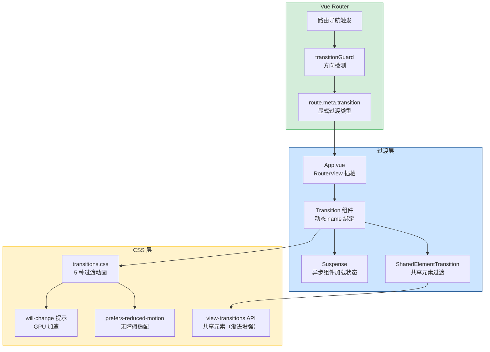

# 页面过渡动画

> 需求编号：YV-09-39 · 优先级：P2 · 人天：0.5d
> 依赖：无（独立功能，可与需求并行开发）

## 改动总览

| 改动点 | 类型 | 涉及文件 |
|--------|------|---------|
| 过渡动画 Composable | 新增 | `src/composables/usePageTransition.ts` |
| 过渡动画 CSS 样式 | 新增 | `src/styles/transitions.css` |
| 路由 meta 扩展 | 修改 | `src/router/index.ts`（路由配置） |
| App.vue 过渡容器 | 修改 | `src/App.vue` |
| 共享元素过渡组件 | 新增 | `src/components/common/SharedElementTransition.vue` |
| 过渡方向检测 | 新增 | `src/router/transitionGuard.ts` |

## 涉及文件

```
YiVad/
├── src/
│   ├── composables/
│   │   └── usePageTransition.ts          # 新增：过渡动画逻辑
│   ├── styles/
│   │   └── transitions.css               # 新增：过渡动画 CSS
│   ├── components/
│   │   └── common/
│   │       └── SharedElementTransition.vue # 新增：共享元素过渡
│   ├── router/
│   │   ├── index.ts                      # 修改：路由 meta 扩展
│   │   └── transitionGuard.ts            # 新增：过渡方向检测
│   └── App.vue                           # 修改：过渡容器
```

## 基本信息

| 字段 | 值 |
|------|-----|
| 需求编号 | YV-09-39 |
| 模块 | 全局基础设施 |
| 优先级 | **P2**（提升页面切换体验，增强应用专业感） |
| 前端人天 | 0.5d |
| 后端人天 | -- |
| 依赖 | 无 |

---

## 背景

YiVad 当前页面切换是瞬时完成的，没有任何过渡动画。用户在不同页面之间导航时，内容突然替换，缺乏视觉连续性。这不仅降低了用户体验，也让应用显得不够专业。现代 Web 应用普遍采用页面过渡动画来提供流畅的导航体验，帮助用户建立空间感知。

**核心问题：**

| # | 问题 | 严重程度 | 影响 |
|---|------|----------|------|
| 1 | **无页面过渡动画** -- 页面切换瞬间完成，视觉跳跃 | **中** | 用户体验不流畅，缺乏空间感知，页面切换感觉突兀 |
| 2 | **无过渡类型区分** -- 所有页面切换使用相同（无）效果 | **中** | 无法根据导航语义选择合适的过渡效果（如前进/后退） |
| 3 | **无加载状态过渡** -- 异步路由组件加载时页面空白 | **中** | 用户看到白屏或闪烁，不知道页面正在加载 |
| 4 | **无无障碍适配** -- 动画对部分用户造成不适 | **中** | 前庭功能障碍用户可能因动画感到眩晕 |
| 5 | **无共享元素过渡** -- 跨页面的相同元素无法平滑过渡 | **低** | 列表项到详情页的过渡缺乏连续性 |

## 一、现状分析

### 当前页面切换流程

```
用户点击导航 → Vue Router 解析路由 → 组件切换（瞬间） → 新页面显示
                                          │
                                          └── 无动画、无过渡、无加载状态
```

### 当前能力矩阵

| 能力 | 当前状态 | 工具/方案 | 覆盖情况 |
|------|----------|----------|----------|
| 页面过渡动画 | 无 | -- | 0% |
| 过渡类型区分 | 无 | -- | 0% |
| 加载状态过渡 | 无 | -- | 0% |
| 共享元素过渡 | 无 | -- | 0% |
| 无障碍适配 | 无 | -- | 0% |
| 过渡方向检测 | 无 | -- | 0% |

### 根因分析矩阵

| 缺失项 | 根因 | 影响链 |
|--------|------|--------|
| 过渡动画 | 未使用 Vue `<Transition>` 或 `<RouterView>` 插槽实现过渡 | 页面切换生硬，用户体验不连贯 |
| 过渡类型 | 路由 meta 未定义过渡类型字段，组件切换无差异化策略 | 所有页面切换体验一致，无法体现导航语义 |
| 加载状态 | 异步路由组件未配置 `Suspense` 或 loading 状态 | 慢网络下页面切换出现长时间白屏 |
| 无障碍 | 未检测 `prefers-reduced-motion` 媒体查询 | 动画对所有用户强制执行，无障碍性差 |

---

## 二、设计决策

### 过渡动画实现方式选型

| 维度 | Vue `<Transition>` | CSS `view-transitions` API | 自定义 JS 动画 | 决策 |
|------|-------------------|--------------------------|---------------|------|
| 浏览器支持 | 100%（Vue 内置） | Chrome 111+，Safari 18+ | 100% | **Vue Transition** |
| 实现复杂度 | 低（声明式 CSS） | 低（CSS 伪元素） | 高 | **Vue Transition** |
| 共享元素 | 不支持 | 支持（`view-transition-name`） | 需手动实现 | **Vue + view-transitions** |
| 性能 | GPU 加速 | GPU 加速 | 取决于实现 | 持平 |
| 灵活性 | 高（自定义类名） | 中（CSS 伪元素限定） | 最高 | **Vue Transition** |

**决策：** 主要使用 Vue `<Transition>` 组件实现页面过渡，配合 CSS `view-transitions` API 作为共享元素过渡的渐进增强方案（在支持的浏览器中启用）。

### 过渡类型选型

| 过渡类型 | CSS 动画 | 适用场景 | 持续时间 |
|---------|---------|---------|---------|
| `fade` | `opacity: 0 → 1` | 默认过渡，适用于大多数页面切换 | 200ms |
| `slide-left` | `translateX(30px) → 0` + `opacity` | 前进导航（进入更深层级） | 250ms |
| `slide-right` | `translateX(-30px) → 0` + `opacity` | 后退导航（返回上层级） | 250ms |
| `slide-up` | `translateY(20px) → 0` + `opacity` | 弹窗式页面（如设置面板） | 200ms |
| `scale` | `scale(0.95) → 1` + `opacity` | 卡片展开式页面（如详情页） | 300ms |

### 过渡方向检测策略

```
路由栈深度变化：
  当前深度 > 之前深度 → 前进导航 → slide-left
  当前深度 < 之前深度 → 后退导航 → slide-right
  深度相同 → 同级导航 → fade

路由 meta.transition 显式指定：
  优先使用 meta.transition，覆盖自动检测结果
```

### 路由 meta 扩展

```typescript
// 扩展 Vue Router 的 RouteMeta 类型
declare module "vue-router" {
  interface RouteMeta {
    transition?: "fade" | "slide-left" | "slide-right" | "slide-up" | "scale" | "none";
    transitionDuration?: number; // 自定义过渡时长 (ms)
    sharedElement?: string;      // 共享元素标识符
  }
}
```

---

## 三、目标架构



### 过渡动画生命周期

```
Enter 阶段:
  .transition-enter-from  →  .transition-enter-active  →  .transition-enter-to
  (初始状态: opacity 0)     (过渡中: 200-300ms)          (最终状态: opacity 1)

Leave 阶段:
  .transition-leave-from  →  .transition-leave-active  →  .transition-leave-to
  (初始状态: opacity 1)     (过渡中: 200-300ms)          (最终状态: opacity 0)

Mode: out-in（先离开再进入，避免两个页面同时可见）
```

---

## 四、具体改动

### 4.1 App.vue 过渡容器

**文件：** `src/App.vue`（修改）

在 `<RouterView>` 外层包裹 `<Transition>` 组件，支持动态过渡类型。

```vue
<!-- src/App.vue -->
<template>
  <router-view v-slot="{ Component, route }">
    <transition
      :name="getTransitionName(route)"
      mode="out-in"
      :duration="getTransitionDuration(route)"
      @before-enter="onBeforeEnter"
      @after-enter="onAfterEnter"
      @before-leave="onBeforeLeave"
    >
      <suspense>
        <component :is="Component" :key="route.fullPath" />
        <template #fallback>
          <div class="page-loading">
            <el-skeleton :rows="8" animated />
          </div>
        </template>
      </suspense>
    </transition>
  </router-view>
</template>

<script setup lang="ts">
import { usePageTransition } from "@/composables/usePageTransition";

const {
  getTransitionName,
  getTransitionDuration,
  onBeforeEnter,
  onAfterEnter,
  onBeforeLeave,
} = usePageTransition();
</script>
```

### 4.2 usePageTransition Composable

**文件：** `src/composables/usePageTransition.ts`（新增）

过渡动画核心逻辑：方向检测、类型解析、生命周期钩子。

```typescript
// src/composables/usePageTransition.ts
import { ref, computed } from "vue";
import type { RouteLocationNormalized } from "vue-router";

const routeHistory: string[] = [];
const MAX_HISTORY = 20;

export function usePageTransition() {
  const prefersReducedMotion = ref(false);
  const supportsViewTransitions = ref(false);

  // 检测 prefers-reduced-motion
  if (typeof window !== "undefined") {
    const mq = window.matchMedia("(prefers-reduced-motion: reduce)");
    prefersReducedMotion.value = mq.matches;
    mq.addEventListener("change", (e) => {
      prefersReducedMotion.value = e.matches;
    });

    // 检测 view-transitions API 支持
    supportsViewTransitions.value = "startViewTransition" in document;
  }

  function getTransitionName(route: RouteLocationNormalized): string {
    if (prefersReducedMotion.value) return "transition-none";

    // 优先使用路由 meta 显式指定的过渡类型
    if (route.meta.transition) {
      return `transition-${route.meta.transition}`;
    }

    // 自动检测导航方向
    const currentIndex = routeHistory.indexOf(route.fullPath);

    if (routeHistory.length === 0) {
      // 首次加载
      return "transition-fade";
    }

    const prevPath = routeHistory[routeHistory.length - 1];
    const prevDepth = prevPath.split("/").length;
    const currentDepth = route.fullPath.split("/").length;

    if (currentDepth > prevDepth) {
      return "transition-slide-left";   // 前进
    } else if (currentDepth < prevDepth) {
      return "transition-slide-right";  // 后退
    }
    return "transition-fade";           // 同级
  }

  function getTransitionDuration(route: RouteLocationNormalized): number {
    if (route.meta.transitionDuration) return route.meta.transitionDuration;
    const name = route.meta.transition || "fade";
    const durations: Record<string, number> = {
      fade: 200,
      "slide-left": 250,
      "slide-right": 250,
      "slide-up": 200,
      scale: 300,
    };
    return durations[name] || 200;
  }

  function onBeforeEnter(el: Element) {
    (el as HTMLElement).style.willChange = "transform, opacity";
  }

  function onAfterEnter(el: Element) {
    (el as HTMLElement).style.willChange = "auto";
  }

  function onBeforeLeave(el: Element) {
    (el as HTMLElement).style.willChange = "transform, opacity";
  }

  // 记录路由历史
  function recordRoute(path: string) {
    routeHistory.push(path);
    if (routeHistory.length > MAX_HISTORY) {
      routeHistory.shift();
    }
  }

  return {
    prefersReducedMotion,
    supportsViewTransitions,
    getTransitionName,
    getTransitionDuration,
    onBeforeEnter,
    onAfterEnter,
    onBeforeLeave,
    recordRoute,
  };
}
```

### 4.3 transitions.css 过渡样式

**文件：** `src/styles/transitions.css`（新增）

定义 5 种过渡动画的 CSS 类，以及无障碍适配。

```css
/* src/styles/transitions.css */

/* ========================================
   Fade Transition
   ======================================== */
.transition-fade-enter-active,
.transition-fade-leave-active {
  transition: opacity 200ms ease;
}
.transition-fade-enter-from,
.transition-fade-leave-to {
  opacity: 0;
}

/* ========================================
   Slide Left (前进)
   ======================================== */
.transition-slide-left-enter-active,
.transition-slide-left-leave-active {
  transition: transform 250ms ease, opacity 250ms ease;
}
.transition-slide-left-enter-from {
  transform: translateX(30px);
  opacity: 0;
}
.transition-slide-left-leave-to {
  transform: translateX(-30px);
  opacity: 0;
}

/* ========================================
   Slide Right (后退)
   ======================================== */
.transition-slide-right-enter-active,
.transition-slide-right-leave-active {
  transition: transform 250ms ease, opacity 250ms ease;
}
.transition-slide-right-enter-from {
  transform: translateX(-30px);
  opacity: 0;
}
.transition-slide-right-leave-to {
  transform: translateX(30px);
  opacity: 0;
}

/* ========================================
   Slide Up (弹窗式页面)
   ======================================== */
.transition-slide-up-enter-active,
.transition-slide-up-leave-active {
  transition: transform 200ms ease, opacity 200ms ease;
}
.transition-slide-up-enter-from {
  transform: translateY(20px);
  opacity: 0;
}
.transition-slide-up-leave-to {
  transform: translateY(-20px);
  opacity: 0;
}

/* ========================================
   Scale (卡片展开)
   ======================================== */
.transition-scale-enter-active {
  transition: transform 300ms cubic-bezier(0.34, 1.56, 0.64, 1),
              opacity 300ms ease;
}
.transition-scale-leave-active {
  transition: transform 200ms ease, opacity 200ms ease;
}
.transition-scale-enter-from {
  transform: scale(0.95);
  opacity: 0;
}
.transition-scale-leave-to {
  transform: scale(0.95);
  opacity: 0;
}

/* ========================================
   None (禁用过渡)
   ======================================== */
.transition-none-enter-active,
.transition-none-leave-active {
  transition: none;
}

/* ========================================
   无障碍：prefers-reduced-motion
   ======================================== */
@media (prefers-reduced-motion: reduce) {
  .transition-fade-enter-active,
  .transition-fade-leave-active,
  .transition-slide-left-enter-active,
  .transition-slide-left-leave-active,
  .transition-slide-right-enter-active,
  .transition-slide-right-leave-active,
  .transition-slide-up-enter-active,
  .transition-slide-up-leave-active,
  .transition-scale-enter-active,
  .transition-scale-leave-active {
    transition: none !important;
  }
}

/* ========================================
   View Transitions API (渐进增强)
   ======================================== */
@supports (view-transition-name: none) {
  ::view-transition-old(root) {
    animation: 200ms ease-out both fade-out;
  }
  ::view-transition-new(root) {
    animation: 250ms ease-out both slide-from-right;
  }
}

@keyframes fade-out {
  to { opacity: 0; }
}
@keyframes slide-from-right {
  from { transform: translateX(30px); opacity: 0; }
}

/* ========================================
   页面加载骨架屏
   ======================================== */
.page-loading {
  padding: 24px;
  min-height: 400px;
  display: flex;
  align-items: center;
  justify-content: center;
}
```

### 4.4 transitionGuard 路由守卫

**文件：** `src/router/transitionGuard.ts`（新增）

在路由导航时记录路由历史，用于方向检测。

```typescript
// src/router/transitionGuard.ts
import type { Router } from "vue-router";

const routeHistory: { path: string; depth: number }[] = [];
const MAX_HISTORY = 20;

export function setupTransitionGuard(router: Router) {
  router.beforeEach((to, from) => {
    // 记录导航历史
    if (from.fullPath !== to.fullPath) {
      routeHistory.push({
        path: from.fullPath,
        depth: from.fullPath.split("/").filter(Boolean).length,
      });
      if (routeHistory.length > MAX_HISTORY) {
        routeHistory.shift();
      }
    }
  });

  return {
    getLastRoute: () => routeHistory[routeHistory.length - 1] || null,
    getHistory: () => [...routeHistory],
    getDirection: (toDepth: number): "forward" | "backward" | "same" => {
      const last = routeHistory[routeHistory.length - 1];
      if (!last) return "same";
      if (toDepth > last.depth) return "forward";
      if (toDepth < last.depth) return "backward";
      return "same";
    },
  };
}
```

### 4.5 SharedElementTransition 组件

**文件：** `src/components/common/SharedElementTransition.vue`（新增）

使用 CSS `view-transitions` API 实现共享元素过渡（渐进增强）。

```vue
<!-- src/components/common/SharedElementTransition.vue -->
<template>
  <div
    ref="elementRef"
    :style="{ viewTransitionName: enabled ? name : 'none' }"
  >
    <slot />
  </div>
</template>

<script setup lang="ts">
import { ref, computed } from "vue";

const props = defineProps<{
  name: string;
  enabled?: boolean;
}>();

const elementRef = ref<HTMLElement>();
const supportsVT = ref(
  typeof document !== "undefined" && "startViewTransition" in document
);

const enabled = computed(() => props.enabled !== false && supportsVT.value);
</script>
```

---

## 五、实施步骤

| 步骤 | 任务 | 产出 | 验证方式 | 人天 |
|------|------|------|----------|------|
| 1 | 编写 transitions.css 过渡样式 | `src/styles/transitions.css` | 手动测试 5 种过渡效果 | 0.10 |
| 2 | 实现 usePageTransition Composable | `src/composables/usePageTransition.ts` | 单元测试：方向检测逻辑 | 0.10 |
| 3 | 修改 App.vue 添加过渡容器 | `src/App.vue` | 手动测试：页面切换动画 | 0.05 |
| 4 | 实现 transitionGuard 路由守卫 | `src/router/transitionGuard.ts` | 单元测试：路由历史记录 | 0.05 |
| 5 | 为路由配置添加 transition meta | `src/router/index.ts`（路由配置） | 按路由验证过渡效果 | 0.05 |
| 6 | 实现 SharedElementTransition 组件 | `src/components/common/SharedElementTransition.vue` | 手动测试：Chrome 中共享元素过渡 | 0.05 |
| 7 | 添加 prefers-reduced-motion 适配 | `src/styles/transitions.css` 媒体查询 | 手动测试：系统设置中开启减弱动态效果 | 0.05 |
| 8 | 集成测试 + 端到端验证 | 完整页面切换流程 | 所有过渡动画正常，无闪烁 | 0.05 |

**总计：** 0.5d

---

## 六、测试规格

### 单元测试：usePageTransition

#### Scenario: 前进导航使用 slide-left
- **GIVEN** 当前路由 `/project`，目标路由 `/project/PL`
- **WHEN** 调用 `getTransitionName(to)`
- **THEN** 返回 `"transition-slide-left"`

#### Scenario: 后退导航使用 slide-right
- **GIVEN** 路由历史 `["/project", "/project/PL"]`，当前路由 `/project/PL`，目标路由 `/project`
- **WHEN** 调用 `getTransitionName(to)`
- **THEN** 返回 `"transition-slide-right"`

#### Scenario: 同级导航使用 fade
- **GIVEN** 当前路由 `/project/PL`，目标路由 `/project/DS`
- **WHEN** 调用 `getTransitionName(to)`
- **THEN** 返回 `"transition-fade"`

### 组件测试：App.vue 过渡容器

#### Scenario: 页面切换时应用过渡动画
- **GIVEN** 挂载 App.vue 组件，`route.meta.transition = "slide-left"`
- **WHEN** 触发路由切换
- **THEN** `<Transition>` 组件的 `name` 属性为 `"transition-slide-left"`

#### Scenario: prefers-reduced-motion 禁用动画
- **GIVEN** `prefersReducedMotion = true`
- **WHEN** 触发路由切换
- **THEN** `<Transition>` 组件的 `name` 属性为 `"transition-none"`

#### Scenario: 异步组件显示加载骨架屏
- **GIVEN** 路由组件为异步加载（`defineAsyncComponent`），网络延迟 500ms
- **WHEN** 触发路由切换
- **THEN** 在组件加载完成前显示 `<el-skeleton>` 骨架屏

---

## 七、风险与缓解

| 风险 | 概率 | 影响 | 等级 | 缓解措施 | 应急预案 |
|------|------|------|------|----------|----------|
| 过渡动画导致页面切换延迟 | 低 | 中 | 低 | 过渡时长控制在 200-300ms，避免复杂动画 | 将过渡时长缩短至 150ms 或禁用动画 |
| 低端设备动画卡顿 | 中 | 中 | 中 | 使用 `will-change` 提示 GPU 加速，仅使用 `transform` 和 `opacity` | 低端设备自动降级为 fade 过渡 |
| 共享元素过渡在 Safari 中不生效 | 中 | 低 | 低 | `view-transitions` API 作为渐进增强，不支持时静默降级 | 无共享元素过渡，使用标准过渡 |
| 过渡动画与 Element Plus 弹窗动画冲突 | 低 | 中 | 低 | 确保页面过渡和组件动画使用不同的 CSS 类名前缀 | 在弹窗显示期间暂停页面过渡 |
| 嵌套路由过渡不同步 | 中 | 中 | 中 | 嵌套路由仅在最外层 `<RouterView>` 应用过渡，子路由不独立过渡 | 嵌套路由的过渡由父级 `<Transition>` 统一管理 |

---

## 八、回滚策略

| 回滚场景 | 回滚方式 | 影响范围 | 恢复时间 |
|----------|----------|----------|----------|
| 过渡动画导致页面切换闪烁 | 恢复 App.vue 中移除 `<Transition>` 包裹 | 所有页面切换 | < 2min |
| 过渡方向检测错误导致反向动画 | 回退 transitionGuard 方向检测逻辑 | 导航动画 | < 5min |
| 共享元素过渡导致布局异常 | 禁用 SharedElementTransition 组件 | 共享元素过渡 | < 1min |
| 过渡动画与第三方组件冲突 | 临时设置所有路由 `meta.transition = "none"` | 特定页面 | < 2min |

**回滚验证：**
- 回滚后页面切换恢复为瞬时切换（无动画）
- 回滚后无控制台 CSS 动画相关错误
- 回滚后页面切换无闪烁或布局偏移

---

## 九、设计决策记录

### D-01: 使用 Vue Transition 而非纯 CSS 方案

**背景：** 需要为页面切换添加过渡动画，有两种实现方式。
**决策：** 选择 Vue `<Transition>` 组件，因为它提供声明式 API、完整的生命周期钩子、`mode="out-in"` 避免两个页面同时可见。
**权衡：** 放弃 CSS `view-transitions` API 的共享元素能力，但获得了更好的浏览器兼容性和 Vue 生态集成。
**后果：** 共享元素过渡需要通过 `view-transitions` API 作为渐进增强单独实现。

### D-02: 过渡时长 200-300ms

**背景：** 需要设定合适的过渡时长，平衡流畅性和响应速度。
**决策：** 过渡时长 200-300ms，根据过渡类型微调。fade/slide-up 为 200ms（快速），slide-left/right 为 250ms（标准），scale 为 300ms（弹性动画）。
**权衡：** 200-300ms 是用户感知动画但不会觉得延迟的黄金区间。超过 300ms 会让用户感觉页面响应慢。
**后果：** 需要在 CI 中测试过渡时长，确保不会因样式变更意外延长。

### D-03: prefers-reduced-motion 直接禁用所有过渡

**背景：** 部分用户因前庭功能障碍对动画敏感。
**决策：** 检测 `prefers-reduced-motion: reduce` 时，所有过渡动画立即禁用（`transition: none`），而非减速。
**权衡：** 牺牲了 "减速动画" 的中间方案，但提供了最直接的无障碍体验。
**后果：** 页面切换回到瞬时切换，符合 WCAG 2.1 准则 2.3.3。

### D-04: 路由深度而非路由树层级判断方向

**背景：** 需要判断用户是前进还是后退导航。
**决策：** 使用 URL 路径深度（`/` 分割后的段数）而非路由树层级判断方向。
**权衡：** 更简单、更可靠，不依赖路由配置结构。但无法区分同一深度的不同 "分支" 导航。
**后果：** 同级导航（如 `/project/PL` → `/project/DS`）统一使用 fade 过渡。

---

## 十、可观测性

### 关键指标

| 指标 | 采集方式 | 告警阈值 | 说明 |
|------|---------|---------|------|
| 过渡动画帧率 | Performance Observer 监测 jank | < 50 FPS | 过渡动画期间的平均帧率 |
| 过渡时长 | `transitionend` 事件计时 | > 300ms | 实际过渡完成时间 |
| 共享元素过渡成功率 | `startViewTransition` 回调 | < 100% | 共享元素过渡是否成功执行 |
| 无障碍模式使用率 | `prefers-reduced-motion` 匹配率 | -- | 有多少用户开启了减弱动态效果 |
| 页面切换等待时间 | 路由导航开始到过渡完成 | > 500ms | 包含异步组件加载 + 过渡动画 |

### 日志规范

| 日志级别 | 场景 | 示例 |
|---------|------|------|
| `INFO` | 过渡动画开始 | `[Transition] Starting slide-left for /project/PL` |
| `WARN` | 过渡动画超时 | `[Transition] slide-left timeout after 500ms for /project/PL` |
| `INFO` | 无障碍模式激活 | `[Transition] prefers-reduced-motion detected — animations disabled` |
| `WARN` | 共享元素过渡不支持 | `[Transition] view-transitions API not supported — shared element disabled` |

---

## 十一、代码审查检查清单

- [ ] `transitions.css` 中 5 种过渡动画定义完整，使用 `transform` 和 `opacity`（仅触发 Composite）
- [ ] `usePageTransition` 方向检测逻辑正确（前进/后退/同级）
- [ ] App.vue 中 `<Transition>` 使用 `mode="out-in"` 避免视觉重叠
- [ ] `<Suspense>` 提供 `#fallback` 骨架屏，避免异步组件加载时白屏
- [ ] `will-change` 在 `before-enter` 时设置，`after-enter` 时清除
- [ ] `prefers-reduced-motion` 媒体查询正确覆盖所有过渡类名
- [ ] `view-transitions` API 使用 `@supports` 包裹，不支持时静默降级
- [ ] 路由 meta 中 `transition` 字段类型定义正确
- [ ] 嵌套路由不在子级 `<RouterView>` 中重复应用过渡
- [ ] 过渡动画时长在 200-300ms 范围内，无超过 300ms 的动画

---

## 回归问题预测

| # | 问题 | 预测场景 | 根因 | 预防措施 |
|---|------|---------|------|---------|
| 1 | 过渡动画导致页面切换时出现双滚动条 | 离开的页面和进入的页面同时存在，`mode="out-in"` 未生效 | Vue Transition 组件未正确设置 `mode` 属性，或两个页面同时处于 DOM 中 | 确认 `mode="out-in"` 生效，离开动画完成后才挂载进入页面 |
| 2 | 过渡动画与 Element Plus Drawer/Dialog 冲突 | 页面切换时，未关闭的 Drawer 跟随页面一起执行过渡动画 | Element Plus 的弹出层使用 `Teleport` 挂载到 `body`，不受页面 Transition 影响，但视觉上可能不协调 | 路由切换前通过守卫关闭所有弹出层 |
| 3 | 异步组件加载时骨架屏闪烁 | 快速网络下，骨架屏显示不到 50ms 就消失，产生闪烁感 | Suspense 的 fallback 和实际内容切换过快 | 添加最小显示时间 200ms（debounce show），避免骨架屏闪烁 |
| 4 | 共享元素 transition-name 冲突 | 同一页面中多个元素使用相同的 `view-transition-name` | CSS view-transitions 要求每个 `view-transition-name` 在同一页面中唯一 | 生成唯一标识符（如 `item-${id}`），运行时检测重复 |
| 5 | 浏览器后退按钮导致过渡方向错误 | 用户点击浏览器后退按钮，但路由深度判断依赖内部历史栈 | 浏览器后退按钮不会触发 `beforeEach` 中的历史记录逻辑 | 同时监听 `popstate` 事件，在浏览器后退时标记方向为 `backward` |
| 6 | 过渡动画在移动端 WebView 中性能差 | 移动端 WebView 的 GPU 合成能力较弱，复杂过渡动画导致掉帧 | 移动端 GPU 处理能力有限，同时进行 opacity 和 transform 动画可能超过合成器预算 | 移动端（视口 < 768px）自动降级为 fade 过渡（仅 opacity 变化） |

---

## 性能分析

### 过渡动画性能

| 过渡类型 | 涉及属性 | 触发阶段 | 预期 FPS | GPU 内存增量 |
|---------|---------|---------|---------|------------|
| fade | `opacity` | Composite only | 60 FPS | ~0.5MB |
| slide-left | `transform` + `opacity` | Composite only | 60 FPS | ~1MB |
| slide-right | `transform` + `opacity` | Composite only | 60 FPS | ~1MB |
| slide-up | `transform` + `opacity` | Composite only | 60 FPS | ~1MB |
| scale | `transform` + `opacity` | Composite only | 55-60 FPS | ~1.5MB |

**关键设计原则：** 所有过渡动画仅使用 `transform` 和 `opacity`，这两个属性在 GPU 合成线程上执行，不会触发 Layout 或 Paint，保证 60 FPS。

### 页面切换性能影响

| 场景 | 无过渡 | 有过渡（200ms） | 增量 |
|------|--------|---------------|------|
| 同步组件切换 | 0ms | 200ms | +200ms |
| 异步组件切换（快网络） | 0ms | 200ms + 加载时间 | +200ms |
| 异步组件切换（慢网络） | 加载时间 | 200ms + 加载时间 | +200ms |
| 共享元素过渡（支持浏览器） | 0ms | 200ms | +200ms |

### 内存占用

| 组件 | 内存占用 | 说明 |
|------|---------|------|
| usePageTransition | ~2KB | ref + computed + matchMedia 监听器 |
| transitionGuard | ~1KB | 路由历史数组（最多 20 条） |
| SharedElementTransition | ~2KB | 组件实例 |
| transitions.css | ~3KB | CSS 样式文件 |
| Transition 组件实例 | ~5KB | Vue 内置组件 |
| **总计** | **~13KB** | 可以忽略不计 |

---

## 技术债务追踪

| # | 技术债 | 优先级 | 预计人天 | 说明 |
|---|--------|--------|---------|------|
| 1 | 过渡动画可配置化 | P2 | 0.5 | 允许用户在设置中选择过渡类型或关闭动画 |
| 2 | 过渡动画性能监控面板 | P3 | 0.5 | 开发模式下显示过渡帧率、耗时等性能数据 |
| 3 | 列表到详情的全量共享元素过渡 | P3 | 1.0 | 在 `view-transitions` API 广泛支持后，实现列表项到详情页的完整共享元素过渡 |
| 4 | 过渡动画视觉回归测试 | P2 | 0.5 | 为过渡动画添加视觉回归测试，确保动画效果一致 |
| 5 | 路由级过渡优先级配置 | P3 | 0.3 | 支持在路由配置中按优先级选择过渡类型（如优先 slide-left，不支持时降级为 fade） |

---

## 补充：单元测试用例

### UT-TA01: usePageTransition

| # | 测试场景 | 输入 | 期望结果 |
|---|---------|------|---------|
| 1 | 淡入淡出 | 路由切换 | fade 动画执行 |
| 2 | 滑动过渡 | slide-left/slide-right | 正确方向滑动 |
| 3 | 动画禁用 | prefers-reduced-motion | 跳过动画直接切换 |
| 4 | 过渡时长 | duration=300ms | 动画在 300ms 内完成 |

## 补充：实例演示页面

### Demo-TA01: 过渡动画演示
展示路由切换动画类型：fade/slide/zoom，动画时长调节，reduced-motion 适配。

