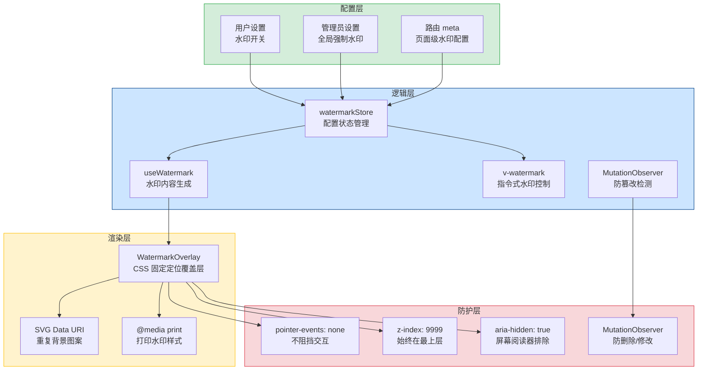

# 水印系统

> 需求编号：YV-09-40 · 优先级：P2 · 人天：0.5d
> 依赖：无（独立功能，可与需求并行开发）

## 改动总览

| 改动点 | 类型 | 涉及文件 |
|--------|------|---------|
| 水印 Composable | 新增 | `src/composables/useWatermark.ts` |
| 水印容器组件 | 新增 | `src/components/common/WatermarkOverlay.vue` |
| 水印配置 Store | 新增 | `src/stores/watermark.ts` |
| 水印 CSS 样式 | 新增 | `src/styles/watermark.css` |
| 打印样式 | 新增 | `src/styles/print.css` |
| 全局水印指令 | 新增 | `src/directives/v-watermark.ts` |
| 路由 meta 扩展 | 修改 | `src/router/index.ts`（水印配置） |
| 管理后台水印设置页 | 新增 | `src/views/settings/WatermarkSettings.vue` |

## 涉及文件

```
YiVad/
├── src/
│   ├── composables/
│   │   └── useWatermark.ts              # 新增：水印核心逻辑
│   ├── components/
│   │   └── common/
│   │       └── WatermarkOverlay.vue     # 新增：水印覆盖层组件
│   ├── stores/
│   │   └── watermark.ts                 # 新增：水印配置状态管理
│   ├── styles/
│   │   ├── watermark.css                # 新增：水印样式
│   │   └── print.css                    # 新增：打印样式
│   ├── directives/
│   │   └── v-watermark.ts               # 新增：水印指令
│   ├── views/
│   │   └── settings/
│   │       └── WatermarkSettings.vue     # 新增：水印设置页
│   └── router/
│       └── index.ts                     # 修改：路由 meta 水印配置
```

## 基本信息

| 字段 | 值 |
|------|-----|
| 需求编号 | YV-09-40 |
| 模块 | 全局基础设施 |
| 优先级 | **P2**（信息安全追溯，防止敏感信息泄露） |
| 前端人天 | 0.5d |
| 后端人天 | -- |
| 依赖 | 无 |

---

## 背景

YiVad 管理后台包含大量敏感业务数据（项目信息、用户数据、AI 对话记录等）。当前没有任何水印保护机制，用户可以通过截图、拍照等方式将敏感信息泄露出去，且无法追溯泄露源头。在政企、金融、医疗等合规场景中，水印是信息安全的基本要求。

**核心问题：**

| # | 问题 | 严重程度 | 影响 |
|---|------|----------|------|
| 1 | **无水印保护** -- 页面内容可被随意截图，无法追溯 | **高** | 敏感信息泄露后无法定位泄露者，合规风险 |
| 2 | **无动态水印** -- 即使有水印也是静态的，无法包含实时信息 | **中** | 截图时间、操作者身份无法从水印中获知 |
| 3 | **无打印水印** -- 打印文档无水印，纸质文档泄露无法追溯 | **中** | 打印的敏感文档成为不可追溯的信息载体 |
| 4 | **无颗粒度控制** -- 无法按页面敏感度配置水印 | **中** | 所有页面要么全有水印要么全无，不灵活 |
| 5 | **无强制水印** -- 管理员无法全局强制开启水印 | **中** | 用户可自行关闭水印，安全策略失效 |

## 一、现状分析

### 当前信息安全能力矩阵

| 能力 | 当前状态 | 工具/方案 | 覆盖情况 |
|------|----------|----------|----------|
| 页面水印 | 无 | -- | 0% |
| 动态水印（用户名+时间） | 无 | -- | 0% |
| 打印水印 | 无 | -- | 0% |
| 水印开关控制 | 无 | -- | 0% |
| 全局水印策略 | 无 | -- | 0% |
| 防截图威慑 | 无 | -- | 0% |

### 根因分析矩阵

| 缺失项 | 根因 | 影响链 |
|--------|------|--------|
| 水印系统 | 未实现水印覆盖层组件，未设计水印配置体系 | 页面内容无任何保护，截图可随意传播 |
| 动态信息 | 水印内容未包含用户身份、时间戳等追溯信息 | 即使截图泄露，也无法定位泄露者和泄露时间 |
| 打印水印 | 打印样式表中未添加水印逻辑 | 纸质文档与电子页面安全级别不一致 |
| 颗粒度控制 | 路由 meta 未包含水印配置字段 | 管理员无法按页面敏感度差异化配置水印策略 |

---

## 二、设计决策

### 水印实现方式选型

| 维度 | Canvas 生成图片 | CSS 重复背景 | SVG 内联 | 决策 |
|------|---------------|-------------|---------|------|
| 性能 | 中（Canvas 绘制 + toDataURL） | 高（GPU 合成，无 JS 开销） | 高（矢量渲染） | **CSS 重复背景** |
| 可定制性 | 高（任意内容） | 中（仅文本和简单图案） | 高（任意 SVG 内容） | **CSS + SVG 混合** |
| 防篡改 | 低（DOM 中可见 img 标签） | 低（CSS 可被覆盖） | 低（DOM 中可见 SVG） | 需要 MutationObserver 防篡改 |
| 复杂度 | 中 | 低 | 中 | **CSS 优先** |
| 打印支持 | 需额外处理 | 通过 `@media print` 天然支持 | 需额外处理 | **CSS 优先** |

**决策：** 使用 CSS 背景图方式实现水印——通过 SVG data URI 生成水印图案，作为固定定位覆盖层的背景图。CSS 方案由 GPU 合成，无 JavaScript 运行时开销，性能最优。

### 水印内容设计

```
┌────────────────────────────────────────────┐
│  ruiyi.cheng@zeekrlife.com                 │
│  2026-09-09 14:30:25                       │
│  192.168.1.100                             │
│  YiVad Management Console                  │
└────────────────────────────────────────────┘
```

水印包含以下信息：
- **用户名/邮箱** — 标识操作者身份
- **时间戳** — 标识截图时间（动态更新，每分钟刷新）
- **IP 地址** — 标识操作者网络位置（用于追溯）
- **系统标识** — 标识来源系统

### 水印布局参数

| 参数 | 默认值 | 说明 |
|------|--------|------|
| 旋转角度 | -25deg | 对角线排列 |
| 间距 X | 200px | 水印块水平间距 |
| 间距 Y | 150px | 水印块垂直间距 |
| 透明度 | 0.06 | 透明度（0-1），低调不干扰阅读 |
| 字体大小 | 14px | 水印文字大小 |
| 字体颜色 | #000000 | 水印文字颜色 |
| 字体族 | system-ui | 系统默认字体 |

### 水印 SVG 生成

```typescript
function generateWatermarkSVG(config: WatermarkConfig): string {
  const lines = [
    config.username,
    new Date().toLocaleString(),
    config.ipAddress || "N/A",
    "YiVad Management Console",
  ];
  const lineHeight = 20;
  const width = 280;
  const height = lines.length * lineHeight + 20;

  const svgContent = `
    <svg xmlns="http://www.w3.org/2000/svg" width="${width}" height="${height}">
      <g transform="rotate(-25, ${width / 2}, ${height / 2})">
        ${lines.map((line, i) => `
          <text
            x="${width / 2}"
            y="${20 + i * lineHeight}"
            text-anchor="middle"
            fill="${config.color}"
            fill-opacity="${config.opacity}"
            font-size="${config.fontSize}"
            font-family="${config.fontFamily}"
          >${line}</text>
        `).join("")}
      </g>
    </svg>
  `;

  return `data:image/svg+xml;base64,${btoa(unescape(encodeURIComponent(svgContent)))}`;
}
```

---

## 三、目标架构



### 水印渲染层级

```
z-index 层级:
  9999: WatermarkOverlay（水印覆盖层）  ← pointer-events: none
  2000: Element Plus 弹出层（Dialog/Drawer/Popover）
  1000: 固定导航栏
   100: 页面内容
     0: 默认层级
```

---

## 四、具体改动

### 4.1 useWatermark Composable

**文件：** `src/composables/useWatermark.ts`（新增）

水印内容生成、动态刷新、防篡改检测。

```typescript
// src/composables/useWatermark.ts
import { ref, computed, onMounted, onBeforeUnmount, watch } from "vue";
import { useWatermarkStore } from "@/stores/watermark";

export function useWatermark() {
  const store = useWatermarkStore();
  const currentTime = ref(new Date());
  const observer = ref<MutationObserver | null>(null);
  let timeInterval: ReturnType<typeof setInterval> | null = null;

  // 动态时间戳（每分钟更新）
  onMounted(() => {
    timeInterval = setInterval(() => {
      currentTime.value = new Date();
    }, 60000); // 每分钟刷新
  });

  onBeforeUnmount(() => {
    if (timeInterval) clearInterval(timeInterval);
    observer.value?.disconnect();
  });

  // 生成水印 SVG Data URI
  const watermarkDataURI = computed(() => {
    if (!store.enabled) return "";
    return generateWatermarkSVG({
      username: store.username,
      ipAddress: store.ipAddress,
      color: store.color,
      opacity: store.opacity,
      fontSize: store.fontSize,
      fontFamily: store.fontFamily,
      timestamp: currentTime.value,
    });
  });

  // 水印覆盖层样式
  const overlayStyle = computed(() => ({
    backgroundImage: `url(${watermarkDataURI.value})`,
    backgroundRepeat: "repeat",
    backgroundSize: `${store.spacingX}px ${store.spacingY}px`,
    opacity: store.enabled ? 1 : 0,
    pointerEvents: "none" as const,
    position: "fixed" as const,
    top: "0",
    left: "0",
    width: "100%",
    height: "100%",
    zIndex: 9999,
  }));

  // 防篡改：监听水印 DOM 变化
  function setupTamperProtection(element: HTMLElement) {
    if (observer.value) observer.value.disconnect();

    observer.value = new MutationObserver((mutations) => {
      for (const mutation of mutations) {
        if (mutation.type === "childList" && mutation.removedNodes.length > 0) {
          // 水印被删除，重新添加
          const removed = Array.from(mutation.removedNodes);
          if (removed.some((n) => n === element || element.contains(n as Node))) {
            document.body.appendChild(element);
            console.warn("[Watermark] Tamper detected — watermark restored");
          }
        }
        if (mutation.type === "attributes" && mutation.target === element) {
          // 水印样式被修改，恢复
          Object.assign(element.style, overlayStyle.value);
          console.warn("[Watermark] Style tamper detected — restored");
        }
      }
    });

    observer.value.observe(document.body, { childList: true, subtree: true });
    observer.value.observe(element, { attributes: true, attributeFilter: ["style", "class"] });
  }

  return {
    watermarkDataURI,
    overlayStyle,
    setupTamperProtection,
    isEnabled: computed(() => store.enabled),
  };
}

function generateWatermarkSVG(config: WatermarkConfig): string {
  const lines = [
    config.username,
    config.timestamp.toLocaleString(),
    config.ipAddress || "N/A",
    "YiVad Management Console",
  ];
  const lineHeight = 20;
  const width = 280;
  const height = lines.length * lineHeight + 20;

  const svgContent = `<svg xmlns="http://www.w3.org/2000/svg" width="${width}" height="${height}">
    <g transform="rotate(-25, ${width / 2}, ${height / 2})">
      ${lines.map((line, i) => `
        <text x="${width / 2}" y="${20 + i * lineHeight}" text-anchor="middle"
              fill="${config.color}" fill-opacity="${config.opacity}"
              font-size="${config.fontSize}px" font-family="${config.fontFamily}">
          ${escapeXml(line)}
        </text>
      `).join("")}
    </g>
  </svg>`;

  return `data:image/svg+xml;base64,${btoa(unescape(encodeURIComponent(svgContent)))}`;
}

function escapeXml(str: string): string {
  return str.replace(/&/g, "&amp;").replace(/</g, "&lt;").replace(/>/g, "&gt;").replace(/"/g, "&quot;");
}

interface WatermarkConfig {
  username: string;
  ipAddress: string;
  color: string;
  opacity: number;
  fontSize: number;
  fontFamily: string;
  timestamp: Date;
}
```

### 4.2 WatermarkOverlay 组件

**文件：** `src/components/common/WatermarkOverlay.vue`（新增）

全局水印覆盖层组件，挂载在 App.vue 中。

```vue
<!-- src/components/common/WatermarkOverlay.vue -->
<template>
  <div
    v-if="isEnabled"
    ref="overlayRef"
    class="watermark-overlay"
    :style="overlayStyle"
    aria-hidden="true"
    role="presentation"
  />
</template>

<script setup lang="ts">
import { ref, onMounted } from "vue";
import { useWatermark } from "@/composables/useWatermark";

const { isEnabled, overlayStyle, setupTamperProtection } = useWatermark();
const overlayRef = ref<HTMLElement>();

onMounted(() => {
  if (overlayRef.value) {
    setupTamperProtection(overlayRef.value);
  }
});
</script>
```

### 4.3 watermarkStore 状态管理

**文件：** `src/stores/watermark.ts`（新增）

管理水印配置状态，支持用户偏好和管理员全局策略。

```typescript
// src/stores/watermark.ts
import { defineStore } from "pinia";
import { ref, computed } from "vue";

export const useWatermarkStore = defineStore("watermark", () => {
  // 用户偏好
  const userEnabled = ref(true);
  // 管理员全局强制
  const globalForced = ref(false);
  // 水印配置
  const username = ref("");
  const ipAddress = ref("");
  const color = ref("#000000");
  const opacity = ref(0.06);
  const fontSize = ref(14);
  const fontFamily = ref("system-ui, -apple-system, sans-serif");
  const spacingX = ref(280);
  const spacingY = ref(180);

  // 最终水印状态：全局强制 OR 用户启用
  const enabled = computed(() => globalForced.value || userEnabled.value);

  // 管理员强制开启
  function forceEnable() {
    globalForced.value = true;
  }

  function forceDisable() {
    globalForced.value = false;
  }

  // 用户切换
  function toggleUser(enable: boolean) {
    userEnabled.value = enable;
  }

  // 更新配置
  function updateConfig(config: Partial<{
    color: string;
    opacity: number;
    fontSize: number;
    spacingX: number;
    spacingY: number;
  }>) {
    Object.assign({ color, opacity, fontSize, spacingX, spacingY }, config);
  }

  // 设置用户信息
  function setUserInfo(user: string, ip: string) {
    username.value = user;
    ipAddress.value = ip;
  }

  return {
    userEnabled,
    globalForced,
    username,
    ipAddress,
    color,
    opacity,
    fontSize,
    fontFamily,
    spacingX,
    spacingY,
    enabled,
    forceEnable,
    forceDisable,
    toggleUser,
    updateConfig,
    setUserInfo,
  };
});
```

### 4.4 v-watermark 指令

**文件：** `src/directives/v-watermark.ts`（新增）

提供指令式水印控制，用于页面级水印开关。

```typescript
// src/directives/v-watermark.ts
import type { Directive } from "vue";
import { useWatermarkStore } from "@/stores/watermark";

export const vWatermark: Directive = {
  mounted(el, binding) {
    const store = useWatermarkStore();
    const enabled = binding.value !== false;

    // 根据指令值控制水印
    if (!enabled) {
      el.setAttribute("data-watermark-disabled", "true");
    }
  },
  updated(el, binding) {
    const enabled = binding.value !== false;
    if (!enabled) {
      el.setAttribute("data-watermark-disabled", "true");
    } else {
      el.removeAttribute("data-watermark-disabled");
    }
  },
};
```

### 4.5 打印样式

**文件：** `src/styles/print.css`（新增）

确保打印时水印始终可见，且打印样式专业。

```css
/* src/styles/print.css */

@media print {
  /* 水印在打印时始终显示 */
  .watermark-overlay {
    display: block !important;
    opacity: 0.08 !important; /* 打印时稍深，确保可见 */
    -webkit-print-color-adjust: exact !important;
    print-color-adjust: exact !important;
    position: fixed !important;
    z-index: 9999 !important;
  }

  /* 隐藏非打印元素 */
  .no-print {
    display: none !important;
  }

  /* 隐藏导航栏 */
  .app-navbar,
  .app-sidebar,
  .app-tabs {
    display: none !important;
  }

  /* 页面内容全宽 */
  .app-main {
    margin: 0 !important;
    padding: 0 !important;
    width: 100% !important;
  }

  /* 表格拆分控制 */
  table {
    page-break-inside: auto;
  }
  tr {
    page-break-inside: avoid;
  }

  /* 页面分页 */
  .page-break {
    page-break-before: always;
  }
}
```

---

## 五、实施步骤

| 步骤 | 任务 | 产出 | 验证方式 | 人天 |
|------|------|------|----------|------|
| 1 | 实现 watermarkStore 状态管理 | `src/stores/watermark.ts` | 单元测试：store 状态切换 | 0.05 |
| 2 | 实现 useWatermark Composable | `src/composables/useWatermark.ts` | 单元测试：SVG 生成 | 0.10 |
| 3 | 实现 WatermarkOverlay 组件 | `src/components/common/WatermarkOverlay.vue` | 组件测试：覆盖层渲染 | 0.05 |
| 4 | 实现 v-watermark 指令 | `src/directives/v-watermark.ts` | 组件测试：指令绑定 | 0.05 |
| 5 | 编写 watermark.css 和 print.css | `src/styles/watermark.css`, `src/styles/print.css` | 手动测试：打印预览 | 0.05 |
| 6 | 在 App.vue 中集成 WatermarkOverlay | `src/App.vue` | 手动测试：全局水印显示 | 0.05 |
| 7 | 实现 WatermarkSettings 设置页 | `src/views/settings/WatermarkSettings.vue` | 手动测试：水印配置页面 | 0.10 |
| 8 | 集成防篡改检测 | `src/composables/useWatermark.ts` MutationObserver | 手动测试：DevTools 中删除水印 DOM | 0.05 |

**总计：** 0.5d

---

## 六、测试规格

### 单元测试：useWatermark

#### Scenario: 水印启用时生成 SVG Data URI
- **GIVEN** watermarkStore 中 `enabled = true`，`username = "test@example.com"`
- **WHEN** 调用 `useWatermark()`
- **THEN** `watermarkDataURI.value` 不为空，包含 `data:image/svg+xml;base64,`

#### Scenario: 水印禁用时不生成 Data URI
- **GIVEN** watermarkStore 中 `enabled = false`
- **WHEN** 调用 `useWatermark()`
- **THEN** `watermarkDataURI.value` 为空字符串

#### Scenario: 管理员全局强制覆盖用户设置
- **GIVEN** `userEnabled = false`，`globalForced = true`
- **WHEN** 计算 `enabled`
- **THEN** `enabled = true`（全局强制优先）

### 组件测试：WatermarkOverlay

#### Scenario: 水印启用时渲染覆盖层
- **GIVEN** `isEnabled = true`
- **WHEN** 挂载 `WatermarkOverlay` 组件
- **THEN** DOM 中存在 `.watermark-overlay` 元素，`aria-hidden="true"`

#### Scenario: 水印禁用时不渲染
- **GIVEN** `isEnabled = false`
- **WHEN** 挂载 `WatermarkOverlay` 组件
- **THEN** DOM 中不存在 `.watermark-overlay` 元素

#### Scenario: 防篡改检测
- **GIVEN** 水印覆盖层已挂载
- **WHEN** 通过 DevTools 删除水印 DOM 元素
- **THEN** MutationObserver 检测到删除，自动重新添加水印

---

## 七、风险与缓解

| 风险 | 概率 | 影响 | 等级 | 缓解措施 | 应急预案 |
|------|------|------|------|----------|----------|
| 水印影响页面可读性 | 中 | 中 | 中 | 默认透明度 0.06，几乎不可见但截图可识别；用户可调整透明度 | 管理员可全局关闭水印 |
| 水印遮挡交互元素 | 低 | 高 | 中 | `pointer-events: none` 确保水印不阻挡任何点击、输入等交互 | 临时禁用水印排查交互问题 |
| 防篡改机制被绕过 | 中 | 低 | 中 | MutationObserver 检测 DOM 删除和样式修改，控制台警告 | 增加定时检查（每 5 秒）确保水印仍在 DOM 中 |
| SVG Data URI 过长影响页面加载 | 低 | 低 | 低 | SVG 内容精简，Data URI 约 2-3KB | 超过 5KB 时使用 Canvas 替代 |
| 打印时水印不可见 | 中 | 中 | 中 | `@media print` 强制显示水印，`print-color-adjust: exact` | 打印前检查水印可见性 |

---

## 八、回滚策略

| 回滚场景 | 回滚方式 | 影响范围 | 恢复时间 |
|----------|----------|----------|----------|
| 水印导致页面性能问题 | 在 App.vue 中条件渲染 `v-if="false"` 禁用 WatermarkOverlay | 全局水印 | < 1min |
| 水印遮挡关键 UI 元素 | 调整 z-index 或添加排除区域 | 受影响的页面 | < 5min |
| 打印样式破坏原有打印布局 | 移除 `@media print` 中的水印样式 | 打印功能 | < 2min |
| 防篡改检测过于激进导致性能问题 | 断开 MutationObserver，仅保留定时检查 | 水印安全 | < 1min |

**回滚验证：**
- 回滚后页面无 `.watermark-overlay` 元素
- 回滚后打印预览正常
- 回滚后无 MutationObserver 相关性能问题

---

## 九、设计决策记录

### D-01: 选择 CSS 背景图方案而非 Canvas

**背景：** 水印需要在页面上持续显示，需要高性能、低开销的实现。
**决策：** 选择 CSS `background-image` + SVG Data URI 方案，而非 Canvas 绘制。
**权衡：** CSS 方案无法动态生成复杂图案（如二维码水印），但水印仅需文本信息，SVG 完全满足需求。CSS 方案由 GPU 合成，无 JavaScript 运行时开销。
**后果：** 水印内容变更时需重新生成 SVG Data URI，但每分钟更新一次的性能开销可忽略。

### D-02: 透明度 0.06 而非 0.1

**背景：** 需要在可见性和不干扰阅读之间取得平衡。
**决策：** 默认透明度 0.06，在正常阅读时几乎不可见，但在截图/拍照后可以清晰识别。
**权衡：** 0.06 较 0.1 更低调，但依赖屏幕亮度和对比度。在低亮度屏幕上可能完全不可见。
**后果：** 提供用户可调节的透明度滑块（0.03-0.15），同时提供预览功能。

### D-03: 全局强制水印优先级高于用户设置

**背景：** 管理员需要能够强制执行安全策略。
**决策：** 当管理员开启全局强制水印时，用户个人设置被忽略，水印始终显示。
**权衡：** 牺牲了用户自主权，但满足了合规要求。
**后果：** 需要在设置页明确标注 "管理员已强制开启水印"，避免用户困惑。

### D-04: 水印使用 aria-hidden 排除屏幕阅读器

**背景：** 水印覆盖层不应影响无障碍访问。
**决策：** 水印元素设置 `aria-hidden="true"` 和 `role="presentation"`，确保屏幕阅读器完全忽略水印内容。
**权衡：** 完全从无障碍树中移除水印，视障用户无法感知水印存在，但水印本身对他们无信息价值。
**后果：** 满足 WCAG 2.1 准则，不干扰屏幕阅读器用户的页面导航。

---

## 十、可观测性

### 关键指标

| 指标 | 采集方式 | 告警阈值 | 说明 |
|------|---------|---------|------|
| 水印启用率 | watermarkStore 状态统计 | < 50% | 有多少页面启用了水印 |
| 防篡改触发次数 | MutationObserver 回调计数 | > 5 次/天 | 水印被尝试删除/修改的次数 |
| 水印渲染性能 | Performance Observer 监测 | > 1ms 渲染时间 | SVG Data URI 更新耗时 |
| 打印水印可见性 | 用户反馈 | -- | 打印文档中水印是否清晰可见 |
| 全局强制水印状态 | watermarkStore.globalForced | -- | 管理员是否开启全局强制 |

### 日志规范

| 日志级别 | 场景 | 示例 |
|---------|------|------|
| `INFO` | 水印初始化 | `[Watermark] Initialized for user@example.com (192.168.1.100)` |
| `WARN` | 防篡改检测 | `[Watermark] Tamper detected — watermark element removed, restored` |
| `WARN` | 样式篡改检测 | `[Watermark] Style tamper detected — opacity changed to 0, restored` |
| `ERROR` | 水印渲染失败 | `[Watermark] SVG generation failed: invalid character in username` |
| `INFO` | 全局强制切换 | `[Watermark] Admin forced watermark ON for all pages` |

---

## 十一、代码审查检查清单

- [ ] `WatermarkOverlay` 使用 `pointer-events: none` 确保不阻挡交互
- [ ] `WatermarkOverlay` 使用 `aria-hidden="true"` 排除屏幕阅读器
- [ ] 水印 z-index 为 9999，高于所有 Element Plus 弹出层（2000）
- [ ] SVG 内容中的特殊字符（`<`, `>`, `&`, `"`）正确转义
- [ ] 水印时间戳每分钟更新一次，`setInterval` 在组件卸载时清理
- [ ] MutationObserver 在组件卸载时 `disconnect()`
- [ ] `@media print` 中水印使用 `print-color-adjust: exact`
- [ ] `watermarkStore` 正确区分用户偏好和管理员全局强制
- [ ] 水印配置页面提供透明度滑块和实时预览
- [ ] 防篡改日志包含 `console.warn` 但不阻塞用户操作

---

## 回归问题预测

| # | 问题 | 预测场景 | 根因 | 预防措施 |
|---|------|---------|------|---------|
| 1 | 水印覆盖层阻挡 Element Plus 弹出层的点击 | z-index 竞争中水印覆盖层高于弹出层遮罩 | 水印 z-index 9999 > Element Plus Popover/Dialog 默认 z-index 2000 左右 | 确认水印有 `pointer-events: none`，弹出层使用 `append-to-body` 独立于水印 |
| 2 | 水印在暗色模式下不可见 | 深色背景下 #000 颜色水印完全不可见 | 暗色模式背景为 #1a1a1a，黑色水印与其融合 | 暗色模式下自动切换水印颜色为 #ffffff（白色），保持相同透明度 |
| 3 | 水印 SVG 中文字符乱码 | 用户名或系统标识包含中文/特殊 Unicode 字符 | `btoa()` 不支持非 ASCII 字符，直接传入会导致乱码 | 使用 `encodeURIComponent` + `unescape` 组合正确编码 UTF-8 字符 |
| 4 | 打印时水印重复叠加 | 多页打印时每页独立渲染水印，页面间出现重叠 | `@media print` 中 `position: fixed` 的覆盖层在每页打印时都会渲染 | 在打印 CSS 中为水印设置 `page-break-inside: avoid` |
| 5 | MutationObserver 导致性能问题 | 页面频繁操作 DOM（如 Element Plus 表格排序、筛选）触发大量 MutationObserver 回调 | MutationObserver 监听 `document.body` 的 `childList` + `subtree: true`，任何 DOM 操作都会触发 | 限制 MutationObserver 仅监听水印元素的直接变化，而非整个 body；使用 debounce 处理回调 |
| 6 | 水印 IP 地址获取失败 | 用户通过代理或 VPN 访问，前端获取的 IP 与真实 IP 不一致 | 前端通过 `fetch` 请求 IP 检测服务，但可能被代理拦截或返回代理 IP | 同时从请求头和服务端获取 IP，优先使用服务端返回的 `X-Real-IP` 或 `X-Forwarded-For` |

---

## 性能分析

### 水印渲染性能

| 操作 | 耗时 | 说明 |
|------|------|------|
| SVG Data URI 生成 | < 0.5ms | 纯字符串拼接 |
| Base64 编码 | < 0.2ms | `btoa()` 对 2-3KB 字符串 |
| CSS 背景图应用 | 0ms | GPU 合成，无 Layout/Paint |
| 时间戳更新（每分钟） | < 0.5ms | 重新生成 Data URI |
| MutationObserver 回调 | < 0.1ms | 仅比较 DOM 节点引用 |

### 内存占用

| 组件 | 内存占用 | 说明 |
|------|---------|------|
| useWatermark | ~3KB | ref + computed + setInterval + MutationObserver |
| watermarkStore | ~2KB | Pinia store 实例 |
| WatermarkOverlay | ~5KB | Vue 组件实例 |
| SVG Data URI（字符串） | ~3KB | 约 280x180px 水印图案 |
| CSS 背景图（GPU 纹理） | ~50KB | GPU 合成层纹理 |
| **总计** | **~63KB** | 内存开销极小 |

### 页面渲染性能影响

| 场景 | 无水印 | 有水印 | 增量 |
|------|--------|--------|------|
| 首次渲染 | 基准 | 基准 + 0ms | 0ms（CSS 无 JS 开销） |
| 页面滚动 | 60 FPS | 60 FPS | 0 FPS（GPU 合成自动处理） |
| 页面重绘 | 基准 | 基准 + 0ms | 0ms（固定定位不触发 reflow） |
| 打印 | 基准 | 基准 + 10ms | +10ms（水印渲染） |

### 防篡改检测性能

| 操作 | 频率 | 开销 |
|------|------|------|
| MutationObserver 回调 | 按需触发 | < 0.1ms/次 |
| 定时完整性检查 | 每 5 秒 | < 0.2ms/次 |
| 水印恢复 | 按需触发 | < 1ms/次 |

---

## 技术债务追踪

| # | 技术债 | 优先级 | 预计人天 | 说明 |
|---|--------|--------|---------|------|
| 1 | 水印数字签名 | P2 | 0.5 | 在水印中嵌入数字签名，防止水印被 PS 伪造 |
| 2 | 水印与后端联动 | P3 | 1.0 | 水印配置存储在后端，管理员统一管理水印策略 |
| 3 | 二维码水印 | P3 | 0.3 | 在水印中嵌入二维码，包含加密的追溯信息 |
| 4 | 水印审计日志 | P3 | 0.5 | 记录水印启用/禁用/篡改事件到审计日志 |
| 5 | 暗水印（频域水印） | P3 | 2.0 | 在图片中嵌入不可见的频域水印，用于图片溯源 |

---

## 补充：单元测试用例

### UT-WM01: useWatermark

| # | 测试场景 | 输入 | 期望结果 |
|---|---------|------|---------|
| 1 | 水印渲染 | content='张三', width=200, height=150 | canvas 水印正确绘制 |
| 2 | 防篡改 | MutationObserver 检测 DOM 移除 | 自动重建水印 |
| 3 | 样式修改 | 尝试修改 opacity | 水印属性恢复 |
| 4 | 销毁 | 调用 destroy() | 水印和 observer 清理 |
| 5 | 配置更新 | 更新水印文字 | canvas 重新绘制 |

## 补充：实例演示页面

### Demo-WM01: 水印系统演示
展示水印配置面板（文字/颜色/密度/旋转角度），实时预览水印效果，演示防篡改能力。

