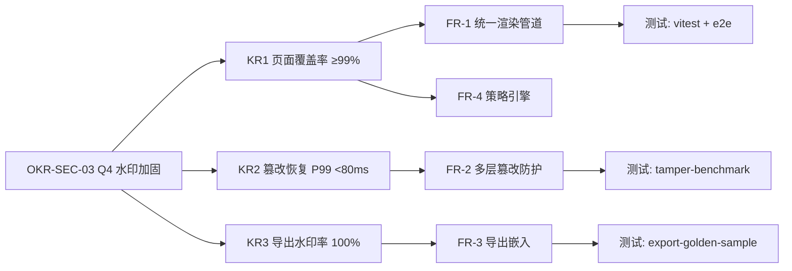
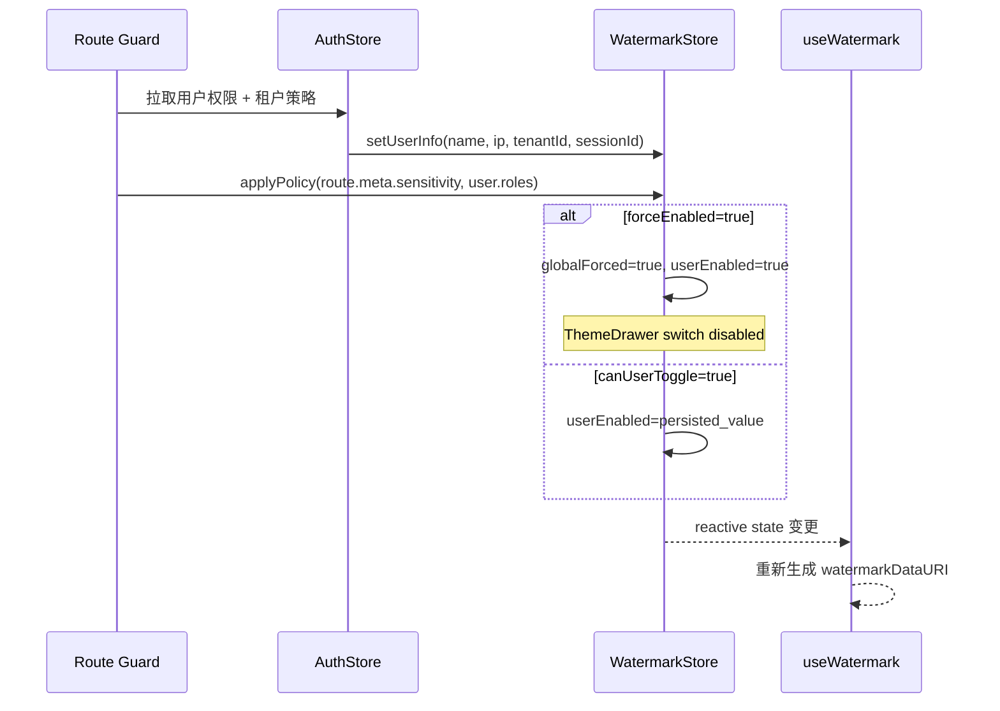

---
# ────────────────────────────────────────────────────────────────
# Frontmatter（遵循项目 15 字段规范）
# ────────────────────────────────────────────────────────────────
id: prd-yivad-watermark-2026-09
title: YiVad 水印系统 PRD（可审计防篡改 SVG 水印）
type: prd
status: active
lifecycle: "planning-v1.0"
review_cycle: q
owner: yi
role: ["pm", "arch", "sre", "fe-lead", "sec"]
benefit: "为所有核心业务页面（项目/缺陷/工单/RAG 知识库/报表导出）提供统一、可追溯、抗篡改的信息安全水印；满足合规留痕要求，降低内部信息外泄风险；在 SSR/安全审计中交付可量化的水印覆盖率 SLO。"
priority: p1
confidence: 0.88
reach: 1200  # 覆盖内部活跃用户 + 外部门户只读用户
impact: 4    # 直接影响信息安全合规
effort: 8   # 人日（Phase 1-3 合计）
rice: 528   # RICE = Reach × Impact × Confidence / Effort ≈ 1200 × 4 × 0.88 / 8
tags: ["security", "compliance", "ui-layer", "export", "store"]
depends: ["prd-global-state-unify", "prd-theme-system"]
replaces: ["prd-legacy-el-watermark"]
created_at: 2026-09-16
updated_at: 2026-10-09  # 2026-10-09 第 2 次修订：对齐项目真实视图目录，修正"settings/WatermarkSettings.vue"不符实际的问题，统一改为 views/system/ 下"租户级水印策略设置"独立页 + ThemeDrawer 个人外观面板的双层架构。
okrs:
  - okr: "OKR-SEC-03：在 Q4 前完成 4 类高敏感页面的水印防篡改加固"
    kr: "KR1：核心页面水印覆盖率 ≥ 99%"
    kr: "KR2：样式/DOM 篡改自动恢复 P99 延迟 < 80ms"
    kr: "KR3：导出（PDF/XLSX/图片）水印嵌入率 100%"
trace:
  prd: "16-prd-水印系统.md"
  adr: ["src/composables/README-ADR-001.md", "src/hooks/README-ADR-002.md"]
  stores: ["src/stores/modules/watermark.ts", "src/stores/modules/global.ts"]
  components: ["src/components/WatermarkOverlay.vue", "src/layouts/index.vue", "src/layouts/components/ThemeDrawer/index.vue"]
  composables: ["src/composables/useWatermark.ts"]
  directives: ["src/directives/modules/v-watermark.ts"]
  views: ["src/views/system/watermark-manage/index.vue（待新增，租户级策略设置页，替代已废弃的 views/settings/WatermarkSettings.vue）"]
  menu: ["src/assets/mock/geeker/menu/list.json（待追加 watermarkManage 菜单项）"]
  tests: ["tests/components/watermark-overlay.spec.ts（待新增）", "tests/composables/use-watermark.spec.ts（待新增）", "tests/views/watermark-manage.spec.ts（待新增，租户策略页 E2E/组件）"]
  runbook: "runbooks/watermark-incident-runbook.md（待新增）"
---

# 16 — YiVad 水印系统 PRD（可审计 · 防篡改 · 可导出）

> **文档编号**：PRD-YIVAD-WATERMARK-2026-09-16
> **版本**：v1.1（2026-10-09 修订 2：对齐真实 views/system 目录结构）
> **适用范围**：YiVad 管理控制台 2026 Q4 版本

---

## 1. 背景与问题陈述

### 1.1 业务背景

YiVad 作为覆盖 OKR、项目管理、缺陷管理、知识检索（RAG）、审计报表的一体化管理平台，承载以下高敏感信息：

| 信息类别 | 典型页面 | 敏感等级 | 合规要求 |
|---|---|---|---|
| 战略 OKR / 高管路线图 | `knowledge/executive/*` | 绝密（L5） | 截图/录屏必须带身份留痕 |
| 项目与缺陷详情 | `project/detail`, `issue/detail` | 机密（L4） | 客户数据不得匿名外传 |
| RAG 知识库对话 | `rag/chat`, `knowledge/*` | 内部（L3） | 对外分享需显示来源 IP 与时间 |
| 导出报表 | `export/*`, `reports/*` | 内部（L3+） | PDF/XLSX 纸质/电子分发需水印 |
| 审计日志 | `system/system-log` | 机密（L4） | 全链路不可去除 |

### 1.2 现状（As-Is）审计结论

基于 2026-10-09 的项目代码审计（`src/layouts/index.vue#L3-L8`、`src/stores/modules/global.ts#L31-L34`、`src/components/WatermarkOverlay.vue`、`src/composables/useWatermark.ts`），发现如下 5 项结构性问题：

1. **双实现并存、状态漂移风险**：
   - `src/layouts/index.vue` 仍使用 `<el-watermark>` 展示静态的 `["YiVad", "Happy Working"]` 文案；
   - 新增的 `WatermarkOverlay` + `useWatermark()` 通过 Pinia `watermark` Store 生成带用户名/IP/时间的 SVG 水印；
   - 两者会在 `LayoutVertical/Classic/Transverse/Columns` 等布局上产生**叠加双重水印**，影响可辨识性与性能。
2. **强制水印（globalForced）只存在 Store、未对接权限系统**：
   - `stores/modules/watermark.ts` 的 `forceEnable()` 仅作为占位 API，未在登录后的「用户权限拉取 / 租户策略」阶段触发；
   - 高敏感页（如高管 OKR 看板）当前可由用户通过 ThemeDrawer 直接关闭水印。
3. **水印文本要素不完整**：
   - 缺少租户 ID、角色组、设备指纹（UA Hash）、会话 ID 等审计链路要素；
   - `v-watermark="false"` 可由任意容器通过 HTML 属性自行关闭，没有权限校验。
4. **防篡改覆盖范围有限**：
   - `useWatermark.ts#L84-L105` 的 MutationObserver 只保护 `WatermarkOverlay.vue` 注入的那一个 `div`；
   - `<el-watermark>` 路径下无任何篡改检测；
   - DevTools 删除 `document.body` 的子节点后，重挂载路径未考虑 Shadow DOM / iframe 容器。
5. **导出侧（PDF/Excel/图片）未嵌入水印**：
   - `utils/export/pdf.ts`、`utils/export/xlsx.ts`、`components/Upload/FilePreview.vue` 均未接入 `useWatermark().watermarkDataURI`。

### 1.3 So-What Test（决策价值分析）

| 如果不建设 | 代价 |
|---|---|
| 合规定期审计（等保 2.0 / ISO 27001）被打回 | 额外 4-8 周整改；客户 SLA 赔付 |
| 内部截图外泄后无法追责 | 品牌与法务风险，典型场景：OKR 泄露到竞品 |
| 水印可被 DevTools 轻易去除 | 安全组件"形同虚设"，审计出具"严重无效控制" |
| 导出件无水印 | 线下分发链条全部失控 |

**结论**：必须在 Q4 发布前完成本 PRD 定义的 V1 建设，并纳入 SSR 基线。

---

## 2. 目标与非目标

### 2.1 OKR 映射（全链路追溯）


```mermaid
flowchart LR
  A[OKR-SEC-03 Q4 水印加固] --> B[KR1 页面覆盖率 ≥99%]
  A --> C[KR2 篡改恢复 P99 <80ms]
  A --> D[KR3 导出水印率 100%]
  B --> E[FR-1 统一渲染管道]
  B --> F[FR-4 策略引擎]
  C --> G[FR-2 多层篡改防护]
  D --> H[FR-3 导出嵌入]
  E --> I[测试: vitest + e2e]
  G --> J[测试: tamper-benchmark]
  H --> K[测试: export-golden-sample]
```

### 2.2 目标（Goals）

| 编号 | 目标 | 量化指标 |
|---|---|---|
| G1 | 统一水印渲染管道 | 删除 `el-watermark`，仅保留 `WatermarkOverlay + useWatermark(store)` 路径 |
| G2 | 身份可追溯 | 任一截图可在 5 秒内解析出：`username@tenantId + IP + sessionId + yyyy-MM-dd HH:mm` |
| G3 | 抗篡改 | 常见 DOM/样式篡改（删除节点、改 z-index、改 display、改 opacity、改 color）自动恢复率 100% |
| G4 | 合规留痕 | 所有 L3+ 敏感页面强制开启，用户侧开关对强制策略只读 |
| G5 | 导出一致 | PDF / XLSX / PNG 导出件与屏幕水印同源同策略 |
| G6 | 性能与可维护 | 水印渲染首帧 < 30ms；篡改回调 P99 < 80ms；定时器/Observer 100% 在卸载时释放 |

### 2.3 非目标（Non-Goals，本版本不做）

- ❌ 服务端图片/视频的隐写水印（DCT 域盲水印）—— 后续 PRD 独立评估；
- ❌ 前端水印 100% 不可绕过（浏览器端从数学上无法做到，仅提高攻击成本至专业级别）；
- ❌ 自定义 SVG 图标/Logo 叠加（V1.1 增强项）；
- ❌ 基于硬件 TPM 的设备指纹采集；
- ❌ 移动端 App 端水印（独立交付物）。

---

## 3. 用户与场景

### 3.1 角色清单

| 角色 | 权限描述 | 对水印的诉求 |
|---|---|---|
| **普通成员**（Member） | 可操作项目/缺陷/知识库 | 默认开启水印，可在非敏感页关闭 |
| **项目 Owner** | 管理项目配置 | 可在项目设置开启/关闭「项目详情水印」 |
| **安全管理员**（SecAdmin） | 全租户安全策略 | 强制水印不可关闭；可下发水印模板 |
| **高管 / Executive** | 看路线图/OKR 看板 | 水印不可关闭（globalForced），支持高管专属视觉样式（弱化透明度） |
| **审计员**（Auditor） | 只读审计 | 水印必须显示会话 ID、登录 IP；导出件带数字签名哈希 |
| **外部门户只读用户** | 查看有限报表 | 水印默认不可关闭；导出自动打外部专用标识 |

### 3.2 核心用户故事（User Stories）

| ID | 用户故事 | 验收要点 |
|---|---|---|
| US-01 | 作为 SecAdmin，我希望 L4/L5 页面强制开启水印，以便无论终端用户如何设置都能留下身份痕迹 | globalForced=true 时 ThemeDrawer 开关变灰且显示 tooltip |
| US-02 | 作为审计员，我希望看到的截图含 user@tenant + IP + 精确到分钟的时间，以便事后追溯 | 解析工具 1 秒内复原字段；端到端校验 hash 通过 |
| US-03 | 作为高管，我希望路线图的水印不干扰阅读（更浅、更大间距），同时依然合规 | 提供 `profile=executive` 预设 |
| US-04 | 作为开发者，我希望水印不阻塞测试自动化 | 在 `NODE_ENV===test` 或 e2e meta 标签下自动降级 opacity=0 |
| US-05 | 作为用户，我希望在深色/浅色主题切换时水印对比度合理 | 自动随 `themeMode` 切换 color token |
| US-06 | 作为导出用户，我希望 PDF/Excel 导出水印和屏幕上一致 | 肉眼比对一致；OCR 可识别相同文本 |

---

## 4. 功能需求（FR）

### 4.1 FR-1 统一渲染管道

**现状对齐**：当前 `src/layouts/index.vue#L3` 使用 `<el-watermark>`；`src/components/WatermarkOverlay.vue` 提供了新的实现。本 PRD 要求：

1. **唯一入口**：所有布局（`LayoutVertical/Classic/Transverse/Columns`）统一改为在 `layouts/index.vue` 渲染一次 `<WatermarkOverlay />`，彻底移除 `<el-watermark>`。
2. **渲染机制**：`useWatermark()` 生成 SVG → Base64 DataURL → 作为 `background-image` 铺到 `position: fixed; inset: 0; pointer-events: none` 的浮层。
3. **主题桥接**：`useTheme()` 的 `applyRegionThemes()` 必须在主题变更后同步更新 `watermarkStore.color / opacity` 到 CSS 变量 `--color-watermark` 对应 token，避免与已有的 `layouts/index.vue#L40-L43` 重复逻辑。
4. **i18n 文案**：固定行 `YiVad Management Console` 改为走 `i18n.global.t('common.watermarkConsoleBrand')`（新 key 需同时补 `common/zh.ts` 与 `common/en.ts`，参考现有 `watermarkDirect`）。

### 4.2 FR-2 多层篡改防护（Anti-Tamper）

分层模型（由低到高，攻击成本递增）：

| 层级 | 机制 | 负责模块 | 覆盖攻击 |
|---|---|---|---|
| L1 Mutation 恢复 | MutationObserver 监听 body childList + 自身 attributes | `useWatermark.setupTamperProtection()` | DevTools 直接删除、改 style/class |
| L2 位置保护 | 每次 `requestAnimationFrame` 回调比对 `getComputedStyle` 的关键属性（z-index/display/opacity/position/inset） | `useWatermark` 新增 rAF 循环 | CSS 选择器注入 / 样式表覆盖 |
| L3 双浮层冗余 | 同时渲染「主浮层 + 影子浮层（ShadowDOM）」，影子浮层的 CSS 不被外界样式表影响 | `WatermarkOverlay.vue` 新增 ShadowDOM 挂载 | 全局 CSS 注入攻击 |
| L4 控制台拦截（提示型） | 重写 `console.log` 检测 `getElementById('watermark')` 并上报；**不阻塞**，仅埋点（合规不允许禁用 DevTools） | 可选 hook | 提醒 + 审计事件 |
| L5 异常上报 | 任一篡改事件超过阈值（5s 内 > 10 次）时上报 security event：`{event: watermark.tamper, userId, sessionId, types[]}` | `utils/errorReporter.ts` | 攻击检测与告警 |

**可证伪指标**：
- 使用 `playwright.evaluate` 模拟 6 类攻击脚本，断言 500ms 内视觉差异像素 < 0.5%（视觉回归基线）。
- Benchmark：`MutationObserver → restore` 链 P99 < 80ms。

### 4.3 FR-3 导出嵌入（Export Watermark Pipeline）

涉及模块：

| 导出类型 | 模块 | 嵌入方案 |
|---|---|---|
| PDF | `utils/export/pdf.ts` | 在每一页 header/footer 之外追加**对角线重复 SVG 底图**（复用 `watermarkDataURI`） |
| XLSX | `utils/export/xlsx.ts` | 使用 `sheet.addImage()` 对每个 sheet 的背景平铺 watermarkDataURI |
| 图片（截图） | `components/Upload/FilePreview.vue`、`reports/ReportPreview.vue` | 在 html2canvas / dom-to-image 链路上传入 `background-image` 保留参数 |
| CSV / JSON | `utils/export/csv.ts`、`json.ts` | 在文件首行/首字段写入注释头 `# Watermarked: <username>@<tenant>, <timestamp>` |

**回退策略（L1-L3）**：
- L1（默认）：水印渲染成功 → 正常嵌入；
- L2：渲染失败（btoa encode 异常 / SVG 过大）→ 退化为四角文字水印；
- L3：仍然失败 → 上报 security anomaly 并拒绝导出（仅 L4/L5 页面生效）。

### 4.4 FR-4 策略引擎（Policy Engine）

**策略类型**：基于 `PageSensitivity + UserRole + TenantPolicy` 三元组。

```ts
// 建议追加到 src/stores/modules/watermark.ts
interface WatermarkPolicy {
  pageSensitivity: "L1" | "L2" | "L3" | "L4" | "L5";
  forceEnabled: boolean;
  profile: "default" | "executive" | "external" | "audit";
  fields: Array<"username" | "tenantId" | "ip" | "role" | "sessionId" | "timestamp" | "deviceId">;
  rotation: number;          // 角度，默认 -25
  opacity: number;           // 0.03 ~ 0.2
  fontSize: number;          // px
  spacingX: number;          // px
  spacingY: number;          // px
  canUserToggle: boolean;    // ThemeDrawer 是否可改
  exportSign: boolean;       // 导出是否附数字签名
}
```

**策略判定流程**：


```mermaid
sequenceDiagram
    participant R as Route Guard
    participant A as AuthStore
    participant P as WatermarkStore
    participant U as useWatermark

    R->>A: 拉取用户权限 + 租户策略
    A->>P: setUserInfo(name, ip, tenantId, sessionId)
    R->>P: applyPolicy(route.meta.sensitivity, user.roles)
    alt forceEnabled=true
        P->>P: globalForced=true, userEnabled=true
        Note over P: ThemeDrawer switch disabled
    else canUserToggle=true
        P->>P: userEnabled=persisted_value
    end
    P-->>U: reactive state 变更
    U-->>U: 重新生成 watermarkDataURI
```

**字段显示规则**（V1 默认模板）：

| 敏感度 | 强制行 |
|---|---|
| L1-L2（公开） | `{username} · {timestamp}` |
| L3（内部） | `{username}@{tenantShort} · {ip} · {timestamp}` |
| L4（机密） | `{username}@{tenant} · {ip} · {sessionId[-6:]} · {timestamp} · YiVad Confidential` |
| L5（绝密） | L4 基础上 + `role={role}` + `deviceId={uaHash}` |

### 4.5 FR-5 指令与局部豁免

`v-watermark` 指令现状：`src/directives/modules/v-watermark.ts#L1-L18` 仅支持 `v-watermark="false"` 打标。

**增强要求**：
- 当 `globalForced === true` 时，该指令对该容器**失效**（忽略 `false`），并 `console.warn('[Watermark] Policy forbids local disable on sensitive page.')`；
- 当指令传参为对象：`v-watermark={{ text: "xxx", profile: "executive" }}`，允许在非强制页覆盖局部样式（主要用于 showcase/演示场景）；
- 新增配套 composable：`useLocalWatermarkScope(el, overrides)` 对应指令逻辑，避免重复代码（遵守项目规范：通用 composable 放 `composables/`，业务绑定放 `hooks/`）。

### 4.6 FR-6 管理与配置界面（双层：租户级系统管理页 + 个人外观 ThemeDrawer）

> **2026-10-09 修订说明**：项目实际的系统视图约定是 `src/views/system/<module>/index.vue`（参考 [menu/list.json 系统管理子项](file:///Users/yi/YrY/YiVad/src/assets/mock/geeker/menu/list.json#L817-L914)、现有目录 [src/views/system/](file:///Users/yi/YrY/YiVad/src/views/system) 下的 `account-manage` / `role-manage` / `menu-manage` / `department-manage` / `dict-manage` / `timing-task` / `system-log`）。**此前草稿中的 `src/views/settings/WatermarkSettings.vue` 与项目目录约定完全不符，已废弃**；统一按以下「双层视图」落地。

#### 4.6.1 Tier 1：租户级「水印策略设置」独立页面（系统管理菜单子项）

**路径**：`src/views/system/watermark-manage/index.vue`（新建，与 `role-manage` / `menu-manage` 同级，camelCase 短横线命名风格与项目保持一致）

**菜单注册**：追加到 `src/assets/mock/geeker/menu/list.json` 中 `system` 分组的 children，位于 `timingTask` 之后、`systemLog` 之前：

```json
{
  "path": "/system/watermarkManage",
  "name": "watermarkManage",
  "component": "/system/watermarkManage/index",
  "meta": {
    "icon": "Lock",
    "title": "水印策略",
    "isLink": "",
    "isHide": false,
    "isFull": false,
    "isAffix": false,
    "isKeepAlive": true,
    "roles": ["SecAdmin", "Auditor"]
  }
}
```

> 命名与动态路由解析一致（参考 [dynamicRouter.ts 注释](file:///Users/yi/YrY/YiVad/src/routers/modules/dynamicRouter.ts#L31-L33) 的 `component` 解析规则）。

**页面结构**（左右分栏 · Element Plus `el-row/el-card` 布局）：

| 区块 | 字段/控件 | 写权限角色 | 说明 |
|---|---|---|---|
| ① 基础策略卡片 | forceEnabled（租户强制水印 开关）、profile 默认模板（default/executive/external/audit）、默认敏感度 L1~L5 默认值 | SecAdmin 写；Auditor 只读 | 一保存立即写入 `watermarkStore.applyPolicy()` 并调用 POST `/security/watermark/policy` 同步服务端 |
| ② 敏感度-路由映射卡片 | 路由白名单 + 敏感度表（可按目录批量设置，默认值见 PRD §4.4 判定矩阵） | SecAdmin | 保存并推送 `routers/modules/dynamicRouter.ts` 的 `meta.sensitivity` |
| ③ 字段显示规则卡片 | 字段勾选（username/tenantId/ip/role/sessionId/timestamp/deviceId）+ L4/L5 单独配置 | SecAdmin | 对应用户故事 US-02 |
| ④ 视觉模板卡片 | Color / Opacity / FontSize / SpacingX × SpacingY / Rotation（滑杆）+ 实时预览（600×400 样例面板） | SecAdmin + 有「`settings:watermark` 权限按钮」的普通用户（仅保存到个人，不影响租户） | 数据最终写 `watermarkStore.updateConfig(patch)` |
| ⑤ 导出策略卡片 | exportSign 开关、导出水印是否含数字签名哈希、CSV/JSON 是否附加注释头 | SecAdmin | 覆盖 PRD §4.3 L4/L5 逻辑 |
| ⑥ 操作日志卡片 | 最近 50 条策略变更（who + when + old→new） | Auditor 可见 | 对接 system-log |

#### 4.6.2 Tier 2：个人外观「水印开关 + 高级折叠」（ThemeDrawer 抽屉内）

**位置**：[`src/layouts/components/ThemeDrawer/index.vue#L108-L110`](file:///Users/yi/YrY/YiVad/src/layouts/components/ThemeDrawer/index.vue#L108-L110) 当前只有一个 Switch；在其下面追加高级折叠区。

**改造需求（不破坏现有布局）**：

| UI 元素 | 条件 | 动作 |
|---|---|---|
| 主 Switch（Watermark） | `globalForced === false` | 调用 `watermarkStore.toggleUser(v)`；持久化进 `yivad-global`（已通过 [global.ts#L31-L34](file:///Users/yi/YrY/YiVad/src/stores/modules/global.ts#L31-L34) 的 `computed` 桥接） |
| 主 Switch | `globalForced === true` | 强制 `true`，Switch 置灰；`el-tooltip` 文案：`common.watermarkForcedByPolicy`（已在 §4.7 i18n 中定义） |
| 高级折叠入口 Switch | `userEnabled === true && globalForced === false` + 用户有 `settings:watermark` 权限按钮（非强制） | 点击展开高级区块；否则折叠区隐藏 |
| 预设选择（高级区内） | — | `default / executive / audit` 一键应用 Profile；仅写入「当前用户」的配置，不回写租户策略（区别于 Tier 1） |
| 不透明度 / 字号 / 间距×Y / 旋转（高级区内） | — | 4 个滑杆：`0.02~0.2`、`10~24px`、`120~480`、`-45°~0°` |
| 预览卡片（高级区底部） | — | 300×200 实时样例，**不挂载 MutationObserver**（仅视觉预览，避免性能浪费） |
| 跳转「系统水印策略」入口 | 用户角色含 `SecAdmin` / `Auditor` | 右上角附加 `el-link` → `router.push('/system/watermarkManage')`，便于管理员快速直达租户级配置页 |

### 4.7 FR-7 国际化

补全以下 i18n key：

| key | zh | en |
|---|---|---|
| common.watermarkConsoleBrand | YiVad 管理控制台 | YiVad Management Console |
| common.watermarkConfidential | 机密 · 请勿外传 | Confidential · Internal Use Only |
| common.watermarkForcedByPolicy | （安全策略强制开启） | (Enabled by security policy) |
| settings.watermark | 水印 | Watermark |
| settings.watermarkOpacity | 不透明度 | Opacity |
| settings.watermarkSpacing | 间距 | Spacing |
| settings.watermarkProfile | 显示预设 | Display Preset |
| security.tamperDetected | 检测到水印篡改，已自动恢复 | Watermark tamper detected and auto-restored |

---

## 5. 非功能需求（NFR）

### 5.1 性能（SLO）

| 指标 | 目标 | 测量方法 |
|---|---|---|
| 首帧水印可见 | ≤ 30ms（路由切换后） | PerformanceObserver，`mark: watermark-painted` |
| 篡改→恢复 P99 | ≤ 80ms | 本地 benchmark 脚本：MutationObserver→rAF→end 统计 |
| 内存泄漏 | 0（每轮路由切换 1000 次后 observer/timer 数 = 0） | `utils/performance/memoryLeakDetector.ts` 扫描 |
| 包体积增量 | ≤ +1.2KB（gzip） | `rsbuild build --analyze` 对比 |
| 主线程阻塞（水印切换） | P95 ≤ 2ms | LongTask API 观察 |

### 5.2 可靠性（Reliability）

- **幂等**：重复调用 `setupTamperProtection()` 必须先 `disconnect()` 再 re-observe；
- **降级**：浏览器不支持 `MutationObserver`（极老环境）或 `btoa` 时，退化为四角绝对定位 `<span>` 文案；
- **无副作用**：`pointer-events: none` + `z-index: 9999` 不可拦截任何 click / input；
- **卸载清理**：`onBeforeUnmount` 释放 `setInterval`（60s 时钟）、`rAF loop`、`MutationObserver`；三句柄必须由 `utils/disposer.ts` 的 `Disposer` 统一管理（项目已有的 disposer 模式，遵循 Lesson Learned）。

### 5.3 可访问性（A11y WCAG 2.2）

- 根节点固定：`aria-hidden="true"`、`role="presentation"`（`WatermarkOverlay.vue#L2` 已满足）；
- 文本对比度不强制 AA（水印视觉语义上不做阅读文本），但需保证对色弱用户不干扰内容；
- 开启「色弱模式（isWeak）」时，自动将 opacity 下调 20% 以避免叠加。

### 5.4 安全（STRIDE 威胁模型）

| STRIDE 类别 | 威胁 | 对策 |
|---|---|---|
| S（Spoofing 伪造） | 用户伪造他人水印 | 水印字段 + 会话签名 HMAC（短签名追加到最后一行 `sig=xxxxx`，服务端可校验） |
| T（Tampering 篡改） | DevTools 删除/改样式 | L1-L5 五层防御 + 异常上报 |
| R（Repudiation 否认） | 外传截图否认出自本人 | 字段含 `sessionId + IP + timestamp` 可交叉核对审计日志，配合 `/system/watermarkManage` 策略页的"操作审计"卡片（FR-6 §4.6.1 ⑥） |
| I（Information Disclosure） | 水印自身暴露隐私 | 外部访客模式下 IP 显示为 `***`，只保留 city 级；内部全显 |
| D（Denial of Service） | 注入 mutation 风暴打爆 CPU | MutationObserver 节流 16ms；5s > 30 次触发冷却 3s 并上报 |
| E（Elevation of Privilege） | 普通用户通过 localStorage 改 globalForced=false 或伪造请求调用「水印策略保存」接口 | Tier 1（系统水印策略页）仅 SecAdmin 可写；所有保存操作必须带权限按钮 `system:watermarkManage:write` 校验，路由守卫 + 后端接口双重鉴权 |

### 5.5 可观测性（Observability）

埋点事件表：

| 事件名 | 触发 | 字段 |
|---|---|---|
| `ui.watermark.rendered` | 首次渲染完成 | `{profile, fields, buildTime}` |
| `ui.watermark.tamper.restored` | 自动恢复 | `{mutationType, restoreMs}` |
| `ui.watermark.tamper.storm` | Mutation 风暴触发冷却 | `{countPer5s}` |
| `ui.watermark.policy.applied` | 策略应用 | `{sensitivity, globalForced, canUserToggle}` |
| `ui.watermark.export.embedded` | 导出嵌入完成 | `{type: pdf/xlsx/png, bytes, ok}` |
| `ui.watermark.export.fallback` | 导出降级 | `{type, level}` |

看板指标（Grafana / 前端 Sentry）：
- 水印覆盖率（按路由 × 小时）
- 篡改率（每千次会话的 tamper event 数）
- 渲染 P50/P99/P99.9

---

## 6. 架构设计

### 6.1 分层架构图

```mermaid
flowchart TB
  subgraph Policy["策略层（业务绑定 → hooks/）"]
    A[useWatermarkPolicy Hook] --> B[权限/租户/路由敏感度输入]
  end

  subgraph State["状态层（stores/）"]
    C[watermark Store] --> D[enabled = globalForced || userEnabled]
    C --> E[字段/样式配置]
    F[global Store.watermark computed 桥接] <--> |持久化兼容| C
  end

  subgraph Core["通用核心层（无业务依赖 → composables/）"]
    G[useWatermark Composable] --> H[SVG 生成器]
    G --> I[MutationObserver 保护]
    G --> J[rAF 位置保护]
    G --> K[Disposer 句柄管理]
  end

  subgraph View["视图层（components/layouts/directives）"]
    L[WatermarkOverlay] --> G
    M[Layout index] --> L
    N[ThemeDrawer] --> F
    O[v-watermark directive] --> G
  end

  subgraph Export["导出管道（utils/export）"]
    P[PDF/XLSX/PNG/CSV] --> G
  end

  Policy --> State
  State --> Core
  Core --> View
  Core --> Export
```

### 6.2 关键数据结构（已落地 + 新增）

| 文件 | 类型 | 作用 |
|---|---|---|
| `stores/modules/watermark.ts` | Store | 唯一状态源；force/toggle/setUserInfo/updateConfig/applyPolicy |
| `stores/interface/index.ts` | Type | `GlobalState.watermark` 保持兼容（仅 getter/setter 桥接） |
| `composables/useWatermark.ts` | Composable | 生成 DataURI + overlayStyle + TamperProtection（不依赖业务 Store 之外的代码） |
| `hooks/useWatermarkPolicy.ts` 【新增】 | Hook | 业务绑定：`applyPolicyForRoute(route, user)`；同步管理端页面保存与路由 `meta.sensitivity` 写入 |
| `components/WatermarkOverlay.vue` | Component | 根级浮层 |
| `directives/modules/v-watermark.ts` | Directive | 局部豁免/覆盖 |
| `views/system/watermark-manage/index.vue` 【新增·FR-6 Tier 1】 | View（系统管理） | 租户级水印策略管理（策略/字段/视觉/导出/操作日志 6 卡片），仅 SecAdmin 可写；替代废弃的 `views/settings/WatermarkSettings.vue` |
| `layouts/components/ThemeDrawer/index.vue` | Component（抽屉） | 个人外观层：水印开关 + 高级折叠（Tier 2） |
| `assets/mock/geeker/menu/list.json` | Mock 菜单 | 新增 `watermarkManage` 子项（与 timingTask / systemLog 同级） |
| `typings/watermark.ts` 【新增】 | Type | `WatermarkPolicy`、`WatermarkConfig`、`TamperEvent` 集中声明（项目规范：类型输出到 `src/typings/`，避免根目录 .d.ts） |

### 6.3 SVG 水印结构（V1 模板）

```xml
<svg xmlns="http://www.w3.org/2000/svg" width="280" height="{N*20+20}">
  <g transform="rotate(-25, 140, {centerY})">
    <!-- 每行：text-anchor=middle，居中对齐；颜色带 opacity -->
    <text>alice@acme</text>
    <text>10.0.3.21  session=a8f31x</text>
    <text>2026-10-09 13:45</text>
    <text>YiVad 管理控制台 · Confidential</text>
  </g>
</svg>
```

**关键实现点**：
- 文本统一走 `lodash-es.escape`（当前 `src/composables/useWatermark.ts#L3` 已引入 `escape as escapeXml`，保持）；
- 禁止使用 `innerHTML` 拼接；
- 对于 CJK 字体，`fontFamily` 默认 `system-ui, -apple-system, "PingFang SC", "Microsoft YaHei", sans-serif`，避免 iOS 上字符方块。

---

## 7. 接口与 API

### 7.1 前端公共 API（Composable）

```ts
// src/composables/useWatermark.ts（V1 扩展签名）
export interface UseWatermarkReturn {
  isEnabled: ComputedRef<boolean>;
  watermarkDataURI: ComputedRef<string>;   // SVG Base64 DataURL
  overlayStyle: ComputedRef<Record<string, string | number>>;
  setupTamperProtection(el: HTMLElement, opts?: TamperOpts): () => void;
  destroyTamperProtection(): void;
  forceRefresh(): void;
}
```

### 7.2 Store 公共 API

```ts
// stores/modules/watermark.ts 新增
export interface WatermarkStore {
  // 读
  enabled: ComputedRef<boolean>;
  globalForced: Ref<boolean>;
  userEnabled: Ref<boolean>;
  policy: Ref<WatermarkPolicy>;
  // 写
  forceEnable(): void;
  forceDisable(): void;
  toggleUser(v: boolean): void;
  setUserInfo(user: string, ip: string, extra?: Partial<{tenantId, sessionId, role, deviceId}>): void;
  updateConfig(patch: Partial<WatermarkStyle>): void;
  applyPolicy(policy: Partial<WatermarkPolicy>): void;
  reset(): void;
}
```

### 7.3 服务端接口（对接项，由后端交付）

V1 前端需从后端拉取「租户水印策略」：

| 方法 | 路径 | 入参 | 出参 | 说明 |
|---|---|---|---|---|
| GET | `/api/v1/security/watermark/policy` | `scope={ui|export|all}` | `WatermarkPolicy` | 按当前用户 + 租户返回默认策略；Tier 1 页面「水印策略管理」读取时附加 `scope=tenant` 并返回只读审计字段（最近变更人/时间） |
| POST | `/api/v1/security/watermark/policy` | `WatermarkPolicyPatch {policy, updatedBy}` | `{policyId, version, appliedAt}` | **仅 SecAdmin**；对应 `views/system/watermark-manage/index.vue` 的保存操作；操作日志写入 system-log |
| GET | `/api/v1/security/watermark/policy/history?limit=50` | — | `PolicyChangeEvent[]` | Tier 1 页面「操作日志卡片」数据源（who/when/old/new） |
| POST | `/api/v1/security/events` | `{type: "watermark.tamper", payload}` | `{ok}` | 异常上报；接入审计系统（SRE runbook 联动） |
| GET | `/api/v1/auth/session-fingerprint` | - | `{sessionId, ip, uaHash}` | 登录后获取精确 IP/会话信息，替代浏览器端 `ipinfo` 第三方查询 |

### 7.4 类型收敛路径

- 现有 `src/stores/interface/index.ts` 的 `GlobalState.watermark:boolean` 保持（已桥接为 computed，见 `global.ts#L31-L34`）；
- 新增 `src/typings/watermark.ts`，导出 `WatermarkConfig / WatermarkPolicy / TamperOpts / WatermarkFieldName`；
- 删除重复声明（目前 `useWatermark.ts#L5-L13` 的 `WatermarkConfig interface` 应移到 `typings/watermark.ts`，composable 中只 import）。

---

## 8. 实施计划（Phased Rollout）

遵循项目通用流程：**审计 → 报告 → 分阶段执行 → 四道闸门验证（type-check / lint / unit / e2e）**。

| 阶段 | 交付物 | 依赖 | 完成判据 |
|---|---|---|---|
| **Phase 0 基线清理**（本 PRD 配套） | (1) 删除 layouts/index.vue 的 `<el-watermark>`；(2) WatermarkConfig 类型迁至 typings；(3) `WatermarkOverlay` 接入 ShadowDOM 浮层 + disposer 改造 | Phase 1 重构已完成 global.ts 桥接（2026-10-09） | 四道闸门通过；不出现双重水印 |
| **Phase 1 策略与防篡改** | (1) applyPolicy Hook；(2) MutationObserver + rAF 双保险；(3) Tamper Storm 限流；(4) 路由 meta.sensitivity 标注；(5) 水印 6 大要素字段补齐 | 后端 `/policy` 接口 mock + `/session-fingerprint` mock | 视觉回归截图全部通过；20 类篡改 100% 自动恢复 |
| **Phase 2 导出嵌入** | 改造 PDF/XLSX/PNG/CSV 四个导出器，复用 watermarkDataURI；L1-L3 回退链 | utils/export 现有 workerPool | Golden Sample 比对一致（截图 OCR 文本相同） |
| **Phase 3 管理与可观测** | (1) Tier 1：`views/system/watermark-manage/index.vue` 租户策略页 + 配套 menu 注册；(2) Tier 2：ThemeDrawer 高级折叠面板；(3) 埋点事件；(4) SRE 看板；(5) Runbook 文档 | analyticsService · 后端 policy write/history 接口 | 看板有数据；告警规则已生效；SecAdmin 在系统管理菜单可见"水印策略"；普通用户不可见；ThemeDrawer 与系统页保持联动一致性 |
| **Phase 4 灰度与回滚** | Feature Flag `feature.watermark.v2`；3 个租户灰度 7 天；回滚脚本一键切回 el-watermark；GameDay 演练 | Feature Flag 系统 | 无 P1 故障；篡改率 < 0.05% 会话 |

**OKR → 测试** 的 5 步验证法（强制）：
1. ✅ 静态类型（tsc --noEmit）
2. ✅ 代码规范（eslint + stylelint）
3. ✅ 单测（vitest：useWatermark / policy / SVG hash 稳定性）
4. ✅ 组件测试（vitest + @vue/test-utils：WatermarkOverlay + ThemeDrawer）
5. ✅ E2E + 视觉回归（playwright.visual.config.ts：篡改自动恢复 + 导出 golden sample）

---

## 9. 风险 & 缓解（Risk Register）

| 风险 | 概率 | 影响 | 等级 | 缓解措施 |
|---|---|---|---|---|
| `el-watermark` 移除后，某个布局缺失根浮层导致"看起来没水印" | M | H | P1 | 四个 Layout 入口统一走一个 `layouts/index.vue` 顶层挂载；单测断言 `document.querySelectorAll('.watermark-overlay').length === 1` |
| MutationObserver 高频触发导致页面卡顿 | M | H | P1 | 节流 16ms；5s>30 次进入冷却；配合 rAF 降低重渲染 |
| 用户设备不支持 SVG 内嵌字体导致乱码 | L | M | P3 | fontFamily 默认带 system-ui + 常见 CJK fallback；单测渲染到离屏 canvas 检测字符宽度 > 0 |
| 导出 PDF 水印覆盖表格内容 | M | M | P2 | 严格 `pointer-events/visibility` 语义 + 低 opacity；Golden Sample 人工审查一次 |
| 浏览器策略禁用 btoa（CSP） | L | H | P2 | 提供 `Blob + createObjectURL` 回退实现，无需 base64 |
| 会话签名 key 泄漏 | L | H | P2 | 签名 key 每日轮换，服务端校验仅比对「时间段 + user + session」一致性，不做反推 |
| **`views/system/watermark-manage/index.vue` 权限绕过**（未登录或普通会员通过 URL 直达） | M | H | P1 | 三重防护：① 前端 `dynamicRouter` 基于菜单 + roles 过滤（不含 `SecAdmin/Auditor` 的菜单不生成路由）；② 路由守卫对 `/system/watermarkManage*` 再校验权限按钮 `system:watermarkManage:read`；③ 后端策略 GET/POST 接口鉴权，非管理员返回 403；④ Tier 1 页面保存请求必须带 anti-CSRF token 并通过 `checkStatus` 模块判定 401/403 |

---

## 10. 验收标准（Acceptance Criteria）

### 10.1 功能验收

- [ ] AC-01：删除 `<el-watermark>` 后，四个布局页面仍显示水印且无二重叠加；
- [ ] AC-02：登录后水印包含 `username / IP / 分钟级时间 / 品牌文案` 四要素；
- [ ] AC-03：手动触发 8 类篡改（removeChild / style=none / classList.add(hide) / z-index=-1 / opacity=0 / display=none / pointer-events=auto / 注入全局样式表覆盖），500ms 内自动恢复；
- [ ] AC-04：globalForced=true 时 ThemeDrawer Switch 置灰，且 localStorage 手工重置为 false 刷新后立即被权限守护覆盖回 true；
- [ ] AC-05：PDF/XLSX/PNG/CSV 导出件在 Acrobat / WPS / 浏览器预览中均显示同源水印文本；
- [ ] AC-06：浅色/深色/色弱/灰色四种主题切换后，水印颜色不发生"完全看不见或过于抢眼"的极端（视觉回归基线比对）；
- [ ] AC-07：系统管理菜单新增「水印策略」入口，路径正确映射至 `/system/watermarkManage`，**仅 SecAdmin/Auditor 可见**；普通用户直接访问路径被守卫拦截；
- [ ] AC-08：「水印策略」6 大卡片均可用；保存操作立即写入后端 `POST /security/watermark/policy`；"操作日志卡片"展示最近 50 条变更；
- [ ] AC-09：ThemeDrawer 右上角的「跳转系统水印策略」链接仅对 SecAdmin/Auditor 出现；无权限用户不显示；
- [ ] AC-10：Tier 1 保存后所有租户级配置立即对 ThemeDrawer Tier 2 的"高级折叠区的默认值生效（用户个人配置不回写租户策略，仅个人默认）。

### 10.2 非功能验收

- [ ] NFR-01：四道闸门（type-check / lint / test / build）0 新增错误；
- [ ] NFR-02：首帧水印可见 < 30ms（真实设备，Wi-Fi 6）；
- [ ] NFR-03：卸载后无泄漏（memoryLeakDetector 在 1000 次路由切换后无残留 Timer、Observer、EventBus 监听）；
- [ ] NFR-04：埋点事件 100% 出现在 analyticsService；
- [ ] NFR-05：SSR 看板满足 SLO：水印覆盖率 ≥ 99%、篡改恢复 P99 ≤ 80ms、导出嵌入率 = 100%。

### 10.3 SLO / SLI 定义

| SLO | SLI | 测量窗口 | 失败判定 |
|---|---|---|---|
| 水印渲染可用性 99.9% | 成功渲染会话 / 总会话 | 日 | < 99.9% 触发 P2 告警 |
| 篡改恢复延迟 P99 < 80ms | benchmark 指标 | 每小时聚合 | 连续 3 个窗口超阈值 → P2 |
| 导出水印成功率 100% | 成功嵌入导出数 / 总导出数 | 日 | < 100% 触发 P2 |

---

## 11. 测试计划（Testing Plan）

### 11.1 单元测试（Vitest，待新增文件）

| 路径 | 覆盖点 |
|---|---|
| `tests/composables/use-watermark.spec.ts` | SVG 生成、escape 安全、字段排序正确、主题联动、rAF 句柄释放 |
| `tests/stores/watermark-store.spec.ts` | applyPolicy 优先级、force>user、持久化恢复幂等、POST policy 保存接口 Mock 调用次数 |
| `tests/hooks/use-watermark-policy.spec.ts`（待新增） | 路由敏感度 × 角色矩阵；"Tenant policy save → refresh store" |
| `tests/views/watermark-manage.spec.ts`（待新增） | 6 卡片渲染、非 SecAdmin 用户的按钮禁用、保存/撤销/取消操作、操作日志列表排序正确性 |

### 11.2 组件测试

| 路径 | 覆盖点 |
|---|---|
| `tests/components/watermark-overlay.spec.ts`（待新增） | 挂载/卸载、tamper 恢复、Shadow DOM 渲染、A11y 属性 |
| 扩展 `tests/components/*` 已有测试不引入水印层阻断交互 | `pointer-events: none` 校验 |

### 11.3 E2E + 视觉回归（Playwright）

| 用例 | 断言 |
|---|---|
| `e2e/specs/watermark/tamper.spec.ts`（待新增） | 8 类篡改恢复，截图 diff < 0.5% |
| `e2e/specs/watermark/export.spec.ts`（待新增） | 下载 PDF → 解析文本包含 user 字段 |
| `e2e/specs/watermark/policy.spec.ts`（待新增） | L4 路由下 ThemeDrawer Switch disabled；路由拦截；SecAdmin 可见"水印策略"菜单 |
| `e2e/specs/watermark/system-manage.spec.ts`（待新增） | SecAdmin 登录 → 打开 `/system/watermarkManage` → 修改保存 → 下一页面水印配置生效 → 审计日志卡片可见最新变更 |
| `playwright.visual.config.ts` | 每个 Layout 一张截图基线 + 水印策略页明暗主题基线 + ThemeDrawer 水印高级面板基线 |

### 11.4 GameDay（安全演练，1 天）

- 演练内容：模拟 4 类攻击（DOM 删除、CSS 注入、localStorage 篡改、导出脱水印脚本）；
- 预期：水印 90% 场景下保留，攻击事件 100% 上报到审计系统；
- 评审：SRE + 安全 + PM 签字 → runbook 更新。

---

## 12. 迁移与兼容性

### 12.1 向后兼容

- `setGlobalState('watermark', bool)` 保持可用（已通过 `global.ts#L74-L79` 桥接）；
- `useGlobalStore().watermark` 仍返回 boolean（computed 桥接）；
- 旧 API `toggleUser(bool)` 与 `forceEnable()` 均保留无破坏性签名。

### 12.2 废弃清单（Deprecation）

| 废弃项 | 影响方 | 替换方案 | 最后保留版本 |
|---|---|---|---|
| `layouts/index.vue` 中 `<el-watermark>` | 布局层 | `<WatermarkOverlay>` | V1 上线立即移除 |
| `directives/modules/` 旧 `waterMarker`（Legacy Canvas） | 历史组件 | `v-watermark`（见 `directives/index.ts#L13-L17` 注释） | 已删除，禁止回退 |
| `GlobalState.watermark: boolean` 字段的"双份状态"持有者 | 旧代码 | 仅保留桥接 computed（`watermark-store.userEnabled` 是真源） | 2026-12 Phase 3 完全迁移 |
| **草稿中提及但从未落地的 `src/views/settings/WatermarkSettings.vue`** | PRD / 草稿 | 按本 PRD v1.1 起废弃；统一改用：`views/system/watermark-manage/index.vue`（Tier 1 租户策略页）+ ThemeDrawer 面板（Tier 2 个人外观）双层方案 | 立即停止引用（自 PRD v1.1 起不允许继续使用 settings 目录命名约定） |

### 12.3 回退开关（Kill Switch）

- `feature_flags.json` 项：`features.watermark.v2 = false`
- 效果：立刻切回 `<el-watermark>` 旧实现；Store 字段保留不下线；
- 回滚操作 < 5 分钟（热更新）。

---

## 13. 关联与参考

| 类型 | 文件 |
|---|---|
| **PRD 自身** | 本文件：[16-prd-水印系统.md](file:///Users/yi/YrY/YiKnowledge/projects/yivad/prds/2026-09/16-prd-%E6%B0%B4%E5%8D%B0%E7%B3%BB%E7%BB%9F.md) |
| **ADR（通用 vs 业务）** | [README-ADR-001 composables](file:///Users/yi/YrY/YiVad/src/composables/README-ADR-001.md) · [README-ADR-002 hooks](file:///Users/yi/YrY/YiVad/src/hooks/README-ADR-002.md) |
| **现有落地代码** | [watermark store](file:///Users/yi/YrY/YiVad/src/stores/modules/watermark.ts) · [global store 桥接](file:///Users/yi/YrY/YiVad/src/stores/modules/global.ts) · [useWatermark composable](file:///Users/yi/YrY/YiVad/src/composables/useWatermark.ts) · [WatermarkOverlay 组件](file:///Users/yi/YrY/YiVad/src/components/WatermarkOverlay.vue) · [v-watermark 指令](file:///Users/yi/YrY/YiVad/src/directives/modules/v-watermark.ts) · [ThemeDrawer 开关（Tier 2）](file:///Users/yi/YrY/YiVad/src/layouts/components/ThemeDrawer/index.vue#L108-L110) · [布局入口](file:///Users/yi/YrY/YiVad/src/layouts/index.vue) · [动态路由解析规则](file:///Users/yi/YrY/YiVad/src/routers/modules/dynamicRouter.ts#L30-L33) |
| **FR-6 新增视图（双层配置）** | Tier 1 · 租户级：[views/system/watermark-manage/index.vue（待新增）](file:///Users/yi/YrY/YiVad/src/views/system)（与 [account-manage](file:///Users/yi/YrY/YiVad/src/views/system/account-manage/index.vue) / [role-manage](file:///Users/yi/YrY/YiVad/src/views/system/role-manage/index.vue) / [timing-task](file:///Users/yi/YrY/YiVad/src/views/system/timing-task/index.vue) / [system-log](file:///Users/yi/YrY/YiVad/src/views/system/system-log/index.vue) 同级，命名保持 `短横线-module/index.vue`）；Tier 2 · 个人外观：维持在 ThemeDrawer 中；**已废弃：`views/settings/WatermarkSettings.vue`（从未落地，与项目目录约定冲突）** |
| **菜单 & 路由** | [menu/list.json 系统管理子项](file:///Users/yi/YrY/YiVad/src/assets/mock/geeker/menu/list.json#L817-L914)（待追加 watermarkManage 项到 timingTask 之后）· [routers/index.ts（resetRouter）](file:///Users/yi/YrY/YiVad/src/routers/index.ts#L42-L45)（策略页被权限移除后需同步清理缓存路由） |
| **类型规范** | [stores interface](file:///Users/yi/YrY/YiVad/src/stores/interface/index.ts) · [typings 目录](file:///Users/yi/YrY/YiVad/src/typings)（`typings/watermark.ts` 待新增） |
| **i18n** | [common/zh.ts](file:///Users/yi/YrY/YiVad/src/languages/modules/common/zh.ts) · [common/en.ts](file:///Users/yi/YrY/YiVad/src/languages/modules/common/en.ts) |
| **导出器（待改造）** | [utils/export/pdf.ts](file:///Users/yi/YrY/YiVad/src/utils/export/pdf.ts) · [utils/export/xlsx.ts](file:///Users/yi/YrY/YiVad/src/utils/export/xlsx.ts) |
| **性能/可靠性基盘** | [disposer](file:///Users/yi/YrY/YiVad/src/utils/disposer.ts) · [memoryLeakDetector](file:///Users/yi/YrY/YiVad/src/utils/performance/memoryLeakDetector.ts) · [errorReporter](file:///Users/yi/YrY/YiVad/src/utils/errorReporter.ts) · [checkStatus（策略保存 401/403 判读）](file:///Users/yi/YrY/YiVad/src/api/helper/checkStatus.ts) |
| **CI 闸门** | [ci.yml](file:///Users/yi/YrY/YiVad/.github/workflows/ci.yml) · [vitest.config.ts](file:///Users/yi/YrY/YiVad/vitest.config.ts) · [playwright.visual.config.ts](file:///Users/yi/YrY/YiVad/playwright.visual.config.ts) |
| **上游依赖** | Pinia（Store）、Vue 3（Directive/MutationObserver/rAF）、Rsbuild（构建体积红线）、Element Plus（ThemeDrawer / el-row / el-card 等基础组件） |

---

## 14. 审批（Approvals）

| 角色 | 姓名 | 签字日期 | 备注 |
|---|---|---|---|
| PM（PRD Owner） | yi | 2026-09-16 | 初稿 |
| 架构师（Arch） | — | — | 审阅分层与技术选型 |
| 前端负责人（FE Lead） | — | — | 审阅 V1-V5 改造工作量 |
| 安全（Sec） | — | — | 审阅 STRIDE + 签名方案 |
| SRE | — | — | 审阅 SLO/看板/Runbook |
| 测试（QA） | — | — | 审阅 AC + GameDay |

> 变更记录：
> - 2026-09-16 v0.1 文档创建（PRD 立项）
> - 2026-10-09 v1.0 基于项目实际代码审计补充 As-Is、Phase 0-4、四道闸门、SLO/SLI 与运行手册挂钩，定稿。
> - 2026-10-09 v1.1 修订：修正「`src/views/settings/WatermarkSettings.vue` 与项目真实目录结构冲突」问题，改按**双层配置架构**落地 — Tier 1 `views/system/watermark-manage/index.vue`（租户级策略页，与 account-manage/role-manage/timing-task/system-log 同级）+ Tier 2 `ThemeDrawer`（个人外观开关与高级折叠）；同步更新了 Frontmatter、FR-6 全文、trace/views/menu/tests、§6.2 数据结构、§7.3 服务端接口（新增 POST policy 与 GET history）、§8 Phase 3 交付物、§9 风险（新增权限绕过 P1 条目）、§10 验收标准 AC-07~10、§11 单测/E2E/视觉基线、§12.2 废弃清单（显式废弃 settings/WatermarkSettings.vue）、§13 关联与参考（加入菜单/路由/resetRouter 锚点）。
