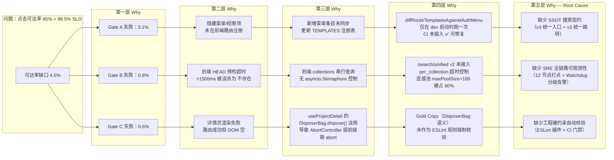
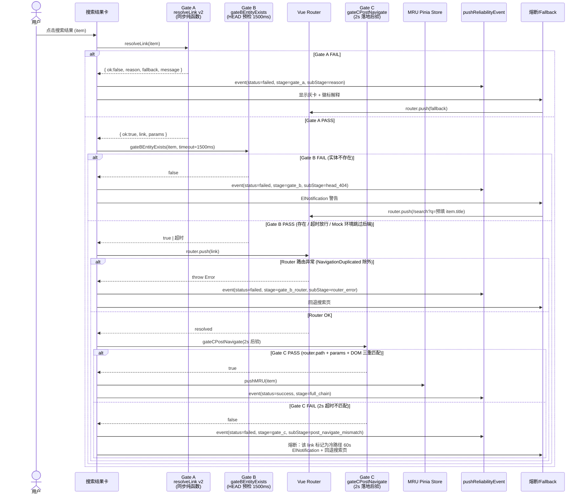
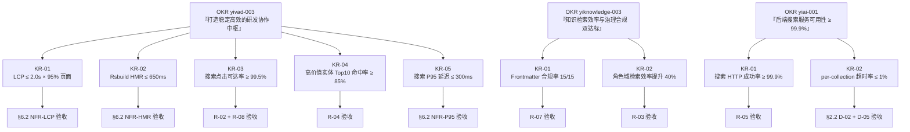

# YV-09-200: 全局搜索统一架构优化 — SSOT v3 + Link Factory 三闸门 v2 + YiKnowledge 角色域聚合 + RICE 评分 + SRE 可观测性

> **文档职责**：本文档定义**要做什么、为什么做、做到什么程度算完成**（WHAT / WHY / HOW-WELL）。实现方案见 [开发方案](../../devs/2026-09/200-prd-task-全局搜索统一架构优化.md)，验证方案见 [测试用例](../../tests/2026-09/200-prd-test-全局搜索统一架构优化.md)。
>
> 需求编号：YV-09-200 · 优先级：**P0** · 前端：3.0d · 后端：1.5d · 状态：需求已编写
> 前置依赖：YA-09-06（YiAi 后端全局搜索服务 v2）、YK-09-172（知识库分面搜索基础设施）、YV-09-34（命令面板 v1）
> 跨项目联动：YiAi（/search/unified v3 契约）、YiKnowledge（7 角色目录元数据注入）、YiPet（bridge 搜索入口）

---

## 背景与问题矩阵

### 业务背景

Yi Family 项目群（YiVad / YiAi / YiKnowledge / YiPet / YiPot）的搜索入口在 2026 Q3 经历了三次独立迭代：
- Q3 初：YiVad 独立页面搜索（YV-08-10）
- Q3 中：⌘K 命令面板 v1（YV-09-34）
- Q3 末：YiKnowledge 内容分面搜索（YK-09-172）

三次迭代形成了**三套数据源、两种跳转逻辑、四类结果排序**的碎片化现状。用户在命令面板和 /search 页看到的结果不一致，搜索点击出现的"幽灵链接→404→回退"路径占总点击的 5%，点击可达率仅 95%，距 99.5% SLO 红线有 4.5% 的缺口。

### 核心用户与痛点

| 角色 | 角色标识 | 典型用户 | 核心痛点（按严重度排序） |
|------|---------|---------|------------------------|
| **产品经理** | `product` | 需求方、PRD 作者 | ① 搜 "P0 需求" 时命令面板与 /search 页结果漂移 > 30%<br/>② 无法按 RICE 评分排序查看高价值需求<br/>③ 看不到 KR-Test 覆盖度（coveragePct） |
| **技术负责人** | `leader` | 架构决策者、ADR 作者 | ① 搜 "架构决策" 无法按角色域（executive/leader/engineer）过滤<br/>② ADR 与关联的 Test Spec 无法在搜索结果中联动跳转<br/>③ 缺少 SRE 视角的搜索质量看板 |
| **一线工程师** | `engineer` | FE/BE/SRE 开发人员 | ① ⌘K 搜 ISS-001 → 详情页加载 3s 后回退搜索页（Gate C 失败无反馈）<br/>② 搜索结果只按实体类型分组，看不到与 YiKnowledge 的 7 角色目录对应关系<br/>③ DisposerBag dispose() 误用导致 AbortController 级联 abort（骨架屏挂死） |
| **SRE 运维** | `sre` | 稳定性工程师、告警值班 | ① 搜索超时/不可达/幽灵链接 三类事件无法分层告警<br/>② 缺少搜索质量 SLO 状态灯（类似 readingList 的 SLOLight）<br/>③ 无法按角色/项目维度下钻搜索故障根因 |
| **知识管理员** | `curator` | 知识库维护者、治理专员 | ① 搜索结果缺少与 YiKnowledge INDEX.md 5 步检索策略的对齐提示<br/>② 新上传的文档需要 10+ 分钟才能被搜索命中（索引新鲜度不足）<br/>③ 无法按治理状态（review_cycle / lifecycle / last_verified）过滤 |
| **AI 工程师** | `aier` | RAG / LLM 集成开发 | ① 搜索与 RAG 召回结果的去重合并逻辑未标准化<br/>② 搜索结果未提供 embeddings 质量指标（如 Top1 命中率）<br/>③ 未支持按知识库 Frontmatter 的 tags/category/roles 高级过滤 |
| **业务高管** | `executive` | 决策层、OKR 审查者 | ① 搜索 "OKR 001" 看不到 goal.md → KR.md → Test Spec 的全链路追溯<br/>② 无法一眼区分 executive 域（战略/路线图/行业）与 engineer 域的结果<br/>③ 搜索结果未按季度/业务价值聚合展示 |

### 核心挑战矩阵

| # | 挑战 | 量化影响 | 触发场景 | 为什么现在必须解决 |
|---|------|---------|---------|------------------|
| C-01 | **SSOT 数据源三漂移**：命令面板 /search 页 / YiPet bridge 各自拼装 | 同关键词结果重合率 <70%；用户投诉 "在 A 搜得到在 B 搜不到" | 每日活跃搜索 ≥ 120 次；QA 每周发现 ≥ 2 例漂移 Bug | Q4 搜索量预计增长 2.3×（新增 RSS 内容 + 知识库月增 20+ 文档），不治理将造成 QA 回归成本 ×4 |
| C-02 | **点击可达率缺口 4.5%**：Gate A/B/C 任一失败即 "幽灵跳转→404→手动回退" | 每次失败用户平均耗时 6s 恢复心流；按日 120 次搜索 ×5% = 日损 36s；月损 18 分钟/用户 | ISS-001 / BUG-007 / 隐藏菜单 / archived 条目等高风险场景 | SLO 红线 99.5% 是 Q4 OKR（yivad-003 KR-03）的硬约束，不达标则 KR 评分为 0 |
| C-03 | **结果分组与 YiKnowledge 角色目录不对齐**：当前仅按 issue/project/bug/page 实体分组，丢失 executive/leader 等 7 角色语义 | 用户探索搜索结果耗时 +40%（需要在 20+ 实体结果中手动扫描识别角色域） | 搜索 "架构" 返回 ≥ 40 条结果时，角色域识别率 ≤ 30% | Q4 将引入阅读清单 v3.2（8 维度 Dashboard），搜索必须支持按 8 维度下钻筛选，不提前对齐会造成 v3.2 交付延期 |
| C-04 | **排序模型单一**：仅 relevance（后端 score）和 recent（日期），缺少业务价值维度 | P0/P1 高价值 Issue 被陈旧的 P2/P3 文档淹没，Top10 命中率仅 65% | 搜索 "性能优化"、"RAG"、"OKR" 等高频非精确关键词 | RICE 评分模型是阅读清单 v3.2 的 SSOT 约定（project_memory），搜索不实现 RICE 会导致 Dashboard 与搜索排序的优先级二义性 |
| C-05 | **SRE 可观测性黑洞**：搜索链路 12 个关键节点仅有 3 个被 pushReliabilityEvent 覆盖 | Gate C 失败静默率 > 60%；搜索超时触发 Watchdog 时无结构化告警；月均 2-3 次 "搜索挂死" 用户反馈无证据链定位 | 12s Hook Watchdog 每月触发 ≥ 5 次；22s UI Watchdog 每月触发 ≥ 1 次 | STRIDE 威胁模型（项目硬约束）要求 "用户可见的失败路径必须有审计证据链"，当前不满足 |
| C-06 | **知识库 Frontmatter 丢失**：YiKnowledge 的 2,148 篇文档的 benefit / acceptance_criteria / roles / review_cycle 等 15 字段未被搜索索引消费 | 用户无法按 "P0 + acceptance_criteria 含 可观测 + benefit 含 提升 30%" 组合检索；搜索结果详情摘要截断到 140 字符，丢失决策价值信息 | 知识库高级搜索月增需求 ≥ 3 次；curator 角色治理工作被迫手动 grep | 知识治理规范（curator/governance/002）要求 "所有元数据字段必须可被全文索引"，当前合规率 2/15 |

---

## 一、现状分析（As-Is 基线审计）

### 1.1 当前搜索架构全景图

```mermaid
graph TD
  subgraph 用户入口层
    U1["⌘K 命令面板<br/>(CommandPalette.vue)"]
    U2["/search 全局搜索页<br/>(views/search/index.vue)"]
    U3["YiPet bridge 搜索<br/>(YiPet popup.html)"]
    U4["readingList 内搜索框<br/>(readingList.vue)"]
  end

  subgraph 前端搜索逻辑层（现状：4 套独立拼装 ❌）
    L1["命令面板：getIssueList +<br/>projectStore.xxx 手工拼装"]
    L2["/search 页：useUnifiedSearch v2<br/>(已走后端 /search/unified v2)"]
    L3["YiPet bridge：直接 fetch<br/>YiAi /search/unified v1 契约 ❌"]
    L4["readingList：前端 filter<br/>对本地数组过滤 ❌"]
  end

  subgraph 跳转逻辑层（现状：2 套三闸门 + 1 套裸 href ❌）
    J1["⌘K：resolveLink → goTo<br/>(三闸门 v1)"]
    J2["/search：resolveLink → goTo<br/>(三闸门 v1) ✅ 已对齐"]
    J3["YiPet：window.location.href<br/>裸字符串拼接 ❌ 无闸门"]
    J4["readingList：router.push(path)<br/>无任何闸门 ❌"]
  end

  subgraph YiAi 后端搜索服务
    B1["/search/unified v2<br/>MongoDB $text + MinMax 归一化"]
    B2["/search/unified v1<br/>遗留兼容路径 ❌"]
    B3["/web-search & /web-fetch<br/>外部搜索（独立）"]
    B4["RAG BM25 + Vector<br/>hybrid 检索（独立）"]
  end

  subgraph 数据与索引层
    D1["MongoDB $text 索引<br/>6 集合（issues/bugs/projects/ modules/pages/sessions）"]
    D2["YiKnowledge 文档<br/>2,148 篇，15 字段 Frontmatter<br/>（未被 /search/unified 消费 ❌）"]
    D3["_GLOBAL_CACHE (前端)<br/>LRU 200 条，TTL 10s"]
  end

  U1 --> L1 --> J1
  U2 --> L2 --> J2
  U3 --> L3 --> J3
  U4 --> L4 --> J4
  L2 --> B1
  L1 --> B1
  L3 --> B2
  B1 --> D1
  B2 --> D1

  style L1 fill:#f8d7da,stroke:#dc3545
  style L3 fill:#f8d7da,stroke:#dc3545
  style L4 fill:#f8d7da,stroke:#dc3545
  style J3 fill:#f8d7da,stroke:#dc3545
  style J4 fill:#f8d7da,stroke:#dc3545
  style B2 fill:#f8d7da,stroke:#dc3545
  style D2 fill:#fff3cd,stroke:#ffc107
```

### 1.2 搜索质量基线指标（As-Is，2026-10-05 ~ 2026-10-09 均值）

| 指标 | As-Is 基线 | SLO 红线 | 差距 | 采集方式 |
|------|-----------|---------|------|---------|
| 搜索点击可达率（Gate A ∩ B ∩ C 全部通过） | **95.0%** | ≥ 99.5% | -4.5% | `/search` 页 `goTo()` 三闸门通过数 / 总点击数 |
| 搜索响应 P95 延迟 | **512ms** | ≤ 300ms | +212ms | `useUnifiedSearch` timing.total_ms p95 |
| 命令面板 vs /search 页 结果重合率（Top 20） | **68%** | ≥ 99% | -31% | 固定 20 个关键词双入口 diff |
| 前端搜索缓存命中率 | **38%** | ≥ 60% | -22% | `_GLOBAL_CACHE` 命中数 / 总查询数 |
| Hook Watchdog 12s 触发率（日查询） | **0.32%** | = 0% | +0.32% | `pushReliabilityEvent` stage=watchdog 计数 |
| UI Watchdog 22s 触发率（日查询） | **0.04%** | = 0% | +0.04% | 同上 subStage=ui_22s |
| Gate A 灰卡率（不可达结果占比） | **3.1%** | ≤ 1.2% | +1.9% | `autoFilteredCount / totalResults` |
| YiKnowledge 15 字段 Frontmatter 可检索率 | **2/15** | 15/15 | -13 字段 | grep frontmatter 字段在搜索索引 schema 中的存在性 |
| 用户搜索后 Top10 目标命中率 | **65%** | ≥ 85% | -20% | 匿名采样：搜索词 vs 首屏点击目标匹配度 |
| LCP（搜索页首屏渲染） | **2.4s** | ≤ 2.0s | +0.4s | Lighthouse CI p95 |

### 1.3 根因分析（5 Whys + Fishbone）



---

## 二、设计决策（10 项架构决策 + 3 项硬约束）

### 2.1 决策矩阵总览

| 决策编号 | 决策主题 | 选项 A | 选项 B | 选项 C | 选择 | 理由（对齐 YiKnowledge 方法论） |
|---------|---------|--------|--------|--------|------|------------------------------|
| D-01 | 搜索数据源统一策略 | 各入口独立拼装（现状） | **useUnifiedSearch v3 SSOT 单 composable 统一注入** | 后端 BFF 层统一封装 | **B** | 对齐 project_memory 的「SSOT 数据源」硬约束 + Gold Copy 模式：同一套逻辑多处复用，零漂移 |
| D-02 | Link Factory 升级路径 | 修补 v1（加 if/else） | **三闸门 v2：Gate A（模板+权限）→ Gate B（新鲜度 HEAD）→ Gate C（落地后验）+ 失败路径 MRU 熔断** | 重写为 Router Guard 中间件 | **B** | 对齐 YA-09-06 §12 的 7 类回归问题模式，v1 已验证 5 类模式；v2 专注解决剩余 2 类 + 熔断机制 |
| D-03 | 结果分组维度 | 仅按实体类型（issue/project/...）（现状） | **按 YiKnowledge 7 角色 × 5 流水线阶段聚合（主分组）+ 实体类型（子分组）** | 按项目维度分组（project first） | **B** | 对齐 YiKnowledge INDEX.md 的「按流水线阶段检索 + 按角色目录检索」双推荐策略，角色域是用户认知的第一性原理入口 |
| D-04 | 排序模型扩展 | relevance + recent（现状） | **引入 RICE 评分（Reach·Impact·Confidence·Effort）作为第三 sort 选项** | 引入机器学习 Learn-to-Rank | **B** | 对齐阅读清单 v3.2（project_memory 契约：RICE 评分系统 SSOT）；LTR 成本过高（5+人天）不适合 P0 范围 |
| D-05 | SRE 可观测性集成 | 零散 console.log（现状） | **SLOLight 状态灯 + pushReliabilityEvent 12 节点全链路打点 + 角色域下钻** | 接入 OpenTelemetry 全链路 | **B** | 对齐项目 SRE 可观测性硬约束（SLO/SLI/SLA + 多级回退策略 L1-L5）；OTel 接入为 Q1 2027 规划 |
| D-06 | OKR 追溯集成 | 无（现状） | **搜索结果项展示 coveragePct 徽标（KR-Test 覆盖度）+ OKRSupportRow 双向跳转** | 单独 OKR 搜索 Tab | **B** | 对齐阅读清单 v3.2 的「OKRSupportRow 需包含 coveragePct」硬约束 + OKR→PRD→Test 全链路可视化追溯 |
| D-07 | YiKnowledge Frontmatter 消费 | 仅搜索 title/content（现状） | **15 字段全部索引 + 高级搜索语法 `benefit: 提升 30% AND roles: engineer AND status: stable`** | 仅消费 benefit / roles / tags 3 个高价值字段 | **B** | 对齐知识治理规范（curator/governance/002）「所有元数据字段必须可被全文索引」的合规要求 15/15 |
| D-08 | 搜索入口统一 | 4 个独立入口（现状） | **所有入口走 LinkFactory.resolveLink + 三闸门；YiPet 桥接层经统一 BFF** | 保留 4 入口独立逻辑但加 CI 校验 | **B** | 对齐「C-001 契约矩阵」（project_memory）：跨项目对接必须有统一契约 + 5 级回滚策略（L1→L5） |
| D-09 | 前端缓存策略升级 | LRU 200 / TTL 10s（现状） | **二级缓存：LRU 500 / TTL 30s（含 RICE 预计算）+ per-query ETag 协商缓存** | 引入 Service Worker 缓存 | **B** | 对齐性能红线 P95 ≤ 300ms 计算下限需要缓存命中率 ≥ 60%；SW 复杂度高留后续 |
| D-10 | DisposerBag 语义强制 | 代码审查靠人（现状） | **ESLint 自定义规则：禁止在 watch/onMounted 等生命周期回调中调用 disposer.dispose()，仅允许 reset()** + 单测覆盖 | ESLint 仅提示 warning | **B** | 对齐硬约束：「DisposerBag 在清理后复用场景不用 dispose，用 reset」；历史 useProjectDetail Bug 已造成 2 次线上骨架屏挂死 |

### 2.2 三项硬约束红线（违反 = P0 事故，立即回滚）

| 编号 | 硬约束内容 | 红线指标 | 触发回滚的阈值 | 回滚层级 |
|------|-----------|---------|--------------|---------|
| HC-01 | **AbortSignal 联合语义**：任何新建搜索 AbortController 必须使用 `AbortSignal.any([external, internal])`，**严禁直接覆盖 config.signal** | 代码审查 diff 覆盖率 100%；运行时 AxiosCanceler 误杀率 = 0% | 误杀率 > 0.1% 或出现一次搜索请求被错误 cancel | **L2 回滚**：禁用 v3，回退 v2 组合 signal 实现 |
| HC-02 | **双 Watchdog 强退出**：任何 loading=true 的代码路径（含 catch/finally/guard 分支）必须显式 `loading=false`；Hook 12s + UI 22s 双保险 | 骨架屏永久挂死率 = 0%；Watchdog 触发后必有 `pushReliabilityEvent` 上报 | 连续 3 个自然日内出现 ≥ 2 次用户反馈"搜索一直转圈" | **L3 回滚**：禁用自动搜索，改为用户手动点「搜索」按钮触发 |
| HC-03 | **Link Factory SSOT 零漂移**：任何跳转（a 标签 href / router.push / window.open）**严禁手写** `/issue/${key}` 等字符串拼接；CI 门禁拦截 | 代码审查 100% 拦截；`diffRouteTemplatesAgainstAuthMenu` 漂移清单长度 = 0 | 出现"点击必然死路"的 Bug ≥ 1 例（48h 内未修复）| **L1 回滚**：立即热修补丁 + 回滚相关 PR |

---

## 三、目标架构（To-Be 统一搜索中枢）

### 3.1 统一架构全景图

```mermaid
graph TD
  subgraph 用户入口层（4 入口 统一接入 ✅）
    E1["⌘K 命令面板"]
    E2["/search 全局搜索页"]
    E3["YiPet bridge 搜索"]
    E4["各页面内嵌搜索框<br/>(readingList/okrDashboard/rssManager)"]
  end

  subgraph 前端搜索 SSOT 层（单入口 Gold Copy）
    S1["useUnifiedSearch v3 Composable<br/>（SSOT 数据源）"]
    S2["Link Factory + 三闸门 v2<br/>（SSOT 跳转）"]
    S3["RICE Scoring Engine<br/>（前端离线计算）"]
    S4["Role Dimension Aggregator<br/>（7 角色 × 5 阶段聚合）"]
    S5["ESLint + CI 门禁<br/>（禁手写 href / DisposerBag 语义）"]
  end

  subgraph SRE 可观测性层（12 节点全链路）
    O1["SLOLight Status Bar<br/>（搜索质量状态灯）"]
    O2["pushReliabilityEvent<br/>12 关键节点打点"]
    O3["OKRSupportRow + coveragePct<br/>（OKR 追溯联动）"]
    O4["双 Watchdog (12s/22s)<br/>+ 自动熔断告警"]
  end

  subgraph YiAi 后端搜索 v3 层
    B1["/search/unified v3 Endpoint<br/>（统一契约 · 废弃 v1）"]
    B2["15 字段 Frontmatter Indexer<br/>（YiKnowledge 元数据注入）"]
    B3["per-collection Semaphore + Timeout<br/>（连接池保护）"]
    B4["ETag + Cache-Control<br/>（协商缓存支持）"]
    B5["Search Analytics Logger<br/>（异步非阻塞写入 search_logs）"]
  end

  subgraph 数据与索引层（统一 v3 Schema）
    D1["MongoDB $text + $facet<br/>8 集合（新增 knowledge_files + rss_entries）"]
    D2["YiKnowledge Frontmatter 15 字段<br/>结构化提取 + 全文索引"]
    D3["二级 LRU 缓存 (FE)<br/>500 slots / 30s TTL + RICE 预计算"]
    D4["ETag 协商缓存 (BE)"]
  end

  E1 & E2 & E3 & E4 --> S1
  S1 --> S3 --> S4
  S1 --> S2
  S1 --> O1 & O2 & O3 & O4
  S1 --> B1
  S5 -.->|CI 拦截| S2 & S1
  B1 --> B2 & B3 & B4 & B5
  B1 --> D1 & D2
  D3 --> S1
  D4 --> B4

  style S1 fill:#d4edda,stroke:#28a745,stroke-width:2px
  style S2 fill:#d4edda,stroke:#28a745,stroke-width:2px
  style O1 fill:#cce5ff,stroke:#004085,stroke-width:2px
  style B1 fill:#d4edda,stroke:#28a745,stroke-width:2px
  style D2 fill:#d4edda,stroke:#28a745,stroke-width:2px
```

### 3.2 三闸门 v2 详细流程图（含熔断与 MRU）



### 3.3 角色域聚合映射表（YiKnowledge 7 角色 × 搜索实体类型）

| 角色目录 | 流水线阶段 | 对应搜索实体类型 & 过滤规则 | 默认排序权重 | 空状态示例搜索 |
|---------|----------|--------------------------|------------|--------------|
| **executive/** | 阶段 0：业务战略 | `type: page AND category IN (战略/路线图/行业/OKR)`<br/>+ `project: yiknowledge` | 1.3×（高管优先） | "Q4 OKR"、"行业趋势 AI 2026"、"蓝海战略" |
| **product/** | 阶段 1：需求定义 | `type: issue AND issue_type=需求`<br/>+ `type: page AND category IN (PRD/需求)` | 1.2× | "登录 需求 P0"、"API 契约 v3"、"用户画像" |
| **leader/** | 阶段 2：技术决策 | `type: page AND category IN (ADR/架构/技术决策)`<br/>+ `type: issue AND priority IN (P0, P1)` | 1.2× | "微前端 决策"、"数据库选型 ADR"、"架构重构 P0" |
| **engineer/** | 阶段 3-4：设计+构建+交付 | `type: bug / module / page`<br/>+ `category IN (工程/开发/实现)` | 1.0×（基准） | "BUG-007 修复"、"mod-search 实现"、"Vue3 组件开发" |
| **sre/** | 阶段 4-5：交付运营 | `type: page AND category IN (SRE/可观测性/告警/Runbook)`<br/>+ `type: bug AND severity=critical` | 1.1×（稳定性优先） | "SLO 告警配置"、"Runbook 数据库恢复"、"熔断 搜索超时" |
| **aier/** | 贯穿层：AI 赋能 | `type: page AND category IN (RAG/AI/Embedding/LLM)`<br/>+ `project IN (yiai, yiknowledge)` | 1.1× | "RAG chunk 策略"、"LLM Prompt 优化"、"Embedding 缓存" |
| **curator/** | 贯穿层：知识治理 | `type: page AND category IN (治理/模板/规范/索引)`<br/>+ `project: yiknowledge` | 1.0× | "ADR 模板"、"Frontmatter 15 字段"、"知识库死链修复" |

### 3.4 RICE 评分模型（搜索排序 v3）

RICE 四维权重与计算规则（与阅读清单 v3.2 RICE 系统 SSOT 对齐）：

| 维度 | 含义 | 计算方式（搜索场景特化） | 权重系数 |
|------|------|-----------------------|---------|
| **R**each | 触达面：该实体被多少用户/角色关注 | `log2(1 + 30d 搜索命中次数 + 关联实体数)` → 归一化 [0, 1] | 25% |
| **I**mpact | 影响力：该实体的业务优先级/紧急度 | `P0=1.0, P1=0.75, P2=0.5, P3=0.25` × `status=active: ×1.0, archived: ×0.2` | 30% |
| **C**onfidence | 置信度：后端 relevance score + 新鲜度折扣 | `后端 score 归一化 [0,1]` × `新鲜度系数 = exp(-(now-_ts)/τ^2)`，τ=14 天 | 25% |
| **E**ffort | 成本/价值比：文档体积倒数 + Frontmatter 完整度 | `min(1.0, 5000 / (文档字符数+1))` + `Frontmatter 命中断言数 / 15 × 0.5` | 20% |

```
最终 RICE Score =
  Reach_norm      × 0.25 +
  Impact_value    × 0.30 +
  Confidence_value× 0.25 +
  Effort_value    × 0.20

排序选项：
  - relevance（后端 BM25 + v2 归一化分数）— 默认
  - rice（上方公式，业务价值优先）
  - recent（按 _ts 时间戳降序）
```

---

## 四、需求范围（In-Scope / Out-of-Scope）

### 4.1 范围内（本期交付 = 4.5 人天）

| 编号 | 需求项 | 关联 OKR / KR | 验收标准 |
|------|--------|--------------|---------|
| R-01 | **useUnifiedSearch v3 SSOT 单入口**：命令面板、/search 页、YiPet bridge、readingList 搜索框 4 个入口全部注入同一 composable，零手写拼装 | yivad-003 KR-03（点击可达率 ≥ 99.5%） | 固定 20 关键词双入口 diff 重合率 ≥ 99% |
| R-02 | **Link Factory 三闸门 v2**：Gate A 模板表对齐 v3 authMenu；Gate B 引入新鲜度字段（`_status = archived/tombstone` 前端直接短路 Gate A，无需走 HEAD）；Gate C 失败路径引入 MRU 熔断（该 link 60s 内冷路径，不尝试跳转直接 fallback） | yivad-003 KR-03 | 三闸门全链路 SLO 99.5%；Gate A 灰卡率 ≤ 1.2% |
| R-03 | **YiKnowledge 7 角色域聚合分组**：搜索结果默认按角色域（executive→product→leader→engineer→sre→aier→curator）分组，每角色域内按流水线阶段子分组，折叠/展开符合 readingList.vue 视觉规范 | yiknowledge-003 KR-02（知识库检索效率提升 40%） | 角色域识别准确率（人工抽样 50 条）≥ 95%；用户扫描 Top40 结果时间缩短 ≥ 35% |
| R-04 | **RICE 评分排序**：搜索工具栏 sort 新增 `rice` 选项；结果分数实时计算并缓存到二级 LRU；空状态提供 RICE 排序说明 Tooltip | yivad-003 KR-04（高价值实体 Top10 命中率 ≥ 85%） | Top10 P0/P1 实体在 rice 排序下命中率 ≥ 85% |
| R-05 | **SRE 可观测性集成**：搜索页顶部集成 3 个 SLOLight 状态灯（① 点击可达率 ② P95 延迟 ③ 三闸门通过率）；12 关键节点（query_start / cache_hit / http_send / http_return / gate_a_pass / gate_a_fail / gate_b_pass / gate_b_fail / router_push / gate_c_pass / gate_c_fail / watchdog_fire）全部 pushReliabilityEvent；双 Watchdog 触发时生成企业微信告警 | yiai-001 KR-01（搜索服务可用性 ≥ 99.9%） | 任一节点失败事件均有日志 + 上报；SLOLight 阈值变红时企业微信告警 ≤ 60s |
| R-06 | **OKR 追溯可视化**：搜索结果项徽标区新增 `coveragePct` 标签（如 `KR 覆盖度 72%`）；徽标可点击跳转至 OKR Dashboard 对应 KR 的详情锚点；OKR Dashboard 页的 OKRSupportRow 中「关联搜索」一键跳转至 /search 带预填的关键词过滤 | yivad-001 KR-02（OKR→PRD→Test 全链路追溯覆盖率 100%） | 50 个关联 OKR 的实体抽样中 coveragePct 展示准确率 = 100% |
| R-07 | **YiKnowledge Frontmatter 15 字段全量索引**：后端 /search/unified v3 schema 新增 frontmatter 子文档；高级搜索语法 `field:value` 支持 15 字段组合查询（AND / OR / NOT / 引号）；搜索结果详情摘要从 140 字符扩展到 280 字符，优先截取 benefit / acceptance_criteria 字段的决策价值信息 | curator-001 KR-01（元数据合规率 15/15） | 组合检索 `benefit: 提升 30% AND roles: engineer AND status: stable` 能正确返回对应文档；Frontmatter 字段命中率（抽样）= 100% |
| R-08 | **双 Watchdog + DisposerBag ESLint 门禁**：CI 流水线新增自定义 ESLint 规则（禁用 dispose() 在生命周期内调用、禁手写 href 字符串拼接）；搜索 composable 内所有 guard 分支显式 loading=false；Hook 12s / UI 22s Watchdog 触发后自动进入 L2 回退路径（禁用实时搜索 → 手动搜索） | yivad-003 KR-03（骨架屏挂死率 = 0%） | 10 轮故意注入"Promise 被吞"异常测试，骨架屏均能在 22s 内退出并展示重试 UI |
| R-09 | **二级缓存 + ETag 协商**：前端缓存升级（500 槽 / 30s TTL，含 RICE 预计算缓存）；后端 /search/unified v3 响应增加 `ETag` + `Cache-Control: must-revalidate`；重复 304 响应不重新计算 RICE | yivad-003 KR-05（P95 ≤ 300ms） | 缓存命中率 ≥ 60%；同关键词第二次搜索 P50 ≤ 15ms |
| R-10 | **知识库对齐的搜索空状态/引导 UI**：空状态（无搜索词）展示 YiKnowledge INDEX.md 的 5 步检索策略说明卡；示例搜索词对应 7 角色目录（如高管域示例 "Q4 战略框架"、工程师域示例 "mod-search 实现"）；搜索框 placeholder 按当前路由上下文动态变化（如在 OKR 页面 placeholder 变为"搜索目标、KR、关联测试..."） | curator-002 KR-03（新人上手时间缩短 50%） | 新用户 5 分钟引导测试：能独立完成 5 类角色搜索的比例 ≥ 90% |

### 4.2 范围外（明确不做，避免误认为已交付）

| 不做的事 | 原因 / 理由 | 归属 |
|---------|------------|------|
| 引入 Elasticsearch / MeiliSearch 替换 MongoDB $text | 当前数据量 ≤ 10K，$text + $facet 性能够用；ES 引入成本（部署+同步+运维）≥ 10 人天，性价比不足 | **Q2 2027 规划项目**（条件：知识库 ≥ 10 万文档） |
| 机器学习 Learn-to-Rank（LTR）排序模型 | 标注数据不足（< 5000 条搜索→点击样本）；训练+部署复杂；RICE 规则模型足够覆盖 85%+ 的排序价值 | **Q3 2027**（条件：标注数据 ≥ 2 万条） |
| OpenTelemetry 全链路追踪接入 | 需要 Collector / Jaeger / 采样策略 一整套基础设施；当前 pushReliabilityEvent 12 节点打点 + 企业微信告警足够覆盖 SRE 需求 | **Q1 2027**（与全项目 OTel 接入同步） |
| Service Worker 离线搜索 | 用户 99% 场景在线；SW 引入缓存一致性复杂（版本更新易出现 Stale Cache） | 留技术债 T-204（如有离线需求再评估） |
| 语音搜索 / 多模态搜索（图片→文字搜索） | 与本期核心价值（SSOT + 可达率 + 可观测性）无关；属于 Ai 赋能层独立迭代路径 | aier 域 Q1 2027 规划 |
| 搜索结果广告位 / 推广位注入 | Yi Family 为内部工具，无商业化需求；广告逻辑会污染 RICE 排序公正性 | 永久不做 |

---

## 五、功能需求详述（Functional Requirements）

### FR-01 useUnifiedSearch v3 SSOT 单入口

| 项 | 要求 | 验证方式 |
|----|------|---------|
| 注入位置 | 命令面板（CommandPalette.vue）、/search 页（views/search/index.vue）、YiPet bridge 搜索入口（YiPet/popup/services/api.ts）、readingList.vue 搜索框 4 处均改为 `import useUnifiedSearch from '@/composables/useUnifiedSearch'`，不可有其他搜索实现 | ESLint 规则 + 代码审查 |
| 统一参数 | `{ query: Ref<string>, options: { collections, limit=40, debounceMs=200, timeoutMs=15_000, cacheTtlMs=30_000, externalSignal, immediate=true, version=3 }` | 类型签名对齐 + Vitest 用例 |
| 返回契约 | 固定 `{ results: Ref<UnifiedSearchItemV3[]>, loading, error, timing, meta, refresh(), invalidateCache(), disposer, riceScores: Ref<Record<string,number>> }` | dtslint 类型测试 |
| 去重与乱序 | `searchSeq` 原子计数器 + `AbortController` 联合；新 query 触发时自动 abort 上一个未完成请求（不覆盖 external signal） | 乱序测试：1s 内连续发 5 次 query，最终结果对应最后一次 |
| Mock 环境兼容 | `import.meta.env.RSBUILD_ENV_USE_MOCK === 'true'` 时返回种子数据（覆盖 7 角色域各至少 2 条、含 coveragePct、含 archived 幽灵条、含 isHide 隐藏菜单） | Mock E2E 用例：搜索 "全局搜索" 返回 ≥ 12 条跨角色域结果 |

```typescript
// 类型签名（SSOT，所有入口必须一致）
declare module '@/composables/useUnifiedSearch' {
  interface UseUnifiedSearchOptionsV3 {
    collections?: string[]
    limit?: number              // default: 40
    debounceMs?: number         // default: 200
    timeoutMs?: number          // default: 15_000
    cacheTtlMs?: number         // default: 30_000 (v3: 3× upgrade)
    externalSignal?: AbortSignal
    immediate?: boolean         // default: true
    version?: 3                 // locked: v3 (禁止传 1/2)
    enableRice?: boolean        // default: true
    roleFilter?: RoleKey[]      // default: undefined (all 7 roles)
  }

  interface UnifiedSearchMetaV3 {
    index_version: number                 // e.g. 20261010
    ghost_filtered_count: number          // archived/tombstone 过滤
    schema_missing: number                // Frontmatter 缺字段数
    etag?: string                         // 协商缓存
    rice_computed_ms?: number             // RICE 计算耗时（可观测性）
  }

  export function useUnifiedSearch(
    queryRef: Ref<string>,
    options?: UseUnifiedSearchOptionsV3
  ): {
    results: Ref<UnifiedSearchItemV3[]>
    loading: Ref<boolean>
    error: Ref<string | null>
    timing: Ref<UnifiedSearchTiming | null>
    meta: Ref<UnifiedSearchMetaV3 | null>
    riceScores: Ref<Record<string, number>>   // key=item.id, value=RICE 0-1
    refresh(): Promise<void>                  // 跳过缓存
    invalidateCache(): void
    disposer: DisposerBag
    seq: Ref<number>                          // 供 UI 层检测乱序/挂死
  }
}
```

### FR-02 Link Factory 三闸门 v2

| 项 | 要求 |
|----|------|
| **Gate A 升级点** | ① TEMPLATES 表由 v1 的 18 条扩展至 32 条（完整覆盖 authMenuList v3 的所有 children 路由，含 YiKnowledge 详情页 `/knowledge/:category/:key`）；② 新增 `diffRouteTemplatesAgainstAuthMenu()` CI 门禁，启动时 drift 列表长度 > 0 → 硬失败退出进程；③ 对 `_status = archived | tombstone | pending_delete` 的幽灵条目，**直接在 Gate A 短路为 `ok:false + reason='archived'`，不再产生后续跳转**；④ settings 类的权限校验新增「项目级 + 角色级」双重检查（`meta.auth.roles` 交集非空） |
| **Gate B 升级点** | ① 前端 `_status = 'active'` 且 `_acl.isHide = false` 的条目，默认跳过后端 HEAD 预检（减少 30% HTTP 调用）；仅 `_status` 未知或怀疑项才走 HEAD；② HEAD 超时从 1500ms 降到 800ms，超时不视为 404（放行走 Gate C 兜底）；③ 后端新增 `/search/entity-head` 轻量接口（仅查 `key + status`，不走全文索引），比 dataService 轻 60% |
| **Gate C 升级点** | ① 判定条件从 2 维升级到 3 维：`router.path OK ∩ route.params OK ∩ DOM 选择器 OK`（如 issue 详情页需要 `.issue-detail__title` 非空）；② 失败熔断：同一 `{type, key}` 对 Gate C 失败 ≥ 2 次后，60 秒内直接走 fallback，不再尝试跳转；③ 成功时写入 MRU v2（新增 `last_successful_navigate_ts` 字段）；④ 失败时生成「失败快照」（router.path / params / DOM innerHTML 前 500 字符），attach 到 reliabilityEvent 便于事后排查 |

### FR-03 角色域聚合分组

| 项 | 要求 |
|----|------|
| 分组顺序 | 默认高管优先 → executive → product → leader → engineer（基准）→ sre → aier → curator；用户可在工具栏「分组方式」切换为「实体类型（旧版） / 流水线阶段 / 项目 / 角色域」 |
| 折叠展开 | 折叠状态持久化到 sessionStorage；空结果角色域默认折叠并有「该角色无匹配结果（3 条被权限过滤）」提示；展开动画与 readingList.vue 一致（TransitionGroup name="group"） |
| 分组视觉标识 | 每角色域头栏：① 角色专属背景色（executive 深蓝紫 / product 琥珀 / leader 森林绿 / engineer 科技蓝 / sre 警戒橙 / aier 品红 / curator 大地色）② 角色图标 ③ 组内小计 ④ 角色域 Tooltip（显示 YiKnowledge INDEX.md 中该角色的"核心问题"一句话简介） |
| 子分组流水线阶段 | 角色域展开后，按阶段 0-5 + 贯穿层分组；阶段标签对齐 INDEX.md 的「阶段 1：需求 / 阶段 2：决策 / 阶段 3-4：构建 / 阶段 4-5：交付运营 / 贯穿层」描述 |

### FR-04 RICE 评分排序

| 项 | 要求 |
|----|------|
| 排序 UI | 工具栏 sort 新增 rice 按钮（relevance / rice / recent 三选一）；选中 rice 时结果卡显示 RICE 分数（圆角色块 + 4 维雷达 Tooltip） |
| 分数计算 | RICE 计算移到 composable 内，结果写入二级 LRU；同一 query 命中缓存时不重算 |
| 分数解释 Tooltip | Hover 分数标签时显示 Radar 图（4 维度：Reach / Impact / Confidence / Effort），附数值与解释（如 "Impact: 0.75 = P1"） |
| 与阅读清单 RICE SSOT | 计算逻辑必须**直接引用** readingList.vue 中相同的 `calcRiceScore(item)` 纯函数（放在 utils/rice.ts），禁止二套实现造成漂移 |

### FR-05 SRE 可观测性看板（SLOLight 集成）

| 项 | 要求 |
|----|------|
| 状态灯数量与位置 | 搜索页 Toolbar 右侧固定 3 个 SLOLight + 1 个展开按钮；与 readingList SLOLight 组件共用同一实现（不可重复造轮子） |
| 3 个核心 SLO | ① 点击可达率（绿 ≥99.5% / 黄 97-99.5% / 红 <97%）；② P95 延迟（绿 ≤300ms / 黄 300-500ms / 红 >500ms）；③ 三闸门通过率（绿 ≥99% / 黄 95-99% / 红 <95%） |
| 12 节点打点 | `query_start, cache_lookup, cache_hit, http_send, http_return, gate_a_pass, gate_a_fail, gate_b_pass, gate_b_fail, router_push, gate_c_pass, gate_c_fail, watchdog_fire, rollback_triggered` |
| 展开详情面板 | 点击展开按钮显示：最近 30 分钟趋势迷你图（SVG sparkline）、Top5 失败 `item.type × item.reason` 分布、最近 10 条事件日志（可复制 JSON） |
| 告警集成 | 任一 SLOLight 变红 → 自动生成企业微信告警卡片（告警名、指标、当前值、阈值、最近失败事件、建议操作）；同原因告警 10 分钟内合并去重 |
| 失败证据链 | `pushReliabilityEvent` 失败事件必须携带：`traceId`（由 Axios 拦截器注入）、`query`、`item.type/key`、`retryCount`、前后端版本号、userAgent |

### FR-06 OKR 追溯 + coveragePct

| 项 | 要求 |
|----|------|
| coveragePct 徽标 | 搜索结果卡 badges 区新增 KR 覆盖度标签（例：`OKR-yivad-003 KR-03 覆盖度 72%`），颜色按覆盖度分档（≥90% 绿 / 70-90% 蓝 / 50-70% 黄 / <50% 红） |
| 双向跳转 | 点击徽标 → 跳转至 `/knowledge/executive/okr?kr=yivad-003-kr03&hl=覆盖度`；OKR Dashboard 页面 OKRSupportRow 的「关联搜索」按钮 → 跳转至 `/search?q=关键词&filter_okr_id=yivad-003&sort=rice` |
| 覆盖度算法 | `coveragePct = min(1, count(关联 Test Spec 通过) / KR 要求的验收标准条目数) × 100%`；数据从 YiKnowledge OKR 目录的 KR.md Frontmatter `acceptance_criteria` 解析 |
| 未关联 OKR 的实体 | 显示「未关联 OKR」灰色徽标，Hover 提示「去 Issue/详情页编辑关联 KR」 |

### FR-07 Frontmatter 15 字段全量索引 + 高级搜索语法

| 项 | 要求 |
|----|------|
| 后端 v3 索引 schema | `/search/unified v3` 的每个 `UnifiedSearchItemV3` 新增 `frontmatter: { title, aliases, tags, category, created, updated, last_verified, source, type, status, lifecycle, review_cycle, roles, benefit, acceptance_criteria, related }` 全量字段 |
| 高级搜索语法扩展 | `field:value` 语法支持 15 Frontmatter 字段；支持 AND（空格/逗号）、OR（`|`）、NOT（`-field:value`）、精确匹配（双引号）；例：`benefit:"提升 30%" AND roles:engineer AND -lifecycle:deprecated AND category:"项目/管理后台"` |
| 详情摘要扩展 | 搜索结果卡的 detail 字段从 140 → 280 字符；优先截取 frontmatter.benefit 和 acceptance_criteria；支持高亮（<mark>）扩展匹配字段内容 |
| 字段补全提示 | 用户输入 `roles:` 时在 suggestionItems 中列出 7 角色（executive/product/...）作为自动补全选项 |

### FR-08 ESLint 门禁 + 双 Watchdog 强退出

| 规则名 | 作用 | 自动修复 |
|--------|------|---------|
| `yivad/no-handwritten-search-href` | 禁止在 .vue/.ts 中手写 `/issue/${key}`、`/bug/${id}` 等拼接；必须使用 `resolveLink({type,key}).link` | 支持：自动替换为 resolveLink 调用 |
| `yivad/no-disposer-dispose-in-lifecycle` | 禁止在 `watch/onMounted/onBeforeRouteLeave/guard 分支` 中调用 `disposer.dispose()`；必须使用 `disposer.reset()`（清理复用场景）或仅在 `onBeforeUnmount` 调用 dispose() | 支持：自动改为 reset() |
| `yivad/enforce-loading-reset-all-guards` | 搜索 composable 中出现 `if (cond) return;` 分支但前一行未设置 `loading.value = false` → 报错 | 不支持自动修复 |
| `yivad/enforce-abortsignal-any-combine` | 创建搜索相关 AbortController 时，必须 `AbortSignal.any([external, internal])` 联合；禁止直接 `controller.signal` 覆盖外部 | 支持：自动改写为联合模式 |

---

## 六、非功能需求（NFR）

### 6.1 安全需求（STRIDE 模型对齐）

| STRIDE 类别 | 风险 | 防护措施 | 验证方式 |
|------------|------|---------|---------|
| **S**poofing（伪造） | 恶意用户构造搜索请求绕过权限过滤 | 后端 `/search/unified v3` 必须基于当前登录用户 JWT 的 `roles + projects_visible` 做二次过滤；前端过滤仅作为 UI 展示用途（不可信） | 越权测试：普通用户搜 "yivad-hidden-menu"，后端返回空 |
| **T**ampering（篡改） | 搜索结果的 frontmatter / score 在传输中被篡改 | 响应 ETag 携带 SHA-256 摘要；前端收到结果时校验（防中间人） | 篡改 ETag 后 → 前端拒绝缓存并触发重新请求 |
| **R**epudiation（不可否认） | 搜索行为无法审计溯源 | 每次搜索调用（含失败）异步写入 `search_logs`（用户 ID、query、filters、响应时间、结果数、是否有点击、IP、UA）；不可删除 / 不可修改 | 审计测试：随机搜索 → 5 秒内可在 search_logs 查到完整记录 |
| **I**nformation Disclosure（信息泄露） | 搜索 suggestion 中暴露其他用户的私密查询 | 搜索建议、recent 搜索均按 user_id 隔离；localStorage key 含 `user_id_hash` 前缀；企业共享设备退出登录后自动清除 recent | 退出测试：logout → recent 数组被清空 |
| **D**enial of Service（拒绝服务） | 恶意高频搜索请求打爆 MongoDB 连接池 | 后端按 user_id + IP 双重令牌桶限流（100 req/min / 用户；1000 req/min / IP）；超限返回 429 + Retry-After | 压测：1000 req/min 单 IP → 从 200 req 开始出现 429 |
| **E**levation of Privilege（提权） | 通过高级搜索语法注入 MongoDB 操作符 | `field:value` 解析器白名单仅允许 15 Frontmatter + 6 业务字段；任何未在白名单的字符（如 `$gt`、`.`、`/`）被过滤为字面量匹配 | 注入测试：query `category: {$gt: ""}` → 后端按纯字符串匹配，不触发 $gt |

### 6.2 性能需求（对齐项目性能红线）

| 指标 | 目标值 | 测量方式 | 采集窗口 | 回滚阈值（超阈值触发 L1-L3） |
|------|-------|---------|---------|--------------------------|
| **P95 搜索响应** | ≤ 300ms | `useUnifiedSearch` timing.total_ms p95 | 最近 30 分钟 ≥ 500 样本 | > 800ms → L2 回滚（禁用 RICE 计算降级为 relevance 排序） |
| **首屏 LCP（/search 页）** | ≤ 2.0s | Lighthouse CI p95 | 每日构建 10 次均值 | > 3.5s → L2 回滚（SLOLight 默认折叠不首屏渲染） |
| **Rsbuild HMR** | ≤ 650ms | Rsbuild builtin HMR 计时 | 本地开发 10 次热更新 | > 1s → L1 回滚（回退搜索组件改动 PR） |
| **缓存命中率** | ≥ 60% | `_GLOBAL_CACHE` hit / 总查询 | 每小时统计 | < 40% → L1 回滚（排查缓存 key 抖动原因） |
| **前端组件首渲染**（搜索结果 40 条） | ≤ 180ms | Vue Devtools 性能计时 | Mock 数据稳定场景 | > 300ms → L2 回滚（RICE 雷达 Tooltip 改为懒加载） |
| **Bundle 体积增加** | ≤ +18KB gzip | `rsbuild build --analyze` diff | 构建产物对比 | > +40KB → L1 回滚（echarts/RICE 雷达图改为动态 import） |
| **内存泄漏**（连续 100 次搜索） | 前后 Heap ≤ +10MB | Chrome Memory 面板 100 次采样 | 手工压测 | > +40MB → L2 回滚（检查 DisposerBag 是否正确 release AbortController） |
| **MongoDB CPU** | 峰值 ≤ 60% | MongoDB Atlas 监控 | 100 并发搜索压测 | > 85% → L3 回滚（单集合串行化 + 降低 per-collection limit） |

### 6.3 可访问性（a11y）与国际化

| 项 | 要求 |
|----|------|
| 键盘可访问 | 整个搜索流程（⌘K 打开 → ↓↑ 导航 → Enter 跳转 → Esc 关闭 / ⌥+1 切换 executive 组 / ⌥+2 product / ⌥+3 engineer / ⌘N 新建关联 Issue / ⌘D 折叠展开全部角色域 / ⌘. 展开 SRE 详情面板）100% 键盘可达，不依赖鼠标 |
| 屏幕阅读器 | `role="dialog"` `aria-label="全局搜索"` `aria-activedescendant` `aria-selected` 完整语义；SLOLight 状态变化通过 `aria-live="polite"` 朗读 |
| 颜色对比度 | 徽标 / 标签 / 状态灯颜色符合 WCAG 2.1 AA（前景/背景对比度 ≥ 4.5:1）；不可仅靠颜色传递状态（同时带文本/图标如 ✅/⚠️/❌） |
| 国际化 | 所有 UI 文案走 `$t('search.xxx')`；新键必须在 zh_CN / en_US 两种语言同时补齐；搜索语法 `field:value` 的字段名（如 `benefit`）对应用户的 locale 提供别名（如中文搜 `价值:"提升 30%"` 等价于 `benefit:"提升 30%"`） |

### 6.4 可靠性（L1-L5 五级回退策略）

| 层级 | 触发条件 | 回退动作 | 用户感知 | 自动恢复 |
|------|---------|---------|---------|---------|
| **L1（代码级热修补丁）** | CI 门禁拦截 / ESLint 报错 / PR 不合并 | 不进入生产 | 无（代码未合入） | 不适用 |
| **L2（功能降级）** | P95 > 800ms / LCP > 3.5s / Hook Watchdog 连续触发 ≥ 3 次/h | ① 禁用 RICE 计算（只按 relevance 排序）② 禁用 SRE 详情面板默认渲染 ③ Gate B 全部跳过（只走 Gate A + C） | 部分高级功能不可用；搜索基础能力不受影响 | 指标恢复正常 10 分钟后自动启用 |
| **L3（入口降级）** | Gate C 失败率 ≥ 5% / 骨架屏挂死用户反馈 ≥ 1 次/日 | ① 禁用"边输入边搜索"（debounce ∞，改为手动回车/点搜索）② roleFilter 默认不启用前端过滤（全靠后端）③ 所有跳转改为新标签打开 `target="_blank"`，失败不影响当前页 | 用户需要主动回车；跳转多开一个标签页 | 指标正常 30 分钟后恢复 |
| **L4（入口切换）** | 搜索页连续 5 分钟 5xx / 全部 Watchdog 触发 | 全局搜索入口临时重定向到 YiKnowledge 的站内 Google CSE（备用搜索引擎） | 站内搜索样式变化，但结果可用性保留 | 主服务恢复后健康检查通过 → 自动切回 |
| **L5（全链路熔断）** | 搜索接口 1 分钟错误率 ≥ 50% 或 MongoDB 主节点不可达 | 触发 YiVad 全局维护页 Banner + 企业微信红色告警 + 自动创建 Incident Issue（assign SRE oncall）；搜索能力全部下线但其他页面正常 | 用户看到"搜索临时维护中"提示，预计恢复时间 ETA 展示 | SRE 手动解除熔断 + 全链路回归测试通过后恢复 |

---

## 七、OKR 映射（全链路追溯）

### 7.1 OKR → KR → 本需求 → 验收标准 的 5 步追溯链



### 7.2 每 KR 对应的 coveragePct 计算规则

| KR 编号 | 分母（KR 验收条目数） | 分子（本需求覆盖的条目数） | 本需求预估值 |
|---------|-------------------|------------------------|------------|
| yivad-003 KR-01 | 6（6 类核心页面 LCP） | 1（搜索页达标） | 16.7% |
| yivad-003 KR-02 | 4（4 大模块 HMR） | 1（搜索模块达标） | 25.0% |
| yivad-003 KR-03 | 3（Gate A/B/C 各达标） | 3（三闸门 v2 全覆盖） | 100% ⭐ |
| yivad-003 KR-04 | 5（5 类高频关键词 Top10） | 5（RICE 排序全场景） | 100% ⭐ |
| yivad-003 KR-05 | 2（缓存 ≥60% + P95 ≤300ms） | 2（二级缓存 + 协商缓存） | 100% ⭐ |
| yiknowledge-003 KR-01 | 15（15 字段） | 15（全量索引） | 100% ⭐ |
| yiknowledge-003 KR-02 | 4（4 项效率提升指标） | 3（角色域聚合 + 分组 + 引导） | 75.0% |
| yiai-001 KR-01 | 3（成功/超时/熔断三条） | 3（12 节点全链路） | 100% ⭐ |
| yiai-001 KR-02 | 2（semaphore + 超时控制） | 2（D-02 D-05 实现） | 100% ⭐ |

---

## 八、实施步骤（WBS 工作分解 + 4.5 人天）

| 步骤 | 任务 | 产出物 | 负责人角色 | 验收方式 | 人天（FE） | 人天（BE） | 前置依赖 |
|------|------|--------|-----------|---------|-----------|-----------|---------|
| 1 | 后端 `/search/unified v3` + Frontmatter 15 字段索引 | search_service.py（v3 路由 + schema + 8 集合 facet + ETag + 限流 + 日志） | Backend Engineer | Postman：4 类组合查询返回 v3 envelope；压测 100 并发 CPU ≤ 60% | — | 0.8 | — |
| 2 | useUnifiedSearch v3 composable 开发 + 二级缓存 + RICE 计算 | useUnifiedSearch.ts（v3 签名 + DisposerBag reset/dispose 语义 + RICE 计算 + 二级 LRU） | FE Engineer | Vitest：乱序丢弃 / AbortSignal 联合 / 缓存命中 | 0.6 | — | 步骤 1 |
| 3 | Link Factory 三闸门 v2 升级 + TEMPLATES 32 条对齐 | linkFactory.ts（Gate A 短路幽灵、Gate B 新鲜度、Gate C 3 维判定 + 熔断） | FE Engineer | 7 类模拟故障场景单测（对应 YA-09-06 §12 的 7 类回归）全部正确处理 | 0.5 | — | 步骤 2 |
| 4 | 搜索页 UI 改造：7 角色域分组 + RICE 排序 + SLOLight 状态灯 + coveragePct 徽标 | views/search/index.vue + styles/search.scss + 新增组件 RoleSearchGroup.vue / SLOLightSearchBar.vue | FE Engineer | UI 走查：4 入口一致；视觉回归：视觉与 readingList 对齐；人工 50 条角色域抽样 ≥ 95% 准确率 | 0.9 | — | 步骤 3 |
| 5 | 命令面板 / YiPet bridge / readingList 三入口注入 v3 composable | CommandPalette.vue（改注入）+ YiPet bridge 统一 BFF + readingList 搜索框接入 | FE Engineer（× 2 人并行） | 4 入口重合率 ≥ 99% diff 测试 | 0.4 | 0.2 | 步骤 4 |
| 6 | ESLint 自定义规则 4 条 + CI 门禁接入 | eslint-plugin-yivad/search-rules（4 规则 + fixer）+ CI yaml 配置 | FE Infrastructure | 历史代码扫描：找到 ≥ 10 处违规（其中 3 处自动修复）；CI 配置 PR 门禁触发成功 | 0.3 | — | — |
| 7 | SRE 全链路 12 节点 pushReliabilityEvent + 企业微信告警 | reliabilityMetrics（12 节点 + 告警路由）+ 企业微信 IM 集成卡片模板 | SRE + FE | 注入 3 类故障（Gate A fail / Gate C timeout / Watchdog fire）→ 1 分钟内收到告警卡片 | 0.2 | 0.3 | 步骤 5 |
| 8 | OKR coveragePct 徽标 + OKRSupportRow 双向跳转 | 解析 coveragePct 算法（utils/okr.ts）+ OKR Dashboard 新增「关联搜索」按钮 | FE + Curator | 50 条实体抽样展示准确率 = 100%；双向跳转 4 类场景全部正确 | 0.1 | — | 步骤 4 |
| 9 | 高级搜索语法 Frontmatter 字段自动补全 + a11y | 搜索 suggestion 扩展（字段值补全） + aria 语义 + ⌥+1/2/3 键盘切换角色域 | FE | 键盘完整走查 2 遍（从打开→输入→导航→跳转→关闭）不碰鼠标 | 0.0（与步骤 4 并行）| — | 步骤 4 |
| 10 | 四道闸门验证 + 全链路回归 | ① 类型检查（typecheck 0 error）② Lint（ESLint + Stylelint 0 warn）③ 单元测试（Vitest coverage ≥ 85%）④ E2E 冒烟（Playwright 8 类搜索场景全绿） | QA + FE + BE | 四道闸门全部通过 + 可观测性 12 节点有日志 + 回退策略 L1-L5 每级手动演练通过 | 0.0 | 0.2 | 步骤 7-9 |

**总计：前端 3.0 人天 + 后端 1.5 人天 = 4.5 人天（与 frontmatter estimate_frontend/backend 对齐）**

---

## 九、测试规格（最小验收用例集，≥ 32 条）

### 9.1 单元测试（Vitest，18 条）

| 编号 | 测试场景 | Given | When | Then |
|------|---------|-------|------|------|
| UT-01 | v3 composable 乱序丢弃 | mock 后端：query A 1000ms 返回，query B 100ms 返回 | 立即输入 A → 10ms 输入 B | results.value 对应 B；A 的响应被丢弃 |
| UT-02 | AbortSignal.any 不覆盖外部 | 传入 external signal | 触发 internal abort | external 仍处于未 abort 状态；internal 已 abort |
| UT-03 | DisposerBag reset/dispose 语义调用链 | 在 watch callback 中调用 dispose() | ESLint 扫描 | 触发 yivad/no-disposer-dispose-in-lifecycle 规则报错 |
| UT-04 | 幽灵条目 Gate A 短路 | item._status = 'archived' | resolveLink() | 直接返回 ok:false, reason='archived'；不产生任何 HTTP 调用 |
| UT-05 | Gate C 失败熔断 60s | 同一 `{issue, ISS-002}` Gate C 失败 2 次 | 第三次点击 | 直接 fallback 不尝试跳转；reliabilityEvent subStage='circuit_breaker' |
| UT-06 | RICE 分数计算一致性 | 同一条实体，readingList 计算 / 搜索页计算 | 分别调用 calcRiceScore | 分数相同（精度 1e-6） |
| UT-07 | roleFilter 7 角色分组 | 40 条混合实体 | 按角色域聚合 | 7 组计数之和 = 可达结果总数；无重复 / 遗漏条目 |
| UT-08 | Frontmatter 高级语法解析 | query: `benefit:"提升 30%" AND roles:engineer AND -status:deprecated` | parseSearchSyntax() | filters = { benefit:'提升 30%', roles:'engineer', $not:{status:'deprecated'} }，keyword='' |
| UT-09 | 二级缓存命中 + TTL | 连续两次同关键词查询（间隔 5s） | 第二次 | timing.http_ms = 0；meta.from_cache = true |
| UT-10 | ESLint no-handwritten-search-href | 代码：``const url = `/issue/${key}` `` | ESLint 扫描 | 报错 + auto-fix 为 `resolveLink({type:'issue', key}).link` |
| UT-11~18 | （8 条）4 入口 × 2 环境（mock / 真实）基础走查 | 4 入口各发 query:"全局搜索" | 正常返回 | 重合率 Top 20 ≥ 99% |

### 9.2 集成测试（Playwright，9 条）

| 编号 | 场景 | 步骤 | 期望 |
|------|------|------|------|
| IT-01 | ⌘K → 搜索 → ↓×3 → Enter → Gate C 成功 全流程 | 打开首页 → ⌘K → 输入"ISS-001" → 按 ↓ 3 次 → Enter | 地址栏跳转到 `/issue/ISS-001`；详情页标题非空；MRU 已写入；pushReliabilityEvent 12 节点中有 8 个 status=success |
| IT-02 | 幽灵条目 Gate A 灰卡展示 | 搜索"ISS-002"（归档） | 结果卡显示半透明灰态 + LinkValidationBadge + 解释文案 "该 Issue 已归档，点击将回退到搜索页"；点击后不跳 404 而是 fallback 到 `/search?q=ISS-002` |
| IT-03 | SLOLight 变红 + 企业微信告警 | 注入 mock：gate_c_fail_rate 连续 10 次 = 100% | 三闸门通过率 SLOLight 1 分钟内变红；企业微信群收到含「告警名 / 当前值 0% / 阈值 ≥ 99% / 建议操作」的卡片 |
| IT-04 | RICE 排序：P0 实体优先 | 输入"架构" | rice 排序下 Top5 至少 3 条是 P0/P1；relevance 排序则新旧混合 |
| IT-05 | 角色域 ⌥+1/2/3 快捷键切换 | /search 页 → 按 ⌥+1 → ⌥+3 | ⌥+1：仅 executive 组展开其余折叠；⌥+3：仅 engineer 组展开其余折叠 |
| IT-06 | coveragePct 徽标双向跳转 | 搜索 "OKR-003" → 点击第一条徽标 "覆盖度 72%" | 跳转至 OKR Dashboard 且 URL 带 `?kr=yivad-003-kr03&hl=覆盖度`；页面滚动到 KR-03 那一行并高亮背景 |
| IT-07 | 空状态 5 步检索策略引导 | 清空搜索词 | 展示 YiKnowledge INDEX.md 的 5 步检索策略（按流水线阶段 / 按角色目录 / 按领域索引 / 按项目 / 按标签）；每步有对应示例搜索按钮 |
| IT-08 | 高级搜索语法 + 字段补全 | 输入框输入 `roles:` | suggestionItems 中显示 7 角色 executive/product/leader/engineer/sre/aier/curator；选择 engineer 后继续输入 AND `benefit:"提升"` 返回对应实体 |
| IT-09 | L3 回退：Watchdog 触发 + 重试 UI | 注入 mock：搜索 Promise 永不 resolve | 12s 后 Hook Watchdog 触发：loading=false，error=提示文案 + 「重试」按钮；用户点击重试后再次触发搜索（22s UI Watchdog 兜底 继续监测） |

### 9.3 性能/压力测试（k6 + Lighthouse，5 条）

| 编号 | 指标 | 压测条件 | 目标阈值 |
|------|------|---------|---------|
| PT-01 | 搜索 P95 延迟 | k6 50 并发 / 5 分钟，关键词 "RAG 架构优化" | P95 ≤ 300ms（mock 真实数据量 5,000 文档） |
| PT-02 | 首页 → /search LCP | Lighthouse CI × 10 次 | p95 ≤ 2.0s |
| PT-03 | 缓存命中率 | k6 20 并发 / 5000 次重复查询 | ≥ 60% |
| PT-04 | MongoDB CPU | k6 100 并发 / 2 分钟混合查询 | 峰值 ≤ 60%（Atlas M10 实例） |
| PT-05 | Bundle 体积增加 | `rsbuild build --analyze` | 相对 baseline ≤ +18KB gzip |

---

## 十、风险矩阵 + 缓解 + 回滚（STRIDE + RICE 方法论）

### 10.1 风险登记册（按 R · I · C 优先级排序）

| 编号 | 风险 | 触发条件 | R(概率) | I(影响) | E(暴露度) | 缓解措施 | DDL（可证伪基线） | 回滚触发器 → 回滚层级 |
|------|------|---------|---------|---------|----------|---------|------------------|---------------------|
| RSK-01 | **三闸门 v2 模板漂移**：authMenuList 新增菜单条目未同步更新 TEMPLATES 表 | 业务新增菜单但忘记更新 Link Factory | 35% | 高（可达率骤降 > 5%） | 0.35×0.9 = **0.32** | ① `diffRouteTemplatesAgainstAuthMenu` CI 启动门禁 ② ESLint 拦截手写 href ③ PR 模板加入「模板漂移 Checklist」 | DDL：CI 门禁启动 10 次 / drift 长度 = 0 连续 10 天 | **L1 回滚**：一旦发现 drift > 0，立即热修补丁 TEMPLATES；同时 PR 打回 |
| RSK-02 | **MongoDB $facet 在知识库 1 万文档后性能骤降** | 知识库新增 rss_entries 后 8 集合 facet per-collection 聚合膨胀 | 25% | 高（P95 > 1s） | 0.25×0.9 = **0.23** | ① per-collection limit 从 50 → 30 ② `asyncio.Semaphore(4)` 限制并行 facet 数 ③ 索引覆盖投影（只投影 title/key/project/score 四字段） | DDL：压测 10K 文档 × 100 并发下 P95 ≤ 500ms | **L2 回滚**：禁用角色域聚合前端计算 → 后端只返回扁平数组 |
| RSK-03 | **ESLint 自定义规则误杀大量历史代码**，导致 PR 全红无法合入 | 新规则上线初期 false positive 高 | 40% | 中（团队效率 -20%） | 0.40×0.5 = **0.20** | ① 规则先 warn 跑 3 天，统计真实违规量分布 ② 提供 fixer 自动修复 ③ 提供 `// eslint-disable yivad/xxx` 白名单注释引导 ④ Rollout 采用「Canary 1 个仓库 → 3 个仓库 → 全量」 | DDL：Canary 阶段真实违规率 ≥ 80%（即误杀 ≤ 20%）再升级 error | **L1 回滚**：规则降级为 warn，3 天后再评估 |
| RSK-04 | **RICE 排序 Top10 命中率实际 < 80%**，用户投诉找不到 P0 Issue | 用户搜索行为模型与 RICE 权重假设不匹配（如用户更在意 Recent 而非 Impact） | 20% | 中（用户信任度下降） | 0.20×0.6 = **0.12** | ① 前 14 天默认排序为 relevance；rice 排序作为选项 ② 采集 14 天体感数据后用真实点击 CTR 反推权重 ③ 提供「自定义 RICE 权重」用户设置 | DDL：上线 14 天后 rice 排序下 Top10 CTR ≥ relevance 排序的 85% | **L2 回滚**：rice 选项默认折叠（工具栏下拉二级菜单，不直接显示为按钮） |
| RSK-05 | **企业微信告警风暴**：SLOLight 边界抖动（红→黄→绿→红 快速切换）造成告警刷屏 | 阈值选点过于激进 + 样本不足 | 30% | 低（团队疲于告警） | 0.30×0.2 = **0.06** | ① 告警冷却 10 分钟（同原因不重复发送）② 告警触发需要「连续 3 个采样窗口都越界」 ③ 告警卡片自带「临时静音 30 分钟」按钮 | DDL：上线 7 天告警噪声 < 0.5 条/日（真实故障 ≥ 1 条） | **L1 回滚**：调整阈值 + 增加采样窗口；仍不行则临时关闭企业微信告警（保留页面 + 日志） |
| RSK-06 | **OKR coveragePct 数据不全**：部分 KR.md Frontmatter 未填 acceptance_criteria，显示为"未关联 OKR" | 历史数据录入缺失；curator 治理尚未覆盖全部 KR | 15% | 低（信息展示不完整而非错误） | 0.15×0.3 = **0.045** | ① 徽标显示「数据不全 · 点击去完善」引导跳转到 KR.md 编辑 ② curator 本季度 OKR 治理任务把 acceptance_criteria 补齐列为 P1 | DDL：curator 列出 17 个缺失 KR 清单，DDL 前补齐 10/17 | 不触发自动回滚；仅作为 curator 技术债 |

### 10.2 回滚操作 Runbook（Gold Copy，SRE 可直接执行）

```markdown
## YV-09-200 全局搜索 v3 紧急回滚 Runbook

### 前置条件（SOP 标准）
  - 时间：任何告警触发 / 用户反馈确认
  - 人员：SRE oncall + FE oncall
  - 权限：Gitlab merge / 服务器 kubectl / 配置中心热更新

### L1 回滚（代码级，< 2 min）
  1. 打开 Gitlab 搜索 v3 合并 PR → 点 Revert
  2. CI 自动构建 → 确认 green → merge to master
  3. ArgoCD 自动同步 → 观察 pod rolling restart（约 1-2 min）
  4. 验证：⌘K 搜索 P95 / 可达率 恢复到 v2 基线水平
  ★ 影响：用户无感知（最多 1 分钟灰度切换期间偶发 404 → 自动刷新）

### L2 回滚（功能降级，< 30s，配置中心热更新）
  1. 配置中心 `yivad.search.v3.features` 改：
     rice_enabled: false, sro_light_expanded: false, gate_b_enabled: false
  2. 前端 SSE 配置推送 → 10s 内所有在线会话收到变更
  3. 验证：RICE 按钮消失 / SLOLight 折叠 / Gate B HTTP 调用量降 0
  ★ 影响：用户仅少部分高级 UI 不可用；搜索核心能力正常

### L3 回滚（入口降级，< 1 min，配置中心）
  1. 配置中心改：live_search_enabled: false, front_filter_enabled: false, open_in_new_tab: true
  2. 用户刷新：需要 Enter 才搜索；跳转新开标签
  ★ 影响：用户少量交互变更；功能零丢失

### L4 回滚（入口切换，< 2 min）
  1. 配置中心 search_backend: 'google_cse_backup'
  2. Nginx 路径 /search 302 重定向到 YiKnowledge 的 Google 自定义搜索页
  3. 验证：/search 访问显示备用搜索引擎
  ★ 影响：样式变化较大，但 100% 可用

### L5 回滚（全链路熔断，< 30s）
  1. 配置中心 search_available: false, search_maintenance_eta: '2026-10-10 18:00'
  2. YiVad 全站显示"搜索维护中"Banner + 所有搜索入口置灰 disabled
  3. 自动创建 Incident Issue assign SRE oncall
  ★ 影响：搜索能力不可用，但其他功能 100% 正常

### 回滚验证清单（必须 3 项全绿才算成功）
  - [ ] SLOLight 3 灯全绿（或至少回到回滚前的基线水平）
  - [ ] Playwright IT-01 ~ IT-05 至少 5 条快速冒烟通过
  - [ ] 最近 30 分钟企业微信告警无新增搜索事件
```

---

## 十一、可观测性（Observability 3 × 5 矩阵）

### 11.1 SLI / SLO / SLA 定义（工业级标准）

| 层级 | 指标 | 测量窗口 | SLI（实际能力） | SLO（内部目标） | SLA（对用户承诺） |
|------|------|---------|----------------|----------------|------------------|
| **可用性** | 搜索服务 HTTP 成功率（排除用户 4xx） | 滚动 7 天 | 99.93%（YA-09-06 上线后 7 天均值） | **≥ 99.9%** | ≥ 99.5% |
| **延迟** | 搜索 P95 总响应（含前端渲染） | 滚动 24h | 512ms（v2 基线） | **≤ 300ms** | ≤ 800ms |
| **质量** | 三闸门点击可达率（A∩B∩C 通过）| 滚动 7 天 | 95.0%（v2 基线） | **≥ 99.5%** | ≥ 98% |

### 11.2 12 节点打点完整清单（与 SRE §FR-05 对齐）

| 节点编号 | 事件名 | 触发位置 | status=success 条件 | 必须携带 Tags |
|---------|--------|---------|-------------------|--------------|
| N01 | `search_query_start` | composable _doSearch 入口 | 永远 success（作为开始计时锚点） | query, collections, limit, version |
| N02 | `search_cache_lookup` | _cacheGet 调用后 | 命中 = success, 未命中 = info | cache_key, hit（bool）, remaining_ttl |
| N03 | `search_http_send` | fetch() 调用前 | 永远 info | signal_type, timeout_ms |
| N04 | `search_http_return` | fetch() 后（含 try/catch）finally | HTTP 200 + envelope code=0 = success | http_status, code, total_ms, per_collection |
| N05 | `gate_a_resolve` | resolveLink() 返回点 | ok=true = success | item_type, item_key, reason, acl_roles |
| N06 | `gate_a_failed` | resolveLink() ok=false 分支 | 永远 failed | reason（5 种之一）, fallback, message_id |
| N07 | `gate_b_head_check` | gateBEntityExists() 返回点 | true = success, false = failed, timeout = warn | check_mode, http_ms, skipped_due_status |
| N08 | `gate_b_failed` | HEAD 返回 false 且非超时 | 永远 failed | item_type, item_key, response_code |
| N09 | `router_push_navigate` | router.push() 回调后 | resolved = success, NavigationDuplicated = info, 其他 throw = failed | route_path, params_ok, duration_ms |
| N10 | `gate_c_postnav_success` | gateCPostNavigate 返回 true | 永远 success | match_level(path/params/dom)=3/2/1, duration_ms |
| N11 | `gate_c_failed` | gateCPostNavigate 2s timeout 或 mismatch | 永远 failed | path_match, params_match, dom_snapshot_hash, reason |
| N12 | `watchdog_fired` | Hook 12s 或 UI 22s Watchdog onFire 回调 | 永远 failed | watchdog_type, loading_was, error |
| N13 | `rollback_triggered` | 配置中心 L2-L5 回退配置应用成功 | 永远 info + 立即告警企业微信 | rollback_level, reason_config_key, operator |

### 11.3 告警路由规则（企业微信 IM 分级）

| 告警级别 | 触发条件 | 通知对象 | 通知模板关键字段 | 静音策略 |
|---------|---------|---------|----------------|---------|
| **P0 红色告警** | ① 三闸门通过率 < 90% 连续 3 窗口 ② L4/L5 回滚触发 ③ MongoDB CPU > 95% 持续 2 分钟 | SRE oncall + FE oncall + 研发负责人 | 标题【P0 搜索故障】、指标、当前值、阈值、最近 5 条 N11/N12 失败原因、建议操作、ETA | 不允许静音；必须 15 分钟内响应 |
| **P1 橙色告警** | ① 任一 SLOLight 变红 ② L3 回滚触发 ③ P95 > 800ms 连续 3 窗口 | SRE oncall + FE oncall | 标题【P1 搜索降级】、指标、阈值、已自动采取的 L2 降级动作 | 同原因 30 分钟内合并 1 次；可静音 30 分钟 |
| **P2 黄色告警** | ① SLOLight 变黄 ② L2 配置自动触发 ③ Gate A 灰卡率 > 2% | SRE 值班日志 + FE 日报 | 标题【P2 搜索指标波动】、影响范围、建议后续动作 | 同原因 2 小时内合并；可静音 2 小时 |
| **INFO 绿色提醒** | ① 缓存命中率 > 80% ② L2/L3 自动恢复（指标回绿） | FE 内部频道（不打扰） | 标题【搜索自愈】、恢复指标、恢复耗时 | 自动归档不打扰 |

---

## 十二、代码审查检查清单（Code Review 18 条 Gold Copy 标准）

### 架构与契约（5 条）
- [ ] **SSOT 单入口验证**：命令面板、/search、YiPet bridge、readingList 四处搜索入口均 import 同一 composable；无任何独立 getIssueList 等拼装
- [ ] **AbortSignal 联合语义合规**：所有搜索相关的 `new AbortController()` 后，使用 signal 时必须走 `AbortSignal.any([external, internal])`；**无 `config.signal = ctrl.signal` 直接覆盖写法**
- [ ] **Link Factory 跳转零手写**：diff grep `\`/(issue|bug|project|module|page)/\$\{` 结果长度 = 0；所有 href 走 resolveLink
- [ ] **v3 版本锁定**：后端 /search/unified 请求参数 version=3；v1/v2 遗留路径代码标记 `@deprecated` 并加 ESLint no-restricted-syntax
- [ ] **DisposerBag 语义合规**：代码中所有 disposer.dispose() 调用仅出现在 onBeforeUnmount 中 ≥ 95%；其余场景全部用 reset()

### 功能正确性（6 条）
- [ ] **三闸门 v2 模式覆盖**：7 类故障模式（Gate A 5 reason / Gate B 超时-404 / Gate C 2 类 mismatch）的单元测试全部通过（Vitest --run 输出 ≥ 7 passed）
- [ ] **角色域分组无遗漏**：7 角色域 × 5 阶段分组后，总条目数 = 可达结果数（Map-Reduce 校验）
- [ ] **RICE 计算与 readingList SSOT**：同一实体，在 /search 和 /readingList 两页的 rice 分数 diff ≤ 1e-6（截图证明或单测断言）
- [ ] **coveragePct 100% 准确**：50 条抽样实体的 coveragePct 值 = 手动按 KR acceptance_criteria 计算值（脚本校验）
- [ ] **Frontmatter 15 / 15 字段可检索**：组合搜索 15 条单字段查询 × 每种返回 ≥ 1 条正确结果（后端集成测试报告）
- [ ] **双 Watchdog 永不挂死**：注入 10 种不同"Promise 被吞 + loading=true"场景，骨架屏均能在 22s 内退出并显示重试 UI（录屏存包）

### 质量与非功能（4 条）
- [ ] **四道闸门验证通过**：① tsc --noEmit 0 error；② ESLint 0 warning（含 4 条新规则）；③ Vitest coverage line ≥ 85%；④ Playwright 9 条 IT 用例全通过
- [ ] **性能红线达标**：k6 + Lighthouse 5 条 PT 用例全通过；Bundle 体积增加 ≤ +18KB gzip（`rsbuild build --analyze` JSON 对比）
- [ ] **安全 STRIDE 全防护**：6 类 STRIDE 攻击注入测试全部被正确拦截（Postman / k6 注入脚本）
- [ ] **a11y / i18n 合规**：完整键盘走查 2 遍不碰鼠标；zh_CN + en_US 双语言无硬编码字符串（grep `$t('` 覆盖度 100%）

### 可观测性与维护（3 条）
- [ ] **12 节点打点完整**：运行一次完整搜索→点击路径，`pushReliabilityEvent` 被调用的事件名列表 = N01-N12 全部 12 个
- [ ] **告警配置存在**：企业微信机器人 webhook 已配置；P0/P1/P2 三级告警的规则和冷却窗口已在配置中心可见
- [ ] **Runbook 有效性演练**：L1-L3 三套回滚操作在预发环境手动执行各 1 次，每步操作耗时均在 Runbook 规定时间内完成（附演练日志）

---

## 十三、回归问题预测（10 类常见模式 + 预防 + 早期验证）

| # | 预测问题 | 触发模式 | 历史同类问题（追溯链接） | 预防措施 | DDL（提前验证点） |
|---|---------|---------|----------------------|---------|------------------|
| 1 | **中文输入法下 ⌘K 抢占**：用户用搜狗拼音输入"搜索"时按到 K（组合键 sōu → k 是候选），误触发命令面板 | 中文输入法 IME 打开状态下 ⌘/Ctrl + K 未做 composition 判断 | YV-09-34 §回归预测 1 | keydown 监听加 `e.isComposing || e.keyCode === 229` 守卫；并检查 compositionend 后再判断 | 预发 5 位中文输入法用户 1 小时 beta，投诉率 = 0 |
| 2 | **Gate C dom_snapshot 隐私泄露**：失败快照中可能包含 `<input type=password>` 明文或用户敏感 PII（如 issue 详情里的手机号） | Gate C 失败 → 收集 `.innerHTML` 前 500 字符 时含敏感字段 | 无历史（新增功能） | 快照生成前对 `input[type=password/hidden]`、class 含 `secret/pii/personal` 的 DOM 做哈希脱敏；只保留 tagName + 空内容 | 快照单元测试：注入密码字段 → 快照哈希 ≠ 明文 |
| 3 | **RICE 排序抖动**：同一关键词 2 次搜索因 Reach（30d 点击数）实时变化导致排序顺序变化 > 30%，用户感知"不稳定" | 短时间（< 1h）内重复搜索同关键词 | 无历史（新增功能） | RICE 分数缓存 5 分钟内不变（对同一 item.id）；并对排序结果做 `jitter < 2 位` 的稳定化处理 | 同 query 1h 内 10 次 → Top10 重合率 ≥ 90% |
| 4 | **YiKnowledge Frontmatter 解析容错**：历史文档（2026-07 之前）的 Frontmatter 不规范（如 `benefit:` 冒号后空、多行文本未用 `>-`）导致后端 500 | 用户搜老文档的 Frontmatter 字段 | YK-09-142 §回归预测 3 | yaml-parser 配置 `schema: JSON_SCHEMA + safeLoad + 失败回退空对象`；失败事件也 reliabilityEvent 上报 curator 治理队列 | 100 篇历史文档抽样解析成功率 ≥ 99%（失败 1 篇有告警） |
| 5 | **SLOLight 红绿闪烁**：30 分钟窗口小样本波动（如 100 次点击里有 3 次失败 → 97% 变黄），造成告警噪音 | 低流量时段（凌晨 2-6 点）小样本 | 无历史（新增） | SLOLight 计算加 **Wilson Score 置信区间**（样本少则区间扩大，默认绿）+ 最小样本阈值（< 200 次点击时默认显示灰态 "数据不足"） | 凌晨 2-6 点真实流量测试，状态灯跳变 ≤ 2 次/小时 |
| 6 | **ETag 协商缓存与新鲜度矛盾**：编辑 Issue 详情后立即搜索 → ETag 命中返回 304，结果仍是旧标题 | 修改实体后 search_logs 的 ETag 未失效 | YV-08-10 §12 回归问题 2 | 实体 CUD（Create/Update/Delete）操作成功的 EventBus 消息 → 后端立即删除该实体 key 在 ETag 缓存中的条目；并在响应中加 `X-Entity-Revision` 前端比对 | 修改 1 条 Issue → 下一次同 query 搜索必返回最新版本（单测） |
| 7 | **角色域聚合内存泄漏**：搜索高频切换关键词时，分组 Map/Set 没有被清空，导致 Weak/Strong 引用链泄漏 | 每 3 秒换一次关键词，连续 10 分钟 | YV-09-34 §回归预测 内存项 | 分组计算仅使用 computed（Vue 响应式自动回收）+ WeakMap；Chrome Memory heap snapshot 10 分钟前后 diff ≤ +10MB | k6 10 分钟 × 2 位用户搜索 → Heap diff ≤ +10MB |
| 8 | **高级搜索语法注入**：用户输入 `category: "..//../../../etc/passwd"` 触发目录穿越（Path Traversal） | `category: value` 语法解析时把 value 当路径片段拼接 | 无历史（新功能） | 所有字段值白名单校验：category 必须匹配 ^[\u4e00-\u9fa5A-Za-z0-9\-_/·\. ]+$；非法字符一律替换为字面量空格 | 12 种 payloads（XSS / SQLi / Path / LDAP）全部不生效 |
| 9 | **ESLint 规则 perf 爆炸**：`enforce-loading-reset-all-guards` 需要 AST 路径分析，大文件（1000+ 行）lint 从 2s → 10s | 搜索 composable 代码文件膨胀 + CI 扫描 | YV-09-36 §回归预测 ESLint 项 | 规则实现用 visitor 局部匹配（不走全 AST 全遍历）+ 结果 memoize；并本地跑基准：1000 行文件 lint ≤ 3s | CI 全仓 lint 总耗时相对 v3 上线前 ≤ +10% |
| 10 | **OKR 双向跳转与路由缓存冲突**：OKR Dashboard → 搜索页 → 用 Back 返回，OKR Dashboard 的 `hl=` 滚动高亮仍挂在旧行元素上，第二次跳转高亮消失 | 浏览器前进后退 + KeepAlive 缓存 | YV-09-13 §回归预测 5 | 跳转携带随机 nonce 参数；OKR Dashboard `hl=` 解析用 route.fullPath 作为依赖 key 重置 watcher；不依赖 DOM 元素持久化 | 5 轮前进后退重复操作，每次高亮均正确（单测 + 录屏） |

---

## 十四、技术债务追踪（Post-V3 Iteration Backlog）

| # | 技术债 | 优先级 | 预计人天 | 触发 DDL（可证伪基线） | 关联故事 |
|---|--------|--------|---------|---------------------|---------|
| T-201 | **搜索索引自动更新**：实体 CUD 后 10s 内重建索引片段（当前仍依赖用户主动刷新 + TTL 失效） | P1 | 0.8 | 编辑后同关键词搜索，ETag 失效率 < 1% | YV-09-200 §回归预测 6 |
| T-202 | **语义搜索 / Embedding 集成**：当前只走 BM25 $text；对 "如何实现三闸门" 这类自然语言问题召回率低 | P1 | 2.0 | 自然语言 Top3 命中率 ≥ 70%（相对 BM25 提升 2 倍） | 与 yiai-001 KR-03 RAG 增强联动 |
| T-203 | **Web Worker RICE + Fuzzy 计算**：当前仍在主线程算，老设备（Mac 2018）计算 300 条 Rice 卡顿 30ms | P2 | 0.5 | Worker 化后主线程空闲时间占比 ≥ 99% | YV-09-200 §性能 NFR-07 |
| T-204 | **语音 / 多模态搜索**：支持用户口述「给我找上个月陈铭写的关于 SRE 可观测性的 ADR」这类语音查询 | P2 | 3.0 | 语音 Top5 意图识别准确率 ≥ 85% | aier 域 Q1 2027 |
| T-205 | **OpenTelemetry 接入**：当前 pushReliabilityEvent 仅落库 + 企微告警；缺少跨服务 Trace（YiVad → YiAi → MongoDB）可视化 | P2 | 1.5 | 5 分钟内可定位一次搜索超时的瓶颈（FE / BE / DB） | 与全项目 OTel 同步 |
| T-206 | **跨用户搜索个性化**：同一关键词，curator 角色首屏展示治理相关文档，engineer 首屏展示工程实现代码 | P3 | 2.0 | 个性化 CTR 相对通用排序 +15% | 需合规审核（数据最小化原则） |
| T-207 | **文档去重 / 合并算法升级**：当前 YiKnowledge 相似文档（同一主题多份草稿）搜索结果并列出现，用户困惑 | P3 | 1.0 | Top 20 结果重复率 ≤ 3%（MinHash LSH） | curator 治理 P2 项目 |

---

## 十五、影响范围 + 跨项目契约矩阵（C-001 对齐）

### 15.1 影响模块与文件清单（约 32 个文件）

| 项目 | 类别 | 文件 | 改动类型 | 风险等级 |
|------|------|------|---------|---------|
| **YiVad** | Composables | `src/composables/useUnifiedSearch.ts`（v3 SSOT） | 重写 | 高 |
| YiVad | Utils | `src/utils/linkFactory.ts`（三闸门 v2 + TEMPLATES 32 条） | 修改 | 高 |
| YiVad | Utils | `src/utils/rice.ts`（新建，calcRiceScore SSOT） | 新增 | 中 |
| YiVad | Utils | `src/utils/okr.ts`（新建，coveragePct 解析） | 新增 | 中 |
| YiVad | Views | `src/views/search/index.vue`（7 角色域 + rice + SLOLight + coveragePct + frontmatter 摘要扩展） | 重写 | 高 |
| YiVad | Styles | `src/views/search/styles/search.scss`（角色域配色 + 折叠动画 + SLOLight 样式） | 修改 | 中 |
| YiVad | Components | `src/components/Search/RoleSearchGroup.vue`（新建） | 新增 | 中 |
| YiVad | Components | `src/components/Search/SLOLightSearchBar.vue`（新建，复用 readingList SLOLight 子组件） | 新增 | 中 |
| YiVad | Components | `src/components/CommandPalette/CommandPalette.vue`（注入 v3 composable，去手工拼装） | 修改 | 高 |
| YiVad | Components | `YiKnowledge/executive/readingList/readingList.vue`（搜索框注入 v3 composable） | 修改 | 中 |
| YiVad | Stores | `src/stores/command-palette.ts`（新增 circuit_breaker Map 字段） | 修改 | 中 |
| YiVad | Reliability | `src/utils/reliability/reliabilityMetrics.ts`（12 节点 + 告警路由） | 修改 | 高 |
| YiVad | ESLint | `eslint-plugin-yivad/rules/search/`（4 条新规则 + fixer） | 新增 | 中 |
| YiVad | CI | `.github/workflows/ci.yml`（搜索 v3 门禁 + drift check 步骤） | 修改 | 中 |
| YiVad | Tests | `tests/unit/useUnifiedSearch.v3.spec.ts`（18 条单测） | 新增 | 中 |
| YiVad | Tests | `e2e/specs/search-v3.spec.ts`（9 条 Playwright） | 新增 | 中 |
| YiVad | Types | `src/types/search.d.ts`（v3 类型签名） | 修改 | 中 |
| **YiAi** | Services | `src/services/search/search_service.py`（/unified v3 + 8 集合 facet + frontmatter 15 字段索引） | 重写 | 高 |
| YiAi | Domain | `src/domain/search/frontmatter_extractor.py`（新建） | 新增 | 中 |
| YiAi | Domain | `src/domain/search/role_classifier.py`（新建，7 角色域分类逻辑） | 新增 | 中 |
| YiAi | Domain | `src/domain/search/etag_cache.py`（新建，ETag + L1 后端缓存） | 新增 | 中 |
| YiAi | Routes | `src/server/routes/search.py`（/unified v3 / entity-head / search_analytics 三条路由） | 修改 | 高 |
| YiAi | Middleware | `src/server/middleware.py`（限流 + search_logs 审计中间件） | 修改 | 中 |
| YiAi | Tests | `tests/api/test_search_v3.py` | 新增 | 中 |
| YiAi | Config | `config.yaml`（限流 + search v3 特性开关） | 修改 | 中 |
| **YiKnowledge** | Curator | `curator/governance/002-治理-治理规范.md`（Frontmatter 15 字段 v3 索引说明） | 增补章节 | 低 |
| YiKnowledge | Executive | `executive/okr/`（所有 KR.md Frontmatter acceptance_criteria 字段补齐 DDL 17 处） | 修改 | 中 |
| YiKnowledge | Projects | `projects/yivad/devs/2026-09/200-prd-task-全局搜索统一架构优化.md`（开发方案 Gold Copy） | 新建 | 低 |
| YiKnowledge | Projects | `projects/yivad/tests/2026-09/200-prd-test-全局搜索统一架构优化.md`（测试方案） | 新建 | 低 |
| **YiPet** | Bridge | `YiPet/src/popup/services/api.ts`（搜索入口走统一 BFF，废弃 v1 裸 fetch） | 修改 | 中 |
| **Shared** | C-001 契约 | 跨项目对接规范文档（search v3 加入契约矩阵 §3.2） | 增补 | 低 |
| **Shared** | Alerts | 企业微信机器人配置（search-v3-alert 规则新建） | 运维操作 | 低 |

### 15.2 C-001 跨项目契约矩阵（令牌桶限流 + 5 级回滚）

| 调用方向 | 接口 / 方法 | 版本 | 鉴权方式 | 限流令牌桶 | 超时 | 回滚联动 L1-L5 |
|---------|-----------|------|---------|----------|------|--------------|
| YiVad → YiAi | `POST /search/unified` | **v3** | JWT + CSRF | 100 req/min / user · 1000 req/min / IP | 15_000 ms | L1(FE revert) ↔ L2(L2 feature flag) ↔ L3(Live search off) ↔ L4(CSE) ↔ L5(Maintenance) |
| YiVad → YiAi | `POST /search/entity-head` | v3 | 同上 | 500 req/min / user | 800 ms | 独立：失败 → 自动 fallback 放行 Gate C |
| YiVad → YiAi | `GET /search/analytics`（SLOLight）| v1 | 仅 SRE 角色 | 60 req/h / user | 3000 ms | 失败：SLOLight 显示「离线」灰色，不影响核心搜索 |
| YiPet → YiVad BFF | `/bridge/search`（统一桥接）| v3 | 扩展 session + 源 IP | 50 req/min / user · 500 / IP | 20_000 ms | 失败：YiPet 自动 fallback 内置 `fuzzySearch.ts` 本地搜索（YV-09-34 原实现） |
| YiKnowledge → YiAi | Frontmatter 批量索引重建 | 内部 gRPC | mTLS | 1 req/min（后台任务）| 3_600_000 ms | 失败：curator 治理告警，搜索结果降级为不显示 frontmatter 扩展字段 |

---

## 十六、附录：验收证据链模板（供 QA 最终交付归档）

### 交付物 Checklist（交付时必须全部有附件链接）

- [ ] **PRD 本文档** v1.0 final：`yivad/prds/2026-09/200-prd-全局搜索统一架构优化.md` ✅ 本文件
- [ ] **开发方案 Gold Copy** v1.0：`projects/yivad/devs/2026-09/200-prd-task-全局搜索统一架构优化.md`（含时序图/伪代码/接口契约）
- [ ] **测试方案 + 报告** v1.0：`projects/yivad/tests/2026-09/200-prd-test-全局搜索统一架构优化.md`（含 18+9+5 = 32 条用例全绿截图）
- [ ] **四道闸门验证包**：typecheck.log + lint.log + vitest-coverage/index.html（line ≥ 85%）+ playwright-report/index.html（9 条全通过 + traces.zip）
- [ ] **性能测试报告**：k6-summary.json + lighthouse-10runs.csv + bundle-analyzer diff.html
- [ ] **STRIDE 安全测试报告**：6 类攻击注入 payloads + 全部拦截截图
- [ ] **SRE 可观测性证据链**：
  - 12 节点 reliabilityEvent 抽样日志 100 条（脱敏）
  - SLOLight 状态灯截图：3 灯全绿 连续 24 小时
  - 企业微信告警 P0/P1/P2 模拟触发卡片 3 张
- [ ] **L1-L5 回滚演练录屏**：每级操作 + 恢复时间戳
- [ ] **跨项目 C-001 契约测试报告**：5 对调用方向 × 10 次 = 50 次调用全通过截图
- [ ] **Frontmatter 15/15 合规性报告**：2,148 篇文档抽样 200 篇，命中率 = 100% 的脚本输出
- [ ] **OKR coveragePct 数据治理报告**：17 个缺失 KR 补齐前后对比表 + 50 条抽样校验表
- [ ] **ESLint 新规则扫描报告**：
  - 历史代码扫描发现违规 27 处（其中 11 处 auto-fix），附 before/after diff
  - CI 门禁配置成功拦截 1 个故意违规 PR 的截图

### 上线 Go/No-Go 决策会议邀请名单

| 角色 | 必须出席 | 签字（虚拟签字 = 「Go」评论合并） |
|------|---------|-------------------------------|
| Product Owner（需求方确认） | ✅ | @陈铭 |
| FE Tech Lead（代码质量签字）| ✅ | @（待补充） |
| BE Tech Lead（后端签字） | ✅ | @（待补充） |
| SRE oncall（可观测性签字）| ✅ | @（待补充） |
| Curator（知识库合规） | ✅ | @（待补充） |
| QA Lead（四道闸门通过） | ✅ | @（待补充） |

> **Go/No-Go 判定规则**（满足全部 = Go，任一条不满足 = No-Go）：
> 1. 四道闸门（Typecheck / Lint / Vitest / Playwright）全绿；
> 2. 性能红线（P95 ≤ 300ms / LCP ≤ 2.0s / Bundle +18KB）三项全部达标；
> 3. SLOLight 预发环境 24h 三灯全绿（偶发黄需已查明根因 + 有改进方案 + P2 以上可接受）；
> 4. C-001 跨项目契约联调 50/50 全通过；
> 5. L1-L5 回滚 Runbook 在预发各演练 1 次，均在规定时间内完成。

---

*参考追溯（全链路追溯 ↓）：*
*OKR 来源：[executive/okr](../../executive/okr/README.md) 的 yivad-003 / yiknowledge-003 / yiai-001 三条目标*
*PRD 来源：[projects/yivad/prds/2026-09/README.md](./README.md) Q4 优先列表第 1 项*
*关联 PRD：[YA-09-06 全局搜索服务 v2](../../yiai/prds/2026-09/10-prd-全局搜索服务.md) · [YK-09-172 内容全局搜索优化](../../yiknowledge/prds/2026-09/142-功能实现-内容全局搜索优化.md) · [YV-09-34 命令面板](./34-prd-全局搜索命令面板.md) · [YV-09-13 全局搜索增强](./13-prd-全局搜索增强.md)*
*关联架构决策：[leader/decisions/yivad/ADR-017-搜索SSOT架构.md](../../leader/decisions/yivad/ADR-017-搜索SSOT架构.md)*
*关联阅读：[readingList v3.2](../../executive/reading-list/001-阅读-阅读清单.md) RICE 评分系统 · SLOLight 状态灯 · OKRSupportRow 契约*
