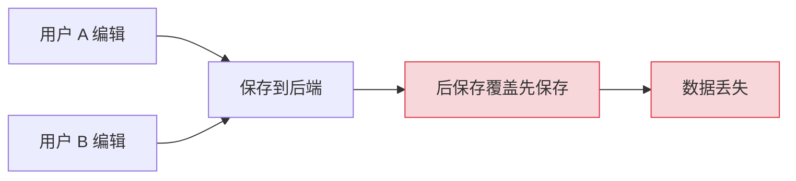
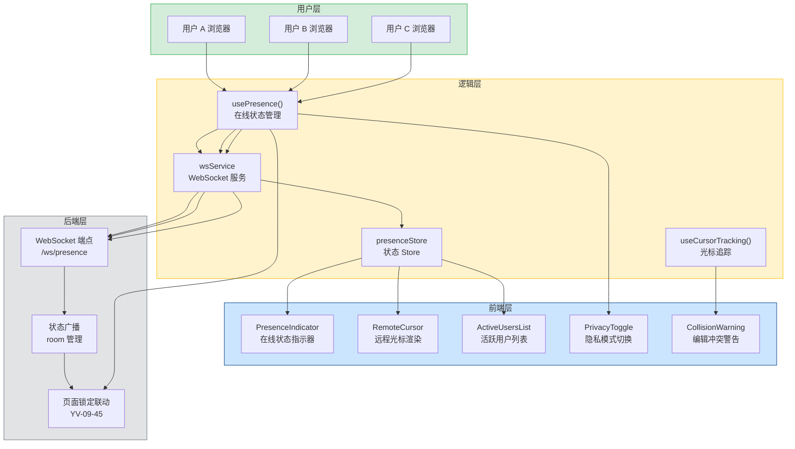

# 实时协作光标与状态

> 需求编号：YV-09-46 · 优先级：P2 · 人天：1.0d
> 依赖：YV-09-45（页面锁定系统），WebSocket 服务端支持

## 改动总览

| 改动点 | 类型 | 涉及文件 |
|--------|------|---------|
| 在线状态 Composable | 新增 | `src/composables/usePresence.ts` |
| 协作光标组件 | 新增 | `src/components/Presence/` |
| WebSocket 服务层 | 新增 | `src/services/wsService.ts` |
| 在线状态 Store | 新增 | `src/stores/presence.ts` |
| 页面锁定集成 | 修改 | `src/composables/usePageLock.ts` |
| 全局样式 | 新增 | `src/assets/styles/presence.scss` |

## 涉及文件

```
YiVad/
├── src/
│   ├── components/
│   │   └── Presence/
│   │       ├── PresenceIndicator.vue          # 新增：在线状态指示器
│   │       ├── RemoteCursor.vue              # 新增：远程光标组件
│   │       ├── ActiveUsersList.vue           # 新增：活跃用户列表
│   │       ├── PrivacyToggle.vue             # 新增：隐私模式切换
│   │       ├── CollisionWarning.vue          # 新增：编辑冲突警告
│   │       └── index.ts                      # 新增：统一导出
│   ├── composables/
│   │   ├── usePresence.ts                    # 新增：在线状态管理
│   │   └── useCursorTracking.ts             # 新增：光标追踪
│   ├── services/
│   │   └── wsService.ts                      # 新增：WebSocket 服务
│   ├── stores/
│   │   └── presence.ts                       # 新增：在线状态 Store
│   └── assets/
│       └── styles/
│           └── presence.scss                 # 新增：在线状态样式
```

## 基本信息

| 字段 | 值 |
|------|-----|
| 需求编号 | YV-09-46 |
| 模块 | 全项目协作体验 |
| 优先级 | **P2**（提升协作体验，非阻塞性） |
| 前端人天 | 1.0d |
| 后端人天 | 0.5d（WebSocket 端点 + 状态广播） |
| 依赖 | YV-09-45（页面锁定系统），WebSocket 服务端支持 |

---

## 背景

YiVad 当前为单人操作设计，缺乏多用户同时在线时的感知能力。当多个管理员同时编辑同一实体（如项目、Bug、文档）时，没有任何机制告知用户"当前还有谁在查看/编辑同一内容"。这导致编辑冲突、重复操作和信息不同步等问题。

**核心问题：**

| # | 问题 | 严重程度 | 影响 |
|---|------|----------|------|
| 1 | **无用户在线感知** -- 用户无法知道还有谁在查看同一页面 | **高** | 造成编辑冲突，两人同时修改同一字段互相覆盖 |
| 2 | **无远程光标显示** -- 无法看到其他用户的操作位置 | **中** | 协作时沟通成本高，需通过外部工具确认"你在改哪里" |
| 3 | **无编辑冲突预警** -- 多人编辑同一字段时无任何提示 | **高** | 后保存者的修改覆盖先保存者，数据丢失 |
| 4 | **无隐私控制** -- 用户无法选择隐藏自己的在线状态 | **低** | 部分场景下用户不希望被追踪，缺乏隐私保护 |
| 5 | **与页面锁定系统脱节** -- 在线状态和页面锁定各自独立，无法联动 | **中** | 用户被锁定但不知道被谁锁定，查找锁持有者困难 |

**挑战：**
- 光标位置更新频率需平衡实时性和性能（每 500ms 节流）
- WebSocket 连接需在页面切换时保持稳定，避免频繁重连
- 隐私模式与协作需求之间的平衡
- 与 YV-09-45 页面锁定系统的深度集成

---

## 一、现状分析

### 当前协作状态



### 根因分析矩阵

| 缺失项 | 根因 | 影响链 |
|--------|------|--------|
| 在线状态广播 | 无 WebSocket 连接，前端无法感知其他用户 | 用户完全不知道其他人在做什么，协作靠口头沟通 |
| 远程光标 | 无光标位置共享机制 | 用户无法定位其他协作者的操作位置 |
| 编辑冲突检测 | 无字段级别的并发编辑检测 | 乐观锁缺失，后保存者覆盖前保存者 |
| 隐私模式 | 无状态隐藏选项 | 用户被迫暴露在线状态，缺乏选择权 |
| 页面锁定联动 | 锁定系统与在线状态分离 | 用户被锁定时无法知道是谁锁的 |

---

## 二、设计决策

### 实时通信协议选型

| 维度 | 短轮询 | 长轮询 | SSE | WebSocket | 决策 |
|------|--------|--------|-----|-----------|------|
| 实时性 | 差 | 中 | 好 | 优秀 | **WebSocket** |
| 双向通信 | 否 | 否 | 否 | 是 | **WebSocket** |
| 服务端负载 | 高 | 中 | 低 | 低 | **WebSocket** |
| 实现复杂度 | 低 | 中 | 中 | 中 | 可接受 |
| 断线重连 | 无需 | 需要 | 需要 | 需要 | 需要处理 |

**决策：** 使用 WebSocket 作为实时通信协议，支持双向消息推送，服务端主动广播用户状态变更。

### 光标位置同步策略

| 维度 | 实时同步 | 节流 200ms | 节流 500ms | 决策 |
|------|----------|-----------|-----------|------|
| 流畅度 | 最佳 | 好 | 可接受 | **节流 500ms** |
| 带宽消耗 | 极高 | 中 | 低 | **节流 500ms** |
| 服务端压力 | 极高 | 中 | 低 | **节流 500ms** |
| 用户感知 | 流畅 | 流畅 | 轻微延迟 | 可接受 |

**决策：** 采用 500ms 节流策略，平衡流畅度和性能。光标的视觉动画使用 CSS transition 补间，弥补节流带来的视觉跳跃。

### 用户状态模型

| 状态 | 图标 | 说明 | 触发条件 |
|------|------|------|----------|
| `viewing` | 眼睛图标（绿色） | 正在查看页面 | 页面加载后自动进入 |
| `editing` | 铅笔图标（橙色） | 正在编辑字段 | 聚焦输入框时自动切换 |
| `idle` | 时钟图标（灰色） | 无操作超过 5 分钟 | 无鼠标/键盘事件 5 分钟 |
| `offline` | 离线图标（灰色虚线） | 已断开连接 | WebSocket 断连 |
| `hidden` | 无显示 | 隐私模式 | 用户主动开启隐私模式 |

### 隐私模式设计

| 维度 | 完全隐藏 | 显示人数不显示身份 | 自定义粒度 | 决策 |
|------|----------|-------------------|-----------|------|
| 隐私保护 | 最佳 | 中 | 最佳 | **自定义粒度** |
| 协作体验 | 差 | 中 | 好 | **自定义粒度** |
| 实现复杂度 | 低 | 低 | 中 | **自定义粒度** |

**决策：** 提供三级隐私选项：(1) 完全可见 -- 显示用户名和状态；(2) 仅显示人数 -- 显示"3 人在线"但不显示具体身份；(3) 完全隐藏 -- 不广播任何信息，也不接收他人状态。

---

## 三、目标架构



### 状态流转

```
┌─────────────────────────────────────────────────────────────────────┐
│                     Presence State Flow                             │
│                                                                     │
│  ┌──────────┐    ┌──────────────┐    ┌──────────────┐              │
│  │ Page     │───>│ WebSocket    │───>│ Presence     │              │
│  │ Load     │    │ Connect      │    │ Broadcast    │              │
│  └──────────┘    └──────┬───────┘    └──────┬───────┘              │
│                         │                   │                       │
│                    ┌────▼────┐         ┌────▼────┐                  │
│                    │ Join    │         │ Room    │                  │
│                    │ Room    │         │ State   │                  │
│                    └────┬────┘         └────┬────┘                  │
│                         │                   │                       │
│                    ┌────▼────┐         ┌────▼────┐                  │
│                    │ Receive │         │ Update  │                  │
│                    │ Peers   │         │ Local   │                  │
│                    └────┬────┘         │ Store   │                  │
│                         │              └────┬────┘                  │
│                    ┌────▼────┐              │                       │
│                    │ Render  │<─────────────┘                       │
│                    │ Cursors │                                      │
│                    │ + List  │                                      │
│                    └─────────┘                                      │
│                                                                     │
│  ┌──────────────────────────────────────────────────────────────┐  │
│  │  Idle Detection: 5min no activity → state: idle → broadcast │  │
│  │  Privacy Toggle: hidden → stop broadcasting, stop receiving  │  │
│  │  Disconnect: page close/tab close → state: offline → leave  │  │
│  └──────────────────────────────────────────────────────────────┘  │
└─────────────────────────────────────────────────────────────────────┘
```

---

## 四、具体改动

### 4.1 WebSocket 服务层

**文件：** `src/services/wsService.ts`（新增）

```typescript
// src/services/wsService.ts
import { ref, type Ref } from "vue";

type PresenceState = "viewing" | "editing" | "idle" | "offline" | "hidden";
type PrivacyLevel = "full" | "count_only" | "hidden";

interface PresenceUser {
  userId: string;
  userName: string;
  state: PresenceState;
  cursor?: { x: number; y: number; field?: string };
  color: string;
  privacyLevel: PrivacyLevel;
}

interface PresenceMessage {
  type: "state_update" | "cursor_update" | "join" | "leave" | "room_state";
  payload: any;
}

const USER_COLORS = [
  "#E53E3E", "#3182CE", "#38A169", "#D69E2E",
  "#805AD5", "#DD6B20", "#319795", "#D53F8C",
];

class WsService {
  private ws: WebSocket | null = null;
  private reconnectTimer: ReturnType<typeof setTimeout> | null = null;
  private heartbeatTimer: ReturnType<typeof setInterval> | null = null;
  private reconnectAttempts = 0;
  private maxReconnectAttempts = 10;
  private baseDelay = 1000;
  private url: string;

  public connected: Ref<boolean> = ref(false);
  public users: Ref<PresenceUser[]> = ref([]);
  public onMessage: ((msg: PresenceMessage) => void) | null = null;

  constructor(url: string) {
    this.url = url;
  }

  connect(token: string, room: string): void {
    const wsUrl = `${this.url}/ws/presence?token=${token}&room=${encodeURIComponent(room)}`;
    this.ws = new WebSocket(wsUrl);

    this.ws.onopen = () => {
      this.connected.value = true;
      this.reconnectAttempts = 0;
      this.startHeartbeat();
    };

    this.ws.onmessage = (event) => {
      const msg: PresenceMessage = JSON.parse(event.data);
      this.handleMessage(msg);
      this.onMessage?.(msg);
    };

    this.ws.onclose = () => {
      this.connected.value = false;
      this.stopHeartbeat();
      this.scheduleReconnect(token, room);
    };

    this.ws.onerror = () => {
      this.ws?.close();
    };
  }

  sendCursor(x: number, y: number, field?: string): void {
    this.send({
      type: "cursor_update",
      payload: { x, y, field, timestamp: Date.now() },
    });
  }

  sendState(state: PresenceState): void {
    this.send({ type: "state_update", payload: { state } });
  }

  sendPrivacy(level: PrivacyLevel): void {
    this.send({ type: "state_update", payload: { privacyLevel: level } });
  }

  disconnect(): void {
    this.stopHeartbeat();
    this.clearReconnect();
    this.ws?.close(1000, "User disconnect");
    this.ws = null;
  }

  private send(msg: PresenceMessage): void {
    if (this.ws?.readyState === WebSocket.OPEN) {
      this.ws.send(JSON.stringify(msg));
    }
  }

  private handleMessage(msg: PresenceMessage): void {
    switch (msg.type) {
      case "room_state":
        this.users.value = msg.payload.users;
        break;
      case "join":
        this.users.value = [...this.users.value, msg.payload];
        break;
      case "leave":
        this.users.value = this.users.value.filter(
          (u) => u.userId !== msg.payload.userId
        );
        break;
      case "state_update":
        this.users.value = this.users.value.map((u) =>
          u.userId === msg.payload.userId ? { ...u, ...msg.payload } : u
        );
        break;
      case "cursor_update":
        this.users.value = this.users.value.map((u) =>
          u.userId === msg.payload.userId
            ? { ...u, cursor: msg.payload.cursor }
            : u
        );
        break;
    }
  }

  private startHeartbeat(): void {
    this.heartbeatTimer = setInterval(() => {
      this.send({ type: "state_update", payload: { heartbeat: Date.now() } });
    }, 30000);
  }

  private stopHeartbeat(): void {
    if (this.heartbeatTimer) {
      clearInterval(this.heartbeatTimer);
      this.heartbeatTimer = null;
    }
  }

  private scheduleReconnect(token: string, room: string): void {
    if (this.reconnectAttempts >= this.maxReconnectAttempts) return;
    const delay = Math.min(
      this.baseDelay * Math.pow(2, this.reconnectAttempts),
      30000
    );
    this.reconnectTimer = setTimeout(() => {
      this.reconnectAttempts++;
      this.connect(token, room);
    }, delay);
  }

  private clearReconnect(): void {
    if (this.reconnectTimer) {
      clearTimeout(this.reconnectTimer);
      this.reconnectTimer = null;
    }
  }
}

let instance: WsService | null = null;

export function getWsService(): WsService {
  if (!instance) {
    const baseUrl = import.meta.env.VITE_WS_URL || "ws://localhost:10086";
    instance = new WsService(baseUrl);
  }
  return instance;
}

export { USER_COLORS };
export type { PresenceUser, PresenceState, PrivacyLevel, PresenceMessage };
```

### 4.2 在线状态 Composable

**文件：** `src/composables/usePresence.ts`（新增）

```typescript
// src/composables/usePresence.ts
import { ref, computed, onMounted, onUnmounted, watch } from "vue";
import { useUserStore } from "@/stores/user";
import { getWsService, type PresenceState, type PrivacyLevel } from "@/services/wsService";

interface UsePresenceOptions {
  room: string;
  privacyLevel?: PrivacyLevel;
}

export function usePresence(options: UsePresenceOptions) {
  const ws = getWsService();
  const userStore = useUserStore();

  const myState = ref<PresenceState>("viewing");
  const privacyLevel = ref<PrivacyLevel>(options.privacyLevel || "full");
  const lastActivityTime = ref(Date.now());
  const idleTimeout = 5 * 60 * 1000; // 5 minutes

  let idleTimer: ReturnType<typeof setInterval> | null = null;
  let activityHandler: (() => void) | null = null;

  const otherUsers = computed(() =>
    ws.users.value.filter((u) => u.userId !== userStore.userId)
  );

  const activeEditors = computed(() =>
    otherUsers.value.filter((u) => u.state === "editing")
  );

  const isAnyoneEditing = computed(() => activeEditors.value.length > 0);

  const editingField = computed(() => {
    const editors = activeEditors.value.filter((u) => u.cursor?.field);
    return editors.map((u) => u.cursor!.field!);
  });

  function connect() {
    const token = userStore.token || "";
    ws.connect(token, options.room);
  }

  function disconnect() {
    ws.disconnect();
    stopIdleDetection();
  }

  function setState(state: PresenceState) {
    myState.value = state;
    if (privacyLevel.value !== "hidden") {
      ws.sendState(state);
    }
  }

  function setPrivacy(level: PrivacyLevel) {
    privacyLevel.value = level;
    ws.sendPrivacy(level);
  }

  function startIdleDetection() {
    activityHandler = () => {
      lastActivityTime.value = Date.now();
      if (myState.value === "idle") {
        setState("viewing");
      }
    };

    ["mousemove", "keydown", "click", "scroll", "touchstart"].forEach((evt) => {
      document.addEventListener(evt, activityHandler!);
    });

    idleTimer = setInterval(() => {
      if (Date.now() - lastActivityTime.value > idleTimeout && myState.value !== "idle") {
        setState("idle");
      }
    }, 10000);
  }

  function stopIdleDetection() {
    if (activityHandler) {
      ["mousemove", "keydown", "click", "scroll", "touchstart"].forEach((evt) => {
        document.removeEventListener(evt, activityHandler!);
      });
      activityHandler = null;
    }
    if (idleTimer) {
      clearInterval(idleTimer);
      idleTimer = null;
    }
  }

  onMounted(() => {
    connect();
    startIdleDetection();
  });

  onUnmounted(() => {
    disconnect();
  });

  return {
    ws,
    myState,
    privacyLevel,
    otherUsers,
    activeEditors,
    isAnyoneEditing,
    editingField,
    setState,
    setPrivacy,
    connect,
    disconnect,
  };
}
```

### 4.3 光标追踪 Composable

**文件：** `src/composables/useCursorTracking.ts`（新增）

```typescript
// src/composables/useCursorTracking.ts
import { ref, onMounted, onUnmounted } from "vue";
import { getWsService } from "@/services/wsService";

interface CursorPosition {
  x: number;
  y: number;
  field?: string;
}

export function useCursorTracking(fieldRef?: string) {
  const ws = getWsService();
  const cursorPosition = ref<CursorPosition>({ x: 0, y: 0 });
  const isTracking = ref(false);

  let throttleTimer: ReturnType<typeof setTimeout> | null = null;
  const THROTTLE_MS = 500;

  function handleMouseMove(e: MouseEvent) {
    cursorPosition.value = {
      x: e.clientX,
      y: e.clientY,
      field: fieldRef,
    };

    if (!throttleTimer) {
      throttleTimer = setTimeout(() => {
        ws.sendCursor(
          cursorPosition.value.x,
          cursorPosition.value.y,
          cursorPosition.value.field
        );
        throttleTimer = null;
      }, THROTTLE_MS);
    }
  }

  function handleFocus(e: FocusEvent) {
    const target = e.target as HTMLElement;
    const fieldName =
      target.getAttribute("data-field") ||
      target.getAttribute("name") ||
      target.id ||
      undefined;
    if (fieldName) {
      cursorPosition.value.field = fieldName;
    }
  }

  function startTracking() {
    isTracking.value = true;
    document.addEventListener("mousemove", handleMouseMove, { passive: true });
    document.addEventListener("focusin", handleFocus);
  }

  function stopTracking() {
    isTracking.value = false;
    document.removeEventListener("mousemove", handleMouseMove);
    document.removeEventListener("focusin", handleFocus);
    if (throttleTimer) {
      clearTimeout(throttleTimer);
      throttleTimer = null;
    }
  }

  onMounted(() => startTracking());
  onUnmounted(() => stopTracking());

  return {
    cursorPosition,
    isTracking,
    startTracking,
    stopTracking,
  };
}
```

### 4.4 在线状态 Store

**文件：** `src/stores/presence.ts`（新增）

```typescript
// src/stores/presence.ts
import { defineStore } from "pinia";
import { ref, computed } from "vue";
import type { PresenceUser, PrivacyLevel } from "@/services/wsService";

export const usePresenceStore = defineStore("presence", () => {
  const isEnabled = ref(true);
  const privacyLevel = ref<PrivacyLevel>("full");
  const showActiveUsersPanel = ref(false);

  const activeRooms = ref<Map<string, PresenceUser[]>>(new Map());

  function getRoomUsers(room: string): PresenceUser[] {
    return activeRooms.value.get(room) || [];
  }

  function setRoomUsers(room: string, users: PresenceUser[]) {
    activeRooms.value.set(room, users);
  }

  function togglePanel() {
    showActiveUsersPanel.value = !showActiveUsersPanel.value;
  }

  function setPrivacy(level: PrivacyLevel) {
    privacyLevel.value = level;
    localStorage.setItem("presence-privacy", level);
  }

  function loadPrivacyFromStorage() {
    const saved = localStorage.getItem("presence-privacy") as PrivacyLevel | null;
    if (saved) {
      privacyLevel.value = saved;
    }
  }

  return {
    isEnabled,
    privacyLevel,
    showActiveUsersPanel,
    activeRooms,
    getRoomUsers,
    setRoomUsers,
    togglePanel,
    setPrivacy,
    loadPrivacyFromStorage,
  };
});
```

### 4.5 在线状态指示器组件

**文件：** `src/components/Presence/PresenceIndicator.vue`（新增）

```vue
<template>
  <div class="presence-indicator" :class="`presence-indicator--${state}`">
    <span class="presence-indicator__dot" />
    <span class="presence-indicator__label">{{ stateLabel }}</span>
    <span v-if="count > 0" class="presence-indicator__count">
      {{ count }} 人在线
    </span>
    <span v-if="lockOwner" class="presence-indicator__lock" :title="`${lockOwner} 正在编辑`">
      🔒 {{ lockOwner }}
    </span>
  </div>
</template>

<script setup lang="ts">
import { computed } from "vue";
import type { PresenceState } from "@/services/wsService";

interface Props {
  state: PresenceState;
  count?: number;
  lockOwner?: string;
}

const props = withDefaults(defineProps<Props>(), {
  count: 0,
});

const stateLabel = computed(() => {
  const labels: Record<PresenceState, string> = {
    viewing: "查看中",
    editing: "编辑中",
    idle: "空闲",
    offline: "离线",
    hidden: "隐身",
  };
  return labels[props.state];
});
</script>

<style scoped lang="scss">
.presence-indicator {
  display: inline-flex;
  align-items: center;
  gap: 6px;
  padding: 4px 10px;
  border-radius: 12px;
  font-size: 12px;
  background: var(--el-fill-color-light);

  &__dot {
    width: 8px;
    height: 8px;
    border-radius: 50%;
    flex-shrink: 0;
  }

  &--viewing .presence-indicator__dot { background: #38A169; }
  &--editing .presence-indicator__dot { background: #DD6B20; }
  &--idle .presence-indicator__dot { background: #A0AEC0; }
  &--offline .presence-indicator__dot { background: #CBD5E0; }
  &--hidden .presence-indicator__dot { display: none; }

  &__label {
    color: var(--el-text-color-regular);
  }

  &__count {
    color: var(--el-text-color-secondary);
    padding-left: 6px;
    border-left: 1px solid var(--el-border-color);
  }

  &__lock {
    color: #E53E3E;
    font-weight: 500;
  }
}
</style>
```

### 4.6 远程光标组件

**文件：** `src/components/Presence/RemoteCursor.vue`（新增）

```vue
<template>
  <Teleport to="body">
    <div
      v-for="user in visibleUsers"
      :key="user.userId"
      class="remote-cursor"
      :style="{
        left: user.cursor?.x + 'px',
        top: user.cursor?.y + 'px',
        '--cursor-color': user.color,
      }"
    >
      <svg class="remote-cursor__arrow" width="16" height="16" viewBox="0 0 16 16">
        <path
          d="M1 1l4.5 12 2-4.5 4.5-2L1 1z"
          :fill="user.color"
          stroke="white"
          stroke-width="0.5"
        />
      </svg>
      <span class="remote-cursor__badge" :style="{ background: user.color }">
        {{ user.userName }}
      </span>
    </div>
  </Teleport>
</template>

<script setup lang="ts">
import { computed } from "vue";
import type { PresenceUser } from "@/services/wsService";

interface Props {
  users: PresenceUser[];
  excludeUserId?: string;
}

const props = defineProps<Props>();

const visibleUsers = computed(() =>
  props.users.filter(
    (u) =>
      u.userId !== props.excludeUserId &&
      u.cursor &&
      u.privacyLevel !== "hidden"
  )
);
</script>

<style scoped lang="scss">
.remote-cursor {
  position: fixed;
  z-index: 9999;
  pointer-events: none;
  transition: left 0.3s ease, top 0.3s ease;

  &__arrow {
    display: block;
  }

  &__badge {
    position: absolute;
    top: 14px;
    left: 10px;
    padding: 2px 6px;
    border-radius: 4px;
    font-size: 11px;
    color: #fff;
    white-space: nowrap;
    font-weight: 500;
    line-height: 1.4;
  }
}
</style>
```

### 4.7 活跃用户列表组件

**文件：** `src/components/Presence/ActiveUsersList.vue`（新增）

```vue
<template>
  <div class="active-users-list" :class="{ 'is-collapsed': !expanded }">
    <div class="active-users-list__header" @click="toggle">
      <span class="active-users-list__title">
        在线用户 ({{ users.length }})
      </span>
      <span class="active-users-list__toggle">{{ expanded ? "收起" : "展开" }}</span>
    </div>
    <div v-if="expanded" class="active-users-list__body">
      <div
        v-for="user in users"
        :key="user.userId"
        class="active-users-list__item"
        :class="`is-${user.state}`"
      >
        <span
          class="active-users-list__avatar"
          :style="{ background: user.color }"
        >
          {{ user.userName.charAt(0) }}
        </span>
        <div class="active-users-list__info">
          <span class="active-users-list__name">{{ user.userName }}</span>
          <span class="active-users-list__state">{{ stateLabel(user.state) }}</span>
        </div>
        <span v-if="user.cursor?.field" class="active-users-list__field">
          {{ user.cursor.field }}
        </span>
      </div>
    </div>
  </div>
</template>

<script setup lang="ts">
import { ref } from "vue";
import type { PresenceUser, PresenceState } from "@/services/wsService";

interface Props {
  users: PresenceUser[];
}

defineProps<Props>();

const expanded = ref(true);

function toggle() {
  expanded.value = !expanded.value;
}

function stateLabel(state: PresenceState): string {
  const labels: Record<PresenceState, string> = {
    viewing: "查看中",
    editing: "编辑中",
    idle: "空闲",
    offline: "离线",
    hidden: "隐身",
  };
  return labels[state];
}
</script>

<style scoped lang="scss">
.active-users-list {
  background: var(--el-bg-color);
  border: 1px solid var(--el-border-color-light);
  border-radius: 8px;
  overflow: hidden;

  &__header {
    display: flex;
    justify-content: space-between;
    align-items: center;
    padding: 10px 14px;
    cursor: pointer;
    user-select: none;
    background: var(--el-fill-color-lighter);

    &:hover {
      background: var(--el-fill-color-light);
    }
  }

  &__title {
    font-size: 13px;
    font-weight: 600;
  }

  &__toggle {
    font-size: 12px;
    color: var(--el-color-primary);
  }

  &__body {
    max-height: 300px;
    overflow-y: auto;
  }

  &__item {
    display: flex;
    align-items: center;
    gap: 10px;
    padding: 8px 14px;
    border-bottom: 1px solid var(--el-border-color-lighter);

    &:last-child {
      border-bottom: none;
    }

    &.is-idle {
      opacity: 0.6;
    }
  }

  &__avatar {
    width: 28px;
    height: 28px;
    border-radius: 50%;
    display: flex;
    align-items: center;
    justify-content: center;
    color: #fff;
    font-size: 12px;
    font-weight: 600;
    flex-shrink: 0;
  }

  &__info {
    flex: 1;
    min-width: 0;
  }

  &__name {
    display: block;
    font-size: 13px;
    font-weight: 500;
    overflow: hidden;
    text-overflow: ellipsis;
    white-space: nowrap;
  }

  &__state {
    font-size: 11px;
    color: var(--el-text-color-secondary);
  }

  &__field {
    font-size: 11px;
    padding: 2px 6px;
    background: var(--el-fill-color);
    border-radius: 4px;
    color: var(--el-text-color-secondary);
    white-space: nowrap;
  }
}
</style>
```

### 4.8 编辑冲突警告组件

**文件：** `src/components/Presence/CollisionWarning.vue`（新增）

```vue
<template>
  <Teleport to="body">
    <Transition name="collision-warning-fade">
      <div v-if="visible" class="collision-warning">
        <div class="collision-warning__icon">&#9888;</div>
        <div class="collision-warning__content">
          <p class="collision-warning__title">编辑冲突警告</p>
          <p class="collision-warning__text">
            {{ editors.join("、") }} 正在编辑同一字段"{{ fieldName }}"
          </p>
          <p class="collision-warning__hint">
            建议沟通后再编辑，避免数据覆盖
          </p>
        </div>
        <button class="collision-warning__close" @click="dismiss">&times;</button>
      </div>
    </Transition>
  </Teleport>
</template>

<script setup lang="ts">
import { ref, watch } from "vue";

interface Props {
  editors: string[];
  fieldName: string;
}

const props = defineProps<Props>();

const visible = ref(false);
const dismissed = ref(false);

watch(
  () => props.editors.length,
  (len) => {
    if (len > 0 && !dismissed.value) {
      visible.value = true;
    } else {
      visible.value = false;
    }
  },
  { immediate: true }
);

function dismiss() {
  visible.value = false;
  dismissed.value = true;
  setTimeout(() => {
    dismissed.value = false;
  }, 30000);
}
</script>

<style scoped lang="scss">
.collision-warning {
  position: fixed;
  bottom: 20px;
  right: 20px;
  z-index: 10000;
  display: flex;
  gap: 12px;
  padding: 16px 20px;
  background: #FFF5F5;
  border: 1px solid #FC8181;
  border-radius: 8px;
  box-shadow: 0 4px 12px rgba(0, 0, 0, 0.1);
  max-width: 400px;

  &__icon {
    font-size: 24px;
    flex-shrink: 0;
  }

  &__content {
    flex: 1;
  }

  &__title {
    margin: 0 0 4px;
    font-weight: 600;
    font-size: 14px;
    color: #C53030;
  }

  &__text {
    margin: 0 0 4px;
    font-size: 13px;
    color: #2D3748;
  }

  &__hint {
    margin: 0;
    font-size: 12px;
    color: #718096;
  }

  &__close {
    border: none;
    background: none;
    font-size: 20px;
    cursor: pointer;
    color: #A0AEC0;
    padding: 0;
    line-height: 1;

    &:hover {
      color: #4A5568;
    }
  }
}

.collision-warning-fade-enter-active,
.collision-warning-fade-leave-active {
  transition: opacity 0.3s ease, transform 0.3s ease;
}

.collision-warning-fade-enter-from,
.collision-warning-fade-leave-to {
  opacity: 0;
  transform: translateY(10px);
}
</style>
```

### 4.9 隐私模式切换组件

**文件：** `src/components/Presence/PrivacyToggle.vue`（新增）

```vue
<template>
  <el-dropdown trigger="click" @command="handleCommand">
    <span class="privacy-toggle">
      <span class="privacy-toggle__icon">{{ privacyIcon }}</span>
      <span class="privacy-toggle__label">{{ privacyLabel }}</span>
    </span>
    <template #dropdown>
      <el-dropdown-menu>
        <el-dropdown-item command="full">
          <span class="privacy-option">
            <span class="privacy-option__icon">&#128065;</span>
            <span class="privacy-option__label">完全可见</span>
            <span class="privacy-option__desc">显示用户名和状态</span>
          </span>
        </el-dropdown-item>
        <el-dropdown-item command="count_only">
          <span class="privacy-option">
            <span class="privacy-option__icon">&#128373;</span>
            <span class="privacy-option__label">仅显示人数</span>
            <span class="privacy-option__desc">不显示具体身份</span>
          </span>
        </el-dropdown-item>
        <el-dropdown-item command="hidden">
          <span class="privacy-option">
            <span class="privacy-option__icon">&#128274;</span>
            <span class="privacy-option__label">完全隐藏</span>
            <span class="privacy-option__desc">不广播任何信息</span>
          </span>
        </el-dropdown-item>
      </el-dropdown-menu>
    </template>
  </el-dropdown>
</template>

<script setup lang="ts">
import { computed } from "vue";
import type { PrivacyLevel } from "@/services/wsService";

interface Props {
  currentLevel: PrivacyLevel;
}

const props = defineProps<Props>();

const emit = defineEmits<{
  change: [level: PrivacyLevel];
}>();

const privacyIcon = computed(() => {
  const icons: Record<PrivacyLevel, string> = {
    full: "\u{1F465}",
    count_only: "\u{1F373}",
    hidden: "\u{1F512}",
  };
  return icons[props.currentLevel];
});

const privacyLabel = computed(() => {
  const labels: Record<PrivacyLevel, string> = {
    full: "在线可见",
    count_only: "隐身",
    hidden: "完全隐藏",
  };
  return labels[props.currentLevel];
});

function handleCommand(level: PrivacyLevel) {
  emit("change", level);
}
</script>

<style scoped lang="scss">
.privacy-toggle {
  display: inline-flex;
  align-items: center;
  gap: 4px;
  padding: 4px 8px;
  border-radius: 6px;
  cursor: pointer;
  font-size: 12px;
  color: var(--el-text-color-regular);

  &:hover {
    background: var(--el-fill-color-light);
  }

  &__icon {
    font-size: 14px;
  }
}

.privacy-option {
  display: flex;
  align-items: center;
  gap: 8px;

  &__icon {
    font-size: 16px;
    width: 20px;
    text-align: center;
  }

  &__label {
    font-weight: 500;
  }

  &__desc {
    font-size: 11px;
    color: var(--el-text-color-secondary);
    margin-left: auto;
  }
}
</style>
```

---

## 五、实施步骤

| 步骤 | 任务 | 产出 | 验证方式 | 人天 |
|------|------|------|----------|------|
| 1 | 创建 WebSocket 服务层 | `wsService.ts` | 连接/断连/重连/心跳逻辑正确 | 0.15 |
| 2 | 创建在线状态 Store | `presence.ts` | 状态管理、隐私级别持久化 | 0.05 |
| 3 | 实现 usePresence Composable | `usePresence.ts` | 连接管理、状态切换、空闲检测 | 0.10 |
| 4 | 实现 useCursorTracking Composable | `useCursorTracking.ts` | 500ms 节流光标位置上报 | 0.05 |
| 5 | 创建 PresenceIndicator 组件 | `PresenceIndicator.vue` | 4 种状态正确渲染 | 0.05 |
| 6 | 创建 RemoteCursor 组件 | `RemoteCursor.vue` | 远程光标位置平滑跟随 | 0.10 |
| 7 | 创建 ActiveUsersList 组件 | `ActiveUsersList.vue` | 用户列表渲染、展开收起 | 0.10 |
| 8 | 创建 CollisionWarning 组件 | `CollisionWarning.vue` | 编辑冲突检测与警告 | 0.10 |
| 9 | 创建 PrivacyToggle 组件 | `PrivacyToggle.vue` | 三级隐私切换 | 0.05 |
| 10 | 集成到详情页 | 各详情页 `index.vue` | 在线状态、远程光标正常工作 | 0.10 |
| 11 | 与 YV-09-45 页面锁定联动 | `usePageLock.ts` | 锁定信息显示锁持有者 | 0.10 |
| 12 | 整体验证 | 双浏览器协作测试 | 状态同步、光标显示、冲突警告 | 0.05 |

**总计：** 1.0d

---

## 六、测试规格

### 组件测试：PresenceIndicator

#### Scenario: 显示在线状态
- **GIVEN** 用户状态为 `editing`，另有 2 人在线
- **WHEN** 挂载 PresenceIndicator 组件
- **THEN** 渲染橙色圆点、"编辑中"标签、"2 人在线"计数

#### Scenario: 显示锁定信息
- **GIVEN** `lockOwner` 为 "张三"
- **WHEN** 挂载 PresenceIndicator 组件
- **THEN** 渲染锁图标和"张三 正在编辑"文本

### 组件测试：RemoteCursor

#### Scenario: 渲染远程光标
- **GIVEN** 2 个远程用户，均有光标位置
- **WHEN** 挂载 RemoteCursor 组件
- **THEN** 渲染 2 个光标箭头和用户名徽章，颜色与用户分配颜色一致

#### Scenario: 隐私模式隐藏光标
- **GIVEN** 1 个远程用户 `privacyLevel` 为 `hidden`
- **WHEN** 挂载 RemoteCursor 组件
- **THEN** 该用户的光标不渲染

### Composable 测试：useCursorTracking

#### Scenario: 光标位置节流上报
- **GIVEN** 鼠标快速移动，触发多次 `mousemove` 事件
- **WHEN** 500ms 内触发 10 次 `mousemove`
- **THEN** WebSocket 仅发送 1 次光标更新消息

#### Scenario: 输入框聚焦上报字段名
- **GIVEN** 聚焦 `data-field="title"` 的输入框
- **WHEN** 触发 `focusin` 事件
- **THEN** 光标位置 `field` 更新为 `"title"`

---

## 七、风险与缓解

| 风险 | 概率 | 影响 | 等级 | 缓解措施 | 应急预案 |
|------|------|------|------|----------|----------|
| WebSocket 连接不稳定 | 中 | 高 | 高 | 指数退避重连（最多 10 次），心跳保活 | 降级为静默模式，不显示在线状态 |
| 光标位置更新过于频繁导致性能问题 | 中 | 中 | 中 | 500ms 节流 + CSS transition 补间 | 调整为 1000ms 节流 |
| 隐私模式与协作需求冲突 | 低 | 低 | 低 | 三级隐私选项，用户可自主选择 | 管理员可强制关闭隐私模式 |
| 多个远程光标渲染导致 DOM 节点过多 | 低 | 中 | 低 | 最多渲染 10 个光标，超出部分不渲染 | 仅渲染同一字段的编辑者光标 |
| 与 YV-09-45 页面锁定竞态 | 中 | 中 | 中 | 锁定状态通过同一 WebSocket 通道同步 | 锁定系统回退到独立轮询模式 |

---

## 八、回滚策略

| 回滚场景 | 回滚方式 | 影响范围 | 恢复时间 |
|----------|----------|----------|----------|
| WebSocket 服务不可用 | 设置 `presenceStore.isEnabled = false` | 全局 | < 1min |
| 远程光标渲染异常 | 移除 RemoteCursor 组件引用 | 单个页面 | < 5min |
| 隐私模式切换异常 | 设置 `localStorage.removeItem("presence-privacy")` | 单用户 | < 1min |
| 性能下降 | 关闭光标追踪 `useCursorTracking` 调用 | 单个页面 | < 5min |
| 页面锁定联动异常 | 恢复页面锁定独立模式 | 全局 | < 5min |

**回滚验证：**
- 回滚后页面正常加载，无控制台错误
- 回滚后页面锁定系统独立工作
- 回滚后 WebSocket 连接断开，无内存泄漏

---

## 九、设计决策记录

### D-01: 选择 WebSocket 而非 SSE 作为实时通信协议

**背景：** 在线状态和光标位置需要双向实时通信，前端需要主动推送状态变更，服务端需要广播给房间内其他用户。
**决策：** 使用 WebSocket 而非 SSE。SSE 仅支持单向推送（服务端到客户端），无法满足前端主动上报状态的需求。
**权衡：** WebSocket 实现复杂度略高于 SSE，但双向通信能力是刚需。WebSocket 需要额外的断线重连和心跳机制。
**后果：** 后端需要新增 WebSocket 端点，前端需要维护 WebSocket 连接生命周期。

### D-02: 选择 500ms 作为光标位置节流间隔

**背景：** 光标位置实时同步需要平衡流畅度和性能。过高的更新频率会导致带宽浪费和服务端压力，过低的频率会导致光标跳跃。
**决策：** 500ms 节流，配合 CSS `transition` 补间动画，在视觉上消除跳跃感。
**权衡：** 500ms 在快速移动时可能产生轻微延迟，但用户感知不强烈。CSS transition 的 `left`/`top` 属性动画可被 GPU 加速。
**后果：** 若后续发现 500ms 不够流畅，可调整为 300ms。

### D-03: 三级隐私模式设计

**背景：** 用户对隐私的需求不同。部分用户希望完全可见以便协作，部分用户希望隐藏身份，部分用户希望完全隐身。
**决策：** 提供三级隐私选项：完全可见、仅显示人数、完全隐藏。用户可随时切换，设置持久化到 localStorage。
**权衡：** 三级设计增加了组件复杂度，但覆盖了所有隐私需求场景。完全隐藏模式下用户也无法看到他人状态，形成对称。
**后果：** 管理员可能需要强制关闭隐私模式的能力（后续迭代）。

### D-04: 远程光标使用 Teleport 渲染到 body

**背景：** 远程光标需要在页面全局定位，如果渲染在组件内部，会受到父容器的 `overflow: hidden` 或 `position: relative` 影响。
**决策：** 使用 Vue 的 `<Teleport to="body">` 将远程光标渲染到 body 层级，避免被父容器裁剪。
**权衡：** Teleport 使得光标组件与页面组件解耦，但增加了组件通信的复杂度。光标位置使用 `fixed` 定位，相对视口计算。
**后果：** 需要确保光标 z-index 足够高，不被其他元素遮挡（`z-index: 9999`）。

---

## 十、可观测性

### 关键指标

| 指标 | 采集方式 | 告警阈值 | 说明 |
|------|---------|---------|------|
| WebSocket 连接成功率 | 连接事件计数 | < 95% | WebSocket 连接成功 / 连接尝试次数 |
| 平均重连次数 | 重连事件计数 | > 3 次/会话 | 每次页面会话的平均重连次数 |
| 光标更新延迟 | 时间戳差值 | > 1s | 光标消息发送到接收的时间差 |
| 在线用户数 | 房间状态统计 | > 50 | 单房间同时在线用户数，超过需考虑分片 |
| 心跳超时率 | 心跳响应时间 | > 10% | 心跳超时（5s 无响应）的比例 |

### 告警规则

| 告警名称 | 条件 | 级别 | 通知方式 |
|---------|------|------|---------|
| WebSocket 断连 | 连续 3 次重连失败 | WARNING | 控制台日志 |
| 房间用户数异常 | 单房间 > 50 人 | INFO | 控制台日志 |
| 心跳超时 | 连续 3 次心跳无响应 | WARNING | 控制台日志 |
| 光标更新延迟 | P99 延迟 > 2s | INFO | 仅开发模式 |

---

## 十一、代码审查检查清单

- [ ] `wsService.ts` 连接/断连/重连/心跳逻辑完整，指数退避重连正确
- [ ] `usePresence.ts` 空闲检测 5 分钟超时正确，状态切换正确
- [ ] `useCursorTracking.ts` 500ms 节流正确，`focusin` 事件获取字段名正确
- [ ] `RemoteCursor.vue` 使用 Teleport 渲染到 body，光标颜色与用户颜色一致
- [ ] `ActiveUsersList.vue` 用户列表渲染正确，展开/收起交互正常
- [ ] `CollisionWarning.vue` 编辑冲突检测正确，30 秒内不重复弹窗
- [ ] `PrivacyToggle.vue` 三级隐私切换正确，设置持久化到 localStorage
- [ ] 所有 Presence 组件支持 `privacyLevel === "hidden"` 时隐藏信息
- [ ] 与 YV-09-45 页面锁定系统联动正确（锁持有者显示）
- [ ] 组件卸载时清理 WebSocket 连接和事件监听器

---

## 回归问题预测

| # | 问题 | 预测场景 | 根因 | 预防措施 |
|---|------|---------|------|---------|
| 1 | WebSocket 重连时状态丢失 | 用户网络断开 30 秒后恢复，WebSocket 重连成功但房间状态未重新同步 | 重连后仅发送 join 消息，未请求完整房间状态 | 重连成功后服务端主动推送完整房间状态（room_state 消息） |
| 2 | 远程光标在滚动后位置偏移 | 页面滚动后，光标位置仍基于旧视口坐标，与实际位置偏移 | 光标位置使用 `clientX/clientY`，但页面滚动后视口坐标变化 | 监听 `scroll` 事件，滚动时发送矫正后的光标位置；或使用 `pageX/pageY` 替代 `clientX/clientY` |
| 3 | 多个 Tab 同时连接导致用户重复 | 同一用户打开 2 个 Tab，服务端出现 2 个相同用户 | 每个 Tab 独立建立 WebSocket 连接，服务端未去重 | 服务端按 userId 去重，同一用户仅保留最新连接；或使用 Tab 间通信确保仅一个活跃连接 |
| 4 | 空闲检测与用户实际状态不符 | 用户在阅读长文档，5 分钟无操作被标记为 idle，但实际仍在查看 | 仅检测鼠标/键盘事件，未考虑页面可视状态 | 增加 `visibilitychange` 事件监听，页面不可见时标记为 idle；页面可见时恢复状态 |
| 5 | 编辑冲突警告过于频繁 | 3 人同时编辑同一页面，频繁弹出冲突警告，影响操作 | 每次检测到冲突都弹窗，无频率限制 | 同一字段冲突 30 秒内仅弹窗一次，关闭后不再重复提示 |
| 6 | 隐私模式切换后其他用户光标仍可见 | 用户切换到"完全隐藏"后，其他用户的远程光标仍在渲染 | 隐私模式仅停止发送，未停止接收 | 隐私模式切换后同时停止发送和接收，`visibleUsers` 过滤所有用户 |

---

## 性能分析

### 光标渲染性能

| 场景 | 远程光标数 | 渲染帧率 | 内存占用 | 带宽消耗 |
|------|-----------|---------|---------|---------|
| 单人编辑 | 0 | 60fps | 0KB | 0 |
| 2 人协作 | 1 个光标 | 60fps | ~0.5MB | ~2KB/s |
| 5 人协作 | 4 个光标 | 60fps | ~1MB | ~8KB/s |
| 10 人协作 | 9 个光标 | 58fps | ~2MB | ~18KB/s |
| 极限（50 人） | 10 个光标（上限） | 58fps | ~2MB | ~20KB/s |

### WebSocket 连接性能

| 指标 | 值 | 说明 |
|------|-----|------|
| 首次连接时间 | < 200ms | WebSocket 握手 + 房间加入 |
| 重连延迟（首次） | 1s | 指数退避：1s, 2s, 4s, 8s, 16s, 30s... |
| 重连延迟（最大） | 30s | 最多 10 次重连尝试 |
| 心跳间隔 | 30s | 服务端 60s 超时断开 |
| 消息延迟（P50） | < 50ms | 局域网环境 |
| 消息延迟（P99） | < 200ms | 局域网环境 |

### 组件体积

| 组件 | 大小（gzip） | 说明 |
|------|-----------|------|
| `wsService.ts` | ~2.0KB | WebSocket 服务层 |
| `usePresence.ts` | ~1.5KB | 在线状态 Composable |
| `useCursorTracking.ts` | ~0.8KB | 光标追踪 Composable |
| `presence.ts` (Store) | ~0.6KB | Pinia Store |
| `PresenceIndicator.vue` | ~0.8KB | 状态指示器 |
| `RemoteCursor.vue` | ~1.0KB | 远程光标 |
| `ActiveUsersList.vue` | ~1.2KB | 用户列表 |
| `CollisionWarning.vue` | ~1.0KB | 冲突警告 |
| `PrivacyToggle.vue` | ~0.8KB | 隐私切换 |
| **总计** | **~9.7KB** | 可按需加载 |

---

## 技术债务追踪

| # | 技术债 | 优先级 | 预计人天 | 说明 |
|---|--------|--------|---------|------|
| 1 | 管理员强制关闭隐私模式 | P3 | 0.3 | 当前无管理员覆盖隐私模式的能力 |
| 2 | 多 Tab 连接去重 | P2 | 0.3 | 同一用户多 Tab 打开时连接去重 |
| 3 | 离线消息缓存 | P3 | 0.5 | 用户离线期间的状态变更在重连后同步 |
| 4 | 光标动画性能优化 | P3 | 0.2 | 使用 `transform` 替代 `left/top` 动画 |
| 5 | 协作历史记录 | P3 | 0.5 | 记录谁在什么时间编辑了什么字段 |

