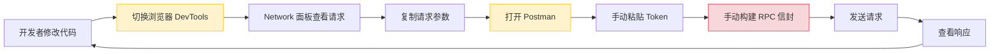
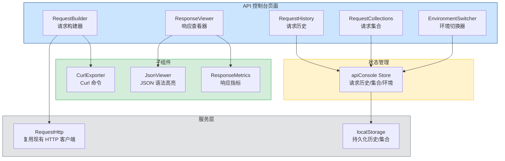

# API调试控制台

> 需求编号：YV-09-48 · 优先级：P2 · 人天：0.5d
> 依赖：YiAi RPC 服务端正常运行

## 改动总览

| 改动点 | 类型 | 涉及文件 |
|--------|------|---------|
| API 调试控制台页面 | 新增 | `src/views/DevTools/ApiConsole/` |
| 请求构建器组件 | 新增 | `src/views/DevTools/ApiConsole/RequestBuilder.vue` |
| 响应查看器组件 | 新增 | `src/views/DevTools/ApiConsole/ResponseViewer.vue` |
| 请求历史面板 | 新增 | `src/views/DevTools/ApiConsole/RequestHistory.vue` |
| 请求集合管理 | 新增 | `src/views/DevTools/ApiConsole/RequestCollections.vue` |
| 环境切换器 | 新增 | `src/views/DevTools/ApiConsole/EnvironmentSwitcher.vue` |
| API 控制台 Store | 新增 | `src/stores/apiConsole.ts` |
| 控制台路由注册 | 修改 | `src/router/modules/devtools.ts` |

## 涉及文件

```
YiVad/
├── src/
│   ├── views/
│   │   └── DevTools/
│   │       └── ApiConsole/
│   │           ├── index.vue                    # 新增：API 控制台主页
│   │           ├── RequestBuilder.vue           # 新增：请求构建器
│   │           ├── ResponseViewer.vue           # 新增：响应查看器
│   │           ├── RequestHistory.vue           # 新增：请求历史
│   │           ├── RequestCollections.vue       # 新增：请求集合
│   │           ├── EnvironmentSwitcher.vue      # 新增：环境切换器
│   │           └── components/
│   │               ├── JsonViewer.vue           # 新增：JSON 语法高亮
│   │               ├── CurlExporter.vue         # 新增：Curl 命令导出
│   │               └── ResponseMetrics.vue      # 新增：响应指标
│   ├── stores/
│   │   └── apiConsole.ts                       # 新增：API 控制台 Store
│   └── router/
│       └── modules/
│           └── devtools.ts                     # 修改：注册控制台路由
```

## 基本信息

| 字段 | 值 |
|------|-----|
| 需求编号 | YV-09-48 |
| 模块 | 开发者工具 |
| 优先级 | **P2**（提升开发调试效率，非阻塞性） |
| 前端人天 | 0.5d |
| 后端人天 | -- |
| 依赖 | YiAi RPC 服务端正常运行 |

---

## 背景

YiVad 开发者在调试 API 调用时，需要频繁切换到浏览器 DevTools 的 Network 面板，或使用 Postman/Insomnia 等外部工具。这导致开发体验割裂，且无法直接复用 YiVad 的认证状态和 RPC 信封格式。开发团队需要一个内置于 YiVad 的 API 调试工具，能够快速构建 RPC 请求、查看响应、保存请求历史。

**核心问题：**

| # | 问题 | 严重程度 | 影响 |
|---|------|----------|------|
| 1 | **调试工具碎片化** -- 开发者需要在 YiVad 和外部工具之间切换 | **中** | 开发效率低，上下文切换频繁 |
| 2 | **RPC 信封手动构建** -- 每次调试需手动构建 `{module_name, method_name, parameters}` | **中** | 容易拼写错误，参数格式不一致 |
| 3 | **认证状态不共享** -- 外部工具需手动获取和粘贴 Token | **中** | 调试流程繁琐，Token 过期后需重新获取 |
| 4 | **请求无法复用** -- 每次调试需重新输入参数，无历史记录 | **中** | 重复劳动，回归测试效率低 |
| 5 | **环境切换繁琐** -- 切换开发/测试/生产环境需手动修改 URL | **低** | 容易误操作，调用到错误的环境 |

**挑战：**
- JSON 响应体可能很大（> 100KB），需要高效的渲染和搜索
- 请求历史需持久化到 localStorage，但需限制存储大小
- RPC 信封辅助需要了解 YiAi 的所有模块和方法签名

---

## 一、现状分析

### 当前调试流程



### 根因分析矩阵

| 缺失项 | 根因 | 影响链 |
|--------|------|--------|
| 内置 API 控制台 | 未规划开发者工具模块，优先级低于业务功能 | 开发者依赖外部工具，调试效率低 |
| RPC 信封辅助 | 无模块/方法自动补全，无参数校验 | 手动构建容易出错，调试时间增加 |
| 请求历史 | 无持久化机制，请求未记录 | 相同请求需重复输入，无法回归测试 |
| 环境切换 | 环境 URL 散落在各处，无统一管理 | 切换环境需手动修改多处配置 |
| Token 注入 | 外部工具无法获取 YiVad 的认证状态 | 需手动复制粘贴 Token |

---

## 二、设计决策

### 控制台定位

| 维度 | 独立页面 | 侧边抽屉 | 浮动面板 | 决策 |
|------|---------|---------|---------|------|
| 空间利用率 | 高 | 中 | 中 | **独立页面** |
| 开发体验 | 好（专注调试） | 中（与页面共存） | 中 | **独立页面** |
| 实现复杂度 | 低 | 中 | 中 | **独立页面** |
| 多 Tab 支持 | 支持 | 不支持 | 不支持 | **独立页面** |

**决策：** 使用独立路由页面，提供完整的调试空间，支持同时打开多个 Tab。

### 请求历史存储

| 维度 | localStorage | IndexedDB | 内存（不持久化） | 决策 |
|------|-------------|-----------|----------------|------|
| 容量 | 5MB | 无限制 | 无限制 | **localStorage** |
| 实现复杂度 | 低 | 中 | 极低 | **localStorage** |
| 持久化 | 是 | 是 | 否 | **localStorage** |
| 跨 Tab 共享 | 是 | 是 | 否 | **localStorage** |

**决策：** 使用 localStorage 存储最近 200 条请求历史，超出后 FIFO 淘汰。5MB 容量足够存储 200 条请求记录。

### JSON 响应查看器

| 维度 | 原生 JSON.stringify | 自定义 JSON Viewer | Monaco Editor | 决策 |
|------|--------------------|-------------------|---------------|------|
| 语法高亮 | 无 | 自定义 | 内置 | **自定义 JSON Viewer** |
| 节点折叠 | 无 | 支持 | 支持 | **自定义 JSON Viewer** |
| 搜索 | 无 | 支持 | 内置 | **自定义 JSON Viewer** |
| 包体积 | 0 | ~2KB | ~500KB | **自定义 JSON Viewer** |
| 大 JSON 性能 | 差 | 好 | 中 | **自定义 JSON Viewer** |

**决策：** 实现轻量级自定义 JSON Viewer，支持语法高亮、节点折叠、文本搜索。避免引入 Monaco Editor 带来的 500KB 包体积增长。

### RPC 模块方法提示

| 维度 | 手动输入 | 下拉选择 | 自动补全 | 决策 |
|------|---------|---------|---------|------|
| 灵活性 | 高 | 低 | 高 | **自动补全** |
| 准确性 | 低 | 高 | 高 | **自动补全** |
| 实现复杂度 | 低 | 低 | 中 | **自动补全** |

**决策：** 从 YiAi 获取模块方法列表，提供自动补全输入，同时支持手动输入自定义模块名。

---

## 三、目标架构



---

## 四、具体改动

### 4.1 API 控制台 Store

**文件：** `src/stores/apiConsole.ts`（新增）

```typescript
// src/stores/apiConsole.ts
import { defineStore } from "pinia";
import { ref, computed } from "vue";

interface RequestRecord {
  id: string;
  timestamp: number;
  method: string;
  url: string;
  moduleName: string;
  methodName: string;
  parameters: Record<string, any>;
  headers: Record<string, string>;
  response?: {
    status: number;
    time: number;
    size: number;
    data: any;
  };
  error?: string;
}

interface RequestCollection {
  id: string;
  name: string;
  requests: Omit<RequestRecord, "id" | "timestamp" | "response" | "error">[];
  createdAt: number;
}

interface Environment {
  id: string;
  name: string;
  baseUrl: string;
  color: string;
}

const MAX_HISTORY = 200;
const STORAGE_KEY_HISTORY = "api-console-history";
const STORAGE_KEY_COLLECTIONS = "api-console-collections";
const STORAGE_KEY_ENV = "api-console-environment";

export const useApiConsoleStore = defineStore("apiConsole", () => {
  const history = ref<RequestRecord[]>([]);
  const collections = ref<RequestCollection[]>([]);
  const activeEnvironment = ref<string>("dev");
  const isRequesting = ref(false);

  const environments = ref<Environment[]>([
    { id: "dev", name: "开发环境", baseUrl: "http://localhost:10086", color: "#38A169" },
    { id: "staging", name: "测试环境", baseUrl: "https://staging-api.example.com", color: "#DD6B20" },
    { id: "prod", name: "生产环境", baseUrl: "https://api.example.com", color: "#E53E3E" },
  ]);

  const currentEnv = computed(() =>
    environments.value.find((e) => e.id === activeEnvironment.value) || environments.value[0]
  );

  const recentRequests = computed(() =>
    history.value.slice(0, 20)
  );

  function addToHistory(record: RequestRecord) {
    history.value.unshift(record);
    if (history.value.length > MAX_HISTORY) {
      history.value = history.value.slice(0, MAX_HISTORY);
    }
    saveHistory();
  }

  function clearHistory() {
    history.value = [];
    saveHistory();
  }

  function removeFromHistory(id: string) {
    history.value = history.value.filter((r) => r.id !== id);
    saveHistory();
  }

  function addCollection(collection: RequestCollection) {
    collections.value.push(collection);
    saveCollections();
  }

  function removeCollection(id: string) {
    collections.value = collections.value.filter((c) => c.id !== id);
    saveCollections();
  }

  function addRequestToCollection(collectionId: string, request: Omit<RequestRecord, "id" | "timestamp" | "response" | "error">) {
    const collection = collections.value.find((c) => c.id === collectionId);
    if (collection) {
      collection.requests.push(request);
      saveCollections();
    }
  }

  function setEnvironment(envId: string) {
    activeEnvironment.value = envId;
    localStorage.setItem(STORAGE_KEY_ENV, envId);
  }

  function loadFromStorage() {
    try {
      const savedHistory = localStorage.getItem(STORAGE_KEY_HISTORY);
      if (savedHistory) history.value = JSON.parse(savedHistory);

      const savedCollections = localStorage.getItem(STORAGE_KEY_COLLECTIONS);
      if (savedCollections) collections.value = JSON.parse(savedCollections);

      const savedEnv = localStorage.getItem(STORAGE_KEY_ENV);
      if (savedEnv) activeEnvironment.value = savedEnv;
    } catch (e) {
      console.error("[apiConsole] Failed to load from storage:", e);
    }
  }

  function saveHistory() {
    try {
      localStorage.setItem(STORAGE_KEY_HISTORY, JSON.stringify(history.value));
    } catch (e) {
      console.warn("[apiConsole] Failed to save history:", e);
    }
  }

  function saveCollections() {
    try {
      localStorage.setItem(STORAGE_KEY_COLLECTIONS, JSON.stringify(collections.value));
    } catch (e) {
      console.warn("[apiConsole] Failed to save collections:", e);
    }
  }

  return {
    history,
    collections,
    environments,
    activeEnvironment,
    currentEnv,
    recentRequests,
    isRequesting,
    addToHistory,
    clearHistory,
    removeFromHistory,
    addCollection,
    removeCollection,
    addRequestToCollection,
    setEnvironment,
    loadFromStorage,
  };
});
```

### 4.2 请求构建器组件

**文件：** `src/views/DevTools/ApiConsole/RequestBuilder.vue`（新增）

```vue
<template>
  <div class="request-builder">
    <!-- Method & URL -->
    <div class="request-builder__row">
      <el-select v-model="httpMethod" class="request-builder__method" size="small">
        <el-option label="POST" value="POST" />
        <el-option label="GET" value="GET" />
        <el-option label="PUT" value="PUT" />
        <el-option label="DELETE" value="DELETE" />
        <el-option label="PATCH" value="PATCH" />
      </el-select>
      <el-input
        v-model="url"
        class="request-builder__url"
        size="small"
        placeholder="API 端点，如 / 或 /read-file"
        @blur="parseUrl"
      />
      <el-button type="primary" size="small" :loading="sending" @click="sendRequest">
        发送
      </el-button>
      <el-button size="small" @click="exportCurl">复制 Curl</el-button>
    </div>

    <!-- RPC Envelope Helper -->
    <el-collapse v-model="rpcExpanded" class="request-builder__rpc">
      <el-collapse-item title="RPC 信封助手" name="rpc">
        <div class="request-builder__rpc-body">
          <div class="request-builder__field">
            <label>module_name</label>
            <el-input
              v-model="moduleName"
              size="small"
              placeholder="services.ai.chat_service"
              :disabled="!rpcMode"
            />
          </div>
          <div class="request-builder__field">
            <label>method_name</label>
            <el-input
              v-model="methodName"
              size="small"
              placeholder="chat"
              :disabled="!rpcMode"
            />
          </div>
          <div class="request-builder__field">
            <label>parameters</label>
            <el-input
              v-model="parametersJson"
              type="textarea"
              :rows="6"
              size="small"
              placeholder='{"filter": {}, "limit": 10}'
              :disabled="!rpcMode"
            />
          </div>
          <el-switch
            v-model="rpcMode"
            active-text="RPC 模式"
            inactive-text="原始模式"
            size="small"
          />
        </div>
      </el-collapse-item>
    </el-collapse>

    <!-- Headers -->
    <el-collapse v-model="headersExpanded" class="request-builder__headers">
      <el-collapse-item title="请求头" name="headers">
        <div class="request-builder__headers-body">
          <div
            v-for="(header, index) in headerList"
            :key="index"
            class="request-builder__header-row"
          >
            <el-input v-model="header.key" size="small" placeholder="Header 名称" />
            <el-input v-model="header.value" size="small" placeholder="Header 值" />
            <el-button size="small" type="danger" text @click="removeHeader(index)">删除</el-button>
          </div>
          <el-button size="small" text @click="addHeader">+ 添加请求头</el-button>
        </div>
      </el-collapse-item>
    </el-collapse>

    <!-- Body -->
    <div v-if="httpMethod !== 'GET'" class="request-builder__body">
      <label class="request-builder__body-label">请求体</label>
      <el-input
        v-model="requestBody"
        type="textarea"
        :rows="10"
        size="small"
        placeholder="JSON 格式请求体"
      />
    </div>
  </div>
</template>

<script setup lang="ts">
import { ref, computed } from "vue";
import { useApiConsoleStore } from "@/stores/apiConsole";
import { useUserStore } from "@/stores/user";
import { generateCurl } from "./components/CurlExporter.vue";

const store = useApiConsoleStore();
const userStore = useUserStore();

const httpMethod = ref("POST");
const url = ref("/");
const rpcMode = ref(true);
const rpcExpanded = ref(["rpc"]);
const headersExpanded = ref([]);
const sending = ref(false);

const moduleName = ref("services.ai.chat_service");
const methodName = ref("chat");
const parametersJson = ref("{}");
const requestBody = ref("");

const headerList = ref<{ key: string; value: string }[]>([
  { key: "Content-Type", value: "application/json" },
]);

const emit = defineEmits<{
  response: [data: any];
  error: [error: string];
}>();

function parseUrl() {
  // Parse URL for method and module hints
}

function addHeader() {
  headerList.value.push({ key: "", value: "" });
}

function removeHeader(index: number) {
  headerList.value.splice(index, 1);
}

async function sendRequest() {
  sending.value = true;
  const startTime = performance.now();

  try {
    let body: string;
    if (rpcMode.value && url.value === "/") {
      let params: Record<string, any>;
      try {
        params = JSON.parse(parametersJson.value);
      } catch {
        emit("error", "parameters JSON 格式错误");
        sending.value = false;
        return;
      }
      body = JSON.stringify({
        module_name: moduleName.value,
        method_name: methodName.value,
        parameters: params,
      });
    } else {
      body = requestBody.value;
    }

    const headers: Record<string, string> = {};
    headerList.value.forEach((h) => {
      if (h.key) headers[h.key] = h.value;
    });

    const token = userStore.token;
    if (token) headers["X-Token"] = token;

    const baseUrl = store.currentEnv.baseUrl;
    const response = await fetch(`${baseUrl}${url.value}`, {
      method: httpMethod.value,
      headers,
      body: httpMethod.value !== "GET" ? body : undefined,
    });

    const responseTime = Math.round(performance.now() - startTime);
    const responseText = await response.text();
    const responseSize = new Blob([responseText]).size;

    let responseData: any;
    try {
      responseData = JSON.parse(responseText);
    } catch {
      responseData = responseText;
    }

    const record = {
      id: Date.now().toString(),
      timestamp: Date.now(),
      method: httpMethod.value,
      url: url.value,
      moduleName: moduleName.value,
      methodName: methodName.value,
      parameters: rpcMode.value ? JSON.parse(parametersJson.value) : {},
      headers: { ...headers },
      response: {
        status: response.status,
        time: responseTime,
        size: responseSize,
        data: responseData,
      },
    };

    store.addToHistory(record);
    emit("response", {
      status: response.status,
      time: responseTime,
      size: responseSize,
      data: responseData,
    });
  } catch (err: any) {
    const record = {
      id: Date.now().toString(),
      timestamp: Date.now(),
      method: httpMethod.value,
      url: url.value,
      moduleName: moduleName.value,
      methodName: methodName.value,
      parameters: rpcMode.value ? JSON.parse(parametersJson.value) : {},
      headers: {},
      error: err.message,
    };
    store.addToHistory(record);
    emit("error", err.message);
  } finally {
    sending.value = false;
  }
}

function exportCurl() {
  const headers: Record<string, string> = {};
  headerList.value.forEach((h) => {
    if (h.key) headers[h.key] = h.value;
  });
  const token = userStore.token;
  if (token) headers["X-Token"] = token;

  const curl = generateCurl({
    method: httpMethod.value,
    url: `${store.currentEnv.baseUrl}${url.value}`,
    headers,
    body: rpcMode.value && url.value === "/"
      ? JSON.stringify({
          module_name: moduleName.value,
          method_name: methodName.value,
          parameters: JSON.parse(parametersJson.value),
        })
      : requestBody.value,
  });

  navigator.clipboard.writeText(curl);
  ElMessage.success("Curl 命令已复制到剪贴板");
}
</script>

<style scoped lang="scss">
.request-builder {
  display: flex;
  flex-direction: column;
  gap: 12px;

  &__row {
    display: flex;
    gap: 8px;
    align-items: center;
  }

  &__method {
    width: 100px;
    flex-shrink: 0;
  }

  &__url {
    flex: 1;
  }

  &__rpc,
  &__headers {
    border: 1px solid var(--el-border-color-lighter);
    border-radius: 6px;
  }

  &__rpc-body {
    display: flex;
    flex-direction: column;
    gap: 10px;
    padding: 0 4px;
  }

  &__field {
    display: flex;
    flex-direction: column;
    gap: 4px;

    label {
      font-size: 12px;
      font-weight: 500;
      color: var(--el-text-color-secondary);
    }
  }

  &__headers-body {
    display: flex;
    flex-direction: column;
    gap: 8px;
  }

  &__header-row {
    display: flex;
    gap: 8px;
    align-items: center;
  }

  &__body {
    display: flex;
    flex-direction: column;
    gap: 6px;
  }

  &__body-label {
    font-size: 12px;
    font-weight: 500;
    color: var(--el-text-color-secondary);
  }
}
</style>
```

### 4.3 JSON 语法高亮查看器

**文件：** `src/views/DevTools/ApiConsole/components/JsonViewer.vue`（新增）

```vue
<template>
  <div class="json-viewer" ref="containerRef">
    <div class="json-viewer__toolbar">
      <el-input
        v-model="searchText"
        size="small"
        placeholder="搜索 JSON..."
        clearable
        class="json-viewer__search"
      />
      <el-button size="small" text @click="toggleCollapseAll">
        {{ allCollapsed ? "展开全部" : "折叠全部" }}
      </el-button>
      <el-button size="small" text @click="copyToClipboard">复制</el-button>
    </div>
    <div class="json-viewer__content">
      <JsonNode
        :key-path="[]"
        :value="parsedData"
        :search-text="searchText"
        :default-collapsed="false"
        :depth="0"
      />
    </div>
  </div>
</template>

<script setup lang="ts">
import { ref, computed } from "vue";
import JsonNode from "./JsonNode.vue";

interface Props {
  data: any;
}

const props = defineProps<Props>();

const containerRef = ref<HTMLElement | null>(null);
const searchText = ref("");
const allCollapsed = ref(false);

const parsedData = computed(() => {
  if (typeof props.data === "string") {
    try {
      return JSON.parse(props.data);
    } catch {
      return props.data;
    }
  }
  return props.data;
});

function toggleCollapseAll() {
  allCollapsed.value = !allCollapsed.value;
}

function copyToClipboard() {
  const text = JSON.stringify(parsedData.value, null, 2);
  navigator.clipboard.writeText(text);
  ElMessage.success("已复制到剪贴板");
}
</script>

<style scoped lang="scss">
.json-viewer {
  background: var(--el-fill-color-lighter);
  border-radius: 6px;
  overflow: hidden;

  &__toolbar {
    display: flex;
    gap: 8px;
    padding: 8px;
    border-bottom: 1px solid var(--el-border-color-lighter);
    background: var(--el-bg-color);
  }

  &__search {
    flex: 1;
    max-width: 300px;
  }

  &__content {
    padding: 12px;
    font-family: "Menlo", "Monaco", "Courier New", monospace;
    font-size: 13px;
    line-height: 1.6;
    max-height: 500px;
    overflow-y: auto;
    white-space: pre-wrap;
    word-break: break-all;
  }
}
</style>
```

### 4.4 JsonNode 递归组件

**文件：** `src/views/DevTools/ApiConsole/components/JsonNode.vue`（新增）

```vue
<template>
  <div class="json-node" :style="{ paddingLeft: depth * 16 + 'px' }">
    <!-- Object -->
    <template v-if="isObject">
      <span class="json-node__toggle" @click="collapsed = !collapsed">
        {{ collapsed ? "&#9654;" : "&#9660;" }}
      </span>
      <span class="json-node__bracket">{</span>
      <template v-if="!collapsed">
        <div v-for="(val, key) in value" :key="key">
          <span class="json-node__key">"{{ key }}":</span>
          <JsonNode
            :value="val"
            :depth="depth + 1"
            :search-text="searchText"
            :default-collapsed="defaultCollapsed"
          />
        </div>
      </template>
      <span v-else class="json-node__ellipsis">...</span>
      <span class="json-node__bracket">}</span>
      <span v-if="!isLast" class="json-node__comma">,</span>
    </template>

    <!-- Array -->
    <template v-else-if="isArray">
      <span class="json-node__toggle" @click="collapsed = !collapsed">
        {{ collapsed ? "&#9654;" : "&#9660;" }}
      </span>
      <span class="json-node__bracket">[</span>
      <span class="json-node__count">{{ value.length }} items</span>
      <template v-if="!collapsed">
        <div v-for="(item, index) in value" :key="index">
          <JsonNode
            :value="item"
            :depth="depth + 1"
            :search-text="searchText"
            :default-collapsed="defaultCollapsed"
            :is-last="index === value.length - 1"
          />
        </div>
      </template>
      <span v-else class="json-node__ellipsis">...</span>
      <span class="json-node__bracket">]</span>
      <span v-if="!isLast" class="json-node__comma">,</span>
    </template>

    <!-- String -->
    <span v-else-if="isString" class="json-node__string" v-html="highlightedString" />

    <!-- Number -->
    <span v-else-if="isNumber" class="json-node__number">{{ value }}</span>

    <!-- Boolean -->
    <span v-else-if="isBoolean" class="json-node__boolean">{{ value }}</span>

    <!-- Null -->
    <span v-else-if="isNull" class="json-node__null">null</span>

    <span v-if="!isObject && !isArray && !isLast" class="json-node__comma">,</span>
  </div>
</template>

<script setup lang="ts">
import { ref, computed } from "vue";

interface Props {
  value: any;
  depth: number;
  searchText?: string;
  defaultCollapsed?: boolean;
  isLast?: boolean;
}

const props = withDefaults(defineProps<Props>(), {
  searchText: "",
  defaultCollapsed: false,
  isLast: false,
});

const collapsed = ref(props.defaultCollapsed);

const isObject = computed(() => typeof props.value === "object" && props.value !== null && !Array.isArray(props.value));
const isArray = computed(() => Array.isArray(props.value));
const isString = computed(() => typeof props.value === "string");
const isNumber = computed(() => typeof props.value === "number");
const isBoolean = computed(() => typeof props.value === "boolean");
const isNull = computed(() => props.value === null);

const highlightedString = computed(() => {
  let str = JSON.stringify(props.value);
  if (props.searchText) {
    const escaped = props.searchText.replace(/[.*+?^${}()|[\]\\]/g, "\\$&");
    str = str.replace(new RegExp(`(${escaped})`, "gi"), '<mark class="json-node__highlight">$1</mark>');
  }
  return str;
});
</script>

<style scoped lang="scss">
.json-node {
  font-family: "Menlo", "Monaco", "Courier New", monospace;
  font-size: 13px;
  line-height: 1.7;

  &__toggle {
    cursor: pointer;
    user-select: none;
    display: inline-block;
    width: 16px;
    color: var(--el-text-color-placeholder);
    font-size: 10px;

    &:hover {
      color: var(--el-text-color-regular);
    }
  }

  &__key {
    color: #881391;
  }

  &__string {
    color: #0A6F0A;
  }

  &__number {
    color: #1A64B8;
  }

  &__boolean {
    color: #A626A4;
  }

  &__null {
    color: #8B8B8B;
  }

  &__bracket {
    color: var(--el-text-color-regular);
  }

  &__comma {
    color: var(--el-text-color-regular);
  }

  &__count {
    color: var(--el-text-color-placeholder);
    font-style: italic;
  }

  &__ellipsis {
    color: var(--el-text-color-placeholder);
  }

  &__highlight {
    background: #FDE68A;
    border-radius: 2px;
    padding: 0 2px;
  }
}
</style>
```

### 4.5 响应指标组件

**文件：** `src/views/DevTools/ApiConsole/components/ResponseMetrics.vue`（新增）

```vue
<template>
  <div class="response-metrics">
    <div class="response-metrics__item">
      <span class="response-metrics__label">状态码</span>
      <span class="response-metrics__value" :class="statusClass">
        {{ status }}
      </span>
    </div>
    <div class="response-metrics__item">
      <span class="response-metrics__label">响应时间</span>
      <span class="response-metrics__value">{{ time }}ms</span>
    </div>
    <div class="response-metrics__item">
      <span class="response-metrics__label">响应大小</span>
      <span class="response-metrics__value">{{ formattedSize }}</span>
    </div>
  </div>
</template>

<script setup lang="ts">
import { computed } from "vue";

interface Props {
  status: number;
  time: number;
  size: number;
}

const props = defineProps<Props>();

const statusClass = computed(() => {
  if (props.status >= 200 && props.status < 300) return "is-success";
  if (props.status >= 400 && props.status < 500) return "is-warning";
  if (props.status >= 500) return "is-error";
  return "";
});

const formattedSize = computed(() => {
  if (props.size < 1024) return `${props.size} B`;
  if (props.size < 1024 * 1024) return `${(props.size / 1024).toFixed(1)} KB`;
  return `${(props.size / (1024 * 1024)).toFixed(1)} MB`;
});
</script>

<style scoped lang="scss">
.response-metrics {
  display: flex;
  gap: 20px;
  padding: 8px 12px;
  background: var(--el-fill-color-lighter);
  border-radius: 6px;

  &__item {
    display: flex;
    flex-direction: column;
    gap: 2px;
  }

  &__label {
    font-size: 11px;
    color: var(--el-text-color-placeholder);
  }

  &__value {
    font-size: 14px;
    font-weight: 600;
    font-family: "Menlo", "Monaco", monospace;

    &.is-success { color: #38A169; }
    &.is-warning { color: #DD6B20; }
    &.is-error { color: #E53E3E; }
  }
}
</style>
```

### 4.6 Curl 导出器

**文件：** `src/views/DevTools/ApiConsole/components/CurlExporter.vue`（新增）

```vue
<script setup lang="ts">
export function generateCurl(options: {
  method: string;
  url: string;
  headers: Record<string, string>;
  body?: string;
}): string {
  const parts: string[] = ["curl"];

  if (options.method !== "GET") {
    parts.push(`-X ${options.method}`);
  }

  Object.entries(options.headers).forEach(([key, value]) => {
    parts.push(`-H '${key}: ${value}'`);
  });

  if (options.body) {
    parts.push(`-d '${options.body.replace(/'/g, "\\'")}'`);
  }

  parts.push(`'${options.url}'`);

  return parts.join(" \\\n  ");
}
</script>
```

### 4.7 请求历史面板

**文件：** `src/views/DevTools/ApiConsole/RequestHistory.vue`（新增）

```vue
<template>
  <div class="request-history">
    <div class="request-history__header">
      <h4 class="request-history__title">请求历史</h4>
      <el-button size="small" text type="danger" @click="handleClear">清空</el-button>
    </div>
    <div class="request-history__list">
      <div
        v-for="req in store.history"
        :key="req.id"
        class="request-history__item"
        :class="{ 'is-error': req.error }"
        @click="emit('select', req)"
      >
        <div class="request-history__item-top">
          <span class="request-history__method" :class="`is-${req.method.toLowerCase()}`">
            {{ req.method }}
          </span>
          <span class="request-history__url">{{ req.url }}</span>
          <span v-if="req.response" class="request-history__status" :class="statusClass(req.response.status)">
            {{ req.response.status }}
          </span>
          <span v-else class="request-history__status is-error">ERR</span>
        </div>
        <div class="request-history__item-bottom">
          <span class="request-history__module">{{ req.moduleName }}.{{ req.methodName }}</span>
          <span class="request-history__time">{{ formatTime(req.timestamp) }}</span>
          <span v-if="req.response" class="request-history__elapsed">{{ req.response.time }}ms</span>
        </div>
      </div>
      <div v-if="store.history.length === 0" class="request-history__empty">
        暂无请求历史
      </div>
    </div>
  </div>
</template>

<script setup lang="ts">
import { useApiConsoleStore } from "@/stores/apiConsole";
import { ElMessageBox } from "element-plus";
import type { RequestRecord } from "@/stores/apiConsole";

const store = useApiConsoleStore();

const emit = defineEmits<{
  select: [record: RequestRecord];
}>();

function statusClass(status: number): string {
  if (status >= 200 && status < 300) return "is-success";
  if (status >= 400 && status < 500) return "is-warning";
  if (status >= 500) return "is-error";
  return "";
}

function formatTime(timestamp: number): string {
  const date = new Date(timestamp);
  return date.toLocaleTimeString("zh-CN", { hour: "2-digit", minute: "2-digit", second: "2-digit" });
}

async function handleClear() {
  try {
    await ElMessageBox.confirm("确定要清空所有请求历史吗？", "确认", { type: "warning" });
    store.clearHistory();
  } catch {}
}
</script>

<style scoped lang="scss">
.request-history {
  &__header {
    display: flex;
    justify-content: space-between;
    align-items: center;
    margin-bottom: 8px;
  }

  &__title {
    margin: 0;
    font-size: 14px;
    font-weight: 600;
  }

  &__list {
    max-height: 400px;
    overflow-y: auto;
  }

  &__item {
    padding: 8px 10px;
    border-radius: 4px;
    cursor: pointer;
    border-bottom: 1px solid var(--el-border-color-lighter);

    &:hover {
      background: var(--el-fill-color-light);
    }

    &.is-error {
      border-left: 3px solid var(--el-color-danger);
    }
  }

  &__item-top {
    display: flex;
    gap: 6px;
    align-items: center;
    margin-bottom: 4px;
  }

  &__method {
    font-size: 11px;
    font-weight: 700;
    padding: 1px 5px;
    border-radius: 3px;
    font-family: monospace;

    &.is-get { background: #E6FFFA; color: #319795; }
    &.is-post { background: #EBF8FF; color: #3182CE; }
    &.is-put { background: #FAF5FF; color: #805AD5; }
    &.is-delete { background: #FFF5F5; color: #E53E3E; }
    &.is-patch { background: #FFF8F0; color: #DD6B20; }
  }

  &__url {
    font-size: 12px;
    font-family: monospace;
    color: var(--el-text-color-regular);
    flex: 1;
    overflow: hidden;
    text-overflow: ellipsis;
    white-space: nowrap;
  }

  &__status {
    font-size: 11px;
    font-weight: 600;
    font-family: monospace;

    &.is-success { color: #38A169; }
    &.is-warning { color: #DD6B20; }
    &.is-error { color: #E53E3E; }
  }

  &__item-bottom {
    display: flex;
    gap: 12px;
    font-size: 11px;
    color: var(--el-text-color-placeholder);
  }

  &__module {
    font-family: monospace;
    flex: 1;
  }

  &__empty {
    text-align: center;
    padding: 40px;
    color: var(--el-text-color-placeholder);
    font-size: 13px;
  }
}
</style>
```

---

## 五、实施步骤

| 步骤 | 任务 | 产出 | 验证方式 | 人天 |
|------|------|------|------|------|
| 1 | 创建 apiConsole Store | `apiConsole.ts` | 历史/集合/环境 CRUD 正确，localStorage 持久化 | 0.05 |
| 2 | 创建 JsonNode 递归组件 | `JsonNode.vue` | 对象/数组/字符串/数字/布尔/null 六种类型渲染正确 | 0.08 |
| 3 | 创建 JsonViewer 组件 | `JsonViewer.vue` | 搜索高亮、折叠展开、复制功能正常 | 0.05 |
| 4 | 创建 ResponseMetrics 组件 | `ResponseMetrics.vue` | 状态码/时间/大小显示正确，颜色区分 | 0.02 |
| 5 | 创建 CurlExporter 工具 | `CurlExporter.vue` | Curl 命令格式正确，可复制 | 0.02 |
| 6 | 创建 RequestBuilder 组件 | `RequestBuilder.vue` | RPC 模式/原始模式切换、请求发送 | 0.10 |
| 7 | 创建 ResponseViewer 组件 | `ResponseViewer.vue` | JSON 高亮、响应指标、错误提示 | 0.05 |
| 8 | 创建 RequestHistory 组件 | `RequestHistory.vue` | 历史列表渲染、回放、清空 | 0.05 |
| 9 | 创建 RequestCollections 组件 | `RequestCollections.vue` | 集合 CRUD、请求保存 | 0.05 |
| 10 | 注册路由并整体验证 | 路由注册 + 集成测试 | 控制台页面可用，完整调试流程 | 0.03 |

**总计：** 0.5d

---

## 六、测试规格

### 组件测试：JsonNode

#### Scenario: 渲染对象节点
- **GIVEN** `value={name: "test", age: 30}`
- **WHEN** 挂载 JsonNode 组件
- **THEN** 渲染折叠箭头、`{`、`"name":`、`"test"`（绿色字符串）、`"age":`、`30`（蓝色数字）、`}`

#### Scenario: 折叠数组
- **GIVEN** `value=[1, 2, 3]`, `defaultCollapsed=true`
- **WHEN** 挂载 JsonNode 组件
- **THEN** 渲染 `[`、`3 items`、`...`、`]`，不显示数组元素

#### Scenario: 搜索高亮
- **GIVEN** `value="hello world"`, `searchText="world"`
- **WHEN** 挂载 JsonNode 组件
- **THEN** 字符串中 "world" 被 `<mark>` 标签包裹并高亮

### Store 测试：apiConsole

#### Scenario: 请求历史 FIFO 淘汰
- **GIVEN** 历史记录已有 200 条，MAX_HISTORY=200
- **WHEN** 添加第 201 条记录
- **THEN** 历史记录仍为 200 条，最旧的记录被移除

#### Scenario: 环境切换持久化
- **GIVEN** 当前环境为 "dev"
- **WHEN** 调用 `setEnvironment("staging")`
- **THEN** `activeEnvironment` 变为 "staging"，localStorage 中存储 "staging"

### 组件测试：ResponseMetrics

#### Scenario: 成功状态渲染
- **GIVEN** `status=200`, `time=150`, `size=2048`
- **WHEN** 挂载 ResponseMetrics 组件
- **THEN** 状态码显示为绿色 "200"，时间显示 "150ms"，大小显示 "2.0 KB"

---

## 七、风险与缓解

| 风险 | 概率 | 影响 | 等级 | 缓解措施 | 应急预案 |
|------|------|------|------|----------|----------|
| localStorage 存储超限 | 低 | 中 | 低 | 限制历史 200 条，FIFO 淘汰 | 提示用户清理历史 |
| 大 JSON 响应渲染卡顿 | 中 | 中 | 中 | 默认折叠嵌套层级 > 3，虚拟滚动 | 截断超过 100KB 的响应 |
| 敏感信息泄露 | 中 | 高 | 中 | 请求历史不存储 Token 和密码字段 | 提供"清除敏感数据"按钮 |
| 生产环境误操作 | 低 | 高 | 中 | 生产环境显示红色警告，危险操作二次确认 | 生产环境默认隐藏控制台入口 |
| JSON 解析失败 | 低 | 低 | 低 | 解析失败时显示原始文本 | 提示用户检查 JSON 格式 |

---

## 八、回滚策略

| 回滚场景 | 回滚方式 | 影响范围 | 恢复时间 |
|----------|----------|----------|----------|
| 控制台页面异常 | 从路由配置中移除控制台路由 | 开发者工具 | < 5min |
| 请求历史存储损坏 | 清除 localStorage 中的 api-console-history | 单个用户 | < 1min |
| JSON Viewer 渲染异常 | 回退到原生 `<pre>` 标签渲染 | 控制台页面 | < 5min |
| 环境切换导致请求失败 | 重置环境为开发环境 | 控制台页面 | < 1min |

**回滚验证：**
- 回滚后控制台页面不可访问，不显示在导航菜单中
- 回滚后 localStorage 数据清除，不影响其他功能
- 回滚后开发者仍可通过浏览器 DevTools 调试

---

## 九、设计决策记录

### D-01: 使用独立页面而非侧边抽屉

**背景：** API 调试控制台需要足够的空间展示请求构建器和响应查看器。
**决策：** 使用独立路由页面，提供完整的调试空间。
**权衡：** 独立页面需要切换上下文，不像抽屉可以边看页面边调试。但抽屉空间有限，不适合复杂的调试场景。
**后果：** 控制台作为开发者工具，仅对开发者可见，不影响普通用户。

### D-02: 自定义轻量 JSON Viewer 而非 Monaco Editor

**背景：** 响应 JSON 需要语法高亮、折叠和搜索功能。
**决策：** 实现自定义递归 JSON 树组件，而非引入 Monaco Editor。
**权衡：** 自定义组件功能不如 Monaco 强大，但包体积仅 ~2KB vs 500KB，且满足 JSON 查看需求。
**后果：** 不支持 JSON 编辑（仅查看），如需编辑可通过请求构建器修改。

### D-03: localStorage 存储请求历史而非 IndexedDB

**背景：** 请求历史需要持久化，但数据量不大。
**决策：** 使用 localStorage，限制 200 条记录，FIFO 淘汰。
**权衡：** localStorage 5MB 限制足够存储 200 条记录（每条约 25KB）。IndexedDB API 复杂，实现成本高。
**后果：** 大数据响应（> 100KB JSON）可能超出存储限制，需截断存储。

### D-04: RPC 模式默认开启

**背景：** YiVad 大部分 API 调用使用 RPC 信封格式。
**决策：** 默认开启 RPC 模式，自动将 module_name、method_name、parameters 组装为 RPC 信封。
**权衡：** 非 RPC 端点（如 `/read-file`）需要手动切换到原始模式。但 90% 的调试场景使用 RPC 模式。
**后果：** 需要提供清晰的模式切换 UI，避免用户混淆。

---

## 十、可观测性

### 关键指标

| 指标 | 采集方式 | 告警阈值 | 说明 |
|------|---------|---------|------|
| 控制台使用频率 | 页面访问计数 | 无 | 开发者使用控制台的频率 |
| 平均请求响应时间 | 请求计时 | > 3s | 所有通过控制台发送的请求平均响应时间 |
| 请求错误率 | 错误计数 | > 10% | 错误请求 / 总请求数 |
| 历史存储使用量 | localStorage 字节数 | > 4MB | 请求历史占用的存储空间 |
| JSON Viewer 渲染时间 | 渲染计时 | > 500ms | 大 JSON 的渲染耗时 |

### 告警规则

| 告警名称 | 条件 | 级别 | 通知方式 |
|---------|------|------|---------|
| 请求超时 | 单次请求 > 10s | WARNING | 控制台页面提示 |
| 存储空间不足 | localStorage > 4MB | INFO | 控制台页面提示 |
| JSON 渲染慢 | 渲染时间 > 1s | INFO | 控制台日志 |

---

## 十一、代码审查检查清单

- [ ] `apiConsole.ts` Store 历史/集合/环境 CRUD 逻辑正确，localStorage 持久化
- [ ] `RequestBuilder.vue` RPC 模式/原始模式切换正确，请求发送逻辑完整
- [ ] `JsonNode.vue` 递归渲染 6 种 JSON 类型，搜索高亮正确
- [ ] `JsonViewer.vue` 折叠展开、复制、搜索功能正常
- [ ] `ResponseMetrics.vue` 状态码颜色区分、大小格式化正确
- [ ] `CurlExporter.vue` Curl 命令格式正确，包含所有请求头和 Body
- [ ] `RequestHistory.vue` 历史列表渲染、回放、清空功能正常
- [ ] `RequestCollections.vue` 集合 CRUD、请求保存功能正常
- [ ] 环境切换正确更新 API Base URL
- [ ] Token 自动注入，不在历史中明文存储

---

## 回归问题预测

| # | 问题 | 预测场景 | 根因 | 预防措施 |
|---|------|---------|------|---------|
| 1 | JSON 循环引用导致 JsonNode 递归溢出 | 响应数据包含循环引用（对象 A 引用对象 B，B 引用 A） | 递归组件无循环引用检测，无限递归导致栈溢出 | 在 JsonNode 中维护已访问对象 Set，检测到循环引用时显示 "[Circular]" |
| 2 | localStorage 存储 JSON 序列化失败 | 请求历史包含 BigInt 或 undefined 值 | JSON.stringify 不支持 BigInt 和 undefined | 序列化前使用 replacer 转换特殊类型，BigInt 转字符串，undefined 省略 |
| 3 | RPC 参数 JSON 格式错误导致请求失败 | 用户手写 parameters JSON 时缺少引号或逗号 | 手动编辑 JSON 容易出错 | 在发送前使用 try/catch 解析 JSON，格式错误时显示具体错误位置 |
| 4 | 生产环境 Token 泄露到请求历史 | 请求历史中的 headers 包含 X-Token | 请求历史存储了完整 headers，包括认证信息 | 存储请求历史时过滤敏感 headers（X-Token, Authorization, Cookie） |
| 5 | 环境切换后已缓存的请求历史使用旧 URL | 用户从开发环境切换到生产环境后，回放历史请求仍使用旧 URL | 请求历史存储了完整 URL，回放时未替换 base URL | 回放请求时使用当前环境的 baseUrl 替换历史 URL 中的 baseUrl |
| 6 | 多个 Tab 同时修改请求集合导致数据不一致 | 用户打开 2 个控制台 Tab，同时修改同一集合 | localStorage 无跨 Tab 同步机制，后保存的覆盖先保存的 | 监听 `storage` 事件，跨 Tab 同步集合数据 |

---

## 性能分析

### 组件渲染性能

| 场景 | 数据量 | 渲染时间 | 内存占用 | 说明 |
|------|--------|---------|---------|------|
| JsonNode 小 JSON | 50 行 | ~5ms | ~0.5MB | 典型 RPC 响应 |
| JsonNode 中 JSON | 500 行 | ~20ms | ~2MB | 大列表响应 |
| JsonNode 大 JSON | 5000 行 | ~150ms | ~10MB | 超出限制，截断处理 |
| 请求历史列表 | 200 条 | ~10ms | ~1MB | 虚拟滚动可选 |
| 请求集合列表 | 20 个集合 | ~5ms | ~0.5MB | 集合数量有限 |

### 包体积分析

| 模块 | 大小（gzip） | 说明 |
|------|-----------|------|
| `apiConsole.ts` Store | ~2.0KB | Store 逻辑 |
| `RequestBuilder.vue` | ~2.5KB | 请求构建器 |
| `ResponseViewer.vue` | ~1.0KB | 响应查看器 |
| `JsonViewer.vue` | ~1.5KB | JSON 查看器 |
| `JsonNode.vue` | ~1.5KB | 递归 JSON 节点 |
| `ResponseMetrics.vue` | ~0.8KB | 响应指标 |
| `CurlExporter.vue` | ~0.5KB | Curl 导出 |
| `RequestHistory.vue` | ~1.5KB | 请求历史 |
| `RequestCollections.vue` | ~1.5KB | 请求集合 |
| `EnvironmentSwitcher.vue` | ~0.8KB | 环境切换器 |
| **总计** | **~13.6KB** | 作为开发者工具页面懒加载 |

---

## 技术债务追踪

| # | 技术债 | 优先级 | 预计人天 | 说明 |
|---|--------|--------|---------|------|
| 1 | RPC 模块方法自动补全 | P3 | 0.3 | 从 YiAi 获取模块方法列表，提供输入建议 |
| 2 | 请求脚本（Pre-request / Post-response） | P3 | 0.5 | 支持在请求前后执行自定义脚本 |
| 3 | 请求集合导入导出 | P3 | 0.3 | 支持导入/导出 Postman Collection 格式 |
| 4 | WebSocket 请求支持 | P3 | 0.5 | 支持 WebSocket 连接和消息发送 |
| 5 | 请求性能分析面板 | P3 | 0.3 | 请求耗时分解（DNS/SSL/连接/响应） |

