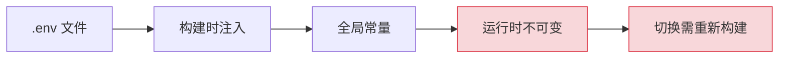
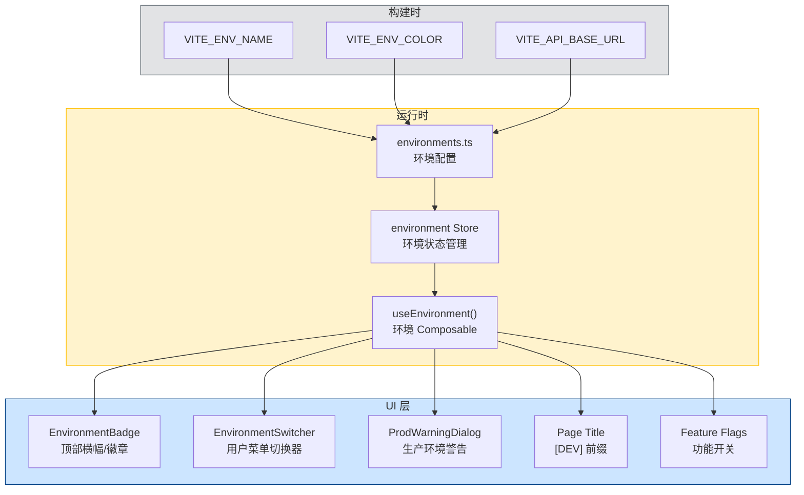

# 环境标识与切换器

> 需求编号：YV-09-49 · 优先级：P2 · 人天：0.3d
> 依赖：无（纯前端功能，可独立开发）

## 改动总览

| 改动点 | 类型 | 涉及文件 |
|--------|------|---------|
| 环境标识组件 | 新增 | `src/components/Environment/EnvironmentBadge.vue` |
| 环境切换器组件 | 新增 | `src/components/Environment/EnvironmentSwitcher.vue` |
| 环境配置 | 新增 | `src/config/environments.ts` |
| 环境 Composable | 新增 | `src/composables/useEnvironment.ts` |
| 环境 Store | 新增 | `src/stores/environment.ts` |
| 全局布局集成 | 修改 | `src/layout/components/AppHeader.vue` |
| 全局样式 | 新增 | `src/assets/styles/environment.scss` |
| 环境变量 | 修改 | `.env`, `.env.staging`, `.env.production` |
| 页面标题更新 | 新增 | `src/utils/title.ts` |

## 涉及文件

```
YiVad/
├── src/
│   ├── components/
│   │   └── Environment/
│   │       ├── EnvironmentBadge.vue          # 新增：环境标识徽章
│   │       ├── EnvironmentSwitcher.vue       # 新增：环境切换器
│   │       └── ProdWarningDialog.vue         # 新增：生产环境危险操作警告
│   ├── composables/
│   │   └── useEnvironment.ts                 # 新增：环境管理 Composable
│   ├── config/
│   │   └── environments.ts                   # 新增：环境配置
│   ├── stores/
│   │   └── environment.ts                    # 新增：环境 Store
│   ├── layout/
│   │   └── components/
│   │       └── AppHeader.vue                 # 修改：集成环境标识
│   ├── utils/
│   │   └── title.ts                          # 新增：页面标题工具
│   └── assets/
│       └── styles/
│           └── environment.scss              # 新增：环境标识样式
├── .env                                      # 修改：添加环境变量
├── .env.staging                              # 新增：测试环境变量
└── .env.production                           # 修改：添加环境变量
```

## 基本信息

| 字段 | 值 |
|------|-----|
| 需求编号 | YV-09-49 |
| 模块 | 全局基础设施 |
| 优先级 | **P2**（提升开发体验，防止生产误操作） |
| 前端人天 | 0.3d |
| 后端人天 | -- |
| 依赖 | 无 |

---

## 背景

YiVad 当前在开发、测试、生产环境中使用相同的界面外观，没有任何视觉提示告知用户当前连接的是哪个环境。这导致开发者在多个环境间切换时容易混淆，甚至有在测试环境中修改生产数据、在生产环境中执行测试操作的风险。

**核心问题：**

| # | 问题 | 严重程度 | 影响 |
|---|------|----------|------|
| 1 | **无环境标识** -- 所有环境界面完全一致，无法区分当前环境 | **高** | 开发者可能在错误的环境中执行操作，如将测试数据写入生产环境 |
| 2 | **无环境切换机制** -- 切换环境需手动修改代码或 `.env` 文件 | **中** | 开发效率低，每次切换需重新构建 |
| 3 | **生产环境无保护** -- 在生产环境中执行危险操作（删除、批量修改）无额外确认 | **高** | 误操作可能导致生产数据丢失 |
| 4 | **功能开关无环境感知** -- 测试功能在所有环境中可见或都不可见 | **中** | Beta 功能无法按环境控制可见性 |
| 5 | **错误报告缺少环境信息** -- 错误日志中无环境标识 | **低** | 排查问题时难以定位是哪个环境的问题 |

**挑战：**
- 环境切换需要持久化，刷新页面后保持当前环境选择
- 生产环境的危险操作警告需要覆盖所有可能的破坏性操作
- 环境配置需要同时支持构建时注入和运行时切换

---

## 一、现状分析

### 当前环境配置方式



### 根因分析矩阵

| 缺失项 | 根因 | 影响链 |
|--------|------|--------|
| 环境标识 | 未规划环境管理功能，界面无环境感知 | 开发者无法分辨当前环境，误操作风险高 |
| 环境切换 | 仅支持构建时环境变量，无运行时切换 | 环境切换需重新构建，开发效率低 |
| 生产保护 | 无危险操作确认机制 | 生产环境误操作无额外保护 |
| 功能开关 | 功能可见性仅通过权限控制，无环境维度 | Beta 功能无法在生产环境隐藏 |
| 环境信息 | 错误报告未包含环境字段 | 问题排查时缺少关键上下文 |

---

## 二、设计决策

### 环境标识位置

| 维度 | 顶部横幅 | 左下角浮标 | 页面标题前缀 | 用户菜单中 | 决策 |
|------|---------|-----------|------------|----------|------|
| 可见性 | 最高 | 中 | 中 | 低 | **顶部横幅** |
| 侵入性 | 中 | 低 | 低 | 最低 | **顶部横幅** |
| 误操作防护 | 强 | 弱 | 中 | 弱 | **顶部横幅** |
| 实现复杂度 | 低 | 低 | 低 | 低 | 均可 |

**决策：** 非生产环境使用顶部彩色横幅，生产环境使用页面标题前缀。顶部横幅最显眼，确保开发者时刻感知当前环境。生产环境不显示横幅以避免对终端用户造成困扰。

### 环境切换权限

| 维度 | 所有人可切换 | 仅管理员可切换 | 仅开发者可切换 | 决策 |
|------|-----------|-------------|-------------|------|
| 安全性 | 低 | 高 | 中 | **仅管理员** |
| 灵活性 | 高 | 中 | 中 | **仅管理员** |
| 实现复杂度 | 低 | 中 | 中 | 可接受 |

**决策：** 仅管理员角色可切换环境。普通用户使用构建时指定的默认环境，避免误操作。管理员通过用户菜单中的环境切换器切换。

### 环境持久化

| 维度 | 仅内存 | localStorage | sessionStorage | 决策 |
|------|--------|-------------|---------------|------|
| 跨页面刷新 | 否 | 是 | 否 | **localStorage** |
| 跨 Tab 共享 | 否 | 是 | 否 | **localStorage** |
| 安全性 | 高 | 中 | 中 | **localStorage** |
| 实现复杂度 | 低 | 低 | 低 | 持平 |

**决策：** 使用 localStorage 持久化环境选择，跨页面刷新和 Tab 均保持。环境选择不属于敏感信息，localStorage 足够安全。

### 生产环境保护策略

| 维度 | 无保护 | 确认对话框 | 双重确认 | 决策 |
|------|--------|-----------|---------|------|
| 安全性 | 最低 | 中 | 高 | **确认对话框** |
| 用户体验 | 最佳 | 中 | 差 | **确认对话框** |
| 实现复杂度 | 低 | 低 | 中 | **确认对话框** |

**决策：** 在生产环境中执行危险操作（删除、批量修改、数据导出）时弹出确认对话框，明确提示"当前为生产环境"。

---

## 三、目标架构



---

## 四、具体改动

### 4.1 环境配置

**文件：** `src/config/environments.ts`（新增）

```typescript
// src/config/environments.ts

export interface EnvironmentConfig {
  id: string;
  name: string;
  color: string;
  bgColor: string;
  textColor: string;
  apiBaseUrl: string;
  wsUrl: string;
  titlePrefix: string;
  showBanner: boolean;
  showSwitcher: boolean;
  featureFlags: Record<string, boolean>;
}

export const ENVIRONMENTS: Record<string, EnvironmentConfig> = {
  dev: {
    id: "dev",
    name: "开发环境",
    color: "#38A169",
    bgColor: "#C6F6D5",
    textColor: "#22543D",
    apiBaseUrl: import.meta.env.VITE_API_BASE_URL || "http://localhost:10086",
    wsUrl: import.meta.env.VITE_WS_URL || "ws://localhost:10086",
    titlePrefix: "[DEV]",
    showBanner: true,
    showSwitcher: true,
    featureFlags: {
      betaFeatures: true,
      devTools: true,
      debugPanel: true,
      experimentalUI: true,
    },
  },
  staging: {
    id: "staging",
    name: "测试环境",
    color: "#DD6B20",
    bgColor: "#FEEBC8",
    textColor: "#7B341E",
    apiBaseUrl: import.meta.env.VITE_STAGING_API_URL || "https://staging-api.example.com",
    wsUrl: import.meta.env.VITE_STAGING_WS_URL || "wss://staging-api.example.com",
    titlePrefix: "[STG]",
    showBanner: true,
    showSwitcher: true,
    featureFlags: {
      betaFeatures: true,
      devTools: true,
      debugPanel: false,
      experimentalUI: false,
    },
  },
  prod: {
    id: "prod",
    name: "生产环境",
    color: "#E53E3E",
    bgColor: "#FED7D7",
    textColor: "#742A2A",
    apiBaseUrl: import.meta.env.VITE_PROD_API_URL || "https://api.example.com",
    wsUrl: import.meta.env.VITE_PROD_WS_URL || "wss://api.example.com",
    titlePrefix: "",
    showBanner: false,
    showSwitcher: true,
    featureFlags: {
      betaFeatures: false,
      devTools: false,
      debugPanel: false,
      experimentalUI: false,
    },
  },
};

export const DEFAULT_ENV = (import.meta.env.VITE_ENV_NAME as string) || "dev";

export const ENV_ORDER = ["dev", "staging", "prod"] as const;

export function getEnvironmentConfig(envId: string): EnvironmentConfig {
  return ENVIRONMENTS[envId] || ENVIRONMENTS.dev;
}
```

### 4.2 环境 Store

**文件：** `src/stores/environment.ts`（新增）

```typescript
// src/stores/environment.ts
import { defineStore } from "pinia";
import { ref, computed } from "vue";
import {
  getEnvironmentConfig,
  DEFAULT_ENV,
  ENV_ORDER,
  type EnvironmentConfig,
} from "@/config/environments";
import { useUserStore } from "@/stores/user";

const STORAGE_KEY = "yivad-environment";

export const useEnvironmentStore = defineStore("environment", () => {
  const currentEnvId = ref<string>(loadSavedEnv());
  const isSwitching = ref(false);

  const currentEnv = computed<EnvironmentConfig>(() =>
    getEnvironmentConfig(currentEnvId.value)
  );

  const isProd = computed(() => currentEnvId.value === "prod");
  const isDev = computed(() => currentEnvId.value === "dev");
  const isStaging = computed(() => currentEnvId.value === "staging");

  const availableEnvs = computed(() => {
    const userStore = useUserStore();
    const isAdmin = userStore.isAdmin;
    if (isAdmin) return ENV_ORDER;
    return [currentEnvId.value];
  });

  const apiBaseUrl = computed(() => currentEnv.value.apiBaseUrl);
  const wsUrl = computed(() => currentEnv.value.wsUrl);

  const isFeatureEnabled = (flag: string): boolean => {
    return currentEnv.value.featureFlags[flag] ?? false;
  };

  function switchEnvironment(envId: string) {
    if (!ENV_ORDER.includes(envId as any)) {
      console.warn(`[environment] Unknown environment: ${envId}`);
      return;
    }
    isSwitching.value = true;
    currentEnvId.value = envId;
    localStorage.setItem(STORAGE_KEY, envId);

    // Reload the page to apply new API URLs
    setTimeout(() => {
      window.location.reload();
    }, 300);
  }

  function loadSavedEnv(): string {
    const saved = localStorage.getItem(STORAGE_KEY);
    if (saved && ENV_ORDER.includes(saved as any)) {
      return saved;
    }
    return DEFAULT_ENV;
  }

  function resetToDefault() {
    localStorage.removeItem(STORAGE_KEY);
    currentEnvId.value = DEFAULT_ENV;
  }

  return {
    currentEnvId,
    currentEnv,
    isProd,
    isDev,
    isStaging,
    availableEnvs,
    apiBaseUrl,
    wsUrl,
    isSwitching,
    isFeatureEnabled,
    switchEnvironment,
    resetToDefault,
  };
});
```

### 4.3 环境 Composable

**文件：** `src/composables/useEnvironment.ts`（新增）

```typescript
// src/composables/useEnvironment.ts
import { computed, watch, onMounted } from "vue";
import { useEnvironmentStore } from "@/stores/environment";
import { useTitle } from "@vueuse/core";

export function useEnvironment() {
  const store = useEnvironmentStore();

  const envLabel = computed(() => store.currentEnv.name);
  const envColor = computed(() => store.currentEnv.color);
  const envPrefix = computed(() => store.currentEnv.titlePrefix);

  // Update page title with environment prefix
  const title = useTitle();
  watch(
    () => store.currentEnv.titlePrefix,
    (prefix) => {
      const baseTitle = document.title.replace(/^\[(DEV|STG)\] /, "");
      title.value = prefix ? `${prefix} ${baseTitle}` : baseTitle;
    },
    { immediate: true }
  );

  function confirmDestructiveAction(action: string): Promise<boolean> {
    if (!store.isProd) return Promise.resolve(true);

    return new Promise((resolve) => {
      const confirmed = window.confirm(
        `【生产环境警告】\n\n` +
        `您正在生产环境中执行：${action}\n\n` +
        `此操作可能影响生产数据，请确认是否继续？\n\n` +
        `请输入 "CONFIRM" 以继续：`
      );

      if (!confirmed) {
        resolve(false);
        return;
      }

      const input = window.prompt("请输入 CONFIRM 以确认：");
      resolve(input === "CONFIRM");
    });
  }

  return {
    envLabel,
    envColor,
    envPrefix,
    isProd: store.isProd,
    isDev: store.isDev,
    isStaging: store.isStaging,
    isFeatureEnabled: store.isFeatureEnabled,
    switchEnvironment: store.switchEnvironment,
    confirmDestructiveAction,
  };
}
```

### 4.4 环境标识徽章组件

**文件：** `src/components/Environment/EnvironmentBadge.vue`（新增）

```vue
<template>
  <div v-if="visible" class="env-badge" :style="badgeStyle">
    <span class="env-badge__dot" :style="{ background: env.currentEnv.color }" />
    <span class="env-badge__text">{{ env.currentEnv.name }}</span>
    <span v-if="!env.isProd" class="env-badge__hint">
      当前非生产环境，数据可能被重置
    </span>
  </div>
</template>

<script setup lang="ts">
import { computed } from "vue";
import { useEnvironmentStore } from "@/stores/environment";

const env = useEnvironmentStore();

const visible = computed(() => env.currentEnv.showBanner && !env.isProd);

const badgeStyle = computed(() => ({
  "--env-bg": env.currentEnv.bgColor,
  "--env-text": env.currentEnv.textColor,
  "--env-border": env.currentEnv.color,
}));
</script>

<style scoped lang="scss">
.env-badge {
  display: flex;
  align-items: center;
  justify-content: center;
  gap: 8px;
  padding: 4px 16px;
  background: var(--env-bg);
  border-bottom: 2px solid var(--env-border);
  color: var(--env-text);
  font-size: 12px;
  font-weight: 500;
  position: sticky;
  top: 0;
  z-index: 1001;

  &__dot {
    width: 8px;
    height: 8px;
    border-radius: 50%;
    flex-shrink: 0;
  }

  &__text {
    font-weight: 600;
  }

  &__hint {
    opacity: 0.7;
    font-size: 11px;
  }
}
</style>
```

### 4.5 环境切换器组件

**文件：** `src/components/Environment/EnvironmentSwitcher.vue`（新增）

```vue
<template>
  <div class="env-switcher">
    <span class="env-switcher__label">环境</span>
    <el-dropdown trigger="click" @command="handleSwitch">
      <span class="env-switcher__current" :class="`is-${env.currentEnvId}`">
        <span class="env-switcher__dot" :style="{ background: env.currentEnv.color }" />
        {{ env.currentEnv.name }}
      </span>
      <template #dropdown>
        <el-dropdown-menu>
          <el-dropdown-item
            v-for="envId in env.availableEnvs"
            :key="envId"
            :command="envId"
            :class="{ 'is-active': envId === env.currentEnvId }"
          >
            <span class="env-switcher__option">
              <span
                class="env-switcher__option-dot"
                :style="{ background: getConfig(envId).color }"
              />
              <span class="env-switcher__option-name">{{ getConfig(envId).name }}</span>
              <span v-if="envId === env.currentEnvId" class="env-switcher__check">&#10003;</span>
            </span>
          </el-dropdown-item>
        </el-dropdown-menu>
      </template>
    </el-dropdown>
  </div>
</template>

<script setup lang="ts">
import { useEnvironmentStore } from "@/stores/environment";
import { getEnvironmentConfig } from "@/config/environments";

const env = useEnvironmentStore();

function getConfig(envId: string) {
  return getEnvironmentConfig(envId);
}

function handleSwitch(envId: string) {
  if (envId === env.currentEnvId) return;
  env.switchEnvironment(envId);
}
</script>

<style scoped lang="scss">
.env-switcher {
  display: flex;
  align-items: center;
  gap: 8px;

  &__label {
    font-size: 12px;
    color: var(--el-text-color-secondary);
  }

  &__current {
    display: inline-flex;
    align-items: center;
    gap: 6px;
    padding: 2px 10px;
    border-radius: 12px;
    font-size: 12px;
    font-weight: 500;
    cursor: pointer;

    &.is-dev {
      background: #C6F6D5;
      color: #22543D;
    }

    &.is-staging {
      background: #FEEBC8;
      color: #7B341E;
    }

    &.is-prod {
      background: #FED7D7;
      color: #742A2A;
    }
  }

  &__dot {
    width: 6px;
    height: 6px;
    border-radius: 50%;
  }

  &__option {
    display: flex;
    align-items: center;
    gap: 8px;
    min-width: 140px;
  }

  &__option-dot {
    width: 8px;
    height: 8px;
    border-radius: 50%;
  }

  &__option-name {
    flex: 1;
  }

  &__check {
    color: var(--el-color-primary);
    font-weight: 700;
  }
}
</style>
```

### 4.6 生产环境危险操作警告对话框

**文件：** `src/components/Environment/ProdWarningDialog.vue`（新增）

```vue
<template>
  <el-dialog
    v-model="visible"
    title="生产环境操作确认"
    width="480px"
    :close-on-click-modal="false"
    :close-on-press-escape="false"
    center
  >
    <div class="prod-warning">
      <div class="prod-warning__icon">&#9888;</div>
      <div class="prod-warning__content">
        <p class="prod-warning__title">您正在生产环境中执行操作</p>
        <p class="prod-warning__action">{{ action }}</p>
        <p class="prod-warning__desc">此操作可能影响生产数据，请谨慎操作。</p>
        <div class="prod-warning__confirm">
          <label>请输入 <strong>CONFIRM</strong> 以继续：</label>
          <el-input
            v-model="confirmInput"
            placeholder="CONFIRM"
            size="small"
            @keyup.enter="handleConfirm"
          />
        </div>
      </div>
    </div>
    <template #footer>
      <el-button @click="handleCancel">取消</el-button>
      <el-button
        type="danger"
        :disabled="confirmInput !== 'CONFIRM'"
        @click="handleConfirm"
      >
        确认执行
      </el-button>
    </template>
  </el-dialog>
</template>

<script setup lang="ts">
import { ref } from "vue";

interface Props {
  action: string;
}

const props = defineProps<Props>();

const visible = ref(false);
const confirmInput = ref("");

let resolvePromise: ((value: boolean) => void) | null = null;

function open(): Promise<boolean> {
  visible.value = true;
  confirmInput.value = "";
  return new Promise((resolve) => {
    resolvePromise = resolve;
  });
}

function handleConfirm() {
  visible.value = false;
  resolvePromise?.(true);
  resolvePromise = null;
}

function handleCancel() {
  visible.value = false;
  resolvePromise?.(false);
  resolvePromise = null;
}

defineExpose({ open });
</script>

<style scoped lang="scss">
.prod-warning {
  display: flex;
  gap: 16px;

  &__icon {
    font-size: 36px;
    color: #E53E3E;
    flex-shrink: 0;
  }

  &__content {
    flex: 1;
  }

  &__title {
    margin: 0 0 8px;
    font-size: 15px;
    font-weight: 600;
    color: #E53E3E;
  }

  &__action {
    margin: 0 0 12px;
    padding: 8px 12px;
    background: #FFF5F5;
    border-radius: 4px;
    font-size: 13px;
    color: #2D3748;
    font-family: monospace;
  }

  &__desc {
    margin: 0 0 16px;
    font-size: 13px;
    color: var(--el-text-color-secondary);
  }

  &__confirm {
    label {
      display: block;
      margin-bottom: 6px;
      font-size: 13px;
    }
  }
}
</style>
```

### 4.7 页面标题工具

**文件：** `src/utils/title.ts`（新增）

```typescript
// src/utils/title.ts

const BASE_TITLE = "YiVad";

export function setPageTitle(pageTitle?: string): void {
  const envPrefix = getEnvPrefix();
  if (pageTitle) {
    document.title = envPrefix ? `${envPrefix} ${pageTitle} - ${BASE_TITLE}` : `${pageTitle} - ${BASE_TITLE}`;
  } else {
    document.title = envPrefix ? `${envPrefix} ${BASE_TITLE}` : BASE_TITLE;
  }
}

function getEnvPrefix(): string {
  const saved = localStorage.getItem("yivad-environment");
  const prefixes: Record<string, string> = {
    dev: "[DEV]",
    staging: "[STG]",
    prod: "",
  };
  return saved ? (prefixes[saved] || "") : "";
}
```

### 4.8 环境变量文件

**文件：** `.env.staging`（新增）

```bash
# .env.staging - 测试环境配置
VITE_ENV_NAME=staging
VITE_ENV_COLOR=#DD6B20
VITE_STAGING_API_URL=https://staging-api.example.com
VITE_STAGING_WS_URL=wss://staging-api.example.com
```

**文件：** `.env`（修改，追加）

```bash
# 追加以下内容
VITE_ENV_NAME=dev
VITE_ENV_COLOR=#38A169
```

**文件：** `.env.production`（修改，追加）

```bash
# 追加以下内容
VITE_ENV_NAME=prod
VITE_ENV_COLOR=#E53E3E
VITE_PROD_API_URL=https://api.example.com
VITE_PROD_WS_URL=wss://api.example.com
```

### 4.9 全局布局集成

**文件：** `src/layout/components/AppHeader.vue`（修改）

在 AppHeader 顶部添加 EnvironmentBadge，在用户菜单中添加 EnvironmentSwitcher。

```vue
<!-- 在 template 顶部添加 -->
<EnvironmentBadge />

<!-- 在用户菜单中添加 -->
<EnvironmentSwitcher />
```

---

## 五、实施步骤

| 步骤 | 任务 | 产出 | 验证方式 | 人天 |
|------|------|------|------|------|
| 1 | 创建环境配置 | `environments.ts` | 3 个环境配置完整，featureFlags 正确 | 0.03 |
| 2 | 创建环境 Store | `environment.ts` | 环境切换/持久化逻辑正确 | 0.03 |
| 3 | 创建环境 Composable | `useEnvironment.ts` | 标题更新、危险操作确认 | 0.03 |
| 4 | 创建 EnvironmentBadge 组件 | `EnvironmentBadge.vue` | 非生产环境显示彩色横幅 | 0.03 |
| 5 | 创建 EnvironmentSwitcher 组件 | `EnvironmentSwitcher.vue` | 管理员可切换环境，页面刷新 | 0.03 |
| 6 | 创建 ProdWarningDialog 组件 | `ProdWarningDialog.vue` | 生产环境危险操作需输入 CONFIRM | 0.03 |
| 7 | 创建页面标题工具 | `title.ts` | 页面标题包含环境前缀 | 0.02 |
| 8 | 更新环境变量文件 | `.env` / `.env.staging` / `.env.production` | 构建时环境变量注入正确 | 0.02 |
| 9 | 集成到全局布局 | `AppHeader.vue` | 横幅和切换器正确显示 | 0.03 |
| 10 | 集成到危险操作按钮 | 各页面的删除/批量操作按钮 | 生产环境需要确认 | 0.05 |

**总计：** 0.3d

---

## 六、测试规格

### 组件测试：EnvironmentBadge

#### Scenario: 开发环境显示横幅
- **GIVEN** 当前环境为 `dev`
- **WHEN** 挂载 EnvironmentBadge 组件
- **THEN** 渲染绿色横幅，显示"开发环境"和"当前非生产环境，数据可能被重置"

#### Scenario: 生产环境不显示横幅
- **GIVEN** 当前环境为 `prod`
- **WHEN** 挂载 EnvironmentBadge 组件
- **THEN** 组件不渲染任何内容

### 组件测试：EnvironmentSwitcher

#### Scenario: 管理员切换环境
- **GIVEN** 当前用户为管理员，当前环境为 `dev`
- **WHEN** 点击环境切换器，选择 `staging`
- **THEN** localStorage 存储 "staging"，页面刷新

#### Scenario: 普通用户不可切换环境
- **GIVEN** 当前用户为普通用户
- **WHEN** 查看环境切换器
- **THEN** 仅显示当前环境，无下拉选项

### 组件测试：ProdWarningDialog

#### Scenario: 生产环境操作确认
- **GIVEN** 当前环境为 `prod`，操作为"删除项目"
- **WHEN** 调用 `open()` 并输入 "CONFIRM" 点击确认
- **THEN** Promise resolve 为 `true`

#### Scenario: 输入错误取消操作
- **GIVEN** 当前环境为 `prod`，操作为"删除项目"
- **WHEN** 调用 `open()` 并输入 "confirm"（小写）点击确认
- **THEN** 确认按钮仍为禁用状态

### Composable 测试：useEnvironment

#### Scenario: 页面标题更新
- **GIVEN** 当前环境为 `dev`
- **WHEN** 调用 `useEnvironment()`
- **THEN** `document.title` 以 `[DEV]` 开头

---

## 七、风险与缓解

| 风险 | 概率 | 影响 | 等级 | 缓解措施 | 应急预案 |
|------|------|------|------|----------|----------|
| 环境切换后 API 请求失败 | 中 | 高 | 中 | 切换环境时先验证 API 可用性 | 自动回退到上一个环境 |
| 生产环境保护过于宽松 | 低 | 高 | 中 | 生产环境对所有 DELETE/PUT 操作弹出确认 | 增加二级审批流程 |
| 环境标识过于显眼影响体验 | 低 | 低 | 低 | 生产环境不显示横幅，仅标题前缀 | 提供"隐藏横幅"按钮 |
| localStorage 中环境被篡改 | 低 | 中 | 低 | 验证环境 ID 是否在允许列表中 | 清除无效值，回退到默认环境 |
| 功能开关配置错误导致功能不可用 | 低 | 中 | 低 | 功能开关有默认值，未配置时使用安全默认值 | 紧急时通过 URL 参数覆盖 |

---

## 八、回滚策略

| 回滚场景 | 回滚方式 | 影响范围 | 恢复时间 |
|----------|----------|----------|----------|
| 环境横幅导致布局异常 | 设置 `showBanner: false` 在所有环境中 | 全局 | < 1min |
| 环境切换导致页面白屏 | 清除 localStorage 中的 `yivad-environment` | 单用户 | < 1min |
| 生产环境确认对话框误触发 | 设置 `confirmDestructiveAction` 返回 `true` | 全局 | < 5min |
| 功能开关关闭了核心功能 | 设置 `featureFlags` 中对应 flag 为 `true` | 全局 | < 5min |

**回滚验证：**
- 回滚后环境横幅不显示，页面布局正常
- 回滚后环境切换使用默认环境，页面正常加载
- 回滚后危险操作不再需要额外确认

---

## 九、设计决策记录

### D-01: 非生产环境使用顶部横幅，生产环境使用标题前缀

**背景：** 需要清晰的视觉区分，但生产环境不应有过于显眼的标识。
**决策：** 开发/测试环境显示彩色顶部横幅，生产环境仅使用页面标题前缀（无前缀，与其他环境区分）。
**权衡：** 生产环境牺牲了部分视觉区分度，但避免了对终端用户的干扰。开发者可通过缺少横幅和标题前缀判断当前为生产环境。
**后果：** 生产环境排查问题时，需通过页面标题或用户菜单中的环境信息确认。

### D-02: 环境切换后刷新页面

**背景：** 环境切换需要更新 API Base URL、WebSocket URL 等全局配置。
**决策：** 切换环境后刷新整个页面，确保所有服务使用新的环境配置。
**权衡：** 刷新页面会丢失当前页面状态（如表单输入），但避免了逐个组件更新配置的复杂性和潜在遗漏。
**后果：** 用户切换环境前需确认是否保存了当前页面状态。

### D-03: 仅管理员可切换环境

**背景：** 环境切换是一项敏感操作，不应对所有用户开放。
**决策：** 仅管理员角色可切换环境，普通用户使用构建时指定的默认环境。
**权衡：** 限制了普通用户的灵活性，但避免了误操作风险。大多数场景下普通用户不需要切换环境。
**后果：** 如需为特定用户开放环境切换权限，需通过角色管理功能调整。

### D-04: 使用 localStorage 持久化环境选择

**背景：** 环境选择需要在页面刷新和 Tab 之间保持。
**决策：** 使用 localStorage 存储环境 ID，页面加载时读取。
**权衡：** localStorage 数据在浏览器清理缓存时会被清除，但这是可接受的行为。
**后果：** 用户清除浏览器数据后环境回退到构建时默认值。

---

## 十、可观测性

### 关键指标

| 指标 | 采集方式 | 告警阈值 | 说明 |
|------|---------|---------|------|
| 环境切换频率 | 切换事件计数 | > 10 次/天 | 过于频繁的环境切换可能表明配置问题 |
| 生产环境危险操作确认率 | 确认对话框触发次数 | > 50 次/天 | 生产环境危险操作频率 |
| 生产环境操作取消率 | 对话框取消次数/触发次数 | > 30% | 取消率过高可能表明用户不清楚操作后果 |
| 功能开关命中率 | 各 flag 访问次数 | 无 | 帮助评估功能开关的实用程度 |

### 告警规则

| 告警名称 | 条件 | 级别 | 通知方式 |
|---------|------|------|---------|
| 环境切换频繁 | 单用户 > 10 次/小时 | INFO | 控制台日志 |
| 生产环境大批量操作 | 单次操作影响 > 100 条记录 | WARNING | 确认对话框 |
| 功能开关配置异常 | 核心功能 flag 为 false | ERROR | 控制台日志 |

---

## 十一、代码审查检查清单

- [ ] `environments.ts` 3 个环境配置完整，颜色/URL/功能开关正确
- [ ] `environment.ts` Store 环境切换/持久化逻辑正确，仅管理员可切换
- [ ] `useEnvironment.ts` 页面标题更新正确，危险操作确认逻辑正确
- [ ] `EnvironmentBadge.vue` 非生产环境显示彩色横幅，生产环境不显示
- [ ] `EnvironmentSwitcher.vue` 管理员可切换环境，普通用户仅显示当前环境
- [ ] `ProdWarningDialog.vue` 生产环境危险操作需输入 CONFIRM
- [ ] `title.ts` 页面标题包含环境前缀
- [ ] `.env` / `.env.staging` / `.env.production` 环境变量配置正确
- [ ] 环境切换后页面刷新，API URL 正确更新
- [ ] 功能开关 `isFeatureEnabled` 正确过滤 Beta 功能可见性

---

## 回归问题预测

| # | 问题 | 预测场景 | 根因 | 预防措施 |
|---|------|---------|------|---------|
| 1 | 环境切换后页面刷新导致未保存数据丢失 | 用户正在编辑表单时切换环境，刷新后表单数据丢失 | 切换环境触发 `window.location.reload()`，无数据保存提示 | 切换前检测是否有未保存的表单数据，弹出提示确认 |
| 2 | 多个 Tab 环境不一致导致 API 请求混乱 | Tab A 使用开发环境，Tab B 使用生产环境，两个 Tab 共享 localStorage | 环境切换后未通知其他 Tab | 监听 `storage` 事件，其他 Tab 检测到环境变化时提示用户刷新 |
| 3 | 构建时环境变量与运行时环境选择冲突 | 构建时注入 `VITE_API_BASE_URL` 为开发环境 URL，但运行时切换到生产环境 | 部分模块使用构建时注入的常量，未使用运行时的环境配置 | 统一使用 environment Store 的 `apiBaseUrl`，不直接使用 `import.meta.env` |
| 4 | 功能开关在生产环境错误暴露 Beta 功能 | 生产环境配置中 `betaFeatures: false`，但路由守卫未检查 | 功能开关仅在组件中检查，路由层面未拦截 Beta 页面 | 在路由守卫中增加 `isFeatureEnabled` 检查，Beta 页面在生产环境返回 404 |
| 5 | 生产环境确认对话框被用户习惯性忽略 | 用户频繁在生产环境操作，每次确认输入 CONFIRM 成为机械操作 | 确认对话框无变化，用户形成条件反射 | 随机化确认词（如 CONFIRM-XXXX），或增加冷却时间 |
| 6 | 环境横幅在移动端/小屏幕上占用过多空间 | 顶部横幅 + 导航栏 + 页面标题，在小屏幕上内容区域被压缩 | 横幅高度固定，未做响应式适配 | 在小屏幕上横幅高度减半，或使用更紧凑的单行设计 |

---

## 性能分析

### 组件渲染性能

| 场景 | 组件 | 渲染时间 | 内存占用 | 说明 |
|------|------|---------|---------|------|
| 页面加载 | EnvironmentBadge | ~1ms | ~0.1MB | 简单横幅，性能无影响 |
| 用户菜单展开 | EnvironmentSwitcher | ~2ms | ~0.2MB | 下拉菜单渲染 |
| 危险操作确认 | ProdWarningDialog | ~3ms | ~0.3MB | 对话框组件 |
| 页面标题更新 | title.ts | ~0.5ms | ~0MB | 仅 DOM 操作 |

### 运行时代价

| 操作 | 耗时 | 说明 |
|------|------|------|
| 读取 localStorage 环境配置 | < 0.1ms | 页面加载时一次性读取 |
| 环境切换 + 页面刷新 | ~500ms | 页面完全重新加载 |
| 功能开关检查 | < 0.1ms | 每次 `isFeatureEnabled` 调用 |
| 页面标题更新 | < 0.5ms | 环境变化时触发 |

### 包体积分析

| 模块 | 大小（gzip） | 说明 |
|------|-----------|------|
| `environments.ts` | ~0.8KB | 环境配置 |
| `environment.ts` Store | ~1.0KB | 环境 Store |
| `useEnvironment.ts` | ~0.8KB | Composable |
| `EnvironmentBadge.vue` | ~0.8KB | 环境横幅 |
| `EnvironmentSwitcher.vue` | ~1.0KB | 环境切换器 |
| `ProdWarningDialog.vue` | ~1.2KB | 生产环境警告 |
| `title.ts` | ~0.3KB | 标题工具 |
| **总计** | **~5.9KB** | 全局加载，不懒加载 |

---

## 技术债务追踪

| # | 技术债 | 优先级 | 预计人天 | 说明 |
|---|--------|--------|---------|------|
| 1 | 环境切换时保留表单状态 | P3 | 0.3 | 使用 `beforeunload` 事件提示保存 |
| 2 | 多 Tab 环境同步 | P3 | 0.3 | 监听 `storage` 事件，跨 Tab 同步环境 |
| 3 | 环境健康检查 | P3 | 0.2 | 切换环境前验证 API 可用性 |
| 4 | 环境配置热更新 | P3 | 0.5 | 从后端获取环境配置，无需重新构建 |
| 5 | 环境切换动画 | P3 | 0.1 | 环境横幅过渡动画 |

