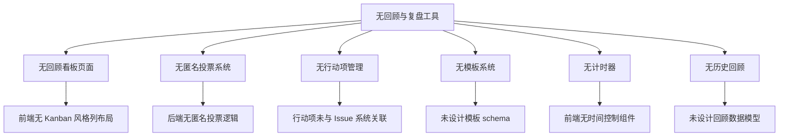
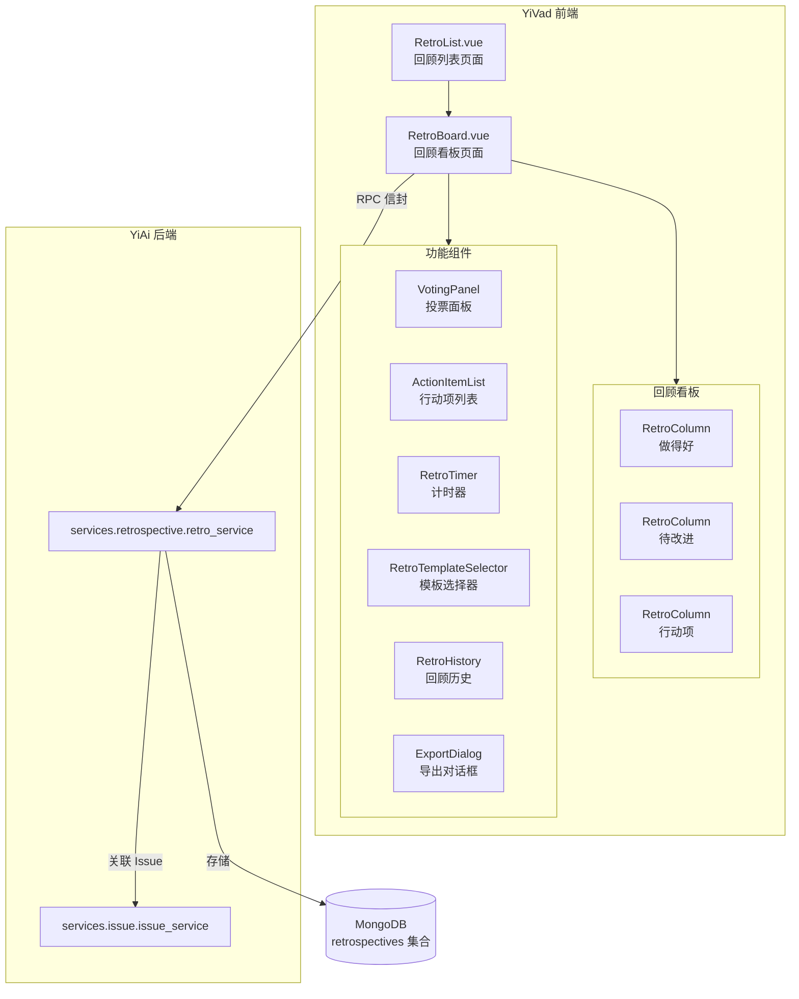

# 回顾与复盘工具

> 需求编号：YV-09-57 · 优先级：P2 · 人天：0.5d
> 依赖：YiAi 回顾服务（`services.retrospective.retro_service`）

## 改动总览

| 改动点 | 类型 | 涉及文件 |
|--------|------|---------|
| 回顾列表页面 | 新增 | `src/views/retrospective/RetroList.vue` |
| 回顾看板页面 | 新增 | `src/views/retrospective/RetroBoard.vue` |
| 回顾看板列组件 | 新增 | `src/components/retrospective/RetroColumn.vue` |
| 回顾卡片组件 | 新增 | `src/components/retrospective/RetroCard.vue` |
| 添加卡片对话框 | 新增 | `src/components/retrospective/AddCardDialog.vue` |
| 投票面板 | 新增 | `src/components/retrospective/VotingPanel.vue` |
| 行动项列表 | 新增 | `src/components/retrospective/ActionItemList.vue` |
| 计时器组件 | 新增 | `src/components/retrospective/RetroTimer.vue` |
| 模板选择器 | 新增 | `src/components/retrospective/RetroTemplateSelector.vue` |
| 回顾历史列表 | 新增 | `src/components/retrospective/RetroHistory.vue` |
| 回顾导出对话框 | 新增 | `src/components/retrospective/ExportDialog.vue` |
| 回顾 Composable | 新增 | `src/composables/useRetrospective.ts` |
| 回顾类型定义 | 新增 | `src/types/retrospective.ts` |
| 回顾 API 服务 | 新增 | `src/services/retrospective.service.ts` |
| 路由配置 | 修改 | `src/router/` 添加回顾路由 |

## 涉及文件

```
YiVad/
└── src/
    ├── views/
    │   └── retrospective/
    │       ├── RetroList.vue                    # 新增：回顾列表页面
    │       └── RetroBoard.vue                   # 新增：回顾看板页面
    ├── components/
    │   └── retrospective/
    │       ├── RetroColumn.vue                  # 新增：回顾看板列（可拖拽卡片）
    │       ├── RetroCard.vue                    # 新增：回顾卡片（可编辑/投票/删除）
    │       ├── AddCardDialog.vue                # 新增：添加卡片对话框
    │       ├── VotingPanel.vue                  # 新增：投票面板（点投票）
    │       ├── ActionItemList.vue               # 新增：行动项列表
    │       ├── RetroTimer.vue                   # 新增：计时器组件
    │       ├── RetroTemplateSelector.vue         # 新增：模板选择器
    │       ├── RetroHistory.vue                 # 新增：回顾历史列表
    │       └── ExportDialog.vue                 # 新增：导出对话框
    ├── composables/
    │   └── useRetrospective.ts                  # 新增：回顾 Composable
    ├── services/
    │   └── retrospective.service.ts             # 新增：回顾 API 服务
    ├── types/
    │   └── retrospective.ts                     # 新增：回顾类型定义
    ├── router/
    │   └── index.ts                              # 修改：添加回顾路由
    └── styles/
        └── retrospective.scss                   # 新增：回顾页面样式
```

## 基本信息

| 字段 | 值 |
|------|-----|
| 需求编号 | YV-09-57 |
| 模块 | 团队协作 |
| 优先级 | **P2**（提升团队敏捷实践能力） |
| 前端人天 | 0.5d |
| 后端人天 | 0.3d（YiAi 回顾服务） |
| 依赖 | YiAi `services.retrospective.retro_service` 提供回顾 CRUD 与投票接口 |

---

## 背景

YiVad 当前缺乏结构化的回顾与复盘工具。团队在 Sprint 或项目结束后，通常使用外部工具（如 Miro、MURAL）或白板进行回顾，回顾结果无法与项目管理系统关联，行动项难以追踪落实。回顾是敏捷实践的核心环节，缺少内置工具导致回顾流程不规范，经验沉淀困难。

**核心问题：**

| # | 问题 | 严重程度 | 影响 |
|---|------|----------|------|
| 1 | **无结构化回顾看板** -- 无法在内部分类（做得好/待改进/行动项）中收集反馈 | **高** | 回顾流程混乱，反馈分散 |
| 2 | **无匿名投票** -- 团队成员不敢公开表达真实意见 | **高** | 回顾流于形式，无法发现深层问题 |
| 3 | **行动项无追踪** -- 回顾中提出的改进措施无法跟踪落实 | **高** | 同样的问题反复出现，回顾无实际效果 |
| 4 | **无回顾模板** -- 每次回顾需要手动设计流程 | **中** | 回顾主持人准备成本高 |
| 5 | **无计时控制** -- 讨论环节超时，回顾效率低 | **中** | 回顾会议拖沓，占用过多时间 |
| 6 | **无历史回顾** -- 无法查看历史回顾和重复出现的行动项 | **中** | 无法追踪团队改进趋势 |

## 一、现状分析

### 当前回顾能力矩阵

| 场景 | 当前行为 | 期望行为 | 差距 |
|------|---------|---------|------|
| Sprint 回顾 | 使用外部白板工具，手动记录 | 在 YiVad 中创建回顾，选择模板，团队协作填写 | 完全缺失 |
| 匿名投票 | 无法匿名，只能公开举手或口头表达 | 点投票系统，每人 3 票，匿名投票，实时显示结果 | 完全缺失 |
| 行动项追踪 | 记录在文档中，会后遗忘 | 行动项自动关联 Issue，跟踪状态和截止日期 | 完全缺失 |
| 回顾模板 | 主持人自行设计流程 | 预置 3 种模板（Start/Stop/Continue、4Ls、Sailboat） | 完全缺失 |
| 时间控制 | 无计时，讨论环节随意 | 每个环节预设时间，倒计时提醒，超时自动提示 | 完全缺失 |
| 历史回顾 | 无集中存储，回顾记录分散 | 回顾历史列表，可查看重复行动项，追踪改进趋势 | 完全缺失 |

### 根因分析矩阵



| 缺失项 | 根因 | 影响链 |
|--------|------|--------|
| 回顾看板 | 前端未实现 Kanban 风格的多列拖拽布局 | 无法在列间移动卡片 |
| 匿名投票 | 后端未实现投票去重和匿名化逻辑 | 无法保证投票匿名性和公平性 |
| 行动项追踪 | 行动项未与 Issue 系统集成，状态无法同步 | 行动项无法追踪落实 |
| 模板系统 | 未设计回顾模板的 schema 和预设 | 每次回顾需从零配置 |
| 计时器 | 前端无计时器组件，无时间到提醒 | 会议环节无法控制时间 |
| 历史回顾 | 回顾数据未持久化归档 | 无法查看历史和改进趋势 |

---

## 二、设计决策

### 回顾看板列布局

| 布局 | 描述 | 优点 | 缺点 | 决策 |
|------|------|------|------|------|
| 固定 3 列 | "做得好"、"待改进"、"行动项" 3 列 | 简单清晰，适合大多数回顾 | 不够灵活，无法自定义列 | 默认方案 |
| 可配置列 | 用户可自定义列标题和数量 | 灵活适应不同回顾方法 | 增加复杂度 | 扩展方案 |
| 模板驱动列 | 选择模板后自动生成列，不可修改 | 保证方法一致性 | 不同模板列不同 | **选中** |

**决策：** 采用模板驱动列布局。选择回顾模板后自动生成对应的列（如 4Ls 模板生成 4 列），用户可在列内添加卡片。卡片支持在列间拖拽移动。

### 投票机制设计

| 机制 | 描述 | 优点 | 缺点 |
|------|------|------|------|
| 点投票（Dot Voting） | 每人 N 票，可投给任意卡片，可集中投 | 简单直观，最常用 | 可能被少数人操纵 |
| 排序投票 | 每人按优先级排序 | 更精细的优先级 | 操作复杂，耗时长 |
| 赞成/反对 | 每张卡片投票赞成或反对 | 简单 | 无法区分优先级 |

**决策：** 采用点投票机制。每人 3 票（可配置），可投给任意卡片（包括同一卡片多票），投票匿名。投票结束后显示结果（按票数排序），但隐藏投票人身份。

### 回顾模板设计

| 模板 | 列结构 | 适用场景 | 默认计时 |
|------|--------|---------|---------|
| Start/Stop/Continue | 开始做、停止做、继续做 | 常规 Sprint 回顾 | 45 分钟 |
| 4Ls | Liked、Learned、Lacked、Longed-for | 深度团队反思 | 60 分钟 |
| Sailboat | 顺风（推动力）、逆风（阻力）、暗礁（风险）、目标（岛屿） | 项目中期回顾 | 50 分钟 |
| 自定义 | 用户自定义列 | 特殊回顾需求 | 用户设置 |

### 行动项与 Issue 关联策略

| 策略 | 描述 | 优点 | 缺点 |
|------|------|------|------|
| 独立行动项 | 行动项存储在回顾中，不关联 Issue | 简单，独立管理 | 与项目管理系统脱节 |
| 自动创建 Issue | 行动项保存时自动创建 Issue | 与项目管理集成 | 可能产生大量 Issue |
| 手动关联 | 行动项可手动关联已有 Issue 或创建新 Issue | 灵活，用户可控 | 需要额外操作 |

**决策：** 采用手动关联策略。行动项默认独立存储，用户可选择"创建关联 Issue"（自动创建并关联）或"关联已有 Issue"。行动项状态与 Issue 状态同步。

---

## 三、目标架构



### 回顾数据模型

```
Retrospective
├── id: string
├── title: string                    # 如 "Sprint 45 回顾"
├── description: string
├── template: 'start_stop_continue' | '4ls' | 'sailboat' | 'custom'
├── sprintId?: string                # 关联 Sprint
├── projectId?: string               # 关联项目
├── columns: RetroColumn[]           # 列定义
│   ├── id: string
│   ├── title: string                # 列标题
│   ├── color: string                # 列颜色
│   └── order: number                # 排序
├── cards: RetroCard[]               # 卡片列表
│   ├── id: string
│   ├── columnId: string             # 所属列
│   ├── content: string              # 卡片内容
│   ├── author: string               # 创建者（展示用，投票时匿名）
│   ├── authorId: string             # 创建者 ID（仅后端可见）
│   ├── votes: string[]              # 投票人 ID 列表
│   ├── voteCount: number            # 票数（前端展示用）
│   ├── createdAt: string
│   └── order: number                # 列内排序
├── actionItems: ActionItem[]        # 行动项
│   ├── id: string
│   ├── cardId: string               # 来源卡片
│   ├── title: string
│   ├── description: string
│   ├── assigneeId?: string
│   ├── assigneeName?: string
│   ├── dueDate?: string
│   ├── status: 'open' | 'in_progress' | 'done' | 'cancelled'
│   ├── linkedIssueId?: string       # 关联 Issue
│   └── createdAt: string
├── phases: RetroPhase[]             # 回顾阶段
│   ├── id: string
│   ├── name: string                 # 如 "收集反馈"
│   ├── durationMinutes: number      # 预设时长
│   ├── startedAt?: string
│   ├── endedAt?: string
│   └── order: number
├── votingConfig: VotingConfig       # 投票配置
│   ├── enabled: boolean
│   ├── votesPerPerson: number       # 每人票数（默认 3）
│   ├── startedAt?: string
│   └── endedAt?: string
├── status: 'draft' | 'active' | 'voting' | 'completed' | 'archived'
├── participants: string[]           # 参与人 ID
├── createdAt: string
├── updatedAt: string
└── createdBy: string
```

---

## 四、具体改动

### 4.1 回顾类型定义

**文件：** `src/types/retrospective.ts`（新增）

```typescript
// 回顾模板类型
export type RetroTemplate = 'start_stop_continue' | '4ls' | 'sailboat' | 'custom';

// 回顾状态
export type RetroStatus = 'draft' | 'active' | 'voting' | 'completed' | 'archived';

// 行动项状态
export type ActionItemStatus = 'open' | 'in_progress' | 'done' | 'cancelled';

// 回顾列定义
export interface RetroColumn {
  id: string;
  title: string;
  color: string;
  order: number;
}

// 回顾卡片
export interface RetroCard {
  id: string;
  columnId: string;
  content: string;
  author: string;
  authorId: string;
  votes: string[];
  voteCount: number;
  createdAt: string;
  order: number;
}

// 行动项
export interface ActionItem {
  id: string;
  cardId: string;
  title: string;
  description: string;
  assigneeId?: string;
  assigneeName?: string;
  dueDate?: string;
  status: ActionItemStatus;
  linkedIssueId?: string;
  createdAt: string;
}

// 回顾阶段
export interface RetroPhase {
  id: string;
  name: string;
  durationMinutes: number;
  startedAt?: string;
  endedAt?: string;
  order: number;
}

// 投票配置
export interface VotingConfig {
  enabled: boolean;
  votesPerPerson: number;
  startedAt?: string;
  endedAt?: string;
}

// 回顾
export interface Retrospective {
  id: string;
  title: string;
  description: string;
  template: RetroTemplate;
  sprintId?: string;
  projectId?: string;
  columns: RetroColumn[];
  cards: RetroCard[];
  actionItems: ActionItem[];
  phases: RetroPhase[];
  votingConfig: VotingConfig;
  status: RetroStatus;
  participants: string[];
  createdAt: string;
  updatedAt: string;
  createdBy: string;
}

// 模板定义
export interface RetroTemplateDefinition {
  type: RetroTemplate;
  name: string;
  description: string;
  columns: Omit<RetroColumn, 'id'>[];
  phases: Omit<RetroPhase, 'id' | 'startedAt' | 'endedAt'>[];
  icon: string;
}

// 模板预设
export const RETRO_TEMPLATES: RetroTemplateDefinition[] = [
  {
    type: 'start_stop_continue',
    name: 'Start / Stop / Continue',
    description: '经典回顾方法，聚焦于开始做、停止做、继续做三个维度',
    columns: [
      { title: '开始做', color: '#22c55e', order: 0 },
      { title: '停止做', color: '#ef4444', order: 1 },
      { title: '继续做', color: '#3b82f6', order: 2 },
    ],
    phases: [
      { name: '收集反馈', durationMinutes: 10, order: 0 },
      { name: '分组讨论', durationMinutes: 15, order: 1 },
      { name: '投票', durationMinutes: 5, order: 2 },
      { name: '制定行动项', durationMinutes: 10, order: 3 },
      { name: '总结', durationMinutes: 5, order: 4 },
    ],
    icon: 'refresh',
  },
  {
    type: '4ls',
    name: '4Ls (Liked / Learned / Lacked / Longed-for)',
    description: '从喜欢、学到、缺失、渴望四个维度深入反思',
    columns: [
      { title: 'Liked 喜欢的', color: '#22c55e', order: 0 },
      { title: 'Learned 学到的', color: '#3b82f6', order: 1 },
      { title: 'Lacked 缺失的', color: '#f59e0b', order: 2 },
      { title: 'Longed-for 渴望的', color: '#8b5cf6', order: 3 },
    ],
    phases: [
      { name: '收集反馈', durationMinutes: 15, order: 0 },
      { name: '深入讨论', durationMinutes: 20, order: 1 },
      { name: '投票', durationMinutes: 5, order: 2 },
      { name: '制定行动项', durationMinutes: 15, order: 3 },
      { name: '总结', durationMinutes: 5, order: 4 },
    ],
    icon: 'grid',
  },
  {
    type: 'sailboat',
    name: 'Sailboat 帆船',
    description: '用帆船隐喻分析推动力、阻力、风险和愿景',
    columns: [
      { title: 'Wind 顺风（推动力）', color: '#22c55e', order: 0 },
      { title: 'Anchor 锚（阻力）', color: '#ef4444', order: 1 },
      { title: 'Rocks 暗礁（风险）', color: '#f59e0b', order: 2 },
      { title: 'Island 岛屿（目标）', color: '#3b82f6', order: 3 },
    ],
    phases: [
      { name: '设定愿景', durationMinutes: 5, order: 0 },
      { name: '收集反馈', durationMinutes: 15, order: 1 },
      { name: '讨论', durationMinutes: 15, order: 2 },
      { name: '投票', durationMinutes: 5, order: 3 },
      { name: '制定行动项', durationMinutes: 10, order: 4 },
    ],
    icon: 'sailboat',
  },
];
```

### 4.2 回顾 API 服务

**文件：** `src/services/retrospective.service.ts`（新增）

```typescript
import { RequestHttp } from '@/utils/request';
import type {
  Retrospective, RetroCard, ActionItem, VotingConfig,
  RetroTemplate, RetroTemplateDefinition,
} from '@/types/retrospective';

const http = new RequestHttp();

export const retroService = {
  // 回顾 CRUD
  async listRetros(filter: Record<string, any> = {}): Promise<Retrospective[]> {
    return http.post('/', {
      module_name: 'services.retrospective.retro_service',
      method_name: 'list_retros',
      parameters: { filter },
    });
  },

  async getRetro(id: string): Promise<Retrospective> {
    return http.post('/', {
      module_name: 'services.retrospective.retro_service',
      method_name: 'get_retro',
      parameters: { retro_id: id },
    });
  },

  async createRetro(data: {
    title: string;
    description: string;
    template: RetroTemplate;
    sprintId?: string;
    projectId?: string;
  }): Promise<Retrospective> {
    return http.post('/', {
      module_name: 'services.retrospective.retro_service',
      method_name: 'create_retro',
      parameters: data,
    });
  },

  async updateRetro(id: string, updates: Partial<Retrospective>): Promise<Retrospective> {
    return http.post('/', {
      module_name: 'services.retrospective.retro_service',
      method_name: 'update_retro',
      parameters: { retro_id: id, updates },
    });
  },

  async deleteRetro(id: string): Promise<void> {
    return http.post('/', {
      module_name: 'services.retrospective.retro_service',
      method_name: 'delete_retro',
      parameters: { retro_id: id },
    });
  },

  // 卡片操作
  async addCard(retroId: string, columnId: string, content: string): Promise<RetroCard> {
    return http.post('/', {
      module_name: 'services.retrospective.retro_service',
      method_name: 'add_card',
      parameters: { retro_id: retroId, column_id: columnId, content },
    });
  },

  async updateCard(retroId: string, cardId: string, updates: Partial<RetroCard>): Promise<RetroCard> {
    return http.post('/', {
      module_name: 'services.retrospective.retro_service',
      method_name: 'update_card',
      parameters: { retro_id: retroId, card_id: cardId, updates },
    });
  },

  async moveCard(retroId: string, cardId: string, targetColumnId: string, newOrder: number): Promise<void> {
    return http.post('/', {
      module_name: 'services.retrospective.retro_service',
      method_name: 'move_card',
      parameters: { retro_id: retroId, card_id: cardId, target_column_id: targetColumnId, new_order: newOrder },
    });
  },

  async deleteCard(retroId: string, cardId: string): Promise<void> {
    return http.post('/', {
      module_name: 'services.retrospective.retro_service',
      method_name: 'delete_card',
      parameters: { retro_id: retroId, card_id: cardId },
    });
  },

  // 投票操作
  async vote(retroId: string, cardId: string): Promise<{ voteCount: number }> {
    return http.post('/', {
      module_name: 'services.retrospective.retro_service',
      method_name: 'vote',
      parameters: { retro_id: retroId, card_id: cardId },
    });
  },

  async unvote(retroId: string, cardId: string): Promise<{ voteCount: number }> {
    return http.post('/', {
      module_name: 'services.retrospective.retro_service',
      method_name: 'unvote',
      parameters: { retro_id: retroId, card_id: cardId },
    });
  },

  async startVoting(retroId: string, config: VotingConfig): Promise<void> {
    return http.post('/', {
      module_name: 'services.retrospective.retro_service',
      method_name: 'start_voting',
      parameters: { retro_id: retroId, config },
    });
  },

  async endVoting(retroId: string): Promise<RetroCard[]> {
    return http.post('/', {
      module_name: 'services.retrospective.retro_service',
      method_name: 'end_voting',
      parameters: { retro_id: retroId },
    });
  },

  // 行动项操作
  async addActionItem(retroId: string, actionItem: Omit<ActionItem, 'id' | 'createdAt'>): Promise<ActionItem> {
    return http.post('/', {
      module_name: 'services.retrospective.retro_service',
      method_name: 'add_action_item',
      parameters: { retro_id: retroId, action_item: actionItem },
    });
  },

  async updateActionItem(
    retroId: string, itemId: string, updates: Partial<ActionItem>
  ): Promise<ActionItem> {
    return http.post('/', {
      module_name: 'services.retrospective.retro_service',
      method_name: 'update_action_item',
      parameters: { retro_id: retroId, item_id: itemId, updates },
    });
  },

  async deleteActionItem(retroId: string, itemId: string): Promise<void> {
    return http.post('/', {
      module_name: 'services.retrospective.retro_service',
      method_name: 'delete_action_item',
      parameters: { retro_id: retroId, item_id: itemId },
    });
  },

  async linkActionItemToIssue(retroId: string, itemId: string, issueId: string): Promise<void> {
    return http.post('/', {
      module_name: 'services.retrospective.retro_service',
      method_name: 'link_action_item_to_issue',
      parameters: { retro_id: retroId, item_id: itemId, issue_id: issueId },
    });
  },

  // 回顾阶段控制
  async startPhase(retroId: string, phaseId: string): Promise<void> {
    return http.post('/', {
      module_name: 'services.retrospective.retro_service',
      method_name: 'start_phase',
      parameters: { retro_id: retroId, phase_id: phaseId },
    });
  },

  async endPhase(retroId: string, phaseId: string): Promise<void> {
    return http.post('/', {
      module_name: 'services.retrospective.retro_service',
      method_name: 'end_phase',
      parameters: { retro_id: retroId, phase_id: phaseId },
    });
  },

  // 导出
  async exportRetro(retroId: string, format: 'markdown'): Promise<Blob> {
    return http.post('/', {
      module_name: 'services.retrospective.retro_service',
      method_name: 'export_retro',
      parameters: { retro_id: retroId, format },
    }, { responseType: 'blob' });
  },

  // 历史
  async getHistory(projectId?: string, sprintId?: string): Promise<Retrospective[]> {
    return http.post('/', {
      module_name: 'services.retrospective.retro_service',
      method_name: 'get_history',
      parameters: { project_id: projectId, sprint_id: sprintId },
    });
  },

  async getRecurringActionItems(projectId: string): Promise<ActionItem[]> {
    return http.post('/', {
      module_name: 'services.retrospective.retro_service',
      method_name: 'get_recurring_action_items',
      parameters: { project_id: projectId },
    });
  },
};
```

### 4.3 useRetrospective Composable

**文件：** `src/composables/useRetrospective.ts`（新增）

核心功能：
- 管理回顾状态：`retro`（当前回顾）、`cards`（按列分组的卡片）、`actionItems`（行动项列表）
- 管理阶段状态：`currentPhase`（当前阶段）、`phaseTimeLeft`（阶段剩余时间）
- 管理投票状态：`votingActive`（投票是否进行中）、`myVotes`（当前用户已投票的卡片 ID 列表）、`remainingVotes`（剩余票数）
- 卡片操作：`addCard(columnId, content)`、`updateCard(cardId, content)`、`moveCard(cardId, targetColumnId)`、`deleteCard(cardId)`
- 投票操作：`vote(cardId)`、`unvote(cardId)` → 前端乐观更新，后端验证去重
- 行动项操作：`addActionItem(cardId, data)`、`updateActionItem(itemId, updates)`、`linkToIssue(itemId, issueId)`
- 阶段控制：`startPhase(phaseId)`、`endPhase(phaseId)`、`nextPhase()`
- 实时同步：每 5 秒轮询卡片和投票数据（仅在回顾激活状态下）
- 权限检查：`canEdit`（创建者或主持人）、`canVote`（投票阶段且票数未用完）、`canManageActionItems`（所有参与者）

### 4.4 RetroBoard 回顾看板页面

**文件：** `src/views/retrospective/RetroBoard.vue`（新增）

核心功能：
- 顶部工具栏：回顾标题、阶段进度条、计时器、参与者头像
- 看板区域：根据模板生成的列，水平排列，每列包含卡片列表
- 列内卡片支持拖拽移动（同一列内排序、跨列移动）
- 每列底部有"添加卡片"按钮
- 右侧面板：投票结果、行动项列表（可折叠）
- 阶段控制：主持人可手动推进阶段，计时器倒计时
- 底部状态栏：当前阶段名称、剩余时间、参与人数

### 4.5 RetroColumn 回顾看板列组件

**文件：** `src/components/retrospective/RetroColumn.vue`（新增）

核心功能：
- 列标题：显示模板定义的标题和颜色标识
- 卡片计数：显示当前列卡片数量
- 卡片列表：垂直排列，支持拖拽排序（使用 vuedraggable 或原生拖拽）
- 添加卡片：列底部输入框，输入内容后按 Enter 添加
- 空状态：无卡片时显示提示文字"点击下方添加卡片"

### 4.6 RetroCard 回顾卡片组件

**文件：** `src/components/retrospective/RetroCard.vue`（新增）

核心功能：
- 卡片内容：显示文本内容，支持编辑（双击进入编辑模式）
- 作者信息：显示创建者姓名（非投票阶段）或隐藏（投票阶段）
- 投票按钮：显示票数徽章，点击投票/取消投票
  - 未投票：空心圆圈 + 票数
  - 已投票：实心圆圈（主题色） + 票数
  - 投票阶段结束后：仅显示票数，不可点击
- 操作菜单：编辑、删除（仅创建者可操作）
- 拖拽手柄：左侧拖拽图标
- 卡片颜色：根据票数显示热力色（0 票=默认，3+ 票=高亮）

### 4.7 VotingPanel 投票面板

**文件：** `src/components/retrospective/VotingPanel.vue`（新增）

核心功能：
- 投票状态：显示"投票进行中"或"投票已结束"
- 票数统计：显示每人票数、当前用户剩余票数
- 投票结果：投票结束后显示按票数排序的卡片列表
  - 高票数卡片高亮显示
  - 票数相同时按创建时间排序
- 主持人控制：开始投票、结束投票按钮
- 投票规则说明：公告投票规则（匿名、每人 N 票）

### 4.8 ActionItemList 行动项列表

**文件：** `src/components/retrospective/ActionItemList.vue`（新增）

核心功能：
- 行动项列表：表格形式展示，包含标题、负责人、截止日期、状态、关联 Issue
- 状态标签：open（蓝色）、in_progress（黄色）、done（绿色）、cancelled（灰色）
- 添加行动项：从卡片创建行动项（预填标题），填写负责人、截止日期、描述
- 关联 Issue：搜索并关联已有 Issue，或创建新 Issue
- 筛选：按状态筛选（全部/待处理/进行中/已完成/已取消）
- 排序：按截止日期、创建时间、状态排序
- 空状态：无行动项时显示"暂无行动项，从高票卡片创建行动项"

### 4.9 RetroTimer 计时器组件

**文件：** `src/components/retrospective/RetroTimer.vue`（新增）

核心功能：
- 倒计时显示：大号数字显示剩余时间（MM:SS 格式）
- 进度环：圆形进度条，颜色从绿色（充足）→ 黄色（警告，剩余 25%）→ 红色（超时）
- 时间到提醒：超时时弹出通知，标题变红闪烁
- 时间调整：主持人可增加/减少当前阶段时间（+5 分钟/-5 分钟）
- 暂停/继续：主持人可暂停计时器
- 阶段切换：当前阶段结束时自动切换到下一阶段

### 4.10 RetroHistory 回顾历史

**文件：** `src/components/retrospective/RetroHistory.vue`（新增）

核心功能：
- 历史回顾列表：按时间倒序展示历史回顾
- 每条记录显示：标题、模板类型、日期、参与人数、卡片数、行动项数
- 重复行动项标记：如果某行动项在多次回顾中出现，标记为"重复出现"
- 改进趋势：按行动项完成率展示改进趋势图
- 查看详情：点击回顾进入只读查看模式

### 4.11 样式

**文件：** `src/styles/retrospective.scss`（新增）

```scss
.retro-board {
  display: flex;
  flex-direction: column;
  height: calc(100vh - 60px);

  &__toolbar {
    display: flex;
    align-items: center;
    gap: 16px;
    padding: 12px 20px;
    background: var(--el-bg-color);
    border-bottom: 1px solid var(--el-border-color-light);
    flex-shrink: 0;
  }

  &__phases {
    display: flex;
    gap: 4px;
    flex: 1;

    .phase-indicator {
      width: 40px;
      height: 4px;
      border-radius: 2px;
      background: var(--el-border-color);

      &--active {
        background: var(--el-color-primary);
      }

      &--completed {
        background: var(--el-color-success);
      }
    }
  }

  &__columns {
    display: flex;
    gap: 16px;
    padding: 20px;
    flex: 1;
    overflow-x: auto;
    overflow-y: hidden;
  }

  &__footer {
    display: flex;
    align-items: center;
    justify-content: space-between;
    padding: 8px 20px;
    background: var(--el-bg-color);
    border-top: 1px solid var(--el-border-color-light);
    font-size: 13px;
    color: var(--el-text-color-secondary);
    flex-shrink: 0;
  }
}

.retro-column {
  flex: 1;
  min-width: 280px;
  max-width: 400px;
  display: flex;
  flex-direction: column;
  background: var(--el-bg-color-page);
  border-radius: var(--el-border-radius-base);
  padding: 12px;

  &__header {
    display: flex;
    align-items: center;
    justify-content: space-between;
    margin-bottom: 12px;
    padding-bottom: 8px;
    border-bottom: 2px solid var(--column-color);

    &-title {
      font-weight: 600;
      font-size: 14px;
    }

    &-count {
      font-size: 12px;
      color: var(--el-text-color-secondary);
      background: var(--el-bg-color);
      padding: 2px 8px;
      border-radius: 10px;
    }
  }

  &__cards {
    flex: 1;
    overflow-y: auto;
    display: flex;
    flex-direction: column;
    gap: 8px;
    min-height: 100px;
  }

  &__add {
    margin-top: 8px;
  }

  &__empty {
    display: flex;
    align-items: center;
    justify-content: center;
    height: 80px;
    color: var(--el-text-color-placeholder);
    font-size: 13px;
    border: 1px dashed var(--el-border-color);
    border-radius: 4px;
  }
}

.retro-card {
  background: var(--el-bg-color);
  border: 1px solid var(--el-border-color);
  border-radius: var(--el-border-radius-base);
  padding: 12px;
  cursor: pointer;
  transition: box-shadow 0.2s, border-color 0.2s;

  &:hover {
    box-shadow: var(--el-box-shadow-light);
  }

  &--voted {
    border-color: var(--el-color-primary);
  }

  &--hot {
    border-color: var(--el-color-warning);
    background: var(--el-color-warning-light-9);
  }

  &__header {
    display: flex;
    align-items: flex-start;
    justify-content: space-between;
    gap: 8px;
  }

  &__content {
    font-size: 14px;
    line-height: 1.5;
    word-break: break-word;
  }

  &__author {
    font-size: 12px;
    color: var(--el-text-color-secondary);
    margin-top: 6px;
  }

  &__vote {
    display: flex;
    align-items: center;
    gap: 4px;
    flex-shrink: 0;

    &-btn {
      width: 28px;
      height: 28px;
      border-radius: 50%;
      border: 2px solid var(--el-border-color);
      background: transparent;
      cursor: pointer;
      display: flex;
      align-items: center;
      justify-content: center;
      font-size: 12px;
      transition: all 0.2s;

      &:hover {
        border-color: var(--el-color-primary);
      }

      &--active {
        background: var(--el-color-primary);
        border-color: var(--el-color-primary);
        color: white;
      }

      &--disabled {
        opacity: 0.5;
        cursor: not-allowed;
      }
    }
  }

  &__actions {
    display: flex;
    gap: 4px;
    opacity: 0;
    transition: opacity 0.2s;

    .retro-card:hover & {
      opacity: 1;
    }
  }
}

.voting-panel {
  padding: 16px;

  &__header {
    display: flex;
    align-items: center;
    justify-content: space-between;
    margin-bottom: 16px;
  }

  &__status {
    display: flex;
    align-items: center;
    gap: 8px;
    font-size: 14px;
    font-weight: 500;
  }

  &__votes-left {
    font-size: 13px;
    color: var(--el-text-color-secondary);
  }

  &__results {
    .result-item {
      display: flex;
      align-items: center;
      gap: 8px;
      padding: 8px;
      border-radius: 4px;
      margin-bottom: 4px;

      &__rank {
        width: 24px;
        text-align: center;
        font-weight: 600;
        font-size: 14px;
      }

      &__content {
        flex: 1;
        font-size: 13px;
        overflow: hidden;
        text-overflow: ellipsis;
        white-space: nowrap;
      }

      &__votes {
        display: flex;
        gap: 2px;

        .dot {
          width: 8px;
          height: 8px;
          border-radius: 50%;
          background: var(--el-color-primary);
        }
      }

      &--top {
        background: var(--el-color-primary-light-9);
      }
    }
  }
}

.action-item-list {
  &__table {
    .status-tag {
      &--open { color: var(--el-color-primary); }
      &--in_progress { color: var(--el-color-warning); }
      &--done { color: var(--el-color-success); }
      &--cancelled { color: var(--el-color-info); }
    }
  }

  &__empty {
    text-align: center;
    padding: 40px;
    color: var(--el-text-color-secondary);
  }
}

.retro-timer {
  display: flex;
  align-items: center;
  gap: 12px;

  &__display {
    font-family: 'SF Mono', 'Fira Code', monospace;
    font-size: 24px;
    font-weight: 600;
    min-width: 70px;
    text-align: center;

    &--warning {
      color: var(--el-color-warning);
    }

    &--danger {
      color: var(--el-color-danger);
      animation: blink 1s infinite;
    }
  }

  &__progress {
    width: 40px;
    height: 40px;
  }

  &__controls {
    display: flex;
    gap: 4px;
  }
}

@keyframes blink {
  0%, 100% { opacity: 1; }
  50% { opacity: 0.5; }
}

.retro-history {
  &__list {
    .history-item {
      display: flex;
      align-items: center;
      gap: 12px;
      padding: 12px;
      border: 1px solid var(--el-border-color);
      border-radius: var(--el-border-radius-base);
      margin-bottom: 8px;
      cursor: pointer;
      transition: border-color 0.2s;

      &:hover {
        border-color: var(--el-color-primary);
      }
    }
  }

  &__trend {
    padding: 16px;
    background: var(--el-bg-color);
    border-radius: var(--el-border-radius-base);
  }

  &__recurring {
    padding: 8px 12px;
    background: var(--el-color-warning-light-9);
    border-radius: 4px;
    font-size: 13px;
    color: var(--el-color-warning-dark-2);
  }
}
```

---

## 五、实施步骤

| 步骤 | 任务 | 产出 | 验证方式 | 人天 |
|------|------|------|----------|------|
| 1 | 定义回顾类型接口 | `types/retrospective.ts` | TypeScript 类型检查通过 | 0.03 |
| 2 | 实现回顾 API 服务 | `services/retrospective.service.ts` | 接口调用返回正确数据结构 | 0.03 |
| 3 | 实现 useRetrospective Composable | `composables/useRetrospective.ts` | 卡片/投票/行动项逻辑正确 | 0.05 |
| 4 | 实现 RetroColumn 列组件 | `components/retrospective/RetroColumn.vue` | 列渲染、卡片拖拽移动正常 | 0.04 |
| 5 | 实现 RetroCard 卡片组件 | `components/retrospective/RetroCard.vue` | 卡片编辑/投票/删除正常 | 0.04 |
| 6 | 实现 VotingPanel 投票面板 | `components/retrospective/VotingPanel.vue` | 投票/取消投票/结果显示正常 | 0.04 |
| 7 | 实现 ActionItemList 行动项列表 | `components/retrospective/ActionItemList.vue` | 行动项 CRUD/关联 Issue 正常 | 0.04 |
| 8 | 实现 RetroTimer 计时器 | `components/retrospective/RetroTimer.vue` | 倒计时/警告/超时/暂停正常 | 0.03 |
| 9 | 实现 RetroBoard 看板页面 | `views/retrospective/RetroBoard.vue` | 看板整体功能正常 | 0.06 |
| 10 | 实现 RetroList 列表页面 | `views/retrospective/RetroList.vue` | 列表/搜索/新建正常 | 0.03 |
| 11 | 实现 RetroTemplateSelector | `components/retrospective/RetroTemplateSelector.vue` | 3 种模板选择正常 | 0.02 |
| 12 | 实现 RetroHistory 历史回顾 | `components/retrospective/RetroHistory.vue` | 历史列表/重复标记正常 | 0.03 |
| 13 | 实现 ExportDialog 导出 | `components/retrospective/ExportDialog.vue` | Markdown 导出正常 | 0.02 |
| 14 | 样式文件 | `styles/retrospective.scss` | 看板布局、卡片样式、计时器样式正常 | 0.02 |
| 15 | 组件测试 | 测试文件 | 6 个测试场景通过 | 0.02 |

**总计：** 0.5d

---

## 六、测试规格

### Scenario 1: 创建回顾并选择模板
- **GIVEN** 用户进入回顾列表页面
- **WHEN** 用户点击"新建回顾"，输入标题"Sprint 45 回顾"，选择"Start/Stop/Continue"模板，点击创建
- **THEN** 系统创建回顾，跳转到回顾看板，看板显示 3 列（开始做、停止做、继续做），阶段进度条显示 5 个阶段

### Scenario 2: 添加卡片和拖拽移动
- **GIVEN** 回顾看板已打开，"开始做"列中有 2 张卡片
- **WHEN** 用户在"停止做"列底部输入"停止频繁打断开发"，按 Enter 添加，然后将该卡片拖拽到"继续做"列
- **THEN** 卡片出现在"继续做"列中，列计数更新，"停止做"列计数减 1，"继续做"列计数加 1

### Scenario 3: 匿名投票和结果展示
- **GIVEN** 回顾看板中有 10 张卡片，主持人点击"开始投票"
- **WHEN** 用户 A 给卡片 1、3、5 投票，用户 B 给卡片 1、2、6 投票，主持人点击"结束投票"
- **THEN** 投票结果显示卡片 1 获得 2 票排第一，卡片按票数降序排列，投票人身份不显示，仅有票数统计

### Scenario 4: 创建行动项并关联 Issue
- **GIVEN** 投票结束后，高票卡片"停止频繁打断开发"被选为行动项来源
- **WHEN** 用户点击"创建行动项"，填写标题"制定团队沟通规范"，负责人为"张三"，截止日期为下周五，点击"关联 Issue"并搜索选择已有 Issue #456
- **THEN** 行动项创建成功，关联 Issue #456，行动项列表中显示该行动项，状态为"待处理"

### Scenario 5: 计时器倒计时和阶段切换
- **GIVEN** 回顾处于"收集反馈"阶段，预设 10 分钟
- **WHEN** 主持人点击"开始"，计时器开始倒计时，剩余 2 分 30 秒时进度环变为黄色，剩余 30 秒时变为红色闪烁，时间到后弹出"时间到"通知
- **THEN** 主持人可点击"下一阶段"进入"分组讨论"，计时器重置为 15 分钟

### Scenario 6: 查看回顾历史
- **GIVEN** 项目已完成 3 次 Sprint 回顾
- **WHEN** 用户打开回顾历史页面，筛选当前项目
- **THEN** 列表显示 3 次回顾记录，每条显示标题、日期、卡片数、行动项数，如果某行动项在 2 次以上回顾中出现，标记为"重复出现"（黄色标签）

---

## 七、风险与缓解

| 风险 | 概率 | 影响 | 等级 | 缓解措施 | 应急预案 |
|------|------|------|------|----------|----------|
| 回顾看板数据量大导致拖拽卡顿 | 低 | 中 | 低 | 单次回顾卡片数建议不超过 100 张，使用虚拟滚动 | 超过 100 张时提示分组回顾 |
| 匿名投票被恶意利用 | 中 | 中 | 中 | 投票去重（每人每卡只能投一次），记录投票时间戳用于审计 | 主持人可撤销投票阶段并重新开始 |
| 行动项关联 Issue 被删除 | 低 | 中 | 低 | Issue 删除时保留行动项的关联记录（标记为"已删除"） | 行动项可重新关联其他 Issue |
| 计时器在浏览器后台时不准 | 中 | 低 | 低 | 使用 `Date.now()` 差值计算而非 `setInterval` 计数 | 页面可见性变化时重新校准计时器 |
| 回顾数据丢失 | 低 | 高 | 中 | 自动保存（每 30 秒），浏览器 localStorage 备份 | 从备份恢复最近一次保存 |

---

## 八、回滚策略

| 回滚场景 | 回滚方式 | 影响范围 | 恢复时间 |
|----------|----------|----------|----------|
| 回顾看板白屏 | 移除回顾路由，隐藏导航菜单项 | 回顾模块 | < 2min |
| 拖拽功能异常导致卡片丢失 | 回退到仅支持手动添加/删除卡片（无拖拽） | 回顾看板 | < 5min |
| 投票功能异常 | 禁用投票，回顾仍可进行（无投票环节） | 回顾流程 | < 3min |
| 计时器不准确 | 隐藏计时器，使用手动阶段切换 | 回顾计时 | < 2min |

**回滚验证：**
- 回滚后回顾列表页正常访问
- 回滚后已创建的回顾仍可查看
- 回滚后其他页面功能正常
- 回滚后 `vue-tsc --noEmit` 类型检查通过

---

## 九、设计决策记录

### D-01: 采用模板驱动列布局

**背景：** 回顾方法多样，不同方法需要不同的列结构。
**决策：** 使用模板驱动列布局，选择模板后自动生成列，用户不可修改列结构。
**权衡：** 灵活性不如自定义列，但保证了回顾方法的一致性，降低了用户配置成本。
**后果：** 提供"自定义"模板供高级用户使用，可自定义列标题和数量。

### D-02: 匿名投票仅隐藏前端展示

**背景：** 匿名投票需要保护投票人隐私，同时防止恶意投票。
**决策：** 后端存储投票人 ID（用于去重），前端展示时仅显示票数，不显示投票人信息。投票结束后也不公开投票人身份。
**权衡：** 后端管理员可查看投票记录（满足审计需求），但前端用户完全匿名。
**后果：** 需在投票规则中明确说明"投票匿名，但管理员可审计"。

### D-03: 行动项手动关联 Issue 而非自动创建

**背景：** 行动项可能需要关联 Issue 以追踪，但并非所有行动项都需要创建 Issue。
**决策：** 行动项默认独立存储，用户可选择手动关联已有 Issue 或创建新 Issue。
**权衡：** 需要额外操作，但避免了自动创建大量无用 Issue 的问题。
**后果：** 行动项状态与关联 Issue 状态同步，取消关联后状态保持独立。

### D-04: 计时器使用客户端时间

**背景：** 计时器需要精确计时，服务端时间可以避免客户端时间不一致。
**决策：** 使用客户端 `Date.now()` 差值计算，而非服务端推送时间。
**权衡：** 不同客户端时间可能不一致，但回顾通常是同一团队在同一地点进行，时间差异可忽略。
**后果：** 如果未来需要远程协作回顾，可升级为服务端统一计时。

---

## 十、可观测性

### 关键指标

| 指标 | 采集方式 | 告警阈值 | 说明 |
|------|---------|---------|------|
| 回顾创建次数 | 前端埋点 | -- | 回顾功能使用频率 |
| 回顾参与人数 | 数据库统计 | -- | 团队参与度 |
| 每回顾卡片数 | 数据库统计 | 单次 > 100 | 是否需要引导拆分回顾 |
| 投票参与率 | 数据库统计 | < 50% | 团队投票积极性 |
| 行动项完成率 | 数据库统计 | < 30% | 回顾改进落实情况 |
| 重复行动项比例 | 数据库统计 | > 30% | 同样问题反复出现 |

### 日志规范

| 日志级别 | 场景 | 示例 |
|---------|------|------|
| `DEBUG` | 卡片操作 | `[Retro] Card retro-001:card-003 moved to column stop_doing` |
| `INFO` | 回顾创建/完成 | `[Retro] Retrospective Sprint 45 created by zhangsan` |
| `INFO` | 投票开始/结束 | `[Retro] Voting started for retro-001, 5 participants, 3 votes each` |
| `WARN` | 行动项过期 | `[Retro] Action item action-007 overdue by 3 days` |
| `ERROR` | 回顾数据保存失败 | `[Retro] Failed to save retro-001: database write error` |

---

## 十一、代码审查检查清单

- [ ] `types/retrospective.ts` 中所有类型定义完整，3 种模板预设正确
- [ ] `retrospective.service.ts` 中所有 API 调用使用正确的 RPC 信封格式
- [ ] `useRetrospective.ts` 中投票去重逻辑正确，前端乐观更新后后端验证
- [ ] `RetroColumn.vue` 中卡片拖拽移动功能正常，跨列移动数据正确
- [ ] `RetroCard.vue` 中编辑/投票/删除操作正常，投票阶段隐藏作者信息
- [ ] `VotingPanel.vue` 中投票结果显示正确，投票人身份不暴露
- [ ] `ActionItemList.vue` 中行动项 CRUD 和关联 Issue 功能正常
- [ ] `RetroTimer.vue` 中倒计时/警告/超时逻辑正确，使用 Date.now() 差值
- [ ] `RetroBoard.vue` 中阶段控制和计时器联动正常
- [ ] `RetroHistory.vue` 中重复行动项检测逻辑正确
- [ ] 导出 Markdown 格式正确，包含所有列和卡片
- [ ] `vue-tsc --noEmit` 类型检查通过

---

## 回归问题预测

| # | 问题 | 预测场景 | 根因 | 预防措施 |
|---|------|---------|------|------|
| 1 | 多人同时编辑卡片冲突 | 多人同时修改同一张卡片内容 | 未使用乐观锁或版本控制，后提交者覆盖先提交者 | 卡片更新时携带 `updatedAt` 版本号，后端检测冲突返回 409 |
| 2 | 投票期间卡片被删除 | 投票进行中，某卡片被作者删除，已投票数丢失 | 投票阶段未限制卡片删除操作 | 投票阶段禁止删除卡片，仅允许编辑内容 |
| 3 | 拖拽排序后 order 不连续 | 频繁拖拽移动卡片后，order 值出现小数或重复 | 前端使用简单索引重新计算 order，未考虑并发 | 拖拽结束后后端重新计算列内所有卡片的 order 值（整数递增） |
| 4 | 计时器在标签页切换后不准 | 用户切换到其他标签页，计时器暂停 | `setInterval` 在后台标签页被降频 | 使用 `Date.now()` 差值计算，页面可见性变化时校准 |
| 5 | 行动项关联 Issue 后状态不同步 | Issue 状态变为 Done，行动项仍为 Open | 未实现 Issue 状态变更回调 | 每小时定时同步关联 Issue 状态，或在 Issue 状态变更时主动推送 |
| 6 | 历史回顾加载慢 | 项目有 50+ 次回顾，历史页面加载所有数据 | 未做分页，一次性加载全部回顾 | 历史回顾列表分页加载（每页 10 条），仅加载摘要信息 |

---

## 性能分析

### 看板渲染性能

| 场景 | 卡片数量 | 预估渲染时间 | 说明 |
|------|---------|-------------|------|
| 空看板 | 0 | < 30ms | 仅渲染列结构 |
| 典型回顾 | 15-25 张卡片 | < 80ms | 3-4 列，每列 5-8 张卡片 |
| 大型回顾 | 50-80 张卡片 | < 200ms | 需虚拟滚动优化 |
| 拖拽操作 | - | < 16ms (60fps) | 使用 CSS transform 优化 |

### 数据同步性能

| 场景 | 数据量 | 预估请求时间 | 说明 |
|------|--------|-------------|------|
| 初始化加载 | 完整回顾数据 | < 300ms | 单次 RPC 调用 |
| 轮询同步 | 增量卡片和投票 | < 100ms | 5 秒间隔，轻量查询 |
| 投票操作 | 单次投票 | < 150ms | 乐观更新，后台验证 |
| 行动项查询 | 关联 Issue 搜索 | < 200ms | 搜索已有 Issue |

### 内存占用

| 页面/组件 | 内存占用 | 说明 |
|---------|---------|------|
| RetroBoard 看板 | ~30KB | 回顾数据 + 卡片状态 + 投票状态 |
| RetroColumn 列 | ~8KB | 列内卡片列表 |
| RetroCard 卡片 | ~2KB | 单张卡片数据 |
| VotingPanel 投票面板 | ~5KB | 投票结果数据 |
| ActionItemList 行动项 | ~8KB | 行动项列表数据 |
| RetroTimer 计时器 | ~2KB | 计时器状态 |

