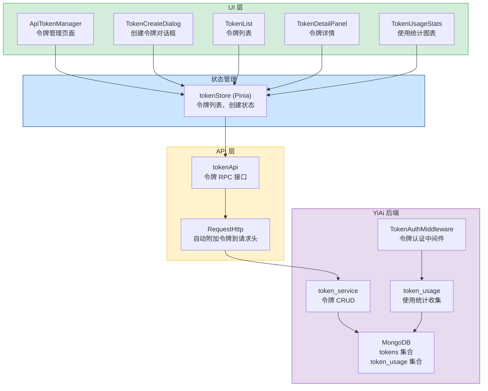
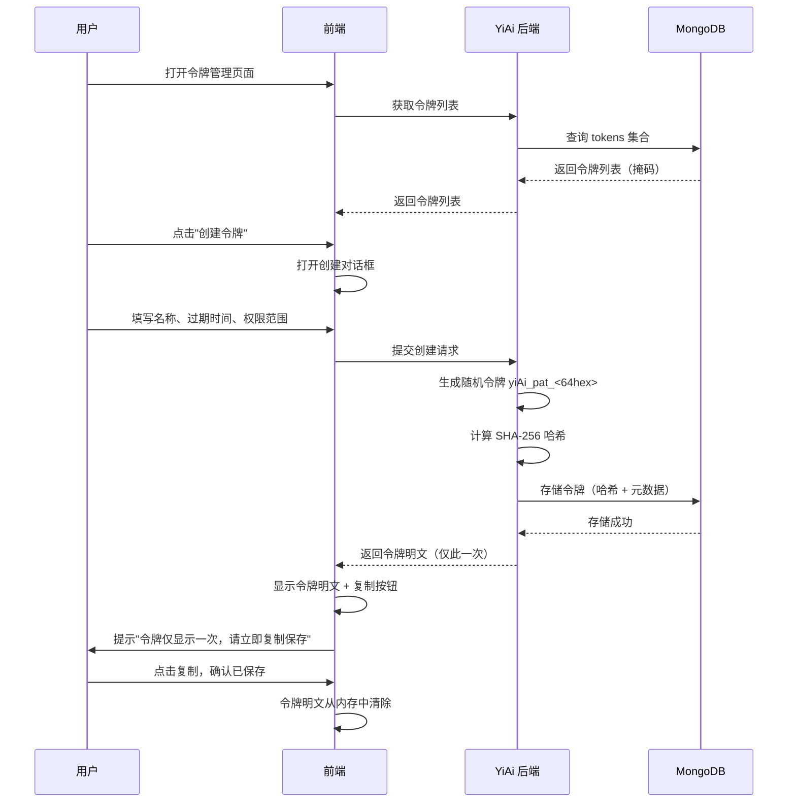

# API 令牌管理

> 需求编号：YV-09-60 · 优先级：P2 · 人天：0.3d
> 依赖：需 YiAi 后端提供令牌 CRUD 端点（`services.auth.token_service`）和令牌认证中间件

## 改动总览

| 改动点 | 类型 | 涉及文件 |
|--------|------|---------|
| API 令牌管理页面 | 新增 | `src/views/settings/ApiTokenManager.vue` |
| 令牌创建对话框 | 新增 | `src/components/token/TokenCreateDialog.vue` |
| 令牌列表组件 | 新增 | `src/components/token/TokenList.vue` |
| 令牌详情面板 | 新增 | `src/components/token/TokenDetailPanel.vue` |
| 令牌使用统计 | 新增 | `src/components/token/TokenUsageStats.vue` |
| 令牌 RPC 接口 | 新增 | `src/api/token.ts` |
| 令牌 Store | 新增 | `src/stores/token.ts` |
| 设置页路由 | 修改 | `src/router/modules/settings.ts` |

## 涉及文件

```
YiVad/
├── src/
│   ├── views/
│   │   └── settings/
│   │       └── ApiTokenManager.vue                 # 新增：API 令牌管理页面
│   ├── components/
│   │   └── token/
│   │       ├── TokenCreateDialog.vue               # 新增：令牌创建对话框（名称、过期时间、权限范围）
│   │       ├── TokenList.vue                       # 新增：令牌列表（掩码显示、状态、操作）
│   │       ├── TokenDetailPanel.vue                # 新增：令牌详情面板（使用统计、最后使用时间）
│   │       └── TokenUsageStats.vue                 # 新增：令牌使用统计图表
│   ├── api/
│   │   └── token.ts                               # 新增：令牌 RPC 接口封装
│   ├── stores/
│   │   └── token.ts                               # 新增：令牌状态管理
│   └── router/
│       └── modules/
│           └── settings.ts                         # 修改：注册 API 令牌管理路由
```

## 基本信息

| 字段 | 值 |
|------|-----|
| 需求编号 | YV-09-60 |
| 模块 | 系统设置 / 安全 |
| 优先级 | **P2**（为第三方工具集成和 API 调用提供安全认证方式） |
| 前端人天 | 0.3d |
| 后端人天 | 0.5d（令牌 CRUD 端点 + 令牌生成/验证 + 使用统计） |
| 依赖 | YiAi auth 服务的令牌认证中间件 |

---

## 背景

YiVad 当前仅支持 Session Cookie / JWT Token 认证（通过登录页面获取），缺少个人访问令牌（Personal Access Token, PAT）管理功能。对于以下场景，令牌认证是必需的：

1. **第三方工具集成**：CI/CD 流水线、监控系统、自动化脚本需要通过 API 访问 YiVad 数据
2. **跨项目调用**：YiPet 浏览器扩展需要长期有效的认证令牌，而非每次重新登录
3. **API 调试**：开发者在 API 调试控制台（YV-09-48）中需要令牌来测试 API 调用
4. **数据导出脚本**：定时导出任务需要令牌来认证 API 请求

当前缺少令牌管理功能，用户无法自主创建、查看、撤销 API 令牌，也无法追踪令牌的使用情况。

**核心问题：**

| # | 问题 | 严重程度 | 影响 |
|---|------|----------|------|
| 1 | **无令牌创建能力** -- 用户无法自主创建 API 令牌 | **高** | 第三方集成和 API 调用无法进行，只能使用 Cookie 认证 |
| 2 | **无令牌生命周期管理** -- 无法设置过期时间、撤销令牌 | **高** | 令牌泄露后无法撤销，存在安全隐患 |
| 3 | **无权限范围控制** -- 所有令牌拥有相同权限 | **高** | 无法实现最小权限原则，令牌权限过大 |
| 4 | **无令牌使用追踪** -- 无法查看令牌使用情况 | **中** | 无法发现异常使用（如令牌泄露后被恶意使用） |
| 5 | **令牌明文仅创建时可见** -- 需确保令牌安全展示和复制 | **高** | 令牌创建后无法再次查看，需在创建时一次性复制 |

---

## 一、现状分析

### 当前认证方式

| 认证方式 | 获取方式 | 有效期 | 适用场景 | 当前状态 |
|----------|---------|--------|---------|----------|
| Session Cookie | 登录页面 | 会话期间 | 浏览器内访问 | 已支持 |
| JWT Token | 登录接口 | 24 小时 | 前端 SPA | 已支持 |
| 个人访问令牌 (PAT) | 无 | -- | API 调用、第三方集成 | **缺失** |

### 令牌格式设计

| 属性 | 值 | 说明 |
|------|-----|------|
| 前缀 | `yiAi_pat_` | 与 YiAi 后端命名统一，便于识别 |
| 令牌格式 | `yiAi_pat_<32字节随机字符串>` | 前缀 + 64 字符十六进制随机字符串 |
| 存储方式 | 后端仅存储 SHA-256 哈希 | 令牌明文不落库，创建时一次性展示 |
| 展示格式 | `yiAi_pat_****abcd` | 仅显示前缀 + 前 4 位 + 后 4 位，中间掩码 |

### 权限范围定义

| 权限范围 | 描述 | 适用场景 |
|----------|------|---------|
| `projects:read` | 读取项目信息 | 仪表盘、监控工具 |
| `projects:write` | 创建和修改项目 | CI/CD 流水线 |
| `issues:read` | 读取 Issue | 数据导出脚本 |
| `issues:write` | 创建和修改 Issue | 自动化工具 |
| `bugs:read` | 读取 Bug | 报表工具 |
| `bugs:write` | 创建和修改 Bug | 错误追踪集成 |
| `knowledge:read` | 读取知识库 | RAG 查询、文档检索 |
| `knowledge:write` | 修改知识库 | 知识库同步工具 |
| `sessions:read` | 读取会话 | 数据分析工具 |
| `sessions:write` | 创建和修改会话 | AI 聊天集成 |
| `admin` | 完全管理权限 | 内部管理脚本 |

### 根因分析矩阵

| 缺失项 | 根因 | 影响链 |
|--------|------|--------|
| 令牌创建 | 未实现令牌管理前端页面和后端 CRUD 端点 | 无 API 令牌可用，第三方集成受阻 |
| 权限范围 | 未定义权限粒度，认证模型仅有"登录/未登录" | 令牌权限过大，违反最小权限原则 |
| 令牌追踪 | 未记录令牌使用日志，无使用统计 | 无法审计令牌使用，无法发现异常 |
| 令牌撤销 | 无撤销接口，令牌创建后永久有效 | 泄露令牌无法作废，安全隐患 |

---

## 二、设计决策

### 决策 1：令牌存储方案

| 维度 | 仅存储哈希 | 加密存储明文 | 决策 |
|------|-----------|-------------|------|
| 安全性 | 高（哈希不可逆） | 中（加密可解密） | **仅存储哈希** |
| 令牌展示 | 仅创建时展示一次 | 可随时查看 | **仅存储哈希** |
| 密钥管理 | 无需额外密钥 | 需要加密密钥 | **仅存储哈希** |
| 符合最佳实践 | 是（GitHub、GitLab 均采用） | 否 | **仅存储哈希** |

**决策：** 后端仅存储令牌的 SHA-256 哈希值。令牌明文仅在创建时展示一次，用户需立即复制保存。丢失后无法找回，只能重新创建。

### 决策 2：令牌权限模型

| 维度 | 角色绑定 | 独立权限范围 | 决策 |
|------|---------|-------------|------|
| 灵活性 | 低（受角色限制） | 高（可自定义） | **独立权限范围** |
| 安全性 | 中（角色变更影响令牌） | 高（令牌独立管理） | **独立权限范围** |
| 实现复杂度 | 低 | 中 | **独立权限范围** |

**决策：** 令牌拥有独立的权限范围（scope），不绑定用户角色。用户创建令牌时选择权限范围，令牌权限不超过用户自身权限。支持预设权限组合（只读、读写、管理）和自定义选择。

### 决策 3：令牌过期策略

| 策略 | 描述 | 默认值 |
|------|------|--------|
| 永不过期 | 令牌永久有效（不推荐） | 不支持 |
| 自定义过期 | 用户选择过期天数（7/30/90/180/365 天） | 默认 90 天 |
| 自定义日期 | 用户选择具体过期日期 | 高级选项 |

**决策：** 支持自定义过期天数，默认 90 天。禁止创建永不过期的令牌。过期令牌自动失效，不可使用。

### 决策 4：令牌使用统计展示

| 统计项 | 来源 | 展示方式 |
|--------|------|---------|
| 总请求数 | 后端令牌认证中间件计数 | 数字 + 折线图 |
| 近 7 天请求数 | 后端日志聚合 | 折线图 |
| 近 24 小时请求数 | 后端日志聚合 | 数字 |
| 限流命中次数 | 后端限流中间件计数 | 数字 + 告警 |
| 最后使用时间 | 后端记录每次请求时间 | 时间戳 |
| 首次使用时间 | 后端记录首次请求时间 | 时间戳 |

**决策：** 前端展示令牌使用统计，数据由后端令牌认证中间件收集并存储在 MongoDB `token_usage` 集合中。

---

## 三、目标架构

### 令牌管理系统架构



### 令牌创建流程



---

## 四、具体改动

### 4.1 令牌管理页面

**文件：** `src/views/settings/ApiTokenManager.vue`（新增）

```vue
<template>
  <div class="api-token-manager">
    <div class="page-header">
      <div class="header-left">
        <h2>API 令牌管理</h2>
        <p class="header-desc">
          管理个人访问令牌（Personal Access Token），用于 API 调用和第三方工具集成。
          令牌仅在创建时显示一次，请妥善保管。
        </p>
      </div>
      <div class="header-right">
        <el-button type="primary" @click="showCreateDialog = true">
          <el-icon><Plus /></el-icon>
          创建令牌
        </el-button>
      </div>
    </div>

    <!-- 令牌列表 -->
    <TokenList
      :tokens="tokenStore.tokens"
      :loading="loading"
      @revoke="handleRevoke"
      @view-detail="handleViewDetail"
    />

    <!-- 创建令牌对话框 -->
    <TokenCreateDialog
      v-model:visible="showCreateDialog"
      @created="onTokenCreated"
    />

    <!-- 令牌详情抽屉 -->
    <el-drawer
      v-model="showDetailDrawer"
      title="令牌详情"
      size="480px"
    >
      <TokenDetailPanel
        v-if="selectedToken"
        :token="selectedToken"
      />
      <TokenUsageStats
        v-if="selectedToken"
        :token-id="selectedToken.id"
      />
    </el-drawer>
  </div>
</template>

<script setup lang="ts">
import { ref, onMounted } from 'vue';
import { ElMessageBox, ElMessage } from 'element-plus';
import { Plus } from '@element-plus/icons-vue';
import { useTokenStore } from '@/stores/token';
import TokenList from '@/components/token/TokenList.vue';
import TokenCreateDialog from '@/components/token/TokenCreateDialog.vue';
import TokenDetailPanel from '@/components/token/TokenDetailPanel.vue';
import TokenUsageStats from '@/components/token/TokenUsageStats.vue';
import type { Token } from '@/types/token';

const tokenStore = useTokenStore();
const loading = ref(false);
const showCreateDialog = ref(false);
const showDetailDrawer = ref(false);
const selectedToken = ref<Token | null>(null);

onMounted(async () => {
  loading.value = true;
  try {
    await tokenStore.fetchTokens();
  } finally {
    loading.value = false;
  }
});

function onTokenCreated(token: Token): void {
  showCreateDialog.value = false;
  // 新创建的令牌已包含在列表中
}

async function handleRevoke(token: Token): Promise<void> {
  try {
    await ElMessageBox.confirm(
      `确定要撤销令牌 "${token.name}" 吗？此操作不可撤销，使用该令牌的所有 API 调用将立即失效。`,
      '撤销令牌',
      {
        confirmButtonText: '确定撤销',
        cancelButtonText: '取消',
        type: 'warning',
      }
    );
    await tokenStore.revokeToken(token.id);
    ElMessage.success('令牌已撤销');
  } catch {
    // 用户取消
  }
}

function handleViewDetail(token: Token): void {
  selectedToken.value = token;
  showDetailDrawer.value = true;
}
</script>
```

### 4.2 令牌创建对话框

**文件：** `src/components/token/TokenCreateDialog.vue`（新增）

```vue
<template>
  <el-dialog
    :model-value="visible"
    title="创建 API 令牌"
    width="560px"
    :close-on-click-modal="false"
    @update:model-value="$emit('update:visible', $event)"
    @close="resetForm"
  >
    <!-- 创建表单 -->
    <el-form
      v-if="!createdToken"
      ref="formRef"
      :model="form"
      :rules="rules"
      label-width="100px"
    >
      <el-form-item label="令牌名称" prop="name">
        <el-input
          v-model="form.name"
          placeholder="例如：CI/CD 流水线、监控脚本"
          maxlength="50"
          show-word-limit
        />
        <div class="form-hint">用于识别令牌用途的名称</div>
      </el-form-item>

      <el-form-item label="过期时间" prop="expiresIn">
        <el-select v-model="form.expiresIn" placeholder="选择过期时间">
          <el-option label="7 天" :value="7" />
          <el-option label="30 天" :value="30" />
          <el-option label="90 天（推荐）" :value="90" />
          <el-option label="180 天" :value="180" />
          <el-option label="365 天" :value="365" />
          <el-option label="自定义" :value="0" />
        </el-select>
        <el-date-picker
          v-if="form.expiresIn === 0"
          v-model="form.customExpires"
          type="date"
          placeholder="选择过期日期"
          :disabled-date="disabledDate"
          style="margin-left: 12px; width: 200px"
        />
      </el-form-item>

      <el-form-item label="权限范围" prop="scopes">
        <div class="scope-presets">
          <el-radio-group v-model="scopePreset" @change="onPresetChange">
            <el-radio-button value="read">只读</el-radio-button>
            <el-radio-button value="write">读写</el-radio-button>
            <el-radio-button value="admin">管理</el-radio-button>
            <el-radio-button value="custom">自定义</el-radio-button>
          </el-radio-group>
        </div>

        <div v-if="scopePreset === 'custom'" class="scope-checkboxes">
          <div class="scope-group">
            <h4>项目</h4>
            <el-checkbox v-model="customScopes" label="projects:read">读取</el-checkbox>
            <el-checkbox v-model="customScopes" label="projects:write">写入</el-checkbox>
          </div>
          <div class="scope-group">
            <h4>Issue</h4>
            <el-checkbox v-model="customScopes" label="issues:read">读取</el-checkbox>
            <el-checkbox v-model="customScopes" label="issues:write">写入</el-checkbox>
          </div>
          <div class="scope-group">
            <h4>Bug</h4>
            <el-checkbox v-model="customScopes" label="bugs:read">读取</el-checkbox>
            <el-checkbox v-model="customScopes" label="bugs:write">写入</el-checkbox>
          </div>
          <div class="scope-group">
            <h4>知识库</h4>
            <el-checkbox v-model="customScopes" label="knowledge:read">读取</el-checkbox>
            <el-checkbox v-model="customScopes" label="knowledge:write">写入</el-checkbox>
          </div>
          <div class="scope-group">
            <h4>会话</h4>
            <el-checkbox v-model="customScopes" label="sessions:read">读取</el-checkbox>
            <el-checkbox v-model="customScopes" label="sessions:write">写入</el-checkbox>
          </div>
        </div>
      </el-form-item>
    </el-form>

    <!-- 创建成功展示 -->
    <div v-else class="token-created">
      <el-alert
        title="令牌创建成功"
        type="success"
        :closable="false"
        show-icon
      >
        <template #default>
          <p class="token-warning">
            请立即复制并保存此令牌。<strong>此令牌仅显示一次</strong>，关闭此对话框后将无法再次查看。
          </p>
        </template>
      </el-alert>

      <div class="token-display">
        <div class="token-value">
          <code>{{ createdToken }}</code>
        </div>
        <el-button
          type="primary"
          :icon="DocumentCopy"
          @click="copyToken"
        >
          {{ copied ? '已复制' : '复制令牌' }}
        </el-button>
      </div>

      <div class="token-usage-example">
        <h4>使用示例</h4>
        <pre><code>curl -H "Authorization: Bearer {{ createdToken }}" \
  -H "Content-Type: application/json" \
  -X POST http://localhost:10086/ \
  -d '{"module_name":"services.data.data_service","method_name":"query_documents","parameters":{"cname":"issues","filter":{}}}'</code></pre>
      </div>
    </div>

    <template #footer>
      <div v-if="!createdToken">
        <el-button @click="$emit('update:visible', false)">取消</el-button>
        <el-button type="primary" :loading="creating" @click="handleCreate">
          创建令牌
        </el-button>
      </div>
      <div v-else>
        <el-button type="primary" @click="handleDone">
          我已保存令牌
        </el-button>
      </div>
    </template>
  </el-dialog>
</template>

<script setup lang="ts">
import { ref, reactive, computed } from 'vue';
import { ElMessage } from 'element-plus';
import { DocumentCopy } from '@element-plus/icons-vue';
import { useTokenStore } from '@/stores/token';
import type { FormInstance, FormRules } from 'element-plus';

const props = defineProps<{
  visible: boolean;
}>();

const emit = defineEmits<{
  'update:visible': [value: boolean];
  created: [token: Token];
}>();

const tokenStore = useTokenStore();
const formRef = ref<FormInstance>();
const creating = ref(false);
const createdToken = ref('');
const copied = ref(false);
const scopePreset = ref('read');
const customScopes = ref<string[]>([]);

const form = reactive({
  name: '',
  expiresIn: 90,
  customExpires: null as Date | null,
});

const rules: FormRules = {
  name: [
    { required: true, message: '请输入令牌名称', trigger: 'blur' },
    { min: 2, max: 50, message: '名称长度在 2 到 50 个字符之间', trigger: 'blur' },
  ],
  expiresIn: [
    { required: true, message: '请选择过期时间', trigger: 'change' },
  ],
};

const disabledDate = (time: Date): boolean => {
  return time.getTime() < Date.now() - 8.64e7; // 不能选择今天之前的日期
};

const scopePresetMap: Record<string, string[]> = {
  read: ['projects:read', 'issues:read', 'bugs:read', 'knowledge:read', 'sessions:read'],
  write: ['projects:read', 'projects:write', 'issues:read', 'issues:write', 'bugs:read', 'bugs:write', 'knowledge:read', 'sessions:read', 'sessions:write'],
  admin: ['projects:read', 'projects:write', 'issues:read', 'issues:write', 'bugs:read', 'bugs:write', 'knowledge:read', 'knowledge:write', 'sessions:read', 'sessions:write', 'admin'],
};

function onPresetChange(value: string): void {
  if (value !== 'custom') {
    customScopes.value = [];
  }
}

function getScopes(): string[] {
  if (scopePreset.value === 'custom') {
    return customScopes.value;
  }
  return scopePresetMap[scopePreset.value] || [];
}

async function handleCreate(): Promise<void> {
  if (!formRef.value) return;
  const valid = await formRef.value.validate().catch(() => false);
  if (!valid) return;

  creating.value = true;
  try {
    let expiresAt: string;
    if (form.expiresIn === 0 && form.customExpires) {
      expiresAt = form.customExpires.toISOString();
    } else {
      const days = form.expiresIn;
      expiresAt = new Date(Date.now() + days * 86400000).toISOString();
    }

    const result = await tokenStore.createToken({
      name: form.name,
      scopes: getScopes(),
      expiresAt,
    });

    createdToken.value = result.token;
    emit('created', result);
  } catch (err) {
    ElMessage.error((err as Error).message || '创建令牌失败');
  } finally {
    creating.value = false;
  }
}

async function copyToken(): Promise<void> {
  try {
    await navigator.clipboard.writeText(createdToken.value);
    copied.value = true;
    ElMessage.success('令牌已复制到剪贴板');
    setTimeout(() => { copied.value = false; }, 3000);
  } catch {
    // 降级方案：选中文本
    const codeEl = document.querySelector('.token-value code');
    if (codeEl) {
      const range = document.createRange();
      range.selectNode(codeEl);
      window.getSelection()?.removeAllRanges();
      window.getSelection()?.addRange(range);
      ElMessage.info('请手动复制（Ctrl+C / Cmd+C）');
    }
  }
}

function handleDone(): void {
  createdToken.value = '';
  copied.value = false;
  emit('update:visible', false);
}

function resetForm(): void {
  createdToken.value = '';
  copied.value = false;
  form.name = '';
  form.expiresIn = 90;
  form.customExpires = null;
  scopePreset.value = 'read';
  customScopes.value = [];
  formRef.value?.resetFields();
}
</script>

<style scoped lang="scss">
.token-created {
  .token-warning {
    margin: 8px 0 0;
    font-size: 13px;
    color: var(--el-color-warning);
  }

  .token-display {
    margin: 16px 0;
    display: flex;
    gap: 12px;
    align-items: center;

    .token-value {
      flex: 1;
      padding: 12px;
      background: var(--el-fill-color-light);
      border-radius: 6px;
      overflow-x: auto;

      code {
        font-size: 13px;
        word-break: break-all;
        user-select: all;
      }
    }
  }

  .token-usage-example {
    margin-top: 16px;

    pre {
      background: #1e1e1e;
      color: #d4d4d4;
      padding: 12px;
      border-radius: 6px;
      overflow-x: auto;
      font-size: 12px;
      line-height: 1.5;
    }
  }
}

.scope-presets {
  margin-bottom: 12px;
}

.scope-checkboxes {
  .scope-group {
    margin-bottom: 8px;

    h4 {
      margin: 0 0 4px;
      font-size: 13px;
      color: var(--el-text-color-secondary);
    }
  }
}

.form-hint {
  font-size: 12px;
  color: var(--el-text-color-secondary);
  margin-top: 4px;
}
</style>
```

### 4.3 令牌列表组件

**文件：** `src/components/token/TokenList.vue`（新增）

```vue
<template>
  <div class="token-list">
    <el-table
      :data="tokens"
      v-loading="loading"
      empty-text="暂无 API 令牌"
    >
      <el-table-column prop="name" label="名称" min-width="160">
        <template #default="{ row }">
          <div class="token-name">
            <span class="name-text">{{ row.name }}</span>
            <el-tag v-if="row.lastUsedAt && isRecentlyUsed(row.lastUsedAt)" size="small" type="success" effect="plain">
              活跃
            </el-tag>
            <el-tag v-else-if="!row.lastUsedAt" size="small" type="info" effect="plain">
              从未使用
            </el-tag>
          </div>
        </template>
      </el-table-column>

      <el-table-column label="令牌" min-width="240">
        <template #default="{ row }">
          <code class="token-masked">{{ row.maskedToken }}</code>
          <el-tooltip content="复制掩码令牌">
            <el-button
              :icon="DocumentCopy"
              text
              size="small"
              @click="copyMasked(row.maskedToken)"
            />
          </el-tooltip>
        </template>
      </el-table-column>

      <el-table-column prop="scopes" label="权限" min-width="200">
        <template #default="{ row }">
          <div class="scope-tags">
            <el-tag
              v-for="scope in row.scopes"
              :key="scope"
              size="small"
              :type="scopeTagType(scope)"
            >
              {{ scope }}
            </el-tag>
          </div>
        </template>
      </el-table-column>

      <el-table-column label="创建时间" width="120">
        <template #default="{ row }">
          {{ formatDate(row.createdAt) }}
        </template>
      </el-table-column>

      <el-table-column label="过期时间" width="120">
        <template #default="{ row }">
          <span :class="{ 'text-danger': isExpired(row.expiresAt) }">
            {{ formatDate(row.expiresAt) }}
          </span>
          <el-tag v-if="isExpiringSoon(row.expiresAt)" size="small" type="warning" effect="plain">
            即将过期
          </el-tag>
        </template>
      </el-table-column>

      <el-table-column label="最后使用" width="120">
        <template #default="{ row }">
          {{ row.lastUsedAt ? formatDate(row.lastUsedAt) : '-' }}
        </template>
      </el-table-column>

      <el-table-column label="操作" width="160" fixed="right">
        <template #default="{ row }">
          <el-button text type="primary" size="small" @click="$emit('view-detail', row)">
            详情
          </el-button>
          <el-button text type="danger" size="small" @click="$emit('revoke', row)">
            撤销
          </el-button>
        </template>
      </el-table-column>
    </el-table>
  </div>
</template>

<script setup lang="ts">
import { DocumentCopy } from '@element-plus/icons-vue';
import { ElMessage } from 'element-plus';
import type { Token } from '@/types/token';

defineProps<{
  tokens: Token[];
  loading: boolean;
}>();

defineEmits<{
  revoke: [token: Token];
  'view-detail': [token: Token];
}>();

function formatDate(iso: string): string {
  if (!iso) return '-';
  return new Date(iso).toLocaleDateString('zh-CN');
}

function isExpired(expiresAt: string): boolean {
  return new Date(expiresAt) < new Date();
}

function isExpiringSoon(expiresAt: string): boolean {
  const days = (new Date(expiresAt).getTime() - Date.now()) / 86400000;
  return days > 0 && days <= 7;
}

function isRecentlyUsed(lastUsedAt: string): boolean {
  const hours = (Date.now() - new Date(lastUsedAt).getTime()) / 3600000;
  return hours <= 24;
}

function scopeTagType(scope: string): string {
  if (scope === 'admin') return 'danger';
  if (scope.endsWith(':write')) return 'warning';
  if (scope.endsWith(':read')) return 'info';
  return '';
}

async function copyMasked(text: string): Promise<void> {
  try {
    await navigator.clipboard.writeText(text);
    ElMessage.success('已复制');
  } catch {
    ElMessage.info('复制失败，请手动复制');
  }
}
</script>
```

### 4.4 令牌 RPC 接口

**文件：** `src/api/token.ts`（新增）

```typescript
import RequestHttp from './request';

export interface CreateTokenParams {
  name: string;
  scopes: string[];
  expiresAt: string;
}

export interface TokenResponse {
  id: string;
  name: string;
  maskedToken: string;
  scopes: string[];
  createdAt: string;
  expiresAt: string;
  lastUsedAt: string | null;
  requestCount: number;
  isRevoked: boolean;
}

export interface CreateTokenResponse {
  token: TokenResponse;
  /** 令牌明文，仅在创建时返回 */
  plainToken: string;
}

export interface TokenUsageStats {
  tokenId: string;
  totalRequests: number;
  requestsLast24h: number;
  requestsLast7d: number;
  dailyRequests: Array<{ date: string; count: number }>;
  rateLimitHits: number;
  lastUsedAt: string | null;
  firstUsedAt: string | null;
}

export const tokenApi = {
  /** 获取令牌列表 */
  getTokens() {
    return RequestHttp.post({
      module_name: 'services.auth.token_service',
      method_name: 'get_tokens',
      parameters: {},
    });
  },

  /** 创建令牌 */
  createToken(params: CreateTokenParams) {
    return RequestHttp.post({
      module_name: 'services.auth.token_service',
      method_name: 'create_token',
      parameters: {
        name: params.name,
        scopes: params.scopes,
        expires_at: params.expiresAt,
      },
    });
  },

  /** 撤销令牌 */
  revokeToken(tokenId: string) {
    return RequestHttp.post({
      module_name: 'services.auth.token_service',
      method_name: 'revoke_token',
      parameters: { token_id: tokenId },
    });
  },

  /** 获取令牌使用统计 */
  getTokenUsage(tokenId: string) {
    return RequestHttp.post({
      module_name: 'services.auth.token_service',
      method_name: 'get_token_usage',
      parameters: { token_id: tokenId },
    });
  },
};
```

### 4.5 令牌 Store

**文件：** `src/stores/token.ts`（新增）

```typescript
import { defineStore } from 'pinia';
import { ref, computed } from 'vue';
import { tokenApi } from '@/api/token';
import type { TokenResponse, CreateTokenResponse, TokenUsageStats } from '@/api/token';
import { ElMessage } from 'element-plus';

export const useTokenStore = defineStore('token', () => {
  const tokens = ref<TokenResponse[]>([]);
  const loading = ref(false);
  const usageStats = ref<Map<string, TokenUsageStats>>(new Map());

  const activeTokens = computed(() =>
    tokens.value.filter((t) => !t.isRevoked && new Date(t.expiresAt) > new Date())
  );

  const revokedTokens = computed(() =>
    tokens.value.filter((t) => t.isRevoked)
  );

  const expiredTokens = computed(() =>
    tokens.value.filter((t) => !t.isRevoked && new Date(t.expiresAt) <= new Date())
  );

  async function fetchTokens(): Promise<void> {
    loading.value = true;
    try {
      const response = await tokenApi.getTokens();
      if (response.code === 0) {
        tokens.value = response.data;
      }
    } catch (err) {
      ElMessage.error('获取令牌列表失败');
    } finally {
      loading.value = false;
    }
  }

  async function createToken(params: {
    name: string;
    scopes: string[];
    expiresAt: string;
  }): Promise<CreateTokenResponse> {
    const response = await tokenApi.createToken(params);
    if (response.code === 0) {
      tokens.value.unshift(response.data.token);
      return response.data;
    }
    throw new Error(response.message || '创建令牌失败');
  }

  async function revokeToken(tokenId: string): Promise<void> {
    const response = await tokenApi.revokeToken(tokenId);
    if (response.code === 0) {
      const token = tokens.value.find((t) => t.id === tokenId);
      if (token) {
        token.isRevoked = true;
      }
    } else {
      throw new Error(response.message || '撤销令牌失败');
    }
  }

  async function fetchUsageStats(tokenId: string): Promise<TokenUsageStats | null> {
    try {
      const response = await tokenApi.getTokenUsage(tokenId);
      if (response.code === 0) {
        usageStats.value.set(tokenId, response.data);
        return response.data;
      }
    } catch {
      // 静默处理
    }
    return null;
  }

  return {
    tokens,
    loading,
    usageStats,
    activeTokens,
    revokedTokens,
    expiredTokens,
    fetchTokens,
    createToken,
    revokeToken,
    fetchUsageStats,
  };
});
```

---

## 五、实施步骤

| 步骤 | 任务 | 产出 | 验证方式 | 人天 |
|------|------|------|----------|------|
| 1 | 创建令牌 RPC 接口封装 | `src/api/token.ts` | 接口封装正确，参数名称符合 RPC 契约 | 0.03 |
| 2 | 创建令牌 Store | `src/stores/token.ts` | 令牌列表、创建、撤销功能正常 | 0.05 |
| 3 | 创建令牌管理页面 | `src/views/settings/ApiTokenManager.vue` | 页面渲染正确，令牌列表和详情展示正常 | 0.05 |
| 4 | 创建令牌创建对话框 | `src/components/token/TokenCreateDialog.vue` | 创建流程完整，令牌明文展示和复制正常 | 0.07 |
| 5 | 创建令牌列表组件 | `src/components/token/TokenList.vue` | 令牌掩码显示、状态标签、过期提示正确 | 0.05 |
| 6 | 创建令牌详情面板 | `src/components/token/TokenDetailPanel.vue` | 详情信息展示完整 | 0.03 |
| 7 | 创建令牌使用统计组件 | `src/components/token/TokenUsageStats.vue` | 折线图和统计数字正确 | 0.02 |

**总计：** 0.3d

---

## 六、测试规格

### Scenario: 创建令牌并复制

- **GIVEN** 用户打开令牌管理页面，点击"创建令牌"
- **WHEN** 用户填写名称"CI/CD Pipeline"，选择 90 天过期，权限范围"读写"
- **THEN** 创建成功，显示令牌明文 `yiAi_pat_xxxx...`
- **AND** 提示"令牌仅显示一次，请立即复制保存"
- **WHEN** 用户点击"复制令牌"
- **THEN** 令牌复制到剪贴板，显示"已复制"
- **WHEN** 用户点击"我已保存令牌"
- **THEN** 对话框关闭，令牌列表新增一条记录

### Scenario: 令牌列表掩码显示

- **GIVEN** 用户拥有 3 个令牌
- **WHEN** 令牌管理页面加载完毕
- **THEN** 令牌列表显示 3 条记录，每条令牌显示为 `yiAi_pat_****abcd` 格式
- **AND** 令牌明文不可见

### Scenario: 撤销令牌

- **GIVEN** 令牌列表中有 1 个活跃令牌
- **WHEN** 用户点击"撤销"按钮
- **THEN** 弹出确认对话框"确定要撤销令牌吗？此操作不可撤销"
- **WHEN** 用户确认撤销
- **THEN** 令牌状态变为"已撤销"，使用该令牌的所有 API 调用立即失效

### Scenario: 令牌过期提示

- **GIVEN** 令牌列表中有 1 个将在 3 天后过期的令牌
- **WHEN** 令牌管理页面加载
- **THEN** 该令牌的过期时间列显示"即将过期"标签（黄色警告）

### Scenario: 权限范围预设选择

- **GIVEN** 用户打开创建令牌对话框
- **WHEN** 用户选择权限范围预设"只读"
- **THEN** 自动勾选所有 `:read` 权限范围
- **WHEN** 用户切换为"自定义"
- **THEN** 显示所有权限范围的复选框，用户可自由勾选

### Scenario: 令牌使用统计

- **GIVEN** 用户点击令牌"详情"
- **WHEN** 详情抽屉打开
- **THEN** 显示令牌基本信息（名称、创建时间、过期时间、权限范围）
- **AND** 显示使用统计（总请求数、近 7 天请求数、最后使用时间）
- **AND** 显示近 7 天请求数折线图

### Scenario: 创建令牌后关闭对话框未保存

- **GIVEN** 用户创建令牌成功，令牌明文已显示
- **WHEN** 用户直接关闭对话框（未点击"我已保存令牌"）
- **THEN** 令牌仍创建成功，加入令牌列表
- **AND** 令牌明文不再可见（无法再次查看）

### Scenario: 令牌名称校验

- **GIVEN** 用户打开创建令牌对话框
- **WHEN** 用户不填写名称直接提交
- **THEN** 显示"请输入令牌名称"错误提示
- **WHEN** 用户填写超过 50 个字符的名称
- **THEN** 显示"名称长度在 2 到 50 个字符之间"错误提示

---

## 七、风险与缓解

| 风险 | 概率 | 影响 | 等级 | 缓解措施 | 应急预案 |
|------|------|------|------|----------|----------|
| 令牌明文在浏览器内存中残留 | 中 | 高 | 高 | 创建完成后立即从响应式状态中清除，使用 `ref<string>` 而非持久化 | 建议用户创建后立即关闭浏览器 Tab 并重新打开 |
| 令牌复制到剪贴板后被其他应用读取 | 低 | 中 | 低 | 使用 `navigator.clipboard.writeText` 后提示用户清除剪贴板 | 在系统级别管理剪贴板安全 |
| 后端令牌认证中间件性能影响 | 中 | 中 | 中 | 每次请求查询 SHA-256 哈希，可缓存活跃令牌列表 | 降级为仅 Cookie 认证 |
| 令牌使用统计数据量过大 | 低 | 低 | 低 | 仅保留近 30 天统计数据，定期清理旧数据 | 统计页面显示"仅展示近 30 天数据" |

---

## 八、回滚策略

| 回滚场景 | 回滚方式 | 影响范围 | 恢复时间 |
|----------|----------|----------|----------|
| 令牌管理页面崩溃 | 从路由中移除令牌管理页面 | 设置页面 | < 2min |
| 令牌创建功能异常 | 隐藏"创建令牌"按钮，仅保留令牌列表查看 | 令牌创建 | < 1min |
| 令牌认证中间件性能问题 | 关闭令牌认证中间件，仅保留 Cookie 认证 | API 令牌认证 | < 5min |
| 令牌使用统计查询超时 | 隐藏使用统计组件，仅展示基本信息 | 令牌详情 | < 1min |

**回滚验证：**
- 回滚后设置页面正常加载
- 回滚后现有 Cookie 认证不受影响
- 回滚后已创建的令牌仍可正常使用（令牌存储在 MongoDB 中）

---

## 九、设计决策记录

### D-01: 令牌仅存储哈希，明文仅创建时展示

**背景：** 令牌安全存储是行业最佳实践。
**决策：** 后端仅存储 SHA-256 哈希值，令牌明文仅在创建时展示一次。参考 GitHub、GitLab 的 PAT 管理方式。
**权衡：** 用户丢失令牌后无法找回，只能重新创建。但这是确保令牌安全的必要措施。
**后果：** 需要在创建对话框中明确提示用户立即复制保存，并展示"使用示例"帮助用户理解如何使用令牌。

### D-02: 令牌权限范围独立于用户角色

**背景：** 令牌权限需要灵活控制，不应受用户角色变化影响。
**决策：** 令牌拥有独立的权限范围（scope），不绑定用户角色。令牌权限不超过用户自身权限。
**权衡：** 用户角色变更后，令牌权限不会自动更新，需要用户手动撤销并重新创建。
**后果：** 需要在令牌详情中显示"权限来源：令牌独立权限"，明确告知用户。

### D-03: 默认过期 90 天

**背景：** 令牌需要定期轮换以确保安全。
**决策：** 默认过期时间为 90 天，支持 7/30/90/180/365 天选项。禁止创建永不过期的令牌。
**权衡：** 用户需要定期更新令牌，但这是安全最佳实践。90 天是 GitHub 和 GitLab 的默认值。
**后果：** 令牌过期前 7 天需要在令牌列表中显示"即将过期"提醒。

### D-04: 使用统计存储在后端而非前端

**背景：** 令牌使用统计需要准确的计数，前端无法保证。
**决策：** 使用统计由后端令牌认证中间件收集，存储在 MongoDB `token_usage` 集合中。前端通过 RPC 接口查询。
**权衡：** 每次 API 请求都会产生一次 MongoDB 写入操作，增加后端负载。但统计数据准确可靠。
**后果：** 需要设置统计数据的保留策略（近 30 天），避免数据量过大。

---

## 十、可观测性

### 关键指标

| 指标 | 采集方式 | 告警阈值 | 说明 |
|------|---------|---------|------|
| 令牌创建数 | 后端埋点 | -- | 用户创建令牌的频率 |
| 令牌撤销数 | 后端埋点 | -- | 令牌撤销的频率 |
| 活跃令牌数 | 后端查询 | -- | 当前有效的令牌总数 |
| 令牌认证成功率 | 后端中间件 | < 95% | 令牌认证请求的成功比例 |
| 令牌认证 QPS | 后端中间件 | > 100/s | 令牌认证的请求速率 |
| 即将过期令牌数 | 前端计算 | > 0 | 7 天内将过期的令牌 |

### 告警规则

| 告警 | 条件 | 级别 | 处理 |
|------|------|------|------|
| 令牌认证失败率过高 | 失败率 > 5% 持续 5 分钟 | P2 | 检查令牌认证中间件，确认是否有令牌泄露导致频繁失败 |
| 单个令牌请求量异常 | 单令牌 QPS > 50/s | P3 | 检查是否为正常使用，考虑限流 |
| 大量令牌即将过期 | 即将过期令牌 > 10 | P3 | 提醒用户更新令牌 |

---

## 十一、代码审查检查清单

- [ ] `ApiTokenManager.vue` 页面布局正确，令牌列表和详情抽屉功能正常
- [ ] `TokenCreateDialog.vue` 创建流程完整，令牌明文展示和复制功能正常
- [ ] `TokenCreateDialog.vue` 关闭对话框后令牌明文从内存中清除
- [ ] `TokenList.vue` 令牌掩码显示正确（`yiAi_pat_****abcd`）
- [ ] `TokenList.vue` 过期/即将过期/活跃状态标签正确
- [ ] `TokenList.vue` 权限范围标签显示正确
- [ ] `TokenDetailPanel.vue` 详情信息展示完整
- [ ] `TokenUsageStats.vue` 折线图和统计数字正确
- [ ] `tokenApi.ts` RPC 接口参数名称符合契约（使用 `filter` 而非 `query`）
- [ ] `tokenStore.ts` 状态管理正确，令牌列表、创建、撤销功能正常
- [ ] 路由注册正确，令牌管理页面可从设置页访问
- [ ] `vue-tsc --noEmit` 通过

---

## 回归问题预测

| # | 问题 | 预测场景 | 根因 | 预防措施 |
|---|------|---------|------|---------|
| 1 | 令牌创建后，对话框关闭前用户刷新页面，令牌明文丢失 | 用户创建令牌成功，在复制令牌前意外刷新页面 | 令牌明文仅存储在对话框的 `ref<string>` 中，页面刷新后丢失 | 在创建成功提示中明确说明"令牌仅显示一次，请立即复制"，不提供关闭按钮直到用户确认已保存 |
| 2 | 撤销令牌后，使用该令牌的已建立连接不立即失效 | 用户撤销令牌后，已有的 SSE 连接或 WebSocket 连接仍使用旧令牌 | 令牌认证中间件在连接建立时验证一次，之后不在每次消息中验证 | 在撤销令牌时，后端主动关闭使用该令牌的所有活跃连接 |
| 3 | 令牌过期时间仅存储为日期，未考虑时区差异 | 用户选择过期日期为 2026-12-31，但服务器时区为 UTC，可能早于用户预期过期 | 前端使用本地时区展示日期，后端使用 UTC 存储，过期判断可能不一致 | 统一使用 ISO 8601 格式（含时区信息），过期判断使用服务器时间 |
| 4 | 权限范围自定义选择时，用户忘记勾选必要权限 | 用户创建"读写"令牌，但手动勾选时遗漏了 `issues:write` 权限 | 自定义权限选择无预设检查，用户可能遗漏必要权限 | 在提交前检查权限范围，如果包含 `:write` 但无对应 `:read`，给出警告提示 |
| 5 | 令牌列表加载时，已撤销令牌的样式与活跃令牌无区分 | 用户误以为已撤销令牌仍可用，尝试使用 | 已撤销令牌在列表中与活跃令牌样式相同，仅状态标签不同 | 已撤销令牌使用灰色文字 + 删除线样式，明确区分 |
| 6 | 创建令牌时，权限范围名称与后端不匹配 | 前端定义的权限范围字符串与后端认证中间件检查的字符串不一致 | 前后端权限范围定义未同步，可能出现前端允许的权限后端不识别 | 权限范围列表从后端 API 获取（而非前端硬编码），确保前后端一致 |

---

## 性能分析

### 令牌操作耗时预估

| 操作 | 耗时 | 说明 |
|------|------|------|
| 获取令牌列表 | < 200ms | 查询 MongoDB `tokens` 集合，通常 < 10 条记录 |
| 创建令牌 | < 300ms | SHA-256 哈希计算 + MongoDB 写入 |
| 撤销令牌 | < 200ms | MongoDB `updateOne` 操作 |
| 获取使用统计 | < 500ms | MongoDB 聚合查询 `token_usage` 集合 |
| 令牌认证 | < 5ms | SHA-256 哈希比对 + 缓存命中 |

### 令牌认证中间件性能

| 指标 | 值 | 说明 |
|------|-----|------|
| 单次认证耗时 | < 5ms | SHA-256 哈希计算 + 缓存查询 |
| 缓存命中率 | > 95% | 活跃令牌缓存在内存中 |
| 缓存容量 | 1000 个令牌 | 超过后 LRU 淘汰 |
| 缓存 TTL | 60 秒 | 令牌撤销后最多 60 秒内生效 |

### 前端页面性能

| 指标 | 值 | 说明 |
|------|-----|------|
| 令牌管理页面首屏加载 | < 200ms | 组件简单，无大依赖 |
| 令牌列表渲染（10 条） | < 20ms | 简单表格渲染 |
| 使用统计图表渲染 | < 100ms | 折线图（30 个数据点） |
| 创建对话框打开 | < 50ms | 表单组件挂载 |

### 依赖包体积影响

| 组件 | 大小（gzip） | 对首屏影响 |
|------|------------|-----------|
| 令牌管理页面 | ~10KB | 无（路由懒加载） |
| 令牌创建对话框 | ~8KB | 无（弹窗懒加载） |
| 令牌使用统计图表 | ~15KB | 无（抽屉懒加载） |
| 令牌 Store + API | ~3KB | 极小（< 3KB） |

**首屏体积增长：** < 3KB，对首屏加载无影响。

