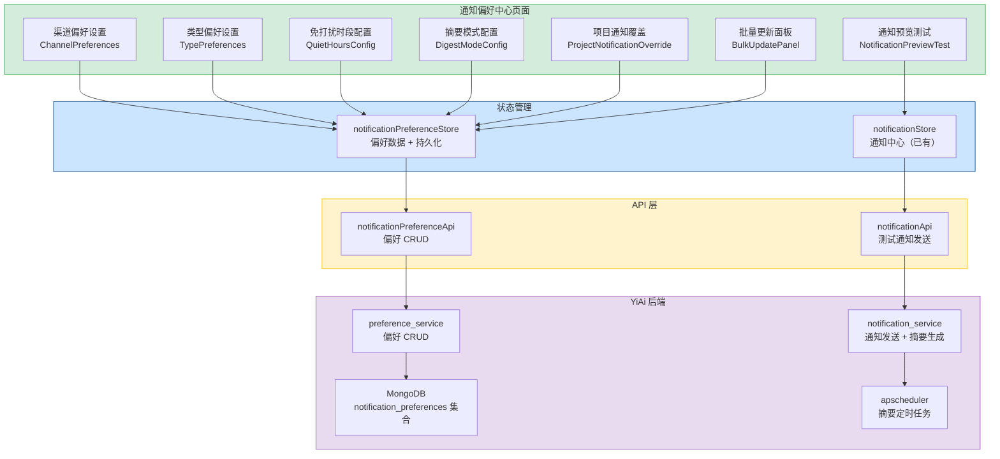

# 通知偏好中心

> 需求编号：YV-09-61 · 优先级：P2 · 人天：0.3d
> 依赖：依赖通知中心（YV-09-27），需 YiAi 后端提供通知偏好存储端点

## 改动总览

| 改动点 | 类型 | 涉及文件 |
|--------|------|---------|
| 通知偏好中心页面 | 新增 | `src/views/settings/NotificationPreferenceCenter.vue` |
| 渠道偏好设置组件 | 新增 | `src/components/notification/ChannelPreferences.vue` |
| 类型偏好设置组件 | 新增 | `src/components/notification/TypePreferences.vue` |
| 免打扰时段配置组件 | 新增 | `src/components/notification/QuietHoursConfig.vue` |
| 摘要模式配置组件 | 新增 | `src/components/notification/DigestModeConfig.vue` |
| 项目通知覆盖组件 | 新增 | `src/components/notification/ProjectNotificationOverride.vue` |
| 通知预览测试组件 | 新增 | `src/components/notification/NotificationPreviewTest.vue` |
| 通知偏好 Store | 增强 | `src/stores/notification.ts`（扩展偏好管理） |
| 通知偏好 RPC 接口 | 新增 | `src/api/notificationPreference.ts` |
| 设置页路由 | 修改 | `src/router/modules/settings.ts` |

## 涉及文件

```
YiVad/
├── src/
│   ├── views/
│   │   └── settings/
│   │       └── NotificationPreferenceCenter.vue     # 新增：通知偏好中心主页面
│   ├── components/
│   │   └── notification/
│   │       ├── ChannelPreferences.vue               # 新增：渠道偏好设置（应用内/邮件/浏览器推送/企业微信）
│   │       ├── TypePreferences.vue                  # 新增：类型偏好设置（提及/分配/状态变更/评论/截止日期/系统）
│   │       ├── QuietHoursConfig.vue                 # 新增：免打扰时段配置
│   │       ├── DigestModeConfig.vue                 # 新增：摘要模式配置（每日/每周摘要）
│   │       ├── ProjectNotificationOverride.vue      # 新增：项目级通知覆盖
│   │       ├── NotificationPreviewTest.vue          # 新增：通知预览和测试发送
│   │       └── BulkUpdatePanel.vue                  # 新增：批量更新面板（启用所有邮件、禁用所有推送）
│   ├── api/
│   │   └── notificationPreference.ts                # 新增：通知偏好 RPC 接口封装
│   ├── stores/
│   │   └── notification.ts                          # 增强：扩展偏好管理状态
│   └── router/
│       └── modules/
│           └── settings.ts                          # 修改：注册通知偏好中心路由
```

## 基本信息

| 字段 | 值 |
|------|-----|
| 需求编号 | YV-09-61 |
| 模块 | 系统设置 / 通知 |
| 优先级 | **P2**（提升用户通知体验，减少信息过载） |
| 前端人天 | 0.3d |
| 后端人天 | 0.2d（通知偏好 CRUD 端点 + 通知测试发送端点） |
| 依赖 | 通知中心（YV-09-27）、企业微信集成（如已实现） |

---

## 背景

YiVad 的通知中心（YV-09-27）实现了统一的通知接收和展示，但通知偏好管理仍较为基础——仅支持按类型开关和简单的免打扰时段。随着通知渠道和类型的增多，用户需要更精细化的偏好控制能力：

1. **多渠道通知**：用户可能同时使用应用内通知、邮件、浏览器推送和企业微信，需要为每个渠道独立配置
2. **多类型通知**：提及、分配、状态变更、评论、截止日期、系统通知等不同类型，用户对不同类型敏感度不同
3. **摘要模式**：高频通知场景下，用户更希望接收摘要而非逐条通知
4. **免打扰时段**：工作时间外的通知应被静默
5. **项目级覆盖**：不同项目的重要程度不同，通知策略也应不同

**核心问题：**

| # | 问题 | 严重程度 | 影响 |
|---|------|----------|------|
| 1 | **渠道偏好分散** -- 邮件、浏览器推送、企业微信的开关散落在不同位置 | **高** | 用户无法统一管理所有通知渠道，配置遗漏 |
| 2 | **类型粒度不足** -- 当前仅支持 4 种大类，无法区分"被提及"和"状态变更" | **中** | 用户无法精细控制，高频低价值通知导致信息过载 |
| 3 | **无摘要模式** -- 所有通知逐条推送，高频场景下用户被淹没 | **中** | 用户收到 50+ 条通知/天，容易错过重要信息 |
| 4 | **无项目级覆盖** -- 无法为不同项目设置不同通知策略 | **中** | 重要项目通知和普通项目通知优先级相同 |
| 5 | **无通知预览** -- 配置偏好后无法预览效果，配置是否正确不可知 | **低** | 用户不确定配置是否生效，可能错过重要通知 |

---

## 一、现状分析

### 当前通知偏好能力 vs 目标

| 能力 | 当前状态（YV-09-27） | 目标状态（YV-09-61） |
|------|---------------------|---------------------|
| 通知类型开关 | 4 种大类（system/user_action/ai/error） | 6 种细分类型（mention/assignment/status_change/comment/due_date/system） |
| 通知渠道 | 仅浏览器通知 | 应用内 + 邮件 + 浏览器推送 + 企业微信 |
| 免打扰时段 | 单一时段（22:00-08:00） | 多时段 + 按日期（工作日/周末） |
| 摘要模式 | 无 | 每日摘要 + 每周摘要 |
| 项目级覆盖 | 无 | 按项目自定义通知策略 |
| 通知预览 | 无 | 发送测试通知验证配置 |
| 批量更新 | 无 | 一键启用/禁用所有渠道 |

### 通知类型细分

| 类型 | 标识 | 图标 | 触发场景 | 默认优先级 |
|------|------|------|----------|-----------|
| 提及 (@) | `mention` | `At` | 被 @提及 | 高 |
| 分配 | `assignment` | `User` | 被分配任务/Issue | 高 |
| 状态变更 | `status_change` | `Switch` | 关注的任务状态变更 | 中 |
| 评论 | `comment` | `ChatDotRound` | 关注的任务新增评论 | 中 |
| 截止日期 | `due_date` | `Clock` | 任务截止日期临近（24h/1h） | 高 |
| 系统通知 | `system` | `Setting` | 部署、备份、服务更新 | 低 |

### 通知渠道对比

| 渠道 | 实时性 | 触达率 | 适用场景 | 默认启用 |
|------|--------|--------|---------|---------|
| 应用内 | 实时（页面打开时） | 高（100%） | 所有通知类型 | 是 |
| 邮件 | 延迟 1-5 分钟 | 中（80%） | 摘要、重要通知 | 是（仅摘要） |
| 浏览器推送 | 实时 | 中（需授权） | 高优先级通知 | 否（需用户授权） |
| 企业微信 | 实时 | 高（95%） | 高优先级通知 | 否（需配置） |

### 根因分析矩阵

| 缺失项 | 根因 | 影响链 |
|--------|------|--------|
| 多渠道统一管理 | 通知渠道独立开发，未做统一偏好管理 | 用户配置分散，邮件/推送/企微开关在不同位置 |
| 类型粒度不足 | 初期通知分类粗放，未考虑细分场景 | 用户无法精细控制，收到过多低价值通知 |
| 摘要模式 | 未实现通知聚合逻辑，后端需支持摘要生成 | 高频通知场景下用户信息过载 |
| 项目级覆盖 | 通知系统未与项目上下文关联 | 重要项目通知与普通项目无区别 |
| 通知预览 | 未实现测试通知发送机制 | 用户配置偏好后无法验证效果 |

---

## 二、设计决策

### 决策 1：偏好存储方案

| 维度 | 仅本地存储 | 后端存储 | 混合存储 | 决策 |
|------|-----------|---------|---------|------|
| 跨设备同步 | 不支持 | 支持 | 支持 | **后端存储** |
| 离线可用 | 支持 | 不支持 | 支持 | **后端存储** |
| 数据一致性 | 无保证 | 保证 | 保证 | **后端存储** |
| 实现复杂度 | 低 | 中 | 中 | **后端存储** |

**决策：** 通知偏好存储在后端（MongoDB `notification_preferences` 集合），与通知中心（YV-09-27）的 localStorage 方案不同。偏好数据需要跨设备同步，且数据量小（约 2KB/用户），后端存储更可靠。

### 决策 2：渠道偏好矩阵

通知偏好采用 **渠道 x 类型** 的二维矩阵配置：

| 类型 \ 渠道 | 应用内 | 邮件 | 浏览器推送 | 企业微信 |
|------------|--------|------|-----------|---------|
| 提及 (@) | 默认开启 | 摘要 | 开启 | 可选 |
| 分配 | 默认开启 | 摘要 | 开启 | 可选 |
| 状态变更 | 默认开启 | 关闭 | 关闭 | 关闭 |
| 评论 | 默认开启 | 关闭 | 关闭 | 关闭 |
| 截止日期 | 默认开启 | 开启 | 开启 | 可选 |
| 系统通知 | 默认开启 | 摘要 | 关闭 | 关闭 |

**决策：** 二维矩阵配置，每个类型 x 渠道组合有 3 种状态：`enabled`（实时推送）、`digest`（摘要模式）、`disabled`（关闭）。应用内通知默认全部开启，外部渠道默认仅高优先级开启。

### 决策 3：摘要模式

| 摘要频率 | 发送时间 | 包含内容 | 适用场景 |
|----------|---------|---------|---------|
| 每日摘要 | 每天 08:00 | 过去 24 小时内的所有摘要通知 | 日常使用，减少通知频率 |
| 每周摘要 | 每周一 08:00 | 过去 7 天内的所有摘要通知 | 低频项目，减少干扰 |
| 自定义 | 用户指定时间 | 同上 | 个性化需求 |

**决策：** 支持每日和每周摘要，摘要内容由后端聚合生成，通过邮件发送。应用内通知不受摘要模式影响（始终实时推送）。

### 决策 4：免打扰时段

| 配置项 | 默认值 | 说明 |
|--------|--------|------|
| 启用免打扰 | 关闭 | 用户手动开启 |
| 开始时间 | 22:00 | 免打扰开始时间 |
| 结束时间 | 08:00 | 免打扰结束时间 |
| 适用日期 | 每天 | 工作日 / 周末 / 每天 |
| 例外 | 无 | 紧急通知（@提及）可突破免打扰 |

**决策：** 支持多时段配置（如工作日 22:00-08:00 + 周末全天），紧急通知（@提及）可突破免打扰。免打扰期间不发送外部渠道通知，应用内通知仍可查看但不弹窗。

### 决策 5：项目级通知覆盖

| 维度 | 全局默认 | 项目覆盖 |
|------|---------|---------|
| 适用范围 | 所有项目 | 指定项目 |
| 优先级 | 低 | 高（覆盖全局设置） |
| 配置项 | 与全局相同 | 可覆盖任意配置项 |

**决策：** 支持项目级通知覆盖，未配置覆盖的项目使用全局默认设置。项目覆盖支持"继承全局"或"自定义"两种模式。

---

## 三、目标架构

### 通知偏好中心架构



### 偏好数据模型

```typescript
interface NotificationPreferences {
  userId: string;
  updatedAt: string;

  /** 渠道开关：全局启用/禁用某个渠道 */
  channels: {
    inApp: boolean;          // 应用内通知（始终开启，不可关闭）
    email: boolean;          // 邮件通知
    browserPush: boolean;    // 浏览器推送
    wechatWork: boolean;     // 企业微信
  };

  /** 类型 x 渠道 偏好矩阵 */
  typePreferences: Record<NotificationType, {
    inApp: PreferenceMode;       // enabled / disabled
    email: PreferenceMode;       // enabled / digest / disabled
    browserPush: PreferenceMode; // enabled / disabled
    wechatWork: PreferenceMode;  // enabled / disabled
  }>;

  /** 摘要模式 */
  digest: {
    enabled: boolean;
    frequency: 'daily' | 'weekly';
    time: string;           // 发送时间 HH:mm
    dayOfWeek?: number;     // 每周摘要的星期几（0=周日）
    channels: ('email' | 'inApp')[];
  };

  /** 免打扰时段 */
  quietHours: {
    enabled: boolean;
    schedules: Array<{
      start: string;          // HH:mm
      end: string;            // HH:mm
      days: ('weekday' | 'weekend')[];
      allowMentions: boolean; // 是否允许 @提及 突破免打扰
    }>;
  };

  /** 项目级覆盖 */
  projectOverrides: Record<string, {
    channels?: Partial<NotificationPreferences['channels']>;
    typePreferences?: Partial<NotificationPreferences['typePreferences']>;
    quietHours?: Partial<NotificationPreferences['quietHours']>;
  }>;
}

type PreferenceMode = 'enabled' | 'digest' | 'disabled';
type NotificationType = 'mention' | 'assignment' | 'status_change' | 'comment' | 'due_date' | 'system';
```

---

## 四、具体改动

### 4.1 通知偏好中心主页面

**文件：** `src/views/settings/NotificationPreferenceCenter.vue`（新增）

```vue
<template>
  <div class="notification-preference-center">
    <div class="page-header">
      <h2>通知偏好中心</h2>
      <p class="header-desc">
        统一管理所有通知渠道、类型和时间的偏好设置。
        配置实时生效，无需保存。
      </p>
    </div>

    <!-- 批量更新面板 -->
    <BulkUpdatePanel
      :preferences="preferences"
      @bulk-update="handleBulkUpdate"
    />

    <div class="preference-sections">
      <!-- 渠道偏好 -->
      <el-card class="pref-card">
        <template #header>
          <div class="card-header">
            <span>通知渠道</span>
            <span class="card-desc">选择接收通知的渠道</span>
          </div>
        </template>
        <ChannelPreferences
          :channels="preferences.channels"
          @update:channels="updateChannels"
        />
      </el-card>

      <!-- 类型偏好 -->
      <el-card class="pref-card">
        <template #header>
          <div class="card-header">
            <span>通知类型偏好</span>
            <span class="card-desc">为每种通知类型配置渠道和模式</span>
          </div>
        </template>
        <TypePreferences
          :type-preferences="preferences.typePreferences"
          :channels="preferences.channels"
          @update:type-preferences="updateTypePreferences"
        />
      </el-card>

      <!-- 摘要模式 -->
      <el-card class="pref-card">
        <template #header>
          <div class="card-header">
            <span>摘要模式</span>
            <span class="card-desc">将通知聚合为每日/每周摘要，减少打扰</span>
          </div>
        </template>
        <DigestModeConfig
          :digest="preferences.digest"
          @update:digest="updateDigest"
        />
      </el-card>

      <!-- 免打扰时段 -->
      <el-card class="pref-card">
        <template #header>
          <div class="card-header">
            <span>免打扰时段</span>
            <span class="card-desc">在指定时段内暂停外部渠道通知</span>
          </div>
        </template>
        <QuietHoursConfig
          :quiet-hours="preferences.quietHours"
          @update:quiet-hours="updateQuietHours"
        />
      </el-card>

      <!-- 项目级覆盖 -->
      <el-card class="pref-card">
        <template #header>
          <div class="card-header">
            <span>项目通知覆盖</span>
            <span class="card-desc">为特定项目设置不同的通知策略</span>
          </div>
        </template>
        <ProjectNotificationOverride
          :overrides="preferences.projectOverrides"
          :global-preferences="preferences"
          @update:overrides="updateProjectOverrides"
        />
      </el-card>

      <!-- 通知预览测试 -->
      <el-card class="pref-card">
        <template #header>
          <div class="card-header">
            <span>通知预览与测试</span>
            <span class="card-desc">发送测试通知，验证配置效果</span>
          </div>
        </template>
        <NotificationPreviewTest
          :preferences="preferences"
        />
      </el-card>
    </div>
  </div>
</template>

<script setup lang="ts">
import { ref, onMounted, watch } from 'vue';
import { ElMessage } from 'element-plus';
import { useNotificationPreferenceStore } from '@/stores/notificationPreference';
import ChannelPreferences from '@/components/notification/ChannelPreferences.vue';
import TypePreferences from '@/components/notification/TypePreferences.vue';
import DigestModeConfig from '@/components/notification/DigestModeConfig.vue';
import QuietHoursConfig from '@/components/notification/QuietHoursConfig.vue';
import ProjectNotificationOverride from '@/components/notification/ProjectNotificationOverride.vue';
import NotificationPreviewTest from '@/components/notification/NotificationPreviewTest.vue';
import BulkUpdatePanel from '@/components/notification/BulkUpdatePanel.vue';
import type { NotificationPreferences } from '@/types/notification';

const prefStore = useNotificationPreferenceStore();
const preferences = ref<NotificationPreferences>(getDefaultPreferences());
const saving = ref(false);

onMounted(async () => {
  await prefStore.fetchPreferences();
  if (prefStore.preferences) {
    preferences.value = { ...prefStore.preferences };
  }
});

// 偏好变更自动保存（防抖 500ms）
let saveTimer: ReturnType<typeof setTimeout> | null = null;
watch(
  preferences,
  () => {
    if (saveTimer) clearTimeout(saveTimer);
    saveTimer = setTimeout(async () => {
      saving.value = true;
      try {
        await prefStore.savePreferences(preferences.value);
      } catch {
        ElMessage.error('保存偏好失败');
      } finally {
        saving.value = false;
      }
    }, 500);
  },
  { deep: true }
);

function updateChannels(channels: NotificationPreferences['channels']): void {
  preferences.value.channels = channels;
}

function updateTypePreferences(tp: NotificationPreferences['typePreferences']): void {
  preferences.value.typePreferences = tp;
}

function updateDigest(digest: NotificationPreferences['digest']): void {
  preferences.value.digest = digest;
}

function updateQuietHours(qh: NotificationPreferences['quietHours']): void {
  preferences.value.quietHours = qh;
}

function updateProjectOverrides(overrides: NotificationPreferences['projectOverrides']): void {
  preferences.value.projectOverrides = overrides;
}

function handleBulkUpdate(action: string): void {
  switch (action) {
    case 'enable-all-email':
      for (const type of Object.keys(preferences.value.typePreferences)) {
        preferences.value.typePreferences[type].email = 'enabled';
      }
      ElMessage.success('已启用所有邮件通知');
      break;
    case 'disable-all-push':
      for (const type of Object.keys(preferences.value.typePreferences)) {
        preferences.value.typePreferences[type].browserPush = 'disabled';
      }
      ElMessage.success('已禁用所有浏览器推送通知');
      break;
    case 'disable-all-wechat':
      for (const type of Object.keys(preferences.value.typePreferences)) {
        preferences.value.typePreferences[type].wechatWork = 'disabled';
      }
      ElMessage.success('已禁用所有企业微信通知');
      break;
    case 'reset-defaults':
      preferences.value = getDefaultPreferences();
      ElMessage.success('已恢复默认设置');
      break;
  }
}

function getDefaultPreferences(): NotificationPreferences {
  return {
    channels: {
      inApp: true,
      email: true,
      browserPush: false,
      wechatWork: false,
    },
    typePreferences: {
      mention: { inApp: 'enabled', email: 'digest', browserPush: 'enabled', wechatWork: 'enabled' },
      assignment: { inApp: 'enabled', email: 'digest', browserPush: 'enabled', wechatWork: 'enabled' },
      status_change: { inApp: 'enabled', email: 'disabled', browserPush: 'disabled', wechatWork: 'disabled' },
      comment: { inApp: 'enabled', email: 'disabled', browserPush: 'disabled', wechatWork: 'disabled' },
      due_date: { inApp: 'enabled', email: 'enabled', browserPush: 'enabled', wechatWork: 'enabled' },
      system: { inApp: 'enabled', email: 'digest', browserPush: 'disabled', wechatWork: 'disabled' },
    },
    digest: {
      enabled: false,
      frequency: 'daily',
      time: '08:00',
      channels: ['email'],
    },
    quietHours: {
      enabled: false,
      schedules: [
        { start: '22:00', end: '08:00', days: ['weekday', 'weekend'], allowMentions: true },
      ],
    },
    projectOverrides: {},
  };
}
</script>
```

### 4.2 类型偏好设置组件（矩阵视图）

**文件：** `src/components/notification/TypePreferences.vue`（新增）

```vue
<template>
  <div class="type-preferences">
    <el-table :data="typeRows" border stripe size="small">
      <!-- 类型列 -->
      <el-table-column label="通知类型" width="140" fixed>
        <template #default="{ row }">
          <div class="type-cell">
            <el-icon :size="16">
              <component :is="typeIcon(row.type)" />
            </el-icon>
            <span>{{ typeLabel(row.type) }}</span>
          </div>
        </template>
      </el-table-column>

      <!-- 应用内通知 -->
      <el-table-column label="应用内" width="100" align="center">
        <template #default="{ row }">
          <el-switch
            :model-value="row.preferences.inApp === 'enabled'"
            disabled
            size="small"
          />
        </template>
      </el-table-column>

      <!-- 邮件 -->
      <el-table-column label="邮件" width="130" align="center">
        <template #default="{ row }">
          <el-select
            :model-value="row.preferences.email"
            size="small"
            :disabled="!channels.email"
            @change="(val) => updateMode(row.type, 'email', val)"
          >
            <el-option label="实时" value="enabled" />
            <el-option label="摘要" value="digest" />
            <el-option label="关闭" value="disabled" />
          </el-select>
        </template>
      </el-table-column>

      <!-- 浏览器推送 -->
      <el-table-column label="浏览器推送" width="130" align="center">
        <template #default="{ row }">
          <el-select
            :model-value="row.preferences.browserPush"
            size="small"
            :disabled="!channels.browserPush"
            @change="(val) => updateMode(row.type, 'browserPush', val)"
          >
            <el-option label="开启" value="enabled" />
            <el-option label="关闭" value="disabled" />
          </el-select>
        </template>
      </el-table-column>

      <!-- 企业微信 -->
      <el-table-column label="企业微信" width="130" align="center">
        <template #default="{ row }">
          <el-select
            :model-value="row.preferences.wechatWork"
            size="small"
            :disabled="!channels.wechatWork"
            @change="(val) => updateMode(row.type, 'wechatWork', val)"
          >
            <el-option label="开启" value="enabled" />
            <el-option label="关闭" value="disabled" />
          </el-select>
        </template>
      </el-table-column>

      <!-- 优先级 -->
      <el-table-column label="优先级" width="80" align="center">
        <template #default="{ row }">
          <el-tag :type="priorityTagType(row.type)" size="small">
            {{ priorityLabel(row.type) }}
          </el-tag>
        </template>
      </el-table-column>
    </el-table>

    <div class="table-hint">
      应用内通知始终开启，不可关闭。外部渠道（邮件、推送、企业微信）需先在"通知渠道"中启用。
    </div>
  </div>
</template>

<script setup lang="ts">
import { computed } from 'vue';
import { At, User, Switch, ChatDotRound, Clock, Setting } from '@element-plus/icons-vue';
import type { NotificationType, PreferenceMode, NotificationTypePreferences, NotificationChannels } from '@/types/notification';

const props = defineProps<{
  typePreferences: Record<string, NotificationTypePreferences>;
  channels: NotificationChannels;
}>();

const emit = defineEmits<{
  'update:type-preferences': [value: Record<string, NotificationTypePreferences>];
}>();

const typeRows = computed(() =>
  Object.entries(props.typePreferences).map(([type, preferences]) => ({
    type: type as NotificationType,
    preferences,
  }))
);

function typeLabel(type: NotificationType): string {
  const labels: Record<NotificationType, string> = {
    mention: '提及 (@)',
    assignment: '分配',
    status_change: '状态变更',
    comment: '评论',
    due_date: '截止日期',
    system: '系统通知',
  };
  return labels[type] || type;
}

function typeIcon(type: NotificationType) {
  const icons: Record<NotificationType, any> = {
    mention: At,
    assignment: User,
    status_change: Switch,
    comment: ChatDotRound,
    due_date: Clock,
    system: Setting,
  };
  return icons[type] || Setting;
}

function priorityLabel(type: NotificationType): string {
  const labels: Record<NotificationType, string> = {
    mention: '高', assignment: '高', due_date: '高',
    status_change: '中', comment: '中',
    system: '低',
  };
  return labels[type] || '中';
}

function priorityTagType(type: NotificationType): string {
  const map: Record<NotificationType, string> = {
    mention: 'danger', assignment: 'warning', due_date: 'warning',
    status_change: '', comment: '',
    system: 'info',
  };
  return map[type] || '';
}

function updateMode(type: NotificationType, channel: string, value: PreferenceMode): void {
  const updated = { ...props.typePreferences };
  updated[type] = { ...updated[type], [channel]: value };
  emit('update:type-preferences', updated);
}
</script>
```

### 4.3 免打扰时段配置组件

**文件：** `src/components/notification/QuietHoursConfig.vue`（新增）

```vue
<template>
  <div class="quiet-hours-config">
    <div class="config-header">
      <div class="config-label">
        <span>启用免打扰</span>
        <p class="config-hint">开启后，在指定时段内暂停外部渠道通知</p>
      </div>
      <el-switch
        :model-value="quietHours.enabled"
        @update:model-value="(val) => update({ enabled: val })"
      />
    </div>

    <template v-if="quietHours.enabled">
      <div
        v-for="(schedule, idx) in quietHours.schedules"
        :key="idx"
        class="schedule-row"
      >
        <div class="schedule-item">
          <span class="schedule-label">时段 {{ idx + 1 }}</span>
          <el-time-picker
            :model-value="schedule.start"
            format="HH:mm"
            value-format="HH:mm"
            placeholder="开始"
            size="small"
            style="width: 120px"
            @update:model-value="(val) => updateSchedule(idx, 'start', val)"
          />
          <span class="schedule-separator">至</span>
          <el-time-picker
            :model-value="schedule.end"
            format="HH:mm"
            value-format="HH:mm"
            placeholder="结束"
            size="small"
            style="width: 120px"
            @update:model-value="(val) => updateSchedule(idx, 'end', val)"
          />
        </div>

        <div class="schedule-item">
          <span class="schedule-label">适用日期</span>
          <el-checkbox-group
            :model-value="schedule.days"
            size="small"
            @update:model-value="(val) => updateSchedule(idx, 'days', val)"
          >
            <el-checkbox label="weekday">工作日</el-checkbox>
            <el-checkbox label="weekend">周末</el-checkbox>
          </el-checkbox-group>
        </div>

        <div class="schedule-item">
          <el-checkbox
            :model-value="schedule.allowMentions"
            size="small"
            @update:model-value="(val) => updateSchedule(idx, 'allowMentions', val)"
          >
            @提及可突破免打扰
          </el-checkbox>
        </div>

        <el-button
          v-if="quietHours.schedules.length > 1"
          type="danger"
          text
          size="small"
          @click="removeSchedule(idx)"
        >
          移除此时段
        </el-button>
      </div>

      <el-button
        type="primary"
        text
        size="small"
        :disabled="quietHours.schedules.length >= 3"
        @click="addSchedule"
      >
        + 添加免打扰时段（最多 3 个）
      </el-button>
    </template>
  </div>
</template>

<script setup lang="ts">
import type { QuietHoursConfig as QuietHoursType } from '@/types/notification';

const props = defineProps<{
  quietHours: QuietHoursType;
}>();

const emit = defineEmits<{
  'update:quiet-hours': [value: QuietHoursType];
}>();

function update(partial: Partial<QuietHoursType>): void {
  emit('update:quiet-hours', { ...props.quietHours, ...partial });
}

function updateSchedule(idx: number, key: string, value: unknown): void {
  const schedules = [...props.quietHours.schedules];
  schedules[idx] = { ...schedules[idx], [key]: value };
  update({ schedules });
}

function addSchedule(): void {
  const schedules = [
    ...props.quietHours.schedules,
    { start: '22:00', end: '08:00', days: ['weekday'], allowMentions: true },
  ];
  update({ schedules });
}

function removeSchedule(idx: number): void {
  const schedules = props.quietHours.schedules.filter((_, i) => i !== idx);
  update({ schedules });
}
</script>
```

### 4.4 通知预览测试组件

**文件：** `src/components/notification/NotificationPreviewTest.vue`（新增）

```vue
<template>
  <div class="notification-preview-test">
    <p class="section-desc">
      选择通知类型和渠道，发送测试通知以验证配置效果。
    </p>

    <div class="test-controls">
      <el-select v-model="testType" placeholder="通知类型" style="width: 160px">
        <el-option label="提及 (@)" value="mention" />
        <el-option label="分配" value="assignment" />
        <el-option label="状态变更" value="status_change" />
        <el-option label="评论" value="comment" />
        <el-option label="截止日期" value="due_date" />
        <el-option label="系统通知" value="system" />
      </el-select>

      <el-select v-model="testChannel" placeholder="通知渠道" style="width: 160px">
        <el-option label="应用内" value="inApp" />
        <el-option label="邮件" value="email" />
        <el-option label="浏览器推送" value="browserPush" />
        <el-option label="企业微信" value="wechatWork" />
      </el-select>

      <el-button
        type="primary"
        :loading="sending"
        @click="sendTestNotification"
      >
        发送测试通知
      </el-button>
    </div>

    <!-- 预览效果 -->
    <div v-if="lastTest" class="test-preview">
      <h4>上次测试结果</h4>

      <el-descriptions :column="2" border size="small">
        <el-descriptions-item label="测试时间">{{ lastTest.time }}</el-descriptions-item>
        <el-descriptions-item label="通知类型">{{ typeLabel(lastTest.type) }}</el-descriptions-item>
        <el-descriptions-item label="测试渠道">{{ channelLabel(lastTest.channel) }}</el-descriptions-item>
        <el-descriptions-item label="当前模式">
          <el-tag :type="modeTagType(lastTest.mode)" size="small">
            {{ modeLabel(lastTest.mode) }}
          </el-tag>
        </el-descriptions-item>
        <el-descriptions-item label="发送结果">
          <el-tag :type="lastTest.sent ? 'success' : 'danger'" size="small">
            {{ lastTest.sent ? '已发送' : '未发送' }}
          </el-tag>
        </el-descriptions-item>
        <el-descriptions-item label="原因">
          {{ lastTest.reason }}
        </el-descriptions-item>
      </el-descriptions>
    </div>

    <!-- 通知预览卡片 -->
    <div v-if="lastTest?.sent" class="notification-preview-card">
      <h4>通知预览</h4>
      <div class="preview-notification" :class="`preview-${lastTest.type}`">
        <div class="preview-icon">
          <el-icon :size="20">
            <component :is="typeIcon(lastTest.type)" />
          </el-icon>
        </div>
        <div class="preview-content">
          <div class="preview-title">{{ testNotificationTitle(lastTest.type) }}</div>
          <div class="preview-body">{{ testNotificationBody(lastTest.type) }}</div>
          <div class="preview-time">刚刚</div>
        </div>
      </div>
    </div>

    <!-- 当前配置摘要 -->
    <div class="current-config-summary">
      <h4>当前配置摘要</h4>
      <div class="summary-grid">
        <div class="summary-item">
          <span class="summary-label">免打扰</span>
          <el-tag :type="preferences.quietHours.enabled ? 'warning' : 'success'" size="small">
            {{ preferences.quietHours.enabled ? '已开启' : '已关闭' }}
          </el-tag>
        </div>
        <div class="summary-item">
          <span class="summary-label">摘要模式</span>
          <el-tag :type="preferences.digest.enabled ? 'warning' : 'info'" size="small">
            {{ preferences.digest.enabled ? `${digestLabel(preferences.digest.frequency)} ${preferences.digest.time}` : '已关闭' }}
          </el-tag>
        </div>
        <div class="summary-item">
          <span class="summary-label">邮件通知</span>
          <el-tag :type="preferences.channels.email ? 'success' : 'info'" size="small">
            {{ preferences.channels.email ? '已启用' : '已禁用' }}
          </el-tag>
        </div>
        <div class="summary-item">
          <span class="summary-label">浏览器推送</span>
          <el-tag :type="preferences.channels.browserPush ? 'success' : 'info'" size="small">
            {{ preferences.channels.browserPush ? '已启用' : '已禁用' }}
          </el-tag>
        </div>
        <div class="summary-item">
          <span class="summary-label">企业微信</span>
          <el-tag :type="preferences.channels.wechatWork ? 'success' : 'info'" size="small">
            {{ preferences.channels.wechatWork ? '已启用' : '已禁用' }}
          </el-tag>
        </div>
        <div class="summary-item">
          <span class="summary-label">项目覆盖</span>
          <el-tag :type="Object.keys(preferences.projectOverrides).length > 0 ? 'warning' : 'info'" size="small">
            {{ Object.keys(preferences.projectOverrides).length }} 个项目
          </el-tag>
        </div>
      </div>
    </div>
  </div>
</template>

<script setup lang="ts">
import { ref } from 'vue';
import { ElMessage } from 'element-plus';
import { At, User, Switch, ChatDotRound, Clock, Setting } from '@element-plus/icons-vue';
import { notificationApi } from '@/api/notification';
import type { NotificationType, NotificationPreferences } from '@/types/notification';

const props = defineProps<{
  preferences: NotificationPreferences;
}>();

const testType = ref<NotificationType>('mention');
const testChannel = ref('inApp');
const sending = ref(false);
const lastTest = ref<{
  time: string;
  type: NotificationType;
  channel: string;
  mode: string;
  sent: boolean;
  reason: string;
} | null>(null);

async function sendTestNotification(): Promise<void> {
  sending.value = true;
  try {
    const response = await notificationApi.sendTestNotification({
      type: testType.value,
      channel: testChannel.value,
    });

    lastTest.value = {
      time: new Date().toLocaleString('zh-CN'),
      type: testType.value,
      channel: testChannel.value,
      mode: response.data.mode || 'unknown',
      sent: response.data.sent,
      reason: response.data.reason || '通知已发送',
    };

    if (response.data.sent) {
      ElMessage.success('测试通知已发送');
    } else {
      ElMessage.warning(`测试通知未发送：${response.data.reason}`);
    }
  } catch (err) {
    ElMessage.error('发送测试通知失败');
  } finally {
    sending.value = false;
  }
}

function typeLabel(type: NotificationType): string {
  const labels: Record<NotificationType, string> = {
    mention: '提及 (@)', assignment: '分配', status_change: '状态变更',
    comment: '评论', due_date: '截止日期', system: '系统通知',
  };
  return labels[type] || type;
}

function channelLabel(channel: string): string {
  const labels: Record<string, string> = {
    inApp: '应用内', email: '邮件', browserPush: '浏览器推送', wechatWork: '企业微信',
  };
  return labels[channel] || channel;
}

function modeLabel(mode: string): string {
  const labels: Record<string, string> = {
    enabled: '实时推送', digest: '摘要模式', disabled: '已关闭',
    quiet_hours: '免打扰中', channel_disabled: '渠道已禁用',
  };
  return labels[mode] || mode;
}

function modeTagType(mode: string): string {
  const map: Record<string, string> = {
    enabled: 'success', digest: 'warning', disabled: 'info',
    quiet_hours: 'warning', channel_disabled: 'info',
  };
  return map[mode] || 'info';
}

function digestLabel(frequency: string): string {
  return frequency === 'daily' ? '每日摘要' : '每周摘要';
}

function typeIcon(type: NotificationType) {
  const icons: Record<NotificationType, any> = {
    mention: At, assignment: User, status_change: Switch,
    comment: ChatDotRound, due_date: Clock, system: Setting,
  };
  return icons[type] || Setting;
}

function testNotificationTitle(type: NotificationType): string {
  const titles: Record<NotificationType, string> = {
    mention: '陈铭 在 Issue #123 中提及了你',
    assignment: '你被分配了任务：重构 ProTable 组件',
    status_change: 'Issue #456 状态已变更为"已完成"',
    comment: '李四 在 Issue #789 中发表了评论',
    due_date: '任务"API 令牌管理"将在 1 小时后截止',
    system: '系统维护通知：今晚 22:00 进行服务升级',
  };
  return titles[type] || '测试通知';
}

function testNotificationBody(type: NotificationType): string {
  const bodies: Record<NotificationType, string> = {
    mention: '@陈铭 请看一下这个 PR 的代码审查意见',
    assignment: '优先级：高，截止日期：2026-09-16',
    status_change: '由"进行中"变更为"已完成"，完成人：陈铭',
    comment: '这个地方需要优化一下性能，建议使用虚拟滚动',
    due_date: '请及时完成，逾期将影响项目进度',
    system: '预计维护时间 2 小时，期间服务可能短暂不可用',
  };
  return bodies[type] || '这是一条测试通知';
}
</script>
```

### 4.5 批量更新面板

**文件：** `src/components/notification/BulkUpdatePanel.vue`（新增）

```vue
<template>
  <div class="bulk-update-panel">
    <el-alert
      title="批量操作"
      type="info"
      :closable="false"
      show-icon
    >
      <template #default>
        <div class="bulk-actions">
          <el-button size="small" @click="$emit('bulk-update', 'enable-all-email')">
            启用所有邮件通知
          </el-button>
          <el-button size="small" @click="$emit('bulk-update', 'disable-all-push')">
            禁用所有浏览器推送
          </el-button>
          <el-button size="small" @click="$emit('bulk-update', 'disable-all-wechat')">
            禁用所有企业微信通知
          </el-button>
          <el-button size="small" type="warning" @click="confirmReset">
            恢复默认设置
          </el-button>
        </div>
      </template>
    </el-alert>
  </div>
</template>

<script setup lang="ts">
import { ElMessageBox } from 'element-plus';

const emit = defineEmits<{
  'bulk-update': [action: string];
}>();

async function confirmReset(): Promise<void> {
  try {
    await ElMessageBox.confirm(
      '恢复默认设置将覆盖所有当前偏好配置，是否继续？',
      '确认恢复',
      { type: 'warning' }
    );
    emit('bulk-update', 'reset-defaults');
  } catch {
    // 用户取消
  }
}
</script>
```

### 4.6 通知偏好 RPC 接口

**文件：** `src/api/notificationPreference.ts`（新增）

```typescript
import RequestHttp from './request';
import type { NotificationPreferences } from '@/types/notification';

export const notificationPreferenceApi = {
  /** 获取通知偏好 */
  getPreferences() {
    return RequestHttp.post({
      module_name: 'services.notification.preference_service',
      method_name: 'get_preferences',
      parameters: {},
    });
  },

  /** 保存通知偏好 */
  savePreferences(preferences: NotificationPreferences) {
    return RequestHttp.post({
      module_name: 'services.notification.preference_service',
      method_name: 'save_preferences',
      parameters: { preferences },
    });
  },

  /** 重置为默认偏好 */
  resetPreferences() {
    return RequestHttp.post({
      module_name: 'services.notification.preference_service',
      method_name: 'reset_preferences',
      parameters: {},
    });
  },

  /** 获取项目通知覆盖 */
  getProjectOverrides(projectId: string) {
    return RequestHttp.post({
      module_name: 'services.notification.preference_service',
      method_name: 'get_project_overrides',
      parameters: { project_id: projectId },
    });
  },

  /** 保存项目通知覆盖 */
  saveProjectOverride(projectId: string, override: Record<string, unknown>) {
    return RequestHttp.post({
      module_name: 'services.notification.preference_service',
      method_name: 'save_project_override',
      parameters: { project_id: projectId, override },
    });
  },

  /** 删除项目通知覆盖 */
  deleteProjectOverride(projectId: string) {
    return RequestHttp.post({
      module_name: 'services.notification.preference_service',
      method_name: 'delete_project_override',
      parameters: { project_id: projectId },
    });
  },
};
```

---

## 五、实施步骤

| 步骤 | 任务 | 产出 | 验证方式 | 人天 |
|------|------|------|----------|------|
| 1 | 创建通知偏好类型定义 | `src/types/notification.ts` 扩展 | TypeScript 编译通过 | 0.02 |
| 2 | 创建通知偏好 RPC 接口 | `src/api/notificationPreference.ts` | 接口封装正确，参数名称符合 RPC 契约 | 0.03 |
| 3 | 创建通知偏好中心主页面 | `src/views/settings/NotificationPreferenceCenter.vue` | 页面渲染正确，6 个卡片区域展示正常 | 0.05 |
| 4 | 创建渠道偏好设置组件 | `ChannelPreferences.vue` | 渠道开关功能正常 | 0.03 |
| 5 | 创建类型偏好矩阵组件 | `TypePreferences.vue` | 矩阵表格渲染正确，类型 x 渠道配置正常 | 0.05 |
| 6 | 创建免打扰时段配置组件 | `QuietHoursConfig.vue` | 多时段配置功能正常 | 0.04 |
| 7 | 创建摘要模式配置组件 | `DigestModeConfig.vue` | 摘要设置功能正常 | 0.02 |
| 8 | 创建项目通知覆盖组件 | `ProjectNotificationOverride.vue` | 项目级覆盖 CRUD 正常 | 0.03 |
| 9 | 创建通知预览测试组件 | `NotificationPreviewTest.vue` | 测试通知发送和预览正常 | 0.02 |
| 10 | 创建批量更新面板 | `BulkUpdatePanel.vue` | 批量操作功能正常 | 0.01 |

**总计：** 0.3d

---

## 六、测试规格

### Scenario: 类型 x 渠道矩阵配置

- **GIVEN** 用户打开通知偏好中心
- **WHEN** 用户在类型偏好矩阵中，将"评论"的邮件通知从"关闭"改为"摘要"
- **THEN** 偏好自动保存（500ms 防抖），"评论"类型的邮件通知模式变更为"摘要"

### Scenario: 免打扰时段配置

- **GIVEN** 用户开启免打扰，设置时段为工作日 22:00-08:00
- **WHEN** 配置保存后，在工作日 23:00 触发一条通知
- **THEN** 外部渠道（邮件、推送、企微）不发送通知
- **AND** 应用内通知正常显示，但状态标记为"免打扰时段"

### Scenario: 摘要模式

- **GIVEN** 用户开启每日摘要模式，摘要发送时间 08:00
- **WHEN** 上午 08:00 到达
- **THEN** 后端聚合过去 24 小时的摘要通知，通过邮件发送
- **AND** 摘要邮件包含"今日摘要：共 12 条通知"，列出每条通知的标题和时间

### Scenario: 项目级通知覆盖

- **GIVEN** 用户为项目"Alpha"设置了覆盖规则：所有通知类型使用邮件实时推送
- **WHEN** 项目"Alpha"中触发一条"状态变更"通知
- **THEN** 邮件通知实时发送（覆盖全局的"关闭"设置）
- **WHEN** 项目"Beta"中触发同样的通知
- **THEN** 邮件通知不发送（使用全局默认设置）

### Scenario: 通知预览测试

- **GIVEN** 用户配置了通知偏好
- **WHEN** 用户选择通知类型"提及 (@)"、渠道"邮件"，点击"发送测试通知"
- **THEN** 后端根据当前偏好判断通知模式，返回结果
- **AND** 前端显示测试结果：发送状态、模式、原因
- **AND** 如果通知发送成功，显示通知预览卡片

### Scenario: 批量更新

- **GIVEN** 用户当前有 6 种通知类型，邮件通知分散在不同模式
- **WHEN** 用户点击批量操作"启用所有邮件通知"
- **THEN** 所有通知类型的邮件通知模式变更为"enabled"
- **AND** 显示"已启用所有邮件通知"提示

### Scenario: 恢复默认设置

- **GIVEN** 用户修改了多个偏好配置
- **WHEN** 用户点击"恢复默认设置"，确认操作
- **THEN** 所有偏好恢复为默认值
- **AND** 显示"已恢复默认设置"提示

### Scenario: 免打扰 @提及 突破

- **GIVEN** 免打扰时段已开启，@提及可突破设置为"是"
- **WHEN** 在免打扰时段内，用户被 @提及
- **THEN** 邮件/推送/企微通知正常发送（突破免打扰）
- **WHEN** 在免打扰时段内，触发一条"评论"通知
- **THEN** 外部渠道不发送通知（不免打扰）

---

## 七、风险与缓解

| 风险 | 概率 | 影响 | 等级 | 缓解措施 | 应急预案 |
|------|------|------|------|----------|----------|
| 偏好数据与后端不同步 | 中 | 中 | 中 | 前端变更后自动保存（500ms 防抖），保存失败时重试 3 次 | 提示用户手动刷新页面重新加载 |
| 免打扰时段跨天判断错误 | 中 | 中 | 中 | 使用时间戳比较，正确处理跨天场景（如 22:00-08:00） | 提供"免打扰时段预览"功能，显示当前是否在免打扰中 |
| 摘要生成后端性能问题 | 低 | 中 | 低 | 摘要生成使用 MongoDB 聚合查询，限制单次最多 1000 条 | 摘要邮件中标注"仅展示前 1000 条通知" |
| 项目覆盖配置过多导致查询性能下降 | 低 | 低 | 低 | 限制每个用户最多 20 个项目覆盖，使用项目 ID 索引 | 提示用户清理不常用的项目覆盖 |
| 浏览器推送权限未授权导致测试失败 | 中 | 低 | 低 | 测试前检查浏览器推送权限，未授权时提示用户授权 | 自动降级为应用内通知测试 |

---

## 八、回滚策略

| 回滚场景 | 回滚方式 | 影响范围 | 恢复时间 |
|----------|----------|----------|----------|
| 偏好中心页面崩溃 | 从路由中移除通知偏好中心，恢复旧版通知偏好设置页 | 设置页面 | < 2min |
| 自动保存导致后端压力过大 | 关闭自动保存，改为手动保存按钮 | 偏好保存 | < 5min |
| 测试通知发送功能异常 | 隐藏"通知预览测试"卡片 | 通知测试 | < 1min |
| 项目覆盖配置导致通知错乱 | 清空所有项目覆盖配置，恢复全局默认 | 通知发送 | < 1min |

**回滚验证：**
- 回滚后通知中心（YV-09-27）功能正常
- 回滚后通知偏好设置仍可用（旧版 localStorage 方案）
- 回滚后已发送的通知不受影响

---

## 九、设计决策记录

### D-01: 偏好存储在后端而非 localStorage

**背景：** 通知中心（YV-09-27）的偏好设置使用 localStorage 本地存储，但通知偏好中心需要跨设备同步。
**决策：** 通知偏好存储在后端 MongoDB `notification_preferences` 集合中，前端通过 RPC 接口读写。
**权衡：** 需要网络连接才能读取偏好，但通知本身就是在线服务，无网络时也收不到通知。
**后果：** 与通知中心（YV-09-27）的 localStorage 偏好方案不一致，后续可统一迁移到后端存储。

### D-02: 二维矩阵配置而非独立配置

**背景：** 需要为每个通知类型 x 渠道组合配置独立的发送模式。
**决策：** 使用二维矩阵（类型 x 渠道）配置，每个单元格有 `enabled`/`digest`/`disabled` 三种状态。
**权衡：** 配置项较多（6 类型 x 4 渠道 = 24 个配置项），但提供了最大的灵活性。通过批量更新降低配置成本。
**后果：** 类型偏好矩阵组件需要展示 24 个单元格，UI 设计需确保可读性。

### D-03: 摘要模式仅支持邮件渠道

**背景：** 摘要模式需要聚合通知内容，不同渠道对聚合内容的支持程度不同。
**决策：** 摘要模式仅支持邮件渠道（格式丰富，可展示列表），应用内通知始终实时推送。
**权衡：** 用户无法在浏览器推送或企业微信中接收摘要，但邮件是摘要的最佳载体。
**后果：** 摘要邮件需要在后端生成 HTML 格式（含通知列表），前端不需要处理摘要渲染。

### D-04: 项目覆盖使用项目 ID 而非项目名称

**背景：** 项目通知覆盖需要关联到具体项目。
**决策：** 使用项目 ID（如 MongoDB 的 `_id`）作为覆盖配置的 key，而非项目名称。
**权衡：** 项目名称变更不影响覆盖配置，但项目删除后覆盖配置需要手动清理。
**后果：** 项目删除时需要同步清理关联的通知覆盖配置，避免孤儿配置。

### D-05: 免打扰 @提及 可突破

**背景：** 免打扰时段内，紧急通知（@提及）是否应该突破免打扰。
**决策：** 默认允许 @提及 突破免打扰，用户可关闭此选项。
**权衡：** 可能存在用户被 @提及 打扰的情况，但 @提及 通常是紧急通知，优先保证触达。
**后果：** 需要在免打扰时段配置中明确展示"@提及可突破免打扰"选项。

---

## 十、可观测性

### 关键指标

| 指标 | 采集方式 | 告警阈值 | 说明 |
|------|---------|---------|------|
| 偏好保存成功率 | 前端埋点 | < 95% | 自动保存的成功比例 |
| 摘要生成成功率 | 后端监控 | < 99% | 摘要定时任务执行成功率 |
| 免打扰时段命中率 | 后端统计 | -- | 免打扰时段内触发通知的比例 |
| 测试通知发送成功率 | 前端埋点 | < 90% | 用户测试通知的成功比例 |
| 项目覆盖使用率 | 后端统计 | -- | 使用项目覆盖的用户比例 |
| 批量更新使用率 | 前端埋点 | -- | 用户使用批量更新的频率 |

### 告警规则

| 告警 | 条件 | 级别 | 处理 |
|------|------|------|------|
| 偏好保存失败率过高 | 失败率 > 5% 持续 10 分钟 | P2 | 检查后端偏好服务可用性 |
| 摘要定时任务失败 | 连续 3 次执行失败 | P3 | 检查 MongoDB 聚合查询和邮件服务 |
| 偏好数据不一致 | 前后端偏好版本号不一致 | P3 | 提示用户刷新页面重新加载 |

---

## 十一、代码审查检查清单

- [ ] `NotificationPreferenceCenter.vue` 页面布局正确，6 个卡片区域展示正常
- [ ] `ChannelPreferences.vue` 渠道开关功能正常，应用内通知始终开启
- [ ] `TypePreferences.vue` 矩阵表格渲染正确，类型 x 渠道配置正常
- [ ] `TypePreferences.vue` 渠道禁用时，对应列的配置项置灰不可选
- [ ] `QuietHoursConfig.vue` 多时段配置功能正常，跨天时段正确
- [ ] `QuietHoursConfig.vue` 最多 3 个免打扰时段，添加/移除功能正常
- [ ] `DigestModeConfig.vue` 摘要设置功能正常，频率和时间配置正确
- [ ] `ProjectNotificationOverride.vue` 项目覆盖 CRUD 正常
- [ ] `NotificationPreviewTest.vue` 测试通知发送和预览功能正常
- [ ] `BulkUpdatePanel.vue` 批量操作确认和执行正确
- [ ] 偏好自动保存（500ms 防抖）功能正常，保存失败时重试
- [ ] 所有组件在 `vue-tsc --noEmit` 下通过
- [ ] RPC 接口参数名称符合契约（使用 `filter` 而非 `query`）

---

## 回归问题预测

| # | 问题 | 预测场景 | 根因 | 预防措施 |
|---|------|---------|------|---------|
| 1 | 自动保存防抖时间内用户快速切换页面，偏好丢失 | 用户修改偏好后 500ms 内切换到其他页面，自动保存尚未触发 | 防抖定时器 `setTimeout` 在组件卸载时被清除，未保存的变更丢失 | 在 `onBeforeUnmount` 中检查是否有未保存的变更，有则立即保存 |
| 2 | 类型偏好矩阵中渠道禁用后，之前的配置被保留但不可见 | 用户关闭"邮件"渠道后，所有类型的邮件偏好变灰，但之前的配置（如"实时"）仍保留 | 渠道禁用时仅 UI 禁用，内部状态未清除 | 渠道禁用时，所有类型的该渠道偏好自动设置为 `disabled`，渠道重新启用时恢复默认值 |
| 3 | 项目覆盖配置中引用已删除的项目 | 用户为项目 A 配置了通知覆盖，但项目 A 被删除后，覆盖配置仍然存在 | 项目删除时未同步清理通知覆盖配置 | 加载通知偏好时校验项目覆盖中的项目 ID 是否存在，不存在的跳过并提示用户清理 |
| 4 | 免打扰时段跨天，结束时间早于开始时间时判断失败 | 用户设置免打扰 22:00-08:00，当前时间 02:00 时判断逻辑错误 | 跨天时段判断需要特殊处理：`end < start` 时，判断 `current >= start || current <= end` | 使用 `isInQuietHours(current, start, end)` 工具函数统一处理，单元测试覆盖 |
| 5 | 摘要邮件发送时，部分通知类型已被删除或重命名 | 摘要聚合时引用的通知类型在后端已被修改 | 摘要聚合查询使用通知类型字符串，类型变更时查询可能失败 | 摘要聚合时使用通知类型枚举值，类型变更时同步更新摘要配置 |
| 6 | 测试通知发送后，通知中心未收到测试通知 | 测试通知与正常通知使用不同的发送通道，通知中心未订阅测试通道 | 测试通知发送到独立 SSE 通道，通知中心未监听 | 测试通知使用与正常通知相同的 SSE 通道，但标记 `isTest: true` 以便区分 |

---

## 性能分析

### 偏好操作耗时预估

| 操作 | 耗时 | 说明 |
|------|------|------|
| 获取通知偏好 | < 200ms | 查询 MongoDB `notification_preferences`，单文档 |
| 保存通知偏好 | < 200ms | MongoDB `updateOne` + `upsert` |
| 测试通知发送 | < 500ms | 后端判断偏好 + 发送通知 |
| 偏好自动保存（防抖） | 500ms | 防抖延迟，避免频繁保存 |
| 类型偏好矩阵渲染 | < 50ms | 24 个单元格（6 类型 x 4 渠道） |

### 通知偏好数据量

| 数据 | 大小 | 说明 |
|------|------|------|
| 单用户偏好文档 | ~2KB | 包含所有偏好配置 |
| 项目覆盖（每个） | ~500B | 每个项目的覆盖配置 |
| 20 个项目覆盖 | ~10KB | 上限 20 个项目 |

### 前端页面性能

| 指标 | 值 | 说明 |
|------|-----|------|
| 偏好中心页面首屏加载 | < 300ms | 6 个卡片组件懒渲染 |
| 类型偏好矩阵渲染 | < 50ms | 24 个单元格 + 下拉选择器 |
| 免打扰时段配置渲染 | < 30ms | 最多 3 个时段 |
| 通知预览测试渲染 | < 50ms | 测试结果 + 预览卡片 |

### 依赖包体积影响

| 组件 | 大小（gzip） | 对首屏影响 |
|------|------------|-----------|
| 通知偏好中心页面 | ~25KB | 无（路由懒加载） |
| 类型偏好矩阵组件 | ~10KB | 无（页面内懒加载） |
| 通知预览测试组件 | ~8KB | 无（滚动到可见时加载） |
| 通知偏好 Store + API | ~5KB | 极小（< 5KB） |

**首屏体积增长：** < 5KB，对首屏加载无影响。

