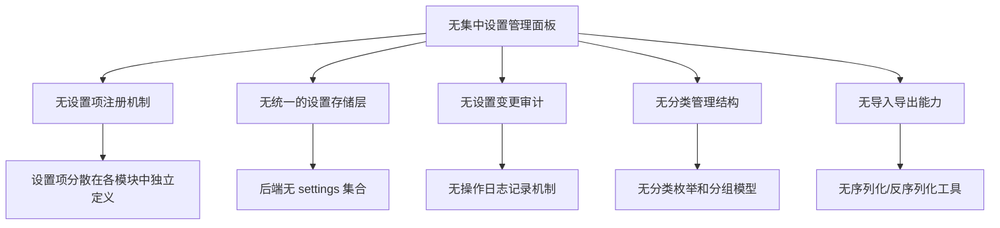
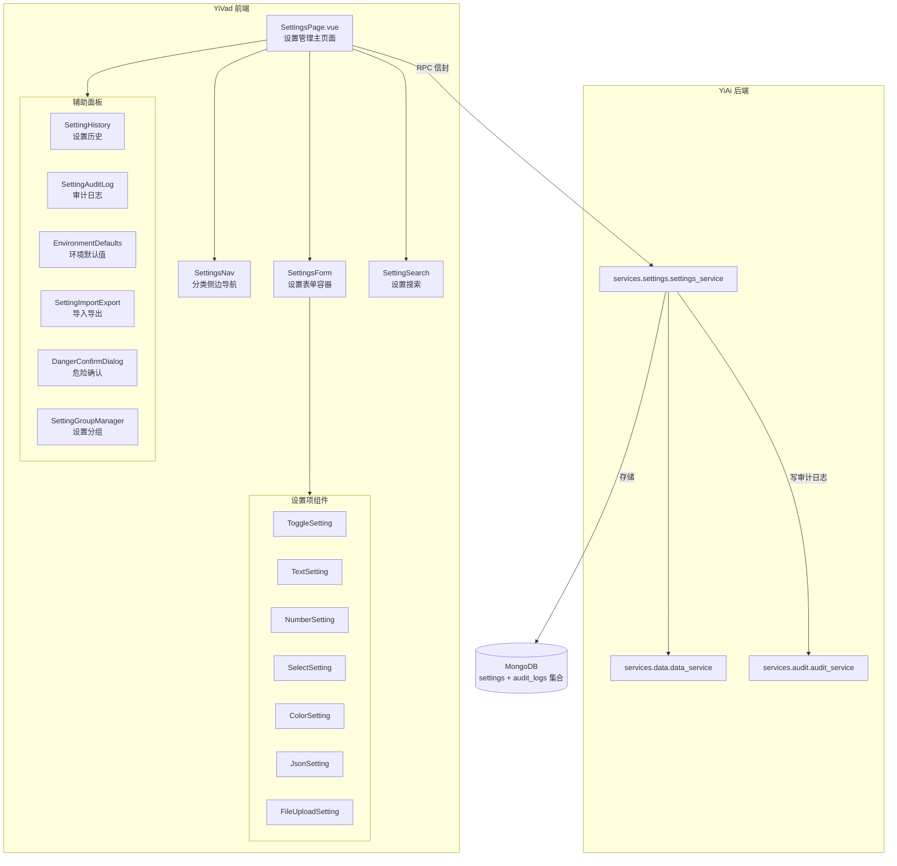

# 系统设置管理面板

> 需求编号：YV-09-62 · 优先级：P2 · 人天：0.5d
> 依赖：YiAi 数据服务（`services.data.data_service`）、YiAi 设置服务（`services.settings.settings_service`）

## 改动总览

| 改动点 | 类型 | 涉及文件 |
|--------|------|---------|
| 设置管理主页面 | 新增 | `src/views/settings/SettingsPage.vue` |
| 设置分类导航 | 新增 | `src/components/settings/SettingsNav.vue` |
| 设置表单组件 | 新增 | `src/components/settings/SettingsForm.vue` |
| 开关设置项 | 新增 | `src/components/settings/items/ToggleSetting.vue` |
| 文本设置项 | 新增 | `src/components/settings/items/TextSetting.vue` |
| 数字设置项 | 新增 | `src/components/settings/items/NumberSetting.vue` |
| 下拉选择设置项 | 新增 | `src/components/settings/items/SelectSetting.vue` |
| 颜色选择设置项 | 新增 | `src/components/settings/items/ColorSetting.vue` |
| JSON 编辑器设置项 | 新增 | `src/components/settings/items/JsonSetting.vue` |
| 文件上传设置项 | 新增 | `src/components/settings/items/FileUploadSetting.vue` |
| 设置搜索组件 | 新增 | `src/components/settings/SettingSearch.vue` |
| 设置历史面板 | 新增 | `src/components/settings/SettingHistory.vue` |
| 变更审计日志 | 新增 | `src/components/settings/SettingAuditLog.vue` |
| 环境默认值管理 | 新增 | `src/components/settings/EnvironmentDefaults.vue` |
| 设置导入导出 | 新增 | `src/components/settings/SettingImportExport.vue` |
| 危险设置确认弹窗 | 新增 | `src/components/settings/DangerConfirmDialog.vue` |
| 设置分组管理 | 新增 | `src/components/settings/SettingGroupManager.vue` |
| 设置 Composable | 新增 | `src/composables/settings/useSettings.ts` |
| 设置类型定义 | 新增 | `src/types/settings.ts` |
| 设置 API 服务 | 新增 | `src/services/settings.service.ts` |
| 路由配置 | 修改 | `src/router/` 添加设置路由 |

## 涉及文件

```
YiVad/
└── src/
    ├── views/
    │   └── settings/
    │       └── SettingsPage.vue                    # 新增：设置管理主页面
    ├── components/
    │   └── settings/
    │       ├── SettingsNav.vue                     # 新增：设置分类侧边导航
    │       ├── SettingsForm.vue                    # 新增：设置表单容器
    │       ├── SettingSearch.vue                   # 新增：设置搜索组件
    │       ├── SettingHistory.vue                  # 新增：设置历史面板
    │       ├── SettingAuditLog.vue                 # 新增：变更审计日志
    │       ├── EnvironmentDefaults.vue             # 新增：环境默认值管理
    │       ├── SettingImportExport.vue             # 新增：设置导入导出
    │       ├── DangerConfirmDialog.vue             # 新增：危险设置确认弹窗
    │       ├── SettingGroupManager.vue             # 新增：设置分组管理
    │       └── items/
    │           ├── ToggleSetting.vue               # 新增：开关设置项
    │           ├── TextSetting.vue                 # 新增：文本设置项
    │           ├── NumberSetting.vue               # 新增：数字设置项
    │           ├── SelectSetting.vue               # 新增：下拉选择设置项
    │           ├── ColorSetting.vue                # 新增：颜色选择设置项
    │           ├── JsonSetting.vue                 # 新增：JSON 编辑器设置项
    │           └── FileUploadSetting.vue           # 新增：文件上传设置项
    ├── composables/
    │   └── settings/
    │       └── useSettings.ts                      # 新增：设置管理 Composable
    ├── services/
    │   └── settings.service.ts                     # 新增：设置 API 服务
    ├── types/
    │   └── settings.ts                             # 新增：设置类型定义
    └── router/
        └── index.ts                                # 修改：添加设置路由
```

## 基本信息

| 字段 | 值 |
|------|-----|
| 需求编号 | YV-09-62 |
| 模块 | 系统管理 |
| 优先级 | **P2**（提升系统可维护性，减少运维工单） |
| 前端人天 | 0.5d |
| 后端人天 | 0.3d（YiAi 设置服务） |
| 依赖 | YiAi `services.settings.settings_service` 提供设置 CRUD 与审计接口 |

---

## 背景

YiVad 当前缺乏统一的系统设置管理面板。各类配置散落在代码中的环境变量、硬编码常量、本地 localStorage 中，管理员无法通过界面集中查看和修改系统配置。每次需要调整系统参数（如会话超时时间、上传文件大小限制、通知开关）时，都需要开发人员修改环境变量或数据库配置，然后重新部署。这种运维方式效率低下，且缺乏变更追踪和审计能力。

**核心问题：**

| # | 问题 | 严重程度 | 影响 |
|---|------|----------|------|
| 1 | **无集中设置管理** -- 系统配置散落在环境变量、代码常量、数据库中 | **高** | 配置变更需开发介入，响应慢 |
| 2 | **无设置分类** -- 设置项无组织结构，查找困难 | **中** | 新增设置项无处安放，配置混乱 |
| 3 | **无设置校验** -- 修改配置无实时校验，错误配置可保存 | **高** | 错误配置导致系统功能异常 |
| 4 | **无变更审计** -- 谁在什么时间改了什么配置无从追溯 | **中** | 配置误改后无法定位责任人和恢复 |
| 5 | **无环境默认值** -- 开发/测试/生产环境配置无差异化管理 | **中** | 部署时需手动修改，容易遗漏 |
| 6 | **无配置备份** -- 配置无法导出备份，迁移环境时需重新配置 | **中** | 环境迁移和灾备恢复耗时长 |

## 一、现状分析

### 当前设置管理能力矩阵

| 场景 | 当前行为 | 期望行为 | 差距 |
|------|---------|---------|------|
| 修改会话超时 | 修改环境变量 → 重启服务 | 管理面板中修改数字，实时生效 | 完全缺失 |
| 调整文件上传大小限制 | 修改代码常量 → 构建部署 | 管理面板中修改数字，带校验提示 | 完全缺失 |
| 关闭邮件通知 | 修改数据库配置 → 刷新缓存 | 管理面板中切换开关，即时生效 | 完全缺失 |
| 查看谁修改了配置 | 无此能力 | 审计日志中查看操作人、时间、旧值、新值 | 完全缺失 |
| 迁移至新环境 | 手动复制变量 → 逐项修改 | 导出当前配置 JSON → 新环境导入 | 完全缺失 |
| 批量修改通知设置 | 逐项修改多个设置项 | 设置分组功能，一键批量修改 | 完全缺失 |
| 搜索特定设置项 | 无搜索能力 | 搜索框输入关键词，即时过滤 | 完全缺失 |

### 根因分析矩阵



| 缺失项 | 根因 | 影响链 |
|--------|------|--------|
| 设置项注册机制 | 未定义 SettingDefinition 接口，各模块自行管理配置 | 无法统一管理，新增设置项无标准流程 |
| 统一存储层 | 后端无 settings 集合，配置分散在环境变量和代码中 | 无法通过 API 动态修改配置 |
| 变更审计 | 未实现操作日志记录，无变更历史表 | 配置修改不可追溯，安全问题 |
| 分类管理 | 无分类枚举，设置项扁平化存储 | 查找困难，新增设置项分类混乱 |
| 导入导出 | 无序列化工具，配置格式不统一 | 环境迁移需手动操作 |
| 实时校验 | 前端未实现设置项级别的校验规则 | 错误配置可保存，导致运行时异常 |

---

## 二、设计决策

### 设置项存储架构

| 架构 | 描述 | 优点 | 缺点 | 决策 |
|------|------|------|------|------|
| 全部后端存储 | 所有设置存储在 MongoDB settings 集合 | 统一管理，支持事务和审计 | 前端需 API 请求读取，首屏加载慢 | **选中** |
| 前后端分离 | 关键设置后端存储，UI 偏好 localStorage | 前端偏好读取快，无需请求 | 多设备不同步，管理分散 | 备选 |
| 纯前端存储 | 所有设置存储在 localStorage | 零延迟 | 不同步、无审计、不安全 | ❌ |

**决策：** 采用全部后端存储架构。系统设置（如安全、通知、存储）必须由后端统一管理以保证安全性和一致性。UI 偏好（如主题、菜单折叠状态）可保留在前端 localStorage，但标记为"本地设置"类别。

### 设置项类型设计

| 类型 | 组件 | 适用场景 | 校验规则 |
|------|------|---------|---------|
| toggle | ElSwitch | 功能开关、通知开关 | 布尔值 |
| text | ElInput | URL、API Key、密钥 | 正则、长度限制 |
| number | ElInputNumber | 超时时间、大小限制、数量 | 范围、整数/小数 |
| select | ElSelect | 枚举值、模式选择 | 枚举值校验 |
| color | ElColorPicker | 主题色、标签颜色 | 颜色格式 |
| json | Monaco Editor | 复杂配置、映射表 | JSON 语法校验 |
| file_upload | ElUpload | Logo、证书文件 | 文件类型、大小限制 |

### 设置分类体系

| 分类 | 标识 | 包含设置项 | 权限要求 |
|------|------|-----------|---------|
| 通用 | general | 系统名称、Logo、描述、语言、时区 | 管理员 |
| 安全 | security | 会话超时、密码策略、MFA 开关、IP 白名单 | 管理员 |
| 通知 | notifications | 邮件通知、站内信、Webhook URL、通知模板 | 管理员 |
| 集成 | integrations | 第三方 API Key、OAuth 配置、Webhook 密钥 | 管理员 |
| 外观 | appearance | 主题色、布局模式、字体、侧边栏样式 | 管理员 |
| 存储 | storage | 文件大小限制、允许类型、存储策略、CDN 配置 | 管理员 |
| AI/LLM | ai_llm | 模型名称、温度、最大 Token、系统 Prompt | 管理员 |
| 邮件 | email | SMTP 服务器、端口、发件人、模板 | 管理员 |
| 审计 | audit | 日志级别、保留天数、审计开关 | 管理员 |

### 危险设置确认策略

| 设置类型 | 危险等级 | 确认方式 | 示例 |
|---------|---------|---------|------|
| 安全相关 | 高 | 双重点击确认 + 输入原因 | 关闭 MFA、修改密码策略 |
| 存储相关 | 高 | 双重点击确认 | 修改文件大小限制为 0 |
| 集成相关 | 中 | 单次确认弹窗 | 修改 API Key |
| 通知相关 | 低 | 即时保存 | 关闭邮件通知 |
| 外观相关 | 低 | 即时保存 | 修改主题色 |
| 一般设置 | 低 | 即时保存 | 修改系统名称 |

---

## 三、目标架构



### 设置数据模型

```
Setting
├── key: string                    # 设置键（如 "security.session_timeout"）
├── value: any                     # 当前值
├── type: SettingType              # toggle | text | number | select | color | json | file_upload
├── label: string                  # 显示名称
├── description: string            # 设置说明
├── category: SettingCategory      # general | security | notifications | integrations | appearance | storage | ai_llm | email | audit
├── defaultValue: any              # 默认值
├── envDefaults: {                 # 各环境默认值
│   dev: any
│   staging: any
│   production: any
├── validation: {                  # 校验规则
│   required: boolean
│   min?: number
│   max?: number
│   pattern?: string               # 正则表达式
│   options?: any[]                # select 类型的选项
│   fileTypes?: string[]           # file_upload 类型
│   fileMaxSize?: number           # file_upload 大小限制
├── dangerLevel: 'low' | 'medium' | 'high'  # 危险等级
├── group?: string                 # 所属分组
├── order: number                  # 排序权重
├── enabled: boolean               # 是否启用
├── createdBy: string
├── createdAt: string
└── updatedBy: string
    updatedAt: string

SettingHistory
├── settingKey: string
├── oldValue: any
├── newValue: any
├── changedBy: string
├── changedAt: string
├── reason?: string                # 变更原因（危险设置必填）
└── ipAddress: string

SettingGroup
├── id: string
├── name: string
├── settingKeys: string[]          # 包含的设置项
├── description: string
└── order: number
```

---

## 四、具体改动

### 4.1 设置类型定义

**文件：** `src/types/settings.ts`（新增）

```typescript
// 设置类型枚举
export type SettingType = 'toggle' | 'text' | 'number' | 'select' | 'color' | 'json' | 'file_upload';

// 设置分类
export type SettingCategory =
  | 'general' | 'security' | 'notifications' | 'integrations'
  | 'appearance' | 'storage' | 'ai_llm' | 'email' | 'audit';

// 危险等级
export type DangerLevel = 'low' | 'medium' | 'high';

// 环境标识
export type Environment = 'dev' | 'staging' | 'production';

// 校验规则
export interface SettingValidation {
  required: boolean;
  min?: number;
  max?: number;
  pattern?: string;
  options?: Array<{ label: string; value: any }>;
  fileTypes?: string[];
  fileMaxSize?: number;
  customValidator?: (value: any) => string | null;
}

// 设置项定义
export interface SettingDefinition {
  key: string;
  value: any;
  type: SettingType;
  label: string;
  description: string;
  category: SettingCategory;
  defaultValue: any;
  envDefaults: Record<Environment, any>;
  validation: SettingValidation;
  dangerLevel: DangerLevel;
  group?: string;
  order: number;
  enabled: boolean;
  createdBy: string;
  createdAt: string;
  updatedBy: string;
  updatedAt: string;
}

// 设置变更历史
export interface SettingHistoryEntry {
  settingKey: string;
  settingLabel: string;
  oldValue: any;
  newValue: any;
  changedBy: string;
  changedAt: string;
  reason?: string;
  ipAddress: string;
}

// 设置分组
export interface SettingGroup {
  id: string;
  name: string;
  settingKeys: string[];
  description: string;
  order: number;
}

// 设置导入导出格式
export interface SettingExportPayload {
  version: string;
  exportedAt: string;
  exportedBy: string;
  environment: Environment;
  settings: Array<{ key: string; value: any }>;
  groups: SettingGroup[];
}

// 设置搜索结果
export interface SettingSearchResult {
  setting: SettingDefinition;
  matchField: 'key' | 'label' | 'description';
  matchText: string;
  score: number;
}
```

### 4.2 设置 API 服务

**文件：** `src/services/settings.service.ts`（新增）

```typescript
import { RequestHttp } from '@/utils/request';
import type {
  SettingDefinition, SettingHistoryEntry, SettingGroup,
  SettingExportPayload, SettingSearchResult, SettingType,
} from '@/types/settings';

const http = new RequestHttp();

export const settingsService = {
  // 设置 CRUD
  async listSettings(category?: string): Promise<SettingDefinition[]> {
    return http.post('/', {
      module_name: 'services.settings.settings_service',
      method_name: 'list_settings',
      parameters: category ? { filter: { category } } : {},
    });
  },

  async getSetting(key: string): Promise<SettingDefinition> {
    return http.post('/', {
      module_name: 'services.settings.settings_service',
      method_name: 'get_setting',
      parameters: { key },
    });
  },

  async updateSetting(key: string, value: any, reason?: string): Promise<SettingDefinition> {
    return http.post('/', {
      module_name: 'services.settings.settings_service',
      method_name: 'update_setting',
      parameters: { key, value, reason },
    });
  },

  async batchUpdateSettings(updates: Array<{ key: string; value: any }>, reason?: string): Promise<SettingDefinition[]> {
    return http.post('/', {
      module_name: 'services.settings.settings_service',
      method_name: 'batch_update_settings',
      parameters: { updates, reason },
    });
  },

  async resetSetting(key: string): Promise<SettingDefinition> {
    return http.post('/', {
      module_name: 'services.settings.settings_service',
      method_name: 'reset_setting',
      parameters: { key },
    });
  },

  // 搜索
  async searchSettings(query: string): Promise<SettingSearchResult[]> {
    return http.post('/', {
      module_name: 'services.settings.settings_service',
      method_name: 'search_settings',
      parameters: { query },
    });
  },

  // 历史与审计
  async getSettingHistory(key: string, limit: number = 20): Promise<SettingHistoryEntry[]> {
    return http.post('/', {
      module_name: 'services.settings.settings_service',
      method_name: 'get_setting_history',
      parameters: { key, limit },
    });
  },

  async getAuditLog(filter: { dateRange?: { start: string; end: string }; changedBy?: string }, page: number = 1): Promise<{ items: SettingHistoryEntry[]; total: number }> {
    return http.post('/', {
      module_name: 'services.settings.settings_service',
      method_name: 'get_audit_log',
      parameters: { filter, page },
    });
  },

  // 分组管理
  async listGroups(): Promise<SettingGroup[]> {
    return http.post('/', {
      module_name: 'services.settings.settings_service',
      method_name: 'list_setting_groups',
      parameters: {},
    });
  },

  async createGroup(group: Omit<SettingGroup, 'id'>): Promise<SettingGroup> {
    return http.post('/', {
      module_name: 'services.settings.settings_service',
      method_name: 'create_setting_group',
      parameters: { group },
    });
  },

  async updateGroup(id: string, updates: Partial<SettingGroup>): Promise<SettingGroup> {
    return http.post('/', {
      module_name: 'services.settings.settings_service',
      method_name: 'update_setting_group',
      parameters: { group_id: id, updates },
    });
  },

  async deleteGroup(id: string): Promise<void> {
    return http.post('/', {
      module_name: 'services.settings.settings_service',
      method_name: 'delete_setting_group',
      parameters: { group_id: id },
    });
  },

  // 导入导出
  async exportSettings(environment: string): Promise<SettingExportPayload> {
    return http.post('/', {
      module_name: 'services.settings.settings_service',
      method_name: 'export_settings',
      parameters: { environment },
    });
  },

  async importSettings(payload: SettingExportPayload): Promise<{ imported: number; skipped: number; errors: string[] }> {
    return http.post('/', {
      module_name: 'services.settings.settings_service',
      method_name: 'import_settings',
      parameters: { payload },
    });
  },

  async validateImport(payload: SettingExportPayload): Promise<{ valid: boolean; warnings: string[]; errors: string[] }> {
    return http.post('/', {
      module_name: 'services.settings.settings_service',
      method_name: 'validate_import',
      parameters: { payload },
    });
  },
};
```

### 4.3 useSettings Composable

**文件：** `src/composables/settings/useSettings.ts`（新增）

核心功能：
- 管理设置状态：`settings`（所有设置项列表）、`activeCategory`（当前分类）、`searchQuery`（搜索关键词）、`isDirty`（是否有未保存修改）
- 分类管理：`setActiveCategory(category)` 切换分类，`getCategorySettings(category)` 获取分类下的设置项
- 搜索功能：`searchSettings(query)` 调用后端搜索，防抖 300ms，高亮匹配关键词
- 设置修改：`updateSetting(key, value)` 跟踪修改状态，`batchUpdateSettings(updates)` 批量保存
- 校验引擎：`validateSetting(key, value)` 根据设置项的校验规则实时校验，返回错误信息
- 危险确认：`isDangerChange(key, value)` 判断是否需要二次确认
- 分组操作：`getGroupSettings(groupId)` 获取分组内设置项，`applyGroup(groupId)` 一键应用分组配置
- 撤销修改：`revertSetting(key)` 恢复到服务器值，`revertAll()` 撤销所有未保存修改
- 导入导出：`exportSettings()` 生成 JSON 下载，`importSettings(json)` 解析并验证导入内容

### 4.4 SettingsPage 主页面

**文件：** `src/views/settings/SettingsPage.vue`（新增）

核心功能：
- 左右布局：左侧 240px 分类导航，右侧设置表单区域
- 顶部搜索栏：全局搜索设置项，输入时实时过滤
- 分类导航：9 个分类图标 + 名称，当前分类高亮，显示"修改但未保存"数量徽标
- 设置表单：按分类分组展示，每个设置项显示标签、描述、当前值控件
- 底部操作栏：保存按钮（disabled 直到有修改）、重置按钮、批量操作菜单
- 未保存提示：路由离开前弹窗确认（`beforeRouteLeave` 守卫）
- 响应式：移动端切换为单列布局，分类导航变为顶部 Tab

### 4.5 设置项组件

**文件：** `src/components/settings/items/*.vue`（新增）

**ToggleSetting.vue** 核心功能：
- ElSwitch 开关组件，带标签和描述
- 切换时显示实时反馈（成功/失败 toast）
- 危险设置（如 MFA 开关）切换时弹出二次确认

**TextSetting.vue** 核心功能：
- ElInput 文本输入框，支持 `type="text"`、`type="password"`（密钥类）
- 显示/隐藏密码切换按钮
- 实时字数统计和格式校验提示
- 正则校验：如 URL 格式、邮箱格式即时校验

**NumberSetting.vue** 核心功能：
- ElInputNumber 数字输入，显示最小值/最大值
- 超出范围时显示红色边框和错误提示
- 单位后缀显示（如 "秒"、"MB"、"分钟"）

**SelectSetting.vue** 核心功能：
- ElSelect 下拉选择，选项来自校验规则中的 `options`
- 选项分组支持（`el-option-group`）
- 变更时如影响其他设置，显示关联影响提示

**ColorSetting.vue** 核心功能：
- ElColorPicker 颜色选择器，带预设色板
- 实时预览颜色（在设置项旁边显示色块）
- 支持 HEX/RGB 输入和切换

**JsonSetting.vue** 核心功能：
- 内嵌 Monaco Editor，语法高亮和自动补全
- JSON 格式实时校验，错误行高亮
- 格式化按钮（一键美化 JSON）
- 展开/折叠切换

**FileUploadSetting.vue** 核心功能：
- ElUpload 文件上传，限制类型和大小
- 显示当前文件预览（图片/文件名）
- 上传进度条
- 删除/替换按钮

### 4.6 SettingSearch 搜索组件

**文件：** `src/components/settings/SettingSearch.vue`（新增）

核心功能：
- 全局搜索框，支持按设置名称、键名、描述搜索
- 搜索结果下拉面板：显示匹配设置项列表，高亮匹配关键词
- 点击搜索结果跳转到对应设置项并滚动到可视区域
- 搜索历史：记录最近 5 次搜索，点击历史快速搜索
- 键盘快捷键：`Ctrl+K` 打开搜索，`Esc` 关闭，`Enter` 选中第一个结果

### 4.7 SettingHistory 与 SettingAuditLog

**文件：** `src/components/settings/SettingHistory.vue`（新增）
**文件：** `src/components/settings/SettingAuditLog.vue`（新增）

**SettingHistory** 核心功能：
- 展示单个设置项的变更历史时间线
- 每条记录显示：旧值 → 新值（diff 视图）、操作人、操作时间、IP、变更原因
- 值对比：JSON 类型使用 diff 编辑器，其他类型使用文本对比

**SettingAuditLog** 核心功能：
- 全局审计日志表格，展示所有设置变更
- 筛选：按操作人、时间范围、设置分类筛选
- 分页：每页 20 条
- 导出 CSV：导出筛选后的审计日志

### 4.8 辅助组件

**文件：** `src/components/settings/EnvironmentDefaults.vue`（新增）

核心功能：
- 三列对比视图：dev / staging / production 环境默认值并排展示
- 仅显示有差异的设置项（默认），可切换"显示全部"
- 差异高亮：不同值用黄色背景标记
- 环境切换：选择目标环境查看该环境的默认值配置

**文件：** `src/components/settings/SettingImportExport.vue`（新增）

核心功能：
- 导出：选择导出范围（全部/按分类/按分组），生成 JSON 文件下载
- 导入：上传 JSON 文件，预验证（格式检查、类型校验、缺失项检测）
- 预览变更：导入前展示将要新增/修改/跳过的设置项列表
- 差异对比：导入内容与当前配置的并排对比
- 冲突处理：当导入值与当前值不一致时，选择覆盖/跳过/保留

**文件：** `src/components/settings/DangerConfirmDialog.vue`（新增）

核心功能：
- 双重点击确认：第一次点击后按钮变为"确认修改"，第二次点击执行
- 变更原因输入：文本框，必填，最少 10 字
- 影响说明：列举该设置变更可能影响的功能（从后端获取）
- 10 秒倒计时确认：高危险设置需等待 10 秒才能确认

**文件：** `src/components/settings/SettingGroupManager.vue`（新增）

核心功能：
- 分组列表：展示所有设置分组，支持拖拽排序
- 新建分组：设置分组名称、描述，从设置项列表中选择包含的设置
- 编辑分组：增删设置项，修改名称
- 批量应用：一键将分组内所有设置项设置为指定值

---

## 五、实施步骤

| 步骤 | 任务 | 产出 | 验证方式 | 人天 |
|------|------|------|----------|------|
| 1 | 定义设置类型接口 | `types/settings.ts` | TypeScript 类型检查通过 | 0.03 |
| 2 | 实现设置 API 服务 | `services/settings.service.ts` | 接口调用返回正确数据结构 | 0.03 |
| 3 | 实现 useSettings Composable | `composables/settings/useSettings.ts` | 搜索/校验/分组/导入导出逻辑正常 | 0.06 |
| 4 | 实现 7 个设置项组件 | `components/settings/items/*.vue` | 各类型组件渲染和校验正常 | 0.08 |
| 5 | 实现 SettingsNav 分类导航 | `components/settings/SettingsNav.vue` | 9 个分类切换正常，徽标显示正确 | 0.02 |
| 6 | 实现 SettingsForm 表单容器 | `components/settings/SettingsForm.vue` | 动态渲染设置项，实时校验反馈 | 0.04 |
| 7 | 实现 SettingSearch 搜索 | `components/settings/SettingSearch.vue` | 搜索过滤、高亮、键盘快捷键正常 | 0.03 |
| 8 | 实现 SettingsPage 主页面 | `views/settings/SettingsPage.vue` | 左右布局、未保存提示、响应式正常 | 0.05 |
| 9 | 实现 SettingHistory 历史 | `components/settings/SettingHistory.vue` | 时间线、值对比、分页正常 | 0.03 |
| 10 | 实现 SettingAuditLog 审计 | `components/settings/SettingAuditLog.vue` | 筛选、导出 CSV 正常 | 0.03 |
| 11 | 实现 EnvironmentDefaults 环境 | `components/settings/EnvironmentDefaults.vue` | 三列对比、差异高亮正常 | 0.02 |
| 12 | 实现 SettingImportExport 导入导出 | `components/settings/SettingImportExport.vue` | 导出/导入/预验证/冲突处理正常 | 0.03 |
| 13 | 实现 DangerConfirmDialog 危险确认 | `components/settings/DangerConfirmDialog.vue` | 双重点击、原因输入、倒计时正常 | 0.02 |
| 14 | 实现 SettingGroupManager 分组 | `components/settings/SettingGroupManager.vue` | 分组 CRUD、批量应用正常 | 0.02 |
| 15 | 组件测试 | 测试文件 | 6 个测试场景通过 | 0.01 |

**总计：** 0.5d

---

## 六、测试规格

### Scenario 1: 按分类浏览和修改设置项
- **GIVEN** 管理员进入系统设置页面，默认显示"通用"分类
- **WHEN** 管理员点击左侧导航切换到"安全"分类，修改"会话超时时间"从 30 改为 60，点击"保存"
- **THEN** 设置项值更新为 60，显示成功 toast，设置项旁显示"已保存"标签，审计日志中新增一条记录

### Scenario 2: 搜索设置项
- **GIVEN** 系统中有 50+ 个设置项分布在 9 个分类中
- **WHEN** 管理员在搜索框输入"邮件"，按 Enter
- **THEN** 搜索结果展示所有匹配"邮件"的设置项（名称、键名、描述中包含该词的项），匹配关键词高亮显示，点击结果跳转到对应分类和设置项

### Scenario 3: 危险设置二次确认
- **GIVEN** 管理员在"安全"分类中点击"MFA 强制开启"开关
- **WHEN** 弹出危险确认弹窗，显示"此操作将影响所有用户登录"，管理员点击"确认修改"，按钮变为"再次确认"，输入变更原因"安全合规要求"，点击"再次确认"
- **THEN** MFA 设置更新为开启，审计日志记录操作人和变更原因，发送通知给所有管理员

### Scenario 4: 导入导出配置
- **GIVEN** 管理员在导出页面选择"全部设置"和"production 环境"
- **WHEN** 点击"导出"，下载 JSON 文件，修改其中一项的值，点击"导入"上传修改后的文件
- **THEN** 系统显示预验证结果：1 项将更新、0 项错误、0 项跳过，展示差异对比（旧值 vs 新值），管理员确认后导入成功

### Scenario 5: 设置分组管理
- **GIVEN** 管理员在分组管理页面，有 3 个设置项在"通知"分类中
- **WHEN** 点击"新建分组"，命名为"邮件通知设置"，选择"SMTP 服务器"、"SMTP 端口"、"发件人地址"三个设置项，保存
- **THEN** 分组列表新增"邮件通知设置"，点击"应用分组"可一键批量修改这三个设置项

### Scenario 6: 审计日志查询
- **GIVEN** 系统中有过去 30 天的设置变更记录
- **WHEN** 管理员打开审计日志页面，筛选操作人为"zhangsan"，时间范围为本月
- **THEN** 表格展示 zhangsan 本月的所有变更记录，包含设置项名称、旧值、新值、操作时间、IP 地址，支持导出 CSV

---

## 七、风险与缓解

| 风险 | 概率 | 影响 | 等级 | 缓解措施 | 应急预案 |
|------|------|------|------|----------|----------|
| 错误配置导致系统功能异常 | 中 | 高 | 高 | 实时校验 + 危险设置二次确认 + 变更原因记录 | 一键恢复默认值，保留最近 20 条历史可回滚 |
| JSON 编辑器语法错误 | 高 | 中 | 中 | Monaco Editor 实时 JSON 语法校验，错误行高亮，保存前强制校验 | 保存时弹出"JSON 格式错误，请修正后保存" |
| 导入配置覆盖关键设置 | 中 | 高 | 高 | 导入前预验证 + 差异对比 + 逐项确认覆盖/跳过 | 导入前自动备份当前配置，导入后可一键回滚 |
| 审计日志数据量过大 | 低 | 低 | 低 | 按时间范围分页查询，默认展示最近 30 天 | 超过 180 天的日志自动归档到冷存储 |
| 并发修改冲突 | 低 | 中 | 低 | 乐观锁（version 字段），修改时检查版本号 | 冲突时提示"设置已被他人修改，请刷新后重试" |
| 敏感设置泄露 | 低 | 高 | 中 | 密钥类设置项使用 `password` 类型输入框，API 返回时脱敏 | 审计日志中敏感值脱敏显示为 `***` |

---

## 八、回滚策略

| 回滚场景 | 回滚方式 | 影响范围 | 恢复时间 |
|----------|----------|----------|----------|
| 设置页面白屏 | 移除设置路由，隐藏导航菜单项 | 设置模块 | < 2min |
| 校验规则错误导致无法保存 | 降级为仅前端基本校验（必填、类型），后端校验兜底 | 设置编辑 | < 5min |
| 导入功能异常 | 暂时禁用导入按钮，保留导出 | 配置迁移 | < 2min |
| 审计日志查询超时 | 限制查询时间范围为 7 天，增加默认分页限制 | 审计面板 | < 3min |
| 设置项渲染异常 | 降级为纯文本输入框，按 key-value 编辑 | 设置表单 | < 5min |

**回滚验证：**
- 回滚后系统其他页面功能正常
- 回滚后已保存的设置值不丢失（后端数据完整）
- 回滚后 `vue-tsc --noEmit` 类型检查通过
- 回滚后设置分类导航正常显示

---

## 九、设计决策记录

### D-01: 所有设置后端存储，UI 偏好除外

**背景：** 系统设置需要统一管理，前端 localStorage 无法满足多设备同步和安全需求。
**决策：** 系统级设置（安全、通知、存储等）全部后端存储，仅 UI 偏好（主题、侧边栏折叠状态）保留前端 localStorage。
**权衡：** 读取设置需 API 请求，增加首屏加载时间。但通过设置缓存（5 分钟 TTL）和前端预加载可缓解。
**后果：** 离线网络下无法修改设置，但系统设置修改本身是低频操作，影响可接受。

### D-02: 采用分类注册式设置项管理，而非自由 key-value

**背景：** 设置项需要分类、校验、默认值等元数据，自由 key-value 无法满足。
**决策：** 每个设置项通过 `SettingDefinition` 接口注册，包含类型、分类、校验规则、默认值等完整元数据。
**权衡：** 新增设置项需要后端注册定义，不如自由 key-value 灵活。但注册机制保证了设置项的一致性和可维护性。
**后果：** 新增设置项需前后端联动，增加了开发成本。提供"注册新设置项"的管理界面，简化流程。

### D-03: 危险设置采用双重点击确认机制

**背景：** 安全相关设置的误操作可能造成严重后果，需要更严格的确认机制。
**决策：** 高危险设置采用"双重点击确认 + 变更原因输入"机制，中危险设置采用单次确认弹窗，低危险设置即时保存。
**权衡：** 增加了操作步骤，降低了效率。但安全高于效率，尤其对于 MFA 关闭、密码策略修改等操作。
**后果：** 需在设置项定义中明确标注危险等级，后端根据危险等级决定确认流程。

### D-04: 设置导入使用预验证 + 差异对比模式

**背景：** 直接导入配置可能覆盖关键设置，造成系统异常。
**决策：** 导入分三步：上传文件 → 预验证（格式、类型、缺失项）→ 差异对比展示 → 逐项确认（覆盖/跳过/保留）。
**权衡：** 导入流程变长，但避免了盲目覆盖的风险。批量导入场景下提供"全部覆盖"快捷按钮。
**后果：** 导入前自动备份当前配置快照，导入后如有异常可一键回滚。

---

## 十、可观测性

### 关键指标

| 指标 | 采集方式 | 告警阈值 | 说明 |
|------|---------|---------|------|
| 设置页面加载时间 | 前端性能监控 | P95 > 2s | 设置项列表加载性能 |
| 设置搜索响应时间 | API 响应时间 | P95 > 500ms | 搜索性能 |
| 设置保存成功率 | API 响应状态码 | < 99% | 设置写入健康度 |
| 危险设置变更频率 | 审计日志统计 | 单日 > 10 次 | 异常变更检测 |
| 导入失败率 | API 响应状态码 | > 5% | 导入功能健康度 |
| 审计日志查询耗时 | API 响应时间 | P95 > 1s | 审计查询性能 |

### 日志规范

| 日志级别 | 场景 | 示例 |
|---------|------|------|
| `DEBUG` | 设置项读取 | `[SettingsService] Read setting: security.session_timeout` |
| `INFO` | 设置项修改 | `[SettingsService] Setting updated: security.session_timeout 30→60 by zhangsan` |
| `WARN` | 危险设置修改 | `[SettingsService] DANGER: MFA enforcement disabled by zhangsan, reason: compliance waiver` |
| `WARN` | 导入冲突 | `[SettingsService] Import conflict: email.smtp_port 587→465, user chose skip` |
| `ERROR` | 设置保存失败 | `[SettingsService] Failed to save setting security.session_timeout: validation error` |

---

## 十一、代码审查检查清单

- [ ] `types/settings.ts` 中所有设置类型、校验规则、导出格式接口定义完整
- [ ] `settings.service.ts` 中所有 API 调用使用正确的 RPC 信封格式
- [ ] `useSettings.ts` 中校验引擎覆盖所有设置类型，防抖搜索 300ms
- [ ] 7 个设置项组件正确处理加载中、校验失败、保存成功状态
- [ ] `SettingsNav.vue` 中 9 个分类导航正确，未保存修改徽标显示正确
- [ ] `SettingSearch.vue` 中搜索结果高亮、键盘快捷键、搜索历史正常
- [ ] `DangerConfirmDialog.vue` 中双重点击、原因输入、倒计时逻辑正确
- [ ] `SettingImportExport.vue` 中预验证、差异对比、冲突处理正常
- [ ] `SettingAuditLog.vue` 中筛选、分页、CSV 导出正常
- [ ] `SettingsPage.vue` 中未保存离开提示正确（`beforeRouteLeave`）
- [ ] 所有设置项在 JSON 编辑器中正确处理格式化和校验
- [ ] 密钥类设置项（password 类型）在 API 返回时脱敏
- [ ] `vue-tsc --noEmit` 类型检查通过

---

## 回归问题预测

| # | 问题 | 预测场景 | 根因 | 预防措施 |
|---|------|---------|------|---------|
| 1 | 保存设置后页面闪烁 | 批量保存多个设置项时，每次保存重新请求全量列表 | 未使用乐观更新，保存后刷新全部数据 | 保存成功后仅更新本地状态中的对应设置项，无需重新请求 |
| 2 | JSON 编辑器大文件卡顿 | 设置项值为大型 JSON（> 500 行）时 Monaco Editor 渲染缓慢 | Monaco Editor 全量渲染大文本 | 大于 1000 行时启用代码折叠，使用虚拟滚动 |
| 3 | 搜索防抖导致结果延迟 | 快速输入时搜索结果跟不上输入速度 | 防抖 300ms 在快速输入时体验不佳 | 防抖 300ms 但输入 Enter 时立即搜索，不等待防抖 |
| 4 | 导入配置后设置项类型不匹配 | 导入的 JSON 中某设置项类型与定义不一致 | 后端校验不确定，前端预验证遗漏 | 导入预验证阶段强制类型检查，将类型不匹配列为错误而非警告 |
| 5 | 设置分组应用后部分设置项未生效 | 分组中某个设置项校验失败，但其他设置项已更新 | 批量更新未使用事务，部分成功部分失败 | 分组应用使用后端事务，所有设置项全部成功或全部失败 |
| 6 | 环境默认值切换后未保存的修改丢失 | 切换到环境默认值视图时，当前页面的修改状态被清空 | 路由切换时未检测 `isDirty` 状态 | 切换环境视图前检测 `isDirty`，提示用户先保存或放弃修改 |

---

## 性能分析

### 页面加载性能

| 场景 | 设置项数量 | 预估渲染时间 | 说明 |
|------|-----------|-------------|------|
| 空分类 | 0 | < 50ms | 仅渲染空状态提示 |
| 单分类加载 | 5-10 个设置项 | < 100ms | 动态渲染 7 种类型组件 |
| 全量加载 | 50+ 个设置项 | < 300ms | 全量展示，按分类分组 |
| 搜索结果 | 3-15 个结果 | < 150ms | 后端搜索 + 前端高亮 |

### 操作响应性能

| 操作 | 响应时间 | 说明 |
|------|---------|------|
| 切换分类 | < 50ms | 纯前端过滤，无 API 请求 |
| 修改开关设置 | < 200ms | API 保存 + 乐观更新 |
| 修改文本/数字设置 | < 500ms | 含防抖 300ms + API 保存 |
| 导入预验证 | < 1s | 后端解析 + 校验 |
| 审计日志查询 | < 500ms | 分页查询，默认 20 条/页 |

### 内存占用

| 组件 | 内存占用 | 说明 |
|------|---------|------|
| SettingsPage | ~30KB | 设置列表 + 分类状态 |
| SettingsForm | ~15KB | 动态渲染设置项表单 |
| Monaco Editor (JSON) | ~200KB | Monaco Editor 实例 |
| SettingAuditLog | ~10KB | 分页数据 + 筛选状态 |
| SettingImportExport | ~15KB | 导入数据 + 差异对比 |

