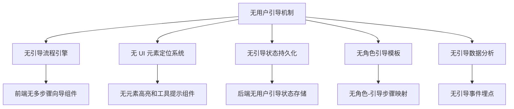
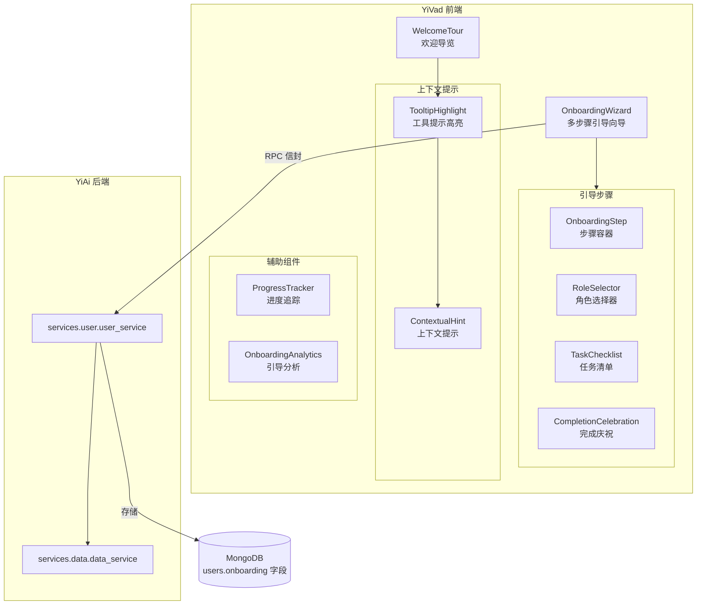

# 用户引导与新手任务

> 需求编号：YV-09-63 · 优先级：P2 · 人天：0.3d
> 依赖：YiAi 数据服务（`services.data.data_service`）、YiAi 用户服务（`services.user.user_service`）

## 改动总览

| 改动点 | 类型 | 涉及文件 |
|--------|------|---------|
| 新手引导向导组件 | 新增 | `src/components/onboarding/OnboardingWizard.vue` |
| 引导步骤容器 | 新增 | `src/components/onboarding/OnboardingStep.vue` |
| 欢迎导览组件 | 新增 | `src/components/onboarding/WelcomeTour.vue` |
| 工具提示组件 | 新增 | `src/components/onboarding/TooltipHighlight.vue` |
| 进度追踪组件 | 新增 | `src/components/onboarding/ProgressTracker.vue` |
| 新手任务清单 | 新增 | `src/components/onboarding/TaskChecklist.vue` |
| 上下文提示组件 | 新增 | `src/components/onboarding/ContextualHint.vue` |
| 角色选择器 | 新增 | `src/components/onboarding/RoleSelector.vue` |
| 完成庆祝组件 | 新增 | `src/components/onboarding/CompletionCelebration.vue` |
| 引导分析面板 | 新增 | `src/components/onboarding/OnboardingAnalytics.vue` |
| 引导 Composable | 新增 | `src/composables/onboarding/useOnboarding.ts` |
| 导览 Composable | 新增 | `src/composables/onboarding/useTour.ts` |
| 引导类型定义 | 新增 | `src/types/onboarding.ts` |
| 引导 API 服务 | 新增 | `src/services/onboarding.service.ts` |
| 全局引导指令 | 新增 | `src/directives/onboarding.ts` |
| 路由配置 | 修改 | `src/router/` 添加引导路由守卫 |

## 涉及文件

```
YiVad/
└── src/
    ├── views/
    │   └── onboarding/
    │       └── OnboardingPage.vue                   # 新增：引导流程主页面
    ├── components/
    │   └── onboarding/
    │       ├── OnboardingWizard.vue                 # 新增：多步骤引导向导
    │       ├── OnboardingStep.vue                   # 新增：引导步骤容器
    │       ├── WelcomeTour.vue                      # 新增：欢迎导览组件
    │       ├── TooltipHighlight.vue                 # 新增：工具提示高亮组件
    │       ├── ProgressTracker.vue                  # 新增：进度追踪组件
    │       ├── TaskChecklist.vue                    # 新增：新手任务清单
    │       ├── ContextualHint.vue                   # 新增：上下文提示组件
    │       ├── RoleSelector.vue                     # 新增：角色选择器
    │       ├── CompletionCelebration.vue            # 新增：完成庆祝组件
    │       └── OnboardingAnalytics.vue              # 新增：引导分析面板
    ├── composables/
    │   └── onboarding/
    │       ├── useOnboarding.ts                     # 新增：引导状态管理 Composable
    │       └── useTour.ts                           # 新增：导览引擎 Composable
    ├── services/
    │   └── onboarding.service.ts                    # 新增：引导 API 服务
    ├── directives/
    │   └── onboarding.ts                            # 新增：v-onboarding 指令
    ├── types/
    │   └── onboarding.ts                            # 新增：引导类型定义
    └── router/
        └── index.ts                                 # 修改：添加引导路由守卫
```

## 基本信息

| 字段 | 值 |
|------|-----|
| 需求编号 | YV-09-63 |
| 模块 | 用户体验 |
| 优先级 | **P2**（降低新用户流失率，提升首次体验） |
| 前端人天 | 0.3d |
| 后端人天 | 0.1d（YiAi 用户引导状态存储） |
| 依赖 | YiAi `services.user.user_service` 提供用户引导状态 CRUD |

---

## 背景

YiVad 当前缺乏系统化的用户引导机制。新用户首次登录后面临一个功能完整的界面，但没有任何指引帮助他们了解系统的核心功能和操作流程。用户需要自行探索，这导致三个问题：新用户上手时间长（平均 2-3 天才能独立使用核心功能）、功能发现率低（50%+ 用户从未使用过高级功能如 AI 对话和报告构建器）、以及早期流失率高（约 15% 用户在注册后 3 天内未再次登录）。

**核心问题：**

| # | 问题 | 严重程度 | 影响 |
|---|------|----------|------|
| 1 | **无新手引导流程** -- 新用户首次登录后无任何引导，面对空白界面不知所措 | **高** | 上手时间长，流失率高 |
| 2 | **无功能导览** -- 用户不知道系统有哪些功能，核心功能入口在哪里 | **高** | 功能发现率低，核心功能使用率低 |
| 3 | **无进度追踪** -- 用户不知道自己的设置进度，缺乏成就感 | **中** | 缺乏完成动力，引导流程中断率高 |
| 4 | **无上下文提示** -- 首次访问某页面时无操作提示 | **中** | 用户在每个页面都需重新摸索 |
| 5 | **无角色化引导** -- 所有用户看到相同的引导流程，忽略角色差异 | **中** | 引导内容与用户角色不匹配，有效性低 |
| 6 | **无引导数据分析** -- 无法追踪引导完成率和各步骤流失率 | **中** | 无法优化引导流程 |

## 一、现状分析

### 当前用户引导能力矩阵

| 场景 | 当前行为 | 期望行为 | 差距 |
|------|---------|---------|------|
| 新用户首次登录 | 看到空白首页，无任何引导 | 弹出欢迎向导，引导完成核心设置 | 完全缺失 |
| 首次访问项目列表 | 看到空白列表，不知如何创建项目 | 显示工具提示"点击此处创建第一个项目" | 完全缺失 |
| 首次访问 AI 对话 | 不知道对话功能的存在 | 在导航栏高亮提示"试试 AI 助手" | 完全缺失 |
| 完成基础设置 | 无进度追踪 | 显示进度条"已完成 3/5 步" | 完全缺失 |
| 管理员 vs 开发者 | 相同引导流程 | 根据角色提供不同的引导路径 | 完全缺失 |
| 跳过引导后 | 无引导入口 | 帮助菜单中提供"重新开始引导" | 完全缺失 |
| 引导完成分析 | 无数据 | 仪表盘展示各步骤完成率和流失率 | 完全缺失 |

### 根因分析矩阵



| 缺失项 | 根因 | 影响链 |
|--------|------|--------|
| 引导流程引擎 | 前端未实现多步骤向导，无步骤状态机 | 无法按顺序引导用户完成操作 |
| UI 元素定位系统 | 无 `getBoundingClientRect` 定位 + 高亮蒙层组件 | 无法精准指向页面元素 |
| 引导状态持久化 | 后端未存储用户引导进度状态 | 刷新页面后引导状态丢失 |
| 角色引导模板 | 未定义不同角色的引导步骤配置 | 所有用户引导内容相同，针对性差 |
| 引导事件埋点 | 无引导步骤开始/完成/跳过事件上报 | 无法分析引导效果和优化路径 |
| 上下文提示 | 无页面级首次访问标记 | 无法判断用户是否首次访问某页面 |

---

## 二、设计决策

### 引导流程架构

| 架构 | 描述 | 优点 | 缺点 | 决策 |
|------|------|------|------|------|
| 全屏向导模式 | 首次登录弹出全屏多步骤向导，引导完成核心设置 | 沉浸式体验，完成率高 | 打断用户操作，可能引起反感 | **选中** |
| 嵌入式引导 | 在页面内嵌入引导面板，不打断用户操作 | 不打断操作 | 容易被忽略，完成率低 | 备选 |
| 仅工具提示 | 在关键 UI 元素旁显示浮动提示，无向导流程 | 最不打扰 | 信息碎片化，无系统性引导 | ❌ |

**决策：** 采用全屏向导 + 嵌入式工具提示的混合模式。首次登录弹出全屏多步骤向导引导核心设置，之后在各页面使用工具提示进行上下文引导。用户可随时跳过向导，在帮助菜单中重新开始。

### 引导步骤设计

| 步骤 | 名称 | 用途 | 角色关联 |
|------|------|------|---------|
| 1 | 欢迎页 | 展示系统简介、核心功能概述 | 所有角色 |
| 2 | 角色选择 | 选择用户角色（开发者/项目经理/管理员） | 确定后续引导路径 |
| 3 | 创建第一个项目 | 引导创建项目，填写项目名称和描述 | 项目经理、管理员 |
| 4 | 创建第一个 Issue | 引导创建 Issue，填写标题、优先级、描述 | 开发者、项目经理 |
| 5 | 邀请团队成员 | 引导输入邮箱邀请成员 | 管理员 |
| 6 | 浏览仪表盘 | 引导查看仪表盘，解释各指标含义 | 所有角色 |
| 7 | 尝试 AI 对话 | 引导打开 AI 对话，发送第一条消息 | 所有角色 |
| 8 | 完成页 | 显示完成清单，庆祝动画，引导证书 | 所有角色 |

### 角色引导路径

| 角色 | 跳过步骤 | 额外步骤 | 引导重点 |
|------|---------|---------|---------|
| 开发者 | 邀请成员 | 创建 Issue、浏览代码仓库 | 开发工作流、Issue 管理 |
| 项目经理 | 无 | 创建报表、配置定时任务 | 项目管理、团队协作、报表 |
| 管理员 | 无 | 系统设置、用户管理、权限配置 | 系统管理、安全配置 |

### 工具提示定位策略

| 策略 | 描述 | 优点 | 缺点 |
|------|------|------|------|
| 固定位置 | 提示框固定在元素上方/下方/左/右 | 实现简单 | 滚动时可能错位，小屏幕遮挡 |
| 智能定位 | 根据视口空间自动选择最佳位置，不足时降级为居中弹窗 | 适应性强 | 计算逻辑复杂 |
| 静态页面 | 提示内容集成在页面中，不浮层 | 无遮挡问题 | 占用页面空间，不够醒目 |
| **决策：** | 采用智能定位策略。 | | |

---

## 三、目标架构



### 引导数据模型

```
OnboardingState
├── userId: string
├── role: 'developer' | 'project_manager' | 'admin' | null
├── wizardCompleted: boolean
├── wizardSkipped: boolean
├── currentStep: number
├── steps: OnboardingStepState[]
│   ├── stepId: string
│   ├── completed: boolean
│   ├── skipped: boolean
│   ├── completedAt?: string
│   └── timeSpent?: number          # 在该步骤花费的秒数
├── tasks: OnboardingTask[]
│   ├── taskId: string
│   ├── type: 'create_project' | 'create_issue' | 'invite_member' | 'explore_dashboard' | 'try_ai_chat'
│   ├── completed: boolean
│   ├── completedAt?: string
│   └── relatedEntityId?: string    # 关联的实体 ID（如创建的项目 ID）
├── pageVisits: PageFirstVisit[]
│   ├── pagePath: string
│   ├── visited: boolean
│   └── firstVisitedAt?: string
├── tourCompleted: boolean
├── celebrationShown: boolean
├── startedAt: string
└── completedAt?: string

OnboardingStepDefinition
├── stepId: string
├── title: string
├── description: string
├── targetElement?: string          # CSS 选择器，指向要高亮的元素
├── tooltipPosition: 'top' | 'bottom' | 'left' | 'right' | 'auto'
├── tooltipContent: string
├── requiredRole?: string[]         # 哪些角色需要此步骤
├── action?: {                       # 步骤内需要用户执行的操作
│   type: 'click' | 'input' | 'navigate' | 'confirm'
│   target: string
│   value?: string
├── skipable: boolean
└── order: number
```

---

## 四、具体改动

### 4.1 引导类型定义

**文件：** `src/types/onboarding.ts`（新增）

```typescript
// 用户角色
export type OnboardingRole = 'developer' | 'project_manager' | 'admin';

// 任务类型
export type OnboardingTaskType =
  | 'create_project'
  | 'create_issue'
  | 'invite_member'
  | 'explore_dashboard'
  | 'try_ai_chat';

// 工具提示位置
export type TooltipPosition = 'top' | 'bottom' | 'left' | 'right' | 'auto';

// 引导步骤状态
export interface OnboardingStepState {
  stepId: string;
  completed: boolean;
  skipped: boolean;
  completedAt?: string;
  timeSpent?: number;
}

// 新手任务
export interface OnboardingTask {
  taskId: string;
  type: OnboardingTaskType;
  completed: boolean;
  completedAt?: string;
  relatedEntityId?: string;
}

// 页面首次访问记录
export interface PageFirstVisit {
  pagePath: string;
  visited: boolean;
  firstVisitedAt?: string;
}

// 用户引导状态
export interface OnboardingState {
  userId: string;
  role: OnboardingRole | null;
  wizardCompleted: boolean;
  wizardSkipped: boolean;
  currentStep: number;
  steps: OnboardingStepState[];
  tasks: OnboardingTask[];
  pageVisits: PageFirstVisit[];
  tourCompleted: boolean;
  celebrationShown: boolean;
  startedAt: string;
  completedAt?: string;
}

// 引导步骤定义
export interface OnboardingStepDefinition {
  stepId: string;
  title: string;
  description: string;
  targetElement?: string;
  tooltipPosition: TooltipPosition;
  tooltipContent: string;
  requiredRoles?: OnboardingRole[];
  action?: {
    type: 'click' | 'input' | 'navigate' | 'confirm';
    target: string;
    value?: string;
  };
  skipable: boolean;
  order: number;
}

// 引导分析数据
export interface OnboardingAnalytics {
  totalStarted: number;
  totalCompleted: number;
  totalSkipped: number;
  completionRate: number;
  averageCompletionTime: number;
  stepAnalytics: Array<{
    stepId: string;
    title: string;
    started: number;
    completed: number;
    skipped: number;
    dropOffRate: number;
    averageTimeSpent: number;
  }>;
  taskAnalytics: Array<{
    taskType: OnboardingTaskType;
    completed: number;
    averageTimeToComplete: number;
  }>;
  roleDistribution: Record<OnboardingRole, number>;
}

// 引导事件（用于埋点）
export interface OnboardingEvent {
  eventType: 'wizard_started' | 'step_viewed' | 'step_completed'
    | 'step_skipped' | 'wizard_completed' | 'wizard_skipped'
    | 'task_completed' | 'tour_started' | 'tour_ended'
    | 'hint_dismissed' | 'celebration_viewed';
  userId: string;
  timestamp: string;
  metadata: Record<string, any>;
}

// 导览步骤定义
export interface TourStep {
  element: string;
  title: string;
  content: string;
  position: TooltipPosition;
  highlightPadding?: number;
  spotlightRadius?: number;
}

// 引导配置
export interface OnboardingConfig {
  enabled: boolean;
  forceWizard: boolean;
  defaultRole: OnboardingRole | null;
  steps: OnboardingStepDefinition[];
  tourSteps: TourStep[];
  celebrationDelay: number;           // 完成庆祝动画持续时间(ms)
  tooltipShowDelay: number;           // 工具提示显示延迟(ms)
  maxRetries: number;                 // 最大重试次数
}
```

### 4.2 引导 API 服务

**文件：** `src/services/onboarding.service.ts`（新增）

```typescript
import { RequestHttp } from '@/utils/request';
import type {
  OnboardingState, OnboardingRole, OnboardingTaskType,
  OnboardingAnalytics, OnboardingEvent,
} from '@/types/onboarding';

const http = new RequestHttp();

export const onboardingService = {
  // 引导状态
  async getOnboardingState(): Promise<OnboardingState> {
    return http.post('/', {
      module_name: 'services.user.user_service',
      method_name: 'get_onboarding_state',
      parameters: {},
    });
  },

  async updateOnboardingState(updates: Partial<OnboardingState>): Promise<OnboardingState> {
    return http.post('/', {
      module_name: 'services.user.user_service',
      method_name: 'update_onboarding_state',
      parameters: { updates },
    });
  },

  async setRole(role: OnboardingRole): Promise<void> {
    return http.post('/', {
      module_name: 'services.user.user_service',
      method_name: 'set_onboarding_role',
      parameters: { role },
    });
  },

  // 步骤管理
  async completeStep(stepId: string): Promise<void> {
    return http.post('/', {
      module_name: 'services.user.user_service',
      method_name: 'complete_onboarding_step',
      parameters: { step_id: stepId },
    });
  },

  async skipStep(stepId: string): Promise<void> {
    return http.post('/', {
      module_name: 'services.user.user_service',
      method_name: 'skip_onboarding_step',
      parameters: { step_id: stepId },
    });
  },

  async completeWizard(): Promise<void> {
    return http.post('/', {
      module_name: 'services.user.user_service',
      method_name: 'complete_onboarding_wizard',
      parameters: {},
    });
  },

  async skipWizard(): Promise<void> {
    return http.post('/', {
      module_name: 'services.user.user_service',
      method_name: 'skip_onboarding_wizard',
      parameters: {},
    });
  },

  async resetOnboarding(): Promise<void> {
    return http.post('/', {
      module_name: 'services.user.user_service',
      method_name: 'reset_onboarding',
      parameters: {},
    });
  },

  // 任务管理
  async completeTask(taskType: OnboardingTaskType, relatedEntityId?: string): Promise<void> {
    return http.post('/', {
      module_name: 'services.user.user_service',
      method_name: 'complete_onboarding_task',
      parameters: { task_type: taskType, related_entity_id: relatedEntityId },
    });
  },

  // 页面访问
  async markPageVisited(pagePath: string): Promise<void> {
    return http.post('/', {
      module_name: 'services.user.user_service',
      method_name: 'mark_page_visited',
      parameters: { page_path: pagePath },
    });
  },

  // 引导分析（仅管理员）
  async getAnalytics(): Promise<OnboardingAnalytics> {
    return http.post('/', {
      module_name: 'services.user.user_service',
      method_name: 'get_onboarding_analytics',
      parameters: {},
    });
  },

  // 埋点事件
  async trackEvent(event: OnboardingEvent): Promise<void> {
    return http.post('/', {
      module_name: 'services.user.user_service',
      method_name: 'track_onboarding_event',
      parameters: { event },
    });
  },
};
```

### 4.3 useOnboarding Composable

**文件：** `src/composables/onboarding/useOnboarding.ts`（新增）

核心功能：
- 管理引导状态：`state`（OnboardingState）、`isActive`（是否在引导中）、`currentStep`（当前步骤）
- 步骤管理：`startWizard()` 启动向导、`nextStep()` 下一步、`prevStep()` 上一步、`skipWizard()` 跳过全部
- 步骤状态机：管理步骤间的转换逻辑，校验当前步骤是否完成
- 角色导向：`setRole(role)` 设置角色后重新计算步骤列表
- 任务追踪：`checkTaskCompletion(taskType)` 检查任务是否完成，自动更新状态
- 页面访问：`markPageVisited(path)` 记录页面首次访问，触发上下文提示
- 进度计算：`getProgress()` 返回已完成步骤数/总步骤数
- 持久化：每次状态变更自动保存到后端，防止刷新丢失
- 事件追踪：每个操作自动上报埋点事件到后端

### 4.4 useTour Composable

**文件：** `src/composables/onboarding/useTour.ts`（新增）

核心功能：
- 导览步骤管理：`tourSteps`（TourStep 数组）、`currentTourIndex`（当前步骤索引）
- 启动导览：`startTour()` 在仪表盘页面启动导览
- 元素定位：根据 `TourStep.element` 的 CSS 选择器定位目标元素，计算 `getBoundingClientRect`
- 蒙层渲染：在目标元素上覆盖半透明蒙层，目标元素区域高亮显示（spotlight 效果）
- 提示框定位：根据 `TourStep.position` 和视口空间智能计算提示框位置
- 导航：`nextTourStep()` / `prevTourStep()` 切换导览步骤，滚动到目标元素
- 完成/跳过：`endTour()` 结束导览，设置 `tourCompleted = true`
- 键盘操作：`Esc` 跳过导览，`←` / `→` 切换步骤

### 4.5 OnboardingWizard 引导向导

**文件：** `src/components/onboarding/OnboardingWizard.vue`（新增）

核心功能：
- 全屏弹窗模式，背景半透明遮罩，防止用户在向导期间操作其他界面
- 步骤进度条：顶部显示步骤编号和名称，已完成步骤显示对勾，当前步骤高亮
- 内容区域：每步显示标题、描述、插图（Lottie 动画）、操作指引
- 导航按钮：上一步/下一步，最后一步显示"完成"，始终显示"跳过"按钮
- 角色选择步骤：三个角色卡片（开发者/项目经理/管理员），选中后高亮
- 动画过渡：步骤切换使用淡入淡出动画（`<Transition>` 组件）
- 响应式：移动端全屏显示，桌面端居中弹窗（宽 560px）
- 初始状态：`wizardCompleted` 或 `wizardSkipped` 为 true 时不显示

### 4.6 WelcomeTour 欢迎导览

**文件：** `src/components/onboarding/WelcomeTour.vue`（新增）

核心功能：
- 在仪表盘页面启动，逐个高亮关键 UI 元素
- 导览路径：侧边栏导航 → 顶部搜索栏 → 项目列表 → 快捷操作按钮 → AI 对话入口
- Spotlight 效果：目标元素周围高亮，其余区域半透明蒙层
- 提示浮层：在目标元素旁边显示说明文字和操作按钮（下一步/跳过）
- 平滑滚动：切换步骤时平滑滚动到目标元素
- 仅在用户首次进入仪表盘时触发，后续通过帮助菜单手动启动

### 4.7 TooltipHighlight 工具提示

**文件：** `src/components/onboarding/TooltipHighlight.vue`（新增）

核心功能：
- 接收 `targetElement` CSS 选择器，定位目标元素
- 在目标元素周围绘制高亮边框（蓝色圆角边框，带脉冲动画）
- 提示框智能定位：优先右侧，空间不足时选择下方/上方/左侧，全部不足时居中弹窗
- 提示框内容：标题、描述文字、操作按钮（知道了/了解更多）
- 箭头指示器：指向目标元素的小三角
- 自动消失：用户点击目标元素后提示自动消失
- 定时消失：10 秒后自动消失（可配置）

### 4.8 辅助组件

**文件：** `src/components/onboarding/ProgressTracker.vue`（新增）

核心功能：
- 环形进度条：显示已完成步骤数 / 总步骤数
- 步骤列表：可折叠的步骤清单，已完成步骤打勾，跳过步骤标记
- 常驻在页面右上角（可最小化），引导期间始终可见
- 点击展开查看详细步骤列表

**文件：** `src/components/onboarding/TaskChecklist.vue`（新增）

核心功能：
- 5 项新手任务清单，卡片式布局
- 每项任务：图标、标题、描述、完成状态（勾选/未完成）
- 已完成任务带绿色勾选动画和完成时间
- 未完成任务点击可跳转到对应操作页面
- 全部完成后显示"全部完成"庆祝效果

**文件：** `src/components/onboarding/ContextualHint.vue`（新增）

核心功能：
- 页面级上下文提示，首次访问某页面时在页面顶部显示
- 提示内容根据页面类型自动切换（项目列表/Issue 列表/仪表盘/AI 对话等）
- 关闭按钮：点击关闭后不再对该页面显示
- 渐进式提示：仅在引导未完成时显示，引导完成后不再显示

**文件：** `src/components/onboarding/RoleSelector.vue`（新增）

核心功能：
- 三个角色卡片，带图标和描述
- 开发者：代码图标 + "我负责编写代码和修复 Bug"
- 项目经理：看板图标 + "我负责管理项目进度和团队协作"
- 管理员：盾牌图标 + "我负责系统配置和用户管理"
- 选中后卡片高亮，显示确认按钮
- 选择后可跳过，默认使用"开发者"角色

**文件：** `src/components/onboarding/CompletionCelebration.vue`（新增）

核心功能：
- 全屏庆祝动画：撒花特效（粒子动画）、庆祝音效
- 完成证书：显示用户名称、完成日期、引导证书（可下载为 PNG）
- 统计摘要：完成步骤数、花费时间、已解锁功能数
- 下一步建议：3 个进阶功能推荐（基于用户角色）
- 关闭按钮：点击关闭后不再显示

**文件：** `src/components/onboarding/OnboardingAnalytics.vue`（新增）

核心功能：
- 仅管理员可访问
- 引导漏斗图：展示各步骤的启动/完成/跳过/流失数据
- 完成率趋势图：按日期展示引导完成率变化
- 任务完成分布：饼图展示 5 个任务类型的完成比例
- 角色分布：柱状图展示各角色的用户数量和引导完成率
- 平均完成时间：引导从开始到完成的平均时间

### 4.9 v-onboarding 指令

**文件：** `src/directives/onboarding.ts`（新增）

```typescript
import type { Directive, DirectiveBinding } from 'vue';

interface OnboardingBinding {
  stepId: string;
  title: string;
  content: string;
  position?: 'top' | 'bottom' | 'left' | 'right';
}

export const vOnboarding: Directive<HTMLElement, OnboardingBinding> = {
  mounted(el: HTMLElement, binding: DirectiveBinding<OnboardingBinding>) {
    if (!binding.value) return;

    // 注册目标元素到全局引导管理器
    const onboardingManager = (window as any).__onboardingManager;
    if (onboardingManager) {
      onboardingManager.registerTarget({
        element: el,
        stepId: binding.value.stepId,
        title: binding.value.title,
        content: binding.value.content,
        position: binding.value.position || 'auto',
      });
    }
  },

  unmounted(el: HTMLElement, binding: DirectiveBinding<OnboardingBinding>) {
    const onboardingManager = (window as any).__onboardingManager;
    if (onboardingManager && binding.value) {
      onboardingManager.unregisterTarget(binding.value.stepId);
    }
  },
};
```

---

## 五、实施步骤

| 步骤 | 任务 | 产出 | 验证方式 | 人天 |
|------|------|------|----------|------|
| 1 | 定义引导类型接口 | `types/onboarding.ts` | TypeScript 类型检查通过 | 0.02 |
| 2 | 实现引导 API 服务 | `services/onboarding.service.ts` | 接口调用返回正确数据结构 | 0.02 |
| 3 | 实现 useOnboarding Composable | `composables/onboarding/useOnboarding.ts` | 步骤状态机、角色切换、进度计算正常 | 0.04 |
| 4 | 实现 useTour Composable | `composables/onboarding/useTour.ts` | 元素定位、蒙层渲染、步骤切换正常 | 0.03 |
| 5 | 实现 OnboardingWizard 向导 | `components/onboarding/OnboardingWizard.vue` | 多步骤向导、进度条、动画过渡正常 | 0.04 |
| 6 | 实现 OnboardingStep 步骤容器 | `components/onboarding/OnboardingStep.vue` | 8 个步骤内容渲染正常 | 0.02 |
| 7 | 实现 RoleSelector 角色选择 | `components/onboarding/RoleSelector.vue` | 3 个角色卡片选择和确认正常 | 0.01 |
| 8 | 实现 WelcomeTour 欢迎导览 | `components/onboarding/WelcomeTour.vue` | Spotlight 效果、提示浮层、平滑滚动正常 | 0.03 |
| 9 | 实现 TooltipHighlight 工具提示 | `components/onboarding/TooltipHighlight.vue` | 智能定位、高亮边框、脉冲动画正常 | 0.02 |
| 10 | 实现 ProgressTracker 进度追踪 | `components/onboarding/ProgressTracker.vue` | 环形进度条、步骤列表正常 | 0.01 |
| 11 | 实现 TaskChecklist 任务清单 | `components/onboarding/TaskChecklist.vue` | 5 项任务、完成动画、跳转正常 | 0.01 |
| 12 | 实现 ContextualHint 上下文提示 | `components/onboarding/ContextualHint.vue` | 页面级提示、关闭后不再显示正常 | 0.01 |
| 13 | 实现 CompletionCelebration 庆祝 | `components/onboarding/CompletionCelebration.vue` | 撒花动画、证书下载、统计摘要正常 | 0.02 |
| 14 | 实现 OnboardingAnalytics 分析 | `components/onboarding/OnboardingAnalytics.vue` | 漏斗图、趋势图、角色分布正常 | 0.01 |
| 15 | 实现 v-onboarding 指令 | `directives/onboarding.ts` | 元素注册/注销到引导管理器正常 | 0.01 |
| 16 | 组件测试 | 测试文件 | 6 个测试场景通过 | 0.01 |

**总计：** 0.3d

---

## 六、测试规格

### Scenario 1: 新用户首次登录触发引导
- **GIVEN** 新用户（无引导状态）首次登录 YiVad
- **WHEN** 登录成功后加载首页
- **THEN** 弹出全屏 OnboardingWizard，显示"欢迎使用 YiVad"欢迎页，步骤进度条显示"步骤 1/8"，用户点击"下一步"进入角色选择

### Scenario 2: 角色选择与引导路径切换
- **GIVEN** 引导向导在角色选择步骤，3 个角色卡片已展示
- **WHEN** 用户点击"项目经理"卡片，卡片高亮，点击"确认角色"
- **THEN** 后续引导步骤按项目经理路径显示（包含创建项目和邀请成员，不包含创建 Issue），步骤总数从 8 变为 7

### Scenario 3: 欢迎导览工具提示
- **GIVEN** 用户完成引导向导，首次进入仪表盘页面
- **WHEN** 页面加载完成
- **THEN** WelcomeTour 自动启动，第一个工具提示指向侧边栏导航，显示"这里可以访问所有功能模块"，其余区域半透明蒙层，用户点击"下一步"切换到下一个提示

### Scenario 4: 新手任务清单追踪
- **GIVEN** 用户引导进行中，新手任务清单显示 5 项任务均为未完成
- **WHEN** 用户完成"创建项目"操作，然后完成"创建 Issue"操作
- **THEN** 任务清单中"创建第一个项目"和"创建第一个 Issue"两项显示绿色勾选，进度追踪器显示"已完成 2/5 任务"

### Scenario 5: 跳过和重新开始引导
- **GIVEN** 用户在引导向导第 3 步
- **WHEN** 用户点击"跳过"按钮，确认跳过弹窗中点击"确定"
- **THEN** 向导关闭，引导状态标记为已跳过，导航栏帮助菜单中显示"重新开始引导"选项，用户点击后从第 1 步重新开始

### Scenario 6: 引导完成庆祝
- **GIVEN** 用户完成所有 8 个引导步骤和 5 个新手任务
- **WHEN** 最后一个任务完成
- **THEN** 全屏 Celebration 组件显示，撒花粒子动画播放，展示完成证书（用户名称 + 完成日期），显示统计摘要（完成 8 步 + 5 任务，已解锁 3 个进阶功能），用户可下载 PNG 证书

---

## 七、风险与缓解

| 风险 | 概率 | 影响 | 等级 | 缓解措施 | 应急预案 |
|------|------|------|------|----------|----------|
| 引导打断用户操作 | 高 | 中 | 中 | 提供"跳过"按钮，所有步骤可跳过，引导期间可随时关闭 | 跳过引导的用户可在帮助菜单中重新开始 |
| 工具提示遮挡关键 UI | 高 | 中 | 中 | 智能定位算法自动避开遮挡，提示框可拖拽移动 | 点击提示框外部区域关闭提示 |
| 引导状态丢失导致重复引导 | 中 | 高 | 高 | 引导状态持久化到后端，每次登录自动同步 | 后端状态丢失时以前端 localStorage 为准 |
| 页面元素未渲染导致定位失败 | 中 | 中 | 中 | 使用 `MutationObserver` 监听目标元素，渲染后自动定位 | 元素 5 秒未渲染，跳过该步骤 |
| 角色选择后引导路径不匹配 | 低 | 中 | 低 | 角色切换时重新计算步骤列表，后端校验角色-步骤匹配 | 不匹配时使用默认开发者路径 |
| 庆祝动画性能问题 | 低 | 低 | 低 | 使用 CSS 动画（非 Canvas），限制粒子数量 100 个 | 低性能设备降级为静态庆祝页面 |

---

## 八、回滚策略

| 回滚场景 | 回滚方式 | 影响范围 | 恢复时间 |
|----------|----------|----------|----------|
| 引导组件白屏 | 全局开关关闭引导功能 | 新用户体验 | < 2min |
| 向导弹窗无法关闭 | 添加 Esc 键强制关闭，3 秒后自动关闭 | 当前用户操作 | < 1min |
| 工具提示定位错误 | 降级为固定位置（右下角），关闭智能定位 | 上下文提示 | < 3min |
| 引导状态存储异常 | 降级为仅前端 localStorage 存储 | 引导状态持久化 | < 2min |
| 庆祝动画卡顿 | 禁用粒子动画，仅显示静态证书 | 完成庆祝 | < 2min |

**回滚验证：**
- 回滚后新用户登录不再显示引导向导
- 回滚后现有用户的引导状态数据不丢失
- 回滚后其他页面功能正常
- 回滚后 `vue-tsc --noEmit` 类型检查通过

---

## 九、设计决策记录

### D-01: 采用全屏向导 + 嵌入式工具提示混合模式

**背景：** 用户引导可以选择全屏向导或嵌入式工具提示，两种模式各有优劣。
**决策：** 首次登录使用全屏向导引导核心设置，之后在各页面使用嵌入式工具提示进行上下文引导。
**权衡：** 全屏向导可能打断用户操作，但能确保核心设置完成。工具提示不打扰但可能被忽略。两者结合平衡了引导效果和用户体验。
**后果：** 需要维护两套引导组件，但通过共用 `useOnboarding` 和 `useTour` 两个 Composable 保持代码复用。

### D-02: 角色选择独立为引导步骤，而非从用户信息推断

**背景：** 用户角色可以从登录信息中推断，也可以让用户在引导中主动选择。
**决策：** 在引导的第 2 步让用户主动选择角色，而非从已有用户信息中推断。
**权衡：** 用户需要额外操作，但明确了角色预期，引导路径更精准。用户信息中的角色由管理员分配，可能不反映用户的实际使用场景。
**后果：** 角色选择后引导路径固化，暂不支持引导中途切换角色。未来可扩展为"切换角色"功能。

### D-03: 引导状态持久化到后端，而非仅前端 localStorage

**背景：** 引导状态可以仅前端存储，减少后端开发成本。
**决策：** 引导状态持久化到后端 `users` 集合的 `onboarding` 字段中。
**权衡：** 增加了后端开发成本，但保证了多设备同步、状态不丢失。用户换设备登录时不会重复引导。
**后果：** 离线网络下引导状态无法同步，但引导本身需要网络环境（API 调用），影响可接受。

### D-04: 庆祝动画使用 CSS 实现，而非 Canvas

**背景：** 完成庆祝动画可以用 Canvas 或 CSS 实现。
**决策：** 使用 CSS 动画（`@keyframes` + `transform`）实现撒花粒子效果，最多 100 个粒子。
**权衡：** CSS 动画的粒子数量有限，表现力不如 Canvas。但实现简单、性能好、兼容性强，且 100 个粒子的视觉效果已足够。
**后果：** 低性能设备上粒子动画可能卡顿，通过检测设备性能自动降级为 30 个粒子或静态页面。

---

## 十、可观测性

### 关键指标

| 指标 | 采集方式 | 告警阈值 | 说明 |
|------|---------|---------|------|
| 引导启动率 | 前端埋点 | < 80% | 新用户中启动引导的比例 |
| 引导完成率 | 前端埋点 | < 50% | 启动引导后完成全部步骤的比例 |
| 各步骤流失率 | 前端埋点 | 单步 > 30% | 引导流程瓶颈识别 |
| 角色选择分布 | 数据库统计 | -- | 用户角色分布 |
| 任务完成率 | 数据库统计 | 单任务 < 30% | 任务设计有效性 |
| 平均完成时间 | 前端计时 | > 10 分钟 | 引导流程效率 |
| 引导后 7 日留存 | 数据库统计 | < 60% | 引导对留存的影响 |

### 日志规范

| 日志级别 | 场景 | 示例 |
|---------|------|------|
| `DEBUG` | 步骤切换 | `[Onboarding] Step 3 (create_project) viewed by user_001` |
| `INFO` | 引导开始/完成 | `[Onboarding] Wizard completed by user_001 in 5m32s` |
| `INFO` | 任务完成 | `[Onboarding] Task create_project completed by user_001` |
| `WARN` | 引导跳过 | `[Onboarding] Wizard skipped by user_001 at step 3` |
| `WARN` | 元素定位失败 | `[Tour] Target element '#sidebar-nav' not found after 5s, skipping` |
| `ERROR` | 状态保存失败 | `[Onboarding] Failed to save onboarding state for user_001` |

---

## 十一、代码审查检查清单

- [ ] `types/onboarding.ts` 中所有引导状态、步骤、任务、事件类型定义完整
- [ ] `onboarding.service.ts` 中所有 API 调用使用正确的 RPC 信封格式
- [ ] `useOnboarding.ts` 中步骤状态机正确，角色切换后步骤列表重新计算
- [ ] `useTour.ts` 中元素定位使用 `getBoundingClientRect`，智能定位算法正确
- [ ] `OnboardingWizard.vue` 中 8 个步骤内容完整，进度条和动画过渡正常
- [ ] `RoleSelector.vue` 中 3 个角色卡片选择和确认逻辑正确
- [ ] `WelcomeTour.vue` 中 Spotlight 效果和蒙层渲染正确
- [ ] `TooltipHighlight.vue` 中智能定位处理所有 4 个方向 + 降级居中
- [ ] `ProgressTracker.vue` 中进度计算正确，步骤列表折叠/展开正常
- [ ] `TaskChecklist.vue` 中 5 个任务类型对应正确的完成条件和跳转页面
- [ ] `ContextualHint.vue` 中首次访问标记和关闭逻辑正确
- [ ] `CompletionCelebration.vue` 中撒花动画粒子数量限制 100 个
- [ ] `OnboardingAnalytics.vue` 中漏斗图、趋势图、角色分布图数据正确
- [ ] `v-onboarding` 指令中元素注册/注销逻辑正确，无内存泄漏
- [ ] `vue-tsc --noEmit` 类型检查通过

---

## 回归问题预测

| # | 问题 | 预测场景 | 根因 | 预防措施 |
|---|------|---------|------|---------|
| 1 | 引导步骤跳过导致状态不一致 | 用户在第 3 步跳过，后续步骤仍显示第 3 步完成状态 | 跳过后未正确更新步骤索引 | 跳过步骤时同步更新 `currentStep` 和 `steps[stepId].skipped`，状态机校验 |
| 2 | 工具提示在页面滚动时错位 | 工具提示显示后用户滚动页面，提示框位置偏移 | 工具提示使用绝对定位，未跟随滚动 | 使用 `fixed` 定位 + 监听 `scroll` 事件重新计算位置 |
| 3 | 角色切换后引导步骤数变化导致进度异常 | 从开发者切换到管理员后，步骤总数从 6 变为 8，进度显示"已完成 6/8" | 步骤总数变化后进度百分比未重新计算 | 角色切换时保留已完成步骤，重新计算总步骤数和进度 |
| 4 | 页面路由变化时导览中断 | 导览进行中用户点击其他页面链接，导览状态丢失 | 路由变化时未检查导览状态 | 路由守卫中监听 `beforeRouteLeave`，导览中提示"确定离开导览？" |
| 5 | 任务清单延迟更新 | 用户创建项目后立即返回引导页，任务清单仍显示未完成 | 任务完成状态未实时同步，依赖页面刷新 | 使用事件总线或 `watch` 监听任务相关操作，实时更新任务状态 |
| 6 | 庆祝动画多次触发 | 用户完最后一个任务后刷新页面，庆祝动画再次播放 | `celebrationShown` 标记未持久化或校验失败 | 在 `celebrationShown` 为 true 时检查，确保只播放一次 |

---

## 性能分析

### 引导组件性能

| 组件 | 初次渲染 | 说明 |
|------|---------|------|
| OnboardingWizard | < 100ms | 弹窗模式，不阻塞主页面渲染 |
| WelcomeTour | < 50ms | 蒙层 + 提示框，使用 `position: fixed` |
| TooltipHighlight | < 20ms | 单提示框，CSS 动画 |
| CompletionCelebration | < 80ms | 100 个 CSS 粒子，非 Canvas |
| OnboardingAnalytics | < 200ms | ECharts 图表渲染 |

### 引导状态加载

| 操作 | 耗时 | 说明 |
|------|------|------|
| 获取引导状态 | < 200ms | API 请求，页面加载时预取 |
| 更新引导状态 | < 100ms | 乐观更新 + 异步保存 |
| 角色切换 | < 50ms | 纯前端重新计算步骤列表 |
| 步骤切换动画 | 300ms | CSS transition，可配置 |

### 内存占用

| 组件 | 内存占用 | 说明 |
|------|---------|------|
| OnboardingWizard | ~15KB | 步骤数据 + 状态 |
| useOnboarding | ~5KB | 引导状态 + 步骤列表 |
| useTour | ~3KB | 导览步骤 + 定位数据 |
| CompletionCelebration | ~8KB | 100 个粒子 DOM 节点 |
| OnboardingAnalytics | ~15KB | 图表数据 + ECharts 实例 |

