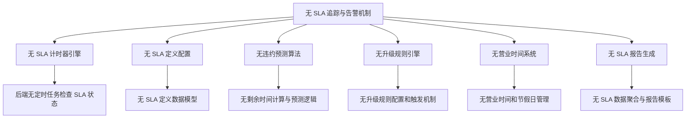
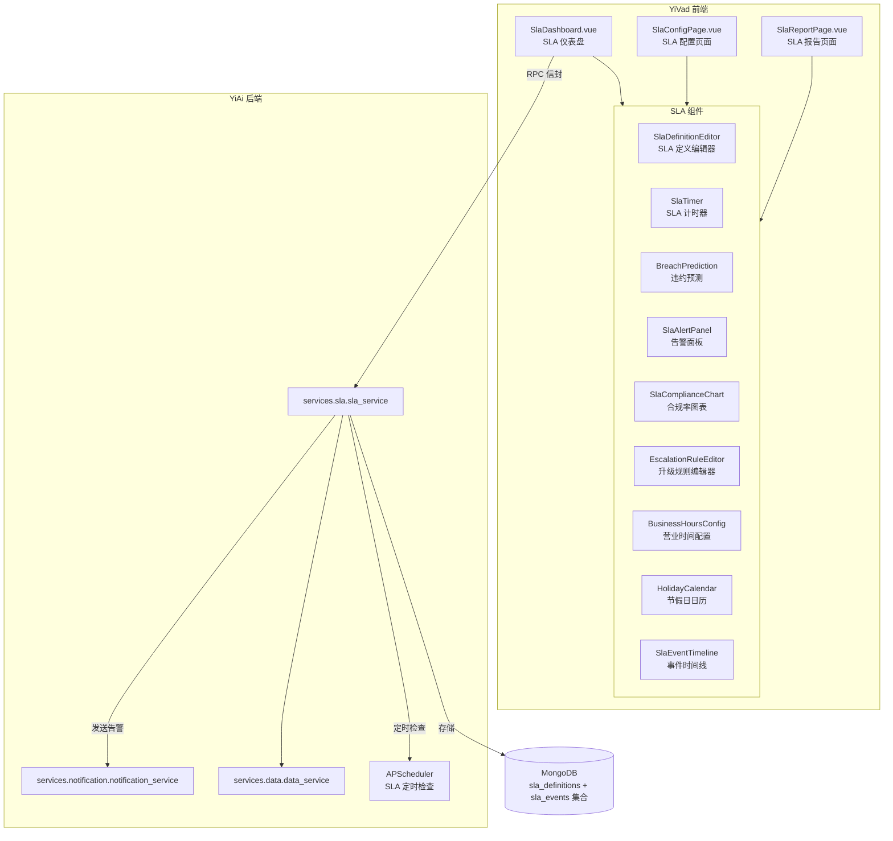

# SLA追踪与违约告警

> 需求编号：YV-09-64 · 优先级：P2 · 人天：0.5d
> 依赖：YiAi 数据服务（`services.data.data_service`）、YiAi 通知服务（`services.notification.notification_service`）、YiAi SLA 服务（`services.sla.sla_service`）

## 改动总览

| 改动点 | 类型 | 涉及文件 |
|--------|------|---------|
| SLA 配置页面 | 新增 | `src/views/sla/SlaConfigPage.vue` |
| SLA 仪表盘 | 新增 | `src/views/sla/SlaDashboard.vue` |
| SLA 报告页面 | 新增 | `src/views/sla/SlaReportPage.vue` |
| SLA 定义编辑器 | 新增 | `src/components/sla/SlaDefinitionEditor.vue` |
| SLA 计时器组件 | 新增 | `src/components/sla/SlaTimer.vue` |
| SLA 违约预测组件 | 新增 | `src/components/sla/BreachPrediction.vue` |
| SLA 告警面板 | 新增 | `src/components/sla/SlaAlertPanel.vue` |
| SLA 合规率图表 | 新增 | `src/components/sla/SlaComplianceChart.vue` |
| 升级规则编辑器 | 新增 | `src/components/sla/EscalationRuleEditor.vue` |
| 营业时间配置 | 新增 | `src/components/sla/BusinessHoursConfig.vue` |
| 节假日日历 | 新增 | `src/components/sla/HolidayCalendar.vue` |
| SLA 事件时间线 | 新增 | `src/components/sla/SlaEventTimeline.vue` |
| SLA Composable | 新增 | `src/composables/sla/useSla.ts` |
| SLA 类型定义 | 新增 | `src/types/sla.ts` |
| SLA API 服务 | 新增 | `src/services/sla.service.ts` |
| 路由配置 | 修改 | `src/router/` 添加 SLA 路由 |

## 涉及文件

```
YiVad/
└── src/
    ├── views/
    │   └── sla/
    │       ├── SlaConfigPage.vue                   # 新增：SLA 配置管理页面
    │       ├── SlaDashboard.vue                    # 新增：SLA 仪表盘
    │       └── SlaReportPage.vue                   # 新增：SLA 报告页面
    ├── components/
    │   └── sla/
    │       ├── SlaDefinitionEditor.vue             # 新增：SLA 定义编辑器
    │       ├── SlaTimer.vue                        # 新增：SLA 计时器组件
    │       ├── BreachPrediction.vue                # 新增：违约预测组件
    │       ├── SlaAlertPanel.vue                   # 新增：SLA 告警面板
    │       ├── SlaComplianceChart.vue              # 新增：合规率图表
    │       ├── EscalationRuleEditor.vue            # 新增：升级规则编辑器
    │       ├── BusinessHoursConfig.vue             # 新增：营业时间配置
    │       ├── HolidayCalendar.vue                 # 新增：节假日日历
    │       └── SlaEventTimeline.vue                # 新增：SLA 事件时间线
    ├── composables/
    │   └── sla/
    │       └── useSla.ts                           # 新增：SLA 状态管理 Composable
    ├── services/
    │   └── sla.service.ts                          # 新增：SLA API 服务
    ├── types/
    │   └── sla.ts                                  # 新增：SLA 类型定义
    └── router/
        └── index.ts                                # 修改：添加 SLA 路由
```

## 基本信息

| 字段 | 值 |
|------|-----|
| 需求编号 | YV-09-64 |
| 模块 | 服务质量 |
| 优先级 | **P2**（保障服务质量承诺，提升客户信任） |
| 前端人天 | 0.5d |
| 后端人天 | 0.5d（YiAi SLA 服务 + 定时器服务） |
| 依赖 | YiAi `services.sla.sla_service` 提供 SLA 定义、计时、告警接口 |

---

## 背景

YiVad 当前缺乏 SLA（Service Level Agreement）追踪与违约告警机制。对于承诺了响应时间和解决时间的企业客户，无法自动追踪 SLA 达成情况，也无法在 SLA 即将违约时主动告警。这导致三个问题：SLA 违约未被及时发现（通常等到客户投诉才知道）、无法量化服务质量（缺乏合规率、MTTR、MTTD 等关键指标）、以及升级流程缺失（P1 严重问题未及时通知管理层）。

**核心问题：**

| # | 问题 | 严重程度 | 影响 |
|---|------|----------|------|
| 1 | **无 SLA 自动计时** -- Issue 创建后无自动计时，无法追踪响应时间和解决时间 | **高** | SLA 违约无法及时发现，客户投诉后才知道 |
| 2 | **无违约预警** -- 即将违约时无告警，错过补救窗口 | **高** | 违约发生后才被动处理，无法提前干预 |
| 3 | **无 SLA 合规报告** -- 无法提供周期性的 SLA 合规率报告给客户 | **中** | 无法向客户展示服务质量，影响续约 |
| 4 | **无升级规则** -- 高优先级问题违约后无自动升级通知 | **中** | 严重问题未及时触达管理层 |
| 5 | **无营业时间计算** -- SLA 计时未区分工作时间和非工作时间 | **中** | 非工作时间被计入 SLA，导致虚高违约率 |
| 6 | **无节假日处理** -- 法定节假日被计入 SLA 时间 | **低** | 节假日期间 SLA 违约率异常升高 |

## 一、现状分析

### 当前 SLA 管理能力矩阵

| 场景 | 当前行为 | 期望行为 | 差距 |
|------|---------|---------|------|
| Issue 创建后 SLA 计时 | 无计时 | 根据优先级自动启动 SLA 计时器，显示剩余时间 | 完全缺失 |
| P1 问题超时告警 | 无告警 | 响应时间剩余 30 分钟时发送告警，超时后发送违约通知 | 完全缺失 |
| 客户询问 SLA 合规率 | 无法提供 | 仪表盘展示本月合规率 98.5%，违约 3 次 | 完全缺失 |
| 等待客户回复时暂停计时 | 无暂停 | 状态变为"等待客户"时自动暂停计时器 | 完全缺失 |
| 月度 SLA 报告 | 手动整理 | 自动生成月度 SLA 合规报告，包含 MTTR、MTTD、违约事件列表 | 完全缺失 |
| 节假日 SLA 豁免 | 无豁免 | 节假日自动暂停所有 SLA 计时器 | 完全缺失 |
| 升级通知 | 手动通知 | P1 违约自动通知部门经理，P0 违约自动通知总监 | 完全缺失 |

### 根因分析矩阵



| 缺失项 | 根因 | 影响链 |
|--------|------|--------|
| SLA 计时器引擎 | 后端未实现基于 Issue 状态变化的计时器，无 APScheduler 定时检查 | 无法自动追踪 SLA 时间 |
| SLA 定义配置 | 未定义 SLA 规则（响应时间、解决时间/优先级/项目），无配置界面 | 不同项目/客户无法设置不同 SLA |
| 违约预测算法 | 无基于当前进度和历史数据的剩余时间预测 | 无法提前预警即将违约的 Issue |
| 升级规则引擎 | 未定义升级链（违约后通知谁），无通知触发机制 | 严重问题违约后无人知晓 |
| 营业时间系统 | 无营业时间配置和节假日日历，SLA 计时为 24/7 | 非工作时间被计入 SLA |
| SLA 报告生成 | 无 SLA 数据聚合查询和报告模板 | 无法生成合规报告 |

---

## 二、设计决策

### SLA 计时模式

| 模式 | 描述 | 优点 | 缺点 | 决策 |
|------|------|------|------|------|
| 24/7 模式 | 全天候计时，不区分工作时间和节假日 | 实现简单，适用于紧急支持 | 非工作时间计入 SLA，虚高违约率 | 备选 |
| 营业时间模式 | 仅在工作时间计时，节假日暂停 | 反映真实工作场景，SLA 更合理 | 实现复杂，需营业时间和节假日管理 | **选中** |
| 混合模式 | 可根据项目/客户选择 24/7 或营业时间 | 最大灵活性 | 复杂度和维护成本最高 | 未来扩展 |

**决策：** 支持营业时间模式和 24/7 模式两种，默认使用营业时间模式。每个 SLA 定义可独立配置计时模式，满足不同客户需求。

### SLA 计时器状态机

| 状态 | 触发条件 | 行为 | 下一状态 |
|------|---------|------|---------|
| not_started | Issue 创建 | 等待首次分配 | counting |
| counting | 分配给工程师 | 开始计时 | paused / breached / completed |
| paused | 状态变为"等待客户" | 暂停计时 | counting |
| breached | 超过 SLA 时限 | 发送告警，记录违约 | completed |
| completed | 状态变为"已解决" | 停止计时，记录结果 | -- |
| cancelled | Issue 被关闭/取消 | 停止计时，不计入 SLA | -- |

### SLA 定义参数

| 优先级 | 响应时间(SLA) | 解决时间(SLA) | 升级规则 | 示例 |
|--------|-------------|-------------|---------|------|
| P0 | 15 分钟 | 2 小时 | 违约后 5 分钟通知总监、CTO | 生产环境宕机 |
| P1 | 30 分钟 | 4 小时 | 违约后 15 分钟通知部门经理 | 核心功能不可用 |
| P2 | 2 小时 | 8 小时 | 违约后 30 分钟通知团队负责人 | 功能异常 |
| P3 | 4 小时 | 24 小时 | 违约后 1 小时通知团队负责人 | 一般问题 |
| P4 | 8 小时 | 72 小时 | 无自动升级 | 建议/优化 |

### 违约预测策略

| 策略 | 描述 | 准确度 | 计算成本 |
|------|------|--------|---------|
| 简单线性预测 | 基于已用时间和剩余 SLA 时间的线性比较 | 中 | 低 |
| 历史平均预测 | 基于同优先级 Issue 的历史平均解决时间预测 | 中高 | 中 |
| 趋势预测 | 基于当前 Issue 的状态变化频率和最近活动时间预测 | 高 | 高 |
| **决策：** | 采用简单线性预测作为默认，历史平均预测作为辅助参考。 | | |

---

## 三、目标架构



### SLA 数据模型

```
SlaDefinition
├── id: string
├── name: string                    # SLA 名称
├── projectId?: string              # 关联项目（null = 全局）
├── teamId?: string                 # 关联团队（null = 全局）
├── timerMode: '24/7' | 'business_hours'
├── businessHours?: {               # 营业时间配置（timerMode = business_hours 时必填）
│   timezone: string
│   workDays: number[]              # 1=周一, 7=周日
│   workHours: { start: string; end: string }  # 如 "09:00" - "18:00"
├── priorities: SlaPriorityRule[]   # 每个优先级的规则
│   ├── priority: 'P0' | 'P1' | 'P2' | 'P3' | 'P4'
│   ├── responseTimeMinutes: number # 响应时间（分钟）
│   ├── resolutionTimeMinutes: number # 解决时间（分钟）
│   ├── escalationRules: EscalationRule[]
│   │   ├── triggerAfterMinutes: number  # 违约后多少分钟触发
│   │   ├── notifyRoles: string[]        # 通知角色
│   │   ├── notifyUsers: string[]        # 通知用户
│   │   ├── channels: ('in_app' | 'email' | 'webhook')[]
│   │   └── messageTemplate: string
│   └── breachPredictionThreshold: number # 违约预测阈值（提前多少分钟告警）
├── holidays: HolidayCalendar       # 节假日日历
│   ├── id: string
│   ├── name: string
│   ├── dates: string[]             # 日期列表 "2026-01-01"
│   └── recurring: boolean          # 是否每年重复
├── enabled: boolean
├── createdAt: string
└── updatedAt: string

SlaEvent
├── id: string
├── issueId: string
├── slaDefinitionId: string
├── priority: string
├── eventType: 'timer_started' | 'timer_paused' | 'timer_resumed'
│   | 'response_breached' | 'resolution_breached'
│   | 'breach_predicted' | 'escalated' | 'completed' | 'cancelled'
├── timestamp: string
├── elapsedBusinessMinutes: number   # 已用营业时间（分钟）
├── elapsedCalendarMinutes: number   # 已用日历时间（分钟）
├── metadata: {
│   triggeredBy: string
│   reason?: string
│   breachType?: 'response' | 'resolution'
│   predictedBreachAt?: string
├── }
└── createdAt: string

SlaCompliance
├── period: string                   # "2026-09" 或 "2026-W36"
├── slaDefinitionId: string
├── totalIssues: number
├── metResponseTime: number
├── breachedResponseTime: number
├── metResolutionTime: number
├── breachedResolutionTime: number
├── complianceRate: number           # 百分比
├── mttr: number                     # Mean Time To Resolve (分钟)
├── mttd: number                     # Mean Time To Detect (分钟)
├── breachEvents: SlaEvent[]
└── calculatedAt: string
```

---

## 四、具体改动

### 4.1 SLA 类型定义

**文件：** `src/types/sla.ts`（新增）

```typescript
// SLA 计时模式
export type SlaTimerMode = '24/7' | 'business_hours';

// Issue 优先级
export type IssuePriority = 'P0' | 'P1' | 'P2' | 'P3' | 'P4';

// SLA 事件类型
export type SlaEventType =
  | 'timer_started' | 'timer_paused' | 'timer_resumed'
  | 'response_breached' | 'resolution_breached'
  | 'breach_predicted' | 'escalated' | 'completed' | 'cancelled';

// 通知渠道
export type NotificationChannel = 'in_app' | 'email' | 'webhook';

// 营业时间配置
export interface BusinessHours {
  timezone: string;
  workDays: number[];
  workHours: { start: string; end: string };
}

// 升级规则
export interface EscalationRule {
  triggerAfterMinutes: number;
  notifyRoles: string[];
  notifyUsers: string[];
  channels: NotificationChannel[];
  messageTemplate: string;
}

// 优先级 SLA 规则
export interface SlaPriorityRule {
  priority: IssuePriority;
  responseTimeMinutes: number;
  resolutionTimeMinutes: number;
  escalationRules: EscalationRule[];
  breachPredictionThreshold: number;
}

// 节假日条目
export interface Holiday {
  id: string;
  name: string;
  date: string;
  recurring: boolean;
}

// 节假日日历
export interface HolidayCalendar {
  id: string;
  name: string;
  holidays: Holiday[];
  createdAt: string;
  updatedAt: string;
}

// SLA 定义
export interface SlaDefinition {
  id: string;
  name: string;
  projectId?: string;
  teamId?: string;
  timerMode: SlaTimerMode;
  businessHours?: BusinessHours;
  priorities: SlaPriorityRule[];
  holidayCalendarId?: string;
  enabled: boolean;
  createdAt: string;
  updatedAt: string;
}

// SLA 事件
export interface SlaEvent {
  id: string;
  issueId: string;
  issueTitle: string;
  slaDefinitionId: string;
  slaDefinitionName: string;
  priority: IssuePriority;
  eventType: SlaEventType;
  timestamp: string;
  elapsedBusinessMinutes: number;
  elapsedCalendarMinutes: number;
  metadata: {
    triggeredBy: string;
    reason?: string;
    breachType?: 'response' | 'resolution';
    predictedBreachAt?: string;
  };
  createdAt: string;
}

// SLA 计时器状态
export interface SlaTimerState {
  issueId: string;
  status: 'not_started' | 'counting' | 'paused' | 'breached' | 'completed' | 'cancelled';
  priority: IssuePriority;
  responseTimeLimit: number;
  resolutionTimeTarget: number;
  elapsedMinutes: number;
  remainingMinutes: number;
  pausedReason?: string;
  pauseHistory: Array<{ start: string; end?: string; reason: string }>;
  startedAt?: string;
  pausedAt?: string;
  completedAt?: string;
  breachPrediction?: {
    willBreach: boolean;
    predictedBreachAt: string;
    confidence: number;
    reason: string;
  };
}

// SLA 合规数据
export interface SlaCompliance {
  period: string;
  slaDefinitionId: string;
  slaDefinitionName: string;
  totalIssues: number;
  metResponseTime: number;
  breachedResponseTime: number;
  metResolutionTime: number;
  breachedResolutionTime: number;
  complianceRate: number;
  mttr: number;
  mttd: number;
  breachEvents: SlaEvent[];
  calculatedAt: string;
}

// SLA 告警
export interface SlaAlert {
  id: string;
  issueId: string;
  issueTitle: string;
  slaDefinitionId: string;
  alertType: 'breach_predicted' | 'breached' | 'escalated';
  severity: 'critical' | 'warning' | 'info';
  message: string;
  priority: IssuePriority;
  remainingMinutes?: number;
  escalatedTo?: string[];
  acknowledged: boolean;
  acknowledgedBy?: string;
  acknowledgedAt?: string;
  createdAt: string;
}

// SLA 仪表盘数据
export interface SlaDashboardData {
  overallComplianceRate: number;
  totalIssuesUnderSla: number;
  breachedCount: number;
  predictedBreachCount: number;
  mttr: number;
  mttd: number;
  complianceByPriority: Record<IssuePriority, number>;
  complianceByProject: Array<{ projectName: string; rate: number }>;
  recentBreaches: SlaEvent[];
  activeAlerts: SlaAlert[];
  trendData: Array<{ period: string; complianceRate: number }>;
}
```

### 4.2 SLA API 服务

**文件：** `src/services/sla.service.ts`（新增）

```typescript
import { RequestHttp } from '@/utils/request';
import type {
  SlaDefinition, SlaEvent, SlaCompliance, SlaAlert,
  SlaDashboardData, SlaTimerState, SlaPriorityRule,
  HolidayCalendar, EscalationRule,
} from '@/types/sla';

const http = new RequestHttp();

export const slaService = {
  // SLA 定义 CRUD
  async listDefinitions(filter: Record<string, any> = {}): Promise<SlaDefinition[]> {
    return http.post('/', {
      module_name: 'services.sla.sla_service',
      method_name: 'list_definitions',
      parameters: { filter },
    });
  },

  async getDefinition(id: string): Promise<SlaDefinition> {
    return http.post('/', {
      module_name: 'services.sla.sla_service',
      method_name: 'get_definition',
      parameters: { sla_id: id },
    });
  },

  async createDefinition(definition: Omit<SlaDefinition, 'id' | 'createdAt' | 'updatedAt'>): Promise<SlaDefinition> {
    return http.post('/', {
      module_name: 'services.sla.sla_service',
      method_name: 'create_definition',
      parameters: { definition },
    });
  },

  async updateDefinition(id: string, updates: Partial<SlaDefinition>): Promise<SlaDefinition> {
    return http.post('/', {
      module_name: 'services.sla.sla_service',
      method_name: 'update_definition',
      parameters: { sla_id: id, updates },
    });
  },

  async deleteDefinition(id: string): Promise<void> {
    return http.post('/', {
      module_name: 'services.sla.sla_service',
      method_name: 'delete_definition',
      parameters: { sla_id: id },
    });
  },

  async toggleDefinition(id: string, enabled: boolean): Promise<SlaDefinition> {
    return http.post('/', {
      module_name: 'services.sla.sla_service',
      method_name: 'toggle_definition',
      parameters: { sla_id: id, enabled },
    });
  },

  // SLA 计时器
  async getTimerState(issueId: string): Promise<SlaTimerState> {
    return http.post('/', {
      module_name: 'services.sla.sla_service',
      method_name: 'get_timer_state',
      parameters: { issue_id: issueId },
    });
  },

  async getIssueSlaEvents(issueId: string): Promise<SlaEvent[]> {
    return http.post('/', {
      module_name: 'services.sla.sla_service',
      method_name: 'get_issue_sla_events',
      parameters: { issue_id: issueId },
    });
  },

  // 仪表盘
  async getDashboardData(filter: { projectId?: string; dateRange?: { start: string; end: string } }): Promise<SlaDashboardData> {
    return http.post('/', {
      module_name: 'services.sla.sla_service',
      method_name: 'get_dashboard_data',
      parameters: { filter },
    });
  },

  // 合规报告
  async getComplianceReport(period: string, slaDefinitionId?: string): Promise<SlaCompliance> {
    return http.post('/', {
      module_name: 'services.sla.sla_service',
      method_name: 'get_compliance_report',
      parameters: { period, sla_definition_id: slaDefinitionId },
    });
  },

  async getComplianceHistory(slaDefinitionId: string, periods: number = 12): Promise<SlaCompliance[]> {
    return http.post('/', {
      module_name: 'services.sla.sla_service',
      method_name: 'get_compliance_history',
      parameters: { sla_definition_id: slaDefinitionId, periods },
    });
  },

  // 告警
  async listAlerts(filter: { status?: string; priority?: string }, page: number = 1): Promise<{ items: SlaAlert[]; total: number }> {
    return http.post('/', {
      module_name: 'services.sla.sla_service',
      method_name: 'list_alerts',
      parameters: { filter, page },
    });
  },

  async acknowledgeAlert(alertId: string): Promise<void> {
    return http.post('/', {
      module_name: 'services.sla.sla_service',
      method_name: 'acknowledge_alert',
      parameters: { alert_id: alertId },
    });
  },

  async dismissAlert(alertId: string): Promise<void> {
    return http.post('/', {
      module_name: 'services.sla.sla_service',
      method_name: 'dismiss_alert',
      parameters: { alert_id: alertId },
    });
  },

  // 升级规则
  async updateEscalationRules(
    slaDefinitionId: string,
    priority: string,
    rules: EscalationRule[]
  ): Promise<SlaPriorityRule> {
    return http.post('/', {
      module_name: 'services.sla.sla_service',
      method_name: 'update_escalation_rules',
      parameters: { sla_definition_id: slaDefinitionId, priority, rules },
    });
  },

  // 节假日管理
  async listHolidayCalendars(): Promise<HolidayCalendar[]> {
    return http.post('/', {
      module_name: 'services.sla.sla_service',
      method_name: 'list_holiday_calendars',
      parameters: {},
    });
  },

  async createHolidayCalendar(calendar: Omit<HolidayCalendar, 'id' | 'createdAt' | 'updatedAt'>): Promise<HolidayCalendar> {
    return http.post('/', {
      module_name: 'services.sla.sla_service',
      method_name: 'create_holiday_calendar',
      parameters: { calendar },
    });
  },

  async updateHolidayCalendar(id: string, updates: Partial<HolidayCalendar>): Promise<HolidayCalendar> {
    return http.post('/', {
      module_name: 'services.sla.sla_service',
      method_name: 'update_holiday_calendar',
      parameters: { calendar_id: id, updates },
    });
  },

  async deleteHolidayCalendar(id: string): Promise<void> {
    return http.post('/', {
      module_name: 'services.sla.sla_service',
      method_name: 'delete_holiday_calendar',
      parameters: { calendar_id: id },
    });
  },

  // 营业时间
  async getBusinessHours(slaDefinitionId: string): Promise<BusinessHours> {
    return http.post('/', {
      module_name: 'services.sla.sla_service',
      method_name: 'get_business_hours',
      parameters: { sla_definition_id: slaDefinitionId },
    });
  },

  async updateBusinessHours(slaDefinitionId: string, businessHours: BusinessHours): Promise<BusinessHours> {
    return http.post('/', {
      module_name: 'services.sla.sla_service',
      method_name: 'update_business_hours',
      parameters: { sla_definition_id: slaDefinitionId, business_hours: businessHours },
    });
  },
};
```

### 4.3 useSla Composable

**文件：** `src/composables/sla/useSla.ts`（新增）

核心功能：
- 管理 SLA 状态：`definitions`（SLA 定义列表）、`dashboardData`（仪表盘数据）、`alerts`（告警列表）、`activeTimer`（当前 Issue 的计时器）
- 仪表盘数据聚合：`fetchDashboardData(filter)` 获取合规率、MTTR、MTTD、违约列表、趋势数据
- 计时器轮询：`startTimerPolling(issueId)` 每 30 秒轮询 SLA 计时器状态，`stopTimerPolling()` 停止轮询
- 违约预测：`checkBreachPrediction(timerState)` 计算剩余时间，判断是否会违约
- 告警管理：`fetchAlerts()` 获取告警列表，`acknowledgeAlert(id)` 确认告警，`dismissAlert(id)` 关闭告警
- 合规率计算：`calculateCompliance(data)` 计算指定周期的合规率百分比
- 格式化时间：`formatSlaTime(minutes)` 将分钟格式化为 "2h 30m" 或 "30m"
- 状态颜色映射：`getStatusColor(status)` 根据 SLA 状态返回颜色（绿色正常/黄色预警/红色违约）
- 升级链展示：`getEscalationChain(priority)` 返回该优先级的升级通知链

### 4.4 SlaDashboard 仪表盘

**文件：** `src/views/sla/SlaDashboard.vue`（新增）

核心功能：
- 顶部统计卡片：总合规率（环形图）、SLA 覆盖 Issue 数、本周期违约数、MTTR、MTTD
- 合规率趋势图：折线图展示近 12 个月的合规率变化，标注目标线（如 95%）
- 按优先级分布：柱状图展示各优先级 Issue 的合规率（P0-P4），违约用红色标记
- 按项目分布：横向柱状图展示各项目 SLA 合规率排名
- 近期违约事件：表格展示最近 20 条违约事件，包含 Issue 标题、优先级、违约类型、时间
- 活跃告警：卡片列表展示当前未确认的告警，按严重程度排序
- 实时计时器：展示当前重点 Issue 的 SLA 剩余时间（倒计时样式）
- 筛选器：项目筛选、时间范围选择（今日/本周/本月/自定义）

### 4.5 SlaConfigPage 配置页面

**文件：** `src/views/sla/SlaConfigPage.vue`（新增）

核心功能：
- SLA 定义列表：表格展示所有 SLA 定义，包含名称、关联项目、计时模式、优先级规则数、启用状态
- 新建/编辑 SLA 定义：弹出 SlaDefinitionEditor 组件
- 启用/禁用开关：一键切换 SLA 定义启用状态
- 删除：确认弹窗后删除，提示"删除后历史 SLA 数据将保留但不再计时"
- 复制 SLA 定义：快速复制现有定义到新项目

### 4.6 SlaDefinitionEditor 定义编辑器

**文件：** `src/components/sla/SlaDefinitionEditor.vue`（新增）

核心功能：
- 基本信息：名称、关联项目（下拉选择）、关联团队（下拉选择）、计时模式（24/7 或营业时间）
- 优先级规则表格：5 行（P0-P4），每行可编辑响应时间、解决时间、违约预测阈值
- 时间输入：数字输入框 + 单位选择（分钟/小时），自动换算
- 升级规则子表格：每个优先级可展开，添加多条升级规则（触发时间、通知角色、渠道、消息模板）
- 营业时间配置：计时模式为营业时间时显示，配置时区、工作日、工作时间段
- 节假日日历：下拉选择关联的节假日日历
- 预览：实时显示"P1 问题：需在 30 分钟内响应，4 小时内解决"
- 继承提示：项目级 SLA 定义优先级高于全局 SLA 定义

### 4.7 SlaTimer 计时器组件

**文件：** `src/components/sla/SlaTimer.vue`（新增）

核心功能：
- 在 Issue 详情页展示，显示当前 SLA 计时器状态
- 状态指示器：彩色圆点 + 状态文字（计时中/已暂停/已违约/已完成）
- 双时间显示：响应时间（已用/剩余）、解决时间（已用/剩余）
- 进度条：两行进度条，绿色=正常，黄色=预警（剩余 < 30%），红色=违约
- 暂停历史：可展开的暂停记录列表，显示暂停时间和原因
- 倒计时效果：剩余时间不足 30 分钟时数字变红闪烁
- 自动刷新：每 30 秒更新一次，状态变化时立即更新

### 4.8 BreachPrediction 违约预测

**文件：** `src/components/sla/BreachPrediction.vue`（新增）

核心功能：
- 预测结果展示：绿色"预计按时完成"、黄色"可能违约"、红色"即将违约"
- 预测详情：预计违约时间、置信度百分比、预测依据（基于历史平均解决时间或当前进度）
- 预测因素：列出影响预测的关键因素（已用时间占比、历史同类 Issue 平均时间、当前状态停留时间）
- 操作建议：如果预测违约，显示建议操作（如"建议提升优先级"、"建议转交更有经验的工程师"）
- 预测历史：展示该 Issue 的历史预测结果，对比实际结果

### 4.9 辅助组件

**文件：** `src/components/sla/SlaAlertPanel.vue`（新增）

核心功能：
- 告警列表：卡片式展示所有活跃告警，按严重程度和创建时间排序
- 告警详情：Issue 标题、SLA 定义名称、告警类型、剩余时间、创建时间
- 操作按钮：确认告警、跳转到 Issue、关闭告警
- 筛选：按告警类型（预测/违约/升级）、优先级、项目筛选
- 未确认数量徽标：顶部导航栏显示未确认告警数量

**文件：** `src/components/sla/SlaComplianceChart.vue`（新增）

核心功能：
- 基于 ECharts 的合规率可视化
- 合规率趋势折线图：支持按周/按月切换粒度
- 按优先级分组柱状图：合规/违约对比
- 按项目分布横向柱状图：合规率排名
- MTTR/MTTD 双轴图：折线图展示趋势
- 导出为图片：右键或按钮导出图表为 PNG

**文件：** `src/components/sla/EscalationRuleEditor.vue`（新增）

核心功能：
- 升级规则列表：表格展示某优先级的所有升级规则
- 添加规则：触发时间（违约后 X 分钟）、通知角色（多选）、通知用户（搜索选择）、通知渠道（多选勾选 in_app/email/webhook）
- 消息模板编辑器：文本编辑器，支持变量插入（`{issue_title}`、`{priority}`、`{breached_at}`、`{assignee}`）
- 规则排序：拖拽调整升级规则的执行顺序
- 规则测试：发送测试通知到当前用户，验证模板变量是否正确替换

**文件：** `src/components/sla/BusinessHoursConfig.vue`（新增）

核心功能：
- 时区选择器：搜索式下拉选择 IANA 时区（如 Asia/Shanghai）
- 工作日选择：7 个复选框（周一至周日），默认选中周一至周五
- 工作时间段：开始时间 + 结束时间选择器（如 09:00 - 18:00）
- 多个工作时间段：支持添加多个时间段（如 09:00-12:00, 13:00-18:00）
- 预览：显示"工作时间：周一至周五 09:00-18:00 (Asia/Shanghai)"
- 当前时区时间：显示"当前时间：2026-09-09 14:30 CST"

**文件：** `src/components/sla/HolidayCalendar.vue`（新增）

核心功能：
- 日历列表：展示所有节假日日历
- 日历详情：日历名称、描述、节假日列表（日期 + 名称 + 是否每年重复）
- 添加节假日：日期选择器选择日期，输入名称，勾选是否每年重复
- 批量导入：上传 CSV 文件批量导入节假日（日期,名称,是否重复）
- 预设节假日模板：中国法定节假日、美国法定节假日、欧洲法定节假日
- 年度预览：日历视图展示全年节假日分布

**文件：** `src/components/sla/SlaEventTimeline.vue`（新增）

核心功能：
- Issue 详情页中的 SLA 事件时间线
- 时间线展示：每个 SLA 事件以时间线节点展示，包含事件类型图标、时间、描述
- 事件类型图标：计时开始（绿色圆形）、暂停（黄色暂停）、恢复（蓝色播放）、违约（红色叉号）、升级（橙色箭头）、完成（绿色对勾）
- 时间标注：显示每个事件的营业时间和日历时间
- 违约高亮：违约事件以红色背景高亮，显示违约类型（响应/解决）和超出时间

### 4.10 SlaReportPage 报告页面

**文件：** `src/views/sla/SlaReportPage.vue`（新增）

核心功能：
- 报告周期选择：周报/月报/季报/自定义时间范围
- SLA 定义筛选：选择查看特定 SLA 定义或全部
- 报告摘要：合规率、总 Issue 数、响应达标数、解决达标数、MTTR、MTTD
- 违约事件列表：该周期内所有违约事件，支持导出 CSV
- 趋势对比：与上一周期合规率对比，显示上升/下降箭头和百分比
- 导出报告：PDF 格式（适合发送给客户）、CSV 格式（适合数据分析）
- 定时报告：配置每月自动生成并发送报告到指定邮箱

---

## 五、实施步骤

| 步骤 | 任务 | 产出 | 验证方式 | 人天 |
|------|------|------|----------|------|
| 1 | 定义 SLA 类型接口 | `types/sla.ts` | TypeScript 类型检查通过 | 0.03 |
| 2 | 实现 SLA API 服务 | `services/sla.service.ts` | 接口调用返回正确数据结构 | 0.03 |
| 3 | 实现 useSla Composable | `composables/sla/useSla.ts` | 计时器轮询、违约预测、合规率计算正常 | 0.05 |
| 4 | 实现 SlaDashboard 仪表盘 | `views/sla/SlaDashboard.vue` | 统计卡片、趋势图、近违约事件、告警面板正常 | 0.06 |
| 5 | 实现 SlaConfigPage 配置页面 | `views/sla/SlaConfigPage.vue` | 定义列表、启用/禁用、复制/删除正常 | 0.03 |
| 6 | 实现 SlaDefinitionEditor 编辑器 | `components/sla/SlaDefinitionEditor.vue` | 优先级规则、升级规则、营业时间、节假日配置正常 | 0.05 |
| 7 | 实现 SlaTimer 计时器 | `components/sla/SlaTimer.vue` | 双时间显示、进度条、暂停历史、倒计时效果正常 | 0.04 |
| 8 | 实现 BreachPrediction 预测 | `components/sla/BreachPrediction.vue` | 预测结果、置信度、预测因素、操作建议正常 | 0.03 |
| 9 | 实现 SlaAlertPanel 告警面板 | `components/sla/SlaAlertPanel.vue` | 告警列表、确认/关闭、筛选、未确认徽标正常 | 0.02 |
| 10 | 实现 SlaComplianceChart 图表 | `components/sla/SlaComplianceChart.vue` | 趋势图、分组柱状图、MTTR/MTTD 双轴图正常 | 0.03 |
| 11 | 实现 EscalationRuleEditor 升级规则 | `components/sla/EscalationRuleEditor.vue` | 规则 CRUD、消息模板、规则测试正常 | 0.03 |
| 12 | 实现 BusinessHoursConfig 营业时间 | `components/sla/BusinessHoursConfig.vue` | 时区、工作日、工作时间段配置正常 | 0.02 |
| 13 | 实现 HolidayCalendar 节假日 | `components/sla/HolidayCalendar.vue` | 日历 CRUD、批量导入、预设模板正常 | 0.03 |
| 14 | 实现 SlaEventTimeline 事件时间线 | `components/sla/SlaEventTimeline.vue` | 事件类型图标、时间标注、违约高亮正常 | 0.02 |
| 15 | 实现 SlaReportPage 报告页面 | `views/sla/SlaReportPage.vue` | 周期选择、报告摘要、导出 PDF/CSV 正常 | 0.03 |
| 16 | 组件测试 | 测试文件 | 6 个测试场景通过 | 0.01 |

**总计：** 0.5d

---

## 六、测试规格

### Scenario 1: 创建 SLA 定义并应用到项目
- **GIVEN** 管理员进入 SLA 配置页面，有 2 个项目
- **WHEN** 点击"新建 SLA 定义"，命名为"企业版 SLA"，选择项目"客户项目 A"，配置 P1 响应时间 30 分钟、解决时间 4 小时，P2 响应时间 2 小时、解决时间 8 小时，启用营业时间模式（周一至周五 09:00-18:00），保存
- **THEN** SLA 定义列表新增"企业版 SLA"，关联项目显示"客户项目 A"，P1 和 P2 规则已配置

### Scenario 2: SLA 计时器自动启停
- **GIVEN** 项目已配置 SLA 定义，当前为周一 10:00
- **WHEN** 用户创建 P1 Issue 并分配给工程师
- **THEN** SLA 计时器自动启动，Issue 详情页显示 SLA 计时器，状态为"计时中"，响应时间显示"剩余 30 分钟"，解决时间显示"剩余 4 小时"，进度条为绿色

### Scenario 3: 等待客户时暂停计时
- **GIVEN** P1 Issue SLA 计时器正在运行，已用 10 分钟
- **WHEN** 工程师将 Issue 状态改为"等待客户回复"
- **THEN** SLA 计时器暂停，状态变为"已暂停"，暂停原因显示"等待客户回复"，进度条变为灰色，已用时间停留在 10 分钟，不再增长

### Scenario 4: 违约预测告警
- **GIVEN** P2 Issue 解决时间 8 小时，已用 6.5 小时，剩余 1.5 小时，违约预测阈值设为提前 2 小时告警
- **WHEN** SLA 定时检查触发（已用时间超过 6 小时）
- **THEN** 系统生成违约预测告警，告警面板新增一条"P2 Issue #123 预测将在 1.5 小时后违约"，Issue 详情页显示黄色"可能违约"预测结果，置信度 85%

### Scenario 5: 升级规则触发
- **GIVEN** P1 问题配置了升级规则：违约后 15 分钟通知部门经理
- **WHEN** P1 Issue 响应时间超过 30 分钟，触发响应违约，15 分钟后
- **THEN** 系统发送升级通知给部门经理（站内信 + 邮件），通知内容包含 Issue 标题、优先级、违约时间、当前处理人，SLA 事件时间线记录"已升级"事件

### Scenario 6: 月度 SLA 合规报告
- **GIVEN** 9 月份已结束，系统中有 SLA 数据
- **WHEN** 管理员打开 SLA 报告页面，选择周期"2026-09"，选择 SLA 定义"企业版 SLA"，点击"生成报告"
- **THEN** 报告展示：合规率 96.2%、总 Issue 数 53、响应达标 51、响应违约 2、解决达标 50、解决违约 3、MTTR 3.2 小时、MTTD 0.5 小时，违约事件列表包含 3 条记录，支持导出 PDF

---

## 七、风险与缓解

| 风险 | 概率 | 影响 | 等级 | 缓解措施 | 应急预案 |
|------|------|------|------|----------|----------|
| SLA 计时器状态不一致 | 中 | 高 | 高 | 后端使用状态机严格控制状态转换，每次状态变更记录事件日志 | 定时任务每日校验计时器状态与 Issue 状态一致性，不一致时自动修复 |
| 违约预测准确度低 | 高 | 中 | 中 | 使用历史平均预测 + 线性预测双算法，显示置信度 | 预测不准确时标注"预测结果仅供参考"，不自动触发操作 |
| 大批量 Issue 同时进入 SLA | 中 | 中 | 中 | 定时检查分批处理，每批 100 个 Issue，5 分钟一批 | 检查间隔自动调整为 10 分钟，防止系统过载 |
| 节假日配置错误导致计时异常 | 低 | 高 | 中 | 节假日日历修改需审批，提供预览功能 | 紧急禁用节假日日历，切换为 24/7 模式 |
| 升级通知风暴 | 中 | 中 | 中 | 同一 Issue 同一升级规则 1 小时内最多触发 1 次 | 通知频率限制，超过上限自动合并通知 |
| 营业时间跨时区计算错误 | 中 | 中 | 中 | 统一使用 UTC 存储，前端根据配置时区转换显示 | 时区配置错误时降级为 24/7 模式 |

---

## 八、回滚策略

| 回滚场景 | 回滚方式 | 影响范围 | 恢复时间 |
|----------|----------|----------|----------|
| SLA 仪表盘白屏 | 移除 SLA 路由，隐藏导航菜单项 | SLA 模块 | < 2min |
| SLA 计时器异常导致 Issue 页面卡顿 | 在 Issue 详情页隐藏 SLA 计时器组件 | Issue 详情页 | < 2min |
| 违约预测错误率过高 | 禁用预测功能，仅保留实时计时 | 违约预测 | < 2min |
| 升级通知风暴 | 禁用所有升级规则，暂停自动通知 | 通知系统 | < 2min |
| 合规报告生成超时 | 限制报告时间范围为 30 天，减少数据量 | 报告页面 | < 3min |

**回滚验证：**
- 回滚后 Issue 详情页正常加载
- 回滚后 SLA 配置数据不丢失
- 回滚后其他页面功能正常
- 回滚后 `vue-tsc --noEmit` 类型检查通过

---

## 九、设计决策记录

### D-01: 支持营业时间模式和 24/7 模式，默认营业时间

**背景：** 不同客户对 SLA 计时方式有不同需求。内部支持团队可能只需要营业时间 SLA，而 7x24 运维团队需要全天候 SLA。
**决策：** 支持两种计时模式，默认使用营业时间模式。每个 SLA 定义可独立配置。
**权衡：** 营业时间模式实现复杂度高（需处理时区、节假日、工作时间段），但更贴近真实业务场景，SLA 合规率更合理。
**后果：** 营业时间计算逻辑需完整测试，尤其在跨时区场景下。提供"当前有效工作时间"的实时预览，帮助管理员验证配置。

### D-02: SLA 计时器使用后端定时检查 + 前端轮询，而非 WebSocket 推送

**背景：** SLA 计时器需要实时更新，可以选择 WebSocket 推送或前端轮询。
**决策：** 后端每 30 秒定时检查 SLA 状态，前端每 30 秒轮询获取最新计时器状态。违约事件发生时后端主动推送通知。
**权衡：** 轮询有 30 秒延迟，但实现简单、稳定性高。SLA 计时（分钟级）对实时性要求不高，30 秒延迟可接受。
**后果：** 违约预测基于 30 秒延迟的数据，超级紧急（P0 15 分钟响应）场景下预测精度可能受影响。P0 问题可降低轮询间隔至 10 秒。

### D-03: 违约预测采用线性预测 + 历史平均双算法

**背景：** 违约预测需要准确度，但可用数据有限。
**决策：** 使用简单线性预测（基于当前进度）作为默认算法，历史平均预测（基于同类 Issue）作为辅助参考。两者结果不一致时显示范围。
**权衡：** 准确度不如机器学习模型，但实现简单、可解释性强。对于新项目（无历史数据），仅使用线性预测。
**后果：** 历史数据不足时置信度自动降低，预测结果标注"数据不足，仅供参考"。

### D-04: 升级规则按优先级独立配置，而非全局统一

**背景：** 升级规则可以在 SLA 定义级别或全局级别配置。
**决策：** 升级规则按优先级独立配置，每个优先级可配置多条升级规则（链式升级）。
**权衡：** 配置复杂度增加，但灵活性高。P0/P1 问题需要通知总监，P2/P3 只需通知团队负责人，需求差异大。
**后果：** 升级规则配置界面需提供验证和预览功能，避免配置错误导致通知遗漏或风暴。

---

## 十、可观测性

### 关键指标

| 指标 | 采集方式 | 告警阈值 | 说明 |
|------|---------|---------|------|
| 整体 SLA 合规率 | 定时计算 | < 90% | 所有 SLA 定义的综合合规率 |
| P0/P1 合规率 | 定时计算 | < 95% | 高优先级必须保持高合规率 |
| 违约预测准确率 | 预测结果 vs 实际结果 | < 70% | 预测算法有效性 |
| SLA 定时检查耗时 | 后端性能监控 | 单次 > 5s | 定时任务性能 |
| 告警确认率 | 告警状态统计 | < 80% | 告警是否被及时处理 |
| 升级通知送达率 | 通知发送日志 | < 95% | 升级通知是否到达 |
| 营业时间计算准确率 | 人工抽查 | 错误 > 0 | 节假日和时区计算准确性 |

### 日志规范

| 日志级别 | 场景 | 示例 |
|---------|------|------|
| `DEBUG` | 计时器状态变更 | `[SlaService] Timer for issue_001: counting → paused (reason: waiting_customer)` |
| `INFO` | SLA 定义创建/更新 | `[SlaService] SLA definition enterprise-sla created for project proj_001` |
| `INFO` | 合规报告生成 | `[SlaService] Compliance report for 2026-09 generated: 96.2% (53 issues)` |
| `WARN` | 违约预测 | `[SlaService] Breach predicted for issue_002: resolution due in 90min, 85% confidence` |
| `WARN` | 违约发生 | `[SlaService] BREACH: issue_003 response time exceeded (P1, 35min/30min)` |
| `ERROR` | 升级通知失败 | `[SlaService] Escalation notification failed for issue_003: email service unavailable` |
| `ERROR` | 定时检查失败 | `[SlaService] SLA check failed for 50 issues: database connection timeout` |

---

## 十一、代码审查检查清单

- [ ] `types/sla.ts` 中所有 SLA 定义、事件、计时器、合规数据类型定义完整
- [ ] `sla.service.ts` 中所有 API 调用使用正确的 RPC 信封格式
- [ ] `useSla.ts` 中计时器轮询间隔 30 秒，违约预测逻辑正确，合规率计算准确
- [ ] `SlaDashboard.vue` 中统计卡片、趋势图、近违约事件、告警面板数据正确
- [ ] `SlaDefinitionEditor.vue` 中 5 个优先级规则配置完整，时间输入校验正确
- [ ] `SlaTimer.vue` 中双时间显示、进度条颜色、暂停历史、倒计时效果正确
- [ ] `BreachPrediction.vue` 中预测结果、置信度、预测因素、操作建议展示正确
- [ ] `SlaAlertPanel.vue` 中告警列表排序、确认/关闭操作正确
- [ ] `SlaComplianceChart.vue` 中 ECharts 图表类型和数据正确
- [ ] `EscalationRuleEditor.vue` 中规则 CRUD、消息模板变量替换、规则测试功能正确
- [ ] `BusinessHoursConfig.vue` 中时区、工作日、工作时间段配置正确
- [ ] `HolidayCalendar.vue` 中节假日 CRUD、批量导入、预设模板正确
- [ ] `SlaEventTimeline.vue` 中事件类型图标、时间标注、违约高亮正确
- [ ] `SlaReportPage.vue` 中周期选择、报告生成、PDF/CSV 导出正确
- [ ] 所有时间计算正确处理营业时间/非营业时间、节假日排除
- [ ] `vue-tsc --noEmit` 类型检查通过

---

## 回归问题预测

| # | 问题 | 预测场景 | 根因 | 预防措施 |
|---|------|---------|------|---------|
| 1 | SLA 计时器在 Issue 状态批量更新时状态不一致 | 批量操作 50 个 Issue 状态变更，SLA 计时器部分未更新 | 状态变更事件未全部被 SLA 服务捕获 | 定时任务每日校验 Issue 状态与 SLA 计时器状态一致性，不一致时自动修复 |
| 2 | 营业时间跨时区计算错误 | 服务器在 UTC 时区，客户在 UTC+8，营业时间 09:00-18:00 (UTC+8) | 时区转换错误导致工作时间判断偏差 | 所有时间以 UTC 存储，前端展示时转换，提供"当前有效工作时间"预览 |
| 3 | 节假日日历更新后已有 Issue 计时器未重算 | 添加了新的节假日，但正在计时的 Issue 未将新节假日排除 | 已有计时器使用创建时的日历快照，未动态更新 | 节假日日历更新后，重算所有活跃计时器的剩余时间 |
| 4 | 升级规则触发重复通知 | 同一 Issue 同时满足响应违约和解决违约，触发两次升级通知 | 升级规则未合并同一 Issue 的多个违约事件 | 同一 Issue 同一升级规则 1 小时内最多触发 1 次，合并通知内容 |
| 5 | 合规报告数据不一致 | 月度报告和仪表盘显示的合规率不同 | 报告使用定时快照数据，仪表盘使用实时计算，时间窗口不一致 | 统一使用同一数据源和计算逻辑，仪表盘标注"实时数据" |
| 6 | 违约预测在周末给出错误预测 | 周五下午创建的 Issue，违约预测未考虑周末不工作时间 | 线性预测使用 24 小时/天，未排除非工作时间 | 预测算法根据 SLA 定义的计时模式排除非工作时间，使用营业时间计算 |

---

## 性能分析

### 仪表盘性能

| 组件 | 数据量 | 预估渲染时间 | 说明 |
|------|--------|-------------|------|
| SlaDashboard | 100+ Issue 聚合数据 | < 300ms | 统计卡片 + ECharts 图表 |
| SlaComplianceChart | 12 个月数据 | < 150ms | ECharts 折线/柱状图 |
| SlaAlertPanel | 50 条告警 | < 100ms | 卡片列表，分页 20 条/页 |
| SlaTimer | 单 Issue | < 50ms | 状态显示 + 进度条 |

### SLA 定时检查性能

| 场景 | Issue 数量 | 预估检查时间 | 说明 |
|------|-----------|-------------|------|
| 常规检查 | 50 个活跃 Issue | < 1s | 状态检查 + 时间计算 |
| 大规模检查 | 500 个活跃 Issue | < 3s | 分批处理，每批 100 个 |
| 违约预测 | 50 个 Issue | < 500ms | 线性预测 + 历史平均 |
| 合规报告生成 | 1 个月数据 | < 2s | 聚合查询 + 计算 |

### 内存占用

| 组件 | 内存占用 | 说明 |
|------|---------|------|
| SlaDashboard | ~25KB | 仪表盘数据 + ECharts 实例 |
| SlaDefinitionEditor | ~15KB | 表单数据 + 校验规则 |
| SlaTimer | ~5KB | 计时器状态 + 轮询数据 |
| BreachPrediction | ~8KB | 预测数据 + 历史参考 |
| SlaReportPage | ~20KB | 报告数据 + 导出缓冲 |
| useSla | ~8KB | 全局状态 + 轮询管理 |

