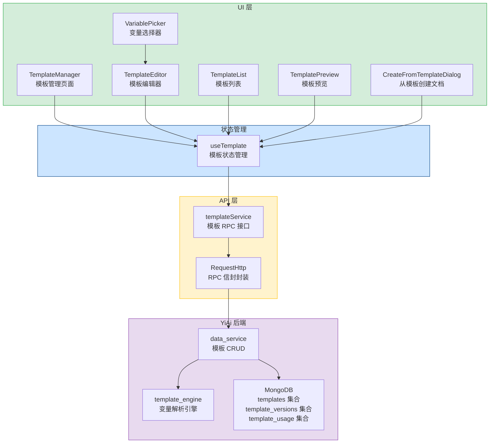

# 文档模板管理

> 需求编号：YV-09-65 · 优先级：P2 · 人天：0.3d
> 依赖：YiAi 数据服务（`services.data.data_service`）、YiAi 文件服务（文件读写端点）

## 改动总览

| 改动点 | 类型 | 涉及文件 |
|--------|------|---------|
| 文档模板管理页面 | 新增 | `src/views/docs/TemplateManager.vue` |
| 模板编辑器组件 | 新增 | `src/components/template/TemplateEditor.vue` |
| 模板列表组件 | 新增 | `src/components/template/TemplateList.vue` |
| 模板预览组件 | 新增 | `src/components/template/TemplatePreview.vue` |
| 变量选择器组件 | 新增 | `src/components/template/VariablePicker.vue` |
| 模板使用统计组件 | 新增 | `src/components/template/TemplateUsageStats.vue` |
| 模板版本历史组件 | 新增 | `src/components/template/TemplateVersionHistory.vue` |
| 模板导入导出组件 | 新增 | `src/components/template/TemplateImportExport.vue` |
| 从模板创建文档对话框 | 新增 | `src/components/template/CreateFromTemplateDialog.vue` |
| 模板 Composable | 新增 | `src/composables/template/useTemplate.ts` |
| 模板 API 服务 | 新增 | `src/services/template.service.ts` |
| 模板类型定义 | 新增 | `src/types/template.ts` |
| 路由配置 | 修改 | `src/router/` 添加模板管理路由 |

## 涉及文件

```
YiVad/
└── src/
    ├── views/
    │   └── docs/
    │       └── TemplateManager.vue              # 新增：文档模板管理页面
    ├── components/
    │   └── template/
    │       ├── TemplateEditor.vue               # 新增：模板编辑器（变量插入、预览、分类）
    │       ├── TemplateList.vue                 # 新增：模板列表（分类筛选、搜索、排序）
    │       ├── TemplatePreview.vue              # 新增：模板预览（变量替换后的渲染效果）
    │       ├── VariablePicker.vue               # 新增：变量选择器（插入变量到编辑器）
    │       ├── TemplateUsageStats.vue           # 新增：模板使用统计（最常用、从未使用）
    │       ├── TemplateVersionHistory.vue       # 新增：模板版本历史与变更日志
    │       ├── TemplateImportExport.vue          # 新增：模板导入导出（Markdown 格式）
    │       └── CreateFromTemplateDialog.vue      # 新增：从模板创建文档对话框
    ├── composables/
    │   └── template/
    │       └── useTemplate.ts                   # 新增：模板状态管理 Composable
    ├── services/
    │   └── template.service.ts                  # 新增：模板 API 服务
    ├── types/
    │   └── template.ts                          # 新增：模板类型定义
    └── router/
        └── index.ts                             # 修改：添加模板管理路由
```

## 基本信息

| 字段 | 值 |
|------|-----|
| 需求编号 | YV-09-65 |
| 模块 | 文档管理 / 项目管理 |
| 优先级 | **P2**（提升文档标准化程度，减少重复劳动） |
| 前端人天 | 0.3d |
| 后端人天 | 0.2d（模板 CRUD 端点 + 变量解析引擎） |
| 依赖 | YiAi 数据服务（`services.data.data_service`）、YiAi 文件读写端点 |

---

## 背景

YiVad 当前缺乏文档模板管理功能。团队成员在创建项目文档（PRD、技术方案、会议纪要、复盘报告、发布说明）时，每次都需要从零开始编写，导致文档格式不统一、关键信息遗漏、撰写效率低下。不同项目对文档格式有不同要求，但当前靠人工记忆和复制粘贴已有文档来维持格式一致性。

**核心问题：**

| # | 问题 | 严重程度 | 影响 |
|---|------|----------|------|
| 1 | **无模板库** -- 无法创建、管理、复用文档模板 | **高** | 每次创建文档从零开始，格式不统一，效率低下 |
| 2 | **无变量替换** -- 无法自动填充项目名称、作者、日期等元信息 | **高** | 手动填写容易出错，文档间信息不一致 |
| 3 | **无模板分类** -- 所有模板混杂在一起，难以查找 | **中** | 用户需要浏览所有模板才能找到需要的 |
| 4 | **无模板版本管理** -- 模板修改后无法追溯历史版本 | **中** | 模板更新后旧版本丢失，无法回退 |
| 5 | **无模板使用统计** -- 不知道哪些模板最常用、哪些从未使用 | **低** | 无法优化模板库，废弃模板积累 |
| 6 | **无模板导入导出** -- 无法跨项目共享模板 | **低** | 每个项目需独立创建模板，重复劳动 |

---

## 一、现状分析

### 当前文档创建流程

| 步骤 | 当前行为 | 痛点 | 期望行为 |
|------|---------|------|---------|
| 创建 PRD | 打开空白编辑器，手动输入标题和章节 | 每次重复写章节结构，格式不统一 | 选择"PRD 模板"，自动生成章节结构，填写变量即可 |
| 创建会议纪要 | 手动输入会议信息、参会人、决议 | 容易遗漏关键信息（如决议、行动项） | 选择"会议纪要模板"，变量自动填充日期、项目名 |
| 创建复盘报告 | 从已有复盘复制粘贴格式 | 格式不一致，反思维度不完整 | 选择"复盘模板"，包含问题回顾、根因分析、改进措施 |
| 创建发布说明 | 手动列出变更、已知问题 | 缺少版本号、发布日期等关键信息 | 选择"发布说明模板"，自动填充版本号和发布日期 |

### 模板变量体系

| 变量名 | 类型 | 说明 | 示例值 |
|--------|------|------|--------|
| `{{project_name}}` | 系统变量 | 当前项目名称 | "YiVad 管理后台" |
| `{{author}}` | 系统变量 | 当前登录用户 | "陈铭" |
| `{{date}}` | 系统变量 | 当前日期（YYYY-MM-DD） | "2026-09-09" |
| `{{datetime}}` | 系统变量 | 当前日期时间 | "2026-09-09 14:30:00" |
| `{{sprint}}` | 上下文变量 | 当前 Sprint 名称 | "Sprint 37" |
| `{{version}}` | 手动输入 | 版本号 | "v2.1.0" |
| `{{assignee}}` | 手动输入 | 负责人 | "张三" |
| `{{team}}` | 上下文变量 | 当前团队 | "前端团队" |
| `{{issue_count}}` | 系统变量 | 关联 Issue 数量 | "12" |
| `{{milestone}}` | 上下文变量 | 里程碑名称 | "M3 - 内测版" |

### 模板分类体系

| 分类 | 包含模板 | 适用场景 |
|------|---------|---------|
| 需求文档 | PRD、用户故事、功能规格 | 需求评审前 |
| 技术文档 | 技术方案、架构设计、API 文档 | 技术评审前 |
| 会议文档 | 会议纪要、站会记录、周报 | 会议结束后 |
| 复盘文档 | 项目复盘、Sprint 复盘、故障复盘 | 里程碑结束时 |
| 发布文档 | 发布说明、变更日志、部署清单 | 发布前 |
| 自定义 | 用户自定义模板 | 任意场景 |

### 根因分析矩阵

| 缺失项 | 根因 | 影响链 |
|--------|------|--------|
| 模板库 | 未实现模板 CRUD 功能，无模板存储和检索机制 | 无法复用文档结构，重复劳动 |
| 变量引擎 | 未实现模板变量解析，创建文档时无法自动填充元信息 | 手动填写信息，效率低且易出错 |
| 模板版本 | 未实现模板版本管理，修改即覆盖 | 模板变更无法追溯，误删无法恢复 |
| 使用统计 | 未记录模板使用事件，无统计能力 | 无法判断模板价值，废弃模板积累 |
| 导入导出 | 未实现 Markdown 格式的序列化/反序列化 | 模板无法跨项目共享 |

---

## 二、设计决策

### 决策 1：模板存储格式

| 维度 | 存储为 Markdown | 存储为 JSON | 决策 |
|------|----------------|-------------|------|
| 可读性 | 高（人类可直接阅读） | 低（需解析） | **Markdown** |
| 可编辑性 | 高（Markdown 编辑器即可） | 中（需专用编辑器） | **Markdown** |
| 变量支持 | 中（`{{variable}}` 语法） | 高（JSON 结构体） | **Markdown** |
| 导入导出 | 高（直接导出 .md 文件） | 中（需转换） | **Markdown** |

**决策：** 模板内容以 Markdown 格式存储，变量使用 `{{variable_name}}` 语法嵌入。模板元数据（名称、分类、版本）作为 frontmatter 存储在 Markdown 文件头部，模板内容存储在文件正文中。

### 决策 2：变量解析机制

| 维度 | 前端解析 | 后端解析 | 决策 |
|------|---------|---------|------|
| 系统变量获取 | 需前端获取用户、项目信息 | 后端可直接获取 | **后端解析** |
| 实时预览 | 前端可实时预览 | 后端需请求 | **前端解析**（预览用） |
| 安全性 | 无 | 高（避免注入） | **后端解析**（创建时） |

**决策：** 前端负责模板预览时的变量替换（使用本地数据），后端负责创建文档时的变量解析（使用服务器端系统变量）。两端使用同一套变量解析规则，确保预览效果与最终文档一致。

### 决策 3：模板版本策略

| 策略 | 描述 | 优点 | 缺点 | 决策 |
|------|------|------|------|------|
| 自动版本 | 每次保存自动创建新版本 | 无遗漏，完整历史 | 每个小改动都创建版本，版本数量膨胀 | 备选 |
| 手动版本 | 用户手动发布版本 | 版本干净，可控 | 可能忘记发布版本 | **选中** |
| 混合版本 | 自动保存草稿 + 手动发布版本 | 兼顾两者 | 实现复杂 | 未来扩展 |

**决策：** 采用手动版本策略。用户编辑模板时自动保存草稿，点击"发布版本"时创建带版本号和变更日志的正式版本。草稿不创建版本记录。

### 决策 4：默认模板策略

| 策略 | 描述 | 触发时机 |
|------|------|---------|
| 全局默认 | 系统预置 6 个通用模板（PRD、技术方案、会议纪要、复盘、发布说明、周报） | 系统初始化时创建 |
| 项目默认 | 按项目类型自动关联默认模板集合 | 创建项目时自动关联 |
| 用户自定义 | 用户可为项目指定默认模板 | 项目设置中配置 |

**决策：** 系统预置 6 个通用模板作为全局默认。创建新项目时自动关联全局默认模板。用户可在项目设置中指定自定义默认模板。

---

## 三、目标架构



---

## 四、具体改动

### 4.1 模板类型定义

**文件：** `src/types/template.ts`（新增）

```typescript
// 模板分类
export type TemplateCategory =
  | 'requirement'
  | 'technical'
  | 'meeting'
  | 'retrospective'
  | 'release'
  | 'custom';

// 模板变量类型
export type VariableType = 'system' | 'context' | 'manual';

// 模板变量定义
export interface TemplateVariable {
  name: string;
  label: string;
  type: VariableType;
  defaultValue?: string;
  description: string;
  example: string;
}

// 系统预定义变量
export const SYSTEM_VARIABLES: TemplateVariable[] = [
  { name: 'project_name', label: '项目名称', type: 'system', description: '当前项目名称', example: 'YiVad 管理后台' },
  { name: 'author', label: '作者', type: 'system', description: '当前登录用户', example: '陈铭' },
  { name: 'date', label: '日期', type: 'system', description: '当前日期 YYYY-MM-DD', example: '2026-09-09' },
  { name: 'datetime', label: '日期时间', type: 'system', description: '当前日期时间', example: '2026-09-09 14:30:00' },
  { name: 'sprint', label: '当前 Sprint', type: 'context', description: '当前 Sprint 名称', example: 'Sprint 37' },
  { name: 'team', label: '当前团队', type: 'context', description: '当前团队名称', example: '前端团队' },
  { name: 'version', label: '版本号', type: 'manual', description: '手动输入版本号', example: 'v2.1.0' },
  { name: 'assignee', label: '负责人', type: 'manual', description: '手动输入负责人', example: '张三' },
  { name: 'issue_count', label: 'Issue 数量', type: 'system', description: '关联 Issue 数量', example: '12' },
  { name: 'milestone', label: '里程碑', type: 'context', description: '里程碑名称', example: 'M3 - 内测版' },
];

// 模板版本
export interface TemplateVersion {
  id: string;
  templateId: string;
  version: string;
  changelog: string;
  content: string;
  publishedBy: string;
  publishedAt: string;
}

// 模板定义
export interface Template {
  id: string;
  name: string;
  category: TemplateCategory;
  description: string;
  content: string;
  variables: string[];
  currentVersion: string;
  projectId?: string;
  isDefault: boolean;
  isSystem: boolean;
  usageCount: number;
  lastUsedAt?: string;
  createdAt: string;
  updatedAt: string;
  createdBy: string;
}

// 模板使用记录
export interface TemplateUsage {
  templateId: string;
  templateName: string;
  documentId: string;
  documentTitle: string;
  projectId: string;
  usedBy: string;
  usedAt: string;
}

// 创建文档参数
export interface CreateFromTemplateParams {
  templateId: string;
  projectId: string;
  title: string;
  variableValues: Record<string, string>;
}

// 模板分类配置
export const TEMPLATE_CATEGORIES: Record<TemplateCategory, { label: string; icon: string; description: string }> = {
  requirement: { label: '需求文档', icon: 'Document', description: 'PRD、用户故事、功能规格' },
  technical: { label: '技术文档', icon: 'Notebook', description: '技术方案、架构设计、API 文档' },
  meeting: { label: '会议文档', icon: 'ChatRound', description: '会议纪要、站会记录、周报' },
  retrospective: { label: '复盘文档', icon: 'Refresh', description: '项目复盘、Sprint 复盘、故障复盘' },
  release: { label: '发布文档', icon: 'Upload', description: '发布说明、变更日志、部署清单' },
  custom: { label: '自定义', icon: 'Setting', description: '用户自定义模板' },
};
```

### 4.2 模板管理页面

**文件：** `src/views/docs/TemplateManager.vue`（新增）

核心功能：左侧分类导航栏（需求/技术/会议/复盘/发布/自定义），右侧模板列表。顶部搜索框支持按名称和描述搜索。每个模板卡片显示名称、分类标签、描述、当前版本、使用次数、最后使用时间。模板卡片支持操作：编辑、预览、使用（创建文档）、复制、删除。顶部分类统计：每个分类的模板数量。新建模板按钮：选择分类后进入模板编辑器。

```vue
<template>
  <div class="template-manager">
    <div class="page-header">
      <div class="header-left">
        <h2>文档模板管理</h2>
        <p class="header-desc">创建和管理文档模板，统一文档格式，提升撰写效率。</p>
      </div>
      <div class="header-right">
        <el-button @click="showImportExport = true">
          <el-icon><Upload /></el-icon>导入/导出
        </el-button>
        <el-button type="primary" @click="createTemplate">
          <el-icon><Plus /></el-icon>新建模板
        </el-button>
      </div>
    </div>

    <div class="template-body">
      <div class="sidebar">
        <div class="category-list">
          <div
            v-for="(cat, key) in TEMPLATE_CATEGORIES"
            :key="key"
            class="category-item"
            :class="{ active: activeCategory === key }"
            @click="activeCategory = key as TemplateCategory"
          >
            <el-icon><component :is="cat.icon" /></el-icon>
            <span class="category-label">{{ cat.label }}</span>
            <el-tag size="small" round>{{ categoryCounts[key] || 0 }}</el-tag>
          </div>
        </div>
      </div>

      <div class="content">
        <div class="toolbar">
          <el-input
            v-model="searchKeyword"
            placeholder="搜索模板名称或描述..."
            clearable
            :prefix-icon="Search"
            style="width: 320px"
          />
          <el-select v-model="sortBy" style="width: 160px">
            <el-option label="按使用次数" value="usageCount" />
            <el-option label="按更新时间" value="updatedAt" />
            <el-option label="按名称" value="name" />
          </el-select>
        </div>

        <div v-loading="loading" class="template-grid">
          <div
            v-for="template in filteredTemplates"
            :key="template.id"
            class="template-card"
            @click="handlePreview(template)"
          >
            <div class="card-header">
              <h3 class="card-title">{{ template.name }}</h3>
              <el-tag size="small" :type="isSystemTag(template.isSystem)">
                {{ template.isSystem ? '系统' : '自定义' }}
              </el-tag>
            </div>
            <p class="card-desc">{{ template.description }}</p>
            <div class="card-meta">
              <span class="meta-item">
                <el-icon><Clock /></el-icon> v{{ template.currentVersion }}
              </span>
              <span class="meta-item">
                <el-icon><TrendCharts /></el-icon> {{ template.usageCount }} 次使用
              </span>
            </div>
            <div class="card-actions">
              <el-button size="small" text @click.stop="handleUse(template)">
                <el-icon><Plus /></el-icon>使用
              </el-button>
              <el-button size="small" text @click.stop="handleEdit(template)">
                <el-icon><Edit /></el-icon>编辑
              </el-button>
              <el-button size="small" text type="danger" @click.stop="handleDelete(template)">
                <el-icon><Delete /></el-icon>删除
              </el-button>
            </div>
          </div>

          <div v-if="filteredTemplates.length === 0" class="empty-state">
            <el-empty description="暂无模板，点击"新建模板"开始创建" />
          </div>
        </div>
      </div>
    </div>

    <TemplateEditor
      v-model:visible="editorVisible"
      :template="editingTemplate"
      @saved="onTemplateSaved"
    />

    <TemplatePreview
      v-model:visible="previewVisible"
      :template="previewingTemplate"
    />

    <CreateFromTemplateDialog
      v-model:visible="createDialogVisible"
      :template="selectedTemplate"
      @created="onDocumentCreated"
    />

    <TemplateImportExport
      v-model:visible="showImportExport"
      @imported="onTemplateImported"
    />
  </div>
</template>
```

### 4.3 模板编辑器

**文件：** `src/components/template/TemplateEditor.vue`（新增）

核心功能：模板名称输入框、分类选择下拉框、描述输入框、Markdown 编辑器（支持的变量高亮显示）、变量选择器（点击插入变量到光标位置）、模板预览（实时渲染 Markdown 并替换变量）、发布版本按钮（输入版本号和变更日志）、保存草稿按钮。

变量选择器以侧边栏形式展示，列出所有可用变量，点击变量插入到编辑器的光标位置。变量在编辑器中以蓝色高亮显示，格式为 `{{variable_name}}`。预览模式下，系统变量自动替换为实际值，上下文变量用模拟数据替换，手动变量显示为输入框。

### 4.4 从模板创建文档对话框

**文件：** `src/components/template/CreateFromTemplateDialog.vue`（新增）

核心功能：选择项目（下拉选择）、文档标题（自动生成默认标题，如"PRD - {{project_name}} - 2026-09-09"）、变量值填写表单（检测模板中的所有变量，生成对应的输入表单）。系统变量（project_name、author、date）自动填充，上下文变量（sprint、team）从项目上下文获取，手动变量（version、assignee）需用户输入。预览区域：实时显示变量替换后的文档内容。创建按钮：点击后调用后端创建文档，并记录模板使用事件。

```vue
<template>
  <el-dialog
    :model-value="visible"
    title="从模板创建文档"
    width="720px"
    :close-on-click-modal="false"
    @update:model-value="$emit('update:visible', $event)"
  >
    <div class="create-dialog">
      <div class="left-panel">
        <el-form :model="form" label-width="100px">
          <el-form-item label="选择项目" required>
            <el-select v-model="form.projectId" placeholder="选择项目">
              <el-option v-for="p in projects" :key="p.id" :label="p.name" :value="p.id" />
            </el-select>
          </el-form-item>
          <el-form-item label="文档标题" required>
            <el-input v-model="form.title" placeholder="输入文档标题" />
          </el-form-item>
          <el-divider content-position="left">变量值</el-divider>
          <el-form-item
            v-for="v in manualVariables"
            :key="v.name"
            :label="v.label"
            :required="v.type === 'manual'"
          >
            <el-input
              v-model="form.variableValues[v.name]"
              :placeholder="`输入${v.label}，例如：${v.example}`"
            />
            <div class="form-hint">{{ v.description }}</div>
          </el-form-item>
        </el-form>
      </div>
      <div class="right-panel">
        <h4>预览</h4>
        <div class="preview-content" v-html="renderedPreview" />
      </div>
    </div>

    <template #footer>
      <el-button @click="$emit('update:visible', false)">取消</el-button>
      <el-button type="primary" :loading="creating" @click="handleCreate">
        创建文档
      </el-button>
    </template>
  </el-dialog>
</template>
```

### 4.5 模板版本历史

**文件：** `src/components/template/TemplateVersionHistory.vue`（新增）

核心功能：版本号列表（按时间倒序），每个版本显示版本号、发布时间、发布人、变更日志。支持查看任意历史版本的模板内容（只读模式）。支持回退到历史版本（创建新版本，内容为历史版本内容）。版本对比：选择两个版本，并排展示差异（使用 diff 高亮）。

### 4.6 模板导入导出

**文件：** `src/components/template/TemplateImportExport.vue`（新增）

核心功能：导出单个模板为 Markdown 文件（包含 frontmatter 元数据）。批量导出：选择多个模板，打包为 ZIP 下载。导入模板：上传 .md 文件或 .zip 压缩包，解析 frontmatter 和正文内容，创建新模板。冲突检测：导入时检测同名模板，提供"覆盖"、"跳过"、"重命名"选项。

### 4.7 模板使用统计

**文件：** `src/components/template/TemplateUsageStats.vue`（新增）

核心功能：最常用模板 TOP 10（柱状图，按使用次数排序）。从未使用模板列表（创建后从未被使用过的模板）。使用趋势图：近 30 天模板使用次数折线图。按分类统计：各分类模板使用次数占比饼图。按用户统计：谁最常使用模板。

### 4.8 模板 API 服务

**文件：** `src/services/template.service.ts`（新增）

```typescript
import { RequestHttp } from '@/utils/request';
import type { Template, TemplateVersion, TemplateUsage, CreateFromTemplateParams } from '@/types/template';

const http = new RequestHttp();

export const templateService = {
  async listTemplates(filter: { category?: string; projectId?: string } = {}): Promise<Template[]> {
    return http.post('/', {
      module_name: 'services.data.data_service',
      method_name: 'query_documents',
      parameters: { cname: 'templates', filter },
    });
  },

  async getTemplate(id: string): Promise<Template> {
    return http.post('/', {
      module_name: 'services.data.data_service',
      method_name: 'get_document',
      parameters: { cname: 'templates', id },
    });
  },

  async createTemplate(template: Omit<Template, 'id' | 'createdAt' | 'updatedAt'>): Promise<Template> {
    return http.post('/', {
      module_name: 'services.data.data_service',
      method_name: 'insert_document',
      parameters: { cname: 'templates', document: template },
    });
  },

  async updateTemplate(id: string, updates: Partial<Template>): Promise<Template> {
    return http.post('/', {
      module_name: 'services.data.data_service',
      method_name: 'update_document',
      parameters: { cname: 'templates', id, updates },
    });
  },

  async deleteTemplate(id: string): Promise<void> {
    return http.post('/', {
      module_name: 'services.data.data_service',
      method_name: 'delete_document',
      parameters: { cname: 'templates', id },
    });
  },

  async createFromTemplate(params: CreateFromTemplateParams): Promise<{ documentId: string }> {
    return http.post('/', {
      module_name: 'services.template.template_engine',
      method_name: 'create_from_template',
      parameters: params,
    });
  },

  async listVersions(templateId: string): Promise<TemplateVersion[]> {
    return http.post('/', {
      module_name: 'services.data.data_service',
      method_name: 'query_documents',
      parameters: { cname: 'template_versions', filter: { template_id: templateId } },
    });
  },

  async publishVersion(templateId: string, version: string, changelog: string, content: string): Promise<TemplateVersion> {
    return http.post('/', {
      module_name: 'services.template.template_engine',
      method_name: 'publish_version',
      parameters: { template_id: templateId, version, changelog, content },
    });
  },

  async getUsageStats(templateId?: string): Promise<{
    topTemplates: Array<{ templateId: string; name: string; count: number }>;
    neverUsed: Template[];
    dailyUsage: Array<{ date: string; count: number }>;
    categoryDistribution: Array<{ category: string; count: number }>;
  }> {
    return http.post('/', {
      module_name: 'services.template.template_engine',
      method_name: 'get_usage_stats',
      parameters: { template_id: templateId },
    });
  },

  async exportTemplate(id: string): Promise<{ content: string; filename: string }> {
    return http.post('/', {
      module_name: 'services.template.template_engine',
      method_name: 'export_template',
      parameters: { template_id: id },
    });
  },

  async importTemplate(content: string, conflictStrategy: 'overwrite' | 'skip' | 'rename'): Promise<Template> {
    return http.post('/', {
      module_name: 'services.template.template_engine',
      method_name: 'import_template',
      parameters: { content, conflict_strategy: conflictStrategy },
    });
  },
};
```

### 4.9 useTemplate Composable

**文件：** `src/composables/template/useTemplate.ts`（新增）

核心功能：
- 模板列表管理：`fetchTemplates(category?)` 获取模板列表，`templates` 响应式数组
- 模板 CRUD：`createTemplate(data)`、`updateTemplate(id, data)`、`deleteTemplate(id)`
- 变量解析：`parseVariables(content)` 提取模板中的所有变量，`resolveVariables(template, context)` 根据上下文解析变量值
- 模板预览：`renderPreview(template, variableValues)` 将变量替换为实际值，渲染 Markdown 为 HTML
- 版本管理：`fetchVersions(templateId)` 获取版本历史，`publishVersion(templateId, version, changelog)`
- 使用统计：`fetchUsageStats()` 获取使用统计，`recordUsage(templateId, documentId)` 记录使用事件
- 分类筛选：`filterByCategory(category)` 按分类筛选模板
- 搜索过滤：`searchTemplates(keyword)` 按名称和描述搜索模板
- 默认模板：`getDefaultTemplates(projectId)` 获取项目默认模板

---

## 五、实施步骤

| 步骤 | 任务 | 产出 | 验证方式 | 人天 |
|------|------|------|----------|------|
| 1 | 定义模板类型接口 | `types/template.ts` | TypeScript 类型检查通过 | 0.02 |
| 2 | 实现模板 API 服务 | `services/template.service.ts` | 接口调用返回正确数据结构 | 0.03 |
| 3 | 实现 useTemplate Composable | `composables/template/useTemplate.ts` | 模板列表、CRUD、变量解析、预览功能正常 | 0.05 |
| 4 | 实现模板管理页面 | `views/docs/TemplateManager.vue` | 分类导航、模板列表、搜索筛选正常 | 0.04 |
| 5 | 实现模板编辑器 | `components/template/TemplateEditor.vue` | 编辑器、变量插入、预览、版本发布正常 | 0.06 |
| 6 | 实现从模板创建文档对话框 | `components/template/CreateFromTemplateDialog.vue` | 变量填写、预览、创建文档正常 | 0.04 |
| 7 | 实现模板预览组件 | `components/template/TemplatePreview.vue` | Markdown 渲染 + 变量替换正常 | 0.02 |
| 8 | 实现模板版本历史 | `components/template/TemplateVersionHistory.vue` | 版本列表、查看历史、版本回退正常 | 0.02 |
| 9 | 实现模板导入导出 | `components/template/TemplateImportExport.vue` | 导出 .md、导入解析、冲突检测正常 | 0.02 |
| 10 | 实现模板使用统计 | `components/template/TemplateUsageStats.vue` | 图表和数据正确 | 0.01 |

**总计：** 0.3d

---

## 六、测试规格

### Scenario 1: 创建模板并发布版本

- **GIVEN** 用户打开模板管理页面，点击"新建模板"
- **WHEN** 用户填写名称"PRD 模板"，选择分类"需求文档"，输入描述"产品需求文档模板"
- **AND** 在编辑器中输入 Markdown 内容，包含 `{{project_name}}`、`{{author}}`、`{{date}}` 变量
- **AND** 点击"发布版本"，输入版本号"1.0.0"，变更日志"初始版本"
- **THEN** 模板创建成功，列表新增一条记录，版本为"1.0.0"
- **AND** 版本历史中有一条记录，显示版本号、变更日志、发布时间

### Scenario 2: 从模板创建文档

- **GIVEN** 模板列表中有"PRD 模板"，当前用户为"陈铭"，当前项目为"YiVad"
- **WHEN** 用户点击"使用"按钮，在弹出对话框中选择项目"YiVad"
- **THEN** 标题自动生成为"PRD - YiVad - 2026-09-09"
- **AND** 系统变量 `project_name` 自动填充为"YiVad"，`author` 自动填充为"陈铭"
- **WHEN** 用户手动填写 `version` 为"v2.0.0"
- **AND** 预览区域显示变量替换后的完整文档内容
- **WHEN** 用户点击"创建文档"
- **THEN** 文档创建成功，模板使用次数 +1

### Scenario 3: 模板预览

- **GIVEN** 模板内容包含 `# {{project_name}} PRD` 和 `作者: {{author}}`
- **WHEN** 用户点击模板卡片进入预览模式
- **THEN** 预览区域显示 `# 当前项目 PRD` 和 `作者: 当前用户`
- **AND** 变量以蓝色高亮显示，区分于普通文本

### Scenario 4: 模板版本回退

- **GIVEN** 模板"PRD 模板"有 3 个版本：1.0.0、1.1.0、2.0.0
- **WHEN** 用户打开版本历史，查看版本 1.1.0 的内容
- **AND** 点击"回退到此版本"
- **THEN** 创建新版本 2.1.0，内容与版本 1.1.0 相同，变更日志为"回退到版本 1.1.0"

### Scenario 5: 模板导入导出

- **GIVEN** 用户有"PRD 模板"，版本 1.0.0
- **WHEN** 用户点击"导出"，选择"PRD 模板"
- **THEN** 下载文件 `PRD 模板.md`，包含 frontmatter（名称、分类、版本、描述）和正文内容
- **WHEN** 另一个用户上传该文件进行导入
- **THEN** 系统解析 frontmatter 和正文，创建新模板，版本为 1.0.0

### Scenario 6: 模板使用统计

- **GIVEN** 系统中有 10 个模板，过去 30 天有使用记录
- **WHEN** 用户打开模板使用统计页面
- **THEN** 显示"最常用模板 TOP 10"柱状图，排名第一的模板使用次数最多
- **AND** 显示"从未使用模板"列表，列出创建后未被使用过的模板
- **AND** 显示近 30 天使用趋势折线图
- **AND** 显示按分类统计的饼图

---

## 七、风险与缓解

| 风险 | 概率 | 影响 | 等级 | 缓解措施 | 应急预案 |
|------|------|------|------|----------|----------|
| 变量解析与模板内容冲突 | 中 | 中 | 中 | 模板内容中的 `{{` 和 `}}` 需转义为 `\{{` 和 `\}}`，编辑器提供转义按钮 | 转义符号未正确处理时，手动编辑模板内容 |
| 模板导入时 frontmatter 解析失败 | 中 | 低 | 低 | 导入时校验 frontmatter 格式，不合规时提示用户手动修正 | 降级为手动创建模板（复制粘贴内容） |
| 大模板渲染性能问题 | 低 | 低 | 低 | 模板内容超过 100KB 时提示"内容较大，可能影响预览性能" | 切换为纯文本模式预览 |
| 中断后模板草稿丢失 | 中 | 中 | 中 | 编辑器每 30 秒自动保存草稿到 localStorage | 草稿丢失后提示"上次编辑可能未保存"，建议从版本历史恢复 |

---

## 八、回滚策略

| 回滚场景 | 回滚方式 | 影响范围 | 恢复时间 |
|----------|----------|----------|----------|
| 模板管理页面崩溃 | 从路由中移除模板管理页面 | 文档管理 | < 2min |
| 模板编辑器异常 | 隐藏编辑器，仅保留模板列表查看 | 模板编辑 | < 1min |
| 从模板创建文档功能异常 | 隐藏"使用"按钮，用户仍可手动创建文档 | 文档创建 | < 1min |
| 模板导入解析错误 | 禁用导入功能，仅保留导出 | 模板导入 | < 1min |

**回滚验证：**
- 回滚后文档管理页面正常加载
- 回滚后已创建的文档不受影响
- 回滚后已创建的模板不受影响（模板存储在 MongoDB 中）

---

## 九、设计决策记录

### D-01: 模板内容以 Markdown 格式存储，变量使用 `{{}}` 语法

**背景：** 模板需要可读、可编辑、可导出。
**决策：** 模板内容以 Markdown 格式存储，变量使用 `{{variable_name}}` 语法嵌入。参考 Jinja2 和 Mustache 模板引擎的设计。
**权衡：** 如果模板内容本身包含 `{{` 和 `}}`，需要转义处理。但 `{{}}` 是最直观的变量语法，用户学习成本低。
**后果：** 需要在编辑器中提供转义按钮，帮助用户处理模板内容中的 `{{}}` 字符。

### D-02: 手动版本发布，自动保存草稿

**背景：** 模板版本需要可控，每次小改动不应创建新版本。
**决策：** 用户编辑模板时自动保存草稿，点击"发布版本"时创建正式版本。草稿不创建版本记录。
**权衡：** 用户可能忘记发布版本，导致草稿积累。但版本号由用户控制，更符合语义化版本规范。
**后果：** 需要在模板列表中标注"有未发布的草稿"，提醒用户发布版本。

### D-03: 系统预置 6 个通用模板

**背景：** 新用户需要开箱即用的模板。
**决策：** 系统初始化时预置 6 个通用模板：PRD、技术方案、会议纪要、项目复盘、发布说明、周报。模板内容参考行业最佳实践。
**权衡：** 不同团队对模板格式有不同需求，通用模板可能不完全适用。但通用模板提供了起点，用户可在此基础上修改。
**后果：** 系统模板标记为 `isSystem: true`，用户不可删除，但可以复制后修改。

### D-04: 模板导入导出使用 Markdown + frontmatter 格式

**背景：** 模板需要跨项目共享。
**决策：** 模板导出为 .md 文件，元数据以 YAML frontmatter 存储在文件头部，正文为 Markdown 内容。与 YiKnowledge 的文件格式保持一致。
**权衡：** frontmatter 解析需要额外的 YAML 解析库，但格式标准化后便于人工编辑和版本控制。
**后果：** 批量导出时打包为 ZIP 文件，单个文件命名格式为 `{分类}-{模板名称}.md`。

---

## 十、可观测性

### 关键指标

| 指标 | 采集方式 | 告警阈值 | 说明 |
|------|---------|---------|------|
| 模板创建数 | 后端埋点 | -- | 用户创建模板的频率 |
| 模板使用次数 | 后端埋点 | -- | 模板被用于创建文档的次数 |
| 模板使用率 | 后端计算 | < 30% | 被使用过的模板 / 模板总数 |
| 从未使用模板数 | 后端查询 | > 5 | 长期未使用的模板数量 |
| 模板导入成功率 | 后端埋点 | < 80% | 导入成功 / 导入尝试 |
| 变量解析失败率 | 后端埋点 | > 0% | 创建文档时变量解析失败 |

---

## 十一、代码审查检查清单

- [ ] `types/template.ts` 中模板、版本、变量、使用统计类型定义完整
- [ ] `template.service.ts` 中所有 API 调用使用正确的 RPC 信封格式，参数名称符合契约
- [ ] `useTemplate.ts` 中变量解析逻辑正确，支持系统变量、上下文变量、手动变量
- [ ] `TemplateEditor.vue` 中变量插入、实时预览、版本发布功能正常
- [ ] `CreateFromTemplateDialog.vue` 中变量值表单、预览、创建文档功能正常
- [ ] `TemplatePreview.vue` 中 Markdown 渲染正确，变量替换颜色区分正确
- [ ] `TemplateVersionHistory.vue` 中版本列表、历史查看、版本回退功能正常
- [ ] `TemplateImportExport.vue` 中 frontmatter 解析、冲突检测、批量导入导出功能正常
- [ ] `TemplateUsageStats.vue` 中图表数据正确，统计维度完整
- [ ] `TemplateManager.vue` 中分类导航、搜索筛选、模板卡片操作正常
- [ ] 模板内容中的 `{{}}` 转义处理正确，不会与变量语法冲突
- [ ] `vue-tsc --noEmit` 通过

---

## 回归问题预测

| # | 问题 | 预测场景 | 根因 | 预防措施 |
|---|------|---------|------|---------|
| 1 | 模板变量与 Markdown 代码块中的 `{{}}` 冲突 | 模板内容包含 Vue 模板代码示例 `{{ message }}` | 变量解析引擎未区分代码块和普通文本 | 变量解析时跳过 Markdown 代码块（\`\`\` 包裹区域）内的 `{{}}` |
| 2 | 创建文档时变量值过长导致格式错乱 | 用户在 `{{version}}` 中输入超长字符串 | 变量值未做长度限制，破坏文档结构 | 手动输入变量限制最大长度 100 字符，超出提示 |
| 3 | 模板导入后变量引用丢失 | 导入的模板引用了不存在的变量 | 导入时未校验变量是否存在 | 导入时检测模板中的变量，未知变量标记为"手动"类型，提示用户补充 |
| 4 | 模板版本回退后草稿被覆盖 | 用户有未发布的草稿，执行版本回退 | 回退操作直接覆盖当前内容，未检测有无未保存草稿 | 回退前检测是否有未发布草稿，提示用户"当前有未发布的草稿，回退将丢失草稿" |
| 5 | 复制模板后变量引用混乱 | 复制模板时，原模板的变量引用被保留 | 复制模板时未重新初始化变量引用 | 复制模板时重置版本号为"1.0.0"，清除使用统计，标记为"自定义"模板 |
| 6 | 模板预览中 Markdown 渲染 XSS | 模板内容包含恶意脚本 `<script>alert(1)</script>` | Markdown 渲染器未做 XSS 防护 | 使用 DOMPurify 对渲染后的 HTML 做安全过滤，移除所有 `<script>` 标签和 `on*` 事件属性 |

---

## 性能分析

### 模板操作耗时预估

| 操作 | 耗时 | 说明 |
|------|------|------|
| 获取模板列表 | < 200ms | MongoDB 查询 `templates` 集合，通常 < 50 条 |
| 创建模板 | < 200ms | MongoDB 插入 |
| 从模板创建文档 | < 500ms | 变量解析 + 文档创建 + 使用记录写入 |
| 获取使用统计 | < 500ms | MongoDB 聚合查询 `template_usage` 集合 |
| 模板导出 | < 100ms | 内存中序列化 frontmatter + Markdown |
| 模板导入 | < 300ms | frontmatter 解析 + 模板创建 |

### 前端页面性能

| 指标 | 值 | 说明 |
|------|-----|------|
| 模板管理页面首屏加载 | < 200ms | 组件简单，无大依赖 |
| 模板列表渲染（50 条） | < 50ms | 卡片列表渲染 |
| 模板编辑器初始化 | < 100ms | Markdown 编辑器挂载 |
| 模板预览渲染 | < 100ms | Markdown 渲染 + 变量替换 |
| 使用统计图表渲染 | < 150ms | 柱状图 + 折线图 + 饼图 |

### 依赖包体积影响

| 组件 | 大小（gzip） | 对首屏影响 |
|------|------------|-----------|
| 模板管理页面 | ~12KB | 无（路由懒加载） |
| 模板编辑器 | ~15KB | 无（弹窗懒加载） |
| 从模板创建对话框 | ~8KB | 无（弹窗懒加载） |
| 模板使用统计 | ~10KB | 无（路由懒加载） |
| 模板 Composable + API | ~4KB | 极小（< 4KB） |

**首屏体积增长：** < 4KB，对首屏加载无影响。

