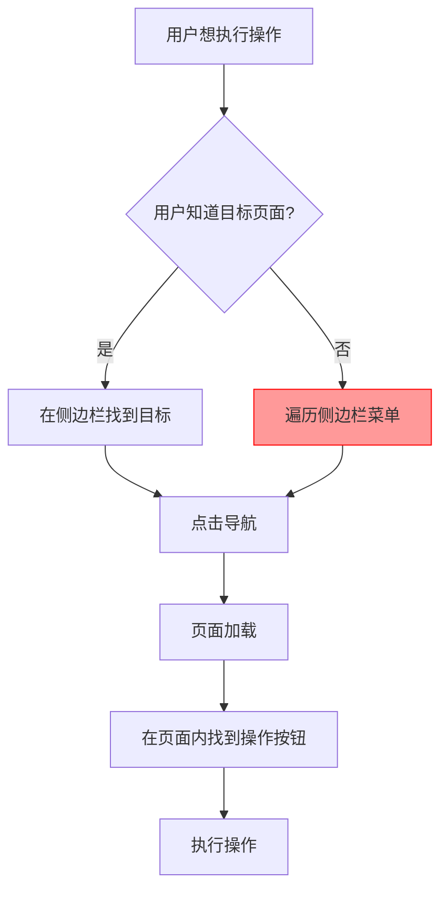
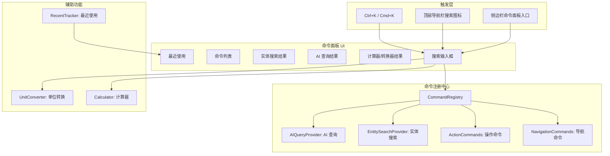
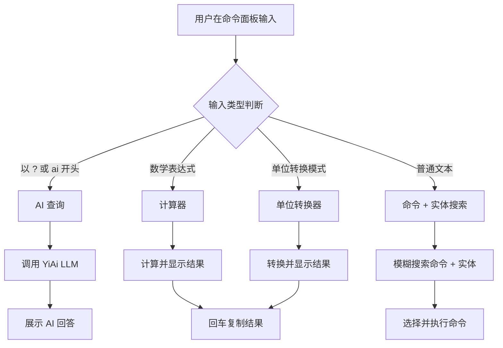

# YV-09-68: 全局搜索命令面板 — Ctrl+K 全局操作、模糊搜索、快速导航、计算器、AI 查询

> 需求编号：YV-09-68 · 优先级：P2 · 人天：0.3d · 状态：需求已编写
> 依赖：YV-09-36（全局搜索增强）、YV-09-43（全局快捷键框架）

## 背景

### 问题陈述

YiVad 作为管理后台，功能模块持续增长（项目管理、Bug 追踪、RAG 管理、AI 聊天、知识库、RSS 聚合等），用户在不同模块间导航和操作的成本越来越高：

1. **导航效率低**：从一个模块切换到另一个模块需要经过侧边栏导航，多层菜单点击
2. **操作入口分散**：创建、搜索、导出等操作分散在不同页面，缺乏统一入口
3. **无快速搜索**：虽然有全局搜索页面（YV-09-36），但需要先导航到搜索页面才能使用
4. **无快捷操作**：无法在键盘上快速执行计算、单位转换等辅助操作
5. **AI 查询割裂**：想要问 AI 问题需要先导航到 AI 聊天页面

**核心矛盾**：YiVad 功能丰富但操作入口分散，用户需要频繁切换页面，效率低下。类似 VS Code 的 Ctrl+Shift+P 命令面板可以显著提升操作效率。

### 影响范围

| # | 影响 | 严重程度 | 典型场景 |
|---|------|----------|----------|
| 1 | 模块间导航效率低 | 高 | 从 Bug 页面切换到知识库需要 3 次点击 |
| 2 | 操作入口分散 | 高 | 创建 Issue 需要先导航到 Issue 页面 |
| 3 | 全局搜索不可快速访问 | 中 | 需要先打开搜索页面才能搜索 |
| 4 | 无辅助工具（计算器/转换器） | 低 | 用户需要切换到外部工具 |
| 5 | AI 查询需要页面跳转 | 中 | 快速提问需要离开当前页面 |

### 挑战

| 挑战 | 说明 |
|------|------|
| 命令注册机制 | 需要一种可扩展的命令注册方式，各模块独立注册 |
| 搜索性能 | 500+ 命令的模糊搜索 < 50ms |
| 上下文感知 | 不同页面可用的命令不同 |
| 最近使用 | 最近使用的命令需要跨页面持久化 |
| 计算器解析 | 自然语言查询（如"100 USD to CNY"）的解析 |

---

## 一、现状分析

### 1.1 当前导航与操作入口

```
YiVad 导航与操作现状:
├── 侧边栏导航
│   ├── 仪表盘
│   ├── 项目管理
│   ├── Bug 追踪
│   ├── AI 聊天
│   ├── 知识库
│   ├── RAG 管理
│   ├── RSS 聚合
│   └── 系统设置
├── 页面内操作
│   ├── 创建按钮（各页面独立）
│   ├── 搜索框（各页面独立）
│   ├── 导出按钮（各页面独立）
│   └── 批量操作（各页面独立）
├── 全局搜索页面
│   └── 需要先导航到 /search
└── 全局快捷键
    └── 无（YV-09-43 尚未实现）

缺失:
├── 命令面板（Ctrl+K）              # ❌ 不存在
├── 统一命令注册中心                # ❌ 不存在
├── 跨模块快速导航                  # ❌ 不存在
├── 内嵌计算器/转换器               # ❌ 不存在
├── AI 快速查询（从面板）            # ❌ 不存在
└── 最近使用命令                    # ❌ 不存在
```

### 1.2 导航路径成本分析

| 操作 | 当前步骤 | 点击次数 | 页面跳转 | 耗时估算 |
|------|----------|----------|----------|----------|
| 从仪表盘到 Bug 列表 | 侧边栏 → Bug 追踪 | 1 | 是 | 1-2s |
| 从 Bug 详情到知识库 | 侧边栏 → 知识库 | 1 | 是 | 1-2s |
| 创建新 Issue | 侧边栏 → Issue → 新建 | 2 | 是 | 2-3s |
| 全局搜索 | 侧边栏 → 搜索 → 输入 | 2 | 是 | 2-3s |
| 切换到 AI 聊天 | 侧边栏 → AI 聊天 | 1 | 是 | 1-2s |
| 导出数据 | 页面内 → 导出按钮 | 0-1 | 否 | 0.5s |

### 1.3 改造前操作流程



### 1.4 根因矩阵

| 症状 | 根因 | 触发条件 | 频率 |
|------|------|----------|------|
| 导航效率低 | 无统一命令面板 | 每次跨模块操作 | 高 |
| 操作入口难找 | 入口分散在各页面 | 新用户/低频操作 | 中 |
| 全局搜索不可快速访问 | 无快捷键触发 | 需要搜索时 | 中 |
| 无辅助工具 | 未集成计算器/转换器 | 需要计算/转换时 | 低 |
| AI 查询割裂 | 无面板内 AI 查询 | 想快速问 AI 时 | 中 |

---

## 二、设计决策

### 决策 1：命令面板触发键 — Ctrl+K vs Ctrl+Shift+P vs Cmd+K

| 选项 | 浏览器冲突 | 页面冲突 | 用户习惯 |
|------|-----------|----------|----------|
| Ctrl+K | Chrome 聚焦地址栏 | 低 | VS Code/Notion 风格 |
| Ctrl+Shift+P | Chrome DevTools | 高 | VS Code 风格 |
| Cmd+K（macOS）/ Ctrl+K（Windows） | 低 | 低 | 跨平台一致 |

**选择：Ctrl+K（Windows/Linux）/ Cmd+K（macOS）。** Ctrl+K 是许多现代应用（Notion、Linear、GitHub）的命令面板快捷键，用户已有肌肉记忆。Chrome 中 Ctrl+K 聚焦地址栏，但可通过 `preventDefault` 拦截。

### 决策 2：命令注册方式 — 集中式 vs 路由式 vs 插件式

| 选项 | 扩展性 | 模块解耦 | 实现复杂度 |
|------|--------|----------|-----------|
| 集中式（所有命令在一个文件） | 低 | 低 | 低 |
| 路由式（基于路由配置生成命令） | 中 | 中 | 中 |
| 插件式（各模块注册 CommandProvider） | 高 | 高 | 中 |

**选择：插件式。** 各页面模块通过 `useCommandPalette()` composable 注册自己的命令，命令面板在打开时从注册中心动态获取命令列表。

### 决策 3：搜索范围 — 仅命令 vs 命令 + 实体搜索 vs 命令 + 实体 + AI

| 选项 | 功能覆盖 | 复杂度 | 用户价值 |
|------|----------|--------|----------|
| 仅命令（导航 + 操作） | 中 | 低 | 中 |
| 命令 + 实体搜索（搜索 Issue/Bug/文档） | 高 | 中 | 高 |
| 命令 + 实体 + AI 查询 | 最高 | 高 | 最高 |

**选择：命令 + 实体 + AI 查询。** 用户输入普通文本时搜索命令和实体（Issue/Bug/文档），以 `?` 或 `ai` 开头时触发 AI 查询。一个面板覆盖所有快速操作场景。

### 决策 4：计算器/转换器实现 — 前端解析 vs 后端计算 vs 两者

| 选项 | 精度 | 离线可用 | 实现复杂度 |
|------|------|----------|-----------|
| 前端解析（math.js / 自实现） | 高 | 是 | 中 |
| 后端计算（通过 YiAi API） | 高 | 否 | 低 |
| 两者（前端简单计算 + 后端复杂转换） | 高 | 部分 | 中 |

**选择：前端解析。** 使用 math.js 或自实现轻量表达式解析器，支持四则运算、单位转换、汇率转换（汇率数据从后端定时拉取缓存）。无需后端调用，保证离线可用和即时响应。

### 设计决策记录

| 决策 | 选项 A | 选项 B | 选项 C | 选择 | 理由 |
|------|--------|--------|--------|------|------|
| 触发键 | Ctrl+K | Ctrl+Shift+P | Cmd+K | **Ctrl+K/Cmd+K** | 用户习惯 |
| 注册方式 | 集中式 | 路由式 | 插件式 | **插件式** | 模块解耦 |
| 搜索范围 | 仅命令 | 命令+实体 | 命令+实体+AI | **命令+实体+AI** | 全覆盖 |
| 计算器 | 前端 | 后端 | 两者 | **前端** | 即时响应 |

---

## 三、目标架构

### 3.1 命令面板架构



### 3.2 查询路由流程



### 3.3 性能指标

| 指标 | 目标值 | 说明 |
|------|--------|------|
| 命令面板打开 | < 50ms | overlay 渲染 + 命令列表加载 |
| 命令搜索（500+ 命令） | < 20ms | 模糊搜索 + 评分排序 |
| 实体搜索 | < 100ms | 调用后端 API 搜索 |
| 计算器响应 | < 1ms | 表达式解析 + 计算 |
| AI 查询响应 | 流式（SSE） | 实时流式展示 |

---

## 四、具体改动

### 4.1 命令注册接口

```typescript
// src/composables/useCommandPalette.ts (新增)

export interface Command {
  id: string;
  label: string;
  description: string;
  category: 'navigation' | 'action' | 'search' | 'ai';
  keywords: string[];
  shortcut?: string;
  icon?: string;
  handler: () => void | Promise<void>;
}

export interface CommandProvider {
  getCommands(): Command[];
}

// 全局命令注册中心
class CommandRegistry {
  private providers: CommandProvider[] = [];
  private recentCommands: string[] = [];

  register(provider: CommandProvider): void {
    this.providers.push(provider);
  }

  getAllCommands(): Command[] {
    return this.providers.flatMap(p => p.getCommands());
  }

  search(query: string): Command[] {
    const commands = this.getAllCommands();
    return fuzzySearch(commands, query);
  }
}

// Composable
export function useCommandPalette() {
  const registry = inject<CommandRegistry>('commandRegistry')!;

  function registerCommands(commands: Command[]): void {
    registry.register({ getCommands: () => commands });
  }

  return { registerCommands };
}
```

### 4.2 命令面板组件

```typescript
// src/components/command-palette/command-palette.vue (新增)

// <template>
//   <Teleport to="body">
//     <Transition name="fade">
//       <div v-if="isOpen" class="command-palette-overlay" @click.self="close">
//         <div class="command-palette">
//           <div class="search-input-wrapper">
//             <SearchIcon class="search-icon" />
//             <input ref="inputRef" v-model="query" @keydown="onKeydown"
//               placeholder="搜索命令、页面、实体... 输入 ? 开始 AI 查询" />
//             <kbd class="shortcut-hint">Esc</kbd>
//           </div>
//           <div class="results" v-if="query">
//             <div v-if="isMathExpression" class="result-section">
//               <div class="section-title">计算器</div>
//               <div class="calculator-result">{{ calculateResult }}</div>
//             </div>
//             <div v-if="isAIQuery" class="result-section">
//               <div class="section-title">AI 查询</div>
//               <div class="ai-result" v-html="aiResponse"></div>
//             </div>
//             <div class="result-section">
//               <div class="section-title">命令</div>
//               <div v-for="cmd in filteredCommands" @click="execute(cmd)"
//                 :class="{ selected: cmd === selectedCommand }">
//                 <span class="cmd-icon">{{ cmd.icon }}</span>
//                 <span class="cmd-label">{{ cmd.label }}</span>
//                 <span class="cmd-desc">{{ cmd.description }}</span>
//                 <kbd v-if="cmd.shortcut">{{ cmd.shortcut }}</kbd>
//               </div>
//             </div>
//             <div class="result-section" v-if="entityResults.length">
//               <div class="section-title">搜索结果</div>
//               <div v-for="entity in entityResults" @click="navigate(entity)">
//                 <span>{{ entity.type }}</span>
//                 <span>{{ entity.title }}</span>
//               </div>
//             </div>
//           </div>
//           <div class="recent" v-else-if="recentCommands.length">
//             <div class="section-title">最近使用</div>
//             <div v-for="cmd in recentCommands" @click="execute(cmd)">
//               {{ cmd.label }}
//             </div>
//           </div>
//         </div>
//       </div>
//     </Transition>
//   </Teleport>
// </template>
```

### 4.3 计算器/转换器

```typescript
// src/composables/useCalculator.ts (新增)

class CalculatorService {
  private patterns = {
    math: /^[\d\s+\-*/().%^e]+$/,
    unitConvert: /^(\d+\.?\d*)\s*([a-zA-Z]+)\s+(to|in)\s+([a-zA-Z]+)$/i,
    currency: /^(\d+\.?\d*)\s*([A-Z]{3})\s+(to|in)\s+([A-Z]{3})$/i,
  };

  isMathExpression(input: string): boolean {
    return this.patterns.math.test(input.trim());
  }

  calculate(expression: string): number | string {
    try {
      // 安全计算（使用 Function 而非 eval，限制输入范围）
      const sanitized = expression.replace(/[^0-9+\-*/().%\s^e]/g, '');
      const result = new Function(`return (${sanitized})`)();
      return Number.isFinite(result) ? result : 'Error';
    } catch {
      return 'Error';
    }
  }

  isUnitConversion(input: string): boolean {
    return this.patterns.unitConvert.test(input.trim());
  }

  convert(value: number, from: string, to: string): number | string {
    const conversions: Record<string, Record<string, number>> = {
      km: { m: 1000, mi: 0.621371 },
      m: { km: 0.001, cm: 100, ft: 3.28084 },
      kg: { g: 1000, lb: 2.20462 },
      lb: { kg: 0.453592 },
      // ... 更多单位
    };
    const rate = conversions[from]?.[to];
    return rate !== undefined ? value * rate : '不支持的单位转换';
  }
}
```

### 4.4 文件变更清单

| 文件 | 操作 | 说明 |
|------|------|------|
| `src/composables/useCommandPalette.ts` | 新增 | 命令面板 Composable |
| `src/composables/useCalculator.ts` | 新增 | 计算器/转换器 |
| `src/components/command-palette/command-palette.vue` | 新增 | 命令面板 UI 组件 |
| `src/components/command-palette/command-item.vue` | 新增 | 命令项组件 |
| `src/components/command-palette/entity-result.vue` | 新增 | 实体搜索结果项 |
| `src/stores/command-palette.ts` | 新增 | 命令面板状态管理 |
| `src/App.vue` | 修改 | 挂载命令面板 + 注册全局快捷键 |
| `src/layouts/MainLayout.vue` | 修改 | 添加命令面板触发入口 |
| `src/views/project/ProjectDetail.vue` | 修改 | 注册项目相关命令 |
| `src/views/bug/BugDetail.vue` | 修改 | 注册 Bug 相关命令 |
| `src/views/issue/IssueList.vue` | 修改 | 注册 Issue 相关命令 |
| `tests/unit/command-palette.test.ts` | 新增 | 命令面板测试 |
| `tests/unit/calculator.test.ts` | 新增 | 计算器测试 |

---

## 五、实施步骤

| 步骤 | 操作 | 路径 | 验证 | 人天 |
|------|------|------|------|------|
| 1 | 实现 CommandRegistry 和 Composable | `src/composables/useCommandPalette.ts` | 注册/搜索正常 | 0.05 |
| 2 | 实现命令面板 UI 组件 | `src/components/command-palette/` | 打开/关闭/搜索/键盘导航 | 0.08 |
| 3 | 实现计算器/转换器 | `src/composables/useCalculator.ts` | 数学表达式/单位转换 | 0.03 |
| 4 | 实现实体搜索集成 | `src/components/command-palette/` | 搜索 Issue/Bug/文档 | 0.05 |
| 5 | 实现 AI 查询集成 | `src/components/command-palette/` | ? 前缀触发 AI 查询 | 0.03 |
| 6 | 各页面注册命令 | 各 View 页面 | 导航/操作命令可用 | 0.03 |
| 7 | 注册全局快捷键 Ctrl+K | `src/App.vue` | 任意页面可触发 | 0.03 |

**总人天：0.3d**

---

## 六、测试规格

### 场景 1：打开命令面板

**GIVEN** 用户在任意页面
**WHEN** 用户按下 Ctrl+K（或 Cmd+K）
**THEN** 应显示命令面板 overlay
**AND** 搜索输入框应自动聚焦
**AND** 应展示最近使用的命令

### 场景 2：搜索并执行命令

**GIVEN** 命令面板已打开
**WHEN** 用户输入 "创建 Issue"
**THEN** 应过滤出包含"创建 Issue"的命令
**AND** 用户按 Enter 后应导航到创建 Issue 页面

### 场景 3：搜索实体

**GIVEN** 命令面板已打开
**WHEN** 用户输入 "BUG-001"
**THEN** 应展示匹配的 Bug 实体结果
**AND** 点击后应导航到 Bug 详情页面

### 场景 4：计算器

**GIVEN** 命令面板已打开
**WHEN** 用户输入 "100 * 1.5 + 20"
**THEN** 应识别为数学表达式
**AND** 应展示计算结果 "170"
**AND** 按 Enter 应复制结果到剪贴板

### 场景 5：单位转换

**GIVEN** 命令面板已打开
**WHEN** 用户输入 "100 km to mi"
**THEN** 应识别为单位转换
**AND** 应展示转换结果 "62.1371 mi"

### 场景 6：AI 查询

**GIVEN** 命令面板已打开
**WHEN** 用户输入 "? 如何优化 MongoDB 查询性能"
**THEN** 应识别为 AI 查询
**AND** 应通过 SSE 流式展示 AI 回答
**AND** 回答完成后用户可复制到剪贴板

---

## 七、风险与缓解

| 风险 | 概率 | 影响 | 缓解措施 |
|------|------|------|----------|
| Ctrl+K 与浏览器快捷键冲突 | 高 | 中 | preventDefault 拦截，同时提供替代触发方式（搜索图标） |
| 命令注册过多导致搜索性能下降 | 低 | 低 | 使用 Web Worker 执行搜索，避免阻塞主线程 |
| 实体搜索网络延迟 | 中 | 中 | 本地缓存最近搜索结果，debounce 搜索请求 300ms |
| AI 查询响应慢 | 中 | 低 | 显示加载状态，超时 30s 后提示用户 |
| 计算器安全性（代码注入） | 低 | 高 | 严格限制输入白名单，不使用 eval |

---

## 八、回滚策略

| 场景 | 回滚操作 | 影响 |
|------|----------|------|
| 命令面板性能问题 | 禁用 Ctrl+K 快捷键，仅保留搜索图标入口 | 失去键盘快速访问 |
| 计算器解析错误 | 禁用计算器功能，仅保留命令和搜索 | 失去辅助计算功能 |
| 实体搜索压力过大 | 限制搜索结果数量，降级为仅命令搜索 | 失去实体搜索 |
| AI 查询不稳定 | 移除 AI 查询入口，引导用户使用 AI 聊天页面 | 失去面板内 AI 查询 |

---

## 九、设计决策记录

### D-01：命令面板快捷键

- **问题**：默认命令面板快捷键
- **选项**：Ctrl+K、Ctrl+Shift+P、Ctrl+P
- **选择**：Ctrl+K（Windows/Linux）/ Cmd+K（macOS）
- **理由**：Notion、Linear、GitHub 等主流应用使用 Ctrl+K 作为命令面板快捷键，用户已有肌肉记忆

### D-02：AI 查询前缀

- **问题**：如何在命令面板中区分普通搜索和 AI 查询
- **选项**：`?` 前缀、`ai` 前缀、`/ai` 前缀、独立 Tab
- **选择**：`?` 前缀
- **理由**：`?` 是单字符，输入最快；与"提问"的语义关联强；不与普通搜索冲突

### D-03：计算器安全策略

- **问题**：如何安全地执行用户输入的数学表达式
- **选项**：eval、Function 构造器、math.js 库、自实现解析器
- **选择**：自实现安全解析器（仅支持四则运算 + 基本函数）
- **理由**：eval 有代码注入风险；math.js 引入额外依赖；Function 构造器相对安全但仍有风险；自实现解析器完全可控

### D-04：实体搜索范围

- **问题**：命令面板中的实体搜索覆盖哪些实体类型
- **选项**：仅 Bug、Bug + Issue、Bug + Issue + 文档 + 知识文件
- **选择**：Bug + Issue + 文档 + 知识文件（全部可搜索实体）
- **理由**：命令面板作为统一搜索入口，应覆盖所有实体类型，避免用户需要切换到独立搜索页面

---

## 十、可观测性

### 指标

| 指标 | 类型 | 说明 |
|------|------|------|
| `yivad.cmd_palette.open_count` | Counter | 命令面板打开次数 |
| `yivad.cmd_palette.search_count` | Counter | 搜索次数 |
| `yivad.cmd_palette.execute_count` | Counter | 命令执行次数 |
| `yivad.cmd_palette.calc_count` | Counter | 计算器使用次数 |
| `yivad.cmd_palette.ai_query_count` | Counter | AI 查询次数 |
| `yivad.cmd_palette.no_result_count` | Counter | 搜索无结果次数 |

### 告警

| 告警 | 条件 | 级别 |
|------|------|------|
| 搜索无结果比例过高 | 无结果/总搜索 > 40% | WARNING |
| AI 查询失败率过高 | 失败/总查询 > 20% | WARNING |

---

## 十一、代码审查检查清单

- [ ] 命令面板通过 Ctrl+K/Cmd+K 触发
- [ ] 命令注册支持插件式（CommandProvider 接口）
- [ ] 模糊搜索支持命令 label、description、keywords 匹配
- [ ] 最近使用命令持久化到 localStorage
- [ ] 实体搜索支持 Bug、Issue、文档、知识文件
- [ ] AI 查询通过 `?` 前缀触发，SSE 流式展示
- [ ] 计算器支持四则运算、幂运算、括号
- [ ] 单位转换支持常见单位（长度、重量、温度、货币）
- [ ] 键盘导航：↑↓ 选择、Enter 执行、Escape 关闭
- [ ] 计算器输入白名单限制，无代码注入风险
- [ ] 搜索 debounce 300ms，避免频繁请求
- [ ] 单元测试覆盖搜索、计算器、命令注册

---

## 回归问题预测

| # | 预测问题 | 原因 | 验证方法 |
|---|---------|------|---------|
| 1 | Ctrl+K 在 Chrome 中聚焦地址栏，preventDefault 未生效，命令面板打开后地址栏同时聚焦 | Chrome 的地址栏聚焦是浏览器级行为，可能在 JS 事件处理之前就已触发 | 在 Chrome 中按 Ctrl+K，验证地址栏不聚焦，命令面板正常打开 |
| 2 | 命令面板中 AI 查询的 SSE 连接在面板关闭后未断开，资源泄漏 | 面板关闭时未调用 EventSource.close()，SSE 连接持续占用资源 | 打开命令面板 → 发起 AI 查询 → 立即关闭面板，验证 SSE 连接已断开 |
| 3 | 计算器对包含中文的输入（如"100 公里 to 英里"）识别失败，用户期望自然语言计算 | 计算器仅支持英文单位缩写，中文单位未注册 | 输入"100 公里 to 英里"，验证计算器正确识别并转换 |
| 4 | 实体搜索在用户快速输入时触发多个请求，未 debounce 的请求结果覆盖了最新结果 | 多个并发请求的响应顺序不确定，后发起的请求可能先返回 | 快速输入"BUG-001" → 删除 → 输入"BUG-002"，验证最终展示 BUG-003 的结果 |
| 5 | 命令面板在 iframe 嵌套页面（如嵌入的文档预览）中，Ctrl+K 被 iframe 拦截 | iframe 的键盘事件冒泡到父页面时可能被阻止 | 在包含 iframe 的页面中打开命令面板，验证快捷键正常工作 |
| 6 | 计算器对超出 JavaScript 安全整数范围的大数计算精度丢失 | JavaScript Number 类型的安全整数范围是 ±2^53，超出后精度丢失 | 输入"9999999999999999 + 1"，验证结果正确或提示"超出精度范围" |

---

## 性能分析

### 命令面板关键操作耗时

| 操作 | 耗时 | 说明 |
|------|------|------|
| 命令面板打开 | < 50ms | overlay 创建 + Vue 组件挂载 |
| 命令注册（初始化） | < 10ms | 所有 Provider 注册 |
| 模糊搜索（500 命令） | < 20ms | 子序列匹配 + 评分排序 |
| 实体搜索（后端 API） | < 100ms | 网络请求 + 响应解析 |
| 计算器（简单表达式） | < 1ms | 字符串解析 + 计算 |
| 单位转换 | < 1ms | 查表 + 乘法 |
| AI 查询（首字） | < 500ms | SSE 首次响应 |
| 最近使用加载 | < 5ms | localStorage 读取 |
| 命令面板关闭 | < 10ms | overlay 移除 + 状态清理 |

### 数据量预估

| 模块 | 数据项 | 大小 |
|------|--------|------|
| 命令注册表 | 50+ 命令 | ~5KB |
| 搜索索引 | 命令 label + description + keywords | ~10KB |
| 最近使用列表 | 10 条命令引用 | ~500B |
| 计算器配置 | 单位转换表 | ~5KB |

### 对页面性能的影响

| 场景 | 页面影响 | 说明 |
|------|----------|------|
| 命令面板打开 | < 50ms 主线程 | overlay 渲染 |
| 搜索输入 | < 5ms 主线程 | 每次按键触发搜索 |
| 实体搜索 | 异步 | 网络请求不阻塞主线程 |
| AI 查询 | 异步 | SSE 流式更新不阻塞主线程 |

---

## 相关文档

- [全局搜索增强](../36-需求-全局搜索增强.md) — 实体搜索的底层实现
- [全局快捷键框架](../43-需求-全局快捷键框架.md) — 快捷键注册与冲突检测
- [AI 聊天页优化](../09-需求-AI聊天页优化.md) — AI 查询的 UI 组件复用

*PRD 来源: `projects/yivad/requirements/2026-09/68-需求-全局搜索命令面板.md`*

