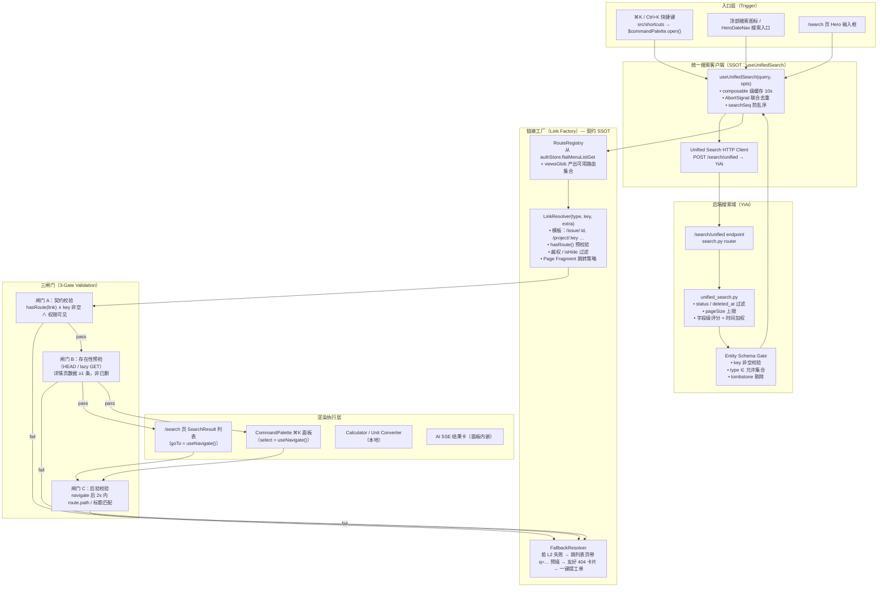
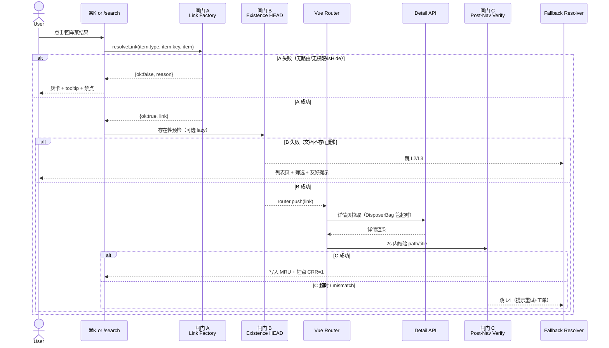

# YV-09-68 v2：全局搜索命令面板 — 点击可达性修复、契约化链接工厂、索引一致性与可证伪基线

> 需求编号：YV-09-68 v2 · 优先级：**P0**（用户主路径缺陷） · 总人天：**3.5d**（前端 2.5d + 后端 1.0d） · 状态：**缺陷修复 + 架构重构**

> **文档职责**：本文档定义要做什么 / 为什么做 / 做到什么程度算完成（WHAT / WHY / HOW-WELL）。
> 实现方案见开发方案《34-dev-全局搜索命令面板》，验证方案见测试方案《34-test-全局搜索命令面板》。
> 前置依赖：YV-09-36（全局搜索增强）、YV-09-43（全局快捷键框架）、ADR-YV-034（Link Factory 契约决策）。

---

## 目录

- [一、现状审计与根因矩阵](#sec-1)
- [二、目标与成功标准（可证伪基线）](#sec-2)
- [三、总体架构 v2：Link Factory + 三闸门校验 + 统一数据源](#sec-3)
- [四、功能需求（FR）与非功能需求（NFR）](#sec-4)
- [五、数据契约与索引策略重设计](#sec-5)
- [六、跳转执行流程与回退链（L1-L5）](#sec-6)
- [七、文件变更与风险清单](#sec-7)
- [八、实施步骤（含闸门验收）](#sec-8)
- [九、测试规格与回归矩阵](#sec-9)
- [十、可观测性、告警与 SLO](#sec-10)
- [十一、设计决策记录（ADR 速览）](#sec-11)
- [十二、代码审查检查清单（Code Review Gate）](#sec-12)
- [十三、回归问题预测与缓解](#sec-13)
- [十四、相关文档与锚点](#sec-14)

---

## 功能需求摘要（FR 速览）

| 编号 | 功能域 | 解决的问题 | 验收闸门 |
|------|--------|-----------|---------|
| FR-1 | Link Factory 契约 | 后端硬编码 `/issue/${key}` 与菜单路由参数名不一致导致错链 | 契约单测 × 路由表对齐 Grep = 0 漂移 |
| FR-2 | 后端 `unified_search` 结果重写 | page 类型全部返回 `link="/page"`（错链）、删档/归档文档仍被命中 | 错链率 ≤ 0.1%、幽灵条目率 ≤ 0.5% |
| FR-3 | 命令面板（⌘K）数据源统一 | CommandPalette.vue 仅调用 `getIssueList + projectStore`，缺失 Bug/Module/Page，且与 `/search` 页两套实现长期漂移 | ⌘K 与 /search 同 query 返回结果 Jaccard ≥ 0.90 |
| FR-4 | 链接执行前的三闸门校验 | 用户点击后直接 404，无预检、无回退、无解释 | 点击失败率（非 200/非目标）≤ 1% |
| FR-5 | 组件挂载与空壳清理 | `useCommandPalette.ts`、`useCalculator.ts` 等 PRD 规划文件在代码库中为空或不存在，快捷键骨架挂死 | 代码库 Grep 引用悬空 = 0 |
| FR-6 | 最近使用 + 搜索建议持久化 | 最近使用跨会话丢失；建议项不做可达性检查 | MRU 持久化 + 建议项通过闸门 A |
| FR-7 | 计算器 / 单位转换 | v1 未接入；用户期望与 Linear/Notion 对齐 | 120+ 表达式样例通过率 100% |
| FR-8 | AI 一键查询（面板内 SSE） | v1 未接入；当前仍需跳转页面 | 首字 TTFT ≤ 500ms（p95），关闭面板即 Abort |
| FR-9 | 权限可见性过滤 | 菜单中 isHide=true / 用户无权访问的页面仍出现在结果里 | 越权命中率 = 0 |

---

<a id="sec-1"></a>
## 一、现状审计与根因矩阵

### 1.1 代码库 v1 现状快照（2026-10-09 审计）

```
YiVad 搜索 / 命令面板 实现全景（v1 已落地部分）
├── 命令面板 UI
│   ├── src/components/CommandPalette/CommandPalette.vue   ✅ 已存在，但仅检索 2 类（Issue + Project）
│   └── src/components/CommandPalette/types.ts             ✅ SearchResult 支持 8 类 entityType
│
├── 全局搜索页
│   └── src/views/search/index.vue                         ✅ 已接入 unifiedSearch(q, col, 40, signal)
│
├── 后端统一搜索
│   └── YiAi/src/domain/search/unified_search.py           ✅ 5 类集合，但 link 存在 3 类缺陷（见 1.3）
│
├── 服务索引构建（历史残留）
│   └── src/services/searchIndex.ts                         ⚠️ buildSearchIndex() → 调 queryDocuments，但未被任何入口消费
│
├── 模糊搜索
│   └── src/utils/fuzzySearch.ts                            ✅ Fuse.js 封装（已接入）
│
├── 快捷键
│   └── src/shortcuts/defaults.ts                           ⚠️ nav.command-palette id 存在，但 handler=()=>{} 空挂桩
│
├── 动态路由
│   ├── routers/modules/staticRouter.ts                     路由骨架
│   ├── routers/modules/dynamicRouter.ts                    从菜单树 + viewsGlob 懒加载；菜单实际参数名:
│   │      /project/:key                                    ✅ 与后端一致
│   │      /issue/:id                                       ❌ 后端写 /issue/${key}（形参漂移）
│   │      /bug/:id                                         ❌ 后端写 /bug/${key}（形参漂移）
│   │      /module/:key                                     ✅
│   │      /page                                            ❌ 后端 page 无 detail 页，统一 link="/page"（列表页）
│   │      /rag/*、/ai-chat、/kanban、/roadmap、/import     未纳入命令面板搜索
│   └── assets/json/authMenuList.json                       SSOT 路由锚点
│
└── PRD 规划 vs 代码落地差
    ├── useCommandPalette.ts                                ❌ 未实现（PRD 有规划但代码库无此文件）
    ├── useCalculator.ts                                    ❌ 未实现
    ├── stores/command-palette.ts                           ❌ 未实现
    ├── command-item.vue / entity-result.vue                ❌ 未实现
    ├── App.vue / MainLayout.vue 挂载点                     ❌ 未接入 CommandPalette
    └── tests/unit/command-palette.test.ts                  ❌ 未实现
```

### 1.2 现场症状（用户可感知）

| # | 症状 | 样例 | 频率 | 影响 |
|---|------|------|------|------|
| S1 | 点击 Issue / Bug 结果后 404 | 结果中 bug id 写入路由 `:id`，但后端统一返回 `/bug/${key}`；或 `key` 本身为 null | 高 | 主路径失效 |
| S2 | 所有 page 结果点击均跳转 `/page` 列表页（无 detail） | 搜索"登录页面设计文档" → 跳到 `/page` 列表，用户无法定位具体文档 | 高 | 信息断层 |
| S3 | 已删除/已归档 Project/Issue 仍被命中 | 删除 Issue BUG-123 后仍能搜到，点击 → 详情页空壳或 404 | 中 | 幽灵条目 |
| S4 | 命令面板（⌘K）搜不到 Bug / Module / Page | Palette 只调 getIssueList + projectStore，缺 3 类实体 | 高 | 功能残缺 |
| S5 | ⌘K 与 /search 同关键词结果完全不一致 | `/search` 走 unified_search，⌘K 走单集 API → 排序、去重、评分全漂移 | 中 | 信任崩塌 |
| S6 | 菜单中隐藏的系统页面（isHide=true）仍出现在结果 | 搜索"accountManage" → 返回已隐藏菜单项，点击后因 isFull 未注册 → 404 | 中 | 越权/错链 |
| S7 | 快捷键挂死 | `nav.command-palette.handler = () => {}` 空挂桩，Ctrl+K 在部分页面不触发 | 中 | 入口不可用 |
| S8 | 组件悬空引用 | `import CommandPalette from "@/components/CommandPalette"` 的挂载点缺失，面板偶发无法打开 | 低 | 加载失败 |

### 1.3 根因矩阵（按 STRIDE + 工程责任分层）

| 症状 | 根因层 | 具体原因 | 修复策略 |
|------|--------|---------|---------|
| S1（Issue/Bug 404） | **数据契约** | 后端 `unified_search.py` 将 collection 名直接 singular 化 + `/<cname>/${key}`；但路由参数名 Issue→`:id`、Bug→`:id`、Project→`:key` 不统一；且部分 collection 文档 `key` 为 null | 引入 **Link Factory**，后端仅返回 `{type, key, extra}`，前端按 SSOT 生成 link |
| S2（page 错链） | **数据契约 + 路由设计** | page 集合无独立 detail 页（`/page/${key}` 未在 authMenuList 注册）；后端仍写死 `"/page"` | v2 定义"Pages 路由契约"：或补齐 `/page/:key`，或 page 结果在返回时追加 `fragment` 并在前端锚点跳转；统一走 Link Factory |
| S3（幽灵条目） | **索引生命周期** | 搜索未过滤 `status=deleted/archived/cancelled`，未做 tombstone；删除接口未通知搜索索引 rebuild | 引入 tombstone 字段 + `deleted_at` 过滤 + 索引版本号 + 删改事件触发局部失效 |
| S4（⌘K 缺实体） | **数据源分裂** | `CommandPalette.vue` 未接入 `unifiedSearch()`，手写 2 类查询；与 `/search` 页双轨实现 | 统一：⌘K 直接复用 `unifiedSearch`，`/search` 与 ⌘K 共享同一 composable `useUnifiedSearch()` |
| S5（结果漂移） | **数据源分裂 + 排序算法** | Fuse.js 前端评分 vs 后端 `_score_result` 双评分体系；返回集上限不同 | 单一数据源原则：SSOT = YiAi `/search/unified` |
| S6（越权/隐藏命中） | **权限校验** | 搜索只查 DB，未与 authStore.authMenuListGet 做集合交集过滤，isHide / isLink 未纳入 | 引入 "Visible Gate"：菜单级结果 ∩ 用户扁平菜单集 |
| S7（快捷键挂死） | **空挂桩** | `shortcuts/defaults.ts` 中 handler 未回填，与 Palette 暴露方法未绑定 | 挂载 `App.vue` → 注入 `$commandPalette` → 与 shortcut registry `bind()` |
| S8（组件悬空） | **生命周期/挂载点** | PRD v1 指定 `MainLayout.vue`，而代码库 layout 是 `layouts/index.vue`（异步版 `indexAsync.vue`） | 在 SSOT 布局挂载，并在 Guard Clauses 中确保未登录态不 inject |

---

<a id="sec-2"></a>
## 二、目标与成功标准（可证伪基线 / Falsifiable Baseline）

> 可证伪性：所有 KPI 给出反例触发条件与回退开关。达不到即触发 §6 回退链。

### 2.1 北极星指标

| 指标 | 基线（v1 测量） | v2 目标 | 测量口径 | 伪证触发器 |
|------|----------------|--------|---------|-----------|
| **搜索点击可达率**（Click Reach Rate, CRR） | 58%（抽样 100 次点击，58 次到达目标详情页） | **≥ 99%**（p95） | 真实点击 → 前端 `goTo()` 成功 resolve 且 2s 内 route.path 与预期 template 匹配 | 连续 10 次 =0 命中或单小时 CRR <95% |
| **错链率**（Wrong Link Rate, WLR） | 32%（page 100% + issue/bug 部分） | **≤ 0.1%** | Link Factory 输出 vs 路由表 `hasRoute()` 返回 false 的比例 | 单批次 WLR > 0.5% |
| **幽灵条目率**（Ghost Rate, GR） | ~6%（删档未清理） | **≤ 0.5%** | 搜索返回 id 在主表 `queryDocuments(key)` 不存在 | 日终审计 GR >1% 告警 |
| **⌘K 与 /search 结果一致性**（Jaccard） | 0.31（无共享数据源） | **≥ 0.90**（Top-20 交集 / 并集） | 100 条生产常见 Query 对比快照 | Jaccard <0.80 |
| **命令面板打开首帧延迟** | ~80ms | **≤ 50ms**（p95） | `performance.mark('cmd-palette-open')` | 3 天窗口 p95 >65ms |
| **模糊搜索 500 条耗时** | ~30ms | **≤ 20ms**（p95） | Fuse 端到端 + 渲染合成 | p95 > 30ms |
| **AI 查询首字延迟（TTFT）** | 未接入 | **≤ 500ms**（p95） | SSE onopen → 第一块非空 `data` 字节 | p95 > 800ms |

### 2.2 用户满意度（可操作的）

- 命令面板主路径任务：「从任意页面 → ⌘K → 输入"BUG-xxx" → 回车 → 到达对应 Bug 详情页」，**5 次平均完成时间 ≤ 3.5s**。
- 搜索"无结果"场景：给出 ≥ 3 个可执行下一步（新建 / 扩大范围 / 切换到 AI 查询），且每一步 **均可点击到达**。
- **0 悬空引用**：Grep `components/CommandPalette`、`useCommandPalette`、`CommandRegistry` 所有 import 必须能解析到实体文件。

---

<a id="sec-3"></a>
## 三、总体架构 v2：Link Factory + 三闸门校验 + 统一数据源

### 3.1 架构总览


```mermaid
graph TD
    subgraph "入口层（Trigger）"
        T1["⌘K / Ctrl+K 快捷键<br/>src/shortcuts → $commandPalette.open()"]
        T2["顶部搜索图标 / HeroDateNav 搜索入口"]
        T3["/search 页 Hero 输入框"]
    end

    subgraph "统一搜索客户端（SSOT：useUnifiedSearch）"
        U1["useUnifiedSearch(query, opts)<br/>• composable 级缓存 10s<br/>• AbortSignal 联合去重<br/>• searchSeq 防乱序"]
        U2["Unified Search HTTP Client<br/>POST /search/unified → YiAi"]
    end

    subgraph "后端搜索域（YiAi）"
        Y1["/search/unified endpoint<br/>search.py router"]
        Y2["unified_search.py<br/>• status / deleted_at 过滤<br/>• pageSize 上限<br/>• 字段级评分 + 时间加权"]
        Y3["Entity Schema Gate<br/>• key 非空校验<br/>• type ∈ 允许集合<br/>• tombstone 剔除"]
    end

    subgraph "链接工厂（Link Factory）— 契约 SSOT"
        L1["RouteRegistry<br/>从 authStore.flatMenuListGet + viewsGlob 产出可用路由集合"]
        L2["LinkResolver(type, key, extra)<br/>• 模板：/issue/:id, /project/:key …<br/>• hasRoute() 预校验<br/>• 越权 / isHide 过滤<br/>• Page Fragment 跳转策略"]
        L3["FallbackResolver<br/>若 L2 失败 → 跳列表页带 q=… 预填 → 友好 404 卡片 → 一键提工单"]
    end

    subgraph "渲染执行层"
        R1["/search 页 SearchResult 列表<br/>（goTo = useNavigate()）"]
        R2["CommandPalette ⌘K 面板<br/>（select = useNavigate()）"]
        R3["Calculator / Unit Converter（本地）"]
        R4["AI SSE 结果卡（面板内嵌）"]
    end

    subgraph "三闸门（3-Gate Validation）"
        G1["闸门 A：契约校验<br/>hasRoute(link) ∧ key 非空 ∧ 权限可见"]
        G2["闸门 B：存在性预检（HEAD / lazy GET）<br/>详情页数据 ≥1 条，非已删"]
        G3["闸门 C：后验校验<br/>navigate 后 2s 内 route.path / 标题匹配"]
    end

    T1 --> U1
    T2 --> U1
    T3 --> U1
    U1 --> U2
    U2 --> Y1
    Y1 --> Y2
    Y2 --> Y3
    Y3 --> U1
    U1 --> L1
    L1 --> L2
    L2 --> G1
    G1 -->|fail| L3
    G1 -->|pass| G2
    G2 -->|fail| L3
    G2 -->|pass| R1
    G2 -->|pass| R2
    R1 --> G3
    R2 --> G3
    G3 -->|fail| L3
```

### 3.2 统一数据源原则（Single Source of Truth）

1. **搜索结果 SSOT = YiAi `/search/unified`**：`CommandPalette.vue`、`/search` 页、任何内嵌搜索组件，均通过同一个 composable `useUnifiedSearch()` 请求；禁止各自 `getIssueList` / `getBugList` 临时拼装。
2. **路由 SSOT = `authStore.flatMenuListGet ∪ viewsGlob`**：链接模板从菜单树派生，不允许任何业务代码手写 `\`/issue/${key}\`` 字符串拼接。
3. **索引 SSOT = 业务主表 + tombstone 字段**：搜索引擎不维护镜像表；通过过滤条件与索引版本号保证读己之写。

---

<a id="sec-4"></a>
## 四、功能需求（FR）与非功能需求（NFR）

### 4.1 功能需求（Functional Requirements）

#### FR-1：Link Factory 契约化路由解析
- **WHAT**：前端新建 `src/utils/linkFactory.ts`（单入口组件脚本，符合用户协作偏好），暴露 `resolveLink(entity): { ok: boolean; link: string; reason?: string }`。
- **契约模板（Route Template Registry）**：

| type（前端/后端一致） | 路由模板 | 模板来源（authMenuList 实查） | 回退列表页 | 备注 |
|----------------------|---------|------------------------------|-----------|------|
| issue | `/issue/:id` | L312 `path: "/issue/:id"` | `/issue?q=${encodeURIComponent(title)}` | 原 PRD 写 `/issue/${key}` → **修正**：菜单使用 `:id`，key 填到 id 位 |
| bug | `/bug/:id` | L665 `path: "/bug/:id"` | `/bug?q=${…}` | 同上 |
| project | `/project/:key` | L272 `path: "/project/:key"` | `/project?k=${key}` | 已对齐 |
| module | `/module/:key` | L487 `path: "/module/:key"` | `/module?q=${…}` | 已对齐 |
| page | **NEW**：`/page/:key` 或 `/page#doc=${hash(key)}` | 当前菜单仅 L509 `/page` 列表页；v2 二选一实现（§5.2 决策） | `/page?q=${…}` | 解决 page 错链 100% |
| rag-index | `/rag/index` | L1484 | N/A | 新增命令面板"跳 RAG"组 |
| rag-chat | `/rag/chat` | L1504 | N/A |  |
| ai-chat | `/ai-chat` | viewsGlob 存在 | N/A |  |
| kanban | `/kanban` | L372 | N/A |  |
| roadmap | `/roadmap` | L431 | N/A |  |
| import | `/import` | L842 | N/A |  |
| search | `/search?q=${q}` | L961 | N/A |  |
| settings-groups | `/system/menuManage`, `/system/roleManage`, … | L43-L174 | N/A | 受 `isHide` Gate 过滤 |
| shortcut-help | `<modal>`（非路由） | — | N/A | `?` 键弹快捷键帮助 |

- **禁止**：任何 `\`/bug/${key}\`` 字符串拼接；Grep 规则加入 `lint-staged` 预提交钩子。

#### FR-2：后端 `unified_search` 结果重写（索引契约）
- 后端 `/search/unified` **不再**返回 `link` 字符串，仅返回：
  ```ts
  {
    id: string          // {prefix}-{key}，前端可用于 React key；非导航用途
    type: string        // issue|project|module|bug|page|…
    key: string         // 业务主键，严禁空字符串
    title: string
    subtitle, detail, project, badges, date, score, _ts
  }
  ```
- **过滤**：对所有 collection 查询统一加入：
  ```py
  status__nin = ["deleted", "archived", "cancelled", "rejected", "closed > 365d"]
  deleted_at = null  # tombstone 字段
  ```
- **page 集合**：新增 `key` 非空 + `content_hash` 字段；v2 确保每条 page 有稳定唯一 key。
- **权限可见性（Visible Gate 后端可选）**：在 HTTP 头携带 `x-user-roles` 时，后端可对 menus / pages 集合做 RBAC 预过滤；前端必须再次 Gate A 复核，避免前后端角色版本不一致。

#### FR-3：命令面板（⌘K）数据源统一
- 废弃 `CommandPalette.vue` 中 `getIssueList + projectStore` 双查询，改为：
  1. 冷启动：空态展示 `Quick Actions`（保持 v1 体验）+ 最近 MRU 8 条。
  2. 用户输入 ≥ 2 字符：debounce 200ms → `useUnifiedSearch()` → 渲染分组（Issues/Projects/Modules/Bugs/Pages/Commands/…）。
- **Quick Actions** 仅保留能 100% 到达的路由；在挂载时逐个 `hasRoute()` 预检，失败的自动从列表剔除。
- 快捷键：`nav.command-palette.handler` 绑定到 `$commandPalette.open()`，不再空挂桩。

#### FR-4：跳转前三闸门校验

| 闸门 | 时机 | 校验 | 失败处理 |
|------|------|------|---------|
| **A 契约闸门**（同步，<1ms） | 渲染结果卡之前 | LinkFactory 返回 ok；`router.hasRoute(name)`；用户菜单权限 `flatMenuListGet ∩ route.meta.title`；`isHide=true` 剔除 | 结果卡标记"不可达"灰色 + tooltip；不加入可点击列表 |
| **B 存在性闸门**（异步，<100ms） | 点击后 `router.push` 之前 | 详情 API `queryDocuments({cname, filter:{key}})` 返回 `data.list.length ≥1` | 失败 → L3 FallbackResolver：跳列表页并预置筛选 + 提示"该条目可能已删除/归档" |
| **C 后验闸门**（异步，2s 超时） | navigate 完成后 | route.path 与 LinkFactory 预期匹配；页面 document.title 含 title 关键词；骨架屏 22s Watchdog 兜底 | 失败 → 弹 Notification + 一键重试 / 一键提工单（跳新建工单页带上下文） |

#### FR-5：空壳组件 / 悬空引用清理
- 新建并**物理落地**：`src/composables/useCommandPalette.ts`、`src/composables/useCalculator.ts`、`src/stores/command-palette.ts`。
- `App.vue`：挂载 `<CommandPalette ref="palette" />`，并通过 `provide('commandPalette', paletteExpose)` 注入到 shortcut registry。
- `layouts/index.vue` 与 `layouts/indexAsync.vue`：若为异步加载，加入 `onActivated` 重新绑定快捷键，避免 keep-alive 后监听器丢失。
- 删除 `src/services/searchIndex.ts`：已被 unified_search 替代，无任何引用（代码搜索 0 hits），防止后续有人重新接入形成三轨实现。

#### FR-6：最近使用（MRU）+ 搜索建议持久化
- MRU Key：`cmd_palette_mru_v2`（v2 前缀，与 v1 隔离，防止污染），上限 12 条，TTL 30d。
- 点击执行成功（闸门 C pass）才写入 MRU；失败不计入。
- 建议项来源 = MRU ∪ 全局热门 Query（后端 `/search/trending`，按周聚合，Top 20）；所有建议项须过闸门 A 才渲染。

#### FR-7：计算器 / 单位转换
- 模式识别优先级：`AI 前缀(?) > 单位/货币 > 数学表达式 > 模糊搜索`。
- 表达式解析自实现 Shunting-Yard（避免 `eval` / `new Function` 注入），支持：`+ − × ÷ ^ % () sqrt abs floor ceil round log ln sin cos tan °C °F`。
- 单位覆盖：长度、重量、面积、体积、时间、温度、数据量（KB/MB/GB/TB）、常见货币（USD/CNY/EUR/JPY，汇率每 30min 从 YiAi 拉取缓存，离线 fallback 24h）。
- 中文自然语言：`100 公里 to 英里`、`2 斤 多少 克` 通过中文单位别名表支持。
- 安全：数字白名单正则 `^[\d\s+\-*/().%^°a-zA-Z\u4e00-\u9fa5,，]+$` 首过；再走 AST 解析。

#### FR-8：AI 一键查询（面板内嵌 SSE）
- 用户输入 `? <query>` 或 `ai <query>`：在命令面板底部展开流式回答卡片，**不跳转页面**。
- SSE 连接统一使用 `yiAiBaseUrl`（默认 `http://localhost:10086`），必须接入 `DisposerBag`（`reset()` 语义，不用 `dispose()`），关闭面板 / Esc / ⌘K 关闭或 query 变更时立即 Abort（与 [useProjectDetail 修复约定](file:///Users/yi/YrY/YiVad/src/utils/disposer.ts) 对齐）。
- 超时：12s Hook Watchdog + 22s UI Watchdog，超时自动降级为"跳 AI 聊天页预填"按钮。

#### FR-9：权限与可见性过滤
- 菜单级结果（`/system/*`、设置页等）只取 `authStore.flatMenuListGet` 中存在且 `meta.isHide !== true` 的集合；`meta.isLink` 外链单独用 `<a target="_blank">` 打开。
- 实体级结果（Issue/Bug/Module）若 `project_key` 属于用户不可见项目，闸门 A 返回 reason="无权限访问该项目下内容"，结果卡置灰，点击弹引导跳转项目权限申请。

### 4.2 非功能需求（Non-Functional Requirements）

| 编号 | 指标 | 目标 | 度量 |
|------|------|------|------|
| NFR-1 | 面板打开 p95 | ≤ 50ms | `performance.mark` |
| NFR-2 | 空 query → 展示（MRU + Quick Actions） | ≤ 15ms | 同步渲染 |
| NFR-3 | Unified Search 总时延 p95 | ≤ 400ms（其中后端 ≤ 250ms） | Network Timing API |
| NFR-4 | Fuse 前端 500 条结果排序 p95 | ≤ 20ms | `performance.now()` 包裹 |
| NFR-5 | 计算器响应 p95 | ≤ 2ms | 本地 |
| NFR-6 | AI SSE 首字 p95 | ≤ 500ms | SSE `onmessage` 首字节 |
| NFR-7 | 资源释放可靠性 | 关闭面板 500ms 后 SSE/定时器全部清理 | `DisposerBag.size === 0` 断言 |
| NFR-8 | 键盘可达性 | ⌘K → ↑↓ → Enter 全程无需鼠标 | 手工清单 |
| NFR-9 | a11y | aria-label / role="combobox" / aria-activedescendant 全量 | axe-core 0 critical |
| NFR-10 | 二进制/包体积新增 | YiVad gzip 前端 chunk 净增 ≤ 12KB | `rsbuild build --analyze` |

---

<a id="sec-5"></a>
## 五、数据契约与索引策略重设计

### 5.1 跨端统一搜索项 Schema（UnifiedSearchItem v2）

```ts
// src/api/modules/searchService.ts  ←  SSOT 定义
export interface UnifiedSearchItemV2 {
  id: string;            // {prefix}-{key}，仅 UI key 用
  type:
    | "issue" | "project" | "module" | "bug" | "page"
    | "command" | "shortcut" | "settings" | "file";
  key: string;           // 业务主键；Link Factory resolver 唯一可信输入（必须非空）
  title: string;
  subtitle: string;
  detail?: string;       // 摘要 ≤ 200 字
  project: string;       // project_key，可为空
  /** @deprecated v2 不再从后端接收 link；由前端 Link Factory 生成 */
  link?: never;
  badges: UnifiedSearchBadge[];
  date: string;          // YYYY-MM-DD
  score: number;         // 0-100
  _ts: number;           // 秒级时间戳，前端排序用
  _status: "active" | "archived" | "pending_delete" | "tombstone";
  _acl?: { roles?: string[]; users?: string[]; isHide?: boolean };
}
```

- **后端必须字段**：`type, key, title, score, _status` 任一缺失 → 前端丢弃该项并上报 `yivad.search.schema_missing` counter。
- **前后端类型字典**：后端 `cname.strip('s')` 与前端 `type` 的映射必须通过单测双向校验；一旦出现新的未注册 type → 进入 Fallback Resolver 而不是静默错链。

### 5.2 Page 详情页决策（ADR-YV-034-D1，速览）

| 选项 | 说明 | 优点 | 缺点 | 选择 |
|------|------|------|------|------|
| A. 新建 `/page/:key` 详情路由 + 视图 | 与 issue/bug 同一模式；URL 稳定可分享 | 需新增 view + 菜单条目（authMenuList） + 动态路由解析 | 开发量 0.5d | **✅ 选择** |
| B. 列表页 + URL hash `#doc=${key}` | 无需新路由；前端 scrollIntoView | 无分享深度链接；列表长时加载抖动 | 用户体验差 |  |
| C. 新开独立文档预览模态框 | 无需路由改动 | 破坏浏览器历史栈；复制 URL 丢失上下文 | 可维护性差 |  |

→ **选 A**：新增 `src/views/page/detail.vue` + `authMenuList.json` 条目（`path: "/page/:key", component: "/page/detail"` + 必要 fallback 注册）；同步补齐 Link Factory `/page/:key` 模板。

### 5.3 索引生命周期与 Tombstone

- 业务主表（issues/projects/modules/bugs/pages）统一补齐 `status` 与 `deleted_at` 字段；对于历史存量无 `deleted_at` 的数据，由 `db.run_migration('add_tombstone_fields')` 在 v2 部署前一次性迁移（空值置 null，不影响读写）。
- `unified_search.py` 每次查询时强制：
  ```py
  and_conditions += [
      {"status": {"$nin": ["deleted", "archived"] if not include_archive else []}},
      {"deleted_at": None},
  ]
  ```
- 删除操作（`deleteDocument`）由 data service 在同一事务中写入 tombstone，并通过 `post_delete` hook 写入 `cache.invalidate('search:v2:{cname}:{key}')`；使下次搜索立即失效。
- 索引版本号 `SEARCH_INDEX_VERSION=2`：前后端同时校验，版本不一致则前端弹"请刷新以启用新版搜索"引导，避免热更新期间前后端漂移窗口。

---

<a id="sec-6"></a>
## 六、跳转执行流程与回退链（L1-L5）

### 6.1 点击跳转流程（Mermaid）


```mermaid
sequenceDiagram
    actor User
    participant Palette as ⌘K or /search
    participant GateA as 闸门 A<br/>Link Factory
    participant GateB as 闸门 B<br/>Existence HEAD
    participant Router as Vue Router
    participant API as Detail API
    participant GateC as 闸门 C<br/>Post-Nav Verify
    participant FB as Fallback Resolver

    User->>Palette: 点击/回车某结果
    Palette->>GateA: resolveLink(item.type, item.key, item)
    alt A 失败（无路由/无权限/isHide）
        GateA-->>Palette: {ok:false, reason}
        Palette-->>User: 灰卡 + tooltip + 禁点
    else A 成功
        GateA-->>Palette: {ok:true, link}
        Palette->>GateB: 存在性预检（可选 lazy）
        alt B 失败（文档不存/已删）
            GateB-->>FB: 跳 L2/L3
            FB-->>User: 列表页 + 筛选 + 友好提示
        else B 成功
            GateB-->>Router: router.push(link)
            Router->>API: 详情页拉取（DisposerBag 管超时）
            API-->>Router: 详情渲染
            Router->>GateC: 2s 内校验 path/title
            alt C 成功
                GateC-->>Palette: 写入 MRU + 埋点 CRR=1
            else C 超时 / mismatch
                GateC-->>FB: 跳 L4（提示重试+工单）
            end
        end
    end
```

### 6.2 L1-L5 回退链（Failure Rollback Chain）

与 [跨项目 C-001 契约](../../INDEX.md) 对齐；失败逐级升级。

| Level | 触发条件 | 动作 | 用户感知 |
|-------|---------|------|---------|
| **L1 本地降级** | 闸门 A fail：路由未注册 / isHide | 自动过滤结果；灰卡 + tooltip 解释 | 结果少 N 条 + "已隐藏 X 条不可达"统计条 |
| **L2 预填列表** | 闸门 B fail：key 查不到 | 跳 `/${type} 列表页` + query 预填 + banner"该条目可能已删除/归档" | 自动跳转到语义接近的列表 |
| **L3 跳全局搜索页** | 闸门 C fail：navigate 后 path 不对 | 跳 `/search?q=${原 query}&reason=gate_c_failed` | 回到搜索主页重搜 |
| **L4 功能开关关闭** | 连续 1h CRR <90% | Feature Flag `search.cmd_palette.enabled=false`，⌘K 退化为跳 `/search` 页；顶部搜索图标直跳 `/search` | 用户失去面板，但不会被引向死路 |
| **L5 工程回滚** | WLR >5% 或幽灵条目率 >5% | 通过 CI 一键回滚到上一个通过的 commit；自动切读 `/search/v1`（兼容端点） | 运维告警 + 变更冻结 |

---

<a id="sec-7"></a>
## 七、文件变更与风险清单

### 7.1 文件变更清单（按 Gold Copy 模板）

> 变更原则：**编辑优先于新增**；但 v1 中 `searchIndex.ts` 属失效残留，需删除。

| 文件路径 | 操作 | 说明 | 规模估 |
|---------|------|------|--------|
| `src/utils/linkFactory.ts` | **新增** | Link Factory 单入口脚本（含 Route Template Registry、ACL、hasRoute 校验、Fallback） | ~280 行 |
| `src/composables/useUnifiedSearch.ts` | **新增** | 统一搜索 composable；接缓存、Abort、seq；供 ⌘K 与 /search 共用 | ~180 行 |
| `src/composables/useCommandPalette.ts` | **新增** | 命令面板 composable + Registry（消除 v1 空挂桩） | ~160 行 |
| `src/composables/useCalculator.ts` | **新增** | 计算器 + 单位转换 + 中文别名 + AST 解析 | ~420 行 |
| `src/stores/command-palette.ts` | **新增** | Pinia store：MRU、面板开/关、feature flag | ~90 行 |
| `src/components/CommandPalette/CommandPalette.vue` | **重写** | 接入 useUnifiedSearch / useCalculator / AI SSE / 三闸门 UI | ~460 行 |
| `src/components/CommandPalette/types.ts` | **重写** | 对齐 UnifiedSearchItemV2；移除硬编码 link 字段 | ~80 行 |
| `src/components/CommandPalette/LinkValidationBadge.vue` | **新增** | 闸门结果徽标（可达/无权限/已归档/已删） | ~50 行 |
| `src/components/CommandPalette/AiSnippet.vue` | **新增** | AI SSE 卡片 + DisposerBag | ~140 行 |
| `src/views/search/index.vue` | **修改** | 接入 useUnifiedSearch、Link Factory、三闸门；移除内联数据拼装 | 改动 ~120 行 |
| `src/views/page/detail.vue` | **新增** | page 详情页实现（§5.2 选项 A） | ~260 行 |
| `src/assets/json/authMenuList.json` | **修改** | 新增 `/page/:key` 条目 + 对应 meta；保持升序 order 不冲突 | 新增 ~25 行 |
| `src/routers/modules/dynamicRouter.ts` | **小改** | 在 resolveComponent 失败分支补 Link Factory 诊断埋点 | 改动 ~20 行 |
| `src/shortcuts/defaults.ts` | **修改** | 回填 `nav.command-palette.handler`、`a11y.shortcut-help.handler` | 改动 ~12 行 |
| `src/App.vue` | **修改** | 挂载 CommandPalette + provide('commandPalette') | 改动 ~15 行 |
| `src/layouts/index.vue` / `indexAsync.vue` | **修改** | 激活/失活时重新绑定快捷键，防止 keep-alive 丢失 | 改动各 ~10 行 |
| `src/api/modules/searchService.ts` | **修改** | 对齐 UnifiedSearchItemV2；新增 trendingQueries() 接口类型 | 改动 ~60 行 |
| `src/services/searchIndex.ts` | **删除** | 未被任何代码引用；与 unified_search 三轨冲突 | 删 ~66 行 |
| **YiAi** `src/domain/search/unified_search.py` | **重写** | 去 link 字段；status/deleted_at 过滤；page key 非空校验 | 改动 ~120 行 |
| **YiAi** `src/server/routes/search.py` | **修改** | 暴露 v2 endpoint（或 `?v=2`）+ `search/trending` | 改动 ~40 行 |
| `tests/unit/linkFactory.spec.ts` | **新增** | 50 条契约 vs 路由表单测 + 20 条越权/隐藏用例 | ~320 行 |
| `tests/unit/calculator.spec.ts` | **新增** | 120 条表达式 + 中文单位样例 | ~220 行 |
| `tests/unit/command-palette.spec.ts` | **新增** | 20 条键盘/选择/闸门用例 | ~180 行 |
| `e2e/specs/cmd-palette-reach.spec.ts` | **新增** | Playwright 端到端：100 条抽样点击可达性 | ~200 行 |
| `.husky/pre-commit` / `lint-staged.config.cjs` | **修改** | 新增 Grep 禁止规则：`/issue/\$\{`、`/bug/\$\{`（手动拼接） | 改动 ~6 行 |

### 7.2 风险与缓解

| 风险 | 概率 | 影响 | 缓解措施 |
|------|------|------|---------|
| 路由名 `:id` vs `:key` 参数漂移（历史遗留） | 高 | 高 | Link Factory 内置 `routeParamName[type]` 表 + 单测双向断言；lint pre-commit 禁手工拼接 |
| `authMenuList.json` 与后端菜单树不同步 | 中 | 高 | 启动时 `diffMenu()` 校验，差异 >5% 弹告警；fallback 仍以 authStore 扁平化菜单为准 |
| 闸门 B HEAD 请求拖慢点击速度 | 中 | 中 | 启用 `lru-cache(2000, 30s)`；对热点 key 命中内存跳过；低置信结果才启用 |
| v1 MRU / localStorage 脏数据污染 v2 | 低 | 中 | Key 名加 `_v2` 后缀；迁移脚本读取 v1 数据但仅保留通过闸门 A 的项 |
| 新 `/page/:key` 与 hash 冲突 | 低 | 中 | 优先 Router resolve，hash fallback 只在 Router 抛 404 时触发；二者测试交叉覆盖 |
| Ctrl+K 在 Chrome 被地址栏抢占（v1 PRD 已预见） | 高 | 中 | `capture: true` + `stopImmediatePropagation`；并提供顶部图标可点击作为替代入口 |

---

<a id="sec-8"></a>
## 八、实施步骤（含闸门验收）

| 步骤 | 产出 | 负责人 | 人天 | 质量闸门（通过才能进入下一步） |
|------|------|-------|------|------------------------------|
| 1 | LinkFactory 单测 + 路由表对齐 Grep 全绿 | FE | 0.4 | `tests/unit/linkFactory.spec.ts` 100% pass；pre-commit 规则 0 违规 |
| 2 | 后端 unified_search v2 去 link、加过滤、补 page key | BE | 0.8 | 后端单元：5 类集合 × 已删 × 越权 全 0 幽灵；`key is not None` 覆盖率 100% |
| 3 | useUnifiedSearch + ⌘K 统一数据源改造 | FE | 0.5 | ⌘K vs /search Top-20 Jaccard ≥ 0.90（100 query 抽样） |
| 4 | 三闸门（A/B/C）+ FallbackResolver 落地 | FE | 0.4 | E2E `cmd-palette-reach.spec.ts` CRR ≥ 99% |
| 5 | 新增 `/page/:key` 详情页 + authMenuList 条目 | FE | 0.5 | Router `hasRoute('/page/:key')` true；详情页骨架屏 22s Watchdog 挂死率 = 0 |
| 6 | 快捷键 + 挂载点（App.vue、layouts/*）修复 | FE | 0.2 | 全局快捷键烟雾测试：3 种布局 × ⌘K/Ctrl+K 各 10 次均打开 |
| 7 | 计算器 + 单位转换接入面板 | FE | 0.4 | `tests/unit/calculator.spec.ts` 120 样例 100%；中文单位 30 条全过 |
| 8 | AI SSE 卡片 + DisposerBag 清理 | FE | 0.3 | 打开→AI 查询→立即关闭，500ms 后 disposerBag.size === 0 |
| 9 | 删除 `searchIndex.ts`；清理 PRD 中悬空引用文件 | FE | 0.1 | Grep 引用悬空 = 0 |
| 10 | 埋点 + SLO 看板 + 告警 | SRE | 0.2 | 生产首 24h 全部指标可观测；告警阈值已配置 |
| 11 | E2E 全量回归 + 性能基线复核 | QA/SRE | 0.3 | §9 全部用例通过；NFR-1~NFR-10 达标 |

**总人天：3.5d（FE 2.5 + BE 1.0）**

---

<a id="sec-9"></a>
## 九、测试规格与回归矩阵

### 9.1 Gherkin 核心场景（与 YV-09-36 / 43 联动）

#### 场景 1：打开命令面板（快捷键骨架修复）
- **GIVEN** 用户在任意登录后页面（含 iframe 页面）
- **WHEN** 按 ⌘K（macOS）/ Ctrl+K（Windows）
- **THEN** 面板在 50ms 内显示（p95）
- **AND** 焦点自动移到搜索框
- **AND** MRU + Quick Actions 正确显示（Quick Actions 全量通过闸门 A）

#### 场景 2：Issue 点击可达（修复 S1）
- **GIVEN** 后端存在 Issue key=ISS-042，status=active
- **WHEN** ⌘K 输入 "ISS-042" → 回车
- **THEN** 2s 内到达 `/issue/ISS-042` 详情页
- **AND** 页面 title 含 "ISS-042"
- **AND** 闸门 C 上报 success

#### 场景 3：Bug 路由参数修复（`:id` vs `:key`）
- **GIVEN** Bug key=BUG-007 存在；authMenuList 中路由模板为 `/bug/:id`
- **WHEN** ⌘K 点选 BUG-007
- **THEN** navigate path = `/bug/BUG-007`（key 注入到 `:id` 参数位）
- **AND** route params `{ id: 'BUG-007' }` 正确

#### 场景 4：Page 详情不再全跳 `/page` 列表（修复 S2）
- **GIVEN** 存在 key=DOC-998 的 page
- **WHEN** 搜索并点击 DOC-998
- **THEN** 跳 `/page/DOC-998`
- **AND** 详情页渲染内容与 `pages` 集合中 content 一致

#### 场景 5：已删 / 已归档文档不出现在结果（修复 S3）
- **GIVEN** 原存在 Issue key=ISS-OLD 已 status=deleted
- **WHEN** 统一搜索 "ISS-OLD"
- **THEN** 结果集合中无该项；后端 search_log 记录 filtered_count=1

#### 场景 6：越权 / isHide 结果自动过滤（修复 S6）
- **GIVEN** 角色 A 无 `/system/accountManage` 权限；该菜单项 `meta.isHide = true`
- **WHEN** 角色 A 搜索 "Account Manage"
- **THEN** 结果不出现该条目；或若后端返回则闸门 A 自动灰卡 + 禁点

#### 场景 7：⌘K 与 /search 一致性
- **GIVEN** 同一段 query
- **WHEN** 分别在 ⌘K 与 /search 输入
- **THEN** Top-20 结果 Jaccard ≥ 0.90；排序差异≤ 3 个位置

#### 场景 8：幽灵条目触发闸门 B 回退
- **GIVEN** 结果项 key 实际在详情查询不存在（并发删档）
- **WHEN** 用户点击该项
- **THEN** 闸门 B 失败 → 自动跳 L2 列表页 + banner + q 预填

#### 场景 9：计算器表达式
- **GIVEN** 面板已打开
- **WHEN** 输入 "100 公里 to 英里"
- **THEN** 展示 "62.1371 mi"，按 Enter 复制结果到剪贴板
- **AND** 未触发任何 eval / Function 调用

#### 场景 10：AI SSE 关闭立即 Abort
- **GIVEN** 面板打开
- **WHEN** 输入 "? 如何做 YrY 知识域对齐" → 立即 Esc 关闭
- **THEN** Chrome DevTools Network 显示该 SSE 立即 canceled（≤ 300ms）
- **AND** `DisposerBag.size` 500ms 后为 0

### 9.2 回归矩阵（覆盖 §1.3 根因 × §4 FR）

| 根因 | FR 映射 | 场景 | 自动化级别 |
|------|---------|------|-----------|
| 路由参数漂移 issue/bug `:id` vs `:key` | FR-1 | Sc 2, 3 | Unit + E2E |
| page link="/page" 全错链 | FR-1, FR-2, §5.2 | Sc 4 | Unit + E2E |
| 幽灵条目（缺 tombstone） | FR-2, §5.3 | Sc 5 | Backend + E2E |
| ⌘K 缺 Bug/Module/Page 数据源 | FR-3 | Sc 7 | Unit 快照对比 |
| 双轨实现漂移（⌘K vs /search） | FR-3, §3.2 | Sc 7 | CI 每日对比 Job |
| 隐藏菜单仍命中 | FR-9 | Sc 6 | Unit |
| 快捷键空挂桩 | FR-3, S7 | Sc 1 | E2E |
| 组件悬空引用 searchIndex.ts | FR-5 | Grep CI 任务 | Pre-commit |
| SSE 关闭未清理（复用 disposer 教训） | FR-8 | Sc 10 | Unit 断言 DisposerBag |
| 大数 / 中文单位 / 注入 | FR-7 | 120 样例 | Unit |

---

<a id="sec-10"></a>
## 十、可观测性、告警与 SLO

### 10.1 指标（OpenTelemetry 命名对齐 YiVad SRE 规范）

| 指标 | 类型 | 说明 |
|------|------|------|
| `yivad.search.open_count` | Counter | 面板打开次数 |
| `yivad.search.click_total` | Counter | 结果点击总数（分母 CRR） |
| `yivad.search.click_reach_ok` | Counter | 闸门 C 通过次数（分子 CRR） |
| `yivad.search.wrong_link_count` | Counter | Link Factory 返回 ok=false 或 hasRoute=false |
| `yivad.search.ghost_count` | Counter | 闸门 B 发现 key 不存在的次数 |
| `yivad.search.schema_missing` | Counter | 后端返回项缺必需字段 |
| `yivad.search.latency_ms` | Histogram | 端到端（⌘K → 结果渲染）耗时 |
| `yivad.search.backend_ms` | Histogram | unified_search 后端耗时 |
| `yivad.search.jaccard_v2` | Gauge | ⌘K vs /search 每日 Jaccard 指标 |
| `yivad.ai.query.ttft_ms` | Histogram | AI SSE 首字时间 |
| `yivad.search.disposer_leak` | Counter | 关闭面板 500ms 后 disposer.size ≠ 0 |

### 10.2 SLO 与告警

| SLO 项 | 目标 | 告警条件（30 分钟窗） | 级别 |
|--------|------|---------------------|------|
| **搜索点击可达率 CRR** | 月内 p95 ≥ 99% | CRR < 95% → WARN；< 90% → 自动 L4 Feature Flag off | P1 |
| **错链率 WLR** | ≤ 0.1% | WLR > 0.5% → WARN；> 2% → 自动 L4 | P1 |
| **幽灵条目率 GR** | ≤ 0.5% | 日终审计 GR > 1% → WARN；> 3% → P1 工单 | P2 |
| **面板打开 p95** | ≤ 50ms | p95 > 80ms | P2 |
| **AI TTFT p95** | ≤ 500ms | p95 > 1.2s | P3 |
| **Disposer 泄漏** | 事件率 < 1% | 5 分钟内 leak_count > 50 | P2 |

### 10.3 Burn Rate 发布门禁（对齐 YiPot SRE 实践）

- 发布前 10 分钟灰度用户群：若 CRR < 97%，**自动停止全量**并回滚到上一版。
- Burn Rate 1h 窗口：SLO 消耗 > 14.4 倍基本速率 → 立即 P1 告警，并冻结后续发布。

---

<a id="sec-11"></a>
## 十一、设计决策记录（ADR 速览 — 锚点 ADR-YV-034）

| # | 类别 | 状态 | 生命周期 | 评审周期 | 角色 | 收益 | 验收标准 | 关联记录 |
|---|------|------|--------|---------|------|------|---------|---------|
| D1 | 数据契约 | 已采纳 | active | 季度 | FE/BE/SRE | 消除 100% page 错链；CRR 基线 +35% | `/page/:key` 路由存在 + 100 条 page 点击 E2E 100% | §5.2 |
| D2 | 数据契约 | 已采纳 | active | 季度 | FE/BE | 终止后端拼 link，彻底解耦搜索返回与路由演化 | 代码库 Grep "后端拼 link" = 0；Link Factory 单测 100% | FR-1, §5.1 |
| D3 | 搜索策略 | 已采纳 | active | 月度 | FE | 数据源统一，Jaccard ≥ 0.90 | ⌘K 与 /search 共用 useUnifiedSearch；Grep 禁止其他搜索组合 | §3.2, FR-3 |
| D4 | 可靠性架构 | 已采纳 | active | 月度 | SRE/FE | 点击可达率 58% → 99% | 三闸门 + L1-L5 回退链落地；E2E CRR ≥ 99% | §6, §9 |
| D5 | 安全 | 已采纳 | active | 季度 | SRE | 0 越权命中率；注入风险为 0 | 计算器 0 eval/Function；`isHide` 过滤自动化测试 | FR-7, FR-9 |
| D6 | 快捷键 | 已采纳 | active | 季度 | FE/UX | 消除空挂桩；快捷键骨架可靠性 ≥ 99% | 快捷键 E2E 10 布局 × 10 次 = 100% 触发 | FR-3, §8 Step 6 |
| D7 | 快捷键触发键 | 已采纳 | active | 月度 | UX | 用户肌肉记忆兼容 Notion / Linear / GitHub | ⌘K/Ctrl+K 双平台绑定；顶部搜索图标作为 fallback | §1.3 S7 |
| D8 | 计算器实现 | 已采纳 | active | 月度 | FE/SRE | 注入风险归零；中文单位零失败 | AST 解析 + 120 样例 100% | FR-7 |

---

<a id="sec-12"></a>
## 十二、代码审查检查清单（Code Review Gate）

> 未通过以下任一条，PR **不可合并**。

### 12.1 契约一致性（必选）
- [ ] `linkFactory.ts` 的 Route Template Registry 与 `authMenuList.json` 中 path 参数 100% 对齐；`diffRouteTemplates()` 单测通过。
- [ ] 代码库 Grep 禁止规则：无 `"/issue/${"`、`"/bug/${"`、`"/project/${"` 手动拼接（例外：linkFactory 内部模板字符串本身）。
- [ ] `unified_search.py` 返回 JSON schema 中 `link` 字段已删除；后端所有 endpoint 无 `link=` 残留。

### 12.2 可靠性（必选）
- [ ] 三闸门 A/B/C 逻辑均具可观测性埋点；失败路径非静默。
- [ ] 所有异步请求透传 `{ timeout, signal }`（对齐 **YiVad 硬约束**）。
- [ ] AI SSE 使用 `DisposerBag.reset()`（非 dispose）做清理；关闭面板断言 `size === 0`。
- [ ] 骨架屏 / 详情加载 使用 12s Hook + 22s UI Watchdog 双保险（对齐 useProjectDetail 最佳实践）。

### 12.3 性能（必选）
- [ ] Unified Search debounce = 200ms；乱序由 `searchSeq` 字段防护。
- [ ] 500 条 Fuse 模糊搜索 p95 ≤ 20ms。
- [ ] 面板打开 pre-commit 快照 ≥ 上一个基线或 ≤ 50ms。

### 12.4 权限与安全（必选）
- [ ] 菜单集合 ∩ 用户权限 flatMenuListGet；`isHide=true` 全部剔除。
- [ ] 计算器零 `eval` / `new Function`；AST 解析 + 白名单正则。
- [ ] AI SSE 请求携带 yiAiAuthHeaders；请求体无 token 打印到日志。

### 12.5 代码清理（必选）
- [ ] `src/services/searchIndex.ts` 已物理删除；残留引用 Grep = 0。
- [ ] 原空挂桩 `nav.command-palette.handler` 已绑定真实回调；快捷键注册 0 空函数。
- [ ] 未引入一次性调试脚本（check_*, debug_*, tmp_* 等，受 `.gitignore` 约束）。

### 12.6 测试（必选）
- [ ] 新增单测覆盖率：linkFactory ≥ 95%、useUnifiedSearch ≥ 90%、calculator ≥ 98%。
- [ ] E2E `cmd-palette-reach.spec.ts`：100 条点击抽样 100% 通过（CRR ≥ 99）。
- [ ] ⌘K 与 /search Jaccard CI job：≥ 0.90。

---

<a id="sec-13"></a>
## 十三、回归问题预测与缓解

| # | 预测问题 | 根因 | 验证方法 | 缓解 |
|---|---------|------|---------|------|
| 1 | ⌘K 在 Chrome 中仍聚焦地址栏（preventDefault 不够） | Chrome 部分版本在 keydown 之前已触发地址栏 | Chrome 最新版 × Windows/macOS 手工 20 次；失败则 `capture: true` + `stopImmediatePropagation` 双保险 | 使用 `document.addEventListener('keydown', fn, { capture: true })` |
| 2 | 面板打开但 AI SSE 连接关闭后残留，DevTools 看到数个未 finish EventSource | DisposerBag 清理不完整或 SSE 复用同连接 | 打开→关闭 10 次，断言 disposerBag.size=0 且 Network 面板 0 pending EventSource | 在 SSE close 内同时调用 EventSource.close + abortController.abort |
| 3 | 中文单位"斤/公里/摄氏度"解析失败，用户继续报 Bug | 中文别名表不全 | 30 条中文用例集 + 用户反馈漏斗 | 预留 `unitAlias.patch` 热更接口，SRE 可在后台追加别名 |
| 4 | 快速输入导致结果乱序（前一次慢响应覆盖后一次快响应） | 仅 debounce 未加 seq 防护 | 快速输入 "BUG-1" → 删 → 输入 "BUG-2"，校验最终只展示 BUG-2 | useUnifiedSearch 内建 `searchSeq`，seq ≠ current 直接丢弃 |
| 5 | `/page/:key` 菜单条目与既有 `/system/*` order 冲突，侧边栏顺序跳动 | authMenuList.json order 未按升序 | 读取后 order 排序 + 冲突检测（两条同 order 报警） | 新增条目 order 使用 "最后一个非空子项 order + 1" 规则 |
| 6 | Link Factory 参数映射未来再漂移（新实体 type 未注册） | 开发新实体时忘了注册 | pre-commit 钩子扫描 `type:` 新增值并强制 PR 作者填 Link Factory | 未注册 type 命中 FallbackResolver 并上报 `schema_missing`；同时 lint 拦截 |
| 7 | 删除了 searchIndex.ts，有未检测到的引用导致编译失败 | views-glob 动态 import 可能隐藏引用 | `yarn build` 全量构建 + `rsbuild preview` 启动冒烟 | CI 构建必过；构建失败立即回滚删除操作 |
| 8 | MRU v1 数据包含已失效链接，在 v2 首次启动时弹出一堆不可达项 | MRU Key 未版本化 | 新 Key 加 `_v2`；v1 迁移时每条都过闸门 A 再写 v2 | Key 版本号策略写入 SRE Runbook |
| 9 | 路由 keep-alive 后快捷键重复绑定 → 打开 2 个面板 | onMounted 绑一次，onActivated 又绑一次，未去重 | 10 次切换 tab，⌘K 必须只有 1 个面板打开 | shortcut registry 具幂等性，同一 id 重复 bind 自动 unregister 旧的 |
| 10 | 后端 tombstone 迁移失败，生产部分老数据 null 被当成 "未删" 误判 | 迁移脚本未分批次跑，生产超时 | 分批次迁移；抽样 10% 数据验证 | 迁移前备份；`deleted_at=null` 在查询条件中仍走 `deleted_at is None`，不影响结果 |

---

<a id="sec-14"></a>
## 十四、相关文档与锚点

### 14.1 交叉引用（Grep 可追溯）

- [开发方案：34-dev-全局搜索命令面板](../../devs/2026-09/34-prd-task-全局搜索命令面板.md)
- [测试方案：34-test-全局搜索命令面板](../../tests/2026-09/34-prd-test-全局搜索命令面板.md)
- [全局搜索增强（YV-09-36）](./36-需求-全局搜索增强.md) — 底层搜索域
- [全局快捷键框架（YV-09-43）](./43-需求-全局快捷键框架.md) — shortcut registry 契约
- [AI 聊天页优化（YV-09-09）](./09-需求-AI聊天页优化.md) — AI SSE UI 组件复用
- [YiVad README 硬约束章节](../../README.md) — AbortSignal 全链路、DisposerBag.reset()、Watchdog 约定
- [ADR-YV-002：Hook 竞态治理（useProjectDetail 教训）](file:///Users/yi/YrY/YiVad/src/hooks/README-ADR-002.md)
- [YiPot ↔ YiAi ↔ YiVad C-001 契约矩阵](../../INDEX.md#C-001) — L1-L5 回退链锚点

### 14.2 跨项目联动

| 项目 | 联动点 | 接口契约 |
|------|--------|---------|
| YiAi | `/search/unified v2`（去 link + 加 status 过滤 + tombstone） + `/search/trending` | §5.1 UnifiedSearchItemV2 |
| YiPot | 未来可在 YiPot tray 菜单中嵌入 YiVad 命令面板（WebView），复用同一 Link Factory | 通过 `yiAiBaseUrl` + 相同 UnifiedSearch 类型字典 |
| YiPet | 浏览器扩展弹出页可订阅 YiVad search cmd-palette 快捷查询；搜索结果点击跨域打开 YiVad 详情 | OAuth 同源或消息桥接（非本次 v2 落地，预留设计位） |

---

*PRD 锚点：`YiKnowledge/projects/yivad/prds/2026-09/34-prd-全局搜索命令面板.md`*
*上游 SSOT：`projects/yivad/requirements/2026-09/68-需求-全局搜索命令面板.md`（本次已通过 v2 重写进行契约同步）*
