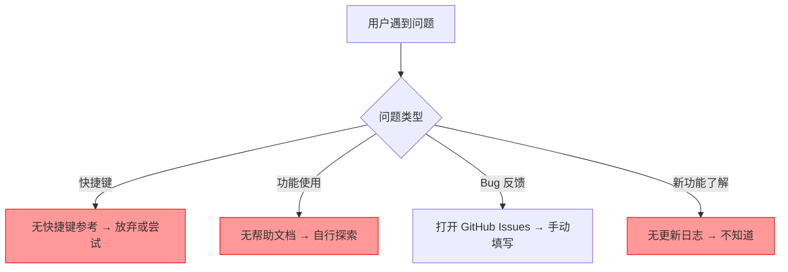
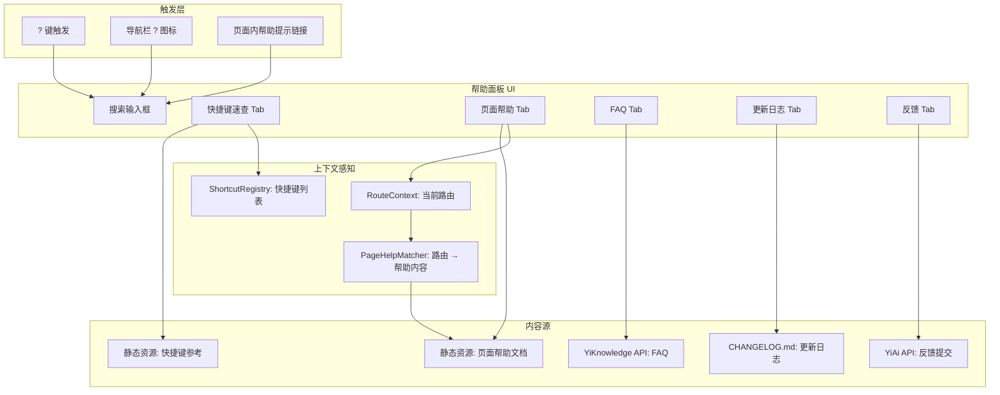
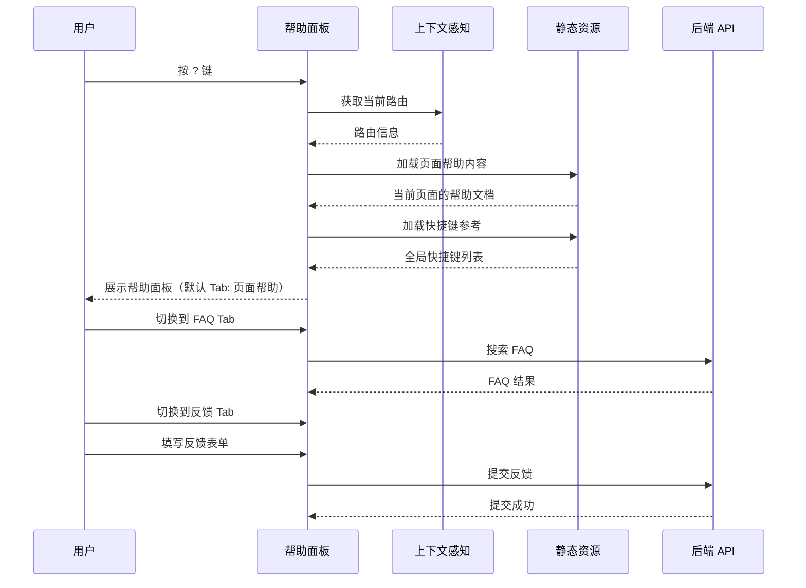

# YV-09-70: 快捷键参考与帮助中心 — 上下文感知帮助面板、可搜索文档、快捷键速查、更新日志

> 需求编号：YV-09-70 · 优先级：P2 · 人天：0.2d · 状态：需求已编写
> 依赖：YV-09-43（全局快捷键框架）、YV-09-68（全局搜索命令面板）

## 背景

### 问题陈述

YiVad 管理后台功能丰富，但缺乏系统化的帮助体系和快捷键发现机制，用户在使用过程中遇到问题时难以快速获取帮助：

1. **快捷键不可发现**：用户不知道有哪些快捷键可用，现有快捷键依赖用户自行探索
2. **帮助文档分散**：功能说明分布在多个位置，无统一帮助中心
3. **上下文帮助缺失**：用户在特定页面遇到问题时，无法快速获取该页面的帮助信息
4. **无更新日志**：用户不知道新功能、改进和修复内容
5. **无反馈渠道**：用户发现问题或有建议时，需要切换到外部渠道提交

**核心矛盾**：YiVad 功能复杂度增长 vs 用户学习成本线性增长，需要系统化的帮助体系和发现机制来降低学习曲线。

### 影响范围

| # | 影响 | 严重程度 | 典型场景 |
|---|------|----------|----------|
| 1 | 快捷键不可发现 | 高 | 用户不知道 Ctrl+K 可以打开命令面板 |
| 2 | 帮助文档分散 | 中 | 用户需要搜索多个来源才能找到功能说明 |
| 3 | 上下文帮助缺失 | 中 | 用户在 Bug 页面不知道如何批量操作 |
| 4 | 无更新日志 | 低 | 用户不知道新上线了命令面板功能 |
| 5 | 无内置反馈渠道 | 中 | 用户发现问题后需要切换到 GitHub Issues |

### 挑战

| 挑战 | 说明 |
|------|------|
| 帮助内容维护 | 帮助文档需要与功能同步更新，避免内容过时 |
| 上下文感知 | 需要根据当前页面路由自动展示相关帮助内容 |
| 快捷键展示 | 需要从全局快捷键框架中动态获取当前注册的快捷键 |
| 搜索性能 | 帮助文档搜索需要快速响应 |
| 更新日志来源 | 更新日志的自动化生成 vs 手动维护 |

---

## 一、现状分析

### 1.1 当前帮助体系

```
YiVad 帮助体系现状:
├── 快捷键
│   ├── 无快捷键速查面板
│   ├── 无快捷键提示（hover tooltip）
│   └── 无快捷键自定义
├── 帮助文档
│   ├── 无帮助中心
│   ├── 无页面级帮助提示
│   └── 无搜索功能
├── 更新日志
│   ├── 无 Changelog 页面
│   └── 依赖 Git 提交记录（不面向用户）
├── 反馈渠道
│   ├── 无内置反馈入口
│   └── 依赖 GitHub Issues（外部）
└── 用户引导
    ├── 无新手引导
    └── 无功能提示

缺失:
├── 帮助中心面板（? 键触发）        # ❌ 不存在
├── 快捷键速查                     # ❌ 不存在
├── 上下文感知帮助                  # ❌ 不存在
├── 可搜索帮助文档                 # ❌ 不存在
├── 更新日志页面                   # ❌ 不存在
├── 反馈提交表单                   # ❌ 不存在
└── 视频教程/功能演示               # ❌ 不存在
```

### 1.2 用户求助路径分析

| 用户问题 | 当前解决方案 | 效率 | 满意度 |
|----------|-------------|------|--------|
| 这个页面有哪些快捷键？ | 无（无法发现） | 极低 | 极低 |
| 如何使用批量操作？ | 搜索 Git 提交记录 | 低 | 低 |
| 新版本有什么功能？ | 查看 Git 提交记录 | 低 | 极低 |
| 遇到 Bug 如何反馈？ | 打开 GitHub Issues | 中 | 中 |
| 功能 X 在哪里？ | 遍历侧边栏菜单 | 低 | 低 |

### 1.3 改造前帮助流程



### 1.4 根因矩阵

| 症状 | 根因 | 触发条件 | 频率 |
|------|------|----------|------|
| 快捷键不可发现 | 无快捷键速查 | 新用户使用 | 高 |
| 功能使用困难 | 无帮助文档 | 遇到不熟悉的功能 | 中 |
| 不知道新功能 | 无更新日志 | 每次更新 | 中 |
| 问题反馈困难 | 无内置反馈入口 | 发现问题 | 中 |
| 重复学习 | 无上下文帮助 | 频繁使用不同功能 | 中 |

---

## 二、设计决策

### 决策 1：帮助面板触发方式 — 快捷键 vs 按钮 vs 两者

| 选项 | 可见性 | 效率 | 实现复杂度 |
|------|--------|------|-----------|
| 仅快捷键（?） | 低 | 高 | 低 |
| 仅按钮（导航栏 ? 图标） | 高 | 低 | 低 |
| 两者（快捷键 + 按钮） | 高 | 高 | 低 |

**选择：两者。** 按 `?` 键触发帮助面板，同时在导航栏添加 `?` 图标按钮。快捷键用于高效用户，按钮用于新用户发现。

### 决策 2：帮助内容来源 — 静态 Markdown vs 后端 API vs 混合

| 选项 | 内容更新 | 离线可用 | 搜索能力 |
|------|----------|----------|----------|
| 静态 Markdown（前端内置） | 需发版 | 是 | 高 |
| 后端 API（YiKnowledge） | 实时 | 否 | 高 |
| 混合（核心静态 + 扩展后端） | 灵活 | 部分 | 高 |

**选择：混合。** 核心帮助内容（快捷键参考、页面功能说明）作为静态 Markdown 文件内置在前端。扩展帮助内容（FAQ、详细教程）从 YiKnowledge 后端 API 动态加载。这样保证核心内容离线可用，扩展内容可实时更新。

### 决策 3：更新日志来源 — 手动维护 vs Git 自动生成 vs 混合

| 选项 | 准确性 | 可读性 | 维护成本 |
|------|--------|--------|----------|
| 手动维护 CHANGELOG.md | 高 | 高 | 中 |
| Git 提交记录自动生成 | 低 | 低 | 低 |
| 混合（手动 + Conventional Commits 分类） | 高 | 高 | 中 |

**选择：混合。** 项目已使用 Conventional Commits，可按类型（feat/fix/docs）自动分类生成基础更新日志，人工补充描述和截图。最终生成用户友好的 CHANGELOG.md 展示在帮助中心。

### 决策 4：反馈提交方式 — 跳转 GitHub Issues vs 内置表单 vs 两者

| 选项 | 用户体验 | 开发者效率 | 实现复杂度 |
|------|----------|-----------|-----------|
| 跳转 GitHub Issues | 低 | 高 | 低 |
| 内置表单（提交到后端） | 高 | 中 | 中 |
| 两者（内置表单 + GitHub Issues 链接） | 高 | 高 | 中 |

**选择：两者。** 内置简单反馈表单（类型、描述、自动附带页面 URL 和浏览器信息），提交到 YiAi 后端存储。同时提供"在 GitHub 提交详细 Issue"的链接，满足不同用户需求。

### 设计决策记录

| 决策 | 选项 A | 选项 B | 选项 C | 选择 | 理由 |
|------|--------|--------|--------|------|------|
| 触发方式 | 快捷键 | 按钮 | 两者 | **两者** | 兼顾效率和新用户 |
| 内容来源 | 静态 | 后端 | 混合 | **混合** | 离线可用 + 实时更新 |
| 更新日志 | 手动 | Git | 混合 | **混合** | 自动化 + 可读性 |
| 反馈方式 | GitHub | 内置 | 两者 | **两者** | 覆盖所有用户偏好 |

---

## 三、目标架构

### 3.1 帮助中心架构



### 3.2 帮助面板交互流程



### 3.3 性能指标

| 指标 | 目标值 | 说明 |
|------|--------|------|
| 帮助面板打开 | < 50ms | 静态内容加载 |
| 帮助文档搜索 | < 10ms | 本地静态内容搜索 |
| FAQ 搜索（后端） | < 200ms | API 调用 |
| 快捷键列表渲染 | < 10ms | 50+ 快捷键渲染 |
| 反馈提交 | < 500ms | API 调用 |

---

## 四、具体改动

### 4.1 帮助面板组件

```typescript
// src/components/help-center/types.ts (新增)

export type HelpTab = 'shortcuts' | 'page-help' | 'faq' | 'changelog' | 'feedback';

export interface ShortcutReference {
  category: string;
  key: string;
  description: string;
  scope: string;
}

export interface PageHelpContent {
  route: string;
  title: string;
  sections: {
    heading: string;
    content: string;
  }[];
  relatedShortcuts: string[];
  relatedLinks: { label: string; route: string }[];
}

export interface FAQItem {
  id: string;
  question: string;
  answer: string;
  tags: string[];
  relatedRoutes: string[];
}

export interface ChangelogEntry {
  version: string;
  date: string;
  sections: {
    type: 'feat' | 'fix' | 'docs' | 'refactor';
    description: string;
  }[];
}

export interface FeedbackForm {
  type: 'bug' | 'feature' | 'question' | 'other';
  title: string;
  description: string;
  pageUrl: string;
  browserInfo: string;
}
```

### 4.2 帮助中心面板

```typescript
// src/components/help-center/help-center-panel.vue (新增)

// <template>
//   <Teleport to="body">
//     <Transition name="fade">
//       <div v-if="isOpen" class="help-center-overlay" @click.self="close">
//         <div class="help-center">
//           <div class="help-header">
//             <input v-model="searchQuery" placeholder="搜索帮助内容..." />
//             <button @click="close">X</button>
//           </div>
//           <div class="help-tabs">
//             <button :class="{ active: activeTab === 'page-help' }"
//               @click="activeTab = 'page-help'">页面帮助</button>
//             <button :class="{ active: activeTab === 'shortcuts' }"
//               @click="activeTab = 'shortcuts'">快捷键</button>
//             <button :class="{ active: activeTab === 'faq' }"
//               @click="activeTab = 'faq'">FAQ</button>
//             <button :class="{ active: activeTab === 'changelog' }"
//               @click="activeTab = 'changelog'">更新日志</button>
//             <button :class="{ active: activeTab === 'feedback' }"
//               @click="activeTab = 'feedback'">反馈</button>
//           </div>
//           <div class="help-content">
//             <ShortcutsTab v-if="activeTab === 'shortcuts'" />
//             <PageHelpTab v-if="activeTab === 'page-help'" />
//             <FAQTab v-if="activeTab === 'faq'" />
//             <ChangelogTab v-if="activeTab === 'changelog'" />
//             <FeedbackTab v-if="activeTab === 'feedback'" />
//           </div>
//         </div>
//       </div>
//     </Transition>
//   </Teleport>
// </template>
```

### 4.3 上下文感知帮助

```typescript
// src/composables/usePageHelp.ts (新增)

const pageHelpMap: Record<string, PageHelpContent> = {
  '/dashboard': {
    route: '/dashboard',
    title: '仪表盘',
    sections: [
      {
        heading: '概述',
        content: '仪表盘展示项目的关键指标概览，包括 Bug 统计、Issue 进度、项目健康度等。',
      },
      {
        heading: '图表交互',
        content: '点击图表中的数据点可以钻取查看明细数据。使用右上角的时间范围选择器切换统计周期。',
      },
      {
        heading: '自定义布局',
        content: '拖拽图表卡片可以自定义仪表盘布局。点击"添加卡片"添加新的统计图表。',
      },
    ],
    relatedShortcuts: ['Ctrl+K', '?'],
    relatedLinks: [
      { label: 'Bug 列表', route: '/bugs' },
      { label: 'Issue 列表', route: '/issues' },
    ],
  },
  '/bugs': {
    route: '/bugs',
    title: 'Bug 追踪',
    sections: [
      {
        heading: 'Bug 列表',
        content: '展示所有 Bug 的列表视图，支持按状态、严重程度、负责人等条件过滤。',
      },
      {
        heading: '批量操作',
        content: '选中多个 Bug 后，使用工具栏中的批量操作按钮执行批量状态变更、批量分配等操作。',
      },
    ],
    relatedShortcuts: ['Ctrl+K', '?', 'Ctrl+F'],
    relatedLinks: [
      { label: '仪表盘', route: '/dashboard' },
      { label: 'Issue 列表', route: '/issues' },
    ],
  },
  // ... 更多页面
};

export function usePageHelp() {
  const route = useRoute();

  const currentHelp = computed(() => {
    // 匹配最具体的路由
    const matched = Object.keys(pageHelpMap)
      .sort((a, b) => b.length - a.length)
      .find(key => route.path.startsWith(key));
    return matched ? pageHelpMap[matched] : null;
  });

  return { currentHelp };
}
```

### 4.4 文件变更清单

| 文件 | 操作 | 说明 |
|------|------|------|
| `src/components/help-center/types.ts` | 新增 | 帮助中心类型定义 |
| `src/components/help-center/help-center-panel.vue` | 新增 | 帮助中心面板 |
| `src/components/help-center/shortcuts-tab.vue` | 新增 | 快捷键速查 Tab |
| `src/components/help-center/page-help-tab.vue` | 新增 | 页面帮助 Tab |
| `src/components/help-center/faq-tab.vue` | 新增 | FAQ Tab |
| `src/components/help-center/changelog-tab.vue` | 新增 | 更新日志 Tab |
| `src/components/help-center/feedback-tab.vue` | 新增 | 反馈提交 Tab |
| `src/composables/usePageHelp.ts` | 新增 | 上下文感知帮助 |
| `src/data/help/shortcuts.ts` | 新增 | 快捷键参考数据 |
| `src/data/help/page-help-content.ts` | 新增 | 页面帮助内容 |
| `CHANGELOG.md` | 新增 | 更新日志 |
| `src/App.vue` | 修改 | 注册 ? 快捷键 + 挂载帮助面板 |
| `src/layouts/MainLayout.vue` | 修改 | 导航栏添加 ? 图标 |
| `tests/unit/help-center.test.ts` | 新增 | 帮助中心测试 |

---

## 五、实施步骤

| 步骤 | 操作 | 路径 | 验证 | 人天 |
|------|------|------|------|------|
| 1 | 定义帮助中心类型和数据结构 | `src/components/help-center/types.ts` | 类型定义完整 | 0.02 |
| 2 | 实现上下文感知帮助 | `src/composables/usePageHelp.ts` | 路由匹配正确 | 0.03 |
| 3 | 实现帮助中心面板 UI | `src/components/help-center/help-center-panel.vue` | 面板打开/关闭/Tab 切换 | 0.05 |
| 4 | 实现快捷键速查 Tab | `src/components/help-center/shortcuts-tab.vue` | 展示所有快捷键 | 0.03 |
| 5 | 实现页面帮助 Tab | `src/components/help-center/page-help-tab.vue` | 上下文感知展示 | 0.02 |
| 6 | 实现更新日志 Tab | `src/components/help-center/changelog-tab.vue` | 展示 CHANGELOG.md | 0.02 |
| 7 | 实现反馈 Tab | `src/components/help-center/feedback-tab.vue` | 表单提交成功 | 0.03 |

**总人天：0.2d**

---

## 六、测试规格

### 场景 1：打开帮助面板

**GIVEN** 用户在任意页面
**WHEN** 用户按下 `?` 键
**THEN** 应显示帮助中心面板
**AND** 默认展示"页面帮助"Tab
**AND** 帮助内容应对应当前页面

### 场景 2：查看快捷键参考

**GIVEN** 帮助面板已打开
**WHEN** 用户切换到"快捷键"Tab
**THEN** 应展示所有注册的快捷键
**AND** 快捷键应按分类分组（导航/操作/搜索）
**AND** 应展示快捷键的作用域

### 场景 3：搜索帮助内容

**GIVEN** 帮助面板已打开
**WHEN** 用户在搜索框输入"批量操作"
**THEN** 应搜索帮助文档、FAQ、快捷键描述
**AND** 匹配结果应高亮显示关键词

### 场景 4：查看更新日志

**GIVEN** 帮助面板已打开
**WHEN** 用户切换到"更新日志"Tab
**THEN** 应展示版本更新历史
**AND** 更新条目应按类型分类（新功能/修复/文档）
**AND** 最新版本应排在前面

### 场景 5：提交反馈

**GIVEN** 帮助面板已打开
**WHEN** 用户切换到"反馈"Tab
**AND** 填写反馈类型为"Bug"、标题和描述
**WHEN** 用户点击提交
**THEN** 反馈应提交到后端
**AND** 应自动附带当前页面 URL 和浏览器信息
**AND** 应显示提交成功提示

### 场景 6：上下文感知帮助

**GIVEN** 用户在 Bug 列表页面
**WHEN** 用户打开帮助面板
**THEN** 应展示 Bug 列表相关的帮助内容
**AND** 应包含 Bug 列表的快捷键参考
**AND** 应包含关联页面的链接（仪表盘、Issue 列表）

---

## 七、风险与缓解

| 风险 | 概率 | 影响 | 缓解措施 |
|------|------|------|----------|
| 帮助内容过时 | 高 | 中 | 代码审查时检查帮助内容是否与功能同步更新 |
| ? 键与表单输入冲突 | 中 | 低 | 检测 activeElement 是否为 input/textarea，若是则跳过 |
| FAQ 后端不可用 | 低 | 低 | 降级为静态 FAQ 内容 |
| 反馈提交失败 | 低 | 低 | 显示错误提示，提供 GitHub Issues 备选链接 |
| 更新日志与功能不同步 | 中 | 低 | CI 中检查 CHANGELOG.md 是否在每次发版时更新 |

---

## 八、回滚策略

| 场景 | 回滚操作 | 影响 |
|------|----------|------|
| 帮助面板性能问题 | 禁用 ? 快捷键，仅保留导航栏按钮 | 失去键盘快速访问 |
| 帮助内容严重过时 | 移除帮助面板，引导用户查看外部文档 | 失去内置帮助 |
| 反馈提交后端异常 | 禁用内置表单，仅保留 GitHub Issues 链接 | 失去内置反馈 |
| ? 键与页面冲突 | 更改触发热键为 Ctrl+Shift+? | 用户需要重新学习 |

---

## 九、设计决策记录

### D-01：帮助面板触发热键

- **问题**：帮助面板的默认触发热键
- **选项**：`?`、`F1`、`Ctrl+H`、`Ctrl+Shift+?`
- **选择**：`?`
- **理由**：`?` 是许多应用（GitHub、Notion、Linear）的快捷键参考热键，用户已有肌肉记忆；`F1` 被浏览器占用；`Ctrl+H` 被浏览器历史记录占用

### D-02：帮助内容组织方式

- **问题**：帮助内容如何组织
- **选项**：单个长文档、按页面分文档、按功能分文档、多维度组织
- **选择**：多维度组织（页面帮助 + FAQ + 快捷键 + 更新日志）
- **理由**：不同用户有不同的帮助需求，多维度组织让用户更快找到所需内容

### D-03：反馈表单字段

- **问题**：反馈表单应包含哪些字段
- **选项**：仅描述、类型 + 描述、类型 + 标题 + 描述 + 自动信息
- **选择**：类型 + 标题 + 描述 + 自动信息（页面 URL、浏览器版本）
- **理由**：自动信息减少用户填写负担，提高反馈质量；类型和标题帮助开发者快速分类

### D-04：更新日志展示方式

- **问题**：更新日志的展示方式
- **选项**：时间线、按版本分组、按类型分组、版本 + 类型
- **选择**：版本 + 类型（每个版本下按 feat/fix/docs 分组）
- **理由**：用户最关心的是"这个版本有什么新功能/修复了什么"，版本 + 类型分组最直观

---

## 十、可观测性

### 指标

| 指标 | 类型 | 说明 |
|------|------|------|
| `yivad.help.open_count` | Counter | 帮助面板打开次数 |
| `yivad.help.tab_view` | Counter | 各 Tab 查看次数 |
| `yivad.help.search_count` | Counter | 帮助搜索次数 |
| `yivad.help.no_result_count` | Counter | 搜索无结果次数 |
| `yivad.help.feedback_submit` | Counter | 反馈提交次数 |
| `yivad.help.shortcut_view` | Counter | 快捷键速查查看次数 |

### 告警

| 告警 | 条件 | 级别 |
|------|------|------|
| 搜索无结果比例过高 | 无结果/总搜索 > 30% | WARNING |
| 反馈提交失败 | 连续 3 次 | ERROR |

---

## 十一、代码审查检查清单

- [ ] 帮助面板通过 `?` 键和导航栏图标触发
- [ ] 帮助面板打开时默认展示当前页面的帮助内容
- [ ] 快捷键速查 Tab 展示所有注册的快捷键（按分类分组）
- [ ] 页面帮助 Tab 内容对应当前路由
- [ ] FAQ Tab 支持搜索（静态 + 后端 API 降级）
- [ ] 更新日志 Tab 展示 CHANGELOG.md（按版本 + 类型分组）
- [ ] 反馈 Tab 包含类型、标题、描述字段
- [ ] 反馈提交自动附带页面 URL 和浏览器信息
- [ ] 帮助内容搜索支持模糊匹配
- [ ] `?` 键在 input/textarea 聚焦时不触发
- [ ] 帮助面板关闭动画流畅（< 200ms）
- [ ] 单元测试覆盖上下文感知、搜索、反馈提交

---

## 回归问题预测

| # | 预测问题 | 原因 | 验证方法 |
|---|---------|------|---------|
| 1 | 帮助面板打开时，页面帮助内容显示为"无相关内容"，因为路由匹配规则过于严格 | 路由匹配使用 `startsWith` 但路由参数（如 `/bugs/BUG-001`）可能匹配不到 `/bugs` 精确路径 | 在 Bug 详情页（/bugs/BUG-001）打开帮助面板，验证展示 Bug 相关帮助内容 |
| 2 | 快捷键速查 Tab 中展示的快捷键与全局快捷键框架注册的不一致 | 帮助面板的快捷键数据是静态维护的，快捷键框架的注册是动态的，两者可能不同步 | 对比快捷键速查 Tab 中的快捷键列表与 `useShortcuts` 中的注册列表，验证一致性 |
| 3 | 更新日志 Tab 中的 CHANGELOG.md 加载失败（文件未找到），页面显示空白 | 前端构建时 CHANGELOG.md 未被打包到静态资源中 | 构建生产版本后在更新日志 Tab 中验证内容正常展示 |
| 4 | 反馈表单在提交时，页面 URL 包含敏感查询参数（如 Token），被自动附带提交 | 自动收集的 `window.location.href` 可能包含敏感的 URL 参数 | 在包含 Token 参数的 URL 中打开反馈表单，验证自动附带的 URL 已脱敏 |
| 5 | 帮助面板的搜索功能搜索 FAQ 时，后端 API 不可用，但前端未降级到静态内容 | FAQ 搜索依赖后端 API，但 API 调用失败时缺少 catch 处理 | 模拟后端 API 不可用，验证搜索降级到静态 FAQ 内容 |
| 6 | 帮助面板在暗色模式下，Markdown 渲染的代码块未适配暗色主题，代码块显示异常 | 帮助面板的 Markdown 渲染器使用了独立的样式，未继承全局暗色主题变量 | 切换到暗色模式，打开帮助面板查看代码块样式，验证颜色适配 |

---

## 性能分析

### 帮助中心关键操作耗时

| 操作 | 耗时 | 说明 |
|------|------|------|
| 帮助面板打开 | < 50ms | overlay 创建 + Vue 组件挂载 |
| 静态内容加载 | < 10ms | 页面帮助 + 快捷键数据 |
| 帮助内容搜索 | < 10ms | 本地静态内容模糊搜索 |
| FAQ 搜索（后端） | < 200ms | API 调用 |
| 更新日志加载 | < 20ms | CHANGELOG.md 解析 |
| 反馈提交 | < 500ms | API 调用 + 响应 |
| Tab 切换 | < 10ms | 组件切换 |

### 数据量预估

| 模块 | 数据项 | 大小 |
|------|--------|------|
| 快捷键参考 | 50+ 快捷键定义 | ~5KB |
| 页面帮助内容 | 10+ 页面的帮助文档 | ~50KB |
| FAQ 静态内容 | 20+ 常见问题 | ~20KB |
| 更新日志 | 10+ 版本更新记录 | ~20KB |

### 对页面性能的影响

| 场景 | 页面影响 | 说明 |
|------|----------|------|
| 帮助面板打开 | < 50ms 主线程 | 静态内容已预加载 |
| 帮助面板关闭 | < 10ms 主线程 | overlay 移除 |
| 搜索输入 | < 5ms 主线程 | 本地搜索 |

---

## 相关文档

- [全局快捷键框架](../43-需求-全局快捷键框架.md) — 快捷键速查的数据源
- [全局搜索命令面板](../68-需求-全局搜索命令面板.md) — 命令面板与帮助面板的快捷键互补
- [用户引导与新手任务](../63-需求-用户引导与新手任务.md) — 新手引导与帮助中心互补

*PRD 来源: `projects/yivad/requirements/2026-09/70-需求-快捷键参考与帮助中心.md`*

