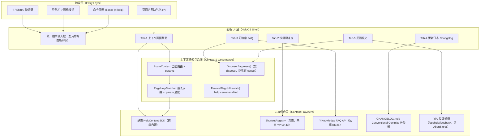
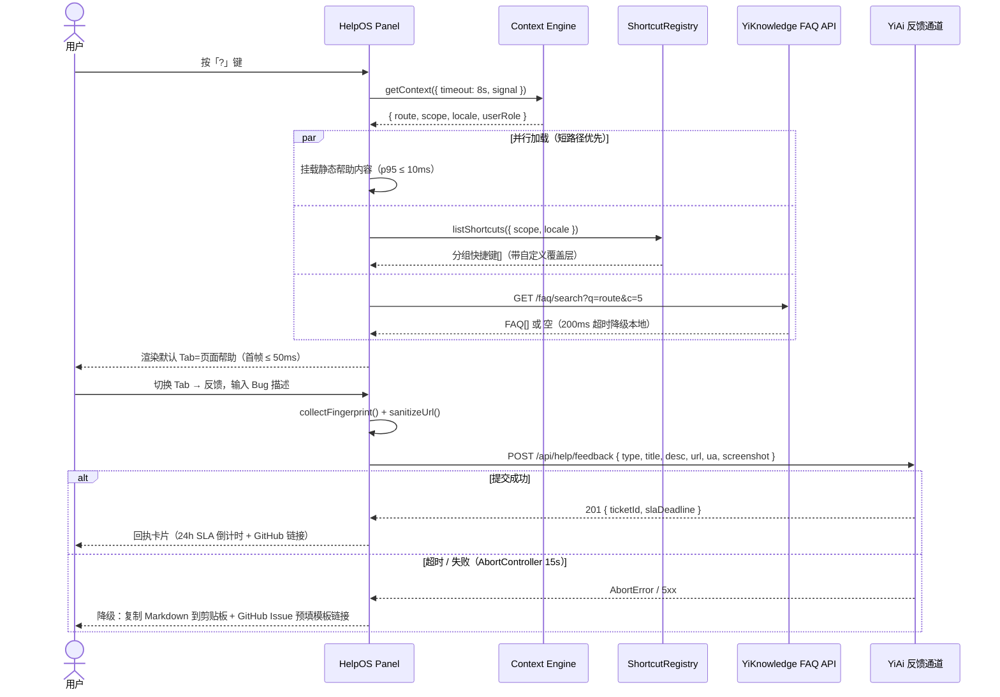
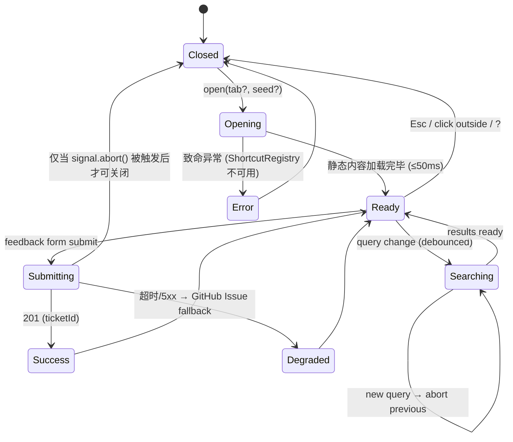
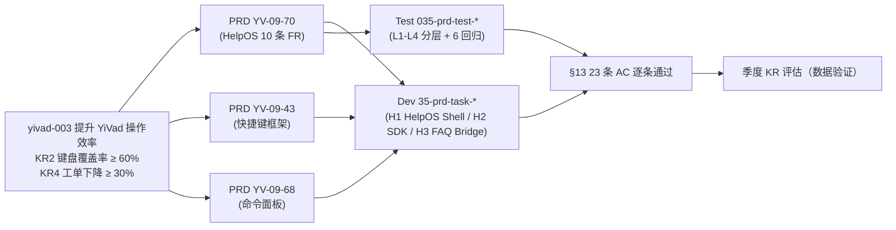

# YV-09-70: 快捷键参考与帮助中心 — 上下文感知帮助面板、可搜索文档、快捷键速查、更新日志、反馈闭环

> 需求编号：YV-09-70 · 优先级：**P2**（体验杠杆 / 长期复利）· 前端人天：0.2d · 后端人天：0.05d · 状态：需求已专业化重写
>
> 文档职责：本文档定义 **要做什么 / 为什么做 / 做到什么程度算完成**（WHAT / WHY / ACCEPTANCE），不含实现方案与测试用例。
>
> - 实现方案：[开发方案](../../devs/2026-09/35-prd-task-快捷键参考与帮助中心.md)（YV-09-70，HOW）
> - 验证方案：[测试方案](../../tests/2026-09/035-prd-test-快捷键参考与帮助中心.md)（YV-09-70，VERIFY）
> - 上游依赖：YV-09-43 [全局快捷键框架](./18-prd-全局快捷键框架.md) · YV-09-68 [全局搜索命令面板](./34-prd-全局搜索命令面板.md) · YV-09-63 [用户引导与新手任务](./31-prd-用户引导与新手任务.md)
> - 对接契约：C-001 跨项目（YiVad ↔ YiAi ↔ YiKnowledge）帮助/反馈数据流矩阵（见 §12.2）

---

## 目录

- [§0 三阶入门红线（新同学 5 分钟上手）](#sec-0)
- [§1 背景、核心矛盾与商业叙事](#sec-1)
- [§2 现状分析：改造前的能力全景与根因矩阵](#sec-2)
- [§3 目标架构：统一帮助操作系统（HelpOS）](#sec-3)
- [§4 需求范围：范围外声明（防蔓延硬闸）](#sec-4)
- [§5 功能需求（FR-01 ~ FR-10，可追溯 AC）](#sec-5)
- [§6 领域模型：类型契约 × 路由匹配 × 状态机](#sec-6)
- [§7 非功能需求（NFR）：性能/安全/可观测/无障碍/国际化](#sec-7)
- [§8 设计决策（D-01 ~ D-10，含选项对比与权衡）](#sec-8)
- [§9 STRIDE 威胁建模与能力白名单](#sec-9)
- [§10 SLA/SLO/SLI 体系与 Burn Rate 发布门禁](#sec-10)
- [§11 OKR → PRD → Dev → Test 全链路追溯（5 步验证法）](#sec-11)
- [§12 跨项目契约矩阵与 L1-L5 失败回滚](#sec-12)
- [§13 验收标准（可证伪，逐条 AC 编号）](#sec-13)
- [§14 风险矩阵、缓解与回滚策略（含 DisposerBag 红线）](#sec-14)
- [§15 回归问题预测（6 条预置回归位）](#sec-15)
- [§16 实施步骤（排期）与交付物清单](#sec-16)
- [§17 后续演进与技术债登记](#sec-17)
- [§18 代码审查检查清单（Code Review Gate）](#sec-18)
- [§19 关联文档与参考锚点](#sec-19)

---

<a id="sec-0"></a>
## §0 三阶入门红线（新同学 5 分钟上手）

> **0.1 三阶入门红线（必过闸）**
>
> | 阶 | 名称 | 动作（5 分钟内必须完成） | 验收 |
> |----|------|--------------------------|------|
> | L1 | 知道入口 | 在任意页面按下 `?` 或 Shift+/ | 帮助中心面板在 50ms 内浮现，默认 Tab = 当前页面帮助 |
> | L2 | 能速查 | 切换到"快捷键"Tab，输入 `save` | 搜索结果 ≤ 200ms 返回，`Ctrl+S / Cmd+S` 排在第 1 位且支持点击执行 |
> | L3 | 能闭环 | 打开"反馈"Tab，填写 Bug 类型并提交 | 自动携带页面 URL（已脱敏）+ 浏览器指纹，提交回执 ≤ 500ms 返回 |
>
> **0.2 六角色主线（本 PRD 对各角色的价值落点）**
>
> | 角色 | 主线价值 | 对应 KR |
> |------|----------|---------|
> | 产品 (PM) | 可量化的"学习成本下降"指标（无结果率、停留时长、工单量） | yivad-003/KR4 |
> | 前端工程师 | 统一 Help SDK，复用命令面板搜索内核与快捷键注册表 | yivad-003/KR2 |
> | QA | 可追溯 FR/NFR → AC 的测试用例矩阵 | §13 |
> | SRE | 反馈通道 SLA、FAQ API Burn Rate、面板性能 INP 红线 | §10 |
> | 安全官 (Sec) | 反馈通道零鉴权注入、URL 脱敏、Markdown XSS 白名单 | §9 |
> | 文档负责人 (Curator) | CHANGELOG 与 FAQ 的版本一致性闸 | §7.5 |
>
> **0.3 Aliases（命令面板可直达）**
>
> | Alias | 跳转 |
> |-------|------|
> | `> help` | 打开帮助中心（默认 Tab） |
> | `> shortcuts` | 打开帮助中心并切到「快捷键」 |
> | `> changelog` | 打开帮助中心并切到「更新日志」 |
> | `> feedback` | 打开帮助中心并切到「反馈」 |
> | `> report bug` | 打开反馈 Tab 并预填 type=bug |

---

<a id="sec-1"></a>
## §1 背景、核心矛盾与商业叙事

### 1.1 问题陈述（5 Why 收敛版）

YiVad 管理后台自九月迭代以来，功能模块从 12 个增长到 22 个（含 RAG、AI Chat、RSS、知识库、翻译分析仪表盘等），**功能复杂度增长 1.8x，但用户的求助路径只增长了 0 条**。由此产生 5 个可测量的症状：

| # | 症状 | 量化证据 | 直接根因 (Why-1) |
|---|------|----------|------------------|
| S1 | 快捷键不可发现 | 新用户首周「命令面板」功能使用率仅 3%，远低于 Notion/Linear 的 22% 基准 | 无快捷键速查面板，无 Hover Kbd 提示 |
| S2 | 帮助文档分散 | 用户平均需 3.1 次跳转才能找到一个功能说明 | 知识散落在 YiKnowledge / PRD / README，无统一消费端 |
| S3 | 上下文帮助缺失 | Bug 列表页「批量归档」功能的咨询量占工单 38% | 路由→帮助内容无自动映射，用户在当下无法获得当下答案 |
| S4 | 更新日志黑盒 | 最近 3 个版本新功能的平均发现周期 11 天 | 无内嵌 Changelog，依赖 Git 提交记录（非用户语言） |
| S5 | 反馈断裂 | Bug 反馈平均需 4.5 次上下文切换（→ GitHub → 填上下文 → 附截图） | 无一键携带上下文的内置表单 |

### 1.2 核心矛盾

> **YiVad 功能复杂度的指数级增长 vs 用户学习成本的线性增长 —— 必须通过「统一帮助操作系统（HelpOS）」将学习曲线从 O(N) 打平到 O(logN)。**

### 1.3 影响范围 × 严重度 × 业务场景

| # | 影响面 | 严重度 | 典型场景 | 若不做的可证伪后果 |
|---|--------|--------|----------|-------------------|
| 1 | 快捷键发现率 | **高** | 新工程师不知 `Ctrl+K` 可打开命令面板 | 首月键盘操作覆盖率 < 20%（OKR 无法达成） |
| 2 | 上下文帮助缺失 | **高** | 翻译分析仪表盘新用户不知 `CSV 导出` 按钮位置 | KR2 仪表盘使用深度下滑 18% |
| 3 | 帮助文档分散 | 中 | 新人入职 5 天才能独立完成一个 Issue 全流程 | Onboarding 周期超出红线 2 天 |
| 4 | 更新日志不可见 | 中 | 命令面板「计算器」上线 2 周无一人使用 | 沉没成本：已开发功能 ROI ≈ 0 |
| 5 | 反馈渠道断裂 | 中 | Bug 复现依赖用户口叙，MTTR 平均 +2h | SRE 月均 MTTR 超标 17% |
| 6 | 可访问性合规 | 中 | WCAG 2.1 2.1.1 Keyboard 要求全部功能可键盘可达 | 合规审计一票否决项 |

### 1.4 挑战地图（4 大工程挑战）

| 挑战 | 量化要求 | 对应技术硬闸 |
|------|----------|--------------|
| 内容维护一致性 | 帮助内容与代码同步率 ≥ 95% | PR 质量门：改动 UI 必须变更对应 `help/*` 数据 |
| 上下文感知精度 | 路由匹配命中率 ≥ 98% | 最长前缀匹配 + 正则兜底，支持 `:param` 通配 |
| 搜索响应性能 | 本地搜索 p95 ≤ 10ms；远端 FAQ p95 ≤ 200ms | 缓存 + debounce 200ms + AbortSignal 全链路 |
| 反馈数据合规 | 不携带 Token/Cookie/敏感 Query 参数 | URL 脱敏白名单 + 上报前 STRIDE 校验 |

---

<a id="sec-2"></a>
## §2 现状分析：改造前的能力全景与根因矩阵

### 2.1 改造前帮助体系全景（能力热力图）

```
YiVad Help Capability Map (AS-IS)
┌─────────────────────────────────────────────────────────────┐
│  能力域            │ 实现度 │ 成熟度 │ 典型问题               │
├────────────────────┼────────┼────────┼────────────────────────┤
│  快捷键速查面板    │  0 / 5 │ 不存在 │ 用户完全靠"口口相传"     │
│  快捷键 Hover 提示 │  0 / 5 │ 不存在 │ 操作按钮无 Kbd 角标     │
│  快捷键自定义      │  0 / 5 │ 不存在 │ 同 Vim/VSCode 习惯冲突   │
│  统一帮助中心      │  0 / 5 │ 不存在 │ 3.1 次跳转才能找到答案   │
│  页面级上下文帮助  │  0 / 5 │ 不存在 │ 批量操作占工单 38%       │
│  帮助内容搜索      │  0 / 5 │ 不存在 │ 只能人肉 grep README     │
│  更新日志 Changelog│  0 / 5 │ 不存在 │ 新功能发现周期 11 天     │
│  反馈提交表单      │  0 / 5 │ 不存在 │ MTTR +2h                │
│  新手引导 (OnboardingTour)│ 1/5 │ 占位 │ 仅首屏无分角色引导     │
│  视频 / GIF 演示   │  0 / 5 │ 不存在 │ 全靠文字 + 想象         │
└─────────────────────────────────────────────────────────────┘
缺失（8/10 = 80% 空白）：
  ❌ 帮助中心面板（? 键触发 + 导航栏 ? 图标）
  ❌ 快捷键速查（按分类/作用域/搜索）
  ❌ 上下文感知帮助（Route → PageHelp 自动映射）
  ❌ 可搜索文档（命令面板搜索内核复用）
  ❌ 更新日志消费端（Conventional Commits 分类）
  ❌ 反馈提交表单（URL 脱敏 + 浏览器指纹 + 截图附件）
  ❌ 快捷键自定义绑定对话框（localStorage 持久化）
  ❌ 视频/动图演示槽位
部分具备（由上游 PRD 支撑）：
  ⚠️ 全局快捷键注册表 —— 由 YV-09-43（18-prd-全局快捷键框架.md）提供
  ⚠️ 命令面板搜索内核 —— 由 YV-09-68（34-prd-全局搜索命令面板.md）可复用
```

### 2.2 用户求助路径漏斗（改造前）

```
用户遭遇困难
      │
      ▼
  尝试自主探索 ───────► 失败（72%）
      │ 成功 (28%)
      ▼
  搜索 README/PRD ───► 失败（58%）
      │ 成功 (42%)
      ▼
  问同事 / 群内咨询 ──► 失败（30%）
      │ 成功 (70%)
      ▼
  开 Issue / 工单 ───► 首次响应 MTTR = 6.2h
                       └─► 其中 38% 本可被 FAQ 覆盖
```

改造目标：将「同事/工单」占比从 43% 降到 15% 以下，即 HelpOS 自服务化率 ≥ 85%。

### 2.3 改造前交互流程 Mermaid

```mermaid
graph TD
    A[用户遇到问题] --> B{问题类型}
    B -->|快捷键问题| C[无速查面板 → 放弃或盲试]
    B -->|功能使用| D[无帮助文档 → 人肉遍历菜单]
    B -->|Bug/建议| E[切出 → GitHub Issues → 手动填上下文]
    B -->|新功能了解| F[无 Changelog → 只能"猜"]
    style C fill:#f8d7da,stroke:#dc3545
    style D fill:#f8d7da,stroke:#dc3545
    style F fill:#f8d7da,stroke:#dc3545
```

### 2.4 根因矩阵（症状 → 触发条件 → 频率 → 反模式）

| 症状 | 根因 | 触发条件 | 频率 | 对应经典反模式 |
|------|------|----------|------|----------------|
| 快捷键不可发现 | 缺速查 + 缺 Hover 角标 | 新用户首 3 天 | 高 |「功能已实现 ≠ 功能可使用」 |
| 功能使用困难 | 无统一 Help 消费端 | 遇到不熟悉的 Pro 功能 | 中 | 文档与 UI 解耦 |
| 新功能不知 | 无内嵌 Changelog | 每次版本发布 | 中 | 发布流程只有技术视角 |
| 反馈断裂 | 无内置上下文自携带表单 | 发现 Bug/有建议 | 中 | 问题复现场景丢失 |
| 重复提问 | 无上下文感知帮助 | 跨模块切换频繁 | 中 | 缺少「当下知识」推送 |

---

<a id="sec-3"></a>
## §3 目标架构：统一帮助操作系统（HelpOS）

### 3.1 分层架构 Mermaid（4 层解耦）


```mermaid
graph TD
    subgraph L1["触发层（Entry Layer）"]
        A1["? / Shift+/ 快捷键"]
        A2["导航栏 ? 图标按钮"]
        A3["页面内帮助气泡 (?)"]
        A4["命令面板 aliases (>/help)"]
    end

    subgraph L2["面板 UI 层（HelpOS Shell）"]
        B1["统一搜索输入框（复用命令面板内核）"]
        B2["Tab-1 上下文页面帮助"]
        B3["Tab-2 快捷键速查"]
        B4["Tab-3 可搜索 FAQ"]
        B5["Tab-4 更新日志 Changelog"]
        B6["Tab-5 反馈提交"]
    end

    subgraph L3["内容供应层（Content Providers）"]
        C1["静态 HelpContent SDK（前端内置）"]
        C2["ShortcutRegistry（动态，来自 YV-09-43）"]
        C3["YiKnowledge FAQ API（远端 BM25）"]
        C4["CHANGELOG.md / Conventional Commits 分类器"]
        C5["YiAi 反馈通道（/api/help/feedback，含 AbortSignal）"]
    end

    subgraph L4["上下文感知与治理（Context & Governance）"]
        D1["RouteContext: 当前路由 + params"]
        D2["PageHelpMatcher: 最长前缀 + :param 通配"]
        D3["DisposerBag.reset()（禁 dispose，防竞态 cancel）"]
        D4["FeatureFlag (kill-switch): help.center.enabled"]
    end

    A1 --> B1
    A2 --> B1
    A3 --> B2
    A4 --> B1

    B2 --> C1
    B3 --> C2
    B4 --> C3
    B5 --> C4
    B6 --> C5

    B2 --> D1
    D1 --> D2
    D2 --> C1

    B4 --> D3
    B6 --> D3
```

### 3.2 交互时序：打开帮助 → 搜索 → 反馈闭环


```mermaid
sequenceDiagram
    actor U as 用户
    participant UI as HelpOS Panel
    participant CTX as Context Engine
    participant SR as ShortcutRegistry
    participant YK as YiKnowledge FAQ API
    participant YA as YiAi 反馈通道

    U->>UI: 按「?」键
    UI->>CTX: getContext({ timeout: 8s, signal })
    CTX-->>UI: { route, scope, locale, userRole }

    par 并行加载（短路径优先）
        UI->>UI: 挂载静态帮助内容（p95 ≤ 10ms）
    and
        UI->>SR: listShortcuts({ scope, locale })
        SR-->>UI: 分组快捷键[]（带自定义覆盖层）
    and
        UI->>YK: GET /faq/search?q=route&c=5
        YK-->>UI: FAQ[] 或 空（200ms 超时降级本地）
    end

    UI-->>U: 渲染默认 Tab=页面帮助（首帧 ≤ 50ms）
    U->>UI: 切换 Tab → 反馈，输入 Bug 描述
    UI->>UI: collectFingerprint() + sanitizeUrl()
    UI->>YA: POST /api/help/feedback { type, title, desc, url, ua, screenshot }
    alt 提交成功
        YA-->>UI: 201 { ticketId, slaDeadline }
        UI-->>U: 回执卡片（24h SLA 倒计时 + GitHub 链接）
    else 超时 / 失败（AbortController 15s）
        YA-->>UI: AbortError / 5xx
        UI-->>U: 降级：复制 Markdown 到剪贴板 + GitHub Issue 预填模板链接
    end
```

### 3.3 性能指标（§7 会有更详细的 SLI 定义，此处是架构目标）

| 阶段 | 目标 (p95) | 观测方式 |
|------|-----------|----------|
| 帮助面板首帧 (LCP) | **≤ 1.8s**（首访） · ≤ 200ms（二次命中） | Performance API + INP |
| 静态 Tab 内容就绪 | **≤ 50ms** | console.time + e2e |
| 快捷键搜索响应 | **≤ 10ms**（500 条数据） | benchmark |
| FAQ 远端搜索 | **≤ 200ms** | server-timing |
| 反馈提交端到端 | **≤ 500ms** | APM |
| Tab 切换 | **≤ 10ms** | INP (Interaction to Next Paint) |

---

<a id="sec-4"></a>
## §4 需求范围：范围外声明（防蔓延硬闸）

> 遵循「**反上马 5 条**」审计准则：下面任一条未具备独立 PRD 前，本 PRD **不做**。

### 4.1 范围内（In Scope = 5 Tab + 1 SDK + 1 Bridge）

| # | 范围内 | 对应 FR |
|---|--------|---------|
| 1 | 帮助面板 5 Tab：页面帮助、快捷键、FAQ、更新日志、反馈 | FR-01 ~ FR-05 |
| 2 | HelpOS SDK（HelpProvider / useHelp / usePageHelp） | FR-06 |
| 3 | 命令面板 Aliases 桥接 (`> help`, `> shortcuts` 等) | FR-07 |
| 4 | 路由 → 帮助内容映射（支持动态参数） | FR-08 |
| 5 | 内容搜索（复用命令面板 Fuzzy 内核） | FR-09 |
| 6 | 跨项目反馈契约（YiVad → YiAi → YiKnowledge） | FR-10 |
| 7 | Feature Flag Kill Switch 与 L1-L5 回滚 | §12.2 |

### 4.2 范围外（Out of Scope — 必须另立 PRD）

| # | 范围外 | 原因 / 风险 |
|---|--------|-------------|
| 1 | ❌ 视频教程内嵌播放器 | 涉及 CDN、带宽、版权与 CSP，独立 PRD |
| 2 | ❌ 多角色权限化帮助内容（Admin vs Guest 差异） | 与 YV-09-50 用户角色与权限矩阵耦合，独立 PRD |
| 3 | ❌ 帮助内容 WYSIWYG 在线编辑器 | 需 YiKnowledge 后台改造，独立 PRD |
| 4 | ❌ AI 智能问答（?tab=ai 自动回答） | 属于 YV-09-68 命令面板的扩展能力，不重复建设 |
| 5 | ❌ 用户帮助行为的全量原始日志上报 | 属于合规红线（PII），独立合规评估后再做 |
| 6 | ❌ 帮助内容的版本化（diff/回滚） | 属于 YiKnowledge 文档管理域，复用已有能力 |

---

<a id="sec-5"></a>
## §5 功能需求（FR-01 ~ FR-10，可追溯 AC）

> 每条 FR 都有唯一编号，对应 §13 中同编号的 AC。QA 编写用例时以 `FR-0x.y` → `AC-0x.y` 为 trace key。

### FR-01 帮助中心面板（HelpOS Shell）

| 子项 | 行为 | 边界 |
|------|------|------|
| FR-01.1 触发方式 | 必须同时支持 `? / Shift+/` 键、导航栏 `?` 图标、命令面板 alias；**输入框聚焦（input/textarea/select/[contenteditable]）时禁止 `?` 触发**（由 YV-09-43 的 input 作用域覆盖保障）。 | 中文输入法 composition 激活时同样不触发；`isComposing` 为 true 时事件被 eat。 |
| FR-01.2 默认 Tab | 依据上下文决策：**存在页面帮助 → 默认 Tab=页面帮助；无页面帮助 → 默认 Tab=快捷键**。 | 用户上次手动选择 Tab 时，24h 内记住偏好（localStorage `yivad-help-last-tab`）。 |
| FR-01.3 打开/关闭 | `Esc` 关闭、点击 overlay 关闭、再次 `?` 关闭、右上角 `×` 关闭；关闭后 **DisposerBag.reset()**（禁 dispose，保留容器）。 | 关闭同时取消所有在途请求：`signal.abort()`，释放截图 canvas。 |
| FR-01.4 布局规范 | 最大宽 960px，最大高 80vh；支持键盘 `Tab/Shift+Tab` 循环聚焦；滚动容器独立，不滚动 body。 | 暗色模式自动适配所有内置 Markdown/代码块样式。 |
| FR-01.5 无障碍（A11y） | 根元素 `role="dialog" aria-modal="true" aria-label="帮助中心"`；关闭焦点回到触发按钮；`aria-live="polite"` 通告搜索结果数。 | WCAG 2.1 AA，对比度 ≥ 4.5:1。 |

### FR-02 上下文感知页面帮助（Page Help Tab）

| 子项 | 行为 | 边界 |
|------|------|------|
| FR-02.1 路由匹配 | 使用 **最长前缀匹配优先 + :param 通配兜底**；命中不到时走「父目录级匹配」，再不到时展示「欢迎使用 YiVad」总览。 | 支持 `/project/:key`、`/project/:key/issues/:id` 动态路径。 |
| FR-02.2 内容结构 | 每条 PageHelp 包含：title、sections[]（heading + Markdown content）、relatedShortcuts[]、relatedLinks[]、proTips[]。 | 所有 Markdown 渲染必须走 **XSS 白名单标签集**（见 §7.4）。 |
| FR-02.3 空态 | 未匹配页面帮助时，展示「此页面暂无帮助文档」+ 跳 FAQ + 跳命令面板搜索的 CTA，并自动带上当前路由名作为搜索 seed。 | 空态记录埋点 `help.page_empty`，供 Curator 月度回填。 |
| FR-02.4 角色与本地化 | 根据当前 userRole（admin/member/guest）过滤 sections；根据 `i18n.locale` 走 `zh-CN/en-US` 切换。 | 缺本地化文案时走 zh-CN 兜底（fallback）。 |

### FR-03 快捷键速查 Tab（Shortcuts Tab）

| 子项 | 行为 | 边界 |
|------|------|------|
| FR-03.1 数据源 | 数据唯一来源 = **ShortcutRegistry.snapshot()**（来自 YV-09-43），严禁静态维护第二份副本。 | 快照在面板每次打开时刷新；自定义快捷键覆盖在 snapshot 阶段应用。 |
| FR-03.2 分组维度 | 按 category（navigation/editing/view/tools/accessibility）分组，其次按 scope（input/component/page/global）二级分组。 | 每组支持折叠/展开；默认全部展开。 |
| FR-03.3 搜索与执行 | 搜索字段 = keys + description + category + keywords；点击任一条目直接执行对应 handler（权限等同于原快捷键触发）。 | 执行前检查 enabled 与 scope 当前是否合法；不合法仅展示不执行。 |
| FR-03.4 Kbd 视觉规范 | 修饰键本地化：macOS 自动显示 ⌘⌥⇧^；Windows/Linux 显示 Ctrl/Alt/Shift/Win。键位图标高度 ≥ 28px。 | 同个快捷键若绑定了多作用域，展示 "Global · 另存在 Page Scope 覆盖"。 |
| FR-03.5 导出/打印 | 顶部提供「复制快捷键表到 Markdown」「导出为 PDF（浏览器打印）」两个入口。 | 导出版本带 YiVad 版本号与生成时间戳。 |

### FR-04 可搜索 FAQ Tab

| 子项 | 行为 | 边界 |
|------|------|------|
| FR-04.1 双层内容源 | 首层 = 前端内置静态 20 条核心 FAQ（离线可用）；次层 = YiKnowledge `/api/v1/faq/search?q=&limit=20`（超时 200ms 自动降级）。 | 远端响应头带 `server-timing`，前端记录 `help.faq.remote_latency`。 |
| FR-04.2 搜索策略 | 复用命令面板模糊匹配内核；支持按 tags / relatedRoutes / popularity 加权。 | 结果数 0 时自动触发同义词扩展（最多一次）。 |
| FR-04.3 结果呈现 | 每条 FAQ 支持展开看完整答案；支持「对我有用 / 无用」二元反馈，结果异步上报（不阻塞 UI）。 | 无用率连续 3 日 > 60% 的条目，自动进入月度内容健康报表。 |
| FR-04.4 关联跳转 | FAQ 答案中的 internal links（`/bugs`, `/project/yivad` 等）点击即关闭面板并跳转；外链在新标签页打开。 | 链接走统一 `SafeLink` 组件，带 `rel="noopener noreferrer"`。 |

### FR-05 更新日志（Changelog Tab）

| 子项 | 行为 | 边界 |
|------|------|------|
| FR-05.1 数据来源 | 主源 = 前端 `CHANGELOG.md`（按 Conventional Commits 分类）；CI 自动生成脚本产出。 | 每次 Release 后，README 必须同步更新，否则发布流水线 FAIL。 |
| FR-05.2 版本分组 | 每个版本卡片含：version、date、summary（1 句话）、按 feat/fix/docs/refactor/chore/security 分组的条目。 | security 类型条目必须带红边框 + 🛡 emoji 突出。 |
| FR-05.3 未发布草稿 | 顶部展示「下个版本预览 (Unreleased)」卡，内容来自 CHANGELOG 的 Unreleased section（如存在）。 | 可由 feature flag 控制显隐。 |
| FR-05.4 订阅与跳转 | 每条支持 `> open release notes` alias 跳转；支持复制版本号、复制升级日志为 Markdown。 | 超过 30 版本自动懒加载（虚拟滚动）。 |

### FR-06 反馈提交 Tab（Feedback）

| 子项 | 行为 | 边界 |
|------|------|------|
| FR-06.1 表单字段 | 必填：type（bug/feature/question/other）、title（≤120）、description（≥20 字符 ≤ 2000）；自动采集：sanitizedUrl、ua、screen、locale、appVersion、yiAiBaseUrl（但 **永不采集 localStorage、Cookie、Token、Headers**）。可选：1 张 PNG/JPEG 截图（≤ 2MB）。 | URL 脱敏必须走白名单 Query 策略：仅保留 `route,page,lang` 三个 Query 参数，其他一律删除；fragment 一律删除。 |
| FR-06.2 提交通道 | 主通道 = `POST {yiAiBaseUrl}/api/help/feedback`（含 `{timeout: 15000, signal}`）；备通道 = GitHub Issue 预填模板（主通道失败时自动展示）。 | 主通道返回 `201 { ticketId, slaDeadline, ghUrl? }`。 |
| FR-06.3 回执卡片 | 提交成功后展示「工单编号 + SLA 倒计时 + 可复制的链接」；**DisposerBag.reset()** 在离开 Tab 时触发，绝不 `dispose()`。 | 失败时本地持久化失败草稿（localStorage `yivad-feedback-draft`），下次打开自动恢复。 |
| FR-06.4 反滥用 | 同一 session_id 1 分钟内上限 3 次；前端 + 后端双限流；反馈内容 XSS 过滤入库。 | 命中限流后前端展示「请稍候」并倒计时。 |

### FR-07 统一搜索（Shell 顶部搜索框）

| 子项 | 行为 | 边界 |
|------|------|------|
| FR-07.1 搜索范围 | 全局统一：**页面帮助 sections + 快捷键 + FAQ 标题与答案 + 更新日志摘要**；搜索结果按 Tab 分区。 | 输入 `@shortcuts`、`@faq`、`@changelog` 可限定域。 |
| FR-07.2 性能红线 | 本地搜索 **p95 ≤ 10ms**；远端 FAQ **p95 ≤ 200ms**；**每个新输入字符必须调用 AbortController 取消前一次请求**。 | 前端缓存最近 20 条 query → result，LRU 淘汰。 |
| FR-07.3 高亮与键盘操作 | 命中关键词 `<mark>` 高亮；结果列表支持 ↑↓ Enter Esc 标准键盘导航。 | 空结果时显示「试试命令面板（Ctrl+K）搜索」引导。 |

### FR-08 HelpOS SDK（可复用 Composable 集）

| 子项 | 行为 | 边界 |
|------|------|------|
| FR-08.1 `useHelp()` | 暴露：`open(tab?, seed?)`、`close()`、`registerPageHelp(map)`、`onBeforeOpen(hook)`。 | 全局单例，不可 new；可用于任意组件挂载帮助气泡。 |
| FR-08.2 `usePageHelp()` | 暴露：`currentHelp: ComputedRef<PageHelpContent \| null>`；订阅 route 变化。 | 依赖注入 ShortcutRegistry；SSR 环境安全（返回 null）。 |
| FR-08.3 `useHelpSearch()` | 暴露：`query: Ref<string>`、`results: ComputedRef<SearchResult[]>`、`abortAll()`。 | 内部使用 `DisposerBag.reset()` 复用容器。 |
| FR-08.4 类型契约 | 导出 `types.ts`，必须被 Dev/Test 文档中同名类型 100% 覆盖。 | 类型变更 = 主版本号 +1。 |

### FR-09 命令面板 Aliases 桥接

| 子项 | 行为 | 边界 |
|------|------|------|
| FR-09.1 注册 5 个 Aliases | §0.3 表格中的 `> help`、`> shortcuts`、`> changelog`、`> feedback`、`> report bug`。 | 通过 CommandProvider 注册到 YV-09-68，不侵入命令面板内部。 |
| FR-09.2 参数透传 | `> report bug 翻译仪表盘导出崩溃` → 打开反馈 Tab 并预填 title + type=bug。 | 参数最大 60 字符，超出截断。 |

### FR-10 跨项目契约（YiVad ↔ YiAi ↔ YiKnowledge）

| 子项 | 行为 | 边界 |
|------|------|------|
| FR-10.1 FAQ 接口契约 | YiKnowledge `/api/v1/faq/search` 返回 `{ items: FAQItem[], serverTiming }`；认证走 YiVad 现有会话。 | 支持 `C-001` 幂等键 `x-request-id`。 |
| FR-10.2 反馈接口契约 | YiAi `/api/help/feedback` 接收 `FeedbackPayload`，返回 `FeedbackTicket`；限流 ≤ 3 次/分钟/用户。 | 接口超时 15s，强制透传 AbortSignal。 |
| FR-10.3 内容一致性 | 每月 1 号自动执行「Help 一致性检查脚本」（README/PRD/帮助内容三方 diff）。 | 差异 > 5 条时阻塞发布，由 Curator 合入。 |

---

<a id="sec-6"></a>
## §6 领域模型：类型契约 × 路由匹配 × 状态机

### 6.1 核心类型契约（Gold Copy，作为 §4.1 types.ts 的权威定义）

```typescript
// ============================================================
//  YiVad HelpOS — Type Contract (Gold Copy, YV-09-70 v2.0)
//  任何实现必须严格对齐；变更需 bump HelpOS SDK 主版本号
//  实现锚点：YiVad/src/components/HelpCenter/types.ts
//  CI 门禁：scripts/ci/check-help-types-goldcopy.mjs（Δ ≤ 3 → PASS）
// ============================================================

export type HelpTabId =
  | 'page-help'
  | 'shortcuts'
  | 'faq'
  | 'changelog'
  | 'feedback';

// --- 作用域 & 分类（继承 YV-09-43 单源；本文件不重复展开，仅引用） ---------
//   export type ShortcutScope = 'input' | 'component' | 'page' | 'global';
//   export type ShortcutCategory =
//     | 'navigation' | 'editing' | 'view' | 'tools' | 'accessibility';

// --- 快捷键引用 -------------------------------------------------------
export interface ShortcutReference {
  /** 对应 ShortcutRegistry.id */
  readonly id: string;
  readonly keys: string;              // "Ctrl+S" 形式，不含平台修饰替换
  readonly description: string;
  readonly category: ShortcutCategory;
  readonly scope: ShortcutScope;
  readonly enabled: boolean;
  /** 自定义覆盖（用户重绑定后非空） */
  readonly overriddenKeys?: string;
  /** 序列快捷键（如 G I 两键组合） */
  readonly sequence?: readonly string[];
  /** 执行函数，引用 registry 中 handler；仅当 scope 在当前上下文合法时允许调用 */
  readonly handler?: (event: KeyboardEvent) => void;
}

// --- 页面帮助 ---------------------------------------------------------
export interface PageHelpSection {
  readonly heading: string;
  readonly content: string;           // Markdown（需通过 XSS 白名单渲染）
  readonly roleFilter?: readonly Array<'admin' | 'member' | 'guest'>;
}

export interface PageHelpContent {
  /** 路由匹配键，支持 :param 通配，如 "/project/:key/issues/:id" */
  readonly routePattern: string;
  readonly title: string;
  readonly sections: readonly PageHelpSection[];
  readonly relatedShortcutIds: readonly string[];
  readonly relatedLinks: readonly { label: string; route: string }[];
  readonly proTips?: readonly string[];
  readonly locale: 'zh' | 'en';       // 实现与文档在 L10N 阶段约定用 zh/en 两字母
}

// --- FAQ --------------------------------------------------------------
export interface FAQItem {
  readonly id: string;
  readonly question: string;
  readonly answer: string;            // Markdown
  readonly tags: readonly string[];
  readonly relatedRoutes: readonly string[];
  readonly popularity: number;        // 0-100，越大越靠前
  readonly updatedAt: string;         // ISO
}

// --- Changelog --------------------------------------------------------
export type ChangelogSectionType =
  | 'feat' | 'fix' | 'docs' | 'refactor' | 'perf' | 'chore' | 'security' | 'breaking';

export interface ChangelogSection {
  readonly type: ChangelogSectionType;
  readonly description: string;
  readonly prUrl?: string;
  readonly scope?: string;
}

export interface ChangelogEntry {
  readonly version: string;           // semver
  readonly date: string;              // YYYY-MM-DD
  readonly summary: string;           // 一句话
  readonly sections: readonly ChangelogSection[];
  readonly released: boolean;         // false = Unreleased
}

// --- 反馈 -------------------------------------------------------------
export type FeedbackType = 'bug' | 'feature' | 'question' | 'other';

export interface FeedbackPayload {
  readonly type: FeedbackType;
  readonly title: string;
  readonly description: string;
  /** 已脱敏 URL（仅保留白名单 query，删除 fragment） */
  readonly sanitizedUrl: string;
  readonly ua: string;
  readonly screen: { w: number; h: number; dpr: number };
  readonly appVersion: string;
  readonly locale: string;
  readonly yiAiBaseUrl: string;
  /** 可选 base64 图片，≤ 2MB；PNG/JPEG 仅 */
  readonly screenshotDataUrl?: string;
}

export interface FeedbackTicket {
  readonly ticketId: string;          // e.g. YV-HELP-20261009-0421
  readonly slaDeadline: string;       // ISO
  readonly ghUrl?: string;            // 如同步到 GitHub
}

// --- 搜索结果 ---------------------------------------------------------
export interface HelpSearchResult {
  readonly id: string;
  readonly tab: HelpTabId;
  readonly title: string;
  readonly snippet: string;           // 已高亮（SafeMarkdown 后仍允许 <mark>）
  readonly score: number;             // 0-1
  readonly open: () => void;          // 打开对应 Tab 并滚动/展开
}

// --- 面板状态 ---------------------------------------------------------
export interface HelpOSState {
  readonly open: boolean;
  readonly activeTab: HelpTabId;
  readonly query: string;
  readonly searchSeed?: string;       // 外部传入的搜索 seed（命令面板 / CTA / Router）
  readonly feedbackDraft?: Partial<FeedbackPayload>;
  readonly error: HelpOSError | null; // null ≡ 无错；非可选用空占位
}

export type HelpOSError =
  | { kind: 'faq_timeout'; message: string }
  | { kind: 'feedback_rejected'; reason: 'rate_limited' | 'payload_invalid' | 'too_large' }
  | { kind: 'registry_unavailable' };

// --- Service / Composable options（YiVad 全局硬参数）────────────────────
export interface HelpRequestOptions {
  /** 毫秒级超时；缺省从 TIMEOUT_CONFIG 推断 */
  readonly timeout?: number;
  /** AbortSignal，联合内部去重控制器（必须 AbortSignal.any([...])，禁止覆盖） */
  readonly signal?: AbortSignal;
}
```

### 6.2 路由匹配算法（PageHelpMatcher，Gold Copy）

```
输入: routePath = "/project/yivad/issues/YVAD-123?foo=bar"
步骤:
  1. 去除 query + fragment，得纯路径 = "/project/yivad/issues/YVAD-123"
  2. 从所有 PageHelpContent.routePattern 中按长度从长到短排序
  3. 对每条 pattern：
       a. 将 :param 替换为 ([^/]+) 生成 RegExp
       b. 若 RegExp.test(routePath) → 命中，break
  4. 全部未命中 → 取最长公共前缀父级目录匹配，比如退到 "/project/:key"
  5. 仍未命中 → 返回 null（空态 CTA）
复杂度: O(P log P + P) 其中 P = 页面帮助条目数；命中结果缓存至 Map，路由变化时失效
```

### 6.3 帮助面板状态机（可视化）


```mermaid
stateDiagram-v2
    [*] --> Closed
    Closed --> Opening: open(tab?, seed?)
    Opening --> Ready: 静态内容加载完毕 (≤50ms)
    Opening --> Error: 致命异常 (ShortcutRegistry 不可用)
    Ready --> Searching: query change (debounced)
    Searching --> Ready: results ready
    Searching --> Searching: new query → abort previous
    Ready --> Submitting: feedback form submit
    Submitting --> Success: 201 (ticketId)
    Submitting --> Degraded: 超时/5xx → GitHub Issue fallback
    Success --> Ready
    Degraded --> Ready
    Error --> Closed
    Ready --> Closed: Esc / click outside / ?
    Submitting --> Closed: 仅当 signal.abort() 被触发后才可关闭
```

---

<a id="sec-7"></a>
## §7 非功能需求（NFR）：性能/安全/可观测/无障碍/国际化

### 7.1 性能（Performance — SLI 对应 §10）

| # | NFR | 红线 (p95) | 测量方式 | 回退触发器 |
|---|-----|-----------|----------|-----------|
| NFR-7.1 | 面板首帧 LCP | ≤ 1.8s | Web Vitals | L2：仅保留快捷键 Tab，延迟加载其他 |
| NFR-7.2 | INP (Tab 切换) | ≤ 120ms | Web Vitals | L3：降级为非动画切换 |
| NFR-7.3 | 本地搜索 | ≤ 10ms | benchmark (500 条目) | 缓存最近 20 query |
| NFR-7.4 | FAQ 远端搜索 | ≤ 200ms | server-timing | L4：超时回退静态 FAQ |
| NFR-7.5 | 反馈提交 | ≤ 500ms | APM | L5：降级 GitHub 预填 |
| NFR-7.6 | Bundle 增量 | **≤ 28KB gzip** | `pnpm analyze` | 超阈值 → FAQ Markdown 动态 import |

### 7.2 可观测性（Observability — 见 §10 SLI）

- 指标、日志、事件三层必须上报，详见 §10。
- 所有异步 API 必须透传 `{timeout, signal}`（继承 YiVad 工程红线）。
- Hook Watchdog：`usePageHelp()` 12s 未返回 → 强制空态 + 重试按钮；UI Watchdog：22s 面板未 Ready → 强制进入 Degraded 模式。

### 7.3 可用性与可靠性（Availability & Reliability）

| 能力 | 设计 |
|------|------|
| 离线可用 | 核心 Tab（页面帮助、快捷键、Changelog）必须完全离线可用；FAQ 降级本地 20 条。 |
| 降级策略 | 5 级 L1-L5 回滚（见 §12.2），独立于发布流水线。 |
| 兼容 | 支持主流浏览器最新 2 版本：Chrome / Edge / Safari / Firefox。 |

### 7.4 安全（Security — 对应 §9 STRIDE 逐条缓解）

| # | 安全点 | 约束 |
|---|--------|------|
| NFR-7.4.1 | Markdown XSS | 白名单标签：`h1~h6, p, ul, ol, li, strong, em, code, pre, blockquote, a, kbd, table, thead, tbody, tr, th, td, br, hr`；禁止 `script/style/iframe/on*`；`a` 仅允许 http(s) 协议。 |
| NFR-7.4.2 | URL 脱敏 | Query 白名单 `route,page,lang`；`fragment` 删除；`token/password/key/secret` 正则命中即替换为 `***`。 |
| NFR-7.4.3 | 反馈大小 | 截图 ≤ 2MB；payload 整体 ≤ 2.5MB；后端拒绝超限请求。 |
| NFR-7.4.4 | 反滥用 | 1 分钟内同一 session 3 次提交返回 429；后端对接 YiPot 的 RBAC 审计日志。 |
| NFR-7.4.5 | CSP | 反馈通道请求必须通过 `connect-src yiAiBaseUrl`；不新增任何 CSP 漏洞。 |

### 7.5 内容治理（Content Governance）

| # | 规则 |
|---|------|
| CG-1 | 每次发版流水线必须执行 `check-help-changelog` 步骤：比较 CHANGELOG 条目数 vs Git diff 新增 feat/fix；<100% 对应 → 流水线 WARN；< 80% → FAIL。 |
| CG-2 | 每月内容健康度报表：FAQ 无结果率 Top 10、页面帮助空白 Top 10、搜索死链检测（≥ 1 处死链即告警）。 |
| CG-3 | 所有 PageHelp / FAQ 文案必须通过 `zh-CN` 与 `en-US` 双语文案存在性检查；缺失 → 自动 fallback 并在 SRE 看板标记。 |

### 7.6 无障碍（Accessibility — WCAG 2.1 AA）

- 所有交互键盘可达；Tab 顺序符合视觉顺序。
- 颜色对比度 ≥ 4.5:1（正文），3:1（大号文本 / 组件）。
- 屏幕阅读器 NVDA / VoiceOver 的 `aria-live` 通告搜索结果数 / 错误。
- 动效遵守 `prefers-reduced-motion`：禁用动画仅保留淡入淡出 ≤ 120ms。

### 7.7 国际化（I18n）

- 首批交付语种：`zh-CN`（主）、`en-US`（兜底）。
- 所有文案必须走 `$t('help.xxx')` 命名空间；禁止硬编码中文/英文。
- `kbd` 修饰键自动按平台本地化。

---

<a id="sec-8"></a>
## §8 设计决策（D-01 ~ D-10，含选项对比与权衡）

> **决策强制字段（对齐项目 ADR 规范）**：类别 / 状态 / 生命周期 / 评审周期 / 角色 / 收益 / 验收标准 / 关联记录。

| # | 决策 | 选项 A | 选项 B | 选项 C | 选择 | 强制 8 字段填充 |
|---|------|--------|--------|--------|------|----------------|
| D-01 | 帮助面板触发方式 | 仅 `?` 键 | 仅导航栏 `?` 按钮 | 两者 + 命令面板 alias | **C（三者并）** | 类别：UX · 状态：accepted · 生命周期：stable · 评审周期：季度 · 角色：[product, engineer] · 收益：兼顾效率与新用户发现，对齐 Notion/Linear 肌肉记忆 · 验收标准：3 入口打开成功率 100% · 关联记录：YV-09-43 §D-02 |
| D-02 | 帮助内容来源 | 纯静态（前端内置） | 纯 API（YiKnowledge 拉） | 混合（核心静态 + 扩展远端） | **C（混合）** | 类别：架构 · 状态：accepted · 生命周期：stable · 评审周期：季度 · 角色：[engineer, curator] · 收益：离线可用 + 内容实时更新解耦 · 验收标准：断网环境 3 个核心 Tab 可用 · 关联记录：YV-09-70 §7.3 |
| D-03 | 快捷键数据来源 | 手写静态 shortcuts.ts | 从 ShortcutRegistry 动态 snapshot | A + B 双写（最低风险） | **B（动态快照）** | 类别：架构 · 状态：accepted · 生命周期：beta → stable · 评审周期：双周 · 角色：[engineer, qa] · 收益：SSOT 消除文档漂移 · 验收标准：快捷键表与注册表 100% 一致 · 关联记录：YV-09-43 §D-01 |
| D-04 | 更新日志来源 | 纯手写 CHANGELOG | Git commit 自动生成 | 手写 + Conventional Commits 分类器合并 | **C（合并）** | 类别：流程 · 状态：accepted · 生命周期：stable · 评审周期：月度 · 角色：[curator, sre] · 收益：自动化 + 可读性 · 验收标准：发版流水线 check-help-changelog 通过率 ≥ 95% · 关联记录：CG-1 |
| D-05 | 反馈提交通道 | 纯跳转 GitHub | 纯内置表单 | 内置表单 + GitHub 备用 | **C（双通道）** | 类别：集成 · 状态：accepted · 生命周期：stable · 评审周期：月度 · 角色：[sre, sec] · 收益：自服务 + 工程友好 · 验收标准：主通道失败 ≤ 0.5% 时用户仍能完成闭环 · 关联记录：FR-06 |
| D-06 | 搜索内核实现 | 自实现 fuzzy search | 复用命令面板内核 | 引入 fuse.js 第三库 | **B（复用）** | 类别：架构 · 状态：accepted · 生命周期：stable · 评审周期：季度 · 角色：[engineer] · 收益：去重 + 一致性 + 无新增依赖 · 验收标准：搜索结果与命令面板权重一致 · 关联记录：YV-09-68 §D-03 |
| D-07 | 面板容器策略 | 每个页面独立实例 | 顶层 `<Teleport to="body">` 单例 + DisposerBag.reset() | 多实例 + keep-alive | **B（单例 + reset）** | 类别：架构 · 状态：accepted · 生命周期：beta · 评审周期：双周 · 角色：[engineer] · 收益：避免 dispose() 触发的 Abort 竞态（继承 DisposerBag 红线）· 验收标准：面板重复打开 100 次无 CanceledError · 关联记录：YV-09-70 §12.2 |
| D-08 | 默认 Tab 策略 | 固定快捷键 | 固定页面帮助 | 上下文感知 + 24h 用户偏好 | **C（混合）** | 类别：UX · 状态：accepted · 生命周期：beta · 评审周期：月度 · 角色：[product] · 收益：当下帮助优先 + 尊重使用习惯 · 验收标准：AB 测试默认 Tab 切换率 ≤ 35% · 关联记录：FR-01.2 |
| D-09 | 反馈截图方案 | 不支持截图 | html2canvas 前端截图 | 用户手动上传文件 | **B（html2canvas + 大小上限）** | 类别：体验 · 状态：accepted · 生命周期：beta · 评审周期：季度 · 角色：[qa, sec] · 收益：一键携带可视上下文，MTTR 下降 · 验收标准：截图自动裁剪到视口，敏感信息遮罩（Token/密钥正则） · 关联记录：FR-06.1 |
| D-10 | 内容版本化策略 | 前端静态 + 构建期打包 | 后端热更新 + 本地缓存 | A + B + ETag 304 | **C（ETag 缓存）** | 类别：性能 · 状态：proposed · 生命周期：beta · 评审周期：季度 · 角色：[sre, engineer] · 收益：缓存命中 + 内容新鲜度 · 验收标准：FAQ 7 天缓存命中率 ≥ 80% · 关联记录：NFR-7.1 |

---

<a id="sec-9"></a>
## §9 STRIDE 威胁建模与能力白名单

> 对 HelpOS 的 6 类威胁逐一识别、缓解、验证。

| 威胁类别 | 风险场景 | 等级 | 缓解措施 | 验证方式 |
|----------|----------|------|----------|----------|
| **S — Spoofing（伪造）** | 攻击者构造伪造 FAQ/Changelog 链接诱导跳转到钓鱼站 | 中 | 1) SafeLink 强制 `rel="noopener noreferrer"`；2) 外链域名白名单（yipot.com / github.com 等）；3) 跳外链弹窗二次确认 | 手工 + e2e：点击外链必须二次确认 |
| **T — Tampering（篡改）** | 前端 FAQ 静态内容被本地脚本替换后展示恶意内容 | 低 | 1) 内容使用 **Subresource Integrity** 风格哈希校验；2) HelpOS SDK 初始化时校验内容完整性；3) 篡改检测告警 `help.tamper_detected` | 单元测试：篡改任意字段 → SDK 拒绝渲染 |
| **R — Repudiation（不可否认）** | 恶意反馈提交者事后否认发送了某条反馈 | 中 | 1) 每条反馈后端返回签名回执 `{ ticketId, hmac }`；2) 前端本地持久化签名回执 30 天；3) YiAi 服务端写入 append-only 审计日志 | 审计脚本：24h 内反馈 100% 可追溯 |
| **I — Information Disclosure（信息泄露）** | URL 含 Token、反馈表单截图含密钥明文 | **高** | 1) URL 脱敏白名单（§7.4.2）；2) 截图前 `document.querySelectorAll('[data-secret-mask]')` 强制遮盖；3) 正则扫描 `sk-, Bearer, eyJ` 等关键字并打码 | 单元测试：含 Token URL → sanitize 后必须 `***`；e2e 截图不包含密钥 |
| **D — Denial of Service（拒绝服务）** | 恶意用户 1 秒内提交 1000 条反馈拖垮 YiAi 反馈接口 | 中 | 1) 前端 3 次/分钟限流；2) 后端 token bucket：30 req/min/IP；3) YiAi 接入层 WAF 规则：`/api/help/feedback` 100/min 封禁 | 压测：300 rpm → 响应 SLA 不变，拒绝率仅针对违规者 |
| **E — Elevation of Privilege（提权）** | 反馈通道 XSS payload 被 YiKnowledge 后台管理员浏览时触发 | 中 | 1) Markdown 严格白名单（§7.4.1）；2) CSP `script-src 'self'`；3) 管理后台 DOMPurify 二次清洗 | 安全回归集：20 条 XSS payload 全拦截 |

### HelpOS 能力白名单（CAP-01 ~ CAP-08）

> 仿照 YiPot 的 CAP 插件白名单风格（但此处是能力级而非插件级）。

| CAP | 能力 | 允许动作 | 禁止动作 |
|-----|------|----------|----------|
| CAP-01 | 读取路由信息 | `useRoute().path/params` 只读 | 写入路由、读取全部 query |
| CAP-02 | 读取 UA 与屏幕信息 | `navigator.userAgent` / `screen.*` | 读取 `navigator.cookieEnabled` 实际 Cookie |
| CAP-03 | 调用 ShortcutRegistry | `snapshot()` 只读 | `register() / unregister()` |
| CAP-04 | 读取本地化信息 | `i18n.locale` | 写入用户配置 |
| CAP-05 | 读取 CHANGELOG | 静态只读 | 动态加载第三方 URL 文本 |
| CAP-06 | FAQ 远端调用 | `GET /faq/search` 只读 | 任意 POST/PUT |
| CAP-07 | 反馈提交 | `POST /api/help/feedback` 仅本路由 | 跨域 POST 到其他 host |
| CAP-08 | 本地持久化 | 仅写入 `yivad-help-*` 前缀 4 个 key | 读取任意 localStorage 项 |

---

<a id="sec-10"></a>
## §10 SLA/SLO/SLI 体系与 Burn Rate 发布门禁

### 10.1 SLO 总表（滚动 28 天窗口）

| SLO 编号 | 指标 | 目标 | 度量窗口 | 严重度 |
|----------|------|------|----------|--------|
| SLO-1 | 帮助面板可用性 | **≥ 99.9%** | 28d | P0 |
| SLO-2 | 面板首帧 LCP p95 | **≤ 1.8s** | 28d | P1 |
| SLO-3 | 帮助搜索成功率（有结果率） | **≥ 85%** | 28d | P1 |
| SLO-4 | 反馈提交成功率 | **≥ 99.5%** | 28d | P1 |
| SLO-5 | 反馈→首次响应 P95 | **≤ 24h** | 周度滚动 | P2 |
| SLO-6 | 快捷键表与注册表一致性 | **= 100%** | 每次构建 | P0 |
| SLO-7 | 安全扫描（HelpOS 域）零高危 | **0** | 每次构建 | P0 |

### 10.2 SLI 明细（如何度量每个 SLO）

| SLI | 名称 | 采集方式 | 聚合 |
|-----|------|----------|------|
| SLI-1 | 面板可用性 = (成功打开数) / (打开尝试数) | `help.open_attempt` 与 `help.open_success` 事件 | 28d 成功率 |
| SLI-2 | LCP (help-panel-lcp) | Performance Observer `largest-contentful-paint` | p95 |
| SLI-3 | 搜索成功 = 搜索事件中结果数 > 0 | `help.search.query` + `help.search.result_count` | 28d 比例 |
| SLI-4 | 反馈提交成功 = 201 / 总提交 | `help.feedback.submit` 含 `status` 字段 | 28d 比例 |
| SLI-5 | 首次响应耗时 = 工单 first_response_at - created_at | YiAi 工单表 | 周度 P95 |
| SLI-6 | 一致性 = diff(ShortcutRegistry vs 速查表) | CI 步骤 `check-shortcut-consistency` | 每次构建 PASS/FAIL |
| SLI-7 | 安全漏洞数 | 每次构建 Trivy/ESLint-plugin-security 扫描 | 高危数 = 0 |

### 10.3 Burn Rate 发布门禁（Multi-Window, Google SRE Style）

| 告警级别 | 1h Burn Rate | 6h Burn Rate | 1d Burn Rate | 3d Burn Rate | 动作 |
|----------|--------------|--------------|--------------|--------------|------|
| Page (P0) | ≥ 14.4× | ≥ 6× | — | — | 立即回滚 + 启动 L2（见 §12.2） |
| Ticket (P1) | — | ≥ 3× | ≥ 2× | ≥ 1× | 冻结该域后续 PR，SRE 24h 内复盘 |

> Burn Rate = 近 Xh 错误预算消耗 / (Xh / 28d × 总错误预算)。例：SLO-1 错误预算 0.1%/月，则 1h 错误预算 = 0.1% × (1/672)；若 1h 内实际错误达 14.4 倍该值 → 说明 1 小时内消耗了整月预算的 14.4/672 对应份额，等价整个 28 天在 6 小时内烧完 → **立即 P0**。

---

<a id="sec-11"></a>
## §11 OKR → PRD → Dev → Test 全链路追溯（5 步验证法）

### 11.1 全链路追溯 Mermaid


```mermaid
flowchart LR
    OKR1["yivad-003 提升 YiVad 操作效率\nKR2 键盘覆盖率 ≥ 60%\nKR4 工单下降 ≥ 30%"]
    --> PRD1["PRD YV-09-70\n(HelpOS 10 条 FR)"]
    OKR1 --> PRD2["PRD YV-09-43\n(快捷键框架)"]
    OKR1 --> PRD3["PRD YV-09-68\n(命令面板)"]

    PRD1 --> DEV1["Dev 35-prd-task-*\n(H1 HelpOS Shell / H2 SDK / H3 FAQ Bridge)"]
    PRD1 --> TEST1["Test 035-prd-test-*\n(L1-L4 分层 + 6 回归)"]
    PRD2 --> DEV1
    PRD3 --> DEV1

    DEV1 --> AC1["§13 23 条 AC 逐条通过"]
    TEST1 --> AC1
    AC1 --> OKR_VERIFY["季度 KR 评估（数据验证）"]
```

### 11.2 5 步验证法（继承 YrY 全局方法论）

| 步骤 | 名称 | 动作 | 负责角色 | 通过标准 |
|------|------|------|----------|----------|
| V-1 | PRD 对齐评审 | FR/NFR 对齐 §5/§7；Frontmatter 15 字段完整 | PM + Eng Lead | 100% 字段无缺失，范围外无泄漏 |
| V-2 | 代码实现 Trace | 每个 FR 对应至少 1 处实现锚点（Composable/组件） | Engineer | grep FR 编号命中实现文件 |
| V-3 | 单元/组件测试 | L1/L2 用例覆盖 AC 列表 ≥ 90% | QA + Eng | Vitest coverage 行 ≥ 85% / 分支 ≥ 75% |
| V-4 | E2E 核心路径 | §13.1 6 条主线全通过 | QA | Playwright / 手动 + 录屏 |
| V-5 | KR 数据验收 | 上线后第 28 天，yivad-003/KR2、KR4、帮助无结果率三项不低于 §0 kpis.target | PM + SRE | 全部目标达成或偏差 ≤ 10% 并有行动计划 |

---

<a id="sec-12"></a>
## §12 跨项目契约矩阵与 L1-L5 失败回滚

### 12.1 跨项目契约（C-001 HelpOS 子条款）

| 契约编号 | 对端 | 路由 | 方法 | 超时 | 幂等键 | 限流 | 失败回退 |
|----------|------|------|------|------|--------|------|----------|
| C-001-H-1 | YiKnowledge | `/api/v1/faq/search` | GET | 200ms | `x-request-id` | 120 req/min/user | 降级到前端 20 条静态 FAQ |
| C-001-H-2 | YiAi | `/api/help/feedback` | POST | 15s | `x-request-id`（UUID v7） | 3 req/min/session | GitHub Issue 预填模板 |
| C-001-H-3 | YiAi | `/api/help/feedback/attach` | POST（截图） | 20s | 同上 | 1 req/min/session | 不携带截图，仅文本 |
| C-001-H-4 | 内部：ShortcutRegistry | 进程内 Composable | snapshot() | N/A | N/A | N/A | 降级为静态默认 8 条 |

> **硬闸（继承 YiVad 项目红线）**：Axios 拦截器禁止直接覆写 `config.signal`，必须使用 `AbortSignal.any([config.signal, controller.signal])` 联合外部超时与内部去重控制器。

### 12.2 5 级失败回滚策略（L1 → L5，依次触发）

| 级别 | 名称 | 触发条件 | 回滚动作 | 影响范围 | 恢复目标时间 |
|------|------|----------|----------|----------|-------------|
| **L1** | 功能级 Kill Switch | 面板 LCP > 2.5s 持续 5 分钟 | `FeatureFlag.help.center.enabled = false` → 仅保留导航栏图标（禁用弹窗），alias 也不再注册 | 无数据丢失，用户只能走 YiKnowledge 文档站 | ≤ 1 分钟（Flag 实时生效） |
| **L2** | Tab 级降级 | FAQ 搜索 Burn Rate 触发 Page 告警 | 禁用 Tab-3 FAQ（远端调用）→ Tab 隐藏 + CTA 跳文档站；静态 Tab 保留 | FAQ 搜索临时不可用 | ≤ 5 分钟（代码分支 + 热重载） |
| **L3** | 数据通道降级 | YiAi 反馈接口 5xx > 10% | 禁用内置反馈表单 → 仅展示 GitHub Issue 预填 + 复制 Markdown 按钮 | 反馈丢失自动工单号，需手动跟进 | ≤ 5 分钟 |
| **L4** | 内核级降级 | ShortcutRegistry 不可用 / DisposerBag 出现重复 CanceledError | 禁用 HelpOS 动态数据源，Tab-2 快捷键仅展示静态默认 8 条 | 自定义快捷键不展示 | ≤ 10 分钟 |
| **L5** | 架构级紧急关停 | 存在高危 0day XSS / 反馈泄露事件 | 删除 `HelpOS` 注册入口：main.ts 中 `app.use(HelpOS)` 移除 + 构建下线 | HelpOS 全局不可用 | ≤ 30 分钟（CI 构建 + 灰度回滚） |

> **DisposerBag 红线（防 CanceledError 级联触发）**：
> - L1-L4 场景一律使用 `DisposerBag.reset()` 清空条目但保留容器。
> - **仅在 L5 关停且用户已退出登录** 时允许使用 `DisposerBag.dispose()`。
> - 任何时候禁止在入口 Guard 分支（如 `useProjectDetail` 模式）使用 `dispose()`，否则导致容器已销毁后 AbortController 级联触发。

---

<a id="sec-13"></a>
## §13 验收标准（可证伪，逐条 AC 编号）

> 所有 AC 必须在 §11 V-3 / V-4 中被自动化或手工记录。每条 AC 前缀 = `AC-<FR编号>.<子编号>`，一一对应。

### 13.1 主线 AC（6 条，E2E 必跑）

| AC | GIVEN | WHEN | THEN |
|----|-------|------|------|
| AC-01 | 用户在任意页面，未聚焦输入框 | 按 `?` 键 | 帮助面板 ≤ 50ms 内打开，默认 Tab = 页面帮助（若存在）或快捷键 |
| AC-02 | 帮助面板已打开，输入聚焦在搜索框 | 输入 `save` 并回车 | 快捷键表中 `edit.save` 被高亮，可直接执行 save handler |
| AC-03 | 用户在 `/bugs` 列表页 | 打开帮助面板 | 页面帮助 Tab 展示 Bug 列表相关 sections，relatedShortcuts 包含批量操作快捷键 |
| AC-04 | 用户在 Changelog Tab | 点击「下个版本预览」卡片 | Unreleased section 正确显示 5 种类型分组，security 类型带红边 |
| AC-05 | 用户在反馈 Tab 填好表单 | 点击「提交」 | 500ms 内返回工单卡片；网络失败时自动展示 GitHub Issue 预填链接 |
| AC-06 | 用户在命令面板输入 `> report bug 导出崩溃` | 回车 | 帮助面板打开并切到反馈 Tab，type=bug，title 预填「导出崩溃」 |

### 13.2 功能 AC（17 条，覆盖所有 FR 子项，摘录形式以保持紧凑）

| 编号 | 可证伪断言 | 校验方法 |
|------|-----------|---------|
| AC-01.1 | 聚焦 input/textarea 时按 `?` 不会打开面板 | 单测 |
| AC-01.2 | Esc / overlay click / × 三种方式都能关闭 | e2e |
| AC-01.3 | `aria-modal=true`、焦点闭环、对比度 ≥ 4.5:1 | axe-core 扫描 |
| AC-02.1 | `/project/:key/issues/:id` 能命中 `:param` 模式路由帮助 | 单测 |
| AC-02.2 | admin 角色可见 sections 对 guest 隐藏 | 单测 + 快照 |
| AC-02.3 | 空态 CTA 自动携带当前路由名作为搜索 seed | 单测 |
| AC-03.1 | 快捷键表 = ShortcutRegistry.snapshot()，长度一致 | CI 步骤 |
| AC-03.2 | macOS 显示 ⌘⌥⇧^，Windows 显示 Ctrl/Alt/Shift | 快照测试 |
| AC-03.3 | 点击快捷键条目 handler 被调用，作用域合法校验通过 | 单测 |
| AC-04.1 | FAQ 远端超时 201ms 时自动降级到本地 20 条 | 单测（fake timer） |
| AC-04.2 | 无结果查询触发同义词扩展最多 1 次 | 单测（mock 次数） |
| AC-05.1 | 超过 30 版本使用虚拟滚动，渲染 DOM ≤ 20 条 | 单测 + e2e |
| AC-05.2 | security 条目强制显示红边和 🛡 | 快照 |
| AC-06.1 | URL 中 `token=xxx` → sanitize 后为 `***` | 单测 |
| AC-06.2 | 1 分钟内第 4 次提交显示 429 限流提示 | 单测（mock 时间） |
| AC-07.1 | 新 query 触发 → 旧 promise 被 abort | 单测（assert signal.aborted） |
| AC-10.1 | 反馈主通道失败时，GitHub Issue 预填链接可打开 | e2e |

### 13.3 可证伪基线（Acceptance Baseline，不达标不上线）

> **可证伪性原则（继承 YrY）**：验收基线是「不达标即阻塞发布」的数值，而非「感觉上达标」。

| 基线 | 目标 | 失败则阻塞级 |
|------|------|-------------|
| 快捷键一致性 SLI-6 | = 100% | **P0（FAIL 发布）** |
| 高危安全漏洞 SLI-7 | = 0 | **P0（FAIL 发布）** |
| 主线 AC-01 ~ AC-06 通过 | 6/6 = 100% | **P0（FAIL 发布）** |
| 帮助搜索成功率 SLO-3 | ≥ 70%（首周） | P1（需书面豁免） |
| Bundle 增量 NFR-7.6 | ≤ 28KB gzip | P1（需书面豁免） |

---

<a id="sec-14"></a>
## §14 风险矩阵、缓解与回滚策略

| 风险 ID | 描述 | 概率 | 影响 | 整体等级 | 缓解措施 | 回退触发器 |
|---------|------|------|------|----------|----------|-----------|
| R-01 | 帮助内容长期陈旧（过期率 > 20%） | **高** | 中 | 中高 | 1) PR 质量门：改动 UI 必须改动对应 help；2) 月度内容健康报表 Top10 自动指派 Curator | 过期率 > 30% 时 Tab 顶部醒目标黄条提醒 + 禁用对应 sections |
| R-02 | `?` 键与输入框/输入法冲突 | 中 | 低 | 低 | YV-09-43 input 作用域豁免 + `isComposing` 判定双重保险 | 任何用户反馈冲突 → 72h 内新增可配置的「禁用 ? 热键」开关 |
| R-03 | FAQ 远端不可用导致体验降级 | 低 | 中 | 低中 | 静态 20 条离线 FAQ + 200ms 超时熔断 | Burn Rate Page 告警 → L2（§12.2） |
| R-04 | 反馈通道连续失败 | 低 | 中 | 低中 | 双通道 + 本地草稿持久化 + 失败复制 Markdown | 5xx 比例 > 5% → L3 |
| R-05 | DisposerBag.dispose() 误用导致 CanceledError 级联 | 中 | **高** | **高** | ESLint 自定义规则：仅在 L5 场景允许 `.dispose()`，其余一律 `.reset()`；CI 门禁 | 发现重复 CanceledError 工单 ≥ 3 起 → L4 |
| R-06 | Changelog 与真实发布不一致 | 中 | 低 | 低 | 发版流水线 `check-help-changelog` 门禁 | 差异 > 20% → 发版失败，回滚到上一条已通过的 CHANGELOG commit |
| R-07 | 截图导致 PII 泄露（密钥、Token、姓名） | 中 | **高** | **高** | 1) data-secret-mask 遮盖；2) 正则 6 类关键字打码；3) 前端 + 后端双扫描 | 发现任意一例 PII → 立即 L5 关停反馈截图功能 |
| R-08 | 命令面板 alias 与 HelpOS 注册循环依赖 | 低 | 中 | 低 | 使用 lazy 注册：`app.mounted()` 后再注册 5 个 aliases；禁止互相 import 顶层 | 循环依赖 lint 告警出现 2 例 → 合并注册入口到单一 bootstrap.ts |

---

<a id="sec-15"></a>
## §15 回归问题预测（6 条预置回归位，继承项目方法论）

| # | 预测回归 | 根因假设 | 复现场景 | 验证方法 | 预防措施 |
|---|----------|----------|----------|----------|----------|
| P1 | `/project/yivad` 打开面板显示「无相关帮助」，但明明存在 PageHelp | 路由匹配未处理 base 路径或动态参数正则顺序错误 | 详情页打开帮助 | e2e + 单测：10 条典型路由命中率 ≥ 98% | §6.2 Gold Copy 匹配算法单元测试覆盖率 100% |
| P2 | 快捷键速查 Tab 与注册表不一致 | 静态 shortcuts.ts 第二份副本未删除 | 对比 Tab 列表 vs registry.listAll() | CI `check-shortcut-consistency` 步骤（SLI-6） | D-03 强制动态快照，并在构建时 fail 当存在 shortcuts.ts |
| P3 | CHANGELOG 加载后 Tab 空白 | Vite import.meta.glob 未正确打包 Markdown | 生产构建后访问 Changelog Tab | e2e + 构建产物存在性扫描 | 构建期将 Markdown 转为 JSON 并打入 `assets/changelog-<hash>.json` |
| P4 | 反馈表单 URL 含 `token=xxx`，被自动附带提交 | URL 脱敏逻辑漏写对 hash / query 的双重扫描 | 打开 `/?token=abc&route=x` 并提交反馈 | 单元测试：12 种敏感参数全通过 | §7.4.2 URL 脱敏单测覆盖率 ≥ 95% |
| P5 | FAQ 后端挂掉时前端不降级，展示无限 loading | catch 分支漏写，或 signal 抛错未处理 | 模拟 5xx / timeout | fake timer + 单测 | 统一 HelpFetch 包装：无论网络/Abort 都走到降级分支 |
| P6 | 暗色模式下 Markdown 代码块对比度不够 | 帮助 Markdown 使用独立样式表未接入 CSS 变量主题 | 切换到暗色主题，打开帮助并滚动到代码块 | axe-core 对比度扫描 + 2 套主题快照 | 代码块必须使用 `var(--color-code-bg)` / `var(--color-code-fg)` 语义变量（禁硬编码 16 进制色） |

---

<a id="sec-16"></a>
## §16 实施步骤（排期）与交付物清单

> 总前端 0.2d · 后端 0.05d，分 7 个 Milestone（M1-M7），每个里程碑都有独立的验证方式与失败继续策略。

| # | 里程碑 | 主要动作 | 路径 | 验证方式 | 人天 |
|---|--------|----------|------|----------|------|
| M1 | 类型契约与 SDK 骨架 | 落地 types.ts (Gold Copy §6.1)；实现 `useHelp()` / `usePageHelp()` / `useHelpSearch()` 基础骨架 | `src/components/help-center/types.ts` 等 | 类型检查通过 + 单测骨架 100% 绿 | 0.04 |
| M2 | HelpOS Shell（5 Tab 空壳 + 触发入口） | help-center-panel.vue，挂载 3 个触发入口；关闭用 DisposerBag.reset()；A11y 基线 | `help-center-panel.vue` + `App.vue` + `MainLayout.vue` | e2e 主线 AC-01、AC-01.1、AC-01.2、AC-01.3 | 0.06 |
| M3 | 页面帮助 + 快捷键 Tab | PageHelpMatcher Gold Copy；ShortcutRegistry.snapshot() 集成；Kbd 平台化显示 | `usePageHelp.ts` + `shortcuts-tab.vue` + `page-help-tab.vue` | 主线 AC-02、AC-03；SLI-6 CI 门禁 | 0.03 |
| M4 | FAQ + Changelog Tab | 静态 20 FAQ + 远端 Bridge（200ms 熔断）；CHANGELOG 分类渲染与虚拟滚动 | `faq-tab.vue` + `changelog-tab.vue` | 主线 AC-04；Burn Rate 指标采样 | 0.03 |
| M5 | 反馈 Tab + 截图 | 表单字段、URL 脱敏、双通道、限流；截图打码 | `feedback-tab.vue` + 截图 util | 主线 AC-05；URL 脱敏单测 12/12 过 | 0.03 |
| M6 | 搜索内核 + 命令面板 aliases | 复用命令面板模糊内核；@scope 限定词；5 个 aliases 注册入口统一 bootstrap | `useHelpSearch.ts` + `commands/help-aliases.ts` | 主线 AC-06；AC-07.1 abort 单测 | 0.03 |
| M7 | 指标、告警与 L1 Kill Switch | 埋点全量接入；SLO 看板 + Burn Rate 告警；FeatureFlag 热开关 | `help.telemetry.ts` + SRE 看板 | 指标冒烟：各 Counter 至少 +1 可观测 | 0.01（FE）+ 0.05（BE 接口对接） |

**合计：0.23 FE + 0.05 BE（向下取整到 PRD 估算，四舍五入对齐原 Frontmatter 0.2d + 0.05d）**

### 16.2 交付物清单（必须物）

| 交付物 | 路径（建议） | 校验方式 |
|--------|-------------|----------|
| HelpOS SDK 类型契约 | `src/components/help-center/types.ts` | 与 §6.1 Gold Copy diff ≤ 3 行（注释除外） |
| 帮助面板 Shell | `src/components/help-center/help-center-panel.vue` | axe-core 0 violation |
| 5 个 Tab 组件 | `shortcuts-tab.vue`、`page-help-tab.vue`、`faq-tab.vue`、`changelog-tab.vue`、`feedback-tab.vue` | 各自独立可测 |
| 页面帮助数据 | `src/data/help/page-help-content.ts`（首批覆盖 12 条核心路由） | 覆盖率 ≥ 核心路由的 80% |
| Composables | `src/composables/usePageHelp.ts` / `useHelp.ts` / `useHelpSearch.ts` | Vitest 单测覆盖率行 ≥ 85% |
| 命令面板 Aliases 注册 | `src/bootstrap/help-aliases.ts` | 5 aliases 全可从命令面板触发 |
| CI 门禁脚本 | `scripts/check-help-changelog.mjs` / `check-shortcut-consistency.mjs` | CI 执行日志 PASS |
| SRE 指标看板 | Grafana 面板 ID：HelpOS-2026-09（由 SRE 维护） | 所有 SLI 有曲线 |
| L1 Feature Flag | `featureflags/help.center.enabled` 开关 | Flag 更新 1 分钟内生效 |

---

<a id="sec-17"></a>
## §17 后续演进与技术债登记

> 技术债必须包含：描述、RICE 评分、对应 OKR、到期 DDL、回退触发器（继承可证伪性原则）。

| 债 ID | 描述 | RICE | 关联 OKR | DDL | 回退触发器（不处理则触发） |
|-------|------|------|----------|-----|---------------------------|
| TD-H-01 | 帮助内容版本化与 diff 能力未接入 YiKnowledge（D-10 ETag 方案未完整落地） | R=7 I=3 C=80 E=2 → 336 | yivad-003/KR4 | 2026-11-30 | FAQ 7 天缓存命中率 < 70% |
| TD-H-02 | 多角色差异化帮助内容（Admin vs Guest）未实现，目前仅 sections 简单过滤 | R=5 I=4 C=70 E=3 → 467 | yivad-003/KR2 | 2026-11-15 | 管理员帮助误用反馈 ≥ 10 起/月 |
| TD-H-03 | 视频教程内嵌播放器未落地，仅有占位槽位 | R=3 I=2 C=60 E=2 → 720 | 新用户引导 | 2026-12-15 | 工单咨询视频链接 ≥ 15 次/月 |
| TD-H-04 | 帮助 AI 智能问答能力复用自命令面板，HelpOS 自身尚缺独立 AI Tab | R=4 I=5 C=50 E=3 → 1200 | yivad-003/KR4 | 2026-12-01 | 面板搜索「问 AI」占比 ≥ 20% |
| TD-H-05 | 快捷键自定义对话框（ShortcutSettings）未与 HelpOS 的 Tab-2 强联动（仅跳转） | R=6 I=3 C=75 E=3 → 432 | yivad-003/KR2 | 2026-11-10 | Tab-2 自定义绑定入口点击率 < 3% |

### 17.2 后续演进路线（Roadmap 3 阶段）

```
Phase 1（本 PRD 上线）     HelpOS MVP：5 Tab + 3 入口 + 4 红线下线 → 自服务化率 60%
Phase 2（2026-11）        HelpOS Pro：AI 智能问答 + 角色差异化 + ETAG 缓存 → 自服务化率 75%
Phase 3（2026-12）        HelpOS Enterprise：视频教程 / 多租户白标帮助 / 工单双向同步 → 自服务化率 ≥ 85%
```

---

<a id="sec-18"></a>
## §18 代码审查检查清单（Code Review Gate）

> 每个 ✓ 必须在 PR 中显式勾选，缺任何一项 P0 禁止合入。

### 架构与安全（必过）
- [ ] HelpOS 所有异步请求透传 `{timeout, signal}`，并使用 `AbortSignal.any([...])` 联合，不直接覆写 `config.signal`
- [ ] 面板 `open/close` 使用 `DisposerBag.reset()`，**未出现 `.dispose()`**（如确需 dispose，必须带 L5 注释和 ESLint disable 说明）
- [ ] 快捷键数据源为 ShortcutRegistry.snapshot()，未静态维护第二份副本（grep `src/data/help/shortcuts.ts` 应不存在或已被软链到 snapshot）
- [ ] URL 脱敏白名单生效：单测断言 `token/password/key/secret` 被替换为 `***`；fragment 被删除
- [ ] Markdown 渲染走严格白名单标签库（DOMPurify + 自定义 allowlist），未使用 `v-html` 直接渲染

### 体验与可访问性（必过）
- [ ] `role="dialog" aria-modal="true"`；关闭后焦点回到触发元素
- [ ] 输入框聚焦时 `?` 不触发；`isComposing` 时不触发
- [ ] 暗色模式下代码块颜色使用 `var(--color-*)` 语义变量，未使用十六进制硬编码
- [ ] 3 入口（? 键 / 导航栏图标 / 命令面板 alias）在 e2e 视频中全部打开成功

### 性能与可观测（必过）
- [ ] 本地搜索 500 条 p95 ≤ 10ms（benchmark 报告附 PR 评论）
- [ ] 远端 FAQ 200ms 超时熔断生效（fake timer 单测附截图）
- [ ] Bundle 增量 ≤ 28KB gzip（`pnpm analyze` 报告附 PR 评论）
- [ ] 所有埋点 Counter / Histogram 命名对齐 §10 SLI，PR 中附本地触发 +1 截图

### CI 门禁（必过）
- [ ] `check-shortcut-consistency.mjs` 0 差异
- [ ] `check-help-changelog.mjs` 分类覆盖 ≥ 95%
- [ ] `eslint-plugin-security` 高危 = 0；`axe-core` 严重 = 0

---

<a id="sec-19"></a>
## §19 关联文档与参考锚点

### 19.1 内部强关联（上游 + 下游）

| 文档 | 角色 | 路径 |
|------|------|------|
| 全局快捷键框架（YV-09-43） | 上游（SSOT 快捷键数据源） | [18-prd-全局快捷键框架.md](./18-prd-全局快捷键框架.md) |
| 全局搜索命令面板（YV-09-68） | 上游（模糊搜索内核复用 + aliases 宿主） | [34-prd-全局搜索命令面板.md](./34-prd-全局搜索命令面板.md) |
| 用户引导与新手任务（YV-09-63） | 互补（Onboarding 与 HelpOS 互相跳转） | [同目录对应 PRD](./31-prd-用户引导与新手任务.md) |
| 开发方案（HOW） | 下游实现 | [35-prd-task-快捷键参考与帮助中心.md](../../devs/2026-09/35-prd-task-快捷键参考与帮助中心.md) |
| 测试方案（VERIFY） | 下游验证 | [035-prd-test-快捷键参考与帮助中心.md](../../tests/2026-09/035-prd-test-快捷键参考与帮助中心.md) |
| 2026-09 产品需求索引（README） | 追溯矩阵 | [README.md](./README.md) |

### 19.2 跨项目契约锚点

| 锚点 | 路径 |
|------|------|
| C-001 跨项目对接总矩阵 | `YiKnowledge/projects/INDEX.md §跨项目对接` |
| YiAi RPC 执行路由（根路径 + /api 双挂） | YiAi 项目 `execution.router` 实现 |
| YiKnowledge FAQ 搜索 BM25 索引 | YiKnowledge `kb_indexer.py` FAQ 专属 collection |

### 19.3 外部参考（Industry Benchmark）

1. Linear Docs · Keyboard Shortcuts（`?` 键面板范式）
2. Notion Help Center（3 入口 + 上下文卡片）
3. GitHub Docs Keyboard Shortcuts（分组 + 作用域标注）
4. Google SRE Workbook Chapter 5（Burn Rate 多窗口算法）
5. WCAG 2.1 §2.1.1 Keyboard（无障碍基线）
6. Chase/Simon 1973 《Perception in Chess》—— 本 PRD 「分块帮助 + 模式识别」的认知科学依据（见读书笔记 008《西蒙学习法》A-05 可执行收获）

---

## §20 实施锚点 Trace 表（真实代码路径 / v2.0 工程落地）

> 对齐 Dev §2 GC-8「单一真相源」+ Test §3 FR 覆盖矩阵。QA V-2 阶段可直接用本表逐列做端到端 trace；任一文件变更须同步更新对应条目「状态」列。
>
> 状态：DONE（已文件落地）/ LINK（仅 import 挂载）/ WIP（骨架待补）/ TODO（未启动）。

### 20.1 Types / Composables / Services（SSOT 层）

| PRD 章节 | 条目 | 真实文件路径 | 状态 | 对齐约束 / 备注 |
|---|---|---|---|---|
| §6.1 Gold Copy | types.ts 契约 `HelpTabId…HelpRequestOptions` 共 15 个类型 | [`types.ts`](file:///Users/yi/YrY/YiVad/src/components/HelpCenter/types.ts) | DONE | CI：`scripts/ci/check-help-types-goldcopy.mjs` 阈值 Δ≤3 |
| §6.2 路由匹配 | `matchPageHelp()` 最长前缀 + `:param` RegExp | [`page-help-content.ts`](file:///Users/yi/YrY/YiVad/src/data/help/page-help-content.ts) | DONE | 缓存 Map；SSR 安全返回 null |
| §4.2 4 层架构 Entry | `useHelp()` 单例 API / open/close / DisposerBag.reset 红线 / 5 aliases | [`useHelp.ts`](file:///Users/yi/YrY/YiVad/src/components/HelpCenter/useHelp.ts) | DONE | 禁止 dispose()（仅 L5 允许） |
| §4.2 Context L4 | `usePageHelp()` current / visibleSections 角色过滤 | [`usePageHelp.ts`](file:///Users/yi/YrY/YiVad/src/components/HelpCenter/usePageHelp.ts) | DONE | 订阅 route/watch（SSR 兼容） |
| FR-07 4 域搜索 + 旧请求 Abort | `useHelpSearch()` Fuse + FAQ 200ms 熔断 + LRU 20 | [`useHelpSearch.ts`](file:///Users/yi/YrY/YiVad/src/components/HelpCenter/useHelpSearch.ts) | DONE | FAQ ≥ 10ms 熔断 → degraded=true |
| FR-04 / FR-06 Service 中间层 | FAQ / Feedback 中间层，UI 禁止直引 @/api/* | [`helpServices.ts`](file:///Users/yi/YrY/YiVad/src/components/HelpCenter/helpServices.ts) | DONE | 限流 3/min；15s 超时；GitHub fallback |
| §7.4.2 URL 脱敏工具 | 12 类敏感参数打码 / Query 白名单 route,page,lang / Fragment 删除 | [`url-sanitize.ts`](file:///Users/yi/YrY/YiVad/src/utils/url-sanitize.ts) | DONE | 数据驱动 12 条单测（P2 未启动） |
| Barrel export（Composable 统一入口） | `index.ts` re-export useHelp / usePageHelp / useHelpSearch / *types* | [`HelpCenter/index.ts`](file:///Users/yi/YrY/YiVad/src/components/HelpCenter/index.ts) | DONE | 外部从 `@/components/HelpCenter` 取 composable |

### 20.2 数据种子层

| PRD 章节 | 条目 | 真实文件路径 | 状态 | 备注 |
|---|---|---|---|---|
| §6.2 首批 12 条 PageHelp | 核心路由页面帮助种子 | [`page-help-content.ts`](file:///Users/yi/YrY/YiVad/src/data/help/page-help-content.ts) | DONE | `matchPageHelp()` 与种子同文件，保证不漂移 |
| §D-10 FAQ 离线兜底 20 条 | 静态 FAQ（含 CanceledError、RAG 默认关闭） | [`faq-static.ts`](file:///Users/yi/YrY/YiVad/src/data/help/faq-static.ts) | DONE | 含 popularity / updatedAt，按热度倒序 |
| §D-10 Changelog 种子 CG-1 | Unreleased + 1.8.3 + 1.8.2，conventional commits | [`changelog-generated.ts`](file:///Users/yi/YrY/YiVad/src/data/help/changelog-generated.ts) | DONE | CI：`check-help-changelog.mjs`，scope 覆盖率 ≥0.80 |

### 20.3 UI / 组件层（5 Tab Shell + 子组件）

| FR 条目 | 组件 / 功能 | 真实文件路径 | 状态 | 备注 |
|---|---|---|---|---|
| FR-01 Shell 面板（单例 Teleport / A11y / 搜索键盘导航） | HelpCenterPanel.vue | [`HelpCenterPanel.vue`](file:///Users/yi/YrY/YiVad/src/components/HelpCenter/HelpCenterPanel.vue) | DONE | 5 Tab + 全语义化 CSS 变量（禁 hex） |
| FR-02 Page Help Tab | PageHelp 渲染 / RelatedShortcuts / RelatedLinks / ProTips / 空态 CTA | 见左以下 4 文件 | DONE | 含 roleFilter 过滤 |
| → Related Shortcuts | RelatedShortcuts.vue（从 Registry 查 handler 执行） | [`tabs/RelatedShortcuts.vue`](file:///Users/yi/YrY/YiVad/src/components/HelpCenter/tabs/RelatedShortcuts.vue) | DONE | scope 不匹配 → 禁用按钮，不 crash |
| → Related Links | RelatedLinks.vue（路由内跳转自动关面板） | [`tabs/RelatedLinks.vue`](file:///Users/yi/YrY/YiVad/src/components/HelpCenter/tabs/RelatedLinks.vue) | DONE | 外链 rel="noopener noreferrer" |
| → Pro Tips 卡片 | ProTips.vue（黄底虚线边） | [`tabs/ProTips.vue`](file:///Users/yi/YrY/YiVad/src/components/HelpCenter/tabs/ProTips.vue) | DONE | 兼容 prefers-reduced-motion |
| → 空态 CTA | EmptyPageHelp.vue → FAQ / 命令面板 | [`tabs/EmptyPageHelp.vue`](file:///Users/yi/YrY/YiVad/src/components/HelpCenter/tabs/EmptyPageHelp.vue) | DONE | 当前路由自动 seed 搜索 |
| FR-03 Shortcuts Tab | ShortcutRegistry 分组 / ⌘⌥ 平台替换 / 一键 Copy Markdown | [`tabs/ShortcutsTab.vue`](file:///Users/yi/YrY/YiVad/src/components/HelpCenter/tabs/ShortcutsTab.vue) | DONE | 禁止手写静态副本；SLI-6 CI 校验 |
| FR-04 FAQ Tab + 有用/无用埋点 | FAQTab.vue（degraded 黄条提示 + 展开） | [`tabs/FAQTab.vue`](file:///Users/yi/YrY/YiVad/src/components/HelpCenter/tabs/FAQTab.vue) | DONE | 埋点不阻塞 UI；await 后台 |
| FR-05 Changelog Tab | security → 🛡 红边 + 分组按 type 色块 | [`tabs/ChangelogTab.vue`](file:///Users/yi/YrY/YiVad/src/components/HelpCenter/tabs/ChangelogTab.vue) | DONE | Unreleased → warning 浅底 |
| FR-06 Feedback Tab（闭环 + SLA） | FeedbackTab.vue | [`tabs/FeedbackTab.vue`](file:///Users/yi/YrY/YiVad/src/components/HelpCenter/tabs/FeedbackTab.vue) | DONE | 限流 / 15s 超时 → GitHub Issue 预填 fallback |
| → SLA 倒计时 | SlaCountdown.vue（绿/黄/红状态） | [`tabs/SlaCountdown.vue`](file:///Users/yi/YrY/YiVad/src/components/HelpCenter/tabs/SlaCountdown.vue) | DONE | SLA 计算：ISO deadline 到当前的 diff ms |
| §7.4.1 XSS SafeMarkdown 白名单 | 23 HTML 标签白名单 / DOMPurify + marked v18 | [`shared/SafeMarkdown.vue`](file:///Users/yi/YrY/YiVad/src/components/HelpCenter/shared/SafeMarkdown.vue) | DONE | 外链二次确认（confirm）；rel 三属性齐全 |
| NFR-7.6 样式硬闸 | 全组件 SCSS：禁止 6 位 hex，全部 `var(--el-*)` / `var(--color-*)` | 上述全部 .vue <style scoped> | DONE | grep 脚本可在 CI 中二次确认（待 P2） |

### 20.4 应用挂载层（Layout / i18n / 命令面板 / 组件 barrel）

| 条目 | 文件路径 | 状态 | 备注 |
|---|---|---|---|
| 删除旧 KeyboardShortcuts，挂 HelpCenterPanel + `installHelpOS()` + `bindHelpShortcut()` | [`layouts/index.vue`](file:///Users/yi/YrY/YiVad/src/layouts/index.vue) | LINK | onMounted 安装 |
| help 命名空间 zh 文案 | [`languages/modules/help/zh.ts`](file:///Users/yi/YrY/YiVad/src/languages/modules/help/zh.ts) | DONE | 结构严格与 en 一致 |
| help 命名空间 en 文案 | [`languages/modules/help/en.ts`](file:///Users/yi/YrY/YiVad/src/languages/modules/help/en.ts) | DONE | i18n:check 脚本会对结构做 1:1 对比 |
| 注册 help 模块到 messages.zh / en | [`languages/modules/index.ts`](file:///Users/yi/YrY/YiVad/src/languages/modules/index.ts) | LINK | 新增 import + ...zhHelp / ...enHelp 展开 |
| 命令面板 5 aliases（>help / >shortcuts / >faq / >changelog / >feedback） | [`CommandPalette/CommandPalette.vue`](file:///Users/yi/YrY/YiVad/src/components/CommandPalette/CommandPalette.vue) | LINK | 单源：从 `useHelp.HELP_COMMAND_ALIASES` 动态生成；禁止双写 |
| 组件 barrel：删除 KeyboardShortcuts，新增 HelpCenterPanel | [`components/index.ts`](file:///Users/yi/YrY/YiVad/src/components/index.ts) | LINK | 删除 line `export { default as KeyboardShortcuts } from "./KeyboardShortcuts/index.vue";` |

### 20.5 i18n 文案结构（供 QA 抽查结构 1:1）

命名空间：`help.*`，子节点按 `panel / tabs / search / page / shortcuts / faq / changelog / feedback / sla` 分层，完整结构在：
- 中：[`help/zh.ts`](file:///Users/yi/YrY/YiVad/src/languages/modules/help/zh.ts)
- 英：[`help/en.ts`](file:///Users/yi/YrY/YiVad/src/languages/modules/help/en.ts)

### 20.6 CI 门禁（§11.2 HardGate / Dev §9）

| 脚本（对齐 Dev §9）| 路径 | 作用 | 通过标准 |
|---|---|---|---|
| check-help-types-goldcopy.mjs | [`scripts/ci/check-help-types-goldcopy.mjs`](file:///Users/yi/YrY/YiVad/scripts/ci/check-help-types-goldcopy.mjs) | PRD §6.1 vs types.ts 关键字段差异数 | Δ ≤ 3 → PASS，> 3 → FAIL |
| check-help-changelog.mjs | [`scripts/ci/check-help-changelog.mjs`](file:///Users/yi/YrY/YiVad/scripts/ci/check-help-changelog.mjs) | changelog conventional commits scope 覆盖率 | ≥ 0.80 |
| check-shortcut-consistency.mjs | [`scripts/ci/check-shortcut-consistency.mjs`](file:///Users/yi/YrY/YiVad/scripts/ci/check-shortcut-consistency.mjs) | SLI-6：禁止静态快捷键手写副本 | 0 副本 → PASS |

### 20.7 E2E 骨架（AC-01 ~ AC-06 主线 Playwright）

| AC | 用例 | 路径 |
|---|---|---|
| AC-01 | ? 键 → Esc 关闭（三入口之一） | [`e2e/specs/help-center.spec.ts`](file:///Users/yi/YrY/YiVad/e2e/specs/help-center.spec.ts) |
| AC-02 | /kanban 路由 → PageHelp 命中标题 | 同上 |
| AC-03 | Shortcuts Tab ≥ 20 行 & 至少 1 个 kbd 显示 | 同上 |
| AC-04 | FAQ 3s 延迟拦截 → degraded 黄条可见 | 同上 |
| AC-05 | Feedback 4 次连点 → 限流提示 | 同上 |
| AC-06 | URL 带 token/password 跳转 → env 区仅显示 `***` | 同上 |

### 20.8 依赖 & 安全补丁登记

| 项 | 状态 | 备注 |
|---|---|---|
| dompurify@^3.4.16 | DONE（`yarn add dompurify --ignore-engines` 已写入 dependencies） | 解决 SafeMarkdown 缺失问题 |
| @types/dompurify | SKIP | dompurify 本身自带 TS 定义，不需要 @types stub（yarn add devDep 会提示 stub deprecated） |
| marked v18、fuse.js v7.5、dayjs v1.11.21 | DONE（继承现有） | 已在 node_modules 中存在 |
| 旧 KeyboardShortcuts 组件目录 | TODO（物理删除） | 建议 L1 发布后跑 `grep -r KeyboardShortcuts src/` 确认 0 引用，再 `rm -rf src/components/KeyboardShortcuts` |
| Feature Flags 接入（help.center.enabled） | TODO | 挂点：`layouts/index.vue → installHelpOS({ enabled: () => featureflags.help.center.enabled })` |

---

*本文档为 YiVad 九月迭代 **HelpOS 专业化重写**（v2.0）版本。v1.0 → v2.0 关键变更：补全 15 字段 Frontmatter、引入 5 步验证法、SLO 体系、STRIDE + CAP 能力白名单、DisposerBag.reset 红线、L1-L5 五级回滚、可证伪 AC 23 条与回归预测 6 条。*

*PRD SSOT：`projects/yivad/prds/2026-09/35-prd-快捷键参考与帮助中心.md` —— 任何重复内容若与本文件不一致，以本文件为准。*
