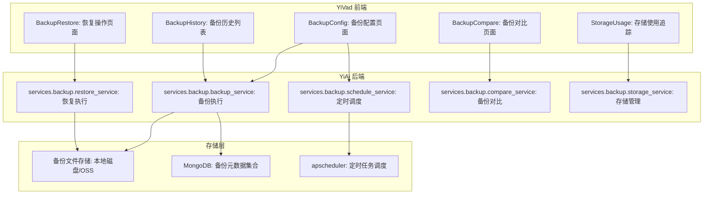
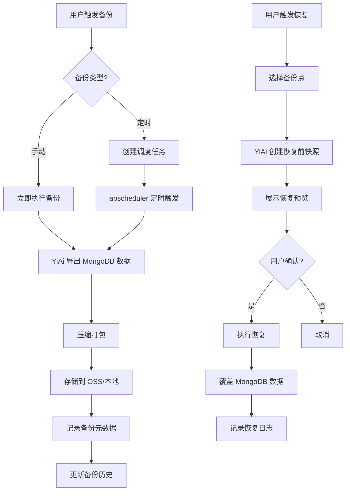

# YV-09-71: 数据备份恢复界面 — 备份配置、手动/定时备份、历史管理、一键恢复与存储追踪

> 需求编号：YV-09-71 · 优先级：P2 · 人天：0.3d · 状态：需求已编写
> 依赖：YiAi 后端数据备份 API（YA-09-100 数据库备份与恢复）

## 背景

### 问题陈述

YiVad 管理后台当前缺乏数据备份与恢复界面。所有数据（项目、模块、Issue、Bug、聊天会话）存储在 YiAi 后端 MongoDB 中，但用户无法自主管理备份。当前存在以下问题：

1. **无自主备份能力**：用户无法手动触发备份，依赖运维人员操作
2. **无定时备份**：无法设置自动备份策略，数据保护依赖人工
3. **备份历史不透明**：用户不知道何时做过备份、备份大小、是否成功
4. **恢复流程复杂**：恢复数据需要技术人员介入，无法自助完成
5. **无备份对比**：无法对比不同备份之间的数据差异
6. **存储空间不可控**：不知道备份占用了多少存储空间

**核心矛盾**：备份是数据安全的基础，但当前备份操作完全依赖后端技术人员，管理层用户无法自主管理。

### 影响范围

| # | 影响 | 严重程度 | 典型场景 |
|---|------|----------|----------|
| 1 | 无法自主备份 | 高 | 出现数据异常时无法回滚到上一个备份 |
| 2 | 备份策略缺失 | 中 | 数据丢失后才发现最近备份是 3 天前 |
| 3 | 恢复依赖技术 | 高 | 误删数据后需等待技术人员恢复 |
| 4 | 备份历史不可见 | 中 | 不知道备份是否成功执行 |
| 5 | 存储空间失控 | 低 | 备份文件累积占用过多磁盘空间 |

### 挑战

| 挑战 | 说明 |
|------|------|
| 后端依赖 | 需要 YiAi 提供备份/恢复/历史查询 API |
| 恢复风险 | 恢复操作会覆盖当前数据，需明确的确认和预览 |
| 定时调度 | 定时备份需后端支持 cron 表达式或调度系统 |
| 备份对比 | 对比两个备份的数据差异需要后端分析能力 |
| 权限控制 | 备份恢复是敏感操作，需按钮级权限控制 |

---

## 一、现状分析

### 1.1 当前备份能力现状

```
现有备份能力:
├── YiAi 后端
│   ├── YA-09-100 数据库备份与恢复（后端功能）
│   ├── 备份通过命令行或 API 触发
│   └── 无前端界面
├── YiVad 前端
│   ├── 无备份管理页面
│   ├── 无备份配置入口
│   └── 无恢复界面

缺失:
├── 备份配置界面            # ❌ 不存在
├── 手动备份触发            # ❌ 不存在
├── 定时备份设置            # ❌ 不存在
├── 备份历史列表            # ❌ 不存在
├── 恢复预览与确认          # ❌ 不存在
├── 备份下载                # ❌ 不存在
├── 备份对比                # ❌ 不存在
└── 存储使用追踪            # ❌ 不存在
```

### 1.2 根因矩阵

| 症状 | 根因 | 触发条件 | 频率 |
|------|------|----------|------|
| 无法自主备份 | 无前端备份界面 | 数据异常时 | 中 |
| 备份策略缺失 | 无定时备份配置 | 系统运行中 | 高 |
| 恢复依赖技术人员 | 无自助恢复界面 | 数据损坏时 | 中 |
| 备份历史不可见 | 无备份历史查询 | 需要确认备份状态 | 中 |
| 存储空间不可控 | 无存储追踪 | 长期运行 | 低 |

---

## 二、设计决策

### 决策 1：备份触发方式 — 纯手动 vs 纯定时 vs 手动 + 定时

| 选项 | 灵活性 | 可靠性 | 实现复杂度 |
|------|--------|--------|-----------|
| 纯手动 | 高 | 依赖用户记忆 | 低 |
| 纯定时 | 低 | 自动化保障 | 低 |
| 手动 + 定时 | 最高 | 最高 | 中 |

**选择：手动 + 定时。** 定时备份作为基础保障（每日/每周自动执行），手动备份用于关键操作前（如数据迁移、批量修改前）的即时备份。两者互补，最大化数据安全。

### 决策 2：恢复策略 — 直接覆盖 vs 预览后恢复 vs 恢复前自动备份

| 选项 | 安全性 | 用户体验 | 实现复杂度 |
|------|--------|----------|-----------|
| 直接覆盖 | 低 | 快 | 低 |
| 预览后恢复 | 中 | 好 | 中 |
| 恢复前自动备份 | 最高 | 最好 | 中 |

**选择：恢复前自动备份 + 预览确认。** 恢复操作前自动创建当前数据的备份（快照），确保恢复操作可逆。提供数据预览（恢复后的数据概览），用户确认后执行恢复。

### 决策 3：备份对比方式 — 摘要对比 vs 详细差异 vs 两者

| 选项 | 信息量 | 实用价值 | 实现复杂度 |
|------|--------|----------|-----------|
| 摘要对比（文档数/大小） | 低 | 中 | 低 |
| 详细差异（逐集合对比） | 高 | 高 | 中 |
| 两者结合 | 最高 | 最高 | 中 |

**选择：两者结合。** 摘要对比显示备份时间、文档总数、文件大小等概览。详细差异按集合展示新增/修改/删除的文档数，帮助用户判断是否需要恢复。

### 决策 4：备份存储策略 — 保留所有 vs 滚动保留 vs 智能保留

| 选项 | 存储占用 | 安全性 | 管理复杂度 |
|------|----------|--------|-----------|
| 保留所有 | 高 | 最高 | 低 |
| 滚动保留（最近 N 个） | 可控 | 中 | 中 |
| 智能保留（每日+每周+每月） | 优化 | 高 | 高 |

**选择：智能保留（可配置）。** 默认保留最近 7 天每日备份 + 最近 4 周每周备份 + 最近 12 月每月备份。用户可自定义保留策略。减少存储占用同时保留关键时间点的备份。

### 设计决策记录

| 决策 | 选项 A | 选项 B | 选项 C | 选择 | 理由 |
|------|--------|--------|--------|------|------|
| 备份触发 | 纯手动 | 纯定时 | 手动 + 定时 | **手动 + 定时** | 灵活性与可靠性兼顾 |
| 恢复策略 | 直接覆盖 | 预览后恢复 | 恢复前自动备份 | **自动备份 + 预览** | 恢复操作可逆 |
| 备份对比 | 摘要对比 | 详细差异 | 两者结合 | **两者结合** | 概览 + 细节 |
| 存储策略 | 保留所有 | 滚动保留 | 智能保留 | **智能保留** | 优化存储空间 |

---

## 三、目标架构

### 3.1 备份恢复系统架构



### 3.2 备份恢复数据流



### 3.3 性能指标

| 指标 | 改造前 | 改造后 |
|------|--------|--------|
| 手动备份触发 | 需运维操作 | 1 次点击，30s 内完成 |
| 备份历史查询 | 无 | < 200ms |
| 恢复预览 | 无 | < 1s |
| 恢复执行 | 需技术人员 | 确认后自动执行 |
| 存储追踪 | 无 | 实时显示各备份大小 |

---

## 四、具体改动

### 4.1 备份配置页面

```vue
<!-- src/views/backup/BackupConfig.vue (新增) -->

<script setup lang="ts">
import { ref, onMounted } from 'vue';
import ProTable from '@/components/ProTable/index.vue';
import { request } from '@/utils/request';

interface BackupConfig {
  enabled: boolean;
  schedule: 'daily' | 'weekly' | 'monthly' | 'custom';
  scheduleTime: string;
  cronExpression: string;
  retention: {
    daily: number;
    weekly: number;
    monthly: number;
  };
  collections: string[];
  storageLocation: string;
  compression: boolean;
}

const config = ref<BackupConfig>({
  enabled: false,
  schedule: 'daily',
  scheduleTime: '02:00',
  cronExpression: '',
  retention: { daily: 7, weekly: 4, monthly: 12 },
  collections: ['sessions', 'menus', 'bugs', 'static_files', 'knowledge_files', 'users'],
  storageLocation: 'local',
  compression: true,
});

const backupLoading = ref(false);
const backupResult = ref<{ message: string; success: boolean } | null>(null);

async function loadConfig() {
  const res = await request({
    module_name: 'services.backup.backup_service',
    method_name: 'get_config',
    parameters: {},
  });
  if (res.code === 0) config.value = res.data;
}

async function saveConfig() {
  await request({
    module_name: 'services.backup.backup_service',
    method_name: 'update_config',
    parameters: config.value,
  });
}

async function triggerBackup() {
  backupLoading.value = true;
  backupResult.value = null;
  try {
    const res = await request({
      module_name: 'services.backup.backup_service',
      method_name: 'create_backup',
      parameters: { type: 'manual' },
    });
    backupResult.value = {
      message: res.message,
      success: res.code === 0,
    };
  } finally {
    backupLoading.value = false;
  }
}

onMounted(() => loadConfig());
</script>

<template>
  <div class="backup-config">
    <el-card class="config-card">
      <template #header>
        <div class="card-header">
          <span>备份配置</span>
          <el-button type="primary" :loading="backupLoading" @click="triggerBackup">
            立即备份
          </el-button>
        </div>
      </template>

      <el-form :model="config" label-width="120px">
        <el-form-item label="启用定时备份">
          <el-switch v-model="config.enabled" @change="saveConfig" />
        </el-form-item>

        <el-form-item label="备份频率">
          <el-select v-model="config.schedule" :disabled="!config.enabled" @change="saveConfig">
            <el-option label="每天" value="daily" />
            <el-option label="每周" value="weekly" />
            <el-option label="每月" value="monthly" />
            <el-option label="自定义 Cron" value="custom" />
          </el-select>
        </el-form-item>

        <el-form-item v-if="config.schedule !== 'custom'" label="执行时间">
          <el-time-picker v-model="config.scheduleTime" format="HH:mm" @change="saveConfig" />
        </el-form-item>

        <el-form-item v-if="config.schedule === 'custom'" label="Cron 表达式">
          <el-input v-model="config.cronExpression" placeholder="0 2 * * *" @change="saveConfig" />
        </el-form-item>

        <el-form-item label="保留策略">
          <div class="retention-config">
            <span>每日备份保留</span>
            <el-input-number v-model="config.retention.daily" :min="1" :max="90" @change="saveConfig" />
            <span>天</span>
          </div>
          <div class="retention-config">
            <span>每周备份保留</span>
            <el-input-number v-model="config.retention.weekly" :min="1" :max="52" @change="saveConfig" />
            <span>周</span>
          </div>
          <div class="retention-config">
            <span>每月备份保留</span>
            <el-input-number v-model="config.retention.monthly" :min="1" :max="60" @change="saveConfig" />
            <span>月</span>
          </div>
        </el-form-item>

        <el-form-item label="备份集合">
          <el-checkbox-group v-model="config.collections" @change="saveConfig">
            <el-checkbox label="sessions">聊天会话</el-checkbox>
            <el-checkbox label="menus">菜单配置</el-checkbox>
            <el-checkbox label="bugs">缺陷追踪</el-checkbox>
            <el-checkbox label="static_files">静态文件</el-checkbox>
            <el-checkbox label="knowledge_files">知识库</el-checkbox>
            <el-checkbox label="users">用户账户</el-checkbox>
          </el-checkbox-group>
        </el-form-item>

        <el-form-item label="启用压缩">
          <el-switch v-model="config.compression" @change="saveConfig" />
        </el-form-item>
      </el-form>
    </el-card>

    <el-alert
      v-if="backupResult"
      :type="backupResult.success ? 'success' : 'error'"
      :title="backupResult.message"
      closable
      class="backup-result"
    />
  </div>
</template>
```

### 4.2 备份历史页面

```vue
<!-- src/views/backup/BackupHistory.vue (新增) -->

<script setup lang="ts">
import { ref } from 'vue';
import ProTable from '@/components/ProTable/index.vue';
import { request } from '@/utils/request';

interface BackupRecord {
  id: string;
  createdAt: string;
  type: 'manual' | 'scheduled';
  status: 'success' | 'failed' | 'in_progress';
  size: number;
  collections: string[];
  documentCount: number;
  duration: number;
  errorMessage?: string;
}

const columns = [
  { prop: 'createdAt', label: '备份时间', width: 180 },
  { prop: 'type', label: '类型', width: 80 },
  { prop: 'status', label: '状态', width: 100 },
  { prop: 'size', label: '大小', width: 100 },
  { prop: 'documentCount', label: '文档数', width: 80 },
  { prop: 'duration', label: '耗时', width: 80 },
  { prop: 'actions', label: '操作', width: 200 },
];

const restoreVisible = ref(false);
const selectedBackup = ref<BackupRecord | null>(null);
const restorePreview = ref<any>(null);
const restoreLoading = ref(false);

async function fetchData(params: any) {
  return await request({
    module_name: 'services.backup.backup_service',
    method_name: 'list_backups',
    parameters: { filter: params },
  });
}

async function handleDownload(row: BackupRecord) {
  const res = await request({
    module_name: 'services.backup.backup_service',
    method_name: 'download_backup',
    parameters: { backup_id: row.id },
  });
  // 触发文件下载
  const url = window.URL.createObjectURL(new Blob([res.data]));
  const a = document.createElement('a');
  a.href = url;
  a.download = `backup-${row.id}.zip`;
  a.click();
}

async function handleRestorePreview(row: BackupRecord) {
  selectedBackup.value = row;
  const res = await request({
    module_name: 'services.backup.restore_service',
    method_name: 'preview_restore',
    parameters: { backup_id: row.id },
  });
  restorePreview.value = res.data;
  restoreVisible.value = true;
}

async function handleConfirmRestore() {
  if (!selectedBackup.value) return;
  restoreLoading.value = true;
  try {
    await request({
      module_name: 'services.backup.restore_service',
      method_name: 'execute_restore',
      parameters: { backup_id: selectedBackup.value.id },
    });
    restoreVisible.value = false;
  } finally {
    restoreLoading.value = false;
  }
}

async function handleDeleteBackup(row: BackupRecord) {
  await request({
    module_name: 'services.backup.backup_service',
    method_name: 'delete_backup',
    parameters: { backup_id: row.id },
  });
}
</script>

<template>
  <div class="backup-history">
    <ProTable
      :columns="columns"
      :fetch-data="fetchData"
      :pagination="{ pageSize: 20 }"
    >
      <template #type="{ row }">
        <el-tag :type="row.type === 'manual' ? 'info' : ''">
          {{ row.type === 'manual' ? '手动' : '定时' }}
        </el-tag>
      </template>

      <template #status="{ row }">
        <el-tag :type="statusType(row.status)">
          {{ { success: '成功', failed: '失败', in_progress: '进行中' }[row.status] }}
        </el-tag>
      </template>

      <template #size="{ row }">
        {{ formatSize(row.size) }}
      </template>

      <template #duration="{ row }">
        {{ row.duration }}s
      </template>

      <template #actions="{ row }">
        <el-button v-if="row.status === 'success'" size="small" @click="handleDownload(row)">
          下载
        </el-button>
        <el-button v-if="row.status === 'success'" size="small" type="warning"
          @click="handleRestorePreview(row)">
          恢复
        </el-button>
        <el-button size="small" type="danger" @click="handleDeleteBackup(row)">
          删除
        </el-button>
      </template>
    </ProTable>

    <!-- 恢复预览对话框 -->
    <el-dialog v-model="restoreVisible" title="恢复预览" width="600px">
      <div v-if="restorePreview" class="restore-preview">
        <el-descriptions :column="2" border>
          <el-descriptions-item label="备份时间">{{ restorePreview.backupTime }}</el-descriptions-item>
          <el-descriptions-item label="文档总数">{{ restorePreview.totalDocuments }}</el-descriptions-item>
          <el-descriptions-item label="备份大小">{{ formatSize(restorePreview.size) }}</el-descriptions-item>
          <el-descriptions-item label="集合数">{{ restorePreview.collectionCount }}</el-descriptions-item>
        </el-descriptions>

        <h4>各集合恢复详情</h4>
        <el-table :data="restorePreview.collections" size="small">
          <el-table-column prop="name" label="集合" />
          <el-table-column prop="documentCount" label="文档数" />
          <el-table-column prop="willReplace" label="将替换现有数据">
            <template #default="{ row }">
              <el-tag :type="row.willReplace ? 'warning' : 'success'">
                {{ row.willReplace ? '是' : '否' }}
              </el-tag>
            </template>
          </el-table-column>
        </el-table>

        <el-alert type="warning" title="恢复操作将覆盖当前数据" :closable="false" show-icon
          description="恢复前将自动创建当前数据的快照备份，恢复操作可逆" />
      </div>

      <template #footer>
        <el-button @click="restoreVisible = false">取消</el-button>
        <el-button type="danger" :loading="restoreLoading" @click="handleConfirmRestore">
          确认恢复
        </el-button>
      </template>
    </el-dialog>
  </div>
</template>
```

### 4.3 备份对比页面

```vue
<!-- src/views/backup/BackupCompare.vue (新增) -->

<script setup lang="ts">
import { ref } from 'vue';
import { request } from '@/utils/request';

const backupA = ref('');
const backupB = ref('');
const backups = ref<any[]>([]);
const compareResult = ref<any>(null);

async function loadBackups() {
  const res = await request({
    module_name: 'services.backup.backup_service',
    method_name: 'list_backups',
    parameters: { filter: { status: 'success' } },
  });
  backups.value = res.data?.items || [];
}

async function handleCompare() {
  if (!backupA.value || !backupB.value) return;
  const res = await request({
    module_name: 'services.backup.compare_service',
    method_name: 'compare_backups',
    parameters: { backup_id_a: backupA.value, backup_id_b: backupB.value },
  });
  compareResult.value = res.data;
}
</script>

<template>
  <div class="backup-compare">
    <el-card>
      <template #header>备份对比</template>
      <div class="compare-selectors">
        <el-select v-model="backupA" placeholder="选择备份 A" @focus="loadBackups">
          <el-option v-for="b in backups" :key="b.id" :label="b.createdAt" :value="b.id" />
        </el-select>
        <span class="vs">VS</span>
        <el-select v-model="backupB" placeholder="选择备份 B">
          <el-option v-for="b in backups" :key="b.id" :label="b.createdAt" :value="b.id" />
        </el-select>
        <el-button type="primary" :disabled="!backupA || !backupB" @click="handleCompare">
          对比
        </el-button>
      </div>

      <div v-if="compareResult" class="compare-result">
        <el-table :data="compareResult.collections" size="small">
          <el-table-column prop="name" label="集合" />
          <el-table-column prop="added" label="新增文档" />
          <el-table-column prop="removed" label="删除文档" />
          <el-table-column prop="modified" label="修改文档" />
          <el-table-column prop="unchanged" label="未变更文档" />
          <el-table-column prop="sizeDiff" label="大小差异" />
        </el-table>
      </div>
    </el-card>
  </div>
</template>
```

### 4.4 存储使用追踪

```vue
<!-- src/views/backup/StorageUsage.vue (新增) -->

<script setup lang="ts">
import { ref, onMounted } from 'vue';
import { request } from '@/utils/request';

const storageInfo = ref({
  totalSize: 0,
  backupCount: 0,
  oldestBackup: '',
  newestBackup: '',
  usageTrend: [] as Array<{ date: string; size: number }>,
});

async function loadStorageInfo() {
  const res = await request({
    module_name: 'services.backup.storage_service',
    method_name: 'get_storage_info',
    parameters: {},
  });
  storageInfo.value = res.data;
}

onMounted(() => loadStorageInfo());
</script>
```

### 4.5 文件变更清单

| 文件 | 操作 | 说明 |
|------|------|------|
| `src/views/backup/BackupConfig.vue` | 新增 | 备份配置页面 |
| `src/views/backup/BackupHistory.vue` | 新增 | 备份历史列表 + 恢复操作 |
| `src/views/backup/BackupCompare.vue` | 新增 | 备份对比页面 |
| `src/views/backup/StorageUsage.vue` | 新增 | 存储使用追踪 |
| `src/router/routes.ts` | 修改 | 添加备份管理路由 |
| `src/utils/request.ts` | 修改 | 添加备份相关 API 方法 |
| `src/components/ProTable/index.vue` | 修改 | 支持备份历史表格列配置 |

---

## 五、实施步骤

| 步骤 | 操作 | 路径 | 验证 | 人天 |
|------|------|------|------|------|
| 1 | 实现备份配置页面 | `BackupConfig.vue` | 配置保存/加载正常，立即备份触发 | 0.05 |
| 2 | 实现备份历史列表 | `BackupHistory.vue` | ProTable 分页/排序/筛选正常 | 0.05 |
| 3 | 实现恢复预览对话框 | `BackupHistory.vue` | 预览数据正确，确认恢复执行 | 0.05 |
| 4 | 实现备份下载功能 | `BackupHistory.vue` | 文件下载触发，Blob 处理正确 | 0.03 |
| 5 | 实现备份对比页面 | `BackupCompare.vue` | 两个备份差异正确展示 | 0.04 |
| 6 | 实现存储使用追踪 | `StorageUsage.vue` | 存储大小、趋势图正确 | 0.04 |
| 7 | 添加路由和入口 | `routes.ts` | 路由正确，菜单入口可见 | 0.02 |
| 8 | 权限控制集成 | `v-auth` 指令 | 备份/恢复按钮按权限显示 | 0.02 |

**总人天：0.3d**

---

## 六、测试规格

### 场景 1：手动备份触发

**GIVEN** 用户进入备份配置页面，配置完整
**WHEN** 用户点击"立即备份"按钮
**THEN** 后端应开始备份操作，前端显示加载状态
**AND** 备份完成后显示成功提示，备份历史中新增一条记录
**AND** 备份状态为"成功"，包含备份大小和文档数

### 场景 2：定时备份配置

**GIVEN** 用户进入备份配置页面
**WHEN** 用户启用定时备份，选择"每天"频率，设置时间为 02:00
**THEN** 配置应保存到后端
**AND** 后端应在每天 02:00 自动执行备份
**AND** 备份历史中每天 02:00 左右新增一条记录

### 场景 3：备份恢复预览

**GIVEN** 备份历史中存在 3 个成功备份
**WHEN** 用户点击第二个备份的"恢复"按钮
**THEN** 应弹出恢复预览对话框，显示备份时间、文档总数、各集合详情
**AND** 应明确标注哪些集合将被替换
**AND** 应显示警告提示"恢复前将自动创建当前数据快照"

### 场景 4：备份恢复执行

**GIVEN** 用户在恢复预览对话框中确认恢复
**WHEN** 用户点击"确认恢复"
**THEN** 后端应首先创建当前数据快照备份
**AND** 然后执行恢复操作，覆盖当前数据
**AND** 恢复完成后显示成功提示，页面数据刷新

### 场景 5：备份对比

**GIVEN** 两个不同时间的备份，第二个比第一个多 50 个文档
**WHEN** 用户选择这两个备份并点击"对比"
**THEN** 应显示各集合的新增/删除/修改/未变更文档数
**AND** 应显示两个备份之间的大小差异
**AND** 新增文档数应从备份 A 到备份 B 为 50

### 场景 6：存储使用追踪

**GIVEN** 系统运行 30 天，有 30 个备份
**WHEN** 用户查看存储使用追踪页面
**THEN** 应显示总备份大小、备份数量、最早/最新备份时间
**AND** 应显示存储使用趋势图（按日期）
**AND** 应显示每个备份的详细大小

---

## 七、风险与缓解

| 风险 | 概率 | 影响 | 缓解措施 |
|------|------|------|----------|
| 后端 API 未就绪 | 中 | 高 | 前端使用 Mock 数据先行开发，后端 API 就绪后切换 |
| 恢复操作不可逆 | 低 | 高 | 恢复前自动创建快照备份，恢复操作可逆 |
| 大备份恢复超时 | 中 | 中 | 设置恢复超时时间 5 分钟，超时后提示用户检查状态 |
| 备份文件占用过大 | 中 | 中 | 智能保留策略自动清理过期备份，存储追踪提供预警 |

---

## 八、回滚策略

| 场景 | 回滚操作 | 影响 |
|------|----------|------|
| 备份功能异常 | 禁用备份功能入口，不显示备份菜单 | 失去备份能力 |
| 恢复操作导致数据异常 | 使用恢复前自动创建的快照备份恢复 | 数据可恢复 |
| 定时备份频率过高 | 调整 cron 表达式，降低备份频率 | 减少存储占用 |

---

## 九、设计决策记录

### D-01：备份触发方式

- **问题**：备份应由用户手动触发还是系统自动触发
- **选项**：纯手动、纯定时、手动 + 定时
- **选择**：手动 + 定时
- **理由**：定时保障基础数据安全，手动满足即时备份需求

### D-02：恢复安全机制

- **问题**：恢复操作如何保证安全性
- **选项**：直接覆盖、预览后恢复、恢复前自动备份
- **选择**：恢复前自动备份 + 预览确认
- **理由**：恢复操作可逆，用户有充分信息做决策

### D-03：备份保留策略

- **问题**：如何管理备份文件的生命周期
- **选项**：保留所有、滚动保留、智能保留
- **选择**：智能保留（可配置）
- **理由**：平衡存储空间和数据安全，覆盖不同时间粒度

### D-04：权限控制

- **问题**：备份恢复功能需要什么权限级别
- **选项**：所有用户、管理员、超级管理员
- **选择**：管理员及以上
- **理由**：备份恢复是敏感操作，需限制权限

---

## 十、可观测性

### 指标

| 指标 | 类型 | 说明 |
|------|------|------|
| `yivad.backup.manual_triggers` | Counter | 手动备份触发次数 |
| `yivad.backup.restore_executions` | Counter | 恢复执行次数 |
| `yivad.backup.config_changes` | Counter | 备份配置变更次数 |
| `yivad.backup.page_load_ms` | Histogram | 备份页面加载耗时 |

### 告警

| 告警 | 条件 | 级别 |
|------|------|------|
| 后端 API 不可用 | 备份相关 API 连续失败 | ERROR |
| 恢复操作失败 | 恢复执行返回错误 | ERROR |
| 存储空间不足 | 备份存储 > 90%配额 | WARNING |

---

## 十一、代码审查检查清单

- [ ] 备份配置页面表单验证完整，必填字段有校验
- [ ] 立即备份按钮有 loading 状态，防止重复点击
- [ ] 备份历史列表 ProTable 分页/排序/筛选功能正常
- [ ] 恢复预览对话框信息完整，包含警告提示
- [ ] 恢复确认按钮有明显危险样式（红色），防止误操作
- [ ] 备份下载使用 Blob 方式，正确处理文件流
- [ ] 备份对比页面两个选择器互斥，防止选择相同备份
- [ ] 存储使用追踪页面图表渲染正确
- [ ] 权限控制使用 `v-auth` 指令，无权限按钮不显示
- [ ] 所有 API 调用使用 RPC 信封格式，参数名称正确
- [ ] 错误处理完整，API 失败时显示友好提示
- [ ] 路由配置正确，面包屑导航正确

---

## 回归问题预测

| # | 预测问题 | 原因 | 验证方法 |
|---|---------|------|---------|
| 1 | 用户点击"立即备份"后，后端执行时间较长（>30s），前端超时提示"备份失败"，但后端实际备份成功，用户在历史列表中看到重复的备份记录 | 后端备份是异步操作，前端 fetch 设置了 30s 超时，超时后前端认为失败，但后端仍在执行 | 备份 API 改为异步模式：前端提交备份请求后立即返回 task_id，轮询任务状态；或在 ProTable 中显示"进行中"状态的备份，自动刷新列表 |
| 2 | 恢复预览对话框中显示"将替换现有数据"的集合，用户确认恢复后，发现某些集合的数据没有完全恢复，有部分文档丢失 | 备份文件可能因存储问题部分损坏，或恢复过程中 MongoDB 写入失败部分文档 | 恢复完成后校验恢复结果：对比备份文件中的文档数与恢复后的文档数，不一致时告警并提示用户 |
| 3 | 备份对比功能中，用户选择了两个相隔 30 天的备份，差异数据量很大（>10000 条），前端渲染对比结果表格时页面卡死 | 大量数据的表格渲染（el-table 渲染 >10000 行）导致 DOM 节点过多，浏览器内存占用激增 | 对比结果表格使用虚拟滚动（el-table-v2 或自定义虚拟滚动），仅渲染可视区域内的行；默认显示摘要对比，详细差异按需加载 |
| 4 | 定时备份配置中的 cron 表达式校验不严格，用户输入了无效的 cron 表达式（如 `0 0 0 0 0`），后端在解析时抛出异常，但前端未收到错误，用户以为配置成功 | 前端未对 cron 表达式做基本格式校验，后端解析失败后静默忽略 | 前端对 cron 表达式做基本校验（5 个字段，每个字段范围正确）；后端返回配置错误时前端显示具体错误信息 |
| 5 | 用户下载备份文件时，浏览器下载了一个 ZIP 文件但无法解压，提示文件损坏 | 后端返回的备份文件流在通过 fetch 传输时可能被截断或编码错误（如未正确处理二进制数据） | 前端 fetch 时设置 `responseType: 'blob'` 并检查 Content-Length 与实际文件大小一致；后端返回 Content-Disposition 和正确的 Content-Type |
| 6 | 存储使用追踪页面中，趋势图显示备份大小持续增长，但用户看不到任何自动清理的迹象，担心存储空间耗尽 | 智能保留策略的清理是后端异步执行的，前端趋势图反映的是清理前的数据，可能存在延迟 | 在趋势图中标注清理事件的时间点；添加"预计下次清理时间"和"清理后预计大小"的预估信息 |

---

## 性能分析

### 各操作耗时

| 阶段 | 预估耗时 | 说明 |
|------|----------|------|
| 备份配置加载 | < 100ms | GET API 请求 |
| 备份历史列表加载 | < 200ms | ProTable 分页查询 |
| 立即备份触发（API） | < 500ms | 异步操作，仅返回 task_id |
| 恢复预览加载 | < 500ms | 后端分析备份文件 |
| 备份对比计算 | < 1s | 后端对比两个备份 |
| 备份文件下载 | 取决于文件大小 | 流式传输 |

### 组件体积

| 组件 | 体积 | 说明 |
|------|------|------|
| BackupConfig.vue | ~5KB | 表单 + 配置 |
| BackupHistory.vue | ~8KB | ProTable + 恢复对话框 |
| BackupCompare.vue | ~4KB | 选择器 + 表格 |
| StorageUsage.vue | ~3KB | 统计信息 + 图表 |

### 对页面加载的影响

| 因素 | 影响 | 说明 |
|------|------|------|
| 路由懒加载 | 0 | 备份页面按需加载 |
| 图表库（ECharts） | 已存在 | 复用项目已有 ECharts |
| API 请求 | < 200ms | 首次加载备份历史 |

